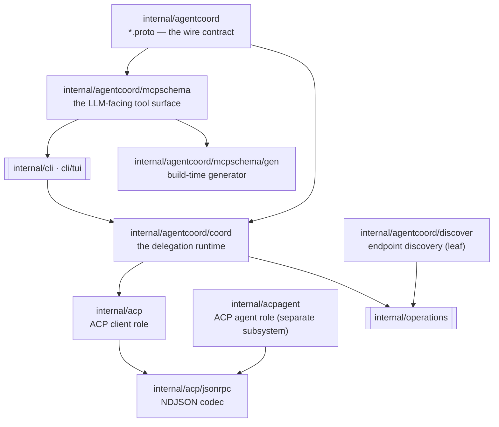

# `internal/agentcoord` + `internal/acp` — architecture

Agent delegation and the Agent Client Protocol. Written so a future session can reason
about this subsystem's design without re-reading the source; every claim carries a
`file:line`. Base commit `0f59fbae`.

| Page | Purpose |
|---|---|
| [overview.md](overview.md) | What the subsystem is, its process topology, the coordinator→spawn→mailbox→report→artifact message flow, the ten system-wide invariants, and an index of every documented-vs-real divergence |
| [wire-contract.md](wire-contract.md) | `agentcoord.v1`: the three gRPC services, the three planes, message families, proto3 enum zero-value polarity, the dead surface, and the contracts the protos assert but the code does not implement |
| [coordinator-core.md](coordinator-core.md) | The `Coordinator` object: the four append-only journals, the fsync-before-apply durability engine, the six folds and the fact vocabulary, bearer credentials and `Identity`, lifecycle and state directory |
| [child-lifecycle.md](child-lifecycle.md) | `agent_run` → enqueue → execution slot → spawn → turn loop → exactly-once terminal; the two launch drivers, the retry/stop gate, one-shot driving, and the owner-owned container run |
| [mailbox.md](mailbox.md) | The durable at-least-once message queue: addressing rules (children address only "parent"), `message_id` dedupe, cursor-ack, the runtime reservation ledger, and both delivery paths |
| [approvals.md](approvals.md) | The escalation ladder: rung matching, relay-and-park, the decode-before-consume reply rule, the for-session accept cache, and the fail-closed decision allow-list |
| [artifacts.md](artifacts.md) | `agent_report` filings and their fold, the items-journal checkpoint, and the content-addressed artifact store with its sha256-verified transfer service |
| [transport.md](transport.md) | The gRPC server and auth interceptors, `RunChannel`/`RunnerChannel`, the runner-side `Home`/`RunnerLink`/`EngineHost`, the `HarnessSpec` launch contract, and listener/endpoint plumbing |
| [observation.md](observation.md) | The read-only plane: the roster projection, live event fan-out, consumer credentials, out-of-process endpoint discovery, and the liveness watchdog |
| [mcp-tool-surface.md](mcp-tool-surface.md) | `mcpschema`: the tool→proto binding table, the JSON Schema projector, the routing table and leaf trust gate, and the generator plus its drift gates |
| [acp-client.md](acp-client.md) | `internal/acp`: driving an `<engine> acp` subprocess in the client role — config, host and container transports, the session driver, wire→IR mapping, one-shot `Execute` |
| [acp-jsonrpc.md](acp-jsonrpc.md) | `internal/acp/jsonrpc`: the NDJSON JSON-RPC 2.0 codec that frames, multiplexes and correlates for both the client and agent roles |

## Package map

`discover` is deliberately a leaf: `coord` imports `operations`, so `operations` cannot
import `coord`.
