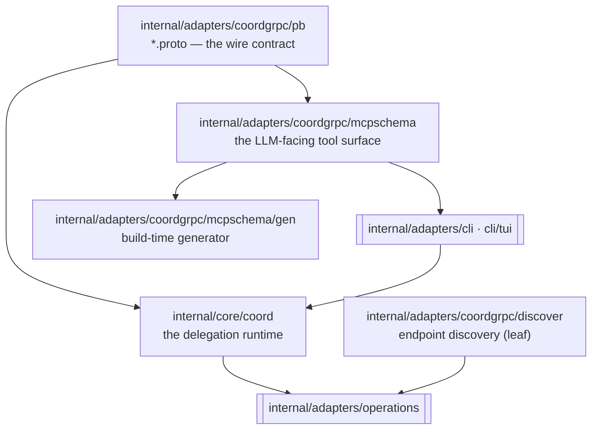

# Agent coordination — `internal/core/coord`, `internal/core/spool`, `internal/adapters/coordgrpc` — architecture

Agent delegation. Written so a future session can reason
about this subsystem's design without re-reading the source; every claim names
the symbol it rests on, so `git grep` settles whether it still holds.

| Page | Purpose |
|---|---|
| [overview.md](overview.md) | What the subsystem is, its process topology, the wire planes as the proto declares them, the spool message flow (spawn, mail in both directions, report and artifact), and the system-wide invariants cited by symbol. Known gaps live in the task log (`area:bus`), not in the page. |
| [wire-contract.md](wire-contract.md) | `agentcoord.v1`: the three gRPC services, the three planes, message families, proto3 enum zero-value polarity, the dead surface, and the contracts the protos assert but the code does not implement |
| [coordinator-core.md](coordinator-core.md) | The `Coordinator` object: the four append-only journals, the fsync-before-apply durability engine, the six folds and the fact vocabulary, bearer credentials and `Identity`, lifecycle and state directory |
| [child-lifecycle.md](child-lifecycle.md) | `agent_run` → enqueue → execution slot → spawn → turn loop → exactly-once terminal; the two launch drivers, the retry/stop gate, one-shot driving, and the owner-owned container run |
| [artifacts.md](artifacts.md) | `agent_report` filings and their fold, the items-journal checkpoint, and the content-addressed artifact store with its sha256-verified transfer service |
| [transport.md](transport.md) | The gRPC server and auth interceptors, `RunChannel`/`RunnerChannel`, the runner-side `Home`/`RunnerLink`/`EngineHost`, the launch on the wire (`coordgrpc.EncodeLaunch`/`DecodeLaunch`, `runner.Execute`), and listener/endpoint plumbing |
| [observation.md](observation.md) | The read-only plane: the roster projection, live event fan-out, consumer credentials, out-of-process endpoint discovery, and the liveness watchdog |
| [mcp-tool-surface.md](mcp-tool-surface.md) | `mcpschema`: the tool→proto binding table, the JSON Schema projector, the routing table and leaf trust gate, and the generator plus its drift gates |

## Package map

```mermaid
flowchart TD
  PROTO["internal/adapters/coordgrpc/pb<br/>*.proto — the wire contract"]
  COORD["internal/core/coord<br/>the delegation runtime"]
  SCHEMA["internal/adapters/coordgrpc/mcpschema<br/>the LLM-facing tool surface"]
  GEN["internal/adapters/coordgrpc/mcpschema/gen<br/>build-time generator"]
  DISC["internal/adapters/coordgrpc/discover<br/>endpoint discovery (leaf)"]
  OPS[["internal/adapters/operations"]]
  CLI[["internal/adapters/cli · cli/tui"]]

  PROTO --> COORD
  PROTO --> SCHEMA --> GEN
  SCHEMA --> CLI
  COORD --> OPS
  DISC --> OPS
  CLI --> COORD
```

`discover` is deliberately a leaf: `coord` imports `operations`, so `operations` cannot
import `coord`.
