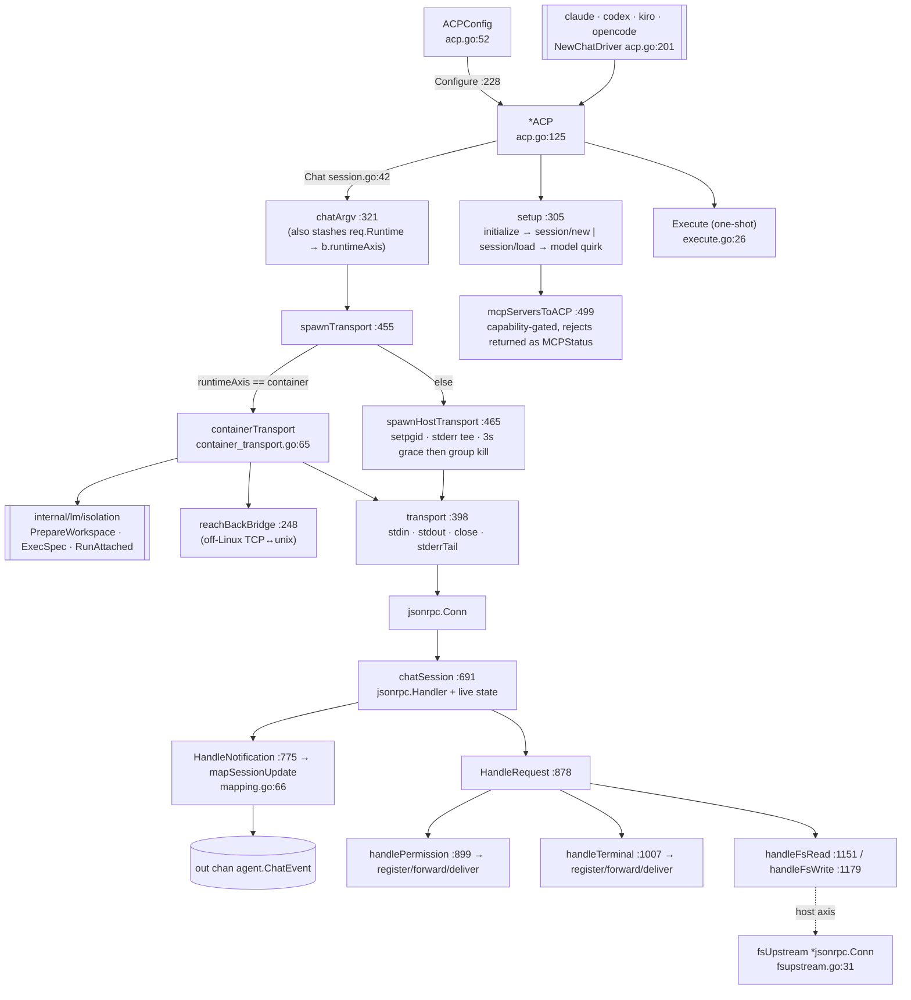

# ACP client — `internal/acp`

`internal/acp` is ctxloom's **client-role** implementation of the Agent Client Protocol:
it spawns an `<engine> acp` subprocess (on the host, or attached inside a container),
handshakes, runs each user turn as a `session/prompt`, streams the agent's
`session/update` notifications out as backend-agnostic `agent.ChatEvent`s, and answers
the agent's callbacks (`session/request_permission`, `fs/read_text_file`,
`fs/write_text_file`, `terminal/*`). It is the `agent.StructuredChat` implementation for
`internal/claude`, `internal/codex`, `internal/kiro` and `internal/opencode`, all of
which build an `ACPConfig` and call `acp.NewChatDriver(...).Chat(...)`, plus the generic
`type: acp` backend registered at `lm/backends/registry.go:394`.

`internal/acpagent` is the mirror image — ctxloom playing the **agent** role toward a
real editor — so this package's outbound shape is half of a public protocol contract.
Framing is owned by [`internal/acp/jsonrpc`](acp-jsonrpc.md).

## Types

| Type | file:line | Role |
|---|---|---|
| `ACPConfig` | `acp.go:52` | the decoded `type: acp` config: `Command`, `BinaryPath`, `Args`, `Env`, `StripEnv` (invocation); `Agent`, `AgentEngine`, `Model` (argv flags); `ModelEnvVar`, `ModelConfigKey`, `Reasoning*` (per-adapter delivery quirks, documented as removable when the adapters are fixed) |
| `ACP` | `acp.go:125` | the backend object; embeds `agent.LaunchBackend` and holds the `Configure`-applied knobs plus four test seams (`openTransport`, `now`, `containerImage`, `shutdownGrace`) |
| `transport` | `acp.go:398` | the I/O seam for one conversation: `stdin`, `stdout`, `close`, `stderrTail` |
| `transportFunc` | `acp.go:446` | the injection point every ACP unit test depends on |
| `reachBackBridge` | `container_transport.go:248` | off-Linux TCP↔unix proxy so an in-container MCP shim can dial the host runner's socket |
| `engineCapabilities` | `session.go:272` | what the engine's `initialize` response advertised: `Prompt`, `Mcp`, `AuthMethods`, `LoadSession` (`Session` and `Auth` are stored and never read) |
| `chatSession` | `session.go:691` | the `jsonrpc.Handler` for one conversation plus all its live state: `out`/`clock`, capabilities, the permission broker, the terminal broker, usage accumulation, `fsUpstream` |
| `quirkSetModelParams` | `session.go:475` | hand-rolled body for claude-code-acp's unstable, version-gated `session/set_model` |
| `permissionOutcome` / `permissionResult` | `mapping.go:308,315` | the JSON body of a `session/request_permission` reply |

## Key functions

| Function | file:line | Contract |
|---|---|---|
| `NewChatDriver` / `NewACP` | `acp.go:201,208` | construct and configure the driver a target backend embeds |
| `ACP.Configure` | `acp.go:228` | applies the decoded config; defaults the CLAUDECODE strip and `ANTHROPIC_MODEL` for `agent_engine: claude`; adopts `Command`'s first field as the binary |
| `ACP.chatArgv` | `acp.go:321` | builds the spawn argv **and** stashes `req.Runtime` into `b.runtimeAxis` |
| `ACP.spawnTransport` / `spawnHostTransport` | `acp.go:455,465` | routes host vs container; the host path pipes stdio, sets the process group, tees stderr, and on close waits `DefaultShutdownGrace` (3s) after stdin EOF before a group kill — because claude-code-acp flushes its native transcript asynchronously |
| `withEngineStderr` | `acp.go:435` | wraps a non-nil error with the engine's stderr tail, preserving `%w` |
| `ACP.containerTransport` | `container_transport.go:65` | runtime probe → `NewContainerFor` → `PrepareWorkspace` → reach-back → `ExecSpec` → `RunAttached`, with staged cleanup; every error carries an actionable fix and there is no degraded escape hatch |
| `containerReachBackEnv` | `container_transport.go:203` | builds env + mount (Linux) or a TCP bridge (elsewhere) for `CTXLOOM_MCP_SOCKET` |
| `ACP.Chat` | `session.go:42` | the whole conversation: open transport, build the session, dial fs-upstream, start the connection, `setup`, then the select loop over ctx / turn completion / inbound messages |
| `ACP.setup` | `session.go:305` | `initialize` with a **strict** protocol-version equality check, then `session/new` or `session/load`, then the model quirk; `auth_required` is rewritten into an actionable error naming the available auth methods |
| `mcpServersToACP` | `session.go:499` | maps caller MCP servers to the wire shape, capability-gating http/sse and returning every rejection as a named `MCPStatus` the user sees |
| `ACP.promptAsync` | `session.go:550` | writes `session/prompt` synchronously and returns an await for the stop reason — the split is what lets a `session/cancel` be ordered strictly after the prompt |
| `chatSession.deliverBlock` | `session.go:607` | per-block capability gate, with `flattenedBlockWarning` producing a visible placeholder rather than a silent drop |
| `chatSession.HandleRequest` | `session.go:878` | inbound dispatch; unknown methods get a proper `-32601` |
| `stripSessionID` | `session.go:1119` | removes `sessionId` from relayed terminal params — the editor must never see the engine's session id |
| `chatSession.inputClosed` | `session.go:980` | marks both brokers closed and resolves every parked request, so nothing hangs after teardown |
| `mapSessionUpdate` | `mapping.go:66` | dispatches the discriminator-less `SessionUpdate` union on which pointer is non-nil; unknown variants drop by design |
| `mapToolCall` / `mapToolCallUpdate` / `mapPlan` / `textEntry` | `mapping.go:150,177,223,134` | ACP wire → ctxloom IR entries |
| `permissionRequestEvent` / `decidePermission` / `pickOption` | `mapping.go:323,348,357` | forward the request with its options verbatim; allow/reject picks a matching option, else `cancelled` |
| `ACP.Execute` | `execute.go:26` | the one-shot projection: one `Chat`, assistant chunks to stdout, thinking and tool output to stderr at verbosity ≥16 |
| `dialFsUpstream` | `fsupstream.go:31` | dials the acpagent fs reach-back socket; the caller degrades with a warning when it fails |
| `setpgid` / `killProcessGroup` | `procgroup_unix.go:19,32`, `procgroup_windows.go:13,18` | the build-tag pair; the unix version tolerates ESRCH, the Windows version kills only the direct child |

`surfaces.go` contains **no code** — 44 lines recording that the generic ACP backend
deliberately materializes no filesystem surfaces, because its loadout rides
`session/prompt` and `session/new`'s `mcpServers` instead.

## Contracts

| # | Contract | Where |
|---|---|---|
| C1 | Protocol version must match exactly; a mismatch fails loudly and never silently continues | `session.go:346-351` |
| C2 | MCP servers the engine cannot accept are reported back as named `MCPStatus` entries, never dropped | `session.go:499-532` |
| C3 | Content blocks the engine cannot accept are flattened to a visible placeholder plus a warning | `session.go:665` |
| C4 | Every inbound `session/request_permission` and `terminal/*` gets exactly one reply — including on teardown | `session.go:934,1040,980` |
| C5 | The editor never learns the engine's session id | `session.go:1119` |
| C6 | One `*ACP` serves exactly one `Chat` call (convention, not enforced by the type) | `acp.go:154-165` |
| C7 | The host transport gives the engine a bounded shutdown grace before force-kill | `acp.go:507-535` |

## Divergences and real behaviour

- ~~**The container transport is unreachable on the go-plugin path.**~~ **RESOLVED
  `40b49a7f`.** `spawnTransport` branches on `b.runtimeAxis`, set from `req.Runtime`
  (`acp.go:329`), and `ChatStart` now carries `runtime = 9` so `chatStartFromProto`
  reconstructs it. Until then the proto had **no runtime field** and `Runtime` always
  came back `""`, while `engine_session.go` computed its isolation banner from the
  **host-side** local variable — so a session announced as "isolated inside a
  container" ran as a plain host subprocess, with no compensating env carrier.
- ~~**`session/load` resume is unreachable the same way.**~~ **RESOLVED `40b49a7f`**
  — `ChatStart.resume_session_id = 10`, with `ChatSessionInfo.session_id` /
  `.resumable` as the return half. The guard at `session.go:373` (which refuses a
  resume the engine cannot honour) can now fire on this path; before, a one-shot
  resume silently started a fresh session. The **in-process** path was never affected:
  `coord/harnessspec.go:176` sets `ResumeSessionID` and `coord/enginehost.go:311`
  calls `backend.Chat` directly with no proto conversion.
- ~~**The fs handlers serve any absolute host path with no confinement.**~~ **RESOLVED
  `73ea8d7f` (T13).** Both handlers funnel through `confineToWorkspace`
  (`internal/acp/fsconfine.go`) **before** branching on the fs upstream — an
  unconfined upstream would otherwise have been a trivial bypass. The root is
  `agent.ChatRequest.WorkDir`, the same value handed to the engine subprocess as
  `cmd.Dir`, so the boundary and the engine's cwd cannot drift. Fail-closed
  throughout: symlinks resolved on both root and candidate including dangling links,
  and unresolvable root / unreadable ancestor / stat error / symlink loops all deny.
  Relative paths are **refused** rather than resolved — the ACP schema types `path` as
  absolute, and resolving against the process cwd *is* the defect.
  **The ordering mattered and is worth remembering:** repairing the `Runtime` wire
  drop *activates* this hole, so confinement landed first (`73ea8d7f`) and the wire
  fix second (`40b49a7f`). Fixing the more obvious bug first would have opened a
  vulnerability.
  **Still open (taskloom `loud-guide`):** `internal/acpagent/fsupstream.go`'s relay is
  itself unconfined and its unix socket is locally callable; there is a TOCTOU between
  check and syscall (needs `openat2` `RESOLVE_BENEATH`); and `setup` still advertises
  `Fs{ReadTextFile: true, WriteTextFile: true}` unconditionally (`session.go:338`).
- **`Chat`'s `defer close(out)` races the forward goroutines it never joins.**
  `teardown` waits only for `<-conn.Done()`; `handlePermission` and `handleTerminal`
  spawn `go s.forwardPermission(...)` / `go s.forwardTerminal(...)` (`session.go:906,1009`)
  and nothing waits for them. `send`'s select on a closed `out` panics.
- **`sliceLines` panics on a negative `limit`** (`session.go:1236-1253`,
  `end = start + *limit` unguarded), on the jsonrpc read-loop goroutine, which has no
  `recover`. `limit == 0` and an offset past EOF return `""` as a successful read.
- **An empty `ChatMessage` is delivered as one empty text block**
  (`session.go:589-592`), so a turn runs on zero bytes and returns a normal completion.
- **`deliverBlock`'s `default` branch flattens any unrecognized block kind to
  `TextBlock(b.Text)`** — empty text for an unknown kind — while the function's doc
  promises never a silent drop (`session.go:636-637`).
- **The flatten placeholder can state a false reason**: when the engine *did* advertise
  the capability but `decodeACPBlock` failed, the message still says "the connected
  engine does not advertise image support" (`session.go:665-668`).
- **The engine's process exit status is discarded at every site**: `teardown` does
  `_ = conn.Close()` (`session.go:98`) and the clean path returns `nil` (`:190`), so an
  adapter that crashes on exit reports success.
- **Per-turn usage carries cumulative session figures.** `TurnMeta.CostUSD` receives the
  SDK's *cumulative session cost* and `TurnMeta.InputTokens` receives *tokens currently in
  context* (`session.go:860-867`); nothing sums them today, so this is a labelling
  divergence rather than an active miscount.
- **`Execute` returns `ExitCode: 0` on a turn that wrote zero assistant bytes**
  (`execute.go:69-94`); `wroteText` is used only to decide a trailing newline, and
  `ev.Complete`'s stop reason is never inspected. A nil prompt is sent as an empty message.
- ~~**`acpSessionHistory.ListSessions` returns `(nil, nil)`**, an empty list presented as
  success, while its siblings return "acp session history not yet supported".~~ —
  **RESOLVED `46d713d5`** (U011-F02). The placeholder `SessionHistory` is gone: `NewACP`
  passes `nil`, the same declaration every other engine makes, so a caller is told
  "backend acp has no session history" rather than receiving an empty list it cannot
  distinguish from a workspace that genuinely has none (`capabilities.go:11-14`,
  pinned by `sessionhistory_test.go`).
- **`acpCommands.RegisterFromContent` accepts a command slice, writes nothing and
  returns nil** (`capabilities.go:21`); `LaunchBackend.commands` is written at
  `launch_backend.go:92` and read nowhere in the repo.
- **`ACP.Configure` silently returns on a type-assertion failure** (`acp.go:230-232`),
  leaving an unconfigured backend whose failure surfaces later as an opaque `exec` error.
- **`containerReachBackEnv` returns all-nil when `CTXLOOM_MCP_SOCKET` is unset**
  (`container_transport.go:206`) with no warning, so a containerized engine would get no
  ctxloom MCP surface at all while the session still opens successfully.
- **The container transport has no shutdown grace**: its `close` calls `ac.Close()`
  immediately and `isolation/attach.go:95-109` runs `docker rm -f` without waiting, so a
  containerized adapter reproduces the transcript-truncation the host path's 3s grace was
  added to fix — and the container is force-removed, so the evidence goes too.
- **Three cross-package constants are hand-duplicated with "keep in sync" comments and
  no test binding them**: `mcpSocketEnvVar` (`container_transport.go:22`),
  `reachBackTCPPrefix` (`:227`), `fsUpstreamEnvVar` (`fsupstream.go:25`).
- **`reachBackBridge.pipe` returns silently when it cannot dial the unix socket**
  (`container_transport.go:285-290`); the in-container shim sees an unexplained reset.
- **`CancelTurn` with no turn in flight is silently discarded** (`session.go:229-232`),
  and the `queued` message slice grows without bound during a long turn (`:234`).
