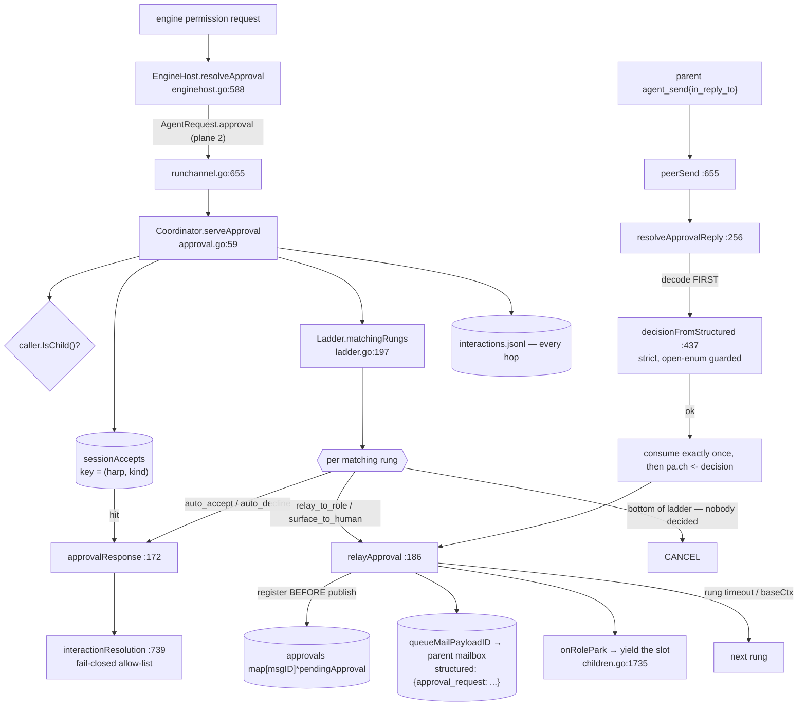

# Approvals — the escalation ladder

When a child engine asks for a tool permission, the coordinator answers by walking that
child's **escalation ladder**: an ordered list of rungs, each matching a set of approval
kinds and taking one action (auto-accept, auto-decline, relay to a role, surface to a
human). Every hop is journaled to the audit journal, and the walk always terminates in a
decision — never a hang. Resolution is a **fail-closed allow-list**: only `ACCEPT` and
`ACCEPT_FOR_SESSION` grant.

The ladder is pure value-domain code (`ladder.go` has no `*Coordinator` receiver and
never touches `c.mu`); the parking, relay and reply machinery is `approval.go`.

## Types

| Type | file:line | Role |
|---|---|---|
| `LadderAction` | `ladder.go:24` | `auto_accept` \| `auto_decline` \| `relay_to_role` \| `surface_to_human` |
| `LadderRung` | `ladder.go:36` | `Kinds []ApprovalKind`, `Action`, `Role`, `Timeout`. **Empty `Kinds` means catch-all** (`ladder.go:183-185`) |
| `Ladder` | `ladder.go:48` | ordered rung list — the whole escalation policy for one agent; fixed at enqueue, journaled with the run |
| `pendingApproval` | `approval.go:31` | one outstanding relay rung, parked on the mailbox message id it was relayed as; `targetHarp` gates who may answer, `ch` is buffered(1) |
| `sessionAcceptKey` | `approval.go:50` | the `ACCEPT_FOR_SESSION` cache key `(harp, kind)` — keyed by **harp**, not run id, so a grant survives a resume and cannot leak to a peer |

## Functions

| Function | file:line | Contract |
|---|---|---|
| `presetLadder` | `ladder.go:94` | maps a `PermissionMode` to a degenerate ladder |
| `buildLadder` | `ladder.go:119` | validates and converts raw YAML rungs; every rejection names the agent, the index and the legal set |
| `Ladder.matchingRungs` | `ladder.go:197` | filters rungs by kind, in declaration order |
| `ladderToFact` / `ladderFromFact` | `ladder.go:222,244` | the durable projection and its inverse |
| `approvalKindName` | `ladder.go:212` | inverse of the short-name table, falling back to `k.String()` |
| `Coordinator.serveApproval` | `approval.go:59` | the plane-2 handler: caller must be a child, load the `RunRecord`, short-circuit on the for-session cache, walk matching rungs journaling every hop, bottom out at CANCEL (nobody decided) |
| `Coordinator.relayApproval` | `approval.go:186` | mint a message id, **register the pending approval before queuing the mail**, queue, then wait on the channel / rung timeout / `baseCtx` |
| `Coordinator.resolveApprovalReply` | `approval.go:256` | intercept a parent's `agent_send` with `in_reply_to`; verify the caller is the addressed target, **decode, then consume exactly once**, re-checking the map under the lock |
| `decisionFromStructured` | `approval.go:437` | strict decode: rejects empty, unknown fields, out-of-vocabulary enum ints, and `UNSPECIFIED`. Four distinct actionable rejections; the open-enum guard at `:449` closes a real fail-open hole |
| `stripEnvelopeKeys` | `approval.go:386` | removes envelope-only keys (`kind`) before decoding, returning the input untouched on any marshal failure so protojson produces the authoritative error |
| `decisionVocabulary` / `decisionShape` | `approval.go:411,427` | render the legal decision names from the generated table, so the diagnostic cannot drift |
| `approvalRequestStructured` | `approval.go:365` | protojson-marshals the request and nests it under `"approval_request"` |
| `sessionAccepted` / `cacheSessionAccept` / `clearSessionAccepts` | `approval.go:314,326,351` | read, write (downgrading `ACCEPT_FOR_SESSION` to a plain `ACCEPT`), and clear on `CauseStopped` |
| `approvalResolution` | `approval.go:161` | maps a decision onto the audit vocabulary by delegating to `interactionResolution` — the single-definition guarantee that the two audit trails agree |
| `EngineHost.resolveApproval` | `enginehost.go:588` | runner side: forward the request, await the decision, pick the engine's option id, record an `InteractionRecorded` |
| `interactionResolution` | `enginehost.go:739` | the security-load-bearing allow-list |
| `classifyApprovalKind` | `enginehost.go:698` | ACP tool kind → `ApprovalKind`, defaulting to `TOOL_USE` so nothing is silently unbucketed |
| `pickPermissionOption` | `enginehost.go:755` | decision → engine option id; `""` is documented as the engine's cancelled no-op |

## Invariants

| # | Invariant | Where |
|---|---|---|
| A1 | Every exit path from `serveApproval` is a decision, never a hang | `approval.go:59-160` |
| A2 | `relayApproval` registers the pending approval **before** publishing the mail, so a fast reply cannot arrive before the slot exists (incident `pulpy-whiff`) | `approval.go:199-210` |
| A3 | Only the exact harp the relay was addressed to may answer it | `approval.go:258-261` |
| A4 | A reply is decoded **before** the pending approval is consumed: an unusable reply leaves the approval outstanding and answerable, and writes an audit fact naming the failure | `approval.go:264-283` |
| A5 | A reply that loses the consume race is reported as "already answered, or its rung timed out", never as a decision that reached nobody | `approval.go:293-300` |
| A6 | Only `ACCEPT` / `ACCEPT_FOR_SESSION` grant; error, non-OK status, `DECISION_UNSPECIFIED` and any unknown proto3 enum value all reject | `enginehost.go:739`, `approval.go:452` |
| A7 | A child parked on an approval yields its execution slot | `approval.go:117-119` → `children.go:1735` |
| A8 | The for-session cache is keyed by harp, so one child's grant cannot leak to a sibling and survives a resume | `approval.go:50`, and its 14-line rationale |

A4 is the fix for a live incident recorded in the code: consuming first and decoding
second permanently burned the correlation on one unusable reply, after which the retry
found nothing registered, fell through to ordinary chat mail and reported
`DELIVERY_QUEUED` — success — while the child sat out its whole relay timeout.

## Concurrency

Approval state is **correctly partitioned**: `c.approvals` is keyed by a freshly minted
unique message id and every access is under `c.mu`; `c.sessionAccepts` is keyed by harp.
Neither is a concurrent-children hazard.

## Divergences and real behaviour

- **The audit journal fails open while enforcement fails closed.** `audit`
  (`coordinator.go:565`) warns and proceeds by design, and `approval.go`'s header
  (`:17-26`) states the journal exists so "which rung answered" is queryable without a
  live consumer. `relayApproval` returns `(nil, true)` — recorded as
  `resolution: "timed_out"` — for three failures that are not timeouts: a missing
  `rec.ParentHarp` (`:189`), a structured-payload encode failure (`:194`) and a
  mail-queue failure (`:228`).
- **An approval reply can be silently stripped of its payload before it ever reaches
  the decoder.** `servePeerSend` (`runchannel.go:682-689`) does
  `if raw, merr := protojson.Marshal(s); merr == nil { structured = raw }` and never
  inspects `merr`, so the message is queued with `structured` nil;
  `decisionFromStructured` then rejects it with "structured is required", attributing
  the fault to the sender. `peerMessageProto` (`runchannel.go:436-449`) swallows two more
  errors on the outbound relay. Both present as "the approval reply sometimes does
  nothing". The decode path itself has no order- or map-iteration dependence.
- **A decided approval can be blocked by peer slot contention.** After the answer,
  `onRoleUnpark` does a **blocking** `slots.acquire(c.baseCtx)` (`children.go:1762`)
  with no timeout other than process shutdown, so with the cap at 4 a queued peer holds
  the yielded slot and `serveApproval` cannot return the ACCEPT until a peer's turn ends.
- **The for-session cache is consulted before the ladder** (`approval.go:77`), so a
  cached grant outranks a later `auto_decline` rung; and the grant is keyed only by
  `(harp, kind)`, with `ApprovalKind` having six coarse values, so one "accept for
  session" on `COMMAND_EXECUTION` grants every subsequent command approval for that
  harp's life. No per-tool or per-path narrowing exists.
- **`buildLadder` rejects a `role:` on `auto_accept`/`auto_decline` but silently ignores
  a `timeout:` on them** (`ladder.go:126-131`).
- **An unmappable approval kind widens a rung to catch-all on replay.**
  `approvalKindName` falls back to `k.String()` (e.g. `APPROVAL_KIND_SOMETHING_NEW`),
  which is not a key of `approvalKindNames` (whose keys are short forms like
  `TOOL_USE`); `ladderFromFact` then drops it, and a rung whose only kind was that one
  comes back with `Kinds == nil` — which `matches` treats as matching everything.
- **`serveApproval` copies a `RunRecord` and reads `rec.Ladder` outside the `View`
  window** (`approval.go:65-67,84`), against `Store.View`'s stated contract
  (`journal.go:259-260`). Safe today only because `ladderFromFact` allocates a fresh
  slice per fact and nothing mutates a `Ladder` in place.
- **`defaultRelayTimeout` is 24h** (`ladder.go:64`), so a rung can park a child for a
  day; `livenessTargets` correctly suppresses the stall verdict for parked children
  (`liveness.go:132-144`).
