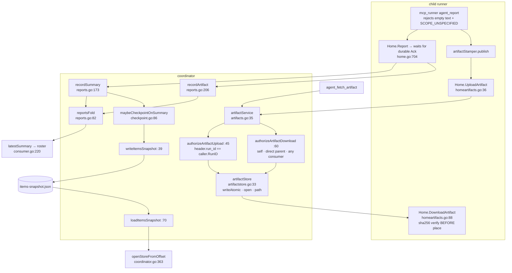

# Artifacts and agent_report

Two related contracts. **agent_report**: a child files structured summaries which fold
into a per-harp latest summary, a latest checkpoint and a per-artifact revision index,
and a `SCOPE_CHECKPOINT` filing is the compaction point for the items journal.
**Artifacts**: work products move **by reference, not by value** — bytes go into a
content-addressed store keyed by sha256, a manifest rides the event log as
`ArtifactProduced`, and the receiver verifies the hash against the manifest before
placing the file. This is how a child's output survives a container or worktree
boundary.

## The report fold

| Symbol | file:line | Role |
|---|---|---|
| `summaryFact` | `reports.go:34` | `factSummary`'s payload: harp, seq, scope, step id, text, structured, `covers_through`, artifact ids |
| `artifactFact` | `reports.go:46` | `factArtifact`'s payload; carries a `Seq` the fold never reads |
| `ArtifactRecord` | `reports.go:67` | the fold's public view of one artifact's latest revision |
| `reportsFold` | `reports.go:82` | `latest` (harp → summary), `checkpoint`, `artifacts` (harp → id → record), `seq` (harp → highest filed seq) |
| `recordSummary` | `reports.go:173` | journals one filing, then audits and may checkpoint |
| `recordArtifact` | `reports.go:206` | journals one artifact manifest, assigning a revision when the producer sent 0 |
| `nextRevision` | `reports.go:160` | latest+1, or "unchanged, skip" |
| `latestSummary` | `reports.go:141` | first line, truncated to 200 **bytes** (can split a rune) |
| `Coordinator.Artifacts` / `artifactRecord` / `LatestReport` | `reports.go:237,249,261` | list a harp's manifests (map order, unsorted), one manifest by id, the latest summary line |

Scopes come from `Summary.Scope` in the proto; `SCOPE_UNSPECIFIED` is hard-rejected at
the MCP edge (`mcp/mcp_runner.go:550-552`) — the fail-loud model for the rest of the
subsystem. `SCOPE_CHECKPOINT` additionally triggers items-journal compaction.

## Checkpoint (items compaction)

| Symbol | file:line | Role |
|---|---|---|
| `maybeCheckpointOnSummary` | `checkpoint.go:86` | guards the snapshot on `SCOPE_CHECKPOINT` — "a checkpoint filing is the compaction point" |
| `writeItemsSnapshot` | `checkpoint.go:39` | reads the items journal offset, snapshots the fold, writes temp + rename; warn-and-return on every failure (best effort by design) |
| `loadItemsSnapshot` | `checkpoint.go:70` | reads and unmarshals; `ok=false` falls back to a full replay |
| `itemsSnapshot` / `itemsFold.snapshot` / `restore` | `items.go:188,198,220` | the persisted fold state + offset; a deep copy out, nil-guarded seeding back |

`openStoreFromOffset` (`journal.go:95`) deliberately **distrusts** the recorded offset
and clamps it, which is what makes a stale or bogus snapshot safe.

## Artifact transfer

| Symbol | file:line | Contract |
|---|---|---|
| `artifactService` | `artifacts.go:35` | the gRPC adapter; re-derives identity per call rather than trusting the interceptor's principal (defence in depth, documented) |
| `authorizeArtifactUpload` | `artifacts.go:45` | rejects consumer credentials; requires `header.run_id == caller.RunID` — the "claim vs credential" rule |
| `authorizeArtifactDownload` | `artifacts.go:60` | allows self, the direct parent (via `runsF.currentRun(ownerHarp).ParentHarp`), or any consumer |
| `UploadArtifact` | `artifacts.go:81` | streams header + chunks through an `io.Pipe` into `writeAtomic`, validating chunk offset contiguity, per-chunk cap and running total; audits; returns a receipt |
| `DownloadArtifact` | `artifacts.go:198` | resolves the manifest, authorizes, sends the header frame first (carrying the manifest's sha256), then streams ≤1 MiB chunks |
| `artifactStore` | `artifactstore.go:33` | content-addressed blob store; **no mutable state and no mutex** — content addressing removes the need for the journals' single-writer lock |
| `artifactStore.writeAtomic` | `artifactstore.go:68` | TeeReader-hashes into a temp file, fsyncs, verifies a declared sha, dedupes on stat, renames |
| `Home.UploadArtifact` / `DownloadArtifact` | `homeartifacts.go:36,88` | the runner-side client: ≤1 MiB chunks up; down to a same-dir temp file, sha256-verified against the header, then renamed |

**The verification is genuine and fail-closed.** The header sha comes from the fold's
*manifest* (`artifacts.go:222`) while the bytes come from `artifacts.open(rec.SHA256)`,
so `Home.DownloadArtifact`'s comparison is a real integrity check rather than a
self-consistent tautology; on mismatch the temp file is removed by a defer and
`destPath` is never created.

## Invariants

| # | Invariant | Where |
|---|---|---|
| R1 | An upload's claimed `run_id` must equal the caller credential's run id | `artifacts.go:45` |
| R2 | A download is allowed for the owner, its direct parent, or any read-only consumer | `artifacts.go:60` |
| R3 | The blob's filename **is** the sha256 of its bytes | `artifactstore.go:47` (stated; not validated at the read boundary) |
| R4 | The receiver verifies sha256 against the manifest before placing any file | `homeartifacts.go:148-154` |
| R5 | Summary facts are deduped so an at-least-once redelivery does not double-file | `reports.go:105,181` |
| R6 | `Home.Report` does not return until the coordinator has journaled and acked the filing | `home.go:704-736` |

## Divergences and real behaviour

- **Summary dedupe keys `(harp, seq)` while `seq` is a per-run counter.**
  `reportsFold.apply` (`reports.go:105-110`) and `recordSummary` (`:181`) both guard
  `if p.Seq != 0 && p.Seq <= f.seq[p.Harp] { return }`, and `f.seq` is
  `map[string]uint64 // harp → highest seq`. `Home.seq` starts at 0 per `Home`
  (`home.go:48,690`) and `NewHome` runs once per runner process, so a resume — which
  revokes the credential, severs the runner and spawns a fresh one — restarts `seq` at 1.
  Every filing from a resumed child whose seq has not yet exceeded the previous run's
  maximum is discarded before it is journaled. Under one-shot (a new run per turn) that
  is every filing after turn 1. `itemsFold` keys the equivalent watermark by **run_id**
  (`items.go:137`) and is correct.
- **An upload can deliver zero bytes and return an OK receipt.** `header.size_bytes` is
  checked against the cap (`artifacts.go:102`) and never against the received total; the
  sha256 check is conditional (`if len(declaredSHA) > 0`, `artifactstore.go:88`) and the
  handler requires `artifact_id` but **not** `sha256`. A header followed by zero chunks
  publishes the empty blob and returns `ArtifactReceipt{SizeBytes: 0}` on a success
  status, and `agent_report` answers `{"journaled": true, "artifact_ids": [...]}`.
- **`artifactstore.go:20-24` says a corrupt read is "caught before any download places
  them (artifacts.go)".** `DownloadArtifact` hashes nothing; the verification is
  client-side in `homeartifacts.go:148-154`, so any non-`Home` gRPC client gets no
  server-side integrity check.
- **`ArtifactDownloadRequest.offset` is unusable as built.** The only client never sets
  it (`homeartifacts.go:90-93`) and verifies the received bytes against the header's
  **full-content** sha, so a non-zero offset guarantees a mismatch. An offset past EOF
  seeks successfully and returns a header with zero chunks as a success.
- **The blob store has no delete, prune or GC.** The only `os.Remove` calls are
  `writeAtomic`'s in-process temp cleanup and `checkpoint.go:61`; `reapEndedRuns` bounds
  run *records* but not the blobs they reference, and `.upload-*` temp files survive a
  crash unswept.
- **`artifact_id` is validated as required and used only in the audit fact**
  (`artifacts.go:96,180`): the blob is keyed by content hash and the manifest arrives on
  a *separate* `ArtifactProduced` event (`reports.go:207`), so an upload with no matching
  manifest leaves orphan bytes that `DownloadArtifact` can never resolve.
- **The blob rename is not followed by a directory fsync** (`artifactstore.go:100`)
  while the manifest that references it **is** fsynced (`journal.go:230-234`), so after a
  crash a durable manifest can point at a blob whose directory entry never persisted.
- **The checkpoint's offset and fold state are read under two separate lock
  acquisitions** (`checkpoint.go:40` then `:46`) — `Store.Offset` takes and releases
  RLock, `Store.View` takes it again — so a concurrent `items.Exec` in between makes the
  snapshot cover more than `snap.Offset` claims. The function's own doc asserts they are
  consistent. Masked today by `itemsFold.apply`'s `(run, seq)` watermark.
- **`loadItemsSnapshot` treats every `os.ReadFile` error as "no checkpoint yet"**
  (`checkpoint.go:71-74`), silently, while the corrupt-JSON path immediately below warns.
- **A journal failure loses the filing and the code proceeds as if it had succeeded**
  (`reports.go:194-196`, `:230-232`); the comment claims it "re-rides the next
  checkpoint" and no such mechanism exists. A *duplicate* delivery still fires `audit`
  and `maybeCheckpointOnSummary`.
- **`artifactFact.Seq` is journaled and never read** (`reports.go:115-136`), so artifacts
  get no at-least-once dedupe while summaries do; and `apply` overwrites
  `byID[artifact_id]` with no monotonicity check, so an out-of-order fact with a lower
  revision becomes "latest".
- **`Home.Report` can report failure for a filing that was durably journaled.** It waits
  for the cumulative Ack, which the coordinator's `ackThrough` (`runchannel.go:319-327`)
  sends non-blocking with a `default:` drop; a FINAL filing is typically the run's last
  event, so no later Ack recovers the watermark.
- **A failed items-journal `Exec` drops the already-detached facts** (`items.go:110-128`)
  and the next flush acks past them, so durability is certified for seqs that were never
  written.
