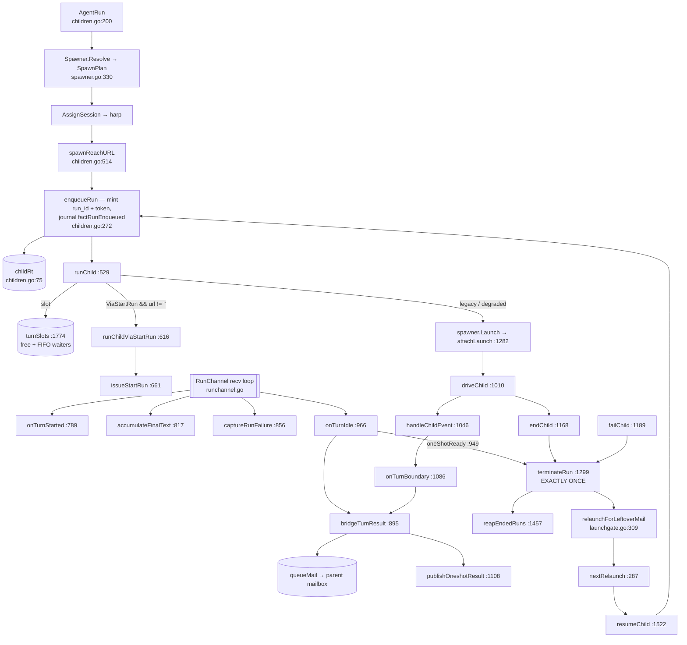

# Child lifecycle — spawn, turns, slots, retry, terminal

`children.go` (1832 lines) is the delegated-child lifecycle engine: it turns an
`agent_run` verb into a live child session (resolve → mint harp/run-id/credential →
journal the enqueue → acquire an execution slot → spawn the engine → deliver turns from
the mailbox), drives that child's turn boundaries, bridges each turn's result back to
the parent, and funnels every death through **one exactly-once terminal**. `spawner.go`
is the only place `coord` touches `internal/operations`' launch tail; `launchgate.go`
owns the per-harp retry budget and stop flag; `owner_run.go` is the parent-less
top-level container run.

Two mutually exclusive launch drivers coexist: the **migrated** StartRun path
(`plan.ViaStartRun` — claude-code, codex, kiro, acp) and the **legacy** go-plugin chat
path (antigravity, opencode).

## Types

| Type | file:line | Role |
|---|---|---|
| `SpawnPlan` | `spawner.go:22` | a resolved agent launch: agent name, backend, label, profiles, runtime, context, permission, ladder, MCP servers, `ViaStartRun`, `ResumeMode`, `Degraded`. `Workspace`/`DirtyTreeHandler` are stamped **after** `Resolve`, by `AgentRun` |
| `ResumeMode` | `spawner.go:107` | persistent vs one-shot engine lifecycle |
| `Spawner` (interface) | `spawner.go:124` | the launch seam tests fake: `Resolve`, `AssignSession`, `Launch`, `StartEngine`, `ResumeContext`, `MarkSessionEnded` |
| `prodSpawner` | `spawner.go:157` | the one production implementation; its constructor also installs the executable trust gate on the shared config |
| `EngineSpawn` | `spawner.go:434` | `StartEngine` result: a spawned-but-not-chatting runner plus HarnessSpec inputs and a `Kill` |
| `childRt` | `children.go:75` | the non-durable runtime attachment of one live run: identity, `slotHeld`, legacy channels (`in`/`close`/`wake`/`oneshot`), migrated state (`viaStartRun`/`finalMsgs`/`stderrTail`/`runFailure`), turn accumulators, `launchCancel` |
| `RunOutcome` | `children.go:169` | `agent_run`'s return payload, **fixed at enqueue** |
| `turnSlots` | `children.go:1774` | counting semaphore with FIFO waiters bounding concurrently executing child turns |
| `launchState` | `launchgate.go:143` | one harp's `{cancel, gen}` cancellation registry + `fails` retry counter + `stopped` flag |
| `OwnerRunSpec` / `OwnedRunStarter` | `owner_run.go:31,58` | host-resolved parameters for a parent-less container run, and the seam that lets `coord` spawn a runner without importing `lm/isolation` |

`childRt`'s legacy field set and migrated field set are mutually exclusive by
construction — no run has both — so the type is two runtime attachments wearing one
name.

## Verbs and lifecycle functions

| Function | file:line | Contract |
|---|---|---|
| `AgentRun` | `children.go:200` | validates (empty agent name and empty prompt are both refused loudly at `:201-206`), resolves, assigns the harp, resolves reach-back, enqueues, dispatches `runChild` on a tracked goroutine, returns immediately |
| `enqueueRun` | `children.go:272` | mints run id + credential and journals `factRunEnqueued` inside the serialized window; publishes `childRt` |
| `spawnReachURL` | `children.go:514` | resolves the child-reachable coordinator URL; **fatal unless `--degraded`**, with a remediation hint |
| `childEnv` / `runnerEnv` | `children.go:467,493` | the child ENGINE env (harp + project id, deliberately no credential) vs the RUNNER env (reach-back trio + delegation-depth stamp) |
| `runChild` | `children.go:529` | slot acquire → launch context → migrated or legacy spawn; every failure routes to `failChild` |
| `runChildViaStartRun` / `issueStartRun` | `children.go:616,661` | build the `HarnessSpec`, join context+prompt, await dial-home, send `StartRun`, audit, drain queued mail, mark attached |
| `driveChild` / `handleChildEvent` / `onTurnBoundary` | `children.go:1010,1046,1086` | the legacy event loop and its turn boundary |
| `bridgeTurnResult` | `children.go:895` | swaps out the turn accumulator and queues the child's answer to the parent as kind `result` |
| `oneShotReady` / `onTurnIdle` | `children.go:949,966` | the three-condition one-shot gate, then either a `CauseOneShotBoundary` teardown or idle + slot yield + mail push |
| `terminateRun` | `children.go:1299` | the exactly-once terminal: claim the fact, then slot release, credential revocation, poll+channel sever, parent notice, session-ended stamp, relaunch check, reap |
| `failChild` | `children.go:1189` | warn, count the failure, terminate, mark attached |
| `resumeChild` | `children.go:1522` | backoff, re-check the stop flag, resolve, enqueue as a **fresh run**, relaunch |
| `reapEndedRuns` | `children.go:1457` | bounds live ended-run records by tail + age; re-asserts "not the harp's current run" **inside** the writer window |
| `driveQueued` | `children.go:1690` | classifies how a queued message will reach a recipient, by fold state |
| `Coordinator.StartOwnedRun` / `SendOwnedRunTurn` | `owner_run.go:70,165` | mint and drive a parent-less top-level container run; `run_owned.go` is the CLI caller |

## Execution slots and the concurrency ceiling

`delegation.concurrency` (default 4) is a **throughput ceiling, not a correctness gate** —
children run concurrently. `queueFold.executing` is the exact counter the admission
logic reads.

| Function | file:line | Contract |
|---|---|---|
| `turnSlots.tryAcquire` / `acquire` / `release` | `children.go:1782,1792,1821` | non-blocking queue-respecting acquire; FIFO blocking acquire with a correct cancel/grant race resolution; hand-off to the oldest waiter |
| `claimSlotIntent` / `releaseSlotIntent` | `children.go:1261,1276` | atomically claim the right to acquire, and roll it back |
| `releaseSlot` | `children.go:1237` | clear `slotHeld` and release the semaphore if it was set |
| `onRolePark` / `onRoleUnpark` | `children.go:1732,1754` | yield the slot when a role parks in `agent_recv` or on an approval; re-acquire (**blocking**, bounded only by process shutdown) when it resumes |

`childRt.slotHeld` is a single boolean that means both "holds a slot" and "intends to
acquire one": `claimSlotIntent` sets it, then `onRoleUnpark` blocks in
`slots.acquire(c.baseCtx)` while it already reads true.

Coordinator state here is correctly **partitioned by child identity** — `launches`,
`polls`, `delivered` and `liveness` are harp/role-keyed, so the concurrency flip is
safe at this layer; the races that exist are within one harp's own state machine.

## Launch gate and retry

| Function | file:line | Contract |
|---|---|---|
| `resolveLaunchTunables` | `launchgate.go:135` | reads `CTXLOOM_LAUNCH_*` overrides once, at construction |
| `launchContext` | `launchgate.go:188` | derives and registers one attempt's cancellable context, deregistered by generation |
| `cancelLaunch` | `launchgate.go:210` | marks the harp stopped **and** cancels the in-flight attempt — the 2026-07-24 incident fix |
| `noteLaunchAttached` / `noteLaunchFailure` | `launchgate.go:250,258` | reset the budget on a successful attach; increment on a launch failure |
| `launchBackoff` / `nextRelaunch` | `launchgate.go:270,287` | exponential capped backoff; may-we-relaunch decision |
| `relaunchForLeftoverMail` | `launchgate.go:309` | `terminateRun`'s tail: re-arm a resume when mail is pending, or give up |
| `giveUpLaunching` | `launchgate.go:328` | warn + mail the parent that the coordinator stopped trying |

The budget bounds **launch failures only**. A child that attaches (resetting `fails` to
0) and then dies without consuming its mail relaunches with `launchBackoff(0) == 0` —
no counter, no delay. Budget exhaustion is announced only for `CauseLaunchFailed`; under
every other cause the coordinator stops re-arming silently, in a file whose stated
purpose is to give up loudly. `c.launches` entries are created on demand and never
deleted, the one per-harp map `reapEndedRuns` does not bound.

## Terminal causes

`terminateRun` branches on the cause; each drives a different subset of the eight
consequences.

| Cause | Meaning |
|---|---|
| `CauseStopped` | explicit `agent_stop`; also clears the harp's session-accept cache |
| `CauseRunnerExit` | the runner process reported `RunExited`, or the watchdog synthesized loss |
| `CauseLaunchFailed` | the launch never attached; the only cause that announces budget exhaustion |
| `CauseOneShotBoundary` | routine per-turn teardown under one-shot driving; skips the terminal-tail drain |

## One-shot driving

Under `ResumeModeOneShot` the engine is torn down at every turn boundary and resumed by
key on the next message, so **a new run_id per turn** under a stable harp.
`resolveResumeMode` (`spawner.go:270`) gates this on driving × backend capability and
**fails loud rather than downgrading** — the model the rest of the package should copy.

Two consequences a reader must hold:

- Between turns a healthy one-shot child's *current* run is `Ended` with cause
  `CauseOneShotBoundary`.
- Report sequence numbers restart at 1 on each run — see
  [artifacts.md](artifacts.md).

## Divergences

- **`agent_stop` on a one-shot child between turns reports a refusal.** `AgentStop`
  calls `cancelLaunch(harp)` first (`coordinator.go:749`) — so the stop *has* taken
  effect and no relaunch will occur — and then, because `rec.Ended` is true, returns
  `"child %s had already ended (%s); any pending relaunch is cancelled"`
  (`coordinator.go:750-752`). To a coordinating agent that reads as "your stop did
  nothing". Resume assigns a fresh run_id, so the harp's *current* run at the moment of
  the stop is the boundary terminal, not a live run.
- **Plane-2 `agent_stop` does not cancel the launch at all.** `serveStopRun`
  (`runchannel.go:785`) calls `terminateRun` directly; `cancelLaunch` has exactly two
  call sites repo-wide, its definition and `coordinator.go:749`. So a coordinator-capable
  *child* stopping a grandchild leaves an armed relaunch running behind a response that
  says "stopped". Two bodies, one verb.
- **`children.go:551-554` states the legacy chat path has no production backends**
  ("today: none in production, only test doubles"). `viaStartRunBackends` is
  `{claude-code, codex, kiro, acp}`; `antigravity` (`internal/antigravity/chat.go:57`)
  and `opencode` (`internal/opencode/chat.go:41`) are registered backends implementing
  `Chat` and absent from that set, so both take the legacy path — and with it the
  documented "not LIVE-observable via ConsumerService" gap.
- **`ResumeMode`'s doc contradicts the code.** `spawner.go:102-119` says one-shot is
  "not yet executed", persistent is "today's only behavior", and one-shot is
  "(v0.8, Slice 4)"; `Resolve` (`spawner.go:361-375`) returns `ResumeModeOneShot` for
  the wired backends today.
- **`RunOutcome`'s `Queued` is re-read after the driver goroutine is dispatched**
  (`children.go:246-248`), so it can report a stale answer even though the field's
  comment claims the pre-publication `tryAcquire` makes it truthful at return.
- **`agent_run`'s plane-2 disposition asserts a spawn that has not happened.**
  `serveSpawnAgent` (`runchannel.go:745-758`) answers `"spawned <harp> (engine X,
  runtime container)"` at enqueue time; every later failure surfaces only as roster or
  mailbox state the caller must go looking for.
- **A run can start with no input and be reported as a complete success.**
  `runChildViaStartRun` computes `first := operations.JoinLeadBlocks(contextText,
  prompt)`, and `issueStartRun` (`children.go:670-676`) builds `Input` only
  `if first != ""` — leaving it nil — then audits `start_run`, resets the retry budget,
  marks the child attached and returns nil. Three routes reach `first == ""`: a resume
  whose `Spawner.ResumeContext` (`spawner.go:487`) warns and returns `""` for an
  unreadable transcript; `StartOwnedRun`, which never validates `prompt`; and
  `takeNextMail`'s journal-error path (see [mailbox.md](mailbox.md)). The empty case is
  legitimate on resume, so the runner cannot distinguish resume from an empty composed
  context.
- **`agent_stop` cannot abort an in-flight `StartRun` round trip**: `issueStartRun`
  derives the request context from `c.baseCtx` (`children.go:677`) while the dial-home
  wait one block earlier correctly uses the cancellable `ctx`.
- **The launch-settlement subsystem is test-facing.** `awaitChildUp`
  (`children.go:409`) has zero production callers (its own doc says so), and
  `launchArmed`, `armLaunch`, `markAttached`, `childRt.attached` and `waitAnyClosed`
  exist to serve it.
- **`bridgeTurnResult` clears the accumulator before delivering it**
  (`children.go:896-912` then `:930`): a `queueMail` failure warns and the turn output
  then exists nowhere. A turn that produced nothing warns to `clidiag`, a channel the
  parent — parked in `agent_recv` — structurally cannot read.
