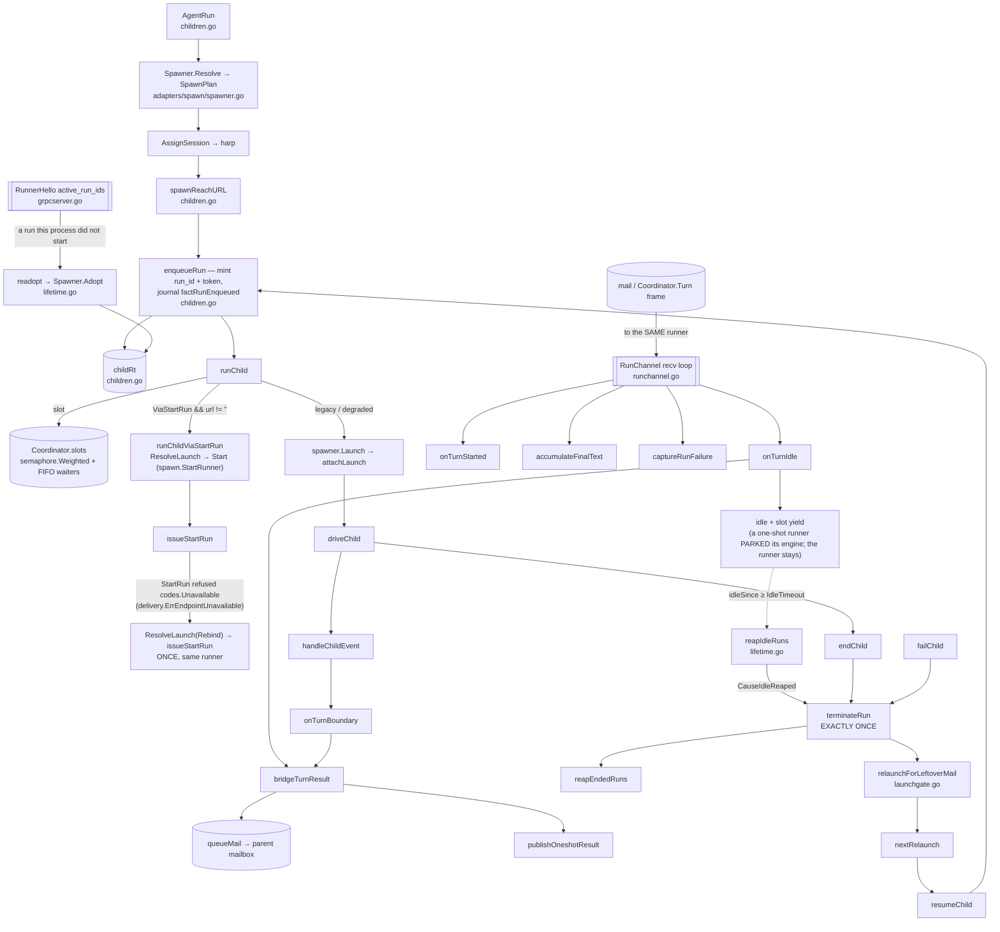

# Child lifecycle — spawn, turns, slots, retry, terminal

`children.go` (1832 lines) is the delegated-child lifecycle engine: it turns an
`agent_run` verb into a live child session (resolve → mint harp/run-id/credential →
journal the enqueue → acquire an execution slot → spawn the engine → deliver turns from
the mailbox), drives that child's turn boundaries, bridges each turn's result back to
the parent, and funnels every death through **one exactly-once terminal**. `spawner.go`
is the only place `coord` touches `internal/adapters/operations`' launch tail; `launchgate.go`
owns the per-harp retry budget and stop flag; `owner_run.go` is the parent-less
top-level container run.

Two mutually exclusive launch drivers coexist: the **migrated** StartRun path
(`plan.ViaStartRun` — the members of `viaStartRunBackends`) and the **legacy** go-plugin chat
path, which now has no registered backend at all.

```mermaid
flowchart TD
  AR["AgentRun<br/>children.go"] --> RES["Spawner.Resolve → SpawnPlan<br/>adapters/spawn/spawner.go"]
  RES --> ASSIGN["AssignSession → harp"]
  ASSIGN --> URL["spawnReachURL<br/>children.go"]
  URL --> EQ["enqueueRun — mint run_id + token,<br/>journal factRunEnqueued<br/>children.go"]
  EQ --> RT[("childRt<br/>children.go")]
  EQ --> RC["runChild"]
  RC -->|slot| TS[("Coordinator.slots<br/>semaphore.Weighted + FIFO waiters")]
  RC -->|"ViaStartRun && url != ''"| VSR["runChildViaStartRun<br/>ResolveLaunch → Start (spawn.StartRunner)"] --> ISR["issueStartRun"]
  ISR -->|"StartRun refused codes.Unavailable<br/>(delivery.ErrEndpointUnavailable)"| REBIND["ResolveLaunch(Rebind) → issueStartRun<br/>ONCE, same runner"]
  RC -->|legacy / degraded| LA["spawner.Launch → attachLaunch"] --> DC["driveChild"]

  RCH[["RunChannel recv loop<br/>runchannel.go"]] --> OTS["onTurnStarted"]
  RCH --> AFT["accumulateFinalText"]
  RCH --> CRF["captureRunFailure"]
  RCH --> OTI["onTurnIdle"]
  DC --> HCE["handleChildEvent"] --> OTB["onTurnBoundary"]
  OTI --> BTR["bridgeTurnResult"]
  OTB --> BTR
  BTR --> MAIL[("queueMail → parent mailbox")]
  BTR --> POR["publishOneshotResult"]
  OTI --> IDLE["idle + slot yield<br/>(a one-shot runner PARKED its engine; the runner stays)"]
  IDLE -.->|"idleSince ≥ IdleTimeout"| REAPER["reapIdleRuns<br/>lifetime.go"] -->|CauseIdleReaped| TERM
  MAILIN[("mail / Coordinator.Turn frame")] -->|"to the SAME runner"| RCH
  HELLO[["RunnerHello active_run_ids<br/>grpcserver.go"]] -->|"a run this process did not start"| READOPT["readopt → Spawner.Adopt<br/>lifetime.go"] --> RT
  DC --> EC["endChild"] --> TERM["terminateRun<br/>EXACTLY ONCE"]
  FC["failChild"] --> TERM
  TERM --> REAP["reapEndedRuns"]
  TERM --> RLM["relaunchForLeftoverMail<br/>launchgate.go"] --> NR["nextRelaunch"] --> RSC["resumeChild"]
  RSC --> EQ
```

## Types

| Type | file | Role |
|---|---|---|
| `SpawnPlan` | `spawner.go` | a resolved agent launch: agent name, backend, label, profiles, runtime, context, permission, ladder, MCP servers, `ViaStartRun`, `ResumeMode`, `Degraded`. `Workspace`/`DirtyTreeHandler` are stamped **after** `Resolve`, by `AgentRun` |
| `ResumeMode` | `spawner.go` | persistent vs one-shot engine lifecycle |
| `Spawner` (interface) | `spawner.go` | the launch seam tests fake: `Resolve`, `AssignSession`, `RecordEngineVersion`, `StartEngine`, `ResumeHistory`, `MarkSessionEnded` |
| `prodSpawner` | `spawner.go` | the one production implementation; its constructor also installs the executable trust gate on the shared config |
| `EngineSpawn` | `spawner.go` | `StartEngine` result: a spawned-but-not-chatting runner, the resolved `Launch` with its wire form (`Wire`, the codec's projection) and a `Kill` |
| `childRt` | `children.go` | the non-durable runtime attachment of one live run: identity, `slotHeld`, legacy channels (`in`/`close`/`wake`/`oneshot`), migrated state (`viaStartRun`/`finalMsgs`/`stderrTail`/`runFailure`), turn accumulators, `launchCancel` |
| `RunOutcome` | `children.go` | `agent_run`'s return payload, **fixed at enqueue** |
| `Coordinator.slots` | `coordinator.go` | `semaphore.Weighted` (`golang.org/x/sync`) with FIFO waiters, bounding concurrently executing child turns. `Release` panics on an over-release rather than handing back a token nobody took — a silently inflated cap admits more live engine processes than configured |
| `launchState` | `launchgate.go` | one harp's `{cancel, gen}` cancellation registry + `fails` retry counter + `stopped` flag |
| `OwnerRunSpec` / `OwnedRunStarter` | `owner_run.go` | host-resolved parameters for a parent-less container run, and the seam that lets `coord` spawn a runner without importing `lm/isolation` |

`childRt`'s legacy field set and migrated field set are mutually exclusive by
construction — no run has both — so the type is two runtime attachments wearing one
name.

## Verbs and lifecycle functions

| Function | file | Contract |
|---|---|---|
| `AgentRun` | `children.go` | validates (empty agent name and empty prompt are both refused loudly), resolves, assigns the harp, resolves reach-back, enqueues, dispatches `runChild` on a tracked goroutine, returns immediately |
| `enqueueRun` | `children.go` | mints run id + credential and journals `factRunEnqueued` inside the serialized window; publishes `childRt` |
| `spawnReachURL` | `children.go` | resolves the child-reachable coordinator URL; **fatal unless `--degraded`**, with a remediation hint |
| `childEnv` / `runnerEnv` | `children.go` | the child ENGINE env (harp + project id, deliberately no credential) vs the RUNNER env (reach-back trio + delegation-depth stamp) |
| `runChild` | `children.go` | slot acquire → launch context → migrated or legacy spawn; every failure routes to `failChild` |
| `runChildViaStartRun` / `issueStartRun` | `children.go` | settle the first turn's lead (`SpawnStart.Prompt`: the prompt, the rendered history ahead of it on a keyless resume), resolve and start the runner, await dial-home, send `StartRun{run_id, launch}`, audit, drain queued mail, mark attached; the runner leads with the package's context |
| `driveChild` / `handleChildEvent` / `onTurnBoundary` | `children.go` | the legacy event loop and its turn boundary — **FROZEN** per the spool-cutover RETIRE-FIRST ruling: never ported to the spool substrate, closed to new backends (`spawner.go`'s `checkLegacyChatFreeze`; frozen residue `legacyChatBackends` = mock alone, plus the degraded no-reach-back spawn) |
| `bridgeTurnResult` | `children.go` | swaps out the turn accumulator and queues the child's answer to the parent as kind `result` |
| `onTurnIdle` | `children.go` | idle + slot yield + mail push, and `idleSince` stamped for the reaper. A one-shot child's ENGINE process ended at this boundary on the runner (`EngineHost.parkAtBoundary`); the runner itself stays, parked, its endpoint bound |
| `Turn` / `reapIdleRuns` / `readopt` | `lifetime.go` | the one-shot turn injection to a LIVE runner (`RunnerTransport.Turn`); the idle reaper (`Options.IdleTimeout`, `CauseIdleReaped`); re-adoption of a runner that outlived the previous coordinator, with its cell ownership re-acquired through `Spawner.Adopt` |
| `terminateRun` | `children.go` | the exactly-once terminal: claim the fact, then slot release, credential revocation, poll+channel sever, parent notice, session-ended stamp, relaunch check, reap |
| `failChild` | `children.go` | warn, count the failure, terminate, mark attached |
| `resumeChild` | `children.go` | backoff, re-check the stop flag, resolve, enqueue as a **fresh run**, relaunch |
| `reapEndedRuns` | `children.go` | bounds live ended-run records by tail + age; re-asserts "not the harp's current run" **inside** the writer window |
| `driveQueued` | `children.go` | classifies how a queued message will reach a recipient, by fold state |
| `Coordinator.StartOwnedRun` / `SendOwnedRunTurn` | `owner_run.go` | mint and drive a parent-less top-level container run; `run_owned.go` is the CLI caller |

## Execution slots and the concurrency ceiling

`delegation.concurrency` (default 4) is a **throughput ceiling, not a correctness gate** —
children run concurrently. `queueFold.executing` is the exact counter the admission
logic reads.

| Function | file | Contract |
|---|---|---|
| `Coordinator.slots.TryAcquire` / `Acquire` / `Release` | `golang.org/x/sync/semaphore` | non-blocking queue-respecting acquire; FIFO blocking acquire with a correct cancel/grant race resolution; hand-off to the oldest waiter; panic on an over-release |
| `claimSlotIntent` / `releaseSlotIntent` | `children.go` | atomically claim the right to acquire, and roll it back |
| `releaseSlot` | `children.go` | clear `slotHeld` and release the semaphore if it was set |
| `onRolePark` / `onRoleUnpark` | `children.go` | yield the slot when a role parks in `agent_recv` or on an approval; re-acquire (**blocking**, bounded only by process shutdown) when it resumes |

`childRt.slotHeld` is a single boolean that means both "holds a slot" and "intends to
acquire one": `claimSlotIntent` sets it, then `onRoleUnpark` blocks in
`slots.acquire(c.baseCtx)` while it already reads true.

Coordinator state here is correctly **partitioned by child identity** — `launches`,
`polls`, `delivered` and `liveness` are harp/role-keyed, so the concurrency flip is
safe at this layer; the races that exist are within one harp's own state machine.

## Launch gate and retry

| Function | file | Contract |
|---|---|---|
| `resolveLaunchTunables` | `launchgate.go` | reads `CTXLOOM_LAUNCH_*` overrides once, at construction |
| `launchContext` | `launchgate.go` | derives and registers one attempt's cancellable context, deregistered by generation |
| `cancelLaunch` | `launchgate.go` | marks the harp stopped **and** cancels the in-flight attempt — the 2026-07-24 incident fix |
| `noteLaunchAttached` / `noteLaunchFailure` | `launchgate.go` | reset the budget on a successful attach; increment on a launch failure |
| `launchBackoff` / `nextRelaunch` | `launchgate.go` | exponential capped backoff; may-we-relaunch decision |
| `relaunchForLeftoverMail` | `launchgate.go` | `terminateRun`'s tail: re-arm a resume when mail is pending, or give up |
| `giveUpLaunching` | `launchgate.go` | warn + mail the parent that the coordinator stopped trying |

The budget bounds **launch failures only**. A child that attaches (resetting `fails` to
0) and then dies without consuming its mail relaunches with `launchBackoff(0) == 0` —
no counter, no delay. Budget exhaustion is announced only for `CauseLaunchFailed`; under
every other cause the coordinator stops re-arming silently, in a file whose stated
purpose is to give up loudly. `c.launches` entries are created on demand and never
deleted, the one per-harp map `reapEndedRuns` does not bound.

## Terminal causes

`terminateRun` branches on the cause; each drives a different subset of the eight
consequences.

| Cause | Meaning |
|---|---|
| `CauseStopped` | explicit `agent_stop`; also clears the harp's session-accept cache |
| `CauseRunnerExit` | the runner process reported `RunExited`, or the watchdog synthesized loss |
| `CauseLaunchFailed` | the launch never attached; the only cause that announces budget exhaustion |
| `CauseIdleReaped` | the idle reaper's terminal: no turn for `delegation.idle_timeout`; no parent notice, the harp stays resumable |

## One-shot driving

Under `ResumeModeOneShot` the ENGINE process ends at every turn boundary and the
next turn is driven as a fresh engine process resumed by native key — inside a
RUNNER that stays for the whole session (`EngineHost.parkAtBoundary`,
`EngineHost.unpark`). One run_id per runner incarnation, not per turn: the run
is `Idle` between turns, its endpoint bound, and mail (or a `Coordinator.Turn`
frame) lands on the same runner. `resolveResumeMode` (`adapters/spawn`) gates
the mode on driving × backend capability and **fails loud rather than
downgrading**. What ends a parked runner is the idle reaper (`reapIdleRuns`,
`delegation.idle_timeout`), `agent_stop`, a FINAL report, or the runner's own
exit; the next mail after a reap starts a new incarnation through the resume
arm, reusing the bound endpoint.

## Divergences

- **Plane-2 `agent_stop` does not cancel the launch at all.** `serveStopRun`
  (`runchannel.go`) calls `terminateRun` directly; `cancelLaunch` has exactly two
  call sites repo-wide, its definition and `coordinator.go`. So a coordinator-capable
  *child* stopping a grandchild leaves an armed relaunch running behind a response that
  says "stopped". Two bodies, one verb.
- **`children.go` states the legacy chat path has no production backends**
  ("today: none in production, only test doubles"). `viaStartRunBackends` is
  the registered production backend, and no registered backend implements
  `Chat` at all, so the statement now holds.
- **`RunOutcome`'s `Queued` is re-read after the driver goroutine is dispatched**
  (`children.go`), so it can report a stale answer even though the field's
  comment claims the pre-publication `tryAcquire` makes it truthful at return.
- **`agent_run`'s plane-2 disposition asserts a spawn that has not happened.**
  `serveSpawnAgent` (`runchannel.go`) answers `"spawned <harp> (engine X,
  runtime container)"` at enqueue time; every later failure surfaces only as roster or
  mailbox state the caller must go looking for.
- **A run that would carry no work is refused at `issueStartRun`.**
  `startRunPayloadErr` (`children.go`) refuses a `StartRun` whose `Launch.Prompt` is
  empty with no native key to resume, no queued mail and no owner run behind it: the
  runner would attach, the roster would say executing, and the engine would sit
  having been told nothing. The empty prompt is legitimate on a native-key resume
  (the engine continues its own recorded session) and for an owner run that takes
  its turns through `SendOwnedRunTurn`.
- **`agent_stop` cannot abort an in-flight `StartRun` round trip**: `issueStartRun`
  derives the request context from `c.baseCtx` (`children.go`) while the dial-home
  wait one block earlier correctly uses the cancellable `ctx`.
- **The launch-settlement subsystem is test-facing.** `awaitChildUp`
  (`children.go`) has zero production callers (its own doc says so), and
  `launchArmed`, `armLaunch`, `markAttached`, `childRt.attached` and `waitAnyClosed`
  exist to serve it.
- **`bridgeTurnResult` clears the accumulator before delivering it**
  (`children.go`): a `queueMail` failure warns and the turn output
  then exists nowhere. A turn that produced nothing warns to `clidiag`, a channel the
  parent — parked in `agent_recv` — structurally cannot read.
