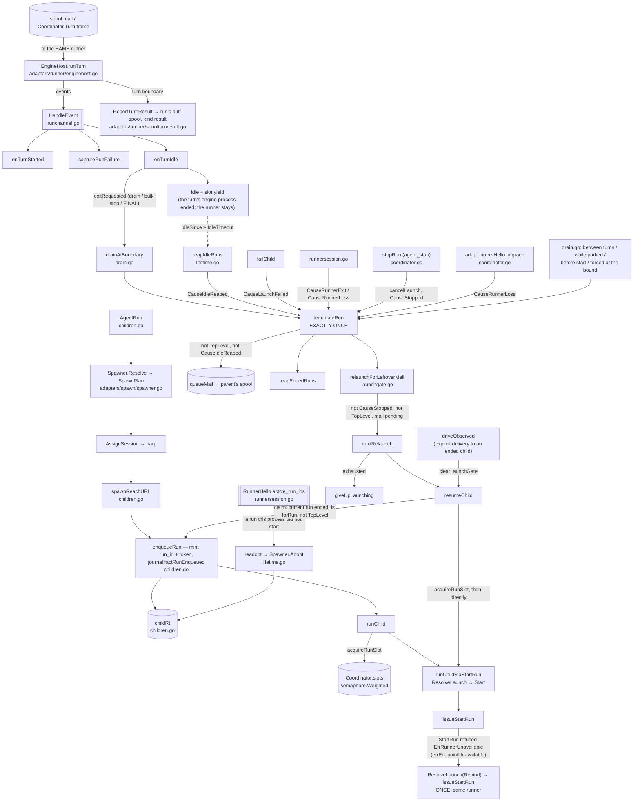

# Child lifecycle — spawn, turns, slots, retry, terminal

`children.go` is the delegated-child lifecycle engine: it turns an `agent_run` verb
into a live child session (resolve → mint harp/run-id/credential → journal the
enqueue → acquire an execution slot → start the runner and issue `StartRun`), tracks
that child's turn boundaries as they arrive on its RunChannel, and funnels every death
through **one exactly-once terminal**. `spawner.go` declares the launch seam
(`Spawner`) whose production implementation lives in `adapters/spawn`;
`launchgate.go` owns the per-harp retry budget and stop flag; `owner_run.go` is the
parent-less top-level container run.

One launch driver: the StartRun path — the coordinator starts the runner
through the spawner and issues `StartRun{Launch}` over the runner channel
(`runChildViaStartRun`); the runner drives the engine per turn
(`EngineHost.runTurn`, `adapters/runner`) and files each turn's result itself.

```mermaid
flowchart TD
  AR["AgentRun<br/>children.go"] --> RES["Spawner.Resolve → SpawnPlan<br/>adapters/spawn/spawner.go"]
  RES --> ASSIGN["AssignSession → harp"]
  ASSIGN --> URL["spawnReachURL<br/>children.go"]
  URL --> EQ["enqueueRun — mint run_id + token,<br/>journal factRunEnqueued<br/>children.go"]
  EQ --> RT[("childRt<br/>children.go")]
  EQ --> RC["runChild"]
  RC -->|acquireRunSlot| TS[("Coordinator.slots<br/>semaphore.Weighted")]
  RC --> VSR["runChildViaStartRun<br/>ResolveLaunch → Start"] --> ISR["issueStartRun"]
  ISR -->|"StartRun refused ErrRunnerUnavailable<br/>(errEndpointUnavailable)"| REBIND["ResolveLaunch(Rebind) → issueStartRun<br/>ONCE, same runner"]

  ENG[["EngineHost.runTurn<br/>adapters/runner/enginehost.go"]] -->|events| RCH[["HandleEvent<br/>runchannel.go"]]
  ENG -->|turn boundary| TR["ReportTurnResult → run's out/ spool, kind result<br/>adapters/runner/spoolturnresult.go"]
  RCH --> OTS["onTurnStarted"]
  RCH --> CRF["captureRunFailure"]
  RCH --> OTI["onTurnIdle"]
  OTI -->|"exitRequested (drain / bulk stop / FINAL)"| DAB["drainAtBoundary<br/>drain.go"] --> TERM
  OTI --> IDLE["idle + slot yield<br/>(the turn's engine process ended; the runner stays)"]
  IDLE -.->|"idleSince ≥ IdleTimeout"| REAPER["reapIdleRuns<br/>lifetime.go"] -->|CauseIdleReaped| TERM
  MAILIN[("spool mail / Coordinator.Turn frame")] -->|"to the SAME runner"| ENG
  HELLO[["RunnerHello active_run_ids<br/>runnersession.go"]] -->|"a run this process did not start"| READOPT["readopt → Spawner.Adopt<br/>lifetime.go"] --> RT

  FC["failChild"] -->|CauseLaunchFailed| TERM["terminateRun<br/>EXACTLY ONCE"]
  RS["runnersession.go"] -->|"CauseRunnerExit / CauseRunnerLoss"| TERM
  STOP["stopRun (agent_stop)<br/>coordinator.go"] -->|"cancelLaunch, CauseStopped"| TERM
  GRACE["adopt: no re-Hello in grace<br/>coordinator.go"] -->|CauseRunnerLoss| TERM
  DRAIN["drain.go: between turns / while parked /<br/>before start / forced at the bound"] --> TERM
  TERM -->|"not TopLevel, not CauseIdleReaped"| NOTICE[("queueMail → parent's spool")]
  TERM --> REAP["reapEndedRuns"]
  TERM --> RLM["relaunchForLeftoverMail<br/>launchgate.go"]
  RLM -->|"not CauseStopped, not TopLevel, mail pending"| NR["nextRelaunch"]
  NR -->|exhausted| GU["giveUpLaunching"]
  NR --> RSC["resumeChild"]
  DOBS["driveObserved<br/>(explicit delivery to an ended child)"] -->|clearLaunchGate| RSC
  RSC -->|"claim: current run ended, is forRun, not TopLevel"| EQ
  RSC -->|"acquireRunSlot, then directly"| VSR
```

## Types

| Type | file | Role |
|---|---|---|
| `SpawnPlan` | `spawner.go` | a resolved agent launch: agent name, backend, label, profiles, runtime, permission, degradations, MCP servers, `ResumeMode`, the resolved `Launch` and the config `Snapshot`. `Workspace`/`DirtyTreeHandler` are stamped **after** `Resolve`, by `AgentRun` |
| `ResumeMode` | `spawner.go` | persistent vs one-shot engine lifecycle |
| `SpawnStart` / `Resolved` | `spawner.go` | the per-attempt inputs to `ResolveLaunch` (identity, resume key, `Resumed`, `Prompt`, `Rebind`) and its result, the launch to deliver |
| `Spawner` (interface) | `spawner.go` | the launch seam tests fake: `Resolve`, `AssignSession`, `RecordEngineVersion`, `ResolveLaunch`, `Start`, `Adopt`, `ResumeHistory`, `MarkSessionEnded` |
| `spawner` | `adapters/spawn/spawner.go` | the one production implementation, over the operations launch trunk |
| `EngineSpawn` | `spawner.go` | `Start` result: a spawned runner's `Kill`, `StderrTail` and `Wait` |
| `childRt` | `children.go` | the non-durable runtime attachment of one live run: identity and lineage (`harp`, `parentHarp`, `parentRunID`, `depth`, `plan`), the `slot` tri-state and `slotCancel`, `oneshot`, `ownerRun`, `launchCancel`, a bulk stop's `exitRequested`, `close`, `idleSince`, `workDir`, the death evidence (`runFailure`, `stderrTail`, `runnerWait`), and the test-facing `attached` |
| `RunRecord` | `folds.go` | the durable run record; `TopLevel()` is true when `ParentHarp` is empty or equals its own `Harp` — a session's own run, not a delegated child |
| `RunOutcome` | `children.go` | `agent_run`'s return payload, **fixed at enqueue** |
| `Coordinator.slots` | `coordinator.go` | `semaphore.Weighted` (`golang.org/x/sync`), bounding concurrently executing child turns. `Release` panics on an over-release rather than handing back a token nobody took — a silently inflated cap admits more live engine processes than configured |
| `launchState` | `launchgate.go` | one harp's `{cancel, gen}` cancellation registry + `fails` and `relaunches` counters + `stopped` flag |
| `OwnerRun` / `OwnedRunStarter` | `owner_run.go` | host-resolved parameters for a parent-less container run, and the seam that lets `coord` spawn a runner without importing `lm/isolation` |

`childRt` holds only what a fold cannot; queue membership, roster state, lineage and
credentials live in the folds, and `childRt` is rebuilt from them.

## Verbs and lifecycle functions

| Function | file | Contract |
|---|---|---|
| `AgentRun` | `children.go` | refuses while draining, and refuses an empty agent name or empty prompt loudly; resolves, assigns the harp, resolves reach-back, enqueues, dispatches `runChild` on a tracked goroutine, returns immediately |
| `enqueueRun` | `children.go` | mints run id + credential and journals `factRunEnqueued` inside the serialized window; publishes `childRt` |
| `spawnReachURL` | `children.go` | resolves the child-reachable coordinator URL; a child without reach-back is refused in **every** strictness, `--degraded` included, with a remediation hint |
| `runnerEnv` | `children.go` | the RUNNER env: the reach-back trio (URL, credential, run id) and nothing else. The run's identity rides the `Launch`, never the environment |
| `runChild` | `children.go` | `acquireRunSlot` → launch context → `runChildViaStartRun`; a slot failure routes to `failChild` |
| `runChildViaStartRun` / `issueStartRun` | `children.go` | settle the first turn's lead (`SpawnStart.Prompt`: the prompt, the rendered history ahead of it on a keyless resume), resolve and start the runner, await dial-home under the cancellable launch context, send `StartRun{run_id, launch}`, audit, drain queued mail, mark attached; the runner leads with the package's context |
| `HandleEvent` | `runchannel.go` | the RunChannel receive path: `captureRunFailure` on a FAILED `RunCompleted`, `onTurnStarted` / `onTurnIdle` on turn transitions |
| `ReportTurnResult` | `adapters/runner/spoolturnresult.go` | the runner half of the automatic turn report: writes the turn's FINAL-channel output into the run's `out/` spool as kind `result`, correlated to the message that started the turn; a no-op for the session owner's own run |
| `onTurnIdle` | `children.go` | honours a pending `exitRequested` at the boundary (`drainAtBoundary`); otherwise stamps `idleSince` for the reaper, marks the run idle and yields its slot. The turn's ENGINE process ended at this boundary on the runner (`EngineHost.runTurn`); the runner itself stays, its endpoint bound |
| `Turn` / `reapIdleRuns` / `readopt` | `lifetime.go` | the one-shot turn injection to a LIVE runner (`Coordinator.Turn`, `operations.RunHost`); the idle reaper (`Options.IdleTimeout`, `CauseIdleReaped`); re-adoption of a runner that outlived the previous coordinator, with its cell ownership re-acquired through `Spawner.Adopt` |
| `terminateRun` | `children.go` | the exactly-once terminal: claim the fact, drain the RunChannel tail (`CauseRunnerExit` only), sever the runner stream, slot release, close, cancel the launch context, credential sever, parent notice (skipped for a `TopLevel()` run and for `CauseIdleReaped`), session-ended stamp, relaunch check, reap |
| `failChild` | `children.go` | warn, count the failure, terminate with `CauseLaunchFailed`, mark attached |
| `resumeChild` | `children.go` | backoff, re-check the stop flag and drain, **claim** (the harp's current run is ended, is the run this attempt was armed for, and is not `TopLevel()` — a top-level run is not a child of itself and is never resumed here), resolve, enqueue as a **fresh run**, acquire a slot, `runChildViaStartRun` with the journaled resume key |
| `reapEndedRuns` | `children.go` | bounds live ended-run records by tail + age; re-asserts "not the harp's current run" **inside** the writer window |
| `observeRecipient` / `driveObserved` | `children.go` | the recipient's fold state is read BEFORE the write and acted on after it (`deliverMailID`): resume an ended child (clearing its launch gate), let the doorbell wake an idle one; the state observed is what the sender is told |
| `Coordinator.StartOwnedRun` / `SendOwnedRunTurn` | `owner_run.go` | mint and drive a parent-less top-level container run; `run_owned.go` is the CLI caller |

## Execution slots and the concurrency ceiling

`delegation.concurrency` (default 4) is a **throughput ceiling, not a correctness gate** —
children run concurrently. `queueFold.executing` is the exact counter the admission
logic reads.

| Function | file | Contract |
|---|---|---|
| `Coordinator.slots.TryAcquire` / `Acquire` / `Release` | `golang.org/x/sync/semaphore` | non-blocking acquire; FIFO blocking acquire; panic on an over-release |
| `claimSlotIntent` / `commitSlotClaim` / `releaseSlotIntent` | `children.go` | claim the right to acquire (`slotFree` → `slotClaimed`), promote a landed acquisition to `slotHeld` unless a terminal cancelled the claim meanwhile, and roll the claim back |
| `acquireRunSlot` | `children.go` | the run-start blocking acquisition under that claim/commit guard; returns `errSlotClaimCancelled` when the run terminated mid-wait, having released the landed slot |
| `releaseSlot` | `children.go` | release only a `slotHeld` slot; on `slotClaimed` set `slotCancel` so the in-flight acquisition gives its slot back when it lands |
| `onRolePark` / `onRoleUnpark` | `children.go` | yield the slot when a role parks in `agent_recv` or on an approval; re-acquire (**blocking** on `c.baseCtx`, bounded only by process shutdown) when it resumes |

`childRt.slot` is a tri-state (`slotState`) because "holds a slot" and "is acquiring
one" are different facts: a terminal that lands while an acquisition is in flight
must not release a slot nobody holds yet, and the acquisition that later lands must
not keep a slot for a run that has already ended.

Coordinator state here is **partitioned by child identity** — `byHarp`, `chans`,
`launchArmed` and `launches` are harp-keyed, `attach` is run-keyed and `runners` is
credential-keyed — so the races that exist are within one harp's own state machine.

## Launch gate and retry

| Function | file | Contract |
|---|---|---|
| `resolveLaunchTunables` | `launchgate.go` | reads `CTXLOOM_LAUNCH_*` overrides once, at construction |
| `launchContext` | `launchgate.go` | derives and registers one attempt's cancellable context, deregistered by generation |
| `cancelLaunch` | `launchgate.go` | marks the harp stopped **and** cancels the in-flight attempt; called by `stopRun` |
| `launchStopped` / `clearLaunchGate` | `launchgate.go` | read the stop flag; an explicit new delivery lifts the stop and zeroes both counters |
| `noteLaunchAttached` / `noteLaunchFailure` / `noteMailConsumed` | `launchgate.go` | reset `fails` on a successful attach; increment it on a launch failure; reset `relaunches` when the harp consumes mail |
| `launchBackoff` / `nextRelaunch` | `launchgate.go` | exponential capped backoff; may-we-relaunch decision, which spends a relaunch when it says yes |
| `relaunchForLeftoverMail` | `launchgate.go` | `terminateRun`'s tail: nothing for `CauseStopped` or a `TopLevel()` run (its mail waits for the session's next run); otherwise re-arm a resume when mail is pending, warn and leave it queued while draining, or give up |
| `giveUpLaunching` | `launchgate.go` | warn + mail the parent that the coordinator stopped trying |

The budget is spent by whichever counter is further along, `max(fails, relaunches)`.
Attaching resets `fails` but not `relaunches` — only consuming mail or an explicit new
delivery does — so a child that attaches and then dies without draining its mail is
bounded like one that never launches. Exhaustion is announced under every cause; a
refusal because the harp is `stopped` is silent. `c.launches` entries are created on
demand and never deleted, the one per-harp map `reapEndedRuns` does not bound.

## Terminal causes

`terminateRun` branches on the cause; each drives a different subset of its
consequences.

| Cause | Meaning |
|---|---|
| `CauseStopped` | explicit `agent_stop` (`stopRun`), or a bulk stop through drain.go's stop policy; never relaunched for leftover mail |
| `CauseRunnerExit` | the runner process reported `RunExited` |
| `CauseRunnerLoss` | the run's RunnerChannel disconnected or missed heartbeats past the bound, or no runner re-Hello'd within the grace after a coordinator relaunch |
| `CauseLaunchFailed` | the launch never attached (`failChild`) |
| `CauseIdleReaped` | the idle reaper's terminal: no turn for `delegation.idle_timeout`; no parent notice, the harp stays resumable |
| `CauseDrained` / `CauseDrainInterrupted` | the coordinator's drain ended the child with no work cut short, or forced it down at the drain bound mid-turn |
| `CauseFinalReported` | the child filed its SCOPE_FINAL report (`endOnFinalReport`); the parent's notice is still queued |

## One-shot driving

Under `ResumeModeOneShot` the ENGINE process ends at every turn boundary and the
next turn is driven as a fresh engine process resumed by native key — inside a
RUNNER that stays for the whole session (`EngineHost.runTurn`: the turn's process
ending IS the boundary, and the host parks with the key the next turn resumes by).
One run_id per runner incarnation, not per turn: the run is `Idle` between turns,
its endpoint bound, and mail (or a `Coordinator.Turn` frame) lands on the same
runner. `resolveResumeMode` (`adapters/spawn`) gates the mode on driving × backend
capability and **fails loud rather than downgrading**. What ends a parked runner is
the idle reaper (`reapIdleRuns`, `delegation.idle_timeout`), `agent_stop`, a FINAL
report, or the runner's own exit; the next mail after a reap starts a new
incarnation through the resume arm, reusing the bound endpoint.

## Divergences

- **A run that would carry no work is refused at `issueStartRun`.**
  `startRunPayloadErr` (`children.go`) refuses a `StartRun` whose `Launch.Prompt` is
  empty with no native key to resume, no queued mail and no owner run behind it: the
  runner would attach, the roster would say executing, and the engine would sit
  having been told nothing. The empty prompt is legitimate on a native-key resume
  (the engine continues its own recorded session) and for an owner run that takes
  its turns through `SendOwnedRunTurn`.
- **The launch-settlement subsystem is test-facing.** `awaitChildUp`
  (`children.go`) has no production callers, and `launchArmed`, `markAttached`,
  `childRt.attached` and `waitAnyClosed` exist to serve it; `armLaunch` is called in
  production only to hand `resumeChild` the channel it closes.
- **`CauseOrphaned` is declared but never recorded.** `facts.go` documents it as the
  cause for runs adopted from disk after a coordinator relaunch; a run that never
  re-Hellos ends `CauseRunnerLoss` instead.
