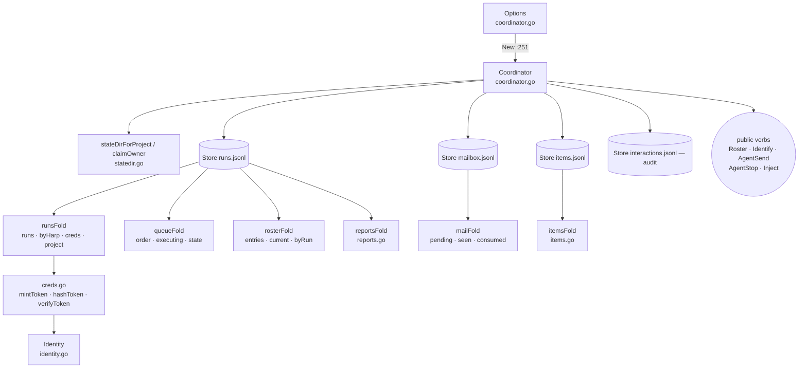

# Coordinator core — journal, folds, identity

`Coordinator` is the session-owning process's whole
delegation runtime: four append-only JSONL journals with their in-memory projections,
the bearer-credential registry, live child attachments, launch/retry bookkeeping,
approval parking, transport listeners and liveness. It owns the durability contract —
**a fact becomes visible only after it is on disk and fsynced** — and the identity
contract — **a bearer token maps to exactly one `(harp, run_id, depth, project)`**.

The type is a god object: ~40 fields across eight disjoint responsibility partitions,
five of them under a single `sync.Mutex`. An approval-ladder walk, a mail push-down, a
launch-gate check and a TUI roster read all serialize on `c.mu`.

```mermaid
flowchart TD
  OPT["Options<br/>coordinator.go"] -->|New :251| C["Coordinator<br/>coordinator.go"]
  C --> SD["stateDirForProject / claimOwner<br/>statedir.go"]
  C --> RS[("Store runs.jsonl")]
  C --> MS[("Store mailbox.jsonl")]
  C --> IS[("Store items.jsonl")]
  C --> AS[("Store interactions.jsonl — audit")]
  RS --> RF["runsFold<br/>runs · byHarp · creds · project"]
  RS --> QF["queueFold<br/>order · executing · state"]
  RS --> RoF["rosterFold<br/>entries · current · byRun"]
  RS --> RepF["reportsFold<br/>reports.go"]
  MS --> MF["mailFold<br/>pending · seen · consumed"]
  IS --> IF["itemsFold<br/>items.go"]
  RF --> CR["creds.go<br/>mintToken · hashToken · verifyToken"]
  CR --> ID["Identity<br/>identity.go"]
  C --> API(("public verbs<br/>Roster · Identify · AgentSend<br/>AgentStop · Inject"))
```

## The durability engine

| Symbol | What it is |
| --- | --- |
| `Fact` | one durable record: `Kind`, `At`, `Data`. `At` exists so folds never call `time.Now()` and replay is deterministic |
| `fold` (interface) | one method, `apply(Fact)`. Six implementations |
| `Store` | one JSONL journal + its folds under single-writer/fsync-first discipline |
| `openStore` / `openStoreFromOffset` | open, clamp a distrusted checkpoint offset, replay, start the writer goroutine |
| `Store.replay` | applies every complete line; truncates a **torn tail**, fails loudly on interior corruption. Reads the whole journal with `io.ReadAll` |
| `Store.execLocked` | `decide → append → fsync → apply` under the write lock — this ordering *is* the durability contract |
| `Store.Exec` | serializes `decide` through the writer goroutine; 28 production call sites |
| `Store.View` | quiescent read window; 45 call sites. Contract: do not retain references into fold state past the call |
| `Store.Offset` | write position, for the items checkpoint |

`decide` must not call `Exec` re-entrantly — it deadlocks on the unbuffered request
channel. Nothing states this.

## Fact vocabulary and folds

The 11 fact payload structs live at `facts.go`; `factAt` is the
single minting helper (a pass-through to `journal.go`'s `newFact`, which **panics**
on a marshal failure — loud, and correct for own-struct payloads).

| Fold | Projection | Notes |
| --- | --- | --- |
| `runsFold` | `runs` (run_id → `RunRecord`), `byHarp` (harp → latest run_id), `creds` (token hash → `Identity`), `project` | run registry and credential store folded from one journal so a terminal fact revokes atomically (`folds.go`) |
| `queueFold` | spawn order + the **exact** `executing` counter the concurrency ceiling reads | correctness rests entirely on `transition` — the most load-bearing 20 lines in the file |
| `rosterFold` | per-harp coordinator-visible state, latest attempt wins | `touch` silently no-ops for a superseded run — that guard is the point |
| `mailFold` | role-addressed durable queues + dedupe set + consume cursor | |
| `itemsFold` | plane-1 counting projection: `counts`, `chars`, `maxSeq` keyed by **run_id** | never stores delta text, only sizes |
| `reportsFold` | latest summary / checkpoint / per-artifact revision / per-harp seq watermark | see [artifacts.md](artifacts.md) |

`runsFold.byHarp` and `rosterFold.current` are the same harp→run_id index maintained
twice from one journal, with two reap policies (`runsFold` never prunes `byHarp`;
`rosterFold` prunes `byRun` only). The duplication buys fold independence.

Every fold arm decodes with `if fact.decode(&p) != nil { return }` — 12 occurrences.
Forward-compatible by design; a *corrupt* payload is indistinguishable from an unknown
one, and neither warns.

**Fold concurrency is sound.** `execLocked` holds the write lock across
decide→append→fsync→apply and `View` takes the read lock, so folds are single-writer
by construction and no fold field needs its own lock, including under concurrent
children.

## Read-model value types

| Type | Crosses the package boundary as |
| --- | --- |
| `RunRecord` | the run registry's public record — harp, run_id, agent, parent, engine, runtime, permission, MCP names, ladder, ended/cause, resumable |
| `RosterEntry` | one roster row |
| `Message` | one mailbox message (id, from, to, kind, body, structured, in_reply_to) |
| `Identity` | `Harp`, `RunID`, `Depth`, `Project` (persisted) + `Consumer` (`json:"-"`, in-memory only — a journaled consumer bit would outlive the process that minted it) |

`RunRecord` is copied by value at four sites (`cp := *r`) to escape the `View` window;
those copies are **shallow**, so `Ladder` and `MCPServers` share backing arrays. Safe
because both are fixed at enqueue and never mutated.

## Credentials and identity

| Function | Contract |
| --- | --- |
| `mintToken` | 256-bit token + its persisted SHA-256; fails loudly |
| `hashToken` | the persisted form of a bearer token |
| `verifyToken` | constant-time-per-candidate token → `Identity`; malformed stored hashes skipped |
| `Coordinator.RegisterSessionOwner` | mints and journals a **depth-0** credential (the session owner) |
| `Coordinator.Identify` | consumer creds first, then constant-time run-registry verify; patches an empty `Project` |
| `Identity.IsChild` | `Depth > 0` — the recursion and authorization predicate, 5 call sites |
| `runsFold.activeRunsForCred` | non-ended runs for a credential, used by runner-loss synthesis |

`Identity` and the `Env*` block are `core/sessions`' (its `identity.go` and `env.go`,
with the two env codecs `EncodeReach`/`DecodeReach` and `HookEnv`/`DecodeHookEnv`);
this package's `identity.go` re-exports them under the coordinator's names, and
`runnerEnv` renders the reach-back trio through `sessions.EncodeReach`.

**Divergences.**
- `RevokeSessionOwner` has **zero call sites anywhere,
  including tests**, so depth-0 owner credentials are never revoked — while
  `doc.go` asserts "revocation at run end severs the credential's streams and
  parked polls". That holds for *run* credentials (via `factRunEnded`, `folds.go`)
  and not for owner credentials; because `factSessionCred` is re-applied on every
  replay, every owner token ever minted for a project stays valid. `runsFold.identityFor`
  (`folds.go`) and the `factSessionCredRevoked` fold arm are dead for the same reason.
- `hashToken` — documented as the credential's persisted form — is also used to derive
  the state-directory name (`coordinator.go`). Changing the hash for a security
  reason would silently relocate every project's coordinator state.

## Lifecycle

`New` → `Serve` → `Close`
(`coordinator.go`), in that order.

| Step | Behaviour |
| --- | --- |
| defaults | `<= 0 means default`, four times; `TurnCap: -1` becomes 4 rather than erroring |
| state dir | `~/.ctxloom/coord/<base>-<hash12>`, 0700 |
| owner lock | exclusive `owner.pid` with stale-owner reclaim; `errStateOwned` drives an **ephemeral** state dir fallback |
| journals | four `openStore` calls; items may open from a checkpoint offset |
| adopt | terminates orphaned host runs, grace-times container runs |
| watchdogs | runner heartbeat watchdog + liveness watchdog |
| `goTracked` / `waitTracked` | `wg.Add` under `mu`, refused after `closing`; join with a 5s bounded escape |
| `Close` | closing → cancel → kill attachments → `srv.close` → join → close journals → remove an ephemeral dir |
| `audit` | appends one interaction fact; **warns, never gates** (I8) |

`New`'s five post-`WithCancel` failure paths call `closePartial`
but never `c.cancel()`, and on the ephemeral path never remove the temp dir they just
created; `closePartial` discards all four journal `Close()` errors.

## Public verbs on `Coordinator`

| Verb | Contract |
| --- | --- |
| `Roster` | sorted roster snapshot under `View` |
| `Identify` | token → `Identity`; the auth root for every transport |
| `AgentSend` | approval-reply interception → routing policy (I1) → durable queue → delivery-by-state |
| `AgentStop` | children refused (I2); `cancelLaunch` on **both** paths, then `terminateRun` |
| `Inject` | user-typed text as a turn, plus a `KindUserInjected` mirror notice to the target's parent |
| `WatchRuns` / `ListRuns` | see [observation.md](observation.md) |
| `Serve` / `ReachURL` | see [transport.md](transport.md) |
| `StartOwnedRun` / `SendOwnedRunTurn` | see [child-lifecycle.md](child-lifecycle.md) |

Every verb's request is validated in ONE place — `Validate` on its request
type (`coord.Verbs`, `verbs.go`): a transport (the RunChannel handlers, the
stdio surface in `mcp/mcp_tools_agents.go`) only decodes and calls the verb.
`SendRequest.Validate` holds the recipient, body and kind refusals;
`queueMailPayloadID` refuses an empty message and bounds it (`boundBody`)
at the chokepoint every sender shares — a message whose body and structured
companion together pass `MaxInlineBodyBytes` is delivered as its body's head
plus a marker naming a create-once artifact that holds the whole of it.

The delivery-by-state classification (`deliveryDisposition`) renders the ONE
state `deliverMailID` observed at the write in two vocabularies: `peerSend`
returns English prose, `Inject`/steer return the typed `Delivery*` constants.

## State directory

| Symbol | Notes |
| --- | --- |
| `stateDirForProject` | `~/.ctxloom/coord/<key>` at 0700 |
| `sanitizeKey` | replaces `/ \ : ..`; does **not** neutralize a bare `"."`, so a caller-supplied `ProjectKey` of `"."` resolves to `~/.ctxloom/coord` itself |
| `claimOwner` | writes `owner.pid`; the write and close errors are unchecked, so a zero-byte lock can exist for a live owner and the next claimant reads it as stale |
| `PidAlive` | two build-tagged one-line wrappers around `internal/shared/pidalive.Alive` |
