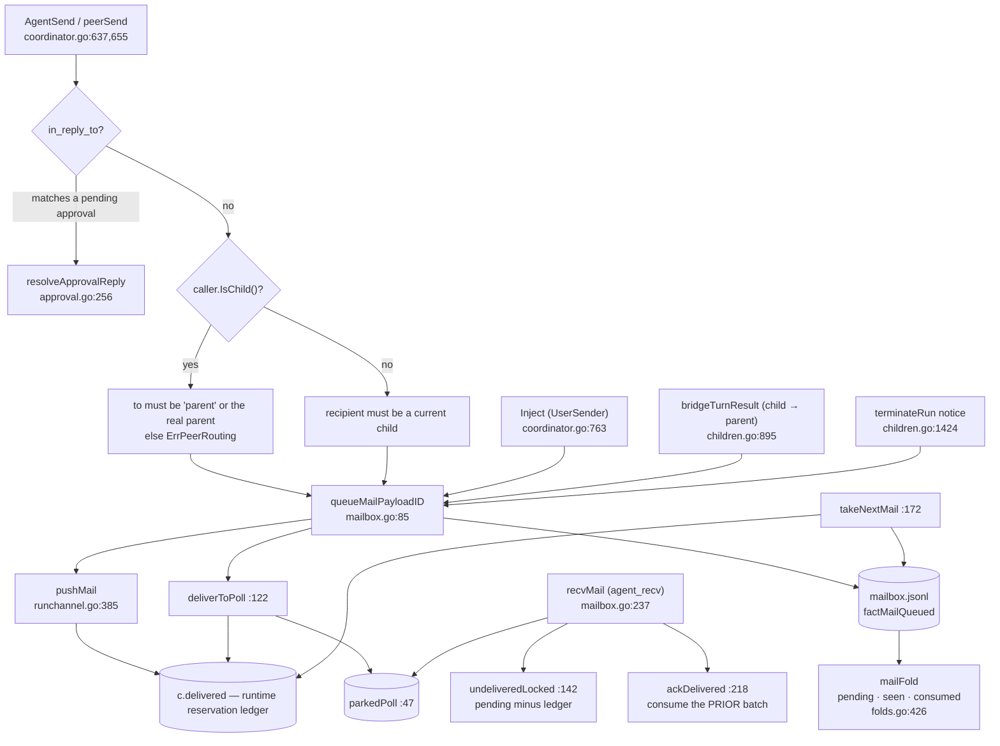

# Mailbox — durable messaging between coordinator and children

The mailbox is the only channel between a parent agent and its children. It is a
**durable, role-addressed, at-least-once queue** journaled to `mailbox.jsonl`: a
message is queued as a fact, deduped on `message_id`, delivered either to a parked
`agent_recv` long poll or pushed onto the child's live RunChannel as a turn, and
consumed by a cursor-ack that the *next* recv performs. Addressing is constrained:
a child may address only `"parent"` or its own parent's harp.

## Delivery semantics

| Rule | Where |
|---|---|
| Every message gets a unique `message_id` at queue time | `newMessageID`, `mailbox.go:59` |
| The fold dedupes on `message_id` (`mailFold.seen`) so a redelivered queue fact is idempotent | `folds.go:440-450` |
| Delivery is **at-least-once**: a recv implicitly acknowledges the messages a *prior* recv returned (cursor-ack) | `mailbox.go:218`, `coordinator.go:720` |
| Unacknowledged deliveries are re-delivered after a coordinator relaunch, because delivery is **not** recorded durably — only in the runtime ledger `c.delivered` | `coordinator.go:157`, `mailbox.go:142` |
| A message is invisible to `undeliveredLocked`/`pendingCount` while its id sits in the runtime ledger | `mailbox.go:142-156` |
| The ledger is cleared by `unreserve` only: on ack, on abandon, and on channel sever | `mailbox.go:195`, `runchannel.go:518` |
| `agent_recv` wait is bounded (`defaultRecvWait` 60s, `maxRecvWait` 10m, silently clamped) | `mcp/mcp_tools_agents.go:34-35`, `mcp/mcp_runner.go:505-511` |

## Addressing contract

| Caller | May address | Enforced at |
|---|---|---|
| a child (`Identity.Depth > 0`) | `"parent"` (`ParentAddress`) or its own parent's harp — anything else is `ErrPeerRouting` | `coordinator.go:669-673` |
| the session owner (depth 0) | any harp that is a *current* child of this coordinator; `"parent"` is refused ("this session is the coordinator — it has no parent") | `coordinator.go:676-687` |
| the user, via `Inject` | any current child, as `UserSender`, plus a `KindUserInjected` mirror notice to that child's parent | `coordinator.go:763` |

Sibling-to-sibling messaging does not exist. A child→parent `agent_send` also marks
`noteChildReported` (`coordinator.go:680`) so the automatic turn-boundary bridge does
not report the same turn twice.

## Message kinds

`result` (turn bridge), `message` (ordinary), `error`, `exited` / terminal notices,
`KindUserInjected` (mirror), plus the approval envelope whose `structured` carries a
marshalled `ApprovalRequest` under key `approval_request`
(`approval.go:365`).

## Inventory

| Symbol | file:line | What it does |
|---|---|---|
| `parkedPoll` | `mailbox.go:47` | one held `agent_recv` long poll; `done` is the single-completion arbiter, flipped under `c.mu` by four distinct paths |
| `pollResult` | `mailbox.go:53` | the `(msgs, err)` pair carried over `parkedPoll.ch` |
| `newMessageID` | `mailbox.go:59` | mints the dedupe key |
| `queueMail` / `queueMailPayload` / `queueMailPayloadID` | `mailbox.go:63,75,85` | durably queue, then attempt delivery to a parked poll or a live push |
| `deliverToPoll` | `mailbox.go:122` | hand a message to a parked poll and reserve its id; unparks the role on its own goroutine |
| `undeliveredLocked` | `mailbox.go:142` | pending minus the runtime ledger; filters in place into `pendingFor`'s copy |
| `pendingCount` | `mailbox.go:160` | count of deliverable mail — the predicate `relaunchForLeftoverMail` reads |
| `takeNextMail` | `mailbox.go:172` | pop the oldest deliverable message; journals `factMailConsumed` **before** returning |
| `unreserve` | `mailbox.go:195` | drop ids from the runtime ledger |
| `ackDelivered` | `mailbox.go:218` | append the consume fact for prior deliveries |
| `recvMail` | `mailbox.go:237` | the `agent_recv` long poll; typed errors `ErrRecvTimeout` / `ErrPeerPreempted` / revoked |
| `abandonPoll` | `mailbox.go:286` | resolve the timeout/cancel-vs-delivery race |
| `severPoll` | `mailbox.go:305` | complete a parked poll on revocation, without unparking |
| `pushMail` / `peerMessageProto` | `runchannel.go:385,428` | reserve then push undelivered mail as `CoordinatorNotice` frames; convert a `Message` into the wire `PeerMessage` |
| `Home.Recv` / `deliverNotice` / `turnPump` | `home.go:572,415,484` | the runner-side half: cursor-ack, drain or park; route a pushed message to park / turn queue / buffer; emit `mail_consumed` only **after** the engine accepts |
| `mailFold` | `folds.go:426` | `pending` (role → messages, pruned on consume), `seen` (dedupe), `consumed` (cursor) |

## Runner-side ordering guarantee

`Home.turnPump` (`home.go:484`) serializes hand-offs to the hosted engine and emits the
`ctxloom/mail_consumed` custom event only after the engine accepts the message; a
rejected message returns to the buffer. That is the at-least-once ordering done
correctly, and it is the reference for the rest of the path.

## Divergences and real behaviour

- **`mailFold.seen` and `mailFold.consumed` are never pruned** (`folds.go:428-429`).
  There is no mailbox reap fact; `factRunReaped` covers the run folds only, so a restart
  rebuilds both maps in full. Under one-shot driving (one-plus message per turn per
  harp) both grow monotonically.
- **`takeNextMail` journals consumption before delivery**, and every early return
  afterwards drops the message with no requeue and no warning: `wakeChild`'s failed
  `slots.acquire` (`children.go:1135-1141`), `sendTurn`'s `in == nil` and
  `baseCtx.Done()` arms (`children.go:1152-1161`). The comment in `takeNextMail`
  describes this window as a *crash* window; these are ordinary in-process returns.
- **`takeNextMail`'s journal-error path leaves the id reserved forever.** The id is
  appended to `c.delivered[role]` at `mailbox.go:181` *before* the `Exec`; the error
  branch at `:186-188` returns `(Message{}, false)` without unreserving and without
  warning. The sole caller (`children.go:1679`) then drives a turn with no prompt.
- **`pushMail` reserves before it queues the frame.** `c.delivered`/`ch.pushed` are
  appended for every message at `runchannel.go:401-404`, then the send is
  `select { case send <- notice: default: }` (`:414-419`). On a full 64-frame pump the
  notice is dropped while the id stays reserved, so a still-live child never receives
  it — and `agent_send` already reported success. The comment's "the ids stay reserved
  until the channel dies (then re-deliver)" holds only if the channel dies.
- **A RunChannel reconnect can strand pushed mail.** The deferred cleanup un-reserves
  only `if registered` (`runchannel.go:183-199`), and `registered` is false whenever the
  successor channel registered first — which is the ordinary reconnect ordering
  (`:165-170`). `ch.pushed` is then discarded without `unreserve`.
- **`abandonPoll` on a client-cancelled recv that lost the race returns the message to a
  caller that is gone** (`mailbox.go:286-292`) and never unreserves the id, so the
  message is invisible to every subsequent recv.
- **`Home.abandonPark` drops a delivered batch.** Its comment says "requeue"; there is
  no requeue (`home.go:646-652`). The coordinator still has the ids reserved, so
  re-delivery happens only when the RunChannel dies. `Recv`'s select can have both
  `<-p.ch` and `<-timer.C` ready, so Go picks at random.
- **`deliverToPoll`'s delivery goroutine calls `onRoleUnpark`, which can block on the
  execution-slot semaphore** (`mailbox.go:133-137` → `children.go:1762`), so the recv's
  documented bounded wait is not a bound.
- **Neither the mailbox nor `SendOwnedRunTurn` rejects an empty body**
  (`mailbox.go:85`, `owner_run.go:165`): an empty send is journaled, "delivered", and
  reported successful.
- **`servePeerSend` and `peerMessageProto` drop a structured payload on a marshal
  failure and still deliver** (`runchannel.go:686`, `:436-449`) — the message looks
  well-formed and the structured half is gone. For a relayed approval this converts a
  decision into an unanswerable message.
- **`terminateRun`'s parent notice is warn-only** (`children.go:1424-1426`) despite the
  invariant three lines above asserting the parent always learns of a child death.
- **`Inject`'s mirror notice is unguarded on an empty `ParentHarp`**
  (`coordinator.go:779`), unlike the two structurally identical sites
  (`children.go:1405`, `launchgate.go:334`), so it would queue into role `""`.
