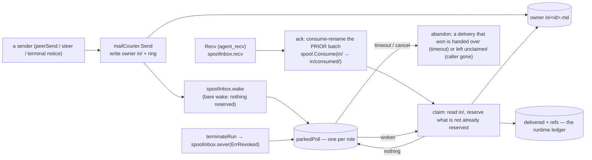

# The owner's inbox — `spoolInbox`

The session owner is the one recipient with no runner: a child's `in/` spool
is read by its `Home` on the far side of a run channel; the owner's is read by
`agent_recv` in the coordinator's own process. `spoolInbox`
(`internal/core/coord/spoolinbox.go`) is that reader and the parking in front
of it, as ONE type. The `Recv` verb (`Coordinator.Recv` → `spoolInbox.recv`)
refuses any role but the declared owner (`Options.OwnerHarp`, `ErrRecvNotOwner`).

```mermaid
flowchart LR
  SEND["a sender (peerSend / steer / terminal notice)"] --> COURIER["mailCourier.Send<br/>write owner in/ + ring"]
  COURIER --> FILE[("owner in/&lt;id&gt;.md")]
  COURIER --> WAKE["spoolInbox.wake<br/>(bare wake: nothing reserved)"]
  WAKE --> POLL[("parkedPoll — one per role")]
  RECV["Recv (agent_recv)<br/>spoolInbox.recv"] --> ACK["ack: consume-rename the PRIOR batch<br/>spool.Consume(in/ → in/consumed/)"]
  ACK --> CLAIM["claim: read in/, reserve what is not already reserved"]
  CLAIM --> FILE
  CLAIM --> LEDGER[("delivered + refs — the runtime ledger")]
  CLAIM -- nothing --> POLL
  POLL -- woken --> CLAIM
  POLL -- timeout / cancel --> ABANDON["abandon: a delivery that won is handed over (timeout) or left unclaimed (caller gone)"]
  SEVER["terminateRun → spoolInbox.sever(ErrRevoked)"] --> POLL
```

| Piece | What it owns |
|---|---|
| `spoolInbox.recv` | ack the prior batch, claim, or park for up to `wait` (`RecvWaitMax` bounds it); a newer receive preempts the parked one (`ErrRecvPreempted`) |
| `spoolInbox.wake` | completes a parked poll WITHOUT reserving anything — the payload is on disk; the woken receive claims it itself |
| `spoolInbox.claim` | the ONE place a hand-off becomes real: reads `in/`, reserves the ids it returns, remembers each file's ref; an unreadable message goes to `in/failed/` |
| `spoolInbox.ack` | consume-renames every reserved file and releases the reservation — one receive LATE, which is the at-least-once half |
| `spoolInbox.pending` | what is in `in/` minus what a live receive already holds (the ended-child relaunch reads this through `Coordinator.pendingCount`) |
| `spoolInbox.sever` | credential revocation completes the poll with `ErrRevoked`, without the unpark slot re-acquisition |

## Invariants

- **A wake reserves nothing.** Reserving at hand-off would mark a message
  ack-eligible for a caller that may never drain it (a preempted receive, a
  client that stopped listening); only a claim made by a caller that is still
  present reserves, so the next receive's ack never consumes what nobody saw.
- **No burst settling.** A claim reads the whole directory; what lands after
  it is the NEXT receive's, returned without parking (a receive begins with a
  read). For a terminal-driven owner the mail-pending reminder
  (`TerminalInjector`) is the wake for mail that landed with no receive
  parked — and it is NOT injected while one is parked.
- **Park ties to the execution slot.** `onPark`/`onUnpark` are the
  coordinator's `onRolePark`/`onRoleUnpark`: a parked owner yields its slot.
