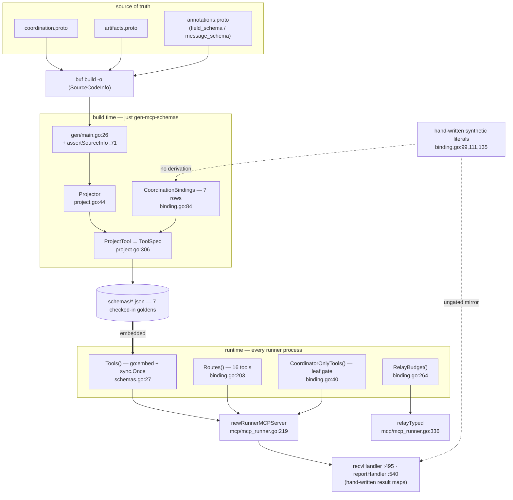

# MCP tool surface — `mcpschema`

`internal/agentcoord/mcpschema` owns **the contract an LLM sees for the
agent-coordination tools**: which proto message backs each tool (the binding table),
how proto descriptors project into JSON Schema (the projector and its seven lettered
rules), where every tool on the ctxloom MCP surface terminates (the routing table), and
the checked-in generated schemas served to every delegated child at startup. Its sibling
`mcpschema/gen` is the build-time generator.

This is the subsystem the rest of the repo should copy on derivation discipline: the
schemas are **mechanically derived** from the protos via `protoreflect` over a
buf-built `FileDescriptorSet` *with* `SourceCodeInfo`, and the drift gate is real and
does fail.

## Types

| Type | file:line | Role |
|---|---|---|
| `Binding` | `binding.go:54` | one row of the tool→proto binding table: `Tool`, `Input`/`Output` proto full names, `Description`, `SyntheticInput`/`SyntheticOutput` builders, and a redundant `Route` used only to cross-check the routing table |
| `Route` | `binding.go:174` | four-constant classification of where a tool terminates: `RouteCoordination` (zero value), `RouteCellLocal`, `RouteHostRelay`, `RouteArtifactFetch` |
| `Projector` | `project.go:44` | proto descriptor set → JSON Schema, under seven documented rules |
| `ToolSpec` | `project.go:296` | one generated tool entry — simultaneously the on-disk golden format and the runtime registration payload |

## Functions

| Function | file:line | What it does |
|---|---|---|
| `CoordinationBindings` | `binding.go:84` | the 7-row binding table: `agent_run`, `agent_send`, `agent_recv`, `agent_report`, `agent_stop`, `roster`, `agent_fetch_artifact` |
| `Routes` | `binding.go:203` | the exhaustive 16-tool classification the runner dispatches on |
| `CoordinatorOnlyTools` | `binding.go:40` | the 4-tool set withheld from leaf agents — the delegation trust boundary |
| `RelayBudget` | `binding.go:264` | per-tool relay budget; zero means "the caller's default" |
| `NewProjector` | `project.go:50` | indexes a `FileDescriptorSet` into a `protoregistry.Files` |
| `Projector.MessageSchema` / `MessageDoc` | `project.go:73,83` | public entry points used by the synthetic builders and `ProjectTool` |
| `Projector.messageSchema` / `fieldSchema` / `singularSchema` / `wellKnownOrMessage` | `project.go:106,145,190,225` | the recursive body: per-field projection, `required` assembly, recursion guard, kind mapping, well-known types |
| `fieldAnnotation` / `fieldDoc` / `messageDoc` / `leadingComment` / `normalizeComment` | `project.go:252,243,91,268,279` | `(field_schema)` / `(message_schema)` overrides, else the proto's own leading comment |
| `Projector.ProjectTool` | `project.go:306` | builds one `ToolSpec`: both schema sides, closes `additionalProperties` on the root, resolves the description, marshals |
| `Projector.sideSchema` | `project.go:347` | three-way: bound message / synthetic builder / absent (`nil, nil` means "no output schema") |
| `Tools` | `schemas.go:27` | once-loads and sorts the 7 embedded goldens |
| `ToolByName` | `schemas.go:53` | linear lookup; test-only |
| `gen.main` | `gen/main.go:26` | parse flags, read and unmarshal the descriptor set, assert source info, project, write one file per binding |
| `gen.assertSourceInfo` | `gen/main.go:71` | fails loudly when the descriptor set has no `SourceCodeInfo` for `agentcoord.v1` — it converts a silent quality degradation (descriptions falling back to annotation-only) into a hard failure |
| `gen.writeSpec` | `gen/main.go:83` | deterministic encoding: stable indent, no HTML escaping, trailing newline |

## Contracts

| # | Contract | Where |
|---|---|---|
| M1 | Every generated tool schema is derived from the proto descriptor set, never hand-written — except three declared synthetic fragments | `project.go`, `binding.go:99,111,135` |
| M2 | The binding table and the routing table are pinned against each other, so drift between them is impossible | `binding_test.go:53-61` (via `Binding.Route`) |
| M3 | One golden per binding, no strays — a bidirectional cardinality assertion | `binding_test.go:24` |
| M4 | Generation fails rather than degrading when the descriptor set lacks source info | `gen/main.go:71` |
| M5 | Leaf (non-coordinator) children are denied the coordinator-only tools | `binding.go:40` → `mcp/mcp_runner.go:283` |
| M6 | Every classified tool must be served by some route, checked at runner startup | `mcp/mcp_runner.go:312-316` |

The drift gate is `just gen-mcp-schemas-check` — regenerate, then
`git diff --exit-code -- internal/agentcoord/mcpschema/schemas` — wired at
`.github/workflows/ci.yml:187`. `binding_test.go:24` runs in the unit-test job where
regeneration does *not* happen, and catches the two cases `git diff --exit-code`
structurally cannot: a new untracked golden, and a stale golden for a deleted binding.

## Real behaviour worth knowing

- **The gate is a tautology over the hand-written parts.** Three schema fragments are Go
  map literals: `agent_recv`'s input (`binding.go:99-110`), `agent_recv`'s output
  envelope (`:111-125`) and `agent_report`'s output (`:135-150`). Regenerating from
  `binding.go` and diffing against a golden generated from `binding.go` proves the golden
  matches the literal; it says nothing about whether the literal matches the runtime
  handler, which is a *second* hand-written map literal in another package
  (`mcp/mcp_runner.go:530,607`). They agree today and nothing enforces that they continue
  to.
- **`agent_recv`'s schema prose hard-codes "default 60, max 600"** while the real values
  are `defaultRecvWait` and `maxRecvWait` in `mcp/mcp_tools_agents.go:34-35`, and the
  runtime **silently clamps** rather than rejecting (`mcp/mcp_runner.go:509`).
- **`additionalProperties: false` is set only at the top level** (`project.go:317`), so
  the stated "models must not invent argument names" invariant does not hold for nested
  objects (`agent_run`'s `budget`, `roster`'s `runs.items`, `agent_recv`'s
  `messages.items` and `artifacts.items`). `unmarshalArgs` uses `protojson` with default
  options, which rejects unknown fields at *every* depth, so a nested unknown key is
  schema-legal and unmarshal-fatal.
- **The `required` keyword this package emits is enforced by nobody.**
  `server.AddTool`'s contract states validation is the caller's responsibility, and the
  caller (`mcp/mcp_runner.go:447`) uses `protojson`, which has no concept of `required`
  and returns `nil` on zero-length arguments — so `agent_run` with `{}` produces a fully
  zero-valued `SpawnAgentRequest`. `agent_report`'s handler validates its own requireds
  explicitly (`mcp/mcp_runner.go:547-552`).
- **`Route` has no `RouteUnspecified`**, so a `Routes()` map miss is indistinguishable
  from a deliberate `RouteCoordination`. Unreachable today only because M2/M3 pin the two
  tables together.
- **`CoordinatorOnlyTools` is a hand-maintained security-relevant allowlist with no
  derivation and no gate** (`binding.go:40-47`); the leaf-gate tests iterate it, which
  tests the mechanism rather than the membership. A new coordinator-scoped tool whose
  author forgets to add it is silently granted to every leaf child.
- **`ProjectTool` does not assert `"type": "object"` on the schemas it emits**, which
  the MCP SDK requires on pain of a `panic` at every child runner's startup. The input
  side is incidentally covered by `binding_test.go:32`; the output side is not.
- **`gen.assertSourceInfo` returns on the first `agentcoord.v1` file it finds with
  source info** (`gen/main.go:71-78`), but the package spans **two** `.proto` files
  (`coordination.proto:188`, `artifacts.proto:66`), so it is an existential check where
  the intent is universal.
- ~~**The generator can write zero files and exit 0.**~~ — **RESOLVED `20451f26`**
  (U027-F01). The loop is now `generateSchemas()`, which **refuses an empty binding
  table** and returns a count the caller prints from **outside** the loop; `just
  gen-mcp-schemas` exits 1 on an empty table where it previously exited 0. The old
  shape is the characteristic defect stated exactly: the only stdout line was inside
  the loop, so a generator that did nothing had no way to say so.
  **Still open — it never prunes.** A renamed or deleted binding leaves its old
  `<tool>.json`, which `//go:embed schemas/*.json` keeps serving, and `git diff
  --exit-code` cannot see a file the generator merely stopped writing. Caught by
  `binding_test.go:24` rather than by the generator or CI's diff.
- **A mistyped `-out` silently succeeds** into a newly created directory
  (`gen/main.go:28,50` — `os.MkdirAll` creates whatever it is given) while the tracked
  goldens go unchanged and the CI diff passes.
- **`Tools()` returns the package-level slice by reference, and on error returns a
  partially populated slice alongside the error** (`schemas.go:49`).
- **A malformed `(field_schema).example` is silently discarded** (`project.go:180-185`)
  — the schema loses the example with no generation-time complaint.
- **The recursion guard's `"(recursive X)"` description is overwritten** whenever the
  recursing field carries a doc (`project.go:107-112` vs `:177-179`). No current golden
  contains the marker.
- **9 of the 16 routed tools have no `Tool*` constant** and appear as raw string
  literals in `Routes()`, `relayBudgets` and two slice literals in `mcp/mcp_runner.go`.
