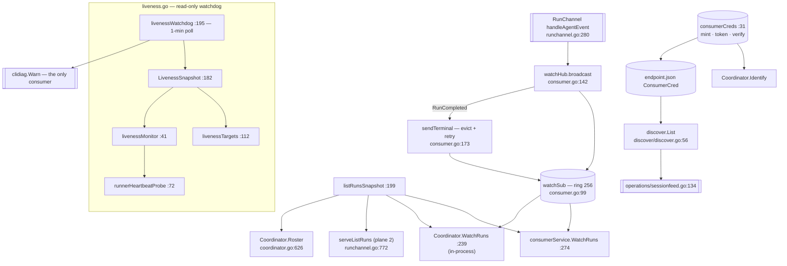

# Observation plane — roster, live events, liveness

The observation plane is the **read-only** view of delegation: a roster projection
shared by every transport, a non-blocking live fan-out of every `AgentEvent` to
subscribers, a process-lifetime read-only credential class, and a watchdog that assesses
whether each live child is progressing. Its contract is that observers can never mutate
run state — `ConsumerService` carries no steer or inject verb, and the gRPC auth
interceptors refuse consumer credentials on `CoordinatorService` entirely.

## Roster projection

`listRunsSnapshot` (`consumer.go:199`) is the single projection behind every transport
— the plane-2 `list_runs` handler, `Coordinator.Roster`, `ConsumerService.ListRuns` and
the `WatchRuns` snapshot frame. It walks `rosterFold.snapshot()`, joins each harp to its
current `RunRecord`, and applies two filters.

| `RunInfo` field | Populated from | Notes |
|---|---|---|
| `run_id` | `rec.RunID` | |
| `agent.agent_id` | `e.Harp` | |
| `agent.role` | `rec.Agent` | the other five `AgentIdentity` fields are never set |
| `phase` | `e.State` | real vocabulary: `queued`, `executing`, `parked`, `idle`, `ended` (`folds.go:12-16`) |
| `latest_summary` | `reportsF.latestSummary(harp)` | first line, 200 bytes |
| `parent_run_id` | `rec.ParentRunID` | the field descendant scoping would need |
| `permission_mode` | `rec.Permission` | fixed at enqueue |
| `mcp_servers` | `rec.MCPServers` | **names only** — the roster consumer's black-box view onto privilege scoping |

Filters honoured: `include_terminal` (ended entries are skipped unless set) and `role`.
Harps with no current run are skipped silently, which is correct because the reap never
removes a harp's current run.

## Live event fan-out

| Symbol | file:line | Contract |
|---|---|---|
| `watchHub` | `consumer.go:88` | live fan-out of every `AgentEvent` to subscribers |
| `watchSub` | `consumer.go:99` | one subscription: an optional run-id filter plus a bounded ring of 256 |
| `watchHub.subscribe` | `consumer.go:107` | registers a subscriber, returns its ring and a cancel |
| `watchHub.broadcast` | `consumer.go:142` | non-blocking fan-out; **drops are by design** and are recovered downstream via seq-gap detection |
| `sendTerminal` | `consumer.go:173` | bounded evict-then-retry placement of a terminal event, because a consumer that waits on `RunCompleted` hangs forever if it is dropped |
| `Coordinator.WatchRuns` | `consumer.go:239` | in-process subscribe-**then**-snapshot (that order is the no-gap guarantee) |
| `consumerService.WatchRuns` | `consumer.go:274` | streams a snapshot frame then live events |
| `Coordinator.ListRuns` | `consumer.go:253` | one-line pass-through; test-only — production uses `consumerService.ListRuns` or `listRunsSnapshot` directly |

Both production subscribers call `WatchRuns(nil)` — no run filter — so one ring carries
every run's events (`cli/acp_children.go:32`, `cli/run_owned.go:86`).
`operations/sessionfeed.go`'s consumer ends a feed **only** on `RunCompleted`, which is
why `sendTerminal` exists.

## Consumer credentials

| Symbol | file:line | Contract |
|---|---|---|
| `consumerCreds` | `consumer.go:31` | the process-lifetime read-only credential class |
| `consumerCreds.mint` / `token` / `verify` | `consumer.go:40,53,62` | minted once by `Serve`; `verify` is constant-time and fails closed on empty |
| `Identity.Consumer` | `identity.go:76` | `json:"-"` — deliberately never journaled, so it cannot outlive the process that minted it |

The token is persisted only in `endpoint.json` (0600), which is also the discovery
point. `discover.List` reads both halves and returns dial-ready `(URL, Cred)` pairs
sorted most-recently-active first.

## Liveness watchdog

| Symbol | file:line | Contract |
|---|---|---|
| `livenessWatchdog` | `liveness.go:195` | 1-minute poll; warns on state transitions |
| `LivenessSnapshot` | `liveness.go:182` | assess-all, on demand |
| `livenessTargets` | `liveness.go` | folds + approvals + the live attachment's `workDir` → `[]liveness.Target`; a path-resolution error warns and degrades to an unobserved transcript (`StateUnknown`, never a stall); parked children are explicitly exempt from the stall verdict |
| `livenessMonitor` | `liveness.go` | lazily builds and memoizes the monitor; the monitor itself is stateless since U056-F04 removed the CPU sampling |
| `runnerHeartbeatProbe` | `liveness.go:72` | the universal probe; **absence is reported as `Observed:false`, never as dead** |

The watchdog is read-only: it never terminates, relaunches or reaps.

## Divergences and real behaviour

- **`RunInfo.task_id` and `RunInfo.last_event_at` are set nowhere.** `listRunsSnapshot`
  (`consumer.go:214-232`) populates seven fields and neither of those; the `roster` tool
  description shipped to the model says each entry carries "the agent's harp (agent_id),
  current run_id, state, latest report summary, and **last activity**"
  (`mcpschema/schemas/roster.json`). `task_id` rides six proto messages and has zero
  references repo-wide.
- **`roster`'s `include_descendants` and `task_id` filters are accepted and discarded.**
  `serveListRuns` (`runchannel.go:772-783`) passes only `include_terminal` and `role`, so
  `include_descendants: true` returns the identical result.
- **`RunInfo.phase`'s documented vocabulary is wrong.** The proto comment
  (`coordination.proto:732`) says "`StatusChanged.Phase` name or `TERMINAL`"; the real
  values are `queued|executing|parked|idle|ended`, and `StatusChanged` is never
  constructed. The wrong string is copied verbatim into `schemas/roster.json`.
- **`AgentIdentity` is 2 of 7 fields populated.** `display_name`, `harness`,
  `harness_version`, `model` and `runner_id` are never set, so `RunStarted`'s claim that
  the identity is "repeated here so the log is self-contained without Hello" does not
  hold; `runner_id`'s own comment says it is "coordinator-assigned and validated against
  the connection credential".
- **`sendTerminal`'s eviction is payload-blind** (`consumer.go:188-191`): it drains the
  oldest queued event without inspecting it, so it can evict *another* run's terminal,
  and when the bounded retry is exhausted the terminal is dropped with **no log line at
  all** (`:180-187`).
- **Legacy-driver children are not live-observable.** `driveChild`'s note
  (`children.go:1000-1009`) calls this "an accepted, documented gap on an already-degraded
  path", and since S3b migrated `opencode` onto StartRun no PRODUCTION backend reaches
  it by backend identity: the frozen residue (`legacyChatBackends`) is the `mock` test
  backend alone. The gap survives only for a degraded (no-reach-back) spawn of an
  otherwise-migrated backend, which is already unobservable for the same reason it is
  degraded. The path is FROZEN for retirement (spool-cutover RETIRE-FIRST ruling;
  `spawner.go`'s `checkLegacyChatFreeze`) and the gap closes entirely when it is deleted
  with the mailbox machinery.
- **`LivenessSnapshot` is exported with no out-of-package caller** (`liveness.go:182`);
  its only production consumer is the watchdog's `clidiag.Warn`. The monitor computes a
  `SeqPinned` signal — the exact symptom the container-delegation defect presents as —
  and nothing in the retry or relaunch path imports `liveness`.
- **`discover.List` collapses six failure modes into an empty result with no error
  channel** (`discover/discover.go:57-72`): `UserHomeDir` error, discarded `Glob` error,
  `ReadFile` error, JSON decode error, zero port, empty credential. Its sole consumer
  then reports `"no coordinator endpoint found (no ~/.ctxloom/coord/*/endpoint.json)"`
  (`operations/sessionfeed.go:134-137`) — asserting the file is absent when it may be
  present and unreadable. Only the missing-credential skip is documented as intentional.
- **`discover`'s sort comparator calls `os.Stat` on every comparison**
  (`discover/discover.go:62`), so a coordinator rewriting its `endpoint.json` mid-sort can
  make the comparator inconsistent; `sort.Slice` is also unstable, so equal mtimes order
  non-deterministically.
- **`Endpoint.Cred` is a plain exported string with no redaction affordance**
  (`discover/discover.go:38-41`): any `%v` of an `Endpoint` prints a live bearer token.
