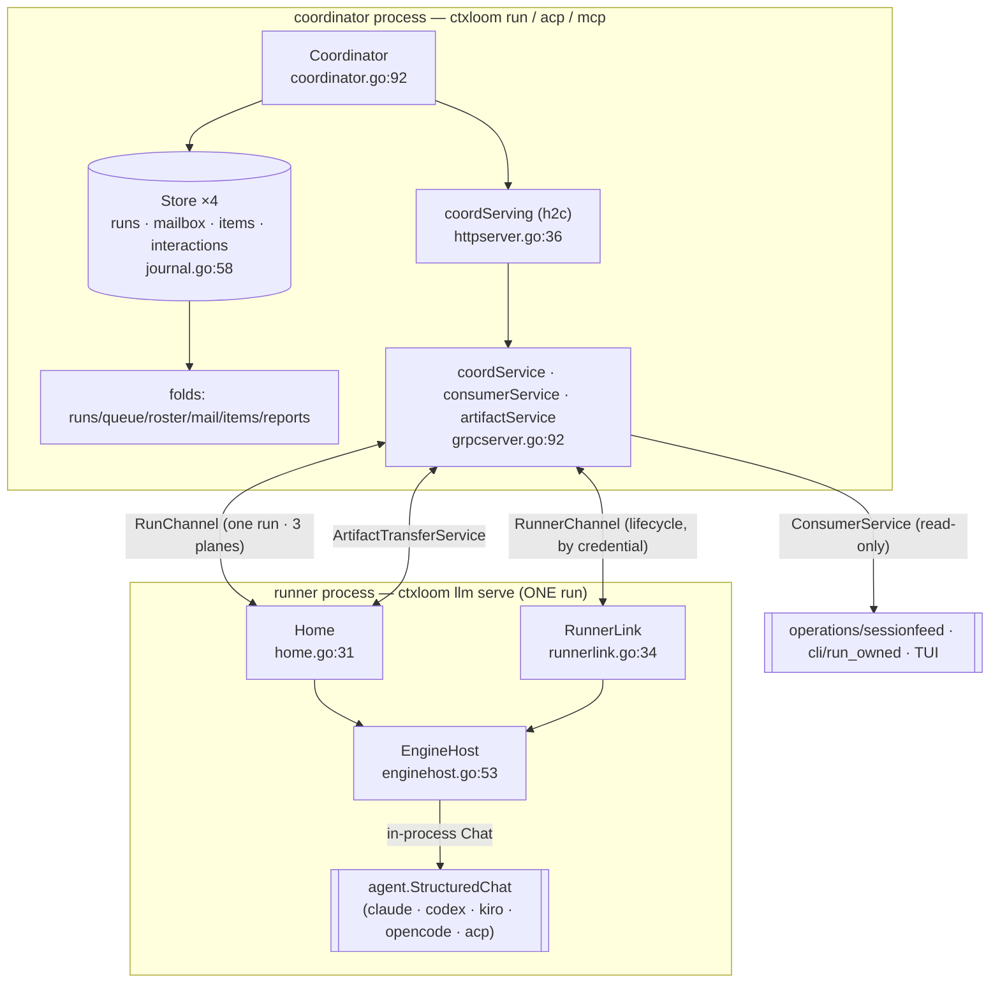

# agentcoord — overview

`internal/agentcoord` is the **agent-delegation subsystem**: the wire contract
(`agentcoord.v1` protos), the coordinator runtime (`coord`), the MCP tool surface the
delegating LLM sees (`mcpschema`), and out-of-process endpoint discovery (`discover`).
It owns one contract: *a session can spawn other agent sessions as children, exchange
durable messages with them, receive their reports, and fetch their work products —
across process, container and worktree boundaries — with every state change recorded
as an append-only fact.*

Everything durable in delegation passes through `internal/agentcoord/coord`:
`runs.jsonl`, `mailbox.jsonl`, `items.jsonl`, `interactions.jsonl`, the credential
set, the content-addressed artifact store, and the harp↔run index.

## Process topology

Two processes, one bidirectional gRPC link per run.



Three planes ride one `RunChannel`:

| Plane | Direction | Carrier | Semantics |
|---|---|---|---|
| 1 — events | agent → coordinator | `AgentEvent` | durable, sequenced, cumulative `Ack` |
| 2 — requests | agent → coordinator | `AgentRequest` / `CoordinatorResponse` | approval, spawn_agent, peer_send, list_runs, stop_run, custom |
| 3 — notices | coordinator → agent | `CoordinatorNotice` | mail push (`peer_message`); fire-and-forget |

The downward request direction (`CoordinatorRequest`: steer/question/summarize/pause/
resume) exists in the proto and has **zero implementation** — see
[wire-contract.md](wire-contract.md).

## Message flow — spawn to artifact fetch

```mermaid
sequenceDiagram
  autonumber
  participant P as Parent agent (LLM)
  participant CO as Coordinator
  participant SP as Spawner / operations
  participant H as Home (runner)
  participant CH as Child engine

  P->>CO: agent_run{role, input.prompt}
  CO->>SP: Resolve(agent) → SpawnPlan (profiles, engine, runtime, ladder, MCP)
  CO->>CO: AssignSession → harp; enqueueRun → mint run_id + bearer token<br/>journal factRunEnqueued (children.go:272)
  CO->>CO: slots.Acquire (cap = delegation.concurrency, default 4)
  CO-->>P: RunOutcome{harp, run_id, engine, queued} — "spawned" (fixed at enqueue)
  CO->>SP: StartEngine → runner process with reach-back trio in env
  H->>CO: RunnerHello / RunChannel Hello (bearer token)
  CO->>H: StartRun{HarnessSpec, Input{prompt}}
  H->>CH: StructuredChat in-process (enginehost.go:311)
  CH-->>H: native events
  H->>CO: AgentEvent stream (plane 1) → items.jsonl, roster, watchHub
  CO-->>H: Ack{committed_seq}

  P->>CO: agent_send{to: harp, text}
  CO->>CO: queueMail → factMailQueued (mailbox.go:85)
  CO->>H: CoordinatorNotice{peer_message} (pushMail, runchannel.go:385)
  H->>CH: turn text (SetTurnSink / turnPump)
  CH-->>H: turn output
  H->>CO: AgentEvent{MessageDelta FINAL} → accumulateFinalText
  CO->>CO: bridgeTurnResult → queueMail(child → parent, kind "result")
  P->>CO: agent_recv (long poll, up to 600s)
  CO-->>P: []Message (at-least-once; cursor-acked by the NEXT recv)

  CH->>H: agent_report{summary, publish_paths}
  H->>CO: UploadArtifact stream (sha256 CAS)
  H->>CO: AgentEvent{Summary} + AgentEvent{ArtifactProduced}
  CO->>CO: recordSummary / recordArtifact → reportsFold
  P->>CO: agent_fetch_artifact{artifact_id}
  CO->>H: DownloadArtifact → header(sha256) + chunks
  H->>H: verify sha256 BEFORE placing (homeartifacts.go:148)
```

## System-wide invariants

| # | Invariant | Enforced at |
|---|---|---|
| I1 | A child may address only `"parent"` or its own parent's harp; anything else is `ErrPeerRouting` | `coordinator.go:669-673` |
| I2 | Only a non-child (depth-0) caller may `agent_stop`, `roster`, or `agent_run` beyond the leaf gate | `coordinator.go:728`, `runchannel.go:775`, `mcpschema/binding.go:40` |
| I3 | Facts become visible only after they are durable: `decide → append → fsync → apply` under one write lock | `journal.go:207` (`execLocked`) |
| I4 | Folds are single-writer by construction; `View` is a read-lock window and callers must not retain references out of it | `journal.go:248,261` |
| I5 | Mail delivery is **at-least-once**, deduped on `message_id`; a recv implicitly acks the *previous* recv's batch (cursor-ack) | `folds.go:440`, `mailbox.go:218` |
| I6 | Every run death funnels through one exactly-once terminal (`terminateRun`) which frees the slot, revokes the credential, severs the channel and notices the parent | `children.go:1299` |
| I7 | Approval resolution is a fail-closed allow-list: only `ACCEPT` / `ACCEPT_FOR_SESSION` grant | `enginehost.go:739`, `approval.go:452` |
| I8 | The audit journal (`interactions.jsonl`) is **never a gate** — `audit` warns and proceeds | `coordinator.go:565` |
| I9 | Artifacts move by reference; the receiver verifies sha256 against the manifest before placing bytes | `homeartifacts.go:148-154` |
| I10 | A run's identity is `(harp, run_id)`; a resume mints a **fresh run_id** under the same harp | `children.go:1522`, `folds.go:182` |

## Divergence index

Documented behaviour that differs from real behaviour, one line each. Detail on the
linked page.

| Divergence | Page |
|---|---|
| `agent_stop` on a one-shot child between turns reports `"had already ended (oneshot-boundary)"` — a refusal-shaped message for a stop that did take effect | [child-lifecycle.md](child-lifecycle.md) |
| `RunInfo.task_id` and `RunInfo.last_event_at` are set nowhere, while the `roster` tool schema promises "last activity" | [observation.md](observation.md), [wire-contract.md](wire-contract.md) |
| 8 LLM-facing MCP tool arguments are schema-validated and then discarded (`budget`, `constraints`, `notify_on`, `include_descendants`, `task_id`, `grace`, `reason`, `artifact_ids`) | [wire-contract.md](wire-contract.md) |
| `HarnessSpec.extra_args` documents a runner-side allowlist that does not exist and is never read | [transport.md](transport.md) |
| `HelloAck.committed_seq` is documented as "the authoritative resume cursor"; the coordinator echoes back the agent's own claim | [transport.md](transport.md) |
| The audit journal fails open (warn-and-proceed) while enforcement fails closed; `relayApproval` journals `resolution: "timed_out"` for three non-timeout failures | [approvals.md](approvals.md) |
| An approval reply whose `structured` payload failed to marshal at the edge is queued as ordinary mail; the strict decoder then blames the sender | [approvals.md](approvals.md) |
| `RevokeSessionOwner` has zero call sites — depth-0 owner credentials are never revoked, contradicting `doc.go:16-18` | [coordinator-core.md](coordinator-core.md) |
| `Home.abandonPark`'s comment says "requeue"; no requeue exists | [transport.md](transport.md) |
| `artifactstore.go:20-24` attributes corrupt-read detection to `artifacts.go`; verification is client-side in `homeartifacts.go` | [artifacts.md](artifacts.md) |
| `jsonrpc`'s package doc claims it "warns and continues on a malformed frame"; any decode error tears the session down | [acp-jsonrpc.md](acp-jsonrpc.md) |
| `ChatRequest.Runtime` and `ResumeSessionID` do not exist on the `ChatStart` proto, so the ACP container transport and `session/load` resume are unreachable on the go-plugin path (reachable in-process via `EngineHost`) | [acp-client.md](acp-client.md) |
| Summary dedupe keys `(harp, seq)` while `seq` is per-run and restarts at 1 on resume | [artifacts.md](artifacts.md) |
| `children.go:551-554` claims the legacy chat path is production-unreachable; `antigravity` and `opencode` both take it | [child-lifecycle.md](child-lifecycle.md) |
| `spawner.go:102-119` says one-shot is "not yet executed (v0.8)"; `Resolve` returns `ResumeModeOneShot` for claude-code and codex today | [child-lifecycle.md](child-lifecycle.md) |
