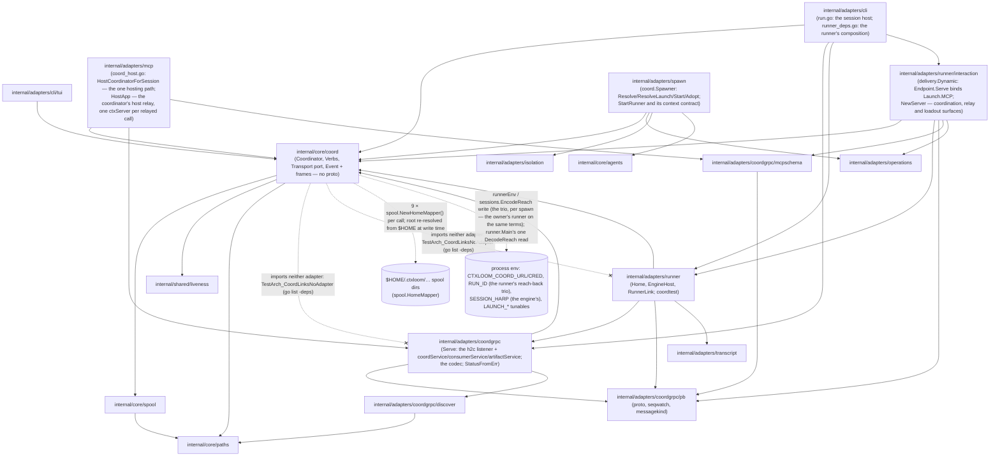
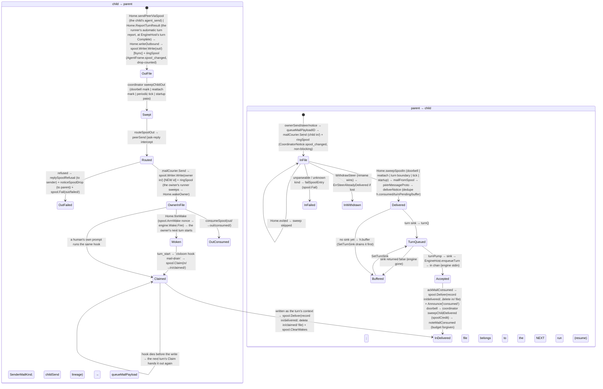

# agentcoord — overview

The **agent-delegation subsystem** is four packages on one contract: the wire
(`internal/adapters/coordgrpc` — `coordgrpc.Serve` terminates `agentcoord.v1` from
`coordination.proto` / `artifacts.proto` in `coordgrpc/pb`, plus `seqwatch.go` and
`messagekind.go`; the codec both ways; `mcpschema`, the MCP tool surface the
delegating LLM sees; `discover`, out-of-process endpoint discovery for consumers with
no coordinator of their own), the coordinator half of the runtime
(`internal/core/coord` — `Coordinator`, `Verbs`, the domain vocabulary typed
without the proto), the runner half (`internal/adapters/runner` — `Home`,
`EngineHost`, `RunnerLink`; it dials the coordinator and speaks the wire through
`coordgrpc`'s codec), and the file substrate messages live in (`internal/core/spool`).
The contract: *a session can spawn other agent sessions as children, exchange
durable messages with them, receive their reports, and fetch their work products —
across process, container and worktree boundaries — with every state change
recorded as an append-only fact or an on-disk file.*

Everything durable in delegation is one of:

- **Three journals** under the coordinator's state dir, each a `coord.Store`
  replayed into folds (`runsFold`, `queueFold`, `rosterFold`, `reportsFold`,
  `itemsFold`): `runs.jsonl` (run lifecycle and session credentials), `items.jsonl`
  (the plane-1 event stream), `interactions.jsonl` (the audit journal). See
  `Coordinator.openJournals`.
- **The spool**: one directory per session harp under `paths.HarpPersistDir`
  (`spool.SpoolDirName`), holding `in/`, `out/`, `out/consumed/`, `in/withdrawn/`,
  the `failed/` subdirectories (`spool.Dir`, `spool.Dirs`, `spool.FailedDirNames`)
  and `in/delivered/`, the delivered-identity record (`spool.Deliver`).
  A message is a file; the file is the payload's only carrier. The package doc of
  `internal/core/spool` is the authority on its properties.
- **The content-addressed artifact store** (`artifactstore.go`), keyed by sha256.

There is no message journal: a message's durability is the fsynced file. An `out/`
message is acknowledged by the rename that moves it into `out/consumed/`; an inbox
message by `spool.Deliver`, which records its identity in `in/delivered/` and then
deletes it.

## Package topology

Solid arrows are imports the layering expects (README package map, `tests/arch`
`layering_test.go`, `coord/doc.go`); the crossed dotted arrows are the two imports
the ring forbids and `TestArch_CoordLinksNoAdapter` pins absent; dotted arrows are
hidden couplings through the environment or the filesystem.

```mermaid
flowchart TD
  CLI["internal/adapters/cli<br/>(run.go: the session host; runner_deps.go: the runner's composition)"]
  TUI["internal/adapters/cli/tui"]
  MCP["internal/adapters/mcp<br/>(coord_host.go: HostCoordinatorForSession — the one hosting path;<br/>HostApp — the coordinator's host relay, one ctxServer per relayed call)"]
  RMCP["internal/adapters/runner/interaction<br/>(delivery.Dynamic: Endpoint.Serve binds Launch.MCP;<br/>NewServer — coordination, relay and loadout surfaces)"]
  SPAWN["internal/adapters/spawn<br/>(coord.Spawner: Resolve/ResolveLaunch/Start/Adopt;<br/>StartRunner and its context contract)"]
  COORD["internal/core/coord<br/>(Coordinator, Verbs, Transport port, Event + frames — no proto)"]
  CGRPC["internal/adapters/coordgrpc<br/>(Serve: the h2c listener + coordService/consumerService/artifactService;<br/>the codec; StatusFromErr)"]
  RUNNER["internal/adapters/runner<br/>(Home, EngineHost, RunnerLink; coordtest)"]
  PROTO["internal/adapters/coordgrpc/pb (proto, seqwatch, messagekind)"]
  SCHEMA["internal/adapters/coordgrpc/mcpschema"]
  SPOOL["internal/core/spool"]
  DISC["internal/adapters/coordgrpc/discover"]
  OPS["internal/adapters/operations"]
  ISO["internal/adapters/isolation"]
  TRANS["internal/adapters/transcript"]
  AGENTS["internal/core/agents"]
  LIVE["internal/shared/liveness"]
  PATHS["internal/core/paths"]
  FS[("$HOME/.ctxloom/… spool dirs<br/>(spool.HomeMapper)")]
  ENV[("process env: CTXLOOM_COORD_URL/CRED, RUN_ID (the runner's reach-back trio),<br/>SESSION_HARP (the engine's), LAUNCH_* tunables")]

  CLI --> COORD
  CLI --> CGRPC
  CLI --> RUNNER
  CLI --> RMCP
  TUI --> COORD
  MCP --> COORD
  MCP --> CGRPC
  MCP --> SCHEMA
  RMCP --> COORD
  RMCP --> RUNNER
  RMCP --> PROTO
  RMCP --> SCHEMA
  RMCP --> OPS
  SPAWN --> COORD
  SPAWN --> OPS
  SPAWN --> ISO
  SPAWN --> AGENTS
  CGRPC --> COORD
  CGRPC --> PROTO
  CGRPC --> DISC
  RUNNER --> COORD
  RUNNER --> CGRPC
  RUNNER --> PROTO
  RUNNER --> TRANS
  COORD --> SPOOL
  COORD --> LIVE
  COORD --> PATHS
  SCHEMA --> PROTO
  SPOOL --> PATHS
  DISC --> PATHS
  COORD -. "imports neither adapter: TestArch_CoordLinksNoAdapter (go list -deps)" .-x CGRPC
  COORD -. "imports neither adapter: TestArch_CoordLinksNoAdapter (go list -deps)" .-x RUNNER
  COORD -. "9 × spool.NewHomeMapper() per call; root re-resolved from $HOME at write time" .-> FS
  COORD -. "runnerEnv / sessions.EncodeReach write (the trio, per spawn — the owner's runner on the same terms); runner.Main's one DecodeReach read" .-> ENV
```

## Process topology

Two processes per run, joined by gRPC and by the filesystem.

**The coordinator process** (the session owner, `ctxloom run`, and ONLY that:
`mcp.HostCoordinatorForSession` is the one hosting path, its constructor
private, and it hands the host back the owner's credential — the identity
the owner-owned run is minted under and revoked on teardown; no ctxloom
command speaks MCP outside a session) constructs one
`coord.Coordinator` (`coord.New`) which owns the journals, the state-dir lock
(a second session claiming an owned project is refused with
`coord.ErrStateOwned`, never degraded to a rival coordinator), the
`in/` spool writers, and binds its `coord.Transport` — the h2c listener
(`coordgrpc.Serve`, `coordServing`, `httpserver.go`) that serves `coordService`,
`consumerService` and `artifactService` (`grpcserver.go`, all `adapters/coordgrpc`).
Its long-lived goroutines are `runnerWatchdog`, `livenessWatchdog` and the
coordinator-side `SpoolReactor`. Every LLM-facing verb lands on one of
`Coordinator.AgentRun`, `AgentSend`, `AgentStop`, `StopChildren`,
`Roster`/`ListRuns` — whether it arrived in-process (the host-relayed tools,
`coord.HostApp`) or over the wire (`coordgrpc`'s `handleAgentFrame` decodes
`AgentRequestFromWire` → `Coordinator.HandleRequest → serveAgentRequest` →
`spawnDisposition` / `serveRoster` / `serveStopRun`).

**The runner process** (`ctxloom runner <engine>`, one per run — the owner's
included; `runner.Main`) decodes its reach-back trio once, constructs a
`runner.Home` which dials two streams — `RunnerChannel` (lifecycle, one per
credential, via `DialRunner` / `RunnerLink`) and `RunChannel` (one per run) —
and hosts the engine through `runner.EngineHost`. It BINDS the session's ONE
MCP endpoint (`runner/interaction.Endpoint`, `delivery.Dynamic`: Streamable HTTP under
`ServePolicy`, a bearer on every request) and delivers the launch into the
session's home with that endpoint named in the session's registry — ctxloom's
own companion entry rendered through the engine's dynamic approach
(`delivery.InputsFor`); the engine dials it directly. The surface is
`runner/interaction.NewServer`: the coordination tools generated from `mcpschema`, the
host relays (`HostRequest` frames the coordinator answers through
`mcp.HostApp`) and the cell-local tools and `ctxloom://` resources over the
Loadout. Its goroutines are `Home.runnerChannelLoop`, `runChannelLoop`, the
runner-side `SpoolReactor`, `RunnerLink.heartbeatLoop`/`receiveLoop` and
`Home.turnPump`.

**Read-only consumers** (`internal/adapters/operations`' session feed, `ctxloom session
transcript watch`, the TUI) reach `ConsumerService` on the same listener, located
through `discover` when they have no coordinator of their own.

### What rides the wire

`CoordinatorService.RunChannel` multiplexes three planes plus one advisory frame.
The proto (`coordination.proto`) is the authority; this table restates its oneofs.

| Plane | Direction | Carrier | Semantics |
|---|---|---|---|
| 1 — events | agent → coordinator | `AgentFrame.event` (`AgentEvent`) | durable, sequenced, journaled to `items.jsonl`; `CoordinatorFrame.ack` (`Ack`) is the cumulative watermark |
| 2 — requests | agent → coordinator | `AgentFrame.request` (`AgentRequest`) / `CoordinatorFrame.response` (`CoordinatorResponse`) | `spawn_agent`, `list_runs`, `stop_run`, `custom`; `request_id` is the idempotency key |
| 3 — keepalive & notices | both | `AgentFrame.heartbeat`; `CoordinatorFrame.notice` (`CoordinatorNotice`: `cancel`, `budget_update`, `spool_changed`) | fire-and-forget |
| doorbell | both | `AgentFrame.spool_changed` / `CoordinatorNotice.spool_changed` (`SpoolChanged{harp, dir, name}`) | advisory: no seq, no buffering, dropped when the stream is down; the receiver's sweep is the at-least-once floor |

There is no coordinator→agent request plane and no message push: a steer, question
or summarize to a child is a file in that child's `in/` (`Coordinator.ControlSteer`,
`spoolcontrol.go`); pause/resume and start/stop/kill/drain ride `RunnerRequest` on
`RunnerChannel`. `AgentRequest.kind` admits `approval`, `user_input` and `peer_send`
that `serveAgentRequest` answers `Unimplemented` — `agent_send` on the runner-hosted
surface is intercepted before the wire (`Home.sendPeerViaSpool`).

## Message flow

### Spawn

`Coordinator.AgentRun` → `Spawner.Resolve` (a `SpawnPlan`: profiles, engine,
runtime, permissions, MCP servers) → `Spawner.AssignSession` (the child's harp) →
`Coordinator.enqueueRun` (`mintToken`; `factRunEnqueued` journaled; `childRt`
published; slot `TryAcquire`) → `RunOutcome` back to the caller (`Queued` says
whether a slot was held) → `runChild` (`acquireRunSlot` blocks in FIFO order) →
`runChildViaStartRun` → `Spawner.StartEngine` (exec or container, with the
reach-back trio in the runner's env) → `issueStartRun` (`awaitRunner` for the
runner's `RunnerHello`, then `RunnerRequest.start_run{run_id, launch}`) →
runner `EngineHost.startRun` → `runner.Execute` (redeem, decode, deliver) →
`EngineHost.Drive` → `Instance.Drivers()[0].Turn`, one engine process per turn. The runner's identity on
every subsequent frame is minted from its bearer credential
(`Coordinator.Identify`), never from anything the frame claims. Detail, including
the slot/park/idle/one-shot state machine and the exactly-once terminal, is in
[child-lifecycle.md](child-lifecycle.md) and the audit's G4/G5/SM1.

### Mail

One message's life, both directions, copied from the audit's SM2. The full call
graphs are the audit's G1 (child → parent) and G2 (parent → child).

```mermaid
stateDiagram-v2
  state "child → parent" as up {
    [*] --> OutFile: Home.sendPeerViaSpool (the child's agent_send) | Home.ReportTurnResult (the runner's automatic turn report, at EngineHost's turn Complete) → Home.writeOutbound → spool.Writer.Write(out/) [fsync] + ringSpool (AgentFrame.spool_changed, drop-counted)
    OutFile --> Swept: coordinator sweepChildOut (doorbell mark | reattach mark | periodic tick | startup pass)
    Swept --> Routed: routeSpoolOut → peerSend (ask-reply intercept; SenderMailKind; childSend lineage) → queueMailPayload
    Routed --> OwnerInFile: mailCourier.Send → spool.Writer.Write(owner in/) [NEW id] + ringSpool (the owner's runner sweeps → Home.wakeOwner)
    Routed --> OutFailed: refused → replySpoolRefusal (to sender) + noticeSpoolDrop (to parent) + spool.Fail(out/failed/)
    OwnerInFile --> OutConsumed: consumeSpool(out/→out/consumed/)
    OwnerInFile --> Woken: Home.fireWake (spool.ArmWake nonce → engine.Wake.Fire) → the owner's next turn starts
    Woken --> Claimed: turn_start → `ctxloom hook mail-drain` → spool.Claim(in/→in/claimed/)
    OwnerInFile --> Claimed: a human's own prompt runs the same hook
    Claimed --> InDelivered: written as the turn's context → spool.Deliver(record in/delivered/<id>, delete in/claimed/ file) + spool.ClearWakes
    Claimed --> Claimed: hook dies before the write → the next turn's Claim hands it out again
  }
  state "parent → child" as down {
    [*] --> InFile: ownerSend/steer/notice → queueMailPayloadID → mailCourier.Send (child in/) + ringSpool (CoordinatorNotice.spool_changed, non-blocking)
    InFile --> Delivered: Home.sweepSpoolIn (doorbell | reattach | turn boundary | tick | startup) → mailFromSpool → peerMessageProto → deliverNotice (dedupe h.consumed/turnPending/buffer)
    Delivered --> TurnQueued: turn sink → turnQ
    Delivered --> Buffered: no sink yet → h.buffer (SetTurnSink drains it first)
    TurnQueued --> Accepted: turnPump → sink → EngineHost.enqueueTurn → in chan (engine stdin)
    Accepted --> InDelivered: ackMailConsumed → spool.Deliver(record in/delivered/<id>, delete in/ file) + Announce('consumed') doorbell → coordinator sweepChildDelivered (spoolCredit) → noteMailConsumed (budget forgiven)
    Buffered --> TurnQueued: SetTurnSink
    TurnQueued --> Buffered: sink returned false (engine gone)
    InFile --> InWithdrawn: WithdrawSteer (rename wins) → ErrSteerAlreadyDelivered if lost
    InFile --> InFailed: unparseable / unknown kind → failSpoolEntry (spool.Fail)
    InFile --> InFile: Home.exited → sweep skipped; file belongs to the NEXT run (resume)
  }
```

Reading it:

- **Upward** (`agent_send` from a child, or the runner's own automatic turn
  report, `Home.ReportTurnResult`), the runner writes the file into the
  child's own `out/` and rings the doorbell. The coordinator's `spoolReactor`
  sweeps that `out/`, routes each entry through the same `Coordinator.peerSend` the
  in-process surface uses, and the courier writes a fresh file into the parent's
  `in/`. The sender's identity is the directory the file was found in, never the
  file's own `from_harp` (`Coordinator.spoolSenderIdentity`, `mailFromSpool`).
- **Downward** (`agent_send`, steer, or a synthesized notice to a child), the
  coordinator writes into the child's `in/` and rings `CoordinatorNotice.spool_changed`;
  the runner's `Home.sweepSpoolIn` picks it up and either hands it to the engine as a
  turn (`turnPump → EngineHost.enqueueTurn`) or buffers it until the engine
  registers its turn sink.
- **The owner's inbox** is read by its turn-start hook, `ctxloom hook mail-drain`
  (`spool.Claim`, then `spool.Deliver` once the context is written). Its runner reads
  nothing from it: a sweep only fires the owner's wake (`Home.wakeOwner`), which
  starts the turn the hook runs in.
- **The ack** is `spool.Deliver`: record the identity in `in/delivered/`, then
  delete the file — the runner's after the engine accepted the turn
  (`Home.ackMailConsumed`), the hook's after it wrote the context. A crash
  between the two leaves the file and its record, and the next reader finishes
  the delete instead of delivering again. There is no cursor and no consumption
  fact.
- **Every runner-side node above is a real process**, in the hermetic suite
  too: the delegation journey (`j002300_cross_engine_delegation.feature`)
  delegates to the mock backend through a real `ctxloom mcp` coordinator, which
  self-execs a runner for the child, and its two bus scenarios read what that
  runner wrote — the child's transcript for the downward direction, the
  coordinator's mailbox for the upward one. The journey's `@negative-probe`
  scenario withholds the runner and shows both observables vanish, so the graph
  is proven through the runner rather than through anything answering for it.

### Report and artifact

`agent_report` rides plane 1: `Home.Report → emitEvent` (`Summary`,
`ArtifactProduced`) with the bytes streamed separately over
`ArtifactTransferService/UploadArtifact` into the sha256 CAS. The coordinator folds
them (`recordSummary`, `recordArtifact` → `reportsFold`); a FINAL summary also queues
an ordinary `KindReport` mail to the parent (`notifyParentOfFinalReport`) and, under
the final policy, drains the child (`endOnFinalReport`). `agent_fetch_artifact` is
`DownloadArtifact`: the receiver hashes as it streams and refuses to place bytes
whose sha256 does not match the manifest (`Home.DownloadArtifact`).

## System-wide invariants

Each is stated by the symbol that enforces it. If the symbol is gone, the row is
false — delete it rather than leave it.

| # | Invariant | Enforced at |
|---|---|---|
| I1 | A session addresses only its own parent (`ParentAddress` or the parent's harp) and its own children (by harp, `Coordinator.childRun`); a delegated session addressing anything else is `ErrPeerRouting`, the root addressing a non-child is `ErrNotAChild`. The kind vocabulary is gated once, for both surfaces, by `SenderMailKind`. | `Coordinator.peerSend`, `Coordinator.childSend`, `Coordinator.childRun` (`coordinator.go`) |
| I2 | Only a non-child caller may `agent_stop` or `roster`; a LEAF child's runner never registers the coordinator-only tools at all. | `Coordinator.AgentStop`, `Coordinator.serveListRuns`; `mcpschema.CoordinatorOnlyTools` |
| I3 | Facts become visible only after they are durable: one writer goroutine serialises every `decide → append → fsync → apply` window. | `Store.writer`, `Store.execLocked` (`journal.go`) |
| I4 | Folds are single-writer by construction; `Store.View` is a read-lock window and callers must not retain references out of it. | `Store.View` (`journal.go`) |
| I5 | The file is the message. The wire carries only a `spool.Ref` (harp, dir, name); a doorbell lost on a down stream costs latency, never a message, because every reader's sweep re-derives the whole picture (`spoolReactor`, `spoolSweepInterval`, the startup and reconnect sweeps). | `spool.Writer.Write`, `spool.Sweep`; `AgentFrame.spool_changed` doc in `coordination.proto` |
| I6 | The inbox ack is record-then-delete (`spool.Deliver`). Delivery is at-least-once; a reader that crashes before acking is re-delivered the same file, deduped on its id (`Home.deliverNotice`'s `consumed` set) or re-claimed from `in/claimed/` (the owner's hook); one that crashes between record and delete leaves a file every reader drops on sight of its recorded identity. | `spool.Deliver`; `Home.ackMailConsumed`; `spool.Claim` |
| I7 | Each spool directory has one writer: the coordinator writes `in/`, the run's own runner writes `out/`. A sender is who the DIRECTORY says, and a `SpoolChanged.harp` arriving on a child's channel is resolved against THAT child's spool, never against the harp the frame names. | `spool.DirIn` / `spool.DirOut` docs; `Coordinator.handleSpoolChanged`, `spoolSenderIdentity` |
| I8 | A `Ref` from a less-trusted peer is validated at one chokepoint — harp grammar, closed `Dir` set, bare filename — and rejected, never sanitised. Nothing is silently dropped: a malformed file is a named `spool.Problem`, a lost rename is `spool.ErrAlreadyGone`. | `spool.Ref.Validate`, `spool.HomeMapper.Resolve`, `spool.Sweep` |
| I9 | Every run death funnels through one exactly-once terminal that claims `factRunEnded` inside the journal window; only the claimant frees the slot, revokes the credential, severs the channel and notices the parent. | `Coordinator.terminateRun` (`children.go`) |
| I10 | The audit journal (`interactions.jsonl`) is never a gate — `audit` warns and proceeds. | `Coordinator.audit` (`coordinator.go`) |
| I11 | Artifacts move by reference; the receiver verifies sha256 against the manifest before placing bytes. | `Home.DownloadArtifact` (`homeartifacts.go`) |
| I12 | A run's identity is `(harp, run_id)`; a resume mints a fresh `run_id` under the same harp, and a run's authenticated identity comes from its bearer credential, not from any frame field. | `resumeChild → enqueueRun → newRunID`; `Coordinator.Identify` |

A run's `AgentRequest.approval` parks in the ROOT coordinator's approval queue
(`coord.ApprovalQueue`, served by `Coordinator.parkApproval`) until the human decides,
its timeout denies it, or the run ends. Only an in-process presenter answers one
(`coord.ApprovalSource`): no wire request reaches `ApprovalQueue.Answer`
(`TestNoWirePathAnswersAnApproval`).

## Where the known gaps live

This page does not carry a divergence index. Stated-vs-actual findings for this
seam are in the task log under `area:bus` (`taskloom list --tag-query area:bus`).
A finding recorded here and there would drift; the task log is the copy that
gets closed.
