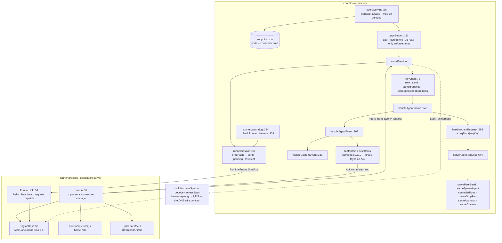

# Transport — gRPC server, RunChannel, Home, EngineHost

The transport layer carries the bytes between the coordinator process and the runner
process and mints the durability guarantee at the coordinator end. It owns: the h2c
listener set and its endpoint file (`httpserver.go`), the gRPC server plus its
consumer-denial auth interceptors and the runner-liveness watchdog (`grpcserver.go`),
the per-run bidirectional stream and its plane-2 verb handlers (`runchannel.go`), the
runner-side clients (`home.go`, `runnerlink.go`, `homeartifacts.go`), the one wire
contract for what to launch (`harnessspec.go`), and the runner-side engine host that
drives a backend's `StructuredChat` in-process (`enginehost.go`).

## Listeners and endpoint discovery

| Symbol | file:line | Contract |
|---|---|---|
| `coordServing` | `httpserver.go:36` | the listener set: loopback always, container-reachable ("wide") on demand |
| `endpointState` | `httpserver.go:57` | the on-disk `endpoint.json`: `LoopbackPort`, `WidePort`, `ConsumerCred` — a viewer's one discovery point for both |
| `Coordinator.Serve` | `httpserver.go:65` | stands up the h2c listener, mints the consumer credential, saves `endpoint.json` (0600) |
| `bindPreferring` | `httpserver.go:116` | binds the recorded port, falls back to ephemeral — the fallback *is* the error handling |
| `Coordinator.ReachURL` / `reachURL` | `httpserver.go:160,167` | loopback for a host child, the widened endpoint for a container child; "listeners are not up" is actionable |
| `coordServing.ensureWide` | `httpserver.go:186` | resolves and binds the container-reachable endpoint once; both no-candidate and no-bind fail loudly |
| `advertiseHostFor` / `preferredContainerRuntime` / `containerReachIPs` / `primaryOutboundIP` | `httpserver.go:300,319,332,361` | the per-OS magic hostname, docker-vs-podman guess, bridge-gateway probing, outbound-IP trick |
| `coordServing.close` | `httpserver.go:269` | `grpcSrv.Stop()` **before** shutting the listeners — `GracefulStop` caused a confirmed process-crashing panic |
| `discover.List` | `discover/discover.go:56` | out-of-process discovery: glob `~/.ctxloom/coord/*/endpoint.json`, sort by mtime newest-first, return `(URL, Cred)` pairs |

`internal/agentcoord/discover` is a deliberate **leaf**: `coord` imports
`internal/operations`, so `operations` cannot import `coord`. `discover` therefore
re-declares four things by hand — the state-dir name (`coord/statedir.go:25`), the MCP
path (`coord/httpserver.go:28`), the `endpoint.json` shape (`coord/httpserver.go:57`)
and the URL format (`coord/httpserver.go:100`) — with no compiler link. A third copy of
the same workaround exists at `operations/sessionfeed.go:157-166` (`bearerToken` mirrors
`coord/runnerlink.go`'s `bearerCreds`).

## gRPC server and runner sessions

| Symbol | file:line | Contract |
|---|---|---|
| `Coordinator.grpcServer` | `grpcserver.go:121` | builds the server plus the stream and unary interceptors that **deny consumer credentials** on `CoordinatorService` — the read-only enforcement point |
| `mdToken` | `grpcserver.go:76` | extracts the Bearer token from gRPC metadata |
| `runnerSession` | `grpcserver.go:38` | one connected `RunnerChannel`, keyed by credential hash; `lastBeat` is guarded by `Coordinator.mu` while `pending` is guarded by a session-local `reqMu` |
| `coordService.RunnerChannel` | `grpcserver.go:156` | Hello / ownership / ack, registration, writer pump, recv loop, and loss synthesis in the defer |
| `Coordinator.handleRunExited` | `grpcserver.go:290` | validates ownership, records the resume handle, terminates; an unowned `RunExited` warns and is ignored |
| `Coordinator.runnerLost` | `grpcserver.go:314` | synthesizes termination for every active run of a dead credential |
| `runnerWatchdog` / `checkRunnerLiveness` | `grpcserver.go:324,339` | declares loss past `runnerLossTimeout`, outside the lock |
| `Coordinator.awaitRunner` | `grpcserver.go:361` | blocks until the spawned runner dials home; distinguishes "signalled but already ended" from ctx expiry |
| `Coordinator.requestRunner` | `grpcserver.go:401` | one coordinator→runner request/response round trip (`defaultRequestTimeout` 60s) |
| `runnerSession.failPending` | `grpcserver.go:65` | swaps out `pending` and answers every waiter `UNAVAILABLE` — converts a hang into a typed refusal |

## RunChannel — one run, three planes

| Symbol | file:line | Contract |
|---|---|---|
| `runChan` | `runchannel.go:78` | one live coordinator-side channel for a role: transport (`send`/`cancel`/`id`), mail reservation (`parked`/`pushed`), journal watermark (`ackSeq`/`flushedSeq`/`items`/`completed`). Every mutable field is guarded by `Coordinator.mu` |
| `reqKey` / `inflightReq` | `runchannel.go:533,547` | the `(role, request_id)` idempotency key that survives a reconnect, and the one-field struct whose nil `resp` means "still running" |
| `coordService.RunChannel` | `runchannel.go:116` | auth, Hello/HelloAck, register, start the send and recv pumps, deferred cleanup |
| `handleAgentFrame` / `handleAgentEvent` | `runchannel.go:243,268` | five-way frame switch; seq dedupe and re-ack, live tee to the watch hub, custom/summary/artifact/item routing, terminal marking |
| `ackThrough` | `runchannel.go:319` | non-blocking cumulative Ack — droppable by design because it is cumulative |
| `handleCustomEvent` | `runchannel.go:330` | the `ctxloom/*` vocabulary: `mail_consumed`, park/unpark, `harness_session`, turn state |
| `handleAgentRequest` / `respond` / `respondRole` | `runchannel.go:558,603,618` | reqTrack idempotency, dispatch on its own goroutine, respond on the role's *current* channel |
| `serveAgentRequest` and the `serve*` verbs | `runchannel.go:644-847` | plane-2 verb implementations; unknown kind → `UNIMPLEMENTED` |
| `serveCustom` | `runchannel.go:816` | host-relay tool dispatch under a 4 MiB watch; unknown tool → `UNIMPLEMENTED`, oversize → `ResourceExhausted` with a fix-it, empty result → `Internal` |
| `severChan` / `drainTerminalTail` / `clearReqTrack` | `runchannel.go:513,493,632` | tear a role's channel down and un-reserve synchronously; bounded wait for a flushed `run_completed`; drop idempotency records at the terminal |
| `okStatus` / `statusErr` / `statusFromErr` | `runchannel.go:849,853,859` | the status vocabulary (19, 27 and 5 uses) |
| `bufferItem` / `flushItems` | `items.go:90,110` | append plane-1 item facts, group-fsync at a boundary or a full buffer, then advance the Ack watermark |

`runchannel.go` holds two responsibilities: stream/frame plumbing and the plane-2 verb
bodies, which duplicate coordinator verbs reachable from the other transport
(`AgentSend`, `AgentStop`, `Roster`).

## Runner side

| Symbol | file:line | Contract |
|---|---|---|
| `RunnerLink` | `runnerlink.go:34` | runner side of `RunnerChannel`: hello, heartbeats, inbound `RunnerRequest` dispatch, best-effort `RunExited`, shutdown join |
| `DialRunner` | `runnerlink.go:94` | dial, `RunnerHello`, ack, start the heartbeat and receive loops |
| `bearerCreds` | `runnerlink.go:79` | per-RPC credential (`RequireTransportSecurity` false — the link is loopback or bridge-local) |
| `RunnerLink.serveRequest` | `runnerlink.go:244` | run the handler and **always** answer; a nil handler answers `UNIMPLEMENTED` instead of hanging |
| `Home` | `home.go:31` | the runner's whole relationship with the coordinator: connection lifecycle, run-channel transport, event plane, request plane, mail plane, artifact transfer — six disjoint field partitions under one mutex |
| `HomeConfig` | `home.go:95` | the spawn-injected coordinator trio (`URL`, `Token`, `RunID`) plus runner self-description and the `RunnerRequestHandler` |
| `NewHome` | `home.go:158` | dials and starts both channel loops; **never fails hard on an unreachable coordinator**, by design and documented |
| `Home.runChannelOnce` | `home.go:275` | Hello/ack, then reissue unacked events, pending requests and the park, then receive |
| `Home.send` | `home.go:343` | single-writer frame send; drops when the stream is nil, because events sit in `unacked` and requests in `pending` and both are reissued |
| `Home.advanceAck` | `home.go:388` | moves the cumulative watermark, prunes `unacked`, wakes waiters |
| `Home.Request` / `requestFailure` | `home.go:535,146` | one plane-2 request, id-correlated and reconnect-durable; the failure text distinguishes "never delivered" from "accepted and may still be running" |
| `Home.Recv` / `deliverNotice` / `SetTurnSink` / `turnPump` | `home.go:572,415,462,484` | see [mailbox.md](mailbox.md) |
| `Home.ReportRunExited` / `Close` / `crash` | `home.go:510,760,746` | best-effort exit report; final cursor-ack then teardown; the test-only hard teardown |
| `Home.goTracked` / `waitTracked` | `home.go:191,213` | tracked goroutine dispatch refused after `closing`; bounded join that warns and proceeds |

The `mu`/`wg`/`closing` + `goTracked`/`waitTracked` idiom is duplicated four times
across the family (`Coordinator`, `Home`, `EngineHost`, `RunnerLink`), each with its own
budget constant, and the comment at `runnerlink.go:159-161` names all four.

## HarnessSpec — the launch contract

| Symbol | file:line | Contract |
|---|---|---|
| `HarnessSpecInput` | `harnessspec.go:35` | coordinator-side input: harness, model, workspace, extra args, env, MCP servers, session harp, permission, resume session id |
| `buildHarnessSpec` | `harnessspec.go:49` | encodes it onto the wire `HarnessSpec` |
| `decodeHarnessSpec` | `harnessspec.go:115` | the runner-side inverse, producing a ready `agent.ChatRequest` |
| `DecodedHarnessSpec` | `harnessspec.go:104` | `Chat agent.ChatRequest` + `SessionHarp` (the one config-carried field `ChatRequest` has no home for) |

Build and decode are co-located in one file precisely so the three magic config keys
(`ctxloom.session_harp`, `env`, `mcp_servers`) stay in sync. The D3 headless-safety
floor is checked at the **decode** end (`harnessspec.go:124`, `SafeHeadless()`), which
is after the child process and credential have already been spawned;
`buildHarnessSpec` does not check it.

## EngineHost — hosting one engine in the runner

| Symbol | file:line | Contract |
|---|---|---|
| `engineHome` (interface) | `enginehost.go:27` | the slice of `*Home` the host consumes: event emission, turn-sink registration, exit reporting, plane-2 request |
| `EngineHost` | `enginehost.go:53` | hosts exactly one delegated run's engine; `MaxConcurrentRuns = 1` |
| `NewEngineHost` / `BindHome` / `Handle` | `enginehost.go:91,170,182` | construct; idempotently bind and unblock `Handle`; dispatch `StartRun` / `Kill` / `Stop` with typed gRPC codes |
| `startRun` | `enginehost.go:214` | validate → decode spec → open the transcript recorder → launch the backend → adapt → register the turn sink → dispatch the briefing |
| `adapt` | `enginehost.go:352` | native event stream → plane-1 `AgentEvent`s → `RunCompleted` → `RunExited` |
| `frameCoordinatorMessage` | `enginehost.go:559` | `PeerMessage` → engine turn text |
| `resolveApproval` | `enginehost.go:588` | see [approvals.md](approvals.md) |
| `injectMCPSocketEnv` | `enginehost.go:665` | stamps `CTXLOOM_MCP_SOCKET` into the forwarder entry's own env (the codex-adapter fix) |
| `usageFromMeta` / `usdToMicros` / `nonNegU64` | `enginehost.go:526,549,539` | `TurnMeta` → `Usage`, with round-half-even micro-USD and NaN/Inf/negative guards |

`EngineHost` calls `eh.backend.Chat(ctx, dec.Chat, in, out)` **in-process**
(`enginehost.go:311`) — the go-plugin `Chat` RPC is never dialed on this path, which is
why `ChatRequest` fields that the `ChatStart` proto drops (`Runtime`,
`ResumeSessionID`) still survive here. See [acp-client.md](acp-client.md).

## Invariants

| # | Invariant | Where |
|---|---|---|
| T1 | Consumer credentials are refused on every `CoordinatorService` method | `grpcserver.go:121-144` |
| T2 | A `RunChannel` Hello's claimed run id must match the credential's; a mismatch is `PermissionDenied` on both the wire and the RPC status | `runchannel.go:116-170` |
| T3 | Plane-2 requests are idempotent across a reconnect via `reqTrack[(role, request_id)]`; an empty `request_id` is `INVALID_ARGUMENT` | `runchannel.go:558` |
| T4 | The event-plane Ack watermark advances only over durably journaled seqs | `runchannel.go:268-276`, `items.go:110` |
| T5 | `Store.Exec`'s fsync happens before the fact is applied, so an Ack certifies durability | `journal.go:207` |
| T6 | A dead runner's runs are terminated by loss synthesis, not left executing | `grpcserver.go:314`, `runchannel.go` defer |
| T7 | One writer per stream: `sendMu` on the runner side, a single writer pump on the coordinator side | `runnerlink.go:57`, `runchannel.go` |

## Divergences and real behaviour

- **`HarnessSpec.extra_args` documents a runner-side allowlist that does not exist.**
  The proto (`coordination.proto:323-325`) says "runner-validated against an allowlist —
  the runner has direct CLI control and is the enforcement point"; `decodeHarnessSpec`
  never touches the field and neither caller of `buildHarnessSpec` populates it.
- **`HelloAck.committed_seq` echoes the agent's own claim.** `runchannel.go:148` sets
  `CommittedSeq: hello.GetResumeFromSeq()`, with an in-code note that there is no
  durable event log yet; `HelloAck.event_window` is unreferenced, so the documented
  end-to-end backpressure does not exist.
- **`Home.abandonPark` drops a delivered mail batch** (`home.go:646-652`) despite a
  comment saying "requeue".
- **A failed items-journal `Exec` loses the facts and the next flush acks past them**
  (`items.go:110-128`), so `flushedSeq`/`ackThrough` certify durability for seqs that
  were never written.
- **`decodeHarnessSpec` silently coerces malformed `mcp_servers` entries** into
  `ChatMCPServer{}` with empty name and command (`harnessspec.go:140-160`), while
  `permission_mode` gets fail-loud treatment. An empty `ctxloom.session_harp` likewise
  disables transcript capture with no warning at the check itself
  (`enginehost.go:296-299`).
- **`ensureWide`'s comment claims it "never opens anything LAN-visible"**
  (`httpserver.go:182-185`); on Linux the fallback binds the host's primary outbound
  interface IP (`containerReachIPs` → `primaryOutboundIP`), which is LAN-visible. Every
  stream still requires a bearer token.
- **`go s.saveEndpoint()` at `httpserver.go:245` is load-bearing for lock
  re-entrancy** — `ensureWide` holds `s.mu` for its whole body and `saveEndpoint` retakes
  it — and nothing says so.
- **`Serve` leaks the bound listener and its serving goroutine** when the consumer-credential
  mint fails (`httpserver.go:99-107`): `c.srv` is never assigned on that path, so
  `Coordinator.Close` never closes it.
- **`requestRunner` can register a waiter into a map `failPending` has already swapped
  out** (`grpcserver.go:405-428`) and then stall for the full 60s budget.
- **`respond`'s drop message claims "the runner reissues on reconnect"**
  (`runchannel.go:603-610`); reissue happens only in `Home.runChannelLoop`'s post-Hello
  block, so on a live-but-slow channel the runner simply waits out its own timeout.
- **The recv goroutine outlives `RunChannel`'s return** (`runchannel.go:223-237`), so a
  frame already in flight when a channel is severed is still dispatched — nothing checks
  that `c.chans[ch.role] == ch` before handling it.
- **`Home.emitCustomEvent` swallows the `structpb.NewStruct` error**
  (`home.go:675-684`) and emits a valueless event; for `mail_consumed` the coordinator
  then drops the frame (`runchannel.go:333-336`) and the message is redelivered forever.
- **`Store.replay` reads the entire journal with `io.ReadAll`** (`journal.go:140`),
  including on the degraded path where the checkpoint offset was distrusted and reset
  to 0.
- **`runStartedConfig` and `structFromJSON` return `nil` on a marshal failure**
  (`enginehost.go:502,713-730`), so the `RunStarted` config echo or an approval
  request's entire payload vanishes with no signal.
- **`transcript.TeeAndClose` dispatches two untracked goroutines from inside `startRun`**
  (`enginehost.go:316`), against the file's own stated rule that every goroutine rides
  `goTracked`.
- **The briefing and coordinator mail can arrive out of order.** `SetTurnSink`
  (`enginehost.go:322`) and the briefing goroutine (`:335-341`) both write the same
  **unbuffered** `in` channel, and `issueStartRun` pushes queued mail immediately after
  `startRun` returns, so a child can receive mail as its first turn and its briefing
  second.
- **`ReportRunExited`'s `terminalEventSeen` parameter is a literal `true`** at its one
  production call site (`enginehost.go:485`).
- **`claimOwner` ignores the lock file's write and close errors** (`statedir.go:65-70`),
  so a zero-byte `owner.pid` for a live owner reads as stale to the next claimant.
