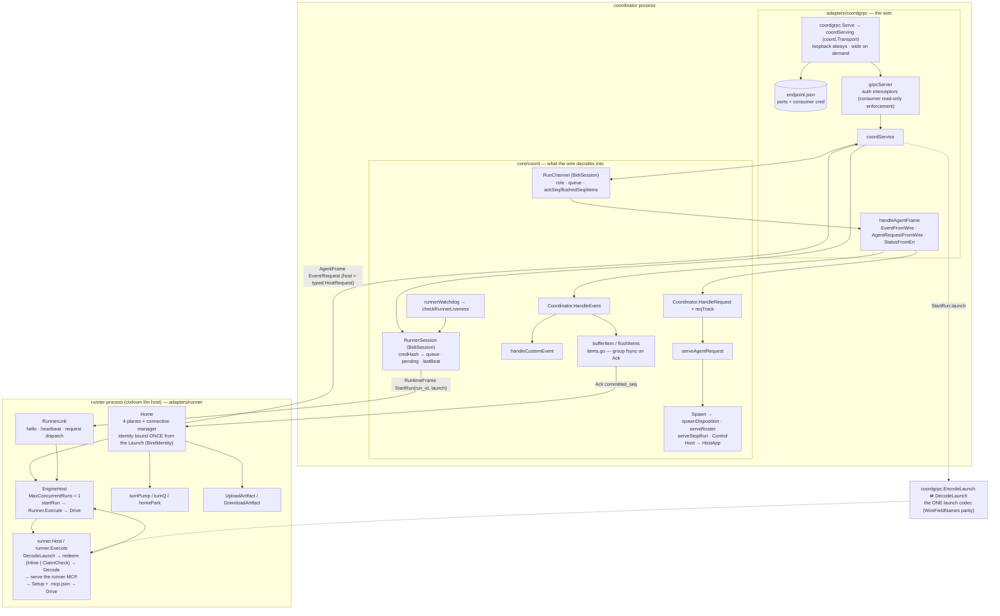

# Transport — gRPC server, RunChannel, Home, EngineHost

The transport layer carries the bytes between the coordinator process and the runner
process and mints the durability guarantee at the coordinator end. It is split over
three packages by the ring rule (`core/coord` imports neither adapter;
`TestArch_CoordLinksNoAdapter` pins it link-side). `internal/adapters/coordgrpc`
owns the wire: the h2c listener set and its endpoint file (`httpserver.go`,
`coordgrpc.Serve` binds it to the coordinator as its `coord.Transport`), the gRPC
server plus its consumer-denial auth interceptors (`grpcserver.go`), the per-run
bidirectional stream's frame handler (`runchannel.go`, decode → verb), the codec both
ways (`codec.go`) and the launch as ONE typed message on `StartRun`
(`coordgrpc.EncodeLaunch`/`DecodeLaunch`). `internal/core/coord` owns what the wire
is decoded INTO: the runner session and run channel over `BidiSession`
(`runnersession.go`, `runchannel.go` — the runner-liveness watchdog, the plane-2 verb
dispatch, the ack discipline), typed without the proto. `internal/adapters/runner`
owns the runner side: the clients (`home.go`, `runnerlink.go`, `homeartifacts.go`),
the tail that redeems, decodes and delivers the launch (`runner.Execute`) and the
engine host that drives a backend's `StructuredChat` in-process (`enginehost.go`).

```mermaid
flowchart TD
  subgraph coordinator["coordinator process"]
    subgraph cgrpc["adapters/coordgrpc — the wire"]
      SRV["coordgrpc.Serve → coordServing (coord.Transport)<br/>loopback always · wide on demand"]
      EP[("endpoint.json<br/>ports + consumer cred")]
      GS["grpcServer<br/>auth interceptors (consumer read-only enforcement)"]
      CS["coordService"]
      HAF["handleAgentFrame<br/>EventFromWire · AgentRequestFromWire · StatusFromErr"]
    end
    subgraph ccore["core/coord — what the wire decodes into"]
      RSESS["RunnerSession (BidiSession)<br/>credHash → queue · pending · lastBeat"]
      WD["runnerWatchdog → checkRunnerLiveness"]
      CH["RunChannel (BidiSession)<br/>role · queue · ackSeq/flushedSeq/items"]
      HAE["Coordinator.HandleEvent"]
      HCE["handleCustomEvent"]
      HAR["Coordinator.HandleRequest + reqTrack"]
      SAR["serveAgentRequest"]
      VERBS["Spawn → spawnDisposition · serveRoster<br/>serveStopRun · Control<br/>Host → HostApp"]
      ITEMS["bufferItem / flushItems<br/>items.go — group fsync on Ack"]
    end
    SRV --> EP
    SRV --> GS --> CS
    CS --> RSESS
    CS --> CH --> HAF --> HAE --> HCE
    HAE --> ITEMS
    HAF --> HAR --> SAR --> VERBS
    WD --> RSESS
  end
  subgraph runner["runner process (ctxloom llm host) — adapters/runner"]
    HOME["Home<br/>4 planes + connection manager<br/>identity bound ONCE from the Launch (BindIdentity)"]
    RL["RunnerLink<br/>hello · heartbeat · request dispatch"]
    EH["EngineHost<br/>MaxConcurrentRuns = 1<br/>startRun → Runner.Execute → Drive"]
    RUN["runner.Host / runner.Execute<br/>DecodeLaunch → redeem (Inline | ClaimCheck) → Decode<br/>→ serve the runner MCP → Setup + .mcp.json → Drive"]
    TP["turnPump / turnQ / homePark"]
    HA["UploadArtifact / DownloadArtifact"]
    HOME --> TP
    HOME --> HA
    HOME --> EH
    RL --> EH
    EH --> RUN --> EH
  end
  CODEC["coordgrpc.EncodeLaunch ⇄ DecodeLaunch<br/>the ONE launch codec (WireFieldNames parity)"]
  RSESS -->|"RuntimeFrame StartRun{run_id, launch}"| RL
  HOME -->|"AgentFrame Event/Request (host = typed HostRequest)"| CS
  ITEMS -->|"Ack committed_seq"| HOME
  CS -.->|"StartRun.launch"| CODEC -.-> RUN
```

## Listeners and endpoint discovery

| Symbol | Contract |
| --- | --- |
| `coordServing` | the listener set: loopback always, container-reachable ("wide") on demand |
| `endpointState` | the on-disk `endpoint.json`: `LoopbackPort`, `WidePort`, `ConsumerCred` — a viewer's one discovery point for both |
| `coordgrpc.Serve` | stands up the h2c listener, mints the consumer credential, saves `endpoint.json` (0600), and binds the result to the coordinator through `Coordinator.BindTransport` (atomic with `Close`; a second bind is refused) |
| `bindPreferring` | binds the recorded port, falls back to ephemeral — the fallback *is* the error handling |
| `Coordinator.ReachURL` → `coordServing.ReachURL` | loopback for a host child, the widened endpoint for a container child; `coord.ErrNotServing` when no transport is bound |
| `coordServing.ensureWide` | resolves and binds the container-reachable endpoint once; both no-candidate and no-bind fail loudly |
| `advertiseHostFor` / `preferredContainerRuntime` / `containerReachIPs` / `primaryOutboundIP` | the per-OS magic hostname, docker-vs-podman guess, bridge-gateway probing, outbound-IP trick |
| `coordServing.Close` | `grpcSrv.Stop()` **before** shutting the listeners — `GracefulStop` caused a confirmed process-crashing panic |
| `discover.List` | out-of-process discovery: glob `~/.ctxloom/coord/*/endpoint.json`, sort by mtime newest-first, return `(URL, Cred)` pairs |

`internal/adapters/coordgrpc/discover` is a deliberate **leaf** for consumers that
have no coordinator in their own process: it owns the `endpoint.json` shape
(`discover.State`, which `coordgrpc/httpserver.go` writes as `endpointState`) and the
MCP path (`discover.MCPPath`, re-exported by `coordgrpc`), and re-declares the
state-dir name by hand. `operations/sessionfeed.go` is such a consumer — a wire
client of another process's coordinator — so its `bearerToken` mirrors
`runner/runnerlink.go`'s `bearerCreds` rather than sharing a type with a server it
never links.

## Bridge listener posture

The bridge is the plane every runner reaches its coordinator over, and every
runner that dials it — host process or container foreground — authenticates
with the run credential it was minted (`sessions.EncodeReach` on the runner
env, `runnerlink.go`'s `bearerCreds` on the wire). The posture, stated once so
it is not inferred from scattered call sites:

- **Bearer-authenticated, on every stream.** `grpcServer`'s `auth` interceptor
  calls `Coordinator.Identify(mdToken(ctx))` before any handler runs;
  `RunnerChannel` / `RunChannel` re-check per stream and refuse an unknown or
  revoked credential with `codes.Unauthenticated` before a Hello is read (T2's
  sibling — a frame that carries no issued credential never reaches a
  `HelloAck`). A guessed loopback port buys nothing without the run's own
  token, which is never journaled and never rides a message body.
- **Cleartext (h2c), by design in 0.7.** `coordgrpc.Serve` stands up an h2c
  listener and `runnerlink.go` dials with `RequireTransportSecurity` false: the
  bearer is the whole boundary, and it is carried unencrypted. The threat this
  accepts is a same-host or same-LAN observer of the loopback/wide listener
  reading a bearer in flight. On the loopback listener the reader must already
  share the host (and a host-runtime credential is readable from any same-uid
  process's environment regardless — the container runtime is the actual
  isolation boundary, not this link). On the **wide** listener the exposure is
  broader: `coordServing.ensureWide`'s fallback binds the host's primary
  outbound interface IP (`containerReachIPs` → `primaryOutboundIP`), which is
  LAN-visible, so a bearer crosses a LAN-visible socket in the clear whenever a
  container child reaches back over it.
- **mTLS is slice 16's.** Encrypting the bridge and verifying a runner by client
  certificate — refusing a runner with no cert, and moving the boundary from
  "holds the bearer" to "presents a trusted cert" — is a later, separate change;
  this document describes the cleartext-plus-bearer posture that ships in 0.7.

## gRPC server and runner sessions

| Symbol | Contract |
| --- | --- |
| `Coordinator.grpcServer` | builds the server plus the stream and unary interceptors that **deny consumer credentials** on `CoordinatorService` — the read-only enforcement point |
| `mdToken` | extracts the Bearer token from gRPC metadata |
| `runnerSession` | one connected `RunnerChannel`, keyed by credential hash, on the one `bidiSession` scaffold (`bidisession.go`: the single-writer send queue and pump, and the request/response correlation — register refused once ended, resolve by id, failPending as the one atomic end); `lastBeat` is guarded by `Coordinator.mu` |
| `coordService.RunnerChannel` | Hello / ownership / ack, registration, writer pump, recv loop, and loss synthesis in the defer |
| `Coordinator.handleRunExited` | validates ownership, records the resume handle, terminates; an unowned `RunExited` warns and is ignored |
| `Coordinator.runnerLost` | synthesizes termination for every active run of a dead credential |
| `runnerWatchdog` / `checkRunnerLiveness` | declares loss past `runnerLossTimeout`, outside the lock |
| `Coordinator.awaitRunner` | blocks until the spawned runner dials home; distinguishes "signalled but already ended" from ctx expiry |
| `Coordinator.requestRunner` | one coordinator→runner request/response round trip (`defaultRequestTimeout` 60s) |
| `runnerSession.end` | `bidiSession.failPending`: answers every waiter `UNAVAILABLE` and ends the session in one step, so a later register is refused rather than parked forever |

## RunChannel — one run, three planes

| Symbol | Contract |
| --- | --- |
| `runChan` | one live coordinator-side channel for a role on the `bidiSession` scaffold (its queue and pump; this side issues no requests), plus the journal watermark (`ackSeq`/`flushedSeq`/`items`/`completed`). Every mutable field is guarded by `Coordinator.mu` |
| `reqKey` / `inflightReq` | the `(role, request_id)` idempotency key that survives a reconnect, and the one-field struct whose nil `resp` means "still running" |
| `coordService.RunChannel` | auth, Hello/HelloAck, register, start the send and recv pumps, deferred cleanup |
| `handleAgentFrame` / `handleAgentEvent` | five-way frame switch; seq dedupe and re-ack, live tee to the watch hub, custom/summary/artifact/item routing, terminal marking |
| `ackThrough` | non-blocking cumulative Ack — droppable by design because it is cumulative |
| `handleCustomEvent` | the `ctxloom/*` vocabulary: `mail_consumed`, park/unpark, `harness_session`, turn state |
| `handleAgentRequest` / `respond` / `respondRole` | reqTrack idempotency, dispatch on its own goroutine, respond on the role's *current* channel |
| `serveAgentRequest` and the `serve*` verbs | plane-2 verb implementations; unknown kind → `UNIMPLEMENTED` |
| `serveCustom` | host-relay tool dispatch under a 4 MiB watch; unknown tool → `UNIMPLEMENTED`, oversize → `ResourceExhausted` with a fix-it, empty result → `Internal` |
| `severChan` / `drainTerminalTail` / `clearReqTrack` | tear a role's channel down and un-reserve synchronously; bounded wait for a flushed `run_completed`; drop idempotency records at the terminal |
| `okStatus` / `statusErr` / `statusFromErr` | the status vocabulary (19, 27 and 5 uses) |
| `bufferItem` / `flushItems` | append plane-1 item facts, group-fsync at a boundary or a full buffer, then advance the Ack watermark |

`runchannel.go` holds two responsibilities: stream/frame plumbing and the plane-2 verb
bodies, which duplicate coordinator verbs reachable from the other transport
(`AgentSend`, `AgentStop`, `Roster`).

## Runner side

| Symbol | Contract |
| --- | --- |
| `RunnerLink` | runner side of `RunnerChannel`: hello, heartbeats, inbound `RunnerRequest` dispatch, best-effort `RunExited`, shutdown join |
| `DialRunner` | dial, `RunnerHello`, ack, start the heartbeat and receive loops |
| `bearerCreds` | per-RPC credential (`RequireTransportSecurity` false — the link is loopback or bridge-local) |
| `RunnerLink.serveRequest` | run the handler and **always** answer; a nil handler answers `UNIMPLEMENTED` instead of hanging |
| `Home` | the runner's whole relationship with the coordinator: connection lifecycle, run-channel transport, event plane, request plane, mail plane, artifact transfer — six disjoint field partitions under one mutex |
| `HomeConfig` | the spawn-injected coordinator trio (`URL`, `Token`, `RunID`) plus runner self-description and the `RunnerRequestHandler` |
| `NewHome` | dials and starts both channel loops; **never fails hard on an unreachable coordinator**, by design and documented |
| `Home.runChannelOnce` | Hello/ack, then reissue unacked events, pending requests and the park, then receive |
| `Home.send` | single-writer frame send; drops when the stream is nil, because events sit in `unacked` and requests in `pending` and both are reissued |
| `Home.advanceAck` | moves the cumulative watermark, prunes `unacked`, wakes waiters |
| `Home.Request` / `requestFailure` | one plane-2 request, id-correlated and reconnect-durable; the failure text distinguishes "never delivered" from "accepted and may still be running" |
| `Home.Recv` / `deliverNotice` / `SetTurnSink` / `turnPump` | see [mailbox.md](mailbox.md) |
| `Home.ReportRunExited` / `Close` / `crash` | best-effort exit report; final cursor-ack then teardown; the test-only hard teardown |
| `Home.goTracked` / `waitTracked` | tracked goroutine dispatch refused after `closing`; bounded join that warns and proceeds |

The `mu`/`wg`/`closing` + `goTracked`/`waitTracked` idiom is duplicated four times
across the family (`Coordinator`, `Home`, `EngineHost`, `RunnerLink`), each with its own
budget constant, and the comment at `runnerlink.go` names all four.

## The launch on the wire

| Symbol | Contract |
| --- | --- |
| `coordgrpc.EncodeLaunch` / `DecodeLaunch` | the one codec: `launch.Launch` ⇄ the proto `Launch` on `StartRun.launch`; `WireFieldNames` reads the proto side live and `tests/arch`'s field-set parity pins the two ends |
| `composite.Carrier` (`oneof inline \| claim` + digest) | the encoded package rides the frame under `composite.DefaultInlineMax`, as a claim on the session-dir store (`fsstore.PackageStore`, `<harp>/persist/package/<digest>`) above it; `MaxRecvMsgSize` bounds the frame explicitly |
| `runner.Execute` | the ONE tail: redeem by the carrier's shape → `composite.Decode` (digest proved) → refuse a foreign engine → configure from `Launch.Label.Body` → serve the runner MCP under the Launch's identity → deliver through the engine's `Setup` and the session home's `.mcp.json` → `EngineHost.Drive` |
| `coord.Runner` / `runner.Host` | the port the engine host executes a `StartRun` through; `runner.Host` decodes the frame's launch and calls `Execute` |
| `coord.Turn` | what the runner asks the host to drive: the launch, the `agent.ChatRequest` built from it, the first turn's lead (the package's context ahead of the prompt; the prompt alone on a native-key resume) |

The posture the runner drives is the one the resolver floored (`launch.Resolve`);
nothing on the runner re-decides it. The superseded `StartRun` fields (`harness`,
`input`, `parent_run_id`, `role`) are written and read by nobody and are reserved
in slice 9.

## EngineHost — hosting one engine in the runner

| Symbol | Contract |
| --- | --- |
| `engineHome` (interface) | the slice of `*Home` the host consumes: event emission, turn-sink registration, exit reporting, plane-2 request |
| `EngineHost` | hosts exactly one delegated run's engine; `MaxConcurrentRuns = 1` |
| `NewEngineHost` / `BindHome` / `Handle` | construct; idempotently bind and unblock `Handle`; dispatch `StartRun` / `Turn` / `Kill` / `Stop` with typed gRPC codes |
| `startRun` / `Drive` | validate → the bound runner executes the launch (redeem, decode, bind the endpoint, deliver) → `Drive`: open the transcript recorder ONCE for the run → `startEngine` → register the turn sink → dispatch the briefing |
| `startEngine` / `parkAtBoundary` / `unpark` | one ENGINE process per one-shot turn inside a runner that stays: the boundary ends the process and parks the host; the next turn (mail or a `Turn` frame) starts a fresh process resumed by key |
| `turnFrame` | `RunnerRequest.Turn` → one engine turn, answered with `TurnResult{native_key, answer}` at its boundary |
| `adapt` | native event stream → plane-1 `AgentEvent`s; at a one-shot boundary it parks (no terminal); otherwise → `RunCompleted` → `RunExited` |
| `frameCoordinatorMessage` | `PeerMessage` → engine turn text |
| `resolveApproval` | see [approvals.md](approvals.md) |
| `usageFromMeta` / `usdToMicros` / `nonNegU64` | `TurnMeta` → `Usage`, with round-half-even micro-USD and NaN/Inf/negative guards |

`EngineHost.runTurn` drives `Instance.Drivers()[0].Turn(ctx, ex, engine.Turn{Prompt, Resume}, out)`
**in-process** (`enginehost.go`): one engine process per turn, the native events
relayed on `out` as `agent.ChatEvent` payloads; no RPC sits between the host
and the engine.

## Invariants

| # | Invariant | Where |
| --- | --- | --- |
| T1 | Consumer credentials are refused on every `CoordinatorService` method | `grpcserver.go` |
| T2 | A `RunChannel` Hello's claimed run id must match the credential's; a mismatch is `PermissionDenied` on both the wire and the RPC status | `runchannel.go` |
| T3 | Plane-2 requests are idempotent across a reconnect via `reqTrack[(role, request_id)]`; an empty `request_id` is `INVALID_ARGUMENT` | `runchannel.go` |
| T4 | The event-plane Ack watermark advances only over durably journaled seqs | `runchannel.go`, `items.go` |
| T5 | `Store.Exec`'s fsync happens before the fact is applied, so an Ack certifies durability | `journal.go` |
| T6 | A dead runner's runs are terminated by loss synthesis, not left executing | `grpcserver.go`, `runchannel.go` defer |
| T7 | One writer per stream: `sendMu` on the runner side, a single writer pump on the coordinator side | `runnerlink.go`, `runchannel.go` |

## Divergences and real behaviour

- **`HelloAck.committed_seq` echoes the agent's own claim.** `runchannel.go` sets
  `CommittedSeq: hello.GetResumeFromSeq()`, with an in-code note that there is no
  durable event log yet; `HelloAck.event_window` is unreferenced, so the documented
  end-to-end backpressure does not exist.
- **`Home.abandonPark` drops a delivered mail batch** (`home.go`) despite a
  comment saying "requeue".
- **A failed items-journal `Exec` loses the facts and the next flush acks past them**
  (`items.go`), so `flushedSeq`/`ackThrough` certify durability for seqs that
  were never written.
- **`ensureWide`'s comment claims it "never opens anything LAN-visible"**
  (`httpserver.go`); on Linux the fallback binds the host's primary outbound
  interface IP (`containerReachIPs` → `primaryOutboundIP`), which is LAN-visible. Every
  stream still requires a bearer token.
- **`go s.saveEndpoint()` at `httpserver.go` is load-bearing for lock
  re-entrancy** — `ensureWide` holds `s.mu` for its whole body and `saveEndpoint` retakes
  it — and nothing says so.
- **`Serve` leaks the bound listener and its serving goroutine** when the consumer-credential
  mint fails (`httpserver.go`): `c.srv` is never assigned on that path, so
  `Coordinator.Close` never closes it.
- **`requestRunner` can register a waiter into a map `failPending` has already swapped
  out** (`grpcserver.go`) and then stall for the full 60s budget.
- **`respond`'s drop message claims "the runner reissues on reconnect"**
  (`runchannel.go`); reissue happens only in `Home.runChannelLoop`'s post-Hello
  block, so on a live-but-slow channel the runner simply waits out its own timeout.
- **The recv goroutine outlives `RunChannel`'s return** (`runchannel.go`), so a
  frame already in flight when a channel is severed is still dispatched — nothing checks
  that `c.chans[ch.role] == ch` before handling it.
- **`Home.emitCustomEvent` swallows the `structpb.NewStruct` error**
  (`home.go`) and emits a valueless event; for `mail_consumed` the coordinator
  then drops the frame (`runchannel.go`) and the message is redelivered forever.
- **`Store.replay` reads the entire journal with `io.ReadAll`**,
  including on the degraded path where the checkpoint offset was distrusted and reset
  to 0.
- **`runStartedConfig` and `structFromJSON` return `nil` on a marshal failure**
  (`enginehost.go`), so the `RunStarted` config echo or an approval
  request's entire payload vanishes with no signal.
- **`transcript.TeeAndClose` dispatches two untracked goroutines from inside `startRun`**
  (`enginehost.go`), against the file's own stated rule that every goroutine rides
  `goTracked`.
- **The briefing and coordinator mail can arrive out of order.** `SetTurnSink`
  (`enginehost.go`) and the briefing goroutine both write the same
  **unbuffered** `in` channel, and `issueStartRun` pushes queued mail immediately after
  `startRun` returns, so a child can receive mail as its first turn and its briefing
  second.
- **`ReportRunExited`'s `terminalEventSeen` parameter is a literal `true`** at its one
  production call site (`enginehost.go`).
- **`claimOwner` ignores the lock file's write and close errors** (`statedir.go`),
  so a zero-byte `owner.pid` for a live owner reads as stale to the next claimant.
