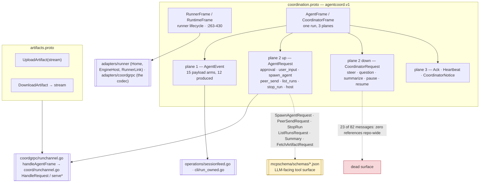

# Wire contract — `agentcoord.v1`

The hand-written protos in `internal/adapters/coordgrpc/pb/` are the normative contract for
agent delegation: three gRPC services, 82 messages and 13 enums in
`coordination.proto` (1348 lines), 9 messages and 1 service in `artifacts.proto`
(207 lines), plus a vendored `google/rpc/status.proto`. The contract has **three**
consumer classes, and the third is what makes a dead field expensive: six of these
messages are projected by `internal/adapters/coordgrpc/mcpschema` into the **JSON Schemas an
LLM reads and fills in**, so a field with no handler is a model-facing argument that
silently does nothing.

Generated `*.pb.go` is gitignored (`.gitignore:26`); the `.proto` files are the source
of truth.

```mermaid
flowchart TD
  subgraph Wire["coordination.proto — agentcoord.v1"]
    RF["RunnerFrame / RuntimeFrame<br/>runner lifecycle · :263-430"]
    AF["AgentFrame / CoordinatorFrame<br/>one run, 3 planes"]
    P1["plane 1 — AgentEvent<br/>15 payload arms, 12 produced"]
    P2U["plane 2 up — AgentRequest<br/>approval · user_input · spawn_agent<br/>peer_send · list_runs · stop_run · host"]
    P2D["plane 2 down — CoordinatorRequest<br/>steer · question · summarize · pause · resume"]
    P3["plane 3 — Ack · Heartbeat · CoordinatorNotice"]
    AF --> P1 & P2U & P2D & P3
  end
  subgraph Art["artifacts.proto"]
    UP["UploadArtifact(stream)"]
    DL["DownloadArtifact → stream"]
  end
  MCP[["mcpschema/schemas/*.json<br/>LLM-facing tool surface"]]
  COORD[["coordgrpc/runchannel.go handleAgentFrame → coord/runchannel.go HandleRequest / serve*"]]
  RUNNER[["adapters/runner (Home, EngineHost, RunnerLink) · adapters/coordgrpc (the codec)"]]
  VIEW[["operations/sessionfeed.go · cli/run_owned.go"]]
  P2U --> COORD
  P1 --> VIEW
  RF --> RUNNER
  Art --> COORD
  P2U -. "SpawnAgentRequest · PeerSendRequest · StopRun<br/>ListRunsRequest · Summary · FetchArtifactRequest" .-> MCP
  P2D -. "23 of 82 messages: zero references repo-wide" .-> DEAD["dead surface"]
  style DEAD fill:#f8d7da,stroke:#b02a37
  style MCP fill:#fff3cd,stroke:#997404
```

## Services

| Service / RPC | Contract | Implementation |
| --- | --- | --- |
| `CoordinatorService.RunnerChannel` | bidi; runner lifecycle keyed by credential hash | server `coordgrpc/grpcserver.go` over `coord/runnersession.go`, client `runner/runnerlink.go` |
| `CoordinatorService.RunChannel` | bidi; ONE run's three planes | server `coordgrpc/runchannel.go` over `coord/runchannel.go`, client `runner/home.go` |
| `ConsumerService.WatchRuns` | snapshot frame, then live events | `coordgrpc/consumer.go` over `coord/consumer.go`; client `operations/sessionfeed.go` |
| `ConsumerService.ListRuns` | roster poll | `coordgrpc/consumer.go` over `coord.Coordinator.ListRuns` |
| `ArtifactTransferService.UploadArtifact` | chunked upload, server-hashed | `coordgrpc/artifacts.go` over `coord.ReceiveArtifact`; client `runner/homeartifacts.go` |
| `ArtifactTransferService.DownloadArtifact` | header-first stream | `coordgrpc/artifacts.go` over `coord.OpenArtifact`; client `runner/homeartifacts.go` |

`CoordinatorService` carries no unary RPC: events reach the journal only over
`RunnerChannel`, and there was never a non-test client for an at-least-once
unary fallback to serve.

`ConsumerService` is deliberately read-only — steer/inject is excluded and the proto
says why. Consumer credentials are refused on `CoordinatorService` by the auth
interceptors (`grpcserver.go`).

## Message families that matter

| Message | Role | Reality |
| --- | --- | --- |
| `AgentEvent` | the durable sequenced fact; "the coordinator's view is a pure fold over these" | envelope fields `task_id`, `turn_id`, `parent_item_id`, `traceparent` have **zero references repo-wide**; 4 of 15 payload arms are never constructed |
| `Launch` | what to launch — the resolved launch, field for field (`launch.Launch`), the package carried inline or by claim | one codec (`coordgrpc.EncodeLaunch`/`DecodeLaunch`) with a field-set parity test; `StartRun.harness`/`input`/`parent_run_id`/`role` are superseded and reserved in slice 9 |
| `HostRequest` / `HostResult` | a host-relayed tool by name with its arguments as the tool's own JSON object | the coordinator's `Host` verb dispatches it to the `HostApp` it was composed with, under the caller's identity |
| `SpawnAgentRequest` | `agent_run` | the live payload has migrated *into* the untyped `input` Struct (`prompt`, `workspace`, `dirty_tree_handler`, read at `runchannel.go`); the typed `budget`/`constraints`/`notify_on` are read by nobody |
| `PeerSendRequest` | `agent_send` | `to_agent_id`/`to_role`/`text`/`structured`/`in_reply_to` are live; `artifact_ids` is never read and `PeerMessage.artifacts` is never populated |
| `ListRunsRequest` / `ListRunsResult.RunInfo` | `roster` | see [observation.md](observation.md) — 2 of 4 filters and 2 of 9 result fields are inert |
| `StopRun` | used in **two directions with two contracts**: `RunnerRequest.stop_run=11` (runtime→runner, graceful) and `AgentRequest.stop_run=16` (parent→coordinator, hard kill, "grace is advisory") | its `(message_schema).doc` describes only the `agent_stop` sense and is projected into `schemas/agent_stop.json` |
| `Summary` | durable report event **and** the `agent_report` tool input | fully consumed (`coord/reports.go`); `runner/mcp/server.go` hard-rejects empty `text` and `SCOPE_UNSPECIFIED` — the fail-loud model for the rest of the file |
| `Result` / `Usage` | terminal outcome + accounting | 5 of 10 `Result` fields and `Usage.per_model` have zero producers and zero consumers; the micro-USD discipline is correctly implemented at `enginehost.go` |
| `AgentIdentity` | who this agent is | only `agent_id` and `role` are ever populated (`consumer.go`, `enginehost.go`); `runner_id` is documented as "coordinator-assigned and validated against the connection credential" and is never assigned |

## Enum zero-value semantics

Proto3 enums have no "unset"; the zero value is what an unfilled or forward-version
field decodes to. This table is the security-relevant audit.

| Enum | Zero value | Polarity | Evidence |
| --- | --- | --- | --- |
| `ApprovalDecision.Decision` | `DECISION_UNSPECIFIED` | **fails closed** | `enginehost.go` is an explicit allow-list; `approval.go` rejects it by name |
| `Summary.Scope` | `SCOPE_UNSPECIFIED` | **fails closed** | `runner/mcp/server.go` hard-rejects |
| `Result.RunStatus` | `RUN_STATUS_UNSPECIFIED` | **fails open** | every consumer tests `== RUN_STATUS_FAILED`, so `run_owned.go` exits 0 for UNSPECIFIED, CANCELLED and TIMED_OUT; `children.go` records no failure reason |
| `MessageChannel` | `MESSAGE_CHANNEL_UNSPECIFIED` | **read two opposite ways** | `children.go` treats unset as *not* final (dropped from the turn accumulator); `operations/sessionfeed.go` renders it as user-facing assistant output |
| `ArtifactKind`, `InteractionRecorded.Resolution`, `PeerSendResult.Delivery`, `ApprovalKind`, `MessageRole` | — | neutral (always explicitly set, or lookup-fallback only) | — |
| `StepCompleted.Outcome`, `StatusChanged.Phase`, `SteerResult.Applied`, `SpawnAgentRequest.NotifyOn` | — | **dead enums** — no value referenced anywhere | — |

## Contracts asserted in the proto that the code does not implement

Recorded because the comment is normative and a reader will otherwise trust it.

- `HelloAck.committed_seq` is "the authoritative resume cursor";
  `runchannel.go` sets `CommittedSeq: hello.GetResumeFromSeq()` — the agent's own
  claim, echoed. `HelloAck.event_window` has zero references, so the file header's
  end-to-end backpressure claim is unimplemented.
- `RunnerHello.harnesses` ("runtime MUST NOT StartRun a harness the runner didn't
  advertise") and `RunnerHello.max_concurrent_runs` ("RESOURCE_EXHAUSTED when at
  capacity") are both never read. `RunnerHeartbeat`'s three payload fields and
  `DrainResult` are entirely unreferenced. This family describes multi-runner
  placement; ctxloom runs one runner per run.
- `Hello.protocol_version` is written as `1` and never checked, across
  11 documented revisions.
- Both `reject_reason` fields, added so a handshake rejection is
  actionable, are discarded by their only clients (`runnerlink.go`, `home.go`).
- `StopRunResult.exited_within_grace` is hardcoded `true` on **both** return paths
  (`runchannel.go`), including the immediate-kill path.

## Arguments the LLM is told to use that are discarded

Schema-validated at the MCP edge, then never read. `Get*` call sites verified zero.

| Tool | Argument | Handler |
| --- | --- | --- |
| `agent_run` | `budget`, `constraints`, `notify_on` | `runchannel.go` reads only `role` and `input.{prompt,workspace,dirty_tree_handler}` |
| `roster` | `task_id`, `include_descendants` | `runchannel.go` passes only `include_terminal` and `role` |
| `agent_stop` | `grace`, `reason` | `runchannel.go` reads only `run_id` |
| `agent_send` | `artifact_ids` | `runchannel.go` never reads it; `PeerMessage.artifacts` is never populated |

`SpawnAgentResult.child_task_id` is likewise returned to the model as a permanently
empty string.

## Dead surface

23 of 82 messages have zero references outside generated code, including the entire
coordinator→agent request direction: `CoordinatorRequest`, `Steer*`, `Question*`,
`Summarize*`, `Pause*`, `Resume*`, `BudgetSpec`, `BudgetUpdate`, `CancelRun`,
`CancelRequest`, `StepStarted`, `StepCompleted`, `StatusChanged`, `UserInput*`,
`RawEvent`, `DrainResult`, `ArtifactRef`. `CoordinatorNotice` has 4 arms of which only
`peer_message` is alive.

## Field-number hygiene

No duplicate field numbers exist (verified across all 159 generated structs). Six
`reserved` declarations exist, all deferral holds rather than deletion tombstones.
Revisions 6 and 7 **renumbered** fields (`RunnerHello`, `ArtifactProduced`) with no
tombstones — safe only because the durable journal is JSONL of hand-written Go structs
(`coord/journal.go`), not proto bytes. That invariant is not recorded in the
file.

## Vendored `google/rpc/status.proto`

Byte-identical to upstream googleapis. Deliberately vendored and excluded from both
lint (`buf.yaml`) and codegen (`buf.gen.yaml`) with recorded rationale: remote BSR
made `buf generate` fail non-deterministically. Go types still come from
`google.golang.org/genproto`, so there is no duplicate-type hazard. No provenance
commit is pinned.
