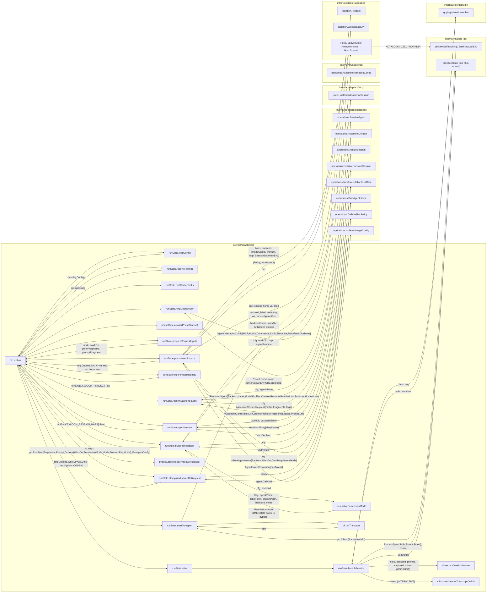
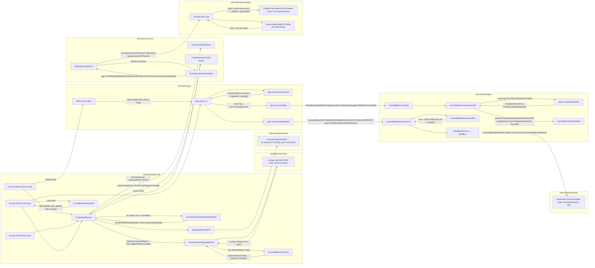
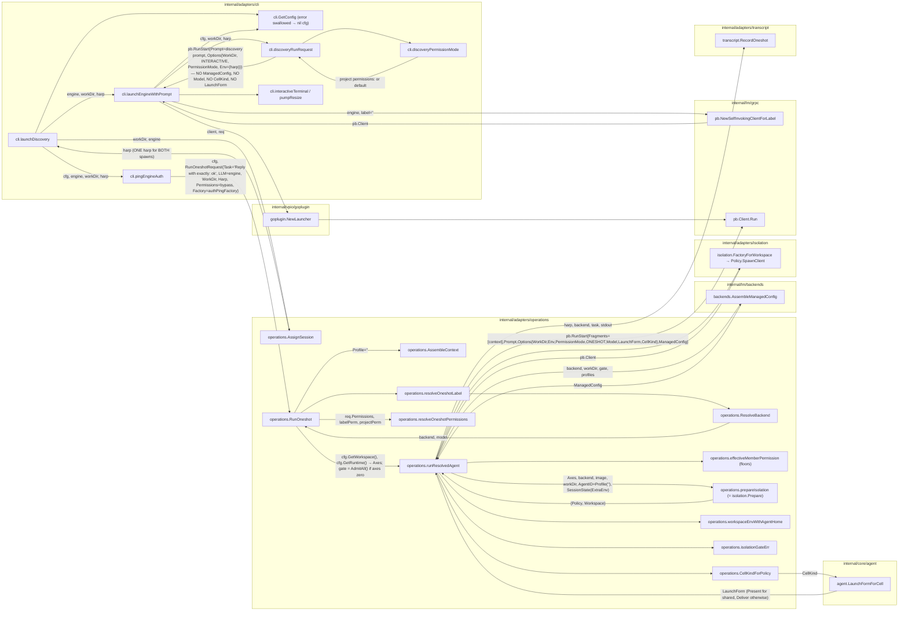
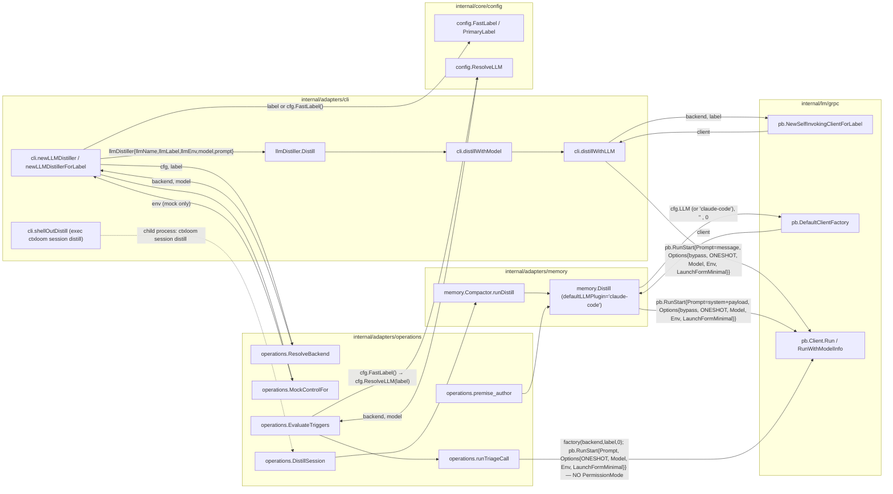
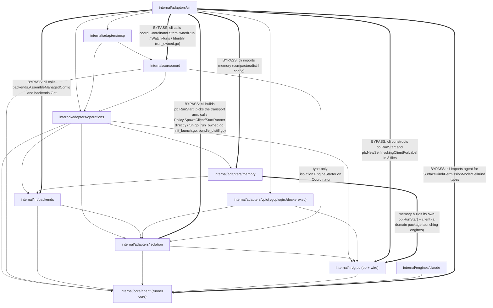
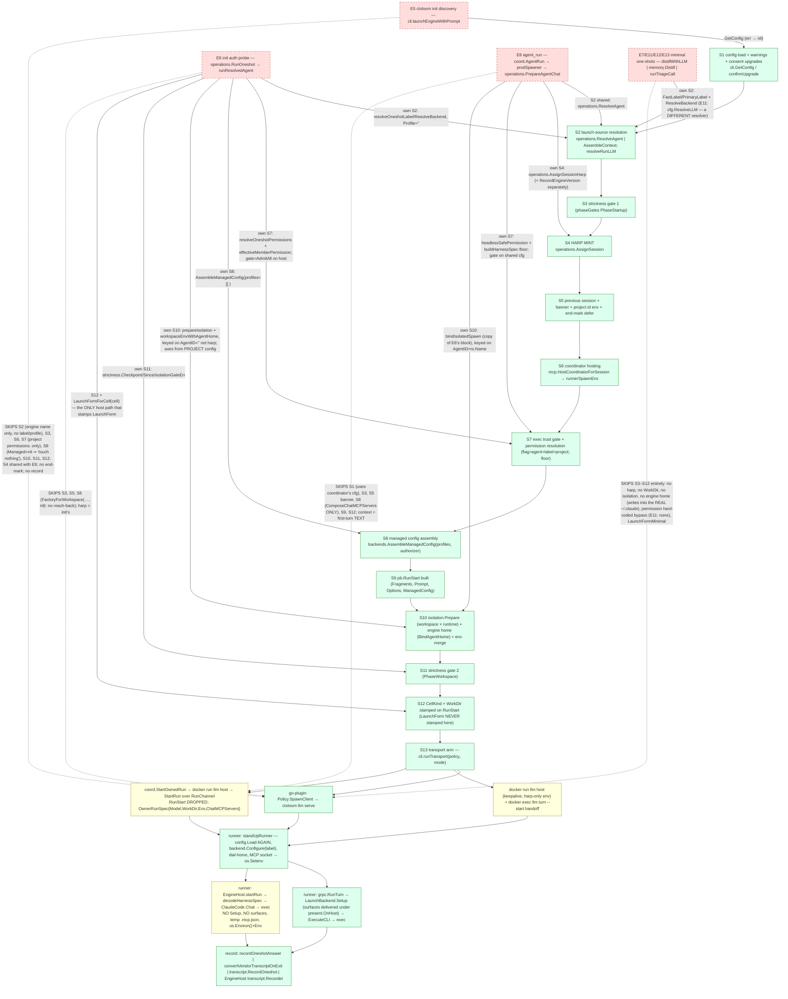

# Seam 1 — LAUNCH PATHS

Architecture audit, read-only. Every way an engine process gets started, traced to the exec/spawn.
Analyst: leaf 1 of 7. Repository checkout at HEAD of `release/0.7` (`d42cc4229`), read 2026-09-18.

All references are `package.Symbol` + file; no line numbers.

STATUS: COMPLETE.

## 1. Scope and entry points

**Seam.** Every path by which an ENGINE PROCESS (claude / codex / opencode / mock CLI) is exec'd or spawned, and the startup procedure each path performs on the way: config load → strictness gates → launch-source (agent/profile) resolution → harp mint → session dir → engine home → managed-config (surface) assembly → isolation (workspace+runtime) → env → transport → exec → record. The known symptom is "one-shots not going through the same startup procedures"; the ruled target is `scant-undoing` (ONE launch path for run/init/oneshot; every run mints a harp; DELETE `operations.RunOneshot`).

**Stated architecture read first.** `GLOSSARY.md` (pipeline: control-plane → wire → runner → engine; originator is the ONLY process that execs a container runtime; advice applied ONCE), `docs/architecture/cli/run.md`, `docs/architecture/cli/llm-runners.md`, `docs/architecture/shared/agent-launch-lifecycle.md`, `docs/architecture/engines/isolation.md`, `docs/architecture/agentcoord/child-lifecycle.md`, and rows `scant-undoing`, `boned-monoxide`, `concerned-levitator`, `dimmed-epidural`, `tranquil-mutiny`, `broken-jailbreak` (the last is self-corrected: its premise was false; `operations.ResolveInTreeAgentHome` resolves the home cell-orthogonally).

**Packages read.** `internal/adapters/cli` (run.go, run_owned.go, init.go, init_launch.go, distiller.go, llm_host.go, llm_serve.go, llm_turn.go, llm_runner_common.go, mcp_runner.go), `internal/adapters/operations` (oneshot.go, delegate.go, agents.go, sessions.go, session_distill.go), `internal/adapters/isolation` (isolation.go, none.go, worktree.go, container.go, direct_runner.go), `internal/lm/backends` (managed.go, registry), `internal/lm/grpc` (server.go, client), `internal/core/agent` (launch_backend.go, base_backend.go, exec paths), `internal/engines/claude` (chat_run.go, backend.go), `internal/core/coord` (spawner.go, children.go, owner_run.go, enginehost.go), `internal/adapters/vpio`, `internal/adapters/mcp` (coordinator hosting), `tests/arch/*`.

### Entry points traced (each is a distinct way an engine gets started)

| # | Entry point | Symbol | File | Who calls it |
|---|---|---|---|---|
| E1 | `ctxloom run` (interactive, host/worktree) | `cli.runRun` → `runState.startTransport` (arm `armGoPlugin`) → `runState.launchSession` | `internal/adapters/cli/run.go` | human |
| E2 | `ctxloom run --one-shot` (host/worktree) | same trunk, `st.mode == pb.ExecutionMode_ONESHOT`, same go-plugin arm | `internal/adapters/cli/run.go` | human, `ctxloom tasks run` (seed) |
| E3 | `ctxloom run` container INTERACTIVE | trunk → `armDockerExecInteractive` → `cli.startContainerInteractive` → `isolation.Policy.StartRunner` + `docker exec … ctxloom llm turn` | `internal/adapters/cli/run.go`, `internal/adapters/cli/llm_turn.go` | human |
| E4 | `ctxloom run --one-shot` container | trunk → `armOwnedRunContainer` → `cli.startContainerOwnedRun` → `coord.Coordinator.StartOwnedRun` → `coord.OwnedRunStarter` → `isolation.Container.StartRunner` (`ctxloom llm host`) | `internal/adapters/cli/run_owned.go`, `internal/core/coord/owner_run.go` | human |
| E5 | `ctxloom init` launch | `cli.launchEngineWithPrompt` (own plugin client + raw terminal pump) | `internal/adapters/cli/init_launch.go` | `ctxloom init` |
| E6 | `ctxloom init` auth probe | `operations.RunOneshot` (sole production caller) | `internal/adapters/cli/init_launch.go` → `internal/adapters/operations/oneshot.go` | `ctxloom init` |
| E7 | distill / compact one-shots | `cli.newLLMDistiller` / `cli.newLLMDistillerForLabel` → `llmDistiller.Distill` → own `pb.Client` + `RunStart` | `internal/adapters/cli/distiller.go` | `ctxloom session distill`, run exit-time distill (`shellOutDistill` shells out to the CLI) |
| E8 | delegated child (`agent_run`) | `coord.Coordinator.AgentRun` → `prodSpawner.StartEngine` → `operations.StartAgentEngine` → `isolation.Policy.StartRunner` (`ctxloom llm host`) | `internal/core/coord/children.go`, `spawner.go`, `internal/adapters/operations/delegate.go` | orchestrating agent over MCP |
| E9 | runner processes (inside container or as child) | `ctxloom llm host|serve|turn <backend> --label` → `cli.standUpRunner` → `grpc` server → `LaunchBackend.Setup` → `ExecuteCLI` → engine exec | `internal/adapters/cli/llm_*.go`, `internal/lm/grpc/server.go`, `internal/core/agent/launch_backend.go` | E3, E4, E8 (host) / E1,E2,E5,E6,E7 (serve, via go-plugin) |
| E10 | the actual exec | `agent.LaunchBackend.ExecuteCLI` → `RunInteractive`/`RunNonInteractive` → `exec.Cmd`; `claude.ChatRun` (stream-json chat) | `internal/core/agent/*`, `internal/engines/claude/chat_run.go` | E9 |

(Table extended below as tracing proceeds.)

### E1/E2 — `ctxloom run` trunk (`cli.runRun`, `internal/adapters/cli/run.go`)

The doc `docs/architecture/cli/run.md` describes "one anonymous 930-line cobra closure"; that is STALE — `runRun` is now a 21-step sequence over a `runState` struct with one method per phase. The ordered phases (the trunk every other path is diffed against):

| step | phase | symbol | what it produces (data) |
|---|---|---|---|
| R1 | validate flags | `runState.validateFlags` | — |
| R2 | config load + warnings + consent-gated upgrades | `runState.loadConfig` → `cli.GetConfig`, `confirmUpgrade`, `confirmProfileUpgrades` | `st.cfg *config.Config` |
| R3 | prompt sourcing | `runState.resolvePrompt` → `finalizeRunPrompt` | `st.prompt` (flag > `--command` > argv > piped stdin) |
| R4 | shutdown signals | `runState.withShutdownSignals` | `st.ctx` |
| R5 | startup side effects | `runState.runStartupTasks` (sync install, companions report, orphan worktree sweep) | filesystem |
| R6 | launch-source resolution | `runState.resolveLaunchSource` → `resolveNamedAgent` \| `resolveDefaultAgent` \| `resolveClassicAssembly` → `operations.ResolveAgent` / `operations.AssembleContext`; `resolveRunLLM` | `st.ctxResult`, `st.label`, `st.backendName`, `st.labelModel`, `st.agentPermissions`, `st.agentSurfaces`, `st.agentRuntime`, `st.agentHomeMode`, `st.boundAgent`, `st.llmEnv` |
| R7 | strictness gate 1 | `runState.gateStartup` → `phaseGates.close(PhaseStartup)` | exit 3 on findings |
| R8 | request inputs | `runState.prepareRequestInputs` | `st.mode`, `st.sessionWorkspace`, `st.protoFragments`, `st.promptFragment`, `st.workDir` |
| R9 | dry-run exit | `runState.emitDryRun` | — |
| R10 | **harp mint** | `runState.openSession` → `operations.AssignSession(ctx, workDir, backendName)`; `applyResumeEnv`; `operations.ResolvePreviousSession`; `PrintStartSessionBanner` | `st.activeHarp`, `st.runEnv["CTXLOOM_SESSION_HARP"]` (+`CTXLOOM_RESUMED_FROM/_PARTS`) |
| R11 | project identity | `runState.exportProjectIdentity` → `taskops.ResolveProjectIdentity` | `st.runEnv["CTXLOOM_PROJECT_ID"]` |
| R12 | end-mark defer | `runState.markSessionEnded` | session index |
| R13 | **coordinator hosting** | `runState.hostCoordinator` → `mcp.HostCoordinatorForSession(cfg, workDir, harp, runtime)` | `st.sessionCoord`, `st.runnerSpawnEnv` (URL + credential trio) |
| R14 | seed task | `runState.seedTask` | task log |
| R15 | **managed config + permission + RunStart** | `runState.buildRunRequest` → `operations.NewExecutableTrustGate`, `isolation.ParseWorkspaceAxis`, `resolvePermissionMode`, `backends.AssembleManagedConfig(backend, workDir, authorizer, profiles)` | `st.runAxes`, `st.permMode`, `st.managed *agent.ManagedConfig`, `st.req *pb.RunStart{Fragments, Prompt, Options{WorkDir, PermissionMode, Mode, Env=runEnv, Verbosity, Model}, ManagedConfig}` |
| R16 | teardown defer | `runState.teardownAll` | — |
| R17 | **isolation + engine home** | `runState.prepareWorkspace` → `isolation.Prepare(ctx, axes, backend, imageCfg, workDir, harp, SessionStateFromEnv(runEnv))`; `mergeWorkspaceEnv(req.Options.Env, isolation.WorkspaceEnv(ws))`; `operations.BindAgentHome(ws, InTreeAgentHome{Backend, WorkDir, Cwd, Harp, HomeMode})` | `st.policy`, `st.ws`, `req.Options.Env` += workspace env += home env (`CLAUDE_CONFIG_DIR` etc.) |
| R18 | strictness gate 2 | `phaseGates.close(PhaseWorkspace)` | exit 3 on isolation findings |
| R19 | stamp workspace | `runState.stampWorkspaceOnRequest` | `req.Options.WorkDir = ws.Dir()`, `req.Options.CellKind = CellKindForPolicy(policy)` |
| R20 | **transport** | `runState.startTransport` → `runTransport(policy.Name(), mode)` → one of E1/E2 (`policy.SpawnClient`), E3 (`startContainerInteractive`), E4 (`startContainerOwnedRun`) | `st.client` \| `st.runnerHandle`+`st.interactiveLauncher` \| `st.ownedRun` |
| R21 | drive + record | `runState.drive` → `runOneshotViaCoord` \| `driveTerminalSession` → `prepareSessionIO` → `launchSession` (`goplugin.NewLauncher(client, req).Start`, `session.Wait`, `recordOneshotAnswer`, `convertVendorTranscriptOnExit`) | stdout, transcript, exit code |

Observed on the trunk itself (findings below): R10's `AssignSession` failure is a WARN and the run proceeds harpless; R13 silently skips when harpless; `--one-shot` differs from interactive ONLY by `st.mode` (affects permission floor, `prepareSessionIO` capture vs raw terminal, `recordOneshotAnswer` vs `convertVendorTranscriptOnExit`) — so E1 and E2 are ONE path, as `scant-undoing` already records.

### Additional entry points found while tracing

| # | Entry point | Symbol | File | Notes |
|---|---|---|---|---|
| E11 | task-trigger triage oneshot | `operations.runTriageCall` (from `operations.EvaluateTriggers`) | `internal/adapters/operations/task_triggers.go` | own `pb.RunStart{Prompt, Options{ONESHOT, Model, Env, LaunchFormMinimal}}`; `pb.DefaultClientFactory()`; no harp, no permission, no WorkDir |
| E12 | bundle-item distill | `cli.distillWithLLM` (from `cli.distillWithModel` ← `llmDistiller.Distill`) | `internal/adapters/cli/bundle_distill.go` | own `pb.RunStart`, `pb.NewSelfInvokingClientForLabel`; `RunWithModelInfo` |
| E13 | session distill / compaction + premise author | `memory.Distill` (← `memory.Compactor.runDistill` ← `operations.DistillSession`; ← `operations.premise_author`) | `internal/adapters/memory/distill.go` | own `pb.RunStart`; `defaultLLMPlugin = "claude-code"` hard-coded fallback engine |
| E14 | `ctxloom llm turn` (inside container, E3's second process) | `cli.runLLMTurn` → `readRunStartHandoff` → `grpc.RunTurn` | `internal/adapters/cli/llm_turn.go` | the ONLY runner that gets its `RunStart` from a FILE |
| — | mock engine | `cmd/mockengine` binary exec'd by the `Mock` backend | `internal/engines/mock`, `internal/lm/backends/mock.go` | not a launch path; an engine stand-in reached through E10 |
| — | `PreparedAgentChat.Start` / `startOneshot` / `dialChat` | `operations.PreparedAgentChat.Start` | `internal/adapters/operations/delegate.go` | **NO production caller** (the coordinator's legacy chat driver is gone: `coord.runChild` only calls `runChildViaStartRun`, and `coord.Spawner` has no `Launch`). Dead launch orchestrator — see findings. |

**Process-boundary sites (where a process is actually created)** — everything above funnels into one of these:

| Site | Spawns | Symbol / file |
|---|---|---|
| X1 | engine CLI (host or in-container), pty or pipes | `backends.RunLaunchSpec` ← `agent.BaseBackend.run` ← `LaunchBackend.ExecuteCLI` — `internal/lm/backends/launcher.go`, `internal/core/agent/base.go` |
| X2 | engine CLI, stream-json chat (StartRun path) | `claude.ClaudeCode.spawnChatTransport` ← `ClaudeCode.Chat` — `internal/engines/claude/chat_run.go` |
| X3 | `ctxloom llm serve` (go-plugin, host) | `grpc.dialLLMConnection` ← `grpc.NewSelfInvokingClientForLabelEnv` — `internal/lm/grpc/client.go` |
| X4 | `ctxloom llm host` (host, transport-free) | `grpc.StartHostRunner` ← `isolation.None.StartRunner` — `internal/lm/grpc/host_runner.go`, `internal/adapters/isolation/none.go` |
| X5 | `docker/podman run … ctxloom llm serve` (go-plugin over mounted socket) | `isolation.containerRunner` ← `Container.SpawnClient` — `internal/adapters/isolation/runner.go` |
| X6 | `docker/podman run … ctxloom llm host` (transport-free keepalive) | `isolation.startDirectRunner` ← `Container.StartRunner` — `internal/adapters/isolation/direct_runner.go` |
| X7 | `docker/podman exec -it … ctxloom llm turn --start <file>` | `isolation.RunAttached` ← `dockerexec.Launcher.Start` — `internal/adapters/isolation/attach.go`, `internal/vpio/dockerexec` |

## 2. Call graphs

Edge labels carry the state that crosses (`args / returns`); ctx and loggers omitted.

### 2.1 `ctxloom run` trunk (E1/E2, host & worktree; E3/E4 branch at `startTransport`)



### 2.2 Runner side — what every go-plugin / `llm turn` request reaches (E9 → E10)



Note the two exec tails: `RunTurn → Setup → ExecuteCLI → RunLaunchSpec` (surfaces delivered) and `EngineHost.startRun → Chat → spawnChatTransport` (NO `Setup`, NO surfaces, temp MCP file). Which tail a run gets is decided by the ARM the host picked, not by the engine.

### 2.3 Container arms of `ctxloom run` (E3 interactive, E4 oneshot)

```mermaid
flowchart LR
  subgraph cli["internal/adapters/cli"]
    startT["runState.startTransport"]
    sci["cli.startContainerInteractive"]
    writeHO["cli.writeRunStartHandoff (protojson → persist/<file>, 0600)"]
    stamp["cli.stampHostTerminalEnv"]
    scor["cli.startContainerOwnedRun"]
    viaCoord["cli.runOneshotViaCoord"]
    turn["cli.runLLMTurn (IN CONTAINER)"]
    hostK["cli.runLLMHost keepalive (IN CONTAINER)"]
  end
  subgraph operations["internal/adapters/operations"]
    RuntimeFor["operations.RuntimeForPolicy"]
    PersistDir["operations.ContainerPersistDirForPolicy"]
    JoinLead["operations.JoinLeadBlocks"]
  end
  subgraph isolation["internal/adapters/isolation"]
    StartRunner["Container.StartRunner"]
    buildRS["Container.buildRunnerSpec"]
    direct["isolation.startDirectRunner (docker run … llm host)"]
    Await["isolation.AwaitContainerRunning"]
    RunAttached["isolation.RunAttached (docker exec -it … llm turn)"]
  end
  subgraph dockerexec["internal/vpio/dockerexec"]
    DEL["dockerexec.NewLauncher / Launcher.Start"]
  end
  subgraph coord["internal/core/coord"]
    StartOwned["Coordinator.StartOwnedRun"]
    enqueue["Coordinator.enqueueRun"]
    viaStart["Coordinator.runChildViaStartRun"]
    buildHS["coord.buildHarnessSpec"]
    issue["Coordinator.issueStartRun (RunnerRequest.StartRun over RunChannel)"]
    EH["EngineHost.startRun (IN CONTAINER)"]
  end
  subgraph claude["internal/engines/claude"]
    Chat["ClaudeCode.Chat → spawnChatTransport"]
  end

  startT -- "policy, ws, req *pb.RunStart, backend, label, harp, runnerSpawnEnv" --> sci
  sci --> RuntimeFor
  sci -- "policy, harp" --> PersistDir -- "host persist dir (bind-mounted)" --> sci
  sci -- "req (+TERM/COLORTERM)" --> stamp
  sci -- "harp, req" --> writeHO -- "path" --> sci
  sci -- "backend, label, ws, keepaliveEnv{CTXLOOM_SESSION_HARP ONLY}" --> StartRunner --> buildRS -- "RunSpec{Image,Name,WorkDir,Home,Command=llm host,Env(names only),Mounts}" --> direct -- "*RunnerHandle{Name,Kill,Wait}" --> sci
  direct -.-> hostK
  sci -- "rt, handle" --> Await
  sci -- "TurnSpec{Backend,Label,StartPath,Env=runnerSpawnEnv}" --> DEL
  DEL -- "docker exec argv" --> RunAttached -.-> turn
  turn -- "readRunStartHandoff(path) → *pb.RunStart → grpc.RunTurn (graph 2.2)" --> turn

  startT -- "ownedRunLaunch{Policy,Workspace,Req,Backend,Label,Harp,ContextText,Prompt,MCPServers=managed.ChatMCPServers(),Permission,Mode,RunnerEnv}" --> scor
  scor -- "ContextText, Prompt" --> JoinLead -- "lead string" --> scor
  scor -- "owner Identity, OwnerRunSpec{Harp,Backend,Label,Model=req.Model,WorkDir=req.WorkDir,Env=req.Env,MCPServers,Permission,Oneshot}, starter, lead" --> StartOwned
  StartOwned -- "SpawnPlan{AgentName=harp,Backend,Label,Runtime=container,Perm,MCPServers}" --> enqueue -- "childRt, token" --> StartOwned
  StartOwned -- "starter(spawnEnv{URL,cred,runID,harp,depth})" --> StartRunner
  StartOwned --> viaStart
  viaStart -- "HarnessSpecInput{Harness,Model,Workspace,Env,MCPServers,SessionHarp,Permission}" --> buildHS -- "*agentcoordpb.HarnessSpec" --> viaStart
  viaStart -- "spec, first=lead" --> issue -. "wire (RunChannel)" .-> EH
  EH -- "ChatRequest" --> Chat
  scor -- "*ownedRunSession{coord,outcome,events}" --> viaCoord
```



The `*pb.RunStart` that R15–R19 assembled (with `ManagedConfig`, `Fragments`, `CellKind`, `PermissionMode`) is NOT sent on E4: `startContainerOwnedRun` re-packs three of its fields into `coord.OwnerRunSpec` and drops the rest.

### 2.4 Delegated child (E8, `agent_run`)

```mermaid
flowchart LR
  subgraph coord["internal/core/coord"]
    AgentRun["Coordinator.AgentRun"]
    Resolve["prodSpawner.Resolve"]
    headless["coord.headlessSafePermission"]
    resumeMode["coord.resolveResumeMode"]
    childMCP["prodSpawner.childMCPServers"]
    AssignS["prodSpawner.AssignSession"]
    reachURL["Coordinator.spawnReachURL"]
    enqueue["Coordinator.enqueueRun"]
    runChild["Coordinator.runChild (slot)"]
    viaStart["Coordinator.runChildViaStartRun"]
    StartEngine["prodSpawner.StartEngine"]
    chatReq["prodSpawner.chatRequest"]
    buildHS["coord.buildHarnessSpec"]
    issue["Coordinator.issueStartRun"]
    childEnv["Coordinator.childEnv / runnerEnv"]
  end
  subgraph operations["internal/adapters/operations"]
    ResolveAgent["operations.ResolveAgent"]
    AssignHarp["operations.AssignSessionHarp"]
    PrepareChat["operations.PrepareAgentChat"]
    delegatedAxes["operations.delegatedAxes"]
    dirty["operations.decideDirtyParentTree"]
    bindIso["PreparedAgentChat.bindIsolatedSpawn"]
    wsEnvHome["operations.workspaceEnvWithAgentHome → BindAgentHome"]
    isoGate["operations.isolationGateErr (strictness.Checkpoint/Since)"]
    PStartEngine["PreparedAgentChat.StartEngine"]
  end
  subgraph agent["internal/core/agent"]
    Compose["agent.ComposeChatMCPServers"]
  end
  subgraph isolation["internal/adapters/isolation"]
    Prepare["isolation.Prepare (via prepareIsolation var)"]
    StarterFor["isolation.StarterForWorkspace → Policy.StartRunner"]
    FactoryFor["isolation.FactoryForWorkspace (DEAD: only Start() reads p.factory)"]
  end

  AgentRun -- "agentName" --> Resolve
  Resolve -- "cfg, agentName" --> ResolveAgent -- "*ResolvedAgent" --> Resolve
  Resolve -- "declared perm" --> headless -- "PermissionMode (floors), degraded[]" --> Resolve
  Resolve -- "driving, backend" --> resumeMode
  Resolve --> childMCP -- "cfg.ResolveBundleMCPServers(profiles)" --> Compose -- "[]ChatMCPServer (ctxloom server or warn)" --> Resolve
  Resolve -- "*SpawnPlan{AgentName,Backend,Label,Profiles,Runtime,Context,Perm,ResumeMode,MCPServers}" --> AgentRun
  AgentRun -- "projectDir, backend" --> AssignS --> AssignHarp -- "harp" --> AgentRun
  AgentRun --> reachURL -- "url (fatal unless --degraded)" --> AgentRun
  AgentRun -- "plan, harp, prompt" --> enqueue -- "childRt{runID, token}" --> AgentRun
  AgentRun --> runChild --> viaStart
  viaStart --> childEnv -- "env{harp, project id}; runnerEnv{URL,cred,runID,depth}" --> viaStart
  viaStart -- "plan, env, runnerEnv" --> StartEngine --> chatReq -- "AgentChatRequest{Resolved,Context,WorkDir,Env,RunnerEnv,Permissions,Gate,Workspace,DirtyTreeHandler}" --> PrepareChat
  PrepareChat --> delegatedAxes -- "Axes{workspace(req), runtime(binding)}" --> PrepareChat
  PrepareChat --> dirty
  PrepareChat --> bindIso
  bindIso -- "axes, backend, image, workDir, AgentID=rs.Name, SessionState(req.Env)" --> Prepare -- "(Policy, Workspace)" --> bindIso
  bindIso -- "ws, InTreeAgentHome{…,Harp=req.Env[harp],HomeMode}" --> wsEnvHome -- "workspaceEnv (+home var)" --> bindIso
  bindIso --> isoGate
  bindIso --> FactoryFor
  bindIso -- "policy, ws, backend, label, verbosity, runnerEnv" --> StarterFor -- "EngineStarter" --> bindIso
  StartEngine -- "prep" --> PStartEngine -- "*AgentEngineProcess{WorkDir,Env,Model,Kill,Wait,StderrTail}" --> StartEngine
  StartEngine -- "*EngineSpawn{…, MCPServers=plan.MCPServers}" --> viaStart
  viaStart -- "HarnessSpecInput" --> buildHS -- "*HarnessSpec" --> viaStart
  viaStart -- "first = JoinLeadBlocks(plan.Context, prompt)" --> issue
```



No `AssembleManagedConfig` on this path: the child's loadout is `MCPServers` only (composed by `ComposeChatMCPServers` from the profiles' bundle MCP), its context is the first turn's TEXT, and there are no hooks, commands, skills, statusline, or deny-tools surfaces. The exec is `ClaudeCode.Chat` (graph 2.2, right-hand tail).

### 2.5 `ctxloom init` (E5 discovery session, E6 auth probe) and `operations.RunOneshot`



### 2.6 The "minimal" one-shots (E7/E12 bundle distill, E13 session distill / premise author, E11 task triage)



None of these mints a harp or sets `WorkDir`; `runTriageCall` sends no `PermissionMode` at all and relies on the runner-side floor in `grpc.turnExecuteRequest`. Three of them are the same ~25-line body.

## 3. Delegation / layer graph, divergence graph, data flow

### 3.1 Package delegation graph (actual imports among the seam's packages)

Stated layering (`GLOSSARY.md` pipeline + `tests/arch/layering_test.go`'s T20 target `cli/<flow> → operations/<flow> → domain`): **cli → operations → {isolation, backends, grpc, agent, coord}**; **coord → operations** (via `Spawner`) and never into cli; the wire (`grpc`) sits between control-plane and runner; engines (`claude`) depend only on `shared/agent`. Solid = expected direction. Thick/labelled = goes AGAINST or SKIPS a layer that exists.



Reading: `internal/adapters/operations` is the stated mediator, but `internal/adapters/cli/run.go` is itself the orchestrator of the launch — it holds the `*pb.RunStart`, the `isolation.Policy`, the `coord.Coordinator`, and the `vpio.Launcher`. `operations` has a PARALLEL orchestrator (`runResolvedAgent`) that today serves one production caller. Two launch orchestrators, one per layer.

### 3.2 THE DIVERGENCE GRAPH — shared trunk vs. branches (centrepiece)

Every node is a startup step; a path that skips a step is drawn bypassing it. Step ids match the DIFF table below.



### 3.3 Step-by-step DIFF of the startup procedure per path

`✓` performed on the trunk implementation; `≈` performed by a SEPARATE implementation of the same step; `✗` skipped; `—` not applicable.

| step | E1/E2 run host | E3 run container interactive | E4 run container oneshot | E5 init discovery | E6 init probe (`RunOneshot`) | E8 `agent_run` | E7/E12/E13 distill | E11 triage |
|---|---|---|---|---|---|---|---|---|
| S1 config load + warnings + upgrades | ✓ `runState.loadConfig` | ✓ | ✓ | ≈ `GetConfig` err→nil cfg | ≈ cfg passed (nil-tolerant) | ≈ coordinator's `s.cfg` | ≈ cfg passed | ≈ cfg passed |
| S2 launch source (agent/profile/label→backend,model) | ✓ `resolveLaunchSource`/`resolveRunLLM` | ✓ | ✓ | ✗ engine NAME only, label `""` | ≈ `resolveOneshotLabel`+`ResolveBackend` | ≈ `ResolveAgent` (shared primitive) | ≈ `FastLabel`+`ResolveBackend` | ≈ `FastLabel`+`config.ResolveLLM` |
| S3 gate 1 | ✓ | ✓ | ✓ | ✗ | ✗ | ≈ `strictness.Checkpoint` in `Resolve` | ✗ | ✗ |
| S4 harp mint | ✓ `AssignSession` (**warn-and-continue on failure**) | ✓ | ✓ | ✓ (init's, shared with E6) | ✗ borrows init's | ≈ `AssignSessionHarp` | ✗ | ✗ |
| S5 banner / previous session / project-id env / end-mark | ✓ | ✓ | ✓ | ✗ (no end-mark) | ✗ | ≈ `childEnv` (harp+project id); end-mark via `terminateRun` | ✗ | ✗ |
| S6 coordinator / reach-back | ✓ | ≈ trio to `llm turn` only; keepalive gets harp only | ✓ required | ✗ | ✗ (`FactoryForWorkspace(…, nil)`) | — (is a child) | ✗ | ✗ |
| S7 exec trust gate + permission | ✓ `NewExecutableTrustGate`; `resolvePermissionMode` | ✓ | ✓ | ✗ project `permissions:` only | ≈ `AdmitAll` when host; `resolveOneshotPermissions`+`effectiveMemberPermission` | ≈ gate on shared cfg; `headlessSafePermission` + `buildHarnessSpec` | ✗ bypass hard-coded | ✗ none sent (runner floors) |
| S8 managed config | ✓ profiles-scoped + `agentSurfaces` | ✓ | ✓ assembled then **DROPPED** except `ChatMCPServers()` | ✗ `Managed=nil` | ≈ profiles=[] (bare) | ✗ `ComposeChatMCPServers` only | — Minimal | — Minimal |
| S9 `pb.RunStart` | ✓ | ✓ (via file handoff) | ✓ built, **not sent** | ≈ own | ≈ own | — (`HarnessSpec`) | ≈ own ×3 | ≈ own |
| S10 isolation + engine home | ✓ `isolation.Prepare` + `BindAgentHome`; axes = `--workspace` × binding runtime | ✓ | ✓ | ✗ host cwd, real home | ≈ copy; axes = PROJECT `workspace:`/`runtime:`; keyed on `AgentID=""` | ≈ copy (`bindIsolatedSpawn`); axes = request workspace × binding runtime; keyed on agent NAME | ✗ (engine writes its REAL home) | ✗ |
| S11 gate 2 | ✓ `phaseGates` | ✓ | ✓ | ✗ | ≈ `Checkpoint/Since/isolationGateErr` | ≈ same copy | ✗ | ✗ |
| S12 CellKind / WorkDir / LaunchForm on request | CellKind ✓, LaunchForm **✗ (zero=Deliver)** | same | n/a (dropped) | ✗ (zero) | ✓ both (`LaunchFormForCell`) | n/a | LaunchForm Minimal ✓ | Minimal ✓ |
| S13 transport | go-plugin `llm serve` | `docker run llm host` + `docker exec llm turn` | coord StartRun → `docker run llm host` | go-plugin | go-plugin (`FactoryForWorkspace`; container ⇒ `Container.SpawnClient`) | coord StartRun → `llm host` (host/container) | go-plugin | go-plugin |
| R1 runner standup (`standUpRunner`: `config.Load` again, `Configure(label)`, dial-home, MCP socket) | ✓ | ✓ ×2 (keepalive + turn) | ✓ | ✓ (label `""` ⇒ type-fallback) | ✓ | ✓ | ✓ | ✓ |
| R2/R3 delivery + exec | `Setup`+`ExecuteCLI` | `Setup`+`ExecuteCLI` (in container) | **`Chat` — no `Setup`** | `Setup` (no-op, Managed nil) + `ExecuteCLI` | `Setup`+`ExecuteCLI` | **`Chat` — no `Setup`** | `Setup` (Minimal) + `ExecuteCLI` | same |
| record | `recordOneshotAnswer` / `convertVendorTranscriptOnExit` | vendor transcript | `runOneshotViaCoord` | ✗ | `transcript.RecordOneshot` | `EngineHost` recorder | ✗ | ✗ |

The two rows that matter most: **S8/R2** (a container oneshot and every delegated child get NO hooks/commands/skills/statusline/deny-tools, while the same agent on the host gets all of them) and **S4** (three paths mint nothing; the trunk itself tolerates a failed mint).

### 3.4 DATA-FLOW graph — the launch value from resolution to exec

The central value is "the run's resolved launch": backend + label + model + permission + harp + workDir + env + surfaces + cell/form. It has FIVE type identities along the trunk and is re-derived on the runner side.

```mermaid
flowchart LR
  classDef create fill:#dfe,stroke:#282
  classDef xform fill:#ffd,stroke:#a80
  classDef consume fill:#fdd,stroke:#a22
  classDef hidden fill:#eee,stroke:#888,stroke-dasharray: 3 3

  cfgfile[("~/.ctxloom + .ctxloom/config.yaml")]:::hidden
  env0[("process env: CTXLOOM_* (coordinator trio, harp, cell workdir, MCP socket)")]:::hidden
  RA["operations.ResolvedAgent<br/>{Backend,Label,Model,Profiles,Context,Runtime,Permissions,Surfaces,HomeMode}"]:::create
  ST["cli.runState<br/>(35 fields; God-struct — every phase reads and writes it)"]:::xform
  HARP["harp string<br/>created by operations.AssignSession"]:::create
  RENV["runEnv map[string]string<br/>CTXLOOM_SESSION_HARP, CTXLOOM_PROJECT_ID, CTXLOOM_RESUMED_*, workspace env, HOME VAR"]:::xform
  MC["agent.ManagedConfig<br/>backends.AssembleManagedConfig"]:::create
  REQ["pb.RunStart<br/>{Fragments,Prompt,Options{WorkDir,PermissionMode,Mode,Env,Verbosity,Model,CellKind,(LaunchForm)},ManagedConfig}"]:::xform
  ORS["coord.OwnerRunSpec<br/>{Harp,Backend,Label,Model,WorkDir,Env,MCPServers,Permission,Oneshot}"]:::xform
  HS["agentcoordpb.HarnessSpec<br/>{Harness,Model,Workspace,Env,MCPServers,SessionHarp,Permission,ResumeSessionID}"]:::xform
  CR["agent.ChatRequest<br/>decodeHarnessSpec"]:::xform
  HOFILE[("persist/<harp>/run-start handoff file (E3)")]:::hidden
  SR["agent.SetupRequest<br/>{WorkDir,Fragments,Env,Verbosity,Managed,CellKind,Form,Model}"]:::xform
  ER["agent.ExecuteRequest<br/>{Prompt,WorkDir,Mode,Model,Env,Permissions(re-floored),CellKind,…}"]:::xform
  LS["agent.LaunchSpec<br/>{BinaryPath,Args,Env=os.Environ()+env,WorkDir}"]:::consume
  EXEC1["exec: backends.RunLaunchSpec"]:::consume
  EXEC2["exec: claude.spawnChatTransport"]:::consume
  BC["runner-side backend config<br/>cli.serveBackendConfig(cfg, backendName, label) → Configure"]:::create

  cfgfile -- "config.Load (host)" --> RA
  RA -- "applyResolvedAgent copies 9 fields" --> ST
  HARP --> ST
  HARP -- "as env string" --> RENV
  ST -- "openSession/prepareWorkspace" --> RENV
  ST -- "buildRunRequest" --> MC --> REQ
  RENV -- "Options.Env" --> REQ
  REQ -- "E1/E2/E5/E6/E7: bidi Run stream (go-plugin)" --> SR
  REQ -- "E3: protojson → file → readRunStartHandoff" --> HOFILE --> SR
  REQ -- "E4: 3 fields copied, rest DROPPED" --> ORS --> HS
  RA -- "E8: prodSpawner.chatRequest → PrepareAgentChat → EngineSpawn" --> HS
  HS -- "RunChannel wire" --> CR
  CR --> EXEC2
  env0 -- "os.Getenv(EnvMCPSocket) injected into MCPServers" --> CR
  SR -- "req.Env[CTXLOOM_SESSION_HARP] → sharedScratchDir; req.Env[engineHomeVar] → EngineHome root" --> SR
  SR --> ER --> LS --> EXEC1
  cfgfile -- "config.Load AGAIN (runner process, standUpRunner)" --> BC
  BC -- "BinaryPath, Args, model default" --> LS
  env0 -- "consumeCoordinatorReachBack: os.Getenv + os.Unsetenv" --> BC
```



**Data-flow smells** (each cited in §4 as a finding or sub-finding):

- **Re-derived instead of passed.** `config.Load()` runs on the host (`cli.GetConfig`) and again in every runner process (`cli.loadAndConfigureBackend`); the backend's binary/args/model are resolved host-side (`operations.ResolveBackend`) and again runner-side (`cli.serveBackendConfig`) from the `--label` string. The headless permission floor is computed at six sites (§4). The engine home is resolved by `operations.BindAgentHome` and then re-read from an env string on the runner (`req.Env[b.engineHomeVar]` in `LaunchBackend.setupViaCells`). The harp is minted once and then re-read from env at `sharedScratchDir(req.Env[SessionHarpEnv])`, `oneshot.runResolvedAgent` (`req.ExtraEnv[agent.SessionHarpEnv]`), `bindIsolatedSpawn` (`p.req.Env[agent.SessionHarpEnv]`).
- **Hidden parameters via process env in ONE process.** `mcp.ServeRunnerMCP` → `os.Setenv(coord.EnvMCPSocket)` → `coord.injectMCPSocketEnv(…, os.Getenv(EnvMCPSocket))` in `EngineHost.startRun`: two functions in the same runner process communicate through the environment. `isolation.None.SpawnClient` stamps `CTXLOOM_CELL_WORKDIR` into the child env; `cli.consumeCoordinatorReachBack` reads it back with `os.Getenv`.
- **Hidden parameter via the filesystem in one run.** E3's `writeRunStartHandoff`/`readRunStartHandoff`: the `RunStart` crosses host→container as a file in the persist dir because `docker exec` argv cannot carry it; `llm-runners.md` says the file is deleted before decode; VERIFIED STALE — `readRunStartHandoff` now removes it after a successful `protojson.Unmarshal`.
- **God struct.** `cli.runState` (35 fields) is read and written by 21 phase methods; no phase's signature says what it consumes. `operations.resolvedRunRequest` (16 fields) and `cli.ownedRunLaunch` (13 fields) are the same shape at the other two orchestrators.
- **One value, five types.** Trunk: `ResolvedAgent → runState → pb.RunStart → (E4) OwnerRunSpec → HarnessSpec → ChatRequest`; runner: `pb.RunStart → SetupRequest → ExecuteRequest → LaunchSpec`. Fields are dropped at each hop (E4 drops `ManagedConfig`, `Fragments`, `CellKind`, `PermissionMode` string; `HarnessSpec` has no hooks/commands/skills).
- **Ignored returns.** `runState.openSession`: `AssignSession` error → warn, continue harpless. `cli.launchDiscovery`: `GetConfig` error → nil cfg. `operations.RunOneshot`: `cfg.GetLLMEntry` `ok` discarded. `cli.runLLMTurn`: `standUpRunner` error → warn, continue without MCP.
- **Feature-flag layering.** `pb.ExecutionMode` (ONESHOT/INTERACTIVE) is branched on in `cli.runTransport`, `cli.resolvePermissionMode`, `runState.prepareSessionIO`, `runState.launchSession` (×2), `grpc.turnExecuteRequest`, `LaunchBackend.ExecuteCLI`, `coord.StartOwnedRun`, `cli.startContainerOwnedRun` — nine branch sites on one enum.
- **Two names for one value.** `backendName`/`engine`/`Harness`/`llmName`/`Backend` all name the engine registry key; `label`/`llmLabel`/`Label`/`--label`; `harp`/`HarpName`/`SessionHarp`/`AgentName` (E4 sets `SpawnPlan.AgentName = harp`).

## 4. Findings (ranked by blast radius)

### F1 — DIVERGENT PATHS: surface delivery depends on the TRANSPORT ARM, not on the agent (highest blast radius)

The runner has two exec tails. `grpc.RunTurn → LaunchBackend.Setup → setupViaCells → deliverSet → ExecuteCLI` (`internal/lm/grpc/server.go`, `internal/core/agent/launch_backend.go`) delivers the loadout: context surface, hooks, settings, MCP, commands, skills, statusline, deny-tools. `coord.EngineHost.startRun → decodeHarnessSpec → claude.ClaudeCode.Chat → spawnChatTransport` (`internal/core/coord/enginehost.go`, `internal/engines/claude/chat_run.go`) delivers NOTHING: it execs the binary with `--print --input-format stream-json …`, an MCP config written to `os.MkdirTemp` (not the session home), `cmd.Env = os.Environ()` + `req.Env`, and never calls `Setup`.

Which tail a run gets is decided by `cli.runTransport(policyName, mode)` and by `coord.runChild`:
- **E4** `ctxloom run --one-shot` under a container runtime: `runState.buildRunRequest` ASSEMBLES `st.managed` via `backends.AssembleManagedConfig`, then `cli.startContainerOwnedRun` forwards only `st.managed.ChatMCPServers()`; hooks/commands/skills/statusline/deny-tools/context-surface are discarded. The same command on the host (E2) delivers all of them.
- **E8** every `agent_run` child: `prodSpawner.Resolve` composes `plan.MCPServers` via `agent.ComposeChatMCPServers(cfg.ResolveBundleMCPServers(profiles), nil)` and nothing else; `PreparedAgentChat.StartEngine` returns `{WorkDir, Env, Model}`; `coord.buildHarnessSpec` has no field for any other surface. The child's composed context rides as the FIRST TURN's text (`operations.JoinLeadBlocks(contextText, prompt)`), not as a context surface, so an engine that re-reads its context file (or a `SessionStart` hook that injects it) sees none.

Consequence: a `runtime: container-rootless` agent and the same agent on `host` get different loadouts — the container one loses every hook (ltk, inject-context, session-bind, next-step) and every command/skill. `earthly-city` recorded the human's ruling "a one-shot and an interactive prompt get the SAME context delivery pipeline and the COMPLETE surface pipeline"; the StartRun path violates it for every delegated child today. Row `cold-fifth` explicitly says a child's "own composed context" is unverified at the acceptance layer — this is why it would fail.

**Settles it:** an acceptance scenario that runs one agent via `run --agent X` on host and via `agent_run X`, and asserts the delivered file set in the child's session home is identical (hooks JSON present, commands dir present). Structurally: `EngineHost.startRun` must call `LaunchBackend.Setup` with a `SetupRequest` built from a `HarnessSpec` that carries the `ManagedConfig` — i.e. `HarnessSpec` gains the loadout, or the chat request is built from the same `pb.RunStart` the trunk already assembled.

### F2 — DUPLICATION: three launch orchestrators, one of them dead, one of them serving a single probe

| orchestrator | file | production callers | state |
|---|---|---|---|
| `cli.runRun` + `runState` (21 phases) | `internal/adapters/cli/run.go` | `ctxloom run` | the complete one |
| `operations.RunOneshot → runResolvedAgent` | `internal/adapters/operations/oneshot.go` | `cli.pingEngineAuth` ONLY (init's "Reply with exactly: ok") | ruled DELETE by `scant-undoing`; still present |
| `operations.PrepareAgentChat → {StartEngine \| Start → startOneshot/dialChat/leadContextIn}` | `internal/adapters/operations/delegate.go` | `prodSpawner.StartEngine` reaches `PrepareAgentChat` + `StartEngine` only; **`Start`, `startOneshot`, `dialChat`, `leadContextIn`, `AgentChatLaunch`, `chatDialResult`, `resolveChatDialTimeout` (its result `chatDialTimeout` is read only by `Start`) and the `p.factory` bound by `isolation.FactoryForWorkspace` in `bindIsolatedSpawn` have NO production caller** | the coordinator's legacy chat driver is gone (`coord.runChild` calls only `runChildViaStartRun`; `coord.Spawner` has no `Launch`) — ~250 lines of dead launch code |
| `cli.launchEngineWithPrompt` | `internal/adapters/cli/init_launch.go` | `ctxloom init` | a fourth, minimal reimplementation of the trunk's go-plugin arm (own client, own `RunStart`, own raw-terminal + SIGINT handling) |

Three of the four share copy-pasted blocks: the isolation+home+gate block in `runResolvedAgent` (`internal/adapters/operations/oneshot.go`) and `PreparedAgentChat.bindIsolatedSpawn` (`internal/adapters/operations/delegate.go`) are line-for-line the same (`prepareIsolation → workspaceEnvWithAgentHome → strictness.Since/Close → isolationGateErr → FactoryForWorkspace`), and `runState.prepareWorkspace` (`internal/adapters/cli/run.go`) re-implements `operations.workspaceEnvWithAgentHome` inline with two `mergeWorkspaceEnv` calls. The most complete site is `runState.prepareWorkspace` (it uses `phaseGates`, the tiling gate); the other two use a local `strictness.Checkpoint` window.

**Settles it:** deleting `PreparedAgentChat.Start` and everything only it reaches (compiles clean if the claim is right — that is the test); then `scant-undoing`'s program. `reprise scan` on `internal/adapters/operations` should already list `bindIsolatedSpawn`/`runResolvedAgent` as a group.

### F3 — DIVERGENT PATHS: harp minting is optional in practice

The invariant "every run mints a harp" (`scant-undoing`, `boned-monoxide`) holds on none of these:
- `runState.openSession` (`internal/adapters/cli/run.go`): `operations.AssignSession` error → `clidiag.Warn("session naming failed")` and the run CONTINUES harpless; `runState.hostCoordinator` then silently returns a no-op (no coordinator, no reach-back, no `agent_run` for that session); `runState.seedTask` silently skips; `LaunchBackend.setupViaCells` later refuses with `ErrSharedScratchNoHarp` — the failure surfaces three phases away from its cause.
- `cli.launchDiscovery` (`internal/adapters/cli/init_launch.go`): ONE harp for TWO engine spawns (the probe and the discovery session); no `EndSession`/end-mark for either.
- E7/E12/E13 (`cli.distillWithLLM`, `memory.Distill`) and E11 (`operations.runTriageCall`): no harp at all; `LaunchFormMinimal` is what lets `setupViaCells` skip `sharedScratchDir` and so tolerate it. These runs also carry no engine-home env, so the engine writes into the REAL `~/.claude` (`GLOSSARY.md`: "the durable truth is the engine's REAL home, which ctxloom never writes" — an internal one-shot lets the engine write there on ctxloom's behalf).
- Two mint primitives: `operations.AssignSession(ctx, projectDir, backend)` (run, init; also records the engine version) vs `operations.AssignSessionHarp(projectDir, backend)` (coord's `prodSpawner.AssignSession`, with `RecordEngineVersion` as a separate `Spawner` method). Same job, two entry points, different side effects.

**Settles it:** make `AssignSession` failure fatal in `openSession` (a test that injects a failing session store and asserts exit ≠ 0 and no engine spawn); a constructor for the launch request that REQUIRES a harp (`F5`).

### F4 — DUPLICATION: three copies of the minimal one-shot, and a hard-coded engine

`cli.distillWithLLM` (`internal/adapters/cli/bundle_distill.go`), `memory.Distill` (`internal/adapters/memory/distill.go`) and `operations.runTriageCall` (`internal/adapters/operations/task_triggers.go`) are the same ~25-line body: obtain a self-invoking client, build `pb.RunStart{Prompt, Options{ONESHOT, Model, Env, LaunchFormMinimal}}`, `Run`, map non-zero exit to error, check empty stdout. Differences are accidental: distill hard-codes `PermissionBypass`, triage sends NO permission (and relies on `grpc.turnExecuteRequest`'s runner-side floor), `memory.Distill` falls back to `defaultLLMPlugin = "claude-code"` when `cfg.LLM == ""` (a hard-coded engine in a domain package), and E11 resolves its backend through `config.ResolveLLM` while the other two use `operations.ResolveBackend` — the exact split `dimmed-epidural` suspects of silently selecting the default backend.

Row state is CONTRADICTORY: `nifty-rival` (open) prescribes routing both through `operations.runResolvedAgent`; `scant-undoing` (open, later) rules DELETE `RunOneshot` and make run's path THE path; `concerned-levitator` (open) rules distill "is going to be a user of one shot" via a declared agent; and `earthly-city` — the row that carried the human's 2026-08-07 ruling "one launch path … COMPLETE surface pipeline … hooks ON" — was CLOSED 2026-09-14 by triage as "SUPERSEDED" because `LaunchFormMinimal` replaced `SkipSetup`, i.e. because the code moved in the opposite direction of the ruling. The most complete site is `cli.distillWithLLM` (captures `ModelInfo` for the `distilled_by` stamp).

**Settles it:** one caller of the trunk with `Mode=ONESHOT` and a named agent (`distiller`/`triage`, which `ctxloom-init` already creates per `earthly-city`), and deletion of the three bodies; reopen or re-home `earthly-city`'s ruling so the task log and the human's decision agree.

### F5 — MISSING LAYER: "the resolved launch" has no type and no home

There is no value that means "everything this run needs to start". Six sites construct `pb.RunStart` field by field (`cli/run.go`, `cli/init_launch.go`, `cli/bundle_distill.go`, `memory/distill.go`, `operations/oneshot.go`, `operations/task_triggers.go`); a seventh builds `agentcoordpb.HarnessSpec` (`coord/harnessspec.go`); `cli.ownedRunLaunch` (13 fields), `coord.OwnerRunSpec` (9), `operations.resolvedRunRequest` (16), `operations.AgentChatRequest`, `coord.SpawnPlan` and `cli.runState` (39 fields) are six more shapes of the same thing. Because the value has no constructor, no site can be required to supply a harp, an engine home, a permission, or a `LaunchForm` — each site supplies the subset it happened to need, which is exactly how E5 ends up with `Managed=nil`, E11 with no permission, the trunk with no `LaunchForm`, and E4 with the loadout dropped.

The missing layer is an `operations` launch resolver: `Resolve(cfg, source) → Mint(harp) → Assemble(loadout) → Isolate(axes) → Request` yielding ONE typed value (call it `operations.Launch`) that BOTH `pb.RunStart` and `HarnessSpec` are projected from by one function each. Sites that collapse into it: `runState` R6–R19, `runResolvedAgent`, `bindIsolatedSpawn`+`StartEngine`, `discoveryRunRequest`+`launchEngineWithPrompt`, the three minimal builders, `startContainerOwnedRun`'s re-packing.

**Settles it:** the type exists, has a constructor that fails without a harp, and `git grep 'pb.RunStart{'` outside `internal/adapters/operations` returns nothing.

### F6 — LAYER BYPASS: `internal/adapters/cli` is the launch orchestrator and reaches past `operations` into every domain package

Stated: `cli/<flow> → operations/<flow> → domain` (`tests/arch/layering_test.go` preamble; today only `operations-must-not-import-cli` is enforced). Actual (`go list` edges + call sites):
- `cli → lm/isolation`: `isolation.Prepare`, `Policy.SpawnClient`, `Policy.StartRunner`, `isolation.AwaitContainerRunning`, `isolation.WorkspaceEnv`, `isolation.ParseWorkspaceAxis` from `run.go`/`run_owned.go`.
- `cli → lm/backends`: `backends.AssembleManagedConfig`, `backends.Get`, `backends.EnforcesReadOnlyPlan` from `run.go`, `llm_*.go`.
- `cli → lm/grpc`: `pb.RunStart{…}` ×3, `pb.NewSelfInvokingClientForLabel` ×2, `pb.ManagedConfigToProto`, `pb.CellKindToProto`.
- `cli → agentcoord/coord`: `Coordinator.StartOwnedRun`, `WatchRuns`, `Identify`, `BeginDrain`, `RevokeSessionOwner` from `run.go`/`run_owned.go`; plus `coord.NewEngineHost`/`NewHome` from `llm_runner_common.go` (the runner half — arguably belongs in a runner package, not cli).
- `cli → memory`: compactor construction.
- `memory → lm/grpc`: a domain package spawning engines (`memory.Distill`).
- `operations` mediates none of the transport decision: `cli.runTransport` and the three arm functions live in cli.

**Settles it:** two `layeringRule` entries — `internal/adapters/cli` may not import `internal/adapters/isolation`, `internal/lm/grpc`, `internal/core/coord`, `internal/adapters/memory` (allowlist = today's files, shrinking); `internal/adapters/memory` may not import `internal/lm/grpc`.

### F7 — DATA-FLOW SMELLS (each a defect class, cited)

1. **Permission floor re-derived at six sites**: `cli.resolvePermissionMode` (`run.go`), `operations.effectiveMemberPermission` (`oneshot.go`), `grpc.turnExecuteRequest` (`server.go`), `coord.headlessSafePermission` (`spawner.go`), `coord.buildHarnessSpec` and `coord.decodeHarnessSpec` (`harnessspec.go`). Each calls `PermissionMode.SafeHeadless()` and substitutes bypass. A change to what "safe headless" means must be made six times; E11 relies on the runner-side copy alone.
2. **`LaunchForm` is decided host-side but the trunk never sets it**: `runState.buildRunRequest` omits `Options.LaunchForm`, so the trunk relies on the proto zero value mapping to `LaunchFormDeliver`; only `runResolvedAgent` (`agent.LaunchFormForCell`) and the Minimal callers stamp it. The "resolved once host-side, carried to the plugin" principle (`agent/backend.go` doc on `SetupRequest.Form`) is honoured by E6/E7/E11/E12/E13 and by omission on E1/E2/E3/E5; E4/E8 have no `LaunchForm` at all because `HarnessSpec` has no such field.
3. **Config loaded twice per run, backend resolved twice**: host `cli.GetConfig` → `operations.ResolveBackend`; runner `cli.loadAndConfigureBackend → config.Load()` → `cli.serveBackendConfig(cfg, backendName, label)` → `Configurable.Configure`. The runner's binary path/args/model come from ITS load of the label, not from the wire; a host with `--config-set` overrides and a runner without them disagree silently. (E3 does this THREE times per run: host, keepalive `llm host`, `llm turn`.)
4. **Same-process env as a parameter**: `mcp.ServeRunnerMCP → os.Setenv(coord.EnvMCPSocket)` then `coord.injectMCPSocketEnv(…, os.Getenv(EnvMCPSocket))` in `EngineHost.startRun`; `cli.consumeCoordinatorReachBack` reads and UNSETS the trio (so a second `standUpRunner` in the same process would see nothing — `llm turn` after a failed first standup cannot retry). `CTXLOOM_CELL_WORKDIR` is stamped by `isolation.None.SpawnClient` and read back by `cli.consumeCoordinatorReachBack`; its constant is DUPLICATED as a literal in `internal/adapters/isolation/none.go` with a comment saying so (an external test pins it).
5. **Harp and engine home travel as env strings and are re-read**: `LaunchBackend.setupViaCells` reads `req.Env[SessionHarpEnv]` and `req.Env[b.engineHomeVar]`; `runResolvedAgent` reads `req.ExtraEnv[agent.SessionHarpEnv]`; `bindIsolatedSpawn` reads `p.req.Env[agent.SessionHarpEnv]`; `isolation.SessionStateFromEnv(runEnv)` re-parses the same map. `RunOneshotRequest.Harp` is typed (per `scant-undoing`) but is converted to env one call later (`operations.harpEnv`). The trunk passes the harp to `isolation.Prepare` twice — as `agentID` and inside `SessionState`.
6. **God structs**: `cli.runState` (39 fields; every phase method reads/writes it — no phase's signature says what it needs), `operations.resolvedRunRequest` (16), `cli.ownedRunLaunch` (13). `run.md`'s remedy ("named functions are helpers") became "named methods over one struct"; the dependency structure is the same.
7. **Ignored returns / warn-and-continue** (all in this seam): `runState.openSession` (`AssignSession`), `cli.launchDiscovery` (`GetConfig`), `cli.runLLMTurn` (`standUpRunner` → "continuing without it"), `cli.standUpRunner` (dial-home failure → "coordinator will synthesize loss", returns a standup with no home), `operations.RunOneshot` (`cfg.GetLLMEntry` ok bit), `runState.cleanupWorkspace` (`ws.Cleanup()`), `runResolvedAgent` (`ws.Cleanup()`).
8. **Feature-flag layering on `pb.ExecutionMode`**: branched at nine sites (`cli.runTransport`, `cli.resolvePermissionMode`, `runState.prepareSessionIO`, `runState.launchSession` ×2, `grpc.turnExecuteRequest`, `LaunchBackend.ExecuteCLI`, `coord.StartOwnedRun`, `cli.startContainerOwnedRun`). Interactive-vs-oneshot is the ONE legitimate difference `scant-undoing` allows ("a slightly different command line"); it should be decided once into an argv/IO shape, not re-tested per layer.
9. **One value, several names**: engine key = `backendName`/`engine`/`Harness`/`llmName`/`Backend`; `harp` = `HarpName`/`SessionHarp`/`AgentName` (E4 sets `SpawnPlan.AgentName = spec.Harp`).

### F8 — WORKAROUNDS (each an unfiled or mis-filed bug)

- **Claude-code host stopgap** — `cli.resolvePermissionMode` doc (`internal/adapters/cli/run.go`): "The built-in default is bypass for claude-code (the host stopgap while container isolation isn't relied on)"; `runState.warnHostBypassStopgap`; `cli.warnBypassOnLostContainer` exempts it. A default of full-auto on the host for one engine, justified by isolation not being relied on. No task row names it (search: `stopgap`, `bypass` → none). The condition that would retire it ("container isolation is relied on") is not stated anywhere checkable.
- **E3 keepalive process** — `cli.startContainerInteractive` starts `docker run … ctxloom llm host` with `keepaliveEnv = {CTXLOOM_SESSION_HARP}` only, so that a container exists to `docker exec` into. That `llm host` runs the full `standUpRunner` (config load, backend configure) and then `waitForRunnerTermination` — it exists to hold the container open. `run.md` names this "Phase 2a-A". The comment does not say why the turn is not the container's main process (which would remove the second runner, the file handoff and the `AwaitContainerRunning` poll).
- **RunStart file handoff** — `cli.writeRunStartHandoff`: "cannot pass a proto message through `docker exec` argv, so it writes one" (0600 file in the persist dir, removed after decode). A wire message crossing by filesystem because the transport chosen (exec argv) cannot carry it.
- **`memory.defaultLLMPlugin = "claude-code"`** — comment: "the plugin a distillation call falls back to when the config names none". A hard-coded engine so that a distill with no config still runs.
- **`runState.openSession` warn-and-continue** — comment-free; the fallback masks a failed mint (F3).
- **`cli.runLLMTurn`** — "runner MCP standup for interactive turn failed (continuing without it)": the container interactive turn proceeds with no coordinator reach-back and no MCP socket; the engine inside then "stands up a rogue local coordinator nobody reads" per `llm-runners.md`'s own invariant text, which the code contradicts for this transport.
- **`cli.standUpRunner`** dial-home failure → "coordinator will synthesize loss": the runner launches its engine anyway and relies on the coordinator's watchdog to notice.
- **`operations.RunOneshot`** — `gate := bundles.AdmitAll()` when axes are zero, with the comment "the all-defaults member writes no per-member config, so nothing consults this gate at all" — but `runResolvedAgent` calls `backends.AssembleManagedConfig(…, req.Gate, …)` UNCONDITIONALLY, so the gate IS consulted and admits everything on a host oneshot. Stale rationale guarding a live difference from the trunk (which always uses `NewExecutableTrustGate`).

### F9 — STATED-VS-ACTUAL

| Stated (where) | Actual (symbol) |
|---|---|
| `docs/architecture/cli/run.md`: "The whole pipeline is one anonymous cobra closure `runCmd.RunE` … ~930 lines"; `run.go` 1,776 lines; every `:line` reference | `cli.runRun` + 21 `runState` methods; file is 2,309 lines; line refs are stale throughout (unchecked binding) |
| `run.md`: "Every `ctxloom run` opens a FRESH harp (Decision 11)" | `runState.openSession` continues without one on `AssignSession` failure |
| `cli/llm-runners.md`: `--label` "carried by one global `llmServeLabel`"; "three runner transports skip the config-warning and strictness gates" | `standUpRunner(cmd, backend, backendName, label)` takes the label; `cli.runLLMHost`/`runLLMTurn` call `gates.close(PhaseStartup)`; `loadAndConfigureBackend` calls `config.RecordWarningsTo` |
| `llm-runners.md`: `readRunStartHandoff` "registers `defer os.Remove` BEFORE the decode, so a corrupt handoff file is deleted" | `os.Remove` runs after a successful `protojson.Unmarshal` |
| `agentcoord/child-lifecycle.md`: "Two mutually exclusive launch drivers coexist: migrated StartRun … and the legacy go-plugin chat path"; `Spawner` has `Launch`; `driveChild`/`handleChildEvent`/`onTurnBoundary` "FROZEN" | `coord.runChild` calls only `runChildViaStartRun`; `coord.Spawner` = `{Resolve, AssignSession, RecordEngineVersion, StartEngine, …}` with no `Launch`; the legacy driver is deleted, and its operations-side half (`PreparedAgentChat.Start`) is orphaned (F2) |
| `engines/isolation.md`: `OwnedRunStarter` is "the seam that lets `coord` spawn a runner without importing `lm/isolation`" | `internal/core/coord` imports `internal/adapters/isolation` (type `isolation.EngineStarter` on `Coordinator`) |
| `shared/agent-launch-lifecycle.md`: `ApplyLocalCLIConfig` "applies … binary path, args, env" | `agent.ApplyLocalCLIConfig(b, binaryPath, args)` — no env |
| `internal/adapters/operations/oneshot.go` comment on `resolvedRunRequest.Profiles`: "Ignored for a none member (which shares the project cwd and writes no managed config)"; `RunOneshot` comment "nothing consults this gate" | `runResolvedAgent` always calls `backends.AssembleManagedConfig(req.Backend, workDir, req.Gate, req.Profiles)` |
| `oneshot.go` `RunOneshotRequest.Factory` doc: "lets delegated agent_run children … inject a client" | delegated children no longer pass through `RunOneshot` (StartRun path); only tests and the init probe do |
| `GLOSSARY.md`: "session home … it is where that launch's CONFIGURATION belongs: framed context, `.mcp.json`, settings" | the StartRun/Chat tail writes `.mcp.json` to `os.MkdirTemp("", "ctxloom-claude-chat-mcp-*")` and no settings at all (F1) |
| `earthly-city` (Done, "SUPERSEDED"): the code "deliberately" declares no surfaces for distill | contradicts the human ruling the same row records ("hooks ON … internal calls are real sessions") and the later open rows `concerned-levitator`/`scant-undoing` |
| `scant-undoing`: "RunOneshotRequest carries a typed Harp field converted at one boundary" — DONE | true (`operations.harpEnv`), but the runner side still re-reads it from env (F7.5) |

### F10 — DIVERGENT PATHS: launch-source and isolation inputs differ by path

- Axes source: E1 = `--workspace` flag × the AGENT binding's `runtime:`; E6 = PROJECT `workspace:` × PROJECT `runtime:` (never a binding); E8 = request `workspace` × binding runtime (`operations.delegatedAxes`). The init probe therefore runs in a container if the project default says so, with a `""` agent id.
- Backend resolution: `operations.ResolveBackend` (E1 via `resolveRunLLM`, E6, E7/E12) vs `config.ResolveLLM` (E11) vs bare engine name with no label (E5 → runner-side `serveBackendConfig` type-fallback picks "a deterministic label sharing the type").
- Trust gate: `operations.NewExecutableTrustGate` always (E1), only when axes non-zero (E6), installed once on the shared cfg by `newProdSpawner` (E8), none (E5/E7/E11 — Minimal or nil managed).
- Permission inputs: E1 flag>agent>label>project>default; E5 project only; E6 request>label>project; E8 binding declared only; E7 hard bypass; E11 none.

**Settles it:** F5's constructor takes ONE `LaunchSource` (agent binding | profile set | label) and derives axes/backend/gate/permission in one function, tested by a table over the five sources.

## 5. Signatures that matter (verbatim), with INPUT / OUTPUT / HIDDEN inputs

```go
// internal/adapters/cli/run.go — the trunk
func runRun(cmd *cobra.Command, args []string) error
```
INPUT: cobra flags via package globals (`runLLM`, `runPrompt`, `runProfile`, `runAgent`, `runWorkspace`, `runPermissions`, `runOneShot`, `runResumeSession`, `runSeedTask`, …). OUTPUT: exit code. HIDDEN: config files (`cli.GetConfig`), `os.Stdin` TTY-ness, `os.Environ()`, the session index, the task log, the terminal.

```go
// internal/adapters/cli/run.go — E3
func startContainerInteractive(ctx context.Context, policy isolation.Policy, ws isolation.Workspace, req *pb.RunStart, backendName, label string, verbosity int, harp string, runnerEnv map[string]string) (*isolation.RunnerHandle, vpio.Launcher, error)
```
INPUT: policy, ws, req (MUTATED: `stampHostTerminalEnv`), backend, label, harp, runnerEnv. OUTPUT: container handle, launcher. HIDDEN: writes `persist/<harp>/<handoff>` file; `os.Environ()` `TERM`/`COLORTERM`.

```go
// internal/adapters/cli/run_owned.go — E4
func startContainerOwnedRun(ctx context.Context, c *coord.Coordinator, spec ownedRunLaunch) (*isolation.RunnerHandle, *ownedRunSession, error)
```
INPUT: 13-field `ownedRunLaunch` (of which `Req` contributes only `Model`, `WorkDir`, `Env`). OUTPUT: handle (may be non-nil WITH an error), session. HIDDEN: the coordinator's identity registry (`c.Identify(spec.RunnerEnv[coord.EnvCoordCred])`).

```go
// internal/adapters/cli/init_launch.go — E5
func launchEngineWithPrompt(ctx context.Context, engine, workDir, harp string) error
```
INPUT: engine name, workDir, harp. HIDDEN: `cli.GetConfig()` (error dropped), terminal, `os.Interrupt`.

```go
// internal/adapters/cli/llm_runner_common.go — E9 runner standup (all three transports)
func standUpRunner(cmd *cobra.Command, backend agent.Backend, backendName, label string) (*runnerStandup, error)
```
INPUT: backend, name, label. OUTPUT: `{home, engineHost, endpointClose}`. HIDDEN: `os.Getenv`/`os.Unsetenv` of the coordinator trio + `CTXLOOM_CELL_WORKDIR`; `config.Load()`; `os.Setenv(coord.EnvMCPSocket)` inside `attachRunnerMCP`.

```go
// internal/adapters/operations/oneshot.go — E6 (ruled for deletion)
func RunOneshot(ctx context.Context, cfg *config.Config, req RunOneshotRequest) (*RunOneshotResult, error)
func runResolvedAgent(ctx context.Context, req resolvedRunRequest) (*RunOneshotResult, error)
```
INPUT: cfg (nil-tolerant), `RunOneshotRequest{Profile, Task, LLM, WorkDir, Verbosity, Permissions, Harp, Pipeline, Factory}`. OUTPUT: `{Output, Label, Backend, Model, Profile}`. HIDDEN: project `workspace:`/`runtime:` from cfg; strictness global checkpoint; transcript store write when `Harp != ""`.

```go
// internal/adapters/operations/delegate.go — E8
func PrepareAgentChat(ctx context.Context, cfg *config.Config, req AgentChatRequest) (*PreparedAgentChat, error)
func (p *PreparedAgentChat) StartEngine(ctx context.Context) (*AgentEngineProcess, error)
```
INPUT: `AgentChatRequest{Resolved *ResolvedAgent, Context, WorkDir, Env, RunnerEnv, Permissions, Gate, Workspace, DirtyTreeHandler, Factory, Starter, …}`. OUTPUT: `AgentEngineProcess{WorkDir, Env, Model, Kill, StderrTail, Wait}` — note: NO loadout. HIDDEN: git state of the parent tree (`decideDirtyParentTree`), strictness checkpoint, `p.req.Env[agent.SessionHarpEnv]`.

```go
// internal/adapters/operations/enginehome.go
func BindAgentHome(ws isolation.Workspace, in InTreeAgentHome) AgentHomeResolution
```
INPUT: ws, `InTreeAgentHome{Backend, WorkDir, Cwd, Harp, HomeMode, ContainerHome}`. OUTPUT: `{Env, Mount, …}` or absent-with-reason. HIDDEN: `isolation.ContainerInstanceHome(ws)`; strictness finding on mount failure.

```go
// internal/adapters/isolation/isolation.go
func Prepare(ctx context.Context, axes Axes, backend string, img ImageConfig, projectDir, agentID string, state SessionState) (Policy, Workspace)
func FactoryForWorkspace(p Policy, ws Workspace, spawnEnv map[string]string) pb.ClientFactory
func StarterForWorkspace(p Policy, ws Workspace, backendName, label string, verbosity int, spawnEnv map[string]string) EngineStarter
```
`Prepare` never errors (degrades to `None`); `agentID` names the workspace, `state` (parsed from the run env) scopes state mounts — the trunk passes the harp in both. HIDDEN: container daemon probes, image build cache, `strictness` findings.

```go
// internal/lm/backends/managed.go — S8
func AssembleManagedConfig(backendName, workDir string, gate bundles.Authorizer, profileNames []string) *agent.ManagedConfig
```
HIDDEN: reads project + home config and bundle store itself (`workDir`-rooted), so the CALLER's `cfg` is not what it uses.

```go
// internal/lm/grpc/server.go — runner side
func RunTurn(ctx context.Context, impl agent.Backend, req *RunStart, stdin io.Reader, stdinCleanup func(), stdout, stderr io.Writer, resize <-chan agent.WindowSize, wrapStreams func(io.Reader, io.Writer) (io.Reader, io.Writer, func())) (*agent.ExecuteResult, error)
// internal/core/agent/launch_backend.go
func (b *LaunchBackend) Setup(ctx context.Context, req *SetupRequest) error
func (b *LaunchBackend) ExecuteCLI(ctx context.Context, req *ExecuteRequest, args []string, oneshotStdin io.Reader, modelInfo *ModelInfo, stdout, stderr io.Writer) (*ExecuteResult, error)
```
`Setup` INPUT: `SetupRequest{WorkDir, Fragments, Env, Verbosity, Managed, CellKind, Form, Model}`; HIDDEN: `req.Env[CTXLOOM_SESSION_HARP]` → scratch dir, `req.Env[engineHomeVar]` → engine-home root, `b.lifecycle` merged state, filesystem writes. `ExecuteCLI` HIDDEN: `os.Environ()` (via `BaseBackend.BuildEnv`), `b.BinaryPath`/`b.Args` from the RUNNER's config load.

```go
// internal/engines/claude/chat_run.go — the no-Setup tail
func (b *ClaudeCode) Chat(parentCtx context.Context, req agent.ChatRequest, in <-chan agent.ChatMessage, out chan<- agent.ChatEvent) error
```
INPUT: `ChatRequest{Model, WorkDir, Env, MCPServers, Permissions, ResumeSessionID, TranscriptRawPolicy, ForwardTerminal, ModelQuirk}`. HIDDEN: `os.MkdirTemp` for `.mcp.json`, `os.Environ()`, `os.Stderr` as the child's stderr, `b.BinaryPath`/`b.Args`.

```go
// internal/core/coord
func (c *Coordinator) StartOwnedRun(ctx context.Context, owner Identity, spec OwnerRunSpec, start OwnedRunStarter, prompt string) (*RunOutcome, error)
func (s *prodSpawner) StartEngine(ctx context.Context, plan *SpawnPlan, env, runnerEnv map[string]string) (*EngineSpawn, error)
// internal/lm/grpc/client.go
func NewSelfInvokingClientForLabelEnv(backendName, label string, verbosity int, spawnEnv map[string]string) (*LLMRunner, error)
// internal/adapters/mcp/coord_host.go
func HostCoordinatorForSession(cfg *config.Config, projectDir, ownerHarp string, runtimeAxis agent.RuntimeAxis) (*coord.Coordinator, map[string]string, error)
```
`StartOwnedRun` requires `spec.Harp`, `spec.Backend`, `prompt` (for oneshot) — the ONE launch entry in the tree that refuses a harpless request. `NewSelfInvokingClientForLabelEnv` HIDDEN: `selfexec.Path()`, the go-plugin handshake env. `HostCoordinatorForSession` OUTPUT: the coordinator AND the `runnerSpawnEnv` map (URL + credential) — a credential returned as a `map[string]string`.

## 6. Uncertainties

- **Whether E4/E8's missing surfaces are a KNOWN accepted design for the StartRun path.** `agent-chat.md` and `wire-contract.md` describe `HarnessSpec` without claiming delivery; `earthly-city` (closed) and `cold-fifth` (open) say the opposite is wanted. I could not find a ruling that says "a StartRun child gets MCP only". Treat F1 as "undocumented divergence" until a row says otherwise.
- **`Container.SpawnClient` (go-plugin over a mounted socket, `internal/adapters/isolation/runner.go`) may be production-dead.** Its only reachable production callers are `isolation.FactoryForWorkspace` from `runResolvedAgent` (init probe under a project `runtime: container-*`) and from `bindIsolatedSpawn` (dead per F2). Not asserted as dead because the init-probe case is reachable by configuration.
- **`llm serve`'s `standUpRunner` for E1/E2 host runs**: whether `runnerSpawnEnv` from `HostCoordinatorForSession` reaches the `llm serve` child on the go-plugin arm was inferred from `runState.startTransport → policy.SpawnClient(…, st.runnerSpawnEnv)` → `None.SpawnClient → Host{}.Spawn(LaunchSpec{SpawnEnv})` → `NewSelfInvokingClientForLabelEnv`; I did not read `Host.Spawn` (`internal/adapters/isolation/runtime.go`) beyond the exec line.
- **`operations.ResolveAgent` internals** (profile composition, `HomeMode`, `Surfaces`) were not traced — that is seam 3/6 territory; this document treats `ResolvedAgent` as the boundary value.
- **Codex/opencode backends**: only `claude` was read for the exec tail. Whether the other engines implement `StructuredChat` (and so take the Chat tail) was inferred from `git grep 'func (.*) Chat('` (claude, mock, coordtest only) — so today only claude and mock can be `agent_run` children on the StartRun path; a codex child would fail `prodSpawner.StartEngine` with "this backend has no structured chat".
- Line counts and field counts above (`run.go` 2,309; `runState` 39 fields) are measurements at HEAD `d42cc4229` and will drift; they are evidence for the stale-doc finding, not bindings.
- No command was run against a live engine or container; all findings are from source reading and `go list`.

## 7. Handoff to other seams

- **Seam 2 (MCP tool request / session identity)**: `mcp.HostCoordinatorForSession` returning the credential in a `map[string]string`; `cli.consumeCoordinatorReachBack` unsetting the trio; the `agent_run` typed-vs-proto duplication row `earthen-blazer`; `cold-fifth`'s "cannot reach a child's own runner socket".
- **Seam 3 (bundle items / surfaces)**: F1 — `HarnessSpec` carries no loadout; `backends.AssembleManagedConfig` reads config itself (hidden input); `AdmitAll` on host oneshots (F8 last bullet); `zonal-front`/`engaging-nutmeg` (materialize-vs-launch timing) are the rows that would absorb a launch-time surface builder.
- **Seam 4 (mail / run record)**: `coord.StartOwnedRun` sets `SpawnPlan.AgentName = harp`; E4's `WatchRuns(nil)` before `narrow(runID)`; the six permission-floor sites include two in `harnessspec.go`.
- **Seam 5 (preimage / approval)**: permission posture resolved at up to six sites (F7.1); the claude-code host stopgap default (F8).
- **Seam 6 (config value flag/env/file → use)**: config loaded twice per run (host + runner), three times for E3; `--label` as the runner's only key to its own config; `memory.defaultLLMPlugin`; `config.ResolveLLM` vs `operations.ResolveBackend` (F10, `dimmed-epidural`).
- **Seam 7 (session harp / transcript path)**: F3 (harpless runs, two mint primitives, init's shared harp with no end-mark); the harp re-read from env at four sites (F7.5); `transcript.RecordOneshot` (E6) vs `EngineHost` recorder (E8) vs `cli.recordOneshotAnswer` (E2) vs `convertVendorTranscriptOnExit` (E1) — four recorders for one concept.
- **Task-log integrity (synthesis)**: `earthly-city` closed as SUPERSEDED against its own recorded human ruling; `nifty-rival` and `scant-undoing` name different convergence targets (`runResolvedAgent` vs "run's path becomes THE path"); `broken-jailbreak` self-corrected but still open.

---
Document complete. Graphs: 2.1, 2.2, 2.3, 2.4, 2.5, 2.6 (call graphs), 3.1 (layer), 3.2 (divergence), 3.4 (data flow) = 9 mermaid graphs. Findings: F1–F10 (F7 carries 9 sub-items, F8 8, F9 12 rows).
