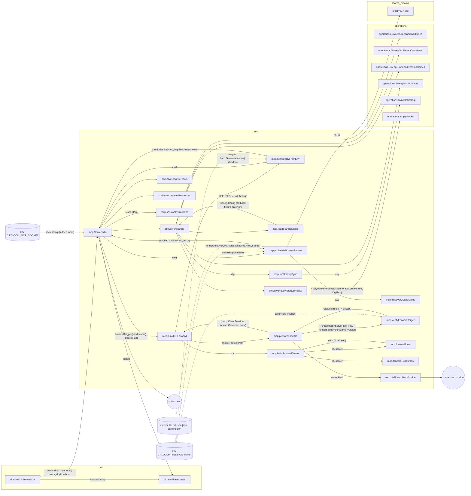
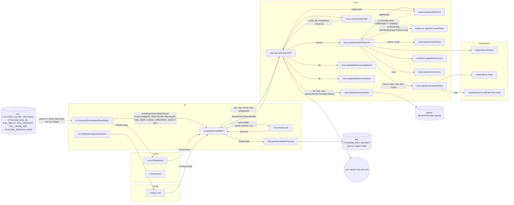
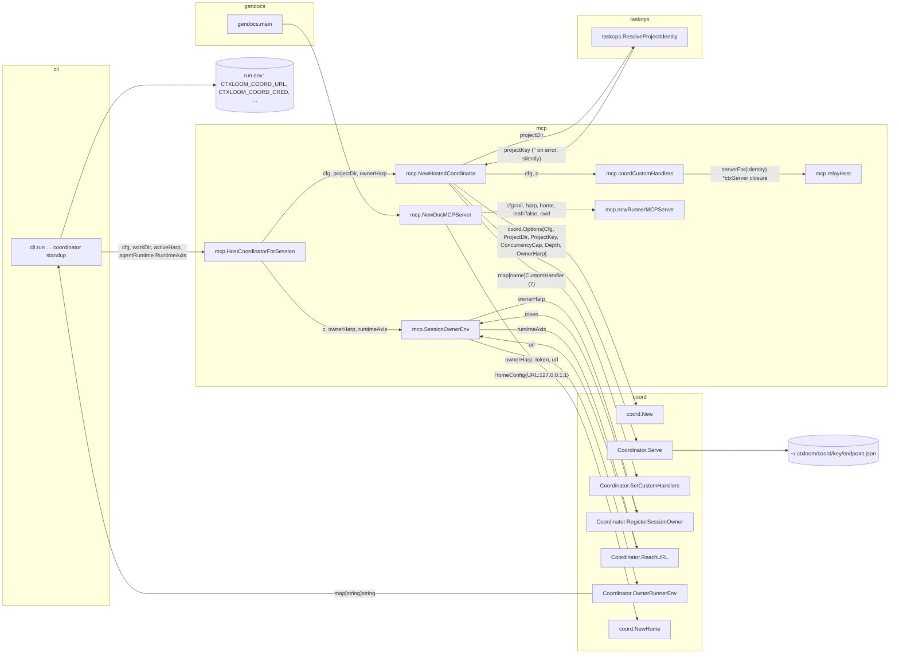
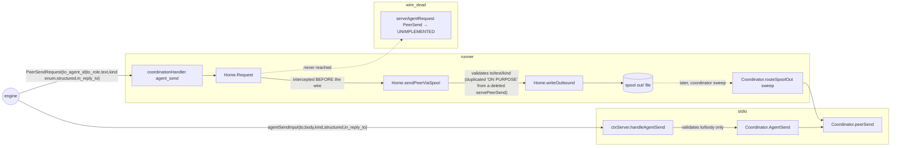
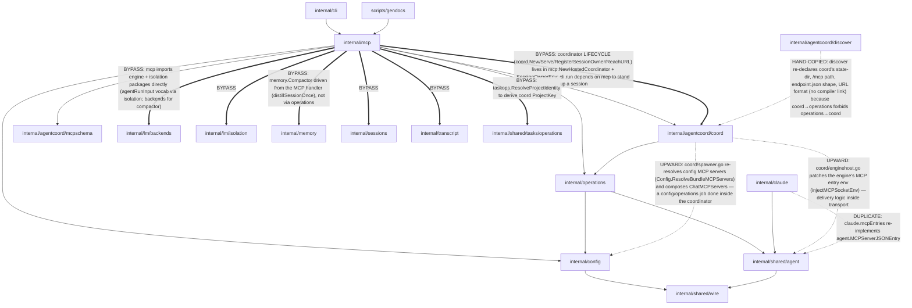
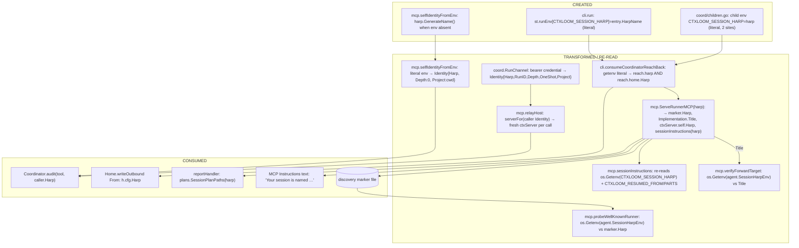
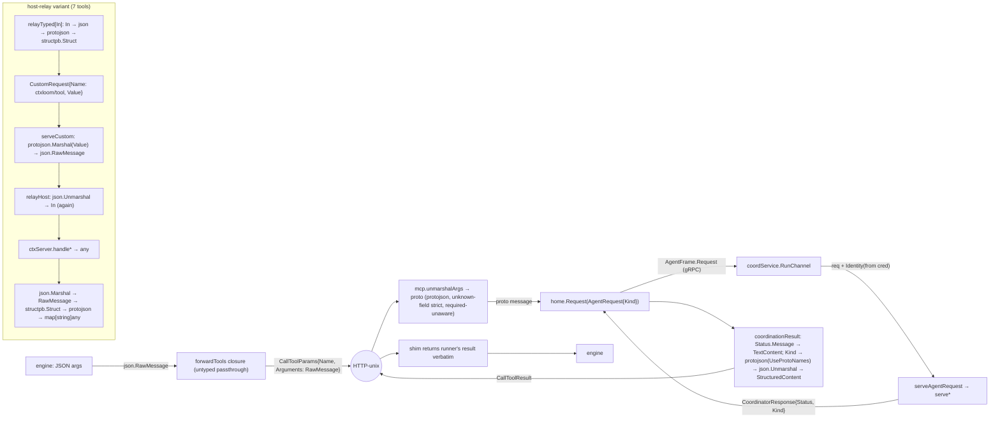
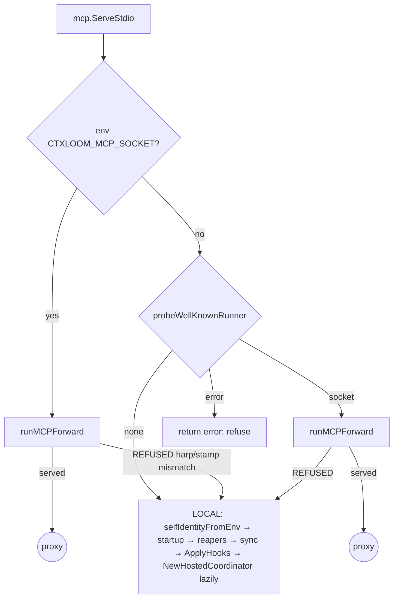

# Seam 2 — MCP PATHS

Architecture audit, read-only. Repository: `/home/babbitt/workspace/ctxloom/ctxloom/main` at `release/0.7` (HEAD d42cc4229). Written incrementally; sections appear in brief order.

## 1. Scope and entry points

**Seam.** Everything MCP: ctxloom AS an MCP server (three server flavours plus the stdio forward shim and the docgen clone), and ctxloom CONFIGURING MCP for engines (`.mcp.json` / settings delivery, bundle-authored MCP entries, the `ctxloom://mcp-servers` resource).

**Packages read.** `internal/mcp` (all non-test files), `internal/agentcoord/coord` (`runchannel.go`, `home.go`, `spooldelivery.go`, `children.go`, `identity.go`, `coordinator.go`, `drain.go`), `internal/agentcoord/mcpschema` (`binding.go`, `schemas.go`), `internal/cli` (`mcp.go`, `mcp_server.go`, `llm_runner_common.go`, `run.go` coordinator standup), `internal/shared/wire/mcp.go`, `internal/shared/mcpsocket`, `internal/config` (LinkGrant / extractMCPFromBundle), `internal/operations` (mcpEntry, ApplyHooks MCP surface), `internal/shared/agent` (settings_io), engine backends' MCP writers. Stated architecture: `docs/architecture/cli/mcp.md`, `docs/architecture/agentcoord/mcp-tool-surface.md`, `docs/architecture/agentcoord/transport.md`, `GLOSSARY.md`, `tests/arch/layering_test.go`.

**Layering gate coverage.** `tests/arch/layering_test.go`'s `layeringRules` table contains NO rule whose `from` or `forbid` names `internal/mcp`. The only rule touching this seam is `internal/operations` must-not-import `internal/cli`. Everything `internal/mcp` imports (24 first-party packages including `lm/backends`, `lm/isolation`, `memory`, `sessions`, `transcript`) is ungated.

### Entry points traced

| # | Entry point | Symbol | File | Process boundary reached |
|---|---|---|---|---|
| E1 | `ctxloom mcp` / `ctxloom mcp serve` (cobra) | `cli.runMCPServerSDK` → `mcp.ServeStdio` | `internal/cli/mcp_server.go`, `internal/mcp/mcp_server.go` | stdio (MCP client); env read; marker file read; unix/tcp dial; OR local: config load, 4 reapers (worktree rm, container kill, dir moves), remote sync, `operations.ApplyHooks` (writes managed settings), `coord.New`+`Serve` (h2c listener, `endpoint.json`) |
| E1a | forward shim (branch of E1) | `mcp.runMCPForward` → `mcp.prepareForward` → `mcp.buildForwardServer` | `internal/mcp/mcp_forward.go` | stdio in; HTTP-over-unix or `tcp://` out (`mcp.dialReachBackSocket`) |
| E1b | marker discovery (branch of E1) | `mcp.probeWellKnownRunner` | `internal/mcp/mcp_discovery.go` | reads `/run/ctxloom/local/current.json` or `$XDG_RUNTIME_DIR/ctxloom/cell-<sha>.json`; `pidalive.Probe`; unix dial; may `os.Remove` markers |
| E2 | runner-hosted server (`ctxloom llm serve <engine>` standup) | `cli.attachRunnerMCP` → `mcp.ServeRunnerMCP` → `mcp.newRunnerMCPServer` | `internal/cli/llm_runner_common.go`, `internal/mcp/mcp_runner.go` | binds unix socket (3-tier dir), writes discovery marker, serves streamable HTTP at `/mcp`; `os.Setenv(CTXLOOM_MCP_SOCKET)` for the engine child |
| E3 | coordinator standup for a session (`ctxloom run`) | `cli.run…` → `mcp.HostCoordinatorForSession` → `mcp.NewHostedCoordinator` → `coord.New`/`Serve` + `mcp.SessionOwnerEnv` | `internal/cli/run.go`, `internal/mcp/coord_host.go` | h2c gRPC listener(s), `~/.ctxloom/coord/<key>/endpoint.json`, minted owner credential into the run env |
| E4 | docgen clone | `mcp.NewDocMCPServer` | `internal/mcp/mcp_docgen.go` | none (dead endpoint `127.0.0.1:1`) — but leaks a `coord.Home` |
| T1 | tool: `assemble_context` / `search_content` / `search_library` | `ctxServer.registerContextTools` handlers | `internal/mcp/mcp_tools_context.go` | `operations.*` → filesystem reads under the project |
| T2 | tool: `context_status` | `ctxServer.handleContextStatus` | `internal/mcp/mcp_tools_contextstatus.go` | session/transcript reads |
| T3 | tools: `compact_session`, `load_session`, `recover_session`, `get_previous_session`, `list_sessions` | `ctxServer.handle*` in `mcp_tools_memory.go` | `internal/mcp/mcp_tools_memory.go` | `memory.Compactor` (LLM exec), session store reads/writes |
| T4 | tool: `evaluate_triggers` | `ctxServer.handleEvaluateTriggers` | `internal/mcp/mcp_tools_triggers.go` | taskloom store |
| T5 | tools: `agent_run`, `agent_send`, `agent_recv`, `agent_stop` (stdio flavour) | `ctxServer.handleAgentRun/Send/Recv/Stop` | `internal/mcp/mcp_tools_agents.go` | in-process `coord.Coordinator` → child process spawn / spool files |
| T6 | tools: `agent_run`, `agent_send`, `agent_stop`, `roster`, `agent_recv`, `agent_report`, `agent_fetch_artifact` (runner flavour) | `mcp.coordinationHandler`, `mcp.recvHandler`, `mcp.reportHandler`, `mcp.artifactFetchHandler` | `internal/mcp/mcp_runner.go` | `coord.Home.Request` → gRPC `RunChannel` → coordinator; `Home.sendPeerViaSpool` → spool file; `Home.Recv`; `Home.Report` |
| T7 | host-relay tools (7): T2+T3+T4 names on the runner flavour | `mcp.relayTyped[In]` → `coord.Home.Request(CustomRequest "ctxloom/<tool>")` → `coord.serveCustom` → `mcp.relayHost` → the T2–T4 handlers | `internal/mcp/mcp_runner.go`, `internal/agentcoord/coord/runchannel.go`, `internal/mcp/coord_host.go` | gRPC round trip, then whatever T2–T4 touch, on the HOST |
| R1 | resources: 9 concrete + 5 templated `ctxloom://` URIs | `ctxServer.registerResources` | `internal/mcp/mcp_resources.go` | `operations.*` reads |
| C1 | `ctxloom mcp add/remove/show/list/register/unregister` (+ `mcp server *`, + `manage mcp *`) | `cli.runMCPAdd/Remove/Show/List`, `cli.setMcpAutoRegister` | `internal/cli/mcp.go`, `internal/cli/manage.go` | `~/.ctxloom` config writes |
| C2 | MCP config delivery to engines | `operations.ApplyHooks` → per-backend MCP surface writers → `.mcp.json` / settings | `internal/operations/*`, `internal/shared/wire/mcp.go`, engine backends | project / session-home file writes |

(Section 1 continues below as C2 is traced.)

## 2. Call graphs

### 2.1 `ctxloom mcp serve` — the three-way branch (E1, E1a, E1b)



**What crosses.** The only state that selects the branch is (a) the `CTXLOOM_MCP_SOCKET` env value and (b) a marker file keyed by `sha256(abs(cwd))`. Identity (`CTXLOOM_SESSION_HARP`) is read from env at THREE separate sites in this one flow (`probeWellKnownRunner`, `verifyForwardTarget`, `selfIdentityFromEnv`) and never passed as a parameter. A REFUSED forward (harp or build-stamp mismatch) falls through to the full local startup — reapers, sync, `ApplyHooks` — with a harp that `selfIdentityFromEnv` may have just GENERATED.

### 2.2 Runner-hosted server standup (E2) and the identity plumbing



**What crosses.** Identity enters the runner as env (`CTXLOOM_SESSION_HARP`, string literal in `cli.consumeCoordinatorReachBack`), becomes `reach.harp` AND `reach.home.Harp` (same value, two fields), is passed explicitly to `ServeRunnerMCP`, and is then serialised into three outputs: the marker file, the MCP `Implementation.Title` (read back by the shim's `verifyForwardTarget`), and `ctxServer.self`. The cell work dir enters as `CTXLOOM_CELL_WORK_DIR` and, if empty, is silently replaced by the runner's own `os.Getwd()` inside `mcp.resolveCellWorkDir` — called TWICE (once in `newRunnerMCPServer` for `self.Project`, once in `ServeRunnerMCP` for the marker), which is a re-derivation.

### 2.3 Coordinator standup for `ctxloom run` (E3) and the docgen clone (E4)



**What crosses.** `mcp.NewHostedCoordinator` is the ONE constructor for a session coordinator, called by both `ctxloom run` (E3) and lazily by the standalone stdio server's `ctxServer.delegation()` (E1 local mode). It lives in `internal/mcp`, not in `cli` or `coord`: the MCP package owns coordinator lifecycle for the whole binary.

### 2.4 MCP config delivery to engines (C2) — the value's four types

```mermaid
flowchart LR
  subgraph bundles
    BR[bundles.BundleRead.Bundle.MCP]
  end
  subgraph config
    EMB[config.extractMCPFromBundle]
    RBMS[Config.ResolveBundleMCPServers]
    RBBMS[config.resolveBuiltinBundleMCPServers]
    LG[Config.LinkGrant]
  end
  subgraph agent
    RMMS[agent.ResolveManagedMCPServers]
    COMS[agent.ctxloomOwnMCPServer]
    CCMS[agent.ComposeChatMCPServers]
    CFW[agent.ChatMCPServerFromWire]
    CEO[agent.ChatMCPConfigEntryOf]
    GME[agent.GenericMCPEntry]
    MSJE[agent.MCPServerJSONEntry]
    BL[BaseLifecycle.ChatMCPServers]
  end
  subgraph operations
    AH[operations.ApplyHooks]
    PM[operations.profile_materialize]
    LMS[operations.ListMCPServers]
    SMS[operations.searchMCPServers]
    ME[operations.mcpEntry]
  end
  subgraph claude
    WMC[ClaudeCodeHookWriter.writeMCPConfig]
    DMS[ClaudeCodeHookWriter.desiredMCPServers]
    MEs[ClaudeCodeHookWriter.mcpEntries]
    AMS[claude.applyMCPServers]
    REG[claude.MCPRegistrar.Register]
  end
  subgraph coord
    CMS[prodSpawner.childMCPServers]
    EHS[coord.encodeMCPServers harnessspec]
    DHS[coord.decodeMCPServers]
    IMSE[coord.injectMCPSocketEnv]
  end
  subgraph lm_backends
    MGD[backends.managed BundleMCP]
  end
  subgraph cli
    RUNC[cli.run ChatMCPServers]
    MREG[cli.runMCPRegister]
  end
  MCPJSON[("<project>/.mcp.json")]
  WIRE(("gRPC StartRun.harness"))
  ENGINE((engine process))

  BR -- "bundle MCP item" --> EMB
  EMB -- "map[name]wire.MCPServer{Command|URL,Args,Env,Headers,Notes,Installation,SCM}" --> RBBMS
  EMB --> RBMS
  RBBMS --> RBMS
  RBMS -- "map[name]wire.MCPServer (excluded/claims applied)" --> LG
  RBMS --> AH
  RBMS --> PM
  RBMS --> LMS
  RBMS --> SMS
  RBMS --> MGD
  RBMS --> CMS
  AH -- "bundleMCP" --> WMC
  WMC --> DMS
  DMS --> MEs
  MEs --> RMMS
  RMMS --> COMS
  COMS -- "wire.MCPServer{Command:ctxloom, Args:[mcp serve]} (Env, URL DROPPED)" --> RMMS
  MEs --> CFW
  CFW -- "agent.ChatMCPServer" --> CEO
  CEO -- "agent.ChatMCPConfigEntry (+Cwd=${CLAUDE_PROJECT_DIR} for ctxloom)" --> DMS
  DMS --> GME
  GME -- "map[string]any" --> AMS
  AMS --> MCPJSON
  MREG --> REG
  REG --> MSJE
  MSJE --> CFW
  MSJE --> CEO
  MSJE --> GME
  REG --> AMS
  MGD -- "ManagedConfig.BundleMCP" --> BL
  BL --> CCMS
  RUNC --> BL
  CMS --> CCMS
  CCMS --> RMMS
  CCMS --> CFW
  CCMS -- "[]agent.ChatMCPServer" --> EHS
  EHS --> WIRE
  WIRE --> DHS
  DHS -- "[]agent.ChatMCPServer" --> IMSE
  IMSE -. "os.Getenv(CTXLOOM_MCP_SOCKET) (hidden; set by cli.exportRunnerMCPSocket in the same process)" .-> IMSE
  IMSE -- "Env[CTXLOOM_MCP_SOCKET]=socket on the ctxloom entry" --> ENGINE
  LMS --> ME
  ME -- "MCPServerEntry" --> LMS
```



**What crosses.** One MCP server value wears four types on its way out: bundle item → `wire.MCPServer` → `agent.ChatMCPServer` → `agent.ChatMCPConfigEntry` → `map[string]any`. `Config.ResolveBundleMCPServers` (the full resolve incl. trust gate, exclusions, name claims) is invoked from at least eight sites, several in one process per run; `agent.ResolveManagedMCPServers` is applied independently by every consumer rather than once at resolve time. There are two file delivery paths (`claude.mcpEntries` for the managed set, `agent.MCPServerJSONEntry` for `mcp register`) and one wire path (`coord.encodeMCPServers`). Only the WIRE path can carry the runner socket (`coord.injectMCPSocketEnv`); the FILE path deliberately strips env from the ctxloom entry (`agent.ctxloomOwnMCPServer`), which is why the shim needs the cwd-keyed marker at all.

### 2.5 CENTREPIECE — one tool call, every path, side by side

The engine calls `agent_run`. There are THREE physical paths from its stdio to a coordinator verb, and `agent_send`/`agent_recv`/`agent_stop` each add path-specific divergence on top.

```mermaid
flowchart LR
  ENG((engine stdio))

  subgraph P1["PATH A — standalone stdio (mcp serve, local mode)"]
    direction LR
    A1[ctxServer.handleAgentRun]
    A2[ctxServer.delegation]
    A3[mcp.newAgentDelegation]
    A4[mcp.NewHostedCoordinator]
    A5[Coordinator.AgentRun]
  end
  subgraph P2["PATH B — forward shim → runner-hosted"]
    direction LR
    B1[forwardTools closure]
    B2[cs.CallTool over HTTP-unix]
    B3[mcp.coordinationHandler agent_run]
    B4[mcp.unmarshalArgs protojson]
    B5[Home.Request SpawnAgent]
    B6[coordService.RunChannel]
    B7[Coordinator.handleAgentRequest]
    B8[Coordinator.serveAgentRequest]
    B9[Coordinator.serveSpawnAgent]
    B10[Coordinator.AgentRun]
  end
  subgraph P3["PATH C — in-process EngineHost (delegated child, StructuredChat)"]
    direction LR
    C0[engine child process]
    C1[shim or direct HTTP client]
    C2[same as B3…B10]
  end

  ENG -- "agentRunInput{agent,prompt,workspace,dirty_tree_handler} (hand-written JSON schema)" --> A1
  A1 --> A2
  A2 -- "lazy: cfg → os.Getwd() → selfIdentityFromEnv" --> A3
  A3 -- "cfg, cwd, self.Harp" --> A4
  A1 -- "ctx, d.self Identity, in.Agent, in.Prompt, in.Workspace (UNPARSED string), dirtyTreeHandler" --> A5
  A5 -- "*RunOutcome{Harp,Engine,Profiles,Runtime,Queued,Degraded,RunID}" --> A1

  ENG -- "SpawnAgentRequest{role,input{prompt,workspace,dirty_tree_handler},budget} (proto-generated schema)" --> B1
  B1 -- "json.RawMessage args verbatim" --> B2
  B2 --> B3
  B3 --> B4
  B4 -- "SpawnAgentRequest" --> B5
  B5 -- "AgentFrame{Request{SpawnAgent}} gRPC" --> B6
  B6 -- "caller Identity FROM CREDENTIAL, req" --> B7
  B7 --> B8
  B8 --> B9
  B9 -- "re-validates role/prompt; isolation.ParseWorkspaceAxis; ParseDirtyTreeHandler" --> B10
  B10 -- "*RunOutcome" --> B9
  B9 -- "CoordinatorResponse{Status.Message=spawnDisposition, SpawnAgentResult{ChildRunId,ChildAgentId}}" --> B5
  B5 --> B3
  B3 -- "coordinationResult: TextContent=disposition + StructuredContent=protojson" --> ENG

  C0 --> C1 --> C2
```



**Step-by-step diff, PATH A vs PATH B, for `agent_run`:**

| Step | PATH A (stdio local) | PATH B (runner-hosted) | Divergence |
|---|---|---|---|
| Input schema | `agentRunInput` Go struct, `jsonschema` tags, `agentRunInputSchema()` + `constrainToVocabulary` | `mcpschema.Tools()` golden generated from `SpawnAgentRequest` proto | Two schemas for one tool; field names differ (`agent` vs `role`; flat vs `input{}`); PATH A has no `budget`; PATH B `required` is not enforced (`unmarshalArgs` returns nil on empty args) |
| Caller identity | `selfIdentityFromEnv(cwd)` — env harp or a GENERATED one, `Depth:0`, `OneShot` never set | Minted at `RunChannel` from the bearer credential; carries Depth/OneShot | PATH A can never be refused as a one-shot or depth-capped child because it never IS one; PATH A can spawn under a harp no coordinator registered |
| Workspace axis | passed as raw string to `AgentRun` | parsed by `isolation.ParseWorkspaceAxis`, invalid → `InvalidArgument` | Validation lives in the transport verb, not in `AgentRun` |
| Required-field validation | `Coordinator.AgentRun` (agent, prompt) | `serveSpawnAgent` (role, prompt) THEN `Coordinator.AgentRun` again | Duplicate validation; different error strings for the same condition |
| Dirty-tree handler | `operations.ParseDirtyTreeHandler` in `handleAgentRun` | `operations.ParseDirtyTreeHandler` in `serveSpawnAgent` | Same helper, two call sites, neither inside `AgentRun` |
| Result shape | `agentRunResult{harp,llm,profiles,runtime,queued,degraded_findings}` | `SpawnAgentResult{child_run_id,child_agent_id}` + text disposition composed by `spawnDisposition` (which also reads `settledFailureCause`) | Different fields; PATH B surfaces launch failure, PATH A does not |
| Coordinator | lazily constructed IN the MCP process (`NewHostedCoordinator`) — a second, rogue owner if a real one exists (`tacky-padding`) | the session owner's, reached over gRPC | The `tacky-padding` boundary defect |

**`agent_send` — three terminations for one verb:**



Both paths converge on `Coordinator.peerSend`, but PATH A does it synchronously with the coordinator's full correlation state, and PATH B does it as a local file write whose refusals are a hand-copied subset (the comment in `Home.sendPeerViaSpool`, `internal/agentcoord/coord/spooldelivery.go`, cites `servePeerSend` as the source it duplicates; that function no longer exists — `serveAgentRequest` answers `PeerSend` with `Unimplemented`).

**`agent_recv` — two parking state machines:**

| | PATH A | PATH B |
|---|---|---|
| Handler | `ctxServer.handleAgentRecv` (`mcp_tools_agents.go`) | `mcp.recvHandler` (`mcp_runner.go`) |
| Wait clamp | `mcpschema.ClampRecvWait` | `mcpschema.ClampRecvWait` (shared) |
| Blocking primitive | `Coordinator.AgentRecv` → `Coordinator.recvMail` (`ownerrecv.go`) | `Home.Recv` (`home.go`): park/preempt/`ackReturned` on next call |
| "leaf" for the timeout verdict | `d.self.IsChild()` | `cli.runnerIsLeaf(depth, oneshot, cfg)` passed in at construction | Two definitions of leaf |
| Undecodable message | `bm.StructuredError` set, message still returned, warning "already acked … dropped, not redelivered" | message omitted from `messages`, id listed in `dropped_message_ids`, same warning text | Same defect, two shapes |
| Output shape | `agentRecvResult{messages[]agentBusMessage, disposition}` | `map{"messages": protojson PeerMessage[], "disposition", "dropped_message_ids"}` | Two result schemas |

**`agent_stop` — keyed differently:**  PATH A `Coordinator.AgentStop(caller, harp, reason)` looks up `runsF.currentRun(harp)`; PATH B `serveStopRun` looks up `runsF.run(runID)` and calls the lower-level `c.stopRun` directly, re-implementing the ownership check (`rec.ParentHarp != caller.Harp`) that `AgentStop` also performs. The sweep form (`StopChildren`) is shared, but its two result-message strings are copy-pasted between `mcp.handleAgentStop` and `coord.serveStopChildren`.

**Tools that exist on only one path:** `roster`, `agent_report`, `agent_fetch_artifact` — runner only. A standalone `mcp serve` coordinator can spawn children but cannot list them, and its children (if launched through it) report into a coordinator that has no `agent_report` consumer on its own stdio surface. `search_library`, `context_status`: both. `compact_session` etc.: both, but on PATH B they execute on the HOST under the caller's identity via `relayHost`.

## 3. Delegation / layer graph

Stated layering (from `docs/architecture/cli/mcp.md`, `GLOSSARY.md` "runtime coordinator", `layering_test.go`): `cli` is wiring; `mcp` is "the boundary where an external MCP client meets `internal/operations` (content), `internal/agentcoord/coord` (delegation), and `mcpschema`"; `operations` is the frontend-agnostic layer and must not import `cli`; the coordinator is "hosted by every session-owning process". Solid arrows = as stated. Thick/dotted `==>`/`-.->` with labels = against or past a layer.



**Reading.** The stated picture is `cli → mcp → {operations, coord, mcpschema}`. The actual picture has `mcp` as a hub that (a) owns coordinator construction for the whole binary, so `cli.run` (which is not an MCP concern) must import `mcp` to start a session; (b) reaches directly into `memory`, `sessions`, `transcript`, `lm/backends`, `lm/isolation` for tool bodies that `operations` was supposed to front; and (c) is not named in a single layering rule, so none of this is gated.

### 3.1 DATA-FLOW — session identity for one MCP tool request



**Data-flow smells on identity (each cited):**
- **Re-derived from env at five sites in one process** instead of passed: `mcp.sessionInstructions`, `mcp.probeWellKnownRunner`, `mcp.verifyForwardTarget`, `mcp.selfIdentityFromEnv` (`internal/mcp/mcp_server.go`, `mcp_discovery.go`, `mcp_forward.go`, `mcp_tools_agents.go`), and `cli.consumeCoordinatorReachBack` (`internal/cli/llm_runner_common.go`) reads it twice into two fields of one struct.
- **Two names for one value**: the string literal `"CTXLOOM_SESSION_HARP"` (17 non-test sites) and the constant `agent.SessionHarpEnv` (23 sites), both used inside `internal/mcp` itself. A rename of the variable is unfindable by symbol.
- **Same value, two types**: `harp string` and `coord.Identity.Harp`; `ServeRunnerMCP` takes the string and builds an `Identity` with `Depth` unset (always 0) even for a child runner — the runner's `ctxServer.self` therefore says `IsChild()==false` for every child; only the coordinator-side credential identity is right. The runner-side `leaf` bool is a separate derivation (`cli.runnerIsLeaf`) threaded through `newRunnerMCPServer → registerGeneratedTools → coordinationHandler → recvHandler` (feature-flag layering).
- **Hidden parameter via env in the same process**: `cli.exportRunnerMCPSocket` does `os.Setenv(CTXLOOM_MCP_SOCKET)` and `coord.injectMCPSocketEnv` does `os.Getenv(EnvMCPSocket)` later in the same runner process (`internal/agentcoord/coord/enginehost.go`) — the socket path is a return value of `ServeRunnerMCP` that is dropped into the environment rather than passed.
- **Fabricated identity**: `mcp.selfIdentityFromEnv` mints a random harp when the env is absent, so a standalone `mcp serve` audits, spools and spawns under a name no session directory, registry or transcript ever recorded.

### 3.2 DATA-FLOW — the MCP tool request itself (PATH B)



**Smell:** on the host-relay variant one argument value is encoded/decoded SIX times (Go struct → JSON → structpb → gRPC → JSON → Go struct → any → JSON → structpb → JSON → map) to cross one process boundary, and the typed `In` is reconstructed from JSON twice from the same bytes. `relayCapBytes` (4 MiB) and `relayWarnBytes` (3 MiB) are thresholds around the last hop only.

## 4. Findings (ranked by blast radius)

### F1 — DUPLICATION / MISSING LAYER: two `agent_*` orchestrators, no "delegation verb" layer
**Sites.** (a) `ctxServer.handleAgentRun/Send/Recv/Stop` + `agentDelegation` in `internal/mcp/mcp_tools_agents.go` → `coord.Coordinator.AgentRun/AgentSend/AgentRecv/AgentStop/StopChildren` in-process. (b) `mcp.coordinationHandler/recvHandler/reportHandler` in `internal/mcp/mcp_runner.go` → `coord.Home.Request/Recv/Report` → gRPC → `Coordinator.serveSpawnAgent/serveListRuns/serveStopRun/serveStopChildren` in `internal/agentcoord/coord/runchannel.go` → (sometimes) the same `Coordinator.Agent*` methods, (sometimes) lower-level `c.stopRun`, `listRunsSnapshot`, and for `agent_send` a third terminus `Home.sendPeerViaSpool` (`spooldelivery.go`).
**Which is more complete.** (b): it has `roster`, `agent_report`, `agent_fetch_artifact`, launch-failure surfacing (`spawnDisposition`+`settledFailureCause`), workspace-axis parsing, a credential-minted `Identity` with Depth/OneShot, and the leaf gate. (a) is a subset with a hand-written schema, a fabricated identity and no report path.
**Missing layer.** There is no "delegation verb" API that takes `(Identity, typed request) → typed result` and owns validation. Today validation is smeared across `Coordinator.AgentRun` (agent/prompt required), `serveSpawnAgent` (role/prompt required again, workspace parse), `mcp.handleAgentRun` (dirty-tree parse), `mcp.handleAgentSend` (to/body), `Home.sendPeerViaSpool` (to/text/kind), `Coordinator.peerSend` (kind again). The layer would be `coord.Verbs` (or the proto messages themselves as the ONE request type) with both transports as thin adapters; sites (a) and (b) and the six validation sites collapse into it.
**Settles it.** Delete `registerAgentTools` and `agentDelegation` (row `tacky-padding` already rules the stdio path must not own a coordinator; with no coordinator there is nothing for PATH A's agent tools to call) and make `serveSpawnAgent`/`serveStopRun` call only `Coordinator.AgentRun`/`AgentStop`; a test that both transports produce byte-identical `CoordinatorResponse` for the same request.

### F2 — LAYER BYPASS / MISSING BOUNDARY: `internal/mcp` owns coordinator lifecycle
**Site.** `mcp.NewHostedCoordinator`, `mcp.HostCoordinatorForSession`, `mcp.SessionOwnerEnv` (`internal/mcp/coord_host.go`) — `coord.New` + `SetCustomHandlers` + `Serve` + `RegisterSessionOwner` + `ReachURL` + `OwnerRunnerEnv`. Called from `cli.run` (`internal/cli/run.go`) for every `ctxloom run`, and lazily from `ctxServer.delegation()` for a standalone `mcp serve`.
**Why it matters.** The MCP package is a protocol adapter; it should be a CONSUMER of a coordinator, never its constructor. Because construction lives here, (1) `cli.run` must import `internal/mcp` to start a session that may never speak MCP, (2) any MCP process can promote itself into a session owner (the `tacky-padding` ruling: "ownership becomes a property of the process KIND"), and (3) the host-relay handler table (`coordCustomHandlers`) is wired at construction, so the coordinator's custom-verb vocabulary is defined by the MCP package.
**Settles it.** Move `NewHostedCoordinator`/`SessionOwnerEnv` to `coord` (or a `cli/session` package), pass the custom-handler map in from the caller, delete `ctxServer.delegation()`; add `internal/mcp` to `layeringRules` with `forbid: coord.New` reachable only from the session host. Cite `tacky-padding`.

### F3 — DIVERGENT PATHS: a REFUSED forward runs the full local startup under a possibly fabricated identity
**Shared trunk / branches.**

**Steps the forward branch skips** (by design, and correctly): config load, reapers, sync, `ApplyHooks`, gate. **Steps the REFUSED→local branch performs that it should not:** everything in `ctxServer.startup` — `operations.SweepOrphanedWorktrees`, `SweepOrphanedContainers`, `SweepOrphanedSessionHomes`, `SweepHarpArtifacts`, `runStartupSync`, `ApplyHooks{RegenerateContext:true}` — from a process that has just been TOLD it is inside a session that belongs to a different harp or a different build. The marker branch (`probeWellKnownRunner`) refuses loudly for "live but unreachable" yet the env branch, on a harp mismatch, degrades to local (`mcp_forward.go` `prepareForward` → `forwardOutcomeRefused`; `mcp_server.go` `ServeStdio` comment: "falls back to local startup exactly like a session that was never forward-triggered"). A build-stamp mismatch after `just build` while a runner is still alive therefore starts a second coordinator and rewrites the project's managed settings.
**Settles it.** Make `forwardOutcomeRefused` a hard error like the marker's live-but-unreachable case (one refusal policy for both triggers), or delete local mode entirely per `blissful-blah`.

### F4 — DATA-FLOW SMELL / STATED-VS-ACTUAL: relayed host tools use the HOST's `os.Getwd()`, not the caller's project
**Sites.** `ctxServer.handleCompactSession`, `handleLoadSession`, `handleRecoverSession`, `handleGetPreviousSession`, `handleListSessions` (`internal/mcp/mcp_tools_memory.go`, five `os.Getwd()` calls) and `ctxServer.handleEvaluateTriggers` (`internal/mcp/mcp_tools_triggers.go`). On PATH B these execute in the COORDINATOR process via `mcp.relayHost` with `serverFor(caller)` giving them `s.self.Project` = the caller's cell — which they ignore in favour of the host's cwd. `ctxServer.resourceProjectDir` (`mcp_resources.go`) does it right (prefers `s.self.Project`); the tool handlers in the same package do not. `evaluateTriggersTaskContext` additionally reads `os.Getenv("CTXLOOM_PROJECT_ID")` process-wide while its own comment explains why env must not be read on a multi-caller path.
**Stated.** `ctxServer` doc: "identity-consuming surfaces must read `s.self`"; `docs/architecture/cli/mcp.md` Invariants: "Identity comes from `s.self`, never from process env."
**Settles it.** Replace every `os.Getwd()` in tool handlers with `s.resourceProjectDir()`; a relay test where coordinator cwd ≠ caller cell asserts the session resolved is the caller's.

### F5 — WORKAROUND: `coord.injectMCPSocketEnv` vs `agent.ctxloomOwnMCPServer` — env stripped at one layer, injected at another
**Quote.** `internal/agentcoord/coord/enginehost.go`: "a vendor shim may NOT [pass env] — it then found no socket, fell back to its LOCAL surface, stood up a second rogue coordinator in-process … Injecting the value into the entry's declared env removes the dependency on adapter behavior entirely". `internal/shared/agent/settings_io.go` `ctxloomOwnMCPServer`: "ignoring the env declared for the %q MCP server … ctxloom's own MCP server runs with the environment ctxloom gives it, never one supplied by whatever declared the entry".
**Why it is a bug.** Two layers hold opposite policies for the same field of the same entry. The file-delivery path (`claude.mcpEntries` → `.mcp.json`) can never carry the socket, so the shim needs marker discovery (`mcp_discovery.go`) — the whole 200-line subsystem plus `reapStaleDiscoveryMarkers`/`reapDeadRunnerSockets` exists to compensate for a value that one function strips. Row `blissful-blah` rules the replacement (URL+token in the session home's `.mcp.json`); until then this is the unfiled root cause of every "hijack" row (`mcp-serve-forwarding-hijack`).
**Settles it.** Implement `blissful-blah`; delete `injectMCPSocketEnv`, `mcp_discovery.go`, `runnerSocketPath` tiers, and the env-strip warning together.

### F6 — DUPLICATION: `agent_send` validated in three places, one citing a deleted function
**Sites.** `mcp.handleAgentSend` (to, body), `Home.sendPeerViaSpool` (to/to_role exclusivity, text, kind-unless-reply), `Coordinator.peerSend` (kind again, correlation). `sendPeerViaSpool`'s doc: "The guards duplicated from servePeerSend … are duplicated ON PURPOSE" — `servePeerSend` no longer exists (`serveAgentRequest` returns `Unimplemented` for `PeerSend`), so the comment binds to nothing and the "purpose" cannot be re-verified.
**Most complete.** `Home.sendPeerViaSpool` (it has the to/to_role exclusivity and the reply exemption).
**Settles it.** One `agentcoordpb.PeerSendRequest.Validate()` (or `ValidateMessageKind` extended) called by both; delete the stale comment.

### F7 — DUPLICATION: two identity-derivation rules for "is this caller a leaf/child"
**Sites.** PATH A: `Identity.IsChild()` = `Depth > 0` (`coord/identity.go`), used by `mcp.handleAgentRecv`. PATH B: `cli.runnerIsLeaf(depth, oneshot, cfg)` = `oneshot || depth >= cfg.GetDelegationDepth()` (`internal/cli/llm_runner_common.go`), threaded as `leaf bool` through `ServeRunnerMCP → newRunnerMCPServer → registerGeneratedTools → coordinationHandler → recvHandler`, and gating `mcpschema.CoordinatorOnlyTools`. Both feed `mcp.recvOutcome(err, wait, leaf)`. Meanwhile the runner's own `ctxServer.self` is built with `Depth` unset, so `self.IsChild()` is false for every child runner.
**Settles it.** Put depth/oneshot into the `Identity` the runner builds (it has `reach.depth`, `reach.oneshot`) and derive leaf from `Identity` in one method; delete the `leaf` parameter chain.

### F8 — DUPLICATION: MCP config projection helpers
**Sites.** `claude.ClaudeCodeHookWriter.mcpEntries` (`internal/claude/claude.go`) re-implements `agent.MCPServerJSONEntry` (`internal/shared/agent/mcp_bytes.go`) step for step (Validate → `ChatMCPServerFromWire` → `ChatMCPConfigEntryOf` → `GenericMCPEntry`), differing only by `entry.Cwd = "${CLAUDE_PROJECT_DIR}"` on the ctxloom entry. `agent.ResolveManagedMCPServers` is applied independently at `claude.mcpEntries`, `agent.ComposeChatMCPServers`, and `operations.registeredMCPServers` rather than once inside `Config.ResolveBundleMCPServers`. `Config.ResolveBundleMCPServers` (full trust-gated resolve) is called from 8+ sites; a single `ctxloom run` with delegation resolves it in `operations.ApplyHooks`, `backends.managed`, `coord.childMCPServers`, and `Config.LinkGrant`.
**Most complete.** `agent.MCPServerJSONEntry` + a `Cwd` option.
**Settles it.** `mcpEntries` calls `MCPServerJSONEntry`; `ResolveBundleMCPServers` applies `ResolveManagedMCPServers` itself; `reprise check` should already flag the first.

### F9 — DATA-FLOW SMELL: `CTXLOOM_SESSION_HARP` has two spellings and is re-read at five sites in one flow
**Sites.** Literal `"CTXLOOM_SESSION_HARP"` in `mcp.selfIdentityFromEnv`, `mcp.sessionInstructions`, `cli.consumeCoordinatorReachBack` (twice), `cli.run` (twice), `coord/children.go` (twice), `cli/hook_*.go`, `memory/compactor.go`, `lm/isolation/statemounts.go`, `lm/grpc/chat.go`; constant `agent.SessionHarpEnv` in `mcp.probeWellKnownRunner`, `mcp.verifyForwardTarget`, `operations/oneshot.go` (7), `operations/delegate.go`, `claude/*`. See §3.1.
**Settles it.** One constant; an arch test forbidding the literal outside its definition (the `vocabulary_adoption_test.go` pattern already exists in `tests/arch/`).

### F10 — STATED-VS-ACTUAL: the forward shim drops resource TEMPLATES
**Site.** `mcp.forwardResources` (`internal/mcp/mcp_forward.go`) paginates `cs.ListResources` only; it never calls `ListResourceTemplates`, so the five `server.AddResourceTemplate` URIs registered by `ctxServer.registerResources` (`ctxloom://fragments/{name}`, `profiles/{name}`, `commands/{name}`, `skills/{name}`, `remotes/{name}/contents`) are absent behind the shim. `mcp.premiseCatalogInstruction` (`mcp_server.go`) tells every forwarded session to read `ctxloom://fragments/{name}` for the body of a chosen fragment; the project's own guidance fragment ("Not all of this project's guidance is in your context") says the same.
**Settles it.** Forward templates too; a shim test that reads a templated URI through the proxy.

### F11 — WORKAROUNDS (each an unfiled bug; quote + symbol)
- `mcp.resolveCellWorkDir` (`mcp_runner.go`): "falls back to os.Getwd() when empty" — the runner has no `cmd.Dir`, so the fallback is the COORDINATOR's cwd for a `workspace:none` child; `reportHandler`'s `resolveCellPath(cwd, rel)` then resolves `publish_paths` against the wrong root. Called twice for one value.
- `mcp.runnerSocketPath` (`mcp_runner.go`): `const sunPathHeadroom = 100` and the three-tier negotiation — a limit around a deterministic thing; tier 3 "can outright fail" (`blissful-blah`).
- `mcp.dialProbeTimeout = 2s` (`mcp_discovery.go`) and `RunnerMCP.Close`'s 2 s shutdown — sleeps around deterministic local sockets.
- `mcp.probeWellKnownRunner`: `pidalive.Probe(m.Pid).MaybeAlive()` "never reap on uncertainty" — a marker whose pid is unknowable is kept forever (the measured 12,334-marker backlog in `blissful-blah`).
- `mcp.NewHostedCoordinator` (`coord_host.go`): `taskops.ResolveProjectIdentity` failure → `key = ""` "best-effort: falls back to a path-derived key inside coord.New" — two projects can get two coordinator state dirs for one project depending on whether taskloom resolved.
- `mcp.forwardResources`: `return nil //nolint:nilerr // resources are optional surface` — a transport fault degrades to tools-only with a warning.
- `mcp.recvHandler` / `mcp.handleAgentRecv`: "already acked as returned — dropped, not redelivered" — an undecodable message is lost by design at two sites.
- `coord.serveCustom` (`runchannel.go`): `relayCapBytes` 4 MiB / `relayWarnBytes` 3 MiB thresholds with a `strictness.Record` "watch" — tuned to the gRPC frame, applied only to the last hop of a six-encode chain.
- `mcp.ctxServer.startup`: "startup() only returns context.Canceled — anything else … is handled inline via warnings" and `fallbackConfigForLoadFailure` — a failed config load serves an EMPTY config; the gate may catch it, `--degraded` will not.

### F12 — STATED-VS-ACTUAL: `docs/architecture/cli/mcp.md` describes a command tree and defects that no longer exist
Stale claims verified against code: `mcp serve` "No `Args` constraint" (it has `cobra.NoArgs`); `mcp add/remove/register/unregister` and `mcp server add/remove` twins and `manage mcp *` (all gone; tree is `mcp {serve, server {list, show, edit}}`); "Flags … registered twice" (one `init`); `mcp server show <missing>` exits 0 under `--format json` (the not-found check now precedes `emit`); `reachBackTCPPrefix` "hand-synced duplicate" (now `mcpsocket.TCPPrefix`, one leaf); `NewDocMCPServer` "panics twice … leaks the coord.Home" (returns errors and a `closeHome`); `runnerDiscoveryMarker.Harp` "written and read nowhere" (read by `probeWellKnownRunner`, plus a `Stamp` field); "six host-relay tools" (seven — `context_status` added); `forwardTools` "never checks that it registered anything" (it refuses on `n == 0`). Every table cites `file:line`, all of which have drifted. `docs/architecture/agentcoord/transport.md` names `servePeerSend` among the verbs; it is gone.
**Settles it.** Delete the line-number tables (per the project's own "do not build bindings you cannot check" rule) or regenerate them; the doc's "Documented vs real" section should list only what a test does not already catch.

### F13 — STATED-VS-ACTUAL: GLOSSARY says the coordinator is "hosted by every session-owning process (`ctxloom run`, the `ctxloom mcp serve` fallback)"
The `tacky-padding` ruling (2026-09-14) says the opposite — one coordinator per project, hosted by a RUNNER, and a shim must never become one. The glossary row "runtime coordinator" still normalises the fallback. **Settles it.** Edit the glossary row when F2 lands.

### F14 — DIVERGENT PATHS: `.mcp.json` written to `projectDir`, not the session home
Already carried by `boned-monoxide` (GLOSSARY GAP: "`claude.go` still writes `.mcp.json` to `projectDir`"). Not re-derived; noted because F5's fix (`blissful-blah`) writes the URL INTO the session home's `.mcp.json`, so F5 depends on `boned-monoxide` item 2 landing first.

### F15 — LAYER BYPASS (upward): the coordinator composes engine MCP config
`prodSpawner.childMCPServers` (`internal/agentcoord/coord/spawner.go`) calls `Config.ResolveBundleMCPServers(plan.Profiles)` and `agent.ComposeChatMCPServers`, then `coord.encodeMCPServers` puts it on the wire; `coord.injectMCPSocketEnv` patches it on the runner. Config resolution and delivery-shape decisions are inside transport/scheduling code. The stated split (`docs/architecture/agentcoord/transport.md`: "coord imports operations, so operations cannot import coord") is the reason; the effect is that `discover` hand-copies four coord constants and the spawner does config's job. **Settles it.** A `SpawnPlan` should arrive with its `[]ChatMCPServer` already composed by `operations` (the same `ManagedConfig.ChatMCPServers` `cli.run` uses), so coord only encodes.

## 5. Signatures that matter

For each: INPUT state / OUTPUT / HIDDEN inputs (env, globals, files read inside).

```go
// internal/mcp/mcp_server.go
func ServeStdio(ctx context.Context, cwd string, gate func() error, dryRun bool) error
```
IN: `cwd` (marker key + `self.Project`), `gate` (cli's exit-3 closure), `dryRun`. OUT: error only. HIDDEN: env `CTXLOOM_MCP_SOCKET`, `CTXLOOM_SESSION_HARP` (three reads), `CTXLOOM_RESUMED_FROM/PARTS`, `XDG_RUNTIME_DIR`; marker files; `config.Load()` (all config files); every file `ApplyHooks` and the four reapers touch; the `strictness` global finding ledger the gate reads.

```go
// internal/mcp/mcp_runner.go
func ServeRunnerMCP(cfg *config.Config, harp string, home *coord.Home, leaf bool, cellWorkDir string) (*RunnerMCP, error)
func (r *RunnerMCP) Close()
type RunnerMCP struct { SocketPath string; httpSrv *http.Server; cleanup func() }
```
IN: `cfg`, `harp`, `home` (the gRPC reach-back), `leaf` (tool gate), `cellWorkDir` (marker key + `self.Project` + `publish_paths` root). OUT: `SocketPath`. HIDDEN: `os.Getwd()` when `cellWorkDir==""`; `os.Getpid()`; `XDG_RUNTIME_DIR`; `/run/ctxloom/local` mkdir probe; `version.Version`. Side effects: socket bind, marker write, reaping of sibling markers/sockets.

```go
// internal/mcp/coord_host.go
func NewHostedCoordinator(cfg *config.Config, projectDir, ownerHarp string) (*coord.Coordinator, error)
func HostCoordinatorForSession(cfg *config.Config, projectDir, ownerHarp string, runtimeAxis agent.RuntimeAxis) (*coord.Coordinator, map[string]string, error)
func SessionOwnerEnv(c *coord.Coordinator, ownerHarp string, runtimeAxis agent.RuntimeAxis) (map[string]string, error)
```
IN: `cfg` (delegation caps), `projectDir`, `ownerHarp`, `runtimeAxis`. OUT: live coordinator; the owner env map (`CTXLOOM_COORD_URL/CRED`, …). HIDDEN: `taskops.ResolveProjectIdentity(projectDir)` (reads taskloom project files; failure silently → `""`); `coord.New` reads/creates `~/.ctxloom/coord/<key>/`; `Serve` writes `endpoint.json`; the custom-handler table is built here with a package-private `singleflight.Group`.

```go
// internal/mcp/mcp_docgen.go
func NewDocMCPServer() (server *mcp.Server, closeHome func(), err error)
func ListDocMCPToolNames(ctx context.Context) ([]string, error)
```
IN: none. OUT: a runner-flavour server with `cfg=nil`, `harp=""`, `leaf=false`. HIDDEN: `os.Getwd()` via `resolveCellWorkDir("")`; a `coord.Home` retrying `127.0.0.1:1` until `closeHome`.

```go
// internal/agentcoord/coord/home.go, homeartifacts.go
func (h *Home) Request(ctx context.Context, req *agentcoordpb.AgentRequest) (*agentcoordpb.CoordinatorResponse, error)
func (h *Home) Recv(ctx context.Context, wait time.Duration) ([]*agentcoordpb.PeerMessage, error)
func (h *Home) Report(ctx context.Context, summary *agentcoordpb.Summary, artifacts []*agentcoordpb.ArtifactProduced) error
func (h *Home) UploadArtifact(ctx context.Context, artifactID, name, mediaType string, sha256Sum [32]byte, size int64, r io.Reader) (*agentcoordpb.ArtifactReceipt, error)
```
IN: proto requests. OUT: proto responses. HIDDEN: `Request` intercepts `PeerSend` and writes a spool file instead of sending (`sendPeerViaSpool`); `Recv` acks the PREVIOUS call's batch as a side effect (`ackReturned`); `defaultRequestTimeout` applied when ctx has no deadline; `h.cfg.Harp` as the sender.

```go
// internal/agentcoord/coord/runchannel.go
type CustomHandler func(ctx context.Context, caller Identity, args json.RawMessage) (json.RawMessage, error)
func (c *Coordinator) SetCustomHandlers(handlers map[string]CustomHandler)
```
IN: `caller` minted from the bearer credential (the ONE trustworthy identity on PATH B). HIDDEN in every registered handler (F4): `os.Getwd()`, `CTXLOOM_PROJECT_ID`.

```go
// internal/agentcoord/coord (verbs reached by PATH A)
func (c *Coordinator) AgentRun(ctx context.Context, caller Identity, agentName, prompt, workspace string, dirtyTreeHandler operations.DirtyTreeHandler) (*RunOutcome, error)
func (c *Coordinator) AgentSend(caller Identity, to, kind, body string, structured json.RawMessage, inReplyTo string) (string, error)
func (c *Coordinator) AgentRecv(ctx context.Context, caller Identity, wait time.Duration) ([]Message, error)
func (c *Coordinator) AgentStop(caller Identity, harp, reason string) (string, error)
func (c *Coordinator) StopChildren(ctx context.Context, caller Identity, reason string) ([]StoppedChild, error)
```
IN: `caller` — on PATH A this is `selfIdentityFromEnv`, i.e. env or a random name, `Depth:0`. `workspace` is an unparsed string here and a parsed `isolation.WorkspaceAxis` on PATH B. OUT: Go structs that PATH A re-maps to hand-written DTOs and PATH B maps to protos. Note `AgentSend` has no `ctx`.

```go
// internal/agentcoord/mcpschema
func Routes() map[string]Route
func Tools() ([]ToolSpec, error)
func CoordinatorOnlyTools() map[string]bool
func RelayBudget(tool string) time.Duration
func ClampRecvWait(seconds int) time.Duration
```
IN: none. OUT: the routing table, embedded goldens (returned by reference; partial slice on error), the leaf denylist (hand-maintained), relay budgets, the clamped wait (silent clamp, not a refusal).

```go
// internal/cli/llm_runner_common.go
func consumeCoordinatorReachBack(backendName string, getenv func(string) string, unset func(string) error) (coordinatorReachBack, error)
func attachRunnerMCP(standup *runnerStandup, cfg *config.Config, cfgErr error, reach coordinatorReachBack, h *coord.Home) error
func runnerIsLeaf(depth int, oneshot bool, cfg *config.Config) bool
```
IN: seven env values (via injected `getenv`, testable) → `coordinatorReachBack{home HomeConfig, harp, depth, oneshot, cellWorkDir}`. OUT: the struct; the coordinator env keys UNSET (but not `CTXLOOM_SESSION_HARP`). HIDDEN in `attachRunnerMCP`: `os.Setenv(CTXLOOM_MCP_SOCKET)` — an output smuggled through the process env to `coord.injectMCPSocketEnv`.

```go
// internal/agentcoord/coord/enginehost.go
func injectMCPSocketEnv(servers []agent.ChatMCPServer, socket string)
```
IN: the decoded harness-spec MCP list, `socket` = `os.Getenv(EnvMCPSocket)` at the call site. OUT: mutates the `ctxloom` entry's `Env` in place.

```go
// internal/shared/wire/mcp.go
type MCPServer struct { Command string; Args []string; Env map[string]string; URL string; Headers map[string]string; Notes string; Installation string; SCM string }
func (s MCPServer) Validate() error
func (s MCPServer) IsRemote() bool
// internal/config/config_bundles.go
func (c *Config) ResolveBundleMCPServers(profileNames []string) map[string]wire.MCPServer
func (c *Config) LinkGrant(profileNames []string) bundles.LinkGrant
func extractMCPFromBundle(read bundles.BundleRead, src trust.BundleRef, gate bundles.Authorizer) map[string]wire.MCPServer
// internal/shared/agent
func ResolveManagedMCPServers(servers map[string]wire.MCPServer) map[string]wire.MCPServer
func ComposeChatMCPServers(bundleMCP map[string]wire.MCPServer, existing []ChatMCPServer) []ChatMCPServer
func MCPServerJSONEntry(name string, server wire.MCPServer) (map[string]any, error)
```
IN: profile names → scoped exclusions; the executable trust gate (HIDDEN: `c.ExecutableTrustGate()` reads the lockfile/review state; `strictness.Fail` writes to the global ledger). OUT: name → `wire.MCPServer` with `SCM` (row `decent-platform`: a fossil that should be the typed `BundleRef`). `ResolveManagedMCPServers` DROPS `Env`/`URL` on the `ctxloom` entry (F5). `ComposeChatMCPServers` returns nil for a nil map but an empty-after-`existing` merge also returns nil — two meanings of nil.

## 6. Uncertainties

- **Whether PATH A (standalone stdio with in-process coordinator) is reachable in a supported configuration today.** `mcp.ServeStdio` reaches local mode whenever no socket/marker is found — which is every hand-launched `ctxloom mcp serve` and every REFUSED forward. I did not run a live probe (read-only brief), so I cannot say how often the real fleet exercises the `agent_*` tools on that path versus only the context/memory tools. `tacky-padding`'s ruling implies it should be unreachable; the code says it is the default.
- **`serveListRuns` vs `Coordinator.Roster`/`ListRuns`.** `coordinator.go` has `Roster()` and `consumer.go` has `ListRuns(includeTerminal, role)`, while `runchannel.go`'s `serveListRuns` calls `listRunsSnapshot`. I did not read all three bodies to confirm whether they share one projection; the transport doc says the verbs "duplicate coordinator verbs reachable from the other transport", which I cite rather than verify.
- **`Coordinator.recvMail` (`ownerrecv.go`) internals** — I confirmed it is a distinct blocking implementation from `Home.Recv` but did not diff their ack semantics line by line.
- **Container tier of discovery.** `runnerSocketPath` picks the container tier whenever `os.MkdirAll("/run/ctxloom/local")` succeeds, which the doc says is also true for root on a bare host. Not verified on a host; noted as the doc's claim.
- **Whether `reprise` already flags `claude.mcpEntries` vs `agent.MCPServerJSONEntry`** — I did not run `reprise scan` (would be slow-ish and writes nothing, but the brief limits commands).
- **Line-number claims in `docs/architecture/cli/mcp.md`** — I verified the ~10 behavioural claims listed in F12; I did not check every `file:line` cell.

## 7. Handoff

- **Seam 1 (launch / resolved paths):** F11 `resolveCellWorkDir` fallback and `CTXLOOM_CELL_WORKDIR`; `cli.consumeCoordinatorReachBack` env scrub; `.mcp.json` location (`boned-monoxide`, F14); the session-home seed copy of `.mcp.json`.
- **Seam 3 (bundle items / bytes):** `extractMCPFromBundle` trust gate, `wire.MCPServer.SCM` (`decent-platform`), `LinkGrant` name+SCM matching, `resolveBuiltinBundleMCPServers`' `missingCompanion` drop.
- **Seam 4 (mail / run records):** F1 and F6 (`agent_send` three termini, `Home.sendPeerViaSpool` vs `Coordinator.peerSend`, `routeSpoolOut`), F7 leaf/child, `recvHandler`'s dropped-message policy, `serveStopRun` keyed by run_id vs `AgentStop` by harp.
- **Seam 5 (preimage / approval):** `mcpPreimage` in `extractMCPFromBundle`; `strictness.Fail` from inside config resolution.
- **Seam 6 (config value flag→use):** F8 `ResolveBundleMCPServers` called from 8+ sites; `ResolveManagedMCPServers` applied per consumer; `mcp.loadStartupConfig`'s empty-config fallback; `cli.loadAndConfigureBackend` loading config a second time in the runner.
- **Seam 7 (session harp / transcript path):** F9 (two spellings, five re-reads), `mcp.selfIdentityFromEnv`'s generated harp, `sessionInstructions`' plan-dir instruction (`paths.HarpPlansDir`) and `reportHandler`'s `plans.SessionPlanPaths`, F4 (relayed memory tools resolving the host's cwd).

---
Document complete.
