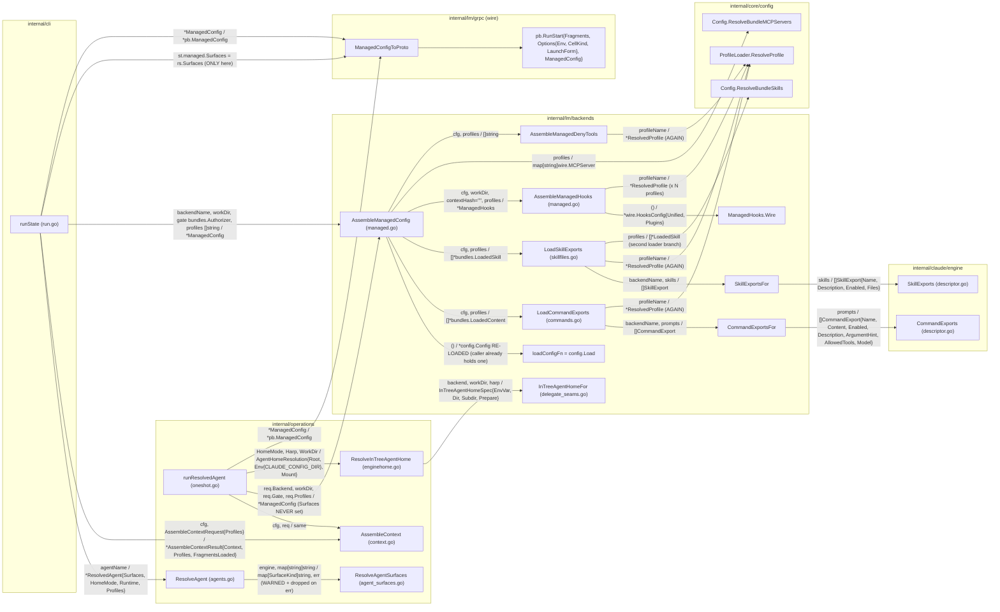
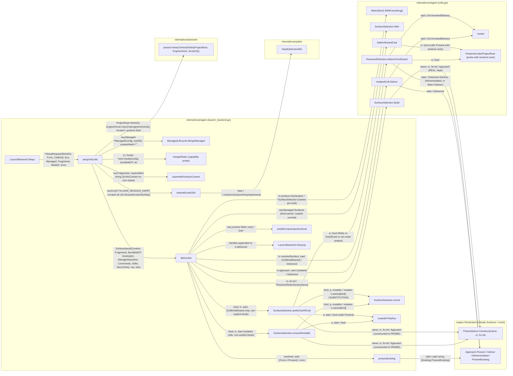
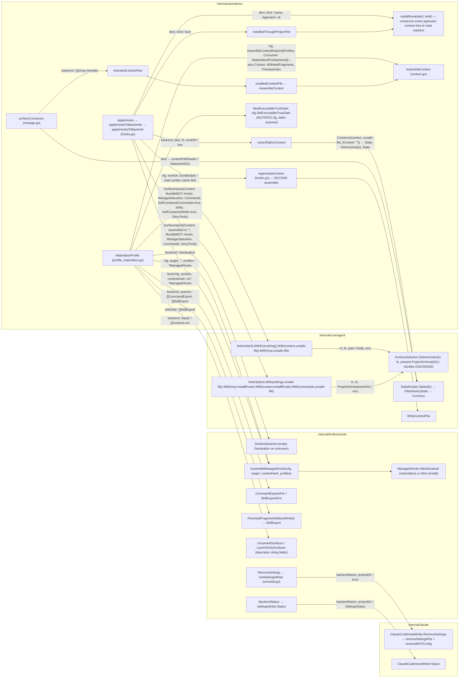
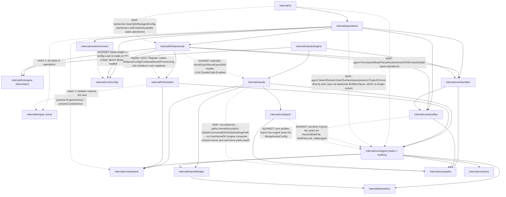

# Seam 3 — Delivery and Surfaces

Architecture audit, ctxloom, read-only. Analyst: seam 3. Checkout: `/home/babbitt/workspace/ctxloom/ctxloom/main` at `release/0.7` (tip `d42cc4229` at start of audit).

Status: COMPLETE — 7 sections, 8 mermaid graphs (6 call graphs, 1 layer graph, 1 data-flow graph, plus 2 divergence graphs inside findings), 21 findings.

## 1. Scope and entry points

**Seam.** How a bundle item (fragment, skill, command/prompt, MCP server, hook, deny-tool) becomes bytes an engine reads on disk, and how the engine is told where those bytes are. Traced from `internal/core/bundles` → `internal/core/profiles` → `internal/operations` (assembly) → `internal/lm/backends` (managed-payload assembly, registry) → wire (`pb.ManagedConfig`) → `internal/core/agent` (the surface-delivery seam: declaration, selection, cells, writers, ledger, locks, hooks) → `internal/claude` (the one live engine's declaration + writers) → `internal/confpatch` / `internal/shared/ledger` / `internal/shared/iox` (record, ownership, atomic write) → `internal/core/paths` + `internal/core/present` (where).

**Packages read** (production files, not tests): `internal/core/agent` (cells.go, declaration.go, presentations.go, approach.go, approaches_generic.go, delivery.go, delivery_state.go, launchform.go, launch_backend.go, base_context.go, contextfile.go, managedcontext.go, packagefiles.go, commandfiles.go, managed_commands.go, managed_skill_packages.go, context_hooks.go, settings_io.go, rmw_lock.go, settings.go, skillexport.go, symlink.go, surface_loss.go), `internal/core/present`, `internal/claude` (surfaces.go, surfaces_hewrecord.go, surfacedelivery.go, contextdelivery.go, claude.go, commandfiles.go, skillfiles.go, skillmates.go, hooks_wire.go, instanceconfig.go, statehome.go, mcp_registrar.go), `internal/claude/engine`, `internal/lm/backends` (managed.go, managed_hooks.go, hooks.go, uninstall.go, registry.go, surfaces.go, commandfiles.go, skillfiles.go, premised_fragment_skills.go, mock_*.go), `internal/lm/engine`, `internal/operations` (context.go, profile_materialize.go, hooks.go, manage.go, agent_surfaces.go, oneshot.go, delegate.go), `internal/cli/run.go` (payload build only), `internal/confpatch`, `internal/shared/ledger`, `internal/core/paths`, `internal/core/bundles` (skill*, loader), `internal/core/profiles`, `internal/content/convert` (skill files).

**Stated architecture read first**: `docs/architecture/shared/agent-surface-delivery.md`, `agent-context-delivery.md`, `agent-managed-files.md`, `engines/claude.md`, `engines/backend-abstraction.md`, `core/paths.md`, `core/bundles.md`, `core/profiles.md`; gates `tests/arch/approach_vocabulary_arch_test.go`, `degrade_discipline_test.go`, `write_discipline_test.go`, `path_authority_test.go`, `ledger_discipline_test.go`, `lock_discipline_test.go`, `real_home_immutability_arch_test.go`, `session_home_arch_test.go`, `engine_layout_arch_test.go`, `layering_test.go`.

### Entry points traced

| # | Family | Entry | File | Reaches disk via |
|---|---|---|---|---|
| E1 | Launch (top-level `ctxloom run`) | `cli.runState` builds `pb.RunStart{ManagedConfig}` from `backends.AssembleManagedConfig` | `internal/cli/run.go` | plugin `agent.LaunchBackend.Setup` → `setupViaCells` → `deliverSet` |
| E2 | Launch (delegated / fan-out member) | `operations.runResolvedAgent` builds `pb.RunStart{ManagedConfig, LaunchForm, CellKind}` | `internal/operations/oneshot.go` | same plugin path as E1 |
| E3 | Plugin Setup (both launches land here) | `agent.LaunchBackend.Setup` → `setupViaCells` → `deliverSet` | `internal/core/agent/launch_backend.go` | `ResolvedSelection.deliverOneShared` (shared cell) / `IsolatedCell.Deliver` (isolated cell) / `presentExisting` (Present form) / nothing (Minimal form) |
| E4 | Hook-carried context (a Rider selected for context) | `agent.LaunchBackend.installContextInjectionHook` → `BaseContextProvider.Provide` → `WriteContextFile` | `internal/core/agent/launch_backend.go`, `base_context.go`, `contextfile.go` | raw cache file `<hash>.md` under the ctxloom context dir + SessionStart hook appended to the merged hooks |
| E5 | Engine argv | `claude.flagArgs(resolved)` reads each approach's `Path()` + `Present(noRoots).Args` | `internal/claude/surfaces.go` (consumed by `buildArgs`, claudecode.go) | exec of `claude --append-system-prompt-file/--mcp-config/--settings` |
| E6 | At-rest materialize (`ctxloom profile materialize`) | `operations.MaterializeProfile` | `internal/operations/profile_materialize.go` | `SurfaceSelection.DeliverUnder` → `IsolatedCell` |
| E7 | At-rest install (`ctxloom manage hooks install`) | `operations.ApplyHooks` → `applyHooksToBackend` | `internal/operations/hooks.go` | `SurfaceSelection.DeliverUnder`, plus `retractNativeContext`, plus `regenerateContext` → `WriteContextFile` |
| E8 | At-rest remove (`ctxloom manage hooks uninstall`) | `backends.RemoveSettings` → `agent.SettingsWriter.RemoveSettings` | `internal/lm/backends/uninstall.go` → `claude.ClaudeCodeHookWriter.RemoveSettings` | `removeSettingsFile` + `removeMCPConfig`; NOT the surfaces seam |
| E9 | At-rest status (`ctxloom manage check`) | `operations.surfaceCurrencies` + `backends.BackendStatus` | `internal/operations/manage.go`, `internal/lm/backends/uninstall.go` | read-only: `agent.StateReader.State`, `ClaudeCodeHookWriter.Status` |
| E10 | Engine-home seeding (session `engine_home`) | `claude.NewInstanceConfigWriter` (`agent.InstanceConfigWriter`), registered from the descriptor into `isolation.RegisterInstanceConfigWriter` and called by `isolation.CopyAmbient` | `internal/claude/instanceconfig.go`, `internal/lm/isolation/ambient.go` | `WriteInstanceConfig` into `<EngineHome>/.claude.json` (seeded from `~/.claude.json` allow-list) |
| E11 | Skill-mates hook (PostToolUse, new) | `agent.NewSkillMatesHook` installs `ctxloom hook skill-mates` (matcher `Skill`); at fire time the `internal/cli` hook verb joins `claude.InvokedSkill`/`SkillsInvoked` (transcript-derived) with `bundles.UninvokedSkillMates` | `internal/core/agent/context_hooks.go`, `internal/claude/skillmates.go` | no delivery write — emits `additionalContext`; the HOOK STRING is delivered via the settings surface like every other managed hook |
| E12 | Companion MCP registrar (taskloom) | `claude.RegisterMCPServer` → `applyMCPServers` | `internal/claude/mcp_registrar.go` | `confpatch.Store.Apply` on `.mcp.json` |
| E13 | Uninstall of engine-wide managed hooks (ltk/taskloom companions) | `agent.WithFileLock` users in `cmd/ltk`, `cmd/taskloom` | out of seam scope; noted for handoff (seam 6/1) | `.claude/settings.json` |

Removed engines (codex, kiro, opencode) no longer exist in the tree; their names survive in comments throughout the seam (see §4 STATED-VS-ACTUAL). The only registered production engine with a Declaration is `claude`; `internal/lm/backends/mock_surfaces.go` registers the test engine.

## 2. Call graphs

Edge labels carry the state that crosses the call: `args / returns`. Trivial plumbing (ctx, loggers) omitted. `Warn` is shown only where the stderr channel IS the finding.

### G2.1 — Launch, host side: building the managed payload (E1 `ctxloom run`, E2 delegated member)

Two callers build the same payload; only one attaches the binding's surface preference.



What crosses the wire is `pb.ManagedConfig{Commands, Skills, Hooks, BundleMCP, ManageStatusline, DenyTools, Surfaces}` plus `RunOptions.Env` (which smuggles `CTXLOOM_SESSION_HARP` and `CLAUDE_CONFIG_DIR` — the two roots the plugin will re-derive from). The assembled `Context` string does NOT cross; the raw `[]Fragment` does, and the plugin re-assembles it.

### G2.2 — Plugin Setup: selection, rooting, cell delivery (E3)



Note the two construction passes: `preferOutOfCwd`/`ensureRootable` construct every declared approach with `fs=nil` to ASK it questions (`Present`, type assertions), discard them, then `Build` constructs the survivors again. The value that decides ("does this approach root under EngineHome?") is learned by calling `Present` with real or sentinel roots, never declared.

### G2.3 — claude: approach → adapter → writer → primitive → byte on disk (the centrepiece, per surface kind)

```mermaid
flowchart LR
  subgraph decl["internal/claude/surfaces.go — Declaration"]
    NCF["NativeContextFile(&quot;claude/context&quot;, CLAUDE.md, claudeContextWriter) (context: unsafe-file, DEFAULT)"]
    SPC["systemPromptContext (context: system-prompt, LaunchOnly, Existing)"]
    HCC["agent.HookCarriedContext (context: hook, Rider→settings)"]
    MCPC["mcpConfig (mcp: mcp-config, DEFAULT, LaunchOnly, Existing)"]
    MCPU["mcpUnsafeFile (mcp: unsafe-file)"]
    SET["settingsSurface (settings: unsafe-file, DEFAULT, OutOfCwd, Existing)"]
    SETR["settingsRecord (settings: hew-record; surfaces_hewrecord.go)"]
    CMD["commandsSurface (commands: unsafe-file)"]
    SKL["newSkillsSurface → agent.ManagedSkillPackagesDelivery (skills: unsafe-file)"]
  end
  subgraph adapt["internal/claude — adapter layer"]
    FTD["fileTemplateDelivery{place, fs, selfContainedCommands, denyTools} (surfacedelivery.go)"]
    AFD["appendFlagDelivery{place, fs, path} (contextdelivery.go)"]
    GCD["GlobalCommandsDir() reads $HOME"]
    DESIRED["settingsRecord.desired(): runs writeSettingsFile into MemMapFs, parses back"]
  end
  subgraph writer["internal/claude/claude.go — ClaudeCodeHookWriter"]
    WSF["writeSettingsFile(hooks, denyTools, projectDir)"]
    WMC["writeMCPConfig(projectDir, bundleMCP)"]
    AMS["applyMCPServers(fs, store, path, desired, owned)"]
    RSTORE["recordStore() → paths.HomeRecordsDir()"]
    WCTX["WriteContext(ContextWriteRequest)"]
    WCF["WriteCommandFiles(workDir, cmds, opts) (commandfiles.go) — RemoveAll legacy .claude/commands/ctxloom"]
    WSKF["WriteSkillFiles(workDir, skills, opts) (skillfiles.go) → acceptedSkills"]
  end
  subgraph shared["internal/core/agent — shared writers/primitives"]
    WMCTX["WriteManagedContext → writeManagedContextLocked (managedcontext.go)"]
    DMC["DeliverManagedContext"]
    WMCF["WriteManagedCommandFiles (commandfiles.go)"]
    WMSP["WriteManagedSkillPackages (managed_skill_packages.go)"]
    WMPF["WriteManagedPackageFiles&#91;T&#93; (packagefiles.go) — render→temp→rename, NO lock"]
    WFL["WithFileLock(fs, target, fn) (rmw_lock.go) → paths.HomePathFor + cleanupLegacySidecar"]
    AWF["AtomicWriteFile(fs, path, data, desc)"]
  end
  subgraph prim["primitives"]
    LED["ledger.Ledger{FS, Dir}.Read/Write (.ctxloom-managed sidecar)"]
    CP["confpatch.Store.Apply(fs, target, build, opts) (hew patch + §9.7 record)"]
    IOX["iox.WriteFileAtomicFs"]
    RAW["afero.WriteFile / fs.Rename (write-discipline exempt)"]
  end
  subgraph disk["files"]
    F1["&lt;project&gt;/CLAUDE.md (markers)"]
    F2["&lt;EngineHome&gt;/&lt;sha&gt;.sysprompt.md"]
    F3["&lt;EngineHome&gt;/.mcp.json"]
    F4["&lt;project&gt;/.mcp.json"]
    F5["&lt;project&gt;/.claude/settings.json + .claude/.ctxloom-managed"]
    F6["&lt;Scratch&gt;/.claude/settings.json (shared-cell form)"]
    F7["&lt;EngineHome&gt;/settings.json + ~/.ctxloom/records/*"]
    F8["&lt;project&gt;/.claude/commands/*.md + .ctxloom-managed"]
    F9["&lt;project&gt;/.claude/skills/&lt;name&gt;/** + .ctxloom-managed"]
    F10["~/.ctxloom/locks/&lt;flat&gt;.lock"]
  end

  NCF -- "writer, ProjectRoot.Host, content / Delivered=SurfacePersistsAfterExit" --> DMC
  DMC -- "ContextWriteRequest{ProjectDir, Context} / ContextReport" --> WCTX
  WCTX -- "fs, path, rel, content, desc / ContextReport" --> WMCTX
  WMCTX -- "target / fn" --> WFL
  WMCTX -- "path, merged bytes" --> AWF
  AWF --> IOX --> F1
  SPC -- "dirPlacement{EngineHome.Host}, content / Delivered=fs.Remove(path); s.path" --> AFD
  AFD -- "path, framed bytes" --> AWF
  AWF --> F2
  MCPC -- "EngineHome.Host / Delivered; s.path" --> FTD
  MCPU -- "ProjectRoot.Host / Delivered" --> FTD
  FTD -- "DeliverMCP(bundle) → dir, bundleMCP / Delivered=removeMCPConfig" --> WMC
  WMC -- "mcpPath, desired map[string]any, owned / Result" --> AMS
  AMS -- "() / *confpatch.Store rooted in ~/.ctxloom/records" --> RSTORE
  AMS --> CP
  CP -- "target / fn" --> WFL
  CP -- "record bytes, target bytes" --> AWF
  CP --> F3
  CP --> F4
  SET -- "Deliver: ProjectRoot.Host; DeliverIsolated: Scratch.Host (s.path) / Delivered=removeSettingsFile" --> FTD
  FTD -- "DeliverSettings(hooks, manageStatusline) + d.denyTools / Delivered" --> WSF
  WSF -- "settingsPath / fn" --> WFL
  WSF -- "3x Read, 3x Write: SurfaceHooks, SurfaceStatusLine, SurfacePermissions" --> LED
  WSF -- "settingsPath, JSON" --> AWF
  AWF --> F5
  AWF --> F6
  SETR -- "hooks, statusline, denyTools / desiredSettings" --> DESIRED
  DESIRED -- "runs" --> WSF
  SETR -- "target=EngineHome/settings.json, build / Delivered=Apply(empty build)" --> CP
  CP --> F7
  CMD -- "ProjectRoot.Host, commands, selfContainedCommands / Delivered=WriteCommandFiles(dir, nil)" --> FTD
  FTD -- "() / home commands dir (HIDDEN INPUT)" --> GCD
  FTD -- "dir, commands, opts / error" --> WCF
  WCF -- "fs, commandsDir, cmds, render, WithDedupHomeDir / error" --> WMCF
  WMCF -- "…ledger.SurfaceCommands…" --> WMPF
  SKL -- "ProjectRoot.Host, skills / Delivered=SurfacePersistsAfterExit" --> WSKF
  WSKF -- "fs, skillsDir, accepted / error" --> WMSP
  WMSP -- "…ledger.SurfaceSkills…" --> WMPF
  WMPF -- "Read/Write manifest" --> LED
  WMPF -- "afero.WriteFile to temp sibling; fs.Rename per file" --> RAW
  RAW --> F8
  RAW --> F9
  WFL --> F10
```



Per-kind layer count from approach to `iox` (excluding the seam itself): context 4 (`NativeContextFile` → `DeliverManagedContext` → `WriteContext` → `WriteManagedContext`), MCP 5 (`mcpConfig` → `fileTemplateDelivery.DeliverMCP` → `writeMCPConfig` → `applyMCP` → `applyMCPServers` → confpatch), settings 3 (+ a filesystem round-trip for hew-record), commands 4 (`commandsSurface` → `fileTemplateDelivery.DeliverCommands` → `WriteCommandFiles` → `WriteManagedCommandFiles` → `WriteManagedPackageFiles`), skills 3 (`ManagedSkillPackagesDelivery` → `WriteSkillFiles` → `WriteManagedSkillPackages` → `WriteManagedPackageFiles`).

### G2.4 — Hook-carried context (E4): the SECOND context write path

```mermaid
flowchart LR
  subgraph lb["internal/core/agent"]
    DS["deliverSet"]
    ICIH["installContextInjectionHook(req)"]
    PROV["BaseContextProvider.Provide(workDir, fragments)"]
    WCF["WriteContextFile(workDir, fragments) (contextfile.go) — raw afero.WriteFile, no lock"]
    ADC["assembleDedupedContext(fragments)"]
    NCIH["NewContextInjectionHooks(hash, workDir) (context_hooks.go)"]
    RCF["ReadContextFile(workDir, hash) — READS BACK the file just written"]
    CHUNK["ChunkContext(content)"]
    NCI["NewContextInjectionHook / NewContextInjectionChunkHook"]
    CC["CtxloomCommand() (HIDDEN INPUT: executable path)"]
    EE["LaunchBackend.ExecuteEnv → env&#91;CTXLOOM_CONTEXT_FILE&#93;=RELATIVE path"]
    GCFP["BaseContextProvider.GetContextFilePath (relative!)"]
  end
  subgraph merged["merged lifecycle state (BaseLifecycle)"]
    HOOKS["*wire.HooksConfig — the SAME pointer already captured in SurfaceInputs.Hooks"]
  end
  subgraph settings["settings surface (delivered AFTER context in surfaceOrder)"]
    SET["settingsSurface.Deliver / DeliverIsolated"]
  end
  subgraph disk["files"]
    CACHE["&lt;project&gt;/.ctxloom/cache/context/&lt;sha16&gt;.md"]
    SJ[".claude/settings.json: SessionStart: ctxloom hook inject-context &lt;hash&gt;"]
  end
  subgraph fire["at fire time (internal/cli hook verb)"]
    HIC["cli hook inject-context &lt;hash&gt; → resolveInjectContextWorkDir → ReadContextFile"]
  end

  DS -- "rs.kind==SurfaceContext && Rider / bool" --> ICIH
  ICIH -- "b.WorkDir(), req.Fragments / err; sets contextHash" --> PROV
  PROV -- "workDir, fragments / hash string" --> WCF
  WCF -- "fragments / content string" --> ADC
  WCF -- "bytes" --> CACHE
  ICIH -- "hash, b.WorkDir() / []wire.Hook" --> NCIH
  NCIH -- "workDir, hash / content (from DISK)" --> RCF
  RCF --> CACHE
  NCIH -- "content / []string chunks" --> CHUNK
  NCIH -- "hash, part, total / wire.Hook{Command}" --> NCI
  NCI -- "() / path" --> CC
  ICIH -- "hooks.Unified.SessionStart = append(...) (MUTATES shared pointer)" --> HOOKS
  HOOKS -- "in.Hooks (same pointer, read later)" --> SET
  SET --> SJ
  EE -- "() / rel path" --> GCFP
  SJ -- "engine runs hook" --> HIC
  HIC --> CACHE
```



Ordering dependence: `installContextInjectionHook` runs inside the per-surface loop when the CONTEXT surface is reached; the settings surface (which serializes `hooks`) is delivered later in `surfaceOrder`. Correctness rests on (a) `SurfaceContext < SurfaceSettings` in `surfaceOrder` and (b) `SurfaceInputs.Hooks` being a pointer aliasing the lifecycle's merged state. Neither is asserted at the call site.

### G2.5 — At-rest callers (E6 materialize, E7 install, E8 remove, E9 check)



### G2.6 — Argv: how the engine learns where the bytes are (E5)

```mermaid
flowchart LR
  subgraph cc["internal/claude/claudecode.go"]
    BA["ClaudeCode.buildArgs(req *ExecuteRequest)"]
    PA["permissionArgs(req.Permissions, mcpServerNames)"]
  end
  subgraph sf["internal/claude/surfaces.go"]
    FA["flagArgs(resolved)"]
    MSN["mcpServerNames(resolved) — asserts anonymous interface{ servers() }"]
    P["Approach.Present(noRoots).Args&#91;0&#93; — flag NAME"]
    PATH["pathed.Path() — recorded by Deliver (mutable field on the approach)"]
  end
  subgraph lb["internal/core/agent"]
    RES["LaunchBackend.Resolved() *ResolvedSelection"]
    MA["LaunchBackend.MinimalArgs()"]
    EE["ExecuteEnv(req) → env + CTXLOOM_CONTEXT_FILE"]
    ECLI["ExecuteCLI(ctx, req, args, stdin, modelInfo, stdout, stderr)"]
  end
  BA -- "() / *ResolvedSelection (state left by Setup)" --> RES
  BA -- "resolved / []string flags" --> FA
  FA -- "per approach / flag" --> P
  FA -- "per approach / path or &quot;&quot;" --> PATH
  BA -- "resolved / []string names" --> MSN
  MSN --> PA
  BA -- "() / []string (only on LaunchFormMinimal)" --> MA
  BA -- "args / exec" --> ECLI
  ECLI --> EE
```



The engine's argv is derived from mutable fields (`s.path`) the approaches set during Setup, read back during Execute through `Resolved()`. Setup and Execute are separate gRPC calls on the same plugin process; the contract that Execute sees Setup's approaches is the plugin's in-memory `LaunchBackend` state (`b.resolved`), not a value passed between them.

## 3. Delegation / layer graph

Solid arrows are the STATED direction (docs/architecture/shared/agent-surface-delivery.md, engines/backend-abstraction.md, core/paths.md, layering_test.go, engine_identity_arch_test.go). Dotted arrows labelled `AGAINST` go the wrong way; `SKIP` reach past a layer that exists. The stated stack, top to bottom: `cli` → `operations` → `lm/backends` (registry, payload assembly) → wire → `shared/agent` (the seam) ← engine plugin (`claude`) implements it → primitives (`iox`, `ledger`, `confpatch`, `paths`, `present`).



Reading order for the human: the two `AGAINST` edges into `shared/agent` (from `confpatch` and `profiles`) are the clearest signal that `shared/agent` is two packages wearing one name — the surface-delivery SEAM (Declaration, Select, cells) and a TOOLBOX (`AtomicWriteFile`, `WithFileLock`, `Warn`, `GetFS`, `IsManaged`, `MergeHooksConfig`, `CtxloomCommand`). Lower packages import it for the toolbox and thereby depend on the seam.

## 4. Findings (ranked by blast radius)

Each finding: shape, the symbols and files, what breaks, and one sentence on what settles it. Rows already recording a defect are cited rather than re-derived.

### F1 — DIVERGENT PATHS: the agent binding's `surfaces:` preference is honoured by `ctxloom run` and silently dropped by every delegation
- `operations.ResolveAgent` (agents.go) resolves `ResolvedAgent.Surfaces` via `operations.ResolveAgentSurfaces`. The ONLY consumer is `cli.runState` (run.go): `st.managed.Surfaces = st.agentSurfaces`. `operations.runResolvedAgent` (oneshot.go), `operations.PrepareAgentChat` (delegate.go) and `coord.Spawner` (agentcoord/coord/spawner.go) read `rs.HomeMode`/`rs.Runtime` and never `rs.Surfaces`; `resolvedRunRequest` has no field for it; `backends.AssembleManagedConfig` cannot set it ("knows nothing about which agent is being launched").
- Blast: a binding declaring `settings: hew-record` or `context: system-prompt` gets the engine's DEFAULT on every `agent_run` / coordinator spawn — with `preferOutOfCwd`/`ensureRootable` then choosing for it — while the same binding under `ctxloom run --agent` gets what it declared. The isolation posture the human configured is not the one delegated children run with.
- Settles it: an acceptance test that a delegated member's `SetupRequest.Managed.Surfaces` equals the binding's map; then move the attach into one place both launches pass through (a `ManagedConfig` builder that takes `*ResolvedAgent`).

```mermaid
flowchart LR
  RA["operations.ResolveAgent → ResolvedAgent{Surfaces, HomeMode, Runtime}"]
  RA --> RUN["cli.runState (run.go): managed.Surfaces = rs.Surfaces"]
  RA --> ONE["operations.runResolvedAgent (oneshot.go): Surfaces NOT carried"]
  RA --> DEL["operations.PrepareAgentChat (delegate.go): HomeMode carried, Surfaces NOT"]
  RA --> SPW["coord.Spawner (spawner.go): Runtime carried, Surfaces NOT"]
  RUN --> SETUP["plugin deliverSet: explicit&#91;kind&#93; honoured"]
  ONE --> SETUP2["plugin deliverSet: explicit = {} → preferOutOfCwd/ensureRootable decide"]
  DEL --> SETUP2
  SPW --> SETUP2
```



### F2 — DUPLICATION: two host-side context assemblers, pinned to each other by prose
- `operations.AssembleContext` (context.go) and `operations.regenerateContext` (hooks.go) both run collect → dedupe → sort → premise-filter → ingest → builtins. `regenerateContext`'s body says "This function's output MUST match AssembleContext — any divergence ships a SessionStart-injected context that disagrees with what `ctxloom run` assembles", and repeats "the SAME … AssembleContext uses" four times. Nothing checks it. `operations.installedContextFile` (same file) already shows the right shape: it calls `AssembleContext` and takes `.Context`.
- Blast: every `manage hooks install` writes the SessionStart cache from the second assembler; a fragment ordering, premise or builtin change made in one is invisible in the other until a session reads stale context.
- Settles it: delete `regenerateContext`; `ApplyHooks` calls `AssembleContext` and writes `asm.Context` through the same content-hash writer; keep one test asserting the hook cache bytes equal `AssembleContext(...).Context`.

### F3 — DIVERGENT PATHS: three routes from `[]Fragment` to the engine, sharing no trunk past assembly
Context reaches claude by (a) the surfaces seam, (b) the hook cache, (c) the wire server's prompt prefix. They share `assembleDedupedContext` and nothing else.

```mermaid
flowchart TB
  FR["&#91;&#93;*agent.Fragment (wire)"] --> ADC["agent.assembleDedupedContext"]
  ADC --> A["(a) SURFACES: setupViaCells → assembleSurfaceContext (ErrNoContext) → SurfaceInputs.Context → nativeContextFile / systemPromptContext → WithFileLock + AtomicWriteFile (iox) → CLAUDE.md or EngineHome/&lt;sha&gt;.sysprompt.md"]
  ADC --> B["(b) HOOK CACHE: installContextInjectionHook → BaseContextProvider.Provide → WriteContextFile: raw afero.WriteFile, NO lock, NO atomic rename, into &lt;project&gt;/.ctxloom/cache/context/&lt;sha&gt;.md EVEN ON CellKindShared; then ReadContextFile re-reads it; env CTXLOOM_CONTEXT_FILE carries a RELATIVE path; Clear uses os.Remove not the afero fs"]
  ADC --> C["(c) MINIMAL: lm/grpc/server.go turnPromptContent → FrameProjectContext → prepended to the prompt; never touches the seam"]
```


- Steps (b) skips that (a) performs: `rooted`/cell placement (writes into the project cwd regardless of cell), `WithFileLock`, `AtomicWriteFile`, any `Delivered` handle (nothing retracts the cache; `Cleanup` never runs `BaseContextProvider.Clear` — no production caller), a `Presentation`. Steps (c) skips: everything in the seam; it is a delivery decision living in the transport layer.
- Rows: engaged-borrower proposes retiring (b) wholesale; until then (b) is the un-gated writer. `agent-context-delivery.md` states "`WriteContextFile` is the only writer of `.ctxloom/cache/context/<hash>.md`" and "the naming scheme exists in two places" — it exists in three (`WriteContextFile`, `appendFlagDelivery.DeliverContext` "mirroring WriteContextFile's naming scheme", `hookCarriedContext.Present`) and the path in four (`ReadContextFile`, `BaseContextProvider.GetContextFilePath`, `BaseContextProvider.Clear`, `cli/run.go` dry-run message).
- Settles it: one `agent.ContextCachePath(root, hash)`; (b) becomes an approach that `Deliver`s under an advised root through `AtomicWriteFile`; (c) becomes the `MinimalLaunch` approach's `Present`, not server code.

### F4 — STATED-VS-ACTUAL: "no fallback on resolution / delivery never degrades" versus four substitution sites
The doc (`agent-surface-delivery.md` "Resolution: name in, approach out, no fallback"; `cells.go` "What a shared cwd never does is SUBSTITUTE") and the ruling behind `ErrSharedScratchNoHarp`/`ErrUnrootedEngineHome` say a selection is honoured or refused. Actual:
1. `agent.SurfaceSelection.reroot` (launch_backend.go), reached from `keepOrReroot` and `ensureRootable`, REPLACES the selected approach with another the run can root — documented as "a change in WHICH approach a rootless run selects, never a degradation". It is a substitution the caller never named; a worktree run declaring nothing gets `mcp: unsafe-file` (the project `.mcp.json`) because the default could not root.
2. `operations.ResolveAgent` (agents.go): a `surfaces:` entry the engine cannot construct → `clidiag.Warn(... "using %s's default delivery")` and proceeds. The doc says a config-authored composition "is looked up where it entered and refused there".
3. `operations.ResolveAgent`: an unparseable `engine_home:` → warn "using the real host config home" — the SHARED home, exactly what `privateRoot`'s doc says nothing may serve "on anyone's behalf".
4. `operations.ResolveInTreeAgentHome` (enginehome.go): `spec.Prepare` failure is `strictness.FailAlways` with the comment "Delivery never degrades to a shared home"; the `os.MkdirAll(home, 0o700)` failure five lines later warns "using the runtime's own config home instead" and returns `absent(...)` — the same substitution, unguarded. `InTreeAgentHomeFor` (delegate_seams.go) does the same on harp validation failure.
- None of these sites spells `Degraded()`, so `degrade_discipline_test.go` cannot see them (its own stated blind spot: "a route to the mode that never spells Degraded").
- Blast: the isolation posture of the engine home — credentials and state — is the thing being degraded in 3 and 4.
- Settles it: make sites 3 and 4 `FailAlways(ClassIsolation)`; make site 2 an error from `ResolveAgent`; for site 1 either delete `reroot` (refuse with `ErrUnrootedEngineHome`'s remedy) or write the rule into the doc and add a test that an explicitly-named approach is never rerooted.

### F5 — DUPLICATION / MISSING LAYER: three ownership-record mechanisms, two of them on the same file
- In-file markers: `agent.WriteManagedContext` (managedcontext.go) for CLAUDE.md, parsed by BOTH `splitManagedSection` (managedcontext.go) and `managedSection` (delivery_state.go) — two parsers of one marker format.
- Sidecar ledger: `ledger.Ledger` for `.claude/settings.json` hooks/statusline/permissions (`claude.ClaudeCodeHookWriter.writeSettingsFile`), commands and skills (`agent.WriteManagedPackageFiles`).
- Confpatch records under `~/.ctxloom/records`: `.mcp.json` (`claude.applyMCPServers`) and `<EngineHome>/settings.json` (`claude.settingsRecord`).
- So `settings.json` is ledgered when delivered as `unsafe-file` and recorded when delivered as `hew-record`; `.mcp.json` next to it is recorded; `CLAUDE.md` is marked. `ledger_discipline_test.go` enumerates all three as sanctioned. The `SCM` in-struct field claude's ledger comment describes ("claude's THIRD mechanism") is `json:"-"` and never reaches disk — the gate's third signal recognises a field that records nothing.
- Blast: `manage uninstall`, `clean`, `check` and every Cleanup must know which of three records to consult per file; tranquil-mutiny (no uninstall opt-out) is the visible symptom of ownership having no single home.
- Settles it: one record per engine (confpatch already handles JSON tables and reversal) and a gate asserting one mechanism per target path; delete `managedSection` in favour of `splitManagedSection`.

### F6 — DUPLICATION: commands and skills — sibling surfaces, two delivery shapes, opposite lifetimes
- Skills: `claude.newSkillsSurface` → shared `agent.ManagedSkillPackagesDelivery` → `claude.WriteSkillFiles` → `agent.WriteManagedSkillPackages` → `WriteManagedPackageFiles`; Cleanup = `SurfacePersistsAfterExit`.
- Commands: `claude.commandsSurface` → `claude.fileTemplateDelivery.DeliverCommands` (reads `GlobalCommandsDir()`/`$HOME` — hidden input) → `claude.WriteCommandFiles` (which `RemoveAll`s a legacy `.claude/commands/ctxloom` on every write) → `agent.WriteManagedCommandFiles` → `WriteManagedPackageFiles`; Cleanup = `WriteCommandFiles(dir, nil, …)` — RETRACTS. The shared `agent.ManagedCommandsDelivery` exists and is used by the mock engine only; `commandsSurface`'s doc says "(Unlike the mock …) they are NOT the shared agent.ManagedCommandsDelivery".
- `SurfacePersistsAfterExit`'s doc (managedcontext.go) says the exit-removal/persist confusion was removed because "two writers shared one path with opposite lifecycles". It still holds for commands: `profile materialize` writes `.claude/commands` and never removes; an isolated-cell run writes and removes at Cleanup. `fileTemplateDelivery.DeliverSettings`/`DeliverMCP` likewise return retracting Cleanups (`removeSettingsFile`, `removeMCPConfig`), so on an isolated cell the project's `.claude/settings.json` hooks and `.mcp.json` servers are ephemeral while `CLAUDE.md` and skills persist.
- Settles it: commands ride `agent.NewManagedCommandsDelivery` with `SurfacePersistsAfterExit` (dedup moves to a constructor input); delete `fileTemplateDelivery.DeliverCommands`; a test that every project-root approach's `Delivered` is `SurfacePersistsAfterExit`.

### F7 — MISSING LAYER: "what ctxloom wants in settings.json" has no pure function
- `claude.ClaudeCodeHookWriter.writeSettingsFile` computes the desired hooks/statusline/deny AND merges AND persists AND writes three ledger surfaces inside one `WithFileLock` closure. `claude.settingsRecord.desired` therefore runs that writer into an `afero.NewMemMapFs()` at `/desired`, reads the JSON back and re-parses it, to learn the desired value — a filesystem round-trip standing in for a return value.
- Sites that would collapse into the layer: `writeSettingsFile` (merge half), `settingsRecord.desired`, `removeSettingsFile` (needs "what is ours" — currently the ledger), `claudeHasManagedHook`/`Status`.
- Settles it: `func desiredClaudeSettings(hooks *wire.HooksConfig, denyTools []string, manageStatusline bool) claudeCodeSettings` with both writers calling it; delete the MemMapFs round-trip.

### F8 — DATA-FLOW SMELL: the run's roots travel as environment strings between two typed ends
- Host: `operations.ResolveInTreeAgentHome` builds `present.Root{Host: home}` → `AgentHomeResolution.Env{CLAUDE_CONFIG_DIR: paths.EngineHome.Engine}` → merged into `RunOptions.Env`. Plugin: `agent.LaunchBackend.setupViaCells` reads `req.Env[b.engineHomeVar]` back into `present.Root{Host: engineHome}`. Same value, typed → string → typed, with the engine's own env var name as the key (`SetEngineHomeVar`).
- Scratch: host stamps `CTXLOOM_SESSION_HARP`; plugin `sharedScratchDir(req.Env[SessionHarpEnv])` → `paths.HarpEphemeralDir` — the harp re-read from env deep in the chain, and the only reason `ErrSharedScratchNoHarp` exists.
- Context file: `BaseContextProvider.GetContextFilePath` returns a RELATIVE path; `ExecuteEnv` exports it as `CTXLOOM_CONTEXT_FILE`.
- `present.Presentation.EnginePath`, `.Env`, `Mapped.Mounts()`, `Rooted.AnnounceEnv`, `Start.Served` have NO production consumer — the container half of `present` is built and never read (mounts are consumed only from `ResolveInTreeAgentHome`'s own `ApplyPaths` call, bypassing `Presentation`).
- Settles it: `pb.RunOptions{EngineHome, Scratch}` typed fields; `setupViaCells` never reads `req.Env`; delete the unread `present` channels or wire them.

### F9 — DATA-FLOW SMELL: config re-loaded and profiles re-resolved downstream
- `backends.AssembleManagedConfig` calls `loadConfigFn()` (config_seam.go, `= config.Load`) although both callers (`cli.runState`, `operations.runResolvedAgent`) hold a `*config.Config`; it then `SetExecutableTrustGate` on the fresh copy. `operations.MaterializeProfile` mutates the caller's `cfg` the same way (defer-restored) — the trust gate is a hidden parameter set by mutation on both paths.
- `AssembleManagedHooks`, `AssembleManagedDenyTools`, `LoadCommandExports`→`resolveProfilePromptRefs`, `LoadSkillExports`→`resolveProfileSkillRefs`, and `Config.ResolveBundleMCPServers` each call `ProfileLoader.ResolveProfile` per profile — five resolutions of the same profile set per payload, each warning independently on failure.
- Settles it: `AssembleManagedConfig(cfg *config.Config, …)` taking the resolved profile set once; delete `loadConfigFn`.

### F10 — WORKAROUND: facts about an approach are learned by constructing it and asking
- `agent.SurfaceSelection.preferOutOfCwd`, `ensureRootable`, `operations.installRoute`, `operations.retractNativeContext` construct approaches with `fs=nil`/`SurfaceInputs{}` to type-assert `Rider`/`LaunchOnly`/`OutOfCwd` and to call `Present`; `agent.PresentsUnderProjectRoot` probes `Present` with sentinel roots `/ctxloom-probe/...`; `rootedInThisRun` infers "roots at an unadvised root" from `filepath.IsAbs(Present(start).HostPath)`; `claude.flagArgs` calls `Present(noRoots)` to read a flag name. Build then constructs the survivors again.
- Comments call the marker-interface set "a closed set a new approach silently falls outside of" and the presenter probe the fix — the probe is the workaround for a declaration that does not state where an approach roots.
- Settles it: `Presentations.Or(name, Construct, agent.Traits{Root: RootEngineHome, Flag: "--mcp-config", LaunchOnly: true})`; selection reads traits, never constructs.

### F11 — WORKAROUND: the hook-carried context installs by mutating shared state, ordered by a slice
- `agent.LaunchBackend.installContextInjectionHook` appends to `hooks.Unified.SessionStart` on the lifecycle's `*wire.HooksConfig` AFTER `SurfaceInputs.Hooks` captured that pointer; the settings surface serialises it later only because `SurfaceContext` precedes `SurfaceSettings` in `surfaceOrder`. `NewContextInjectionHooks(hash, workDir)` re-reads the cache file `WriteContextFile` just wrote to count chunks. `CtxloomCommand()` (resolves the running executable) is a hidden input to every hook string.
- Settles it: compute the injection hooks from the assembled content (not the file) before `SurfaceInputs` is built, and pass the final `HooksConfig` by value.

### F12 — LAYER BYPASS: engine-identity and real-home paths outside the layers that own them
- `backends.forceExport` / `forceExportSkill` (commands.go, skillfiles.go) mutate `LLM.ClaudeCode.Enabled` on the shared `bundles.LoadedContent`/`LoadedSkill` — an engine-agnostic package writing an engine-specific field, on an object other consumers read.
- `claude.MCPRegistrar` (mcp_registrar.go) spells `.mcp.json`, `.claude.json`, `.claude` and reads `os.UserHomeDir()` beside the package's own `MCPFileName`/`ConfigDirName`/`GlobalSettingsPath`; `path_authority_test.go` cannot see it (no `paths.*` in the Join).
- `claude.ClaudeCodeHookWriter.recordStore` resolves `paths.HomeRecordsDir()` inside a writer; `fileTemplateDelivery.DeliverCommands` resolves `GlobalCommandsDir()` — real-home reads inside deliveries that are supposed to act only on advised roots.
- `cli/run.go` calls `backends.AssembleManagedConfig`, `backends.List/Exists/IsAvailable` and a dozen `agent.*` symbols directly, past `operations`.
- Settles it: an `Enabled` override carried on the export; `MCPRegistrar` uses the constants; a `dedupHomeDir` constructor input on the commands approach; layering rule `cli must not import lm/backends`.

### F13 — DUPLICATION: dead second derivation of the engine-home path
- `claude.SessionConfigDir(workDir, harp)` (statehome.go) has no production caller; `backends.InTreeAgentHomeFor` derives the same `<project>/.ctxloom/state/<harp>/home/claude` from the descriptor's `HomeVar.Subdir`. `SessionConfigDir`'s doc asserts they "are the same directory by construction" — unchecked, and now half dead.
- Settles it: delete `SessionConfigDir`.

### F14 — WORKAROUND: migrations living permanently inside primitives and writers
- `agent.WithFileLock` → `cleanupLegacySidecar` removes a pre-fix `<file>.lock` on EVERY lock acquisition; `claude.WriteCommandFiles` `RemoveAll`s `.claude/commands/ctxloom` on every write; `confpatch.Store.renameLegacyRecords` renames unbounded record names on open. Each carries a "why" comment; each is an unfiled one-shot migration under the project's no-backward-compat rule.
- Settles it: delete all three (re-init is the documented upgrade path).

### F15 — STATED-VS-ACTUAL: retired symbols and engines still cited as authority
- `backends.BuildSurfaces` does not exist; cited as "the seam" in `backends/hooks.go`, `backends/mock.go`, `operations/profile_materialize.go`. `SharedCell` is not a type; named in 8 production comment sites in `cells.go`/`launch_backend.go`. codex/kiro/opencode are deleted; 122 comment lines across `internal/core/agent`, `internal/claude`, `internal/lm/backends`, `operations/profile_materialize.go`, `operations/hooks.go` still describe their behaviour (`SurfaceInputs.AgentName` "currently only kiro's"; `SurfaceKind` docs; `ClaudeCodeHookWriter.WriteSettings` "live callers (opencode's own writer …)"; `LaunchBackend.extraEnv` "codex's cell-scoped CODEX_HOME"). `lock_discipline_test.go`'s sole allowlist reason cites "CodexHookWriter.save above" (gone); `ledger_discipline_test.go` says the scope is "five packages" (it is two). `fileTemplateDelivery` doc: "Additive only: wiring into Setup/buildArgs is a later slice" (it is wired). `agent-context-delivery.md` cites `absOrSelf` (gone), line numbers throughout, and "swallows the read error" (now warns). `agent-surface-delivery.md` omits the `Existing` and `MinimalLaunch` capabilities and says `DeliverShared` is a live terminal (its own doc: "no PRODUCTION call site").
- Settles it: delete the retired-engine prose; a doc-comment gate that fails on an identifier no package declares.

### F16 — STATED-VS-ACTUAL: install and uninstall run on different abstractions
- Install/launch write through `agent.Declaration` → approaches; remove and status go through the older `agent.SettingsWriter` (`backends.RemoveSettings`/`BackendStatus` → `claude.ClaudeCodeHookWriter.RemoveSettings`/`Status`), which the descriptor still carries beside `Surfaces`. `WriteSettings` on that interface is documented as legacy with no live production caller. Approaches return `Delivered` handles that `DeliverUnder` callers discard (`_, kinds, errs`), so at rest nothing retains the reversal the seam produced.
- Row tranquil-mutiny records the user-visible consequence (uninstall does not survive the next run). The structural cause is that "remove" has no route through the seam that "install" used.
- Settles it: `RemoveSettings` implemented as `Select(decl).WithEverything().DeliverUnder(empty inputs)` (reconcile-to-nothing), then delete `agent.SettingsWriter.WriteSettings/RemoveSettings`.

### F17 — DATA-FLOW SMELL: `SurfaceInputs` is a God parameter and two booleans thread through four layers
- `agent.SurfaceInputs` (cells.go) carries 11 fields; claude's approaches read 1–3 each and "simply ignore the fields it has no use for". `SelfContainedCommands`/`SelfContainedSkills` are set by `MaterializeProfile`, copied into `commandsSurface.selfContainedCommands`, copied into `fileTemplateDelivery.selfContainedCommands`, and finally gate a `GlobalCommandsDir()` call — feature-flag layering for "do not read `$HOME`". `SurfaceInputs.Fragments` exists only so `HookCarriedContext.Present` can re-assemble what `Context` already holds.
- Settles it: per-kind input structs chosen by the `Construct` signature; the dedup dir as an explicit optional input instead of a boolean that suppresses a hidden read.

### F18 — WORKAROUND: `Warn` is the acknowledgment channel for an unsafe write
- `agent.ResolvedSelection.deliverOneShared` performs the well-known write into the shared cwd after `Warn("unsafe: …")` (stderr via `clidiag`). The doc says selecting `ApproachUnsafeFile` "IS the race acknowledgment" — but on a shared launch with no explicit preference the selection is DERIVED (`preferOutOfCwd`), so for commands and skills (no out-of-cwd form) the user acknowledged nothing and gets a stderr line. `Warn` is also the only channel when `agent.MergeHooksConfig` drops a whole hook set (nil dest), when `NewContextInjectionHooks` cannot read the cache it just wrote, and for `ledger.Ledger` parse failures (`Warn: agent.Warn`). `ContextProvider.Clear` is declared (backend.go) and implemented (`BaseContextProvider.Clear`) but has no production caller, so the hook cache is never reversed either.
- Settles it: a `Delivered`/report field (`Unsafe bool`) surfaced in the run's structured output; commands/skills gain an out-of-cwd form or the shared launch refuses them without an explicit `unsafe-file`.

### F19 — UNGATED WRITE: the hook cache is the one delivery outside every discipline gate
- `agent.WriteContextFile` (contextfile.go): raw `afero.WriteFile` (allowlisted "pre-ratchet baseline"), no `WithFileLock`, writes into the PROJECT cwd on every cell kind, no ledger, no `Delivered`. `BaseContextProvider.Clear` bypasses the afero seam with `os.Remove`. `agent.writeMarker` (rendezvous.go) is the same class.
- Rows: engaged-borrower (deletes the apparatus); until then this is the un-swept writer the write/lock/ledger gates all document as out of scope.
- Settles it: route through `AtomicWriteFile` under the advised Scratch root now; delete with engaged-borrower later.

### F20 — LAYER INVERSION: `shared/agent` is the toolbox lower packages import
- `confpatch` imports `agent` for `AtomicWriteFile`, `WithFileLock`, `IsManaged`; `profiles` imports `agent` for `MergeHooksConfig`; `isOSBackedFs` is hand-copied in `agent`, `iox`, `admission`. The seam (Declaration/Select/cells) and the toolbox (`AtomicWriteFile`, `WithFileLock`, `Warn`, `GetFS`, `CtxloomCommand`, `IsManaged`, `ComputeCommandDigest`) share a package, so a record primitive depends on the delivery seam.
- Settles it: move the lock + atomic-write helpers into `iox` (or a `shared/fslock`), `MergeHooksConfig` onto `wire.HooksConfig` (its doc already says "the merge rule itself lives with the types"), and re-run `go list -deps` to confirm `confpatch`/`profiles` no longer import `agent`.

### F21 — Five roots for one session's bytes (cites boned-monoxide)
- One run's delivered bytes land under: `<project>/.ctxloom/state/<harp>/home/claude` (engine-home instance: `.mcp.json`, `settings.json`, `<sha>.sysprompt.md`, `.claude.json`), `~/.ctxloom/sessions/<harp>/ephemeral` (shared-cell settings via `DeliverIsolated`), `<project>/.ctxloom/cache/context/` (hook cache), `~/.ctxloom/records` (confpatch), `~/.ctxloom/locks` (flocks), plus the project root itself. `present.Paths` names four roots; `Scratch` and `EngineHome` are different directories for a shared-cell run and the same directory for an isolated one ("on an isolated cell Scratch IS the working directory"), which is why `SafeInSharedCwd` carries its documented residue for settings.
- boned-monoxide item 1 (merge `state/<harp>` into the home-rooted session dir) and "scratch retirement" are the ruled direction; no new finding, cited for the join.

## 4b. Data-flow graph — a bundle item and its bytes (the central value)

One fragment, one skill, one hook, one MCP server: created in a bundle, transformed by profile → assembly → payload → wire → plugin → approach → writer, consumed as bytes.

```mermaid
flowchart TB
  subgraph create["CREATED — internal/core/bundles / internal/core/profiles"]
    B["bundles.Bundle{Fragments, Skills, Prompts, MCP, Hooks, LinkGroups}"]
    LS["bundles.LoadedSkill{Frontmatter, Files, LLM.ClaudeCode.Enabled}"]
    LC["bundles.LoadedContent (prompt){Name, Content, LLM.ClaudeCode}"]
    RP["profiles.ResolvedProfile{Hooks wire.HooksConfig, DenyTools, Skills, Prompts, Fragments}"]
  end
  subgraph host["TRANSFORMED — host process"]
    AC["operations.AssembleContext → AssembleContextResult{Context string, WithheldFragments, PremiseIndex}"]
    RGC["operations.regenerateContext → hash (SECOND assembler, install path only)"]
    AMC["backends.AssembleManagedConfig → agent.ManagedConfig"]
    FE["backends.forceExport: MUTATES LC.LLM.ClaudeCode.Enabled"]
    CX["claudeengine.CommandExports → agent.CommandExport{Name, Content, Enabled, Description, ArgumentHint, AllowedTools, Model}"]
    SX["claudeengine.SkillExports → agent.SkillExport{Name, Description, Enabled, Files &#91;&#93;PackageFile}"]
    AMH["backends.AssembleManagedHooks → ManagedHooks → .Wire() *wire.HooksConfig (provenance dropped here)"]
    RBM["config.ResolveBundleMCPServers → map&#91;string&#93;wire.MCPServer"]
    PF["cli.runState: Context string → &#91;&#93;*pb.Fragment (context becomes fragments AGAIN)"]
  end
  subgraph wire["WIRE — pb.RunStart"]
    W["pb.ManagedConfig{Commands, Skills, Hooks, BundleMCP, ManageStatusline, DenyTools, Surfaces} + Fragments + Options.Env{HARP, CLAUDE_CONFIG_DIR}"]
  end
  subgraph plugin["TRANSFORMED — plugin process (internal/core/agent)"]
    MFP["managedConfigFromProto → *ManagedConfig"]
    MM["BaseLifecycle.MergeManaged: hooks + MCP folded into lifecycle state"]
    ASC["assembleSurfaceContext(req.Fragments) → Context string (THIRD assembly of the same fragments)"]
    SI["SurfaceInputs{Context, Fragments, BundleMCP, Hooks*, ManageStatusline, Commands, Skills, DenyTools}"]
    ICIH["installContextInjectionHook: Fragments → WriteContextFile → hash → hooks.Unified.SessionStart += inject-context hook"]
    APP["Approach constructed from SurfaceInputs (Build) — picks 1–3 fields"]
  end
  subgraph engine["TRANSFORMED — internal/claude"]
    TCC["TransformToClaudeCommand(CommandExport) → frontmatter + body bytes"]
    ASK["acceptedSkills → checkSkillConstraints (drops with Warn)"]
    DSET["writeSettingsFile: hooks → claudeCodeHookMatcher; denyTools → permissions.deny; statusline"]
    DMCP["desiredMCPServers → mcpEntries → GenericMCPEntry → map&#91;string&#93;any"]
    FRAME["FrameProjectContext(Context) → framed bytes; sha256 → filename"]
  end
  subgraph consume["CONSUMED — bytes on disk / argv"]
    D1["CLAUDE.md managed section (markers)"]
    D2["EngineHome/&lt;sha&gt;.sysprompt.md + argv --append-system-prompt-file"]
    D3["EngineHome/.mcp.json + argv --mcp-config"]
    D4[".claude/settings.json hooks + .ctxloom-managed ledger (or Scratch copy + argv --settings)"]
    D5[".claude/commands/&lt;name&gt;.md + ledger"]
    D6[".claude/skills/&lt;name&gt;/** + ledger"]
    D7[".ctxloom/cache/context/&lt;sha&gt;.md + settings.json SessionStart hook string"]
  end

  B --> LS --> SX --> AMC
  B --> LC --> FE --> CX --> AMC
  B --> RP --> AMH --> AMC
  RP --> RBM --> AMC
  B --> AC --> PF --> W
  AC --> RGC
  AMC --> W
  W --> MFP --> MM --> SI
  W --> ASC --> SI
  SI --> APP
  SI --> ICIH
  APP --> TCC --> D5
  APP --> ASK --> D6
  APP --> DSET --> D4
  APP --> DMCP --> D3
  APP --> FRAME --> D2
  APP --> D1
  ICIH --> D7
```



Smells visible in this graph: the assembled `Context` string is produced on the host (`AssembleContext`), converted BACK into fragments for the wire (`cli.runState` "Convert context content to proto fragments"), and re-assembled in the plugin (`assembleSurfaceContext`) — one value, three shapes, two assemblies; hook provenance is dropped at `.Wire()` so the plugin cannot say which profile a hook came from; `Enabled` is decided by mutating the loaded item (`forceExport`) rather than the export.

## 5. Signatures that matter

For each: INPUT state, OUTPUT, HIDDEN inputs (env, globals, files read inside).

```go
// internal/core/agent/declaration.go
type Approach interface {
	Present(start present.Start) present.Presentation           // IN: advised roots. OUT: HostPath, Args (flag). Hidden: hookCarriedContext re-assembles its fragments; claude approaches none.
	Deliver(start present.Start) (Delivered, error)              // IN: roots. OUT: cleanup handle (nil = wrote nothing). Hidden: the approach's fs (nil→OS), GlobalCommandsDir/$HOME (commands), paths.HomeRecordsDir (MCP, hew-record), paths.HomePathFor + flock (every locked writer).
}
type Construct func(in SurfaceInputs, fs afero.Fs) Approach   // IN: the God struct + fs (nil at launch). OUT: approach holding copies of the fields it read.
type OutOfCwd interface{ DeliverIsolated(start present.Start) (Delivered, error) }  // settings only (documented residue)
type Existing interface{ PresentExisting(start present.Start) (string, error) }     // NOT in the doc
type MinimalLaunch interface{ MinimalArgs(model string) []string }                   // NOT in the doc
type LaunchOnly interface{ LaunchOnly() }
type Rider interface{ Rides() SurfaceKind }
type Declaration map[SurfaceKind]Presentations
func (d Declaration) Construct(kind SurfaceKind, name string, in SurfaceInputs, fs afero.Fs) (Approach, bool)
func Presents(engine string, kind SurfaceKind, defaultName string, c Construct) Presentations
func (d Presentations) Or(name string, c Construct) Presentations

// internal/core/agent/cells.go
type SurfaceInputs struct {
	Context string; Fragments []*Fragment; BundleMCP map[string]wire.MCPServer; Hooks *wire.HooksConfig  // Hooks is a POINTER aliased with the lifecycle's merged state
	ManageStatusline bool; Commands []CommandExport; SelfContainedCommands bool; Skills []SkillExport; SelfContainedSkills bool; DenyTools []string; AgentName string
}
func Select(decl Declaration) *SurfaceSelection
func (s *SurfaceSelection) With(kind SurfaceKind, name string) *SurfaceSelection
func (s *SurfaceSelection) WithEverything() *SurfaceSelection
func (s *SurfaceSelection) Build(in SurfaceInputs, fs afero.Fs) (*ResolvedSelection, error)
func (s *SurfaceSelection) DeliverUnder(in SurfaceInputs, fs afero.Fs, start present.Start) (delivered []Delivered, kinds []SurfaceKind, errs []error)  // OUT handles are DISCARDED by both at-rest callers
func (r *ResolvedSelection) DeliverUnder(start present.Start) (delivered []Delivered, kinds []SurfaceKind, errs []error)
func (r *ResolvedSelection) DeliverShared(start present.Start) (...)   // no production caller
func (r *ResolvedSelection) deliverOneShared(rs resolvedSurface, start present.Start) (Delivered, error)  // Hidden OUTPUT: Warn to stderr on the unsafe branch
func PresentsUnderProjectRoot(a Approach) bool   // Hidden: calls a.Present with sentinel roots
func SafeInSharedCwd(a Approach) bool
func RequireDelivered(fs afero.Fs, kind SurfaceKind, path string) error
func EngineHomeRooted(start present.Start) error
type IsolatedCell struct{ start present.Start }; func NewIsolatedCell(start present.Start) IsolatedCell; func (c IsolatedCell) Deliver(s Delivery) (Delivered, error)

// internal/core/agent/launch_backend.go
func (b *LaunchBackend) InitLaunch(lifecycle ManagedLifecycle, ctxProvider HashedContext, history SessionHistory, surfaces Declaration)
func (b *LaunchBackend) SetEngineHomeVar(name string)                          // names the env var setupViaCells reads EngineHome from
func (b *LaunchBackend) Setup(ctx context.Context, req *SetupRequest) error     // IN: req.{WorkDir, Fragments, Env, Managed, CellKind, Form, Model}. OUT: b.resolved, b.delivered, b.minimalArgs (object state read by Execute). Hidden IN: req.Env[CTXLOOM_SESSION_HARP], req.Env[engineHomeVar]; paths.HarpEphemeralDir (home dir). Hidden OUT: files under project/Scratch/EngineHome; lifecycle hooks pointer mutated.
func (b *LaunchBackend) Resolved() *ResolvedSelection
func (b *LaunchBackend) ExecuteEnv(req *ExecuteRequest) map[string]string        // Hidden IN: b.context.GetContextFilePath() (RELATIVE)
func (b *LaunchBackend) Cleanup(ctx context.Context) error                      // reverses b.delivered LIFO; never calls ContextProvider.Clear
func (s *SurfaceSelection) preferOutOfCwd(kind SurfaceKind, in SurfaceInputs, start present.Start) error   // MUTATES s.names
func (s *SurfaceSelection) ensureRootable(kind SurfaceKind, in SurfaceInputs, start present.Start)         // MUTATES s.names
func (s *SurfaceSelection) reroot(kind SurfaceKind, p Presentations, rootable []string)                   // the substitution
func sharedScratchDir(harp string) (string, error)
func assembleSurfaceContext(fragments []*Fragment) (string, error)

// internal/core/agent/backend.go
type SetupRequest struct { WorkDir string; Fragments []*Fragment; Env map[string]string; Verbosity uint32; Managed *ManagedConfig; CellKind CellKind; Form LaunchForm; Model string }
type ManagedConfig struct { Surfaces map[SurfaceKind]string; Commands []CommandExport; Skills []SkillExport; Hooks *wire.HooksConfig; BundleMCP map[string]wire.MCPServer; ManageStatusline bool; DenyTools []string }
type ContextProvider interface { Provide(workDir string, fragments []*Fragment) error; Clear(workDir string) error }  // Clear: no production caller

// internal/core/agent/settings.go, instanceconfig.go — the OLDER contracts still on the descriptor
type SettingsWriter interface {
	WriteSettings(hooks *wire.HooksConfig, bundleMCP map[string]wire.MCPServer, projectDir string) error  // no live production caller (legacy)
	RemoveSettings(projectDir string) error       // the ONLY remove route (backends.RemoveSettings)
	Status(projectDir string) (SettingsStatus, error)
}
type ContextWriter interface { WriteContext(req ContextWriteRequest) (ContextReport, error) }
type ContextWriteRequest struct { ProjectDir string; Context string }
type InstanceConfigWriter interface { WriteInstanceConfig(req InstanceConfigRequest) (InstanceConfigReport, error) }
type InstanceConfigRequest struct { HostHome string; InstanceHome string; WorkDir string }

// internal/core/agent — writers and primitives
func WriteManagedContext(fs afero.Fs, path, rel, content, desc string) (report ContextReport, err error)   // Hidden: WithFileLock → paths.HomePathFor, flock, cleanupLegacySidecar
func DeliverManagedContext(w ContextWriter, dir, content string) (Delivered, error)                           // OUT always SurfacePersistsAfterExit
func WriteManagedPackageFiles[T any](fs afero.Fs, dir string, surface ledger.Surface, items []T, enabled func(T) bool, itemName func(T) string, render func(T) ([]PackageFile, error), opts ...ManagedWriteOption) error  // no lock; ledger read+write; raw afero.WriteFile + fs.Rename
func WriteManagedCommandFiles(fs afero.Fs, dir string, cmds []CommandExport, render func(CommandExport) (relPath string, content []byte, err error), opts ...ManagedWriteOption) error
func WriteManagedSkillPackages(fs afero.Fs, skillsDir string, skills []SkillExport) error
func NewManagedCommandsDelivery(name, rel string, commands []CommandExport, write func(dir string, commands []CommandExport) error) *ManagedCommandsDelivery   // used by mock only
func NewManagedSkillPackagesDelivery(name, rel string, skills []SkillExport, write func(dir string, skills []SkillExport) error) *ManagedSkillPackagesDelivery
func WithFileLock(fs afero.Fs, target string, fn func() error) error   // Hidden: isOSBackedFs gate (no lock on MemMapFs), paths.HomePathFor, os.MkdirAll, flock, lockwait.Watch, cleanupLegacySidecar
func AtomicWriteFile(fs afero.Fs, path string, data []byte, desc string, opts ...WriteFileOption) error  // preserves existing mode, new file 0600
func WriteContextFile(workDir string, fragments []*Fragment, opts ...ContextFileOption) (string, error)  // OUT: hash; Hidden OUT: raw afero.WriteFile under workDir/.ctxloom/cache/context; stderr warning >16KB
func ReadContextFile(workDir, hash string, opts ...ContextFileOption) (string, error)
func NewContextInjectionHooks(hash, workDir string) []wire.Hook   // Hidden IN: ReadContextFile(workDir, hash); CtxloomCommand()
func NewSkillMatesHook() wire.Hook                                // Hidden IN: CtxloomCommand()
func Warn(format string, args ...any)                             // global stderr
func GetFS(fs afero.Fs) afero.Fs                                  // nil → OS

// internal/core/present/present.go
type Root struct{ Host, Engine string }
type Paths struct { ProjectRoot, EngineHome, CtxloomHome, Scratch Root }
type Presentation struct { HostPath, EnginePath string; Args []string; Env map[string]string }  // EnginePath, Env: no production reader
func ProjectOnHost(dir string) Start
func OnHost(p Paths) Mapped
func New(m Mapped) Start
func (s Start) UnderProjectRoot(rel string) Rooted; UnderEngineHome(rel string) Rooted; UnderScratch(rel string) Rooted; UnderCtxloomHome(rel string) Rooted
func (r Rooted) AnnounceFlag(flag string) Rooted; AnnounceEnv(v string) Rooted; Build() Presentation

// internal/claude
var Surfaces agent.Declaration
const ApproachSystemPrompt = "system-prompt"; ApproachMCPConfig = "mcp-config"; ApproachHewRecord = "hew-record"
func NewWriter(o agent.SettingsOptions) agent.SettingsWriter
func (w *ClaudeCodeHookWriter) writeSettingsFile(hooks *wire.HooksConfig, denyTools []string, projectDir string) error  // Hidden: ledger.Ledger{Dir: .claude}, WithFileLock, saveSettings→AtomicWriteFile
func (w *ClaudeCodeHookWriter) writeMCPConfig(projectDir string, bundleMCP map[string]wire.MCPServer) error             // Hidden: recordStore()→paths.HomeRecordsDir, confpatch
func applyMCPServers(fs afero.Fs, store *confpatch.Store, mcpPath string, desired map[string]any, owned []string, opts ...confpatch.ApplyOption) (confpatch.Result, error)  // shared with MCPRegistrar
func (w *ClaudeCodeHookWriter) WriteContext(req agent.ContextWriteRequest) (agent.ContextReport, error)
func WriteCommandFiles(workDir string, cmds []agent.CommandExport, opts ...agent.CommandFileOption) error   // Hidden OUT: RemoveAll legacy dir
func WriteSkillFiles(workDir string, skills []agent.SkillExport, opts ...agent.CommandFileOption) error
func GlobalCommandsDir() (string, error); func GlobalSettingsPath() (string, error)   // Hidden IN: os.UserHomeDir
func SessionConfigDir(workDir, harp string) (string, error)   // DEAD
func flagArgs(resolved *agent.ResolvedSelection) []string      // Hidden IN: each approach's Path() set during Setup
func (d *fileTemplateDelivery) DeliverMCP(bundle map[string]wire.MCPServer) (agent.Delivered, error); DeliverCommands(commands []agent.CommandExport) (agent.Delivered, error); DeliverSettings(hooks *wire.HooksConfig, manageStatusline bool) (agent.Delivered, error)  // denyTools, selfContainedCommands via receiver fields
func (d *appendFlagDelivery) DeliverContext(context string) (agent.Delivered, error)

// internal/lm/backends
func AssembleManagedConfig(backendName, workDir string, gate bundles.Authorizer, profileNames []string) *agent.ManagedConfig  // Hidden IN: loadConfigFn() (re-loads config); Hidden OUT: cfg.SetExecutableTrustGate; strictness.FailOnce on load failure
func AssembleManagedHooks(cfg *config.Config, workDir, contextHash string, profileNames []string) *ManagedHooks   // Hidden IN: cfg.ExecutableTrustGate(), ProfileLoader.ResolveProfile per profile
func (m *ManagedHooks) Wire() *wire.HooksConfig; func (m *ManagedHooks) WireDeclared() *wire.HooksConfig
func LoadCommandExports(cfg *config.Config, profileNames []string, opts ...config.BundleLoaderOption) []*bundles.LoadedContent  // Hidden OUT: forceExport mutates LLM.ClaudeCode.Enabled
func LoadSkillExports(cfg *config.Config, profileNames []string, opts ...config.BundleLoaderOption) []*bundles.LoadedSkill
func CommandExportsFor(backendName string, prompts []*bundles.LoadedContent) []agent.CommandExport
func SkillExportsFor(backendName string, skills []*bundles.LoadedSkill) []agent.SkillExport
func Declared(name string) agent.Declaration            // empty on unknown (silent)
func SurfacesFor(engine string) (agent.Declaration, error)
func GetSettingsWriter(name string, fs afero.Fs) agent.SettingsWriter
func RemoveSettings(backendName, projectDir string, opts ...SettingsOption) error
func InTreeAgentHomeFor(name, workDir, harp string) (InTreeAgentHomeSpec, bool)   // Hidden: paths.SessionHomePath; Warn on invalid harp

// internal/operations
func MaterializeProfile(ctx context.Context, cfg *config.Config, req MaterializeProfileRequest) (*MaterializeProfileResult, error)   // Hidden OUT: cfg.SetExecutableTrustGate (defer-restored); strictness.Fail per surface
func ApplyHooks(ctx context.Context, req ApplyHooksRequest) (*ApplyHooksResult, error)
func AssembleContext(ctx context.Context, cfg *config.Config, req AssembleContextRequest) (*AssembleContextResult, error)
func regenerateContext(cfg *config.Config, workDir string, bundleOpts []config.BundleLoaderOption, opts ...agent.ContextFileOption) (string, error)  // duplicate assembler
func ResolveAgentSurfaces(engine string, declared map[string]string) (map[agent.SurfaceKind]string, error)
func ResolveInTreeAgentHome(in InTreeAgentHome) AgentHomeResolution   // Hidden OUT: os.MkdirAll(home, 0700); strictness.FailAlways on Prepare, Warn+substitute on MkdirAll
func installRoute(decl agent.Declaration, kind agent.SurfaceKind) (name string, route agent.Approach, ok bool)

// internal/confpatch
func NewStore(recordFS afero.Fs, dir, owner string) (*Store, error)
func (s *Store) Apply(targetFS afero.Fs, target string, build Build, opts ...ApplyOption) (Result, error)   // Hidden: agent.WithFileLock, agent.AtomicWriteFile, renameLegacyRecords
type Build func(doc *hew.Doc, cur hew.Document) (recorded int, err error)

// internal/shared/ledger
type Ledger struct { FS afero.Fs; Dir string; Warn func(string, ...any) }
func (l Ledger) Read(s Surface) ([]string, error); func (l Ledger) Write(s Surface, names []string) error

// internal/core/paths
func SessionHomePath(appPath, harp string) (string, error)   // <project>/.ctxloom/state/<harp>/home
func HarpEphemeralDir(harp string) (string, error)           // ~/.ctxloom/sessions/<harp>/ephemeral
func HomeRecordsDir() (string, error)                        // ~/.ctxloom/records (test override via package var)
func HomePathFor(protected string) (string, error)           // ~/.ctxloom/locks/<flat>
```

## 6. Uncertainties

- **Container cell end-to-end**: I did not trace how `--settings` receives the mounted engine-home path on a `container-rootless` run (boned-monoxide names this as an unproven precondition). `setupViaCells` always advises `present.OnHost`, so inside the container the roots are whatever the container sees; whether `CLAUDE_CONFIG_DIR` in the container env equals the mounted path is seam 1's territory.
- **`hookCarriedContext.Present` under `installedThroughProjectFile`**: with empty `SurfaceInputs{}` it presents `{}` (HostPath ""), so `PresentsUnderProjectRoot` says "not a project file"; with real fragments it presents under the project root. Whether any caller reaches it with real fragments and a different answer, I could not confirm without running code.
- **Mock engine parity**: `mock_surfaces.go` declares only `unsafe-file` per kind, so `LaunchOnly`/`Existing`/`OutOfCwd`/`reroot` paths are exercised by claude alone; I did not read the acceptance suite to see which of those are covered by J-series journeys.
- **`MergeManaged` internals** (`base_lifecycle.go`) and `ChatMCPServers` — read only through their interfaces; the fold of `ManagedConfig` into lifecycle state was not diffed against `SurfaceInputs`.
- **Whether `reroot` (F4 site 1) was ruled**: `feeble-sway` (Done) records the rooted-in-this-run fix; the row text I saw does not say a human ruled that selection may substitute. Treated as unruled.
- **Companion binaries** (`cmd/ltk`, `cmd/taskloom`) write the same `settings.json` under `agent.WithFileLock`; their ledger/ownership behaviour was not read (out of the seam's package list).
- **`present` container channels**: no production reader found by `git grep`; a reflective or interface-based reader would be invisible to that search.

## 7. Handoff

- **Seam 1 (launch / isolation)**: F8 (roots as env strings — `CLAUDE_CONFIG_DIR`, `CTXLOOM_SESSION_HARP`, `CTXLOOM_CONTEXT_FILE`), F4 sites 3–4 (`ResolveInTreeAgentHome` / `InTreeAgentHomeFor` substituting the shared home), the `isolation.RegisterInstanceConfigWriter` registry mirror, the unread `present.Containerize` mounts, F21 (five roots; boned-monoxide).
- **Seam 2 (MCP / wire)**: `pb.ManagedConfig` shape and the fact that `Context` crosses as fragments (4b); `turnPromptContent` in `lm/grpc/server.go` being a delivery route (F3 c); `operations → lm/grpc` import.
- **Seam 4 (sessions / runs)**: F1 (delegated members drop `Surfaces`), `LaunchFormForCell`, the coordinator's `Spawner` not carrying the binding's surfaces.
- **Seam 5 (trust / signing)**: the executable trust gate travelling by `cfg.SetExecutableTrustGate` mutation (F9); `acceptedSkills`/`checkSkillConstraints` dropping skills with a `Warn`; premised fragments re-delivered as skill packages (`PremisedFragmentSkills`) on materialize only.
- **Seam 6 (config)**: `loadConfigFn` re-load (F9); `ResolveAgent`'s warn-and-default on `surfaces:`/`engine_home:` (F4 sites 2–3); the profile re-resolution ×5.
- **Seam 7 (transcripts / sessions harp)**: `sharedScratchDir(harp)` and the ephemeral dir as delivery scratch; `NewNextStepHook`/`NewSkillMatesHook` resolving the harp from env at fire time.
- **Cross-cutting gates**: F15 (retired names) touches `tests/arch/lock_discipline_test.go`, `ledger_discipline_test.go` reasons; F19 (hook cache) is the writer every gate documents as out of scope; F20 (toolbox in `shared/agent`) is a `layering_test.go` rule candidate.

Status: COMPLETE.
