# Seam 4 — COORDINATION BUS (`internal/agentcoord`)

Architecture audit, read-only. Analyst: seam 4 of 7. Checkout: `~/workspace/ctxloom/ctxloom/main` at `release/0.7` (tip `d42cc4229`).
Status: COMPLETE (see the footer for the section inventory).

References are by `package.Symbol` + file. No line numbers.

> **Early note on the stated architecture.** `docs/architecture/agentcoord/*` is pinned to base commit `0f59fbae` (2026-07-24), 6218 commits behind the audited tip. Commit `7750d8eeb` ("delete the mailbox store, the mail facts, the plane-2 control plane, the reannouncer, the legacy driveChild arm and the turn-result bridge") removed most of what `child-lifecycle.md`, `mailbox.md` and the plane table in `overview.md` describe. Every stated-vs-actual finding below therefore diffs against (a) `GLOSSARY.md`, (b) the arch tests in `tests/arch/`, (c) the `coord/doc.go` and per-file doc comments — and treats the docs tree itself as one finding (F-SVA-1).

## 1. Scope and entry points

**Seam:** the coordination bus — `internal/agentcoord` (proto + `seqwatch.go` + `messagekind.go`), `internal/core/coord` (the runtime, both coordinator and runner halves), `internal/core/spool` (the file substrate). Read in full: `coordinator.go`, `children.go`, `consumer.go`, `runchannel.go`, `grpcserver.go`, `httpserver.go`, `runnerlink.go`, `home.go`, `enginehost.go`, `enginehost_control.go`, `spooldelivery.go`, `spooldoorbell.go`, `spoolcourier.go`, `spoolwriter.go`, `spoolowner.go`, `spoolturnresult.go`, `spoolcontrol.go`, `ownerrecv.go`, `owner_run.go`, `launchgate.go`, `drain.go`, `tracked.go`, `liveness.go`, `journal.go`, `folds.go`, `reports.go`, `pendingapproval.go`, `spool/*.go`, `coordination.proto`, plus the callers in `internal/mcp/mcp_runner.go`, `internal/mcp/mcp_tools_agents.go`, `internal/mcp/coord_host.go`. Skimmed: `artifacts*.go`, `homeartifacts.go`, `publish.go`, `checkpoint.go`, `facts.go`, `items.go`, `spawner.go`, `harnessspec.go`, `capabilities.go`.

### Entry points traced (each to its process boundary)

| # | Entry | Symbol | File | Boundary reached |
|---|---|---|---|---|
| E1 | MCP tool `agent_send` (runner-hosted, child or owner-as-runner) | `mcp.coordinationHandler` → `coord.Home.Request` → `coord.Home.sendPeerViaSpool` | `internal/mcp/mcp_runner.go`, `coord/home.go`, `coord/spooldelivery.go` | file write into `<harp>/out/` (`spool.Writer.Write`) + doorbell frame `AgentFrame.spool_changed` |
| E2 | MCP tool `agent_send` (coordinator-local, bare `ctxloom mcp` fallback) | `mcp.ctxServer.delegation` → `coord.Coordinator.AgentSend` → `peerSend` | `internal/mcp/mcp_tools_agents.go`, `coord/coordinator.go` | file write into recipient `in/` (`spoolCourier.Send`) + `CoordinatorNotice.spool_changed` |
| E3 | MCP tool `agent_recv` (runner-hosted) | `mcp.recvHandler` → `coord.Home.Recv` | `mcp_runner.go`, `coord/home.go` | reads `h.buffer`; ack = `spool.Consume` rename into `in/consumed/` + doorbell |
| E4 | MCP tool `agent_recv` (coordinator-local owner) | `coord.Coordinator.AgentRecv` → `recvMail` → `claimSpoolInbox`/`ackSpoolInbox` | `coord/coordinator.go`, `ownerrecv.go`, `spoolowner.go` | reads owner `in/`; rename on next recv |
| E5 | MCP tool `agent_run` (runner-hosted) | `mcp.coordinationHandler` → `Home.Request` → wire `AgentRequest.spawn_agent` → `Coordinator.handleAgentRequest` → `serveSpawnAgent` → `AgentRun` | `mcp_runner.go`, `coord/runchannel.go`, `coord/children.go` | `Spawner.StartEngine` (exec / container) then `RunnerRequest.start_run` over `RunnerChannel` |
| E6 | MCP tool `agent_run` (coordinator-local) | `Coordinator.AgentRun` | `coord/children.go` | same tail as E5 |
| E7 | MCP tool `agent_stop` / `roster` (both surfaces) | `serveStopRun`/`serveStopChildren`/`serveListRuns` vs `AgentStop`/`StopChildren`/`Roster`/`ListRuns` | `runchannel.go`, `coordinator.go`, `drain.go`, `consumer.go` | `terminateRun` → `engine.Kill` (exec boundary) |
| E8 | MCP tool `agent_report` | `mcp.reportHandler` → `Home.Report` → `emitEvent` (plane 1) + `ArtifactTransferService/UploadArtifact` | `mcp_runner.go`, `home.go`, `homeartifacts.go` | gRPC event stream; artifact CAS write |
| E9 | gRPC `CoordinatorService/RunnerChannel` | `coordService.RunnerChannel` | `grpcserver.go` | registers `runnerSession`; deferred `runnerLost` |
| E10 | gRPC `CoordinatorService/RunChannel` | `coordService.RunChannel` → `handleAgentFrame` | `runchannel.go` | events → `items.jsonl`/`runs.jsonl`; requests → verbs; `spool_changed` → reactor mark |
| E11 | gRPC `ConsumerService/{WatchRuns,ListRuns,SpoolStats}` | `consumerService.*` | `consumer.go` | read-only projections; `watchHub` fan-out |
| E12 | Coordinator goroutines | `spoolReactor.run`, `runnerWatchdog`, `livenessWatchdog`, `Home.spoolIn.run`, `RunnerLink.heartbeatLoop`/`receiveLoop`, `Home.runnerChannelLoop`/`runChannelLoop`/`turnPump`, `EngineHost.adapt` | various | see §3 goroutine ownership |
| E13 | Owner (parent-less) container run | `Coordinator.StartOwnedRun` / `SendOwnedRunTurn` | `owner_run.go` | `OwnedRunStarter` (container exec) + `RunnerRequest.start_run` |
| E14 | Human injection / steer | `Coordinator.Inject` → `ControlSteer` | `coordinator.go`, `spoolcontrol.go` | file write into child `in/` (kind steer) |
| E15 | Process lifecycle | `coord.New`, `Coordinator.Serve`, `Coordinator.Close`, `BeginDrain` | `coordinator.go`, `httpserver.go`, `drain.go` | listeners, journals, state-dir lock, `os.RemoveAll` (ephemeral) |

### Wire contract as it stands (from `coordination.proto`, not the docs)

- `CoordinatorService.RunnerChannel(stream RunnerFrame) returns (stream RuntimeFrame)` — lifecycle link, one per credential. Runner→coord: `hello | response | heartbeat | run_exited`. Coord→runner: `hello_ack | request{start_run, stop_run, kill_run, drain, pause_run, resume_run, custom}`.
- `CoordinatorService.RunChannel(stream AgentFrame) returns (stream CoordinatorFrame)` — one per run. Agent→coord: `hello | event (plane 1) | request (plane 2) | heartbeat | spool_changed`. Coord→agent: `hello_ack | ack | response | notice{cancel, budget_update, spool_changed}`; notice fields 3, 4, 5 are `reserved` — the old `peer_message` push is gone from the wire.
- `AgentRequest.kind` still admits `approval, user_input, spawn_agent, peer_send, list_runs, stop_run, custom`. `peer_send` never reaches the wire from the runner-hosted handler (E1 short-circuits it to a file); `serveAgentRequest` answers a wire `peer_send` with `Unimplemented` ("a runner that sent it over the wire is older than this coordinator"), and `approval`/`user_input` fall to the default `Unimplemented` arm — the proto admits three request kinds the coordinator does not serve (F-SVA-4).
- `ConsumerService.{WatchRuns, ListRuns, SpoolStats}` read-only; `ArtifactTransferService` (artifacts.proto) credentialed on the same conn.

## 2. Call graphs

Edge labels carry the state that crosses the edge (`args / returns`); ctx and loggers omitted. Node ids are mermaid-safe; labels are `pkg.Symbol`.

### G1 — `agent_send` from a CHILD to its parent (runner-hosted; the centrepiece path down to the spool file and onward to the owner's inbox)

```mermaid
flowchart LR
  subgraph mcp["internal/mcp (runner process)"]
    CH["mcp.coordinationHandler(ToolAgentSend)"]
  end
  subgraph homeR["coord.Home (runner process)"]
    REQ["Home.Request"]
    SPS["Home.sendPeerViaSpool"]
    WO["Home.writeOutbound"]
    OC["Home.outboundCourier"]
    NSR["Home.noteSelfReported"]
    RS["Home.ringSpool"]
    TS["Home.trySend"]
  end
  subgraph courier["coord.spoolCourier"]
    SEND["spoolCourier.Send"]
    SP["spoolCourier.SendProjected"]
    SMF["spoolMessageForMail"]
    WC["spoolWriterCache.writerFor"]
  end
  subgraph spool["internal/core/spool"]
    WW["spool.Writer.Write"]
    WAS["writeAndSync + syncDir"]
    HM["spool.HomeMapper.Resolve<br/>(reads $HOME)"]
  end
  subgraph coordP["coord.Coordinator (coordinator process)"]
    RCH["coordService.RunChannel recv pump"]
    HSC["Coordinator.handleSpoolChanged"]
    RX["spoolReactor.mark → drain"]
    SCO["Coordinator.sweepChildOut"]
    RSO["Coordinator.routeSpoolOut"]
    SSI["Coordinator.spoolSenderIdentity"]
    MFS["mailFromSpool"]
    PS["Coordinator.peerSend"]
    CS["Coordinator.childSend"]
    QMP["Coordinator.queueMailPayload"]
    MC["Coordinator.mailCourier → spoolCourier.Send"]
    RSC["Coordinator.ringSpool"]
    DTP["Coordinator.deliverToPoll"]
    CSP["Coordinator.consumeSpool"]
    OWNIN[("owner in/&lt;seq&gt;.coord.md")]
    CHOUT[("child out/&lt;seq&gt;.&lt;harp&gt;.md")]
    CONS[("child out/consumed/")]
  end

  CH -- "AgentRequest{PeerSend{to_agent_id|to_role, kind, text, structured, in_reply_to}}" --> REQ
  REQ -- "req (unchanged)" --> SPS
  SPS -- "Message{From:h.cfg.Harp, To, Kind:LegacyKindName(kind), Body, Structured(json), InReplyTo} / (spool.Ref, error)" --> WO
  WO --> OC --> SEND
  SEND -- "msg / spool.Message (yaml frontmatter+body)" --> SMF
  SEND --> SP
  SP -- "harp=h.cfg.Harp (keyFor ignores To) / (*spool.Writer, release)" --> WC
  SP -- "*spool.Message / spool.Ref{Harp,Dir:out,Name}" --> WW
  WW --> HM
  WW -- "bytes (Encode) → tmp/ → rename → fsync" --> WAS
  WAS --> CHOUT
  SP -- "ref" --> RS
  RS -- "AgentFrame{SpoolChanged{harp,dir,name}} / bool (dropped=counted)" --> TS
  SPS -- "marks turn self-reported" --> NSR
  SPS -- "CoordinatorResponse{PeerSend{MessageId=ref.Name stem, DELIVERY_QUEUED}}" --> CH

  TS -. "wire: AgentFrame.spool_changed" .-> RCH
  RCH -- "ch.role (identity from channel, NOT frame.harp)" --> HSC
  HSC -- "role" --> RX
  RX -- "role" --> SCO
  SCO -- "spool.Sweep(out/) → []spool.Entry" --> RSO
  RSO -- "role / Identity{Harp,RunID,Depth,OneShot,Project}" --> SSI
  RSO -- "Entry / Message" --> MFS
  RSO -- "sender, msg.To, msg.Kind, msg.Body, msg.Structured, msg.InReplyTo / (msgID, delivered=false, disposition, err)" --> PS
  PS -- "resolveAskReply first; SenderMailKind gate" --> CS
  CS -- "parent from runsF.currentRun(caller.Harp).ParentHarp" --> QMP
  QMP -- "Message{ID:newMessageID(), From:child, To:parent…}" --> MC
  MC -- "spool.Writer.Write (in/ writer, id 'coord')" --> OWNIN
  MC -- "ref" --> RSC
  RSC -- "owner → in-process wake" --> DTP
  RSO -- "e.Ref / rename out/→out/consumed/" --> CSP
  CSP --> CONS
```

**What crosses:** the SAME logical message is materialised as (1) `PeerSendRequest` proto, (2) `coord.Message`, (3) `spool.Message` (yaml) on disk in the child's `out/`, (4) `spool.Entry` after sweep, (5) `coord.Message` again (`mailFromSpool`, with `From` overwritten by the directory), (6) a NEW `coord.Message` with a NEW `ID` (`newMessageID()`) written into the owner's `in/`, (7) `spool.Entry` again on the owner's read, (8) `coord.Message` (`claimSpoolInbox`), (9) `mcp.agentBusMessage` JSON. The message id the child was told (`ref.Name` stem, step 3) is NOT the id the parent sees (step 6) — see F-DF-1.

### G2 — `agent_send` from the OWNER to a child, and the delivery into the engine

```mermaid
flowchart LR
  subgraph mcpC["internal/mcp (coordinator process, bare-mcp local surface)"]
    HAS["ctxServer.handleAgentSend"]
    DEL["ctxServer.delegation → newAgentDelegation → NewHostedCoordinator"]
  end
  subgraph coord["coord.Coordinator"]
    AS["Coordinator.AgentSend"]
    PS["Coordinator.peerSend"]
    OS["Coordinator.ownerSend"]
    QMP["Coordinator.queueMailPayload(ID)"]
    SDT["Coordinator.spoolDeliverTo"]
    MC["mailCourier().Send"]
    RSC["Coordinator.ringSpool"]
    DQ["Coordinator.driveQueued"]
    DD["deliveryDisposition"]
    RC["resumeChild (if StateEnded)"]
    CHIN[("child in/&lt;seq&gt;.coord.md")]
  end
  subgraph home["coord.Home (runner process)"]
    HCF["Home.handleCoordinatorFrame"]
    HSC["Home.handleSpoolChanged"]
    SSI["Home.SweepSpoolIn → spoolReactor.mark"]
    SWI["Home.sweepSpoolIn"]
    MFS["mailFromSpool → deliverableStructured → peerMessageProto"]
    DN["Home.deliverNotice"]
    TP["Home.turnPump"]
    BUF["h.buffer (parked recv path)"]
    AMC["Home.ackMailConsumed"]
    CONS[("child in/consumed/")]
  end
  subgraph eh["coord.EngineHost"]
    SINK["SetTurnSink closure"]
    ET["EngineHost.enqueueTurn"]
    IN["in chan agent.ChatMessage (engine stdin)"]
    BE["agent.StructuredChat.Chat"]
  end

  HAS -- "in.To, in.Kind, in.Body, structured(json), in.InReplyTo" --> DEL --> AS
  AS -- "caller=d.self (selfIdentityFromEnv) / disposition only (msgID DISCARDED)" --> PS
  PS --> OS
  OS -- "known := runsF.currentRun(to) != nil" --> QMP
  QMP -- "to / bool (owner || byHarp[to]!=nil && currentRun!=nil)" --> SDT
  QMP -- "Message{ID:newMessageID(),…}" --> MC
  MC --> CHIN
  MC -- "ref" --> RSC
  RSC -- "CoordinatorFrame{Notice{SpoolChanged}} (non-blocking; drop counted)" --> HCF
  OS -- "to / state string" --> DQ
  DQ -- "StateEnded → clearLaunchGate + armLaunch + goTracked" --> RC
  DQ -- "state / (mode, prose)" --> DD
  DD -- "prose" --> HAS

  HCF --> HSC --> SSI --> SWI
  SWI -- "spool.Sweep(in/) → []Entry" --> MFS
  MFS -- "*PeerMessage{message_id, from, kind, body, structured, in_reply_to}" --> DN
  DN -- "no park && turnQ != nil → turnQ" --> TP
  DN -- "else append; complete parked recv" --> BUF
  TP -- "pm / sink(pm) bool" --> SINK
  SINK -- "turnTag{mail:id}, frameCoordinatorMessage(pm) string" --> ET
  ET -- "agent.ChatMessage{Text}" --> IN --> BE
  TP -- "ok → ids" --> AMC
  AMC -- "spool.Consume(ref) → rename" --> CONS
  AMC -- "Announce('consumed') doorbell" --> RSC
```

**What crosses:** `ownerSend` reads `delivered` from `queueMailPayload`, which is documented and coded as always `false`, so the "completed the child's waiting agent_recv" branch is unreachable (F-DF-2). `driveQueued` is the second resume-arming site (the first is `relaunchForLeftoverMail`).

### G3 — `agent_recv` (two implementations of one long-poll)

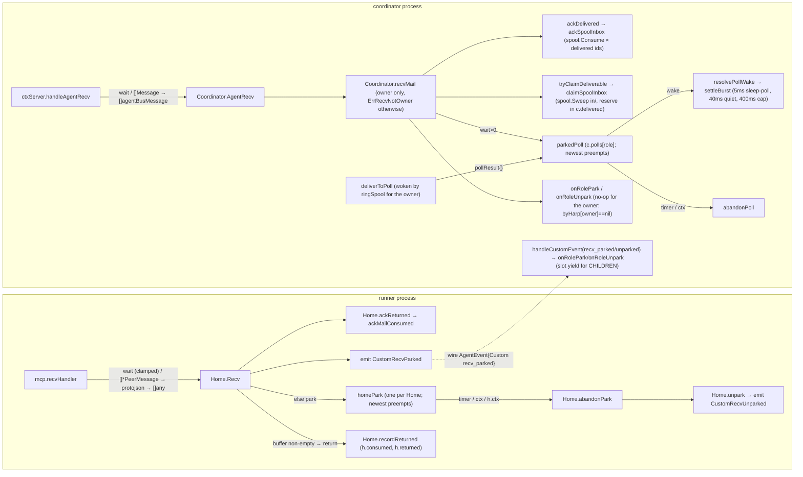

### G4 — `agent_run` → launch → StartRun

```mermaid
flowchart LR
  subgraph entry["entry (either surface)"]
    SSA["Coordinator.serveSpawnAgent (plane 2)"]
    HAR["ctxServer.handleAgentRun (local)"]
  end
  subgraph coord["coord.Coordinator"]
    ARN["Coordinator.AgentRun"]
    RES["Spawner.Resolve → *SpawnPlan"]
    ASN["Spawner.AssignSession → harp"]
    SRU["Coordinator.spawnReachURL → ReachURL(runtimeAxis)"]
    EQ["Coordinator.enqueueRun"]
    MT["mintToken → (token, credHash)"]
    JX["runs.Exec(factRunEnqueued{RunID,Harp,Agent,ParentHarp,ParentRunID,Runtime,CredHash,Depth,OneShot,Prompt,Resume,Permission,MCPServers})"]
    RT[("childRt published in c.attach / c.byHarp; slot TryAcquire")]
    RCD["Coordinator.runChild (goTracked)"]
    ARS["acquireRunSlot (blocking on c.slots)"]
    LC["launchContext(harp) → lctx, lcancel"]
    RVS["Coordinator.runChildViaStartRun"]
    SE["Spawner.StartEngine(plan, childEnv, runnerEnv) → *EngineSpawn{Kill, Wait, StderrTail, WorkDir, Env, MCPServers, Model}"]
    BHS["buildHarnessSpec(HarnessSpecInput) → *HarnessSpec"]
    ISR["Coordinator.issueStartRun"]
    AWR["awaitRunner(credHash) ← runnerReady chan"]
    WRE["watchRunnerExit(engine.Wait)"]
    SPE["startRunPayloadErr (guards empty first turn)"]
    RQR["requestRunner(credHash, RunnerRequest{StartRun{RunId,Harness,Input{prompt},Role,ParentRunId}})"]
    ATT["noteLaunchAttached + markAttached + recordHarnessSession"]
    FC["failChild → noteLaunchFailure + terminateRun(CauseLaunchFailed)"]
  end
  subgraph runner["runner process"]
    HOME["Home.runnerChannelLoop → DialRunner(RunnerHello{version,harnesses,active_run_ids})"]
    RL["RunnerLink.receiveLoop → serveRequest → Home.cfg.Engine = EngineHost.Handle"]
    EHS["EngineHost.startRun"]
    CHAT["agent.StructuredChat.Chat(ctx, dec.Chat, in, out)"]
  end

  SSA -- "caller, agentName, prompt, workspace, dirtyTreeHandler / *RunOutcome{Harp,RunID,Engine,Profiles,Runtime,Queued,Degraded}" --> ARN
  HAR --> ARN
  ARN --> RES --> ASN --> SRU --> EQ
  EQ --> MT --> JX --> RT
  ARN -- "rt, prompt, token, url" --> RCD
  RCD --> ARS --> LC --> RVS
  RVS -- "rt.plan, childEnv(harp), runnerEnv(harp, runID, token, url, depth, oneshot)" --> SE
  RVS --> BHS
  RVS -- "rt, hashToken(token) [RE-DERIVED], spec, first=JoinLeadBlocks(context,prompt), model, resumeSessionID / error IGNORED" --> ISR
  ISR --> AWR
  ISR --> WRE
  ISR --> SPE
  ISR --> RQR
  RQR -. "wire RuntimeFrame.request" .-> RL --> EHS --> CHAT
  SE -. "exec: runner env CTXLOOM_COORD_URL/CRED/RUN_ID/…" .-> HOME
  HOME -. "wire RunnerHello" .-> AWR
  ISR -- "ok" --> ATT
  ISR -- "any error" --> FC
  ARS -- "error" --> FC
  SE -- "error" --> FC
```

### G5 — dead-child detection and the exactly-once terminal

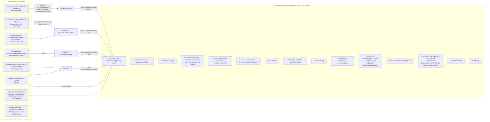

### G6 — shutdown (`Coordinator.Close`) and what it joins

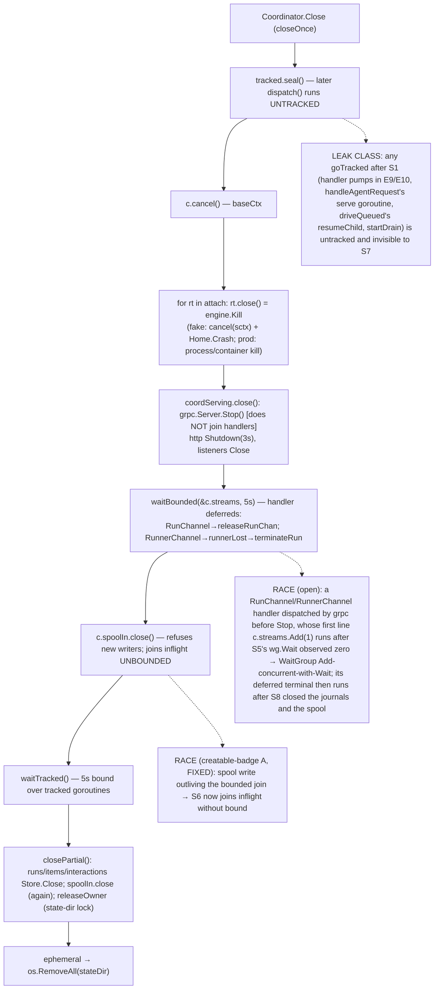

The second race is a structural consequence, not a timing accident: `c.streams` is a bare `sync.WaitGroup` incremented INSIDE the callee (the handler) with no `closing` flag, while `trackedGroup` twenty lines away in `tracked.go` exists precisely to make Add-after-seal safe. Two join mechanisms for one problem (F-DUP-6). What settles it: either `grpc.WaitForHandlers(true)` on the server so `Stop` joins handlers (then `c.streams` is deleted), or a sealed counter the handlers consult and refuse on (`Unavailable`) after `Close` begins.

## 2b. State machines and goroutine ownership (seam-specific graphs)

### SM1 — a child run (fold state `RunRecord.State` + runtime `childRt.slot`)

```mermaid
stateDiagram-v2
  [*] --> Enqueued: AgentRun / resumeChild → enqueueRun (factRunEnqueued; TryAcquire slot)
  Enqueued --> Queued: slot not held (RunOutcome.Queued)
  Enqueued --> Executing: runChild → acquireRunSlot ok → setState(StateExecuting)
  Queued --> Executing: slots.Acquire (FIFO) returns
  Executing --> Executing: runChildViaStartRun → StartEngine → issueStartRun (awaitRunner ≤ runnerAwaitTimeout) → markAttached
  Executing --> Ended: failChild (CauseLaunchFailed) — StartEngine / dial-home / StartRun refused / empty payload
  Executing --> Idle: CustomTurnIdle → onTurnIdle (persistent child; slot yielded)
  Executing --> Ended: CustomTurnIdle → oneShotReady → terminateRun(CauseOneShotBoundary)
  Executing --> Parked: CustomRecvParked → onRolePark (slot released)
  Parked --> Executing: CustomRecvUnparked → onRoleUnpark (blocking re-acquire)
  Idle --> Executing: CustomTurnStarted → onTurnStarted (claimSlotIntent → Acquire)
  Idle --> Ended: runDrain (between turns) / stopRun
  Executing --> Ended: RunExited / RunnerChannel loss / heartbeat loss / agent_stop / drain force / FINAL report
  Parked --> Ended: drainPark (unless parkIsWait) / stopRun
  Ended --> Enqueued: resumeChild wins claim (fresh run_id, same harp) — armed by relaunchForLeftoverMail (backoff, bounded) OR driveQueued (delay 0, clears gate)
  Ended --> [*]: reapEndedRuns (non-current, beyond tail/age) — journaled factRunReaped
```

Notes: (1) `Ended` is BOTH a terminal and a resumable state; the harp's *current* run stays `Ended` between one-shot turns, which is why `stopRun` on it reports "had already ended". (2) The owner run (`StartOwnedRun`) enters `Executing` via `setState` WITHOUT `acquireRunSlot`, so it never occupies a slot and never passes through `Queued`.

### SM2 — a mail item (one message, both substrates)

```mermaid
stateDiagram-v2
  state "child → parent" as up {
    [*] --> OutFile: Home.sendPeerViaSpool → spool.Writer.Write(out/) [fsync] + ringSpool (AgentFrame.spool_changed, drop-counted)
    OutFile --> Swept: coordinator sweepChildOut (doorbell mark | reattach mark | periodic tick | startup pass)
    Swept --> Routed: routeSpoolOut → peerSend (ask-reply intercept; SenderMailKind; childSend lineage) → queueMailPayload
    Routed --> OwnerInFile: mailCourier.Send → spool.Writer.Write(owner in/) [NEW id] + ringSpool→deliverToPoll
    Routed --> OutFailed: refused → replySpoolRefusal (to sender) + noticeSpoolDrop (to parent) + spool.Fail(out/failed/)
    OwnerInFile --> OutConsumed: consumeSpool(out/→out/consumed/)
    OwnerInFile --> Claimed: AgentRecv → claimSpoolInbox (reserve id in c.delivered; remember ref)
    Claimed --> Returned: recvMail returns []Message (+settleBurst)
    Returned --> InConsumed: NEXT AgentRecv → ackSpoolInbox → spool.Consume(in/→in/consumed/); unreserve
    Claimed --> OwnerInFile: coordinator crash before ack → re-read under same id
  }
  state "parent → child" as down {
    [*] --> InFile: ownerSend/steer/notice → queueMailPayloadID → mailCourier.Send (child in/) + ringSpool (CoordinatorNotice.spool_changed, non-blocking)
    InFile --> Delivered: Home.sweepSpoolIn (doorbell | reattach | turn boundary | tick | startup) → mailFromSpool → peerMessageProto → deliverNotice (dedupe h.consumed/turnPending/buffer)
    Delivered --> TurnQueued: no park ∧ turn sink → turnQ
    Delivered --> Buffered: else h.buffer; completes parked Recv; else terminalNudge
    TurnQueued --> Accepted: turnPump → sink → EngineHost.enqueueTurn → in chan (engine stdin)
    Accepted --> InConsumed: ackMailConsumed → spool.Consume + Announce('consumed') doorbell → coordinator sweepChildConsumed → noteMailConsumed (budget forgiven)
    Buffered --> ReturnedToHarness: Home.Recv returns; recordReturned
    ReturnedToHarness --> InConsumed: NEXT Home.Recv (ackReturned) or Home.Close → ackMailConsumed
    TurnQueued --> Buffered: sink returned false (engine gone)
    InFile --> InWithdrawn: WithdrawSteer (rename wins) → ErrSteerAlreadyDelivered if lost
    InFile --> InFailed: unparseable / unknown kind → failSpoolEntry (spool.Fail)
    InFile --> InFile: Home.exited → sweep skipped; file belongs to the NEXT run (resume) 
  }
```

### Goroutine ownership graph

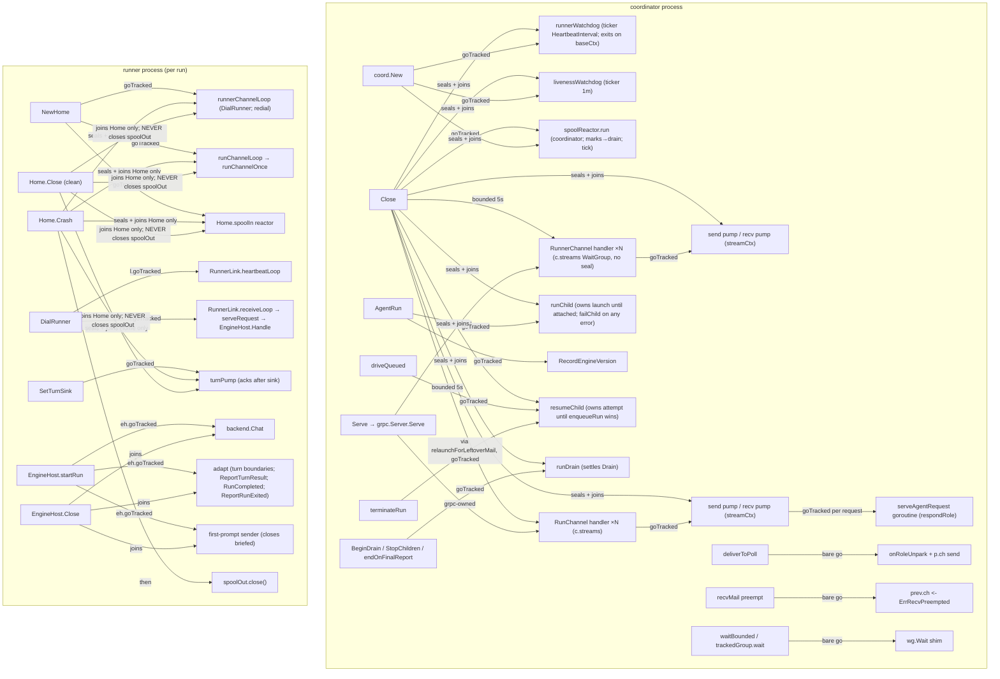

Who closes what: `Coordinator.Close` owns journals, spool `in/` writers, listeners, the state-dir lock; `terminateRun` owns `childRt` detachment, the engine kill, the runner session, the run channel, the parked poll; `Home.Crash`/`Home.Close` own the conn and Home's loops; `EngineHost.Close` owns the chat goroutines — but nothing in production calls `EngineHost.Close` from the coordinator's kill path (the fake's `kill` is `cancel + Home.Crash`), so the engine host's goroutines are joined only by context cancellation, not by a wait (see Uncertainties U3).

## 3. Delegation / layer graph

Solid arrows = the direction the stated architecture expects (README package map + `layering_test.go` + `doc.go`). Dashed red = against or past a layer. Dotted = hidden coupling (env / filesystem / global) rather than an import.

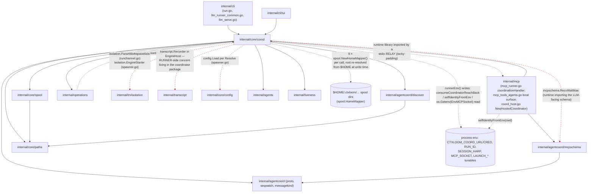

Reading the graph:

- **Layer rule status.** `coord-must-not-import-cli/tui` holds (`go list` shows no `internal/cli` import from coord at all). The README's "`discover` is a leaf" holds. `operations` does not import coord — holds.
- **The package is two programs in one import path.** Every file under `coord/` compiles into BOTH the coordinator process and the runner process: `Home`, `EngineHost`, `RunnerLink`, `spoolturnresult.go`, `enginehost_control.go`, and half of `spooldelivery.go`/`spooldoorbell.go` run only in the runner; `Coordinator`, `grpcserver.go`, `httpserver.go`, `children.go`, `drain.go`, `ownerrecv.go`, `spoolowner.go` run only in the coordinator. The shared vocabulary (`Message`, mail kinds, `spoolCourier`, the proto conversions) is the legitimate common core. Nothing enforces which side a symbol belongs to; `transcript` and `isolation` are pulled into the coordinator binary's dependency closure by runner-side code (F-ML-1).
- **The relay-as-owner edge** (dotted, coord → mcp) is the tacky-padding boundary: `doc.go` blesses it ("as the orphaned-orchestrator fallback, a bare `ctxloom mcp`"), the row rules it a defect.

## 3b. Data-flow graphs

### DF1 — a mail item (created → transformed → consumed)

```mermaid
flowchart LR
  A["PeerSendRequest (proto)<br/>from LLM args via protojson"] -- "to_agent_id|to_role → to; kind (enum) → LegacyKindName; text; structured (Struct→json)" --> B["coord.Message{From:h.cfg.Harp, To, Kind, Body, Structured, InReplyTo}<br/>ID: EMPTY"]
  B -- "spoolMessageForMail: Kind→SpoolKindForMail; OriginID:=ID (empty)" --> C["spool.Message (yaml head + body)"]
  C -- "Writer.Write: seq from highestSeq() dir scan; name &lt;seq&gt;.&lt;writerID&gt;.md; tmp→rename→fsync" --> D[("child out/&lt;seq&gt;.&lt;harp&gt;.md")]
  D -- "spool.Sweep → Entry{Ref, Message}" --> E["spool.Entry"]
  E -- "mailFromSpool(e, role): ID := OriginID || stem; From := DIRECTORY (frame from_harp ignored)" --> F["coord.Message #2"]
  F -- "peerSend → childSend: parent := runsF.currentRun(caller).ParentHarp" --> G["queueMailPayload: ID := newMessageID() (RE-MINTED)"]
  G -- "Writer.Write (in/ writer id 'coord')" --> H[("owner in/&lt;seq&gt;.coord.md")]
  H -- "claimSpoolInbox: Sweep → mailFromSpool; reserve id in c.delivered; c.spoolRefs[id]=ref" --> I["coord.Message #3"]
  I -- "handleAgentRecv: → agentBusMessage{message_id, from, kind, body, structured|structured_error}" --> J["JSON to the LLM"]
  I -- "NEXT recv: ackSpoolInbox → spool.Consume(ref)" --> K[("owner in/consumed/")]
  D -- "consumeSpool after route" --> L[("child out/consumed/")]
```

Smells on this path (each is a finding below): the id changes at G (F-DF-1); `From` is overwritten at E by design but the file still carries a `from_harp` nobody may trust (documented, fine); `Kind` is converted three times (`enum → legacy name → spool kind → mail kind`) through `messagekind.go` + `mailkind.go` (F-DF-3); the structured payload is `Struct → json → spool yaml → json → map` with `deliverableStructured`/`spoolStructured`/`mailStructured` as three hand-written projections (F-DF-3).

### DF2 — a run record and its runtime twin

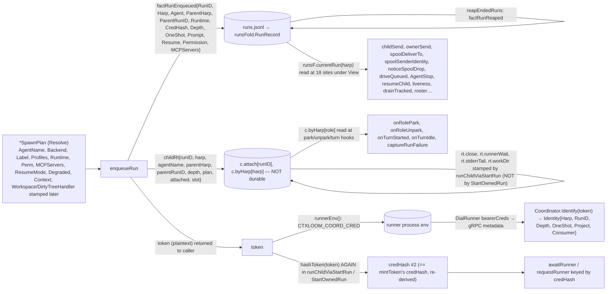

Smells: the same run is addressed by `runID` in `c.attach` and by `harp` in `c.byHarp` and by `credHash` in `c.runners`/`c.runnerReady` and by `harp` again in `c.chans`/`c.polls`/`c.launches`/`c.delivered`/`c.spoolSeen` — eleven maps on `Coordinator` keyed three ways for one entity — `attach`(runID), `byHarp`/`chans`/`launches`/`launchArmed`/`spoolSeen`(harp), `polls`/`delivered`(role=harp), `runners`/`runnerReady`(credHash), `reqTrack`(role+reqID) (F-DF-4); the plaintext `token` travels `enqueueRun → AgentRun → runChild → runChildViaStartRun → runnerEnv` as a positional string among four other strings (F-DF-5).

## 4. Findings (ranked by blast radius)

Each finding: category · sites by symbol+file · what it costs · what settles it. Rows already recording a defect are cited by harp rather than re-derived.

### F1 · STATED-VS-ACTUAL · the architecture docs describe the retired bus
**Sites:** `docs/architecture/agentcoord/*.md` (base `0f59fbae`, 6218 commits behind); `coord/doc.go`.
**What is wrong:** `mailbox.md`, `child-lifecycle.md`, `overview.md`'s plane table and invariants I5/I6 describe `mailbox.go`, `pushMail`, `bridgeTurnResult`, `driveChild`, `queueMail → factMailQueued`, the plane-3 `peer_message` push — all deleted by `7750d8eeb`. `doc.go` still lists "role mailboxes" among the CQRS stores, blesses the bare-`ctxloom mcp` fallback (tacky-padding rules it a defect), and says the coordinator "does NOT broker an approval UI" while `pendingapproval.go`, `mailkind.go`'s approval kinds and `resolveAskReply` exist. Inside the live code the stale pointers continue: `spooldelivery.go` SCOPE comment ("steer, question, summarize, pause/resume, approvals … still ride the mailbox and the request plane" — `spoolcontrol.go` says the opposite), `spooldelivery.go` ("claimSpoolInbox / ackSpoolInbox in mailbox.go" — they live in `spoolowner.go`), two comments citing `servePeerSend` and one citing `relayApproval` (neither exists), `spoolowner.go` ("the same runtime ledger the mailbox uses"), `runnerHeartbeatProbe`'s "legacy chat path" detail string, `mcp.recvHandler`'s "park against the Home's notice buffer".
**Blast radius:** every reader (human or agent) who starts from the docs designs against a topology that does not exist; the human-authored `overview.md` divergence index is itself now a list of divergences that were fixed (RevokeSessionOwner is called from `cli/run.go`; `issueStartRun` derives its ctx from the cancellable launch ctx; `startRunPayloadErr` guards the empty first turn; `RunOutcome.Queued` is read before dispatch; `stopRun` unifies the two stop bodies).
**Settles it:** delete `docs/architecture/agentcoord/` (prefer deletion to correction per the project's own rule), and add an arch test that fails when any `docs/architecture/**` or `coord/*.go` comment names a symbol `gopls` cannot resolve — the checked binding the docs never had.

### F2 · MISSING LAYER · participant vs owner is not a type (row `tacky-padding`, To Do, ruled)
**Sites:** `mcp.newAgentDelegation` → `mcp.NewHostedCoordinator` (`internal/mcp/mcp_tools_agents.go`, `coord_host.go`); `coord.doc.go`; `coord.New` (`acquireStateDir`, `openJournals`, `startSpoolReactor`, `runnerWatchdog`, `livenessWatchdog`).
**What:** nothing in `coord`'s types distinguishes a process that OWNS the state dir from one that merely relays; `coord.New` is the only constructor and it stands up everything. The runner-hosted path (`coordinationHandler` over `Home`) already never touches this. Not re-derived here — the row has the reproduction and the ruling ("ONE coordinator per project, hosted by a RUNNER").
**Settles it:** the row's own settle clause (a shim with no runner constructs nothing — asserted on the absence of the lock and journals).

### F3 · DUPLICATION + MISSING LAYER · the parked long-poll with late ack exists twice
**Sites:** coordinator: `Coordinator.recvMail`, `parkedPoll`, `resolvePollWake`, `settleBurst`, `abandonPoll`, `severPoll`, `deliverToPoll`, `claimSpoolInbox`, `ackSpoolInbox`, `c.polls`, `c.delivered`, `c.spoolRefs` (`ownerrecv.go`, `spoolowner.go`). runner: `Home.Recv`, `homePark`, `abandonPark`, `unpark`, `deliverNotice`, `recordReturned`, `ackReturned`, `ackMailConsumed`, `rememberSpoolRef`/`takeSpoolRef`, `h.buffer`, `h.consumed`, `h.returned`, `h.spoolRefs` (`home.go`, `spooldelivery.go`).
**What:** both sides implement "one parked poll per reader, newest preempts, a delivery that raced the abandon is authoritative, the batch is acked one receive late by a consume-rename, ids map to spool refs". The runner's is the more complete (dedupe on `consumed`/`turnPending`/`buffer`, a turn sink, `AwaitMailAcked`); the coordinator's has the burst-settle sleep loop the runner lacks. The two drift already: `Home.abandonPark` requeues a raced delivery, `abandonPoll` re-claims from disk; the owner acks via `unreserve`, the runner via `Announce("consumed")`. Because `recvMail` refuses every role but the owner and the owner has no `childRt`, its `onRolePark`/`onRoleUnpark` calls are permanent no-ops — residue of the deleted mailbox path where children also parked here.
**Missing layer:** a `spoolInbox` type (mapper, harp, reserve/park/ack) instantiated once by `Coordinator` for the owner and once by `Home` for the run; `deliverNotice` and `deliverToPoll` collapse into its `wake`; `claimSpoolInbox`/`sweepSpoolIn` into its `sweep`; `ackSpoolInbox`/`ackMailConsumed` into its `ack`.
**Settles it:** the extraction, with the existing `spoolowner_test.go` and `home_*_test.go` both driving the one type; delete the owner-side park hooks.

### F4 · DIVERGENT PATHS · owner run vs child run launch
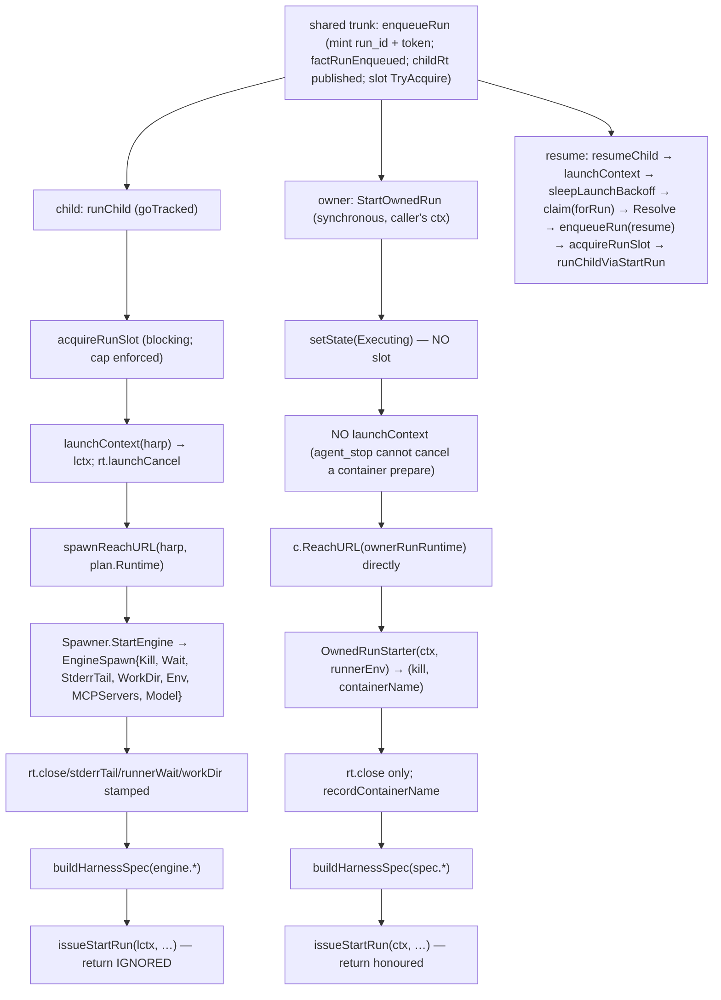
**Steps the owner branch skips:** slot admission (the cap is not a cap for owner runs), `launchContext` registration (so `cancelLaunch`/`stopRun` cannot abort an in-flight owner launch), `RecordEngineVersion`, `runnerWait`/`stderrTail`/`workDir` stamping (so `issueStartRun`'s `watchRunnerExit(nil)` returns nil and a dying owner runner reports "never dialed home" instead of its exit reason; `terminateRun`'s stderr-tail fallback is empty), the tracked-goroutine dispatch. **Steps the child branch skips:** honouring `issueStartRun`'s error (`_ =`), `recordContainerName`. `SendOwnedRunTurn` is a self-addressed `queueMail(rt.harp, rt.harp, "message", …)` — a message whose sender and recipient are the same harp, which `spoolDeliverTo` accepts only because `byHarp[harp]` exists.
**Settles it:** one `launch(rt, engine launcher)` tail that both callers feed with an `EngineSpawn`-shaped value (the `OwnedRunStarter` returning `(kill, name)` is the narrower of the two and should widen to `EngineSpawn`), then a test that an owner run occupies a slot and that `agent_stop` on an owner run cancels its launch.

### F5 · DIVERGENT PATHS · two MCP surfaces for one verb set, two resume arms
**Sites:** `mcp.coordinationHandler` + `mcpschema` (generated, protojson) vs `ctxServer.handleAgentRun/Send/Recv/Stop` + hand-typed `agentRunInput`/`agentSendInput`/`agentRecvInput`/`agentBusMessage` with hand-written descriptions (`mcp_tools_agents.go`); `Coordinator.driveQueued` vs `Coordinator.relaunchForLeftoverMail` → `nextRelaunch` (`children.go`, `launchgate.go`).
**What:** (a) the local surface's `agent_run` description still says "Children execute serially (a spawn past the cap queues)" while `Coordinator.slots` admits `concurrencyCap` (default 4) concurrently; its `agent_recv` says "On timeout the call fails" which is the leaf verdict only; parity between the two schemas is pinned by ONE test for ONE field (`TestAgentRecvWait_StdioSchemaDescribesTheSameBounds`). The runner-hosted surface returns proto-named JSON (`message_id`, `in_reply_to`), the local one returns `agentBusMessage` with `structured_error` — the same tool answers in two shapes depending on which process served it. (b) The two resume arms are a designed asymmetry (an explicit send lifts a stop and resets the budget; the automatic tail is bounded) but each hand-rolls `armLaunch(harp)` + `goTracked(resumeChild(...))`; the creatable-badge residual ("launched an engine for nothing") lived exactly in this pair.
**Settles it:** (a) delete the local surface with F2 (a relay never serves these tools); until then generate its schema from `mcpschema` too. (b) one `armResume(harp, forRun, delay, lift bool)`.

### F6 · DUPLICATION · two stream-session scaffolds and two join mechanisms — the open shutdown race
**Sites:** `coordService.RunnerChannel` (`grpcserver.go`) and `coordService.RunChannel` (`runchannel.go`): Identify → first Recv → Hello check → HelloAck → `streamCtx` → newest-wins registration → send pump → recv pump → `select`. `c.streams sync.WaitGroup` + `waitBounded` (`coordinator.go`, `tracked.go`) vs `trackedGroup` (`dispatch`/`seal`/`wait`, `tracked.go`).
**What:** the two handlers are one abstraction (a credentialed bidi session with a registry slot and two pumps) written twice; the second copy already differs (RunnerChannel refuses under drain with no active runs; RunChannel marks the spool reactor; the deferred teardown terminates in one and only releases in the other — correct, but expressed as two bodies). `c.streams` is incremented by the callee with no seal, which is the exact misuse `trackedGroup` was written to prevent; `grpc.Server.Stop` does not join handlers (`WaitForHandlers` unset), so a handler dispatched before `Stop` can run `c.streams.Add(1)` after `waitBounded`'s `Wait` observed zero. That is the `TestEnqueueRun_ChildMCPServers_JournalDisjointPerAgent` race recorded in `night-20260918.report.md` (1 in 12–20 under `-race`): `waitBounded`'s `wg.Wait` vs `_CoordinatorService_RunChannel_Handler`. After it, that handler's deferred `releaseRunChan`/`runnerLost → terminateRun` runs against closed journals and a closed spool.
**Settles it:** `grpc.WaitForHandlers(true)` in `grpcServer()` and delete `c.streams`+`waitBounded`; or route handler registration through a sealed counter that answers `Unavailable` once `Close` has begun. Then a `bidiSession` helper both handlers call. Test: the named test under `-race -count=50`.

### F7 · DUPLICATION · five death detectors, one of them narrating instead of acting
**Sites:** `handleRunExited`; `RunnerChannel`'s deferred `runnerLost`; `runnerWatchdog → checkRunnerLiveness`; `issueStartRun`'s `watchRunnerExit`/`awaitRunner` timeout → `failChild`; `recordSummary(SCOPE_FINAL) → endOnFinalReport`; plus `livenessWatchdog → runnerHeartbeatProbe` (`liveness.go`) which evaluates the SAME `now − rs.lastBeat > runnerLossTimeout` as `checkRunnerLiveness` but only warns, once a minute, and whose detail string names "the legacy chat path".
**What:** all five funnel into `terminateRun` (I6 holds), so correctness is fine; the cost is that "is this runner dead" has two clocks and two owners, and the warn-only one can fire for a runner the acting one already terminated (it then reads "no runner connected", which is true and useless). `checkRunnerLiveness` deletes from `c.runners` before `runnerLost` — a heartbeat that arrives in between is dropped on the floor by the recv pump's `rs.lastBeat` write to an unregistered session.
**Settles it:** the liveness probe reads `checkRunnerLiveness`'s verdict (or the roster's terminal cause) instead of recomputing it; delete the string.

### F8 · MISSING LAYER · `terminateRun` decomposed on paper (row `unmoral-mocha`, ruled LEAVE IT; this is the paper)
`terminateRun` (`children.go`) does fifteen things; they fall into four layers the function currently flattens:

| Layer | Jobs today | Proposed seam |
|---|---|---|
| **Journal claim** (exactly-once) | `runs.Exec` claim `factRunEnded`; `sampleExecGauge`; `audit(run_terminal)` | `claimTerminal(runID, cause, detail) (rec RunRecord, won bool)` — the ONLY place I6 lives |
| **Runtime detach** (everything keyed by the run) | `clearReqTrack`; `drainTerminalTail` (RunnerExit only); `c.attach` delete + read `close`/`launchCancel`/`runFailure`/`stderrTail`; sever `c.runners[credHash]`; `releaseSlot`; `closeFn()`; `launchCancel()`; `severPoll`; `severChan` | `detachRuntime(rec, cause) detached{closeFn, launchCancel, runFailure}` — pure bookkeeping under `c.mu`, then the two side effects; the eight maps of F-DF-4 all get released HERE and nowhere else |
| **Notification** | the three-branch `kind, body` composition and `queueMail(harp → parent)` | `composeTerminalNotice(rec, cause, detail, runFailure) (kind, body string, due bool)` — pure, testable without a coordinator; `due=false` for `CauseOneShotBoundary` and empty parent |
| **Lifecycle policy** | `spawner.MarkSessionEnded`; `relaunchForLeftoverMail`; `reapEndedRuns`; `drainWake` | `afterTerminal(rec, cause, detail)` — the part that decides what the harp does NEXT, which is also the part that `driveQueued` duplicates (F5b) |

The CCN comes almost entirely from the cause branches in layers 2 and 3 (`cause == CauseRunnerExit`, `rt != nil`, `runFailure == "" && stderrTail != nil`, `rs != nil`, `closeFn != nil`, `launchCancel != nil`, `ParentHarp != "" && cause != OneShotBoundary`, `CauseLaunchFailed`, `detail != ""`, `!Contains(body, runFailure)`). Splitting along the table gives four functions each under the gate without changing behaviour. Not to be done as gate work (the ruling); worth doing when F5b's `armResume` is extracted, because `afterTerminal` is its natural home.

### F9 · DATA-FLOW SMELLS (each cited)
- **F-DF-1 · the message id changes at the routing hop.** `Home.sendPeerViaSpool` tells the child `MessageId = ref.Name stem`; the file carries `origin_id: ""`; `mailFromSpool` derives the stem; `childSend → queueMailPayload` mints `newMessageID()` for the parent's copy. `queueMailPayloadID` exists to preserve an id (`relayApproval` forced it, per its own comment) and `childSend` does not use it. Cost: a parent's `in_reply_to` names an id the child never saw; the auto-report correlation (`spoolturnresult.go`) works only because it correlates on the PARENT-minted id the child's `in/` file carries, i.e. the two halves of the conversation use different id spaces. Settle: `childSend` passes `msg.ID` through `queueMailPayloadID`; a test that the id a child is told equals the id its parent receives.
- **F-DF-2 · a constant threaded as a return.** `queueMailPayloadID` documents "completed is always false"; `ownerSend` branches on it ("completed the child's waiting agent_recv"); `AgentSend` then discards `msgID` and returns only `disposition`. Settle: drop the bool from the signature; the dead branch goes with it.
- **F-DF-3 · one message, three kind vocabularies and three structured projections.** `agentcoordpb.MessageKind` (proto enum) → `LegacyKindName` → `SenderMailKind`/`MailKinds` (`mailkind.go`) → `SpoolKindForMail`/`MailKindForSpool` (spool strings); payload: `spoolStructured`, `mailStructured`, `deliverableStructured` (`spooldelivery.go`) — hand-written, each with its own error text. Settle: one `MailKind` type with `String()`/`Parse` and proto/spool codecs beside it; one `structured` codec.
- **F-DF-4 · eleven maps keyed three ways** (`attach` by runID; `byHarp`, `chans`, `launches`, `launchArmed`, `spoolSeen`, `polls`, `delivered` by harp; `runners`, `runnerReady` by credHash; `reqTrack` by harp+reqID). A run's teardown must visit all of them (see F8 layer 2); `reapEndedRuns` bounds only the fold. Settle: a `runtimeRun` record owned by one map keyed by runID with harp and credHash as indexes.
- **F-DF-5 · the plaintext token is a positional string.** `enqueueRun` returns `(rt, token, err)`; `AgentRun → runChild(rt, prompt, token, url) → runChildViaStartRun(ctx, rt, prompt, token, url, resumeSessionID, contextText)` — three or five adjacent strings; `hashToken(token)` is recomputed there although `mintToken` already returned `credHash` (dropped by `enqueueRun`). Settle: `enqueueRun` returns a `credential{token, hash}`; `childRt` carries the hash.
- **F-DF-6 · ignored returns.** `runChildViaStartRun`: `_ = c.issueStartRun(...)`; `Home.send` discards `trySend`'s bool at every call (`runChannelOnce`'s replay, `emitEvent`, `Request`); `consumeSpool`: `_ = done`.
- **F-DF-7 · hidden inputs.** `spool.NewHomeMapper()` constructed at 9 production sites (5 in `spooldelivery.go`) so the spool root is re-resolved from ambient `$HOME` per call — the very property `Coordinator.Close`'s comment has to defend against ("a write that escapes teardown … lands in whatever `$HOME` names by then"); `EngineHost.startRun` reads `os.Getenv(EnvMCPSocket)`; `mcp.selfIdentityFromEnv(cwd)`; `resolveLaunchTunables` reads `CTXLOOM_LAUNCH_*`; `prodSpawner.resolveCfg` re-reads `config.yaml` per `Resolve` while `prodSpawner.gate` was built from the construction-time `cfg` — two configs feed one spawn (catchy-easing's stale-binary window is a cousin of this). Settle: `PathMapper` becomes a field of `Coordinator` and `Home` (already is for the writer caches — `spoolWriterCache.mapper` — but not for sweeps/consumes/fails).
- **F-DF-8 · the same value under two types.** `Identity` (coordinator) vs `HomeConfig{Harp, RunID, Depth}` (runner) vs the runner env trio; `RunRecord` vs `childRt` (durable vs runtime twin, keyed differently); `spool.Ref` vs `SpoolChanged` proto (fine — a codec) vs `Message.ID` (a stem).

### F10 · WORKAROUNDS (each an unfiled bug unless a row is cited)
| Site | Quote / value | Why it is a workaround |
|---|---|---|
| `terminalDrainWindow` (`runchannel.go`) | `500 * time.Millisecond`; `drainTerminalTail` waits `ch.completed` OR the window | a timed wait for a deterministic event (`run_completed`) that the runner is "contractually guaranteed to have just attempted"; if the guarantee held, the timer is dead code; if not, 500 ms is a guess |
| `settleBurst` (`ownerrecv.go`) | `mailSettleQuiet 40ms / mailSettleTick 5ms / mailSettleCap 400ms` sleep-poll | polls the directory instead of being told; the runner side has no equivalent, so the two readers differ in latency shape by design of a sleep |
| `closeJoinBudget` (`coordinator.go`) | `5s`; "a leaked goroutine may still touch the state dir" | admits the leak class of F6/R3; the budget is the tuning knob the creatable-badge text warned against |
| `mailAckFlushBudget` (`enginehost.go`) | `5s`; "exiting with N delivered turn(s) not yet marked consumed … the coordinator may relaunch this harp for mail it already answered" | the consume-rename is local and fast; a 5 s bound on it exists because `ackMailConsumed` runs on the pump goroutine and nothing joins it |
| `responseQueueWindow` (`runchannel.go`) | `5s`; `respond` tries a non-blocking send, then a goroutine waits up to 5 s and DROPS the response ("the runner's request fails at its own timeout — only a reconnect reissues it, and the cached response is re-delivered then") | a plane-2 answer can be lost because a 64-slot pump is full; the retry is the runner's reconnect, i.e. a transport reset used as flow control |
| `ackThrough` (`runchannel.go`) | non-blocking `select { case ch.send <- frame: default: }` | an Ack dropped when the pump is full → the runner's `awaitAck` waits its budget; "re-ack the durable watermark: the runner may have missed it" is the retry for this drop |
| `Home.send` (`home.go`) | `_ = h.trySend(frame)` | every event/request send is fire-and-forget; correctness rides on reissue-after-reconnect |
| `sweepChildConsumed` (`spooldelivery.go`) | "there is no retention prune of consumed/ yet, which is what makes the set necessary" | `c.spoolSeen[role]` grows with every delivered message for the process lifetime; the comment files the bug in prose |
| `sendPeerViaSpool` (`spooldelivery.go`) | "The guards duplicated from servePeerSend … are duplicated ON PURPOSE" | the referent is deleted; the duplication is now with `peerSend`/`queueMailPayloadID`, and the two already disagree (kind check skipped when `InReplyTo` set, one hop later refused by mail) |
| `HelloAck.CommittedSeq: hello.GetResumeFromSeq()` (`runchannel.go`) | echoes the runner's own claim | the proto calls this "the authoritative resume cursor"; the coordinator has `ch.flushedSeq` and does not use it here |
| `Home.Close` vs `Home.Crash` (`home.go`) | only `Crash` closes `spoolOut` | a clean close leaves the writer cache open; harmless in production (process exits) and a trap for any in-process host |
| `var loadConfig = config.Load`, `var prepareAgentChat = …` (`spawner.go`) | package-level test seams | the project rule is DI, not globals |
| `runnerHeartbeatProbe` detail | "no runner connected (legacy chat path, or not yet dialed home)" | the legacy path is deleted |
| `PublishEvents` (`publish.go`) | in-process fallback, zero production callers | dead production surface kept for tests |
| `awaitChildUp`/`launchArmed`/`armLaunch`/`markAttached` (`children.go`) | "zero production callers (its own doc says so)" | a launch-settlement subsystem that exists for tests; `armLaunch` is nonetheless on the production resume path via `driveQueued` |
| `CapPeerMessaging` advertised in both Hellos | mail rides files; the capability gates nothing that survives | a capability string with no consumer |

### F11 · STATED-VS-ACTUAL (smaller)
- `coordination.proto` admits `AgentRequest.{approval, user_input, peer_send}`; `serveAgentRequest` serves none of them (`peer_send` → `Unimplemented` with a version-skew message; the other two → the default arm). The proto is the LLM-facing contract via `mcpschema`; check seam 2 for whether the schema generator still projects them.
- `RunnerHello.version` IS sent by `DialRunner` (row `exposable-rental` says it is not); `coordService.RunnerChannel` never reads it — so the half of the row that matters (mismatch behaviour) still stands and the other half is stale.
- `ListRunsResult.RunInfo` has `phase` and `latest_summary` and no terminal cause/detail; a child that died at launch shows `ended` with nothing else (row `catchy-easing`, second half, confirmed).
- `GLOSSARY.md`/`doc.go` D3 "children never prompt … the coordinator does NOT broker an approval UI" vs `pendingapproval.go` + `resolveAskReply` + `mailkind.go`'s approval kinds. Which is the contract is a human question (row `abnormal-ability` is building the elicitation path).
- `docs/architecture/agentcoord/child-lifecycle.md` says `OwnerRunSpec`/`OwnedRunStarter` let coord "spawn a runner without importing `lm/isolation`"; coord imports `lm/isolation` today (`isolation.ParseWorkspaceAxis` in `runchannel.go`, `isolation.EngineStarter` in `spawner.go`).
- Row `dreamless-ebony` (ruled: silent disconnect IS the contract; docs-only): the seam comment at `grpc.InstallRunnerTeardown` was not checked by this analyst (outside `agentcoord`); `coordService.RunnerChannel`'s deferred `runnerLost("RunnerChannel disconnected")` is the coordinator half of that contract and carries no pointer to the ruling.

### F12 · LAYER BYPASS
- `coord` → `internal/transcript` from `EngineHost.startRun`/`enqueueTurn`: transcript recording is a runner-process concern (seam 7) compiled into the coordinator's package; the coordinator binary links the recorder it never uses.
- `coord` → `internal/agentcoord/mcpschema` for one constant (`RecvWaitMax`): the runtime importing the LLM-facing projection to clamp a wait; the constant belongs in `coord` (or `agentcoord`) with `mcpschema` importing it, which is the direction the README draws.
- `coord.EngineHost.startRun` → `injectMCPSocketEnv(dec.Chat.MCPServers, os.Getenv(EnvMCPSocket))`: the runner rewrites the child's MCP server env inside the coordination package, reading the socket from its own env; the row `tacky-padding` documents the consequence when the env is absent.

## 5. Signatures that matter (verbatim), with input / output / hidden-input annotations

**Construction and lifecycle — `coord/coordinator.go`, `httpserver.go`, `drain.go`**
```go
type Options struct {
	Cfg *config.Config; ProjectDir string; ProjectKey string; StateDir string
	Spawner Spawner; Starter StarterFunc; Clock func() time.Time
	ConcurrencyCap int; Depth int; EndedRunTail int; EndedRunMaxAge time.Duration
	RunnerAwaitTimeout time.Duration; OwnerHarp string; SpoolSweepInterval time.Duration
}
func New(opts Options) (*Coordinator, error)
func (c *Coordinator) Serve() error
func (c *Coordinator) Close()
func (c *Coordinator) BeginDrain() *Drain
func (c *Coordinator) RegisterSessionOwner(harp string) (token string, err error)
func (c *Coordinator) RevokeSessionOwner(token string)
func (c *Coordinator) Identify(token string) (Identity, bool)
```
INPUT: `Options` (all fields; `Spawner` nil ⇒ `newProdSpawner(opts.Cfg, opts.ProjectDir, opts.Starter)`). OUTPUT: a serving coordinator; the endpoint file (`discover.State`) written by `Serve`. HIDDEN: `New` reads `CTXLOOM_LAUNCH_*` (`resolveLaunchTunables`), the state-dir lock file (`acquireStateDir`), the four journals from disk (`openJournals` + `adopt`), and the spool tree via `$HOME` (`startSpoolReactor`'s first pass). `Serve` reads the container runtime to pick a reach address (`preferredContainerRuntime`, `containerReachIPs`). `Close` writes/removes under `stateDir` and the spool root.

**The verbs — `coordinator.go`, `children.go`, `drain.go`, `owner_run.go`**
```go
func (c *Coordinator) AgentRun(ctx context.Context, caller Identity, agentName, prompt, workspace string, dirtyTreeHandler operations.DirtyTreeHandler) (*RunOutcome, error)
func (c *Coordinator) AgentSend(caller Identity, to, kind, body string, structured json.RawMessage, inReplyTo string) (string, error)
func (c *Coordinator) AgentRecv(ctx context.Context, caller Identity, wait time.Duration) ([]Message, error)
func (c *Coordinator) AgentStop(caller Identity, harp, reason string) (string, error)
func (c *Coordinator) StopChildren(ctx context.Context, caller Identity, reason string) ([]StoppedChild, error)
func (c *Coordinator) StartOwnedRun(ctx context.Context, owner Identity, spec OwnerRunSpec, start OwnedRunStarter, prompt string) (*RunOutcome, error)
func (c *Coordinator) SendOwnedRunTurn(runID, text string) error
func (c *Coordinator) Inject(harp, text string) (string, error)
func (c *Coordinator) Roster() []RosterEntry
func (c *Coordinator) ListRuns(includeTerminal bool, role string) *agentcoordpb.ListRunsResult
func (c *Coordinator) WatchRuns(runIDs []string) (snapshot *agentcoordpb.ListRunsResult, events <-chan *agentcoordpb.AgentEvent, cancel func(), narrow func(runID string))
type Identity struct { Harp, RunID string; Depth int; OneShot bool; Project string; Consumer bool /* see identity.go */ }
```
`AgentRun` — INPUT: `caller` (depth/oneshot gate), `agentName`, `prompt`, `workspace`, handler. OUTPUT: `RunOutcome{Harp, RunID, Engine, Profiles, Runtime, Queued, Degraded}` fixed at enqueue; side effects: `runs.jsonl` fact, `childRt`, a tracked goroutine. HIDDEN: `Spawner.Resolve` re-reads `config.yaml`; `spawnReachURL` reads the listener set; `runnerEnv` reads nothing but WRITES the child's env. `AgentSend` — INPUT: all five; OUTPUT: disposition prose only (`msgID` dropped). HIDDEN: the recipient's spool root via `$HOME`. `AgentRecv` — INPUT: `wait`; OUTPUT: `[]Message`; HIDDEN: reads the owner's `in/` directory, `c.delivered`; SIDE EFFECT: acks the PREVIOUS batch (rename). `AgentStop` — OUTPUT prose; SIDE EFFECT `terminateRun`. `StartOwnedRun` — INPUT: `spec` (nine fields), `start`; OUTPUT `RunOutcome`; HIDDEN: `c.ReachURL(ownerRunRuntime)`; NOTE: no slot, no launch ctx. `Inject` — thin over `ControlSteer`.

**The spawn seam — `spawner.go`**
```go
type Spawner interface {
	Resolve(ctx context.Context, agentName string) (*SpawnPlan, error)
	AssignSession(projectDir, backend string) (string, error)
	RecordEngineVersion(ctx context.Context, harp, backend string)
	StartEngine(ctx context.Context, plan *SpawnPlan, env, runnerEnv map[string]string) (*EngineSpawn, error)
	ResumeContext(ctx context.Context, plan *SpawnPlan, harp string) string
	MarkSessionEnded(harp string)
}
type StarterFunc func(backend string, runnerEnv map[string]string) isolation.EngineStarter
type EngineSpawn struct { WorkDir string; Env map[string]string; Model string; MCPServers []agent.ChatMCPServer; Kill func(); StderrTail func() string; Wait func() error }
type OwnedRunStarter func(ctx context.Context, spawnEnv map[string]string) (kill func(), containerName string, err error)
```
`StartEngine` INPUT: `plan` (God struct: 14 fields, of which `prodSpawner.chatRequest` reads Backend/Perm/MCPServers/Context/Workspace/DirtyTreeHandler/Profiles/Runtime — the caller cannot tell which), `env` (child ENGINE env), `runnerEnv` (reach-back trio + depth + oneshot). OUTPUT `EngineSpawn`. HIDDEN: `operations.PrepareAgentChat` (process/container exec). `OwnedRunStarter` is the narrower twin of `StartEngine` (F4).

**Runner side — `home.go`, `enginehost.go`, `runnerlink.go`**
```go
type HomeConfig struct { URL, Token, RunID, Harness, Version string; Engine RunnerRequestHandler; Capabilities []string; Harp string; Depth int; SpoolSweepInterval time.Duration }
func NewHome(ctx context.Context, cfg HomeConfig) (*Home, error)
func (h *Home) Request(ctx context.Context, req *agentcoordpb.AgentRequest) (*agentcoordpb.CoordinatorResponse, error)
func (h *Home) Recv(ctx context.Context, wait time.Duration) ([]*agentcoordpb.PeerMessage, error)
func (h *Home) Report(ctx context.Context, summary *agentcoordpb.Summary, artifacts []*agentcoordpb.ArtifactProduced) error
func (h *Home) SetTurnSink(sink func(*agentcoordpb.PeerMessage) bool)
func (h *Home) AwaitMailAcked(ctx context.Context, ids []string) error
func (h *Home) ReportRunExited(exitCode int, harnessSessionID string)
func (h *Home) Close(exitCode int, harnessSessionID string)
func (h *Home) Crash()
func NewEngineHost(ctx context.Context, backend agent.StructuredChat, harness, runID string) *EngineHost
func (eh *EngineHost) Handle(req *agentcoordpb.RunnerRequest) *agentcoordpb.RunnerResponse
func (eh *EngineHost) BindHome(h engineHome)
func (eh *EngineHost) Close()
func DialRunner(ctx context.Context, coordURL, token, runID, harness, version string, handler RunnerRequestHandler) (*RunnerLink, error)
```
`HomeConfig` is the runner's identity: INPUT from env by the caller (`consumeCoordinatorReachBack` in `cli/llm_runner_common.go`). `Request` — INPUT `req`; OUTPUT response; HIDDEN: `peer_send` is intercepted (`sendPeerViaSpool`) and never sent — the signature does not say so. `Recv` — HIDDEN: acks the previous batch; emits `recv_parked`/`unparked` events. `Handle(StartRun)` — HIDDEN: `os.Getenv(EnvMCPSocket)`, `transcript.NewRecorder` (writes under the session dir), decodes `HarnessSpec.config` (an opaque `Struct` carrying env/MCP/transcript policy — the reader `decodeHarnessSpec` is the only spec of its shape).

**The spool substrate — `spool/spool.go`, `writer.go`, `ops.go`, `message.go`**
```go
type PathMapper interface { Resolve(ref Ref) (string, error); RefOf(path string) (Ref, error) }
type Ref struct { Harp string; Dir Dir; Name string }
func NewWriter(m PathMapper, harp string, dir Dir, writerID string) (*Writer, error)
func (w *Writer) Write(msg *Message) (Ref, error)
func Sweep(m PathMapper, harp string, dir Dir) (SweepResult, error)
func SweepNames(m PathMapper, harp string, dir Dir) (SweepResult, error)
func Read(m PathMapper, ref Ref) (*Message, error)
func Consume(m PathMapper, ref Ref) (Ref, error)
func Withdraw(m PathMapper, ref Ref) (Ref, error)
func Fail(m PathMapper, ref Ref) error
type Message struct { V int; ID string; Kind string; FromHarp string; To string; InReplyTo string; OriginID string; Created time.Time; TTLSeconds int; Structured map[string]any; Body string; head *yaml.Node }
```
All INPUT explicit except `HomeMapper.Resolve`, which reads `$HOME` (via `internal/core/paths`) — the one hidden input, and it is the one every caller uses. `Write` OUTPUT: a file `<seq>.<writerID>.md` (fsynced, dir-synced) — `seq` derives from a directory scan at writer construction (`highestSeq`), which is why writers must be cached per (harp, dir).

**Coordinator-side courier — `spoolcourier.go`**
```go
type spoolCourier struct { writers *spoolWriterCache; keyFor func(to string) string; ring func(to string, ref spool.Ref) error; onSent func(to string, msg Message, ref spool.Ref); side string }
func (x *spoolCourier) Send(msg Message) (spool.Ref, error)
```
INPUT `Message`; OUTPUT `Ref`; SIDE EFFECTS: file write (fails the send) then doorbell (never fails the send) then audit.

**Wire — `coordination.proto`**
```proto
service CoordinatorService {
  rpc RunnerChannel(stream RunnerFrame) returns (stream RuntimeFrame);
  rpc RunChannel(stream AgentFrame) returns (stream CoordinatorFrame);
}
service ConsumerService {
  rpc WatchRuns(WatchRunsRequest) returns (stream WatchEvent);
  rpc ListRuns(ListRunsRequest) returns (ListRunsResult);
  rpc SpoolStats(SpoolStatsRequest) returns (SpoolStatsResult);
}
message StartRun { string task_id = 1; string run_id = 2; HarnessSpec harness = 3; google.protobuf.Struct input = 4; BudgetSpec budget = 5; string parent_run_id = 6; string role = 7; }
message HarnessSpec { string harness = 1; string model = 2; string workspace = 3; reserved 4; google.protobuf.Struct config = 5; string resume_session_id = 6; string permission_mode = 7; }
message SpoolChanged { string harp = 1; SpoolDir dir = 2; string name = 3; }
```
`StartRun.task_id` and `budget` are never set by `issueStartRun`; `input` is `{"prompt": first}` or nil.

## 6. Uncertainties

- **U1 — the second shutdown race is placed by reading + the night report's race stacks, not by running.** The mechanism (WaitGroup `Add` in the handler vs `Wait` in `waitBounded` at zero) matches the reported stack pair exactly; I did not confirm whether the race detector's pair is `Add`/`Wait` or a field read inside the generated handler. Settling it needs `-race -count=50` on the named test after the fix in F6.
- **U2 — whether any consumer depends on the child-told message id equalling the parent-received id (F-DF-1).** I found no test asserting parity across the hop; the auto-report path works on the parent-minted id. If nothing depends on it, F-DF-1 downgrades from "correctness" to "two id spaces, undocumented".
- **U3 — production kill path for a host-runtime child.** I read the fake's `kill` (cancel + `Home.Crash`) and the runner process's own teardown (`EngineHost.Close` then `Home.Close`); I did not read `operations.PrepareAgentChat`/`AgentEngineProcess.Kill` (seam 1/5) to confirm that a coordinator-side `engine.Kill` sends a signal the runner turns into `standup.teardown` (clean) vs pdeathsig (silent, per dreamless-ebony). The G6 goroutine-ownership claim "nothing in production calls `EngineHost.Close` from the coordinator's kill path" is true of coord; whether the runner's signal handler reaches it is seam-1 territory.
- **U4 — `mcpschema` projection of the unserved request kinds** (`approval`, `user_input`, `peer_send`): whether the generated tool schemas still expose them is seam 2's to say.
- **U5 — `c.launches` retention.** The old docs said entries are never deleted; `clearLaunchGate` exists now and `driveQueued` calls it. I did not trace whether the automatic tail ever clears an entry for a harp that gives up. Low blast radius.
- **U6 — `settleBurst` latency budget vs the runner's doorbell.** Not measured; the 40/5/400 ms constants have no recorded provenance in the tree I read.
- **U7 — approvals.** `pendingapproval.go` and `resolveAskReply` were skimmed, not traced to their engine-side rung matching (seam 5). The D3 contradiction in F11 is reported as a contradiction, not adjudicated.

## 7. Handoff

| Finding | Touches seam |
|---|---|
| F2 relay-as-owner, F5a two MCP surfaces, F11 unserved request kinds, U4 | **2 (MCP tool surface / session identity)** — `mcpschema`, `mcp_tools_agents.go`, `selfIdentityFromEnv` |
| F4 owner run vs child run, F-DF-5 token/env, U3 kill path, `StartEngine` God-struct | **1 (launch form / resolved paths)** — `operations.PrepareAgentChat`, `isolation.EngineStarter`, `runnerEnv` consumers |
| F12 transcript import, `EngineHost.startRun`'s recorder, `HarnessSpec.config` blob | **7 (session harp / transcript path)** |
| F11 D3 vs `pendingapproval.go`, U7 | **5 (preimage / approval)** |
| F-DF-7 `$HOME`-resolved spool root at 9 sites, `spool.HomeMapper`, `internal/core/paths` | **6 (config value flag/env/file → use site)** and the path-authority arch test (`tests/arch/path_authority_test.go`, not read here) |
| F8 `terminateRun` layers, F3 inbox reader, F6 stream session — pure seam-4 refactors | none; but F8's `afterTerminal` is where seam 1's "release the host engine like the container" (night report item 6) would land |
| F1 docs deletion + the unresolved-symbol arch test | all seams (the same test would catch every seam's stale prose) |

---
Status: COMPLETE. Sections: 1 scope (15 entry points), 2 call graphs (G1–G6) + 2b state machines (SM1, SM2) + goroutine ownership, 3 delegation/layer graph, 3b data-flow (DF1, DF2), 4 findings (F1–F12; F9 carries 8 data-flow smells, F10 carries 16 workarounds), 5 signatures, 6 uncertainties (U1–U7), 7 handoff. Graph count: 13 mermaid blocks.
