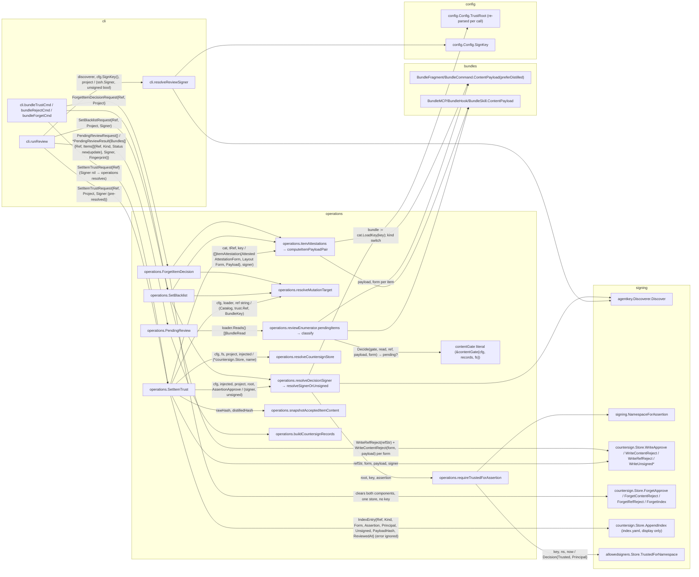
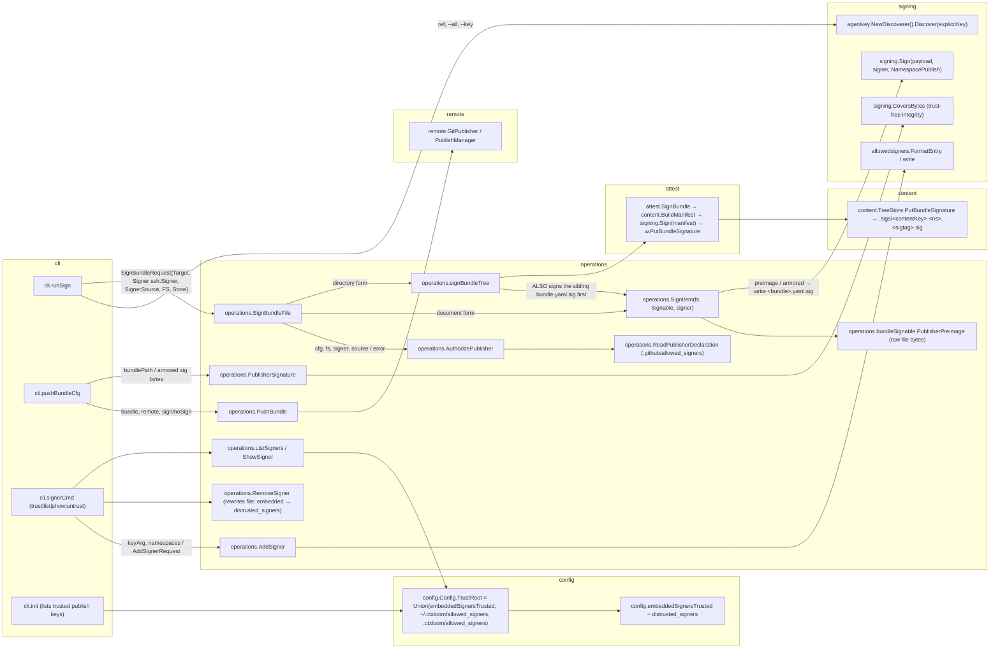
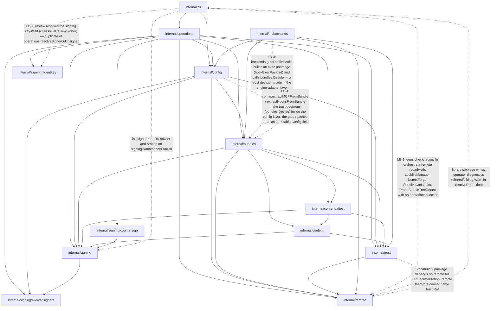
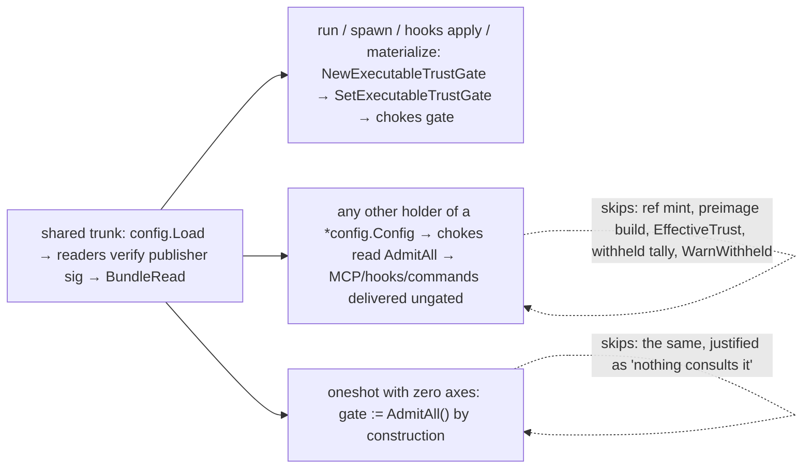

# Seam 5 — Trust, Signing, Remote

Architecture audit, read-only. Analyst: seam 5 of 7. Checkout: `/home/babbitt/workspace/ctxloom/ctxloom/main` at `release/0.7` (tip d42cc4229). Normative reference: `docs/trust-model.md` (954 lines), diffed against code throughout.

Status: COMPLETE (see foot of document for the tally).

---

## 1. Scope and entry points

### Packages read (production files only)

| package | role in the seam | size |
|---|---|---|
| `internal/signing` | crypto primitives (`Sign`/`Verify` over sshsig), publisher + countersign verifiers, the five preimage CONTRACT strings, two preimage builders (fragment, command), the closed `AttestationForm` vocabulary, the countersign framing | ~1.1k |
| `internal/signing/countersign` | the approvals STORE: content-addressed `.sig` files + unsigned markers + display `index.yaml`; readability state machine | ~1.1k |
| `internal/signing/allowedsigners` | OpenSSH `allowed_signers` parser/store/union; `TrustedForNamespace` | ~1.4k |
| `internal/signing/agentkey` | zero-config key discovery (git `user.signingkey` → sole ssh-agent identity) | ~0.8k |
| `internal/trust` | VOCABULARY only: `Decision`, `Source`, `State`, `ItemKind`, `Ref`, `BundleRef`, `CanonicalRepoURL`, `BuiltinSigner` | ~1.0k |
| `internal/content/attest` | tree-form signing/verification over a manifest (`SignBundle`, `VerifyBundle`, `resolvePublisher`) | ~0.5k |
| `internal/bundles` (readers, pipeline, admit, authorizer, `bundles.go` payload builders) | where publisher signatures are VERIFIED at read, where preimages are BUILT, where the gate is CONSULTED | partial |
| `internal/operations` (`trust.go`, `trust_gate.go`, `countersign_records.go`, `review.go`, `sign.go`, `signable.go`, `publisher_declaration.go`, `forget.go`, `sync.go`) | the decision function `EffectiveTrust`, the gate, the review/sign/signer/sync operations | partial |
| `internal/config` (`trustroot.go`, `config_bundles.go`, `tree_bundles.go`, reader assembly in `config.go`) | trust-root assembly, reader wiring, the exec chokes (MCP/hooks), the gate-as-config-field | partial |
| `internal/remote` (`pull.go`, `retract.go`, `bundle_reader.go`, `lockfile.go`) | fetch, pin, retraction probe | partial |
| `internal/lm/backends` (`managed.go`) | the run-time delivery of gated MCP/hooks/commands to an engine | partial |
| `internal/cli` (`review.go`, `sign.go`, `signer.go`, `bundle_trust.go`, `deps_pull.go`, `deps_check.go`, `deps_reconcile.go`, `bundle_push_cli.go`, `trust_interactive.go`) | the verbs | partial |

Stated-architecture inputs read: `docs/trust-model.md` (all of §Item states, §Decision function, §Trusted publishers, §Review ceremony, §Countersignature gating, §Storage, §Enforcement points, §Known gaps), `internal/config/preimage_wire_parity_test.go` (the brief named it under `tests/arch/`; it lives in `internal/config`, build tag `arch`), `tests/arch/credential_gitignore_test.go`, `tests/arch/layering_test.go`. Taskloom rows read: varied-tinfoil, unhelpful-skeptic (Archived), accurate-fox (Done), backstage-rink (Done), unsigned-marine (To Do), delighted-cough (Ruled, open), surgical-written (seam 4 — agentcoord spool, not this seam).

### Entry points traced

CLI verbs (each `cobra` RunE → operations):

| verb | CLI symbol | operations symbol | file |
|---|---|---|---|
| `ctxloom review` (interactive / `--list`) | `cli.runReview` | `operations.PendingReview`, then per decision `operations.SetItemTrust` / `operations.SetBlacklist` | `internal/cli/review.go`, `internal/operations/review.go`, `internal/operations/trust.go` |
| `ctxloom bundle trust <ref>` | `cli.bundleTrustCmd` | `operations.SetItemTrust` | `internal/cli/bundle_trust.go` |
| `ctxloom bundle reject <ref>` | `cli.bundleRejectCmd` | `operations.SetBlacklist` | same |
| `ctxloom bundle forget <ref>` | `cli.bundleForgetCmd` | `operations.ForgetItemDecision` | same, `internal/operations/forget.go` |
| `ctxloom bundle sign [ref]` | `cli.runSign` | `operations.SignBundleFile` (→ `operations.SignItem` for a document, `operations.signBundleTree` → `attest.SignBundle` for a tree), guarded by `operations.AuthorizePublisher` | `internal/cli/sign.go`, `internal/operations/sign.go` |
| `ctxloom bundle push` | `cli.pushBundleCfg` | `operations.PushBundle`, `operations.PublisherSignature`, optional `operations.SignBundleFile` | `internal/cli/bundle_push_cli.go` |
| `ctxloom signer trust\|list\|show\|untrust` | `cli.signerCmd` | `operations.AddSigner`, `ListSigners`, `ShowSigner`, `RemoveSigner`, `ResolveSignerKey`, `ResolveSignerNamespaces` | `internal/cli/signer.go` |
| `ctxloom deps pull` | `cli.depsPullCmd` | `operations.SyncDependencies` → `remote.Puller.Pull` | `internal/cli/deps_pull.go`, `internal/operations/sync.go`, `internal/remote/pull.go` |
| `ctxloom deps check` / `deps reconcile` | `cli.runDepsCheck`, `cli.upstreamProbes` | NONE — the CLI drives `remote.*` directly (see finding LB-1) | `internal/cli/deps_check.go`, `internal/cli/deps_reconcile.go` |
| `ctxloom list ... --format json` (trust stamp) | `cli.stampedTrust` | `operations.NewTrustStamper(cfg).ForRef` → `operations.EffectiveTrust` | `internal/cli/trust_interactive.go` |

Delivery-time chokes (no verb; reached from `run`, `context`, `hooks apply`, agent spawn):

| choke | symbol | file |
|---|---|---|
| the single decision function | `operations.EffectiveTrust` | `internal/operations/trust.go` |
| the single `bundles.Authorizer` implementation | `operations.contentGate.Admit` | `internal/operations/trust_gate.go` |
| content pipeline (fragments, commands, skills) | `bundles.Pipeline.deliver` / `deliverSkill` → `bundles.Decide` → gate | `internal/bundles/pipeline.go`, `internal/bundles/authorizer.go` |
| exec choke — bundle MCP | `config.extractMCPFromBundle` → `bundles.Decide` | `internal/config/config_bundles.go` |
| exec choke — bundle hooks | `config.extractHooksFromBundle` → `bundles.Decide` | same |
| exec choke — profile-declared hooks | `backends.gateProfileHooks` → `backends.gateProfileExec` → `bundles.Decide` | `internal/lm/backends/managed.go` |
| gate construction for a run | `operations.NewExecutableTrustGate`, `operations.exposurePipelineGated` | `internal/operations/trust_gate.go` |
| gate hand-off to the engine payload | `backends.AssembleManagedConfig(backend, workDir, gate, profiles)` | `internal/lm/backends/managed.go` |
| gate carried as config state | `config.Config.SetExecutableTrustGate` / `ExecutableTrustGate()` (default `bundles.AdmitAll()`) | `internal/config/config_bundles.go` |

Read-time verification (publisher signature), one per reader:

| reader | verifies via | posture it stamps | file |
|---|---|---|---|
| project (`NewProjectReader`) and builtin (`NewBuiltinReader`) — same type `localFSReader` | `localFSReader.signatureFactsFor` → `bundles.readSignatureFacts` → `signing.VerifyPublisher`; tree form additionally `localFSReader.treeIntegrityFacts` → `attest.VerifyBundle` | `TrustCtxLocal` | `internal/bundles/reader_localfs.go`, `reader_local_tree.go` |
| installed remote tree (`NewRepoFSReader`, one per lockfile entry) | `repoFSReader.verifyTree` → `attest.VerifyBundle` | `TrustCtxRemote` | `internal/bundles/reader_repofs.go`, wired by `config.treeBundleReader` |
| companion loadout (`NewCompanionReader`) | `companionReader.read` → `bundles.readSignatureFacts` | `TrustCtxLocal`, `ProvenanceCompanion` | `internal/bundles/reader_companion.go` |
| pull-time / version-resolver read of a remote tree | `bundles.ReadRemoteRef` → `bundles.verifyRemoteTree` → `attest.VerifyBundle` | none (returns a bare `*Bundle`) | `internal/bundles/remote_ref_read.go`; callers `config.bundleVersionResolver`, `operations/depgraph.go` |

Retraction: `remote.CheckRetracted` (network, sync time) → `remote.Puller.resolveRetraction` (fail-stale) → `remote.LockEntry.Retracted/RetractionCheckedAt` (disk) → `operations.lockfileRetraction.Retracted` (exposure time, via `RetractionRecords` seam).

---

## 2. Call graphs

Edge labels carry the state that crosses (`args / returns`); ctx and loggers omitted.

### 2.1 Delivery: bytes fetched from a remote → bytes delivered to an engine (the centrepiece)

Every verification point is a `[[V…]]` node. Paths that reach delivery WITHOUT passing one are dashed.

```mermaid
flowchart LR
  subgraph remote
    R_Pull["remote.Puller.Pull"]
    R_Fetch["remote.Puller.fetchForPull"]
    R_Bytes["remote.Puller.fetchItemBytes"]
    R_Retr["remote.Puller.confirmRetraction / resolveRetraction"]
    R_Check["remote.CheckRetracted"]
    R_Inst["remote.Puller.installPulledItem → installTree"]
    R_Lock["remote.Puller.updateLockfile"]
  end
  subgraph operations
    O_Sync["operations.SyncDependencies → syncItem"]
    O_Depg["operations/depgraph walk"]
    O_Gate["operations.contentGate.Admit"]
    O_ET["operations.EffectiveTrust"]
    O_Rec["operations.countersignRecords.Rejected / Approved"]
    O_Retr["operations.lockfileRetraction.Retracted"]
    O_NEG["operations.NewExecutableTrustGate"]
  end
  subgraph config
    C_Load["config.Load → bundleLoader (reader assembly)"]
    C_Tree["config.treeBundleReader"]
    C_RBR["config.remoteBundleReaders"]
    C_MCP["config.extractMCPFromBundle"]
    C_Hook["config.extractHooksFromBundle"]
    C_Root["config.Config.TrustRoot"]
    C_GateField["config.Config.ExecutableTrustGate (field, default AdmitAll)"]
  end
  subgraph bundles
    B_RRR["bundles.ReadRemoteRef"]
    B_VRT[["V0 bundles.verifyRemoteTree (refuses unless verdict.OK)"]]
    B_Repo["bundles.repoFSReader.readTreeForm"]
    B_VT[["V1 repoFSReader.verifyTree → attest.VerifyBundle"]]
    B_Read["bundles.BundleRead{Bundle.Signer(), trustCtx, signature, signer}"]
    B_Pipe["bundles.Pipeline.deliver / deliverSkill"]
    B_Res["ItemRead.Resolve → Surface().Preimage()"]
    B_Dec["bundles.Decide"]
    B_CP["bundles.BundleMCP/BundleHook.ContentPayload"]
  end
  subgraph signing
    S_VP[["V2 signing.VerifyPublisher / VerifyInNamespace"]]
    S_VC[["V3 signing.VerifyCountersignature"]]
    CS_Store["countersign.Store.candidates → verified"]
  end
  subgraph backends
    LB_AMC["backends.AssembleManagedConfig"]
    LB_Hooks["backends.AssembleManagedHooks → gateProfileHooks"]
    LB_Cmd["backends.LoadCommandExports / LoadSkillExports"]
    Engine(("engine settings on disk / exec"))
  end
  subgraph attest
    A_VB["attest.VerifyBundle → bundleAuthority → resolvePublisher"]
  end

  O_Sync -- "ref string, PullOptions{Force:true, ItemType}" --> R_Pull
  R_Pull -- "*Reference" --> R_Fetch
  R_Fetch -- "fetcher, owner, repo, ref / (retracted bool, reason, checkedAt)" --> R_Retr
  R_Retr -- "default-branch manifest.yaml / RetractionVerdict{clean|retracted|unknown}" --> R_Check
  R_Fetch -- "filePath, sha / (manifestBytes, tree map[string]TreeFile, treeRoot)" --> R_Bytes
  R_Fetch -- "*fetchedItem{sha, content, tree, treeRoot, retracted…}" --> R_Inst
  R_Inst -- "rem.URL, sha, treeRoot, worktreePath / dir" --> R_Lock
  R_Lock -. "LockEntry{SHA, URL, Retracted, RetractionCheckedAt, Tree:true} → .ctxloom/lock.yaml" .-> C_RBR
  O_Depg -- "ref, sha, treeFetch, trustRoot / *Bundle" --> B_RRR
  B_RRR --> B_VRT
  B_VRT --> A_VB
  A_VB -- "manifest bytes, SigSet / attestation{principal|tamper|fingerprint}" --> S_VP

  C_Load -- "WithTrustRoot(c.TrustRoot())" --> C_Root
  C_Load --> C_RBR
  C_RBR -- "canonical, LockEntry, root" --> C_Tree
  C_Tree -- "TreeFS over installed worktree, WithPinnedRevision(entry.SHA)" --> B_Repo
  B_Repo --> B_VT
  B_VT --> A_VB
  B_VT -- "signatureFacts{signature, signer, principal, fingerprint}" --> B_Read
  B_Read -- "facts.stamp(b) → Bundle.signer (unexported)" --> B_Read

  B_Pipe -- "read BundleRead, ref, s.Preimage []byte, s.Form" --> B_Res
  B_Pipe -- "authorizer, read, ref, payload, form / Verdict" --> B_Dec
  B_Dec -- "Exposure{Read, Ref trust.Ref, Bytes, Form}" --> O_Gate
  O_Gate -- "EffectiveTrustRequest{Ref, Payload, Form string, Signer: e.Read.Bundle.Signer(), Posture, Provenance, Records, FS} / *EffectiveTrustResult" --> O_ET
  O_ET -- "ref, payload / bool" --> O_Rec
  O_ET -- "ref / (retracted, reason)" --> O_Retr
  O_Rec -- "header, payload, root, now / (principal, ok)" --> CS_Store
  CS_Store --> S_VC

  C_MCP -- "gate := c.ExecutableTrustGate()" --> C_GateField
  C_Hook --> C_GateField
  C_MCP -- "mcp / preimage []byte" --> B_CP
  C_Hook --> B_CP
  C_MCP -- "gate, read, ref, payload, FormRaw / Verdict" --> B_Dec
  C_Hook --> B_Dec
  O_NEG -- "Authorizer()" --> LB_AMC
  LB_AMC -- "cfg.SetExecutableTrustGate(gate) on a FRESHLY LOADED cfg" --> C_GateField
  LB_AMC --> C_MCP
  LB_AMC --> C_Hook
  LB_AMC --> LB_Hooks
  LB_Hooks -- "hookExecPayload(wire.Hook) → BundleHook.ContentPayload" --> B_CP
  LB_Hooks --> B_Dec
  LB_AMC --> LB_Cmd
  LB_Cmd --> B_Pipe
  LB_AMC -- "*agent.ManagedConfig{Commands, Skills, Hooks, BundleMCP}" --> Engine

  C_GateField -. "AdmitAll when nobody called SetExecutableTrustGate: MCP/hooks delivered UNGATED (finding DP-1)" .-> C_MCP
  C_GateField -. "AdmitAll" .-> C_Hook
```



**Paths that reach delivery without a verification point** (dashed above and enumerated in findings DP-1/DP-2):

1. Any caller that builds a `*config.Config`, never calls `SetExecutableTrustGate`, and then calls `cfg.ResolveBundleMCPServers` / `AssembleManagedHooks` / `LoadCommandExports` / `NewPipeline(..., c.ExecutableTrustGate(), ...)` — the field defaults to `bundles.AdmitAll()` and `bundles.Decide` short-circuits (`!Gates(authorizer)`) before minting a ref or building a preimage. The doc calls these "management/listing paths"; nothing types that distinction.
2. `operations.oneshot` with zero isolation axes: `gate := bundles.AdmitAll()` by construction.
3. Note what is NOT a bypass: builtin content passes through the same gate (`localFSReader` with `ProvenanceBuiltin`, allowed at the builtin step). Companion loadouts likewise.

### 2.2 Review and decision recording (`ctxloom review`, `bundle trust|reject|forget`)



### 2.3 Publisher signing and trust-root management (`bundle sign`, `bundle push`, `signer *`)



### 2.4 Dependency sync and retraction (`deps pull`, `deps check`, `deps reconcile`)

```mermaid
flowchart LR
  subgraph cli
    DP["cli.depsPullCmd"]
    DC["cli.runDepsCheck → checkAll/checkSingle"]
    DR["cli.upstreamProbes (deps reconcile)"]
  end
  subgraph operations
    SD["operations.SyncDependencies"]
    RSD["operations.resolveSyncDeps → remote.NewPuller(...)"]
    SI["operations.syncItem"]
    II["operations.isInstalled (clone-cache bytes + tree dir)"]
    CIR["operations.checkInstalledRetraction"]
    LOCK["operations.syncLockStep (package var)"]
    HOOKS["operations.syncHooksStep (package var)"]
    CF["operations.NewCachedFetcherFactory / NewRepoCache / GetCachedFetcher"]
  end
  subgraph remote
    PL["remote.Puller.Pull"]
    FF["remote.Puller.fetchForPull"]
    CR["remote.Puller.confirmRetraction"]
    RR["remote.Puller.resolveRetraction (fail-stale, 14d)"]
    CK["remote.CheckRetracted"]
    FB["remote.Puller.fetchItemBytes"]
    IP["remote.Puller.installPulledItem (refuses document form)"]
    IT["remote.Puller.installTree → treeInstall (worktree)"]
    UL["remote.Puller.updateLockfile"]
    LM["remote.LockfileManager.Load/Save"]
    LA["remote.LoadAuth"]
    DF["remote.DetectForge / ResolveConstraint / ProbeBundleTreeRoots"]
  end

  DP -- "SyncDependenciesRequest{Profiles, Force…} / *SyncDependenciesResult{Items[]{Status installed|updated|skipped|retracted|failed}}" --> SD
  SD --> RSD
  RSD --> CF
  SD -- "puller, ref, itemType, baseDir, force, BundleByteSource / SyncItem" --> SI
  SI --> II
  SI -- "if installed: CheckRetraction + RecordRetraction (errors → not retracted)" --> CIR
  SI -- "PullOptions{Force:true, ItemType, Stdout:stderr} / *PullResult{LocalPath, SHA, Retracted…}" --> PL
  SD --> LOCK
  SD --> HOOKS
  PL --> FF
  FF --> CR
  CR --> RR
  RR -- "(RetractionVerdict, reason) ; Unknown → lockfile fallback" --> CK
  RR -- "entry.Retracted, RetractionCheckedAt" --> LM
  FF --> FB
  PL --> IP
  IP --> IT
  IP -- "localName, sha, requestedVersion, retracted, checkedAt, tree=true" --> UL
  UL --> LM
  DC -. "cli → remote directly: LoadAuth(\"\"), NewLockfileManager, DetectForge, ResolveConstraint (finding LB-1)" .-> LM
  DC -.-> DF
  DC --> CF
  DR -.-> LA
  DR -.-> DF
  DR --> CF
```

---

## 3. Delegation / layer graph

Solid = direction the stated architecture expects (cli → operations → {config, bundles, remote, signing}; bundles → signing/attest/trust; nothing → cli). Dashed red = against the grain or skipping a layer. The layering gate (`tests/arch/layering_test.go`) names NONE of these packages; the only enforced rule touching this seam is `operations ↛ cli`.



Reading: the DECISION lives in `operations` (`EffectiveTrust`, `contentGate`), which is correct, but the CONSULTATION of that decision is spread across three layers — `bundles.Pipeline` (content), `config.extract*` (bundle exec), `lm/backends.gateProfileHooks` (profile exec) — and the handle to the decision travels between them as a mutable field on `*config.Config`. The verification of publisher signatures lives in `bundles` readers (correct: at the byte source), but is adapted three ways (`readSignatureFacts`, `repoFSReader.verifyTree`, `verifyRemoteTree`) with two different refusal policies.


---

## 4. Findings

Ranked by blast radius within each category; the cross-category top three are marked ★. Each ends with **Settle:** — what would close it.

### 4.1 DUPLICATION

**D-1 ★ Two publisher-verification adapters producing two structs for one concept.**
`bundles.readSignatureFacts(payload, sig, root) signatureFacts` (`internal/bundles/reader.go`) and `attest.resolvePublisher(payload, sigs, root, now) attestation` (`internal/content/attest/attest.go`) both wrap `signing.VerifyPublisher` and both derive the same four-valued outcome {verified(principal) | tampered(detail) | untrusted(fingerprint) | none}. `bundles.signatureFacts{signature, signer, principal, detail, fingerprint}` and `attest.attestation{principal, detail, tamper, fingerprint}` are the same value under two names; `repoFSReader.verifyTree` is a hand-written converter from the second to the first. The `attest` form is the more complete (handles a SigSet, i.e. multiple signatures per namespace). `readSignatureFacts` additionally re-derives "was the key trusted?" from whether `SignatureKeyFingerprint` parses (`facts.signer = SignerTrusted` inside the `err != nil` arm) — a side-channel inference of a fact `VerifyInNamespace` already knew and discarded.
Settle: make `attest.attestation` the one result type (export it), have `readSignatureFacts` call `attest.resolvePublisher` over a one-element SigSet, and delete the `verifyTree` converter.

**D-2 ★ Two tree verifiers with two refusal policies.**
`bundles.repoFSReader.verifyTree` (installed remote tree, delivery path) and `bundles.verifyRemoteTree` (`ReadRemoteRef`; pull-walk and `@<commit>` version reads) both call `attest.VerifyBundle` and then diverge: `verifyTree` maps unsigned/untrusted to `SignatureNone`/`SignerUntrusted` facts and lets the read proceed to review; `verifyRemoteTree` returns an error for anything not `verdict.OK()` — so an unsigned remote bundle is readable from its installed tree but unreadable through `ReadRemoteRef`. The delivery-path one (`verifyTree`) is the more complete and matches the doc ("the bundle is still read, and reported; what withholds it is the trust filter"). A third adapter, `localFSReader.treeIntegrityFacts`, maps the same verdict a third way (can only downgrade an envelope verdict).
Settle: one `verdictToFacts(attest.BundleVerdict) signatureFacts` in `bundles`, used by all three; `verifyRemoteTree` decides refusal on the facts rather than on `OK()`. A test that feeds one unsigned tree through both readers and asserts identical facts.

**D-3 Two signing models, both written by one command.**
`operations.signBundleTree` (`internal/operations/sign.go`) signs the sibling `bundle.yaml.sig` over raw manifest bytes (`operations.SignItem` → `bundleSignable.PublisherPreimage`) AND then `attest.SignBundle` writes `.sigs/<contentKey>.<ns>.<sigtag>.sig` over the built manifest. The tree readers verify via `.sigs/` (`content.treeBundle.BundleSignatures`); `localFSReader.signatureFactsFor` verifies the sibling. Two signatures per bundle, two filename contracts (`countersign.filename` = `<indexHash>.<assertion>.<keyTag>.sig` keyed by KEY; `content.sigFileName` = `<contentKey>.<ns>.<sigtag>.sig` keyed by SIGNATURE bytes), and taskloom `unsigned-marine` already records that re-signing leaves the superseded `.sigs/` entry behind. The doc's Storage table names only `<bundle>.yaml.sig`.
Settle: a human decision on whether the sibling `.sig` survives for tree bundles (if not, `signBundleTree` stops writing it and the Storage table gains `.sigs/`); either way one filename-index helper shared by `countersign` and `content`.

**D-4 Signing-key resolution spelt twice.**
`cli.resolveReviewSigner(ctx, discoverer, explicitKey, project)` (`internal/cli/review.go`) and `operations.resolveSignerOrUnsigned(cfg, injected, project)` (`internal/operations/trust.go`) implement the same discover → `project` requires a key → else unsigned algorithm. The CLI copy adds ambiguous-key rendering and the confirm prompt; the operations copy is what `bundle trust|reject` use. Because `review` passes a pre-resolved `Signer`, the namespace grant is checked in `resolveDecisionSigner` for both, so there is no behaviour gap today — but the two will drift (the CLI one ignores `AmbiguousKeyNameError` differently).
Settle: `review` passes `Signer: nil` and an `Interactive` hook for the prompt; delete `cli.resolveReviewSigner`.

**D-5 Verification order re-spelt in the countersign verifier.**
`signing.VerifyCountersignature` (`internal/signing/countersign_verify.go`) repeats `VerifyInNamespace`'s unarmor → `TrustedForNamespace` → `Verify` sequence rather than calling `VerifyInNamespace(CountersignPreimage(h, payload), armored, root, ns, now)`. The doc-comment on `VerifyInNamespace` says "a second copy of that order is the thing most worth avoiding here".
Settle: `VerifyCountersignature` delegates; one order.

**D-6 Locality carried twice on one path.**
`trust.Ref{IsLocal, IsBuiltin, IsCompanion}` and `EffectiveTrustRequest{Posture bundles.TrustCtx, Provenance bundles.ProvenanceClass}` both encode "which first-party source". The decision keys on Posture/Provenance (by design — "the gate keys on what the reader established"); `trust.Ref.CanonicalURL()` keys on the flags, and handles builtin/local but not companion (it falls through to `CanonicalRepoURL`, which special-cases the `CompanionSource` token string). `refLevelAddress`/`CountersignRef` mint the stored ref from the flags. So the approval record's identity comes from one representation and the exemption from the other.
Settle: derive `Ref` flags from `BundleRead` in one constructor (`trust.RefFromRead`), or drop the flags and carry Provenance in Ref.

**D-7 `deps` installed-ness computed two ways.**
`operations.isInstalled` = "`BundleByteSource.ReadBundleBytes` succeeds from the git clone cache" AND "`LocalTreePath` exists"; `config.treeBundleReader` = "the lockfile has an entry and the tree dir exists". The clone-cache half reads the DOCUMENT path at the pinned SHA, which for tree bundles is only the manifest.
Settle: `isInstalled` asks the lockfile + tree dir; delete the `BundleByteSource` argument from `syncItem`.

### 4.2 DIVERGENT PATHS

**DP-1 ★ The executable gate is opt-in per `*config.Config`, and the default is `AdmitAll`.**
`config.Config.ExecutableTrustGate()` returns `bundles.AdmitAll()` when no caller has called `SetExecutableTrustGate`. Every exec choke (`extractMCPFromBundle`, `extractHooksFromBundle`, `resolveBuiltinBundleMCPServers`, `resolveBuiltinBundleHooks`, the `NewPipeline(..., c.ExecutableTrustGate(), ...)` sites in `config_bundles.go`, `lm/backends/commands.go`, `skillfiles.go`) reads it. Only five sites set it: `coord/spawner.go`, `lm/backends.AssembleManagedConfig` (on a freshly re-loaded config), `operations/hooks.go`, `operations/hooks_resolve.go`, `operations/profile_materialize.go` (save/set/defer-restore). The doc-comment asserts "a config nobody attached a gate to is a MANAGEMENT/LISTING config"; nothing types that, and `bundles.Decide` skips ref-minting and preimage construction entirely when `!Gates(authorizer)`, so an ungated delivery leaves no trace that a gate was skipped.


Steps branch B/C skip relative to A: `bundles.ItemRefFor`, `ContentPayload`, `EffectiveTrust` (all seven decision steps including REJECTION), the withheld tally, `WarnWithheld`.
Settle: invert the default — `ExecutableTrustGate()` returns a `bundles.Authorizer` that WITHHOLDS (`ReasonUngoverned`) unless a gate was attached, and management/listing paths opt IN to `AdmitAll` explicitly (`config.WithUngatedListing()`), so the exception is typed at the call site that wants it.

**DP-2 `oneshot` skips gate construction on a perf justification.**
`operations/oneshot.go`: "Build the shared executable trust gate ONLY when some isolation is actually requested (an all-defaults oneshot writes no per-member config and must stay byte-identical to pre-P3; gate construction runs the trust baseline + opens the store)". The claim "nothing consults this gate" is unchecked: `runResolvedAgent` → `AssembleManagedConfig(…, gate, …)` receives it.
Settle: delete the branch; if gate construction cost matters, make `NewExecutableTrustGate` cheap (see DF-1) rather than skipping it.

**DP-3 `deps check` / `deps reconcile` orchestrate `remote` in the CLI; `deps pull` goes through operations.**
`cli.runDepsCheck` builds `remote.LoadAuth("")` (empty base dir), `remote.NewLockfileManager(projectAppDir(cfg))`, and drives `remote.DetectForge`, `ResolveConstraint`, `NewFetcherRepoVersions`; `cli.upstreamProbes` (reconcile) does the same with `ProbeBundleTreeRoots`. `deps pull` goes through `operations.SyncDependencies` → `resolveSyncDeps`, which builds the puller with `remote.LoadAuth(baseDir)`. Steps check/reconcile skip: the operations fetcher-factory injection seam (`SyncDependenciesRequest.Puller/Registry`), the lockfile FS option (`remote.WithLockfileFS(fs)`), auth resolution against the project dir.
Settle: `operations.CheckDependencies` / `operations.ReconcileDependencies` owning the remote calls; CLI renders.

**DP-4 Pull fetches the document form it will refuse to install.**
`remote.Puller.fetchItemBytes` first `FetchFile`s `ref.BuildFilePath(ItemType)` and, when that succeeds, enforces non-empty and returns `(content, nil tree)`; `installPulledItem` then refuses `item.tree == nil`. The `updateLockfile(... tree bool)` argument is therefore always `true` at its only call, and `LockEntry.Tree` is a constant. Also `PullResult.Content` carries the manifest bytes to `syncItem`, which ignores them.
Settle: `fetchItemBytes` probes the tree first and refuses a lone document at the fetch; drop the `tree` parameter and `PullResult.Content`.

**DP-5 `config.remoteBundleReaders` still runs the retired document-reader.**
It constructs `remote.NewCachingBundleReader(remote.NewBundleReader(registry, factory, auth, lock))`, calls `remote.LoadAllBytes` (which `ReadBundleBytes` → `fetchAtLockedSHA` → walks the clone cache for every pinned bundle), DISCARDS the bytes (`_, failures :=`) and passes only `failures` into `treeBundleReaders`. Its doc-comment still describes "the local git clone cache at the pinned SHA (single-file bundles)"; the body says "EVERY remote bundle is a TREE"; `reportBundleLoadFailures`'s comment says "single-file bundles are no longer read at all". Three statements, one function.
Settle: delete the `BundleReader` construction and `LoadAllBytes` call; `treeBundleReaders` reports its own failures (it already produces "tree is not installed"). Then `remote.BundleReader`, `CachingBundleReader`, `LoadAllBytes`, `BundleByteSource` have one remaining caller (`operations/upgrade_verify.go` → `ReadBundleSignature`) to re-home.

### 4.3 LAYER BYPASS

**LB-1 cli → remote (deps check/reconcile).** As DP-3. Symbols: `cli.runDepsCheck`, `cli.checkAll`, `cli.fetchIntoClone`, `cli.upstreamProbes` (`internal/cli/deps_check.go`, `internal/cli/deps_reconcile.go`).
Settle: the two operations functions named in DP-3; then add `internal/cli → internal/remote` to `layeringRules` in `tests/arch/layering_test.go` with an allowlist that shrinks to zero.

**LB-2 cli → signing/agentkey (review key resolution).** As D-4. `cli.resolveReviewSigner`, `cli.confirmUnsignedReview`.
Settle: as D-4.

**LB-3 lm/backends makes a trust decision.** `backends.gateProfileHooks` / `gateProfileExec` / `hookExecPayload` (`internal/lm/backends/managed.go`) mint a ref (`backends.itemRefFor` → `parseSourceRef`), build an exec preimage by copying `wire.Hook` back into `bundles.BundleHook`, and call `bundles.Decide`. This is the engine-adapter layer deciding what is trusted, using a hand-rolled reverse converter (see SA-5 for why that copy is a liability).
Settle: profile hooks are gated where bundle hooks are — in the resolver that produces `ResolvedProfile.Hooks` (profiles/operations), with the preimage built from the `BundleHook` that was resolved, before conversion to wire.

**LB-4 config makes trust decisions.** `config.extractMCPFromBundle`, `config.extractHooksFromBundle`, `config.resolveBuiltinBundleMCPServers`, `config.resolveBuiltinBundleHooks` (`internal/config/config_bundles.go`) call `bundles.Decide` — the config layer consults the gate — and the gate reaches them as a MUTABLE FIELD (`Config.execGate`) set by operations/backends/coord. `operations.MaterializeProfile` has to save/replace/defer-restore that field to call into config. The config layer is below operations in the stated architecture; a trust decision consulted there means operations cannot see, test, or override it without mutating shared state.
Settle: the exec extractors take the `bundles.Authorizer` as a parameter from their operations caller (they already do for builtin ones); delete `Config.execGate`, `SetExecutableTrustGate`, `ExecutableTrustGate`.

**LB-5 trust → remote.** `internal/trust` (the vocabulary package) imports `internal/remote` for `NormalizeRef`, `NormalizeURL`, `LocalSource`, `CompanionSource`. Consequently `remote` cannot name `trust.Ref`, and `remote.LockEntry`/`Puller` speak in strings (`refStr`, `localName`, `canonical`) that every consumer re-parses (`remote.ParseReference` appears 8× in cli alone).
Settle: move URL/ref normalisation into `internal/refuri` (which both already import) and have `trust` depend on `refuri` only.

### 4.4 MISSING LAYER

**ML-1 ★ There is no "gate holder" — the authorizer has no home, so it lives in `Config`.**
The `bundles.Authorizer` is created in `operations` (`NewExecutableTrustGate`, `exposurePipelineGated`, `PendingReview`'s literal `&contentGate{…}`), consumed in `bundles` (`Pipeline`), `config` (`extract*`), and `lm/backends` (`gateProfileHooks`, `AssembleManagedConfig`), and transported between them through `Config.execGate`. The missing layer is a **session-scoped trust context**: `{records ReviewRecords, retraction RetractionRecords, root signing.TrustRoot, gate Authorizer, withheld tally}` constructed ONCE per process and passed explicitly. Sites that would collapse into it: `operations.buildContentGate`, `buildCountersignRecords`, `buildLockfileRetraction`, `reviewTrustRoot`, `config.Config.TrustRoot` (re-parsed per call), the five `SetExecutableTrustGate` sites, `MaterializeProfile`'s save/restore, `TrustStamper{cfg, loader, records, fs}` (which is this struct under another name), and `PendingReview`'s ad-hoc gate literal.
Settle: `operations.NewTrustContext(cfg) *TrustContext` with `Gate() bundles.Authorizer`; every choke takes it as a parameter; `Config` loses the field.

**ML-2 No "publisher identity" type.** A verified publisher travels as: `attest.attestation.principal string` → `bundles.signatureFacts.principal string` + `bundles.Signer` enum (`SignerTrusted|SignerUntrusted|SignerNone`) → `Bundle.signer string` (unexported, via `StampSigner`) → `BundleRead.Signer() Signer` (the enum) AND `read.Bundle.Signer() string` → `EffectiveTrustRequest.Signer string` → `LoadedContent.Signer string` / `LoadedSkill.Signer string` → `ReviewBundle.Signer string`. `EffectiveTrust` allows on `req.Signer != "" && != BuiltinSigner`: a plain string is the allow token, and the only thing keeping a caller from fabricating one is that `Bundle.signer` is unexported and `StampSigner` is called from exactly one place (`signatureFacts.stamp`). `TrustStamper.resolve` re-loads the bundle to fetch the same string the `BundleRead` already carries.
Settle: a `signing.Principal` value type that only `VerifyInNamespace` can construct (unexported field), threaded end to end; `EffectiveTrustRequest.Signer signing.Principal`.

**ML-3 No single "installed remote bundle" record.** Installed-ness, pin, retraction verdict, and tree location are answered by four things: `remote.LockEntry` (pin + retraction), the worktree dir (`Reference.LocalTreePath`), the clone cache (`BundleReader`), and the registry (`remotes.yaml`). `config.remoteBundleReaders`, `operations.isInstalled`, `cli.deps check`, `operations.lockfileRetraction` each re-join them.
Settle: `remote.Installed(baseDir) []InstalledBundle{Canonical, Entry LockEntry, TreeDir string}` as the one query.

### 4.5 WORKAROUNDS (each an unfiled bug unless a harp is cited)

**W-1** `internal/operations/oneshot.go`: "must stay byte-identical to pre-P3; gate construction runs the trust baseline + opens the store" — a perf workaround that disables a security gate. → DP-2.

**W-2** `internal/config/config_bundles.go` (`Config.ExecutableTrustGate` doc): "a nil authorizer withholds everything downstream … and a management path asking for a config's gate is not a fault. A config nobody attached a gate to is a MANAGEMENT/LISTING config" — the fail-open default justified by a category the type system does not express. → DP-1.

**W-3** `internal/bundles/reader.go` `readSignatureFacts`: `if _, fperr := signing.SignatureKeyFingerprint(armoredSig); fperr == nil { facts.signer = SignerTrusted }` inside the tamper arm — infers "the key was trusted" from "the blob parses", because `VerifyInNamespace` folds that fact into an error string. Works only because `VerifyInNamespace` returns a parse error before the trust check. → D-1.

**W-4** `internal/bundles/loader_skills.go`: `mode, perr := strconv.ParseUint(m.Mode, 8, 32); if perr != nil { mode = 0644 }` — a field of the signed skill manifest is defaulted on parse failure rather than withheld. Unfiled.

**W-5** `internal/remote/pull.go` `resolveRetraction`: `lockfile, lerr := p.lockfileManager.Load(); if lerr != nil { return false, "", time.Time{}, nil }` — an unreadable lockfile at pull time reads as "not retracted", skips the confirm prompt, and `updateLockfile` then overwrites the entry with `Retracted:false`. The exposure-time twin (`lockfileRetraction.retractionReadable`) is fail-closed; the sync-time half is not. Unfiled.

**W-6** `internal/operations/sync.go` `checkInstalledRetraction`: `if err != nil { return false, "" }` and `puller.(RetractionChecker)` type assertion — an error or an injected puller without the interface silently means "not retracted" and nothing is recorded. Unfiled.

**W-7** `internal/config/config.go` `remoteBundleReaders`: the discarded `LoadAllBytes` result. → DP-5.

**W-8** `internal/operations/signable.go`: "PLACEMENT NOTE (escalate, do not restructure): trust.ItemKind today has no member for 'a whole bundle file' … bundleSignable.Kind() returns the literal trust.ItemKind("bundle") … a stage-2 placement question for a human to decide" — an escalation recorded in a comment; `Signable` has exactly one implementer. Unfiled decision.

**W-9** `internal/config/trustroot.go` `filterSuppressedPrincipals` doc: cites `store.go:100` and `store.go:35` — line-number bindings in a comment (both already stale: `decide` is at a different line).

**W-10** `internal/operations/trust.go` `SetItemTrust` / `SetBlacklist`: `_ = store.AppendIndex(...)` — ignored write error on the display index; a failed index write means `review --list` under-reports an UPDATE as NEW (`LatestApprove` reads it). Acceptable if documented as such at the call; it is not.

**W-11** `internal/remote/retract.go` `CheckRetracted`: "Ambiguous at this seam … indistinguishable here without a not-found sentinel on Fetcher" — the fetcher interface lacks an `ErrNotFound` distinction for the manifest, so every remote that publishes no manifest (the ordinary case) takes the fail-stale fallback and warns after 14 days. Design gap, documented in the doc as accepted; unfiled as a `Fetcher` interface change.

**W-12** `internal/operations/sync.go`: `syncLockStep`, `syncHooksStep` package-level function variables; `internal/config/config_bundles.go`: `hookPreimage`, `mcpPreimage` package-level function variables; `internal/lm/backends/managed.go`: `loadConfigFn`. Test seams travelling as globals through the trust path.

### 4.6 STATED-VS-ACTUAL (`docs/trust-model.md` vs code)

**SA-1 ★ Gap #7 is stale: filesystem load paths DO verify publisher signatures.** The doc: "No filesystem load path verifies a publisher signature. Publisher verification is wired into exactly two load paths — the remote-git seed (`config.loadRemoteBundleSeed`) and the companion loadout — the two places `Bundle.StampSigner` is called." Actual: `localFSReader.signatureFactsFor` (project and builtin readers) verifies a sibling `.sig`; `StampSigner` is called from exactly ONE place (`signatureFacts.stamp`), which four readers reach; `config.loadRemoteBundleSeed` does not exist (grep: comments only). The conclusion the gap draws ("an org cannot ship signed context through a channel other than a git remote") is also now wrong in mechanism though still true in effect: a signed pair in a project dir is verified, stamped `Signer`, then allowed at step 3 (local) before the signer is consulted — so the signature is verified and ignored.
Settle: rewrite gap #7 to say what is true (verified-but-moot for local posture); decide whether `TrustCtxLocal` + `SignatureInvalid` should withhold (today `staleLocalSignature` only changes the admit REASON).

**SA-2 Gap #8 is stale: the embedded key CAN be untrusted.** `config.embeddedSignersTrusted` subtracts `distrusted_signers` (user + project, `paths.HomeDistrustedSignersPath`/`DistrustedSignersPath`) via `filterSuppressedPrincipals`; `operations.RemoveSigner` writes them. The doc's Storage table does not list `distrusted_signers` at all — a fourth trust-root file the normative doc omits.
Settle: delete gap #8; add the row to Storage.

**SA-3 Gap #6 is stale: `review` does consult `sign.key`.** `cli.runReview` calls `resolveReviewSigner(ctx, discoverer, cfg.SignKey(), project)`; only `--key` is absent.
Settle: correct the gap to "`--key` flag only".

**SA-4 Enforcement-points table vs code.** The table lists seven chokes. Actual: all seven funnel through ONE `Authorizer` (`contentGate.Admit`), which is stronger than stated; but the table omits the profile-declared-hooks choke (`backends.gateProfileHooks`), which is a distinct code path with its own preimage construction (LB-3), and omits that `TrustStamper` bypasses the `Authorizer` and calls `EffectiveTrust` directly with a re-loaded signer.
Settle: add both rows; or make `TrustStamper` consult the gate.

**SA-5 Parity gate covers one direction; the other exists and is unguarded.** `internal/config/preimage_wire_parity_test.go` proves every signed field of `BundleHook.ContentPayload` survives into `wire.Hook`. `backends.hookExecPayload` copies `wire.Hook → BundleHook{Matcher, Command, Type, Prompt, PreToolFallback}` by hand — the reverse direction. A signed field added to `BundleHook` and carried by the forward converter passes the parity gate and is silently dropped here, so a profile-declared hook's preimage differs from the same hook's bundle preimage: an approval recorded from `review` (which uses `BundleHook.ContentPayload` on the bundle) will not verify at `gateProfileExec`, and the hook is withheld with the reason "pending review" — fail-closed but unexplained. The `Hook.PreToolFallback` incident the test describes is exactly this shape.
Settle: extend the parity test to round-trip `BundleHook → wire.Hook → hookExecPayload` and assert byte-equal preimages; better, LB-3's fix removes the reverse copy.

**SA-6 "Signing/verification is CLI-only and is never exposed over MCP."** Holds: no `mcp__ctxloom__*` tool reaches `signing`, `countersign`, or `AddSigner` (the MCP server package does not import them — reverse-import map in §3). Stated and true; recorded so the synthesis pass does not re-check.

**SA-7 Storage table omits `.sigs/`, `distrusted_signers`, `.github/allowed_signers`.** Three files the code reads/writes for trust that the normative Storage table does not name: `content.SigDirName` (`.sigs/` per tree bundle — the only signature the tree readers consult), `distrusted_signers` (SA-2), and `operations.DeclaredPublishersPath` (`.github/allowed_signers`, the publish-side authority `bundle sign` refuses against).
Settle: three rows.

**SA-8 `trust.State` vocabulary.** Doc: pending / approved / rejected. Code: `trust.StatePending`, `trust.StateAccepted`, `trust.StateRejected`; `trust.SourceAccepted`; `SetItemTrustResult.Status = "approved"`. One state, two spellings across the boundary.
Settle: rename `StateAccepted`/`SourceAccepted` → `Approved`; the JSON `state` field on listings changes (breaking, pre-1.0).

**SA-9 `credential_gitignore_test.go` is not a trust-model gate.** The brief lists it under this seam; it asserts that ENGINE credentials copied in-tree are gitignored. It says nothing about `.ctxloom/approvals`, `allowed_signers`, `.sig`, or `distrusted_signers` being committed or not. The doc's Storage table says the personal approvals store is "Never committed" and the project one is committable; nothing checks that `~/.ctxloom` state never lands under the project or that `state/trust/objects/` is ignored.
Settle: a row per trust-state path in `credentialPaths` (or a sibling table) — `.ctxloom/state/trust/objects/` at least.

**SA-10 Doc cites symbols that moved or never existed.** `config.loadRemoteBundleSeed` (SA-1), and taskloom `backstage-rink` records that `signing.FragmentPreimage` was cited by a row before it existed (it now does). The doc's references to `internal/remote.CheckRetracted`, `Puller.resolveRetraction`, `LockEntry.Retracted`, `RetractionCheckedAt`, `remote.RetractionStaleAfter`, `operations.resolveDecisionSigner`, `requireTrustedForAssertion`, `signing.NamespaceForAssertion`, `bundles.ContentPayload`, `Store.Verified` all resolve (`Store.Verified` is the unexported `verified`; close enough to grep).

### 4.7 DATA-FLOW SMELLS (cited by symbol; feeds §5)

**DF-1 ★ The trust root and both approvals stores are re-read from disk per decision.** `config.Config.TrustRoot()` parses every `allowed_signers` file on every call (no cache); it is called per reader construction, per `reviewTrustRoot`, per `buildCountersignRecords`. `countersignRecords.readable()` → `Store.Readable()` → `Store.Resolve()` lists AND parses every `.sig` in BOTH stores on every `EffectiveTrust` call (one per gated item). Then `Rejected` performs up to 2 (ref-reject) + 1 (unsigned) + forms×2 (content-reject) + forms (unsigned) directory listings and `Approved` 3 more — roughly 14 `ReadDir`s per item, each listing the whole approvals directory. `buildContentGate` never sets `contentGate.retraction`, so `buildLockfileRetraction` re-reads `lock.yaml` per item too. Values travel through the FILESYSTEM between two functions in one process.
Settle: ML-1's `TrustContext` loads root, both stores (an in-memory index keyed by `indexHash` prefix), and the lockfile once; `Resolve()` runs once.

**DF-2 The gate travels through a mutable global-ish field.** `Config.execGate` (DP-1, LB-4, ML-1). `MaterializeProfile` save/set/defer-restore is the tell.

**DF-3 Config loaded again downstream.** `backends.AssembleManagedConfig` calls `loadConfigFn()` and attaches the caller's gate to the NEW config; the caller's config (on which `NewExecutableTrustGate(st.cfg)` was built, with its trust root and stores) is discarded. Two `*config.Config` per run; the gate's `cfg` and the delivery `cfg` differ.

**DF-4 One value, three types.** Layout form: `bundles.ContentForm` → `signing.Form` → `EffectiveTrustRequest.Form string` → back to `signing.Form(form)` in `countersignRecords.Approved`. Publisher identity: see ML-2 (enum + string + unexported string).

**DF-5 God parameters.** `EffectiveTrustRequest` (Ref, Payload, Form, Signer, Posture, Provenance, Records, Retraction, FS) — a caller cannot tell that only `Records`/`Retraction` being nil triggers disk I/O. `SetItemTrustRequest` / `SetBlacklistRequest` (Ref, Project, Signer, UserStore, ProjectStore, Root, Loader, FS) — six injection fields for tests, `json:"-"`. `remote.fetchedItem` (11 fields) → `PullResult` (6). `PullOptions` carries `Stdout`/`Stdin` (I/O handles as options) and `ItemType`.

**DF-6 Ignored returns.** `config.remoteBundleReaders`: `_, failures := remote.LoadAllBytes(...)`. `SetItemTrust`/`SetBlacklist`: `_ = store.AppendIndex(...)`. `remote.Puller.confirmRetraction`: `_, _ = fmt.Fprintf(opts.Stdout, ...)` (fine). `checkInstalledRetraction`: `CheckRetraction` error → `(false, "")`.

**DF-7 Hidden inputs.** `time.Now()` inside `readSignatureFacts`, `repoFSReader.verifyTree`, `verifyRemoteTree`, `treeIntegrityFacts`, `countersignRecords.Rejected/Approved`, `requireTrustedForAssertion`, `AuthorizePublisher` (allowed_signers `valid-after`/`valid-before` are evaluated against a clock nobody passes). `agentkey.Discoverer` reads `SSH_AUTH_SOCK` and `git config user.signingkey` (gap #12, accepted). `remote.LoadAuth` reads env/files. `lockfileRetraction` reads `lock.yaml`. `config.TrustRoot` reads three files + embedded.

**DF-8 Same string re-parsed along one path.** A bundle ref: `remote.ParseReference` at pull (`Puller.Pull`), again in `fetchAtLockedSHA`, again in `treeBundleDir`, again in `isInstalled`, again in `syncItem`; then `trust.ParseBundleRef` in `bundles.Decide` per item; then `CountersignRef` re-mints a string from `trust.Ref` for the store. `remote.ParseReference` appears 8× in `internal/cli` alone.

**DF-9 Boolean threaded and branched on at every layer.** `preferDistilled` (`cfg.ShouldUseDistilled()` → `Pipeline.preferDistilled` → `ItemRead.Resolve(bool)` → `Surface(bool)` → `ContentPayload(bool)` → `computeItemPayload` → `cfgPreferDistilled(cfg)` re-derived in `reviewEnumerator.pendingItems` and `deliverSkill`). `project bool` (`review --project` → `resolveCountersignStore` → `resolveSignerOrUnsigned` → `resolveDecisionSigner` → `ForgetItemDecision`), each branching.


**DF-10 Dead parameter.** `remote.Puller.updateLockfile(..., tree bool)` — `tree` appears only in the signature; `LockEntry` has no `Tree` field. Its only caller passes `item.tree != nil`, which is always true after `installPulledItem`'s refusal.

---

## 5. Signatures that matter (verbatim), with input / output / hidden-input annotation

`IN` = input state, `OUT` = output, `HID` = read inside without appearing in the signature.

```go
// internal/signing/publisher.go
func VerifyPublisher(bundleBytes, armoredSig []byte, root TrustRoot, now time.Time) (string, error)
func VerifyInNamespace(payload, armoredSig []byte, root TrustRoot, namespace string, now time.Time) (string, error)
//   IN: payload, armoredSig, root, namespace, now. OUT: principal ("" = unsigned-to-you), error (ErrSignatureTampered wraps). HID: none. Pure.
func CoversBytes(payload, armoredSig []byte, namespace string) error   // trust-free integrity; IN only.
type TrustRoot interface { TrustedForNamespace(key ssh.PublicKey, ns string, now time.Time) allowedsigners.Decision }

// internal/signing/countersign_verify.go
func VerifyCountersignature(header CountersignHeader, payloadBytes, armored []byte, root TrustRoot, now time.Time) (principal string, ok bool)
//   IN: all. OUT: (principal, ok) — deliberately no error channel. HID: none.
func NamespaceForAssertion(a Assertion) string

// internal/signing/payload.go
const CountersignContract = "ctxloom-countersign/2"; ExecPreimageContract = "ctxloom-exec/2"; FragmentPreimageContract = "ctxloom-fragment/1"; CommandPreimageContract = "ctxloom-command/1"; SkillPreimageContract = "ctxloom-skill/1"
func FragmentPreimage(premise string, content []byte) []byte
func CommandPreimage(description string, exports, content []byte) []byte
type CountersignHeader struct { Assertion Assertion; Ref string; Form AttestationForm }
func CountersignPayload(h CountersignHeader, payloadBytes []byte) []byte
func CountersignPreimage(h CountersignHeader, payloadBytes []byte) []byte
type Form string            // "raw" | "distilled" | ""
type AttestationForm string // fragment/raw fragment/distilled command/raw command/distilled exec/mcp exec/hook skill ""

// internal/signing/countersign/store.go
func NewStore(dir string, fs afero.Fs) *Store
func (s *Store) Readable() error                       // HID: lists + parses every file in dir
func (s *Store) Resolve() (StoreState, error)
func (s *Store) WriteApprove(ref string, form signing.AttestationForm, payload []byte, signer ssh.Signer) error
func (s *Store) WriteContentReject(form signing.AttestationForm, payload []byte, signer ssh.Signer) error
func (s *Store) WriteRefReject(ref string, signer ssh.Signer) error
func (s *Store) VerifiedApprove(ref string, form signing.AttestationForm, payload []byte, root signing.TrustRoot, now time.Time) (string, bool)
func (s *Store) VerifiedContentReject(form signing.AttestationForm, payload []byte, root signing.TrustRoot, now time.Time) (string, bool)
func (s *Store) VerifiedRefReject(ref string, root signing.TrustRoot, now time.Time) (string, bool)
//   IN: header parts, payload, root, now. OUT: (principal, ok). HID: ReadDir(dir) + ReadFile per candidate on EVERY call.
func (s *Store) WriteUnsignedApprove / WriteUnsignedContentReject / WriteUnsignedRefReject   // marker files "<hash>.<assertion>.unsigned"
func (s *Store) HasUnsignedApprove / HasUnsignedContentReject / HasUnsignedRefReject           // presence = decision (forgeable by design)
func (s *Store) ForgetApprove(ref string, form signing.AttestationForm, payload []byte) (int, error) // + ForgetContentReject, ForgetRefReject, ForgetIndex
func (s *Store) AppendIndex(e IndexEntry) error            // display-only index.yaml
func (s *Store) LatestApprove(ref string, layout signing.Form) (IndexEntry, bool, error)

// internal/signing/allowedsigners/store.go
type Decision struct { Trusted bool; Principal string }
func (s *Store) TrustedForNamespace(key ssh.PublicKey, ns string, now time.Time) Decision
func Union(stores ...*Store) *Store

// internal/signing/agentkey/agentkey.go
func (d *Discoverer) Discover(ctx context.Context, explicitKey string) (*Discovered, error)
//   IN: explicitKey. OUT: Discovered{Signer, Fingerprint,…}. HID: git config user.signingkey (cwd repo), SSH_AUTH_SOCK, key files.

// internal/trust/trust.go
type Ref struct { RepoURL string; Bundle string; Kind ItemKind; Name string; IsLocal bool; IsBuiltin bool; IsCompanion bool }
func (r Ref) Key() string          // HID: remote.NormalizeRef
func (r Ref) CanonicalURL() string // builtin → "builtin:ctxloom"; local → remote.LocalSource; else CanonicalRepoURL(RepoURL)
const BuiltinSigner = "builtin:ctxloom"
type State string  // pending | accepted | rejected   (doc says "approved")
type Source string // rejected local builtin companion retracted trusted-signer accepted pending

// internal/content/attest/attest.go
func SignBundle(ctx context.Context, w content.Writer, b content.Bundle, signer ssh.Signer) error   // writes manifest + .sigs/ entry
func VerifyBundle(ctx context.Context, b content.Bundle, root signing.TrustRoot, now time.Time) (BundleVerdict, error)
type BundleVerdict struct { Bundle BundleID; Manifest content.Manifest; Verdict Verdict; Contents error; Items []ItemVerdict }
type Verdict struct { Status Status; Principal string; Authority Authority; Detail string; UntrustedSignerFingerprint string }

// internal/bundles/reader.go
type BundleRead struct { Bundle *Bundle; Provenance ProvenanceClass; ref string; layout paths.BundleLayout; alsoIn []paths.BundleLayout; trustCtx TrustCtx; signature Signature; signer Signer; signatureDetail string; untrustedFingerprint string }
func (r BundleRead) Claimed() bool; TrustCtx() TrustCtx; Signature() Signature; Signer() Signer; UntrustedSignerFingerprint() string
func readSignatureFacts(payload, armoredSig []byte, root signing.TrustRoot) signatureFacts   // HID: time.Now()
func (f signatureFacts) stamp(b *Bundle)   // the ONLY caller of Bundle.StampSigner
func (b *Bundle) Signer() string; func (b *Bundle) StampSigner(signer string)

// internal/bundles/authorizer.go, admit.go, pipeline.go
type Authorizer = admission.Authorizer[Exposure, Reason]   // Admit(Exposure) Verdict
type Verdict = admission.Decision[Reason]                  // { Allow bool; Reason Reason; Detail string }
type Exposure struct { Read BundleRead; Ref trust.Ref; RefStr string; Bytes []byte; Form ContentForm }
func Decide(authorizer Authorizer, read BundleRead, ref string, payload []byte, form ContentForm) Verdict
func AdmitAll() Authorizer; func Gates(authorizer Authorizer) bool
func NewPipeline(loader *Loader, authorizer Authorizer, links LinkGrant, preferDistilled bool) *Pipeline
func (f *BundleFragment) ContentPayload(preferDistilled bool) ([]byte, ContentForm)
func (p *BundleCommand) ContentPayload(preferDistilled bool) ([]byte, ContentForm)
func (s *BundleSkill) ContentPayload(fsys afero.Fs, bundleDir, skillName string) ([]byte, error)
func (m *BundleMCP) ContentPayload() ([]byte, error)
func (h *BundleHook) ContentPayload() ([]byte, error)
func ReadRemoteRef(ctx context.Context, factory remote.FetcherFactory, auth remote.AuthConfig, ref *remote.Reference, sha string, treeFetch remote.TreeFetchFunc, root signing.TrustRoot) (*Bundle, error)

// internal/operations/trust.go
type EffectiveTrustRequest struct { Ref trust.Ref; Payload []byte; Form string; Signer string; Posture bundles.TrustCtx; Provenance bundles.ProvenanceClass; Records ReviewRecords; Retraction RetractionRecords; FS afero.Fs }
func EffectiveTrust(cfg *config.Config, req EffectiveTrustRequest) (*EffectiveTrustResult, error)
//   IN: Ref, Payload, Form, Signer, Posture, Provenance. OUT: {Decision, Source, Detail}. HID: when Records nil → both approvals dirs + trust root files; when Retraction nil → lock.yaml; strictness.FailOnce side effect; time.Now() inside records.
type ReviewRecords interface { Rejected(ref trust.Ref, payload []byte) bool; Approved(ref trust.Ref, payload []byte, form string) bool }
type RetractionRecords interface { Retracted(ref trust.Ref) (retracted bool, reason string) }
type EffectiveTrustResult struct { Decision trust.Decision; Source trust.Source; Detail string }
func SetItemTrust(cfg *config.Config, req SetItemTrustRequest) (*SetItemTrustResult, error)
type SetItemTrustRequest struct { Ref string; Project bool; Signer ssh.Signer; UserStore, ProjectStore *countersign.Store; Root signing.TrustRoot; Loader *bundles.Loader; FS afero.Fs }
//   IN: Ref, Project, Signer(optional). HID: git/ssh-agent key discovery when Signer nil; cfg.SignKey(); approvals dir; trust root; time.Now(); state/trust/objects snapshot write.
func resolveDecisionSigner(cfg *config.Config, injected ssh.Signer, project bool, root signing.TrustRoot, assertion signing.Assertion) (signer ssh.Signer, unsigned bool, err error)
func requireTrustedForAssertion(root signing.TrustRoot, key ssh.PublicKey, assertion signing.Assertion) error
func NewExecutableTrustGate(cfg *config.Config) *ExecutableTrustGate; func (e *ExecutableTrustGate) Authorizer() bundles.Authorizer  // nil receiver → AdmitAll

// internal/operations/sign.go, signable.go, publisher_declaration.go
func SignBundleFile(cfg *config.Config, req SignBundleRequest) (*SignBundleResult, error)
func AuthorizePublisher(cfg *config.Config, fs afero.Fs, signer ssh.Signer, source string) error   // HID: .github/allowed_signers; nil signer/cfg → authorized
type Signable interface { Kind() trust.ItemKind; PublisherPreimage() ([]byte, error); SigPath() string }   // one implementer
func SignItem(fs afero.Fs, item Signable, signer ssh.Signer) error
const DeclaredPublishersPath = ".github/allowed_signers"

// internal/config
func (c *Config) TrustRoot() *allowedsigners.Store           // HID: embedded + ~/.ctxloom/allowed_signers + .ctxloom/allowed_signers + distrusted_signers, re-read per call
func (c *Config) SetExecutableTrustGate(gate bundles.Authorizer); func (c *Config) ExecutableTrustGate() bundles.Authorizer  // default AdmitAll
func (c *Config) treeBundleReader(canonical string, entry remote.LockEntry, root signing.TrustRoot) (bundles.Reader, error)

// internal/remote
func (p *Puller) Pull(ctx context.Context, refStr string, opts PullOptions) (*PullResult, error)
//   IN: refStr, opts{Force, ItemType, RequestedVersion, LocalDir}. OUT: PullResult{LocalPath, SHA, Overwritten, Content, Retracted, RetractedReason}. HID: opts.Stdout/Stdin default to os.*; registry; lockfile; clone cache; network; p.now().
func CheckRetracted(ctx context.Context, fetcher Fetcher, owner, repo string, ref *Reference, itemType ItemType) (RetractionVerdict, string, error)
func (p *Puller) updateLockfile(localName string, opts PullOptions, remote *Remote, sha string, requestedVersion, resolvedVersion string, kind SelectorKind, retracted bool, retractedReason string, retractionCheckedAt time.Time, tree bool) (hadExisting bool, err error)   // tree unused
type LockEntry struct { SHA, URL, RequestedVersion, Version string; Kind SelectorKind; FetchedAt time.Time; Held bool; Retracted bool; RetractedReason string; RetractionCheckedAt time.Time }

// internal/lm/backends/managed.go
func AssembleManagedConfig(backendName, workDir string, gate bundles.Authorizer, profileNames []string) *agent.ManagedConfig   // HID: loadConfigFn() — a SECOND config load
func gateProfileHooks(ref profileGateRef, h wire.HooksConfig, gate bundles.Authorizer) wire.HooksConfig
func hookExecPayload(h wire.Hook) []byte   // wire → BundleHook hand copy
```

---

## 6. Uncertainties

1. **Whether any production path other than `oneshot` (zero axes) and `Config` holders reaches an exec choke with `AdmitAll`.** I enumerated `SetExecutableTrustGate` callers (5) and `ExecutableTrustGate()` readers (12) but did not trace every constructor of `*config.Config` to a delivery call. The claim in DP-1 is that the default is fail-open and untyped; the number of concrete ungated delivery paths is not measured.
2. **`remote.BundleReader` residual callers — RESOLVED.** `operations/upgrade_verify.go` (`deps upgrade`) is the last consumer: it builds a synthetic one-entry lockfile at the PROPOSED sha and reads `<root>/bundle.yaml.sig` (the envelope sibling) through `ReadBundleSignature`, verifying the document-model signature — while the installed-tree reader verifies the `.sigs/` manifest signature. That is a third verification policy for one bundle (add to D-3): `deps upgrade` can accept an advance whose sibling `.sig` verifies but whose `.sigs/` manifest does not (or vice versa). Settle: `upgrade_verify` opens the fetched tree and calls `attest.VerifyBundle`, like the installed reader; then `remote.BundleReader` has no callers and DP-5's deletion is complete.
3. **`repoFSReader.verifyTree` vs `verifyRemoteTree` policy difference — intended?** D-2 records the divergence; whether the pull-walk (`depgraph`) SHOULD refuse unsigned trees while the installed reader admits them for review may be a deliberate "verify at ingest, gate at exposure" split. No comment says so.
4. **The parity test's coverage of MCP exec fields for the remote-target (`url`, `headers`) added in `ctxloom-exec/2`.** I read the test's preamble, not its field table; taskloom `unhelpful-skeptic` says the fields are in the preimage, and the test claims to derive the field set from the emitted preimage, so it should follow — unverified.
5. **`cli/deps_check.go` `remote.LoadAuth("")`** — whether an empty base dir means "no project-scoped auth" or "home auth"; I did not read `LoadAuth`.
6. **`remote` → `shared/clidiag` in `resolveRetraction`**: whether the project treats `clidiag` as a library-safe sink or a CLI-only one (the package name suggests the latter; seam 6/7 may have ruled).
7. **`.sigs/` accumulation (unsigned-marine)** — I confirmed the naming (`content.sigFileName`) is accumulative but did not read `TreeStore.PutBundleSignature`'s `writeSignature` for any pruning.
8. **Whether the `distrusted_signers` mechanism is exercised by any acceptance journey**; the doc omits it entirely, so it may be untested end-to-end.
9. gopls `call_hierarchy` was not used — `git grep` + reading sufficed for this seam's symbol set because the names are distinctive; aliased references to `ContentPayload` through interfaces (`ItemSurface`, `content.Item.Form`) may exist in `internal/content` that I did not walk.

---

## 7. Handoff to other seams

- **Seam 3 (bundles / delivery):** every choke in §2.1 is shared. D-1, D-2, ML-2 (publisher identity type), SA-1 (local signed bundles verified then ignored), W-4 (skill mode default), DF-9 (`preferDistilled` threading). The `Pipeline` / `Decide` / `Exposure` contract is the join point; ask seam 3 whether `bundles.Decide`'s `!Gates(authorizer)` short-circuit is considered a feature.
- **Seam 1 (launch / run):** DP-1/DP-2/DF-3 — `cli/run.go` builds the gate on `st.cfg`, `AssembleManagedConfig` reloads config and re-attaches it; `oneshot` skips the gate on zero axes. Whichever seam owns `loadConfigFn` owns the second config load.
- **Seam 4 (agentcoord / mail):** `coord/spawner.go` is one of five `SetExecutableTrustGate` sites (LB-4/ML-1); `surgical-written` is seam 4's row, not mine.
- **Seam 6 (config):** LB-4 and ML-1 — `Config.execGate` is a trust handle living in config; `Config.TrustRoot()` re-parses per call (DF-1); `hookPreimage`/`mcpPreimage` package vars (W-12); the reader assembly in `config.go` and `tree_bundles.go` owns which readers exist and with what root.
- **Seam 7 (sessions / state):** `state/trust/objects/` snapshots (`snapshotAcceptedItemContent`), `~/.ctxloom/approvals` vs `.ctxloom/approvals` placement, `distrusted_signers` paths, and SA-9's missing gitignore assertions for trust state.
- **Seam 2 (MCP):** SA-6 holds — no MCP tool reaches signing/trust mutation; the `ctxloom://fragments` resource delivers gated content through the same `Pipeline` (seam 3), so a gate bypass in DP-1 would surface there too if an MCP-serving config never attaches a gate. Worth one check on seam 2's side: does `mcp serve` call `SetExecutableTrustGate`?

---

Status: COMPLETE. 4 call graphs + 1 layer graph + 1 divergence graph; 7 duplication, 5 divergent-path, 5 layer-bypass, 3 missing-layer, 12 workaround, 10 stated-vs-actual, 10 data-flow findings.
