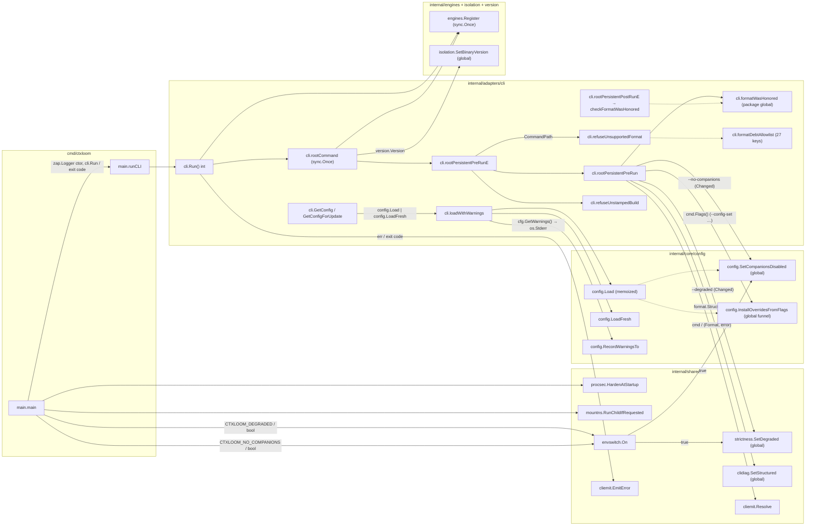
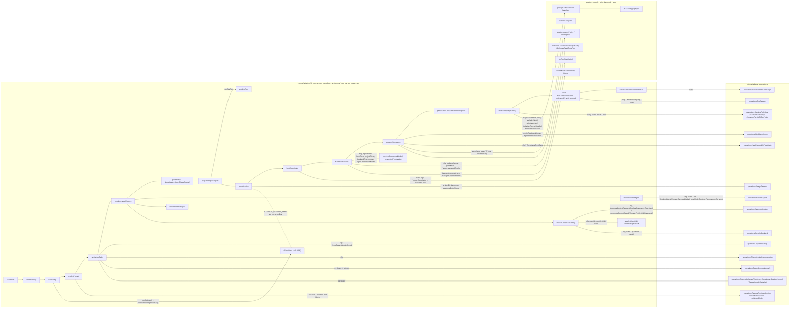
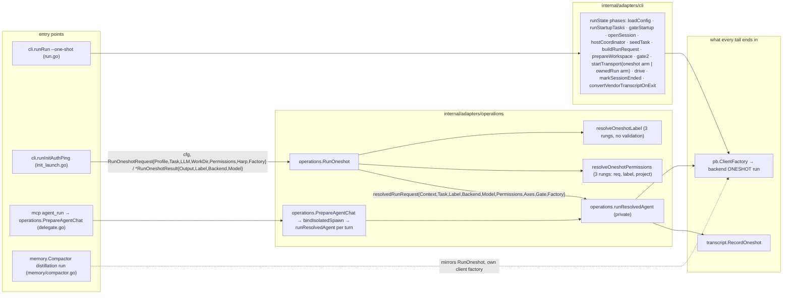
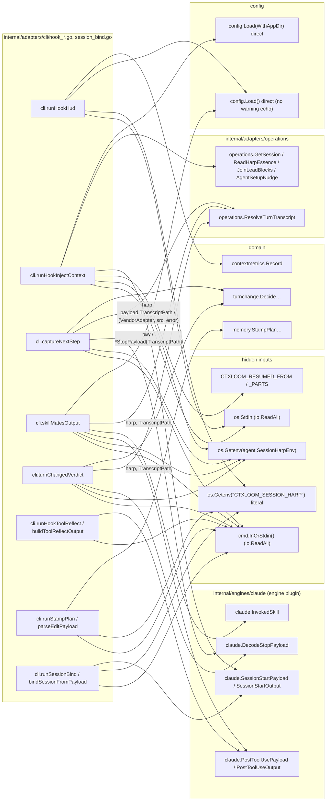
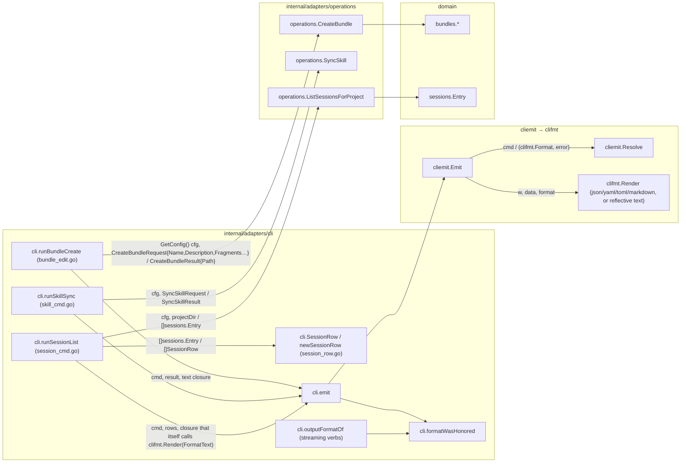
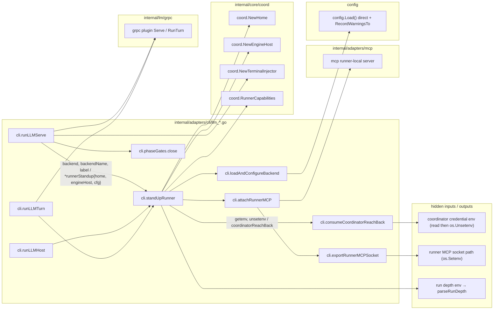
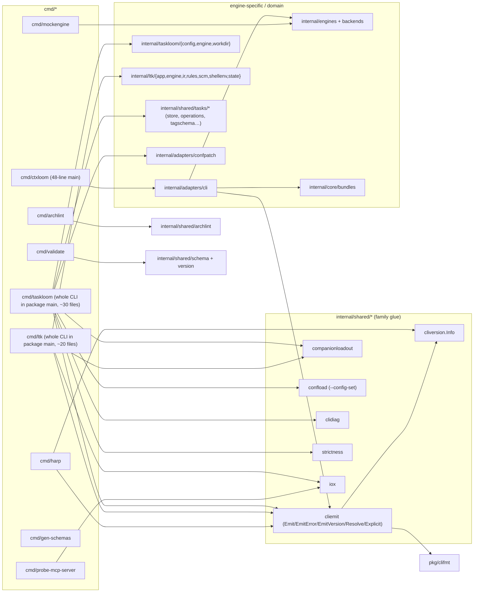
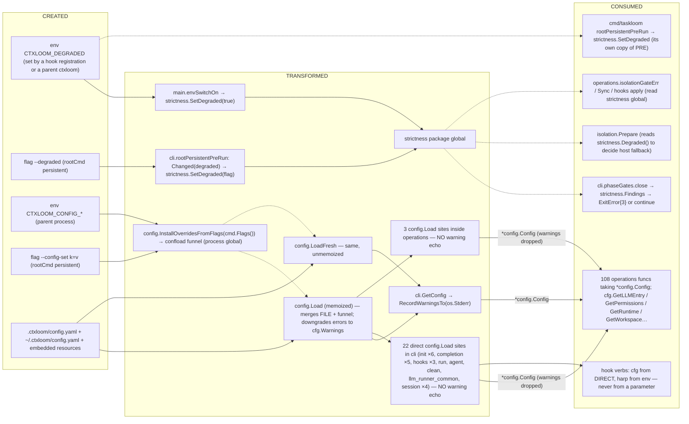
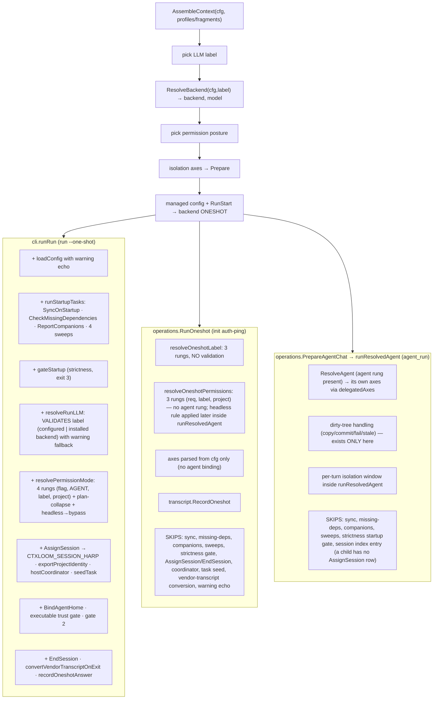

# Seam 6 — CLI <-> OPERATIONS boundary, and the binaries

Audit of `internal/adapters/cli` vs `internal/adapters/operations` (+ `internal/cliemit`, `internal/clifmt`), and the `cmd/*` binaries. Read-only; repository at `release/0.7` tip `d42cc4229` on 2026-09-18.

Status: COMPLETE (see the tail for the section inventory).

## 1. Scope and entry points

**Seam.** The boundary between `internal/adapters/cli` (the cobra command surface, one flat package + `internal/adapters/cli/tui`) and `internal/adapters/operations` (the frontend-neutral service layer, one flat package), the output layers (`internal/shared/cliemit`, `pkg/clifmt`), and the `cmd/*` binaries.

**Stated architecture read first.**
- `tests/arch/layering_test.go` — `layeringRules` table. The rule governing this seam is `operations-must-not-import-cli` (zero allowlist entries) plus `clifmt-must-not-import-ctxloom` (`pkg/clifmt` is the outermost edge). Its doc comment records that T20's per-flow rule `cli/<flow> -> operations/<flow> -> domain` is FUTURE work "once the per-flow package split lands". **There is no rule that cli must go THROUGH operations** — only that operations may not import back.
- `tests/arch/lean_binaries_arch_test.go` — `TestArch_LeanBinaries_DoNotLinkEngineDescriptors`: `go list -deps` of `./cmd/ltk` and `./cmd/taskloom` must not contain `internal/lm/engine`, `internal/engines`, `internal/lm/backends`, `internal/core/bundles`. Only those two binaries are gated.
- `tests/arch/engine_identity_arch_test.go` — `TestArch_Operations_DoesNotImportEnginePlugins` (operations must not import `internal/engines/claude` etc.).
- `docs/architecture/cli/README.md` (+ 13 sibling pages). Pinned to commit `0f59fbae` with line numbers. States: "the intended direction is `cmd/ctxloom` → `internal/adapters/cli` → `internal/adapters/operations` → domain, and no file in the package reaches past `operations`, `config`, `isolation`, or `resources` into domain internals. Its contract to callers is: parse flags, load config, call exactly one `operations` function, and render the result through `emit()`." It admits six thick files and lists invariants I1–I10.
- `GLOSSARY.md` — defines neither `operations`, `cliemit`, `clifmt` nor "thin surface"; the vocabulary doc is silent on this seam.

**Measured shape at `d42cc4229`** (the README's numbers are stale):

| Fact | README (`0f59fbae`) | Now |
|---|---|---|
| `internal/adapters/cli` production files / LOC | 93 / 22,479 | 120 / 28,581 |
| `internal/adapters/operations` production files / LOC | — | 85 / 28,969 |
| Sub-packages under `internal/adapters/cli` | none | `internal/adapters/cli/tui` only |
| Sub-packages under `internal/adapters/operations` (the T20 per-flow split) | none | none — not landed |
| In-repo packages imported by `internal/adapters/cli` | "operations, config, isolation, resources" | **60**, incl. `bundles`, `profiles`, `sessions`, `remote`, `trust`, `signing`, `memory`, `transcript`, `git`, `mcp`, `agentcoord{,/coord,/discover,/spool}`, `lm/{engines,backends,grpc,isolation}`, `vpio{,/dockerexec,/goplugin}`, `termui`, `tmuxhost`, `turnchange`, `compression`, `confpatch`, `contextmetrics`, and the engine plugin `internal/engines/claude{,/engine}` |
| In-repo packages imported by `internal/adapters/operations` | — | 47; none under `internal/adapters/cli` (rule holds); no engine plugin (rule holds) |
| cobra `Use:` strings in `internal/adapters/cli` | — | 167 (≈150 leaf verbs in ~30 families) |
| Files the README names that no longer exist | `mcp_runner.go`, `mcp_forward.go`, `coord_host.go`, `coord_*.go`, `mcp_tools_triggers.go`, `mcp_resources.go`, `memory.go` | moved/deleted |

**Packages read.** `internal/adapters/cli/*.go` (all 120 production files, signatures + the RunE bodies of every verb), `internal/adapters/operations` (exported surface + the entry points cli calls), `internal/shared/cliemit`, `pkg/clifmt`, `internal/shared/clidiag`, `internal/shared/confload`, `internal/core/config` (Load/LoadFresh/overrides), `cmd/{ctxloom,taskloom,ltk,harp,archlint,mockengine,probe-mcp-server,gen-schemas,validate}/main.go`, `internal/taskloom`, `internal/ltk`, `internal/shared/*` touched by the binaries, `tests/arch/*`, `tests/acceptance/cli_coverage_gate_test.go`.

**Entry points traced** (each is `package.Symbol` + file; the graphs in §2 follow these):

| Family | Entry symbol | File |
|---|---|---|
| process | `main.main` → `cli.Execute` | `cmd/ctxloom/main.go`, `internal/adapters/cli/root.go` |
| every verb | `cli.rootCmd.PersistentPreRunE` (the flag/env funnel) → `cli.GetConfig` / `cli.GetConfigForUpdate` | `internal/adapters/cli/root.go` |
| run | `cli.runCmd.RunE` (closure) → `cli.runOwned` / `cli.runStructured` / terminal arms | `internal/adapters/cli/run.go`, `run_owned.go`, `run_structured.go`, `run_terminal.go` |
| hook (hidden) | `cli.hookHudCmd`, `cli.hookInjectContextCmd`, `cli.hookNextStepCmd`, `cli.hookSkillMatesCmd`, `cli.hookStampPlanCmd`, `cli.hookToolReflectCmd`, `cli.hookTurnChangedCmd`, `cli.sessionBindCmd` | `internal/adapters/cli/hook_*.go`, `session_bind.go` |
| mcp | `cli.mcpServeCmd` → `mcp.*` | `internal/adapters/cli/mcp_server.go`, `mcp.go` |
| llm | `cli.llmServeCmd`, `cli.llmHostCmd`, `cli.llmTurnCmd` → `cli.standUpRunner` | `internal/adapters/cli/llm_*.go` |
| content CRUD | `bundle|fragment|command|skill|profile|agent|remote|mcp|llm|deps|session|signer|sign|review|search|clean|doctor|manage|config|init|container|companion|attach|plan watch|util config-write|version|completion` | per-file, see the table in §4 |
| other binaries | `cmd/taskloom` → `taskloom.Main`; `cmd/ltk` → `ltk.*`; `cmd/harp`; `cmd/archlint`; `cmd/mockengine`; `cmd/probe-mcp-server`; `cmd/gen-schemas`; `cmd/validate` | `cmd/*/main.go` |

**Rows already recording defects in this seam** (cited, not re-derived): `lively-revision` (To Do — the ruled output-struct/role-axis design; 0 of 82 emit sites use the reflective renderer), `agile-satin` (Done) and `legged-nuttiness` (Archived) — both retired by the coverage-based completeness gate `tests/acceptance/cli_coverage_gate_test.go` `TestCLICoverage_EveryLeafActuallyRan`; `capable-rinse` (premise→description rename, bundles seam, touches `fragment premises`), `reformed-scheme` (`tagma.arity` silent no-op in taskloom — cmd/taskloom), `urban-borough` (schema-version migrator over `internal/shared/upgrade` — config seam).


## 2. Call graphs (with data flow on the edges)

Conventions: nodes are `pkg.Symbol`; edge labels are `args / returns`; ctx and loggers omitted unless they are the finding. Dashed edges (`-.->`) are hidden inputs: package globals, env vars, or files read inside the callee.

### 2.1 Process entry and the config/flag funnel (every verb passes through this)



What crosses: the ONLY typed value that leaves this funnel is `*config.Config` (from `GetConfig`). Everything else the flags carry — degraded, no-companions, `--config-set`, structured-diagnostics — is written into a package global and read later as a hidden input by `strictness.*`, `config.Load`, `clidiag.Warn`, `isolation.*`. `cmd/taskloom/root.go`'s `rootPersistentPreRun` re-implements the middle of this graph (degraded → `strictness.SetDegraded`, `cliemit.Resolve` → `clidiag.SetStructured`, `--config-set` via `confload`) — see F-10.

### 2.2 `ctxloom run` — the launch state machine (`cli.runRun` over `cli.runState`)



The pipeline is real and well-ordered, but it lives in cli: `runState` is the seam-1 launch form, and the four steps that decide *what* runs — LLM label ladder (`resolveRunLLM`), permission ladder (`resolvePermissionMode`), the managed-config assembly, and the `pb.RunStart` build — are cli functions. The same four decisions are re-implemented, less completely, inside `operations.RunOneshot`/`runResolvedAgent` (§2.3, F-1).

### 2.3 The three oneshot launch tails (DIVERGENT PATHS — detail under F-1)



### 2.4 Hook verbs (Claude Code machine callbacks) — four-and-a-half copies of one scaffold



### 2.5 The thin-verb family and the emitter (representative: `bundle create`, `skill sync`, `session list`)



### 2.6 `llm serve | host | turn` — the runner standup (cli-resident coordinator plumbing)



### 2.7 The binaries



`TestArch_LeanBinaries_DoNotLinkEngineDescriptors` gates only the `TL` and `LTK` nodes against `ENG` and `BUND`. `HARP`, `PROBE`, `ARCH`, `VAL`, `GENS` are ungated; `MOCK` legitimately links `ENG`. **Both lean binaries already link the engine plugin `internal/engines/claude`** — measured with `go list -deps`: `cmd/ltk → internal/ltk/engine → internal/engines/claude` and `cmd/taskloom → internal/taskloom/engine → internal/engines/claude` (each companion's "install me into the engine's settings" adapter reuses claude's settings-file knowledge). So the near-miss the brief mentions was structural, not accidental: `f8403d65d` placed a `bundles`-typed decision in `internal/engines/claude`, which would have dragged `internal/core/bundles` into ltk and taskloom through that chain; `439a5c6c4` moved it out to `cli/skill_mates_decide.go`. The gate's real front line is `internal/engines/claude`'s own import list (today: `confpatch, paths, shared/agent{,/present}, clidiag, collections, ledger, wire`), and nothing pins that list (see F-11).

## 3. Delegation / layer graph

Solid arrows are the STATED direction (`cmd → cli → operations → domain`, and `cli → shared/*` glue). Thick arrows labelled **BYPASS** are production edges from `internal/adapters/cli` straight into a package the README says operations mediates. Dashed arrows labelled **AGAINST** are edges that flow the wrong way (a lower layer rendering, or reaching for process env instead of a parameter). Every edge here is a real `go list` import or a grep-confirmed call; counts are reference counts from §1's per-file scan.

```mermaid
flowchart TB
  CMD["cmd/ctxloom"]
  CLI["internal/adapters/cli (120 files, 28.6k)"]
  TUI["internal/adapters/cli/tui"]
  OPS["internal/adapters/operations (85 files, 29.0k, flat)"]
  EMIT["shared/cliemit → pkg/clifmt"]
  GLUE["shared/{clidiag,strictness,confload,iox,harpmarker,tokens,upgrade,watch,…}"]
  CFG["internal/core/config"]
  ISO["internal/adapters/isolation"]
  RES["resources"]

  subgraph domain["domain (README: reached only through operations)"]
    BUN["bundles"]
    PRO["profiles"]
    SES["sessions"]
    REM["remote"]
    TRU["trust · signing · agentkey"]
    MEM["memory"]
    TRN["transcript · vendorreader"]
    GIT["git · gitignore"]
    MCP["internal/adapters/mcp"]
    COORD["agentcoord · coord · discover · spool"]
    ENG["lm/engines · lm/backends · lm/grpc"]
    VPIO["vpio · dockerexec · goplugin"]
    CLAUDE["internal/engines/claude (engine plugin)"]
    MISC["compression · confpatch · contextmetrics · turnchange · termui · tmuxhost · selfexec"]
  end

  CMD --> CLI
  CLI --> OPS
  CLI --> TUI
  CLI --> EMIT
  CLI --> GLUE
  CLI --> CFG
  CLI --> ISO
  CLI --> RES
  OPS --> CFG
  OPS --> ISO
  OPS --> BUN
  OPS --> PRO
  OPS --> SES
  OPS --> REM
  OPS --> TRU
  OPS --> MEM
  OPS --> TRN
  OPS --> GIT
  OPS --> COORD
  OPS --> ENG

  CLI == "BYPASS bundles ×~45 (bundle_list, bundle_view, doctor, item_kind, trust_interactive, skill_mates_decide)" ==> BUN
  CLI == "BYPASS remote ×~60 (deps_check 34, deps_reconcile 12, doctor, item_list)" ==> REM
  CLI == "BYPASS sessions ×~25 (session_row, session_query, session_full, session_transcript…)" ==> SES
  CLI == "BYPASS trust/signing/agentkey ×~55 (doctor 14+2, bundle_view 7, review 6, sign 5, init_systemdeps 5, trust_interactive 5)" ==> TRU
  CLI == "BYPASS coord ×~45 (llm_runner_common 24, run_owned 7, run_terminal_ui 5, run 3, llm_serve 3) + spool ×22 (doctor_spool)" ==> COORD
  CLI == "BYPASS engines/backends/grpc ×~50 (run 7, init_engine_select 4, manage 4, profile_materialize_surfaces 3, container 2…)" ==> ENG
  CLI == "BYPASS vpio/dockerexec/goplugin ×~14 (run, run_terminal, init_launch)" ==> VPIO
  CLI == "BYPASS mcp ×~19 (bundle_list 10, run 3, llm_runner_common 3, mcp_server 2)" ==> MCP
  CLI == "BYPASS memory · transcript ×~10 (run 4+1, session_cmd, hook_next_step, hook_stamp_plan 2)" ==> MEM
  CLI == "BYPASS claude ×~40 across 8 hook files + skill_mates_decide + doctor_mcp_invocation" ==> CLAUDE
  CLI == "BYPASS git/gitignore ×~14 (doctor 4+2, manage 5, init 3)" ==> GIT
  CLI == "BYPASS compression 10 · confpatch 5 · contextmetrics 4 · turnchange 4 · termui 13 · tmuxhost 2 · selfexec 2" ==> MISC

  OPS -. "AGAINST: renders prose to io.Writer (Sweep*, ReportCompanions, WriteAndRecordSyncSummary) and clidiag.Warn/os.Stderr in 12+ files" .-> EMIT
  OPS -. "AGAINST: config.Load inside SetLLM, resolveListConfig, WatchSessionFeed" .-> CFG
  OPS -. "AGAINST: reads os.Getenv(agent.SessionHarpEnv) / CTXLOOM_* in sessions, sessionfeed, delegate" .-> GLUE
  CLAUDE -- "links into cmd/ltk and cmd/taskloom via ltk/engine, taskloom/engine" --> CMD
```



Reading: the rule that is ENFORCED (`operations-must-not-import-cli`) holds with zero exceptions. The rule that is STATED in prose ("no file in the package reaches past operations, config, isolation, or resources") is violated by 60 imports and several hundred call sites, and nothing checks it. There is no per-flow structure on either side: both packages are flat, so "cli/<flow> → operations/<flow>" cannot be expressed, only "cli → operations".

### 3.1 DATA-FLOW graph — one config value from flag/env/file to use site

Traced value: **the degraded switch**, and beside it the **`--config-set` override** (the two values the funnel in §2.1 carries). Boxes are the hands that create/transform/consume; dashed edges are the hidden hops (globals, env, files).



**Data-flow smells on this path (each cited in §4):** the degraded value has NO typed carrier — it is a global written in two places (`main`, `PreRun`) and read in three packages; `--config-set` is a global funnel that `config.Load` consults invisibly, so a `Load` deep in operations silently sees flag state the caller never passed; the warning echo is a property of ONE wrapper (`cli.loadWithWarnings`) rather than of loading, so the 25 non-wrapper load sites drop it; `*config.Config` then travels as a God parameter into 108 operations functions, none of whose signatures say which keys they read.


## 4. Findings

### 4.0 The centrepiece: verb → operations entry point(s) → business logic that lives in cli

Method: every production file in `internal/adapters/cli` was scanned for `operations.<Exported>` references and for direct references into domain packages; the RunE bodies and helpers of every family were read. "Business logic in cli" names the symbols that DECIDE something (resolve, validate, classify, diff, mint, plan) rather than parse/render. Rendering helpers (`render*`, `print*`) are omitted unless they carry a decision. `—` in the operations column means the verb calls NO operations function.

| Verb (family) | operations entry point(s) | Business logic that lives in cli (symbol, file) | Emitter |
|---|---|---|---|
| `run` | `AssembleContext`, `ResolveAgent`, `ResolveBackend`, `AssignSession`, `EndSession`, `SyncOnStartup`, `CheckMissingDependencies`, `ReportCompanions`, `Sweep*`, `BindAgentHome`, `NewExecutableTrustGate`, `RuntimeForPolicy`, `CellKindForPolicy`, `ContainerPersistDirForPolicy`, `ResolvePreviousSession`, `ReadHarpEssence`, `JoinLeadBlocks`, `ConvertVendorTranscript`, `RecordedSessionEntries`, `RenderResumedTranscript`, `CompactEntry`, `Liveness`, `ResolveAndHeal`, `GetCommand`, `GetSession`, `MockControlFor`, `IsolationImageConfig`, `SweepHarpArtifacts` (40 symbols) | THE LAUNCH STATE MACHINE: `cli.runState` + 35 phase methods (`run.go`); `cli.resolveRunLLM`/`validateExplicitLLM`/`usableLLMs`; `cli.resolvePermissionMode`/`requestedPermission`; `cli.buildRunRequest` (builds `pb.RunStart`, `agent.ManagedConfig` via `backends.AssembleManagedConfig`); `cli.prepareWorkspace` (calls `isolation.Prepare`); `cli.startTransport` (4 arms), `cli.startContainerInteractive`, `cli.runOwned` (`run_owned.go`, coord transport + own event renderer), `cli.runStructured`, `cli.resumeDistillEnv`, `cli.seedTaskIntoSession` (taskloom write), `cli.warnBypassOnLostContainer`, `cli.stampHostTerminalEnv`, `cli.recordOneshotAnswer`, `cli.phaseGates` (the strictness gate itself, `startup_helpers.go`) | `emitDryRun`→emit; otherwise bare `fmt.Print` ×18 + `outputFormatOf` for `run_structured` |
| `init` / `init prompt` | `InitializeProject`, `AddRemote`, `EnsureRemoteClones`, `SyncDependencies`, `ApplyHooks`, `RunOneshot`, `AssignSession`, `ResolveSetupPrompt` | `cli.checkSystemDeps`/`warnIfNoSignKey`/`warnIfGitIdentityMissing` (`init_systemdeps.go`); engine selection (`init_engine_select.go`, `backends.*` direct); the interactive interview (`init_prompts.go`); pty engine launch + auth-ping (`init_launch.go`, `vpio`/`goplugin` direct); six direct `config.Load(WithAppDir)` | bare `fmt.Print` ×45 across 4 files (ledger: `init`, `init prompt`) |
| `hook hud` | — | `cli.contextSample`/`recordContextSample` (`contextmetrics` direct), `gatherCtxloomInfo` (direct `config.Load`), `formatHud` | writes hook JSON/text to `os.Stdout` |
| `hook inject-context` | `GetSession`, `ReadHarpEssence`, `JoinLeadBlocks`, `AgentSetupNudge` | `cli.resolveInjectContextWorkDir`, `currentSessionRecoverable`, `selectChunk` (the chunking policy), `resumedEssenceForInjection`, `agentSetupNudge` (direct `config.Load(WithAppDir)`) | hook JSON to `os.Stdout` |
| `hook next-step` | `ResolveTurnTranscript` | `cli.captureNextStep` → `memory`/`turnchange` direct | stdout |
| `hook skill-mates` | `ResolveTurnTranscript` | `cli.skillMatesOutput` + `cli.decideSkillMates` (`skill_mates_decide.go`, `bundles.UninvokedSkillMates` direct, direct `config.Load`) | hook JSON |
| `hook turn-changed` | `ResolveTurnTranscript` | `cli.turnChangedVerdict` → `turnchange` direct | stdout |
| `hook tool-reflect` | — | `cli.buildToolReflectOutput` (`claude.*` types only) | hook JSON |
| `hook stamp-plan` | — | `cli.parseEditPayload` → `memory.StampPlan…` direct | stdout |
| `hook session-bind` | `BindSession` | `cli.bindSessionFromPayload`, `emitHarpMarker` | hook JSON |
| `mcp serve` | — | `cli.runMCPServerSDK` → `mcp.ServeStdio` with `phaseGates` gate; thin | n/a (server) |
| `mcp server list/show/edit` | `ListMCPServers`, `GetMCPServer`, `GetBundleMCP`, `SetBundleMCP` | `bundle_items.go` edit flow (`bundles` direct) | emit; `mcp server edit` in ledger |
| `llm serve` / `host` / `turn` | `DecodeBackendConfig`, `ContainerPersistDirForPolicy` | `cli.standUpRunner` (`coord.NewHome`, `NewEngineHost`, runner-local MCP, credential scrub, depth parsing — `llm_runner_common.go`, `coord` ×24); `cli.serveBackendConfig`; `cli.writeRunStartHandoff`/`readRunStartHandoff` (file-based `pb.RunStart` hand-off, `llm_turn.go`); `runnerIsLeaf` | n/a |
| `llm list/default/create/edit/remove` | `AvailableLLMNames`, `SetDefaultLLM`, `SetLLM`, `RemoveLLM`, `AgentRuntimeOffer` | `llm_resolve.go` (`backends` direct) | emit |
| `agent list/show/create/edit/default/remove` | `ListAgents`, `GetAgent`, `SetAgent`, `RemoveAgent`, `ResolveAgent`, `CapabilityLoss` | `cli.checkAgentExistence`, `buildSetAgentRequest`, `setDefaultAgent` (writes config via `GetConfigForUpdate`), `capabilityLossByAgent` | emit (`agent default` in ledger) |
| `profile list/show/create/remove/modify/edit/export/import/materialize` | `ListProfiles`, `GetProfile`, `CreateProfile`, `DeleteProfile`, `UpdateProfile`, `ExportProfile`, `ImportProfile`, `MaterializeProfile`, `AssembleContext`, `GetProfileContent`, `SetProfileContent` | `cli.profileCreateDirs`/`profileLoaderFSOptions` (`profiles` direct ×6); `profile_materialize_surfaces.go` (`backends` ×3); `editProfileFile` (`edit_helpers.go`, `context.Background()`) | emit; 5 profile verbs in ledger |
| `bundle list/show/view/create/edit/remove/move/push/export/import/distill/trust/reject/forget` | `ListBundles`, `GetBundle`, `ReadBundle`, `CreateBundle`, `UpdateBundle`, `DeleteBundle`, `MoveBundle`, `PushBundle`, `SignBundleFile`, `ExportBundle`, `ImportBundle`, `DistillBundleFile`, `DistillBundleItem`, `SetItemTrust`, `SetBlacklist`, `ForgetItemDecision`, `ApplyHooks`, `HarnessStatus`, `EffectiveTrust`, `ResolveBundleRemote` | `bundle_list.go` (`bundles` ×13, `mcp` ×10: `bundleContentParts`, MCP entry classification); `bundle_view.go` (`trust` ×7, `lookupBundleMCP`); `bundle_push_cli.go` `resolvePushSignature`/`mintPushSignature` (signature minting, `agentkey` direct); `bundle_distill.go` (`compression` ×10 — the distill pipeline wiring); `trust_interactive.go` (`offerItemTrust`/`offerBundleTrust`/`offerBundleHookTrust` — the interactive trust decision, `trust` ×5) | emit |
| `fragment` / `command` / `skill` `list/show/create/remove/edit/distill/premises` | `ListFragments`, `ListCommands`, `AddItem`, `DeleteItem`, `GetItemContent`, `SetItemContent`, `DistillItem`, `PremiseIndex`, `RenderPremiseIndex`, `ListSkills`, `GetSkill`, `CreateSkill`, `RemoveSkill`, `SyncSkill`, `ExportSkill`, `ImportSkill` | `item_kind.go` `itemKindOf`/`itemRefTarget` (`trust`/`bundles` direct); `cli.Distiller` glue (`distiller.go`); `skill export` mints a signature with its own `agentkey.NewDiscoverer().Discover` | emit (`fragment show`, `command show` in ledger) |
| `deps list/pull/check/upgrade/hold/unhold/verify-corpus` | `ListRemotes`, `SyncDependencies`, `UpgradeDependencies`, `SetItemPin`, `CheckConfiguredCorpus`, `GetCachedFetcher`, `NewCachedFetcherFactory`, `NewRepoCache`, `RemoveLocalItems` | **`deps check` has NO operations counterpart**: `cli.detectUpdates`, `detectSingleUpdate`, `latestWithinConstraint`, `refreshRemoteRepos`, `checkDefaultProfiles`, `lookupLockedEntry` (`deps_check.go`, `remote` ×34); `cli.planReconcile`/`reconcileInstalled`/`upstreamProbes` (`deps_reconcile.go`, `remote` ×12) | bare `fmt.Print` ×9 (`deps check`), ×10 (`deps upgrade`); `deps pull/hold/unhold/check/upgrade` in ledger |
| `remote create/remove/list/default/edit/show/discover` | `AddRemote`, `RemoveRemote`, `ListRemotes`, `SetDefaultRemote`, `EditRemote`, `BrowseRemote`, `DiscoverRemotes` | `remote_discover.go` `interactiveAdd`/`readRepoChoice` — opens its OWN `bufio.NewReader(os.Stdin)` (README I3 violation still present) | bare `fmt.Print` ×17 (`remote discover`); 4 remote verbs in ledger |
| `sign` / `signer trust|list|show|untrust` / `review` | `SignBundleFile`, `ResolveSignTarget`, `ListLocalBundleNames`, `AddSigner`, `ListSigners`, `ShowSigner`, `RemoveSigner`, `ResolveSignerKey`, `ResolveSignerNamespaces`, `PendingReview`, `SetItemTrust`, `SetBlacklist` | `cli.resolveSignKeyOverride`, `resolveSignTargets` (`sign.go`); `cli.resolveReviewSigner`, `reviewApplier`, `runReviewWalk`, `unifiedReviewDiff`, `warnIfSoftwareKey`, `confirmUnsignedReview` (`review.go` — the countersigning walk); `cli.reviewWantsListing` | emit (list); walk renders bare |
| `manage install/uninstall/check/hooks */statusline */gitignore install/commit trust|untrust` | `InitializeProject`, `ApplyHooks`, `RemoveHooks`, `ResolveHooks`, `SetStatusline`, `HarnessStatus`, `AvailableLLMNames`, `ConfiguredEngines`, `AgentSurfaceLoss`, `SurfaceCurrency` | `cli.ensureHarnessGitignore`, `ignoreLineDiff`, `ignoreRuleLines`, `missingFrom` (`manage.go` — gitignore rule reconciliation, `gitignore` ×5); `checkEngineKnown`, `checkInstallEngineApplies`; `runManageDirtyTreeAck` | emit ×11 + bare ×5 |
| `doctor` | `HarnessStatus`, `PendingReview`, `ListSigners`, `ResolveAgent`, `ResolveBackend`, `CapabilityLoss`, `AssembleContext`, `BackendWiring`, `HarpTopLevelArtifacts`, `MigrateHarpArtifacts`, `LiveRefusedAdvances`, `QueryCoordinatorSpoolStats`, `VendorReaderAdaptersFor` | **35 `doctorCheck*` functions in cli** (`doctor_cmd.go` 1,456 lines + `doctor_spool.go` 389 + `doctor_transcript_reader.go` + `doctor_mcp_invocation.go`): sign-key resolution, git identity, foreign worktrees (`git` direct), gitignore posture, content trust classification, upstream signatures, harp durability, spool backlog (`spool` ×22 direct), local-tier state, ingestion limit… | emit (one report) |
| `session list/show/remove/distill/edit/search/watch/adopt/purge/artifacts/transcript/worktrees` | `ListSessionsForProject`, `ListAllSessions`, `GetSession`, `ForgetSession`, `RenameSession`, `PurgeSession`, `DistillEntry`, `CompactEntry`, `ResolveAndHeal`, `SessionEssenceInfo`, `WatchSessionFeed`, `ScanAdoptCandidates`, `ApplyAdopt`, `LivenessUnknown` | `cli.SessionRow`/`newSessionRow` (projection, `sessions` direct in 6 files); `cli.loadSessionEntries`/`sessionAppDir`; `cli.undistilledSessionError`; `session_worktrees.go` `classifyHarpWorktrees`/`sweepHarpWorktrees` (`isolation` ×8 — parallel to `operations.SweepOrphanedWorktrees`); `session_full.go` hand-rolled format branch | emit + direct `clifmt.Render`; `outputFormatOf` for `watch`; `session distill` in ledger |
| `clean` | `CleanCache`, `ReclaimAgedSessions`, `ReclaimEphemeral`, `ReclaimEphemeralAndPersist` | `cli.sessionReapCutoff`, `parseAgeBound`, `expandDurationUnits` (age policy parsing) | emit |
| `container build/check/scaffold/provenance/tooling/list` | `CollectTooling`, `ScaffoldContainerBase`, `ResolveBackend`, `IsolationImageConfig` | `cli.containerBuildOptions`, `containerCheckConfigGap` (`isolation` ×10 direct: build/diagnose) | emit ×3; `container build/scaffold` in ledger |
| `config show/get/edit/create` | `InitializeProject` | `paths` direct; `config create` uses `context.Background()` | emit; `config edit/create` in ledger |
| `util config-write` | — | the whole hew/confpatch patch-apply-verify-record pipeline: `runConfigWrite`, `recordConfigPatch`, `buildAndWriteApplicationRecord`, `inverseOps`, `verifyConfigWrite` (`util_config_write.go`, 747 lines) | emit |
| `search` | `SearchContent`, `SearchRemotes` | — (thin) | emit |
| `companion list/show` | — | reads companion loadouts directly | emit |
| `attach` | — | `tmuxhost` direct | n/a |
| `plan watch` | — | `watch`/`paths` direct | `outputFormatOf` |
| `completion` | `ListFragments`, `ListCommands`, `ListProfiles` | five direct `config.Load()` in completers | cobra |
| `version` | — | `cliemit.EmitVersion` | cliemit |

**Reading the table.** Of ~150 leaf verbs, roughly 90 fit the stated contract (flags → one or two operations calls → `emit`). The rest split into three shapes: (a) orchestrators that live in cli with no operations home — `run`, `llm serve/host/turn`, `init`, `doctor`, `util config-write`, `deps check`, `review`; (b) verbs whose DECISION logic is in cli beside a thin operations call — signing-key resolution (6 sites), permission and LLM ladders, trust offers, gitignore reconciliation, worktree classification; (c) the hook verbs, which are Claude-Code-specific and call `internal/engines/claude` directly. An MCP or VS Code frontend gets none of (a) or (b): the operations layer does not contain them.

### 4.1 Ranked findings

Ranked by blast radius: how many entry points share the defect and whether a non-CLI frontend (MCP, VS Code, delegation) gets a different answer than the CLI does.

---

#### F-1 · DIVERGENT PATHS + DUPLICATION — three launch tails for "run an engine once", and the decision ladders are implemented twice with different rungs

**Sites.**
- `cli.runRun` / `cli.runState` (`internal/adapters/cli/run.go`) — `ctxloom run` including `--one-shot`; the most complete.
- `operations.RunOneshot` → `operations.runResolvedAgent` (`internal/adapters/operations/oneshot.go`) — single production caller: the `init` auth-ping in `internal/adapters/cli/init_launch.go`.
- `operations.PrepareAgentChat` → `bindIsolatedSpawn` → `runResolvedAgent` per turn (`internal/adapters/operations/delegate.go`) — the MCP `agent_run` delegation path.
- `memory.Compactor` (`internal/adapters/memory/compactor.go`) "mirrors" the same tail with its own client factory (the doc comment on `RunOneshot` says so).

The doc comment on `operations.RunOneshotRequest` states the divergence outright: *"The init auth-ping builds on it directly; a delegated child's oneshot fallback and `ctxloom run --print` mirror the same tail (runResolvedAgent) without going through this facade."*

**Shared trunk and branches.**



**Concrete consequence.** `ctxloom run --llm nosuch` fails with *"unknown LLM … usable now: …"* (`cli.validateExplicitLLM`); the same label through `init`'s auth-ping or a delegated child reaches `ResolveBackend` unvalidated (`resolveOneshotLabel` returns it verbatim). An agent binding's declared permissions are honoured by `run --agent` but are not a rung in `resolveOneshotPermissions`. Dependency sync and the missing-dependency check run for a top-level `run` and never for a delegated child in the same tree.

**Settles it.** One `operations.Launch`-shaped service holding the trunk (label ladder with validation, permission ladder with the agent rung, axes, managed config, RunStart) that `cli.runRun`, `RunOneshot` and `PrepareAgentChat` all call; delete `cli.resolveRunLLM`/`validateExplicitLLM`/`usableLLMs` and `cli.resolvePermissionMode`/`requestedPermission` OR delete `operations.resolveOneshotLabel`/`resolveOneshotPermissions` — whichever survives must be the four-rung, validating one. A test that runs the same label/permission inputs through `run --one-shot` and `RunOneshot` and asserts identical `(label, backend, PermissionMode)` would make the divergence checked.

---

#### F-2 · MISSING LAYER — the operations layer has no home for orchestration, so the orchestrators live in cli and no other frontend can reach them

**What the layer would be.** "Operations that are a sequence of operations": launch, runner standup, doctor, dependency check, review walk, config patching. Today each is a cli-resident function with no operations symbol.

**Sites that would collapse into it** (all `internal/adapters/cli`):
- `cli.runState` and its 35 phase methods (`run.go`, `run_owned.go`, `run_terminal*.go`) — the launch orchestrator; the `runState` struct is the seam-1 launch form and is unreachable from MCP.
- `cli.standUpRunner`, `attachRunnerMCP`, `consumeCoordinatorReachBack`, `exportRunnerMCPSocket`, `runnerIsLeaf` (`llm_runner_common.go`) — runner-side coordinator standup, `coord` ×24 direct.
- `cli.doctorCheck*` ×35 (`doctor_cmd.go` 1,456 lines, `doctor_spool.go`, `doctor_transcript_reader.go`, `doctor_mcp_invocation.go`) — every diagnostic is computed in cli against `git`, `agentkey`, `trust`, `remote`, `spool`, `bundles`, `paths` directly; `ctxloom doctor --format json` exists only because the whole report is built in cli.
- `cli.detectUpdates`, `detectSingleUpdate`, `latestWithinConstraint`, `refreshRemoteRepos`, `checkDefaultProfiles` (`deps_check.go`, `remote` ×34) — `deps check` has NO operations entry point at all.
- `cli.planReconcile`, `reconcileInstalled`, `upstreamProbes` (`deps_reconcile.go`).
- `cli.runReview`, `resolveReviewSigner`, `reviewApplier`, `runReviewWalk`, `unifiedReviewDiff` (`review.go`) — countersigning decisions.
- `cli.runConfigWrite` and the hew pipeline (`util_config_write.go`, 747 lines).
- `cli.ensureHarnessGitignore`, `ignoreLineDiff`, `ignoreRuleLines` (`manage.go`).
- `cli.classifyHarpWorktrees`/`sweepHarpWorktrees` (`session_worktrees.go`, `isolation` ×8) beside `operations.SweepOrphanedWorktrees` (`internal/adapters/operations/startup_helpers.go`) — two worktree sweepers, the operations one taking an `io.Writer`.
- `cli.offerItemTrust`/`offerBundleTrust`/`offerBundleHookTrust` (`trust_interactive.go`) — the interactive trust decision.

**Settles it.** For each row, an operations function returning a typed result (no `io.Writer`, no prompting) and a cli that only renders it. The measure of done is the table in §4.0 having an empty "business logic in cli" column for every row except interactive prompting.

---

#### F-3 · STATED-VS-ACTUAL — the README's layering sentence is false at 60 imports and nothing checks it

`docs/architecture/cli/README.md`: *"no file in the package reaches past `operations`, `config`, `isolation`, or `resources` into domain internals."* Measured: `internal/adapters/cli` imports 60 in-repo packages (§1), including every domain package the sentence names as forbidden, and the engine plugin `internal/engines/claude`. `tests/arch/layering_test.go` enforces only `operations-must-not-import-cli`; there is no `cli-must-not-import-<domain>` rule, and the T20 per-flow rule the test's comment anticipates cannot be written because neither package has flows (both are flat).

Also stale in the same README (pinned to `0f59fbae`, with line numbers): `cli.Execute` (now `cli.Run() int`), `failOnFindings` (now `cli.phaseGates.close`), "five MCP server flavours in cli" (moved to `internal/adapters/mcp`; `mcp_server.go` is 40 lines), the 930-line `RunE` closure (now `runRun` + `runState`), I3's cited violation in `remote_discover.go` (fixed — it uses `stdinReader` from `prompt.go`), I6's claim that `llm serve/host/turn` skip the strictness gate (they call `newPhaseGates`), the five "deprecated alias trees" (deleted), file/LOC counts, and the named files `mcp_runner.go`, `mcp_forward.go`, `coord_host.go`, `memory.go`, `item_helpers.go` (gone).

**Settles it.** Either add a `layeringRule{from: "internal/adapters/cli", forbid: [...domain...], allowed: {…}}` with the current 60 as a shrinking allowlist (the mechanism already exists and has an `IsLive` staleness test), or delete the sentence. Delete the line-number-pinned README sections rather than correct them (per the project's own binding rule: correcting one entry makes the rest look verified).

---

#### F-4 · LAYER BYPASS — cli imports the engine plugin `internal/engines/claude` that operations is gated from

`TestArch_Operations_DoesNotImportEnginePlugins` (`tests/arch/engine_identity_arch_test.go`) keeps `internal/engines/claude` out of operations. `internal/adapters/cli` imports `internal/engines/claude` (and `internal/engines/claude/engine`) in 8 production files — measured by import line, not by name: `hook_inject_context.go`, `hook_next_step.go`, `hook_skill_mates.go`, `hook_tool_reflect.go`, `hook_turn_changed.go`, `session_bind.go`, `skill_mates_decide.go`, `doctor_mcp_invocation.go`; `hook_stamp_plan.go` and `hook_hud.go` decode Claude-shaped payloads with local structs without importing the package. The hook verbs' types are all `claude.SessionStartOutput`, `claude.PostToolUseOutput`, `claude.StopPayload` — the hidden `hook` namespace is a Claude Code namespace in an engine-neutral binary, and adding a second engine's hooks would mean a second set of verbs or a `switch` on engine inside each.

**Settles it.** Extend the engine-plugin rule to `internal/adapters/cli` with an allowlist naming the hook files and the fix ("decode the vendor payload in the engine's own package behind an engine-neutral `operations.HookEvent`"), so the set cannot grow silently.

---

#### F-5 · DUPLICATION — eight hook verbs, one scaffold copied eight ways

| Concern | Variants found |
|---|---|
| read the payload | `io.ReadAll(os.Stdin)` (`runHookHud`, `runHookInjectContext` — bypasses cobra's `SetIn`, untestable through the command) vs `io.ReadAll(cmd.InOrStdin())` (`captureNextStep`, `skillMatesOutput`, `turnChangedVerdict`, `runHookToolReflect`, `runStampPlan`) vs `io.ReadAll(in)` (`bindSessionFromPayload`) |
| decode it | `claude.DecodeStopPayload` (×2) · inline `json.Unmarshal(&claude.PostToolUsePayload)` (×2) · inline `json.Unmarshal(&claude.SessionStartPayload)` (×2) · `cli.parseEditPayload` · `cli.agentSessionJSON` |
| session harp | `os.Getenv("CTXLOOM_SESSION_HARP")` literal (`hook_hud.go` ×2, `hook_stamp_plan.go`, `session_bind.go`) vs `os.Getenv(agent.SessionHarpEnv)` (`hook_next_step.go`, `hook_skill_mates.go`, `hook_turn_changed.go`, `hook_inject_context.go`) |
| transcript | `operations.ResolveTurnTranscript(ctx, harp, payload.TranscriptPath)` in 3 of the 4 that need it |
| config | direct `config.Load()` (`gatherCtxloomInfo`, `skillMatesOutput`), `config.Load(config.WithAppDir(...))` (`agentSetupNudge`); none through `GetConfig` |
| output | hand-built JSON to stdout in each |

The harp literal is not a cli-only problem: `"CTXLOOM_SESSION_HARP"` appears as a string in 12 production files across `cli`, `agentcoord/coord`, `lm/grpc`, `lm/isolation`, `mcp`, `memory` while `agent.SessionHarpEnv` exists (`internal/core/agent/launch_backend.go`) — the same value under two names along one path.

**Settles it.** One `cli.hookInvocation(cmd) (raw []byte, harp string, cfg *config.Config, err)` helper plus per-kind decoders in `internal/engines/claude`; a vocabulary-adoption-style test (the repo already has `tests/arch/vocabulary_adoption_test.go`) that fails on the literal outside its const.

---

#### F-6 · DATA-FLOW SMELL — config is re-loaded at 25 sites outside the funnel, dropping the warning echo; README I1 is false on both sides

README I1: *"Every command reads config through `GetConfig()` … `operations` never loads config itself."* Measured:
- 22 direct `config.Load` calls in `internal/adapters/cli` production code outside `root.go`: `init.go` ×6 (`WithAppDir`, arguably legitimate — a different tree), `completion.go` ×5, `hook_hud.go`, `hook_skill_mates.go`, `hook_inject_context.go`, `agent.go`, `clean_cmd.go`, `llm_runner_common.go`, `run.go` (`runState.loadConfig` re-implements `loadWithWarnings` inline), `session_cmd.go` ×2, `session_distill.go` ×2, `session_query.go`.
- 3 inside operations: `operations.SetLLM` (re-read after save, `llm.go`), `operations.resolveListConfig` (`mcp_servers.go` — a nil `cfg` parameter means "load your own": an optional hidden input), `operations.WatchSessionFeed` (`sessionfeed.go` — loads config deep in the chain to recover a backend name the caller had).

None of the 25 echo `cfg.GetWarnings()`; a malformed config is silently partial on those paths. The comment in `rootPersistentPreRun` already knows: *"config.Load is called from ~10 sites across the CLI — a per-Config toggle would only take effect on whichever one happened to be wired."*

**Settles it.** Make the warning echo a property of loading (record once per process inside `config.Load`, or have `Load` return warnings the caller cannot drop), then a grep-style arch test that `config.Load(` appears in `internal/adapters/cli` only in `root.go` (and `init.go` with `WithAppDir`).

---

#### F-7 · DATA-FLOW SMELL — the process switches travel as package globals, and the family binaries re-implement the funnel

The degraded switch is written in `main.main` (env) and `cli.rootPersistentPreRun` (flag) into `strictness` package state, then read by `cli.phaseGates.close`, `isolation.Prepare`, `operations.isolationGateErr`, `operations.SyncOnStartup`… with no parameter naming it. `--no-companions` → `config.SetCompanionsDisabled` global; `--config-set`/`CTXLOOM_CONFIG_*` → `config.InstallOverridesFromFlags` global funnel consulted invisibly by every later `config.Load`; `--format` structuredness → `clidiag.SetStructured` global; `version.Version` → `isolation.SetBinaryVersion` global (the comment admits: *"isolation could import internal/shared/version directly (it's a leaf), but this stays a Set\* push for now rather than churning that wiring too"*). `cmd/taskloom/root.go`'s `rootPersistentPreRun` re-implements the degraded/format/config-set part of the same funnel by hand.

**Settles it.** A shared `cliboot`-style helper in `internal/shared` that owns persistent-flag registration + PreRun for every family binary (one place to add a switch), and threading `strictness.Mode` as a value into the few functions that branch on it.

---

#### F-8 · DUPLICATION — "who is the local signer" is resolved six times in cli, never in operations

`agentkey.NewDiscoverer().Discover(ctx, cfg.SignKey()|keyFlag)` with surrounding fallback/warning logic at: `cli.runSign` + `resolveSignKeyOverride` (`sign.go`), `cli.resolveReviewSigner` + `warnIfSoftwareKey` (`review.go`), `cli.resolvePushSignature`/`mintPushSignature` (`bundle_push_cli.go` — comment: *"mirroring internal/adapters/cli/sign.go's runSign"*), `cli.signKeyResolutionDetail` (`doctor_cmd.go` — comment: *"see review.go's resolveReviewSigner"*), `cli.warnIfNoSignKey` (`init_systemdeps.go`), and `skill export` (`skill_cmd.go`). `operations.ResolveSignerKey` is a different thing (a publisher's key to trust). The most complete copy is `review.go`'s (handles unsigned confirmation and software-key warning).

**Settles it.** `operations.ResolveLocalSigner(ctx, cfg, explicitKey string) (ssh.Signer, SignerOrigin, error)`; six call sites become one call each.

---

#### F-9 · STATED-VS-ACTUAL + DUPLICATION — three emitter families, a stale format ledger, and operations rendering prose

- **Three ways out.** `cli.emit` (≈90 verbs); `cli.outputFormatOf` streaming with a private text/json-only parser (`plan watch`, `session watch`, `run` structured); bare `fmt.Print*` to process stdout (`deps check` 9, `deps upgrade` 10, `init*` 45, `remote discover` 17, `run.go` 18, `manage.go` 5). `format.go`'s own comment: *"Widening those to the full five formats is out of scope here."* Row `lively-revision` holds the ruled design (0 of 82 emit sites use the reflective renderer; the missing piece is a role axis) — the session verbs show the local workaround: the text closure passed to `emit` is itself `clifmt.Render(w, narrowedSubfield, FormatText)` (`session_worktrees.go`, `session_artifacts.go`, `session_transcript.go`, `session_adopt.go`, `session_purge_cmd.go`), and `session_full.go` says of itself: *"a hand-rolled duplicate of emit()'s own format branch, so this marks the guard on their behalf"* (`formatWasHonored = true` set by hand).
- **Stale ledger.** `cli.formatDebtAllowlist` and `formatCoverageRegistry` both carry `"agent setup"`, a verb deleted with the alias trees (`agent.go`'s comment: *"the `agent setup` spelling that used to share it was deleted with the rest of the deprecated aliases"*). `TestFormatCoverage_AllRootCmdDescendants` walks tree→registry only, so a registry key with no command is never reported. Ledger values cite `item_helpers.go`, which no longer exists (`showItem` is in `item_crud.go`).
- **`--json` shorthand.** `cliemit.Resolve` honours a `--json` flag "a few commands still carry"; no ctxloom command registers it; only `cmd/taskloom/format.go` does. A compat shim the project rules forbid, living in the shared layer for one binary.
- **Operations renders.** Six exported operations functions take `w io.Writer` and print prose (`SweepHarpArtifacts`, `SweepOrphanedSessionHomes`, `SweepOrphanedWorktrees`, `SweepOrphanedContainers`, `ReportCompanions`, `WriteAndRecordSyncSummary` — `internal/adapters/operations/startup_helpers.go`, `harp_artifacts.go`, `session_home_sweep.go`, `sync.go`), and 12+ operations files call `clidiag.Warn`/`os.Stderr` directly. Through MCP those lines land on the server's stderr.

**Settles it.** Add the registry→tree direction to the coverage test (fails on `agent setup`), delete `--json` from `cliemit` and taskloom, and have the six `Sweep*/Report*` functions return a typed report the caller renders. The design work is `lively-revision`; cite it rather than re-deriving.

---

#### F-10 · DUPLICATION across the binaries — the family scaffold is copied per binary because two CLIs live in `package main`

`cmd/taskloom/docs_gen.go` states the root cause: *"taskloom's cobra tree lives in `package main` and so cannot be imported by a [shared generator]"* — so docs generation is a hidden, build-tagged subcommand copied into `cmd/taskloom/docs_gen.go` and `cmd/ltk/docs_gen.go` (differ only in strings), with `docs_off.go` and `loadout.go` copied the same way. The same cause produces:

| Scaffold | Copies |
|---|---|
| `--format` persistent flag registration | `internal/adapters/cli/format.go`, `cmd/taskloom/format.go`, `cmd/ltk/main.go`, `cmd/harp/root.go` |
| execute-error tail | `cli.Run` (EmitError), `cmd/ltk.reportExecuteError` (re-gates on `Explicit` which `EmitError` already does; text is `ltk: <err>`), `cmd/taskloom.reportExecuteError` (text is `Error: <err>`), `cmd/harp.main` (never structured) — two wordings, ltk's comment defers aligning them |
| `version` | `cliemit.EmitVersion` used by taskloom + ltk; `cmd/harp/version.go` reimplements its body around its own `resolveFormat` |
| root PreRun (degraded → strictness, format → clidiag) | `cli.rootPersistentPreRun`, `cmd/taskloom.rootPersistentPreRun` |
| `manage install/uninstall/check` (patch a companion into an engine's settings) | `cli manage` (`operations.ApplyHooks`/`SetStatusline`), `cmd/taskloom/manage.go` (`confpatch.Store` + `taskloom/engine`), `cmd/ltk/manage.go` (`ltk/engine`); `readIfExists` copied in the last two; `util config-write` is a fourth confpatch front door |
| process pre-flight (`procsec.HardenAtStartup`, `mountns`, zap sink) | `cmd/ctxloom` only — see F-11 |

`cmd/ctxloom` is 48 lines over `internal/adapters/cli`; `cmd/taskloom` is ~30 production files and `cmd/ltk` ~20, both in `package main`, so nothing in `internal/` can compose or test them.

**Settles it.** Move the two trees to `internal/taskloom/cli` and `internal/ltk/cli` (mirroring `internal/adapters/cli`), then one `internal/shared/clifamily` (or grow `cliemit`) owning flag registration, PreRun, the error tail and docs mounting; delete the copies.

---

#### F-11 · LEAN BINARIES — the gate watches the wrong door; both lean binaries already link the engine plugin; hardening runs in one binary of three

- `TestArch_LeanBinaries_DoNotLinkEngineDescriptors` checks the transitive set of `cmd/ltk` and `cmd/taskloom` for `lm/engine`, `lm/engines`, `lm/backends`, `bundles`. Measured: both already link `internal/engines/claude` via `cmd/ltk → internal/ltk/engine → internal/engines/claude` and `cmd/taskloom → internal/taskloom/engine → internal/engines/claude`. `internal/engines/claude` today imports `confpatch, paths, shared/agent{,/present}, clidiag, collections, ledger, wire` — one `bundles` import there (which `f8403d65d` added and `439a5c6c4` reverted into `cli/skill_mates_decide.go`) trips the gate for both binaries at once. The gate is correct but its front line is `internal/engines/claude`'s import list, which no rule pins.
- `cmd/harp`, `cmd/probe-mcp-server`, `cmd/validate`, `cmd/gen-schemas`, `cmd/archlint` are not in the gate. `cmd/validate` links `internal/shared/schema` + `internal/shared/version`; harmless today, unchecked.
- `procsec.HardenAtStartup` (`cmd/ctxloom/main.go`) says *"first and for every ctxloom process without exception … any ctxloom process can be the one holding the coordinator credential"*, but `cmd/taskloom` and `cmd/ltk` — spawned inside sessions as MCP servers and hooks with the session env — do not call it. Whether the coordinator credential reaches their environment is a seam-2/4 question (handoff §7); if it does, the exception the comment denies exists.

**Settles it.** A `layeringRule{from: "internal/engines/claude", forbid: ["internal/core/bundles", "internal/core/config", "internal/lm", "internal/adapters/operations"]}` (zero allowlist) so the leak is caught where it is introduced; add the remaining binaries to the lean list with their own forbidden sets; call `procsec.HardenAtStartup` from every family `main`.

---

#### F-12 · WORKAROUNDS — comments that explain why a workaround exists (each an unfiled bug)

| Symbol, file | Quote | What it is working around |
|---|---|---|
| `operations.RunOneshotRequest` doc, `internal/adapters/operations/oneshot.go` | *"a delegated child's oneshot fallback and `ctxloom run --print` mirror the same tail (runResolvedAgent) without going through this facade"* | F-1: no shared launch service |
| `cli.session_full.go` | *"a hand-rolled duplicate of emit()'s own format branch, so this marks the guard on their behalf"* + `formatWasHonored = true` | F-9: emit cannot render one struct two ways |
| `cmd/taskloom/docs_gen.go`, `cmd/ltk/docs_gen.go` | *"taskloom's cobra tree lives in `package main` and so cannot be imported"* | F-10: CLIs in package main |
| `cli.pushBundleCfg`, `internal/adapters/cli/bundle_push_cli.go` | *"mirroring internal/adapters/cli/sign.go's runSign"*; `doctor_cmd.go`: *"see review.go's resolveReviewSigner"* | F-8: no local-signer operation |
| `cli.rootPersistentPreRun`, `internal/adapters/cli/root.go` | *"config.Load is called from ~10 sites across the CLI — a per-Config toggle would only take effect on whichever one happened to be wired"* | F-6: no single load funnel, so the switch became a global |
| `cli.rootCommand`, `internal/adapters/cli/root.go` | *"isolation could import internal/shared/version directly (it's a leaf), but this stays a Set\* push for now rather than churning that wiring too"* | F-7: a global standing in for an import |
| `cli.format.go` const block | *"a handful of streaming commands … parse --format themselves via their own text/json-only switch … Widening those to the full five formats is out of scope here"* | F-9: second format parser |
| `cli.runLLMTurn`, `internal/adapters/cli/llm_turn.go` | *"a standUpRunner ERROR here is deliberately downgraded to a warning below (interactive turn has no RunID, so no EngineHost, and an MCP hiccup degrades to the shim's local fallback rather than failing the turn)"* | a fallback masking a runner-standup failure for one of three verbs sharing `standUpRunner` |
| `cli.warnHostBypassStopgap`, `internal/adapters/cli/run.go` | *"surfaces the claude-code host-bypass stopgap: blanket auto-approval on the bare host. It's the default path, so surface it only under -v to avoid warning fatigue"* | a security posture named "stopgap" that is the default and is hidden below `-v` |
| `cliemit.Resolve`, `internal/shared/cliemit/cliemit.go` | *"A set --json flag (the backward-compatible shorthand a few commands still carry) is honored"* | F-9: compat shim in the shared layer |
| `operations.resolveListConfig`, `internal/adapters/operations/mcp_servers.go` | *"returns cfg when the caller already has one loaded, or loads a fresh one when cfg is nil"* | F-6: optional config parameter |
| `cli.rootCommand`, `internal/adapters/cli/root.go` | *"Compose the registry HERE as well as in Run() … a path that only DOCUMENTS the CLI (scripts/gendocs via GetRootCmd) never reaches Run()"* | two entry points into one tree (documented, guarded by sync.Once; recorded for seam 1's registry story) |

---

#### F-13 · DATA-FLOW SMELLS not covered above (cited)

- **God parameter.** `*config.Config` is a parameter of 108 of 191 exported operations functions; no signature says which keys are read. `cli.runState` (≈40 fields) is the cli-side God struct: every phase reads/writes the whole thing, so `startTransport` cannot be tested without `openSession` having run.
- **Hidden-parameter via env inside one process.** `runState.openSession` sets `CTXLOOM_SESSION_HARP` into `st.runEnv`; later in the same process `cli.recordOneshotAnswer`, `hook_*` (as child processes, legitimately) and `operations.sessions.go` read it from `os.Getenv`. `cli.exportProjectIdentity` sets `CTXLOOM_PROJECT_ID` for children and `cmd/taskloom/root.go.taskContext` reads it — legitimate across processes, but `cli.taskstore_identity.go` and `cli.seedTaskIntoSession` re-derive the same identity in-process.
- **Hidden-parameter defect (PLAUSIBLE, not executed).** `cli.runState.exportProjectIdentity` (`run.go`) resolves the project id through the worktree-redirecting `cli.taskStoreWorkDir` and writes it ONLY into `st.runEnv["CTXLOOM_PROJECT_ID"]` (the child's environment). `cli.seedTaskIntoSession` then builds its `taskops.TaskContext` with `ProjectID: os.Getenv("CTXLOOM_PROJECT_ID")` — the PARENT process's env, which nothing in this process sets (`git grep` finds no `Setenv` of it) — and `WorkDir: st.workDir` unredirected. `taskops.ResolveLogPath` re-resolves an empty id from that unredirected dir. In a linked git worktree the seed row is written to the worktree's own project log while the session's `taskloom` (given the redirected id) reads the primary checkout's log; under a nested `ctxloom run` the seed goes to the OUTER session's project. `cli/taskstore_identity.go` documents that `internal/taskloom/workdir` "carries the identical redirect" — the redirect is duplicated in two packages and skipped at this third site. Settles it: pass `pid` from `exportProjectIdentity` to `seedTask` as a parameter; a test that seeds from a linked worktree and asserts the row lands in the primary's log.
- **File as a parameter.** `cli.writeRunStartHandoff`/`readRunStartHandoff` (`llm_turn.go`) pass a `*pb.RunStart` between two ctxloom processes via a file path in env.
- **Same value, two types.** The engine label is a `string` through cli (`st.label`, `resolveRunLLM`), a `string` in `RunOneshotRequest.LLM`, and `agent.Backend`/`backendName string` pairs in `standUpRunner`; the permission posture is a `string` in `RunOneshotRequest.Permissions`, `resolveOneshotPermissions` (string ladder), `agentPermissions string` on `runState`, and an `agent.PermissionMode` after `resolvePermissionMode`.
- **Ignored return.** `_ = engines.Register()` in `cli.rootCommand` (documented: Run reports it); `_ = cliemit.EmitError(...)` in three mains (documented: nothing to report to).
- **Boolean threaded through layers.** `runOneShot` (package var) → `pb.ExecutionMode_ONESHOT` → `resolvePermissionMode(mode)` → `runnerIsLeaf(depth, oneshot, cfg)` → `agent.CLISurfaceOneshot`: each layer branches on it (the comment on `runOneShot` lists the four names it travels under).

---

#### F-14 · Rows adjacent to this seam, not re-derived

`lively-revision` (F-9's design), `agile-satin`/`legged-nuttiness` (closed; the completeness gate is now `TestCLICoverage_EveryLeafActuallyRan` — note F-9's stale `agent setup` registry key is a different ledger that gate does not see), `reformed-scheme` (taskloom `tagma.arity` silent no-op — inside `cmd/taskloom`, F-10's tree), `urban-borough` (schema migrator — `util config-write` in F-2 is the cli surface that would write migrated files), `capable-rinse` (`fragment premises` verb renders `operations.PremiseIndex`; the rename lands in operations, cli unaffected).


## 5. Signatures that matter (verbatim; INPUT / OUTPUT / HIDDEN annotated)

### 5.1 Process and config funnel

```go
// cmd/ctxloom/main.go
func runCLI(construct func() (*zap.Logger, error), dispatch func() int, warn io.Writer) int
// INPUT: logger ctor, dispatch (cli.Run). OUTPUT: exit code. HIDDEN: zap.ReplaceGlobals (writes a global).

// internal/adapters/cli/root.go
func Run() int
// INPUT: none. OUTPUT: exit code. HIDDEN: os.Args (cobra), os.Stderr, engines.Register global registry, version.Version, every package global below.
func GetConfig() (*config.Config, error)
func GetConfigForUpdate() (*config.Config, error)
// INPUT: none. OUTPUT: cfg. HIDDEN: config.Load memo / LoadFresh; the --config-set funnel; CompanionsDisabled global; project files; os.Stderr (warnings echoed inside).
func rootPersistentPreRunE(cmd *cobra.Command, args []string) error
// INPUT: cmd.Flags() (--degraded, --no-companions, --config-set, --format). OUTPUT: error (unstamped build, unsupported format). HIDDEN OUTPUTS: strictness.SetDegraded, config.SetCompanionsDisabled, config.InstallOverridesFromFlags, clidiag.SetStructured, formatWasHonored=false.

// internal/core/config
func Load(opts ...LoadOption) (*Config, error)        // memoized; HIDDEN: override funnel, companions flag, files
func LoadFresh(opts ...LoadOption) (*Config, error)
func InstallOverridesFromFlags(fs *pflag.FlagSet) error // writes a process global
func RecordWarningsTo(w io.Writer, warnings []Warning)
func SetCompanionsDisabled(v bool)                     // process global

// internal/shared/strictness
func SetDegraded(v bool)
func Degraded() bool
func Fail(class Class, fixit, format string, args ...any)   // records a finding into the global ledger
```

### 5.2 Output

```go
// internal/adapters/cli/format.go
func emit(cmd *cobra.Command, data any, text func() error) error
// INPUT: cmd (for --format), data (structured), text (closure for FormatText). OUTPUT: error. HIDDEN OUTPUT: formatWasHonored=true.
func outputFormatOf(cmd *cobra.Command) string          // raw flag string; HIDDEN OUTPUT: formatWasHonored=true

// internal/shared/cliemit/cliemit.go
func Emit(cmd *cobra.Command, data any, text func() error) error
func EmitError(w io.Writer, cmd *cobra.Command, err error) error
func EmitVersion(cmd *cobra.Command, emitFn func(cmd *cobra.Command, data any, text func() error) error, name, version string) error
func Resolve(cmd *cobra.Command) (clifmt.Format, error)  // HIDDEN: isInteractiveTerminal (stdout TTY), the --json flag if registered
func Explicit(cmd *cobra.Command) bool

// pkg/clifmt
func Render(w io.Writer, v any, f Format) error
func RenderError(w io.Writer, err error, f Format) error
func ParseFormat(s string) (Format, error)
func (f Format) Structured() bool
```

### 5.3 Launch (the three tails)

```go
// internal/adapters/cli/run.go  — no exported signature; the boundary is the struct
type runState struct { cmd *cobra.Command; args []string; ctx context.Context; gates *phaseGates; cfg *config.Config; prompt string; llmEnv map[string]string; ctxResult *operations.AssembleContextResult; label, backendName, labelModel, agentPermissions string; agentSurfaces map[agent.SurfaceKind]string; agentRuntime agent.RuntimeAxis; boundAgent string; agentHomeMode agents.HomeMode; sessionWorkspace string; mode pb.ExecutionMode; protoFragments []*pb.Fragment; promptFragment *pb.Fragment; workDir string; activeHarp string; runEnv, runnerSpawnEnv map[string]string; sessionCoord *coord.Coordinator; labelPerm, projectPerm string; requestedPerm agent.PermissionMode; hasRequestedPerm bool; permMode agent.PermissionMode; managed *agent.ManagedConfig; req *pb.RunStart; runAxes isolation.Axes; policy isolation.Policy; ws isolation.Workspace; client pb.Client; interactiveLauncher vpio.Launcher; runnerHandle *isolation.RunnerHandle; ownedRun *ownedRunSession }
// HIDDEN INPUTS of the phases: 20+ package-level run* flag vars; os.Getenv(CTXLOOM_SESSION_HARP / CTXLOOM_PROJECT_ID / CTXLOOM_RESUMED_*); strictness global; config memo.
func runRun(cmd *cobra.Command, args []string) error
func (st *runState) loadConfig() error                  // config.Load() direct + RecordWarningsTo (re-implements loadWithWarnings)
func resolvePermissionMode(flag, agentPerm, labelPerm, projectPerm, backendType string, mode pb.ExecutionMode, backendEnforcesPlan bool) agent.PermissionMode
func requestedPermission(flag, agentPerm, labelPerm, projectPerm string) (agent.PermissionMode, bool)
func resolveRunLLM(cfg *config.Config, override, profileLLM string) (string, error)   // validates; warns via clidiag
func newPhaseGates(w io.Writer) *phaseGates
func (g *phaseGates) close(p Phase) error              // HIDDEN INPUT: strictness ledger since last mark; OUTPUT: *ExitError{3}

// internal/adapters/operations/oneshot.go
type RunOneshotRequest struct { Profile, Task, LLM, WorkDir string; Verbosity int; Permissions string; Harp string; Pipeline *bundles.Pipeline; Factory pb.ClientFactory }
type RunOneshotResult struct { Profile, Output, Label, Backend, Model string }
func RunOneshot(ctx context.Context, cfg *config.Config, req RunOneshotRequest) (*RunOneshotResult, error)
// INPUT: cfg (reads GetLLMEntry, GetPermissions, GetWorkspace, GetRuntime, PrimaryLabel), req. OUTPUT: result. HIDDEN: strictness global (isolationGateErr), executable trust gate warns to stderr.
func ResolveBackend(cfg *config.Config, label string) (backend, model string)
func resolveOneshotLabel(cfg *config.Config, override, profileLLM string) string      // no validation
func resolveOneshotPermissions(reqPerm, labelPerm, projectPerm string) string      // no agent rung
func runResolvedAgent(ctx context.Context, req resolvedRunRequest) (*RunOneshotResult, error)   // private; called by RunOneshot and delegate.go

// internal/adapters/operations/delegate.go
func PrepareAgentChat(ctx context.Context, cfg *config.Config, req AgentChatRequest) (*PreparedAgentChat, error)

// internal/adapters/operations
func AssembleContext(ctx context.Context, cfg *config.Config, req AssembleContextRequest) (*AssembleContextResult, error)
func ResolveAgent(ctx context.Context, cfg *config.Config, name, engineOverride string) (*ResolvedAgent, error)
func AssignSession(ctx context.Context, projectDir, backend string) (sessions.Entry, error)   // HIDDEN OUTPUT: session index file
func EndSession(harp string, at time.Time) error
func BindAgentHome(ws isolation.Workspace, in InTreeAgentHome) AgentHomeResolution
func NewExecutableTrustGate(cfg *config.Config) *ExecutableTrustGate
func SyncOnStartup(ctx context.Context, cfg *config.Config) (*SyncDependenciesResult, error)
func SweepOrphanedWorktrees(ctx context.Context, w io.Writer)      // renders; no return value
func ReportCompanions(w io.Writer, root signing.TrustRoot)          // renders; no return value
func WriteAndRecordSyncSummary(w io.Writer, result *SyncDependenciesResult)

// internal/adapters/isolation
func Prepare(ctx context.Context, axes Axes, backend string, img ImageConfig, projectDir, agentID string, state SessionState) (Policy, Workspace)
// NOTE: no error return — a refused container request is reported through the strictness global and caught by the caller's NEXT gate (cli.phaseGates.close(PhaseWorkspace)); operations.RunOneshot reads it via isolationGateErr.
```

### 5.4 Hooks and runner

```go
// internal/adapters/operations/turn_transcript.go
func ResolveTurnTranscript(ctx context.Context, harp, hookTranscriptPath string) (vendorreader.VendorAdapter, string, error)
// INPUT: harp (from env at every caller), the vendor's transcript path from the hook payload. OUTPUT: adapter + resolved source path.

// internal/adapters/cli/llm_runner_common.go
func standUpRunner(cmd *cobra.Command, backend agent.Backend, backendName, label string) (*runnerStandup, error)
// HIDDEN INPUTS: os.Getenv(coordinator credential, run depth, CTXLOOM_SESSION_HARP); config.Load() direct. HIDDEN OUTPUTS: os.Unsetenv(credential), os.Setenv(runner MCP socket).

// internal/adapters/mcp/mcp_server.go
func ServeStdio(ctx context.Context, cwd string, gate func() error, dryRun bool) error   // gate = cli.phaseGates closure

// internal/shared/tasks/operations
func ResolveProjectIdentity(workDir string) (projectID, warning string, err error)
func SetTaskStatus(tc TaskContext, harpID, status, trigger string) (*TaskResult, error)   // tc.ProjectID == "" → re-resolved from tc.WorkDir (see F-13)
// internal/adapters/projectroot
func TaskStoreRoot(fs afero.Fs, dir string) (string, error)   // the worktree→primary redirect duplicated in cli/taskstore_identity.go and taskloom/workdir
```

### 5.5 Family binaries

```go
// cmd/taskloom/root.go
func rootPersistentPreRun(cmd *cobra.Command, _ []string)      // copy of cli.rootPersistentPreRun's degraded/format half
func taskContext() (operations.TaskContext, error)             // HIDDEN: CTXLOOM_PROJECT_ID, CTXLOOM_SESSION_HARP, CTXLOOM_ROOT, cwd, git root
// cmd/ltk/main.go
func newRootCmd() *cobra.Command
func reportExecuteError(w io.Writer, root *cobra.Command, err error)
// cmd/taskloom/main.go
func reportExecuteError(w io.Writer, err error)
// cmd/harp/root.go
func newRootCmd() *cobra.Command
func resolveFormat(cmd *cobra.Command) (clifmt.Format, error)   // == cliemit.Resolve
```

## 6. Uncertainties

1. **F-13's project-id defect is reasoned, not executed.** I did not run `ctxloom run --seed-task` from a linked worktree (no engine spawn permitted in a read-only audit, and it needs a live engine). The code path is unambiguous — `os.Getenv` of a variable this process never `Setenv`s, and an unredirected `WorkDir` — but whether `projectid.Open("").Resolve(worktreeDir)` happens to map a linked worktree to its primary's id (making the two ids coincide by luck) I could not confirm without reading `internal/shared/tasks/projectid`, which is seam 4/7 territory.
2. **The exact set of `run` steps a delegated child skips** (F-1 branch C) is taken from `PrepareAgentChat`'s call list, not from executing it; `delegate.go` is 1,300 lines and belongs to seam 4. What I am sure of: it does not call `SyncOnStartup`, `CheckMissingDependencies`, `ReportCompanions`, the `Sweep*` family, `AssignSession`, or `cli.phaseGates` (it cannot — they are cli symbols).
3. **Whether the coordinator credential reaches taskloom/ltk processes** (F-11's hardening point) depends on what env the runner exports to MCP servers and hooks — seam 2/4. If it is scrubbed before those spawn, the hardening gap is theoretical.
4. **`bundle_list.go`'s ten `mcp.*` references** were counted, not read line-by-line; they may be type references (`mcp.ServerEntry`) rather than calls. Counted as bypass by import either way.
5. **Counts.** The per-file domain-reference counts in §1/§3 are regex counts of `pkg.Symbol` tokens in production files; they include type names and constants, so they measure coupling breadth, not call counts. The import list (60 packages) is exact (`go list`).
6. **The README's `0f59fbae` pin.** I did not check out that commit to see how many of its claims were true THEN; the stated-vs-actual findings compare its text to the current tree only.
7. **`cmd/gen-schemas`** has a `stub.go` and imports nothing in-repo by default; it is presumably build-tagged. Not traced.

## 7. Handoff — which other seams these findings touch

| Finding | Seam | Why |
|---|---|---|
| F-1 (three launch tails), F-13 God struct `runState` | **1 — launch form / resolved paths** | `runState` IS the launch form on the cli side; `resolvedRunRequest` is its operations twin. The ladders (label, permission) and `isolation.Prepare`'s no-error contract are seam 1's contract. |
| F-1 branch C, §6 item 2 | **4 — delegation / mail / run record** | `PrepareAgentChat → runResolvedAgent` is the delegated child's launch; which startup steps a child skips is a seam-4 question. |
| F-2 (`standUpRunner`), F-11 hardening, §6 item 3 | **2 — MCP tool request + session identity** | The runner-local MCP and credential scrub live in `cli.standUpRunner`; whether taskloom/ltk see the credential is decided there and in `internal/adapters/mcp`. |
| F-4, F-5 (hook verbs, `internal/engines/claude` in cli), F-11 lean chain | **2 and the engines seam** | The hook verbs are Claude Code's callback surface; `internal/engines/claude`'s import list is the lean-binaries front line. |
| F-5 harp literal ×12, F-13 project-id, §6 item 1 | **7 — session harp and transcript path** | `CTXLOOM_SESSION_HARP` under two names; `ResolveTurnTranscript(harp, path)`; the seed-task project-id round trip. |
| F-8 (local signer ×6), F-2 review walk | **5 — preimage and approval** | Countersigning and signature minting decisions are in cli; seam 5 owns what they sign. |
| F-6/F-7 (config globals, 25 loads) | **1 and 3** | `config.Load` inside operations (`SetLLM`, `resolveListConfig`, `WatchSessionFeed`) and the override funnel are read by bundle/launch code. |
| F-9 (`Sweep*` render to `io.Writer`), F-2 worktree sweepers | **7 — sessions** | `SweepOrphanedWorktrees`/`SessionHomes`/`HarpArtifacts` are session-lifecycle operations that render. |
| F-10 (`cmd/taskloom` in package main), row `reformed-scheme` | **taskloom / companions seam (docs/architecture/companions)** | The taskloom CLI tree cannot be tested from `internal/`; the tagma arity row lives inside it. |

---
Status: COMPLETE. 7 mermaid call/data-flow graphs (§2.1–2.7) + 1 layer graph (§3) + 1 config data-flow graph (§3.1) + 1 divergence graph (F-1); 14 findings (F-1…F-14), the verb table (§4.0), 5 signature groups (§5), 7 uncertainties (§6), 9 handoff rows (§7).
