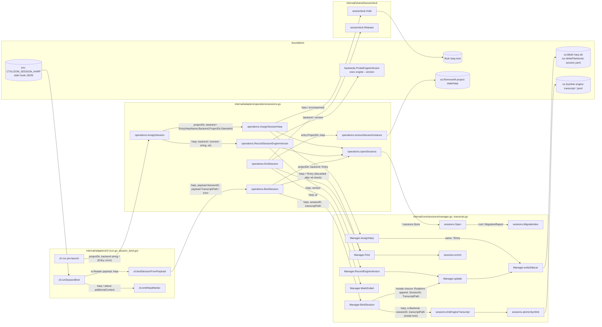
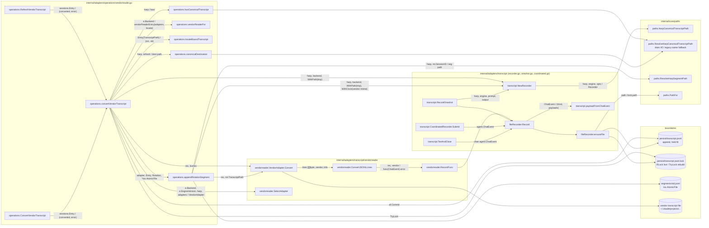
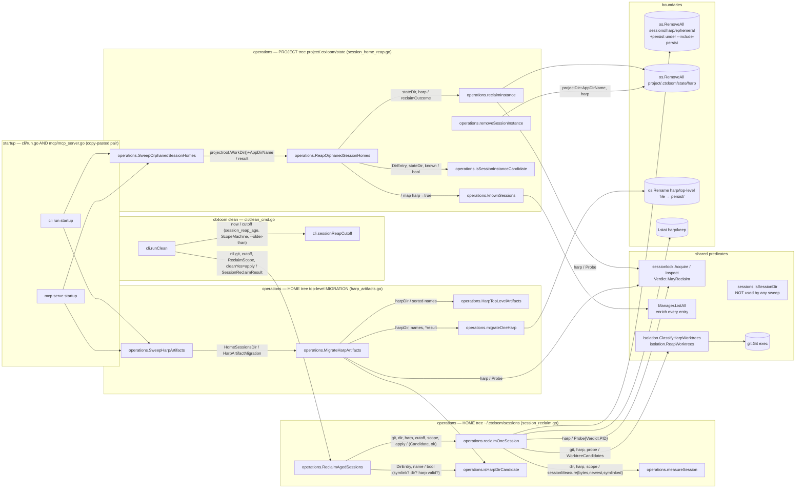
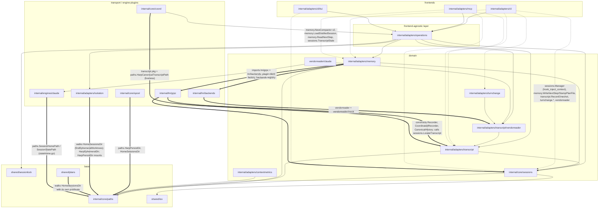
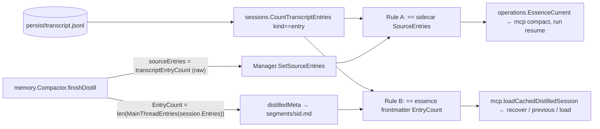

# Seam 7 — Sessions, transcripts, distill and compact

Architecture audit, read-only, checkout `/home/babbitt/workspace/ctxloom/ctxloom/main` at `release/0.7` (tip d42cc4229, 2026-09-18).
References are `package.Symbol` + `path/file.go`; no line numbers.

Status: COMPLETE — see the end of the document for the section census.

## 1. Scope and entry points

**Seam.** The session's life on disk — the harp-keyed directory under `~/.ctxloom/sessions/<harp>/`, the sidecar that makes it a session, the transcripts (vendor, canonical, segments) it accumulates, the two derived artifacts (`essence.md`, `next-step.md`), the sweeps that delete parts of it, and the one-shot consumers (distill, compact, recover, previous-session, load-session, turn-change hooks) that read it back. Also the SECOND harp-keyed tree, `<project>/.ctxloom/state/<harp>/home` (the session home), because a reaper is aimed at it.

**Packages read (production files, no tests).**
`internal/core/sessions` (manager.go, store.go, memstore.go, sidecar.go, transcript.go, index_upgrade.go) · `internal/core/paths` (paths.go harp/session resolvers) · `internal/adapters/operations` (sessions.go, session_reclaim.go, session_home_reap.go, session_home_sweep.go, harp_artifacts.go, harp_lineage.go, session_adopt.go, session_distill.go, session_source.go, session_essence.go, session_purge.go, sessionfeed.go, turn_transcript.go, vendorreader.go) · `internal/adapters/transcript` (record.go, recorder.go, history.go, oneshot.go, coordinated.go, policy/, vendorreader/) · `internal/adapters/turnchange` · `internal/adapters/memory` (compactor.go, distill.go, nextstep.go, plans.go, selection.go, stamp.go) · `internal/adapters/contextmetrics` · `internal/shared/compression` (router/compressor only, as consumed by memory) · `internal/adapters/cli` (session_*.go, distiller.go, clean_cmd.go, hook_next_step.go, hook_turn_changed.go, hook_stamp_plan.go, session_bind.go, doctor_transcript_reader.go) · `internal/adapters/mcp` (mcp_tools_memory.go, mcp_resources.go, mcp_server.go startup sweeps) · `internal/shared/sessionlock` (liveness predicate shared by every sweep).

**Stated architecture consulted.** `GLOSSARY.md` (session, session dir, session home, ctxloom home, scratch); `internal/core/paths/paths.go` doc comments (the declarative layout); `tests/arch/session_bind_single_writer_arch_test.go`, `session_home_arch_test.go`, `write_discipline_test.go`, `path_authority_test.go`, `layering_test.go`; task rows `docile-tribunal` (Done), `boned-monoxide` (To Do, reaper landed 2026-09-18), `fetal-lance`, `zippy-tint`, `climatic-stroller`, `unusable-overload` (Done).

**Entry points traced** (each followed to its process boundary):

| # | Entry | Symbol + file | Boundary reached |
|---|---|---|---|
| E1 | `ctxloom run` pre-launch mint | `operations.AssignSession` `internal/adapters/operations/sessions.go` → `sessions.Manager.AssignHarp` `internal/core/sessions/manager.go` | `os.Mkdir` harp dir; `iox.WriteFileAtomic` session.yaml; `sessionlock.Hold` flock; engine `--version` exec via `backends.ProbeEngineVersion` |
| E2 | `ctxloom run` / `mcp serve` startup sweeps | `operations.SweepOrphanedSessionHomes`, `operations.SweepHarpArtifacts` (called from `cli/run.go` and `mcp/mcp_server.go`) | `os.RemoveAll` `<project>/.ctxloom/state/<harp>`; `os.Rename` harp top-level files → `persist/` |
| E3 | SessionStart hook (bind) | `cli.bindSessionFromPayload` `internal/adapters/cli/session_bind.go` → `operations.BindSession` → `sessions.Manager.BindSession` | sidecar rewrite; `os.Symlink` `engine-transcript-<engine>-<sid>.jsonl` |
| E4 | TurnEnd hook (next step) | `cli` hook_next_step.go → `memory.WriteNextStep`/`ReadNextStep` `internal/adapters/memory/nextstep.go` | `next-step.md` at harp top level |
| E5 | Turn-changed hook | `cli` hook_turn_changed.go → `operations.ResolveTurnTranscript` `internal/adapters/operations/turn_transcript.go` → `turnchange.ReadTranscript` | reads vendor transcript via `vendorreader.VendorAdapter` |
| E6 | `ctxloom session distill` / `ctxloom distill` | `cli` session_distill.go, distiller.go → `operations.ResolveAndHeal` + `operations.DistillEntry` `internal/adapters/operations/session_source.go` → `memory.Compactor.Compact` | LLM subprocess via `lm` plugin; `essence.md`, `segments/<sid>.md`; sidecar `SetSourceEntries` |
| E7 | MCP `compact_session` | `mcp.ctxServer.handleCompactSession` `internal/adapters/mcp/mcp_tools_memory.go` | same as E6 (second orchestrator) |
| E8 | MCP `recover_session`, `get_previous_session`, `load_session`, `list_sessions` | `mcp.ctxServer.handle*` `internal/adapters/mcp/mcp_tools_memory.go` | reads essence/transcript/sidecar |
| E9 | `ctxloom clean` | `cli.runClean` `internal/adapters/cli/clean_cmd.go` → `operations.ReclaimAgedSessions` `internal/adapters/operations/session_reclaim.go` | `os.RemoveAll` `ephemeral/` (+`persist/`); `isolation.ReapWorktrees` |
| E10 | session end | `operations.EndSession` `internal/adapters/operations/sessions.go` | sidecar `MarkEnded`; `os.RemoveAll` project-tree instance; `sessionlock.Release` |
| E11 | canonical transcript capture (structured engines) | `transcript.Recorder.Record` `internal/adapters/transcript/recorder.go`; `transcript.RecordOneshot` oneshot.go | append `persist/transcript.jsonl` |
| E12 | canonical rebuild from vendor | `operations.RefreshVendorTranscript` `internal/adapters/operations/vendorreader.go` | rewrites `persist/transcript.jsonl`; writes `segments/<sid>.jsonl` |
| E13 | `ctxloom session purge/remove/adopt/edit/transcript/watch/essence/query/full` | `cli/session_*.go` → `operations.PurgeSession`, `ApplyAdopt`, `RenameSession`, `ForgetSession`, `WatchSessionFeed`, `HarpTranscripts` | file removes, sidecar rewrites, transcript reads |
| E14 | `ctxloom doctor` transcript-reader / durability checks | `cli/doctor_transcript_reader.go`, `cli.doctorCheckHarpDurability` `internal/adapters/cli/doctor_cmd.go` | reads sidecar + harp top level |
| E15 | coord liveness | `coord` `internal/core/coord/liveness.go` reads `paths.HarpCanonicalTranscriptPath` | stat canonical transcript |
| E16 | context metrics | `contextmetrics.Append` `internal/adapters/contextmetrics/contextmetrics.go` | raw append (write-discipline grandfathered) |

## 2. Call graphs

Edge labels carry the state that crosses the call: `args / returns`. ctx and loggers omitted. Every node is `pkg.Symbol`; file named in the subgraph title.

### 2.1 Session mint and bind (E1, E3, E10)



Data-flow notes on 2.1:
- `operations.BindSession` calls `Manager.Find` (which runs `enrich`: 2–3 stats + an essence read) purely as an existence check, then `Manager.BindSession` re-reads the sidecar under lock. The enriched entry is discarded.
- `Manager.BindSession` performs a filesystem side effect (`linkEngineTranscript` → `os.Symlink`) INSIDE the sidecar lock's mutate closure; failure is swallowed (`clidiag.Warn`).
- `operations.RecordSessionEngineVersion` opens the store a SECOND time within `AssignSession`; `sessions.Open` runs `MigrateIndex` (stat index.yaml + stat marker) on every open.
- The harp reaches the bind hook via env `CTXLOOM_SESSION_HARP` — the process boundary makes this legitimate, but `cli/session_bind.go` spells the literal while `hook_next_step.go`/`hook_turn_changed.go` use `agent.SessionHarpEnv`.

### 2.2 Canonical transcript capture and rebuild (E11, E12)



Data-flow notes on 2.2:
- `convertVendorTranscript(ctx, e sessions.Entry, refresh bool)` takes the whole Entry and reads 5 fields (Backend, HarpName, TranscriptPath, EngineVersion, Rotations). `refresh` is a boolean threaded to three branches (dest resolution, lock acquisition, skip-if-exists).
- The return `(converted bool, err error)` is set to `(true, err)` on several failure branches — `converted=true` with a non-nil error means "attempted", not "converted"; callers (`ResolveAndHeal`) read `Healed` from it.
- `canonicalDestination` and `hasCanonicalTranscript` both resolve through the legacy-name fallback; the writer then targets whichever name exists, so a pre-rename file is REWRITTEN under the legacy name — contradicting `paths.HarpCanonicalTranscriptPath`'s doc ("every writer targets this path, never the legacy one").

### 2.3 Distill trunk and its three orchestrators (E6, E7, E8)

```mermaid
flowchart LR
  subgraph cli ["internal/adapters/cli"]
    sdist[cli session distill<br/>session_distill.go]
    sshow[cli session show<br/>session_cmd.go]
    runend[cli run session-end distill<br/>run.go]
  end
  subgraph mcp ["internal/adapters/mcp/mcp_tools_memory.go"]
    hcs[ctxServer.handleCompactSession]
    cth[ctxServer.compactionTargetHarp]
    hrs[ctxServer.handleRecoverSession]
    hgps[ctxServer.handleGetPreviousSession]
    hls[ctxServer.handleLoadSession]
    lods[ctxServer.loadOrDistillSession]
    dso[ctxServer.distillSessionOnce]
    shfi[mcp.sessionHarpForID]
    lcds[mcp.loadCachedDistilledSession]
  end
  subgraph ops ["internal/adapters/operations (session_source.go, session_distill.go, sessions.go)"]
    rah[operations.ResolveAndHeal]
    de[operations.DistillEntry]
    ce[operations.CompactEntry]
    ec[operations.EssenceCurrent]
    rhe[operations.ReadHarpEssence]
    rss[operations.ResolveSessionSource]
    gs[operations.GetSession]
    hfs[operations.HarpForSession]
    rps[operations.ResolvePreviousSession]
    hfb[operations.HistoryForBackend]
  end
  subgraph mem ["internal/adapters/memory/compactor.go, distill.go"]
    nc[memory.NewCompactor]
    rts[memory.resolveTranscriptSource]
    comp[Compactor.Compact]
    lstc[Compactor.loadSessionToCompact]
    rhn[Compactor.resolveHarpName]
    ibs[Compactor.identityBoundSessionID]
    tec[memory.transcriptEntryCount]
    rr[Compactor.repairResults]
    rd[Compactor.runDistill]
    dist[memory.Distill]
    fd[Compactor.finishDistill]
    sd[Compactor.saveDistilled]
    se[Compactor.saveEssence]
    usi[Compactor.updateSessionIndex]
    rns[memory.ReadNextStep]
    lds[memory.LoadDistilledSession]
  end
  subgraph sess ["internal/core/sessions"]
    sopen[sessions.Open]
    find[Manager.Find]
    cte[sessions.CountTranscriptEntries]
    ts[sessions.TranscriptStale]
    bs[Manager.BindSession]
    sse[Manager.SetSourceEntries]
  end
  subgraph fs ["boundaries"]
    llm[("lm plugin ONESHOT subprocess<br/>one per Distill call")]
    ess[("essence.md +<br/>segments/sid.md")]
    canon[("persist/transcript.jsonl read")]
    cwd[("os.Getwd")]
  end
  sdist -- "harp, LivenessUnknown / ResolvedSource" --> rah
  sshow -- "harp, LivenessUnknown" --> rah
  runend -- "harp, LivenessFinished" --> rah
  hcs -- "in.SessionID / harp" --> cth
  cth --> gs
  cth --> hfs
  hcs -- "harp, LivenessUnknown / ResolvedSource" --> rah
  hcs -- "harp / essence bytes" --> rhe
  hcs -- "src, bytes / (current, known)" --> ec
  ec -- "src.SourcePath, src.StampedEntries" --> ts
  ts --> cte
  cte --> canon
  rah -- "harp / *Entry (x2 if healed)" --> gs
  rah -- "*Entry / (Healed, HealErr)" --> rfr2[operations.RefreshVendorTranscript]
  sdist -- "src, cfg, DistillOptions{Progress}" --> de
  hcs -- "src, cfg, DistillOptions{Model}" --> de
  de -- "src.Entry, cfg, opts" --> ce
  ce -- "entry.Backend / SessionHistory" --> hfb
  ce -- "harp / taskHint" --> rns
  ce -- "CompactionConfig{LLM,Model,Env,Backend,EssenceMaxChars,SessionID,PreloadedSession,WorkDir=entry.ProjectDir,HarpName,Progress,PromptDir,TaskHint}" --> nc
  hcs -- "FALLBACK when src.Entry==nil: CompactionConfig{no Env, no Progress, no PromptDir, WorkDir=Getwd}" --> nc
  hrs --> lods
  hgps -- "workDir, self.Harp / PreviousSessionRef" --> rps
  hgps --> lods
  hls --> lods
  lods -- "cfg, backend, Getwd / pb.SessionSource (policy-filtered)" --> rss
  lods --> cwd
  lods -- "harp, LivenessLive|Finished (up to 2x)" --> rah
  lods -- "id / harp" --> shfi
  shfi --> gs
  shfi --> hfs
  lods -- "segments dir, sessionID / (cached, stampedEntries from essence frontmatter)" --> lcds
  lcds --> lds
  lods -- "transcriptPath, stampedEntries" --> ts
  lods -- "sessionID, backend, model, workDir, sessionsDir, harp" --> dso
  dso -- "CompactionConfig{no Env, no Progress, no PromptDir, WorkDir=Getwd}" --> nc
  dso -- "sessionsDir, SessionID / DistilledSession" --> lds
  nc -- "CompactionConfig / (SessionSource, plans func)" --> rts
  rts --> sopen
  nc --> comp
  comp --> lstc
  lstc --> ibs
  ibs --> rhn
  rhn -- "env CTXLOOM_SESSION_HARP fallback" --> sopen
  ibs --> sopen
  ibs --> find
  comp -- "harp / int" --> tec
  tec --> sopen
  tec --> find
  tec --> cte
  comp -- "Selection / n repaired (LLM per result)" --> rr
  rr --> dist
  comp -- "prompt, fitted text" --> rd
  rd -- "DistillConfig{LLM,Model,Env,ClientFactory}" --> dist
  dist --> llm
  comp --> fd
  fd -- "session.ID, body, distilledMeta{EntryCount,TokensIn/Out,PlanBlocks,Summary,HarpName}" --> sd
  sd --> se
  se --> ess
  fd -- "harp, session.ID, summary, sourceEntries" --> usi
  usi --> sopen
  usi --> find
  usi -- "only if entry.SessionID==\"\"" --> bs
  usi -- "harp, sourceEntries" --> sse
```



Data-flow notes on 2.3 (the densest smell cluster in the seam):
- THREE constructors of `memory.CompactionConfig`: `operations.CompactEntry` (full: Env, Progress, PromptDir, PreloadedSession, WorkDir from the sidecar), `mcp.handleCompactSession` fallback branch, `mcp.distillSessionOnce`. The two MCP sites omit `Env` (`MockControlFor`), `Progress`, `PromptDir`, and take `WorkDir` from `os.Getwd()` instead of `entry.ProjectDir`. Row `unusable-overload` (status Done) ruled on the first of these; the code still carries both.
- Inside ONE `Compactor.Compact` run, `sessions.Open()` + `Manager.Find(harp)` is executed in four separate helpers (`resolveHarpName`, `identityBoundSessionID`, `transcriptEntryCount`, `updateSessionIndex`), each re-opening the store (and re-running `MigrateIndex`'s stats) and re-enriching the same sidecar that the caller `operations.CompactEntry` ALREADY held as `*sessions.Entry` and unpacked into `CompactionConfig`. The entry is flattened into 12 scalar fields on the way in, then re-derived from disk on the way through.
- `Compactor.resolveHarpName` falls back to `os.Getenv("CTXLOOM_SESSION_HARP")` — the brief's exact example of a harp re-read from env deep in a call chain; the struct doc admits it: "Empty falls back to CTXLOOM_SESSION_HARP env var so the in-LLM compact_session path still works without explicit plumbing."
- `resolveHarpName` also implements "if `SessionID` is a harp name that `Find` resolves, treat it as the harp" — the same value (`config.SessionID`) carries two meanings along one path. The same conflation is re-implemented in `mcp.sessionHarpForID`, `mcp.compactionTargetHarp`, and the `loadOrDistillSession` fallback (`paths.HarpDir(sessionID)` stat).
- Two staleness rules: `operations.EssenceCurrent` compares the live entry count to the SIDECAR's `SourceEntries`; `mcp.loadOrDistillSession` compares it to the ESSENCE FRONTMATTER's `EntryCount` (`distilledMeta.EntryCount`, read back via `memory.LoadDistilledSession`). The frontmatter number is `len(session.Entries)` AFTER `agent.MainThreadEntries` filtering; the sidecar number is `sessions.CountTranscriptEntries` (raw `kind=="entry"` lines). They can legitimately differ, so the two callers can disagree about whether one essence is stale.
- `operations.ResolveAndHeal`'s `Liveness` parameter is switched on with all three values in one case arm doing the identical thing — a flag threaded through six call sites that branches nowhere.

### 2.4 The reapers and sweeps (E2, E9) — side by side



| Property | `ReclaimAgedSessions` (home tree) | `ReapOrphanedSessionHomes` (project tree) | `MigrateHarpArtifacts` (home tree, top level) |
|---|---|---|---|
| Trigger | `ctxloom clean` only | every `ctxloom run` and `mcp serve` | every `ctxloom run` and `mcp serve` |
| Report-only mode | yes (no `--yes`) | **none** — deletes on sight | **none** — moves on sight |
| Age cutoff | `session_reap_age` (30d, ScopeMachine) | **none** | **none** |
| Keep marker | `keep` at harp top level | none | **not excluded** — will be moved into `persist/` |
| Liveness | `sessionlock.Acquire(harp).MayReclaim()` | same | `sessionlock.Inspect(harp).MayReclaim()` |
| Session-dir predicate | `isHarpDirCandidate` (no sidecar required) | `isSessionInstanceCandidate` (known-harp set OR `home/` dir present) | `isHarpDirCandidate` |
| Reads the session store | no | yes — `Manager.ListAll()` (enrich: ~3 stats + essence read per session, ~845 sessions) to build a name set | no |
| Members taken | `ephemeral/` (+`persist/`) | whole `state/<harp>` | moves regular files at top level except a fixed exclusion list |
| Worktrees | classifies + reaps via `isolation` | — | — |
| Clock | newest mtime under in-scope members, excluding symlinks and the harp dir itself (UNRULED per `boned-monoxide`) | none | none |

## 3. Delegation / layer graph

Stated layering (`tests/arch/layering_test.go`, `docs/architecture`): `cli` / `mcp` → `operations` (frontend-agnostic) → domain (`sessions`, `transcript`, `memory`, `turnchange`) → `paths` / `shared`. Enforced today: only `operations ⇏ cli` and `transcript ⇏ lm/grpc` (the comment on `operations-must-not-import-cli` says the per-flow `cli/<flow> → operations/<flow> → domain` rule is "future"). Solid arrows = expected direction; dashed `-.->` = reaches past `operations`; thick `==>` = a domain package reaching UP into transport or a transport package reaching DOWN into a store.



Reading the graph:
- Every frontend bypasses `operations` for the memory/transcript sub-seam. `internal/adapters/mcp` builds `memory.CompactionConfig` itself at two sites; `internal/adapters/cli` calls `memory.WriteNextStep`, `memory.StampPlanFile`, `transcript.RecordOneshot`, and `turnchange.*` directly. The `operations` façade covers the SESSION STORE (`sessions.go`) thoroughly but the ESSENCE/DISTILL side only partially (`ResolveAndHeal`/`DistillEntry`/`CompactEntry`), so callers that need "load or distill" (`mcp.loadOrDistillSession`) re-assemble it.
- `internal/adapters/memory` (domain) imports `internal/lm/grpc` (transport) for `pb.ClientFactory`/`pb.SessionSource`/`pb.NewCanonicalFallbackSource`, while `internal/adapters/transcript` is FORBIDDEN from `lm/grpc` by rule. Two sibling domain packages, opposite rules; the difference is not stated anywhere.
- `internal/lm/grpc` is a transcript writer: it constructs recorders and the canonical history and calls `sessions.LocateTranscript`. The stated boundary ("this package only adds a cross-cutting harp-keyed layer on top" — `sessions` package doc) has the transport reaching into the store.
- Nine packages walk or resolve paths under the sessions root; `operations`, `shared/plans`, `cli` (doctor, plan_watch), `isolation`, `spool` each carry their own "is this a session dir" test.

## 3b. CENTREPIECE — every reader and writer of `~/.ctxloom/sessions/<harp>/**`, by symbol, grouped by lifetime

Legend: `W` writes / creates, `R` reads, `D` deletes / moves, `L` takes a lock. Edges carry what crosses. Node ids are mermaid-safe; readable names in labels.

```mermaid
flowchart LR
  subgraph top ["harp dir TOP LEVEL — 'what makes it a session' (never reaped)"]
    sidecar[("session.yaml<br/>paths.SessionSidecarFileName")]
    essence[("essence.md<br/>paths.EssenceFileName")]
    nextstep[("next-step.md<br/>paths.NextStepFileName")]
    keep[("keep<br/>paths.SessionKeepMarkerFileName")]
    links[("engine-transcript-engine-sid.jsonl → vendor file<br/>paths.EngineTranscriptLinkPrefix, symlink")]
    legacylink[("transcript.jsonl symlink — RETIRED, left in place")]
  end
  subgraph beside ["BESIDE the harp dir — lock files (paths.PathFor)"]
    llock[("harp.lock — liveness<br/>paths.HarpLockPath")]
    slock[("harp.session.lock — sidecar<br/>paths.HarpSidecarLockPath")]
  end
  subgraph persist ["persist/ — REFERENCED DATA (reaped only under --include-persist)"]
    canon[("transcript.jsonl — canonical JSONL<br/>paths.CanonicalTranscriptFileName")]
    canonlegacy[("transcript.acp.jsonl — legacy name, read-only fallback")]
    canonlock[("transcript.jsonl.lock — ownership")]
    tstore[("transcripts/ — engine native store bind-mount<br/>paths.TranscriptStoreDirName")]
    plansf[("*.plan.md<br/>paths.HarpPlansDir == HarpPersistDir")]
    spoolf[("spool/ — spool.SpoolDirName, hand-joined")]
    metrics[("context-metrics.jsonl — contextmetrics.FileName")]
    handoff[("runstart.json — cli.runStartHandoffFile, full RunStart incl. env/options")]
  end
  subgraph segments ["segments/ — per-rotation cache (never reaped)"]
    segj[("sid.jsonl<br/>paths.ResolveHarpSegmentPath")]
    segm[("sid.md<br/>paths.ResolveHarpSegmentEssencePath")]
  end
  subgraph ephem ["ephemeral/ — DISPOSABLE (reaped by age)"]
    wt[("worktree-* dirs<br/>isolation worktreeCandidatePrefix")]
    ovl[("rendered config overlays — agent.launch_backend")]
  end
  subgraph project ["THE OTHER TREE — project/.ctxloom/state/harp/home (session home)"]
    home[("home/claude, home/.codex …<br/>paths.SessionHomePath")]
  end

  %% sidecar writers
  AH[sessions.Manager.AssignHarp] -- "W Entry{Backend,ProjectDir,StartedAt}" --> sidecar
  BS[sessions.Manager.BindSession] -- "W SessionID,TranscriptPath,Rotations+" --> sidecar
  AR[sessions.Manager.AppendRotations<br/>via operations.ApplyAdopt] -- "W Rotations" --> sidecar
  ME[sessions.Manager.MarkEnded<br/>via operations.EndSession] -- "W EndedAt" --> sidecar
  MP[sessions.Manager.MarkPurged<br/>via operations.PurgeSession] -- "W PurgedAt" --> sidecar
  REV[sessions.Manager.RecordEngineVersion] -- "W EngineVersion" --> sidecar
  SSE[sessions.Manager.SetSourceEntries<br/>via memory.Compactor.updateSessionIndex] -- "W SourceEntries" --> sidecar
  MI[sessions.MigrateIndex<br/>on every sessions.Open] -- "W from legacy index.yaml rows" --> sidecar
  FG[sessions.Manager.Forget] -- "D os.Remove" --> sidecar
  RN[sessions.Manager.Rename] -- "D/W os.Rename whole dir (locks NOT renamed)" --> sidecar
  UPD[sessions.Manager.update] -- "L flock" --> slock
  %% sidecar readers
  sidecar -- "R yaml → Entry" --> RS[sessions.Manager.readSidecar<br/>← Find, FindBySessionID, enumerate]
  RS --> EN[sessions.enrich<br/>fillTranscriptByLocation, fillCanonicalTranscript, fillFromEssence]
  EN -- "R stat / walk persist/transcripts" --> tstore
  EN -- "R stat (legacy fallback)" --> canon
  EN -- "R frontmatter summary + Open Items" --> essence
  ISD[sessions.IsSessionDir] -- "R Lstat" --> sidecar
  %% essence
  SE[memory.Compactor.saveEssence] -- "W iox.WriteFileAtomic (same bytes x2)" --> essence
  SE -- "W" --> segm
  essence -- "R" --> RHE[operations.ReadHarpEssence<br/>← mcp.handleCompactSession, cli session essence, run resume]
  essence -- "R" --> EE[memory.Compactor.existingEssence]
  segm -- "R frontmatter EntryCount as stampedEntries" --> LDS[memory.LoadDistilledSession<br/>← mcp.loadCachedDistilledSession, mcp.distillSessionOnce]
  essence -- "R size>0 only" --> SEI[operations.SessionEssenceInfo]
  %% next step
  WNS[memory.WriteNextStep<br/>← cli TurnEnd hook_next_step] -- "W iox atomic, ≤4096B" --> nextstep
  nextstep -- "R" --> RNS["memory.ReadNextStep<br/>← operations.CompactEntry, mcp x2 (TaskHint)"]
  %% keep
  HUMAN[human touch] -- "W" --> keep
  keep -- "R Lstat" --> ROS[operations.reclaimOneSession]
  %% links
  LET[sessions.linkEngineTranscript<br/>inside BindSession lock] -- "W os.Symlink / atomicSymlink" --> links
  links -- "R EvalSymlinks, parse sid from target basename" --> HT[operations.HarpTranscripts<br/>← mcp.handleRecoverSession lineage]
  links -- "R excluded by prefix" --> HTLA[operations.HarpTopLevelArtifacts]
  %% liveness
  HOLD[sessionlock.Hold<br/>← operations.AssignSessionHarp] -- "L flock + PID stamp" --> llock
  llock -- "L Acquire/Inspect → Verdict" --> LP[sessionlock.Acquire / Inspect<br/>← reclaimOneSession, reclaimInstance, MigrateHarpArtifacts, isolation worktree reap, PurgeSession]
  REL[sessionlock.Release<br/>← operations.EndSession] --> llock
  %% canonical transcript
  REC["transcript.fileRecorder.Record<br/>← TeeAndClose, CoordinatedRecorder (lm/grpc), RecordOneshot (cli run)"] -- "W append, held fd" --> canon
  REC -- "L RLock" --> canonlock
  CVT[operations.convertVendorTranscript<br/>← RefreshVendorTranscript ← ResolveAndHeal] -- "W iox.AtomicFile whole rewrite; targets legacy name if that is what exists" --> canon
  CVT -- "L TryLock" --> canonlock
  CVT -- "W iox.AtomicFile once per rotation" --> segj
  segj -- "R appendFileBytes" --> CVT
  canon -- "R full parse, schema-checked" --> PTF[transcript.ParseTranscriptFile<br/>← CanonicalHistory.GetSession/ListSessions/CurrentSession, lm/grpc]
  canon -- "R kind-only count, no schema check" --> CTE[sessions.CountTranscriptEntries<br/>← TranscriptStale, memory.transcriptEntryCount]
  canon -- "R stat mtime" --> AT[sessions.ActivityTime]
  canon -- "R stat" --> LIV[coord liveness.go, internal/shared/liveness]
  canon -- "R" --> STX[cli session transcript / watch]
  canonlegacy -- "R fallback" --> RCP[paths.ResolveHarpCanonicalTranscriptPath]
  %% vendor store
  tstore -- "R WalkDir newest .jsonl/.json, skip subagents/" --> LT[sessions.LocateTranscript<br/>← fillTranscriptByLocation, lm/grpc]
  ENGINE[engine inside container<br/>bind-mount by isolation.sessionStateMounts] -- "W native transcript" --> tstore
  %% persist misc
  MCPI[mcp.sessionInstructions / agent authoring] -- "W" --> plansf
  plansf -- "R" --> PLR[shared/plans.SessionPlanPaths<br/>← memory plans appendix, cli plan_watch, hook_stamp_plan]
  MOH[operations.migrateOneHarp<br/>every launch] -- "D/W os.Rename top-level regular files → persist/" --> plansf
  keep -. "MOVED HERE (not excluded)" .-> MOH
  nextstep -. "MOVED HERE (not excluded)" .-> MOH
  SPW[agentcoord/spool.Write / Fail] -- "W" --> spoolf
  CMA[contextmetrics.Append] -- "W raw append (grandfathered)" --> metrics
  WRH[cli.writeRunStartHandoff] -- "W os.WriteFile 0600 (grandfathered)" --> handoff
  %% ephemeral
  ISO[isolation.Worktree materialize] -- "W git worktree add" --> wt
  wt -- "R/D classify+reap" --> ISOR[isolation.ClassifyHarpWorktrees / ReapWorktrees<br/>← reclaimOneSession, startup ReapOrphanedWorktrees]
  LB[agent.launch_backend overlay writer] -- "W" --> ovl
  RAS[operations.ReclaimAgedSessions<br/>ctxloom clean] -- "D os.RemoveAll ephemeral/ (+persist/)" --> ephem
  %% purge
  PS[operations.PurgeSession] -- "D by class: machine=canonical+transcripts/, derived=essence, authored=everything else incl. keep, next-step, segments/*.md" --> persist
  PS --> essence
  %% project tree
  SH[claude.statehome / operations.enginehome<br/>at instance time] -- "W copy from real home, .mcp.json, settings" --> home
  home -- "R CLAUDE_CONFIG_DIR" --> ENG2[engine process]
  ROSH[operations.ReapOrphanedSessionHomes<br/>every launch] -- "D os.RemoveAll state/harp" --> home
  RMI[operations.removeSessionInstance<br/>← EndSession] -- "D os.RemoveAll" --> home
  ROSH -- "R ListAll (enrich every session) → known-harp set" --> sidecar
```



**What the centrepiece shows.**
1. The sidecar has EIGHT writers, all correctly funnelled through `Manager.update` + the sidecar lock — with one exception: `MigrateIndex` writes sidecars via `writeSidecar` directly, under the ROOT index lock instead of the per-harp sidecar lock.
2. `essence.md` and `segments/<sid>.md` receive identical bytes from one writer, but are read back by DIFFERENT consumers with DIFFERENT staleness rules (sidecar `SourceEntries` vs frontmatter `EntryCount`).
3. `keep` and `next-step.md` are top-level regular files created after `HarpTopLevelArtifacts`' exclusion list was written; the every-launch migration will move them into `persist/` on the first launch after the session ends, silently defeating the keep marker for the reaper (which only Lstat's the top level) and hiding the next step from `ReadNextStep`. Doctor (`doctorCheckHarpDurability`) shares the predicate, so it will also report them as at-risk authored artifacts.
4. `persist/` — the tier the reaper exempts by default — receives the full `RunStart` (`runstart.json`, incl. options and env) on every turn, and `context-metrics.jsonl`, neither of which is "referenced data" in the row's sense.
5. There are THREE lock files per session and FOUR startup sweeps + one on-demand reaper + one session-end deleter aimed at the two trees.

## 4. Findings (ranked by blast radius)

Each: shape · symbols+files · what would settle it.

### F1 — WORKAROUND/CORRECTNESS: the every-launch artifact migration will relocate the reaper's `keep` marker and the TurnEnd `next-step.md`
- `operations.HarpTopLevelArtifacts` `internal/adapters/operations/harp_artifacts.go` excludes exactly six leaf names plus the `engine-transcript-` prefix. `paths.SessionKeepMarkerFileName` ("keep", landed 2026-09-18 with `ReclaimAgedSessions`) and `paths.NextStepFileName` ("next-step.md") are not in the list. Both are regular files at the harp top level.
- `operations.MigrateHarpArtifacts` (via `operations.SweepHarpArtifacts`, called from `cli/run.go` and `mcp/mcp_server.go` on EVERY launch) moves every non-excluded regular file under `persist/` once `sessionlock.Inspect(harp).Verdict.MayReclaim()` — i.e. for every ended session.
- `operations.reclaimOneSession` `internal/adapters/operations/session_reclaim.go` checks the marker with `os.Lstat(filepath.Join(dir, paths.SessionKeepMarkerFileName))` — top level only. After one launch, a human-placed `keep` on an ended session is under `persist/keep` and the session is reapable again. `memory.ReadNextStep` `internal/adapters/memory/nextstep.go` likewise reads only `paths.HarpNextStepPath` (top level), so `operations.CompactEntry`'s `TaskHint` is empty for any session distilled after a subsequent launch.
- `cli.doctorCheckHarpDurability` `internal/adapters/cli/doctor_cmd.go` shares the predicate and will report both files as "authored artifacts at risk".
- The exclusion list also names `paths.CanonicalTranscriptFileName` "written by ctxloom at the top level by design" — but every writer (`transcript.NewRecorder`, `operations.convertVendorTranscript`) targets `persist/transcript.jsonl`; the top-level name only protects the RETIRED symlink.
- Settles it: an arch/unit test asserting `HarpTopLevelArtifacts` on a dir seeded with every `paths.*FileName` constant returns nothing; better, make the exclusion derive from `paths` (a `paths.HarpTopLevelOwnedNames()` slice) so a new constant cannot be forgotten.

### F2 — DUPLICATION: four constructors of `memory.CompactionConfig`, two of them in the MCP layer, with different field sets
- `operations.CompactEntry` `internal/adapters/operations/session_distill.go` (Env=`MockControlFor`, Progress, PromptDir, PreloadedSession, WorkDir=`entry.ProjectDir`, TaskHint) — the complete one.
- `mcp.ctxServer.handleCompactSession` fallback branch (`src.Entry == nil`) and `mcp.ctxServer.distillSessionOnce` `internal/adapters/mcp/mcp_tools_memory.go` — no Env, no Progress, no PromptDir, WorkDir=`os.Getwd()`.
- `cli.shellOutDistill` `internal/adapters/cli/run.go` — reaches the trunk by re-exec'ing `ctxloom session distill <harp>` via `selfexec.Path()`.
- Row `unusable-overload` (status Done) ruled on the first MCP site; the ruling's open half ("route self-compaction through CompactEntry, or stay distinct") is unresolved in code and the second MCP site was not named by the row.
- Settles it: delete both MCP constructors; `loadOrDistillSession` calls `operations.ResolveAndHeal` + `operations.DistillEntry` like every other caller; an arch test allowlisting `memory.NewCompactor(` callers to `internal/adapters/operations` (same ratchet shape as `session_bind_single_writer_arch_test.go`).

### F3 — DATA-FLOW SMELL: the compactor re-derives from disk what its caller already held; harp falls back to env deep in the chain
- `operations.CompactEntry` holds `*sessions.Entry` and flattens it into `CompactionConfig` (12 scalars). Inside `memory.Compactor.Compact`, four helpers each call `sessions.Open()` + `Manager.Find(harp)` again: `Compactor.resolveHarpName`, `Compactor.identityBoundSessionID`, `memory.transcriptEntryCount`, `Compactor.updateSessionIndex` `internal/adapters/memory/compactor.go`. Every `sessions.Open` re-runs `MigrateIndex` (two stats) and every `Find` re-runs `enrich` (locate walk, canonical stat, essence read).
- `Compactor.resolveHarpName` ends in `os.Getenv("CTXLOOM_SESSION_HARP")` — a hidden input the struct doc advertises. `CompactionConfig.OutputDir` is documented as "TEST SEAM ONLY".
- `Compactor.resolveHarpName` treats `config.SessionID` as a harp when `Find(SessionID)` succeeds: one value, two meanings. Re-implemented in `mcp.sessionHarpForID`, `mcp.compactionTargetHarp`, and `mcp.loadOrDistillSession`'s `paths.HarpDir(sessionID)` stat.
- `memory.resolveTranscriptSource` and `operations.ResolveSessionSource` `internal/adapters/operations/session_distill.go` both build `pb.NewCanonicalFallbackSource(legacy, workDir, sessions.Open())` gated on `backends.NoLegacyHistoryReason` — the memory copy omits `policy.Default()`.
- Settles it: `memory.NewCompactor` takes `(entry sessions.Entry, source pb.SessionSource, …)` from operations and never opens the store; delete `resolveHarpName`/`identityBoundSessionID`; delete the env fallback; the single-writer arch test then no longer needs the compactor admission.

### F4 — DIVERGENT PATHS: two staleness rules and two "current essence" answers
- Rule A (sidecar): `sessions.Entry.SourceStale` → `sessions.TranscriptStale(path, Entry.SourceEntries)`; used by `operations.EssenceCurrent` (adds `MaxEssenceChars` and `HealErr` gates), `cli.resumeEssenceStale` `internal/adapters/cli/run.go` (no gates), and `session list`'s badge.
- Rule B (frontmatter): `mcp.loadOrDistillSession` reads `memory.LoadDistilledSession(segmentsDir, sessionID).SourceEntries` — the `distilledMeta.EntryCount` stamped at distill, which is `len(session.Entries)` AFTER `agent.MainThreadEntries` filtering — and compares it with `sessions.TranscriptStale`, whose live side counts raw `kind=="entry"` lines. The two counts are not the same quantity, so B can report stale forever (or current wrongly) for the same essence A calls current.
- `Compactor.updateSessionIndex` writes `SetSourceEntries` only when `summary != ""`; `dumpEmptySession` reaches `finishDistill` with an empty summary, so an empty session is never stamped and Rule A reports `known=false` for it forever (verified, consistent).


- Settles it: one function `operations.EssenceState(harp) (current, known bool)` reading the sidecar only; `distilledMeta.EntryCount` becomes informational or is stamped with the same raw count.

### F5 — DUPLICATION / STATED-VS-ACTUAL: "the one predicate" `sessions.IsSessionDir` has zero callers outside its package; six root walkers roll their own
- Stated: `paths.SessionSidecarFileName` doc — "sessions.IsSessionDir is the one predicate for that"; `sessions.IsSessionDir` doc — "Every walker over the root — the listing here, the reaper, doctor — must answer the question through this one function, or they will disagree about what exists."
- Actual walkers of `paths.HomeSessionsDir()`: `operations.isHarpDirCandidate` (`session_reclaim.go`, used by `ReclaimAgedSessions` and `MigrateHarpArtifacts`; deliberately broader — no sidecar), `isolation.findEphemeralWorktrees` `internal/adapters/isolation/worktree_reap.go` (`hd.IsDir()` only — no symlink check, no harp validation), `shared/plans` (own walk), `cli/plan_watch.go`, `cli.doctorCheckHarpDurability` and `cli/doctor_spool.go` (own `os.ReadDir`), `spool` (own).
- `operations.isSessionInstanceCandidate` (project tree) is a further predicate: "known harp OR has a home/ dir".
- Settles it: an arch test that every `os.ReadDir(<HomeSessionsDir result>)` site routes through one of at most two named predicates (`IsSessionDir`, `IsHarpDirCandidate`) exported from `sessions`; delete the rest.

### F6 — DIVERGENT PATHS: two trees, six deleters, one on-demand and five unattended
- Home tree `~/.ctxloom/sessions/<harp>`: `operations.ReclaimAgedSessions` (on demand, report-only default, age, keep marker, worktree classification), `operations.MigrateHarpArtifacts` (every launch, moves), `isolation.ReapOrphanedWorktrees` via `operations/startup_helpers.go` (every launch, ephemeral/worktree-*).
- Project tree `<project>/.ctxloom/state/<harp>`: `operations.ReapOrphanedSessionHomes` (every launch, deletes on sight, no report mode, no age, no marker) and `operations.removeSessionInstance` (session end).
- Plus `operations.SweepOrphanedContainers` in the same startup block. The startup block itself is copy-pasted between `cli/run.go` and `mcp/mcp_server.go` ("second half… third half" comments).
- `ReapOrphanedSessionHomes` builds its known-harp set with `Manager.ListAll()` → `enrichAndSortByActivity` — three stats + an essence parse per session (845 measured) on every launch, to answer a boolean.
- Row `boned-monoxide` item 1 (merge the trees, one reaper) is open. The GLOSSARY already describes the merged layout as current ("session home … Inside the session dir, at sessions/<harp>/home") while flagging the GAP in the same cell.
- Settles it: the merge itself; until then, an arch test that `os.RemoveAll` under either harp tree occurs in ≤2 named symbols, and `ReapOrphanedSessionHomes` uses `enumerate()`-level data (no enrich).

### F7 — STATED-VS-ACTUAL / NO-BACKWARD-COMPAT: three compatibility shims live on the hot path
- `sessions.MigrateIndex` `internal/core/sessions/sidecar.go` runs on EVERY `sessions.Open()` (≈ every façade call), with the whole `internal/core/sessions/index_upgrade.go` timestamp pipeline (`indexUpgrades`, `tsNormalizeUpgrade`, `normalizeTimestampNode`, `parseTimestamp`) retained solely to parse the retired `index.yaml`. Row `climatic-stroller`'s `time.Now()` fabrication now lives only here. Row `docile-tribunal` says re-init is the upgrade path; the project rule says "no migration period".
- `paths.LegacyCanonicalTranscriptFileName` + `paths.ResolveHarpCanonicalTranscriptPath` (the only I/O-doing resolver) — read-fallback to `transcript.acp.jsonl`; and via `operations.canonicalDestination`, the REBUILD writes to whichever name exists, so the legacy name is still a write target, contradicting `HarpCanonicalTranscriptPath`'s "every writer targets this path, never the legacy one".
- `operations.classifyPurgeFile` `internal/adapters/operations/session_purge.go` spells `"transcript.acp.jsonl"` as a bare literal twice, and classifies top-level `transcript.jsonl`.
- `sessions.linkEngineTranscript` doc: "Existing pre-rename transcript.jsonl symlinks are LEFT ALONE".
- Settles it: delete `MigrateIndex`, `index_upgrade.go`, `LegacyCanonicalTranscriptFileName`, and the fallback in `ResolveHarpCanonicalTranscriptPath` (it becomes pure again); `classifyPurgeFile` uses `paths.*` only.

### F8 — LAYER BYPASS: frontends and transport reach past `operations` into `sessions`/`memory`/`transcript`
- `internal/adapters/mcp` → `memory.NewCompactor` ×2, `memory.LoadDistilledSession` ×2, `memory.ReadNextStep` ×2, `sessions.TranscriptStale`; `internal/adapters/cli` → `memory.WriteNextStep`, `memory.StampPlanFile`, `transcript.RecordOneshot`, `turnchange.*`, `sessions.Manager` (hook_inject_context); `internal/adapters/cli/tui` → `sessions`.
- `internal/lm/grpc` → constructs `transcript.NewRecorder`, `transcript.NewCoordinatedRecorder`, `transcript.NewCanonicalHistory`, calls `transcript.ParseTranscriptFile` and `sessions.LocateTranscript`. `internal/adapters/memory` → `internal/lm/grpc`, `internal/lm/backends`. `transcript ⇏ lm/grpc` is enforced; `memory → lm/grpc` is not; nothing states why siblings differ.
- `internal/core/coord/liveness.go` → `paths.HarpCanonicalTranscriptPath`; `internal/core/spool` → `paths.HarpPersistDir` + own `"spool"` segment.
- Settles it: add `internal/adapters/cli` and `internal/adapters/mcp` → forbid `internal/core/sessions`, `internal/adapters/memory`, `internal/adapters/transcript` to `layeringRules` with a dated allowlist, and shrink it.

### F9 — MISSING LAYER: "harp-dir member classification" has no home
- Four independent classifications of the same directory members: `operations.HarpTopLevelArtifacts` (authored vs owned), `operations.classifyPurgeFile` (machine/derived/authored), `operations.ReclaimScope.members` (ephemeral/persist), `sessions.IsSessionDir`/`isHarpDirCandidate` (is-session). Each hand-lists `paths.*` names; each has drifted (F1, F7).
- The layer would be a `paths.HarpMember` table: `{name, tier ∈ {identity, derived, machine, authored, disposable}, location ∈ {top, persist, segments, ephemeral}}` generated once; reaper scope, purge class, artifact predicate, doctor durability and `Layout()` all derive from it. Sites that collapse: the four above plus `cli.doctorCheckHarpDurability`.

### F10 — DUPLICATION: two lineage sources for a harp's vendor transcripts
- Authoritative: `sessions.Entry.TranscriptPath` + `Entry.Rotations` (sidecar). Second: `operations.HarpTranscripts` `internal/adapters/operations/harp_lineage.go` derives lineage from the `engine-transcript-*` SYMLINKS, parsing the session id out of the link TARGET's basename, and `Entry.TranscriptPath`'s own doc says the symlink "is best-effort and is deliberately not created for a transcript that already lives inside the session dir". `mcp.handleRecoverSession` uses the symlink lineage to pick a recover target. A container run (transcript under `persist/transcripts/`) therefore has an empty symlink lineage while its sidecar lineage is complete.
- Settles it: `HarpTranscripts` reads `Entry.Rotations`+`TranscriptPath`; the symlinks become a human convenience only (or go).

### F11 — DUPLICATION: two canonical-JSONL readers with different guarantees
- `transcript.ParseTranscriptFile` `internal/adapters/transcript/history.go` — schema-version checked (`SchemaVersionError`), refuses zero-decoded files, tolerates corrupt lines. `sessions.CountTranscriptEntries` `internal/core/sessions/transcript.go` — kind-only unmarshal, no schema check, silently counts a v2 file. Both are readers of `transcript.Record`; the count lives in the package BELOW the one that owns the schema (`transcript` imports `sessions`, so `sessions` cannot import `transcript.Record`).
- `transcript.CanonicalHistory.ListSessions` fully parses every session's transcript to fill `EntryCount` — O(total transcript bytes) per `list`.
- Settles it: move `CountTranscriptEntries` into `transcript` (checking `V`) and have `sessions` take an `EntryCounter` func, or invert the import so `sessions` does not know JSONL at all.

### F12 — WORKAROUND: the `Liveness` flag threaded through six call sites branches nowhere
- `operations.ResolveAndHeal(ctx, harp, live Liveness)` `internal/adapters/operations/session_source.go`: `switch live { case LivenessLive, LivenessFinished, LivenessUnknown: src.Healed, src.HealErr = RefreshVendorTranscript(...) }`. Every value does the same thing; `mcp.loadOrDistillSession` computes `live` carefully before passing it. `ResolveAndHeal` also always rebuilds the canonical transcript — including for `cli session show`.
- Settles it: delete the parameter, or make `LivenessLive` skip the rebuild (the recorder holds the ownership RLock so `TryLock` fails anyway — the flag is doing by hand what the lock already decides).

### F13 — WORKAROUND: N+1 plugin launches per distill (row `zippy-tint`, mechanism stale)
- `Compactor.repairResults` fans out `memory.Distill` — a fresh `ClientFactory` client, plugin process and daemon version handshake — per uncommented tool result, bounded by `distillConcurrency`; then `runDistill` launches once more. The row names `distillChunks`, which no longer exists (single-pass); the per-launch handshake remains.
- Settles it: one client for the whole `Compact`; the row's text updated to name `repairResults`.

### F14 — STATED-VS-ACTUAL: `path_authority_test` has an empty allowlist yet misses live hand-rolled segments
- `cli.runStartHandoffFile = "runstart.json"` joined onto a variable holding `paths.HarpPersistDir(harp)` (`cli.writeRunStartHandoff` `internal/adapters/cli/llm_turn.go`); `spool.SpoolDirName = "spool"` likewise; `contextmetrics.FileName = "context-metrics.jsonl"`. The gate's signal requires the `paths.` reference to appear IN the same `filepath.Join` call; a variable indirection defeats it. `pathAuthorityAllowed` is `map[string]string{}`, which reads as "clean" while three persist/ leaves are spelled outside `internal/core/paths`.
- Settles it: extend the detector to follow a local variable assigned from `paths.*`, or move the three names into `paths`.

### F15 — DATA-FLOW SMELL: `persist/` (reaper-exempt) receives per-turn machine data
- `cli.writeRunStartHandoff` writes the entire `pb.RunStart` (prompt, fragments, managed config, options incl. `Env`) as `persist/runstart.json` with `os.WriteFile` 0600 (grandfathered raw write); `contextmetrics.Append` appends `persist/context-metrics.jsonl` (grandfathered). Neither is "referenced data" (the `boned-monoxide` definition of persist/), yet `ReclaimAgedSessions` leaves both by default.
- Settles it: decide their tier (`ephemeral/` for the handoff — it is consumed at launch), and route both writes through `iox`.

### F16 — WORKAROUNDS (quoted)
- `sessions.Manager.Open`: "Every launch may re-enter that; it is idempotent" — the migration re-runs forever.
- `operations.ReclaimAgedSessions` doc/`boned-monoxide`: "Clock (DIVERGENCE, unruled): whole-session newest mtime, excluding the harp dir's own mtime (a reap bumps it) and symlink mtimes" — the exclusion exists because the reaper's own action moves its clock.
- `operations.ReapOrphanedSessionHomes` warns "(it still holds a copied credential)" on a failed `RemoveAll` and moves on — a credential left in a project tree is reported at warn level.
- `sessions.BindSession`: "Defense-in-depth for the SessionStart-vs-compact-vs-scan race the caller-side checks already guard against" — a race guarded in two places.
- `sessions.Entry.TranscriptPath` doc: "the engine-transcript-* symlink is best-effort" — a lineage record that may or may not exist, consumed by `HarpTranscripts` as if authoritative (F10).
- `Manager.Rename` renames the directory but not `<harp>.lock` / `<harp>.session.lock` (`paths.HarpLockPath`, `HarpSidecarLockPath` are PathFor(dir)); a renamed LIVE session's liveness lock stays under the old name, so every sweep's `sessionlock.Inspect(newName)` finds no lock file and returns `Indeterminate` ("cannot be proven dead") — the renamed session joins the 45 pre-lock sessions `boned-monoxide` measured as permanently unreapable, and `MigrateHarpArtifacts` refuses it too. Safe direction, silent. Not commented anywhere.
- `cli.runSessionBind` is registered from a package `init()` (project rule: no init()); the harp env key is spelled as a literal there and as `agent.SessionHarpEnv` in the sibling hooks.

### Not reproduced at HEAD
- The brief's "helper near-copy of `vendorreader.ToolUseEvent` in two places": no production construction of `agent.ToolUse{}`/`ChatEvent{ToolUse:…}` exists outside `internal/adapters/transcript/vendorreader/entries.go` at d42cc4229. Either folded since, or in test code only.

## 4b. DATA-FLOW graph — a session harp and a transcript path, birth to consumption

```mermaid
flowchart TB
  subgraph birth ["CREATED"]
    mint[sessions.Manager.AssignHarp<br/>harp = harp.GenerateName, unique by os.Mkdir]
    engine[engine process<br/>session UUID + vendor transcript path, stated in the SessionStart hook payload]
  end
  subgraph carry ["CARRIED"]
    env1[env CTXLOOM_SESSION_HARP<br/>set by cli run for the engine + every hook]
    self[mcp ctxServer.self.Harp<br/>from the MCP session identity]
    stdin[hook stdin JSON<br/>claude.SessionStartPayload{SessionID, TranscriptPath}]
  end
  subgraph bind ["TRANSFORMED — binding"]
    b1[cli.bindSessionFromPayload harp, payload]
    b2[operations.BindSession harp, sessionID, transcriptPath]
    b3[sessions.Manager.BindSession<br/>rotation rule → Entry.SessionID, Entry.TranscriptPath, Entry.Rotations+]
    b4[sessions.linkEngineTranscript<br/>→ engine-transcript-engine-sid.jsonl symlink]
  end
  subgraph derive ["TRANSFORMED — derived on read (never persisted)"]
    d1[sessions.fillTranscriptByLocation<br/>IF stored TranscriptPath does not stat → REPLACED in memory by LocateTranscript newest-mtime walk of persist/transcripts]
    d2[sessions.fillCanonicalTranscript<br/>Entry.CanonicalTranscriptPath = persist/transcript.jsonl or legacy name, if stat ok]
    d3[operations.ResolveAndHeal<br/>ResolvedSource.SourcePath = CanonicalTranscriptPath else TranscriptPath]
    d4[operations.ResolveTurnTranscript<br/>src = hook transcript_path if it stats, else registry locate Entry]
    d5[operations.locateBoundTranscript<br/>Entry.TranscriptPath if it stats]
  end
  subgraph rederive ["RE-DERIVED (smells)"]
    r1[memory.Compactor.resolveHarpName<br/>config.HarpName ‖ config.SessionID-as-harp ‖ os.Getenv CTXLOOM_SESSION_HARP]
    r2[mcp.sessionHarpForID / compactionTargetHarp / loadOrDistillSession<br/>id-as-harp ‖ HarpForSession id ‖ HarpDir id stat]
    r3[operations.HarpTranscripts<br/>sessionID parsed from symlink TARGET basename]
    r4[memory.transcriptEntryCount<br/>re-opens store, re-Finds harp, re-picks Canonical ‖ TranscriptPath]
  end
  subgraph consume ["CONSUMED"]
    c1[transcript.NewRecorder harp<br/>→ persist/transcript.jsonl append]
    c2[operations.convertVendorTranscript Entry<br/>reads Entry.TranscriptPath + Rotations[].TranscriptPath → rewrites canonical]
    c3[turnchange.ReadTranscript adapter, src<br/>hooks: next-step, turn-changed, skill-mates]
    c4[memory.Compactor.loadSessionToCompact<br/>source.GetSession sessionID ‖ CurrentSession]
    c5[transcript.CanonicalHistory.GetSession harp<br/>ParseTranscriptFile]
    c6[operations.reclaimOneSession / ReapOrphanedSessionHomes<br/>harp → lock path → Verdict]
    c7[isolation.sessionStateMounts<br/>persist/, persist/transcripts bind into container]
  end
  mint -- "Entry{HarpName,Backend,ProjectDir}" --> env1
  mint --> self
  engine --> stdin
  env1 --> b1
  stdin --> b1
  b1 --> b2 --> b3 --> b4
  b3 -- "sidecar session.yaml" --> d1
  b3 --> d2
  d1 --> d3
  d2 --> d3
  d3 -- "ResolvedSource" --> c4
  env1 --> d4 --> c3
  b3 --> d5 --> c2
  env1 --> r1 --> c4
  self --> r2 --> c4
  b4 --> r3 --> c4
  r4 --> c4
  env1 --> c1
  self --> c5
  mint --> c6
  mint --> c7
```

DATA-FLOW SMELLS (each cited above): the harp is minted once and then re-obtained from THREE carriers (env, MCP self identity, positional id-that-might-be-a-harp) with four independent "is this string a harp or a session id" resolvers; the transcript path is persisted once (`Entry.TranscriptPath`) and then shadowed in memory by `fillTranscriptByLocation` under the SAME field name, so a consumer holding an `Entry` cannot tell a recorded path from a located one; the canonical path is re-resolved with legacy fallback at every consumer instead of once in the entry.

## 5. Signatures that matter

Annotations: **IN** = input state, **OUT** = output, **HIDDEN** = read from env/globals/files inside.

```go
// internal/core/sessions/store.go — the port (both adapters compile-time checked)
type Store interface {
	ListForProject(projectDir string) ([]Entry, error)
	ListAll() ([]Entry, error)
	Find(harpName string) (*Entry, error)
	FindBySessionID(sessionID string) (*Entry, error)
	AssignHarp(projectDir, backend string) (Entry, error)
	BindSession(harpName, sessionID, transcriptPath string) error
	AppendRotations(harpName string, rotations []Rotation) error
	RecordEngineVersion(harpName, version string) error
	MarkEnded(harpName string, at time.Time) error
	MarkPurged(harpName string, at time.Time) error
	Rename(oldName, newName string) error
	Forget(harpName string) error
}
// NOT on the port: (m *Manager) SetSourceEntries(harpName string, sourceEntries int) error
//   — memory.Compactor.updateSessionIndex therefore depends on *Manager, not Store.

// internal/core/sessions/manager.go
func Open() (*Manager, error)
//   IN: none. HIDDEN: $HOME (paths.HomeSessionsDir); MkdirAll root; MigrateIndex (stats index.yaml + marker, may WRITE sidecars and RENAME index.yaml).
func (m *Manager) AssignHarp(projectDir, backend string) (Entry, error)
//   IN: projectDir, backend. OUT: Entry{HarpName,Backend,ProjectDir,StartedAt}. HIDDEN: os.ReadDir root; os.Mkdir; time.Now.
func (m *Manager) BindSession(harpName, sessionID, transcriptPath string) error
//   IN: all three (empty pairs are no-ops; see 4-way rule). OUT: sidecar; symlink side effect (swallowed). HIDDEN: sidecar lock, e.Backend from disk.
func (m *Manager) Find(harpName string) (*Entry, error)
//   OUT: Entry with HarpName, Summary, Detail, CanonicalTranscriptPath filled; TranscriptPath POSSIBLY REPLACED (fillTranscriptByLocation). HIDDEN: 2–3 stats, a WalkDir, an essence read.
func (m *Manager) FindBySessionID(sessionID string) (*Entry, error)
//   HIDDEN: reads EVERY sidecar under the root (enumerate), then enriches one.
func (m *Manager) ListAll() ([]Entry, error)
func (m *Manager) ListForProject(projectDir string) ([]Entry, error)
//   HIDDEN: every sidecar + enrich each (stats + essence read per session); sorted by ActivityTime (more stats).
func (m *Manager) Rename(oldName, newName string) error
//   HIDDEN: os.Rename of the directory; lock files beside it are NOT renamed.
func (m *Manager) Forget(harpName string) error
//   OUT: removes session.yaml only; the directory and its content remain, invisible to IsSessionDir but visible to isHarpDirCandidate.

// internal/core/sessions/sidecar.go
func IsSessionDir(root string, e fs.DirEntry) bool          // Lstat root/name/session.yaml; refuses symlinks and invalid harps
func MigrateIndex(root string) (*MigrationReport, error)     // HIDDEN: index.yaml, .migrated marker, root index lock; writes sidecars under the ROOT lock not the per-harp lock

// internal/core/sessions/transcript.go
func LocateTranscript(harpName string) (string, bool)        // HIDDEN: WalkDir persist/transcripts, newest .jsonl then .json, skips subagents/
func ActivityTime(e Entry) time.Time                         // HIDDEN: stat canonical, stat vendor, else StartedAt
func TranscriptStale(transcriptPath string, stampedEntries int) (stale, known bool)   // known=false when stamped==0 or path=="" or unreadable
func CountTranscriptEntries(path string) (int, bool)         // kind=="entry" lines; NO schema-version check
func (e Entry) SourceStale() (stale, known bool)             // canonical path preferred, else vendor path

// internal/adapters/operations/sessions.go — façade; every function calls sessions.Open() afresh
func AssignSession(ctx context.Context, projectDir, backend string) (sessions.Entry, error)
//   OUT: Entry incl. EngineVersion when probe succeeded. HIDDEN: exec engine --version; sessionlock.Hold (flock + PID stamp); store opened twice.
func AssignSessionHarp(projectDir, backend string) (sessions.Entry, error)
func RecordSessionEngineVersion(ctx context.Context, harp, backend string) (string, bool)
func EndSession(harp string, at time.Time) error
//   HIDDEN: Find (enrich) to obtain ProjectDir; MarkEnded; os.RemoveAll <project>/.ctxloom/state/<harp>; sessionlock.Release.
func BindSession(harp, sessionID, transcriptPath string) error
//   IN: harp (from env at the caller), sessionID, transcriptPath. HIDDEN: Find (enrich, discarded) then Manager.BindSession.
func GetSession(harp string) (*sessions.Entry, error)
func HarpForSession(sessionID string) (string, error)
func ResolvePreviousSession(projectDir, activeHarp string) (*PreviousSessionRef, error)

// internal/adapters/operations/session_source.go
type ResolvedSource struct { Entry *sessions.Entry; Healed bool; HealErr error; SourcePath string; StampedEntries int }
func ResolveAndHeal(ctx context.Context, harp string, live Liveness) (ResolvedSource, error)
//   IN: harp; live is IGNORED (all arms identical). HIDDEN: GetSession ×1–2; RefreshVendorTranscript (vendor files, segments/, canonical rewrite, ownership TryLock).
func EssenceCurrent(src ResolvedSource, cached []byte) (current, known bool)
func DistillEntry(ctx context.Context, src ResolvedSource, cfg *config.Config, opts DistillOptions) (*memory.CompactionResult, error)

// internal/adapters/operations/session_distill.go
type DistillOptions struct { Model string; Progress io.Writer; PromptDir string }
func CompactEntry(ctx context.Context, entry *sessions.Entry, cfg *config.Config, opts DistillOptions) (*memory.CompactionResult, error)
//   IN: entry (reads Backend, SessionID, TranscriptPath, CanonicalTranscriptPath, ProjectDir, HarpName), cfg (compaction LLM/model/env/essence max), opts.
//   HIDDEN: memory.ReadNextStep (next-step.md); HistoryForBackend when SessionID=="" and TranscriptPath!="".
func ResolveSessionSource(cfg *config.Config, backendName, workDir string) (pb.SessionSource, string, error)
//   HIDDEN: sessions.Open() directly (not openSessions); policy.Default() applied.

// internal/adapters/operations/vendorreader.go
func ConvertVendorTranscript(ctx context.Context, e sessions.Entry) (converted bool, err error)   // no external caller at HEAD
func RefreshVendorTranscript(ctx context.Context, e sessions.Entry) (converted bool, err error)
//   IN: Entry{Backend,HarpName,TranscriptPath,EngineVersion,Rotations}. OUT: converted=true may accompany err!=nil ("attempted"). HIDDEN: vendor files, segments/*.jsonl cache, persist/transcript.jsonl(.lock), legacy-name resolution.

// internal/adapters/operations/session_reclaim.go
func ReclaimAgedSessions(ctx context.Context, g git.Git, cutoff time.Time, scope ReclaimScope, apply bool) (SessionReclaimResult, error)
//   IN: cutoff (zero → ErrNoAgeBound), scope, apply. HIDDEN: $HOME sessions root walk, keep marker, sessionlock, git worktree classification (exec git), os.RemoveAll.

// internal/adapters/operations/session_home_reap.go
func ReapOrphanedSessionHomes(appPath string) (SessionHomeReapResult, error)
//   IN: appPath (<project>/.ctxloom). HIDDEN: Manager.ListAll (enrich all), sessionlock per candidate, os.RemoveAll state/<harp>. No apply flag: always deletes.

// internal/adapters/operations/harp_artifacts.go
func HarpTopLevelArtifacts(harpDir string) ([]string, error)      // fixed exclusion list; does not exclude keep or next-step.md
func MigrateHarpArtifacts(sessionsRoot string) (HarpArtifactMigration, error)   // HIDDEN: sessionlock.Inspect per harp; os.Rename top-level files → persist/

// internal/adapters/operations/turn_transcript.go
func ResolveTurnTranscript(ctx context.Context, harp, hookTranscriptPath string) (vendorreader.VendorAdapter, string, error)
//   IN: harp (env at caller), hook path (wins if it stats). HIDDEN: GetSession (enrich), registry locate, SelectAdapter on Entry.EngineVersion.

// internal/adapters/transcript
type Recorder interface { Record(ev agent.ChatEvent) error; Close() error }
func NewRecorder(harp, engine string, opts ...RecorderOption) (Recorder, error)
//   HIDDEN (default path only): RLock persist/transcript.jsonl.lock; MkdirAll persist/; held append fd. WithPath disables the lock.
func TeeAndClose(rec Recorder, events <-chan agent.ChatEvent) <-chan agent.ChatEvent
func RecordOneshot(harp, engine, prompt, output string) error
func NewCanonicalHistory(workDir string, store sessions.Store) *CanonicalHistory
func (h *CanonicalHistory) GetSession(_ context.Context, harpName string) (*agent.Session, error)      // id IS the harp
func (h *CanonicalHistory) ListSessions(_ context.Context) ([]agent.SessionMeta, error)               // HIDDEN: full parse of every project session's canonical file
func (h *CanonicalHistory) CurrentSession(ctx context.Context) (*agent.Session, error)
func ParseTranscriptFile(path, id string) (*agent.Session, error)     // schema-version checked; zero-decoded refuses

// internal/adapters/transcript/vendorreader
type VendorAdapter interface { Convert(ctx context.Context, rec transcript.Recorder, src string) error }
func SelectAdapter(engine, recordedVersion, harp string, candidates []VersionedAdapter) (VendorAdapter, error)   // empty recordedVersion REFUSES

// internal/adapters/turnchange
func ReadTranscript(ctx context.Context, adapter vendorreader.VendorAdapter, src string) ([]agent.ChatEvent, error)
func ClassifyTranscript(ctx context.Context, adapter vendorreader.VendorAdapter, src string) (Decision, error)
func LastAssistantText(evs []agent.ChatEvent) string

// internal/adapters/memory
func NewCompactor(config CompactionConfig) (*Compactor, error)
//   IN: CompactionConfig (16 fields; HarpName may be empty → env; OutputDir test-only; BackendOverride test-only). HIDDEN: sessions.Open() in resolveTranscriptSource.
func (c *Compactor) Compact(ctx context.Context) (*CompactionResult, error)
//   HIDDEN: sessions.Open()+Find ×4; os.Getenv CTXLOOM_SESSION_HARP; next-step; plan files; N+1 plugin launches; writes essence.md, segments/<sid>.md, sidecar SourceEntries (+BindSession backstop).
func Distill(ctx context.Context, cfg DistillConfig, systemPrompt, payload string) (string, error)
//   HIDDEN: default LLM "claude-code"; one plugin client per call (ONESHOT, PermissionBypass, LaunchFormMinimal).
func LoadDistilledSession(sessionsDir, sessionID string) (*DistilledSession, error)   // sessionsDir = segments/ at every caller
func WriteNextStep(harpName, text string) error        // ≤ MaxNextStepBytes, refuses empty
func ReadNextStep(harpName string) (string, bool)

// internal/shared/sessionlock
func Hold(harp string) error            // exclusive flock <harp>.lock + PID stamp; process lifetime
func Release(harp string)
func Acquire(harp string) (Probe, func())   // Verdict ∈ {Indeterminate, Alive, Dead}; no lock file → Indeterminate; untrusted fs → Indeterminate
func Inspect(harp string) Probe
```

## 6. Uncertainties

- I did not run any test or build (brief forbids); the F1 `keep`/`next-step.md` relocation is established by reading `HarpTopLevelArtifacts`' exclusion switch against `paths` constants, not by observing a launch. A one-line unit test would confirm it.
- `path_authority_test`'s detector: I read its preamble and the empty allowlist, not its AST walker in full; the claim that variable indirection defeats it is inferred from the preamble's stated signal ("a filepath.Join call … that ALREADY references the paths package … AND ALSO carries a bare string literal or a same-package CONST"). If the walker resolves locals, F14 shrinks to "gate not run locally".
- Whether `mcp.handleCompactSession`'s `src.Entry == nil` fallback is reachable in practice: `compactionTargetHarp` returns a harp only when `GetSession`/`HarpForSession` found one, so `ResolveAndHeal` returning a nil Entry requires a Forget between the two reads. Reachable but rare; `distillSessionOnce` is the live copy.
- `internal/lm/grpc`'s exact uses of `sessions.LocateTranscript` and `CanonicalHistory` were counted by grep, not read; seam 1 owns that file.
- The `boned-monoxide` clock ruling and the `--include-persist`-takes-transcripts ruling are open per the row; nothing here decides them.
- Row `zippy-tint` names `distillChunks`, which does not exist at HEAD; I attributed the per-launch handshake to `repairResults` by reading the code, not by measuring launches.
- `SessionHomePath` writers (`internal/engines/claude/statehome.go`, `operations/enginehome.go`, `lm/backends/delegate_seams.go`, `lm/isolation/ambient.go`) were located but not read; seam 1/6 territory.

## 7. Handoff

- **Seam 1 (launch)**: the startup sweep block copy-pasted in `cli/run.go` and `mcp/mcp_server.go` (F6); `cli.shellOutDistill` re-exec (F2); `lm/grpc` as a transcript writer and `sessions.LocateTranscript` caller (F8); `cli.writeRunStartHandoff` persisting the full RunStart (F15); `CTXLOOM_SESSION_HARP` as the harp carrier into hooks and the compactor (F3, 4b).
- **Seam 2 (MCP)**: `mcp_tools_memory.go` — two `CompactionConfig` constructors, `loadOrDistillSession`'s second staleness rule, `sessionHarpForID` (F2, F3, F4); `ctxServer.self.Harp` as the third harp carrier.
- **Seam 4 (agentcoord)**: `spool` hand-joining `"spool"` under `persist/` (F14); `coord/liveness.go` stat'ing the canonical transcript (F8).
- **Seam 5 (isolation/containers)**: `isolation.findEphemeralWorktrees` root walk with the weakest predicate (F5); `sessionStateMounts` deciding which harp members a container can write (the reason `persist/` exists at all — F9's classification table is what the mount policy should also derive from).
- **Seam 6 (config/paths)**: `paths.ResolveHarpCanonicalTranscriptPath` as the only I/O-doing resolver (F7); `path_authority_test` blind spot (F14); `SessionStatePath`/`SessionHomePath` project-rooted vs GLOSSARY's stated layout (F6); `session_reap_age` ScopeMachine.
- **Seam 3 (bundles)**: none found.

## Status: COMPLETE (sections 1–7; 8 mermaid graphs (2.1 mint/bind, 2.2 capture/rebuild, 2.3 distill, 2.4 reapers, 3 delegation, 3b centrepiece, F4 staleness, 4b harp/transcript data flow); 16 findings).
