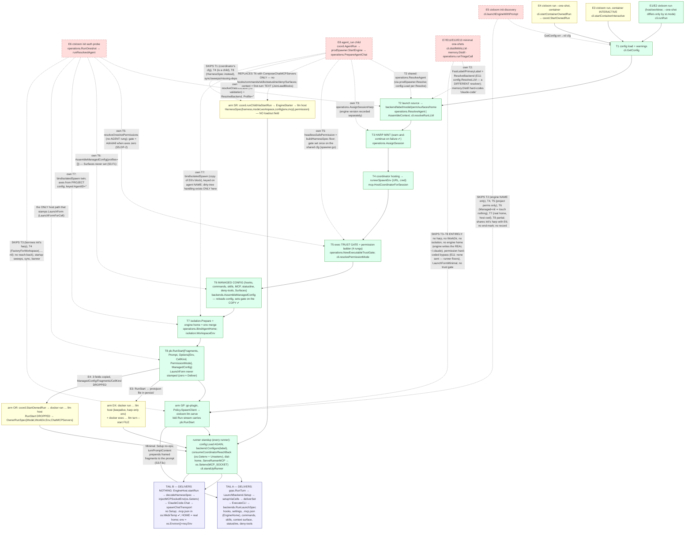

# 10 — SYNTHESIS: whole-system graphs and the refactor program

Architecture audit of ctxloom, `release/0.7` at `d42cc4229` (+ `a9b61bfae`, which closes seam 7 F1). Synthesis analyst; inputs are `00-coordinator-notes.md` and the seven seam documents `01`–`07` in this directory. Every reference is `package.Symbol` + file; no line numbers. Where two seams disagreed I read the code (§B7); where I rank something in the top ten I verified it (marked ✔ in the text).

STATUS: COMPLETE — Part A (A1–A6: five graphs + one table), Part B (B1–B7).

Seam-finding citations use `S<n>.F<m>` (e.g. `S1.F1`). Seam 5 uses its own labels (`S5.DP-1`, `S5.ML-1`, …); seam 4's data-flow smells are `S4.F-DF-n`.

---

## PART A — ASSEMBLED GRAPHS

### A1. Whole-system layer graph

Every package that appears in any seam's delegation graph, grouped into the layers the STATED architecture names (`GLOSSARY.md`, `tests/arch/layering_test.go` preamble, `docs/architecture/cli/README.md`, `docs/architecture/shared/agent-surface-delivery.md`). Edge classes:

- solid `-->` **CONFORMS** to the stated direction;
- thick `==>` **AGAINST** the stated direction (a lower layer reaching up, or a primitive importing the seam that uses it);
- dashed `-.->` **SKIPS** a layer that exists between the two ends (the stated mediator is bypassed).

Labels name the symbol or file that creates the edge. Package aliases are in the legend below.

```mermaid
flowchart TB
  classDef against stroke:#c00,stroke-width:3px
  classDef skip stroke:#a80,stroke-dasharray:5 5

  subgraph L0["cli layer"]
    CMD["cmd/* (ctxloom, taskloom, ltk, harp, …)"]
    CLI["internal/adapters/cli (+ cli/tui)"]
  end
  subgraph L1["operations layer (stated: frontend-agnostic mediator)"]
    OPS["internal/adapters/operations"]
  end
  subgraph L2["shared + delivery layer"]
    MCP["internal/adapters/mcp"]
    BE["internal/lm/backends"]
    AG["internal/core/agent (seam + toolbox)"]
    PRES["shared/agent/present"]
    CP["internal/adapters/confpatch"]
    LED["shared/ledger"]
    IOX["shared/iox"]
    EMIT["shared/cliemit → pkg/clifmt"]
    GLUE["shared/{clidiag,strictness,confload,sessionlock,plans}"]
  end
  subgraph L3["engines + lm layer"]
    GRPC["internal/lm/grpc (pb + wire)"]
    ISO["internal/adapters/isolation"]
    CL["internal/engines/claude (+ claude/engine)"]
    VPIO["internal/adapters/vpio{,/goplugin,/dockerexec}"]
  end
  subgraph L4["agentcoord layer"]
    COORD["agentcoord/coord"]
    PROTO["agentcoord (proto, seqwatch)"]
    SCHEMA["agentcoord/mcpschema"]
    SPOOL["agentcoord/spool"]
    DISC["agentcoord/discover"]
  end
  subgraph L5["trust + remote layer"]
    TR["internal/core/trust"]
    SIG["internal/adapters/signing (+countersign, allowedsigners, agentkey)"]
    ATT["content/attest"]
    REM["internal/adapters/remote"]
    BUN["internal/core/bundles"]
  end
  subgraph L6["sessions + transcript layer"]
    SESS["internal/core/sessions"]
    TRN["internal/adapters/transcript (+vendorreader)"]
    MEM["internal/adapters/memory"]
    TC["internal/adapters/turnchange"]
  end
  subgraph L7["paths + config layer"]
    CFG["internal/core/config"]
    PROF["internal/core/profiles"]
    PATHS["internal/core/paths"]
    WIRE["shared/wire"]
  end

  %% CONFORMING
  CMD --> CLI
  CLI --> OPS
  CLI --> EMIT
  CLI --> GLUE
  CLI --> CFG
  OPS --> CFG
  OPS --> BE
  OPS --> ISO
  OPS --> BUN
  OPS --> PROF
  OPS --> REM
  OPS --> SIG
  OPS --> ATT
  OPS --> TR
  OPS --> SESS
  OPS --> TRN
  OPS --> MEM
  OPS --> AG
  MCP --> OPS
  MCP --> COORD
  MCP --> SCHEMA
  COORD --> OPS
  COORD --> PROTO
  COORD --> SPOOL
  COORD --> DISC
  SCHEMA --> PROTO
  BE --> AG
  BE --> ISO
  BE --> CFG
  BE --> PROF
  BE --> BUN
  ISO --> AG
  ISO --> PRES
  GRPC --> AG
  CL --> AG
  CL --> CP
  CL --> LED
  CL --> PRES
  AG --> PRES
  AG --> LED
  AG --> IOX
  AG --> PATHS
  AG --> WIRE
  LED --> IOX
  CFG --> BUN
  CFG --> REM
  CFG --> SIG
  CFG --> TR
  CFG --> WIRE
  BUN --> SIG
  BUN --> ATT
  BUN --> TR
  BUN --> PATHS
  BUN --> PROF
  ATT --> SIG
  TRN --> SESS
  SESS --> PATHS
  MEM --> SESS
  SPOOL --> PATHS
  DISC --> PATHS

  %% SKIPS (cli/mcp/coord reaching past operations; operations past backends)
  CLI -.->|"S1.F6 S6.F3: run.go builds pb.RunStart, picks the arm, calls Policy.SpawnClient/StartRunner; 60 in-repo imports"| ISO
  CLI -.->|"S1.F6 S3.F12: backends.AssembleManagedConfig, backends.Get"| BE
  CLI -.->|"S1.F6: pb.RunStart{} ×3, pb.NewSelfInvokingClientForLabel"| GRPC
  CLI -.->|"S1.F6 S4: StartOwnedRun/WatchRuns/Identify; standUpRunner → NewHome/NewEngineHost (coord ×24)"| COORD
  CLI -.->|"S2.F2: cli.run imports mcp to stand up a session (HostCoordinatorForSession)"| MCP
  CLI -.->|"S6.F4: 8 hook files decode claude.* payloads"| CL
  CLI -.->|"S5.LB-1: deps check/reconcile drive remote directly (×46)"| REM
  CLI -.->|"S5.LB-2 S6.F8: signer resolved 6× in cli (agentkey)"| SIG
  CLI -.->|"S6 §3: bundles ×45, trust ×55"| BUN
  CLI -.->|"S7.F8: memory.WriteNextStep/StampPlanFile, transcript.RecordOneshot, turnchange.*"| MEM
  CLI -.->|"S7.F8: sessions.Manager in hook_inject_context; session_* files"| SESS
  CLI -.->|"S6: vpio/goplugin/dockerexec in run, init_launch"| VPIO
  MCP -.->|"S2.F2 S7.F8: memory.NewCompactor ×2, LoadDistilledSession; sessions; transcript; backends; isolation"| MEM
  MCP -.-> SESS
  MCP -.-> BE
  MCP -.-> ISO
  OPS -.->|"S3 §3: agent.Select/DeliverUnder/present.ProjectOnHost directly (doc says via backends.BuildSurfaces, which is gone)"| PRES
  OPS -.->|"S1 S3: pb.RunStart{} in oneshot.go, task_triggers.go; pb.ClientFactory"| GRPC

  %% AGAINST (upward or inverted)
  CP ==>|"S3.F20: primitive imports the seam for AtomicWriteFile/WithFileLock/IsManaged"| AG
  PROF ==>|"S3.F20: core profiles import the engine seam for MergeHooksConfig"| AG
  BE ==>|"S3.F9 S5.DF-3: loadConfigFn = config.Load re-loads a layer above already loaded; SetExecutableTrustGate on the copy"| CFG
  BE ==>|"S3.F12: forceExport mutates LLM.ClaudeCode.Enabled — engine-specific field in an engine-agnostic package"| CL
  BE ==>|"S5.LB-3: gateProfileHooks makes a TRUST decision (bundles.Decide) in the engine-adapter layer"| BUN
  CFG ==>|"S5.LB-4: extractMCPFromBundle/extractHooksFromBundle call bundles.Decide; gate reaches them as a MUTABLE field"| BUN
  TR ==>|"S5.LB-5: vocabulary package imports remote for URL normalisation"| REM
  REM ==>|"S5 §3: library writes operator diagnostics (clidiag.Warn)"| GLUE
  MEM ==>|"S1.F6 S7.F8: domain package builds pb.RunStart + client (memory.Distill); transcript is FORBIDDEN the same import"| GRPC
  MEM ==> BE
  GRPC ==>|"S7.F8: transport constructs transcript.Recorder/CanonicalHistory, calls sessions.LocateTranscript"| TRN
  GRPC ==> SESS
  COORD ==>|"S2.F15 S4.F12: spawner re-resolves ResolveBundleMCPServers; config.Load per Resolve"| CFG
  COORD ==>|"S2 §3: enginehost injectMCPSocketEnv patches delivery inside transport"| AG
  COORD ==>|"S4.F12 S7.F8: EngineHost.startRun builds transcript.Recorder — runner concern in coordinator pkg"| TRN
  COORD ==>|"S1.F9 S4.F11: docs say coord never imports isolation; it does (ParseWorkspaceAxis, EngineStarter)"| ISO
  COORD ==>|"S4.F12: runtime imports the LLM-facing schema for one constant (RecvWaitMax)"| SCHEMA
  DISC ==>|"S2 §3: hand-copies coord's state-dir, /mcp path, endpoint.json shape (no compiler link)"| COORD
  CL ==>|"S3.F12: recordStore/GlobalCommandsDir compute ctxloom-home and real-home paths inside the engine"| PATHS
  CL ==>|"S2.F8: claude.mcpEntries re-implements agent.MCPServerJSONEntry"| AG
  CL ==>|"S6.F11: engine plugin linked into cmd/ltk and cmd/taskloom via ltk/engine, taskloom/engine"| CMD
  ISO ==>|"S1 S3: isolation imports the wire (pb.ClientFactory) and walks HomeSessionsDir with its own predicate"| GRPC
  ISO ==> PATHS
  CLI ==>|"S6.F7: --degraded/--config-set/--format become package GLOBALS read by strictness, config.Load, clidiag, isolation"| GLUE
  OPS ==>|"S6.F9: six Sweep*/Report* functions render prose to io.Writer; 12+ files call clidiag.Warn"| EMIT
  OPS ==>|"S6.F6: config.Load inside SetLLM, resolveListConfig, WatchSessionFeed"| CFG
```



**Legend / aliases.** `pb` = `internal/lm/grpc` (seam 1 "grpc (pb)", seam 3 "wire", seam 7 "lm/grpc"). `AG` = seam 3's "the seam + toolbox" = seam 1's "runner core". `GLUE` collapses seam 6's `shared/*` list. `L2` = the brief's "shared+delivery"; `internal/adapters/mcp` is placed there because it is a protocol adapter in the stated picture, though §B1 argues it currently acts as a hub above `coord`.

**What the assembled graph shows that no single seam did.**

1. **`operations` is the stated mediator and is bypassed from above by every frontend and from below by every domain package.** The SKIP edges out of `CLI` and `MCP` number twelve; `layering_test.go` enforces exactly one rule in this direction (`operations ↛ cli`) and none that says a frontend must go THROUGH operations (S6.F3). The AGAINST edges show the mirror: `backends`, `config`, `coord`, `memory` and `lm/grpc` each do a job (config load, trust decision, MCP composition, engine launch, transcript recording) that the stated architecture assigns a layer above them.
2. **Three packages are "two programs in one import path".** `agentcoord/coord` compiles the coordinator AND the runner (S4 §3); `shared/agent` is the delivery SEAM and a filesystem TOOLBOX (S3.F20); `internal/adapters/mcp` is three server flavours plus coordinator lifecycle (S2.F2). Every AGAINST edge into `AG` and out of `COORD` is a symptom of one of these.
3. **`internal/core/config` is the universal carrier.** It is imported by every layer, and three things travel THROUGH it that are not configuration: the executable trust gate (`Config.execGate`, S5.ML-1), the `--config-set` override funnel (a process global, S6.F7), and the bundle readers/trust root (re-parsed per call, S5.DF-1). That is why the gate can be `AdmitAll` in one process and a real gate in a sibling copy of the same config (S5.DP-1, S5.DF-3 ✔).
4. **The only enforced rules that hold** are `operations ↛ cli`, `coord ↛ cli/tui`, `operations ↛ internal/engines/claude`, `transcript ↛ lm/grpc`, and the two lean-binary gates. Everything drawn as SKIP or AGAINST above is ungated (S2 §1, S5 §3, S6 §1, S7 §3).

### A2. Unified launch graph — every entry point that starts an engine, joined to what it does and does not run

Sources: S1 §3.2 (the divergence graph, steps S1–S13), S3 G2.1/G2.2 (the delivery pipeline), S4 G4/F4 (the bus arm), S2 §2.4 (MCP config), S5 §2.1 (the trust gate). The trunk in the middle is `cli.runRun`'s 21 phases collapsed to the eight that other paths diverge on. Each branch is labelled with what it SKIPS relative to the trunk. Green = the trunk implementation; yellow = a SEPARATE implementation of the same step; red dashed = skipped.



**Reading the divergence map.**

- **Which exec tail a run gets is decided by the ARM, not by the agent** (S1.F1, confirmed empirically by the coordinator: a live `agent_run` child ran with `HOME=/home/babbitt`, no `CLAUDE_CONFIG_DIR`, no `--settings`, a `/tmp/ctxloom-claude-chat-mcp-*` MCP config). E4 and E8 reach TAIL B; everything else reaches TAIL A. The same agent binding therefore gets its hooks, commands, skills and `surfaces:` preference on `ctxloom run --agent X` (host) and NONE of them on `agent_run X` or on `run --one-shot` under a container runtime. E4 is the more damning of the two: T6 RUNS and assembles the full `ManagedConfig`, then `startContainerOwnedRun` forwards `ChatMCPServers()` and discards the rest.
- **Four of six branches skip the harp mint** (E5 shares, E6 borrows, EM none) and the trunk itself tolerates a failed mint (`openSession` → `clidiag.Warn` → continue, ✔ `internal/adapters/cli/run.go`). `coord.StartOwnedRun` is the one launch entry that REFUSES a harpless request (S1 §5).
- **The trust gate reaches delivery on four different terms**: always (E1), only when axes are non-zero (E6, S5.DP-2), once on a config shared across every child (E8), never (E5/EM). And on E1 itself it is attached to a config `AssembleManagedConfig` RELOADED, not the one `NewExecutableTrustGate` was built from (S5.DF-3 ✔ `internal/lm/backends/managed.go`).
- **The runner re-derives what the host resolved**: config (second `config.Load`), backend binary/args/model (`serveBackendConfig(label)`), permission floor (sixth site), engine home (from `req.Env`), harp (from `req.Env`), MCP socket (from `os.Getenv` set by the same process). E3 does the host→runner derivation THREE times (host, keepalive, turn).

**Node aliases.** S1 calls the trunk steps S1–S13 and the runner R1–R3; S6 calls them "phases" of `runState`; S3 calls TAIL A "E3 Plugin Setup". `HarnessSpec` (S1/S4) = `agentcoordpb.HarnessSpec`; "loadout" (S1) = `agent.ManagedConfig` (S3) = "the managed payload" (S3 G2.1).

### A3. Unified MCP / delegation graph — one tool call, every physical path, to the spool file and back

Sources: S2 §2.1/§2.2/§2.5 (three server flavours; PATH A/B), S4 G1–G4 (the bus and the spool), S7 §4b (session identity carriers). One engine calls `agent_run`, `agent_send` or `agent_recv`. There are FOUR physical paths from its stdio to the coordinator verb and back; **every place a SECOND orchestrator exists is marked ⚠**.

```mermaid
flowchart LR
  classDef second fill:#fdd,stroke:#a22,stroke-width:2px
  classDef id fill:#eef,stroke:#228

  ENG((engine stdio<br/>.mcp.json entry: ctxloom mcp serve))

  subgraph SHIM["ctxloom mcp serve — mcp.ServeStdio (one process per engine)"]
    B0{"CTXLOOM_MCP_SOCKET env?<br/>else marker probeWellKnownRunner(sha256 cwd)"}
    FWD["forward shim: mcp.runMCPForward → prepareForward → verifyForwardTarget(env harp vs ServerInfo.Title)<br/>forwardTools (untyped passthrough) — forwardResources DROPS templates ✔ (S2.F10)"]
    LOCAL["⚠ PATH A — LOCAL MODE: ctxServer.startup (reapers, sync, ApplyHooks) → registerAgentTools<br/>handleAgentRun/Send/Recv/Stop (hand-written schema) → ctxServer.delegation → mcp.NewHostedCoordinator<br/>identity = selfIdentityFromEnv: env harp or harp.GenerateName(), Depth:0"]:::second
  end

  subgraph RUNNER["runner process — ctxloom llm serve|host|turn (per run)"]
    RM["PATH B — RUNNER-HOSTED: mcp.ServeRunnerMCP (unix socket, /mcp, discovery marker)<br/>coordinationHandler / recvHandler / reportHandler (mcpschema generated)<br/>identity = ctxServer.self{Harp, Depth:0 — IsChild() false for every child}; leaf = cli.runnerIsLeaf (second rule)"]
    HOME["coord.Home (runner half)<br/>Request · Recv · Report · sendPeerViaSpool · sweepSpoolIn · turnPump"]
    EH["coord.EngineHost.startRun → ClaudeCode.Chat (TAIL B of A2)<br/>injectMCPSocketEnv(os.Getenv(CTXLOOM_MCP_SOCKET) set by exportRunnerMCPSocket in the SAME process)"]
    RELAY["PATH B′ — HOST RELAY (7 tools: compact_session, load_session, recover_session, get_previous_session, list_sessions, evaluate_triggers, context_status)<br/>relayTyped → CustomRequest → gRPC → coord.serveCustom → mcp.relayHost → serverFor(caller) → handler<br/>⚠ handlers use HOST os.Getwd(), not caller.Project (S2.F4); value encoded 6× (S2 §3.2)"]:::second
  end

  subgraph COORDP["coordinator process — the session owner (ctxloom run) … or PATH A's rogue one"]
    RC["coordService.RunChannel (one per run; identity MINTED from bearer credential → Identity{Harp,RunID,Depth,OneShot,Project})"]:::id
    RNC["coordService.RunnerChannel (one per credential; StartRun/StopRun/Drain requests)"]
    SAR["handleAgentRequest → serveAgentRequest → serveSpawnAgent / serveListRuns / serveStopRun / serveStopChildren<br/>⚠ re-validates role/prompt, parses workspace axis, calls Coordinator.AgentRun (or c.stopRun DIRECTLY, bypassing AgentStop)"]:::second
    VERBS["Coordinator.AgentRun · AgentSend → peerSend · AgentRecv → recvMail · AgentStop · StopChildren"]
    SPAWN["AgentRun → prodSpawner.Resolve (config.Load per call; ComposeChatMCPServers) → AssignSessionHarp → enqueueRun (mint run_id + plaintext token) → runChild → runChildViaStartRun → StartEngine → issueStartRun (error IGNORED)"]
    OWN["⚠ StartOwnedRun (E4 owner run): setState(Executing) with NO slot, NO launchContext, no runnerWait/stderrTail — a second launch tail beside runChild (S4.F4)"]:::second
    REACT["spoolReactor: handleSpoolChanged(role from CHANNEL, not frame) → sweepChildOut → routeSpoolOut → peerSend → childSend → queueMailPayload (NEW id ⚠ S4.F-DF-1) → mailCourier.Send"]
    OWNRECV["⚠ owner long-poll: recvMail / parkedPoll / settleBurst (5ms sleep-poll) / claimSpoolInbox / ackSpoolInbox<br/>— the SECOND parked-poll state machine (S4.F3); onRolePark/Unpark permanent no-ops for the owner"]:::second
    TERM["terminateRun (15 jobs, one exactly-once claim) ← 5 detectors + livenessWatchdog (warn-only twin, S4.F7)"]
  end

  subgraph SPOOLFS["spool files (spool.HomeMapper → $HOME re-resolved at 9 sites, S4.F-DF-7)"]
    OUT[("child out/<seq>.<harp>.md")]
    CIN[("child in/<seq>.coord.md")]
    OIN[("owner in/<seq>.coord.md")]
    CONS[("…/consumed/ (rename = ack; no retention prune → c.spoolSeen grows)")]
  end

  %% engine → shim
  ENG --> B0
  B0 -->|"socket or marker found"| FWD
  B0 -->|"none, OR forward REFUSED (harp/stamp mismatch) → full local startup under a possibly FABRICATED harp (S2.F3)"| LOCAL
  FWD -->|"CallTool over HTTP-unix, json.RawMessage verbatim"| RM

  %% PATH A (local, rogue)
  LOCAL -->|"in-process: Coordinator.AgentRun(caller=selfIdentityFromEnv, workspace UNPARSED)"| VERBS
  LOCAL -->|"agent_send: Coordinator.AgentSend → peerSend (synchronous)"| VERBS
  LOCAL -->|"agent_recv: Coordinator.AgentRecv → recvMail"| OWNRECV

  %% PATH B (runner-hosted)
  RM -->|"agent_run: unmarshalArgs(SpawnAgentRequest) → Home.Request → AgentFrame{Request}"| HOME
  RM -->|"agent_send: Home.Request INTERCEPTED before the wire → sendPeerViaSpool (guards duplicated from DELETED servePeerSend, S2.F6)"| HOME
  RM -->|"agent_recv: Home.Recv (park/preempt/ackReturned) — the FIRST parked-poll machine"| HOME
  RM -->|"agent_report / agent_fetch_artifact / roster — runner ONLY (absent on PATH A)"| HOME
  RM -->|"7 relayed tools"| RELAY
  HOME -->|"gRPC RunChannel: hello | event | request | heartbeat | spool_changed"| RC
  HOME -->|"agent_send: spool.Writer.Write(out/) + fsync, then AgentFrame.spool_changed (drop-counted)"| OUT
  RC -->|"request{spawn_agent, list_runs, stop_run, …}; peer_send/approval/user_input → Unimplemented (S4.F11)"| SAR
  SAR --> VERBS
  RC -->|"spool_changed → reactor mark"| REACT
  RELAY -->|"CustomRequest over the same RunChannel"| RC

  %% spawn
  VERBS -->|"AgentRun"| SPAWN
  SPAWN -->|"RunnerRequest.start_run{HarnessSpec, first=JoinLeadBlocks(context, prompt)} over RunnerChannel"| RNC
  RNC -->|"wire"| EH
  EH -->|"exec engine child (TAIL B); its shim dials THIS runner's socket via CTXLOOM_MCP_SOCKET"| ENG
  OWN --> RNC

  %% mail up (child → parent)
  OUT -->|"sweepChildOut (doorbell | reattach | tick | startup)"| REACT
  REACT -->|"mailCourier.Send (writer id 'coord') + ringSpool → deliverToPoll"| OIN
  OUT -->|"consumeSpool"| CONS
  OIN -->|"claimSpoolInbox (reserve id) → recvMail returns; NEXT recv acks by rename"| OWNRECV
  OWNRECV --> CONS

  %% mail down (parent → child)
  VERBS -->|"ownerSend → queueMailPayload (delivered ALWAYS false, S4.F-DF-2) → mailCourier.Send + CoordinatorNotice.spool_changed (non-blocking)"| CIN
  CIN -->|"Home.sweepSpoolIn → mailFromSpool → deliverNotice → turnQ | h.buffer"| HOME
  HOME -->|"turnPump → sink → EngineHost.enqueueTurn → engine stdin; ackMailConsumed → rename + Announce('consumed')"| EH
  CIN --> CONS

  %% terminal
  RNC -->|"RunExited | stream ended | heartbeat loss"| TERM
  TERM -->|"queueMail(harp → parent, exited|error); relaunchForLeftoverMail → resumeChild (fresh run_id, same harp); container child pays a container start PER TURN (coordinator notes)"| SPAWN
```



**Second orchestrators, enumerated** (each ⚠ above):

| # | Where | What it duplicates | Seams |
|---|---|---|---|
| 1 | `mcp.ctxServer.delegation → NewHostedCoordinator` (PATH A) | the session owner's coordinator — a stdio relay can promote itself into an owner, under a harp that may be `harp.GenerateName()`'d | S2.F1/F2/F3, S4.F2, row `tacky-padding` (ruled) |
| 2 | `mcp.handleAgentRun/Send/Recv/Stop` + `agentDelegation` (hand-written schemas) | `mcp.coordinationHandler`/`recvHandler` + `mcpschema` (generated) — two schemas, two result shapes, two "leaf" rules, two undecodable-message policies | S2.F1/F5/F7, S4.F5 |
| 3 | `coord.serveSpawnAgent` / `serveStopRun` | `Coordinator.AgentRun` / `AgentStop` — re-validates, and `serveStopRun` calls `c.stopRun` directly re-implementing the ownership check | S2.F1, S4.E7 |
| 4 | `Home.sendPeerViaSpool` | `Coordinator.peerSend`'s guards (comment cites the deleted `servePeerSend`); the third terminus of `agent_send` | S2.F6, S4.F10 |
| 5 | `Coordinator.recvMail`+`parkedPoll`+`claimSpoolInbox`+`ackSpoolInbox` | `Home.Recv`+`homePark`+`deliverNotice`+`ackMailConsumed` — one parked long-poll with late ack, written twice | S4.F3 |
| 6 | `Coordinator.StartOwnedRun` (E4) | `Coordinator.runChild → runChildViaStartRun` — the owner run skips slot admission, `launchContext`, `runnerWait`/`stderrTail`; `SendOwnedRunTurn` is a self-addressed mail | S4.F4, S1 E4 |
| 7 | `Coordinator.driveQueued` vs `relaunchForLeftoverMail → nextRelaunch` | two resume arms each hand-rolling `armLaunch + goTracked(resumeChild)` | S4.F5b |
| 8 | `livenessWatchdog → runnerHeartbeatProbe` | `runnerWatchdog → checkRunnerLiveness` — same predicate, one acts, one narrates | S4.F7 |
| 9 | `mcp.relayHost` handlers (`os.Getwd()` ×6) vs `ctxServer.resourceProjectDir` (`s.self.Project`) | two answers to "whose project is this call for" in one package | S2.F4, S7.F2 |
| 10 | `mcp.NewDocMCPServer` (docgen clone) | a fourth server flavour with `cfg=nil`, a `coord.Home` retrying `127.0.0.1:1` | S2 E4 |

**Session identity on this graph** (S2 §3.1, S7 §4b): the harp is MINTED once (`sessions.Manager.AssignHarp`) and then re-obtained from THREE carriers — the env string `CTXLOOM_SESSION_HARP` (read at five sites in the shim flow alone, under two spellings: the literal in 17 non-test sites, `agent.SessionHarpEnv` in 23), `ctxServer.self.Harp` (built with `Depth` unset), and the bearer credential (`coord.Identify` — the ONLY trustworthy identity, and it exists only on PATH B). PATH A's identity can be fabricated; PATH B's runner-side `self` says every child is not a child; only the coordinator-side credential identity is right.

**Node aliases.** S2 "PATH A / PATH B" = S4 "E2/E4/E6 coordinator-local" / "E1/E3/E5 runner-hosted". S4 "plane 1 / plane 2" = `AgentFrame.event` / `AgentFrame.request`. "doorbell" (S4) = `spool_changed` frame/notice. `Home` = "the runner half of coord" (S4 §3).

### A4. Unified data-flow — the session harp and the resolved launch value, creation to every consumer

Sources: S1 §3.4, S2 §3.1, S3 §4b/F8, S7 §4b, S6 §3.1. Two values ride this graph: **the harp** (top half) and **the resolved launch** (backend+label+model+permission+harp+workDir+env+loadout+cell/form — bottom half). Every edge is labelled with its CARRIER: `[typed]` a typed parameter or field · `[env]` an environment string · `[file]` a file on disk · `[global]` a package variable or process global · `[re-derive]` re-computed from env/files/config instead of received.

```mermaid
flowchart LR
  classDef mint fill:#dfe,stroke:#282
  classDef rederive fill:#fdd,stroke:#a22
  classDef carrier fill:#ffd,stroke:#a80
  classDef consume fill:#eef,stroke:#228

  %% ================= THE HARP =================
  MINT["MINT: sessions.Manager.AssignHarp (os.Mkdir uniqueness)<br/>← operations.AssignSession (run, init) | operations.AssignSessionHarp (coord.prodSpawner)"]:::mint
  GEN["⚠ FABRICATED: mcp.selfIdentityFromEnv → harp.GenerateName() when env absent"]:::rederive

  ST["cli.runState.activeHarp"]:::carrier
  RENV["runEnv map: CTXLOOM_SESSION_HARP (+ PROJECT_ID, RESUMED_FROM/PARTS)"]:::carrier
  CRED["coord bearer credential → Identity{Harp,RunID,Depth,OneShot,Project}<br/>(the one TRUSTWORTHY carrier)"]:::carrier
  CHILDENV["coord.childEnv / runnerEnv: CTXLOOM_SESSION_HARP, COORD_URL/CRED, RUN_ID, DEPTH, ONESHOT"]:::carrier
  HS["agentcoordpb.HarnessSpec.SessionHarp (typed on the wire)"]:::carrier
  ROQ["operations.RunOneshotRequest.Harp (typed) → operations.harpEnv → env one call later"]:::carrier
  SELF["mcp.ctxServer.self.Harp (Depth unset ⇒ IsChild()==false for every child)"]:::carrier
  MARK["discovery marker {Socket,Pid,Harp,Stamp} + MCP Implementation.Title"]:::carrier

  RR1["cli.consumeCoordinatorReachBack: os.Getenv (twice into two fields; UNSETS trio)"]:::rederive
  RR2["LaunchBackend.setupViaCells: req.Env[SessionHarpEnv] → sharedScratchDir (ErrSharedScratchNoHarp)"]:::rederive
  RR3["runResolvedAgent: req.ExtraEnv[SessionHarpEnv]; bindIsolatedSpawn: p.req.Env[SessionHarpEnv]; isolation.SessionStateFromEnv(runEnv)"]:::rederive
  RR4["mcp shim flow: sessionInstructions, probeWellKnownRunner, verifyForwardTarget, selfIdentityFromEnv — 4 os.Getenv in ONE flow"]:::rederive
  RR5["memory.Compactor.resolveHarpName: config.HarpName ‖ SessionID-as-harp ‖ os.Getenv(CTXLOOM_SESSION_HARP)"]:::rederive
  RR6["hook verbs (child procs, legitimate) — but under TWO spellings: literal ×4 files, agent.SessionHarpEnv ×4 files"]:::rederive
  RR7["cli.seedTaskIntoSession: ProjectID = os.Getenv(CTXLOOM_PROJECT_ID) — PARENT env, never set in-process (S6.F13 PLAUSIBLE)"]:::rederive
  RR8["mcp.sessionHarpForID / compactionTargetHarp / loadOrDistillSession: id-as-harp ‖ HarpForSession ‖ HarpDir stat — 4 'is this a harp?' resolvers"]:::rederive

  C1["consumers: transcript.NewRecorder(harp) · paths.HarpPersistDir · sessionlock.Hold · Coordinator.audit · spool writers (From: h.cfg.Harp) · plans.SessionPlanPaths · isolation.sessionStateMounts · reapers"]:::consume

  MINT -->|"[typed] sessions.Entry.HarpName"| ST
  ST -->|"[env] runEnv[CTXLOOM_SESSION_HARP]=harp (literal)"| RENV
  RENV -->|"[typed] pb.RunStart.Options.Env"| RR2
  RENV -->|"[env] engine process + every hook"| RR6
  RENV -->|"[env] go-plugin child (llm serve)"| RR1
  RENV -->|"[env]"| RR5
  MINT -->|"[typed] AssignSessionHarp → AgentRun"| CHILDENV
  CHILDENV -->|"[env] runner process"| RR1
  CHILDENV -->|"[typed] coord.Identify(token)"| CRED
  MINT -->|"[typed]"| HS
  MINT -->|"[typed] init passes harp"| ROQ
  ROQ -->|"[env] harpEnv"| RR3
  RR1 -->|"[typed] harp string → ServeRunnerMCP(harp)"| SELF
  RR1 -->|"[file] writeDiscoveryMarker; [wire] ServerInfo.Title"| MARK
  MARK -->|"[re-derive] shim compares env harp to marker/Title"| RR4
  GEN -->|"[global] Identity{Depth:0}"| RR4
  CRED --> C1
  SELF --> C1
  RR2 --> C1
  RR3 --> C1
  RR5 --> C1
  RR8 --> C1
  RENV -->|"[env] CTXLOOM_PROJECT_ID (children only)"| RR7

  %% ================= THE RESOLVED LAUNCH =================
  CFGF[("config files: ~/.ctxloom + .ctxloom/config.yaml + --config-set [global funnel]")]:::carrier
  RA["operations.ResolvedAgent{Backend,Label,Model,Profiles,Context,Runtime,Permissions,Surfaces,HomeMode}"]:::mint
  RS["cli.runState (≈40 fields; God struct)"]:::carrier
  MC["agent.ManagedConfig ← backends.AssembleManagedConfig<br/>(config RE-LOADED [re-derive]; gate set on the copy; profiles re-resolved ×5)"]:::rederive
  REQ["pb.RunStart{Fragments, Prompt, Options{WorkDir,PermissionMode,Mode,Env,Model,CellKind,(LaunchForm)}, ManagedConfig}"]:::carrier
  ORS["coord.OwnerRunSpec (9 fields) — E4 copies 3 of RunStart's, DROPS ManagedConfig/Fragments/CellKind"]:::carrier
  HS2["agentcoordpb.HarnessSpec{harness,model,workspace,config{env,mcp,transcript policy},permission,resume} — NO loadout"]:::carrier
  CR["agent.ChatRequest ← coord.decodeHarnessSpec (+ MCPServers env patched from os.Getenv(MCP_SOCKET) [global])"]:::rederive
  HOFILE[("persist/runstart.json — E3 RunStart as a FILE (docker exec argv cannot carry it) [file]")]:::carrier
  SR["agent.SetupRequest{WorkDir,Fragments,Env,Managed,CellKind,Form,Model}"]:::carrier
  RRHOME["setupViaCells: EngineHome = req.Env[engineHomeVar] (CLAUDE_CONFIG_DIR) — typed→env→typed [re-derive]"]:::rederive
  RRCFG["runner: cli.loadAndConfigureBackend → config.Load AGAIN → serveBackendConfig(label) → BinaryPath/Args/Model [re-derive]<br/>(a host --config-set override and a runner without it disagree silently)"]:::rederive
  RRPERM["permission floor re-derived at SIX sites: cli.resolvePermissionMode · operations.effectiveMemberPermission · grpc.turnExecuteRequest · coord.headlessSafePermission · buildHarnessSpec · decodeHarnessSpec"]:::rederive
  RRCTX["context: AssembleContext → string → []pb.Fragment (cli) → assembleSurfaceContext (plugin) — ONE value, THREE shapes, TWO assemblies (S3 §4b)"]:::rederive
  ER["agent.ExecuteRequest → agent.LaunchSpec{BinaryPath,Args,Env=os.Environ()+env}"]:::carrier
  X1["exec: backends.RunLaunchSpec (TAIL A)"]:::consume
  X2["exec: claude.spawnChatTransport (TAIL B)"]:::consume

  CFGF -->|"[re-derive] config.Load (host)"| RA
  RA -->|"[typed] applyResolvedAgent copies 9 fields"| RS
  RS -->|"[typed] buildRunRequest"| MC
  CFGF -->|"[re-derive] loadConfigFn()"| MC
  MC -->|"[typed] ManagedConfigToProto"| REQ
  RS -->|"[typed] Surfaces attached ONLY here (S3.F1)"| MC
  RENV -->|"[typed] Options.Env (harp, CLAUDE_CONFIG_DIR, workspace env)"| REQ
  REQ -->|"[wire] bidi Run stream (E1/E2/E5/E6/E7)"| SR
  REQ -->|"[file] E3"| HOFILE --> SR
  REQ -->|"[typed] E4: 3 fields"| ORS --> HS2
  RA -->|"[typed] E8: prodSpawner.chatRequest → PrepareAgentChat → EngineSpawn (Surfaces NOT carried)"| HS2
  HS2 -->|"[wire] RunnerRequest.start_run"| CR
  CR --> X2
  SR --> RRHOME --> ER
  SR --> RRCTX --> ER
  CFGF -->|"[re-derive]"| RRCFG --> ER
  RRPERM --> ER
  ER --> X1
```



**What the assembled data-flow shows.**

1. **The harp has one mint and eight re-derivation sites**, four of which are in ONE process flow (the shim). The value is typed at birth (`sessions.Entry.HarpName`), typed on two wires (`HarnessSpec.SessionHarp`, the credential), and yet the plugin, the compactor, the one-shot facade, the shim and the coordinator's own runner standup all read it back from an env string — under two spellings. `ErrSharedScratchNoHarp` exists ONLY because the plugin cannot be handed the harp as a parameter (S3.F8).
2. **The resolved launch has no type**: it is `ResolvedAgent → runState → pb.RunStart → {SetupRequest | OwnerRunSpec → HarnessSpec → ChatRequest} → ExecuteRequest → LaunchSpec` — one value, EIGHT shapes, with fields dropped at three hops (E4's re-pack, `HarnessSpec` having no loadout field, `ChatRequest` having no `Setup`). S1.F5 counts six sites that build `pb.RunStart{}` field-by-field and six struct shapes of the same thing. Because there is no constructor, nothing can REQUIRE a harp, a home, a permission or a `LaunchForm` (S1.F5).
3. **The runner re-derives the host's resolution three ways** (config, backend, permission floor) and reads two roots from env strings; a host `--config-set` override never reaches the runner's second `config.Load` (S1.F7.3). The `[global]` carriers are worse than `[env]`: `--degraded`, `--config-set`, `--format` and the MCP socket path are package/process globals written in one function and read in another with no parameter naming them (S6.F7, S2 §3.1).
4. **Context is assembled twice and shipped as fragments in between** so that `LaunchFormMinimal` can prepend it to the prompt on the runner (S3.F3c) — a delivery decision living in the transport.

**Aliases.** `harp` = `HarpName` = `SessionHarp` = `AgentName` (E4 sets `SpawnPlan.AgentName = spec.Harp`); engine key = `backendName` = `engine` = `Harness` = `llmName` = `Backend`; `label` = `llmLabel` = `--label`.

### A5. Trust choke graph — bytes fetched from a remote to bytes an engine executes

Sources: S5 §2.1 (V0–V3, DP-1/DP-2), S3 G2.3 (the writers), S1 §1 (X1/X2 exec sites), plus two code checks (✔). Every verification point is `[[V…]]`. Every path that reaches delivery WITHOUT one is dashed red.

```mermaid
flowchart LR
  classDef verify fill:#dfe,stroke:#282,stroke-width:2px
  classDef bypass stroke:#c00,stroke-dasharray:5 5,stroke-width:2px
  classDef exec fill:#eef,stroke:#228

  subgraph FETCH["remote → disk"]
    PULL["remote.Puller.Pull → fetchForPull → fetchItemBytes (fetches the DOCUMENT form it will refuse, S5.DP-4)"]
    RETR["remote.confirmRetraction → CheckRetracted (fail-stale 14d; unreadable lockfile ⇒ 'not retracted' S5.W-5)"]
    INST["installPulledItem → installTree → updateLockfile (tree bool dead)"]
    LOCK[(".ctxloom/lock.yaml LockEntry{SHA,URL,Retracted,…}")]
    TREE[("installed worktree (.sigs/<contentKey>.<ns>.<sigtag>.sig + bundle.yaml.sig SIBLING — two signatures, S5.D-3)")]
  end

  subgraph READ["config.Load → reader assembly (bundles)"]
    RRR["bundles.ReadRemoteRef (pull-walk, @commit reads)"]
    V0[["V0 bundles.verifyRemoteTree → attest.VerifyBundle — REFUSES unless verdict.OK()"]]:::verify
    REPO["config.treeBundleReader → bundles.repoFSReader.readTreeForm"]
    V1[["V1 repoFSReader.verifyTree → attest.VerifyBundle → resolvePublisher — maps to signatureFacts, read PROCEEDS to review"]]:::verify
    LOCAL["localFSReader (project + builtin) — signatureFactsFor"]
    V2[["V2 signing.VerifyPublisher / VerifyInNamespace (sibling .sig) — verified then MOOT for local posture (S5.SA-1)"]]:::verify
    COMP["companionReader.read → readSignatureFacts"]
    BREAD["bundles.BundleRead{Bundle.Signer() string, trustCtx, signature, signer enum} — publisher identity is a plain STRING (S5.ML-2)"]
    UPG["operations/upgrade_verify (deps upgrade) → remote.ReadBundleSignature — a THIRD verification policy over the sibling .sig (S5 U2)"]
  end

  subgraph DECIDE["the decision (operations)"]
    ET[["V3 operations.EffectiveTrust → contentGate.Admit: rejected? → retracted? → local/builtin/companion allow → signer trusted? → countersign.VerifiedApprove (signing.VerifyCountersignature) → pending<br/>records + trust root RE-READ from disk per item (~14 ReadDirs, S5.DF-1)"]]:::verify
    NEG["operations.NewExecutableTrustGate(cfg) → Authorizer()"]
    EPG["operations.exposurePipelineGated(cfg) → bundles.Pipeline + contentGate (fragments: gated INDEPENDENTLY of Config.execGate ✔)"]
  end

  subgraph CHOKES["consultation sites (three layers)"]
    PIPE["bundles.Pipeline.deliver/deliverSkill → bundles.Decide (fragments, commands, skills)"]
    CMCP["config.extractMCPFromBundle / resolveBuiltinBundleMCPServers → bundles.Decide"]
    CHOOK["config.extractHooksFromBundle / resolveBuiltinBundleHooks → bundles.Decide"]
    PHOOK["backends.gateProfileHooks → hookExecPayload (wire.Hook → BundleHook HAND COPY, reverse of the parity-tested direction, S5.SA-5) → bundles.Decide"]
    GATEF["config.Config.execGate — MUTABLE FIELD; ExecutableTrustGate() returns bundles.AdmitAll() when unset ✔<br/>set by 5 sites: coord/spawner.go · backends.AssembleManagedConfig (on a RELOADED cfg) · operations/hooks.go · hooks_resolve.go · profile_materialize.go (save/set/defer-restore)"]
  end

  subgraph DELIVER["writers (seam 3) and exec (seam 1)"]
    AMC["backends.AssembleManagedConfig(backend, workDir, gate, profiles) → agent.ManagedConfig{Commands,Skills,Hooks,BundleMCP,…}"]
    SETUP["LaunchBackend.Setup → deliverSet → claude writers"]
    W1[(".claude/settings.json hooks (+ledger) | EngineHome/settings.json (confpatch)")]
    W2[("EngineHome/.mcp.json (confpatch) | <project>/.mcp.json")]
    W3[(".claude/commands/*.md | .claude/skills/**")]
    W4[("CLAUDE.md | <sha>.sysprompt.md | .ctxloom/cache/context/<sha>.md (hook cache — NO lock, NO ledger, S3.F19)")]
    X1["exec TAIL A: engine reads settings/hooks/MCP → hook COMMANDS and MCP server COMMANDS execute"]:::exec
    X2["exec TAIL B: ClaudeCode.Chat → MCP servers from HarnessSpec (composed by coord.childMCPServers) execute; no hooks/commands delivered"]:::exec
    MCPRES["ctxloom://fragments/{name}, assemble_context, search_* (MCP resources) — content only"]
  end

  PULL --> RETR --> INST --> LOCK
  INST --> TREE
  RRR --> V0 --> BREAD
  LOCK --> REPO --> V1 --> BREAD
  LOCAL --> V2 --> BREAD
  COMP --> V2
  LOCK --> UPG
  BREAD --> PIPE
  BREAD --> CMCP
  BREAD --> CHOOK
  NEG --> ET
  EPG --> ET
  EPG --> PIPE
  PIPE -->|"Exposure{Read, Ref, Bytes, Form}"| ET
  CMCP -->|"gate := c.ExecutableTrustGate()"| GATEF
  CHOOK --> GATEF
  PHOOK --> GATEF
  GATEF -->|"when SET"| ET
  NEG -->|"cli.runRun: gate built on st.cfg …"| AMC
  AMC -->|"… then SetExecutableTrustGate on the RELOADED cfg (S5.DF-3 ✔)"| GATEF
  AMC --> CMCP
  AMC --> CHOOK
  AMC --> PHOOK
  AMC --> PIPE
  AMC --> SETUP
  SETUP --> W1 & W2 & W3 & W4
  W1 & W2 & W3 --> X1
  W4 --> X1
  PIPE --> MCPRES

  %% ---- BYPASSES ----
  GATEF -.->|"BYPASS 1 (S5.DP-1): any *config.Config nobody attached a gate to → AdmitAll → bundles.Decide SHORT-CIRCUITS (no ref, no preimage, no EffectiveTrust, no withheld tally) → MCP/hooks/commands/skills delivered UNGATED. Includes `ctxloom mcp serve`'s own cfg ✔ (no SetExecutableTrustGate in internal/adapters/mcp) until a coordinator is lazily built"| CMCP
  GATEF -.->|"BYPASS 1"| CHOOK
  GATEF -.->|"BYPASS 1"| PHOOK
  NEG -.->|"BYPASS 2 (S5.DP-2, S1.F8): operations.RunOneshot: gate := bundles.AdmitAll() when isolation axes are zero — 'nothing consults it' is FALSE, runResolvedAgent passes it to AssembleManagedConfig"| AMC
  BREAD -.->|"BYPASS 3 (S1.F1, S2.F15): E4/E8 → coord.childMCPServers → Config.ResolveBundleMCPServers(profiles) on the SPAWNER's cfg (gate set once at newProdSpawner from construction-time cfg; prodSpawner.resolveCfg re-reads config.yaml per Resolve — TWO configs feed one spawn, S4.F-DF-7)"| X2
  V2 -.->|"BYPASS 4 (S5.SA-1): a project-local SIGNED bundle: signature verified, stamped, then allowed at the LOCAL step before the signer is consulted — SignatureInvalid only changes the admit REASON"| ET
  W4 -.->|"BYPASS 5 (S3.F19): the hook-cache context write is outside every discipline gate (raw afero.WriteFile, project cwd on every cell kind); its SessionStart hook string IS delivered through settings"| X1
  UPG -.->|"BYPASS 6 (S5 U2/D-3): deps upgrade accepts an advance whose sibling .sig verifies but whose .sigs/ manifest does not, or vice versa"| TREE
```



**What the assembled choke graph shows.**

1. **The DECISION is single** (`EffectiveTrust` → `contentGate.Admit`, S5 SA-4 "stronger than stated") — but its **handle is fail-open and untyped**: `Config.ExecutableTrustGate()` returns `AdmitAll` unless one of five sites mutated the config, and `bundles.Decide` skips every step (including REJECTION and retraction) when the authorizer is `AdmitAll` (✔ `internal/core/config/config_bundles.go`). Fragments are safe from this — `AssembleContext` uses `exposurePipelineGated`'s own gate (✔ `internal/adapters/operations/context.go`) — so BYPASS 1 is specifically the EXEC surfaces (MCP, hooks) and the profile-scoped commands/skills loaders in `lm/backends`, which is the worse half.
2. **`ctxloom mcp serve` in local mode never attaches a gate to its own config** (✔ no `SetExecutableTrustGate` under `internal/adapters/mcp`). Its startup `ApplyHooks` IS gated (`operations/hooks.go` sets the gate on a `freshCfg`), so the exposure is bounded: the server's own `ctxServer.cfg`, used by `registerResources`/`ListMCPServers` (`ctxloom://mcp-servers`) and by `handleAgentRun`'s in-process `NewHostedCoordinator → prodSpawner`, reads `AdmitAll` for MCP/hook items — UNTIL `ctxServer.delegation()` lazily constructs a coordinator, because `coord.newProdSpawner` calls `cfg.SetExecutableTrustGate` on the config it is handed (✔ `internal/core/coord/spawner.go`), i.e. the same `*config.Config` becomes gated as a SIDE EFFECT of the first `agent_run`. That order-dependence is the mutable-field defect (S5.LB-4) in its purest form, and it answers seam 5's open question to seam 2.
3. **Three verification adapters, three refusal policies** for one publisher signature (V0 refuses, V1 proceeds, `upgrade_verify` checks a different file) — S5.D-1/D-2/U2. The identity they produce is a `string` that `EffectiveTrust` allows on `!= ""`.
4. **TAIL B (E4/E8) never reaches `AssembleManagedConfig`**, so the MCP servers a delegated child executes are gated by whatever `prodSpawner` attached at construction — and its `resolveCfg` re-reads config per spawn while `gate` was built from the construction-time config (S4.F-DF-7).

### A6. Stated-vs-actual map

Every doc / glossary / arch-test / load-bearing-comment statement the seams found false, grouped by document, with the symbol that contradicts it. "Verified" = the seam read the code; ✔ = re-verified here. Rows marked **DELETE** are ones the project's own rule ("when you find one already stale, delete it") applies to — line-number tables, counts, retired-engine prose — rather than correct.

#### `GLOSSARY.md`

| Stated | Contradicting symbol | Seam |
|---|---|---|
| runtime coordinator is "hosted by every session-owning process (`ctxloom run`, the `ctxloom mcp serve` fallback)" | row `tacky-padding` rules ONE coordinator per project hosted by a RUNNER; `mcp.ctxServer.delegation` is the defect, not the norm | S2.F13 |
| session home "is where that launch's CONFIGURATION belongs: framed context, `.mcp.json`, settings" | TAIL B (`claude.writeChatMCPConfig`) writes `.mcp.json` to `os.MkdirTemp` and no settings at all ✔ | S1.F9 |
| "the durable truth is the engine's REAL home, which ctxloom never writes" | E7/E11/E12/E13 minimal one-shots and every E8 child run with the real `~/.claude` as HOME (coordinator-verified) | S1.F3, notes |
| D3 "children never prompt … the coordinator does NOT broker an approval UI" | `coord/pendingapproval.go`, `resolveAskReply`, approval kinds in `mailkind.go` (row `abnormal-ability` is building elicitation) | S4.F11 |
| "session home … Inside the session dir, at sessions/<harp>/home" (merged layout stated as current) | `paths.SessionHomePath` = `<project>/.ctxloom/state/<harp>/home` — two trees, `boned-monoxide` item 1 open | S7.F6 |
| the pipeline is "control-plane → wire → runner → engine; advice applied ONCE" | advice applied at both `config.Load` sites (host + runner) and the permission floor at six | S1.F7 |
| defines neither `operations`, `cliemit`, `clifmt` nor "thin surface" | the seam every frontend is supposed to go through has no vocabulary entry | S6 §1 |

#### `docs/architecture/cli/run.md`, `llm-runners.md`, `README.md` (pinned to `0f59fbae`, line-numbered) — **DELETE the line tables**

| Stated | Contradicting symbol | Seam |
|---|---|---|
| "one anonymous 930-line cobra closure `runCmd.RunE`"; `run.go` 1,776 lines | `cli.runRun` + 21 `runState` phase methods; every `:line` ref stale | S1.F9, S6.F3 |
| "Every `ctxloom run` opens a FRESH harp (Decision 11)" | `runState.openSession` warns and continues harpless on `AssignSession` failure ✔ | S1.F3 |
| `--label` "carried by one global `llmServeLabel`"; "three runner transports skip the config-warning and strictness gates" | `standUpRunner(cmd, backend, backendName, label)`; `runLLMHost`/`runLLMTurn` call `gates.close(PhaseStartup)`; `loadAndConfigureBackend` calls `config.RecordWarningsTo` | S1.F9, S6.F3 |
| `readRunStartHandoff` "registers `defer os.Remove` BEFORE the decode, so a corrupt handoff file is deleted" | `os.Remove` runs after a successful `protojson.Unmarshal` | S1.F9 |
| README: "no file in the package reaches past `operations`, `config`, `isolation`, or `resources`"; "call exactly one `operations` function" | `internal/adapters/cli` imports 60 in-repo packages incl. `internal/engines/claude`; `run`, `doctor` (35 checks), `deps check` (no operations counterpart), `review`, `util config-write` are cli-resident orchestrators | S6.F2/F3 |
| README I1: "`operations` never loads config itself"; every command through `GetConfig()` | 22 direct `config.Load` in cli, 3 in operations (`SetLLM`, `resolveListConfig`, `WatchSessionFeed`) | S6.F6 |
| README I3 violation "in `remote_discover.go`" (own `bufio.Reader`) | fixed — uses `stdinReader`; the README still cites it | S6.F3 |
| "five MCP server flavours in cli"; files `mcp_runner.go`, `mcp_forward.go`, `coord_host.go`, `memory.go`, `item_helpers.go` | moved to `internal/adapters/mcp` or deleted | S6.F3 |
| `cli.Execute`, `failOnFindings`, "five deprecated alias trees" | `cli.Run() int`, `cli.phaseGates.close`, aliases deleted | S6.F3 |

#### `docs/architecture/cli/mcp.md` — **DELETE the `file:line` tables**

| Stated | Contradicting symbol | Seam |
|---|---|---|
| `mcp serve` "No `Args` constraint"; `mcp add/remove/register/unregister`, `mcp server add/remove`, `manage mcp *` exist; "Flags … registered twice" | `cobra.NoArgs`; tree is `mcp {serve, server {list, show, edit}}`; one `init` | S2.F12 |
| `NewDocMCPServer` "panics twice … leaks the coord.Home" | returns errors and a `closeHome` | S2.F12 |
| `runnerDiscoveryMarker.Harp` "written and read nowhere"; "six host-relay tools"; `forwardTools` "never checks that it registered anything" | read by `probeWellKnownRunner`; seven (`context_status`); refuses on `n == 0` | S2.F12 |
| Invariant "Identity comes from `s.self`, never from process env" | `handleCompactSession`/`handleLoadSession`/… use `os.Getwd()`; `evaluateTriggersTaskContext` reads `CTXLOOM_PROJECT_ID` | S2.F4 |

#### `docs/architecture/agentcoord/*` (pinned `0f59fbae`, 6218 commits behind) — **DELETE the tree**

| Stated | Contradicting symbol | Seam |
|---|---|---|
| `mailbox.md`, `child-lifecycle.md`, `overview.md` plane table, invariants I5/I6: `mailbox.go`, `pushMail`, `bridgeTurnResult`, `driveChild`, plane-3 `peer_message` push | all deleted by `7750d8eeb`; notice fields 3–5 `reserved` in `coordination.proto` | S4.F1 |
| `child-lifecycle.md`: "Two mutually exclusive launch drivers coexist"; `Spawner` has `Launch`; `driveChild` "FROZEN" | `coord.runChild` calls only `runChildViaStartRun` ✔; `coord.Spawner` has no `Launch`; the operations half (`PreparedAgentChat.Start`) is orphaned ✔ | S1.F9, S1.F2 |
| `OwnedRunStarter`/`OwnerRunSpec` let coord "spawn a runner without importing `lm/isolation`" (also `engines/isolation.md`) | `coord` imports `isolation` (`ParseWorkspaceAxis` in `runchannel.go`, `EngineStarter` in `spawner.go`) | S1.F9, S4.F11 |
| `transport.md` names `servePeerSend` among the verbs | gone; `serveAgentRequest` answers `PeerSend` with `Unimplemented` | S2.F12, S4.F1 |
| `overview.md` divergence index (RevokeSessionOwner unreachable; `issueStartRun` ctx; empty first turn; `Queued` unread; two stop bodies) | every entry FIXED — the index is now a list of non-divergences | S4.F1 |
| `coord/doc.go`: "role mailboxes" among the stores; blesses the bare-`ctxloom mcp` fallback | no mailbox store; `tacky-padding` rules the fallback a defect | S4.F1 |

#### `docs/architecture/shared/*` (surface delivery, context delivery, managed files, launch lifecycle)

| Stated | Contradicting symbol | Seam |
|---|---|---|
| "Resolution: name in, approach out, no fallback"; `cells.go` "a shared cwd never SUBSTITUTES" | `SurfaceSelection.reroot` replaces the selected approach; `ResolveAgent` warns and uses the engine default on a bad `surfaces:`; unparseable `engine_home:` → real host home; `ResolveInTreeAgentHome` MkdirAll failure → "using the runtime's own config home" | S3.F4 |
| `agent-context-delivery.md`: "`WriteContextFile` is the only writer of `.ctxloom/cache/context/<hash>.md`"; "naming scheme exists in two places"; cites `absOrSelf`; "swallows the read error" | scheme in three places, path in four; `absOrSelf` gone; now warns | S3.F3, S3.F15 |
| `agent-surface-delivery.md`: `DeliverShared` is a live terminal; omits `Existing`, `MinimalLaunch` | `DeliverShared` has no production caller; both capabilities exist and are load-bearing | S3.F15 |
| `backends/hooks.go`, `backends/mock.go`, `profile_materialize.go` cite `backends.BuildSurfaces` "the seam" | does not exist | S3.F15 |
| `SharedCell` named in 8 comment sites | not a type | S3.F15 |
| 122 comment lines describe codex/kiro/opencode behaviour (`SurfaceInputs.AgentName` "kiro's", `extraEnv` "codex's CODEX_HOME", `WriteSettings` "opencode's writer") | engines deleted | S3.F15 — **DELETE** |
| `agent-launch-lifecycle.md`: `ApplyLocalCLIConfig` "applies … binary path, args, env" | `agent.ApplyLocalCLIConfig(b, binaryPath, args)` — no env | S1.F9 |
| `agent-managed-files.md` documents `agent.MCPFileConfig` as live (10 refs) | ruled DELETE (`scant-undoing`); no production callers | S1 rows |
| `fileTemplateDelivery` doc: "Additive only: wiring into Setup/buildArgs is a later slice" | it is wired | S3.F15 |
| `claude.SessionConfigDir` doc: "the same directory by construction" as `backends.InTreeAgentHomeFor` | unchecked and `SessionConfigDir` is dead | S3.F13 |

#### `docs/trust-model.md` (normative)

| Stated | Contradicting symbol | Seam |
|---|---|---|
| Gap #7: "No filesystem load path verifies a publisher signature … exactly two load paths — `config.loadRemoteBundleSeed` and the companion loadout" | `localFSReader.signatureFactsFor` verifies; `StampSigner` called from ONE place reached by four readers; `loadRemoteBundleSeed` does not exist | S5.SA-1 |
| Gap #8: the embedded key cannot be untrusted | `config.embeddedSignersTrusted` − `distrusted_signers` (`filterSuppressedPrincipals`); `operations.RemoveSigner` writes them | S5.SA-2 |
| Gap #6: `review` does not consult `sign.key` | `cli.runReview → resolveReviewSigner(…, cfg.SignKey(), …)`; only `--key` is absent | S5.SA-3 |
| Enforcement-points table: seven chokes | omits `backends.gateProfileHooks` (own preimage path) and that `TrustStamper` bypasses the `Authorizer` | S5.SA-4 |
| Storage table: only `<bundle>.yaml.sig` | omits `.sigs/` (the ONLY signature tree readers consult), `distrusted_signers`, `.github/allowed_signers` | S5.SA-7, D-3 |
| `trust.State` = pending / approved / rejected | `trust.StateAccepted`, `SourceAccepted`; `SetItemTrustResult.Status = "approved"` | S5.SA-8 |
| "Signing/verification is CLI-only and is never exposed over MCP" | HOLDS (recorded so it is not re-checked) | S5.SA-6 |

#### Load-bearing comments in code (each a binding that went false)

| Stated (where) | Contradicting symbol | Seam |
|---|---|---|
| `oneshot.go`: `resolvedRunRequest.Profiles` "Ignored for a none member"; `RunOneshot`: "nothing consults this gate" | `runResolvedAgent` ALWAYS calls `backends.AssembleManagedConfig(…, req.Gate, req.Profiles)` | S1.F9, S5.DP-2 |
| `oneshot.go`: `RunOneshotRequest.Factory` "lets delegated agent_run children … inject a client"; doc: "a delegated child's oneshot fallback … mirror the same tail" | delegated children take the StartRun path; only tests and the init probe reach `RunOneshot` ✔ | S1.F9, S6.F12 |
| `spooldelivery.go`: guards "duplicated from servePeerSend … ON PURPOSE"; "claimSpoolInbox / ackSpoolInbox in mailbox.go"; SCOPE comment "steer, question … still ride the mailbox" | `servePeerSend` deleted; they live in `spoolowner.go`; `spoolcontrol.go` says the opposite | S2.F6, S4.F1 |
| `enginehost.go` `injectMCPSocketEnv` vs `settings_io.go` `ctxloomOwnMCPServer`: opposite policies for the same field | one strips env on the file path, the other injects it on the wire path — the marker-discovery subsystem exists to compensate | S2.F5 |
| `runnerHeartbeatProbe` detail "(legacy chat path, or not yet dialed home)" | the legacy path is deleted | S4.F10 |
| `Config.ExecutableTrustGate` doc: "A config nobody attached a gate to is a MANAGEMENT/LISTING config" | nothing types that; `mcp serve`'s cfg and `RunOneshot` (zero axes) deliver exec surfaces from it | S5.W-2 |
| `bundles/reader.go` `readSignatureFacts`: infers "key was trusted" from "fingerprint parses" | a side-channel inference of a fact `VerifyInNamespace` discarded | S5.W-3 |
| `signable.go` PLACEMENT NOTE "escalate, do not restructure … stage-2 question for a human" | an escalation recorded in a comment; `Signable` has one implementer | S5.W-8 |
| `trustroot.go` `filterSuppressedPrincipals` cites `store.go:100`, `store.go:35` | both stale line numbers | S5.W-9 |
| `paths.HarpCanonicalTranscriptPath`: "every writer targets this path, never the legacy one" | `operations.canonicalDestination` writes to whichever name EXISTS (legacy included) | S7.F7 |
| `paths.SessionSidecarFileName` / `sessions.IsSessionDir`: "the one predicate … every walker … must answer through this one function" | zero callers outside its package; six walkers roll their own | S7.F5 |
| `HarpTopLevelArtifacts` exclusion names `CanonicalTranscriptFileName` "written by ctxloom at the top level by design" | every writer targets `persist/`; the name protects only the RETIRED symlink | S7.F1 |
| `mcp_tools_agents.go` `agent_run` description: "Children execute serially" | `Coordinator.slots` admits `concurrencyCap` (4) concurrently | S4.F5 |
| `cli.warnHostBypassStopgap`: "the host stopgap while container isolation isn't relied on" | the retirement condition is stated nowhere checkable; no row names it | S1.F8, S6.F12 |
| `cmd/ctxloom/main.go` `procsec.HardenAtStartup`: "for every ctxloom process without exception" | `cmd/taskloom`, `cmd/ltk` do not call it | S6.F11 |

#### Arch tests that are aimed wrong (the statement is the test's own name or preamble)

| Test | What it claims / what it misses | Seam |
|---|---|---|
| `tests/arch/layering_test.go` | preamble anticipates `cli/<flow> → operations/<flow> → domain`; enforces only `operations ↛ cli`; names none of `mcp`, `lm/*`, `coord`, `memory`, `sessions`, `remote`, `signing` | S1.F6, S2 §1, S5 §3, S6.F3, S7.F8 |
| `tests/arch/degrade_discipline_test.go` | "a route to the mode that never spells `Degraded`" is its stated blind spot — and S3.F4's four substitution sites are exactly that | S3.F4 |
| `tests/arch/path_authority_test.go` | empty allowlist reads as clean; `runstart.json`, `spool`, `context-metrics.jsonl` are joined onto a VARIABLE holding a `paths.*` result | S7.F14 |
| `tests/arch/lean_binaries_arch_test.go` | gates `cmd/ltk`, `cmd/taskloom` against `lm/*`+`bundles`; both already link `internal/engines/claude`; `harp`, `probe-mcp-server`, `validate`, `archlint` ungated; the front line is `internal/engines/claude`'s own import list, which no rule pins | S6.F11 |
| `tests/arch/lock_discipline_test.go`, `ledger_discipline_test.go` | allowlist reason cites "CodexHookWriter.save" (gone); "five packages" (it is two); the ledger gate's "third signal" is a `json:"-"` field that records nothing | S3.F5, S3.F15 |
| `tests/arch/credential_gitignore_test.go` | listed under trust in the brief; asserts engine credentials only — nothing about `state/trust/objects/`, `approvals`, `allowed_signers` | S5.SA-9 |
| `internal/core/config/preimage_wire_parity_test.go` | proves `BundleHook → wire.Hook`; the REVERSE hand copy `backends.hookExecPayload` is unguarded | S5.SA-5 |
| `TestFormatCoverage_AllRootCmdDescendants` | walks tree→registry only; registry key `"agent setup"` (deleted verb) is never reported | S6.F9 |
| `TestAgentRecvWait_StdioSchemaDescribesTheSameBounds` | pins parity between the two `agent_*` schemas for ONE field | S4.F5 |
| `internal/shared/archlint` vs `tests/arch` | two copies of every rule; CI runs one (row `unskilled-state`) | rows |

#### Task rows whose text no longer matches the tree

| Row | Stated | Actual | Seam |
|---|---|---|---|
| `earthly-city` (Done, "SUPERSEDED") | closed because `LaunchFormMinimal` replaced `SkipSetup` | the code moved AGAINST the 2026-08-07 ruling it records ("hooks ON … COMPLETE surface pipeline"); `scant-undoing`/`concerned-levitator` (open) rule the same direction — see B6 | S1.F4 |
| `exposable-rental` | `RunnerHello.version` is not sent | it IS sent by `DialRunner`; `RunnerChannel` never READS it | S4.F11 |
| `zippy-tint` | names `distillChunks` | does not exist; the N+1 launch is in `Compactor.repairResults` | S7.F13 |
| `unusable-overload` (Done) | ruled on one MCP `CompactionConfig` site | the code still carries both MCP constructors | S7.F2 |
| `broken-jailbreak` | premise self-corrected as false | `ResolveInTreeAgentHome` resolves cell-orthogonally | S1 §1 |
| `nifty-rival` | prescribes routing distill+triage through `operations.runResolvedAgent` | `scant-undoing` (later) rules DELETE `RunOneshot`; item 1 is subordinated to `earthly-city`, which is closed | S1.F4 |

---

## PART B — ANALYSIS (from the assembled graphs)

### B1. The missing layers

Each layer below is one the assembled graphs show should exist: a place where several sites currently do the same job with no shared type, and where a single value or function would make a whole class of divergence unrepresentable. For each: what it is, the sites that collapse into it, the findings it settles, and the NET DELETION it enables. Ordered by how much it deletes.

#### ML-A · `operations.Launch` — the resolved-launch type and its ONE constructor

**What.** A single typed value meaning "everything this run needs to start", produced by one function `Resolve(cfg, LaunchSource) → Mint(harp) → Gate → Assemble(loadout) → Isolate(axes) → Launch`, with a constructor that FAILS without a harp, a permission, an engine home and a `LaunchForm`. `pb.RunStart` and `agentcoordpb.HarnessSpec` become two PROJECTIONS of it (one function each); `SetupRequest`/`ExecuteRequest` are built from the projection on the runner. A2 becomes one trunk with two arms (go-plugin bidi vs StartRun over the bus) that differ ONLY in transport.

**Sites that collapse into it** (A2, A4): `cli.runState` R6–R19 (`resolveLaunchSource`, `openSession`, `buildRunRequest`, `prepareWorkspace`, `stampWorkspaceOnRequest`), `cli.resolveRunLLM`/`validateExplicitLLM`/`usableLLMs`, `cli.resolvePermissionMode`/`requestedPermission`, `operations.RunOneshot`+`runResolvedAgent`+`resolveOneshotLabel`+`resolveOneshotPermissions`+`resolvedRunRequest`, `operations.PrepareAgentChat`+`bindIsolatedSpawn`+`PreparedAgentChat.StartEngine`+`AgentChatRequest` (and the DEAD `Start`/`startOneshot`/`dialChat`/`leadContextIn`/`AgentChatLaunch`/`chatDialResult`/`resolveChatDialTimeout` — ~250 lines, ✔ no production caller), `cli.launchEngineWithPrompt`+`discoveryRunRequest`+`discoveryPermissionMode`, `cli.distillWithLLM`, `memory.Distill`'s client/RunStart body, `operations.runTriageCall`, `cli.startContainerOwnedRun`'s re-pack into `coord.OwnerRunSpec`, `coord.buildHarnessSpec`/`decodeHarnessSpec`'s permission floor, `grpc.turnExecuteRequest`'s floor, `coord.headlessSafePermission`, `operations.effectiveMemberPermission`, `agent.LaunchFormForCell` (becomes a field), the six `pb.RunStart{` literals.

**Settles.** S1.F1 (surfaces by arm — once `HarnessSpec` is a projection of `Launch` it carries the loadout, and TAIL B calls `Setup`), S1.F2, S1.F3, S1.F4, S1.F5, S1.F7.1/2/5/8/9, S1.F10, S3.F1 (`Surfaces` ride the value), S6.F1, S6.F13 (God structs), S5.DP-2 (the gate is a field, never `AdmitAll` by construction), S4.F4 (owner run feeds the same tail), the `scant-undoing` and `earthly-city` rulings, and the coordinator-verified child-without-surfaces symptom.

**Net deletion.** Delete: `operations/oneshot.go` (`RunOneshot`, `runResolvedAgent`, `resolvedRunRequest`, both `resolveOneshot*` ladders), the dead half of `operations/delegate.go` (~250 lines), `cli/init_launch.go`'s `launchEngineWithPrompt`+`discoveryRunRequest`, the three minimal-one-shot bodies (~75 lines), `cli.ownedRunLaunch`, `coord.OwnerRunSpec`'s re-pack, five of six permission-floor sites, `memory.defaultLLMPlugin`. Add: one type, one constructor, two projection functions, one table test over the five launch sources. Estimated net: −900 to −1,200 lines. **Deletes far more than it adds.**

#### ML-B · `coord.Verbs` — the delegation-verb layer (one request type, two thin transports)

**What.** `(Identity, typed proto request) → typed proto result`, owning ALL validation (agent/role+prompt required, workspace-axis parse, dirty-tree parse, `PeerSendRequest.Validate`), with `mcp.coordinationHandler` (runner-hosted) as the ONLY transport adapter. The proto messages are already the one request type; the layer is the deletion of everything beside them.

**Sites that collapse** (A3 rows 2–5, 7): `mcp.registerAgentTools`, `handleAgentRun/Send/Recv/Stop`, `agentDelegation`, `newAgentDelegation`, `ctxServer.delegation`, `agentRunInput/agentSendInput/agentRecvInput/agentBusMessage` + hand-written schemas + `constrainToVocabulary`; `coord.serveSpawnAgent`'s re-validation, `serveStopRun`'s ownership re-check, `Home.sendPeerViaSpool`'s guard copy, `Coordinator.peerSend`'s kind re-check; `cli.runnerIsLeaf` + the `leaf bool` chain (`ServeRunnerMCP → newRunnerMCPServer → registerGeneratedTools → coordinationHandler → recvHandler`) once `Identity` carries depth/oneshot on the runner; `driveQueued` vs `nextRelaunch` → one `armResume(harp, forRun, delay, lift bool)`.

**Settles.** S2.F1, S2.F5 (with `blissful-blah`), S2.F6, S2.F7, S4.F2 (with `tacky-padding`), S4.F5a/b, S4.F-DF-2, the two result schemas, the two undecodable-message policies.

**Net deletion.** Delete `mcp_tools_agents.go` entirely (PATH A), the second schema, the leaf-parameter chain, one resume arm, the `delivered bool` constant. Add one `Validate()` per request message and `armResume`. Estimated net: −500 lines. Contradicts nothing ruled; it IS `tacky-padding`'s ruling.

#### ML-C · `coord.spoolInbox` — one parked long-poll with late ack

**What.** A type `{mapper, harp, reserve/park/ack}` instantiated once by `Coordinator` for the owner and once by `Home` for the run; `wake` replaces `deliverNotice`+`deliverToPoll`; `sweep` replaces `claimSpoolInbox`+`sweepSpoolIn`; `ack` replaces `ackSpoolInbox`+`ackMailConsumed`. Carries the `PathMapper` as a FIELD so the spool root is resolved once, not at nine sites from `$HOME`.

**Sites that collapse** (A3 row 5): `Coordinator.recvMail`, `parkedPoll`, `resolvePollWake`, `settleBurst` (the 5 ms sleep-poll goes), `abandonPoll`, `severPoll`, `deliverToPoll`, `claimSpoolInbox`, `ackSpoolInbox`, `c.polls`, `c.delivered`, `c.spoolRefs`, `onRolePark`/`onRoleUnpark` for the owner (permanent no-ops); `Home.Recv`, `homePark`, `abandonPark`, `unpark`, `deliverNotice`, `recordReturned`, `ackReturned`, `ackMailConsumed`, `rememberSpoolRef`/`takeSpoolRef`, `h.buffer/consumed/returned/spoolRefs`; the 9 `spool.NewHomeMapper()` sites.

**Settles.** S4.F3, S4.F-DF-7 (spool root), S4.F10 rows `settleBurst`, `Home.Close vs Crash`; makes S2.F7's "two leaf rules" moot on the recv side.

**Net deletion.** One implementation instead of two (the runner's, which is the more complete, generalised); estimated −400 lines net.

#### ML-D · `operations.TrustContext` — the gate holder

**What.** `{root signing.TrustRoot, records ReviewRecords (in-memory index), retraction RetractionRecords, gate bundles.Authorizer, withheld tally}` constructed ONCE per process and PASSED to every choke; `Config` loses `execGate`, `SetExecutableTrustGate`, `ExecutableTrustGate`. The default with no context is WITHHOLD (`ReasonUngoverned`); listing paths opt in to `AdmitAll` at the call site with a typed option.

**Sites that collapse** (A5): `operations.buildContentGate`, `buildCountersignRecords`, `buildLockfileRetraction`, `reviewTrustRoot`, `Config.TrustRoot()` (re-parsed per call), the five `SetExecutableTrustGate` sites, `MaterializeProfile`'s save/set/defer-restore, `TrustStamper{cfg, loader, records, fs}` (the same struct under another name), `PendingReview`'s ad-hoc `&contentGate{…}`, `RunOneshot`'s `AdmitAll` branch, `AssembleManagedConfig`'s reload-then-set, `config.extractMCPFromBundle`/`extractHooksFromBundle` (take the authorizer as a parameter — builtin ones already do), `backends.gateProfileHooks` (moves to the profile resolver; the reverse hand-copy `hookExecPayload` goes).

**Settles.** S5.DP-1, DP-2, LB-3, LB-4, ML-1, DF-1 (one `Resolve()` per process, not ~14 `ReadDir`s per item), DF-2, DF-3, W-1, W-2, SA-4, SA-5, S3.F9 (trust half), S1.F8 (`AdmitAll` workaround), S4.F-DF-7 (two configs per spawn).

**Net deletion.** Removes three config methods, one field, five mutation sites, one save/restore, one hand-rolled reverse converter, one ad-hoc gate literal; adds one struct and one constructor. Estimated net: −150 lines, plus a large perf win (DF-1). **Flips a fail-open default to fail-closed — trust stop condition, see B6.**

#### ML-E · `operations.AssembleManagedConfig(cfg, *ResolvedAgent, TrustContext)` — one context assembly, one loadout builder

**What.** The loadout builder takes the caller's `cfg` and the RESOLVED profile set once (not `loadConfigFn()` + five `ResolveProfile` passes), attaches `ResolvedAgent.Surfaces`, and is the ONLY assembler of context: `regenerateContext` is deleted and `ApplyHooks` calls `AssembleContext`. `HookCarriedContext` becomes an approach that `Deliver`s under an advised root through `AtomicWriteFile`; the Minimal prompt-prefix (`grpc.turnPromptContent`) becomes the `MinimalLaunch` approach's `Present`.

**Sites that collapse.** `backends.loadConfigFn`, the five `ProfileLoader.ResolveProfile` passes (`AssembleManagedHooks`, `AssembleManagedDenyTools`, `LoadCommandExports`, `LoadSkillExports`, `ResolveBundleMCPServers`), `operations.regenerateContext`, `installedContextFile` (already the right shape), `agent.WriteContextFile`/`ReadContextFile`/`BaseContextProvider.GetContextFilePath`/`Clear` + the three spellings of the cache path, `installContextInjectionHook`'s shared-pointer mutation, `cli.runState`'s context→fragments→context round trip, `grpc.turnPromptContent`, `claude.mcpEntries` (→ `agent.MCPServerJSONEntry`), `agent.ResolveManagedMCPServers` applied thrice (→ once inside `ResolveBundleMCPServers`).

**Settles.** S3.F1, F2, F3, F9, F11, F19, S2.F8, S1.F7.3 (host half), S3 §4b "one value three shapes".

**Net deletion.** `regenerateContext` (~80), `contextfile.go` most of it, `loadConfigFn`, four re-resolutions, one duplicate MCP projector. Estimated net: −300 lines. Depends on `engaged-borrower` (retire the hook-carried apparatus) for the largest part.

#### ML-F · `Identity` as the ONE session-identity carrier

**What.** The harp (+ run id, depth, oneshot, project) is a typed value minted once and PASSED: `LaunchBackend.Setup` receives `SessionHarp` and `EngineHome` as typed `pb.RunOptions` fields; `ServeRunnerMCP` receives an `Identity` (with depth/oneshot from `reach`); `memory.NewCompactor` receives `sessions.Entry` (never opens the store, never reads env); the shim receives its identity once at `ServeStdio` and passes it down; `agent.SessionHarpEnv` is the ONLY spelling (arch test on the literal). `mcp.selfIdentityFromEnv`'s `GenerateName()` fallback is deleted — a process with no identity refuses.

**Sites that collapse** (A4 top half): `RR1`–`RR8`: `consumeCoordinatorReachBack`'s double read, `setupViaCells`'s two env reads (+`ErrSharedScratchNoHarp`, +`SetEngineHomeVar`), `runResolvedAgent`/`bindIsolatedSpawn` env reads, `isolation.SessionStateFromEnv` re-parse, the four shim `os.Getenv`s, `Compactor.resolveHarpName`/`identityBoundSessionID`/`transcriptEntryCount`/`updateSessionIndex` (4× `sessions.Open`+`Find`), the four "is this a harp?" resolvers (`sessionHarpForID`, `compactionTargetHarp`, `loadOrDistillSession`, `resolveHarpName`), `cli.exportRunnerMCPSocket → os.Setenv` / `injectMCPSocketEnv ← os.Getenv` (the socket becomes a return value), `cli.seedTaskIntoSession`'s parent-env read (S6.F13 — pass `pid` from `exportProjectIdentity`), the 17 literal spellings.

**Settles.** S1.F7.4/5, S2.F4 (with `s.self.Project`), S2.F7, S2.F9, S3.F8, S6.F5 (harp half), S6.F13, S7.F3, S7 §4b, S4.F-DF-8, the fabricated-identity branch of S2.F3.

**Net deletion.** `ErrSharedScratchNoHarp` and its test, the env fallbacks, two of four store re-opens per compact, four harp-or-id resolvers → one, one `os.Setenv`/`os.Getenv` pair. Estimated net: −200 lines.

#### ML-G · `paths.HarpMember` — the harp-dir classification table

**What.** One generated table `{name, tier ∈ {identity, derived, machine, authored, disposable}, location ∈ {top, persist, segments, ephemeral}}` from which reaper scope, purge class, `HarpTopLevelArtifacts`, doctor durability, `sessions.IsSessionDir`/`isHarpDirCandidate`, `isolation.sessionStateMounts` (which members a container may write) and `Layout()` all DERIVE. Two exported predicates, an arch test that every `os.ReadDir(HomeSessionsDir)` goes through one of them.

**Sites that collapse.** `operations.HarpTopLevelArtifacts` (hand list — the S7.F1 class), `operations.classifyPurgeFile` (bare `"transcript.acp.jsonl"` literals), `operations.ReclaimScope.members`, `operations.isHarpDirCandidate`, `isSessionInstanceCandidate`, `isolation.findEphemeralWorktrees`' predicate, `shared/plans`' walk, `cli/plan_watch.go`, `cli.doctorCheckHarpDurability`, `cli/doctor_spool.go`, `spool`'s hand-joined `"spool"`, `cli.runStartHandoffFile`, `contextmetrics.FileName` (→ `paths`).

**Settles.** S7.F1 (pattern, F1 itself fixed), F5, F9, F14, F15, the six-walker divergence, and gives `boned-monoxide`'s tree merge its member table.

**Net deletion.** Four classifications → one table; six predicates → two. Estimated net: −150 lines.

#### ML-H · `operations.<Orchestration>` — a home for cli-resident orchestrators (S6.F2)

**What.** Not one type but a rule made checkable: every verb's DECISION logic returns a typed result from `operations`, and cli renders. Rows: `doctor` (35 `doctorCheck*`), `deps check`/`reconcile` (`operations.CheckDependencies`/`ReconcileDependencies` — also S5.LB-1), `review` walk, `util config-write`, gitignore reconciliation, `classifyHarpWorktrees` (beside `SweepOrphanedWorktrees`), `offerItemTrust`/`offerBundleTrust`, `ResolveLocalSigner` (six copies → one, S6.F8/S5.D-4), the runner standup (`standUpRunner` → a runner package). Plus the six `Sweep*/Report*` that render prose to `io.Writer` → typed reports.

**Settles.** S6.F2, F3 (makes the README sentence true), F8, F9 (operations half), S5.LB-1, LB-2, DP-3, D-4.

**Net deletion.** Mostly MOVES, with six signer resolutions → one (−100) and the two worktree sweepers → one. Neutral to slightly negative in lines; large positive in reachability (MCP/VS Code get `doctor`, `deps check`).

#### Layers the seams proposed that I do NOT carry forward

- **`AskText/TextRequest` shared one-shot client** (`nifty-rival` item 1): WITHDRAWN by `earthly-city` — "a parallel transport, cementing the divergence". ML-A subsumes it correctly: distill/triage become `Launch` with `Mode=ONESHOT` against a named agent.
- **`terminateRun` four-way split** (S4.F8): ruled LEAVE IT (`unmoral-mocha`); carried only as the natural home for `armResume` (ML-B) when that lands.
- **`bidiSession` helper** (S4.F6): real, but the shutdown race it accompanies is settled by `grpc.WaitForHandlers(true)` + deleting `c.streams`; the helper is a follow-on, not a layer.

### B2. Duplication ledger

Every duplicated concept across all seams, one row each. "More complete" names the copy to keep (or generalise). "Collapse" names the B1 layer that absorbs it.

| # | Concept | Sites (symbol · file) | More complete | Seams | Collapse |
|---|---|---|---|---|---|
| 1 | Launch orchestrator | `cli.runRun`+`runState` (`cli/run.go`) · `operations.RunOneshot→runResolvedAgent` (`operations/oneshot.go`) · `operations.PrepareAgentChat→StartEngine` (`operations/delegate.go`) · `cli.launchEngineWithPrompt` (`cli/init_launch.go`) | `cli.runRun` (21 phases, tiling gates) | S1.F2, S6.F1 | ML-A |
| 2 | Dead launch orchestrator | `PreparedAgentChat.Start`, `startOneshot`, `dialChat`, `leadContextIn`, `AgentChatLaunch`, `chatDialResult`, `resolveChatDialTimeout`, `p.factory` via `isolation.FactoryForWorkspace` (`operations/delegate.go`) ✔ | — (delete) | S1.F2 | ML-A |
| 3 | Minimal one-shot body (~25 lines ×3) | `cli.distillWithLLM` (`cli/bundle_distill.go`) · `memory.Distill` (`memory/distill.go`) · `operations.runTriageCall` (`operations/task_triggers.go`) | `distillWithLLM` (captures `ModelInfo`) | S1.F4, S6.F1, rows `nifty-rival`, `earthly-city` | ML-A |
| 4 | Isolation+home+gate block | `runResolvedAgent` (`oneshot.go`) · `PreparedAgentChat.bindIsolatedSpawn` (`delegate.go`) — line-for-line · `runState.prepareWorkspace` (`cli/run.go`) inline twin | `prepareWorkspace` (uses `phaseGates`) | S1.F2 | ML-A |
| 5 | Permission floor (`SafeHeadless` → bypass) ×6 | `cli.resolvePermissionMode` · `operations.effectiveMemberPermission` · `grpc.turnExecuteRequest` · `coord.headlessSafePermission` · `coord.buildHarnessSpec` · `coord.decodeHarnessSpec` | `cli.resolvePermissionMode` (4 rungs, plan-collapse) | S1.F7.1, S6.F1 | ML-A |
| 6 | Label ladder | `cli.resolveRunLLM`/`validateExplicitLLM` (validates) · `operations.resolveOneshotLabel` (no validation) · `config.ResolveLLM` (E11) · `config.FastLabel/PrimaryLabel` | `cli.resolveRunLLM` | S1.F10, S6.F1 | ML-A |
| 7 | "The resolved launch" shape ×6 | `cli.runState`(≈40) · `operations.resolvedRunRequest`(16) · `cli.ownedRunLaunch`(13) · `coord.OwnerRunSpec`(9) · `operations.AgentChatRequest` · `coord.SpawnPlan`(14) | — (one type) | S1.F5, S6.F13 | ML-A |
| 8 | `pb.RunStart{}` literal ×6 + `HarnessSpec` | `cli/run.go` · `cli/init_launch.go` · `cli/bundle_distill.go` · `memory/distill.go` · `operations/oneshot.go` · `operations/task_triggers.go` · `coord/harnessspec.go` | — (two projections) | S1.F5 | ML-A |
| 9 | Harp mint primitive | `operations.AssignSession` (+engine version) · `operations.AssignSessionHarp` + `Spawner.RecordEngineVersion` | `AssignSession` | S1.F3, S7 §2.1 | ML-A |
| 10 | `ExecutionMode` branch sites ×9 | `cli.runTransport` · `resolvePermissionMode` · `prepareSessionIO` · `launchSession`×2 · `grpc.turnExecuteRequest` · `LaunchBackend.ExecuteCLI` · `coord.StartOwnedRun` · `cli.startContainerOwnedRun` | — (decide once into argv/IO shape) | S1.F7.8, S6.F13 | ML-A |
| 11 | Owner-run vs child-run launch tail | `coord.StartOwnedRun`+`OwnedRunStarter` (`owner_run.go`) · `coord.runChild→runChildViaStartRun`+`Spawner.StartEngine` (`children.go`) | `runChild` (slot, launchContext, runnerWait) | S4.F4 | ML-A/ML-B |
| 12 | `agent_*` tool orchestrator ×2 | `mcp.handleAgentRun/Send/Recv/Stop`+`agentDelegation` (`mcp/mcp_tools_agents.go`) · `mcp.coordinationHandler/recvHandler/reportHandler` (`mcp/mcp_runner.go`) | runner-hosted | S2.F1, S4.F5 | ML-B |
| 13 | `agent_run` schema ×2 | `agentRunInputSchema()`+`constrainToVocabulary` · `mcpschema.Tools()` golden from `SpawnAgentRequest` | generated | S2.F1 | ML-B |
| 14 | `agent_send` validation ×3 | `mcp.handleAgentSend` · `Home.sendPeerViaSpool` (cites deleted `servePeerSend`) · `Coordinator.peerSend` | `sendPeerViaSpool` | S2.F6, S4.F10 | ML-B |
| 15 | Spawn re-validation | `coord.serveSpawnAgent` (role/prompt, workspace parse, dirty-tree parse) · `Coordinator.AgentRun` (agent/prompt) · `mcp.handleAgentRun` (dirty-tree parse) | — (into `AgentRun`) | S2 §2.5 | ML-B |
| 16 | Stop keyed two ways | `Coordinator.AgentStop(harp)` · `coord.serveStopRun(runID)→c.stopRun` re-implementing ownership check; `StopChildren` result strings copy-pasted in `mcp.handleAgentStop` and `coord.serveStopChildren` | `AgentStop` | S2 §2.5 | ML-B |
| 17 | "Is this caller a leaf/child" ×2 | `Identity.IsChild()` (`coord/identity.go`) · `cli.runnerIsLeaf(depth, oneshot, cfg)` threaded as `leaf bool` | `Identity` with depth/oneshot filled | S2.F7 | ML-B/ML-F |
| 18 | Resume arm ×2 | `Coordinator.driveQueued` · `relaunchForLeftoverMail→nextRelaunch` (`children.go`, `launchgate.go`) | — (`armResume`) | S4.F5b | ML-B |
| 19 | Parked long-poll with late ack ×2 | `Coordinator.recvMail`+`parkedPoll`+`claimSpoolInbox`+`ackSpoolInbox` (`ownerrecv.go`, `spoolowner.go`) · `Home.Recv`+`homePark`+`deliverNotice`+`ackMailConsumed` (`home.go`, `spooldelivery.go`) | runner's (dedupe, turn sink, `AwaitMailAcked`) | S4.F3 | ML-C |
| 20 | Bidi stream-session scaffold ×2 | `coordService.RunnerChannel` (`grpcserver.go`) · `coordService.RunChannel` (`runchannel.go`) | — (`bidiSession`) | S4.F6 | follow-on to ML-B |
| 21 | Goroutine join mechanism ×2 | `c.streams sync.WaitGroup`+`waitBounded` · `trackedGroup` (`tracked.go`) — the open shutdown race | `trackedGroup` | S4.F6 | slice 8 (B6) |
| 22 | Runner death detector ×5 + narrator | `handleRunExited` · `RunnerChannel` deferred `runnerLost` · `runnerWatchdog→checkRunnerLiveness` · `watchRunnerExit`/`awaitRunner` · `endOnFinalReport` · `livenessWatchdog→runnerHeartbeatProbe` (warn-only twin) | `checkRunnerLiveness` | S4.F7 | ML-B |
| 23 | Message kind vocabulary ×3, structured codec ×3 | `agentcoordpb.MessageKind`→`LegacyKindName`→`SenderMailKind`/`MailKinds`→`SpoolKindForMail`/`MailKindForSpool`; `spoolStructured`/`mailStructured`/`deliverableStructured` | — (one `MailKind` + one codec) | S4.F-DF-3 | ML-C |
| 24 | Run addressed by 11 maps keyed 3 ways | `c.attach`(runID) · `byHarp`,`chans`,`launches`,`launchArmed`,`spoolSeen`,`polls`,`delivered`(harp) · `runners`,`runnerReady`(credHash) · `reqTrack`(harp+reqID) | — (one `runtimeRun` by runID) | S4.F-DF-4 | with `unmoral-mocha` |
| 25 | Spool root resolution ×9 | `spool.NewHomeMapper()` at 9 sites (5 in `spooldelivery.go`) | `spoolWriterCache.mapper` | S4.F-DF-7 | ML-C |
| 26 | Coordinator lifecycle constructor | `mcp.NewHostedCoordinator`/`HostCoordinatorForSession`/`SessionOwnerEnv` (`mcp/coord_host.go`) called by `cli.run` AND lazily by `ctxServer.delegation` | — (move to `coord`; delete the lazy call) | S2.F2, S4.F2 | ML-B |
| 27 | MCP server value ×4 types, projection ×2 | bundle item→`wire.MCPServer`→`agent.ChatMCPServer`→`ChatMCPConfigEntry`→`map[string]any`; `claude.mcpEntries` vs `agent.MCPServerJSONEntry`; `ResolveManagedMCPServers` applied at 3 consumers | `MCPServerJSONEntry` + `Cwd` option | S2.F8 | ML-E |
| 28 | `ResolveBundleMCPServers` callers ×8 (4 in one run) | `operations.ApplyHooks` · `backends.managed` · `coord.childMCPServers` · `Config.LinkGrant` · `profile_materialize` · `ListMCPServers` · `searchMCPServers` · `mcp` | — (once per launch, on `Launch`) | S2.F8, S2.F15 | ML-A/ML-E |
| 29 | Env-strip vs env-inject for one MCP entry | `agent.ctxloomOwnMCPServer` (strips) · `coord.injectMCPSocketEnv` (injects from `os.Getenv`) → the 200-line `mcp_discovery.go` compensates | — (`blissful-blah`: URL+token in session-home `.mcp.json`) | S2.F5 | slice 7 (B6) |
| 30 | Coord constants hand-copied | `agentcoord/discover` re-declares coord's state dir, `/mcp` path, `endpoint.json` shape, URL format | `coord` | S2 §3 | ML-B |
| 31 | `CTXLOOM_SESSION_HARP` spelling ×2 | literal (17 sites / 12 files) · `agent.SessionHarpEnv` (23 sites) | constant | S2.F9, S6.F5, S7 §2.1 | ML-F |
| 32 | Harp re-read from env / files ×8 | A4 `RR1`–`RR8` | — (typed) | S1.F7.5, S2 §3.1, S3.F8, S7.F3 | ML-F |
| 33 | "Is this string a harp or a session id" ×4 | `Compactor.resolveHarpName` · `mcp.sessionHarpForID` · `mcp.compactionTargetHarp` · `mcp.loadOrDistillSession` (`paths.HarpDir` stat) | — | S7.F3 | ML-F |
| 34 | Same-process env as parameter | `cli.exportRunnerMCPSocket`→`os.Setenv` / `coord.injectMCPSocketEnv`←`os.Getenv`; `isolation.None.SpawnClient` stamps `CTXLOOM_CELL_WORKDIR` / `consumeCoordinatorReachBack` reads it (literal duplicated in `none.go`) | — (return values) | S1.F7.4, S2 §3.1 | ML-F |
| 35 | Context assembler ×2 | `operations.AssembleContext` (`context.go`) · `operations.regenerateContext` (`hooks.go`) — pinned by prose | `AssembleContext` | S3.F2 | ML-E |
| 36 | Context → engine route ×3 | surfaces seam · hook cache (`WriteContextFile`, no lock/atomic/ledger) · `grpc.turnPromptContent` prompt prefix | surfaces seam | S3.F3 | ML-E |
| 37 | Context-cache path spelling ×4, naming ×3 | `ReadContextFile` · `BaseContextProvider.GetContextFilePath` · `Clear` · `cli/run.go` dry-run; `WriteContextFile` · `appendFlagDelivery.DeliverContext` · `hookCarriedContext.Present` | — (`agent.ContextCachePath`) | S3.F3 | ML-E |
| 38 | Context assembled ×3 shapes | `AssembleContext`→string → `[]pb.Fragment` (cli) → `assembleSurfaceContext` (plugin) | — | S3 §4b | ML-E |
| 39 | Config loaded twice per run / 25 sites outside the funnel | `cli.GetConfig` · `backends.loadConfigFn` · runner `cli.loadAndConfigureBackend` · 22 direct `config.Load` in cli · 3 in operations · `prodSpawner.resolveCfg` per Resolve | `cli.GetConfig` (echoes warnings) | S1.F7.3, S3.F9, S5.DF-3, S6.F6, S4.F-DF-7 | ML-A/ML-E |
| 40 | Profile resolved ×5 per payload | `AssembleManagedHooks` · `AssembleManagedDenyTools` · `LoadCommandExports` · `LoadSkillExports` · `ResolveBundleMCPServers` each `ProfileLoader.ResolveProfile` | — (resolve once) | S3.F9 | ML-E |
| 41 | Ownership-record mechanism ×3 (two on one file) | CLAUDE.md markers (parsed by `splitManagedSection` AND `managedSection`) · `ledger.Ledger` sidecar (settings, commands, skills) · `confpatch` records (`.mcp.json`, EngineHome `settings.json`) | `confpatch` | S3.F5, row `tranquil-mutiny` | slice 10 |
| 42 | Commands vs skills delivery shape | `claude.commandsSurface`→`fileTemplateDelivery.DeliverCommands` (retracts, reads `$HOME`) · `agent.ManagedSkillPackagesDelivery` (persists); `agent.ManagedCommandsDelivery` used by mock only | `ManagedSkillPackagesDelivery` shape | S3.F6 | slice 10 |
| 43 | "Desired settings.json" | `claude.writeSettingsFile` (compute+merge+persist+ledger in one lock) · `settingsRecord.desired` (runs the writer into MemMapFs and parses back) | — (pure `desiredClaudeSettings`) | S3.F7 | slice 10 |
| 44 | Approach traits learned by probing | `preferOutOfCwd`/`ensureRootable`/`installRoute`/`retractNativeContext` construct with `fs=nil`; `PresentsUnderProjectRoot` sentinel roots; `rootedInThisRun`; `flagArgs` calls `Present(noRoots)` — then `Build` constructs again | — (declared `Traits`) | S3.F10 | slice 10 |
| 45 | Engine-home path derivation ×2 | `claude.SessionConfigDir` (DEAD) · `backends.InTreeAgentHomeFor` | `InTreeAgentHomeFor` | S3.F13 | delete |
| 46 | `isOSBackedFs` ×3 | `agent` · `iox` · `admission` | `iox` | S3.F20 | slice 9 |
| 47 | Toolbox in the seam | `agent.AtomicWriteFile`/`WithFileLock`/`Warn`/`GetFS`/`IsManaged`/`MergeHooksConfig`/`CtxloomCommand` imported by `confpatch`, `profiles` | → `iox`/`wire` | S3.F20 | slice 9 |
| 48 | Publisher-verification adapter ×2, result struct ×2 | `bundles.readSignatureFacts`→`signatureFacts` · `attest.resolvePublisher`→`attestation`; `repoFSReader.verifyTree` converts | `attest` (SigSet) | S5.D-1 | ML-D |
| 49 | Tree verifier ×2 (+1), refusal policy ×3 | `repoFSReader.verifyTree` (proceeds) · `bundles.verifyRemoteTree` (refuses) · `localFSReader.treeIntegrityFacts`; `operations/upgrade_verify` checks the sibling `.sig` | `verifyTree` | S5.D-2, U2 | ML-D |
| 50 | Signing model ×2 per bundle | sibling `bundle.yaml.sig` (`operations.SignItem`) · `.sigs/<contentKey>…` (`attest.SignBundle`), two filename contracts | — (human decision) | S5.D-3, row `unsigned-marine` | B6 re-rule |
| 51 | Local signer resolution ×6 (cli) + 1 (ops) | `cli.runSign`+`resolveSignKeyOverride` · `resolveReviewSigner` · `resolvePushSignature`/`mintPushSignature` · `signKeyResolutionDetail` (doctor) · `warnIfNoSignKey` · `skill export` · `operations.resolveSignerOrUnsigned` | `review.go`'s | S5.D-4, LB-2, S6.F8 | ML-H |
| 52 | Verification order re-spelt | `signing.VerifyCountersignature` repeats `VerifyInNamespace`'s unarmor→trusted→verify | `VerifyInNamespace` | S5.D-5 | ML-D |
| 53 | Locality carried ×2 | `trust.Ref{IsLocal,IsBuiltin,IsCompanion}` · `EffectiveTrustRequest{Posture, Provenance}` | Posture/Provenance | S5.D-6 | ML-D |
| 54 | Installed-ness ×2, installed-bundle record ×4 | `operations.isInstalled` (clone cache + tree dir) · `config.treeBundleReader` (lockfile + tree dir); `LockEntry`/worktree/clone cache/`remotes.yaml` re-joined by 4 callers | — (`remote.Installed`) | S5.D-7, ML-3 | ML-H |
| 55 | Bundle ref re-parsed ×8 (cli) + per item | `remote.ParseReference` at pull, `fetchAtLockedSHA`, `treeBundleDir`, `isInstalled`, `syncItem`; `trust.ParseBundleRef` per `Decide`; `CountersignRef` re-mints | — (typed `trust.Ref` from `remote`, after S5.LB-5) | S5.DF-8 | ML-H |
| 56 | Retired document reader still run | `config.remoteBundleReaders` builds `remote.NewCachingBundleReader`, calls `LoadAllBytes`, DISCARDS bytes | — (delete) | S5.DP-5, W-7 | slice 6 |
| 57 | `CompactionConfig` constructor ×3 (+ re-exec) | `operations.CompactEntry` (full) · `mcp.handleCompactSession` fallback · `mcp.distillSessionOnce` (both `os.Getwd()`, no Env/Progress/PromptDir) · `cli.shellOutDistill` re-execs | `CompactEntry` | S7.F2, row `unusable-overload` | ML-F |
| 58 | Staleness rule ×2 | sidecar `SourceEntries` (`operations.EssenceCurrent`, `cli.resumeEssenceStale`) · frontmatter `EntryCount` (`mcp.loadOrDistillSession`) — different quantities | sidecar | S7.F4 | ML-F/ML-G |
| 59 | Transcript-source builder ×2 | `memory.resolveTranscriptSource` · `operations.ResolveSessionSource` (memory copy omits `policy.Default()`) | `ResolveSessionSource` | S7.F3 | ML-F |
| 60 | Session-dir predicate ×6 | `sessions.IsSessionDir` (0 external callers) · `operations.isHarpDirCandidate` · `isSessionInstanceCandidate` · `isolation.findEphemeralWorktrees` · `shared/plans` · `cli/plan_watch`, `doctor_*` | `IsSessionDir` + `isHarpDirCandidate` | S7.F5 | ML-G |
| 61 | Harp-dir member classification ×4 | `HarpTopLevelArtifacts` · `classifyPurgeFile` · `ReclaimScope.members` · `IsSessionDir`/`isHarpDirCandidate` | — (table) | S7.F9 | ML-G |
| 62 | Reaper / sweeper ×6 over 2 trees | `ReclaimAgedSessions` · `MigrateHarpArtifacts` · `ReapOrphanedWorktrees` · `ReapOrphanedSessionHomes` · `removeSessionInstance` · `SweepOrphanedContainers`; startup block copy-pasted in `cli/run.go` and `mcp/mcp_server.go` | `ReclaimAgedSessions` (report mode, age, marker) | S7.F6, row `boned-monoxide` | ML-G |
| 63 | Worktree sweeper ×2 | `cli.classifyHarpWorktrees`/`sweepHarpWorktrees` (`session_worktrees.go`) · `operations.SweepOrphanedWorktrees` | operations | S6.F2 | ML-H |
| 64 | Lineage source ×2 | `sessions.Entry.TranscriptPath`+`Rotations` · `operations.HarpTranscripts` (symlink targets) | sidecar | S7.F10 | ML-G |
| 65 | Canonical-JSONL reader ×2 | `transcript.ParseTranscriptFile` (schema-checked) · `sessions.CountTranscriptEntries` (kind-only) | `ParseTranscriptFile` | S7.F11 | slice 11 |
| 66 | Hook-verb scaffold ×8 | `hook_hud/inject_context/next_step/skill_mates/turn_changed/tool_reflect/stamp_plan`, `session_bind`: 3 stdin readers, 5 decoders, 2 harp spellings, 3 config loaders | — (`cli.hookInvocation`) | S6.F5 | ML-F/ML-H |
| 67 | Emitter family ×3 | `cli.emit` · `cli.outputFormatOf` (own parser) · bare `fmt.Print` (×100+); `session_full.go` hand-rolled format branch | `emit` (row `lively-revision`) | S6.F9 | row |
| 68 | Family-binary scaffold ×4 | `--format` registration (`cli/format.go`, `cmd/taskloom/format.go`, `cmd/ltk/main.go`, `cmd/harp/root.go`) · execute-error tail ×4 · `version` ×2 · root PreRun ×2 · `manage install` ×3 · `docs_gen.go` ×2 | `internal/adapters/cli`'s | S6.F10 | slice 12 |
| 69 | Worktree→primary redirect ×2 (+1 skipped) | `cli/taskstore_identity.go` · `internal/taskloom/workdir` · skipped at `cli.seedTaskIntoSession` | `projectroot.TaskStoreRoot` | S6.F13 | ML-F |
| 70 | Arch rules ×2 | `tests/arch/*` · `internal/shared/archlint/*` | — | row `unskilled-state` | slice 4 |
| 71 | Path confinement ×6 | `acp.confineToWorkspace` · `bundles.confineEntryTarget` · `mcp.resolveCellPath` · +3 (row) | — | row `easeful-chump` | row |
| 72 | Migration living in a primitive ×3 | `agent.WithFileLock→cleanupLegacySidecar` · `claude.WriteCommandFiles` `RemoveAll` legacy dir · `confpatch.Store.renameLegacyRecords` | — (delete; re-init is the upgrade path) | S3.F14 | slice 6 |
| 73 | Compat shim on the hot path ×3 | `sessions.MigrateIndex` (every `Open`) + `index_upgrade.go` · `paths.LegacyCanonicalTranscriptFileName` fallback (a write target) · `classifyPurgeFile` literals | — (delete) | S7.F7 | slice 6 |

### B3. Workaround ledger

Every quoted workaround comment, limit, sleep or fallback across the seams. "Tracked" names the row that already carries the underlying bug, or `—` (unfiled). Ordered by the assembled graph it sits on (A2 launch → A3 bus → A5 trust → A4 data → sessions → cli).

| # | Symbol · file | Quoted why (or the value) | Underlying bug it hides | Tracked |
|---|---|---|---|---|
| 1 | `cli.resolvePermissionMode` doc, `cli.warnHostBypassStopgap` · `cli/run.go` | "bypass for claude-code (the host stopgap while container isolation isn't relied on)"; "surface it only under -v to avoid warning fatigue" | full-auto is the default on the host for one engine; the retirement condition is stated nowhere checkable | — |
| 2 | `cli.startContainerInteractive` keepalive · `cli/run.go` | `docker run … llm host` with `keepaliveEnv = {harp}` "Phase 2a-A" | the turn is not the container's main process, so a second runner, a file handoff and an `AwaitContainerRunning` poll exist | — |
| 3 | `cli.writeRunStartHandoff` · `cli/llm_turn.go` | "cannot pass a proto message through `docker exec` argv, so it writes one" | a wire message crosses by filesystem; lands in reaper-exempt `persist/` (S7.F15) | — |
| 4 | `memory.defaultLLMPlugin = "claude-code"` · `memory/distill.go` | "the plugin a distillation call falls back to when the config names none" | a hard-coded engine in a domain package; distill cannot honour `runtime:` | `earthly-city` (closed — see B6) |
| 5 | `runState.openSession` · `cli/run.go` ✔ | `clidiag.Warn("session naming failed")` → continue | a failed harp mint surfaces three phases later as `ErrSharedScratchNoHarp` | `scant-undoing` (item 3) |
| 6 | `cli.runLLMTurn` · `cli/llm_turn.go` | "a standUpRunner ERROR here is deliberately downgraded to a warning … an MCP hiccup degrades to the shim's local fallback" | the interactive container turn runs with no reach-back; the engine's shim then stands up a rogue coordinator | `tacky-padding` (consequence) |
| 7 | `cli.standUpRunner` · `cli/llm_runner_common.go` | dial-home failure → "coordinator will synthesize loss" | the runner launches its engine anyway; loss is detected by the watchdog, not refused | — |
| 8 | `operations.RunOneshot` · `operations/oneshot.go` | `gate := bundles.AdmitAll()` — "the all-defaults member writes no per-member config, so nothing consults this gate"; "must stay byte-identical to pre-P3" | FALSE: `runResolvedAgent` passes it to `AssembleManagedConfig`; a perf excuse disables a security gate | `scant-undoing` (delete `RunOneshot`) |
| 9 | `cli.consumeCoordinatorReachBack` · `cli/llm_runner_common.go` | reads AND `os.Unsetenv`s the trio | a second `standUpRunner` in one process sees nothing; `llm turn` cannot retry | — |
| 10 | `isolation/none.go` literal `CTXLOOM_CELL_WORKDIR` | comment says it duplicates the constant; "an external test pins it" | same value, two spellings, pinned by a test instead of shared | — |
| 11 | `coord.injectMCPSocketEnv` · `coord/enginehost.go` | "a vendor shim may NOT [pass env] — it then … stood up a second rogue coordinator … Injecting the value … removes the dependency on adapter behavior" | the file path strips the same env (`ctxloomOwnMCPServer`); the 200-line marker-discovery subsystem compensates | `blissful-blah` |
| 12 | `mcp.resolveCellWorkDir` · `mcp/mcp_runner.go` | "falls back to os.Getwd() when empty" | a `workspace:none` child's marker and `publish_paths` root are the COORDINATOR's cwd; called twice | — |
| 13 | `mcp.runnerSocketPath` `sunPathHeadroom = 100`, three-tier negotiation | a limit around a deterministic thing; tier 3 "can outright fail" | unix-socket path length → the whole tiering | `blissful-blah` |
| 14 | `mcp.dialProbeTimeout = 2s`; `RunnerMCP.Close` 2 s | sleeps around local sockets | — | `blissful-blah` |
| 15 | `mcp.probeWellKnownRunner` | `pidalive.Probe(m.Pid).MaybeAlive()` "never reap on uncertainty" | a marker with an unknowable pid is kept forever (12,334-marker backlog measured) | `blissful-blah` |
| 16 | `mcp.NewHostedCoordinator` · `mcp/coord_host.go` | `taskops.ResolveProjectIdentity` failure → `key = ""` "best-effort: falls back to a path-derived key inside coord.New" | two coordinator state dirs for one project depending on whether taskloom resolved | — |
| 17 | `mcp.forwardResources` | `return nil //nolint:nilerr // resources are optional surface` | a transport fault degrades to tools-only; and templates are never forwarded at all ✔ | — (S2.F10) |
| 18 | `mcp.ServeStdio` REFUSED-forward branch · `mcp/mcp_server.go` | "falls back to local startup exactly like a session that was never forward-triggered" | a build-stamp mismatch after `just build` starts a second coordinator and rewrites managed settings | `tacky-padding`, `blissful-blah` |
| 19 | `mcp.recvHandler` / `mcp.handleAgentRecv` | "already acked as returned — dropped, not redelivered" | an undecodable message is lost by design at two sites with two shapes | — |
| 20 | `coord.serveCustom` `relayCapBytes` 4 MiB / `relayWarnBytes` 3 MiB | thresholds "watch" via `strictness.Record` | tuned to the gRPC frame, applied only to the last hop of a six-encode chain | — |
| 21 | `mcp.ctxServer.startup`, `fallbackConfigForLoadFailure` | "startup() only returns context.Canceled — anything else … handled inline via warnings" | a failed config load serves an EMPTY config; `--degraded` will not catch it | — |
| 22 | `terminalDrainWindow = 500ms` · `coord/runchannel.go` | `drainTerminalTail` waits `ch.completed` OR the window | a timed wait for an event the runner is "contractually guaranteed" to send | — |
| 23 | `settleBurst` 40ms/5ms/400ms · `coord/ownerrecv.go` | sleep-poll on the directory | the owner reader polls instead of being told; the runner reader does not | — (ML-C) |
| 24 | `closeJoinBudget = 5s` · `coord/coordinator.go` | "a leaked goroutine may still touch the state dir" | admits the leak class of S4.F6/R3 | `creatable-badge` (partial) |
| 25 | `mailAckFlushBudget = 5s` · `coord/enginehost.go` | "exiting with N delivered turn(s) not yet marked consumed … may relaunch this harp for mail it already answered" | `ackMailConsumed` runs on the pump goroutine and nothing joins it | — |
| 26 | `responseQueueWindow = 5s` · `coord/runchannel.go` | non-blocking send, then a goroutine waits ≤5 s and DROPS the response | a plane-2 answer lost because a 64-slot pump is full; reconnect is the retry | — |
| 27 | `ackThrough` non-blocking `select` · `coord/runchannel.go` | "re-ack the durable watermark: the runner may have missed it" | an Ack dropped when the pump is full | — |
| 28 | `Home.send` `_ = h.trySend(frame)` · `coord/home.go` | fire-and-forget at every call | correctness rides on reissue-after-reconnect | — |
| 29 | `sweepChildConsumed` · `coord/spooldelivery.go` | "there is no retention prune of consumed/ yet, which is what makes the set necessary" | `c.spoolSeen[role]` grows for the process lifetime; the comment files the bug in prose | — |
| 30 | `Home.sendPeerViaSpool` · `coord/spooldelivery.go` | "The guards duplicated from servePeerSend … are duplicated ON PURPOSE" | referent deleted; duplication is now with `peerSend` and they already disagree | — (S2.F6) |
| 31 | `HelloAck.CommittedSeq: hello.GetResumeFromSeq()` · `coord/runchannel.go` | echoes the runner's own claim | the coordinator has `ch.flushedSeq` and does not use it | — |
| 32 | `Home.Close` vs `Home.Crash` · `coord/home.go` | only `Crash` closes `spoolOut` | a clean close leaves the writer cache open | — |
| 33 | `var loadConfig = config.Load`, `var prepareAgentChat = …` · `coord/spawner.go`; `syncLockStep`, `syncHooksStep` · `operations/sync.go`; `hookPreimage`, `mcpPreimage` · `config/config_bundles.go`; `loadConfigFn` · `backends/managed.go` | package-level test seams | the project rule is DI, not globals; on the trust path these are injection points | — |
| 34 | `runnerHeartbeatProbe` detail string | "no runner connected (legacy chat path, or not yet dialed home)" | the legacy path is deleted; the probe narrates what `checkRunnerLiveness` already acted on | — (S4.F7) |
| 35 | `PublishEvents` · `coord/publish.go`; `awaitChildUp`/`launchArmed`/`armLaunch`/`markAttached` · `coord/children.go` | "zero production callers (its own doc says so)" | a launch-settlement subsystem kept for tests, yet `armLaunch` is on the production resume path via `driveQueued` | — |
| 36 | `CapPeerMessaging` in both Hellos | mail rides files; the capability gates nothing | a capability string with no consumer | — |
| 37 | `Config.ExecutableTrustGate` doc · `config/config_bundles.go` ✔ | "a management path asking for a config's gate is not a fault. A config nobody attached a gate to is a MANAGEMENT/LISTING config" | the fail-open default, justified by a category the type system does not express | — (S5.DP-1) |
| 38 | `bundles.readSignatureFacts` · `bundles/reader.go` | `if _, fperr := SignatureKeyFingerprint(sig); fperr == nil { facts.signer = SignerTrusted }` in the tamper arm | infers "key was trusted" from "blob parses" because `VerifyInNamespace` folds the fact into an error string | — (S5.D-1) |
| 39 | `bundles/loader_skills.go` | `ParseUint(m.Mode, 8, 32)` fails → `mode = 0644` | a field of the SIGNED skill manifest is defaulted rather than withheld | — |
| 40 | `remote.Puller.resolveRetraction` · `remote/pull.go` | unreadable lockfile → `(false, "", zero, nil)` | reads as "not retracted", skips the confirm prompt, then `updateLockfile` overwrites with `Retracted:false`; exposure-time twin is fail-closed | — |
| 41 | `operations.checkInstalledRetraction` · `operations/sync.go` | `if err != nil { return false, "" }`; `puller.(RetractionChecker)` assertion | an error or an injected puller without the interface silently means "not retracted" | — |
| 42 | `config.remoteBundleReaders` · `config/config.go` | `_, failures := remote.LoadAllBytes(...)`; three contradictory comments in one function | the retired document reader still runs on every load, bytes discarded | — (S5.DP-5) |
| 43 | `operations/signable.go` PLACEMENT NOTE | "escalate, do not restructure … a stage-2 placement question for a human to decide" | an escalation recorded in a comment; one implementer | — |
| 44 | `operations.SetItemTrust`/`SetBlacklist` | `_ = store.AppendIndex(...)` | a failed index write makes `review --list` under-report an UPDATE as NEW | — |
| 45 | `remote.CheckRetracted` · `remote/retract.go` | "Ambiguous at this seam … indistinguishable without a not-found sentinel on Fetcher" | every remote without a manifest takes the 14-day fail-stale fallback | doc "accepted"; unfiled as a `Fetcher` change |
| 46 | `agent.SurfaceSelection.reroot` · `shared/agent/launch_backend.go` | "a change in WHICH approach a rootless run selects, never a degradation" | a SUBSTITUTION the caller never named; a worktree run silently gets `mcp: unsafe-file` | — (unruled; `feeble-sway` is adjacent) |
| 47 | `operations.ResolveAgent` (bad `surfaces:` → warn+default; bad `engine_home:` → real home); `ResolveInTreeAgentHome` MkdirAll failure → "using the runtime's own config home"; `InTreeAgentHomeFor` invalid harp | four warn-and-substitute sites none of which spells `Degraded()` | the isolation posture of the engine home degrades silently; `degrade_discipline_test` blind | — (S3.F4) |
| 48 | `agent.installContextInjectionHook` · `launch_backend.go` | mutates the lifecycle's `*wire.HooksConfig` after `SurfaceInputs` captured the pointer; correct only because `SurfaceContext < SurfaceSettings` in `surfaceOrder` | order-dependence on a slice and pointer aliasing, asserted nowhere | `engaged-borrower` |
| 49 | `agent.WriteContextFile` · `contextfile.go`; `agent.writeMarker` · `rendezvous.go` | raw `afero.WriteFile` "pre-ratchet baseline" allowlist; `Clear` uses `os.Remove` not afero | the one delivery outside every discipline gate; project cwd on every cell kind | `engaged-borrower` |
| 50 | `agent.ResolvedSelection.deliverOneShared` | `Warn("unsafe: …")` — "selecting ApproachUnsafeFile IS the race acknowledgment" | on a shared launch the selection is DERIVED, so nothing was acknowledged; `Warn` is the channel | — |
| 51 | `agent.WithFileLock→cleanupLegacySidecar`; `claude.WriteCommandFiles` `RemoveAll` legacy dir; `confpatch.renameLegacyRecords` | one-shot migrations on EVERY lock/write/open | no-backward-compat rule; re-init is the upgrade path | — (S3.F14) |
| 52 | `claude.settingsRecord.desired` | runs `writeSettingsFile` into a `MemMapFs` and parses it back | a filesystem round-trip standing in for a return value | — (S3.F7) |
| 53 | `preferOutOfCwd`/`ensureRootable`/`installRoute`/`PresentsUnderProjectRoot` | approaches constructed with `fs=nil` and sentinel roots `/ctxloom-probe/…` to ask questions, then constructed again | a declaration that does not state where an approach roots | — (S3.F10) |
| 54 | `SelfContainedCommands`/`SelfContainedSkills` booleans through 4 layers | gate a hidden `GlobalCommandsDir()`/`$HOME` read | feature-flag layering for "do not read `$HOME`" | — (S3.F17) |
| 55 | `sessions.Manager.Open`/`MigrateIndex` · `sessions/sidecar.go` | "Every launch may re-enter that; it is idempotent" | the migration re-runs forever on every `sessions.Open` | `docile-tribunal` (done) says re-init is the path |
| 56 | `operations.ReclaimAgedSessions` clock | "Clock (DIVERGENCE, unruled): whole-session newest mtime, excluding the harp dir's own mtime (a reap bumps it) and symlink mtimes" | the reaper's own action moves its clock | `boned-monoxide` (unruled) |
| 57 | `operations.ReapOrphanedSessionHomes` | failed `RemoveAll` → warn "(it still holds a copied credential)" | a credential left in a project tree reported at warn level | — |
| 58 | `sessions.BindSession` | "Defense-in-depth for the SessionStart-vs-compact-vs-scan race the caller-side checks already guard against" | a race guarded in two places | — |
| 59 | `sessions.Entry.TranscriptPath` doc | "the engine-transcript-* symlink is best-effort" | consumed by `HarpTranscripts` as authoritative | — (S7.F10) |
| 60 | `sessions.Manager.Rename` | renames the dir, not `<harp>.lock`/`<harp>.session.lock` | a renamed live session is `Indeterminate` to every sweep forever | — |
| 61 | `memory.Compactor.resolveHarpName` | "Empty falls back to CTXLOOM_SESSION_HARP env var so the in-LLM compact_session path still works without explicit plumbing" | the harp re-read from env deep in a domain call chain | — (S7.F3) |
| 62 | `operations.ResolveAndHeal(…, live Liveness)` | switch with three arms doing the same thing | a flag threaded through six sites that branches nowhere; the lock already decides | — (S7.F12) |
| 63 | `Compactor.repairResults` | N+1 plugin launches per distill | per-launch handshake; the row names a deleted function | `zippy-tint` (stale mechanism) |
| 64 | `operations.convertVendorTranscript` return | `(true, err)` on failure branches = "attempted" | `ResolveAndHeal` reads `Healed` from it | — |
| 65 | `cli.rootPersistentPreRun` · `cli/root.go` | "config.Load is called from ~10 sites across the CLI — a per-Config toggle would only take effect on whichever one happened to be wired" | no single load funnel, so the switch became a global | — (S6.F6/F7) |
| 66 | `cli.rootCommand` · `cli/root.go` | "isolation could import internal/shared/version directly (it's a leaf), but this stays a Set* push for now rather than churning that wiring too" | a global standing in for an import | — |
| 67 | `cli/format.go` const block | "a handful of streaming commands … parse --format themselves … Widening those … is out of scope here" | second format parser | `lively-revision` |
| 68 | `cli/session_full.go` | "a hand-rolled duplicate of emit()'s own format branch, so this marks the guard on their behalf" + `formatWasHonored = true` | `emit` cannot render one struct two ways | `lively-revision` |
| 69 | `cliemit.Resolve` `--json` | "the backward-compatible shorthand a few commands still carry" | a compat shim in the shared layer for one binary (taskloom) | — |
| 70 | `operations.resolveListConfig` · `operations/mcp_servers.go` | "returns cfg when the caller already has one loaded, or loads a fresh one when cfg is nil" | optional hidden config parameter | — |
| 71 | `cmd/taskloom/docs_gen.go`, `cmd/ltk/docs_gen.go` | "taskloom's cobra tree lives in `package main` and so cannot be imported" | two CLIs in `package main`; scaffold copied per binary | — (S6.F10) |
| 72 | `cli.pushBundleCfg` "mirroring internal/adapters/cli/sign.go's runSign"; `doctor_cmd.go` "see review.go's resolveReviewSigner" | comments pointing at the copy they duplicate | no `operations.ResolveLocalSigner` | — (S6.F8) |
| 73 | `cli.rootCommand` "Compose the registry HERE as well as in Run()" | two entry points into one tree, `sync.Once` guarded | gendocs never reaches `Run()` | documented; memory `explicit-registration-init-order` |
| 74 | `cmd/ctxloom/main.go` `procsec.HardenAtStartup` "for every ctxloom process without exception" | taskloom/ltk do not call it | whether the coordinator credential reaches them is seam 2/4's unanswered question | — |

Seventy-four workarounds; **fifty-six are unfiled** (`—`). Of the filed ones, `blissful-blah` carries six, `tacky-padding` three, `engaged-borrower` two, `lively-revision` two, `scant-undoing` two, `boned-monoxide` one, `earthly-city` (closed) one.

### B4. Divergent-path ledger

From A2 (launch) and A3 (bus). Each branch, what it skips, the USER-VISIBLE consequence, and where it converges.

| # | Branch | Skips (relative to the trunk / the complete path) | User-visible consequence | Convergence target |
|---|---|---|---|---|
| 1 | **E8 `agent_run` child** (TAIL B) | T6 managed config (hooks, commands, skills, statusline, deny-tools, `surfaces:`), T8 `RunStart`, engine home → real `~/.claude`; context as first-turn TEXT | **Delegated children run with no hooks (ltk, tool-reflect, hud, next-step, skill-mates), no commands/skills, the human's real `~/.claude` state and credentials, and an MCP config in `/tmp`** — coordinator-verified on every child of the last two nights. A `settings: hew-record` binding gets the engine default. An agent that re-reads its context file sees nothing. | ML-A: `HarnessSpec` projected from `Launch` carries the loadout; `EngineHost.startRun` calls `LaunchBackend.Setup` |
| 2 | **E4 `run --one-shot` under a container runtime** (TAIL B) | T6 ASSEMBLED then DROPPED by `startContainerOwnedRun` (only `ChatMCPServers()` forwarded); slot admission; `launchContext` (so `agent_stop` cannot cancel a container prepare); `runnerWait`/`stderrTail` (a dying owner runner reports "never dialed home") | The same `--agent X --one-shot` gets everything on the host and nothing in the container; `earthly-city`'s "one-shot and interactive get the SAME pipeline" violated by runtime axis alone | ML-A + S4.F4 (one launch tail) |
| 3 | **E6 `init` auth probe** (`RunOneshot`) | T3 (borrows init's harp), T4 (no reach-back), sync/sweeps/banner; own label ladder WITHOUT validation; own permission ladder WITHOUT the agent rung; gate `AdmitAll` on host; axes from PROJECT config with `AgentID=""` | `ctxloom init --llm nosuch` reaches `ResolveBackend` unvalidated where `run` refuses; the probe runs in a container if the project default says so; bundle MCP/hooks delivered ungated | ML-A (`scant-undoing`: delete `RunOneshot`) |
| 4 | **E5 `init` discovery** (`launchEngineWithPrompt`) | T2 (engine NAME only), T4, T5 (project permissions only), T6 (`Managed=nil` ⇒ touch nothing), T7 (host cwd, REAL home), end-mark, record; `GetConfig` error → nil cfg | The discovery session runs against the human's real home with no managed surfaces and no transcript; two engine spawns share one harp with no end-mark | ML-A (`scant-undoing` item 1: extract run's interactive launch) |
| 5 | **E7/E12/E13 distill, E11 triage** (Minimal) | T3–T8 entirely: no harp, no WorkDir, no isolation, no engine home, no trust gate; permission hard-coded bypass (E11: none sent); E11 uses a DIFFERENT resolver (`config.ResolveLLM`); `memory.Distill` hard-codes `claude-code` | **Internal one-shots write into the real `~/.claude`** on the human's behalf (GLOSSARY says ctxloom never writes there); no session dir, no transcript, cannot honour `runtime:`; `dimmed-epidural`'s silent-default-backend suspicion is this split | ML-A with `Mode=ONESHOT` against the `distiller`/`triage` agents `ctxloom-init` already creates (`earthly-city` — needs re-rule, B6) |
| 6 | **E3 container interactive** | none of T1–T8, but the runner standup runs THREE times (host, keepalive `llm host`, `llm turn`), `RunStart` crosses as a FILE in `persist/`, and a failed `standUpRunner` in `llm turn` is downgraded to a warning | A container interactive turn may run with no coordinator reach-back and no MCP socket; the engine's shim then stands up a rogue local coordinator (`tacky-padding`) | slice 7 (`blissful-blah`) removes the socket/marker dependency; keepalive collapse is unfiled |
| 7 | **Trunk on `AssignSession` failure** | T3 (warn, continue), T4 (silently no coordinator), seed task | A run with no harp, no `agent_run`, no session dir, then `ErrSharedScratchNoHarp` three phases later | ML-A constructor refuses (`scant-undoing` item 3) |
| 8 | **`mcp serve` PATH A (local mode)** | credential-minted identity (uses env or `GenerateName()`), `roster`/`agent_report`/`agent_fetch_artifact`, workspace-axis parse, launch-failure surfacing; RUNS the full startup (reapers, sync, `ApplyHooks`) | A bare `ctxloom mcp serve` — or any REFUSED forward after `just build` — becomes a second coordinator, rewrites the project's managed settings, and audits/spools under a name no session recorded; its children cannot report | ML-B (`tacky-padding`, `blissful-blah`) |
| 9 | **PATH B runner-hosted** vs PATH A | PATH A's synchronous `peerSend` (PATH B writes a file and rings a doorbell); the OWNER's poll uses `settleBurst` sleep-poll, the runner's does not | `agent_recv` returns different JSON shapes and different timeout verdicts depending on which process served it; the message id a child is told ≠ the id its parent receives (`in_reply_to` names an id the child never saw) | ML-B + ML-C; S4.F-DF-1 |
| 10 | **Host relay (7 tools)** | `s.self.Project` — handlers use the HOST's `os.Getwd()` | `compact_session`/`load_session`/`recover_session`/`list_sessions`/`evaluate_triggers` from a child in a worktree cell act on the COORDINATOR's project, not the child's | ML-F (`s.resourceProjectDir()`) |
| 11 | **Forward shim** | resource TEMPLATES (`ctxloom://fragments/{name}` and four others) ✔ | The premise-catalog instruction every forwarded session receives ("read `ctxloom://fragments/{name}` for the body") cannot be followed behind the shim — the conditional-guidance mechanism fails silently for every forwarded engine | slice 2 (one-line forward) then `blissful-blah` (delete the shim) |
| 12 | **Owner run** (`StartOwnedRun`) vs child run | slot admission (cap is not a cap for owner runs), `launchContext`, `RecordEngineVersion`, `runnerWait`/`stderrTail`/`workDir` stamping, tracked dispatch; child branch skips honouring `issueStartRun`'s error | `agent_stop` on an owner run cannot abort an in-flight container prepare; a dying owner runner reports "never dialed home"; a child whose `StartRun` fails is not failed by the return | S4.F4 → ML-A tail |
| 13 | **Ungated exec chokes** (A5 BYPASS 1/2) | `bundles.ItemRefFor`, preimage, `EffectiveTrust` (including REJECTION and retraction), withheld tally, `WarnWithheld` | Bundle MCP servers and hooks reach an engine's settings from any config holder that never attached a gate — including `mcp serve`'s own cfg before its first `agent_run` ✔ and every zero-axes `RunOneshot`; no trace that the gate was skipped | ML-D (fail-closed default) |
| 14 | **Local signed bundle** (A5 BYPASS 4) | the signer step — allowed at the LOCAL step first | A tampered project-local `.sig` changes only the admit REASON; `trust-model.md` gap #7 says the opposite mechanism | ML-D + `trust-model.md` rewrite (human call on whether local+`SignatureInvalid` withholds) |
| 15 | **`hooks install` context** (`regenerateContext`) vs `run` context (`AssembleContext`) | nothing checked between the two assemblers | A fragment-order, premise or builtin change made in one is invisible in the other until a session reads stale SessionStart context | ML-E |
| 16 | **At-rest install vs launch delivery of commands** | `profile materialize` writes `.claude/commands` and never removes; an isolated-cell run writes and RETRACTS at Cleanup; settings/MCP likewise ephemeral while CLAUDE.md/skills persist | On an isolated cell the project's `.claude/settings.json` hooks and `.mcp.json` vanish at exit while `CLAUDE.md` and skills stay — two lifetimes for sibling surfaces | slice 10 (S3.F6) |
| 17 | **Install vs uninstall** | uninstall goes through the OLDER `agent.SettingsWriter.RemoveSettings`, not the seam that installed; `DeliverUnder` callers discard the `Delivered` handles | `manage uninstall` does not survive the next run (`tranquil-mutiny`) | slice 10 (reconcile-to-nothing) |
| 18 | **`deps check`/`reconcile`** vs `deps pull` | the operations fetcher-factory injection, `WithLockfileFS`, auth against the project dir | Only `pull` is testable/reachable from a non-CLI frontend; `check` uses `LoadAuth("")` | ML-H |
| 19 | **`compact_session` over MCP** vs `session distill` | `Env` (`MockControlFor`), `Progress`, `PromptDir`, `WorkDir=entry.ProjectDir` (uses `os.Getwd()`) | Self-compaction from inside a session uses a different prompt dir and work dir than the CLI's distill of the same session | ML-F (delete both MCP constructors) |
| 20 | **`recover_session`/`load_session` staleness** vs `EssenceCurrent` | Rule B compares the essence FRONTMATTER count (post-`MainThreadEntries` filter) to the raw line count | The MCP path can call an essence stale forever that the CLI calls current, and re-distil on every recover | ML-G/ML-F (`operations.EssenceState`) |
| 21 | **Two harp trees, six deleters** | `ReapOrphanedSessionHomes` has no report mode, no age, no keep marker; `MigrateHarpArtifacts` moved `keep`/`next-step.md` (FIXED a9b61bfae) | Project-tree session homes (which hold copied CREDENTIALS) are deleted on sight at every launch by a sweeper that enriches 845 sessions to answer a boolean | ML-G + `boned-monoxide` item 1 |

### B5. Arch-gate gaps

**Existing gates that would have caught a finding if aimed correctly** (the mechanism exists; the rule or allowlist is wrong):

| Gate | Aimed at today | Re-aim | Would have caught |
|---|---|---|---|
| `tests/arch/layering_test.go` `layeringRules` | one rule: `operations ↛ cli` | add `from: internal/adapters/cli, forbid: [lm/isolation, lm/grpc, lm/backends, agentcoord/coord, memory, sessions, transcript, remote, signing, internal/engines/claude, internal/adapters/mcp]` with today's files as a SHRINKING allowlist (the table already has an `IsLive` staleness test); add `internal/adapters/mcp` and `internal/adapters/memory` as `from` rows; add `internal/engines/claude → forbid [bundles, config, lm, operations]` with ZERO allowlist | S1.F6, S2.F2, S3.F12, S5.LB-1/LB-2, S6.F3/F4/F11, S7.F8 — every SKIP edge in A1 |
| `tests/arch/degrade_discipline_test.go` | routes that spell `Degraded()` | ALSO flag `clidiag.Warn` followed by a return of a default/absent value inside `operations.ResolveAgent`, `ResolveInTreeAgentHome`, `InTreeAgentHomeFor`, `SurfaceSelection.reroot` (its own preamble names this blind spot) | S3.F4 (four silent substitutions) |
| `tests/arch/path_authority_test.go` | `filepath.Join` calls that reference `paths.*` AND a literal in the SAME call | follow a local variable assigned from `paths.*`; or move `runstart.json`, `spool`, `context-metrics.jsonl` into `paths` | S7.F14 |
| `tests/arch/lean_binaries_arch_test.go` | `cmd/ltk`, `cmd/taskloom` vs `lm/*`+`bundles` | pin `internal/engines/claude`'s import list (the real front line); add `cmd/harp`, `probe-mcp-server`, `validate`, `archlint`, `gen-schemas` with their own forbidden sets | S6.F11 |
| `tests/arch/write_discipline_test.go` allowlist | grandfathers `WriteContextFile`, `writeRunStartHandoff`, `contextmetrics.Append`, `writeMarker` as "pre-ratchet baseline" | date the allowlist; the hook cache is the writer every gate documents as out of scope | S3.F19, S7.F15 |
| `tests/arch/lock_discipline_test.go`, `ledger_discipline_test.go` | allowlist reason cites `CodexHookWriter.save` (gone); "five packages" (two); the ledger's "third signal" is a `json:"-"` field | delete the stale reasons; assert ONE ownership mechanism per target path | S3.F5, S3.F15 |
| `tests/arch/session_bind_single_writer_arch_test.go` (ratchet shape) | `BindSession` writers | reuse the shape: `memory.NewCompactor(` callers allowlisted to `internal/adapters/operations`; `os.RemoveAll` under either harp tree in ≤2 named symbols; `os.ReadDir(HomeSessionsDir)` only via two predicates | S7.F2, F5, F6 |
| `tests/arch/vocabulary_adoption_test.go` (pattern) | vocabulary literals | forbid the literal `"CTXLOOM_SESSION_HARP"` (and `CTXLOOM_CELL_WORKDIR`, `CTXLOOM_PROJECT_ID`) outside its const declaration | S2.F9, S6.F5, S7 §2.1 |
| `internal/core/config/preimage_wire_parity_test.go` | `BundleHook → wire.Hook` | round-trip `BundleHook → wire.Hook → backends.hookExecPayload` and assert byte-equal preimages (or delete the reverse copy with ML-D) | S5.SA-5 |
| `tests/arch/credential_gitignore_test.go` `credentialPaths` | engine credentials in-tree | add `.ctxloom/state/trust/objects/`, `approvals`, `allowed_signers` rows | S5.SA-9 |
| `TestFormatCoverage_AllRootCmdDescendants` | tree → registry | add registry → tree (fails on `"agent setup"`) | S6.F9 |
| `TestArch_LeanBinaries…` + `tests/arch` vs `internal/shared/archlint` | two copies of every rule, CI runs one | one source (row `unskilled-state`) | all of the above, twice |
| `TestAgentRecvWait_StdioSchemaDescribesTheSameBounds` | one field of two schemas | delete with PATH A (ML-B); until then, generate the stdio schema from `mcpschema` | S2.F1, S4.F5 |

**New gates** (no existing mechanism; the rule in one sentence):

| # | Gate | Rule | Settles |
|---|---|---|---|
| N1 | **Unresolvable-symbol prose gate** (the seams' proposal, S4.F1, S3.F15) | Every backticked identifier of the form `pkg.Symbol` or `Symbol(` in `docs/architecture/**`, `GLOSSARY.md`, `docs/trust-model.md` and in Go doc-comments under `internal/` must resolve via `gopls` (or `go/packages`) to a declared symbol; a `file:line` citation in any of those files is itself a failure. | Every row of A6 except the semantic ones; makes "delete the line tables" enforceable |
| N2 | **Harp-required launch** | No production code path constructs a `pb.RunStart` or `agentcoordpb.HarnessSpec` except the two projection functions of `operations.Launch`, whose constructor returns an error when `Harp == ""`. (`git grep 'pb.RunStart{'` outside `internal/adapters/operations` is empty.) | S1.F3, F5; `scant-undoing` item 3 |
| N3 | **Delivery parity across arms** (acceptance) | One agent launched via `run --agent X` (host) and via `agent_run X` produces an IDENTICAL delivered file set in the child's session home (hooks JSON present, commands dir present, `.mcp.json` under EngineHome, `settings.json` present); ALSO `run --one-shot` host vs container. | S1.F1, S3.F1, row `cold-fifth`, the coordinator-verified symptom |
| N4 | **Launch-source table test** | The five launch sources (agent binding, profile set, label, init probe, minimal/internal) fed through ONE resolver yield `(label, backend, PermissionMode, axes, gate)` from a table; `run --one-shot` and the old `RunOneshot` inputs must agree. | S1.F10, S6.F1 |
| N5 | **Fail-closed gate default** | `config.Config` has no trust-gate field; every `bundles.Decide` caller receives a `bundles.Authorizer` parameter; a test constructs the delivery path with no `TrustContext` and asserts every exec item is WITHHELD with `ReasonUngoverned`. | S5.DP-1, DP-2, LB-4, ML-1 |
| N6 | **Transport-equivalence for coordinator verbs** | The same `SpawnAgentRequest`/`PeerSendRequest`/`StopRunRequest` through the runner-hosted MCP handler and through the (soon-deleted) stdio handler yield byte-identical `CoordinatorResponse`; after ML-B, that only ONE handler exists (`registerAgentTools` absent). | S2.F1, S4.F5 |
| N7 | **Shutdown join under race** | `TestEnqueueRun_ChildMCPServers_JournalDisjointPerAgent` under `-race -count=50` green after `grpc.WaitForHandlers(true)`; `c.streams` no longer exists. | S4.F6 |
| N8 | **Message-id parity across the hop** | The `message_id` a child receives from `agent_send` equals the `message_id` its parent receives from `agent_recv`. | S4.F-DF-1 |
| N9 | **Shim forwards templates** | Reading `ctxloom://fragments/<name>` through the forward shim returns the fragment body. | S2.F10 ✔ |
| N10 | **Relay project resolution** | A relayed host tool invoked from a child whose cell ≠ the coordinator's cwd resolves the CHILD's session. | S2.F4 |
| N11 | **Owner run is a run** | An owner run occupies a concurrency slot; `agent_stop` on an owner run cancels its launch context; a dying owner runner reports its exit reason. | S4.F4 |
| N12 | **One config load per process** | `config.Load(` appears in `internal/adapters/cli` only in `root.go` (and `init.go` with `WithAppDir`); zero in `internal/adapters/operations`; warnings are a property of loading, not of one wrapper. | S6.F6, S3.F9 |
| N13 | **Hook-cache bytes = `AssembleContext`** | The SessionStart cache file bytes equal `AssembleContext(...).Context` for the same inputs (until `engaged-borrower` deletes the cache). | S3.F2, F3 |
| N14 | **Harp member table completeness** | `HarpTopLevelArtifacts`, `classifyPurgeFile`, `ReclaimScope.members`, `IsSessionDir` all derive from `paths.HarpMember`; a dir seeded with every `paths.*FileName` constant yields zero "authored artifacts". | S7.F1 (pattern), F9 |
| N15 | **Every sweep is report-first** | Every `os.RemoveAll`/`os.Rename` under a harp tree runs behind an `apply bool` that defaults false, honours the keep marker, and takes an age bound. | S7.F6 |
| N16 | **Two-tree merge** | `paths.SessionHomePath(…)` is under `paths.HarpDir(harp)`; `ReapOrphanedSessionHomes` does not exist. | `boned-monoxide` item 1 |
| N17 | **Family-binary hardening** | Every `cmd/*/main.go` calls `procsec.HardenAtStartup` first; a test lists the mains and asserts the call. | S6.F11 |

### B6. Ranked program

Ordered by blast radius ÷ risk. **Risk** names the stop conditions a slice trips: **wire** (a proto/gRPC/plugin contract changes), **on-disk** (a file layout, lockfile, record or session-dir shape changes), **trust** (a security default or verification policy changes), **prompt** (what an engine sees — context, hooks, argv — changes). A slice with none of the four is "safe". Each slice names its prerequisite slices and the gate (from B5) that settles it. Rulings: ✅ = implements a standing human ruling; ⚠️ RE-RULE = contradicts or requires re-opening a standing ruling (cited), so the human should rule again rather than be surprised.

**The first three are the ones a human would approve today**: each is pure deletion or a one-line fix, trips no stop condition, and settles multiple findings.

---

#### Slice 1 · Delete the dead launch orchestrator and the dead derivations — **safe**
- **Settles.** S1.F2 (dead half), S3.F13, S5.DP-5, S5.W-7, S5.DF-10, S4.F10 (`PublishEvents`, `CapPeerMessaging`), S1.F9 row (`RunOneshotRequest.Factory` doc), `scant-undoing`'s `agent.MCPFileConfig` ruling ✅.
- **Touches.** `operations/delegate.go`: `PreparedAgentChat.Start`, `startOneshot`, `dialChat`, `leadContextIn`, `AgentChatLaunch`, `chatDialResult`, `resolveChatDialTimeout`, the `p.factory` binding via `isolation.FactoryForWorkspace` in `bindIsolatedSpawn` (✔ no production caller). `claude/statehome.go`: `SessionConfigDir`. `config/config.go`: `remoteBundleReaders`' `NewCachingBundleReader`/`LoadAllBytes` construction (then `remote.BundleReader`, `CachingBundleReader`, `LoadAllBytes`, `BundleByteSource` once `operations/upgrade_verify.go` moves to `attest.VerifyBundle` — see slice 6). `remote.Puller.updateLockfile`'s dead `tree` param and `PullResult.Content`. `coord/publish.go` `PublishEvents`; `CapPeerMessaging`. `agent.MCPFileConfig` (+ `lockWritePrimitives` entries, docs refs).
- **Net LOC.** −900 to −1,100 (≈250 delegate + 347 MCPFileConfig production + ~550 its tests + the rest). Adds nothing.
- **Risk.** none. `FactoryForWorkspace` may still be reached from `runResolvedAgent` under a project `runtime: container-*` (S1 U2) — keep that one call until slice 5.
- **Prereq.** none. **Gate.** compiles + `just lint-arch` (archlint `lockWritePrimitives` must not weaken for remaining writers) + package tests.

#### Slice 2 · Three one-line correctness fixes on the divergence map — **safe**
- **(a) Forward resource templates.** `mcp.forwardResources` also paginates `cs.ListResourceTemplates` and registers each. Settles S2.F10 ✔; the premise-catalog instruction becomes followable behind the shim. Gate N9.
- **(b) Refuse a refused forward.** `mcp.ServeStdio`: `forwardOutcomeRefused` returns an error like the marker's live-but-unreachable case (one refusal policy for both triggers). Settles S2.F3; removes B3 #18. ✅ direction of `tacky-padding`. Gate: a stamp-mismatch test asserts no `ctxServer.startup`.
- **(c) Relay handlers use the caller's project.** Replace the six `os.Getwd()` in `mcp_tools_memory.go`/`mcp_tools_triggers.go` with `s.resourceProjectDir()`; drop the `CTXLOOM_PROJECT_ID` read in `evaluateTriggersTaskContext`. Settles S2.F4, S7 (relay half). Gate N10.
- **Net LOC.** ≈ +15 / −10. **Risk.** none (b changes a fallback INTO a refusal, which is the ruled direction). **Prereq.** none.

#### Slice 3 · `AssignSession` failure is fatal; message id survives the hop; `delivered` bool goes — **safe**
- **(a)** `runState.openSession`: `AssignSession` error → return the error (no harpless run). Settles S1.F3 (trunk half), B3 #5. ✅ `scant-undoing` item 3. Gate: a failing session store ⇒ exit ≠ 0 and no engine spawn. CAUTION per the row: change the tests first — the suite was built on the fallback.
- **(b)** `Coordinator.childSend` passes `msg.ID` through `queueMailPayloadID`; drop the always-false `delivered` return and `ownerSend`'s dead branch. Settles S4.F-DF-1, F-DF-2. Gate N8.
- **(c)** `runChildViaStartRun` honours `issueStartRun`'s error (`failChild`). Settles S4.F-DF-6 first item, S4.F4 (child side).
- **Net LOC.** ≈ −30. **Risk.** none. **Prereq.** none.

---

#### Slice 4 · Aim the existing gates and add the prose gate — **safe**, large leverage
- **Settles.** All of B5's "re-aim" rows; N1 (unresolvable-symbol prose gate); `unskilled-state` ✅ (one rule source); A6 becomes enforceable. Then DELETE `docs/architecture/agentcoord/`, the `file:line` tables in `cli/*.md`, `mcp.md`, the 122 retired-engine comment lines, `README.md`'s layering sentence (or make it true via slice 9).
- **Touches.** `tests/arch/layering_test.go` (new `from` rows with dated shrinking allowlists), `degrade_discipline_test.go`, `path_authority_test.go`, `lean_binaries_arch_test.go`, `lock/ledger_discipline_test.go`, `credential_gitignore_test.go`, `preimage_wire_parity_test.go`, `internal/shared/archlint/*` (single source), a new `tests/arch/prose_symbols_test.go`, `docs/**`.
- **Net LOC.** docs −2,000+; tests +300. **Risk.** none (tests and docs). **Prereq.** none, but slices 5–9 each shrink an allowlist this creates.

#### Slice 5 · `operations.Launch` — ONE launch path (ML-A) — **prompt**, **wire**
- **Settles.** S1.F1, F2, F3, F4, F5, F7.1/2/5/8/9, F10; S3.F1; S4.F4; S6.F1, F13; S5.DP-2; B4 rows 1–5, 7, 12; the coordinator-verified child symptom. ✅ `scant-undoing` (delete `RunOneshot`; run's path is THE path; every run mints a harp). ✅ `concerned-levitator` (distill is a user of one-shot via a declared agent).
- **⚠️ RE-RULE `earthly-city`.** Closed 2026-09-14 as SUPERSEDED because `61fee94ab` replaced `SkipSetup` with `LaunchFormMinimal`, which "explicitly declares NO managed surfaces for distill/triage — opposite of row's ask, deliberately". The row's own text records the human's 2026-08-07 ruling ("hooks ON … COMPLETE surface pipeline … internal calls are real sessions") and says "If this is wrong, the row is recoverable — reopen it". This slice implements the RULING and deletes `LaunchFormMinimal`'s three callers (S1.F4). The human must choose: (i) reopen `earthly-city` and let this slice route distill/triage through `Launch` with `Mode=ONESHOT` against the `distiller`/`triage` agents `ctxloom-init` already creates, accepting machine sessions in `session list` (the plan's recorded cost) and a self-pruning session flag (`boned-monoxide`); or (ii) affirm the triage closure, in which case `LaunchFormMinimal` stays and `Launch` gains a `Minimal` form — but then `nifty-rival` (still To Do, subordinated to `earthly-city`) is orphaned and should close too. My recommendation is (i): A2 shows the Minimal branch writes into the human's real `~/.claude`, which no ruling ever accepted.
- **⚠️ RE-RULE `nifty-rival`.** Its item 1 prescribes routing through `operations.runResolvedAgent`, which this slice DELETES per `scant-undoing`. The row should be re-pointed at `Launch` or closed as absorbed.
- **Design (signature-level, for the human to argue with before code).**
  ```go
  // internal/adapters/operations/launch.go
  type LaunchSource struct { Agent string; Profiles []string; Label string; Mode pb.ExecutionMode; Form agent.LaunchForm; Prompt string; WorkDir string; Workspace isolation.WorkspaceAxis }
  type Launch struct { Harp string; Backend, Label, Model string; Permission agent.PermissionMode; Axes isolation.Axes; Policy isolation.Policy; Workspace isolation.Workspace; Home AgentHomeResolution; Env map[string]string; Loadout *agent.ManagedConfig; Context string; Fragments []*pb.Fragment; CellKind agent.CellKind; Form agent.LaunchForm; Trust *TrustContext }
  func ResolveLaunch(ctx context.Context, cfg *config.Config, src LaunchSource, trust *TrustContext) (*Launch, error) // fails without a harp/home/permission/form
  func (l *Launch) RunStart() *pb.RunStart
  func (l *Launch) HarnessSpec() *agentcoordpb.HarnessSpec // gains a loadout field (wire change)
  ```
  Runner side: `coord.EngineHost.startRun` decodes the loadout and calls `LaunchBackend.Setup` before `Chat` (TAIL B becomes TAIL A + a chat transport). `cli.runState` keeps R1–R5, R20–R21 (flags, prompt, signals, startup tasks, transport, drive) and calls `ResolveLaunch` for R6–R19. `prodSpawner.StartEngine` calls `ResolveLaunch` with `Agent = plan.AgentName`. `cli.pingEngineAuth`, `launchEngineWithPrompt`, `distillWithLLM`, `memory.Distill`, `runTriageCall` become `ResolveLaunch` + one arm.
- **Touches.** `cli/run.go`, `run_owned.go`, `init_launch.go`, `bundle_distill.go`, `distiller.go`; `operations/oneshot.go` (delete), `delegate.go` (shrink to `ResolveLaunch` + starter binding), `enginehome.go`; `memory/distill.go`; `operations/task_triggers.go`; `coord/spawner.go`, `harnessspec.go`, `enginehost.go`, `owner_run.go`; `coordination.proto` (`HarnessSpec` loadout field); `lm/grpc/server.go` (`turnExecuteRequest` floor removed); `claude/chat_run.go` (`writeChatMCPConfig` → EngineHome, not MkdirTemp).
- **Net LOC.** −900 to −1,200 (B1 ML-A). **Risk.** **prompt** (every one-shot and child now gets hooks/commands/context surfaces; machine sessions appear in `session list`), **wire** (`HarnessSpec` gains a field — additive, but the runner and coordinator must match builds; `catchy-easing`'s stale-binary window applies). **Prereq.** slice 1 (dead code out of the way), slice 3a (harp fatal), slice 4 (the allowlist to shrink; tests changed first per `scant-undoing`'s CAUTION). **Gate.** N2, N3 (acceptance: host vs `agent_run` vs container identical delivered set), N4, `ctxloom init` green in acceptance, full acceptance per iteration (the row's own settle clause).

#### Slice 6 · Delete the compat shims and permanent migrations — **on-disk**
- **Settles.** S7.F7, S3.F14, S5.DP-4/DP-5 (remainder), S5.U2 (`upgrade_verify` → `attest.VerifyBundle`; then `remote.BundleReader` has no callers), B3 #51, #55, #42, the `docile-tribunal` "re-init is the upgrade path" ruling ✅, the no-backward-compat project rule ✅.
- **Touches.** `sessions/sidecar.go` `MigrateIndex` + `sessions/index_upgrade.go` (whole file) + the `sessions.Open` call; `paths.LegacyCanonicalTranscriptFileName` + the I/O in `paths.ResolveHarpCanonicalTranscriptPath` (becomes pure) + `operations.canonicalDestination`/`hasCanonicalTranscript`/`classifyPurgeFile` literals; `agent.WithFileLock→cleanupLegacySidecar`; `claude.WriteCommandFiles`' `RemoveAll` of `.claude/commands/ctxloom`; `confpatch.Store.renameLegacyRecords`; `remote.Puller.fetchItemBytes` (probe the tree first; refuse a lone document at fetch); `operations/upgrade_verify.go`.
- **Net LOC.** −500. **Risk.** **on-disk**: a pre-rename `index.yaml` or `transcript.acp.jsonl` is no longer read (re-init documented); `cleanupLegacySidecar`'s pre-fix `<file>.lock` files are left in place (harmless). **Prereq.** slice 1 (for the `BundleReader` chain). **Gate.** package tests; a fixture with a legacy `index.yaml` asserts it is IGNORED (not migrated) and `doctor` names it.

#### Slice 7 · `blissful-blah` — runner MCP over authenticated TCP; delete the shim, the marker, the socket env — **wire**, **on-disk**
- **Settles.** S2.F5, F9 (partly), F10 (obsoleted), F11 (rows 1–5), S4.F12 (`injectMCPSocketEnv`), `deceased-yoga` (unauthenticated socket, cwd-keyed marker), B3 #11–#18, B4 rows 6, 8, 11; B2 #29. ✅ `blissful-blah` (ruled, queued three nights).
- **Depends on `boned-monoxide` item 2** (`.mcp.json` written to the session home, not `projectDir` — S2.F14) because the URL+token land in the session-home `.mcp.json`.
- **Touches.** `mcp/mcp_discovery.go` (delete), `mcp_forward.go` (delete), `mcp_runner.go` (`runnerSocketPath` tiers → TCP listener + bearer), `mcp_server.go` (`ServeStdio` shrinks to local mode only… then slice 8 deletes that too), `coord/enginehost.go` `injectMCPSocketEnv`, `cli.exportRunnerMCPSocket`, `agent.ctxloomOwnMCPServer`'s env strip, `claude.go` `.mcp.json` placement.
- **Net LOC.** −600 (the row's own estimate: "most of internal/adapters/mcp" is compensation). **Risk.** **wire** (engines dial TCP with a token instead of exec'ing a shim — every engine's `.mcp.json` entry changes shape), **on-disk** (`.mcp.json` location). **Prereq.** `boned-monoxide` item 2; slice 2b is subsumed. **Gate.** an engine started by `run` reaches `agent_run` with no `ctxloom mcp serve` process present; N9 by construction.

#### Slice 8 · `coord.Verbs` + delete PATH A (ML-B) and the shutdown race — **wire** (minor)
- **Settles.** S2.F1, F2, F6, F7, F13; S4.F2, F5, F6, F7; B2 #12–#18, #20–#22, #26; B4 rows 8, 9. ✅ `tacky-padding` (ruled 2026-09-14: "a shim must never be able to become one").
- **Touches.** `mcp/mcp_tools_agents.go` (delete), `mcp/coord_host.go` (`NewHostedCoordinator`/`SessionOwnerEnv` move to `coord` or a `cli/session` package; custom-handler map passed in), `coord/runchannel.go` (`serveSpawnAgent`/`serveStopRun` → `AgentRun`/`AgentStop` only; `PeerSendRequest.Validate`), `coord/spooldelivery.go` (`sendPeerViaSpool` guards → `Validate`), `coord/identity.go` (runner `Identity` carries depth/oneshot; `runnerIsLeaf` and the `leaf bool` chain deleted), `coord/children.go` + `launchgate.go` (`armResume`), `coord/liveness.go` (probe reads `checkRunnerLiveness`'s verdict), `coord/grpcserver.go` (`grpc.WaitForHandlers(true)`; delete `c.streams` + `waitBounded`), `coord/doc.go`, `GLOSSARY.md` "runtime coordinator" row, `agentcoord/discover` (import coord's constants — or the reverse dependency is accepted).
- **Net LOC.** −500. **Risk.** **wire** (the stdio `agent_*` tools disappear — any engine still launching `ctxloom mcp serve` in local mode loses delegation; after slice 7 none does). **Prereq.** slice 7 (else PATH A is the only path for hand-launched shims). **Gate.** N6, N7 (`-race -count=50`), the `tacky-padding` settle clause (a shim with no runner constructs nothing — asserted on the absence of the lock and journals).

#### Slice 9 · Split the toolbox out of `shared/agent`; move orchestrators into `operations` (ML-H, S3.F20) — **safe**, mostly moves
- **Settles.** S3.F20, S3.F12 (partly), S6.F2, F3 (README becomes true), F8, F9 (operations half), S5.LB-1, LB-2, DP-3, D-4; B2 #46, #47, #51, #54, #55, #63; the `cli → *` allowlist from slice 4 shrinks toward zero.
- **Touches.** `shared/agent` → `shared/iox` (`AtomicWriteFile`, `WithFileLock`, `isOSBackedFs`), `shared/wire` (`MergeHooksConfig`), a small `shared/fslock` if `iox` is the wrong home; `confpatch`, `profiles` imports; `operations.ResolveLocalSigner`, `CheckDependencies`, `ReconcileDependencies`, `Doctor…` (35 checks as typed results), `ReviewWalk`, `ConfigWrite`, `GitignoreReconcile`; the six `Sweep*/Report*` → typed reports; `cli.standUpRunner` → a `runner` package (not cli); `trust ↛ remote` via `refuri` (S5.LB-5).
- **Net LOC.** ≈ −150 (six signer resolutions → one; two worktree sweepers → one; the rest moves). **Risk.** none. **Prereq.** slice 4 (the rules that measure it). **Gate.** `go list -deps` shows `confpatch`/`profiles` no longer import `shared/agent`; N12; the cli allowlist shrinks by the moved files.

#### Slice 10 · `TrustContext` — fail-closed exec gate, one publisher identity, one verifier (ML-D) — **trust**
- **Settles.** S5.DP-1, DP-2, LB-3, LB-4, ML-1, ML-2, D-1, D-2, D-5, D-6, DF-1, DF-2, DF-3, DF-4, DF-7 (clock passed), W-1, W-2, W-3, SA-4, SA-5; S3.F9 (trust half); S4.F-DF-7 (two configs per spawn); A5 BYPASS 1, 2, 4 (4 partially — see re-rule).
- **⚠️ RE-RULE (new decision, no row).** Flipping `ExecutableTrustGate()`'s default from `AdmitAll` to WITHHOLD is a security-default change: every "management/listing" caller that today silently admits must opt in with a typed `config.WithUngatedListing()`. The human should rule (a) that the default flips, and (b) whether a project-LOCAL signed bundle with `SignatureInvalid` should be WITHHELD (today it only changes the admit reason — S5.SA-1); (c) whether the pull-walk (`verifyRemoteTree` refuses unsigned) and the installed reader (`verifyTree` admits for review) SHOULD differ (S5.U3) — I recommend one policy: verify at ingest, gate at exposure, admit-for-review at both.
- **⚠️ RE-RULE `unsigned-marine` / S5.D-3.** Whether the sibling `bundle.yaml.sig` survives for tree bundles (two signatures per bundle today, two filename contracts). A human decision; either answer lets `signBundleTree` write ONE.
- **Design.**
  ```go
  // internal/adapters/operations/trust_context.go
  type TrustContext struct { root signing.TrustRoot; records ReviewRecords; retraction RetractionRecords; gate bundles.Authorizer; withheld *WithheldTally; now func() time.Time }
  func NewTrustContext(cfg *config.Config, opts ...TrustOption) (*TrustContext, error) // loads root + both stores + lockfile ONCE
  func (t *TrustContext) Gate() bundles.Authorizer
  func WithUngatedListing() TrustOption // the ONLY way to get AdmitAll
  // internal/core/config: delete execGate, SetExecutableTrustGate, ExecutableTrustGate; extractMCPFromBundle/extractHooksFromBundle take (gate bundles.Authorizer)
  // internal/adapters/signing: type Principal struct{ name string } constructed only by VerifyInNamespace; EffectiveTrustRequest.Signer Principal
  // internal/adapters/content/attest: export attestation; bundles.readSignatureFacts calls attest.resolvePublisher over a one-element SigSet; delete repoFSReader.verifyTree's converter
  ```
- **Touches.** `config/config_bundles.go`, `operations/trust.go`, `trust_gate.go`, `countersign_records.go`, `review.go`, `profile_materialize.go`, `hooks.go`, `hooks_resolve.go`, `oneshot.go` (gone by slice 5), `lm/backends/managed.go` (`gateProfileHooks`/`hookExecPayload` → the profile resolver), `coord/spawner.go`, `bundles/reader.go`, `reader_repofs.go`, `remote_ref_read.go`, `content/attest/attest.go`, `signing/publisher.go`, `countersign_verify.go`, `docs/trust-model.md` (gaps #6/#7/#8, Storage table, enforcement table, `State` vocabulary).
- **Net LOC.** −150 plus the DF-1 perf win (~14 `ReadDir`s per gated item → one `Resolve()` per process). **Risk.** **trust** (default flips fail-closed; a listing path that forgot to opt in now WITHHOLDS — loud, which is the point). **Prereq.** slice 5 (so `Launch` carries the context) — or can precede it with `Config` still the carrier for one release; slice 4 (N5). **Gate.** N5; the parity test round-trips or the reverse copy is gone; `just test-acceptance` (every journey that delivers bundle MCP/hooks).

#### Slice 11 · Delivery seam hygiene: one ownership record, sibling surfaces alike, traits not probes, pure desired-settings (S3) — **on-disk**, **prompt**
- **Settles.** S3.F4 (sites 2–4 → `FailAlways(ClassIsolation)`; site 1 `reroot` — ⚠️ RE-RULE: refuse with `ErrUnrootedEngineHome`'s remedy, or write the substitution rule into the doc + a test that an EXPLICITLY named approach is never rerooted; `feeble-sway` is adjacent but did not rule it), F5, F6, F7, F10, F11, F16, F17, F18; `tranquil-mutiny` ✅ (reconcile-to-nothing gives uninstall a route through the seam that installed); B2 #41–#44; B4 rows 16, 17.
- **Touches.** `shared/agent/cells.go`, `launch_backend.go` (`reroot`, `preferOutOfCwd`, `ensureRootable` → `Traits`), `declaration.go` (`Presentations.Or(name, Construct, Traits{Root, Flag, LaunchOnly})`), `delivery_state.go` (`managedSection` → `splitManagedSection`), `claude/surfaces.go`, `surfacedelivery.go` (`fileTemplateDelivery.DeliverCommands` → `agent.NewManagedCommandsDelivery` with `SurfacePersistsAfterExit`), `claude.go` (`desiredClaudeSettings` pure; `settingsRecord.desired` MemMapFs round-trip deleted), `lm/backends/uninstall.go` (`RemoveSettings` = `Select(decl).WithEverything().DeliverUnder(empty)`), `agent.SettingsWriter` (delete), ledger → confpatch for settings/commands/skills, `ledger_discipline_test.go` (one mechanism per target path).
- **Net LOC.** −400. **Risk.** **on-disk** (ledger sidecars → confpatch records; commands persist instead of retract on isolated cells), **prompt** (commands/skills presence on isolated cells changes). **Prereq.** slice 5 (`Surfaces` on `Launch`), slice 9 (toolbox out first, so the seam is only the seam). **Gate.** a test that every project-root approach's `Delivered` is `SurfacePersistsAfterExit`; `manage uninstall` then `run` leaves the project clean (the `tranquil-mutiny` settle).

#### Slice 12 · Sessions: entry passed not re-derived; `HarpMember` table; merge the two trees (ML-F/ML-G) — **on-disk**
- **Settles.** S7.F2, F3, F4, F5, F6, F9, F10, F11, F12, F13, F14, F15, F16 (`Rename` locks, `Liveness` flag); S2.F4 (remainder); B2 #57–#65; B4 rows 19–21; `boned-monoxide` items 1 & 2 ✅ (the merge; `.mcp.json` into the home) — ⚠️ the row's two UNRULED questions (the reaper clock; whether `--include-persist` takes transcripts) remain the human's; this slice does not decide them.
- **Design.** `memory.NewCompactor(entry sessions.Entry, source pb.SessionSource, cfg CompactionConfig)` — never opens the store, never reads env; `operations.EssenceState(harp) (current, known bool)` from the sidecar only; `paths.HarpMember` table; `paths.SessionHomePath` under `HarpDir`; `ReapOrphanedSessionHomes` deleted; `ReclaimAgedSessions` is THE reaper; `sessions.CountTranscriptEntries` moves to `transcript` (schema-checked); `HarpTranscripts` reads `Entry.Rotations`; `ResolveAndHeal` loses `Liveness`; `Rename` renames the locks (or refuses while live); one `Compact` = one plugin client (`zippy-tint` re-pointed at `repairResults`).
- **Touches.** `memory/compactor.go`, `distill.go`; `mcp/mcp_tools_memory.go` (both `CompactionConfig` constructors deleted → `ResolveAndHeal`+`DistillEntry`); `operations/session_*.go`, `harp_artifacts.go`, `harp_lineage.go`, `session_home_reap.go` (delete), `session_reclaim.go`, `session_purge.go`; `sessions/manager.go`, `transcript.go`; `transcript/history.go`; `paths/paths.go`; `isolation/worktree_reap.go`, `statemounts.go`; `shared/plans`; `cli/plan_watch.go`, `doctor_*.go`, `clean_cmd.go`; `claude/statehome.go`, `operations/enginehome.go`, `backends/delegate_seams.go`, `isolation/ambient.go` (the four `SessionHomePath` writers, S7 U6).
- **Net LOC.** −400. **Risk.** **on-disk** (the project tree `<project>/.ctxloom/state/<harp>` disappears; session homes move under `~/.ctxloom/sessions/<harp>/home`; container bind mounts follow). **Prereq.** slice 6 (legacy names gone first), slice 4 (N14–N16). **Gate.** N14, N15, N16; the `memory.NewCompactor` caller ratchet; `boned-monoxide`'s own settle.

#### Slice 13 · Family binaries: trees out of `package main`, one `clifamily` scaffold, hardening everywhere (S6.F10/F11/F7) — **safe**
- **Settles.** S6.F7 (globals → a `strictness.Mode` value threaded), F9 (`--json` shim deleted; registry→tree coverage), F10, F11; B2 #68; N17.
- **Touches.** `cmd/taskloom/*` → `internal/taskloom/cli`; `cmd/ltk/*` → `internal/ltk/cli`; new `internal/shared/clifamily` (persistent flags, PreRun, error tail, docs mounting, `version`); `cmd/*/main.go` each call `procsec.HardenAtStartup`; `cliemit.Resolve` loses `--json`; `internal/engines/claude`'s import list pinned (from slice 4).
- **Net LOC.** −300. **Risk.** none (taskloom's `Error: <err>` vs ltk's `ltk: <err>` wording converges — cosmetic). **Prereq.** slice 4. **Gate.** N17; lean-binary gate with `internal/engines/claude` pinned; `TestFormatCoverage` both directions.

#### Slice 14 · Runner MCP identity and the E3 keepalive — **wire**
- **Settles.** the remainder of A4 `RR1`/`RR4` (`consumeCoordinatorReachBack` reads once, does not unset; the shim flow reads identity once), S1.F8 keepalive (the turn becomes the container's main process: no second runner, no file handoff, no `AwaitContainerRunning` poll — S7.F15 goes with it), S1.F7.3 (runner takes binary/args/model from the wire, not a second `config.Load`), B3 #2, #3, #7, #9, #10.
- **Touches.** `cli/llm_runner_common.go`, `llm_turn.go`, `run.go` (`startContainerInteractive`), `isolation/attach.go`, `direct_runner.go`, `lm/grpc/server.go` (`RunStart` carries the resolved backend config), `isolation/none.go` (the duplicated literal).
- **Net LOC.** −250. **Risk.** **wire** (`RunStart` gains backend config; the container interactive arm changes process shape). **Prereq.** slice 5 (the resolved value exists to carry), slice 7 (no socket to export). **Gate.** E3 acceptance journey; a `--config-set` override observed inside the runner.

#### Slice 15 · Context assembly: one assembler, hook-carried context retired (ML-E, `engaged-borrower`) — **prompt**
- **Settles.** S3.F2, F3, F11, F19, S2.F8 (MCP projection), S3.F9 (profiles resolved once), B2 #27, #35–#40, B4 row 15, B3 #48, #49.
- **Touches.** `operations/hooks.go` (`regenerateContext` deleted; `ApplyHooks` → `AssembleContext`), `context.go`; `lm/backends/managed.go` (`AssembleManagedConfig(cfg, resolved profiles, …)`; `loadConfigFn` deleted), `managed_hooks.go`, `commands.go`, `skillfiles.go`; `shared/agent/contextfile.go`, `context_hooks.go`, `base_context.go` (retired per `engaged-borrower`, or routed through `AtomicWriteFile` under the advised Scratch root until then), `launch_backend.go` (`installContextInjectionHook` computes hooks from content, passes `HooksConfig` by value); `lm/grpc/server.go` (`turnPromptContent` → the `MinimalLaunch` approach's `Present`, which slice 5 may have already deleted); `claude/claude.go` (`mcpEntries` → `MCPServerJSONEntry`); `agent.ResolveManagedMCPServers` once inside `ResolveBundleMCPServers`.
- **Net LOC.** −300. **Risk.** **prompt** (if the hook-carried route is retired, engines that depended on SessionStart injection get the surface route instead). **Prereq.** slice 5, slice 10 (the gate travels on `Launch`, not `cfg`). **Gate.** N13 until retirement; then the surface-parity acceptance (N3) covers it.

---

**Rulings this program touches, in one place for the human:**

| Row | Status | Program relation |
|---|---|---|
| `scant-undoing` | To Do, RULED 2026-09-16 | slices 1, 3a, 5 IMPLEMENT it |
| `tacky-padding` | To Do, RULED 2026-09-14 | slices 2b, 8 IMPLEMENT it |
| `blissful-blah` | To Do, queued | slice 7 IS it |
| `boned-monoxide` | To Do (item 3 landed) | slices 7 (item 2 prerequisite), 12 (item 1); two questions still unruled |
| `tranquil-mutiny` | To Do, human decision | slice 11 implements the reconcile-to-nothing route |
| `unskilled-state` | To Do | slice 4 |
| `earthly-city` | **Done (SUPERSEDED)** | **⚠️ slice 5 contradicts the closure and implements the ruling the row records — re-rule** |
| `nifty-rival` | To Do (subordinated to `earthly-city`) | **⚠️ prescribes `runResolvedAgent`, which slice 5 deletes — re-point or close** |
| `unmoral-mocha` | RULED LEAVE IT | respected (S4.F8 stays on paper; `armResume` in slice 8 is the one extraction) |
| `unsigned-marine` / S5.D-3 | To Do | **⚠️ slice 10 needs the one-or-two-signatures ruling** |
| `feeble-sway` | Done | **⚠️ slice 11: `reroot` substitution was never ruled — rule it** |
| `careless-nanny` | To Do, DESIGN DECIDED | untouched by this program (dry-run effector substitution is orthogonal; slice 9's typed-report operations make it easier) |
| `easeful-chump` | To Do | untouched (six path-confinement copies; B2 #71 cites it) |
| `lively-revision` | To Do, ruled design | untouched (emitter role axis; B2 #67) |
| `engaged-borrower` | open | slice 15 depends on it |
| `cold-fifth` | open | N3 is its acceptance |

### B7. Disagreements between seams, and how each was resolved

| # | Seams | Disagreement | Resolution (by reading code) |
|---|---|---|---|
| 1 | S1 vs S6 (and S3 E2) | S6 §2.3/F-1 and S3 E2 describe the `agent_run` child as `PrepareAgentChat → bindIsolatedSpawn → runResolvedAgent per turn` ("delegated / fan-out member"); S1.F2 says delegated children take `PreparedAgentChat.StartEngine → StartRun → ClaudeCode.Chat` and that `Start`/`startOneshot` are dead. | **S1 is right** ✔. `git grep`: `runResolvedAgent(` is called from `oneshot.go` (`RunOneshot`) and from `delegate.go` INSIDE `startOneshot`; `startOneshot` is called only by `PreparedAgentChat.Start`; `Start` has NO production caller. `prodSpawner.StartEngine` calls `prep.StartEngine`; `Coordinator.runChild` calls only `runChildViaStartRun`. S6's branch C and S3's E2 label describe the dead arm. Consequence: S6.F-1's "dirty-tree handling exists ONLY here" is still true (it is in `PrepareAgentChat`, which is live), but "per-turn isolation window inside `runResolvedAgent`" is dead code. A2 and B1 ML-A are drawn from the live path. |
| 2 | S5 → S2 (open question) | Does `mcp serve` call `SetExecutableTrustGate`? | **No — but order-dependently gated** ✔. No setter in `internal/adapters/mcp`; the five setters are `coord/spawner.go` (`newProdSpawner`), `backends.AssembleManagedConfig`, `operations/hooks.go`, `hooks_resolve.go`, `profile_materialize.go`. `ctxServer.startup → ApplyHooks` sets it on a `freshCfg` (gated). The server's OWN `cfg` reads `AdmitAll` for bundle MCP/hook items until `ctxServer.delegation()` lazily builds a coordinator, whose `newProdSpawner` mutates that same `cfg`. Recorded in A5 point 2. |
| 3 | S5 (fragments through the gate?) vs A5 | S5 §2.1 lists `NewPipeline(..., c.ExecutableTrustGate(), ...)` sites as exec chokes; the question for synthesis was whether `AssembleContext`'s fragment delivery is also fail-open. | **Fragments are NOT fail-open** ✔: `operations.AssembleContext` calls `exposurePipelineGated(cfg, …)`, which builds its own `contentGate` (`internal/adapters/operations/context.go`, `trust_gate.go`). The `c.ExecutableTrustGate()` pipelines are in `config_bundles.go` (MCP/hooks) and `lm/backends/commands.go`, `skillfiles.go` (commands/skills). A5 BYPASS 1 is scoped to those. |
| 4 | S2.F14 vs S3 G2.3 | S2 (via `boned-monoxide`) says `claude.go` writes `.mcp.json` to `projectDir`; S3 shows `mcpConfig` (DEFAULT, `LaunchOnly`) delivering to `EngineHome/.mcp.json` and `mcpUnsafeFile` to the project root. | **Both true, different paths.** At LAUNCH the default approach roots under EngineHome; the at-rest `ApplyHooks`/`installRoute` path and `MCPRegistrar` write the project `.mcp.json`. `boned-monoxide` item 2 is about the at-rest/TAIL-B placement; the TAIL B `Chat` path writes to `os.MkdirTemp` ✔ (a third location). A5's writer node `W2` names both. |
| 5 | S1.F3 vs S7 §2.1 | S1 calls `AssignSession` and `AssignSessionHarp` "two mint primitives"; S7's graph shows `AssignSession → AssignSessionHarp` (one wraps the other). | **S7's shape is right; S1's point stands.** `AssignSession` = `AssignSessionHarp` + `RecordSessionEngineVersion` (which opens the store a second time). Coord calls the inner one and records the version as a separate `Spawner` method. One mint, two entry points with different side effects (B2 #9). |
| 6 | S2 §3.1 vs S6.F5 | Harp literal count: S2 says 17 non-test SITES; S6 says 12 production FILES. | Different units, consistent. Both cited in B2 #31. |
| 7 | S1 §3.1 vs S4 §3 | S1 draws `coord → isolation` as "type-only: `isolation.EngineStarter`"; S4 draws it as a real import with `ParseWorkspaceAxis` in `runchannel.go`. | **S4 is more complete**: both symbols are used (✔ `spawner.go` `StarterFunc` returns `isolation.EngineStarter`; S4 read `runchannel.go`). Either way the docs' claim that coord never imports isolation is false (A6). |
| 8 | S1.F9 vs S6.F3 (`llm serve/host/turn` gates) | Both say the docs' "skip the strictness gates" is stale; S1 says `runLLMHost`/`runLLMTurn` call `gates.close(PhaseStartup)`; S6 says all three call `newPhaseGates`. | Agree; recorded once in A6. |
| 9 | S4.F11 vs S2 (unserved request kinds) | S4 asks whether `mcpschema` still projects `approval`/`user_input`/`peer_send`. | S2 §2.5 shows PATH B's `agent_send` is intercepted before the wire and the generated tools are `agent_run/send/stop/roster/recv/report/fetch_artifact` — so `peer_send` is projected as `agent_send` but never crosses the wire; `approval`/`user_input` have no tool. The proto admits three kinds the coordinator does not serve; the schema exposes one of them under a name that short-circuits. Not a contradiction; recorded in A3. |
| 10 | S3.F21 vs S7.F6 vs GLOSSARY | S3 counts FIVE roots per session's bytes; S7 counts TWO harp-keyed trees; GLOSSARY states the merged layout as current. | All consistent: S7's two trees are the harp-keyed ones; S3 adds `~/.ctxloom/records`, `~/.ctxloom/locks`, `.ctxloom/cache/context` and the project root. `boned-monoxide` item 1 merges the two harp trees; ML-G's table is what the mount policy and the remaining roots derive from. |
| 11 | S1 U2 vs slice 1 | S1 could not assert `isolation.Container.SpawnClient` (go-plugin over a mounted socket) dead because `runResolvedAgent` under a project `runtime: container-*` reaches `FactoryForWorkspace`. | Not resolved by reading — it IS reachable by configuration through the init probe. Slice 1 keeps that call; slice 5 (delete `RunOneshot`) makes it dead, at which point `Container.SpawnClient` and `containerRunner` (X5) can go too. Recorded as a follow-on to slice 5. |
| 12 | S6.F13 (project-id seed defect) | PLAUSIBLE, not executed by S6. | Not executed here either (read-only, needs a live engine). The code reading is unambiguous (`os.Getenv` of a variable this process never sets); whether `projectid.Open("").Resolve(worktreeDir)` coincidentally maps a linked worktree to its primary is the open half. Kept in A4 as `RR7` with the PLAUSIBLE tag; slice 12/ML-F passes `pid` as a parameter regardless. |

**My own uncertainties** (things the assembled graphs assert that I did not verify beyond the seams' reading):

1. **Whether TAIL B's missing surfaces are an ACCEPTED design for the StartRun path.** S1 U1 found no ruling that says "a StartRun child gets MCP only"; `earthly-city`, `cold-fifth` and `scant-undoing` say the opposite is wanted; the coordinator's live check confirms the behaviour. I treat it as undocumented divergence (slice 5's re-rule). If a ruling exists that I did not find, slice 5's prompt-risk becomes a design change rather than a fix.
2. **`HarnessSpec` gaining a loadout field** (slice 5) is a wire change whose compatibility window with a stale runner binary (`catchy-easing`) I have not sized. The alternative — carrying the loadout by reference (a path in the session home the runner reads) — trips the on-disk condition instead. I chose the wire form because `HarnessSpec.config` is already an opaque `Struct` carrying env/MCP/transcript policy.
3. **The LOC estimates in B6** are additive from the seams' per-site figures (S1's ~250 dead lines, `scant-undoing`'s 347+550 for `MCPFileConfig`, `blissful-blah`'s "most of internal/adapters/mcp") and my reading of the table sizes; none is measured. The DIRECTION (delete > add) is what I stand behind for slices 1–12; slice 9 and 13 are near-neutral moves.
4. **Slice ordering assumes `boned-monoxide` item 2 lands before `blissful-blah`** (slice 7). If the human prefers TCP+token first, the URL can land in the project `.mcp.json` temporarily — but that re-opens the S2.F14 finding and I would not recommend it.
5. **B3's "unfiled" column** was checked against the eleven rows the brief named plus the rows the seams cited; a row I did not open could already carry one of the 56. The synthesis does not create rows (taskloom rule); the human should skim B3's `—` column before filing.
6. **The A1 graph places `internal/adapters/mcp` in the shared+delivery layer** per the stated picture (a protocol adapter). Its actual role — constructor of the coordinator, host of `ApplyHooks` on startup, four server flavours — would put it in L4 beside `coord`. I kept the stated placement so the AGAINST/SKIP edges show the drift rather than normalise it.
7. **S4.F6's shutdown race** is placed by reading plus the night report's race stacks (S4 U1), not by running `-race`; N7 is the test that settles it, and slice 8 is where the fix lands.
8. **Seam 7 F1 is closed** (`a9b61bfae`, coordinator-verified); I carried only the PATTERN (hand-listed member classification, S7.F9 → ML-G). If the fix also derived the exclusion from `paths`, N14 is already partly met — I did not read the fix's diff.

---

## Tally

- Assembled graphs: **5** (A1 layer, A2 launch, A3 MCP/delegation, A4 data-flow, A5 trust) + **1 table** (A6, 9 document groups, 71 rows).
- Ledger rows: B2 duplication **73**; B3 workarounds **74** (56 unfiled); B4 divergent paths **21**; B5 gates **12 re-aims + 17 new**; B6 program **15 slices** (6 re-rule flags); B7 **12 disagreements resolved**, **8 uncertainties**.
- Missing layers: **8** (ML-A `operations.Launch`, ML-B `coord.Verbs`, ML-C `spoolInbox`, ML-D `TrustContext`, ML-E one assembler, ML-F `Identity` carrier, ML-G `paths.HarpMember`, ML-H orchestration home), **3 declined**.
- Verified against code in this pass (✔): `runResolvedAgent`/`PreparedAgentChat.Start` liveness; `Config.ExecutableTrustGate` default and its five setters; `AssembleContext`'s independent gate; `AssembleManagedConfig`'s reload-then-set; `newProdSpawner`'s gate mutation; no `Setup` on the `Chat` tail; `os.MkdirTemp` in `chat_run.go`; `openSession`'s warn-and-continue; `forwardResources` never lists templates.

STATUS: COMPLETE.
