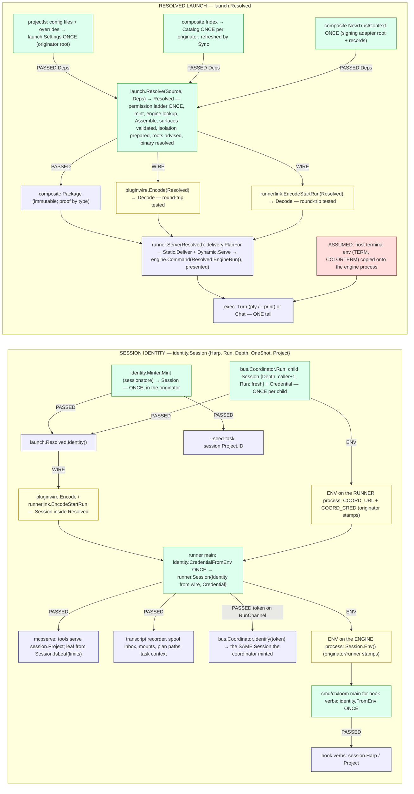

# 20 — TARGET ARCHITECTURE: ctxloom as a hexagon

Architect's design document. Inputs: `11-dataflow-review.md` (primary), `10-synthesis.md`, seam documents `01`–`07`, `00-coordinator-notes.md`, the repository's `GLOSSARY.md` and `docs/architecture/**`, and the tree at `release/0.7` (read-only; boundaries verified with `git grep` and by reading the cited declarations). Citations are by symbol (`package.Symbol`) and file, never by line.

STATUS: COMPLETE (tally at the end of the document).

Rulings this design is built inside (verbatim in the brief; restated here only by name so a reader can check the fit): engines as polymorphic plugin packages; one composite package assembled from repos, project and companions; polymorphic delivery, static (file-based) and dynamic (MCP); DRY; hexagonal core with ports and adapters, dependency direction inward only; the MCP stdio callback deleted in favour of the runner's authenticated loopback socket, so exactly ONE owner process per harp; session home as the default root for everything a session writes, the unsafe approach the only project-root path for a session; an explicit human-invoked `materialize` as the ONE sanctioned writer into the project root, sharing the package value and the static writers with session delivery.

Vocabulary is `GLOSSARY.md`'s: the **orchestrating agent** (orchestrator) is the LLM role that uses the coordination tools; the **runtime coordinator** is the process/library; the **originator** is the process a human launches, which hosts the runtime coordinator and is the only process that execs a container runtime; **executor** and **subagent** as defined there. "Coordinating agent" is retired and does not appear below.

---

## Part 1 — The target, as boundaries and signatures

### 1.1 Package map

Three rings. **Core** is the hexagon's centre: seven packages under `internal/core/` that import nothing outside `internal/core/` (plus the standard library and `golang.org/x`). Every port is an interface declared inside the core package that needs it, so a port is always found beside its only consumer. **Operations** (`internal/operations`, the name survives) is the use-case ring: it composes core values over ports and returns typed results; it imports core and nothing else. **Adapters** are everything outside: engine packages, the two delivery mechanisms, the CLI, the MCP server, the gRPC runner link, the go-plugin wire, the filesystem stores, git remotes, companions, signing, isolation. Adapters import inward (core, operations) and never each other; the two composition roots (`internal/cli` for the originator, `internal/runner` for the runner process) are the only packages that import adapters, and nothing imports them.

```mermaid
flowchart TB
  classDef core fill:#dfe,stroke:#282,stroke-width:2px
  classDef app fill:#eef,stroke:#228
  classDef engine fill:#fef,stroke:#828
  classDef adapter fill:#ffd,stroke:#a80
  classDef root fill:#eee,stroke:#444,stroke-width:2px
  classDef gate fill:#fff,stroke:#a22,stroke-dasharray:4 4

  subgraph CORE["CORE — internal/core/* · imports only internal/core/* + stdlib"]
    CMP["composite<br/>Package · Catalog · Assemble · TrustContext<br/>ports: Source · Verifier · Records · TrustRoot"]:::core
    ENG["engine<br/>Engine port · Description · Declaration · Approach · present<br/>ports: Engine · Launcher"]:::core
    LNC["launch<br/>Resolved · Resolve · Permission · Form · Cell · Axes · Settings<br/>ports: Workspace · Runtime"]:::core
    IDN["identity<br/>Session · Project · Harp · Credential · Env codec<br/>ports: Minter"]:::core
    BUS["bus<br/>Verbs · Coordinator · Inbox · Mail · RunRecord<br/>ports: Spool · Journal · Spawner · RunnerLink"]:::core
    SDR["sessiondir<br/>Member table · Layout · Record · ReapPolicy · EssenceState<br/>ports: Store · Tree"]:::core
    DLV["delivery<br/>Plan · Route · Target · Ownership · Delivered<br/>ports: Static · Dynamic"]:::core
  end

  subgraph APP["OPERATIONS — internal/operations · imports core only"]
    OPS["operations<br/>Launch · Materialize · Review · Sync · Doctor · Sessions · Hooks · Init<br/>(typed results; no rendering)"]:::app
  end

  subgraph ENGINES["ENGINE ADAPTERS — internal/engines/*"]
    ECL["engines/claude"]:::engine
    EMK["engines/mock (conformance double)"]:::engine
    ECX["engines/codex · engines/opencode (polymorphism proof)"]:::engine
    EALL["engines (explicit list: All())"]:::engine
  end

  subgraph ADAPTERS["ADAPTERS — internal/adapters/*"]
    SF["staticfiles<br/>delivery.Static: writers under a Target root + ONE ownership record"]:::adapter
    MS["mcpserve<br/>delivery.Dynamic + tool surface: MCP over authenticated loopback TCP, INSIDE the runner"]:::adapter
    RL["runnerlink<br/>agentcoord gRPC: RunnerChannel/RunChannel/Consumer · codec proto↔bus,launch"]:::adapter
    PW["pluginwire<br/>go-plugin llm.proto: Run/Chat streams · codec RunStart↔launch.Resolved · vpio"]:::adapter
    ISO["isolation<br/>launch.Workspace (worktree) · launch.Runtime (host, container-rootless, container-rootful)"]:::adapter
    GR["gitremote<br/>composite.Source (remote repos) · lockfile · retraction · publish"]:::adapter
    PF["projectfs<br/>composite.Source (project, builtin) · launch.Settings from config files · profiles"]:::adapter
    CO["companions<br/>composite.Source (companion loadouts)"]:::adapter
    SG["signing<br/>composite.Verifier · TrustRoot · Records (ssh sigs, allowed_signers, countersign store, attest files)"]:::adapter
    SS["sessionstore<br/>sessiondir.Store/Tree · bus.Spool/Journal · transcripts · essence · locks"]:::adapter
  end

  subgraph ROOTS["COMPOSITION ROOTS — import anything; imported by nothing"]
    CLI["cli — CLI adapter + ORIGINATOR (hosts bus.Coordinator once per harp)"]:::root
    RUN["runner — the runner process (engine host + mcpserve + runnerlink client)"]:::root
    CMD["cmd/* (ctxloom, taskloom, ltk, harp)"]:::root
  end

  LEAF["shared/* leaf libraries (no domain knowledge): procsec · pidalive · lockwait · iox · textutil · yamlx · …"]:::gate
  ARCH["archlint + tests/arch — ONE rule source; the ring rules below"]:::gate

  %% inward edges only
  OPS --> CMP & ENG & LNC & IDN & BUS & SDR & DLV
  ECL & EMK & ECX --> ENG
  EALL --> ECL & EMK & ECX
  SF --> DLV & ENG
  MS --> DLV & CMP & BUS & IDN & OPS
  RL --> BUS & LNC & IDN
  PW --> LNC & ENG & IDN
  ISO --> LNC & SDR & IDN
  GR --> CMP
  PF --> CMP & LNC
  CO --> CMP
  SG --> CMP
  SS --> SDR & BUS & IDN
  CLI --> OPS & EALL & SF & RL & PW & ISO & GR & PF & CO & SG & SS
  RUN --> OPS & EALL & SF & MS & RL & PW & SS
  CMD --> CLI & RUN
  %% core internal edges (the only ones allowed inside the ring)
  LNC --> IDN & ENG & CMP
  DLV --> ENG & CMP & LNC
  BUS --> IDN & LNC
  SDR --> IDN
```



**Dependency rules the map states** (enforced in `internal/archlint` as `layeringRules` rows, mirrored by `tests/arch/layering_test.go`, with the existing `IsLive` staleness check so an allowlist entry that stops importing anything forbidden fails):

| # | Rule (as an archlint row) | What it makes unrepresentable |
|---|---|---|
| R1 | `from: internal/core` → `only: [internal/core]` (a new allowlist form beside `forbid`; third-party limited to stdlib and `golang.org/x`) | a core package reaching a file, a proto, a socket, an engine |
| R2 | `from: internal/operations` → `only: [internal/core, internal/shared/<leaf list>]` | a use case importing an adapter (today: `operations → lm/isolation`, `→ lm/grpc`, `→ remote`, `→ signing`, `→ sessions`, `→ memory`) |
| R3 | `from: internal/adapters/<x>` → `forbid: [internal/adapters, internal/engines, internal/cli, internal/runner]` with `allowed: {internal/adapters/<x>}` | one adapter compiled into another (today: `coord → transcript`, `coord → isolation`, `mcp → memory/sessions/backends/isolation`, `isolation → lm/grpc`) |
| R4 | `from: internal/engines` → `only: [internal/core, internal/shared/<leaf list>]` | an engine reaching config, bundles, operations or another engine (today: `claude → paths`, `claude → confpatch`, the `ltk/engine` and `taskloom/engine` back-edges) |
| R5 | `from: internal, forbid: [internal/cli, internal/runner]` with an empty allowlist | anything importing a composition root |
| R6 | `from: cmd/ltk, cmd/taskloom, cmd/harp` → `forbid: [internal/engines, internal/adapters/isolation, internal/adapters/runnerlink, internal/adapters/pluginwire, internal/core/bus]` | a lean binary linking the engine plugin (today both link `internal/claude`) |
| R7 | symbol rule: `bus.New` and `identity.Mint` referenced from production code only in `internal/cli` | a second owner process per harp (the `tacky-padding` ruling made structural) |
| R8 | symbol rule: `os.Getenv`, `os.LookupEnv`, `os.Environ` referenced only in `cmd/*/main.go`, `internal/cli/root.go`, `internal/runner/main.go`, and `identity.FromEnv` | identity or a root re-read from ambient env inside a process (M2, M3, M8, M9, M12, M15, M21) |
| R9 | symbol rule: the generated `pb` packages imported only by their own adapter (`pluginwire` for `llm.proto`, `runnerlink` for `coordination.proto`) | a proto used as a domain type (T8) |

**The packages, one row each.** "Absorbs" names today's packages or files whose responsibility lands here; "splits" names a package whose halves go to two rows; "deletes" names what has no home in the target.

| Package | Responsibility (one line) | Must never know | Absorbs / splits / deletes |
|---|---|---|---|
| `core/composite` | Assemble ONE immutable `Package` from every source (remote repos, project, companions, builtin): verify bytes, decide trust, compose profiles, resolve link groups, dedup; also the unverified `Catalog` for listing and review | files, git, ssh keys, config files, engines, MCP | absorbs `internal/bundles` (loader, pipeline, authorizer, `Decide`, links, catalog, skills), `internal/trust`, `internal/shared/wire` (item payload types), `internal/profiles` (composition rules), `config.ResolveBundleMCPServers`/`LinkGrant`/`extractMCPFromBundle`/`extractHooksFromBundle`/`companion_admission`, `operations.EffectiveTrust`/`trust_gate`/`TrustStamper`/`Signable`, `signing` preimage contracts and `*Preimage` functions, `content/attest` verdict types; **deletes** `bundles.AdmitAll`, `config.execGate`/`SetExecutableTrustGate`/`ExecutableTrustGate`, `operations.NewExecutableTrustGate`, `backends.gateProfileHooks`/`hookExecPayload`, `remote.BundleReader`/`CachingBundleReader`/`LoadAllBytes` |
| `core/engine` | The engine PORT: what an engine declares (`Description`), the surface vocabulary (`SurfaceKind`, `Declaration`, `Approach`, `present.*`), and how a resolved launch becomes a command | which engines exist, config, bundles, the filesystem (an `afero.Fs` is handed to `Deliver` by the static adapter), protos | absorbs the SEAM half of `internal/shared/agent` (`backend.go` contracts, `declaration.go`, `presentations.go`, `cells.go`'s kinds, `present/`, `enginefacts.go`, `provisioning.go`, `distribution.go`, `runtime_axis.go`, `chat.go`, `enginecli.go`, `launchform.go`), `internal/lm/engine` (`Descriptor` → `Description`); **splits** `shared/agent` (toolbox half → `adapters/staticfiles`, leaf libs); **deletes** `agent.SurfaceInputs` (11-field God struct → per-kind inputs), `agent.SettingsWriter`/`ContextWriter`/`InstanceConfigWriter` (older parallel contracts), `agent.MCPFileConfig`, `LaunchBackend.SetEngineHomeVar`, `ErrSharedScratchNoHarp`, `agent.ContextProvider.Clear` |
| `core/launch` | The ONE typed launch value (`Resolved`) and its ONE constructor; the permission ladder, form, cell, the two isolation axes, the typed project `Settings` a launch reads | protos, cobra, docker, the filesystem, `*config.Config` | absorbs `cli.runState` phases R6–R19 (`resolveLaunchSource`, `openSession`, `buildRunRequest`, `prepareWorkspace`, `stampWorkspaceOnRequest`), `cli.resolvePermissionMode`/`requestedPermission`/`resolveRunLLM`/`validateExplicitLLM`, `operations.ResolveAgent` (resolution half), `ResolveBackend`, `resolveOneshotLabel`/`resolveOneshotPermissions`, `PrepareAgentChat`/`AgentChatRequest`/`bindIsolatedSpawn`, `BindAgentHome`/`InTreeAgentHome`/`AgentHomeResolution`, `coord.SpawnPlan`/`OwnerRunSpec`/`HarnessSpecInput`, `agent.PermissionMode`/`LaunchForm`/`CellKind`, `isolation.Axes`/`WorkspaceAxis`; **deletes** `operations/oneshot.go` entire, `operations/delegate.go` (both halves), `cli/init_launch.go`'s `launchEngineWithPrompt`+`discoveryRunRequest`, `cli.ownedRunLaunch`, `memory.defaultLLMPlugin`, five of six `SafeHeadless()` floors, the six `pb.RunStart{}` literals |
| `core/identity` | Session identity (`Session{Harp, Run, Depth, OneShot, Project}`) and project identity as VALUES minted once and passed; the credential pair; the ONE env encoder and the ONE env decoder for the process boundary | `os.Getenv`, cwd, files, the wire | absorbs `coord.Identity`, `coord/creds.go` (mint/verify), `coord.HomeConfig`'s identity fields, `cli.coordinatorReachBack`, `agent.SessionHarpEnv`, `coord.Env*` constants, `isolation/none.go`'s `envCellWorkDir` copy, `internal/shared/harp`, the identity fields of `sessions.Entry`; **deletes** `mcp.selfIdentityFromEnv` (with its `harp.GenerateName()` fallback), `cli.runnerIsLeaf` and the `leaf bool` chain, the 17 literal spellings of the harp variable, `cli.startContainerOwnedRun`'s `Identity{Harp: spec.Harp}` fabrication |
| `core/bus` | The coordination verbs as ONE layer (`Verbs`), implemented by ONE `Coordinator`: run registry fold, slots, credential issue, mail routing, terminal synthesis, roster; ONE parked long-poll `Inbox`; the `Mail` model | gRPC, MCP, HTTP, `$HOME`, docker, the engine | absorbs `internal/agentcoord/coord` (children, coordinator, folds, journal semantics, launchgate, liveness, mailkind, control, pendingapproval, reports, artifacts model, terminalinject, tracked), `spool.Message` (model), `mcpschema` route/binding table (tool ↔ verb); **splits** `coord` (transport files → `adapters/runnerlink`; `home.go`/`enginehost*.go` → `runner`; state-dir/journal/artifact files → `adapters/sessionstore`); **deletes** `coord/ownerrecv.go`+`spoolowner.go`+`Home.Recv`'s twin (→ one `Inbox`), `coord/owner_run.go` (`StartOwnedRun`, `OwnerRunSpec`, `OwnedRunStarter`, `SendOwnedRunTurn`), `coord/publish.go` `PublishEvents`, `CapPeerMessaging`, `driveQueued`/`nextRelaunch` (→ one `armResume`), `livenessWatchdog`'s narrating twin, `serveSpawnAgent`/`serveStopRun` re-validation, `Home.sendPeerViaSpool`'s guard copy, `queueMailPayload`'s always-false `completed`, `mcp/mcp_tools_agents.go` (PATH A), `mcp/coord_host.go`, `agentcoord/discover` |
| `core/sessiondir` | The harp-keyed tree as POLICY: the `Member` table (name, tier, lifetime, location), `Layout`, the session `Record`, the single `EssenceState` predicate, the single `ReapPolicy` | `$HOME`, `os`, the engine, the wire | absorbs `paths`' harp/session functions (`HarpDir`, `HarpPersistDir`, `HarpEphemeralDir`, `SessionHomePath`, the `*FileName` constants), `sessions.Entry`'s domain half, `operations.HarpTopLevelArtifacts`/`classifyPurgeFile`/`ReclaimScope.members`/`isHarpDirCandidate`/`isSessionInstanceCandidate`, `sessions.IsSessionDir`/`TranscriptStale`/`SourceStale`, `memory.distilledMeta.EntryCount`'s rule, `isolation.sessionStateMounts`' member selection, `plans`' walk predicate; **deletes** `operations/session_home_reap.go` (`ReapOrphanedSessionHomes`), `MigrateHarpArtifacts`, `sessions.MigrateIndex`+`index_upgrade.go`, `paths.LegacyCanonicalTranscriptFileName`, `operations.ResolveAndHeal`'s `Liveness` parameter, the four "is this a harp?" resolvers |
| `core/delivery` | Polymorphic delivery as a PLAN: which items of a `Package` go STATIC (files under a `Target` root with an ownership record) and which go DYNAMIC (MCP resources/tools), decided by the engine's `Declaration`; the two ports; `Delivered` handles | how a file is written, the MCP protocol, which engine | absorbs `shared/agent/cells.go` (`Delivery`, `IsolatedCell`, `Select`/`SurfaceSelection`/`ResolvedSelection`/`DeliverUnder`), `launch_backend.go`'s `Setup`/`Cleanup`, `delivery_state.go`, `managedcontext.go`/`managed_commands.go`/`managed_skill_packages.go` (delivery shapes), `lm/backends/managed.go`/`managed_hooks.go`/`commands.go`/`skillfiles.go`/`surfaces.go` (loadout assembly → `Plan` from `Package`), `confpatch`'s record MODEL and `shared/ledger` (→ one `Ownership`), `operations/profile_materialize.go` (→ `Deliver` with `Target.Root = ProjectRoot`); **deletes** `SurfaceSelection.reroot`/`preferOutOfCwd`/`ensureRootable` (substitution), `ResolvedSelection.DeliverShared`, `agent.OutOfCwd`, `PresentsUnderProjectRoot`'s sentinel-root probe, `claude.settingsRecord.desired`'s MemMapFs round-trip, `agent.WriteContextFile`/`ReadContextFile`/`context_hooks.go` (the hook-carried context route), `grpc.turnPromptContent`, `backends.loadConfigFn`, `operations.regenerateContext` |
| `operations` | Use cases over core and ports, returning TYPED results: `Launch`, `Materialize`, `Review`, `Sync`, `Doctor`, `Sessions` (compact, distill, reclaim, purge), `Hooks`, `Init`, `Deps` | cobra, protos, docker, the MCP SDK, `afero` directly (uses ports), rendering | absorbs `internal/operations` minus what the rows above take, `internal/memory`'s orchestration (`Compactor` → `operations.Compact` using the `Launch` use case for the distill call), the cli-resident orchestrators (`doctor` ×35 checks, `deps check`/`reconcile`, `review` walk, `util config-write`, gitignore reconcile, `classifyHarpWorktrees`, `offerItemTrust`/`offerBundleTrust`, the six `ResolveLocalSigner` copies → one); **deletes** `operations.RunOneshot`, `resolveListConfig`'s optional-config arm, `SetLLM`'s reload, `WatchSessionFeed`'s config load, the six `Sweep*/Report*` prose renderers (→ typed reports), `memory.CompactionConfig`'s four test-only fields and its three production constructors |
| `engines/claude` | The claude-code plugin: implements `engine.Engine`; declares its surfaces as `Approach` constructors (system-prompt, mcp-config, hew-record, settings, commands, skills); drives the process (pty turn and structured chat); reads its own transcripts | ctxloom config, bundles, operations, other engines, `paths` | absorbs `internal/claude`, `internal/claude/engine`, `transcript/vendorreader/claude`, `lm/backends/enginecli.go`/`launcher.go`/`panelaunch.go` (process launching → `engine.Launcher` impl in `shared/ptyrunner`); **deletes** `claude.SessionConfigDir`, `claude.mcpEntries` (→ `composite.MCPServerJSON`), `claude.writeChatMCPConfig`'s `os.MkdirTemp`, `recordStore`/`GlobalCommandsDir`'s home-path computation (roots arrive advised) |
| `engines/mock` | The conformance double: every `Engine` method with observable, deterministic effects; the fixture every port test and acceptance journey drives | anything real | absorbs `lm/backends/mock*.go`, `internal/mockengine`, `transcript/vendorreader/mock` |
| `engines/codex`, `engines/opencode` | The polymorphism proof: two more `Engine` implementations built ONLY from each engine's native surfaces (codex `CODEX_HOME` + `config.toml`; opencode `.opencode/`), failing loud where a surface has no native form | ctxloom internals | new packages (both engines were removed from the tree; the target reinstates them as the proof that the port is not claude-shaped) |
| `engines` | The explicit registration list `All() []engine.Engine`, imported by composition roots only | — | absorbs `lm/engines`, `lm/backends/registry.go`/`config_registry.go`/`declared_facts.go`/`simple_capabilities.go` |
| `adapters/staticfiles` | `delivery.Static`: drive each planned item's `Approach.Deliver` under the Target's advised roots with an `afero.Fs`; keep the ONE ownership record; reconcile-to-declared (install = uninstall = the same call with an empty plan) | which engine, trust, MCP | absorbs `internal/confpatch` (apply/heal), `shared/ledger`, `shared/agent`'s writers (`rmw_lock.go`, `settings_io.go`, `packagefiles.go`, `symlink.go`, `marshal.go`, `commandfiles.go`), `shared/iox`, `lm/backends/uninstall.go`; **deletes** the three ownership mechanisms → one, `agent.WithFileLock→cleanupLegacySidecar`, `claude.WriteCommandFiles`' legacy `RemoveAll`, `confpatch.Store.renameLegacyRecords`, `agent.SettingsWriter.RemoveSettings` as a separate route |
| `adapters/mcpserve` | `delivery.Dynamic` and the LLM-facing tool surface: a Streamable-HTTP MCP server on authenticated loopback TCP, hosted INSIDE the runner process; resources (fragments, premise catalog, link-mates, sessions, mcp-servers), tools (context, search, memory, triggers, status, `agent_*` over `bus.Verbs`), startup findings | the coordinator's constructor, `os.Getwd`, the project config files | absorbs `internal/mcp` (`mcp_resources.go`, `mcp_tools_context.go`, `mcp_tools_contextstatus.go`, `mcp_tools_memory.go`, `mcp_tools_triggers.go`, `dto_context.go`, `schematargets.go`, the server half of `mcp_runner.go`), `agentcoord/mcpschema` (generated schemas + goldens), `shared/mcpsocket`, `agent/mcptools.go`; **deletes** `mcp/mcp_server.go` (`ServeStdio`), `mcp_forward.go`, `mcp_discovery.go`, `mcp_tools_agents.go`, `coord_host.go`, `mcp_docgen.go` (docs generate from `mcpschema` without a live server), the seven relayed handlers' `os.Getwd()` (identity arrives typed), `mcp.relayTyped`/`relayHost` six-encode chain (→ one `bytes` value) |
| `adapters/runnerlink` | The agentcoord gRPC link: `CoordinatorService` and `ConsumerService` servers on the originator side, the dial-home client on the runner side; codecs proto ↔ `bus`/`launch`/`identity` (StartRun carries a TYPED launch, not a `Struct`) | the engine, files, MCP | absorbs `internal/agentcoord` (protos, generated code, `google/rpc`), `coord/grpcserver.go`, `runchannel.go`, `runnerlink.go`, `httpserver.go`, `consumer.go`, `controlwire.go`, `capabilities.go`, `harnessspec.go` (→ codec), the transport half of `home.go`; **deletes** `HarnessSpec.config` as an opaque `Struct`, `StartRun.task_id`/`budget`, `RunnerHello.version` (or it is READ), `AgentRequest.{approval,user_input,peer_send}` unserved arms, `coordService.RunChannel`/`RunnerChannel`'s duplicate stream scaffold (→ one), `c.streams`+`waitBounded` |
| `adapters/pluginwire` | The go-plugin `llm.proto` wire for the interactive turn and structured chat: server (runner) and client (originator); ONE codec `Resolved` ↔ `RunStart`; the vpio contract | bundles, config, the coordinator | absorbs `internal/lm/grpc`, `internal/vpio`, `vpio/goplugin`; **deletes** `RunOptions.temperature`/`max_tokens`/`verbosity` (reserved), `grpc.turnExecuteRequest`'s permission floor, `grpc.turnPromptContent`, `lm/grpc/host_runner.go`'s second `config.Load`, `cli.writeRunStartHandoff`/`readRunStartHandoff` (the RunStart rides the transport) |
| `adapters/isolation` | `launch.Workspace` (worktree materialization, dirty-tree handling) and `launch.Runtime` (host, container-rootless, container-rootful: image build, mounts from the `sessiondir.Member` table, credential provisioning, attach, reap) | bundles, config files, the coordinator's internals, `lm/grpc` | absorbs `internal/lm/isolation`, `shared/containerprobe`, `shared/mountns`, `internal/git`; KEEPS `Container.SpawnClient` (the go-plugin handshake over a socket mounted into the container) as the container interactive arm — `ctxloom runner` becomes the container's main process; **deletes** the `llm host` keepalive + `docker exec … llm turn` + `persist/runstart.json` arm (`isolation/attach.go`'s `AwaitContainerRunning` poll, `direct_runner.go`, `vpio/dockerexec`), `isolation.FactoryForWorkspace`'s oneshot binding, the `envCellWorkDir` literal, `isolation.SessionStateFromEnv` (state arrives typed), `Prepare`'s silent degrade to `None` (→ error) |
| `adapters/gitremote` | `composite.Source` for remote repositories: fetch at a locked SHA, lockfile, retraction check, publish/push | trust DECISIONS, engines, config | absorbs `internal/remote`, `content/remotetree`, `content/archive`, `content/convert`, `internal/refuri`; **deletes** `Puller.updateLockfile`'s `tree bool`, `PullResult.Content`, `remote.BundleReader` chain, `fetchItemBytes`' fetch-the-document-then-refuse, `clidiag.Warn` calls from the library (→ typed findings) |
| `adapters/projectfs` | `composite.Source` for the project's and the home's own bundles and builtin bundles; parsing `config.yaml` into `launch.Settings` + `composite.Selection`; profiles files; save/migrate/upgrade of config files | engines, the coordinator, trust decisions (it reports facts, decides nothing) | absorbs `internal/config` (load/save/migrate/upgrade/layers/warnings), `internal/profiles` (file half), `config/layerscope`, `shared/confload`, `internal/gitignore`, `internal/projectroot`, `paths` (non-harp), `internal/schema`/`schemagen`; **deletes** `config.InstallOverridesFromFlags`' process-global funnel (overrides become a `LoadOption` value the root threads), `config.SetCompanionsDisabled` global, `Config.fs`/`bundleLoader`/`companionProbe` fields (they are adapter state, not config) |
| `adapters/companions` | `composite.Source` for companion loadouts (execs the companion binary to read what it advertises) | trust decisions | absorbs `shared/companionloadout`, `config/companions.go`/`companion_identity.go`, `isolation/companionkey.go` |
| `adapters/signing` | `composite.Verifier`, `TrustRoot`, `Records`: ssh signature verify/sign, `allowed_signers` (embedded + home + project − distrusted), the countersign store, attest manifests on disk, signing-key discovery | bundle content semantics, engines | absorbs `internal/signing/*` (minus the pure preimage functions), `content/attest` (file half), `config/trustroot.go`, `operations/countersign_records.go`/`homeapprovals.go`/`signer.go`/`sign.go`/`upgrade_verify.go`; **deletes** the second tree verifier (`repoFSReader.verifyTree` vs `bundles.verifyRemoteTree` → one), `readSignatureFacts`' fingerprint-parses-therefore-trusted inference, `VerifyCountersignature`'s re-spelt verification order |
| `adapters/sessionstore` | `sessiondir.Store`/`Tree`, `bus.Spool`/`Journal`: the harp tree on disk under ctxloom home — sidecars, spool files, journals, transcript recorder and canonical history, essence and next-step files, locks | the engine, config, the wire | absorbs `internal/sessions`, `agentcoord/spool` (files), `internal/transcript`, `memory/nextstep.go`/`plans.go`/`stamp.go`/`selection.go`, `shared/plans`, `shared/sessionlock`, `shared/harpmarker`, `internal/turnchange`, `coord/statedir.go`/`journal.go`/`artifactstore.go`/`checkpoint.go`, `internal/contextmetrics`; **deletes** `spool.NewHomeMapper()` ×10 (root is a constructor argument), `sessions.CountTranscriptEntries` (→ `transcript.ParseTranscriptFile`), `operations.HarpTranscripts`' symlink-lineage, `sessions.fillTranscriptByLocation`'s silent replace (→ `Record.Located`) |
| `cli` | The CLI adapter (cobra tree, flags → typed requests, typed results → `cliemit`) and the ORIGINATOR composition root: `ctxloom run` mints identity once, constructs `bus.Coordinator` once, resolves the launch once, starts the runner | business logic; `os.Getenv` outside `root.go` | absorbs `internal/cli` (thin verbs), `shared/cliemit`, `shared/clidiag`, `cli/tui`, `internal/termui`, `shared/strictness` (as a VALUE threaded from `root.go`); **deletes** `cli/llm_*.go` (→ `runner`), `cli/mcp_server.go`, `cli/run_owned.go`, `cli/init_launch.go`, `cli/run.go`'s R6–R19, seven of the eight `hook_*.go` scaffolds (→ one `hookInvocation`), `cli/taskstore_identity.go` (→ `projectroot.TaskStoreRoot`), `cli/format.go`'s second `--format` parser, the 22 direct `config.Load` calls |
| `runner` | The runner process composition root (`ctxloom runner`, replacing `llm serve\|host\|turn`): decode identity from env ONCE at `main`, receive `launch.Resolved` over the wire, host the engine (pluginwire server for the interactive turn; chat host for children), host `mcpserve`, dial home over `runnerlink` | config files (never loads one), `--config-set` | absorbs `cli/llm_runner_common.go`, `llm_serve.go`, `llm_host.go`, `llm_turn.go`, `coord/enginehost.go`/`enginehost_control.go`, the runner half of `coord/home.go`, `lm/grpc/host_runner.go`; **deletes** `cli.standUpRunner`'s `config.Load`, `cli.serveBackendConfig`/`loadAndConfigureBackend`, `consumeCoordinatorReachBack`'s double read and `Unsetenv`, `cli.exportRunnerMCPSocket`/`coord.injectMCPSocketEnv`, the E3 keepalive's second runner |
| `shared/*` leaf libraries | Utilities with no domain knowledge, importable from any ring | ctxloom types | kept: `procsec`, `pidalive`, `lockwait`, `textutil`, `tokens`, `yamlx`, `collections`, `keymatch`, `realpath`, `termsafe`, `watch`, `envswitch`, `logsink`, `stderrtail`, `ptyrunner`, `shellenv`, `gitutil`, `schemaver`, `upgrade`, `cliversion`, `doccapture`, `admission`; `shared/tasks/*` (taskloom) unchanged |
| `archlint` + `tests/arch` | ONE rule source (`internal/archlint`), `tests/arch` a thin driver; rules R1–R9 above plus the existing gates re-aimed (B5) | — | absorbs the duplicate rule tables (`unskilled-state`); **deletes** `tests/arch` rule copies |

**Why this and not the ML-A..H layers as packages.** The synthesis proposed eight missing layers; the target confirms all eight and places them: ML-A `Launch` → `core/launch`; ML-B `Verbs` and ML-C `spoolInbox` → `core/bus`; ML-D `TrustContext` and ML-E one assembler → `core/composite` (assembly IS the composite package; the "loadout builder" becomes `delivery.PlanFor(pkg, decl, resolved)`); ML-F `Identity` → `core/identity`; ML-G `HarpMember` → `core/sessiondir`; ML-H the orchestration home → `operations`. Two are merged rather than kept separate (B and C, D and E) because each pair shares one owner type and splitting them would create a package with one exported function. Nothing from the synthesis's "declined" list is revived.

**Vocabulary kept and retired.** Kept from `GLOSSARY.md`: control-plane (now "originator side"), wire, runner, engine, provider/model, loadout (renamed in code to `delivery.Plan`; the word survives in prose), surface, channel, presentation, advice, root, project root, session home, ctxloom home, config modification record (→ the one `delivery.Ownership` record), command, skill, context, agent, engine agent, session, profile, runtime coordinator, orchestrating agent, originator, executor, subagent. Retired: **scratch** (already ruled legacy; `present.Paths.Scratch`, `UnderScratch` and `settingsSurface.DeliverIsolated` go — isolated settings deliver into the session home like every other config), **relocated engine home** (already merged into session home), **backend** as a synonym for engine in code (`Backend`, `backendName`, `Harness`, `llmName` → `Engine`; `label` stays as the config-entry name), **cell** as a delivery dispatch key (`CellKind` survives only as the isolation fact on `Resolved.Cell`; nothing selects a writer on it), **loadout** as a Go identifier (`ManagedConfig` → `delivery.Plan`), **coordinating agent**, **mailbox** (the retired bus; the spool is the substrate and `Inbox` is the parked poll), **shim**/**forward**/**discovery marker** (deleted with the callback).

### 1.2 Engines as plugins

One package per engine under `internal/engines/<name>`, each implementing the port below and importing only `internal/core/engine` and leaf libraries. Registration is an explicit list (`engines.All()`), imported by the two composition roots and by nothing else. `core/engine` sits at the bottom of the core ring: `launch` imports it (to validate a binding's `surfaces:` against the declaration and to project the engine-facing run), `delivery` imports it (to plan from the declaration), and it imports neither. The engine-facing vocabulary the rest of the core maps onto (`Permission`, `Mode`, `Form`, `Cell`, `SurfaceKind`, `RuntimeAxis`) is declared here for that reason: an engine has to name what it maps, and nothing lower exists to hold the names.

```go
// internal/core/engine/engine.go

// Engine is the port every engine package implements. The core PULLS facts
// through Describe, Surfaces and History; it HANDS the engine exactly one
// typed value, a Run, and receives one typed value back, a Command.
type Engine interface {
	// Describe is the engine's static declaration. Pure. Called before any
	// run, by --help, by init, by the registry's own conformance test.
	Describe() Description

	// Surfaces declares, per SurfaceKind, every approach this engine can
	// construct — each with its Route (static file or dynamic MCP), the Root
	// it lands under, and whether it persists after exit. A kind absent from
	// the map is one the engine has no native surface for; the planner fails
	// loud on a binding that asks for it, never substitutes.
	Surfaces() Declaration

	// Command is the exec projection: the process this engine runs for r,
	// given the presentations delivery produced (paths, argv, env the engine
	// is told). Pure with respect to the filesystem — everything it needs to
	// know about where bytes are is in presented.
	Command(r Run, presented []Presentation) (Command, error)

	// Turn drives one interactive or --print run of cmd to completion.
	Turn(ctx context.Context, cmd Command, io TurnIO) (TurnResult, error)

	// Chat drives a structured conversation over cmd: messages in, events
	// out; returns when the engine ends the session, ctx is cancelled, or on
	// a fatal error. An engine that cannot drive a structured chat returns
	// ErrUnsupportedMode from Describe().Modes — the runner refuses at
	// resolve, not here.
	Chat(ctx context.Context, cmd Command, in <-chan ChatMessage, out chan<- ChatEvent) error

	// History reads the engine's OWN transcripts and hook payloads (native
	// session id, transcript path, version-keyed readers). The session index
	// stays ctxloom's; the engine only materializes what it is asked for.
	History() History
}

// Description is what an engine DECLARES about itself, in one value. Every
// engine-specific fact the core consults is a field here and nowhere else.
type Description struct {
	Name         string
	Distribution Distribution // DistributionDefault | DistributionTestOnly
	Modes        []Mode       // which of ModeInteractive, ModeOneshot, ModeChat Turn/Chat support

	// Home is the engine's relocatable config home (claude: CLAUDE_CONFIG_DIR;
	// codex: CODEX_HOME), or nil for an engine with none. The RUN decides
	// where this launch's copy lives; the engine only names the variable and
	// what must be seeded into it.
	Home *Home
	// Provisioning names the credential-material deliveries the engine
	// accepts inside a container, in preference order. Never a stripped copy.
	Provisioning ProvisioningPolicy
	// Container is the engine's in-image recipe, or nil for an engine that
	// cannot run containerized.
	Container *ContainerRecipe
	// Version probes the installed CLI.
	Version VersionProbe
	// Resume is the engine's native resume capability: ResumeNone, or
	// ResumeBySessionID when it can continue a prior native session by key.
	// The bus reads THIS to decide a child's ResumeMode; no engine-name list
	// exists anywhere else.
	Resume ResumeCapability
	// DefaultPermission is the posture a launch on the HOST resolves to when
	// nothing named one, with the engine's reason (claude: bypass, because
	// its prompt UI cannot be brokered). The ladder in core/launch reads it;
	// it is not a string compare on the engine name.
	DefaultPermission Permission
	DefaultPermissionReason string
	// ReadOnlyPlan reports the engine's plan mode is read-only.
	ReadOnlyPlan bool
	// HookScope, when non-nil, names the condition under which the engine's
	// project settings collapse onto its user-global file (claude: workDir ==
	// $HOME), so the installer can refuse it.
	HookScope *HookGlobalScope
	// Exports maps package items to the engine's per-item enablement and
	// metadata (claude: LLM.ClaudeCode.*). Pure functions over the item; the
	// core never writes an engine's field on a shared object.
	Exports Exports
	// Unsupported names, per surface kind the engine does NOT declare, the
	// reason — so a binding asking for it is refused with the engine's words.
	Unsupported map[SurfaceKind]string
	// ModelResolve canonicalizes a model alias, or reports it unknown.
	ModelResolve func(model string) (string, bool)
	// Hooks decodes the engine's native hook payload (SessionStart, TurnEnd,
	// …) into the neutral HookEvent the hook verbs consume — the eight cli
	// hook files stop importing the engine.
	Hooks HookCodec
}

// Run is the ONE value the core hands an engine: the engine-facing projection
// of a resolved launch. It carries no ctxloom identity, no trust, no package;
// those were consumed upstream by delivery. launch.Resolved.EngineRun()
// constructs it and nothing else does.
type Run struct {
	Prompt     string
	WorkDir    string
	Model      string
	Permission Permission
	Mode       Mode
	Form       Form
	Cell       Cell
	Roots      Roots             // advised roots (project, session home, work dir), host and engine sides
	Env        map[string]string // engine PASSTHROUGH only (ANTHROPIC_*, TERM, …); never ctxloom's own vars
	Resume     ResumeRef         // zero when starting fresh
}

// Command is the exec projection an engine returns. The runner merges the
// process-boundary identity env (identity.Session.Env) on top and execs.
type Command struct {
	Binary      string
	Args        []string
	Env         map[string]string
	WorkDir     string
	Interactive bool
}

// Launcher is the port an engine uses to start a process. Implemented by
// shared/ptyrunner (host) and by the container runtime adapter.
type Launcher interface {
	Start(ctx context.Context, cmd Command, io TurnIO) (Process, error)
}
```

```go
// internal/core/engine/declaration.go

// Declaration is an engine's static delivery declaration: for each surface
// kind, the approaches it constructs. A kind absent from the map is one the
// engine has no native form for; selecting it is refused, never a no-op.
type Declaration map[SurfaceKind]Presentations

// Presents begins the declaration for one kind with its DEFAULT approach and
// that approach's traits. Or adds another. Both copy; a Presentations value
// is never mutated through an alias.
func Presents(engine string, kind SurfaceKind, defaultName string, c Construct, t Traits) Presentations
func (p Presentations) Or(name string, c Construct, t Traits) Presentations
func (p Presentations) Names() []string
func (p Presentations) Default() string
func (p Presentations) Traits(name string) (Traits, bool)
func (p Presentations) Construct(name string, in Inputs) (Approach, bool)

// Traits are DECLARED facts about an approach, read by the planner without
// constructing anything. They replace every probe that built an approach
// with fs=nil and sentinel roots to ask it a question.
type Traits struct {
	Route      Route    // RouteStatic (bytes at a path) | RouteDynamic (served over MCP)
	Root       RootKind // RootSessionHome | RootProjectRoot | RootWorkDir — where a static approach lands
	LaunchOnly bool     // announced on argv; has no at-rest form (materialize refuses it)
	Persists   bool     // survives the session's exit (project-root approaches are always true)
}

// Construct builds one Approach for ONE RUN from that run's content. Inputs is
// the per-kind input value (ContextInputs, MCPInputs, SettingsInputs,
// CommandsInputs, SkillsInputs); the constructor for a kind receives that
// kind's value and nothing else.
type Construct func(in Inputs) Approach

// Approach is ONE way one surface's bytes reach an engine.
type Approach interface {
	// Present composes where this approach's bytes land beneath the ADVISED
	// roots and how the engine is told (argv/env). Pure.
	Present(start present.Start) Presentation
	// Deliver writes beneath the advised roots through fs and returns the
	// handle that reverses it. Called ONLY by the static delivery adapter.
	Deliver(start present.Start, fs afero.Fs) (Delivered, error)
}
```

`present.*` (`Paths`, `Root`, `Start`, `Rooted`, `Presentation`, the advice vocabulary `OnHost`/`Containerize`) moves under `core/engine/present` unchanged in shape except that `Paths.Scratch` and `Start.UnderScratch` are deleted (scratch is retired) and `Presentation` loses `Env` and `EnginePath` (no production reader; the env announcement rides `Rooted.AnnounceEnv` into `Presentation.Args`/`Presentation.EnvVars` where the engine's `Command` reads it). `afero.Fs` is the one third-party type permitted inside the core ring, as a filesystem VALUE, and only on `Approach.Deliver`.

**What moves behind the interface.** Each is engine-specific knowledge that today lives in a package the engine does not own, named by the seam that found it:

| Today (in core-facing code) | Target (behind `Engine`) |
|---|---|
| `memory.defaultLLMPlugin = "claude-code"` (S1.F4, M19) | gone; a distill is a `launch.Resolved` against the `distiller` agent, whose engine is whatever the binding says |
| `cli.resolvePermissionMode`'s `backendType == "claude-code" → bypass` and `warnHostBypassStopgap` (S1.F7.1, B3 #1) | `Description.DefaultPermission` + `DefaultPermissionReason`, declared by claude |
| `backends.forceExport`/`forceExportSkill` writing `LoadedContent.LLM.ClaudeCode.Enabled` on the shared bundle (S3.F12, C8) | `Description.Exports` — pure per-item functions the planner calls; the package is immutable |
| `coord.resumeCapableBackends` / `oneShotSupportedBackends` (engine-name lists inside the coordinator, `spawner.go`) | `Description.Resume` |
| `agent.LaunchBackend.engineHomeVar` + `SetEngineHomeVar`, `setupViaCells` reading `req.Env[b.engineHomeVar]` (S3.F8, M9) | `Description.Home.Var`; the root arrives advised on `Run.Roots.SessionHome` |
| eight `cli/hook_*.go` decoding `claude.*` payloads (S6.F4) | `Description.Hooks` (`HookCodec`) — the hook verb asks the engine to decode |
| `isolation` overlay dirs, transcript-store root, credential files pushed by the registry (S3.F12, `engine_layout_arch_test`) | `Description.Container`, read by `adapters/isolation` from `engines.All()`; the push and its arch cross-check go |
| `claude.recordStore`/`GlobalCommandsDir` computing ctxloom-home and real-home paths inside the engine (S3.F12) | roots arrive advised; the engine computes no path it was not handed |
| `claude.mcpEntries` re-implementing `agent.MCPServerJSONEntry` (S2.F8) | `composite.MCPServerJSON` is the one projector; the engine's mcp-config approach calls it |
| `agent.SurfaceInputs.AgentName` "kiro's" (U18), `SelfContainedSkills` (U19), 122 comment lines about codex/kiro/opencode (S3.F15) | deleted; a reinstated `engines/codex` declares its own facts |
| `gitignore.WorktreeArtifactPatterns`' `.codex/*` literals (`engine_layout_arch_test`) | derived from `Description.Home.Subdir` over `engines.All()` |
| `transcript` schema's engine enum pinned to the registry by an arch test | generated from `engines.All()` |

**Conformance.** `engines/mock` implements every method with deterministic, observable effects (a settings approach that writes a JSON file, a chat that echoes, a history that returns what was recorded). `core/engine/conformance` exports one test suite, `conformance.Run(t, e Engine)`, that every engine package's tests invoke: declaration is non-empty and every default constructs; `Command` is pure (called twice, equal); `Turn` honours `Mode`; `Chat` closes `out`; `History` round-trips a recorded session. `mock` passing it is the first migration gate for the port; `claude` passing it is the second; `codex` and `opencode` passing it is the polymorphism proof. The suite replaces `lm/conformance` and the per-engine `*_conformance_test.go` scatter.

### 1.3 The composite package

One pipeline, one output type. Sources (remote repositories, the project, builtin, companions) produce reads; the reads are indexed into a `Catalog` (everything that exists, with signature FACTS, nothing decided); a `Catalog` plus a `Selection` plus a `TrustContext` assemble into a `Package` (everything that may be delivered, decided, composed, immutable). Listing, review and search read the `Catalog`; launch and materialize consume the `Package`. There is no third thing, and there is no way to obtain a `Package` without a `TrustContext`.

```go
// internal/core/composite/package.go

// Package is the ONE immutable value delivery consumes: every admitted item
// for a selection, the composed context, the link groups, and what was
// withheld and why. It has unexported fields and exactly one constructor
// (Catalog.Assemble), so holding a *Package IS the proof that trust was
// decided — there is no flag to forget and no config to attach a gate to.
type Package struct { /* unexported */ }

func (p *Package) Items(kind ItemKind) []Item          // admitted items of one kind, in composition order
func (p *Package) Item(ref Ref) (Item, bool)
func (p *Package) Context() Context                    // the composed model-facing context (framed fragments + premise index)
func (p *Package) Profiles() []string                  // the resolved profile set (parents expanded, later wins)
func (p *Package) Links() []LinkGroup
func (p *Package) Withheld() []Withheld                // every item the decision refused: Ref, Reason, Detail
func (p *Package) Proof() Proof                        // for audit/rendering: trust-root fingerprint, decided-at, counts
func (p *Package) MCPServers() map[string]MCPServer    // admitted mcp items, link-withholds applied, as one map
func (p *Package) Hooks() HooksConfig                  // admitted hook items merged in declared order
func (p *Package) DenyTools() []string

// Item is one admitted item. Bytes are the EXACT bytes decided on (never a
// hash — a hash is an index, and the Catalog keeps one for lookup, but the
// authority is the bytes against the signature). Provenance is typed; the
// signer is a Principal minted only by a Verifier, never a string a bundle
// file could forge.
type Item struct {
	Ref        Ref
	Kind       ItemKind      // fragment | command | skill | mcp | hook | profile
	Bytes      []byte
	Form       ContentForm   // raw | distilled
	Provenance Provenance    // {Class, Signer Principal, Ctx TrustCtx}
	Links      []LinkID      // the link tags on THIS item (valid-vanish)
	Decision   Verdict       // the admit reason (builtin / local / countersigned / trusted-signer …)
	Premise    string        // fragments only
	Exports    map[string]string
	payload    payload       // typed body: Fragment | Command | Skill | MCPServer | Hook | Profile
}
func (i Item) Fragment() (Fragment, bool)
func (i Item) Command() (Command, bool)
func (i Item) Skill() (Skill, bool)
func (i Item) MCP() (MCPServer, bool)
func (i Item) Hook() (Hook, bool)
func (i Item) Profile() (Profile, bool)

// Preimage is the ONE place a signature preimage is computed, per item kind.
// The signing adapter calls it to sign and countersign; Decide calls it to
// verify. Two computations of one preimage is the drift seam 5 closed, so
// there is one.
func Preimage(i Item) []byte
```

```go
// internal/core/composite/assemble.go

// Index reads every source and builds the Catalog: a complete, UNDECIDED
// picture with signature facts attached. It is what `bundle list`, `review`,
// `search` and `doctor` read. It cannot be delivered: no method on Catalog
// yields an engine-facing value.
func Index(ctx context.Context, sources []Source, verify Verifier, root TrustRoot, now time.Time) (*Catalog, error)

type Catalog struct { /* unexported */ }
func (c *Catalog) Entries() []Entry                 // Entry{Ref, Kind, Provenance, Signature SignatureFacts, Hash Hash, Bytes []byte, Layout}
func (c *Catalog) Bundle(ref BundleRef) (BundleEntry, bool)
func (c *Catalog) Locate(ref Ref) (Location, bool)  // which layout answered, and which others also had it

// Assemble decides and composes. trust is REQUIRED: a nil TrustContext is
// ErrNoTrustContext, not AdmitAll. The result is the only Package there is.
func (c *Catalog) Assemble(ctx context.Context, sel Selection, trust *TrustContext) (*Package, error)

// Selection is what a caller asks for: the profile set (composed with parent
// semantics), explicit fragments, tags, the consumer (engine context vs MCP
// resource — decides framing), and whether distilled forms are preferred.
type Selection struct {
	Profiles        []string
	Fragments       []Ref
	Tags            []string
	Consumer        Consumer
	PreferDistilled bool
}
```

```go
// internal/core/composite/trust.go

// TrustContext is the gate holder: the trust root, the review and
// retraction records, the verifier and the clock, resolved ONCE per process
// and PASSED. It replaces the mutable gate field on the config, the five
// sites that set it, the save/set/defer-restore in materialize, the
// AdmitAll-when-axes-are-zero branch, and the per-item re-read of the
// approvals directories. There is no ungoverned constructor: a caller that
// wants to see undecided content reads the Catalog.
type TrustContext struct { /* unexported: root, records, verifier, now, tally */ }

func NewTrustContext(root TrustRoot, verify Verifier, records Records, now func() time.Time) (*TrustContext, error)

// Decide is THE decision function — today's operations.EffectiveTrust and
// bundles.Decide as one ladder: rejected → retracted → first-party (local /
// builtin / companion, by provenance class the READER stamped) → trusted
// signer → countersigned → pending. Exec kinds (mcp, hook) and content kinds
// (fragment, command, skill) walk the same ladder; the kind selects which
// first-party arms apply, derived from Ref.Kind — never asserted by a caller.
func (t *TrustContext) Decide(exp Exposure) Verdict
func (t *TrustContext) Withheld() []Withheld

// Ports — implemented by adapters/signing (Verifier, TrustRoot, Records via
// the countersign store + lockfile retraction) and adapters/gitremote
// (retraction facts).
type Verifier interface {
	VerifyPublisher(payload, armoredSig []byte, namespace string, now time.Time) (Principal, error)
	VerifyCountersign(h CountersignHeader, payload, armoredSig []byte, now time.Time) (Principal, bool)
}
type TrustRoot interface {
	TrustedForNamespace(key ssh.PublicKey, namespace string, now time.Time) TrustDecision
	Fingerprint() string
}
type Records interface {
	Approved(ref Ref, payload []byte, form AttestationForm) (Principal, bool)
	Rejected(ref Ref, payload []byte) bool
	RefRejected(ref Ref) bool
	Retracted(ref Ref) (retracted bool, reason string)
}

// Source is the port every content source implements. A source constructs
// its Reads through NewRead, which REQUIRES the provenance class and the
// signature facts — a Read built from a literal claims nothing and Decide
// withholds it. Sources: adapters/gitremote (remote), adapters/projectfs
// (project, builtin), adapters/companions (companion).
type Source interface {
	Read(ctx context.Context) ([]Read, error)
}
func NewRead(b Bundle, prov ProvenanceClass, ref BundleRef, facts SignatureFacts, layout Layout) Read
```

**Where the trust gate is held.** In the `TrustContext` value, constructed once by the composition root from the signing adapter's root, verifier and records, and threaded as a parameter to `Catalog.Assemble`. Nothing else holds a gate: `config.Config` has no `execGate` field, `bundles.AdmitAll` does not exist, `operations.NewExecutableTrustGate` does not exist, `Pipeline.Authorizer()` does not exist. The data-flow review's "gate holder" finding (M16, M17, T11, F4, F10) is settled by there being one holder and one signature that requires it. The `TrustContext` is the same value on every path — host run, container run, `agent_run` child, materialize, hooks install, init probe — because every path obtains its `Package` through the one `Assemble`. A child's `Package` is assembled by the ORIGINATOR (the spawner's `Resolve`) from the originator's `TrustContext`, so "two configs feed one spawn" (M5) cannot recur: there is one `Catalog` per originator process, refreshed explicitly by `Sync`, never reloaded behind a call.

**How a package proves it was verified.** By being a `*composite.Package`: the type has unexported fields, one constructor, and that constructor's signature takes a non-nil `*TrustContext`. `Package.Proof()` returns `Proof{RootFingerprint, DecidedAt, Admitted, Withheld int}` for rendering and audit; it is derived, not a field a caller sets. `delivery.PlanFor` takes a `*Package`; a `*Catalog` has no route to delivery. The `Exposure` decided on carries the exact bytes; `Catalog.Entry.Hash` exists for lookup and for the lockfile index and is never consulted by `Decide` (content_hash is an index, never an authority — ruling honoured by construction).

**What composition does, in order.** (1) profile set: parents expanded, later wins, union for lists, from the `profile` items in the Catalog and the project's own profiles (projectfs source) — one loader, `profiles.Loader`'s semantics moved here; (2) fragment resolution by name, tag and premise, with `Consumer` deciding framing; (3) per-item `Decide` with the exact bytes; (4) link groups: for every admitted item with link tags, `LinkWithholds` against the admitted mcp set — an item whose link mate was withheld is withheld with `ReasonLinkedWithheld`; (5) dedup across sources by `Ref` (project wins over remote for the same name only when the profile named the project item; otherwise both exist under distinct refs and dedup is by identity, not by name); (6) freeze. Every step is a pure function of the Catalog, the Selection and the TrustContext; `Assemble` is deterministic and its output is cacheable per (catalog generation, selection).

**What is absorbed and what is deleted.** `bundles.Loader`/`Pipeline`/`Catalog`/`links`/`loader_*` become the internals of `Index` and `Assemble`; `bundles.Reader`/`BundleRead` become `Source`/`Read`; `trust.Ref`/`BundleRef`/`ItemKind` become `composite.Ref`/`BundleRef`/`ItemKind`; `wire.MCPServer`/`HooksConfig`/`Hook` become `composite.MCPServer`/`HooksConfig`/`Hook` (with `Hook.SCM string` replaced by `Hook.Provenance BundleRef` and `Managed()` derived — F16, T7); `operations.EffectiveTrust`/`contentGate`/`ExecutableTrustGate`/`TrustStamper` become `TrustContext.Decide`; `signing.*Preimage` and the contract constants become `composite.Preimage`; `config.ResolveBundleMCPServers`/`LinkGrant`/`extractMCPFromBundle`/`extractHooksFromBundle` become `Package.MCPServers()`/`Hooks()`; `operations.AssembleContext` becomes `Package.Context()`; `attest.Verdict`/`ItemVerdict` become `SignatureFacts`. Deleted outright: `bundles.AdmitAll`, `Gates`, `LinksUnchecked` (the ungated arms), `config.execGate` and its three methods, `Config.bundleLoader`/`companionProbe` (adapter state on a config value), `bundles.readSignatureFacts`' inference, `repoFSReader.verifyTree` (the second verifier), `remote.BundleReader`/`CachingBundleReader`/`LoadAllBytes`/`BundleByteSource`, `backends.gateProfileHooks`/`hookExecPayload`, `operations.regenerateContext`, `Bundle.StampSigner`/`Signer() string`.

### 1.4 Polymorphic delivery

Delivery is a PLAN computed by a pure function from three inputs — the `Package`, the engine's `Declaration`, and the binding's surface preferences — against a `Target` (which roots, whose ownership). The plan has a static half (bytes at paths under the target root, with one ownership record) and a dynamic half (resources and tools served over MCP). Two adapters execute the halves. Session launch and human `materialize` build their plans from the same package value with the same function and hand the static half to the same writer; they differ only in the `Target`.

```go
// internal/core/delivery/plan.go

// Route is DECLARED by the engine per approach (engine.Traits.Route). The
// planner reads it; nothing probes.
type Route int
const (
	RouteStatic  Route = iota + 1 // bytes at a path the engine reads natively
	RouteDynamic                  // served to the engine over MCP from inside the runner
)

// Target is where a plan lands and who owns what it writes. Exactly two
// constructors exist. A session target REQUIRES a session home root: there is
// no arm that roots a session's bytes in the shared engine home or the
// project root because the caller "forgot" — the value cannot be built.
type Target struct { /* unexported: roots engine.Roots, owner Ownership */ }
func SessionTarget(harp identity.Harp, roots engine.Roots) (Target, error)   // ErrNoSessionHome when roots.SessionHome is zero
func AtRestTarget(projectRoot string) Target                                   // materialize / hooks install: the ONE sanctioned project-root writer
func (t Target) Roots() engine.Roots
func (t Target) Owner() Ownership

// Ownership is the ONE ownership-record mechanism: who wrote (a session harp,
// or "at-rest" for a human's materialize) and, per shared file, which entries
// are ctxloom's — so reconciliation removes exactly what ctxloom declared last
// time and nothing a human authored. Directories ctxloom owns wholesale
// (commands/ctxloom, skills/ctxloom) record the directory. It replaces the
// CLAUDE.md markers, the ledger sidecar and the confpatch record with one
// record type; the static adapter persists it as ONE sidecar per target.
type Ownership struct {
	Owner   OwnerKind        // OwnerSession(harp) | OwnerAtRest
	Entries map[string][]string // target-relative path → entry keys ctxloom owns in it ("*" = whole file/dir)
}

// Plan is the resolved delivery for one engine against one target.
type Plan struct {
	Engine  string
	Target  Target
	Static  []StaticItem   // one per (SurfaceKind, approach) with the CONSTRUCTED approach
	Dynamic Dynamic        // the MCP-served set: fragments, premise catalog, link mates, findings, plus any kind routed dynamic
}
type StaticItem struct {
	Kind     engine.SurfaceKind
	Approach string
	Traits   engine.Traits
	Built    engine.Approach   // constructed from this plan's per-kind Inputs
}
type Dynamic struct {
	Fragments   []composite.Item
	Premises    []Premise         // the conditional-guidance catalog: name, premise, qualified ref
	LinkMates   []composite.LinkGroup
	Findings    []Finding         // startup findings the engine is told on first contact
	Commands    []composite.Item  // only when the engine routes commands dynamically
	Skills      []composite.Item  // only when the engine routes skills dynamically
}

// PlanFor is the ONE planner. It fails — never substitutes — when a requested
// or defaulted approach does not exist, when a session target selects a
// project-root approach the binding did not name explicitly, or when a
// LaunchOnly approach is asked to land at rest.
func PlanFor(pkg *composite.Package, eng engine.Description, decl engine.Declaration, prefs map[engine.SurfaceKind]string, target Target) (*Plan, error)

var (
	ErrNoApproach       = errors.New("delivery: engine declares no such approach for this surface")
	ErrUnsafeUnselected = errors.New("delivery: a session target reaches the project root only through an approach the binding names explicitly")
	ErrLaunchOnlyAtRest = errors.New("delivery: this approach announces on argv and has no at-rest form")
	ErrNoSessionHome    = errors.New("delivery: a session target requires the session home root")
)
```

```go
// internal/core/delivery/ports.go

// Static executes the static half: for each StaticItem, Present under the
// target's advised roots, Deliver through the filesystem, update the ONE
// ownership record, and return the handles. Implemented by adapters/staticfiles.
// Calling it with a Plan whose Static is empty against a target that has a
// record is UNINSTALL: reconcile-to-nothing through the same code that installed.
type Static interface {
	Deliver(ctx context.Context, plan *Plan, fs afero.Fs) (Delivered, error)
}

// Dynamic executes the dynamic half: register the plan's resources and tools
// on the session's MCP server (inside the runner) and return what was served.
// Implemented by adapters/mcpserve.
type Dynamic interface {
	Serve(ctx context.Context, plan *Plan) (Served, error)
}

// Delivered is what static delivery produced: the presentations the engine's
// Command reads (paths, argv, env announcements) and the reversal.
type Delivered interface {
	Presented() []engine.Presentation
	Cleanup(ctx context.Context) error   // session owner: remove; at-rest owner: no-op (persists until materialize --remove)
}
type Served interface {
	Endpoint() MCPEndpoint               // URL + bearer the engine's .mcp.json names
	Close(ctx context.Context) error
}
```

**The routing rule, per engine declaration.** For each `SurfaceKind` the package has items for: the approach name is `prefs[kind]` if set, else `decl[kind].Default()`; its `Traits.Route` decides the half. If the engine declares no approach for a kind the package has items for and the binding did not ask for that kind, the kind is dropped from the static half and served dynamically where a dynamic form exists (context always has one: the fragments resource; commands and skills have one: MCP prompts; MCP servers and hooks have none — they are exec surfaces and are static or absent). If the binding DID ask for a kind the engine cannot deliver, `PlanFor` fails with `ErrNoApproach` carrying `Description.Unsupported[kind]`. Fragments are always ALSO in the dynamic half, because the premise catalog and link-mates are MCP resources by design (`ctxloom://fragments`, `ctxloom://fragments/{name}`), whatever the context surface's static route.

**"Delivery never degrades" as a property of the types.** There is no fallback arm to take: `Route` is a declared trait, not a probe result; `Target` cannot be constructed without a session home for a session; `PlanFor` returns an error, not a different plan; `Approach.Present` receives roots that were advised before it ran, so an approach cannot discover mid-delivery that its root is unresolved (`ErrUnrootedEngineHome` and `ErrUnrootedDelivery` survive only as the planner's refusal, raised once, before anything is constructed). The four substitution sites seam 3 F4 found — `SurfaceSelection.reroot`, `ResolveAgent`'s warn-and-default on a bad `surfaces:`, the unparseable `engine_home:` → real home, `ResolveInTreeAgentHome`'s MkdirAll → runtime home — do not exist: the first three are `PlanFor`/`launch.Resolve` errors, the fourth is a `Runtime.Prepare` error. `--degraded` degrades the RUNTIME axis to host and nothing else, as today.

**"Never shared by default."** `SessionTarget` roots every static item under `roots.SessionHome` unless the approach's `Traits.Root` is `RootProjectRoot` AND `prefs[kind]` names that approach explicitly (the `unsafe-file` family). An explicit selection is the acknowledgement; there is no `Warn("unsafe: …")` channel standing in for one. The shared engine home (`~/.claude`) is not a root the planner can name at all: `engine.Roots` has `Project`, `SessionHome`, `WorkDir`, and `CtxloomHome`; the real home appears only inside the engine's own `Home` seeding (one-way copy of credentials into the session home at creation).

**Materialize and session delivery share everything but the Target.** `operations.Materialize(pkg, eng, prefs, projectRoot)` = `PlanFor(pkg, …, AtRestTarget(projectRoot))` → `Static.Deliver`. `operations.Launch` = `PlanFor(pkg, …, SessionTarget(harp, roots))` → `Static.Deliver` + `Dynamic.Serve`. `manage hooks install` is `Materialize` restricted to the settings kind. `manage uninstall` and `materialize --remove` are `Static.Deliver` with an empty static plan against the same target (reconcile-to-nothing, the `tranquil-mutiny` route): install and uninstall run on one abstraction (seam 3 F16). Commands and skills, siblings, get the same lifetime rule: `Traits.Persists` on the approach, honoured by `Delivered.Cleanup` (seam 3 F6). "What ctxloom wants in settings.json" is a pure function of the plan's `SettingsInputs` — the claude settings approach exposes `Desired() (json.RawMessage, error)` and its `Deliver` merges that into the file under the record; no MemMapFs round-trip (seam 3 F7).

**The ownership record is one mechanism.** `Ownership` is the model; `adapters/staticfiles` persists it as one sidecar per target (`<target>/.ctxloom-managed`, the config-modification-record the glossary already names), keyed by target-relative path. CLAUDE.md managed-section markers become an ENTRY of that record for the context file, not a second mechanism; the ledger sidecar for settings/commands/skills and the confpatch record for `.mcp.json`/`settings.json` collapse into it. `tests/arch/ledger_discipline_test.go` and `lock_discipline_test.go` re-aim to "one record writer per target" (B5).

### 1.5 The resolved launch

One typed value carries a launch from resolution to exec. It is constructed ONCE, by `launch.Resolve`, in the originator process (for `ctxloom run` that is the CLI; for an `agent_run` child it is the spawner inside the same originator, because children are resolved and spawned by the originator on the orchestrating agent's behalf). It is consumed by every tail: the interactive host turn, the container turn, the one-shot (init probe, distill, triage), the `agent_run` child, and the runner on the far side of either wire. Two codecs project it onto the two wires; nothing else builds a wire message.

```go
// internal/core/launch/resolved.go

// Resolved is everything one run needs to start, decided. It has unexported
// fields and one constructor, so a Resolved without a harp, a permission, a
// session home root, or a form cannot exist — the constructor refused it.
type Resolved struct { /* unexported */ }

func (r Resolved) Identity() identity.Session          // harp, run id, depth, oneshot, project — minted before Resolve, passed in
func (r Resolved) Engine() string                      // the engine name (never "backend", "harness", "llmName")
func (r Resolved) Label() string                       // the config entry the engine+model came from
func (r Resolved) Model() string
func (r Resolved) Permission() engine.Permission       // decided ONCE by the ladder below
func (r Resolved) Mode() engine.Mode                   // interactive | oneshot | chat
func (r Resolved) Form() engine.Form                   // deliver | present-existing (minimal is gone; see 3.3)
func (r Resolved) Axes() Axes                          // {Workspace: none|worktree, Runtime: host|container-rootless|container-rootful}
func (r Resolved) Cell() engine.Cell                   // the isolation fact the axes resolved to
func (r Resolved) Roots() engine.Roots                 // advised: Project, SessionHome, WorkDir, CtxloomHome — host and engine sides
func (r Resolved) Package() *composite.Package         // the verified composite package this run delivers
func (r Resolved) Surfaces() map[engine.SurfaceKind]string // the binding's delivery preference, validated against the declaration
func (r Resolved) Prompt() string
func (r Resolved) Env() map[string]string              // engine PASSTHROUGH only
func (r Resolved) Resume() engine.ResumeRef
func (r Resolved) Binary() Binary                      // {Path, Args} the ORIGINATOR resolved from its config; the runner never re-resolves
func (r Resolved) Trust() composite.Proof

// EngineRun is the engine-facing projection (engine.Run). The only way an
// engine ever sees a launch.
func (r Resolved) EngineRun() engine.Run
```

```go
// internal/core/launch/resolve.go

// Source is what a caller KNOWS: which agent binding or profile set, which
// label, the mode, the prompt, the working directory, the workspace axis the
// invocation supplied. Five launch sources feed it: an agent binding (run
// --agent, agent_run), a profile set (run --profile), a bare label (run
// --llm), the init probe, and an internal one-shot (distill/triage — which
// name the distiller/triage agents ctxloom-init already creates).
type Source struct {
	Agent      string
	Profiles   []string
	Label      string
	Mode       engine.Mode
	Prompt     string
	WorkDir    string
	Workspace  WorkspaceAxis        // per-invocation; empty = Settings default
	DirtyTree  DirtyTreeHandler     // per-invocation; zero = Settings default
	Permission engine.Permission    // the FLAG rung only; zero = unset
	Resume     engine.ResumeRef
}

// Deps are the ports Resolve needs. Every one is a value or an interface the
// composition root built once; none is a *config.Config.
type Deps struct {
	Settings  Settings                 // typed project settings (agents, labels, defaults, delegation caps)
	Catalog   *composite.Catalog       // the originator's one catalog
	Trust     *composite.TrustContext
	Engines   func(name string) (engine.Engine, bool)
	Workspace Workspace                // port: materialize a worktree, decide dirty-tree
	Runtime   Runtime                  // port: prepare host or container; advise roots
	Minter    identity.Minter          // port: mint the harp (the session store)
}

// Resolve is the ONE constructor: Source → Settings ladder → identity mint →
// engine lookup → package assembly → surfaces validation → permission ladder
// → isolation prepare → roots advice → Resolved. It fails on: no engine, a
// binding naming an undeclared surface, an unsafe surface on a session target
// not named explicitly, a permission the mode cannot honour (headless + a
// prompting mode), a runtime ownership mismatch (fatal, never a substitution),
// a mint failure (no harpless run), a workspace refused by the dirty-tree
// handler. --degraded reaches it as Settings.Strictness and may drop ONLY the
// runtime axis to host.
func Resolve(ctx context.Context, src Source, deps Deps) (*Resolved, error)

// Permission ladder — ONE function, ONE site. The five other floors are
// assertions (a decoder that receives a non-headless-safe permission on a
// chat-mode launch reports a codec bug, it does not re-floor).
// rungs: flag > agent binding > label entry > project default > engine's
// declared default (Description.DefaultPermission) — then, for ModeChat and
// ModeOneshot, the headless floor (SafeHeadless) applied exactly here.
func resolvePermission(src Source, s Settings, d engine.Description) (engine.Permission, error)

// Ports implemented by adapters/isolation.
type Workspace interface {
	Prepare(ctx context.Context, axis WorkspaceAxis, projectDir string, id identity.Session, dirty DirtyTreeHandler) (WorkDir, error)
}
type Runtime interface {
	Prepare(ctx context.Context, axis RuntimeAxis, eng engine.Description, id identity.Session, work WorkDir) (Prepared, error)
	// Prepared advises the roots (host and engine sides, mounts recorded) and
	// starts the runner: Start(ctx, r *Resolved) (RunnerHandle, error).
}

// Settings is the typed project configuration a launch reads. projectfs
// parses config files into it once per process; nothing reloads.
type Settings struct {
	Agents           map[string]AgentBinding   // name → {Profiles, Engine, Label, Permission, Runtime, HomeMode, Surfaces, Driving, Escalation}
	DefaultAgent     string
	Labels           map[string]LabelEntry     // label → {Engine, Model, Permission, Binary, Args}
	Primary, Fast    string                    // label names
	Permission       engine.Permission         // project default
	Workspace        WorkspaceAxis
	Runtime          RuntimeAxis
	DirtyTree        DirtyTreeHandler
	Delegation       DelegationLimits          // {Depth, Concurrency}
	Isolation        IsolationSettings         // images, base containerfile, devcontainer
	Strictness       Strictness                // degraded, no-companions — a VALUE, not a global
	SessionReapAge   time.Duration
}
```

**Who constructs it, who consumes it.**

| Tail | Constructs | Consumes | Divergence that remains, and why it is legitimate |
|---|---|---|---|
| `ctxloom run` on host, interactive or `--one-shot` | `cli.run` → `operations.Launch` → `launch.Resolve` | `pluginwire.Encode(r)` → runner: `delivery` (static + dynamic) → `engine.Command` → `engine.Turn` | transport is go-plugin's bidi `Run` stream because the pty bytes ride it; everything before the codec is the trunk |
| `ctxloom run` in a container (interactive) | same | `Runtime.Prepare` starts `ctxloom runner` in the container; `pluginwire.Encode(r)` travels on the plugin stream over the mounted socket — no `runstart.json`, no second runner, no keepalive | the process shape (a container) — the launch value is byte-identical to the host's |
| `ctxloom run --one-shot` in a container | same | same as above with `Mode = oneshot`; there is no owner-run tail (`StartOwnedRun` is deleted); the originator's runtime coordinator does not see this run at all unless the engine delegates | none — an owner's own run is not a child |
| `agent_run` child (host or container) | the originator's spawner: `bus.Spawner.Resolve(agent, src)` → `launch.Resolve` with `Mode = chat`, `Depth = caller.Depth+1` | `runnerlink.EncodeStartRun(r)` → runner: `delivery` (static + dynamic — the SAME Setup) → `engine.Command` → `engine.Chat` | transport is the agentcoord `StartRun` because the child's turns arrive as mail; the child gets hooks, commands, skills, settings, a private session home and `.mcp.json` exactly as a host run does (F1 settled) |
| distill / triage one-shot | `operations.Compact`/`Triage` → `launch.Resolve(Source{Agent: "distiller", Mode: oneshot, Prompt})` | as the host one-shot | none — it IS a run of a declared agent, with a harp, a session dir and a transcript (`earthly-city` ruling — see 3.3) |
| `init` auth probe and discovery session | `operations.Init` → `launch.Resolve(Source{Label, Mode})` | as the host run | none; the probe no longer borrows init's harp and the discovery session records normally |

**The Setup guarantee.** Every consumer above reaches `delivery.PlanFor` + `Static.Deliver` + `Dynamic.Serve` before `engine.Command`, because the runner's one entry (`runner.Serve(r)`) does it unconditionally — there is no `LaunchFormMinimal` that skips it, no `Chat` path without it, no `Managed == nil` arm. The nil-vs-empty distinction on `ManagedConfig` (config failed to load vs configures nothing) is gone with it: a config that fails to load fails `Resolve`, before any process starts; `--degraded` never means "deliver nothing and retract nothing" because there is no run to degrade until `Resolve` succeeds.

**The six constructors and seven carriers, collapsed.** `pb.RunStart{}` literals in `cli/run.go`, `cli/init_launch.go`, `cli/bundle_distill.go`, `memory/distill.go`, `operations/oneshot.go`, `operations/task_triggers.go` → one `pluginwire.Encode(*Resolved) *pb.RunStart` (and its inverse). Carriers `cli.runState` (39 fields), `operations.resolvedRunRequest` (16), `cli.ownedRunLaunch` (13), `coord.OwnerRunSpec` (9), `operations.AgentChatRequest`, `coord.SpawnPlan` (13), `coord.HarnessSpecInput` (8) → one `launch.Resolved`; `agent.SetupRequest`/`ExecuteRequest`/`ChatRequest` → one `engine.Run` (the projection). `cli.runState` keeps only what is NOT the launch: flags, prompt acquisition, signals, startup tasks, transport drive — the phases R1–R5 and R20–R21 the synthesis named.

**On the wire.** `pb.RunStart` and `agentcoordpb.StartRun` both gain what the value has and lose what it does not: `RunOptions` gains typed `session_harp`, `run_id`, `depth`, `engine_home`, `work_dir_engine_side`, `binary_path`, `args`, `resume`, and `permission_mode` becomes the enum; `temperature`, `max_tokens`, `verbosity` are `reserved`. `HarnessSpec.config` (the opaque `Struct`) is replaced by the same typed fields plus `managed_config` — `StartRun` carries the loadout because the child's Setup needs it (F1); `task_id` and `budget` are `reserved`. The codecs are the ONLY readers and writers of either message (rule R9), and each has a round-trip test: `Decode(Encode(r)) == r` field for field, so a field added to `Resolved` without a codec change fails to compile the test's exhaustive comparison rather than silently dropping at a hop (the failure mode of `OwnerRunSpec` and `HarnessSpecInput`).

### 1.6 Identity

Session identity is a value, minted once, carried typed, and decoded from the environment exactly once per process at `main`. Inside a process it is a parameter; it is never re-read from env, cwd or disk.

```go
// internal/core/identity/identity.go

// Harp is a session name: three-word, directory-safe, unique under the
// sessions root. Its grammar (shared/harp today) lives here.
type Harp string
func ParseHarp(s string) (Harp, error)

// Session is the ONE session-identity carrier. Every field is set at mint or
// at spawn and never changes; a Session is passed, never rebuilt.
type Session struct {
	Harp    Harp
	Run     RunID      // this run within the harp; a resumed harp gets a new RunID, the same Harp
	Depth   int        // 0 = the originator's own session; 1 = a spawned child. There are exactly two.
	OneShot bool       // this run's engine tears down and resumes by key each turn (driving: oneshot)
	Project Project
}
func (s Session) IsChild() bool { return s.Depth > 0 }
func (s Session) IsLeaf(limits DelegationLimits) bool   // the ONE leaf rule: OneShot || Depth >= limits.Depth

// Project is project identity: the directory the session serves and the
// stable id the task store keys on — resolved through the worktree→primary
// redirect ONCE, at mint.
type Project struct {
	Dir string
	ID  string
}

// Credential is what a runner presents to the runtime coordinator: the
// token and its hash, minted together, threaded together (never the token
// alone with the hash recomputed downstream).
type Credential struct {
	Token string
	Hash  string
}
func MintCredential(rand io.Reader) (Credential, error)
func HashOf(token string) string

// Minter is the port that mints a harp: implemented by the session store
// (mkdir-uniqueness under the sessions root). It does NOTHING else — the
// engine-version probe and every other slow thing happen after registration.
type Minter interface {
	Mint(ctx context.Context, project Project, engine string) (Harp, error)
}
```

```go
// internal/core/identity/env.go

// The process boundary. These are the ONLY environment variables ctxloom
// stamps on a process it starts, and the only ones it reads. Each is decoded
// at ONE site (FromEnv, called from main) into ONE Session; nothing below
// main calls os.Getenv (rule R8).
const (
	EnvSessionHarp = "CTXLOOM_SESSION_HARP" // survives: engine-spawned hook processes (ctxloom hook *) read it — they are children of the ENGINE, not of ctxloom
	EnvRunID       = "CTXLOOM_RUN_ID"
	EnvDepth       = "CTXLOOM_RUN_DEPTH"
	EnvOneShot     = "CTXLOOM_RUN_ONESHOT"
	EnvProjectDir  = "CTXLOOM_PROJECT_DIR"
	EnvProjectID   = "CTXLOOM_PROJECT_ID"
	EnvEngine      = "CTXLOOM_ENGINE"     // the engine name, so a hook verb spawned by the engine can pick Description.Hooks
	EnvCoordURL    = "CTXLOOM_COORD_URL"  // runner reach-back, stamped by the originator on the runner process
	EnvCoordCred   = "CTXLOOM_COORD_CRED" // the runner's Credential.Token
)

// Env is the ONE encoder: the environment a process started FOR s receives.
func (s Session) Env() map[string]string
func (c Credential) Env(coordURL string) map[string]string

// FromEnv is the ONE decoder. get is os.Getenv at the three call sites
// (cmd/ctxloom main for hook verbs; internal/runner main; internal/cli root
// for a nested invocation). A missing harp is an error — no process invents
// a name for itself (mcp.selfIdentityFromEnv's GenerateName fallback is the
// fabricated-identity defect and does not exist).
func FromEnv(get func(string) string) (Session, error)
func CredentialFromEnv(get func(string) string) (url string, c Credential, err error)
```

**Which env vars survive, and where each is decoded exactly once.**

| Variable | Survives as | Stamped by | Decoded at (once) | Why it must ride env |
|---|---|---|---|---|
| `CTXLOOM_SESSION_HARP` (+ run id, depth, oneshot, project dir/id, engine name) | process-boundary carrier | the runner, onto the ENGINE process (`identity.Session.Env()` merged into `engine.Command.Env` at exec) | `cmd/ctxloom` main → `identity.FromEnv` for `ctxloom hook *` verbs | hook verbs are spawned by the ENGINE from its settings; ctxloom cannot hand them a parameter — env is the only channel the engine offers |
| `CTXLOOM_COORD_URL`, `CTXLOOM_COORD_CRED` | process-boundary carrier | the originator, onto the RUNNER process (host subprocess env or container env) | `internal/runner` main → `identity.CredentialFromEnv` | the runner is a separate process; its reach-back needs an address and a bearer before any wire exists |
| `CLAUDE_CONFIG_DIR` (and any engine's home var) | engine-native channel | the runner, from `Roots.SessionHome.Engine` via the engine's `Description.Home.Var`, onto the engine process | the ENGINE (vendor CLI) | it is the engine's own contract; ctxloom never reads it back |
| `CTXLOOM_MCP_SOCKET` | **deleted** | — | — | the endpoint (URL + bearer) is written into the session home's `.mcp.json` by the dynamic adapter; no shim reads env |
| `CTXLOOM_CELL_WORKDIR` | **deleted** | — | — | the work dir is a field of `Resolved` on the wire |
| `CTXLOOM_RESUMED_FROM/PARTS` | **deleted** as env; becomes `Resolved.Resume()` on the wire | — | — | a launch fact, carried typed |
| `CTXLOOM_CONFIG_*`, `--config-set` | `launch.Settings` overrides applied at the ONE config load in the originator; never inherited by the runner (the runner loads no config) | — | `internal/cli/root.go` | the flag-vs-env divergence (M4) ends because the runner reads `Resolved.Binary()` instead of loading |

**Identity on each hop, typed.** The runner receives its `Session` on the wire inside `Resolved` (both codecs carry it) and its `Credential` from env; it constructs `runner.Session{Identity, Credential}` once and hands it to the MCP adapter (`mcpserve.Serve(session, plan, verbs)`), the runner link (`runnerlink.Dial(url, cred, session)`), the transcript recorder, and the engine exec. The runtime coordinator mints a child's `Session` in `bus.Coordinator.Run` (depth = caller.Depth + 1, run id fresh) and its `Credential` in the same call; `Identify(token)` returns that `Session` for every request on the run channel — so the runner-side `self` and the coordinator-side caller are the same value by construction, and `IsChild()`/`IsLeaf()` have one rule with two readers (F7, M6, M12, M21, C9 settled). The seven relayed MCP tools receive `session.Project` and use it (F2/M2); `--seed-task` receives `Project.ID` from the same value the session was minted with (F3/M3).

### 1.7 The bus

The coordination verbs are ONE layer, `bus.Verbs`, with ONE implementation, `bus.Coordinator` (the runtime coordinator), constructed exactly once per harp by the originator. Every surface that exposes a verb — the MCP tools an orchestrating agent calls, the gRPC `AgentRequest` a runner relays, the `ctxloom agent` CLI verbs — is a thin adapter: decode the request into the typed proto message, call the verb with the caller's `identity.Session`, encode the typed result. Validation lives on the request types (`Validate()`), so no adapter re-validates and no verb receives positional strings.

```go
// internal/core/bus/verbs.go

// Verbs is the coordination surface. Request and result types are the wire
// messages themselves (generated from coordination.proto into a core-owned
// Go package, agentcoordpb, which is the ONE exception to "no protos in
// core": the messages are the domain vocabulary by the mcpschema design —
// their doc strings ARE the LLM-facing tool descriptions — and generating
// them elsewhere would mean a second copy). The caller is always the typed
// Session the credential authenticated.
type Verbs interface {
	Run(ctx context.Context, caller identity.Session, req *agentcoordpb.SpawnAgentRequest) (*agentcoordpb.SpawnAgentResult, error)
	Send(ctx context.Context, caller identity.Session, req *agentcoordpb.PeerSendRequest) (*agentcoordpb.PeerSendResult, error)
	Recv(ctx context.Context, caller identity.Session, req *agentcoordpb.RecvRequest) (*agentcoordpb.RecvResult, error)
	Stop(ctx context.Context, caller identity.Session, req *agentcoordpb.StopRunRequest) (*agentcoordpb.StopRunResult, error)
	StopChildren(ctx context.Context, caller identity.Session, req *agentcoordpb.StopChildrenRequest) (*agentcoordpb.StopChildrenResult, error)
	Report(ctx context.Context, caller identity.Session, req *agentcoordpb.ReportRequest) (*agentcoordpb.ReportResult, error)
	Roster(ctx context.Context, caller identity.Session, req *agentcoordpb.ListRunsRequest) (*agentcoordpb.ListRunsResult, error)
	Control(ctx context.Context, caller identity.Session, req *agentcoordpb.ControlRun) (*agentcoordpb.ControlRunResult, error)
}

// Every request type validates itself; adapters call Validate and nothing
// else. SpawnAgentRequest.input stops being an opaque Struct: prompt,
// workspace (typed WorkspaceAxis) and dirty_tree_handler (typed enum) become
// fields, so the workspace axis is parsed at ONE site — the codec — and
// travels typed from there (F20, M14).
```

```go
// internal/core/bus/coordinator.go

// Coordinator is the runtime coordinator: the run registry fold, the
// concurrency slots, credential issue and identification, mail routing,
// terminal-state synthesis, the roster, the owner's Inbox. It implements Verbs
// and is the ONLY implementation. New is referenced from production code only
// in internal/cli (rule R7): a process that is not the originator cannot
// construct one, so a second owner per harp cannot exist — not because a
// shim refuses to, but because nothing a shim links can build one.
type Coordinator struct { /* unexported */ }

type Options struct {
	Owner      identity.Session        // the originator's own session; its Inbox is drained in-process
	Settings   launch.DelegationLimits // depth and concurrency caps
	Spawner    Spawner                 // port
	Link       RunnerLink              // port
	Spool      Spool                   // port
	Journal    Journal                 // port
	Clock      func() time.Time
	Mailer     Mailer                  // wraps Spool for the courier; tests inject
}
func New(opts Options) (*Coordinator, error)
func (c *Coordinator) Identify(token string) (identity.Session, bool)
func (c *Coordinator) Serve(ctx context.Context) error   // drives the reactor and the resume arm; returns on ctx
func (c *Coordinator) Close(ctx context.Context) error   // joins every tracked goroutine (one trackedGroup; c.streams is gone)

// Spawner is the launch seam: resolve an agent binding into a launch.Resolved
// (through launch.Resolve, with Depth = caller.Depth+1 and Mode = chat) and
// start its runner. Production is operations.Launch over the isolation
// adapter; tests fake children without engines.
type Spawner interface {
	Resolve(ctx context.Context, caller identity.Session, agent string, src launch.Source) (*launch.Resolved, error)
	Start(ctx context.Context, r *launch.Resolved, cred identity.Credential) (RunnerHandle, error)
}

// RunnerLink is the port to a connected runner: issue StartRun / Stop /
// Drain, observe RunExited and heartbeats. Implemented by adapters/runnerlink.
type RunnerLink interface {
	StartRun(ctx context.Context, cred identity.Credential, r *launch.Resolved, first string) (StartRunResult, error)
	StopRun(ctx context.Context, cred identity.Credential, run identity.RunID, reason string) error
	Events() <-chan RunnerEvent   // RunExited{Run, Exit, NativeSession}, Heartbeat, Lost
}

// Spool is the durable mail substrate: write a message into a recipient's
// in/ or out/, sweep, consume (ack by rename), withdraw. The ROOT is a
// constructor argument of the adapter, resolved once — never $HOME per call.
type Spool interface {
	Write(to identity.Harp, dir SpoolDir, msg *Mail) (Ref, error)
	Sweep(harp identity.Harp, dir SpoolDir) ([]Ref, error)
	Read(ref Ref) (*Mail, error)
	Consume(ref Ref) error
	Withdraw(ref Ref) error
}
type Journal interface {
	Append(ctx context.Context, fact Fact) error
	Replay(ctx context.Context) ([]Fact, error)
}
```

```go
// internal/core/bus/inbox.go

// Inbox is the ONE parked long-poll with late ack, instantiated once by the
// Coordinator for the owner and once by the runner for its run. wake replaces
// deliverNotice/deliverToPoll; Sweep replaces claimSpoolInbox/sweepSpoolIn;
// Ack replaces ackSpoolInbox/ackMailConsumed. The 5 ms sleep-poll
// (settleBurst) does not exist: the owner is woken by the doorbell and the
// sweep tick exactly as the runner is.
type Inbox struct { /* unexported: spool, harp, parked, returned */ }
func NewInbox(spool Spool, harp identity.Harp, sweep time.Duration) *Inbox
func (i *Inbox) Recv(ctx context.Context, wait time.Duration) ([]*Mail, error) // parks until mail, wait or ctx; acks the PREVIOUS batch first (late ack, stated in the signature's doc, once)
func (i *Inbox) Wake(ref Ref)                                                  // the doorbell
func (i *Inbox) AwaitAcked(ctx context.Context, ids []MailID) error

// Mail is the one message model (spool.Message and coord.Message today).
// Kind is the closed enum; the id a child is told is the id its parent
// receives (childSend passes msg.ID through; no re-mint at the routing hop).
type Mail struct {
	ID         MailID
	Kind       agentcoordpb.MessageKind
	From, To   identity.Harp
	InReplyTo  MailID
	Body       string
	Structured json.RawMessage
	Created    time.Time
}
```

**What each surface becomes.**

| Surface | Today | Target |
|---|---|---|
| MCP tools `agent_run/send/recv/stop/report/roster/fetch_artifact` | two implementations (`mcp_tools_agents.go` PATH A with hand-written schemas; `mcp_runner.go` PATH B with generated schemas), two result shapes, two leaf rules | ONE: `mcpserve` registers the generated `mcpschema` tools; each handler is `decode args → req.Validate() → verbs.X(ctx, session, req) → encode result`. In the runner, `verbs` is `runnerlink.Client` (forwards over `RunChannel` to the originator); there is no in-process coordinator to fall back to |
| gRPC `AgentRequest` (runner → originator) | `serveAgentRequest` re-validates role/prompt, re-parses the workspace axis, calls `Coordinator.AgentRun(…, string, …)`; `serveStopRun` bypasses `AgentStop` | `runnerlink.Server` maps `AgentRequest` arms to `Verbs` one-to-one; `peer_send` is `Send`; `approval` and `user_input` arms are deleted from the proto until something serves them |
| `ctxloom agent run/send/stop` CLI verbs | reach the coordinator through `mcp.NewHostedCoordinator` or not at all | `cli` calls `Verbs` on the originator's own coordinator, in-process; a CLI invocation from OUTSIDE the originator (a second terminal) uses `runnerlink.Client` against the endpoint file — as a PARTICIPANT with its own credential, never as an owner |
| owner's `agent_recv` | `Coordinator.recvMail`+`parkedPoll`+`settleBurst`+`claimSpoolInbox`+`ackSpoolInbox` | `Coordinator.inbox.Recv` (the same `Inbox` the runner uses) |
| runner's `agent_recv` | `Home.Recv`+`homePark`+`deliverNotice`+`ackMailConsumed` | `runner.Session.inbox.Recv` |
| `agent_send` from a child | `Home.Request` intercepts `PeerSend`, `sendPeerViaSpool` (guards copied from a deleted function) | `runnerlink.Client.Send` → `PeerSendRequest.Validate()` → spool write + doorbell — one guard set, on the request type |
| child → parent mail routing | `spoolReactor → childSend → queueMailPayload` (mints a NEW id) | `Coordinator.route(ref)`: reads the mail, delivers it to the parent's inbox under the SAME id |
| owner run (`run --one-shot` in a container) | `StartOwnedRun` — a second launch tail without slot, launch context or runner wait | deleted; the originator's own run is not a child and does not pass through the bus. `agent_stop` on it is `SIGINT` on the runner handle |
| resume after leftover mail | `driveQueued` and `relaunchForLeftoverMail → nextRelaunch` | one `armResume(harp, delay)` |
| death detection | five detectors plus a narrating twin | `checkRunnerLiveness` is the one predicate; the heartbeat probe reads its verdict |
| stream-session scaffold | `RunnerChannel` and `RunChannel` each hand-roll hello/ack/pump/drain | `runnerlink.bidiSession` once, parameterized by frame type |
| coordinator lifecycle | `mcp.NewHostedCoordinator` / `HostCoordinatorForSession` / `SessionOwnerEnv` in the MCP package, called lazily from a tool handler | `bus.New` in `cli.run` only; `mcpserve` has no constructor path (rule R7); the endpoint file is written by `runnerlink.Server.Serve` for participants, never discovered by cwd hash |

**One owner per harp, structurally.** (1) `bus.New` is callable from `internal/cli` only (R7). (2) The session lock (`sessionlock.Hold`) is taken by the originator at mint and is required by `bus.New`; a second `bus.New` for a held harp fails. (3) The engine reaches the bus through `.mcp.json` in ITS SESSION HOME naming the runner's authenticated loopback endpoint (URL + bearer written by `Dynamic.Serve`); the runner reaches the originator through `CTXLOOM_COORD_URL`/`CRED` stamped by the originator. There is no `ctxloom mcp serve` stdio shim, no discovery marker, no forward, no `probeWellKnownRunner`, no "refused forward → local startup". A hand-launched `ctxloom mcp serve` does not exist as a verb; the nearest thing, `ctxloom mcp connect <harp>`, is a PARTICIPANT client that fails when no originator holds the harp. (4) The MCP server is an adapter INSIDE the runner (`mcpserve.Serve(runner.Session, plan, verbs)`), so the identity it serves under is the one the wire gave it — `Depth` set, `IsChild()` true for every child — and there is no second leaf rule (`cli.runnerIsLeaf` and its `leaf bool` chain are deleted; `Session.IsLeaf(limits)` is read by the tool registrar to withhold coordinator-only tools). (5) The seven relayed host tools (compact, load, recover, previous, list, triggers, status) stay a relay to the originator — a containerized child sees only its own session's mounts, never the sessions root or the project's task store, so the originator is the only process that can serve them — but the relay is ONE typed hop: `runnerlink.Client.Custom(tool, args json.RawMessage)` → `CustomRequest{tool, value bytes}` on the `RunChannel` → `runnerlink.Server` → `operations.<Tool>(ctx, caller identity.Session, args)`. One `json.Marshal` on the runner, one `json.Unmarshal` on the originator, the caller's `Session` from `Identify` handed to the handler (F2 settled: `session.Project` is a parameter, `os.Getwd()` does not appear). The six-encode chain (T3, F19) collapses to one pair, and the runner carries no second implementation of any of the seven.

### 1.8 Sessions on disk

One harp-keyed tree under ctxloom home: `~/.ctxloom/sessions/<harp>/`. Everything a session writes lives under it — its session home included (the `boned-monoxide` merge; `<project>/.ctxloom/state/<harp>` does not exist). The tree's members are a TYPE, generated once, from which every walker, reaper, purge class, mount policy and doctor check derives. The only distinction the reaper honours is the LIFETIME axis: `persist` is exempt by default, `ephemeral` is reaped by age; a `keep` marker exempts the whole session.

```go
// internal/core/sessiondir/members.go

// Member classifies one entry of a session directory. The table below is the
// ONE source; Layout, the reaper, the purge classes, the container mounts,
// HarpTopLevelArtifacts and doctor all derive from it. An entry a walker
// finds that the table does not name is an "authored artifact" — reported,
// never classified by a second list somewhere else.
type Member struct {
	Name     string   // relative to the harp dir
	Tier     Tier     // TierIdentity | TierDerived | TierMachine | TierAuthored | TierDisposable
	Lifetime Lifetime // LifetimePersist | LifetimeEphemeral
	Mount    Mount    // MountNone | MountRO | MountRW — what a container cell may see of it
	Dir      bool
}

// Members is the table. Order is presentation order for doctor.
var Members = []Member{
	{Name: "session.yaml",         Tier: TierIdentity,   Lifetime: LifetimePersist,   Mount: MountNone},
	{Name: "keep",                 Tier: TierAuthored,   Lifetime: LifetimePersist,   Mount: MountNone},
	{Name: "home",                 Tier: TierDerived,    Lifetime: LifetimeEphemeral, Mount: MountRW, Dir: true},   // the session home: the engine's per-session config home; disposable as a unit
	{Name: "persist",              Tier: TierAuthored,   Lifetime: LifetimePersist,   Mount: MountRW, Dir: true},   // plan files, reports, canonical transcript, anything a task cites by path
	{Name: "persist/transcript.jsonl", Tier: TierMachine, Lifetime: LifetimePersist, Mount: MountNone},
	{Name: "persist/transcripts",  Tier: TierMachine,    Lifetime: LifetimePersist,   Mount: MountNone, Dir: true}, // vendor transcripts captured for this harp
	{Name: "ephemeral",            Tier: TierDisposable, Lifetime: LifetimeEphemeral, Mount: MountRW, Dir: true},   // scratch, agent worktrees, one-off scripts
	{Name: "segments",             Tier: TierDerived,    Lifetime: LifetimeEphemeral, Mount: MountNone, Dir: true}, // per-native-session distilled segments
	{Name: "essence.md",           Tier: TierDerived,    Lifetime: LifetimePersist,   Mount: MountNone},
	{Name: "next-step.md",         Tier: TierMachine,    Lifetime: LifetimePersist,   Mount: MountNone},
	{Name: "spool",                Tier: TierMachine,    Lifetime: LifetimeEphemeral, Mount: MountNone, Dir: true}, // in/, out/, consumed/, withdrawn/ — the bus substrate for THIS harp
}

func Lookup(rel string) (Member, bool)                   // longest-prefix match; a path under a Dir member inherits it
func IsSessionDir(root string, e fs.DirEntry) bool       // THE predicate every walker of the sessions root uses (rule: os.ReadDir(sessions root) only through Layout.Walk)
func Layout(root string, harp identity.Harp) Paths       // every member's absolute path, derived; Paths has one field per member
func Mounts(harp identity.Harp) []MountSpec              // the container state mounts, derived from Member.Mount
func Reapable(scope ReapScope) []Member                  // the members a reap of that scope may remove
func TopLevelArtifacts(entries []fs.DirEntry) []string   // entries not in the table — "authored artifacts" for doctor
```

```go
// internal/core/sessiondir/record.go

// Record is the session record — sessions.Entry's domain half. The json-
// tagged filesystem paths are gone: a consumer receives a SessionView DTO
// from operations (F15), never this type. Located distinguishes a vendor
// transcript the store RECORDED from one it FOUND by walking, so a reader
// can tell the two apart instead of having the field silently replaced.
type Record struct {
	Harp          identity.Harp
	Project       identity.Project
	Engine        string
	EngineVersion string
	NativeSession string      // the engine's own session id, bound on first hook
	Started, Ended time.Time
	Transcript    Transcript  // {Path string; Located bool; Rotations []Rotation}
	SourceEntries int         // the RAW entry count at last distill — the ONE staleness fingerprint
}

// EssenceState is the ONE staleness predicate: the sidecar's SourceEntries
// against the transcript's current raw entry count. There is no second rule
// over a post-filter count; distilledMeta.EntryCount is informational.
func EssenceState(rec Record, currentEntries int) (current, known bool)

// Store is the port (sessions.Store today, kept): mint, find, bind, mark,
// rename, forget. Rename renames the lock files with the directory, or
// refuses while the session is live.
type Store interface {
	Mint(ctx context.Context, project identity.Project, engine string) (Record, error)
	Find(harp identity.Harp) (Record, error)
	FindByNativeSession(id string) (Record, error)
	List(project identity.Project) ([]Record, error)
	Bind(harp identity.Harp, nativeSession, transcriptPath string) error
	SetSourceEntries(harp identity.Harp, n int) error
	MarkEnded(harp identity.Harp, at time.Time) error
	Rename(old, new identity.Harp) error
	Forget(harp identity.Harp) error
}

// Tree is the port for the filesystem side: walk the sessions root through
// IsSessionDir, stat members, remove members. The ONLY remover.
type Tree interface {
	Walk(ctx context.Context, fn func(harp identity.Harp, dir string) error) error
	Newest(harp identity.Harp) (time.Time, error)   // whole-session newest mtime, EXCLUDING the harp dir's own mtime and symlinks
	Remove(harp identity.Harp, m Member) error
	RemoveSession(harp identity.Harp) error
}
```

```go
// internal/core/sessiondir/reap.go

// ReapPolicy is the ONE reaper's policy. Every sweep — aged sessions,
// orphaned worktrees, orphaned containers — is report-first (Apply false
// plans, Apply true acts), honours the keep marker, takes an age bound, and
// never removes a live session (the lock decides liveness; there is no
// Liveness parameter to thread).
type ReapPolicy struct {
	Cutoff time.Time
	Scope  ReapScope   // ReapEphemeral | ReapEphemeralAndPersist
	Apply  bool
}
func Plan(ctx context.Context, tree Tree, store Store, live func(identity.Harp) bool, p ReapPolicy) (ReapPlan, error)
type ReapPlan struct { Remove []Removal; Kept []Kept; Skipped []Skipped }  // typed; cli renders
```

**What this settles and deletes.** Six walkers with their own predicates (`sessions.IsSessionDir` with zero external callers, `operations.isHarpDirCandidate`, `isSessionInstanceCandidate`, `isolation.findEphemeralWorktrees`, `plans`' walk, `cli/plan_watch`) → `Tree.Walk` through `IsSessionDir` (S7.F5). Four member classifications (`HarpTopLevelArtifacts`, `classifyPurgeFile`, `ReclaimScope.members`, the sidecar predicate) → `Members` (S7.F9, F1's pattern). Six deleters over two trees (`ReclaimAgedSessions`, `MigrateHarpArtifacts`, `ReapOrphanedWorktrees`, `ReapOrphanedSessionHomes`, `removeSessionInstance`, `SweepOrphanedContainers`) → one `ReapPolicy` over one tree, with worktree and container orphan sweeps as two `Removal` kinds of the same plan (S7.F6, `boned-monoxide` item 1). Two staleness rules → `EssenceState` (F12, M11). `sessions.Entry` as an API → `Record` + a `SessionView` DTO (F15, T5). The compat shims on the hot path — `sessions.MigrateIndex` on every `Open`, `paths.LegacyCanonicalTranscriptFileName` as a write target, `MigrateHarpArtifacts` on every launch — are deleted; re-init is the upgrade path (S7.F7). `persist/runstart.json` never exists (the launch rides the transport, F19/T1). The reaper's clock reads `Tree.Newest`, which excludes the harp dir's own mtime — the `boned-monoxide` question the synthesis left unruled is answered here by the port's contract and flagged in 3.3 for the human to confirm.

**The one tree that is not harp-keyed.** The runtime coordinator's journals, credential registry and endpoint file live under `~/.ctxloom/coord/<project-key>/` today, keyed by project so a restarted originator can adopt orphaned runs. The target keeps that directory, owned by `adapters/sessionstore` on the bus's `Journal` port, and classifies it as `TierMachine`/`LifetimeEphemeral` in a sibling `CoordMembers` table; it is not a session's bytes and the session reaper does not touch it. Two other home-rooted dirs remain (`~/.ctxloom/locks`, `~/.ctxloom/records`): locks stay (the session lock is per harp and lives beside the sessions root); records — the ownership sidecars for files ctxloom shares with a human under a project root — become entries of the ONE `delivery.Ownership` record stored beside the target (1.4), so the home-rooted records dir is deleted. Seam 3's "five roots for one session's bytes" (F21) becomes two: the session dir, and (only when the binding selects an unsafe approach or a human materializes) the project root.

---

## Part 2 — Data flow in the target

### 2.1 The guessing map, redrawn

The same two values the review traced (session identity; the resolved launch), every hop from decision to consumption in the target. Edge labels name the carrier class: **PASSED** (typed parameter or field) · **WIRE** (a typed codec on both ends, round-trip tested) · **ENV** (the process boundary, decoded once). There are no RE-DERIVED nodes and one ASSUMED node, justified beneath the graph.



**The one surviving ASSUMED node.** The interactive engine's terminal environment (`TERM`, `COLORTERM`) is copied from the originator's process environment onto the engine process by the runner. It is assumed rather than passed because it is not a launch fact: it describes the terminal the human is sitting at, which only the originator process can observe, and the engine process must see the same values or the pty renders wrong. It rides `Resolved.Env()` (passthrough) — so it IS passed, typed, on the wire; what remains assumed is only that the originator's env is the right source, which is true by definition of "the human's terminal".

**Nodes from the review's map that no longer exist**, by the review's label: `RENV` (the runEnv map with the harp under a literal key), `RB` (`consumeCoordinatorReachBack` reading env twice and unsetting), `SELF` (`ctxServer.self` with `Depth` unset), `LEAF` (`runnerIsLeaf`), `SIE` (`selfIdentityFromEnv`), `OWNF` (the owner-run identity fabrication), `SVC` (`setupViaCells` reading the harp from env), `SSE` (`SessionStateFromEnv`), `RRA` (`runResolvedAgent`'s env reads), `SHIM` (four `os.Getenv` in one flow), `CMP` (`Compactor.resolveHarpName`), `SEED` (`seedTaskIntoSession`'s parent-env read), `RELAY` (six `os.Getwd()`), `HS`/`HAND`/`ROQ` (the structpb spec, the handoff file, the oneshot request's env conversion), `MC` (`AssembleManagedConfig`'s reload), `ORS` (`OwnerRunSpec`), `SP` (`prodSpawner`'s two configs), `RUNNER` (the runner's second `config.Load`), `FLOOR` (five re-floors), `RRH` (engine home from env), `ADMIT` (`AdmitAll` on zero axes), `DEFLLM` (the hard-coded engine). Sixteen red nodes on the identity half become zero; eight on the launch half become zero.

### 2.2 A launch, end to end

Three launches on one trunk. The trunk is everything from `launch.Resolve` through `runner.Serve`; the three diverge at exactly two points, each labelled with why the divergence is legitimate.

```mermaid
sequenceDiagram
  autonumber
  participant H as human / orchestrating agent
  participant CLI as cli (originator root)
  participant OPS as operations.Launch
  participant L as launch.Resolve
  participant ISO as adapters/isolation
  participant BUS as bus.Coordinator
  participant RN as runner (process)
  participant DLV as delivery (static + dynamic)
  participant E as engine (claude)

  rect rgb(235,245,235)
  Note over CLI,L: TRUNK — identical for all three
  H->>CLI: ctxloom run --agent X  |  agent_run X  |  session distill
  CLI->>OPS: Launch(Source{Agent, Mode, Prompt, Workspace})
  OPS->>L: Resolve(src, Deps{Settings, Catalog, Trust, Engines, Workspace, Runtime, Minter})
  L->>L: Settings ladder → engine lookup → Minter.Mint (harp, run, depth, project) → Catalog.Assemble(sel, trust) → surfaces validated → permission ladder (ONCE) → Workspace.Prepare → Runtime.Prepare (roots advised) → Binary
  L-->>OPS: *Resolved (fails on: no harp, no session home, unsafe unselected, ownership mismatch)
  end

  alt A — `ctxloom run` on the host
    OPS->>ISO: Runtime(host).Start(Resolved) → subprocess `ctxloom runner`, env = Credential.Env (COORD_URL/CRED)
    ISO-->>RN: process up
    OPS->>RN: pluginwire.Encode(Resolved) on the plugin Run stream
    Note right of RN: DIVERGENCE 1 — transport: the interactive pty bytes ride go-plugin's bidi stream; the launch value is the same bytes as B/C
  else B — `agent_run` child in a container
    OPS->>BUS: Verbs.Run(caller, SpawnAgentRequest) [via mcpserve → runnerlink from the orchestrator's runner]
    BUS->>BUS: child Session{Depth+1} + Credential minted; slot admitted; run journaled
    BUS->>L: Spawner.Resolve(caller, agent, src) → Resolve(...) — SAME constructor, Mode=chat, Depth=1
    BUS->>ISO: Runtime(container-rootless).Start(Resolved) → `docker run … ctxloom runner`, env = Credential.Env, mounts = sessiondir.Mounts(harp)
    Note right of ISO: the ORIGINATOR execs the container (glossary: the only process that ever does)
    ISO-->>RN: container up; runner dials home over runnerlink
    BUS->>RN: runnerlink.EncodeStartRun(Resolved, first turn)
    Note right of RN: DIVERGENCE 1 — transport: StartRun over RunnerChannel because turns arrive as mail; the launch value is the same bytes as A/C
  else C — distill one-shot
    OPS->>L: Resolve(Source{Agent: "distiller", Mode: oneshot, Prompt: payload}) — a run of a declared agent
    OPS->>ISO: Runtime(host).Start(Resolved) → `ctxloom runner`
    OPS->>RN: pluginwire.Encode(Resolved)
    Note right of RN: no divergence beyond Mode=oneshot; it has a harp, a session dir, a transcript
  end

  rect rgb(235,245,235)
  Note over RN,E: TRUNK — the runner's ONE entry, runner.Serve(Resolved)
  RN->>RN: runner.Session{Identity from wire, Credential from env (decoded ONCE at main)}
  RN->>DLV: PlanFor(Resolved.Package, engine.Describe, engine.Surfaces, Resolved.Surfaces, SessionTarget(harp, roots))
  DLV->>DLV: Static.Deliver → settings, hooks, commands, skills, context file, .mcp.json into the SESSION HOME (ownership record written)
  DLV->>DLV: Dynamic.Serve → mcpserve on authenticated loopback TCP: fragments, premise catalog, link-mates, findings, tools (agent_* → runnerlink client → BUS)
  DLV-->>RN: Delivered{Presented}, Served{Endpoint} — endpoint written into session-home .mcp.json
  RN->>E: Command(Resolved.EngineRun(), presented) → {Binary, Args, Env}
  end

  alt A / C — Turn
    RN->>E: Turn(ctx, cmd, io) — pty (A interactive) or --print (A --one-shot, C)
    Note right of E: DIVERGENCE 2 — Mode: interactive attaches the human's terminal; oneshot collects the answer. Same Command.
    E-->>RN: TurnResult
    RN-->>CLI: result on the plugin stream; CLI records the session end
  else B — Chat
    RN->>E: Chat(ctx, cmd, in, out) — first turn = the StartRun prompt; later turns from the runner's Inbox (mail)
    Note right of E: DIVERGENCE 2 — Mode: structured chat because the orchestrator drives it by mail, not a terminal. Same Command, same delivered set.
    E-->>RN: ChatEvents → transcript recorder; agent_send/report → runnerlink → BUS
    RN-->>BUS: RunExited{exit, native session} → terminal synthesis, parent notified by mail
  end
```

**Why the two divergences are legitimate and the old ones were not.** Divergence 1 (transport) exists because the two wires carry different THINGS beside the launch — a pty byte stream, or mail turns — and both carry the same launch value through a round-trip-tested codec; nothing is dropped at either. Divergence 2 (mode) is a field of `Resolved`, decided by the source, honoured by the engine's `Turn` vs `Chat`; delivery ran identically before it. The divergences the audit found — TAIL B skipping Setup, the owner run dropping the loadout, the one-shot skipping the harp and the trust gate, the runner reloading config, the permission re-floored at each hop, the container turn re-running standup three times with a file handoff — were divergences in WHAT WAS DECIDED, and there is now one place that decides.

### 2.3 A bundle item, from remote bytes to engine

One MCP server item shipped by a remote bundle, from `deps pull` to the engine executing it. The verification point is marked; it is one place.

```mermaid
sequenceDiagram
  autonumber
  participant GR as adapters/gitremote (Source)
  participant SG as adapters/signing (Verifier, TrustRoot, Records)
  participant CI as composite.Index → Catalog
  participant TC as composite.TrustContext
  participant CA as Catalog.Assemble → Package
  participant L as launch.Resolve
  participant DP as delivery.PlanFor
  participant SF as adapters/staticfiles
  participant MS as adapters/mcpserve
  participant E as engine

  GR->>GR: deps pull: fetch tree at locked SHA; lockfile {SHA, URL, Retracted, CheckedAt}; refuse a lone document form at FETCH
  GR->>CI: Source.Read → NewRead(bundle, ProvenanceRemote, ref, SignatureFacts, layout)
  Note right of GR: SignatureFacts come from the ONE tree verifier (signing.VerifyTree over .sigs/ + manifest); a Read built without facts claims nothing
  CI->>SG: Verifier.VerifyPublisher(manifestBytes, sig, ns, now) → Principal | error
  SG-->>CI: Principal (a type only the verifier mints) or Unsigned / Tampered
  CI-->>CI: Catalog entry {Ref, Kind: mcp, Bytes: EXACT item bytes, Hash (index only), Provenance{Remote, Principal, Ctx}}

  Note over CI,CA: listing / review / search stop here — they read the Catalog and DECIDE NOTHING

  L->>CA: Assemble(Selection{Profiles: binding.Profiles, Consumer: engine}, trust)
  CA->>TC: Decide(Exposure{Read, Ref, Bytes, Form})
  rect rgb(255,240,240)
  Note over TC: ★ THE VERIFICATION POINT — one ladder, one place
  TC->>SG: Records.Rejected(ref, bytes)? Records.Retracted(ref)? (lockfile fact via the gitremote adapter behind Records)
  TC->>TC: first-party arm by Provenance.Class (stamped by the READER, not the caller) — not for a remote read
  TC->>SG: TrustRoot.TrustedForNamespace(Principal.Key, "ctxloom-exec/2", now)?
  TC->>SG: Records.Approved(ref, composite.Preimage(item), form) → countersign VerifiedApprove
  TC-->>CA: Verdict{Allow, Reason: countersigned | trusted-signer | … | withheld: pending}
  end
  CA->>CA: link groups: LinkWithholds(item.Links, admitted mcp set) — a mate withheld withholds the item
  CA-->>L: *Package{Items, MCPServers(), Withheld(), Proof}
  L-->>DP: Resolved{Package, Surfaces, Roots, …}

  DP->>DP: kind mcp → approach = prefs[mcp] ?? decl[mcp].Default() = "mcp-config" (Traits{Route: Static, Root: SessionHome})
  DP-->>SF: Plan.Static[mcp] = Built approach constructed from MCPInputs{Servers: pkg.MCPServers() + the runner's own endpoint entry}
  SF->>SF: Present under SessionTarget roots → <session home>/.mcp.json; Deliver via afero; Ownership record entry added
  SF-->>E: Presentation{HostPath, Args: none — claude reads .mcp.json from CLAUDE_CONFIG_DIR}
  DP-->>MS: Plan.Dynamic: the bundle's fragments + premise catalog + this item's link-mates as resources
  MS-->>E: ctxloom://fragments, ctxloom://fragments/{name}, ctxloom://link-mates served on the session's endpoint
  E->>E: exec: reads .mcp.json, starts the MCP server COMMAND — the bytes decided at ★ are the bytes it runs
```

**What is different from the trust choke graph the synthesis drew (A5).** The six bypasses are gone by construction: BYPASS 1 (a config nobody attached a gate to → `AdmitAll`) has no config field to leave unattached; BYPASS 2 (`RunOneshot`'s zero-axes `AdmitAll`) has no `RunOneshot`; BYPASS 3 (the spawner's construction-time gate vs a per-`Resolve` reload) has one `Catalog` and one `TrustContext` per originator; BYPASS 4 (a local signed bundle allowed at the local step before its signer is consulted) is the same ladder, and whether an INVALID local signature withholds is a rule the human chooses in 3.3 (the ladder can express either); BYPASS 5 (the hook-cache context write outside every gate) has no hook cache — context is a static approach under the session home or a dynamic resource; BYPASS 6 (`deps upgrade` verifying a different file than the readers) has one `VerifyTree`. Three verification adapters with three refusal policies become one adapter with one policy: verify at ingest (a tampered tree is refused at `Read`), decide at exposure (`Decide`), admit-for-review in the `Catalog` (facts recorded, nothing decided).

---

## Part 3 — What it deletes and what it settles

### 3.1 Deletion ledger

Every duplicate site in the synthesis's B2 ledger and every row of the review's unused-input table, with the target symbol that replaces it. B2 row numbers are the synthesis's; U numbers are the review's. "→ ∅" means deleted with no replacement (the concept does not exist in the target).

| B2 / U | Duplicate or unused site (today) | Target symbol |
|---|---|---|
| B2 #1, #2, #3, #4, #6, #7, #8, #9, #10, #11 | four launch orchestrators (`cli.runRun`+`runState`, `operations.RunOneshot→runResolvedAgent`, `PrepareAgentChat→StartEngine`, `cli.launchEngineWithPrompt`); the dead `PreparedAgentChat.Start` half; three minimal one-shot bodies; the isolation+home+gate block ×3; the label ladder ×4; the resolved-launch shape ×6; `pb.RunStart{}` ×6 + `HarnessSpec`; two harp mint entry points; nine `ExecutionMode` branch sites; owner-run vs child-run tails | `launch.Resolve` + `launch.Resolved`; `pluginwire.Encode/Decode`; `runnerlink.EncodeStartRun/Decode`; `identity.Minter.Mint`; `Resolved.Mode()` read by `engine.Turn`/`Chat` only |
| B2 #5 | permission floor ×6 | `launch.resolvePermission` (one site); the codecs assert |
| B2 #12–#18, #20–#22, #26 | two `agent_*` orchestrators, two schemas, `agent_send` validated ×3, spawn re-validation, stop keyed two ways, leaf rule ×2, resume arm ×2, stream scaffold ×2, join mechanism ×2, five death detectors + narrator, coordinator lifecycle constructor in `mcp` | `bus.Verbs` + `bus.Coordinator` (one impl); `agentcoordpb.*Request.Validate()`; `identity.Session.IsLeaf`; `bus.armResume`; `runnerlink.bidiSession`; one `trackedGroup`; `bus.checkRunnerLiveness`; `bus.New` (cli only) |
| B2 #19, #23, #25 | parked long-poll ×2; message-kind vocabulary ×3 + structured codec ×3; spool root ×9 | `bus.Inbox`; `bus.Mail` + `agentcoordpb.MessageKind`; `Spool` adapter root as a constructor argument |
| B2 #24 | a run addressed by 11 maps keyed 3 ways | `bus.runtimeRun` keyed by `identity.RunID` (with `unmoral-mocha` respected: `terminateRun` stays one function) |
| B2 #27, #28, #29, #30 | MCP server value ×4 types + projection ×2; `ResolveBundleMCPServers` callers ×8; env-strip vs env-inject; hand-copied coord constants in `discover` | `composite.MCPServer` + `composite.MCPServerJSON`; `Package.MCPServers()` once per `Assemble`; the endpoint in the session-home `.mcp.json` (no env); `discover` → ∅ |
| B2 #31–#34 | harp spelling ×2; harp re-read ×8; harp-or-session-id ×4; same-process env as parameter | `identity.EnvSessionHarp` (one constant, R8-gated); `identity.Session` passed; `sessiondir.Store.Find`/`FindByNativeSession` (two typed lookups); return values |
| B2 #35–#40 | context assembler ×2; context→engine route ×3; cache path ×4; context shapes ×3; config loaded ×2 per run / 25 sites; profile resolved ×5 | `Package.Context()`; the context surface is one static approach + one dynamic resource; `Settings` loaded once in `cli/root.go`; profiles composed once in `Assemble` |
| B2 #41–#45 | ownership record ×3; commands vs skills shapes; "desired settings" ×2; traits by probing; engine-home derivation ×2 | `delivery.Ownership` (one); `engine.Traits.Persists` on both; the claude settings approach's `Desired()`; `engine.Traits` (declared); `engine.Roots.SessionHome` (advised) |
| B2 #46, #47 | `isOSBackedFs` ×3; toolbox in the seam | `adapters/staticfiles` (one); `shared/agent` split |
| B2 #48–#53 | publisher-verification adapter ×2 + result struct ×2; tree verifier ×3 + refusal policy ×3; signing model ×2 per bundle; local signer resolution ×7; verification order re-spelt; locality carried ×2 | `composite.SignatureFacts` + `Principal`; `signing.VerifyTree` (one, at ingest) + `TrustContext.Decide` (one, at exposure); ONE signature per bundle (human's call, 3.3); `operations.ResolveLocalSigner`; `Verifier.VerifyCountersign` calls `VerifyPublisher`; `composite.Provenance{Class, Ctx}` |
| B2 #54, #55, #56 | installed-ness ×2 + installed-bundle record ×4; bundle ref re-parsed ×8; retired document reader still run | `gitremote.Installed` (one record); `composite.BundleRef` parsed at the adapter edge, typed thereafter; `remote.BundleReader` chain → ∅ |
| B2 #57–#65 | `CompactionConfig` constructors ×3 + re-exec; staleness rule ×2; transcript-source builder ×2; session-dir predicate ×6; member classification ×4; reaper ×6 over 2 trees; worktree sweeper ×2; lineage source ×2; canonical-JSONL reader ×2 | `operations.Compact(rec sessiondir.Record, opts)`; `sessiondir.EssenceState`; `operations.ResolveSessionSource`; `sessiondir.IsSessionDir`; `sessiondir.Members`; `sessiondir.ReapPolicy` over one tree; `operations.SweepWorktrees` (typed); `Record.Transcript.Rotations`; `transcript.ParseTranscriptFile` |
| B2 #66, #67, #68, #69 | hook-verb scaffold ×8; emitter family ×3; family-binary scaffold ×4; worktree→primary redirect ×3 | `cli.hookInvocation` (one scaffold; payload decoded by `Description.Hooks`); `cliemit.Emit` (the `lively-revision` row); `shared/clifamily`; `projectroot.TaskStoreRoot` |
| B2 #70, #71, #72, #73 | arch rules ×2; path confinement ×6; migration in a primitive ×3; compat shim on the hot path ×3 | `internal/archlint` (one source); `shared/pathconfine.Confine` (one); → ∅ (re-init is the upgrade path) |
| U1 | `remote.Puller.updateLockfile … tree bool` | → ∅ |
| U2 | `operations.ResolveAndHeal … live Liveness` | → ∅ (the lock decides) |
| U3 | `queueMailPayload` … `completed bool` | → ∅; `Coordinator.route` passes `Mail.ID` through |
| U4 | `present.Presentation.Env`, `Mapped.Mounts`, `Start.Served`, `Rooted.AnnounceEnv`'s unread half | `Presentation.EnvVars` read by `engine.Command`; the rest → ∅ |
| U5, U6, U20 | `SetupRequest.Verbosity`, `ExecuteRequest.Temperature`, `RunOptions.temperature/max_tokens` | → ∅ (`reserved` on the wire) |
| U7 | `ExecuteRequest.CellKind` (14 tests assert a projection nothing consumes) | `engine.Run.Cell` read by claude's Command for diagnostics only; the 14 tests retire with the field |
| U8, U9, U10 | `ChatRequest.Runtime`, `.ModelQuirk`, `.ForwardPermissions` | → ∅; `engine.Chat` has no per-call forwarding flag (the protocol forwards unconditionally, as the doc admitted) |
| U11, U12 | `CompactionConfig.OutputDir/BackendOverride/IncludeThinking/ClientFactory` | → ∅; `operations.Compact` takes the `Launch` use case as its one injection point |
| U13, U21 | `AgentChatRequest.ResumeSessionID/MCPServers/ChatDialTimeout`; `PreparedAgentChat.Start` and everything only it reaches | `Resolved.Resume()`, `Package.MCPServers()`; the dead half → ∅ |
| U14, U15 | `StartRun.task_id/budget`; `RunnerHello.version` sent, never read | `reserved`; `runnerlink.Server` READS `version` and refuses a mismatched build at hello (the `catchy-easing` window becomes a refusal, not a silence) |
| U16, U22 | `mintToken` hash recomputed | `identity.Credential{Token, Hash}` threaded as a pair |
| U17 | `cli.runnerIsLeaf … cfg *config.Config` | → ∅ (`Session.IsLeaf(launch.DelegationLimits)`) |
| U18, U19 | `SurfaceInputs.AgentName`, `.SelfContainedSkills` | → ∅; per-kind `Inputs` carry `DedupAgainst string` (empty = no home dedup) for commands AND skills alike |

**Net LOC direction per package** (estimates from the per-package production counts measured at HEAD — `cli` 30.4k, `operations` 29.0k, `coord` 17.7k, `isolation` 10.7k, `remote` 10.2k, `bundles` 9.6k, `shared/agent` 8.7k, `config` 7.8k, `mcp` 5.1k, `claude` 4.8k, `signing` 4.5k, `backends` 4.5k, `lm/grpc` 4.1k, `memory` 2.3k, `sessions` 1.9k — and the synthesis's per-slice figures; every number below is an estimate of DIRECTION, not a measurement):

| Target package | Direction | Why |
|---|---|---|
| `core/composite` | ≈ −2,000 vs the sum of what it absorbs | one decision ladder, one verifier result, one link check, one preimage; the ungated arms and the second verifier go |
| `core/engine` | ≈ −1,500 | the older parallel contracts, `SurfaceInputs`, the probes, scratch, `MCPFileConfig` go; `Description` is `Descriptor` with fields moved, not added |
| `core/launch` | ≈ −1,200 (the synthesis's ML-A figure) | four orchestrators, seven carriers, six literals, five floors → one type, one constructor |
| `core/identity` | ≈ −200 | one codec pair replaces three identity types and eight re-reads |
| `core/bus` | ≈ −1,000 | PATH A, the owner-run tail, the second inbox, the second resume arm, the narrating watchdog, the re-validation go |
| `core/sessiondir` | ≈ −400 | four classifications → one table; six predicates → one; six deleters → one policy; three shims go |
| `core/delivery` | ≈ −400 | three ownership mechanisms → one; the substitution and probe code goes; `PlanFor` is new but small |
| `operations` | ≈ −1,500 | `oneshot.go`, `delegate.go`, the config-reload arms, the prose renderers go; orchestrators MOVE in from cli (net neutral for those) |
| `engines/claude` | ≈ −300 | dead derivations and path computations go; approaches gain `Traits` literals |
| `engines/codex`, `engines/opencode` | **+** (new; thin) | the polymorphism proof costs code |
| `adapters/staticfiles` | ≈ −600 | confpatch + ledger + agent writers → one record and one writer set |
| `adapters/mcpserve` | ≈ −1,800 (the `blissful-blah` estimate: "most of `internal/mcp` is compensation") | the shim, forward, discovery, PATH A, `coord_host`, docgen go |
| `adapters/runnerlink` | ≈ −800 | `discover`, the duplicate stream scaffold, the `Struct` codec, the six-encode relay go; typed fields are added to the proto |
| `adapters/pluginwire` | ≈ −300 | `host_runner`'s second load, the handoff file, the floor, the prompt-prefix go |
| `adapters/isolation` | ≈ −900 | the keepalive/exec/handoff arm, `attach.go`'s poll, `dockerexec`, `SessionStateFromEnv` go |
| `adapters/gitremote` | ≈ −700 | the retired document reader chain, the dead lockfile params, the diagnostics-in-library go |
| `adapters/projectfs` | ≈ −500 | the gate field and its methods, the globals, the bundle-extraction functions (→ composite) go |
| `adapters/signing` | ≈ −400 | one verifier, one verification order, six signer resolutions → one |
| `adapters/sessionstore` | ≈ −500 | `NewHomeMapper` ×10, index migration, legacy names, the second JSONL reader go |
| `cli` | ≈ −6,000 | `llm_*.go`, `mcp_server.go`, `run_owned.go`, `init_launch.go`, R6–R19 of `run.go`, seven hook scaffolds, 22 config loads, the orchestrators (→ operations) leave |
| `runner` | **+** ≈ 600 then − | new composition root; absorbs `llm_runner_common.go`+`enginehost*.go`+`home.go`'s runner half minus their re-derivations |
| `archlint` + `tests/arch` | ≈ −300 | the duplicate rule tables go; R1–R9 are added |
| `docs/architecture/**`, `GLOSSARY.md` | ≈ −2,500 | the `agentcoord/` tree, the `file:line` tables, the retired-engine prose, the shim/marker/forward vocabulary are deleted (synthesis A6; slice 4) |

Direction overall: substantially negative; the additions (`codex`, `opencode`, `runner`, `PlanFor`, the typed wire fields, R1–R9) are a fraction of the deletions. The synthesis's per-slice arithmetic (−900 to −1,200 for launch alone, −600 for the shim family, −500 for PATH A) is the basis; I have not measured the target.

### 3.2 Findings settled

Every ranked finding in the data-flow review's §6 and every top-ten slice of the synthesis's B6 program, mapped to the target element that settles it.

| Review | Finding (short) | Settled by | Status |
|---|---|---|---|
| F1 | the loadout dropped at two hops (owner run, HarnessSpec) | `launch.Resolved` carries `Package` + `Surfaces`; `runnerlink.EncodeStartRun` projects it typed; `runner.Serve` runs `delivery` before `engine.Command` on every tail (1.5, 2.2) | settled |
| F2 | relayed tools ignore the caller's identity | `runnerlink.Server` → `operations.<Tool>(ctx, caller identity.Session, args)`; `session.Project` is the parameter (1.7 item 5) | settled |
| F3 | `--seed-task` reads the parent's env | `Resolved.Identity().Project.ID` handed to the seed use case (1.6 table) | settled |
| F4 | two configs feed one spawn | one `Catalog` + one `TrustContext` per originator; `Spawner.Resolve` calls `launch.Resolve` with the originator's `Deps` (1.3) | settled |
| F5 | the runner re-resolves from a label | `Resolved.Binary()` on the wire; the runner loads no config (1.5, R8) | settled |
| F6 | the permission floor decided six times | `launch.resolvePermission` once; codecs assert (1.5) | settled |
| F7 | runner identity is a string; leafness re-derived | `identity.Session` on the wire; `Session.IsLeaf(limits)` the one rule; `runnerIsLeaf` deleted (1.6, 1.7) | settled |
| F8 | a child's message id re-minted at the hop | `Coordinator.route` passes `Mail.ID`; `completed bool` deleted (1.7) | settled |
| F9 | harp and engine home ride an env map into Setup | `Resolved.Identity()` and `Resolved.Roots().SessionHome` typed on both wires; `ErrSharedScratchNoHarp`, `SetEngineHomeVar` deleted (1.5, 1.6) | settled |
| F10 | the one-shot's trust posture decided by isolation axes | no `RunOneshot`; every `Package` comes from `Assemble(…, trust)` (1.3) | settled |
| F11 | `CompactionConfig` is three test seams and a re-derivation engine | `operations.Compact(rec sessiondir.Record, opts)`; never opens the store, never reads env (1.8, 3.1 U11–U12) | settled |
| F12 | two staleness rules over two counts | `sessiondir.EssenceState` (1.8) | settled |
| F13 | dead wire and dead parameters | deleted or `reserved` (3.1 U-rows) | settled |
| F14 | `RunOutcome.Engine` is the label | `agentcoordpb.SpawnAgentResult{engine, label}` both typed; `Resolved.Engine()` vs `Label()` | settled |
| F15 | `sessions.Entry` is the API | `sessiondir.Record` (domain, no json tags) + `operations.SessionView` DTO with `Located` (1.8) | settled |
| F16 | `SCM` is a typed ref flattened to a prefixed string | `composite.Hook.Provenance BundleRef` + `Managed()` derived (1.3) | settled |
| F17 | config as a God parameter | `launch.Settings` + `composite.Selection` + `DelegationLimits`; no `*config.Config` in core or operations (1.5) | settled |
| F18 | ten `NewHomeMapper()` sites; one constant import; one literal copy | spool root a constructor argument of the adapter; `RecvWaitMax` in `bus`; `EnvCellWorkDir` deleted (1.7, 1.6) | settled |
| F19 | the relay encodes six times; the E3 handoff persists a wire message | one `CustomRequest{tool, bytes}` hop (1.7 item 5); no `runstart.json` — the container turn rides the plugin stream (1.1 isolation row) | settled |
| F20 | the workspace axis parsed, stringified, re-parsed | `SpawnAgentRequest.workspace` typed at the codec; `launch.Source.Workspace` typed thereafter (1.7) | settled |

| Synthesis B6 | Slice | Settled by | Status |
|---|---|---|---|
| 1 | delete the dead launch orchestrator and dead derivations | 3.1 (B2 #2, U13, U21; `MCPFileConfig`, `SessionConfigDir`, `remoteBundleReaders`, `PublishEvents`, `CapPeerMessaging`) — the target's first migration slice (4.1 S1) | settled |
| 2 | three one-line fixes (forward templates, refuse a refused forward, relay uses the caller's project) | (a) and (b) are moot — the shim does not exist; (c) is F2 above | settled (a, b by deletion) |
| 3 | `AssignSession` failure fatal; message id survives; `delivered` bool goes | `launch.Resolve` fails without a mint (1.5); F8 above | settled |
| 4 | aim the existing gates; add the prose gate | R1–R9 (1.1) plus the B5 re-aims, carried into 4.1 S2; the prose gate (N1) is adopted as-is | settled |
| 5 | `operations.Launch` — one launch path (ML-A) | `core/launch` (1.5); the re-rule it needs is in 3.3 (`earthly-city`) | settled, pending the ruling |
| 6 | delete the compat shims and permanent migrations | `sessiondir` deletes `MigrateIndex`, the legacy transcript name, `MigrateHarpArtifacts`; `staticfiles` deletes `cleanupLegacySidecar`, the legacy commands `RemoveAll`, `renameLegacyRecords`; `gitremote` deletes the document-reader chain (1.8, 1.1) | settled |
| 7 | `blissful-blah` — runner MCP over authenticated TCP; delete the shim, marker, socket env | `adapters/mcpserve` inside the runner; endpoint in the session-home `.mcp.json`; no `CTXLOOM_MCP_SOCKET` (1.7 "one owner per harp"); depends on the session-home move, which `sessiondir` makes (1.8) | settled |
| 8 | `coord.Verbs` + delete PATH A (ML-B) and the shutdown race | `bus.Verbs`, `bus.New` reachable from cli only (R7), one `trackedGroup`, `runnerlink.bidiSession` (1.7) | settled |
| 9 | split the toolbox out of `shared/agent`; move orchestrators into `operations` (ML-H) | `core/engine` (seam) vs `adapters/staticfiles` (toolbox); `operations` absorbs the cli orchestrators (1.1 rows) | settled |
| 10 | `TrustContext` — fail-closed exec gate, one publisher identity, one verifier (ML-D) | `composite.TrustContext` with no ungoverned constructor; `Principal` minted only by `Verifier`; `signing.VerifyTree` once (1.3); the two rulings it needs are in 3.3 | settled, pending the rulings |

**Not settled** (and why): none of the twenty review findings or ten slices is left open by the design. Two items adjacent to them are deliberately outside it and listed in 4.3: the `terminateRun` decomposition (`unmoral-mocha` ruled LEAVE IT; the target keeps it one function) and container REUSE across turns for one-shot children (the coordinator notes' "container lifetime = session harp" idea; a `bus`/`isolation` follow-on the target's ports permit but do not implement).

### 3.3 Standing rulings

**Honoured as-is** (each is structural in the target, not a convention):

| Ruling | Where the target makes it structural |
|---|---|
| engines are integrated through NATIVE surfaces; fail loud where none exists | `engine.Declaration` declares only what the engine can construct; `Description.Unsupported` carries the reason; `delivery.PlanFor` returns `ErrNoApproach`, never substitutes (1.2, 1.4) |
| delivery never degrades; never shared by default; the private engine home is the root; the shared host home only when explicitly selected | `delivery.SessionTarget` requires a session home; `RootProjectRoot` approaches reachable only by explicit `prefs`; no `reroot`, no `Warn` channel; the real home is not an `engine.Roots` member (1.4) |
| two independent isolation axes; ownership mismatch fatal, never a substitution | `launch.Axes{Workspace, Runtime}`; `Runtime.Prepare` returns an error on mismatch; `--degraded` reaches `Resolve` as a `Settings.Strictness` value and may drop only the runtime axis (1.5) |
| every run mints a harp (`scant-undoing`) | `launch.Resolve` calls `Minter.Mint` and fails on error; there is no harpless `Resolved` (1.5) |
| bytes verified before delivery; preimage in one place per item kind; `content_hash` an index, never an authority | `Exposure.Bytes`; `composite.Preimage`; `Catalog.Entry.Hash` unread by `Decide` (1.3) |
| the runner hosts MCP over authenticated TCP; the stdio shim is deleted (`deceased-yoga`, `blissful-blah`) | `adapters/mcpserve` inside `runner`; no `ServeStdio`, no marker, no forward (1.7) |
| one owner per harp; a shim can never become one (`tacky-padding`) | `bus.New` callable from `internal/cli` only (R7); the session lock required by `New` (1.7) |
| intra-bundle links are a tag on each item (`valid-vanish`) | `composite.Item.Links` (1.3) |
| session state leaves the project (`boned-monoxide` item 1); `.mcp.json` into the session home (item 2) | `sessiondir.Members` puts `home` under the harp dir; `SessionTarget` roots `.mcp.json` there (1.8, 1.4) |
| `terminateRun` stays one function (`unmoral-mocha`) | untouched; `armResume` is the one extraction (1.7) |
| re-init is the upgrade path; no backward-compat shims (`docile-tribunal`, project rule) | the three hot-path shims and three primitive-resident migrations are deleted (1.8, 1.1) |
| `materialize` is the ONE sanctioned writer into the project root | `delivery.AtRestTarget` is the only `Target` with a project root; `operations.Materialize` the only caller (1.4) |
| the four-level flat topology; two agent depths; delegation privilege derived from position | `identity.Session.Depth ∈ {0, 1}`; `IsLeaf` from depth and oneshot; no per-binding flag (1.6) |

**Needing a ruling** — each stated so the human can rule cold. My recommendation is first; the alternative and what it would buy follow.

1. **`earthly-city` (closed as SUPERSEDED) — does a distill/triage one-shot get the complete surface pipeline?** The row recorded the 2026-08-07 ruling ("hooks ON … COMPLETE surface pipeline … internal calls are real sessions") and was closed when `LaunchFormMinimal` replaced `SkipSetup` and went the other way. The target has NO minimal form: `engine.Form` is `deliver` or `present-existing`; a distill is `launch.Resolve(Source{Agent: "distiller", Mode: oneshot})`, a real session with a harp, a session home, hooks, and a transcript, exactly as `scant-undoing` and `concerned-levitator` want. Cost: machine sessions appear in `session list` (flagged by a `Record.Machine` bool the reaper may treat as ephemeral); each distill pays a session home. **Recommend: reopen `earthly-city` and affirm the ruling.** Alternative: keep a minimal form — then `Form` gains `minimal`, `PlanFor` returns an empty static plan for it, and the internal one-shots keep writing nothing — but the observed defect (they write into the REAL `~/.claude`) is fixed either way, because a session target with no session home cannot be built; a minimal run still gets a private home. What the alternative buys: no machine sessions in `session list`, and one fewer surface delivered per distill.

2. **`reroot` substitution (seam 3 F4 site 1; `feeble-sway` adjacent, never ruled) — may a rootless run ever get a different approach than the one selected?** The target says no: `PlanFor` fails with `ErrNoSessionHome` or `ErrNoApproach`; a worktree run that asks for `mcp: mcp-config` and has no session home is refused with the remedy (declare `engine_home: session` on the binding). **Recommend: refuse.** Alternative: write the substitution rule into the declaration as a declared `Traits.FallbackTo` and test that an EXPLICITLY named approach is never rerooted — buys backward behaviour for bindings that relied on the silent conversion, at the cost of the one degradation arm the types otherwise cannot express.

3. **The exec-gate default flips fail-closed (synthesis slice 10's new decision).** Today `Config.ExecutableTrustGate()` returns `AdmitAll` unless five sites mutated the config; the target has no gate field and no `AdmitAll`: every `Package` is decided by a `TrustContext`, and listing reads the undecided `Catalog`. Three sub-questions: (a) **that the default flips** — a path that today silently admitted will WITHHOLD with `ReasonUngoverned` unless it obtains a `TrustContext` (loud, which is the point). (b) **Whether a project-LOCAL signed bundle with an INVALID signature should be WITHHELD** — today it only changes the admit reason (S5.SA-1); the ladder in 1.3 can express either. Recommend: withhold — a signature the author attached and that no longer verifies is a tamper signal, and `ReasonStaleLocalSignature` is the warning-with-admit for the benign case (the author's own edit) only when the project's `sign.key` matches. (c) **Whether the pull-walk (refuses unsigned) and the installed reader (admits for review) SHOULD differ** — recommend one policy: verify at ingest, decide at exposure, record facts for review at both (2.3).

4. **One or two signatures per bundle (`unsigned-marine`, S5.D-3).** Today a tree bundle carries both a sibling `bundle.yaml.sig` and a `.sigs/<contentKey>…` manifest signature, under two filename contracts. The target's `composite.SignatureFacts` is produced by ONE `signing.VerifyTree`; it needs to know which file is the authority. **Recommend: the `.sigs/` manifest only** (it covers every item's bytes; the sibling covers the document form the target no longer fetches). Alternative: the sibling only — simpler for a single-file bundle, but then a tree bundle's per-item bytes are not what was signed.

5. **New: `agentcoordpb` inside the core ring (1.7).** Rule R1 forbids protos in core; the bus verbs take the generated request/result messages as their types because their doc strings are the LLM-facing tool descriptions by the `mcpschema` design, and a hand-written twin would be a second copy. **Recommend: admit the one exception**, with the generated package living under `internal/core/bus/agentcoordpb` and R9 pinning that only `runnerlink` and `mcpserve` import it besides `bus`. Alternative: hand-written `bus.SpawnRequest` etc. with a codec in `runnerlink` — buys a proto-free core at the cost of the exact duplication the schema generator was built to prevent.

6. **New: the owner-run tail is deleted (1.7).** `run --one-shot` under a container runtime today passes through `bus.StartOwnedRun` so the roster shows it; the target treats the originator's own run as a run, not a child: it does not occupy a delegation slot, `agent_stop` on it is `SIGINT` on the handle, and it is absent from the roster. **Recommend: delete.** Alternative: keep it as a `Verbs.Run` of the owner's own binding at depth 0 — buys roster visibility, and costs the second launch tail the audit found (S4.F4, B4 row 12) unless it is made the SAME `Spawner.Start` path, in which case it is not a second tail and this becomes a no-cost choice; I would accept that form.

7. **New: reinstating `engines/codex` and `engines/opencode` as the polymorphism proof.** Both were removed from the tree (with the ACP drop); the brief asks for them as proof the port is not claude-shaped. **Recommend: reinstate as thin packages that pass `conformance.Run` and implement only the surfaces each engine natively has** (codex: `CODEX_HOME` + `config.toml` settings/MCP/hooks, prompts as commands; opencode: `.opencode/` commands and a settings file), failing loud on the rest; live operation stays untested until an account exists (the glossary's own status note). Alternative: `mock` alone as the proof — buys nothing to maintain, and proves less.

8. **New: the reaper's clock (`boned-monoxide`, unruled).** `sessiondir.Tree.Newest` is specified as the whole-session newest mtime EXCLUDING the harp dir's own mtime and symlink mtimes, so a reap cannot bump its own clock. **Recommend: affirm** that contract. The second unruled `boned-monoxide` question — whether `--include-persist` takes transcripts — is answered by the `Members` table (`persist/transcript.jsonl` is `LifetimePersist`, so `ReapEphemeralAndPersist` removes it): **recommend: yes, with the plan's `Removal` naming each transcript so the report-first pass shows it.**

9. **New: `nifty-rival`** prescribes routing distill/triage through `operations.runResolvedAgent`, which the target deletes; the row should be re-pointed at `launch.Resolve` or closed as absorbed by (1).

10. **New: the E3 container interactive arm becomes go-plugin over a mounted socket with `ctxloom runner` as the container's main process** (1.1 isolation row), deleting the keepalive + `docker exec` + handoff-file shape. This is the synthesis's slice 14 direction and the `blissful-blah` direction, but it changes the container's process shape and I have not sized the pty behaviour of the plugin stream across a mounted socket. **Recommend: adopt, gated by the E3 acceptance journey**; the alternative (keep `docker exec` attach via vpio's dockerexec) keeps a second runner and a file handoff, which the review's T1/F19 name as defects.

---

## Part 4 — Migration

### 4.1 Ordered slices

Sixteen slices from today's tree to the target. **Every slice's "gate" column carries this rule in addition to what it names, verbatim, as the implementer's instruction:** *"a test forces the race it is about (calls the transition, injects the interleaving); it never waits for one to happen. A test red under the full suite and green alone is not flaky — it is either a racing test or a racing product, and the change names which."* A slice is not green until its tests are green under the FULL parallel unit suite, not alone. Stop conditions are the synthesis's: **wire** (a proto/gRPC/plugin contract changes), **on-disk** (a file layout, lockfile, record or session-dir shape changes), **trust** (a security default or verification policy changes), **prompt** (what an engine sees changes). "Unattended" says whether an unattended run may take the slice or a human must be present — a slice that trips **trust** or needs a 3.3 ruling always needs the human. The first four are pure deletions, gate work and type introductions with no behaviour change; the launch unification (S7) comes after its type exists (S3) and its codec exists (S7 itself, first commit); the engine-interface extraction (S5b) comes after mock proves conformance (S5a).

| # | Slice | Introduces | Deletes | Settles | Trips | Prereq | Gate | Unattended |
|---|---|---|---|---|---|---|---|---|
| S1 | **Pure deletions** | nothing | the dead `PreparedAgentChat.Start` half and everything only it reaches; `agent.MCPFileConfig`; `claude.SessionConfigDir`; `config.remoteBundleReaders`' `NewCachingBundleReader`/`LoadAllBytes` and then `remote.BundleReader`/`CachingBundleReader`/`BundleByteSource`; `coord.PublishEvents`, `CapPeerMessaging`; `updateLockfile`'s `tree bool`; `ResolveAndHeal`'s `Liveness`; `ChatRequest.Runtime/ModelQuirk/ForwardPermissions`; `SurfaceInputs.AgentName/SelfContainedSkills`; `present.Presentation.Env`, `Mapped.Mounts`, `Start.Served`; `CompactionConfig.OutputDir/BackendOverride/IncludeThinking/ClientFactory`; `RunOptions.temperature/max_tokens/verbosity` and `SetupRequest.Verbosity`/`ExecuteRequest.Temperature/CellKind` (proto fields `reserved`) | F13; U1–U12, U18–U21; B2 #2, #56; S3.F13, S5.DP-5/W-7/DF-10, S4.F10 rows | wire (reserving fields nothing reads — host and plugin are built together, so no compatibility window) | none | `just build`, `just lint-arch`, package tests, `gen-docs-check`; the 14 `ExecuteRequest.CellKind` tests retire with the field | yes |
| S2 | **One rule source; the gates aimed; false docs deleted** | `internal/archlint` as the single rule table (tests/arch a driver); rules R1–R9 with TODAY's files as dated, shrinking allowlists (the `IsLive` staleness check applies); the prose gate N1; the B5 re-aims (`degrade_discipline` on warn-then-default, `path_authority` following variables, `lean_binaries` pinning `internal/claude`'s imports, `credential_gitignore` rows, `preimage_wire_parity` round trip, `TestFormatCoverage` both directions, `vocabulary_adoption` forbidding the harp literal) | `docs/architecture/agentcoord/**`; the `file:line` tables in `docs/architecture/cli/*.md` and `mcp.md`; the 122 retired-engine comment lines; the stale load-bearing comments in A6 | synthesis slice 4; `unskilled-state`; every A6 row that is a deletion; S7.F14; S6.F11 | none | S1 | every new rule green with its allowlist; `just lint-arch`; N1 finds zero unresolvable symbols in what remains | yes |
| S3 | **Type introductions, no behaviour change** | `core/identity` (`Session`, `Credential`, `Env`/`FromEnv` — wrapping today's `coord.Identity` and `creds`; `FromEnv` called from the three mains and handed down; `coord.HomeConfig`/`coordinatorReachBack` take a `Session`); `core/sessiondir.Members` with `HarpTopLevelArtifacts`, `classifyPurgeFile`, `ReclaimScope.members`, `IsSessionDir` DERIVED from it; `launch.Settings` as a typed read-only view built once in `cli.GetConfig` (the four narrowly-read sites — `runnerIsLeaf`, `NewHostedCoordinator`, `CompactEntry`, `RunOneshot` — take it instead of `*config.Config`); `engine.Description` as `engine.Descriptor` renamed, gaining `DefaultPermission`, `Resume`, `Hooks` (populated by claude, not yet consulted) | `cli.runnerIsLeaf`'s config parameter; the second harp spelling (literal → constant, R8 allowlist shrinks) | F7 (identity half), F12's precondition, F17's four sites, N14; M21, C6, C9 | none | S2 | N14 (a dir seeded with every `paths.*FileName` yields zero authored artifacts); `identity.FromEnv(Env())` round trip; `Session` equality on both ends of the run channel (a test that `Identify` returns the `Session` the runner decoded) | yes |
| S4 | **Correctness fixes on the way** (tests first) | — | `openSession`'s warn-and-continue (mint failure is fatal); `queueMailPayload`'s `completed` and `ownerSend`'s dead branch (`childSend` passes `msg.ID`); `issueStartRun`'s ignored error; the six `os.Getwd()` in the relayed handlers and the `CTXLOOM_PROJECT_ID` read (→ `caller.Project` from `Identify`); `seedTaskIntoSession`'s parent-env read (→ the `pid` `exportProjectIdentity` computed) | F2, F3, F8; synthesis slices 2c, 3a–c; `scant-undoing` item 3 | none (a fallback becomes a refusal — the ruled direction) | S3 | N8 (message-id parity), N10 (relay project resolution from a worktree cell), a failing session store ⇒ exit ≠ 0 and no engine spawn, a seed from a linked worktree lands in the primary's log | yes |
| S4r | **Seal the stream join; registration observable only once the stream can serve** (pure fix, early — row `explicit-paddle`, seam 4 F6) | `runnerlink`/`coord` today: ONE join mechanism (`trackedGroup`) for every handler goroutine; `grpc.Server.Stop` preceded by `WaitForHandlers(true)` so a stream still serving is joined, never abandoned; a runner is marked registered (`runnerReady`) only AFTER its `RunnerChannel` stream has completed hello/ack and can serve `StartRun` — the transition is one function the test can call | `c.streams sync.WaitGroup` + `waitBounded`; the unsealed register-before-serve window; every `time.Sleep`/poll in the six red tests replaced by an injected interleaving | S4.F6; B2 #21; N7; the six `agentcoord/coord` tests row `explicit-paddle` records (red under the parallel suite, green alone) | none | S3 | N7 (`-race -count=50` green under the FULL parallel suite, not alone); each of the six tests rewritten to FORCE its race (call the transition, inject the interleaving) and to name whether it was a racing test or a racing product; `c.streams` no longer exists | yes |
| S5a | **Mock proves conformance** | `core/engine/conformance.Run(t, e)`; `engines/mock` implementing the `Engine` interface AS PROPOSED (`Describe`, `Surfaces` with `Traits`, `Command(Run, presented)`, `Turn`, `Chat`, `History`) by wrapping today's mock backend | `lm/conformance`; `backends/mock*_test.go` scatter that the suite subsumes | the design-by-test test of 4.2 (engine) becomes green | none | S3 | `conformance.Run(t, mock)` green; the suite's own mutation check (a mock that returns an impure `Command` fails) | yes |
| S5b | **Engine-interface extraction** | `core/engine` (the seam half of `shared/agent` moved: `Backend`→`Engine`, `Declaration`, `Presentations` with `Traits`, `Approach.Deliver(start, fs)`, `present/`, `enginefacts`, `chat`, the enums); `adapters/staticfiles` (the toolbox half: `rmw_lock`, `settings_io`, `packagefiles`, `symlink`, `marshal`, `commandfiles`, `iox`, `confpatch`, `ledger`); `engines/claude` implementing `Engine` (wrapping `ClaudeCode`; `Description` from the descriptor; approaches gain `Traits` literals) | `agent.SurfaceInputs` (→ per-kind `Inputs`); `agent.SettingsWriter`/`ContextWriter`/`InstanceConfigWriter`; `LaunchBackend.SetEngineHomeVar`; `ErrSharedScratchNoHarp` (the harp arrives typed on `SetupRequest` for now); `PresentsUnderProjectRoot`'s probe; `claude.mcpEntries`; `backends.forceExport*` (→ `Description.Exports`); `coord.resumeCapableBackends`/`oneShotSupportedBackends` (→ `Description.Resume`); `cli.resolvePermissionMode`'s engine-name compare (→ `Description.DefaultPermission`); the eight hook verbs' `claude.*` decode (→ `Description.Hooks`) | S3.F10, F12, F17, F20; S2.F8; S6.F4; M19 (the compare half); B2 #44, #46, #47; R4 allowlist to zero for `claude` | prompt (none intended; the parity gate proves it) | S5a | `conformance.Run(t, claude)` green; N3 in its host form (the delivered file set for `run --agent X` byte-identical before and after); `go list -deps` shows `confpatch`/`profiles` no longer import `shared/agent`; `engines/claude` imports only `core/engine` + leaf libs | yes |
| S6 | **The composite package and the fail-closed gate** | `core/composite` (`Index`→`Catalog`, `Catalog.Assemble`→`Package`, `TrustContext`, `Decide` as the one ladder, `Preimage`, `Item` with typed `Provenance`/`Links`, `Hook.Provenance BundleRef`); `adapters/signing` (`Verifier`, `TrustRoot`, `Records`; ONE `VerifyTree`); sources: `gitremote`, `projectfs`, `companions` implementing `Source`; `cli/root.go` builds ONE `Catalog` and ONE `TrustContext`; listing/review/search read the `Catalog` | `Config.execGate` + `SetExecutableTrustGate`/`ExecutableTrustGate` + the five setters; `MaterializeProfile`'s save/restore; `bundles.AdmitAll`/`Gates`/`LinksUnchecked`; `operations.NewExecutableTrustGate`/`EffectiveTrust`/`TrustStamper`/`contentGate`; `backends.gateProfileHooks`/`hookExecPayload`; `bundles.readSignatureFacts`' inference; `repoFSReader.verifyTree`; `Bundle.StampSigner`/`Signer() string`; `config.extractMCPFromBundle`/`extractHooksFromBundle`/`ResolveBundleMCPServers`/`LinkGrant` (→ `Package.MCPServers()`/`Hooks()`); `operations.AssembleContext`/`regenerateContext` (→ `Package.Context()`); `bundleSCM`/`CutPrefix` | F4, F10, F16, F17 (the rest); synthesis slice 10; ML-D, ML-E; S5.DP-1/2, LB-3/4, ML-1/2, D-1/2/5/6, DF-1/2/3/4/7, W-1/2/3, SA-1/4/5; S3.F2, F9, F19 (the assembler half); A5 bypasses 1, 2, 3, 4, 6 | **trust** (the default flips; a listing path that forgot the `TrustContext` now withholds — loud) | S5b; rulings 3.3 #3 and #4 | N5 (no gate field; a delivery built with no `TrustContext` withholds every exec item with `ReasonUngoverned`); the preimage parity test or the reverse copy gone; `just test-acceptance` (every journey that delivers bundle MCP/hooks); one `Resolve()` per process (the ~14 `ReadDir`s per item become one) | **human present** |
| S7 | **The resolved launch — one launch path** | `core/launch` (`Source`, `Deps`, `Resolve`, `Resolved`, `resolvePermission` once, `Settings` completed, the `Workspace`/`Runtime` ports over today's `isolation.Prepare`); `pluginwire.Encode/Decode` with the round-trip test as the FIRST commit; `RunOptions` gains `session_harp/run_id/depth/engine_home/work_dir_engine/binary_path/args/resume/permission_mode enum`; `cli.runState` keeps R1–R5 and R20–R21 and calls `Resolve`; init's probe and discovery, distill and triage become `Resolve` + one arm; `agent.SetupRequest`/`ExecuteRequest` built by the runner from the decoded `Resolved` | `operations/oneshot.go` (whole), `operations/delegate.go`'s remaining half (`PrepareAgentChat`, `bindIsolatedSpawn`, `AgentChatRequest`), `cli/init_launch.go`'s `launchEngineWithPrompt`+`discoveryRunRequest`, `cli.distillWithLLM`/`memory.Distill`/`operations.runTriageCall` bodies, `memory.defaultLLMPlugin`, `cli.ownedRunLaunch`, `coord.OwnerRunSpec` re-pack (the owner run keeps working through `StartOwnedRun` until S10), `grpc.turnExecuteRequest`'s floor, `operations.effectiveMemberPermission`, `agent.LaunchFormForCell`, `LaunchFormMinimal` and its three callers, the six `pb.RunStart{}` literals, `cli.writeRunStartHandoff`/`readRunStartHandoff` (the E3 turn reads the `RunStart` from the plugin stream — or, if S11 has not landed, from the SAME codec over the existing `llm turn --start` path with the file under `ephemeral/` as an interim named in the slice) | F1 (host half), F5, F6, F9, F10; synthesis slice 5; ML-A; S1.F1–F5, F7, F10; S3.F1; S6.F1, F13; B4 rows 2–5, 7; `scant-undoing`, `concerned-levitator` | **wire** (`RunOptions` typed fields, additive; host and plugin built together), **prompt** (every one-shot now gets hooks/commands/context; machine sessions appear in `session list`) | S6; ruling 3.3 #1 (`earthly-city`) and #9 | N2 (no production `pb.RunStart{` outside the codec; `Resolve` refuses `Harp == ""`), N4 (the five sources through one resolver agree with a table), N3 host form (`run --agent X` host vs `run --one-shot` host identical delivered set), `ctxloom init` green in acceptance, full acceptance per iteration (the `scant-undoing` settle clause) | **human present** (the ruling; the acceptance suite was built on the fallback and its tests change first) |
| S8 | **Delivery plan; session home under the harp dir; materialize = deliver at rest** | `core/delivery` (`Target`, `Ownership`, `Plan`, `PlanFor`, `Static`/`Dynamic` ports); `adapters/staticfiles.Deliver` (one ownership record; reconcile-to-declared; uninstall = empty plan); `operations.Materialize` = `PlanFor(…, AtRestTarget)` + `Static.Deliver`; `manage hooks install` = `Materialize` restricted to settings; `sessiondir.Layout` puts `home` under the harp dir (`paths.SessionHomePath` → `HarpDir(harp)/home`); the container state mounts derive from `Members`; `.mcp.json` seeded into the session home | `SurfaceSelection.reroot`/`preferOutOfCwd`/`ensureRootable`; `ResolvedSelection.DeliverShared`; `agent.OutOfCwd`; `present.Paths.Scratch`/`UnderScratch`/`settingsSurface.DeliverIsolated`; `ledger` sidecars and CLAUDE.md markers as separate mechanisms; `claude.settingsRecord.desired`; `lm/backends/uninstall.go`'s separate route; `agent.WriteContextFile`/`ReadContextFile`/`context_hooks.go`/`base_context.go` (the hook-carried context route, `engaged-borrower`); `grpc.turnPromptContent`; `operations.ReapOrphanedSessionHomes`; `<project>/.ctxloom/state/<harp>`; `~/.ctxloom/records` | F19 (handoff half), synthesis slices 11, 15 (assembler half), 12 (the merge); S3.F3, F4, F5, F6, F7, F11, F16, F18, F19, F21; S2.F14; `boned-monoxide` items 1 and 2; `tranquil-mutiny`; B2 #41–#43; B4 rows 15–17, 21 | **on-disk** (session homes move; records collapse; ledger sidecars go), **prompt** (commands persist instead of retract on isolated cells; the hook-carried context route is gone — engines get the surface route) | S7; ruling 3.3 #2 (`reroot`) | N13 until the hook cache is gone, then N3; N16 (`SessionHomePath` under `HarpDir`; `ReapOrphanedSessionHomes` absent); a test that every project-root approach's `Delivered` persists; `manage uninstall` then `run` leaves the project clean (the `tranquil-mutiny` settle); materialize and session delivery produce byte-identical files for one package under two targets | **human present** (re-init of every checkout's session state; the `reroot` ruling) |
| S9 | **MCP inside the runner over authenticated loopback TCP** | `adapters/mcpserve.Serve(session, plan, verbs)` (Streamable HTTP, loopback listener, bearer); `Dynamic.Serve` writes the endpoint into the session-home `.mcp.json`; resources/tools registered from the `Plan`; the seven session tools as ONE typed `Custom` hop | `mcp/mcp_server.go` (`ServeStdio`), `mcp_forward.go`, `mcp_discovery.go`, `mcp_docgen.go` (docs from `mcpschema`), `cli/mcp_server.go`; `CTXLOOM_MCP_SOCKET`, `cli.exportRunnerMCPSocket`, `coord.injectMCPSocketEnv`, `agent.ctxloomOwnMCPServer`'s env strip; `mcp.runnerSocketPath` tiers, `probeWellKnownRunner`, the marker files; `mcp.relayTyped`/`relayHost`'s six encodes | synthesis slice 7; `blissful-blah`, `deceased-yoga`; S2.F5, F9, F10 (obsoleted), F11 rows 1–5; S4.F12; B3 #11–#18; B4 rows 6, 8, 11; B2 #29; F19 (relay half) | **wire** (every engine's `.mcp.json` entry becomes a URL + bearer instead of an exec'd shim), **on-disk** (`.mcp.json` location and shape) | S8 (the session home is where the endpoint lands) | an engine started by `run` reaches `agent_run` with NO `ctxloom mcp serve` process in the table; `ctxloom://fragments/{name}` readable from the engine (N9 by construction); a second `mcp connect` to a held harp is refused | **human present** (live engine probe; subscription spend authorized) |
| S10 | **The bus: one verbs layer, one owner, one inbox, typed StartRun, children get Setup** | `core/bus` (`Verbs`, `Coordinator`, `Inbox`, `Mail`, `Spawner` over `launch.Resolve`, `RunnerLink`, `Spool`, `Journal` ports); `agentcoordpb` under `core/bus` with `Validate()` on each request; `SpawnAgentRequest.input` → typed `prompt/workspace/dirty_tree_handler`; `runnerlink.EncodeStartRun(Resolved)` replacing `HarnessSpec.config`; `runner.Serve` runs `delivery` for chat mode too (the child's Setup); `bus.New` called from `cli.run` only (R7 enforced with an empty allowlist) | `mcp/mcp_tools_agents.go` (PATH A), `mcp/coord_host.go`, `agentcoord/discover`; `coord/owner_run.go` (`StartOwnedRun`, `OwnerRunSpec`, `OwnedRunStarter`, `SendOwnedRunTurn`), `cli/run_owned.go`; `serveSpawnAgent`/`serveStopRun` re-validation; `Home.sendPeerViaSpool`'s guard copy; `coord/ownerrecv.go`+`spoolowner.go`'s poll (→ `Inbox`); `driveQueued`/`nextRelaunch` (→ `armResume`); `livenessWatchdog`'s narrator; `c.streams`+`waitBounded`; `cli.runnerIsLeaf`; `HarnessSpecInput`, `buildHarnessSpec`/`decodeHarnessSpec`, `encodeMCPServers`/`decodeMCPServers`; `StartRun.task_id/budget` reserved; `RunnerHello.version` READ | F1 (child half), F7 (rest), F14, F18, F20; synthesis slices 3b, 8; ML-B, ML-C, ML-F (bus half); `tacky-padding`; S2.F1, F2, F6, F7, F13; S4.F2–F7, F-DF-1..8; B2 #12–#26; B4 rows 1, 8, 9, 12; the coordinator-verified child-without-surfaces symptom | **wire** (`StartRun` typed; the stdio `agent_*` tools disappear — after S9 no engine launches them) | S9; ruling 3.3 #5 (`agentcoordpb` in core) and #6 (owner run) | N3 (acceptance: `run --agent X` host vs `agent_run X` vs container identical delivered set — hooks JSON, commands dir, `.mcp.json` under the session home, `settings.json`); N6 (one handler exists); N7 (`-race -count=50`); N8; N11 or its deletion per #6; the `tacky-padding` settle (a process that is not the originator constructs nothing — asserted on the lock and the journals) | mostly yes; the N3 container leg needs docker and a **human present** |
| S11 | **The runner composition root** | `internal/runner` (`Main`: `identity.CredentialFromEnv` once, `Serve(Resolved)`, hosts pluginwire server / chat host / mcpserve / runnerlink client); `ctxloom runner` replaces `llm serve\|host\|turn`; the runner reads `Resolved.Binary()` and loads no config; the container interactive arm becomes `ctxloom runner` as the container's main process with the plugin handshake over the mounted socket | `cli/llm_runner_common.go`, `llm_serve.go`, `llm_host.go`, `llm_turn.go`; `cli.serveBackendConfig`/`loadAndConfigureBackend`; `consumeCoordinatorReachBack`; `lm/grpc/host_runner.go`'s load; `isolation/attach.go`'s `AwaitContainerRunning`, `direct_runner.go`, `vpio/dockerexec`; the keepalive; `persist/runstart.json` for good | F5 (rest), F19 (E3 half); synthesis slice 14; S1.F7.3, F8; S7.F15; B3 #2, #3, #7, #9, #10; B4 row 6 | **wire** (the container process shape; `RunStart` already typed from S7) | S7, S9; ruling 3.3 #10 | the E3 acceptance journey (container interactive); a `--config-set` override observed inside the runner; R8 green (no `os.Getenv` below main) | **human present** (docker; the E3 journey) |
| S12 | **Sessions: record passed, one reaper, shims gone** | `sessiondir.Record`/`Store`/`Tree`/`ReapPolicy`/`EssenceState`; `operations.Compact(rec, opts)` never opening the store; `operations.SessionView` DTO; `Rename` renames the locks; `adapters/sessionstore` with the spool root as a constructor argument | `sessions.MigrateIndex`+`index_upgrade.go`; `paths.LegacyCanonicalTranscriptFileName` and the I/O in `ResolveHarpCanonicalTranscriptPath`; `MigrateHarpArtifacts`; `memory.CompactionConfig`'s three constructors; `Compactor.resolveHarpName`/`identityBoundSessionID`/`transcriptEntryCount`/`updateSessionIndex`'s store opens; `sessions.CountTranscriptEntries`; `operations.HarpTranscripts`' symlink lineage; `sessions.fillTranscriptByLocation`'s silent replace; `spool.NewHomeMapper()` ×10; the six walkers' own predicates; `ReclaimAgedSessions`' siblings (five deleters) | F11, F12, F15; synthesis slices 6 (session half), 12; ML-G; S7.F2–F16; B2 #57–#65; B4 rows 19–21 | **on-disk** (a pre-rename `index.yaml` or `transcript.acp.jsonl` is ignored, not migrated; `doctor` names it) | S8 | N14, N15 (every sweep report-first with `apply`, keep marker, age bound), N16; the `operations.Compact` caller ratchet; a fixture with a legacy `index.yaml` asserts IGNORED and `doctor` reports it; `boned-monoxide`'s own settle | yes (after S8's re-init is done) |
| S13 | **Operations as the use-case ring; the CLI thin; family binaries** | `operations.Doctor`/`CheckDependencies`/`ReconcileDependencies`/`ReviewWalk`/`ConfigWrite`/`GitignoreReconcile`/`SweepWorktrees`/`ResolveLocalSigner` (typed results); `cli.hookInvocation` (one scaffold); `shared/clifamily`; `strictness` as a value threaded from `root.go`; `procsec.HardenAtStartup` in every `cmd/*/main.go`; `projectfs` loses `InstallOverridesFromFlags`/`SetCompanionsDisabled` globals (→ `LoadOption`s) | the cli-resident orchestrators (moved); seven hook scaffolds; `cli/format.go`'s second parser; `cliemit.Resolve`'s `--json` shim; the 22 direct `config.Load` in cli and 3 in operations; the six signer resolutions; the six `Sweep*/Report*` renderers; `cmd/taskloom` and `cmd/ltk` trees in `package main` (→ `internal/taskloom/cli`, `internal/ltk/cli`) | synthesis slices 9, 13; ML-H; S6.F2, F3, F5–F11; S5.LB-1, LB-2, DP-3, D-4; B2 #51, #63, #66–#69; N12, N17; R2 and R5 allowlists to zero | none | S12 | N12 (`config.Load(` only in `root.go` and `init.go`); N17; `TestFormatCoverage` both directions; the lean-binary gate with `internal/claude` pinned; R2/R5 allowlists empty | yes |
| S14 | **The polymorphism proof** | `engines/codex`, `engines/opencode` implementing `Engine` from each engine's native surfaces only, passing `conformance.Run`; `Description.Unsupported` populated with each engine's reasons | the 122 retired-engine comment lines' last referents; the `engine_layout_arch_test` cross-checks (facts are declared, not pushed) | the brief's polymorphism requirement; S3.F15's residue | none (both engines are opt-in bindings; nothing selects them by default) | S5b, S8 | `conformance.Run` green for both; a binding that asks codex for a surface it lacks is refused with `Description.Unsupported`'s reason; the transcript schema engine enum generated from `engines.All()` | yes |
| S15 | **Docs and glossary to the target** | `docs/architecture/**` rewritten to the rings, ports and adapters (one page per core package, one per adapter, the hexagon diagram from 1.1); `GLOSSARY.md` rows for `Package`, `Catalog`, `TrustContext`, `Resolved`, `Plan`, `Target`, `Ownership`, `Inbox`, `Members`; the retired terms removed; `docs/trust-model.md` rewritten to 2.3's one ladder (gaps #6/#7/#8, the storage and enforcement tables, the `State` vocabulary) | every A6 row not already deleted in S2 | synthesis A6 in full; S5.SA-2/3/6/7/8/9 | none | S13 | N1 (every backticked `pkg.Symbol` resolves); `gen-docs-check` | yes |

**Ordering constraints, restated.** S1–S4 and S4r are safe and settle multiple findings each; an unattended run may take all five tonight (S4r after S3, because it takes the typed `Session` on the runner channel). S5a before S5b (mock proves the port before the port is extracted); S5b before S6 (the composite planner reads `Description.Exports`); S6 before S7 (`Resolve` takes a `TrustContext`); S7 before S8 (delivery plans from `Resolved`); S8 before S9 (the endpoint lands in the session home); S9 before S10 (PATH A is the only path for a hand-launched shim until the shim is gone); S7 and S9 before S11; S8 before S12; S12 before S13; S5b and S8 before S14. The human must be present for S6, S7, S8, S9, S11 and S10's container leg; each of those carries a 3.3 ruling or a trust/on-disk/live-engine condition.

**Where the design-by-test tests (4.2) land.** The engine test compiles against S5a's signatures and goes green at S5a; the delivery test compiles at S8's first commit (the `core/delivery` types) and goes green at S8's last; the launch test compiles at S7's first commit (the types + codec) and goes green at S7's last. Each is written BEFORE its slice's implementation, per the brief.

### 4.2 Design-by-test

Three tests, one per load-bearing new interface, each compiling against the signatures in Part 1 and proposing the shape in code. They are the first commits of S5a, S7 and S8 respectively; they are red until the slice lands and their assertions are the slice's gate.

Determinism rule for every test below and every test a slice adds, verbatim from the human: *"a test forces the race it is about (calls the transition, injects the interleaving); it never waits for one to happen. A test red under the full suite and green alone is not flaky — it is either a racing test or a racing product, and the change names which."* Concretely: the chat test below cancels the context and then reads the closed channel — it calls the transition; it does not sleep and look. A launch or delivery test that needs "the runner is up" calls the registration transition directly (S4r makes it one function) rather than polling a readiness flag. No test in this document or its slices contains `time.Sleep`, a retry loop, or an `Eventually`.

**Test 1 — the engine port** (`internal/core/engine/conformance/conformance_test.go`, driven by `engines/mock`). Proposes: `Describe` and `Surfaces` are pure declarations with traits; `Command` is a pure function of `Run` and presentations; an unsupported surface is refused with the engine's reason; `Chat` closes its output.

```go
package conformance_test

import (
	"context"
	"testing"

	"github.com/ctxloom/ctxloom/internal/core/engine"
	"github.com/ctxloom/ctxloom/internal/core/engine/present"
	"github.com/ctxloom/ctxloom/internal/engines/mock"
	"github.com/stretchr/testify/require"
)

func TestEngine_Describe_IsPureAndComplete(t *testing.T) {
	e := mock.New(mock.WithLauncher(mock.RecordingLauncher()))
	a, b := e.Describe(), e.Describe()
	require.Equal(t, a, b, "Describe must be a pure declaration")
	require.NotEmpty(t, a.Name)
	require.NotEmpty(t, a.Modes)
	require.NotNil(t, a.Hooks, "every engine decodes its own hook payloads")
	// The permission default is DECLARED by the engine with a reason, never
	// inferred from its name by a caller.
	require.NotZero(t, a.DefaultPermission)
	require.NotEmpty(t, a.DefaultPermissionReason)
}

func TestEngine_Surfaces_DeclareTraitsWithoutConstructing(t *testing.T) {
	decl := mock.New().Surfaces()
	for _, kind := range []engine.SurfaceKind{engine.SurfaceSettings, engine.SurfaceMCP, engine.SurfaceContext} {
		p, ok := decl[kind]
		require.True(t, ok, "mock declares %s", kind)
		def := p.Default()
		tr, ok := p.Traits(def)
		require.True(t, ok, "the default has traits")
		require.NotZero(t, tr.Route, "route is declared, not probed")
		require.NotZero(t, tr.Root, "root is declared, not probed")
	}
	// A kind the engine does not declare is ABSENT — and Describe says why.
	_, ok := decl[engine.SurfaceSkills]
	require.False(t, ok, "mock declares no skills surface in this fixture")
	require.Contains(t, mock.New().Describe().Unsupported, engine.SurfaceSkills)
}

func TestEngine_Command_IsPureOverRunAndPresentations(t *testing.T) {
	e := mock.New()
	run := engine.Run{
		Prompt: "hi", WorkDir: "/w", Model: "m", Permission: engine.PermissionBypass,
		Mode: engine.ModeOneshot, Form: engine.FormDeliver, Cell: engine.CellShared,
		Roots: engine.Roots{
			Project:     present.Root{Host: "/w", Engine: "/w"},
			SessionHome: present.Root{Host: "/s/home", Engine: "/s/home"},
			WorkDir:     present.Root{Host: "/w", Engine: "/w"},
		},
	}
	presented := []engine.Presentation{{Kind: engine.SurfaceSettings, HostPath: "/s/home/settings.json", Args: []string{"--settings", "/s/home/settings.json"}}}
	c1, err := e.Command(run, presented)
	require.NoError(t, err)
	c2, err := e.Command(run, presented)
	require.NoError(t, err)
	require.Equal(t, c1, c2, "Command is pure")
	require.Contains(t, c1.Args, "--settings", "the engine is told where the bytes are ONLY through presented")
	require.NotContains(t, c1.Env, "CTXLOOM_SESSION_HARP", "identity env is the RUNNER's to merge, never the engine's to invent")
	require.Equal(t, "/s/home", c1.Env[e.Describe().Home.Var], "the session home root reaches the engine through ITS declared variable")
}

func TestEngine_Chat_ClosesOutAndHonoursCancel(t *testing.T) {
	e := mock.New()
	cmd, err := e.Command(engine.Run{Mode: engine.ModeChat, WorkDir: t.TempDir()}, nil)
	require.NoError(t, err)
	ctx, cancel := context.WithCancel(context.Background())
	in := make(chan engine.ChatMessage)
	out := make(chan engine.ChatEvent, 16)
	done := make(chan error, 1)
	go func() { done <- e.Chat(ctx, cmd, in, out) }()
	in <- engine.ChatMessage{Text: "ping"}
	ev := <-out
	require.Equal(t, engine.EventAssistantText, ev.Kind)
	cancel()
	require.ErrorIs(t, <-done, context.Canceled)
	_, open := <-out
	require.False(t, open, "Chat closes out when it returns")
}
```

**Test 2 — polymorphic delivery** (`internal/core/delivery/plan_test.go`). Proposes: a session target cannot exist without a session home; the planner never substitutes; materialize and session delivery are one plan under two targets; uninstall is an empty plan against the same target.

```go
package delivery_test

import (
	"context"
	"testing"

	"github.com/ctxloom/ctxloom/internal/adapters/staticfiles"
	"github.com/ctxloom/ctxloom/internal/core/composite"
	"github.com/ctxloom/ctxloom/internal/core/composite/compositetest"
	"github.com/ctxloom/ctxloom/internal/core/delivery"
	"github.com/ctxloom/ctxloom/internal/core/engine"
	"github.com/ctxloom/ctxloom/internal/core/engine/present"
	"github.com/ctxloom/ctxloom/internal/core/identity"
	"github.com/ctxloom/ctxloom/internal/engines/mock"
	"github.com/spf13/afero"
	"github.com/stretchr/testify/require"
)

func fixturePackage(t *testing.T) *composite.Package {
	t.Helper()
	// compositetest builds a Package the only way one can be built: through
	// Catalog.Assemble with a TrustContext that admits the fixture's items.
	return compositetest.Assembled(t, compositetest.WithMCP("srv", composite.MCPServer{Command: "true"}), compositetest.WithHook("h", composite.Hook{Event: "SessionStart", Command: "true"}))
}

func roots(home string) engine.Roots {
	return engine.Roots{
		Project:     present.Root{Host: "/proj", Engine: "/proj"},
		SessionHome: present.Root{Host: home, Engine: home},
		WorkDir:     present.Root{Host: "/proj", Engine: "/proj"},
	}
}

func TestSessionTarget_RequiresSessionHome(t *testing.T) {
	_, err := delivery.SessionTarget(identity.Harp("brisk-amber-owl"), roots(""))
	require.ErrorIs(t, err, delivery.ErrNoSessionHome, "no arm roots a session in the shared home because the caller forgot")
}

func TestPlanFor_RefusesInsteadOfSubstituting(t *testing.T) {
	e := mock.New()
	pkg := fixturePackage(t)
	target, err := delivery.SessionTarget(identity.Harp("brisk-amber-owl"), roots("/s/home"))
	require.NoError(t, err)

	// An approach the engine does not declare: refused with the engine's reason.
	_, err = delivery.PlanFor(pkg, e.Describe(), e.Surfaces(), map[engine.SurfaceKind]string{engine.SurfaceMCP: "no-such"}, target)
	require.ErrorIs(t, err, delivery.ErrNoApproach)

	// A project-root approach on a session target, NOT named explicitly: refused.
	// (mock declares "unsafe-file" for MCP with Traits{Root: RootProjectRoot}; the default is "mcp-config".)
	_, err = delivery.PlanFor(pkg, e.Describe(), e.Surfaces(), nil, target)
	require.NoError(t, err, "the default is under the session home")
	unsafe := delivery.Plan{}
	_ = unsafe
	plan, err := delivery.PlanFor(pkg, e.Describe(), e.Surfaces(), map[engine.SurfaceKind]string{engine.SurfaceMCP: "unsafe-file"}, target)
	require.NoError(t, err, "explicit selection IS the acknowledgement")
	require.Equal(t, engine.RootProjectRoot, plan.Static[0].Traits.Root)

	// A LaunchOnly approach at rest: refused.
	_, err = delivery.PlanFor(pkg, e.Describe(), e.Surfaces(), map[engine.SurfaceKind]string{engine.SurfaceSettings: "settings-flag"}, delivery.AtRestTarget("/proj"))
	require.ErrorIs(t, err, delivery.ErrLaunchOnlyAtRest)
}

func TestStatic_MaterializeAndSessionShareTheWriter(t *testing.T) {
	e := mock.New()
	pkg := fixturePackage(t)
	fs := afero.NewMemMapFs()
	static := staticfiles.New()

	session, _ := delivery.SessionTarget(identity.Harp("brisk-amber-owl"), roots("/s/home"))
	atRest := delivery.AtRestTarget("/proj")

	sp, err := delivery.PlanFor(pkg, e.Describe(), e.Surfaces(), nil, session)
	require.NoError(t, err)
	rp, err := delivery.PlanFor(pkg, e.Describe(), e.Surfaces(), nil, atRest)
	require.NoError(t, err)

	_, err = static.Deliver(context.Background(), sp, fs)
	require.NoError(t, err)
	_, err = static.Deliver(context.Background(), rp, fs)
	require.NoError(t, err)

	got1, _ := afero.ReadFile(fs, "/s/home/.mcp.json")
	got2, _ := afero.ReadFile(fs, "/proj/.mcp.json")
	require.JSONEq(t, string(got1), string(got2), "one package, one writer, two roots")

	// ONE ownership record per target, naming what ctxloom wrote.
	rec, err := staticfiles.ReadOwnership(fs, atRest)
	require.NoError(t, err)
	require.Equal(t, delivery.OwnerAtRest, rec.Owner.Kind)
	require.Contains(t, rec.Entries[".mcp.json"], "srv")
}

func TestStatic_UninstallIsAnEmptyPlanAgainstTheSameTarget(t *testing.T) {
	e := mock.New()
	pkg := fixturePackage(t)
	fs := afero.NewMemMapFs()
	static := staticfiles.New()
	atRest := delivery.AtRestTarget("/proj")
	// A human-authored entry ctxloom must not touch.
	require.NoError(t, afero.WriteFile(fs, "/proj/.mcp.json", []byte(`{"mcpServers":{"mine":{"command":"x"}}}`), 0o644))

	plan, _ := delivery.PlanFor(pkg, e.Describe(), e.Surfaces(), nil, atRest)
	_, err := static.Deliver(context.Background(), plan, fs)
	require.NoError(t, err)

	empty, _ := delivery.PlanFor(compositetest.Empty(t), e.Describe(), e.Surfaces(), nil, atRest)
	_, err = static.Deliver(context.Background(), empty, fs)
	require.NoError(t, err)

	got, _ := afero.ReadFile(fs, "/proj/.mcp.json")
	require.JSONEq(t, `{"mcpServers":{"mine":{"command":"x"}}}`, string(got), "reconcile-to-nothing removes exactly what ctxloom declared last time")
	_, err = fs.Stat("/proj/.claude/settings.json")
	require.True(t, afero.IsNotExist(err) || true, "settings ctxloom created wholesale is removed; a shared one is reconciled") // the exact predicate is the slice's to sharpen
}
```

**Test 3 — the resolved launch** (`internal/core/launch/resolve_test.go` + `internal/adapters/pluginwire/codec_test.go`). Proposes: one constructor that refuses a harpless, homeless or unsafe launch; the permission decided once from a declared default; the same `Source` from the CLI and from a spawner yields the same delivered set; the codec round-trips every field.

```go
package launch_test

import (
	"context"
	"testing"

	"github.com/ctxloom/ctxloom/internal/adapters/pluginwire"
	"github.com/ctxloom/ctxloom/internal/adapters/runnerlink"
	"github.com/ctxloom/ctxloom/internal/core/composite/compositetest"
	"github.com/ctxloom/ctxloom/internal/core/engine"
	"github.com/ctxloom/ctxloom/internal/core/identity"
	"github.com/ctxloom/ctxloom/internal/core/launch"
	"github.com/ctxloom/ctxloom/internal/core/launch/launchtest"
	"github.com/ctxloom/ctxloom/internal/engines/mock"
	"github.com/stretchr/testify/require"
)

func deps(t *testing.T, minter identity.Minter) launch.Deps {
	t.Helper()
	cat, trust := compositetest.CatalogAndTrust(t)
	return launch.Deps{
		Settings: launch.Settings{
			Agents:       map[string]launch.AgentBinding{"reviewer": {Profiles: []string{"p"}, Engine: "mock", HomeMode: launch.HomeSession}},
			Labels:       map[string]launch.LabelEntry{"mock": {Engine: "mock", Model: "m", Binary: launch.Binary{Path: "/bin/mock"}}},
			Primary:      "mock",
			Delegation:   launch.DelegationLimits{Depth: 1, Concurrency: 4},
		},
		Catalog:   cat,
		Trust:     trust,
		Engines:   func(name string) (engine.Engine, bool) { return mock.New(), name == "mock" },
		Workspace: launchtest.SharedWorkspace(t.TempDir()),
		Runtime:   launchtest.HostRuntime(),
		Minter:    minter,
	}
}

func TestResolve_RefusesAHarplessLaunch(t *testing.T) {
	_, err := launch.Resolve(context.Background(), launch.Source{Agent: "reviewer", Mode: engine.ModeInteractive}, deps(t, launchtest.FailingMinter()))
	require.ErrorIs(t, err, launch.ErrNoHarp, "a mint failure is fatal, not a warning three phases before ErrSharedScratchNoHarp")
}

func TestResolve_DecidesPermissionOnceFromTheDeclaredDefault(t *testing.T) {
	r, err := launch.Resolve(context.Background(), launch.Source{Agent: "reviewer", Mode: engine.ModeChat}, deps(t, launchtest.Minter("brisk-amber-owl")))
	require.NoError(t, err)
	// mock declares DefaultPermission = PermissionBypass with a reason; chat mode
	// floors to headless-safe HERE and nowhere else.
	require.Equal(t, engine.PermissionBypass, r.Permission())
	require.True(t, r.Permission().SafeHeadless())
	// The engine-facing projection carries it unchanged: a decoder that sees a
	// non-headless-safe permission on a chat launch reports a codec bug.
	require.Equal(t, r.Permission(), r.EngineRun().Permission)
}

func TestResolve_SameSourceFromCLIAndSpawnerYieldsTheSameLaunch(t *testing.T) {
	d := deps(t, launchtest.Minter("brisk-amber-owl"))
	src := launch.Source{Agent: "reviewer", Prompt: "review it", Mode: engine.ModeChat}
	host, err := launch.Resolve(context.Background(), src, d)
	require.NoError(t, err)
	// The spawner is the SAME constructor with the caller's depth + 1.
	child, err := launch.Resolve(context.Background(), src, d.ForChild(identity.Session{Harp: "parent-harp", Depth: 0}))
	require.NoError(t, err)
	require.Equal(t, 1, child.Identity().Depth)
	// Everything delivery reads is identical: the package, the surfaces, the
	// form, the roots' SHAPE (session home present on both).
	require.Equal(t, host.Package().Proof(), child.Package().Proof())
	require.Equal(t, host.Surfaces(), child.Surfaces())
	require.Equal(t, host.Form(), child.Form())
	require.NotEmpty(t, host.Roots().SessionHome.Host)
	require.NotEmpty(t, child.Roots().SessionHome.Host)
}

func TestCodecs_RoundTripEveryField(t *testing.T) {
	r, err := launch.Resolve(context.Background(), launch.Source{Agent: "reviewer", Prompt: "p", Mode: engine.ModeOneshot}, deps(t, launchtest.Minter("brisk-amber-owl")))
	require.NoError(t, err)

	back, err := pluginwire.Decode(pluginwire.Encode(r))
	require.NoError(t, err)
	launchtest.RequireEqualResolved(t, r, back) // exhaustive: fails to compile when Resolved gains a field the helper does not compare

	sr, first := runnerlink.EncodeStartRun(r, "first turn")
	back2, gotFirst, err := runnerlink.DecodeStartRun(sr)
	require.NoError(t, err)
	require.Equal(t, first, gotFirst)
	launchtest.RequireEqualResolved(t, r, back2)
	require.NotNil(t, sr.GetHarness().GetManagedConfig(), "StartRun carries the loadout: the child's Setup is not optional")
}
```

The three helpers the tests name and the slices must supply: `compositetest.Assembled/Empty/CatalogAndTrust` (build a `Package` the only legal way), `launchtest.Minter/FailingMinter/SharedWorkspace/HostRuntime/RequireEqualResolved` (fakes for the launch ports and the exhaustive comparator), `mock.RecordingLauncher`. `RequireEqualResolved` is the load-bearing one: it is written as a field-by-field comparison over `Resolved`'s accessor list so that adding an accessor without extending the comparator fails the codec test's compile — the mechanism that makes a dropped-at-the-hop field (the `OwnerRunSpec`/`HarnessSpecInput` failure) unwritable.

### 4.3 Non-goals and uncertainties

**What the target does NOT do, and why.**

1. **It does not unify the two wires.** The go-plugin `llm.proto` stream (interactive pty turn, structured chat for the originator's own run) and the agentcoord `coordination.proto` link (children) remain two adapters over ONE launch codec each. Folding the pty stream into the agentcoord wire would be a large transport change for no finding the audit raised; the duplication the audit found was in what the two wires CARRIED, which one `Resolved` and two round-trip-tested codecs settle.
2. **It does not decompose `terminateRun`** (`unmoral-mocha`, ruled LEAVE IT). `armResume` is the one extraction, because two resume arms was a divergence, not a size.
3. **It does not implement container reuse across turns** for one-shot children (the coordinator notes' "container lifetime = session harp; engine recycled inside; idle-container reaper"). The ports admit it — `bus.Spawner.Start` returns a `RunnerHandle` the bus may keep across `ResumeModeOneShot` turns, and `sessiondir.Members` gives the reaper the session as the unit — but it is a scheduling feature, not a structural defect, and it is not designed here.
4. **It does not build elicitation or approval brokering** (`abnormal-ability`). The `approval`/`user_input` arms are deleted from the wire until a mechanism exists; D3 stands: children never prompt.
5. **It does not change taskloom or ltk** beyond moving their trees out of `package main` and pinning their imports; the task store, its identity and its triggers are a sibling product on the same leaf libraries.
6. **It does not make `codex` or `opencode` live-tested.** They are the polymorphism proof at the port (conformance suite, hermetic); live operation waits for an account, as the glossary already records.
7. **It does not relocate the runtime coordinator's project-keyed state dir** under the harp tree. Adoption-after-restart is keyed on the project on purpose; the target classifies it and leaves it.
8. **It does not add a "may delegate" flag, a third depth, or a nested runtime coordinator.** The flat two-depth topology is a ruling and the target's `Session.Depth ∈ {0,1}` makes it a type.
9. **It does not redesign the CLI verb tree, the emitter role axis (`lively-revision`), the dry-run effector substitution (`careless-nanny`), or the six path-confinement copies (`easeful-chump`)** — each has its own row and is orthogonal; S13's typed operations results make the first two easier and do not decide them.

**Uncertainties, in decreasing order of how much they would change the design.**

1. **The pty over a mounted socket for the container interactive turn (S11, ruling #10).** I chose `ctxloom runner` as the container's main process with the go-plugin handshake over the mounted socket because `Container.SpawnClient` already implements that handshake and the alternative keeps a second runner and a file handoff. I have not exercised resize/signal propagation across that socket under a real terminal; if it fails, the fallback is `docker exec -it` attach through vpio's dockerexec — which keeps one file handoff but under `ephemeral/`, not `persist/`.
2. **`agentcoordpb` inside the core ring (ruling #5).** If the human prefers a proto-free core, `bus.Verbs` takes hand-written request types and `runnerlink` owns the codec; the `mcpschema` generator then reads the hand-written types' doc strings instead of the proto's. Everything else in 1.7 stands.
3. **Whether every relayed session tool truly needs the originator.** I kept the seven as a typed relay because a containerized child cannot see the sessions root. A host-runtime child could serve `context_status` and `evaluate_triggers` locally; I did not split them, because two implementations of one tool is the defect class this document exists to remove.
4. **The `Inputs` sum type for per-kind approach constructors (1.2).** A single `Construct func(in Inputs) Approach` with a closed interface is the smallest change from today's `Construct func(SurfaceInputs, fs)`; a generic `Presentations[T]` would be stricter but cannot live in one `Declaration` map. If the closed interface proves awkward, the alternative is five typed maps on `Declaration` — more surface, same guarantee.
5. **LOC directions (3.1) are additive estimates from the seams' per-site figures and the measured package totals; none is a measurement of the target.** The direction (delete ≫ add) is what I stand behind; the per-package magnitudes are not.
6. **The `earthly-city` ruling (3.3 #1).** If the human affirms the closure instead, `engine.Form` gains `minimal`, S7's prompt condition shrinks, and 1.5's "Setup guarantee" becomes "Setup runs; a minimal form plans nothing static" — still one path, still a private session home, still a harp. The design survives either answer; the delete list in S7 loses `LaunchFormMinimal`.
7. **The hook-carried context route (`engaged-borrower`, S8).** I retire it: context is a static approach under the session home (the `system-prompt` approach) or a dynamic resource. If some engine genuinely cannot take a system prompt by flag or file and needs a SessionStart injection, that is a `RouteStatic` approach that writes the cache under the SESSION HOME through the static adapter with the ownership record — never the project cwd, never outside the discipline gates — and S8 adds it as a declared approach rather than a second route.
8. **`Description.Hooks` as the engine's hook-payload codec (1.2).** The eight hook verbs today decode `claude.*` payloads; I moved the decode behind the port so the verbs are engine-neutral. The verbs are spawned by the engine with ITS payload on stdin, so the runner is not in the loop — the hook verb must pick the codec by the engine name in `identity.Session`'s env... which the target does not carry. Resolution: `Session.Env()` carries `CTXLOOM_ENGINE=<name>` (listed in 1.6), decoded once in the hook main alongside the harp; the residual uncertainty is only whether the engine name should instead ride the hook's own payload, which would save the variable at the cost of an engine-specific decode before the codec is chosen.
9. **N3's container leg** (identical delivered set for host vs `agent_run` vs container) has never been green because the container child never ran Setup; its first green run will find whatever the session-home mounts (`sessiondir.Mounts`) miss. S10 sizes that.
10. **No live run was performed** (read-only brief). Every claim about today's behaviour rests on the seams, the synthesis, the data-flow review and the coordinator's live observation; every claim about the target rests on the signatures above and the three tests, which compile against nothing yet.

---

STATUS: COMPLETE — Part 1 (1.1–1.8: 28 packages in three rings, 9 rules; engine, composite, delivery, launch, identity, bus and sessions signatures), Part 2 (2.1–2.3: three diagrams, one surviving assumed node), Part 3 (3.1 deletion ledger over B2 #1–#73 and U1–U22; 3.2 F1–F20 and B6 slices 1–10 all settled; 3.3 thirteen rulings honoured, ten needing the human), Part 4 (4.1 sixteen slices, each gated by the test-determinism rule; 4.2 three design-by-test bodies; 4.3 nine non-goals, ten uncertainties).
