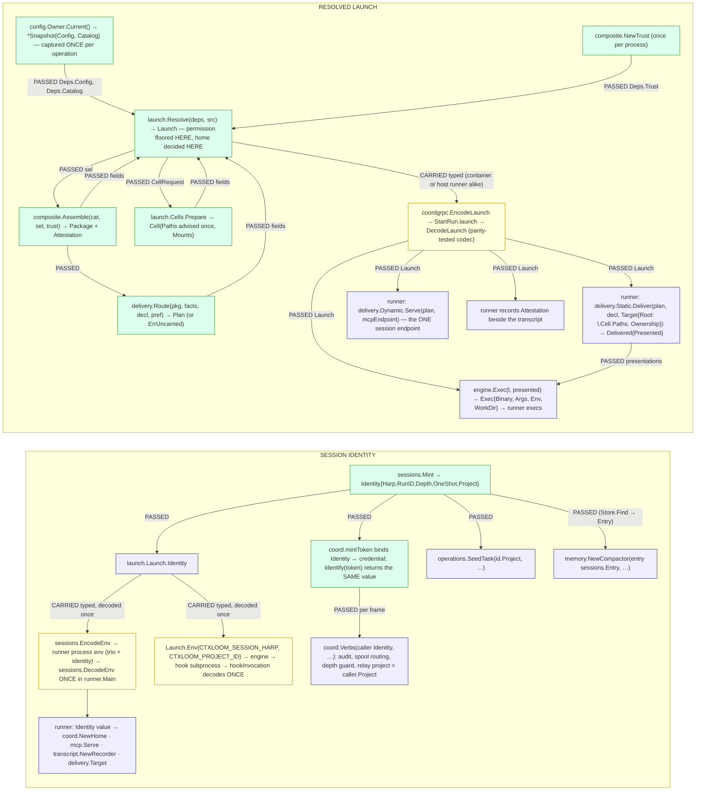

# 22 — Target architecture B (independent design)

Status: COMPLETE — Parts 1–4 present; 16 migration slices (0–15); 8 rulings for the human in §3.3.

Inputs: the code at `release/0.7` (`go doc`/`gopls` on every boundary this document proposes to change), `11-dataflow-review.md` (primary), `10-synthesis.md`, seam documents `01`–`07` (their §5 signature sections in full), `00-coordinator-notes.md`, `GLOSSARY.md`, `docs/architecture/**`, ADRs 0019/0020/0026, `tests/arch/*`, and the three acceptance journeys the reach-back ruling names.
NOT read, by instruction: `20-target-architecture.md`, `21-adversarial-review.md`, `brief-adversarial-review.md`, `brief-target-architecture.md`, `docs/architecture/audit-2026-09-18/README.md` (it may quote design A).

Vocabulary is `GLOSSARY.md`'s, verbatim: **originator** (the human-launched process; hosts the runtime coordinator; the only process that execs a container runtime), **runtime coordinator** (the process/library — `coord.*`), **orchestrating agent** (the LLM role; "coordinating agent" is retired), **executor** and **subagent** (both depth 1), **runner** (what receives a launch and drives an engine), **engine**, **loadout**, **surface**, **channel**, **presentation**, **advice**, **root**, **project root**, **session home**, **ctxloom home**. Terms this design retires are listed in §3.3.

Rulings this design is built inside (all binding): engines as plugin packages, polymorphic; bundles composited from repos, project and companions into ONE package delivered polymorphically (static files, dynamic MCP); DRY; hexagonal; the MCP callback shim is deleted and the engine addresses the runner's socket directly — ONE MCP endpoint per session over authenticated loopback TCP (Streamable HTTP), the endpoint and credential reaching every agent as TYPED LAUNCH INPUTS, no per-engine stdio process, no cross-session endpoint, no cwd-marker discovery; exactly one owner process per harp; the session home is the default root for everything a session writes; the human-invoked `materialize` is the one sanctioned writer into the project root and shares the session's writers; TWO LAUNCH MODES, ONE LAUNCH — raw on the host, and the same raw launch run inside a container by a wrapper, never a second pipeline; REACH-BACK STAYS — a containerized agent reaches the originator's runtime coordinator, carried explicitly and kept green by named journeys in every slice; and the standing rulings the brief lists (native surfaces only; delivery never degrades and is never shared by default; two independent isolation axes with fatal ownership mismatch; every run mints a harp; bytes verified before delivery with one preimage per item kind; `content_hash` an index never an authority; intra-bundle links a tag per item; session state leaves the project).

Design stance, stated once: where the tree already has a value-shaped seam it is KEPT under its current name and this document says so (`bundles.Reader`/`Catalog`/`Pipeline`/`BundleRead`, `present.*`, `engine.Descriptor`, `agent.Declaration`/`Approach`, `sessions.Store`, `coord.Coordinator`/`Home`/`Identity`, `spool.*`, `isolation.Axes`/`Policy`/`Runtime`, `profiles.ResolvedProfile`). What changes is WHO OWNS a value and HOW it crosses a boundary. Renames appear only where `GLOSSARY.md` has already ruled the name.

---

## Part 1 — The target, as boundaries and signatures

### 1.1 Package map

The hexagon has three rings. **Core** packages import only other core packages (plus the standard library and `afero.Fs`, which is itself a port: the OS filesystem is its adapter). **Ports** are interfaces DECLARED IN a core package and implemented outside it. **Adapters** import core and are imported by nothing in core. The enforcement is one table in `tests/arch/layering_test.go`: a `coreSet` list plus the rule "a package in `coreSet` imports only `coreSet`", with a dated, shrinking allowlist per package while the migration runs (the table already carries the `IsLive` staleness check that makes an exhausted exception fail).

```mermaid
flowchart TB
  classDef core fill:#dfe,stroke:#282
  classDef port fill:#ffd,stroke:#a80,stroke-dasharray:4 3
  classDef adapter fill:#eef,stroke:#228
  classDef root fill:#fff,stroke:#000,stroke-width:2px

  subgraph CORE["CORE — imports only core"]
    TR["trust"]:::core
    WIRE["shared/wire"]:::core
    PATHS["paths"]:::core
    HARP["shared/harp"]:::core
    PRES["shared/agent/present"]:::core
    ENG["engine (port + contract)"]:::core
    BUN["bundles"]:::core
    PROF["profiles"]:::core
    COMP["composite"]:::core
    SESS["sessions (core half)"]:::core
    CFG["config (value + Owner)"]:::core
    LAUNCH["launch"]:::core
    DELIV["delivery"]:::core
    COORD["agentcoord/coord (verbs, folds, inbox)"]:::core
    SPOOL["agentcoord/spool"]:::core
  end

  subgraph PORTS["PORTS — interfaces declared in core"]
    P_ENGINE["engine.Engine · engine.Registry"]:::port
    P_SOURCE["bundles.Reader"]:::port
    P_VERIFY["composite.TrustRoot · ReviewRecords · RetractionRecords"]:::port
    P_STORE["sessions.Store · sessions.Locks"]:::port
    P_CELLS["launch.Cells"]:::port
    P_STATIC["delivery.Static · delivery.Dynamic · delivery.Ownership"]:::port
    P_SPAWN["coord.Spawner · coord.Journal · coord.RunnerTransport"]:::port
    P_CFGSRC["config.Sources"]:::port
    P_FS["afero.Fs"]:::port
  end

  subgraph ADAPTERS["ADAPTERS — import core, imported by no core package"]
    E_CLAUDE["engines/claude"]:::adapter
    E_MOCK["engines/mock"]:::adapter
    E_CODEX["engines/codex · engines/opencode"]:::adapter
    E_REG["engines (composition of the registry)"]:::adapter
    RUNNER["runner"]:::adapter
    MCP["mcp (inside the runner)"]:::adapter
    CGRPC["agentcoord/coord/grpc (+ codec)"]:::adapter
    CSPAWN["agentcoord/coord/spawn"]:::adapter
    ISO["lm/isolation (cells: worktree · docker · podman · host)"]:::adapter
    VPIO["vpio (hostpty · attach)"]:::adapter
    REMOTE["remote (git forges, clone cache, lockfile)"]:::adapter
    SIGN["signing · content/attest (verifiers)"]:::adapter
    COMPANIONS["companions"]:::adapter
    SESSFS["sessions/fsstore · transcript · memory"]:::adapter
    CFGLOAD["config/load (files · env · flags)"]:::adapter
    OPS["operations (application services)"]:::adapter
    CLI["cli"]:::adapter
    CMD["cmd/* (composition roots)"]:::root
  end

  CMD --> CLI --> OPS
  OPS --> LAUNCH & COMP & DELIV & COORD & CFG & SESS
  CSPAWN --> LAUNCH & COORD
  CGRPC --> COORD
  RUNNER --> DELIV & ENG & MCP & CGRPC & VPIO
  MCP --> COORD & COMP
  E_CLAUDE & E_MOCK & E_CODEX -. implement .-> P_ENGINE
  ISO -. implements .-> P_CELLS
  REMOTE & COMPANIONS -. implement .-> P_SOURCE
  SIGN -. implements .-> P_VERIFY
  SESSFS -. implements .-> P_STORE
  CFGLOAD -. implements .-> P_CFGSRC
  CSPAWN -. implements .-> P_SPAWN
  MCP -. implements .-> P_STATIC
  P_ENGINE --- ENG
  P_SOURCE --- BUN
  P_VERIFY --- COMP
  P_STORE --- SESS
  P_CELLS --- LAUNCH
  P_STATIC --- DELIV
  P_SPAWN --- COORD
  P_CFGSRC --- CFG
  LAUNCH --> COMP & DELIV & ENG & SESS & CFG & PRES
  DELIV --> ENG & COMP & PRES & WIRE
  COMP --> BUN & PROF & TR & WIRE
  COORD --> SESS & SPOOL & LAUNCH
  ENG --> PRES & WIRE & PATHS
  SESS --> PATHS & HARP
  CFG --> PROF & TR
  BUN --> TR & PATHS
```



Every package, one line each. "Absorbs / splits / deletes" names today's packages by import path.

| Package (ring) | Responsibility | Must never know | Absorbs · splits · deletes |
|---|---|---|---|
| `trust` (core) | the reference grammar, item kinds, decisions, states | files, the network, engines | loses its `remote` import (URL normalisation via `refuri`, which already exists) |
| `shared/wire` (core) | the engine-neutral hook and MCP-server value types | any engine's file format | `MCPServer.SCM string` becomes `Provenance trust.BundleRef` (§3.1) |
| `paths` (core) | the on-disk vocabulary, pure; gains the harp-member table (§1.8) | that any directory exists | absorbs the member classifications in `operations.HarpTopLevelArtifacts`, `classifyPurgeFile`, `ReclaimScope.members`, `sessions.IsSessionDir` |
| `shared/harp` (core) | mint and validate harp names | everything else | unchanged |
| `shared/agent/present` (core) | roots on two sides, advice applied once, presentations, served endpoints | who writes the bytes | `Paths.Scratch` and `UnderScratch` deleted (ruled legacy); `Paths.EngineHome` renamed `SessionHome` (ruled name); `Served`, `Mounts`, `AnnounceEnv`, `Presentation.Env` become LIVE (consumed by the container wrapper and the MCP endpoint), so U4 is NOT a deletion |
| `engine` (core, port) | the plugin contract: what an engine declares, what core pulls, what core hands it | config files, bundle storage, git, containers, the CLI | absorbs `lm/engine.Descriptor` and the CONTRACT half of `shared/agent` (`Backend`, `Declaration`, `Presentations`, `Approach`, `Construct`, `SurfaceKind`, `LaunchForm`, `CellKind`, `PermissionMode`, `EngineCLI`, `EngineHome`, `EngineContainer`, `CredentialSeed`, `ProvisioningPolicy`, `StructuredChat`, `MinimalLaunch`, `Existing`, `LaunchOnly`, `Rider`, `SurfaceLoss`); deletes `lm/backends` (the string-keyed facade) and the four registries in `lm/isolation` (`RegisterCredentialSeed`, `RegisterEngineContainer`, `RegisterInstanceConfigWriter`, `RegisterProvisioningPolicy`) |
| `bundles` (core) | the read stage (`Reader` port, `Catalog` value, `BundleRead` facts) and the process stage (`Pipeline`, `Decide`, `Authorizer`) | profiles' selection, engines, delivery, the session | KEPT; `Loader` (memo + `Invalidate`) deleted in favour of a `Catalog` per config generation (§1.8b); `ReadRemoteRef` moves to `remote` (it is the pull-walk reader) |
| `profiles` (core) | profile documents and parent-graph resolution to `ResolvedProfile` | engines, delivery | KEPT; loses its `shared/agent` import (`MergeHooksConfig` → `wire`) |
| `composite` (core, NEW) | sources → verification → composition → ONE immutable `Package`; the trust holder | which engine, where files land, the session | absorbs `config.ResolveBundle{Commands,Hooks,MCPServers,Skills}`, `config.ResolveBuiltinBundleFragments`, `config.LinkGrant`, `config.extractMCPFromBundle`/`extractHooksFromBundle`, `lm/backends/managed.go`, `managed_hooks.go`, `commands.go`, `skillfiles.go`, `premised_fragment_skills.go`, `operations/context.go` (`AssembleContext`), `operations.regenerateContext`, `operations/trust.go`, `trust_gate.go`, `countersign_records.go`, `premise.go`, `shared/agent/context_framing.go`, `contextchunk.go`, `hook_routes.go` |
| `sessions` (core half) | identity (`Identity`, `Endpoint`), the `Entry` domain type, the `Store` and `Locks` ports, lifetimes and the reap policy | transcript formats, engines | absorbs `coord.Identity` and `paths.Harp*()` as `sessions.Layout`; splits the filesystem `Manager`, sidecars and index into `sessions/fsstore`; deletes `MigrateIndex` and `index_upgrade.go` |
| `config` (core) | the immutable `Config` value, its accessors, the `Owner` lifecycle, `Draft`/`Update` | engines by name (validated through `engine.Registry` passed in), bundle bytes, companions' binaries | KEPT value; deletes `BundleLoader`, `InvalidateBundleLoader`, `ExecutableTrustGate`, `SetExecutableTrustGate`, the stat memo in `Load`, `LoadFresh`, `SetOverrides`/`InstallOverridesFromFlags` (process globals), `Invalidate`; splits file/env/flag reading into `config/load`; companions probing → `companions` |
| `launch` (core, NEW) | `Source` → `Launch`: the one constructor of the resolved launch and its guarantees | cobra, gRPC, docker, files | absorbs `cli/run.go` phases R6–R19 (`resolveLaunchSource`…`stampWorkspaceOnRequest`), `cli.resolvePermissionMode`/`requestedPermission`/`resolveRunLLM`/`validateExplicitLLM`, `cli/init_launch.go` (`discoveryRunRequest`, `discoveryPermissionMode`), `cli/run_owned.go`'s re-pack, `operations/oneshot.go` (whole), the live half of `operations/delegate.go` (`PrepareAgentChat`, `bindIsolatedSpawn`), `operations/enginehome.go`, `memory/distill.go`'s request body, `operations/task_triggers.go`'s request body, `coord/harnessspec.go`, `coord.SpawnPlan`, `coord.OwnerRunSpec`, `agent.LaunchFormForCell`; deletes the dead half of `delegate.go` |
| `delivery` (core, NEW) | plan which package items go STATIC and which DYNAMIC for an engine; the two delivery ports; the ONE ownership record | engine argv, transport, config | absorbs `shared/agent/cells.go`, the `setupViaCells`/`deliverSet` half of `launch_backend.go`, `delivery.go`, `delivery_state.go`, `managed_commands.go`, `managed_skill_packages.go`, `managedcontext.go`, `packagefiles.go`, `commandfiles.go`, `settings.go`/`settings_io.go`, `chat_mcp_config.go`; `confpatch` becomes its ownership adapter; deletes `shared/ledger` and the CLAUDE.md marker parser (`splitManagedSection`/`managedSection`), `lm/backends/uninstall.go`, `agent.SettingsWriter`, `SurfaceSelection.reroot`, `preferOutOfCwd`, `ensureRootable`, `PresentsUnderProjectRoot` |
| `agentcoord/coord` (core) | the runtime coordinator library: `Verbs`, run folds, credential minting, slots, depth, one `spoolInbox`, drain | MCP, docker, cobra, transcripts | KEPT name; splits `grpcserver.go`, `runchannel.go`, `runnerlink.go`, `httpserver.go`, `consumer.go`, `controlwire.go` → `coord/grpc`; `spawner.go`, `owner_run.go` → `coord/spawn`; deletes the `transcript` and `isolation` and `mcpschema` imports, `ownerrecv.go`/`spoolowner.go` (second inbox), `publish.go`, `CapPeerMessaging` |
| `agentcoord/spool` (core) | the file mailbox substrate | who the parties are | KEPT; `PathMapper` is carried as a field by its two holders (ML-C) |
| `engines/claude` (adapter) | the claude-code plugin | config, bundles, operations, coord, isolation, cobra | today's `internal/claude` + `claude/engine`; `SessionConfigDir` deleted; `mcpEntries` → `delivery`'s one projector; `GlobalCommandsDir`/`recordStore` path computation → declared facts |
| `engines/mock` (adapter) | the conformance double, with its lossy and no-skills variants | as claude | today's `internal/mockengine` + `lm/backends/mock*.go` |
| `engines/codex`, `engines/opencode` (adapter) | the polymorphism proof: a second and third `engine.Engine` whose facts differ on every axis | as claude | re-added behind the interface (they are absent from the tree today); each is one package, gated by the conformance suite |
| `engines` (adapter) | builds the `engine.Registry` value at the composition root | — | today's `lm/engines`; `Register()` returns the value instead of populating a global |
| `runner` (adapter, NEW) | the process that receives ONE `Launch`, delivers, hosts the session's MCP endpoint, drives the engine, records the transcript | config files, bundles, flags beyond its one entry | absorbs `cli/llm_serve.go`, `llm_host.go`, `llm_turn.go`, `llm_runner_common.go`, `lm/grpc/server.go`'s `RunTurn`, `coord/enginehost*.go`, the `Execute` tail of `launch_backend.go`, `lm/backends/launcher.go`, `shared/agent/oneshot_turn.go`, `chat.go`; deletes `cli.writeRunStartHandoff`/`readRunStartHandoff`, `consumeCoordinatorReachBack`'s double read and `Unsetenv`, `runnerIsLeaf`, `exportRunnerMCPSocket` |
| `mcp` (adapter) | the MCP protocol adapter INSIDE the runner: resources, tools, the premise catalog, link mates, startup findings, the coordination tools; the `delivery.Dynamic` implementation | a second coordinator, cwd, `$HOME` | deletes `mcp_server.go` (stdio), `mcp_forward.go`, `mcp_discovery.go`, `coord_host.go`, `mcp_tools_agents.go`, the `cfg=nil` server in `mcp_docgen.go` (docs read `mcpschema` contracts directly) |
| `agentcoord/coord/grpc` (adapter) | `RunnerChannel`/`RunChannel`/`ConsumerService` server, `RunnerLink` client, the `Launch`↔proto codec, the reach address | verb semantics | split out of `coord`; absorbs `agentcoord/discover` (endpoint file for out-of-process viewers) |
| `agentcoord/coord/spawn` (adapter) | `coord.Spawner`: resolve through `launch.Resolve`, prepare through `launch.Cells`, start the runner | how a verb is validated | split out of `coord`; `prodSpawner.resolveCfg` deleted (§1.8b) |
| `lm/isolation` (adapter) | the `launch.Cells` implementation: worktree and container preparation, advice (`present.Containerize`), image build, reaping | engines by name, the wire, session env | loses `pb.ClientFactory`/`SpawnClient`/`FactoryForWorkspace`, `SessionStateFromEnv`, the four engine registries, its own session-dir predicate (`findEphemeralWorktrees`) and the `CTXLOOM_CELL_WORKDIR` literal |
| `vpio` (adapter) | the interactive turn transport: `hostpty` (spawn with a pty) and `attach` (a container's foreground process) | the loadout | `vpio/goplugin` and `vpio/dockerexec` deleted with the go-plugin arm (§1.5) |
| `remote` (adapter) | git forges, the clone cache, the lockfile, retraction, the tree reader | the trust decision, operator output | absorbs `bundles.ReadRemoteRef`; loses `clidiag.Warn` (returns typed reports) |
| `signing`, `content/attest` (adapter) | publisher and countersignature verification behind the `composite` ports | the gate | KEPT; `attest` is the ONE publisher-verification adapter (`bundles.readSignatureFacts` calls it over a one-element set) |
| `companions` (adapter, NEW) | discovering, admitting and probing companion binaries; the companion `bundles.Reader` | config's shape | absorbs `config`'s `DiscoverCompanions`, `AdmitCompanions`, `ProbeCompanions`, `ProbeCompanionLoadouts` and `shared/companionloadout` |
| `sessions/fsstore`, `transcript`, `memory` (adapter) | session records on disk; canonical transcript capture and rebuild; distillation | env, `os.Getwd`, engine names | `memory.defaultLLMPlugin` deleted; `Compactor` takes `sessions.Entry` and never opens the store |
| `config/load` (adapter) | reading `config.yaml` layers, env overrides and flag overrides into a `config.Sources` value | who consumes the config | today's `Load` body minus the memo; `confload` stays its helper |
| `operations` (adapter) | the application services every frontend calls (ADR 0019/0026): compose core + ports per use case | cobra, the terminal, MCP protocol | loses the launch tails, the trust holders, the delivery writers and 108 `*config.Config` parameters (narrow values); gains the cli-resident orchestrators (doctor, deps check/reconcile, review walk, signer resolution) as typed results |
| `cli` (adapter) | flags → `operations`; rendering | domain rules | loses `run.go`'s phases, `llm_*.go`, the hook verbs' engine decoding, 22 direct `config.Load` sites |
| `cmd/*` (composition roots) | construct the `config.Owner`, the `engine.Registry`, the ports; inject | — | every `init()`-time registration becomes a value built here |
| `shared/{iox,lockwait,sessionlock,strictness,clidiag,cliemit,…}` (toolbox) | infrastructure helpers used by adapters | domain types | `shared/agent`'s toolbox (`AtomicWriteFile`, `WithFileLock`, `isOSBackedFs`, `Warn`, `GetFS`) moves to `iox`; `strictness` globals become a value threaded from the composition root |

Retired packages: `lm/backends`, `lm/grpc` (the LLM service and go-plugin), `vpio/goplugin`, `vpio/dockerexec`, `shared/ledger`, `lm/engine` (folded into `engine`), `mockengine` and `claude` (moved under `engines/`), `agentcoord/discover` (folded into `coord/grpc`), `shared/companionloadout` (folded into `companions`).

Layering rules added to `tests/arch/layering_test.go` (each a row in `layeringRules`; the allowlist shrinks per slice and the `IsLive` test deletes exhausted entries):

- `core-imports-only-core`: every `coreSet` package forbids every non-core in-repo import.
- `engines-import-nothing-above-the-port`: `internal/engines/**` forbids `config`, `bundles`, `composite`, `launch`, `delivery`, `operations`, `coord`, `isolation`, `cli`, `mcp`; zero allowlist from day one.
- `cli-through-operations`: `internal/cli` forbids `launch`, `delivery`, `isolation`, `coord`, `mcp`, `runner`, `engines/**`, `remote`, `signing`, `memory`, `sessions/fsstore`, `transcript`; dated shrinking allowlist.
- `runner-owns-the-engine`: `internal/runner` is the ONLY package outside `engines/**` that may call `engine.Engine.Exec`; nothing outside `runner` imports `mcp`.
- `one-launch-constructor`: `launch.Launch{` literals and the proto `Launch` message's constructor appear only in `internal/launch` and the codec in `coord/grpc` (the N2 gate, widened).

### 1.2 Engines as plugins

What exists and is kept: `engine.Descriptor` is already a complete per-engine declaration record with `Declared[T]` fields (present-with-value or absent-with-reason), `agent.Declaration` already keys constructible approaches by surface kind with no fallback, `agent.EngineCLI` already declares an argv grammar with a shared parser, and `agent.Backend` already separates identity, lifecycle and history. The defect is not the declaration; it is that the declaration is READ through a string-keyed facade (`backends.Get`, `Declared`, `ContainerFor`, `CredentialSeedFor`, `SupportsSkills`, `EnforcesReadOnlyPlan`, `TranscriptReadersFor`, …) and copied into four parallel registries in `isolation`, so core code asks "which engine is this?" with a name and then branches. The target makes the declaration a VALUE the core holds and queries by method; nothing in core holds an engine name except to look the value up once.

```go
// internal/engine — the port. Package doc: "An engine is a plugin. Core code
// holds an Engine value and asks it; it never names one."

package engine

// Name is the registry key and the ONLY spelling of an engine (the
// Descriptor rule today). It is a defined type so a bare string cannot be
// passed where an engine is meant.
type Name string

// Engine is what every engine package implements. Three groups of methods:
// DECLARE (pure, callable before any run), PULL (typed queries the core makes
// against a run's package or session), HAND (the one typed launch value).
type Engine interface {
	// ---- DECLARE ----
	// Facts is the static declaration. Pure; the registry validates it once.
	Facts() Facts
	// Surfaces is the engine's declared approaches per surface kind — today's
	// agent.Declaration, unchanged: a name is known iff a Construct is
	// registered under it, and Default is the at-rest default.
	Surfaces() Declaration
	// CLI declares each process surface's argv grammar, env it sets and strips,
	// and the context probes the vendor reads (today's agent.EngineCLI).
	CLI() []EngineCLI

	// ---- PULL ----
	// Exports maps a composed package's items to this engine's native export
	// shapes: which commands become slash commands, which skills are enabled,
	// how unified hook events route to native events, the tool identifiers a
	// deny list names. It replaces Descriptor.CommandExports/SkillExports,
	// backends.forceExport/forceExportSkill, RouteUnifiedHooks and
	// AssembleManagedDenyTools. Pure over its inputs; the per-engine export
	// settings a bundle item carries are decoded HERE (ExportSchema below).
	Exports(pkg composite.Package) (Exports, error)
	// ExportSchema is the JSON schema of the per-engine `exports` block a
	// bundle item may carry under this engine's Name — what schemagen
	// publishes and what Exports decodes. Replaces the typed
	// bundles.LLMExports{ClaudeCode …} fields (see §3.3, ADR 0020 amendment).
	ExportSchema() []byte
	// Home reports how this engine's config/credential home relocates into a
	// session home: the env vars that move it, the leaf under the session home,
	// and how credentials reach it (Descriptor.Home + Provisioning today).
	Home() Declared[HomeSpec]
	// Container reports how a containerized run of this engine is built and
	// authenticated (Descriptor.Container today). Absent = a container runtime
	// binding is refused, fail-closed.
	Container() Declared[ContainerSpec]
	// Transcripts reports the version-scoped readers of this engine's own
	// transcript store (Descriptor.TranscriptReaders today).
	Transcripts() Declared[[]TranscriptReader]
	// Version asks the installed binary for its version (Descriptor.VersionCommand).
	Version(ctx context.Context) (string, error)

	// ---- HAND ----
	// Exec turns ONE typed launch plus the presentations delivery produced
	// into the process the runner execs. It is the only place engine-specific
	// argv is composed; the result must parse against CLI() (the anti-drift
	// test runs it). It replaces Configure+buildArgs+ExecuteCLI's argv half.
	Exec(l launch.Launch, presented []present.Presentation) (Exec, error)
	// Drive returns the driver the runner uses for a non-pty run: the engine's
	// NATIVE structured protocol (claude stream-json). Absent = this engine can
	// only be driven interactively through a pty; the launch resolver refuses
	// a structured Source for it (fail loud where no native surface exists).
	Drive() Declared[StructuredDriver]
	// Hooks decodes this engine's native hook payloads for the hook verbs
	// (SessionStart, PostToolUse, Stop …) into the unified shape. Absent =
	// the engine has no hook mechanism (Descriptor.NoHooksReason).
	Hooks() Declared[HookCodec]
}

// Facts is the static declaration. Every field is a fact the core reads by
// method, never a name it branches on.
type Facts struct {
	Name         Name
	Distribution Distribution // default | on-request | test-only (today's agent.Distribution)
	// Modes the engine can run in. Interactive means a pty; Structured means
	// Drive() is present. A Source asking for a mode absent here is refused.
	Modes []Mode
	// Permissions declares the engine's permission vocabulary: which modes it
	// honours natively, whether plan is genuinely read-only
	// (Descriptor.EnforcesReadOnlyPlan), and the engine's DEFAULT posture for
	// an interactive host run — today's "bypass for claude-code" host stopgap
	// becomes a declared fact with its retirement condition beside it, instead
	// of a `backendType == "claude-code"` branch in cli.resolvePermissionMode.
	Permissions PermissionFacts
	// Resume declares the native resume primitive (by session key) the
	// coordinator's one-shot turn loop relies on; absent = conversational only
	// (coord.resolveResumeMode's resumeCapableBackends table, moved here).
	Resume Declared[ResumeSpec]
	// Surfaces the engine has NO structural place for, per unified kind, with
	// the reason (Descriptor.UnsupportedHookKinds, NoHooksReason,
	// LaunchOnlySettingsReason folded into one map).
	Uncarried map[delivery.Kind]string
	// ResolveModel translates a configured model string; nil = pass through.
	ResolveModel func(model string) (string, bool)
}

// Registry is the set of engines a process was composed with. It is a VALUE
// built at the composition root (engines.Build()), never a package global.
type Registry struct{ /* unexported map[Name]Engine */ }
func NewRegistry(engines ...Engine) (Registry, error) // validates every Facts
func (r Registry) Lookup(name Name) (Engine, bool)
func (r Registry) Names(keep func(Facts) bool) []Name
```

What the core PULLS (all typed, none by file convention): `Facts` (modes, permissions, resume, uncarried kinds), `Surfaces` (approaches per kind), `Exports(pkg)` (the engine's projection of a package), `Home()` (the session-home leaf and vars — the core computes the PATH from `sessions.Layout`, the engine only says what it is called and which variable names it), `Container()`, `Transcripts()`, `Hooks()`.

What the core HANDS: one `launch.Launch` (§1.5) plus the `[]present.Presentation` delivery produced. `Exec` returns:

```go
type Exec struct {
	Binary      string
	Args        []string
	Env         map[string]string // ONLY the engine-native variables (home var, model quirks); identity env is stamped by the runner
	WorkDir     string
	Interactive bool
	StdinPrompt []byte // a one-shot prompt fed on stdin when the grammar says so (PromptDelivery)
}
```

Engine-specific knowledge that sits in core today and moves behind the interface (seams 1, 3, 6 name each):

| Today (core site) | Target (engine method) |
|---|---|
| `cli.resolvePermissionMode(…, backendType, …)` "bypass for claude-code"; `agent.ResolveDefault(sources, claudeCodeDefault bool)`; `backends.EnforcesReadOnlyPlan` | `Facts.Permissions` |
| `memory.defaultLLMPlugin = "claude-code"`; `operations.DefaultMaterializeBackend`; `config.DefaultLLM` | `config.Config.DefaultLLM()` validated against `Registry`; no engine name outside config data and the engine packages |
| `backends.forceExport` writing `LoadedContent.LLM.ClaudeCode.Enabled` on the shared bundle object (C8) | `Engine.Exports(pkg)` returns a value; nothing mutates the package |
| `bundles.LLMExports{ClaudeCode ClaudeCodeConfig; …}` typed per-engine fields in the core schema | `BundleItem.Exports map[engine.Name]json.RawMessage`; `Engine.ExportSchema()` for schema generation; decoded in `Exports` |
| `cli/hook_*.go` decoding `claude.SessionStartPayload`/`PostToolUsePayload` (S6.F4) | `Engine.Hooks()` codec, selected by the `--engine` argv flag the engine's own hook export wrote |
| `isolation.RegisterCredentialSeed/EngineContainer/InstanceConfigWriter/ProvisioningPolicy` (four string-keyed registries fed from the descriptor) | read `Engine.Home()` / `Container()` directly |
| `backends.InTreeAgentHomeFor(name, workDir, harp)`; `claude.SessionConfigDir` (dead) | `sessions.Layout.SessionHome(harp)` + `Engine.Home().Leaf` |
| `claude.GlobalCommandsDir()`, `recordStore()` computing real-home and ctxloom-home paths inside the engine (S3.F12) | the runner hands the roots in `Launch.Cell.Paths`; an engine never computes a path outside a root it was given |
| `agent.NewContextInjectionHooks`/`NewSkillMatesHook`/`NewToolReflectHook` building `wire.Hook` with the `ctxloom` binary, routed by `RouteUnifiedHooks(engine, …)` | ctxloom's own hooks stay engine-neutral in `composite`; `Engine.Exports` routes unified events to native ones (or reports them uncarried) |
| `coord.resumeCapableBackends` / `oneShotSupportedBackends` tables | `Facts.Resume` |
| `operations.VendorReaderAdaptersFor(engine)`, `vendorReaderRegistry` | `Engine.Transcripts()` |
| `claude.mcpEntries` vs `agent.MCPServerJSONEntry` (two projectors) | one projector in `delivery`; the engine's MCP approach only names the FILE |

Conformance: `engine/conformance` (today `lm/conformance`, extended) is a test suite every engine package runs against its own `Engine` value: `Facts` validates; every declared surface kind has a constructible default; `Exec` output parses against `CLI()` for every mode in `Facts.Modes` (the existing anti-drift shape); `Home()` present ⇒ its vars are set by `Exec` to a path under the session home root it was handed; `Drive()` present ⇒ `Structured ∈ Modes`; `Uncarried` never names a kind `Surfaces()` declares. `engines/mock` is the first implementer and the double every core test uses (its lossy and no-skills variants exercise `Uncarried` and the absent arms); `engines/claude` follows; `engines/codex` and `engines/opencode` are the polymorphism proof: a table test in `runner` launches the same `composite.Package` through all registered engines and asserts that no core package branched on `Facts.Name` — measured by the layering rule (no core import of `engines/**`) plus a `git grep`-shaped gate that `engine.Name` literals appear only under `engines/**` and in config data.

Assumption stated: codex and opencode are not in the tree at HEAD (the ACP-era packages were removed). "Polymorphism proof" therefore means re-adding them as engine packages behind this interface, each gated by the conformance suite, and until they exist the proof rests on mock's variants plus claude.

### 1.3 The composite package

Kept seams: `bundles.Reader` (a source reports EVERYTHING it holds, with trust facts, no policy), `bundles.Catalog` (the resolved set as a VALUE), `bundles.BundleRead` (trust axes unexported, settable only by readers), `bundles.Pipeline` (the only producer of admitted content), `bundles.Decide` (the one decision function), `profiles.ResolvedProfile`. What is added is the layer ABOVE them that today is spread across `config`, `lm/backends`, `operations` and `shared/agent`: composition of a profile set into one typed, immutable package, and one holder for the trust gate.

```go
package composite

// Trust is the gate holder (the data-flow review's TrustContext). Constructed
// ONCE per process at the composition root and passed to Assemble; it is
// never a field of config.Config and has NO permissive zero value.
type Trust struct{ /* unexported: root, records, retraction, gate, withheld, now */ }

// TrustRoot, ReviewRecords and RetractionRecords are the three PORTS the gate
// decides with (implemented by signing/allowedsigners, signing/countersign
// and remote's lockfile). They are read into memory once by NewTrust.
type TrustRoot interface{ TrustedForNamespace(key ssh.PublicKey, ns string, now time.Time) allowedsigners.Decision }
type ReviewRecords interface{ Rejected(ref trust.Ref, payload []byte) bool; Approved(ref trust.Ref, payload []byte, form string) bool }
type RetractionRecords interface{ Retracted(ref trust.Ref) (retracted bool, reason string) }

func NewTrust(root TrustRoot, records ReviewRecords, retraction RetractionRecords, now func() time.Time) (Trust, error)
// Ungated is the ONLY way to obtain a gate that admits everything. It exists
// for listing and review surfaces, which must show pending content to a human.
// A Package can NOT be assembled with it (Assemble refuses ErrUngatedAssembly),
// so an Ungated gate can never reach delivery. bundles.AdmitAll is deleted.
func Ungated() Trust
func (t Trust) Authorizer() bundles.Authorizer   // for Pipeline; never AdmitAll unless Ungated
func (t Trust) Withheld() []string               // refs withheld over this gate's lifetime

// Selection is what a profile set asks for, resolved: the ordered fragment
// refs (with pinned versions), the command/skill/hook/MCP bundle refs, the
// exclusions, and the link grants. It is computed from
// []profiles.ResolvedProfile by Select and is pure.
type Selection struct{ /* exported fields: Fragments []Ref; Commands, Skills, Hooks, MCP []trust.BundleRef; Exclusions collections.Set[string]; Links []LinkGrant */ }
func Select(profiles []profiles.ResolvedProfile, cat bundles.Catalog) (Selection, error)

// Package is the composed loadout SOURCE: every admitted item of every kind,
// the assembled context, the premised (conditional) fragments held back for
// the catalog, the link groups, and the attestation of how each item was
// admitted. It is immutable: every field is a copy or a value, and only
// Assemble can construct one (the attestation field is unexported).
type Package struct {
	Context    Context              // the framed model-facing text + its content hash
	Fragments  []Item[Fragment]     // delivered, in assembly order
	Premised   []Item[Fragment]     // withheld from Context; offered through the premise catalog (dynamic)
	Commands   []Item[Command]
	Skills     []Item[Skill]        // whole packages (SKILL.md + files), manifest-verified
	Hooks      []Item[wire.Hook]    // bundle + profile hooks, unified events, ctxloom's own hooks included
	MCP        []Item[wire.MCPServer]
	Links      []LinkGroup          // intra-bundle link groups, a tag per item (valid-vanish)
	DenyTools  []string             // engine-neutral tool identifiers the profile set denies
	Statusline bool
	attestation Attestation
}

// Item pairs an admitted value with the read facts it was admitted on.
type Item[T any] struct {
	Value    T
	Ref      trust.Ref          // "<source>#<kind>/<name>", version-less
	Form     bundles.ContentForm
	Decision trust.Decision     // allow, and its Source (local | builtin | companion | trusted-signer | accepted)
	Signer   string             // principal, when the decision rested on one
}

// Attestation is the proof a Package was verified: one row per delivered item
// plus the withheld tally. It is a VALUE the runner and any report can carry;
// nothing else can make one.
type Attestation struct {
	Items    []ItemAttestation
	Withheld []string
	GateID   string // opaque id of the Trust that decided, for logs
}
func (p Package) Attestation() Attestation

// Assemble is the ONE constructor. It reads nothing: cat is already resolved,
// profiles already loaded, trust already built. It fails on an Ungated trust
// and on any item whose Decision is not allow when the caller asked for a
// delivery package (ErrItemWithheld carries the refs; the caller may retry
// with Options.DropWithheld to receive a package that omits them, recorded
// in the attestation).
func Assemble(ctx context.Context, cat bundles.Catalog, sel Selection, trust Trust, opts Options) (Package, error)

type Options struct {
	PreferDistilled bool
	DropWithheld    bool
	Builtin         []BuiltinFragment // unconditional injections, already read (config.ResolveBuiltinBundleFragments' output)
	OwnHooks        []wire.Hook       // ctxloom's own hooks for this run (context injection, skill mates, …), engine-neutral
}
```

Sources are the `bundles.Reader` implementations, all adapters: the project reader (filesystem), the tree reader over the lockfile (`remote`), the companion reader (`companions`), the builtin reader (embedded). The verification point is INSIDE each reader (a publisher signature is verified at read, before parse, and the facts ride the `BundleRead`) — kept exactly as today; the readers call `attest.VerifyBundle` (the ONE verification adapter; `bundles.readSignatureFacts` becomes a call to it over a one-element set, retiring the second adapter and the inference in its tamper arm). The DECISION point is `bundles.Decide` inside `Pipeline`, driven by `Trust.Authorizer()`; the preimage per item kind stays computed in one place per kind (`BundleFragment.ContentPayload`, `BundleCommand.ContentPayload`, `BundleSkill.ContentPayload`, `BundleMCP.ContentPayload`, `BundleHook.ContentPayload`), and the reverse hand copy `backends.hookExecPayload` is deleted because profile hooks are gated in `Select` through the same `Pipeline` path as bundle hooks.

Where the gate is held: on `Trust`, a parameter of `Assemble`. `config.Config` loses `ExecutableTrustGate`, `SetExecutableTrustGate` and the mutable field; the five mutation sites, `MaterializeProfile`'s save/restore, `RunOneshot`'s `AdmitAll` branch and `AssembleManagedConfig`'s reload-then-set all cease to exist because there is nothing to mutate. How a package proves it was verified: it exists. A `Package` value cannot be constructed outside `Assemble`, `Assemble` cannot run without a `Trust`, and `Ungated()` cannot assemble. The `Attestation` value is what a report prints and what the runner records beside the transcript.

Dedup and links: `Select` canonicalises every ref through `trust` (today's `ExpandBundleRefs` canonicalisation, version-agnostic, explicit `@commit` wins), and `Assemble` applies link groups as the tag-per-item rule already implemented in `bundles.LinkWithholds` — a member whose link server is not granted is withheld with its group named in the attestation.

### 1.4 Polymorphic delivery

Kept seams: `agent.Declaration`/`Presentations`/`Approach`/`Construct` (an engine's STATIC approaches per surface kind; construct from a run's content; `Present` composes channels against advised roots; `Deliver` writes and returns the handle that reverses it), `present.Start`/`Rooted`/`Served`, and `confpatch.Store` (records what ctxloom put into a file it shares). Added: the layer that decides which package item goes which way, the two delivery ports, and one ownership record.

```go
package delivery

// Kind is the cross-engine surface category (today agent.SurfaceKind) plus the
// kinds only a dynamic route can carry.
type Kind int
const (
	Context Kind = iota; MCP; Settings; Commands; Skills   // static-capable
	PremiseCatalog; LinkMates; StartupFindings; Resources   // dynamic-only
)

// Route is where one item goes. There are exactly two.
type Route int
const ( StaticRoute Route = iota + 1; DynamicRoute )

// Preference is the agent binding's delivery preference, validated when the
// binding is written: an approach NAME per static kind, and the kinds the
// binding ACCEPTS losing on an engine that cannot carry them. Accepting a loss
// is a decision recorded on the binding; it is never a fallback.
type Preference struct {
	Approach   map[Kind]string
	AcceptLoss map[Kind]bool
}

// Plan is the loadout as routes: for every package item, STATIC (an engine
// approach under a root) or DYNAMIC (served on the session's MCP endpoint).
// It is computed once per launch, pure, and carried on launch.Launch.
type Plan struct {
	Static  []StaticItem   // ordered by Kind (context before settings, so a hook-carried context can name its file)
	Dynamic []DynamicItem
	Losses  []Loss         // kinds the binding ACCEPTED losing, with the engine's reason — reported, never silent
}
type StaticItem struct{ Kind Kind; Approach string; Inputs Inputs }
type DynamicItem struct{ Kind Kind; Payload any }
type Loss struct{ Kind Kind; Reason string }

// Inputs is per-kind (not one God struct): the Construct for a kind receives
// exactly that kind's inputs. The engine's Construct signature becomes
// func(in delivery.Inputs, fs afero.Fs) Approach with Inputs a small sealed
// interface (ContextInputs, MCPInputs, SettingsInputs, CommandsInputs,
// SkillsInputs) so an approach reads what it needs and nothing else (C3).
type Inputs interface{ kind() Kind }

// Route decides the plan. THE RULE, per item kind:
//   1. the binding named an approach for the kind → STATIC by that approach
//      (unknown name: error, never the default);
//   2. else the engine declares a surface for the kind → STATIC by the
//      engine's Default();
//   3. else the kind is dynamic-capable (PremiseCatalog, LinkMates,
//      StartupFindings, Resources — and MCP when the engine has no MCP
//      file but supports MCP by argv) → DYNAMIC;
//   4. else the item is UNCARRIED: error ErrUncarried{Kind, Reason} unless the
//      binding's AcceptLoss names the kind, in which case a Loss is recorded.
// There is no arm 5. "Delivery never degrades" is that this function has no
// fallback: it returns a Plan or a typed error, and nothing downstream can
// substitute an approach because the Plan names the one it will use.
func Route(pkg composite.Package, facts engine.Facts, decl engine.Declaration, pref Preference) (Plan, error)

// Static delivers the static items under ONE root with ONE ownership record.
// The same implementation serves a session (root = the session home, record =
// the session's) and a human materialize (root = the project root, record =
// the project's). They differ ONLY in the Target.
type Static interface {
	Deliver(ctx context.Context, plan Plan, decl engine.Declaration, target Target) (Delivered, error)
}
type Target struct {
	Root      present.Start   // advised; the writer opens Root.Host, the engine is told Root.Engine
	Ownership Ownership       // where the record of what ctxloom wrote lives
	Cell      engine.CellKind
}
type Delivered struct {
	Presented []present.Presentation // every channel the engine must be told (argv, env, paths)
	Wrote     []Kind
	Undo      func(ctx context.Context) error // LIFO retraction of everything Wrote, through the same record
}

// Dynamic serves the dynamic items on the session's ONE MCP endpoint. The
// implementation lives in internal/mcp inside the runner.
type Dynamic interface {
	Serve(ctx context.Context, plan Plan, ep sessions.Endpoint) (Served, error)
}
type Served struct{ Endpoint sessions.Endpoint; Kinds []Kind; Close func() }

// Ownership is the ONE mechanism (seam 3 F5: three today). It is a record per
// target file naming the entries ctxloom currently owns in it, so reconciling
// to a declared state — including the EMPTY state, which is uninstall — is one
// operation. confpatch.Store implements it; the CLAUDE.md markers and the
// ledger sidecar are deleted (a context file's managed section becomes a
// recorded entry like any other).
type Ownership interface {
	Apply(ctx context.Context, fs afero.Fs, target string, build Build) (Result, error)
	Owned(target string) ([]string, error)
}
```

Which items go which way, per engine declaration: an engine declares STATIC surfaces through `Surfaces()` (claude: context by `system-prompt`|`unsafe-file`|hook-carried; MCP by `mcp-config`|`hew-record`|`unsafe-file`; settings; commands; skills) and DYNAMIC ones implicitly — every engine that speaks MCP receives the premise catalog, link mates, startup findings and the `ctxloom://` resources dynamically, because those have no native file. The rule above makes the `Facts.Uncarried` map the ONLY source of "this engine cannot carry X" and `Preference.AcceptLoss` the only source of "and this binding accepts that".

"Delivery never degrades" as a property of the types: `Route` returns a `Plan` naming ONE approach per static kind or an error; `Static.Deliver` takes the `Plan` and cannot select; an approach that cannot root under `Target.Root` fails `Deliver` with `ErrUnrootable{Kind, Approach, Root}` rather than substituting (today's `SurfaceSelection.reroot`, `preferOutOfCwd` and `ensureRootable` are deleted — §3.3 asks the human to confirm that refusal is the ruling). `LaunchFormPresent` (name the session's existing surfaces, write nothing) becomes a `Target.Ownership` that is READ-ONLY: `Deliver` presents what the record says exists and refuses (`ErrAbsentSharedSurface`, kept) when it does not. `LaunchFormMinimal` becomes an empty `Plan` plus `engine.Facts.Permissions`-driven minimal argv — whether internal one-shots use it is the earthly-city re-rule (§3.3).

The session home as the root: `Target.Root` for a session is `present.New(mapped)` where `mapped` advised `SessionHome` under `sessions.Layout.SessionHome(harp)` (under the ctxloom home, never the project) — the ONLY approach that roots under `ProjectRoot` is one the binding selected by name (`unsafe-file`), so "nothing of a session lands under the project root unless the binding explicitly selects the unsafe-file approach" is `Route`'s arm 1 plus the absence of any other arm that names `UnderProjectRoot`. The human-invoked materialize calls the SAME `Static.Deliver` with `Target{Root: present.ProjectOnHost(dir), Ownership: projectRecord}` — one pipeline, two targets; `manage hooks uninstall` is `Deliver` of an empty `Plan` against the same `Target` (reconcile-to-nothing), which retires `agent.SettingsWriter.RemoveSettings` and the second abstraction seam 3 F16 found.

### 1.5 The resolved launch

The review's F1/F5 and the synthesis's ML-A: today "the resolved launch" has no type, so it is eight shapes with fields dropped at three hops. The target has ONE type, ONE constructor, and TWO launch modes that are one launch: RAW (the runner executes the launch on the host) and IN-CONTAINER (the identical raw launch executed by a runner inside a container the originator started). The container mode composes the raw mode; nothing about the loadout, the delivery or the engine differs between them.

```go
package launch

// Mode is how the run is driven. Interactive = a pty (the human's own turn);
// Structured = the engine's native structured protocol (children, one-shots,
// owner runs the runtime coordinator injects turns into).
type Mode int
const ( Interactive Mode = iota + 1; Structured )

// Source is what a caller KNOWS when it asks for a launch — never more. The
// five launch sources of the audit (agent binding, profile set, label, init
// probe, internal one-shot) are five Source values, and one table test
// (§4.2) feeds all five through Resolve.
type Source struct {
	Agent      string               // binding name; "" = the default agent, or none
	Profiles   []string             // explicit profile set when no binding (classic assembly)
	Label      string               // --llm override; "" = binding's / project's default
	Mode       Mode
	OneShot    bool                 // exit after one answer (the CLI's --one-shot / --print)
	Prompt     string
	WorkDir    string               // the project root the caller is in (already resolved by projectroot)
	Workspace  isolation.WorkspaceAxis // the invocation's workspace axis ("" = project default); the runtime axis is the BINDING's
	Permission agent.PermissionMode // the --permissions flag; zero = not requested
	Resume     ResumeRef            // a harp to resume, or zero
	Depth      int                  // 0 for the originator's own run; a child's depth is set by the runtime coordinator
}

// Deps are the ports Resolve needs. Every one is a VALUE or an interface the
// composition root built once; Resolve reads no file and no env.
type Deps struct {
	Config   *config.Config        // the generation this launch is resolved against (§1.8b)
	Catalog  bundles.Catalog       // the same generation's resolved sources
	Trust    composite.Trust
	Engines  engine.Registry
	Sessions sessions.Store        // mints the harp
	Cells    Cells                 // prepares the workspace/container (a port; isolation implements it)
	Now      func() time.Time
}

// Cells is the port isolation implements: prepare the cell a launch runs in
// and advise its roots. It is called by Resolve exactly once per launch.
type Cells interface {
	Prepare(ctx context.Context, req CellRequest) (Cell, error)
}
type CellRequest struct {
	Axes      isolation.Axes
	Engine    engine.Engine       // for Container() and Home() facts
	Identity  sessions.Identity   // names the workspace and the state mounts
	ProjectRoot string
	SessionDir  string            // sessions.Layout.Dir(harp)
	DirtyTree operations.DirtyTreeHandler
	Image     isolation.ImageConfig
}
// Cell is a prepared place to run: its kind, the advised roots (present.Mapped
// carries the mounts a container needs), the workspace's own env, and the
// teardown. A Cell exists only inside a Launch.
type Cell struct {
	Kind      engine.CellKind
	Paths     present.Mapped      // ProjectRoot, SessionHome, CtxloomHome advised for THIS cell
	Workspace string              // the directory the engine runs in (Paths.ProjectRoot.Host)
	Env       map[string]string   // workspace-provided env (git dir mirror etc.)
	Container *ContainerCell      // nil on the host; the wrapper's inputs otherwise
	Cleanup   func() error
}
type ContainerCell struct {
	Runtime isolation.Runtime     // docker | podman, ownership already matched (fatal mismatch, never substitution)
	Image   string
	Mounts  []present.Mount       // from Paths.Mounts(): project root, session dir (scoped), credential mounts
	Home    string                // the fresh $HOME inside
}

// Launch is the resolved launch. Immutable once returned. Everything a
// runner needs to deliver and exec is here, typed; nothing is re-derived from
// env, disk or a label string after this value exists.
type Launch struct {
	Identity   sessions.Identity     // harp, run id, depth, one-shot, project id — minted, never re-read
	Engine     engine.Name
	Label      string                 // the config label that chose Engine+Model (kept for reporting; never "the engine")
	Model      string                 // resolved through Facts.ResolveModel
	Mode       Mode
	OneShot    bool
	Permission agent.PermissionMode   // floored ONCE, here; every other site asserts, none re-floors
	Axes       isolation.Axes
	Cell       Cell
	Home       HomeSpec               // the session home on both sides + the engine's vars + credential provisioning decision (today AgentHomeResolution)
	Package    composite.Package
	Loadout    delivery.Plan          // the routed package (GLOSSARY: "loadout")
	Prompt     string
	Resume     ResumeRef
	Env        map[string]string      // ONLY engine-process carriers: identity for hooks (CTXLOOM_SESSION_HARP, CTXLOOM_PROJECT_ID), Home.Env, Cell.Env — computed here, read by no ctxloom code in-process
	ReachBack  sessions.Endpoint      // the runtime coordinator's URL + this run's credential (set by the spawner; see below)
	Attestation composite.Attestation
}

// Resolve is the ONE constructor. It refuses (typed errors) a launch with no
// harp, no permission, no home decision, no plan, or an engine whose Facts do
// not carry the requested Mode. It prepares the cell through deps.Cells, so a
// Launch that exists has a place to run; Discard tears that place down.
func Resolve(ctx context.Context, deps Deps, src Source) (Launch, error)
func Discard(ctx context.Context, l Launch) error

// The Setup guarantee, stated as code: the runner's Execute takes a Launch
// and calls delivery before exec. There is no Execute that skips delivery,
// and no way to hold a Launch that was not resolved by Resolve.
```

Who constructs it (once): the process that owns the launch decision. For the originator's own run (`ctxloom run`) and for `init`'s discovery session, `operations.StartRun` calls `Resolve`. For delegated children and for owner runs the runtime coordinator issues, `coord/spawn` calls `Resolve` inside `Spawner.Resolve` (the coordinator mints `Identity` first — §1.6 — and passes it in `Source`-adjacent `Deps`). For distill and triage one-shots, `operations.Distill`/`EvaluateTriggers` call `Resolve` with `Source{Agent: "distiller"|"triage", Mode: Structured, OneShot: true}` — the agents `ctxloom-init` already creates — which is the earthly-city re-rule (§3.3).

Who consumes it (every tail): exactly one consumer type, the runner:

```go
package runner

// Execute is the RAW launch: deliver the loadout under the cell's roots, hand
// the engine the launch and the presentations, exec, drive, record. It runs on
// whatever host the runner process is on — the human's machine, or the inside
// of a container. There is no other tail.
func Execute(ctx context.Context, deps Deps, l launch.Launch, io TurnIO) (Outcome, error)

type Deps struct {
	Engines  engine.Registry
	Static   delivery.Static
	Dynamic  delivery.Dynamic     // the mcp adapter, bound to THIS runner's endpoint
	Home     *coord.Home          // the reach-back link, dialed from l.ReachBack before Execute is called
	Recorder transcript.Recorder  // canonical transcript under sessions.Layout.Persist(harp)
}
// TurnIO is the turn transport for Interactive mode (vpio) or the mailbox
// sink for Structured mode; the runner does not care which process owns the
// terminal.
```

And the container mode is ONE wrapper on the originator, not a second tail:

```go
package coord/spawn   // adapter: the only package that execs a container runtime (the originator hosts it)

// StartRunner starts the process that will Execute l. Host: spawn
// `ctxloom runner` with a pty (Interactive) or pipes (Structured), stamping
// the reach-back trio and identity as env. Container: `docker|podman run` of
// the SAME `ctxloom runner` inside l.Cell.Container.Image with
// l.Cell.Container.Mounts, the same env crossing as NAME-ONLY `-e` forwards
// (values on the originator's process env, never argv), the runner as the
// container's FOREGROUND process (Interactive ⇒ `-it`, the docker CLI owns the
// pty; no keepalive, no exec-into, no file handoff).
// In both cases the runner then dials home and RECEIVES l over StartRun.
func StartRunner(ctx context.Context, l launch.Launch, reach sessions.Endpoint) (*isolation.RunnerHandle, error)
```

So the raw launch's inputs cross the container boundary as: (1) `Launch` itself on the wire, typed, in `StartRun.launch` (the coordinator sends it to the runner that dialed home with the credential minted for THIS run); (2) the reach-back endpoint and identity as env carriers on the runner PROCESS (the trio plus harp, run id, depth — decoded ONCE by `ctxloom runner`'s main into `sessions.Identity` and `sessions.Endpoint`, §1.6); (3) the roots as mounts (`present.Mapped.Mounts()`, the container advice applied once in `Cells.Prepare`), with `Launch.Cell.Paths` already carrying both sides so the runner inside opens `Root.Engine` paths without translating anything. Mounts and env are CARRIERS of values the Launch already holds; the runner never re-derives a path, a harp or a credential from them.

The wire projection. There is ONE launch message, in `coordination.proto`, replacing both `HarnessSpec.config` (an opaque `Struct`) and `llm.proto`'s `RunStart`:

```proto
message StartRun {
  string run_id = 2;
  Launch launch = 8;                 // typed; replaces HarnessSpec (3) — reserved 1, 3, 4, 5, 6, 7
  reserved 1, 3, 4, 5, 6, 7;         // task_id, harness, input, budget, parent_run_id, role: never read (U14) or now inside Launch
}
message Launch {
  Identity identity = 1;             // harp, run_id, depth, one_shot, project
  string engine = 2;  string label = 3;  string model = 4;
  Mode mode = 5;  bool one_shot = 6;
  PermissionMode permission = 7;     // an ENUM on the wire (T9), never a string
  Axes axes = 8;  Cell cell = 9;  Home home = 10;
  Package package = 11;              // items + attestation
  Plan loadout = 12;
  string prompt = 13;  ResumeRef resume = 14;
  map<string,string> env = 15;
  Endpoint reach_back = 16;          // URL only; the credential rides the runner's process env, never a journaled message
}
```

The codec `coordgrpc.EncodeLaunch(launch.Launch) *pb.Launch` / `DecodeLaunch(*pb.Launch) (launch.Launch, error)` lives in the gRPC adapter, and a reflection test asserts field-set parity between `launch.Launch` and `pb.Launch` (every exported Go field has a same-named proto field and vice versa), so a field added to one and forgotten in the other fails the build — the "typed codec on both ends" property the review found on the only two hops that did not guess, made mandatory. `Package` crosses the wire because the runner may be in a container with no shared filesystem for bundle bytes; skills cross as their verified file sets (today's `PackageFile`), and the attestation crosses with them.

Collapse of the carriers. The six `pb.RunStart{` constructors (`cli/run.go`, `cli/init_launch.go`, `cli/bundle_distill.go`, `memory/distill.go`, `operations/oneshot.go`, `operations/task_triggers.go`) and the one `HarnessSpec{` (`coord/harnessspec.go`) become zero: only `EncodeLaunch` constructs the wire message, and only `Resolve` constructs the Go value. The seven carrier structs collapse as: `cli.runState` (39 fields) → the CLI keeps flags, the prompt, signals and rendering, and holds a `Launch`; `operations.resolvedRunRequest`, `cli.ownedRunLaunch`, `coord.OwnerRunSpec`, `operations.AgentChatRequest`, `coord.SpawnPlan`, `coord.HarnessSpecInput` → deleted, replaced by `launch.Source` in and `launch.Launch` out. `agent.SetupRequest`/`ManagedConfig`/`ExecuteRequest`/`LaunchSpec` → `Launch` in, `delivery.Delivered` and `engine.Exec` out. `agent.LaunchForm` survives as `delivery.Plan`'s shape (Deliver = a full plan; Present = read-only ownership; Minimal = an empty plan), not as a wire enum.

One arm. With the runner as the unit and `StartRun` carrying the launch, the go-plugin arm (`lm/grpc`'s `LLM` service, the bidi `Run` stream, `RunInput`/`RunResponse`, `vpio/goplugin`, the socket-dir mounts, `ClientFactory`, `Container.SpawnClient`) has no job left: the interactive turn's stdio, resize and exit ride the pty the originator allocated (`vpio/hostpty`) or the docker CLI's `-it` attachment (`vpio/attach`) — the two "registered future swaps" the glossary already names — and transcript observation (`GetSession`, `WatchSession`, `ListSessions`, `GetPlans`) reads the canonical transcript the runner writes under the session dir, which the container mounts read-write already. What the other option would have bought: keeping go-plugin for the interactive host turn would avoid touching the pty path, at the price of two arms forever (and of E3's three standups and file handoff, which exist only because the arms differ). §4.1 stages the deletion after the launch type and the typed `StartRun` exist, so the decision can be reversed from a working state.

### 1.6 Identity

Kept: `coord.Identity{Harp, RunID, Depth, OneShot, Project}` minted from the bearer credential is the ONE trustworthy identity today; `coord.ReachURL(axis)` already computes the address a container dials; `coord.OwnerRunnerEnv` is already "the one exported entry to runnerEnv". The target moves the type into core and makes it the only carrier.

```go
package sessions

// Identity is the session identity as a VALUE. Minted once per run by Mint;
// carried typed on launch.Launch, on every coord verb (caller Identity), and
// on the runner (decoded once from its process env). Never read from env or
// cwd inside a process that already holds one.
type Identity struct {
	Harp    string // this run's session; names the session dir and the spool
	RunID   string // the runtime coordinator's run; "" only on the originator's own interactive run
	Depth   int    // 0 = the originator's own run; 1 = executor or subagent (there are exactly two)
	OneShot bool   // resumed by native session key at each turn boundary
	Project string // the taskloom project id (worktree-redirected); what hooks and taskloom key on
}
func (id Identity) IsChild() bool   // Depth > 0
func (id Identity) Validate() error // harp.Validate + Project non-empty

// Endpoint is one addressable ctxloom service: the runtime coordinator a
// runner reaches back to, or the MCP endpoint an engine addresses. URL plus a
// bearer credential. It is minted by whoever hosts the endpoint and handed to
// whoever must dial it — never discovered.
type Endpoint struct {
	URL        string
	Credential string // held by exactly one process; scrubbed before any child exec (ScrubIdentityEnv)
}

// Mint assigns a harp in the store and returns the identity. The ONE mint.
// A failure is an error the caller must refuse on; there is no harpless run.
func Mint(ctx context.Context, store Store, projectDir, projectID string, engine engine.Name, depth int, oneShot bool) (Identity, error)

// The process-boundary carriers. These constants are the ONLY spellings; an
// arch gate forbids the literal strings outside this file.
const (
	EnvHarp      = "CTXLOOM_SESSION_HARP"
	EnvRunID     = "CTXLOOM_RUN_ID"
	EnvDepth     = "CTXLOOM_RUN_DEPTH"
	EnvOneShot   = "CTXLOOM_RUN_ONESHOT"
	EnvProjectID = "CTXLOOM_PROJECT_ID"
	EnvCoordURL  = "CTXLOOM_COORD_URL"
	EnvCoordCred = "CTXLOOM_COORD_CRED"
)
// EncodeEnv renders identity + reach-back for a child PROCESS (the runner).
func EncodeEnv(id Identity, reach Endpoint) map[string]string
// DecodeEnv is called exactly once per process, in `ctxloom runner`'s main and
// in the hook verbs' one shared entry. It does not unset anything; a process
// that must not pass the credential on scrubs the child env at exec.
func DecodeEnv(getenv func(string) string) (Identity, Endpoint, error)
```

Where it is minted: `sessions.Mint` — called by `operations.StartRun` for the originator's own run (depth 0, run id assigned by the runtime coordinator when it registers the owner run), and by `coord.Coordinator.AgentRun` for children (before `run.enqueued` is journaled, as today's `AssignSession` doc requires). The credential half is minted by `coord` (`mintToken`) and bound to the identity in the coordinator's credential index; `Identify(token)` returns the same `sessions.Identity` value. There is no `GenerateName()` fallback anywhere: a process that cannot decode an identity refuses (the stdio shim that fabricated one is deleted).

Which env vars survive as PROCESS-boundary carriers only, and where each is decoded exactly once:

| Variable | Producer → consumer process | Decoded once at |
|---|---|---|
| `CTXLOOM_COORD_URL`, `CTXLOOM_COORD_CRED`, `CTXLOOM_RUN_ID`, `CTXLOOM_SESSION_HARP`, `CTXLOOM_RUN_DEPTH`, `CTXLOOM_RUN_ONESHOT` | originator (`coord/spawn.StartRunner`) → the runner (host child or container foreground) | `runner.Main` → `sessions.DecodeEnv` → `Identity`, `Endpoint`; the runner then dials, receives its `Launch`, and passes `Identity` by value to `coord.NewHome`, `mcp.Serve`, `transcript.NewRecorder`, `delivery` |
| `CTXLOOM_SESSION_HARP`, `CTXLOOM_PROJECT_ID` | the runner → the ENGINE process → its hook subprocesses (`ctxloom hook …`) and taskloom | `cli/hook` one entry (`hookInvocation`) → `sessions.DecodeEnv`; taskloom's `taskContext` |
| `CTXLOOM_ROOT` | a human's shell → any ctxloom process | `projectroot.WorkDir` (unchanged) |

Deleted carriers: `CTXLOOM_MCP_SOCKET` (the endpoint is a return value inside the runner and a typed field in the engine's MCP entry), `CTXLOOM_CELL_WORKDIR` (the cell is in the Launch), the discovery marker, the `persist/runstart.json` handoff, `Options.Env[CLAUDE_CONFIG_DIR]` as an in-process channel (the home is `Launch.Home`; the engine var is written by the engine's `Exec` from it). Deleted re-derivations: `isolation.SessionStateFromEnv`, `setupViaCells`'s two env reads (and `ErrSharedScratchNoHarp`, `SetEngineHomeVar`), `runResolvedAgent`/`bindIsolatedSpawn`'s env reads, `mcp.selfIdentityFromEnv`, `memory.Compactor.resolveHarpName`'s env fallback and its four store re-opens, `cli.seedTaskIntoSession`'s parent-env read (it receives `Identity.Project`), the relay handlers' six `os.Getwd()` (they receive the caller `Identity` and resolve the project through `sessions.Layout`), `cli.consumeCoordinatorReachBack`'s double read and `Unsetenv`, `cli.runnerIsLeaf` and the `leaf bool` chain (leafness is `Identity.Depth ≥ Facts-independent cap`, computed in `coord` once and carried on the runner's `Identity`).

Project identity: `Identity.Project` is computed ONCE by the originator (`taskops.ResolveProjectIdentity` over the worktree-redirected root, today's `cli.exportProjectIdentity`) and travels on the identity; children inherit the parent's project id from the coordinator's `Identity`, never from cwd.

### 1.7 The bus

Kept: `coord.Coordinator` (folds, journals, slots, credentials, drain), `coord.Home` (the runner half), `spool.*` (the file substrate), the two-plane `RunChannel`/`RunnerChannel` wire, `ConsumerService` for out-of-process viewers, `coord.ReachURL`. The target adds one verb layer with typed requests, deletes the second orchestrator (PATH A), merges the two parked long-polls into one inbox, and makes every transport a thin adapter.

```go
package coord

// Verbs is the coordination verb set — the ONE place a verb is validated and
// journaled. Implemented by *Coordinator. Every request is a typed value
// declared here; the wire proto and the MCP tool schema are PROJECTIONS of
// these types (a parity test asserts the field sets match, as for Launch).
type Verbs interface {
	Spawn(ctx context.Context, caller sessions.Identity, req SpawnRequest) (SpawnResult, error)
	Send(ctx context.Context, caller sessions.Identity, req SendRequest) (SendResult, error)
	Recv(ctx context.Context, caller sessions.Identity, wait time.Duration) ([]Message, error)
	Stop(ctx context.Context, caller sessions.Identity, req StopRequest) (StopResult, error)
	StopChildren(ctx context.Context, caller sessions.Identity, reason string) ([]StoppedChild, error)
	Roster(caller sessions.Identity) []RosterEntry
	Report(ctx context.Context, caller sessions.Identity, req ReportRequest) error
	FetchArtifact(ctx context.Context, caller sessions.Identity, req FetchRequest) (Artifact, error)
	Control(ctx context.Context, by ControlInitiator, req ControlRequest) (ControlResult, error) // pause, resume, steer, question, summarize, withdraw
}

type SpawnRequest struct {
	Agent            string
	Prompt           string
	Workspace        isolation.WorkspaceAxis        // TYPED at the edge, once
	DirtyTreeHandler operations.DirtyTreeHandler    // typed at the edge, once
}
func (r SpawnRequest) Validate() error   // agent and prompt required; the ONLY validation site
type SendRequest struct{ To, Kind, Body string; Structured json.RawMessage; InReplyTo string }
func (r SendRequest) Validate() error    // kind vocabulary, addressee form; the ONLY validation site
type SendResult struct{ MessageID string } // the id the recipient will see — the SAME id (F8)
type StopRequest struct{ Harp, Reason string }

// spoolInbox is ONE parked long-poll with late ack, instantiated once by the
// Coordinator for the owner's inbox and once by Home for a run's. It carries
// its PathMapper as a field: the spool root is resolved once per holder.
type spoolInbox struct{ /* mapper spool.PathMapper; harp string; parked, buffered, returned … */ }
func newSpoolInbox(mapper spool.PathMapper, harp string, dir spool.Dir) *spoolInbox
func (b *spoolInbox) Wake(ref spool.Ref)                       // doorbell or reactor
func (b *spoolInbox) Sweep() (SweepResult, error)               // reconcile from disk
func (b *spoolInbox) Take(ctx context.Context, wait time.Duration) ([]Message, error) // park until mail or timeout; acks the PREVIOUS batch
func (b *spoolInbox) Ack(ids []string) error

// Spawner is the launch port the coordinator calls. Implemented in
// coord/spawn over launch.Resolve and StartRunner. Resolve returns a Launch —
// the coordinator holds no SpawnPlan of its own; its run record is a
// projection (RunRecord{Harp, RunID, Engine, Label, Profiles, Runtime, …}).
type Spawner interface {
	Resolve(ctx context.Context, id sessions.Identity, req SpawnRequest) (launch.Launch, error)
	Start(ctx context.Context, l launch.Launch, reach sessions.Endpoint) (*RunnerHandle, error)
	Resume(ctx context.Context, l launch.Launch, key string) (launch.Launch, error) // native resume key stamped
	End(ctx context.Context, l launch.Launch)                                        // session ended; cell discarded
}

// RunnerTransport is the port the gRPC adapter implements for the coordinator
// side of RunnerChannel: issue StartRun (carrying the Launch), StopRun, Drain;
// observe RunExited and heartbeats. bidiSession is its one scaffold, used by
// both channels.
type RunnerTransport interface {
	StartRun(ctx context.Context, runID string, l launch.Launch) (StartRunResult, error)
	StopRun(ctx context.Context, runID, reason string) (StopRunResult, error)
	Drain(ctx context.Context, runID string) (DrainResult, error)
}
```

What each frontend becomes:

- **The MCP handlers** (`internal/mcp`, inside the runner): for the coordination tools (`agent_run`, `agent_send`, `agent_recv`, `agent_stop`, `roster`, `agent_report`, `agent_fetch_artifact`) each handler decodes the tool arguments into the `coord` request type (the schema is generated from it — `mcpschema` keeps that job), calls `coord.Home.Request`, which puts it on `RunChannel`; the coordinator side decodes the frame into the same request type and calls `Verbs`. The result travels back as the typed result and is rendered ONCE (`mcpschema`'s projection). There is one schema per verb, one result shape, one leaf rule (`Identity.Depth`). PATH A (`mcp_tools_agents.go`, `agentDelegation`, `NewHostedCoordinator` reachable from a shim) is deleted: no MCP server can construct a coordinator, because the only MCP server is the one inside a runner that already holds a `Home`.
- **The gRPC handlers** (`coord/grpc`): `RunChannel`'s `serveAgentRequest` decodes `AgentRequest` → `coord.SpawnRequest` etc. and calls `Verbs`; the ownership re-check in `serveStopRun`, the re-validation in `serveSpawnAgent` and the workspace re-parse are gone because `Validate` and the typed axis live on the request. `RunnerChannel` is `RunnerTransport`'s server half. Both share `bidiSession` (hello, ack watermark, heartbeat, tracked goroutines joined by `trackedGroup`; `c.streams` and `waitBounded` deleted).
- **The CLI** (`ctxloom agent run|send|recv|stop`, `session inject`, viewer commands): calls `operations`, which holds a `Verbs` — in-process when the CLI IS the originator, over `ConsumerService`/`RunChannel` with an owner credential otherwise. The CLI never validates a verb's arguments beyond parsing.

Reach-back, carried explicitly (the ruling). The port is `coord.RunnerLink` (client, kept) dialed by the runner with `sessions.Endpoint{URL, Credential}` decoded once from its process env; the address is chosen by the ORIGINATOR per runtime axis through `coord.ReachURL(axis)` (loopback for a host runner, the bridge/host-interface listener for a container runner, opened on demand, never `0.0.0.0` — kept), and stamped into the runner's spawn env by `coord/spawn.StartRunner` (name-only `-e` forwarding into a container, values from the originator's process env, the existing discipline). The credential is minted per run by `coord` and bound to the `Identity` the coordinator will attach to every frame from that link. `ConsumerService` and the endpoint file under the ctxloom home stay for OUT-OF-PROCESS VIEWERS only (a human's `session watch`, the VS Code client): a child never discovers an endpoint, it is handed one. The originator remains the only process that execs a container runtime; a containerized orchestrating agent (shape 2a) is an ordinary depth-1 cell whose runtime coordinator stays in the originator. Every migration slice in §4.1 names the journey scenario that proves a containerized child still reaches back.

### 1.8b Config lifecycle

Today: `config.Load()` is memoised process-wide and validated by `stat` on every call; `LoadFresh` exists for mutators; `prodSpawner.resolveCfg` reloads per spawn while `s.cfg` and `s.gate` are the startup snapshot; `backends.AssembleManagedConfig` reloads again; `Config.BundleLoader()` builds a `bundles.Loader` whose reader-set closure is memoised and `Invalidate`d in place — and the shared loader kept a pre-pull reader set across an `Invalidate`, which was this morning's defect. Two owners of one fact (the file's stat and the loader's memo) plus per-site reloads is what made it possible for one run to observe two states.

The target has ONE owner per process, an immutable snapshot per generation, and an explicit invalidation contract.

```go
package config

// Config is the loaded configuration VALUE. Immutable: every field unexported,
// accessors copy on read (kept exactly as today). It carries NO gate, NO
// loader, NO filesystem handle for writing.
type Config struct{ /* unexported */ }

// Snapshot is one GENERATION of everything that derives from the config
// files and the lockfile: the Config value and the resolved bundle Catalog
// (which depends on the lockfile the config names). Both are values; a holder
// can never observe a mixed state, because there is nothing in a Snapshot
// that re-reads the world.
type Snapshot struct {
	Config     *Config
	Catalog    bundles.Catalog
	Generation uint64
	LoadedAt   time.Time
	Warnings   []Warning   // a property of loading, echoed by whoever renders — not by whoever loads
}

// Sources is the port config/load implements: where the files, env and flag
// overrides come from, and which readers compose the catalog for a given
// Config. It is built ONCE at the composition root from the process's flags
// and env, so there is no process-global override funnel.
type Sources interface {
	Read(ctx context.Context) (*Config, []Warning, error)
	Readers(ctx context.Context, cfg *Config) ([]bundles.Reader, error) // project, builtin, lockfile trees, admitted companions
}

// Owner is the one owner of the loaded configuration in a process. Exactly one
// exists, constructed at the composition root, and reaches every consumer as
// a *Snapshot parameter (or as the narrow value the consumer actually reads),
// never as a global and never by re-loading.
type Owner struct{ /* unexported: sources, current atomic.Pointer[Snapshot], writeMu */ }

func Open(ctx context.Context, src Sources) (*Owner, error)      // loads generation 1; refuses if unreadable (no empty fallback)
func (o *Owner) Current() *Snapshot                                // never re-reads; O(1)
func (o *Owner) Reload(ctx context.Context) (*Snapshot, error)     // the ONLY re-read; returns the NEW generation; the previous stays valid for whoever holds it
func (o *Owner) Update(ctx context.Context, fn func(*Draft) error) (*Snapshot, error) // write-through: draft → validate → write file → Reload; serialised by writeMu
```

Who constructs it: `cmd/ctxloom/main.go` (and each family binary's main) builds `config/load.NewSources(flags, env, projectroot)` and calls `config.Open` once; the resulting `*Owner` is injected into `operations` (as a field of the `operations.App` value every use-case function is a method on — the end of the `cfg *config.Config` parameter on 108 functions: a use case takes `*Snapshot` or a narrow value such as `DelegationLimits{Depth, Concurrency}` or `CompactionLLM{Label, Model; EssenceMax}`), into the runtime coordinator (`coord.Options.Config` becomes `coord.Options.Snapshots func() *Snapshot` — see below), and nowhere else. The runner has NO owner: it receives its `Launch`, which already carries everything it needs; `cli.loadAndConfigureBackend` and `serveBackendConfig` are deleted (F5).

How it reaches every consumer: as a parameter, captured ONCE at the entry of an operation. An operation that spans a long time (a spawn) captures `o.Current()` at its start and threads that `*Snapshot` through `launch.Resolve` (`Deps.Config`, `Deps.Catalog`) and everything below; it never calls `Current()` twice.

The invalidation contract:

1. **Writes through ctxloom** (`agent set`, `config set`, `llm set`, `bundle create/edit`, `remote add`, `init`'s scaffold) go through `Owner.Update`. `Update` writes the file, then reloads into a new generation atomically (pointer swap). A writer that holds an old `*Snapshot` after `Update` returns holds a stale but CONSISTENT value; it does not mutate anything shared. `LoadFresh` and the "mutate a copy" idiom are deleted with it.
2. **Re-reads across a pull** (`deps pull`, `deps sync`, `deps upgrade`) call `Owner.Reload` after the pull has landed on disk (lockfile written, tree installed). `Reload` re-runs `Sources.Readers` for the NEW config, so the catalog's reader set follows the lockfile: the pre-pull reader set cannot survive, because the reader set is a function of the generation, not a memo beside it.
3. **Hot reload of agent definitions mid-session** is kept as a DELIBERATE, single-site policy: `coord/spawn.Spawner.Resolve` calls `Owner.Reload` once at the top of each spawn and threads the returned `*Snapshot` through the WHOLE spawn (agent definition, context assembly, MCP set, gate — one generation). That is the fix for F4/M5: two configs feeding one spawn becomes impossible because a spawn holds exactly one `*Snapshot` by construction. (`coord.Options.Snapshots` is the function the spawner calls; tests inject a fixed one.)
4. **External edits** (a user's editor) are visible at the next `Reload` site (a spawn, a pull, a new process). There is no stat-polling memo; a process that wants fresh state asks for it at a named site.
5. **Companion loadouts**: `Sources.Readers` includes the companion reader; a reload re-probes admitted companions. The probe is cached by the `companions` adapter keyed by binary hash (the hash-keyed exec consent already exists), so a reload does not re-exec unchanged binaries.

Why no consumer can observe two states in one run: every value a run reads — `Config`, `Catalog`, and everything derived (`composite.Package`, `delivery.Plan`, `launch.Launch`) — is a value derived from ONE `*Snapshot` captured once; there is no re-entry into the owner on any path below the entry point, and `Snapshot` has no method that re-reads. The layering rule `one-config-load-per-process` (the synthesis's N12, made structural) is: `config.Open` appears only under `cmd/`; `Owner.Reload` appears only in the three named sites (post-pull, post-scaffold, spawn-resolve); `Owner.Current` appears only in `operations` entry points and the coordinator's snapshot hook.

### 1.8 Sessions on disk

One harp-keyed tree, under the ctxloom home only:

```
~/.ctxloom/sessions/<harp>/
  session.yaml        identity sidecar (sessions.Entry)
  home/               the SESSION HOME: this session's instance of the engine's config home — settings, .mcp.json, commands, skills, context file, credential copy (disposable as a unit)
  persist/            referenced data: canonical transcript, plan files, reports, essence, next-step (reaper-exempt by default)
  ephemeral/          the disposable one-off store: scratch, agent worktrees, machine data (reaped by age)
  segments/           per-native-session distilled segments
  spool/              in/, out/, consumed/, failed/ — the mailbox substrate
  keep                the reaper's keep marker
```

The project tree holds NO session state (`<project>/.ctxloom/state/<harp>` and `paths.SessionStatePath` are deleted; `boned-monoxide` item 1). `paths.SessionHomePath(appPath, harp)` becomes `paths.SessionHome(harp)` under `HarpDir`.

The member classification as a type (ML-G): one table in `paths`, from which every walker derives.

```go
package paths

type MemberTier int
const ( TierIdentity MemberTier = iota + 1; TierDerived; TierMachine; TierAuthored; TierDisposable )
type MemberLocation int
const ( AtTop MemberLocation = iota + 1; InPersist; InSegments; InEphemeral; InSpool; InHome )
type Lifetime int
const ( Persist Lifetime = iota + 1; Ephemeral )

type HarpMember struct {
	Name     string         // the file or directory name
	Tier     MemberTier
	Location MemberLocation
	Lifetime Lifetime       // the ONLY axis the reaper honours
	Mounted  bool           // whether a containerized run of this harp may write it (isolation.sessionStateMounts derives from this)
}
// HarpMembers is the table. A test asserts every paths.*FileName/*DirName
// constant that lives under a session dir appears in it exactly once.
var HarpMembers = []HarpMember{ … }
func ClassifyMember(rel string) (HarpMember, bool)  // the ONE predicate every walker uses
func IsSessionDir(root string, e fs.DirEntry) bool  // the ONE session-dir predicate (today's sessions.IsSessionDir, moved beside the table)
```

Consumers that derive from it (and lose their own lists): `operations.HarpTopLevelArtifacts` (authored = `TierAuthored`), `classifyPurgeFile` (purge class = `Tier`), `ReclaimScope.members` (scope = `Lifetime`), `isHarpDirCandidate`/`isSessionInstanceCandidate`/`isolation.findEphemeralWorktrees`/`shared/plans`' walk/`cli/plan_watch`/`doctor` (all → `IsSessionDir` + `ClassifyMember`), `isolation.sessionStateMounts` (`Mounted`), `paths.Layout()` (rows generated from the table).

One reaper policy:

```go
package sessions

type ReapPolicy struct {
	Cutoff  time.Time   // required; zero refuses (ErrNoAgeBound kept)
	Scope   Lifetime    // Ephemeral by default; Persist only when a human passes --include-persist
	Apply   bool        // report-first; false by default
	KeepMarker bool     // honour `keep`
}
// Reap is THE reaper. It classifies through paths.ClassifyMember, honours the
// keep marker and the session lock, and removes only members whose Lifetime is
// within Scope. ReapOrphanedSessionHomes, MigrateHarpArtifacts, the startup
// sweep block copied into cli/run.go and mcp/mcp_server.go, and
// removeSessionInstance are deleted; worktree and container orphan reaping
// stay in isolation but are invoked by Reap with the same policy value.
func Reap(ctx context.Context, store Store, locks Locks, p ReapPolicy, report io.Writer) (ReapResult, error)
```

The lifetime axis (persist/ephemeral) is the ONLY distinction the policy knows; tiers exist for purge classification and doctor reporting, not for reaping. The reaper's clock (whole-session newest mtime excluding the harp dir's own mtime and symlinks) is the row `boned-monoxide` left unruled; the design leaves it as the policy's `ActivityTime` function, injected, and §3.3 asks for the ruling.

Session records: `sessions.Entry` loses its json tags (it is the domain type); `operations.SessionView` is the DTO every listing and MCP resource renders, with `Located bool` telling a recorded transcript path from a located one (F15). `sessions.Store` stays the port; `sessions/fsstore` implements it; `SetSourceEntries` joins the port so `memory` depends on the interface, not on `*Manager`. `MigrateIndex` and `index_upgrade.go` are deleted: re-init is the upgrade path.

---

## Part 2 — Data flow in the target

### 2.1 The guessing map, redrawn

The review's map had sixteen red nodes on the identity half and eight on the launch half, every one downstream of a green node that already held the typed value. In the target every hop is PASSED (a typed parameter or field) except the three process-boundary crossings, which are CARRIED by a typed codec on both ends and decoded exactly once. Node fill: green = the decision point (one per value); blue = a consumer; yellow = a process-boundary carrier with a codec.



Survivors, each justified in one sentence:

- **`ENV` (runner process env)** survives because a process boundary has no typed channel before the first connection exists; it carries exactly the identity and the reach-back endpoint, encoded by `sessions.EncodeEnv` and decoded by `sessions.DecodeEnv` once, so it is a codec, not a re-derivation.
- **`HOOKENV` (engine → hook subprocess)** survives because the engine, not ctxloom, spawns the hook and the vendor's hook contract offers env and stdin only; it carries the two identity values and is decoded once by the hook verbs' shared entry.
- **`WIRE` (`StartRun.launch`)** survives because the runner may be in a container; it is a typed proto projection with a field-set parity test, the shape the review found on the only hops that did not guess.

No RE-DERIVED node remains: the runner reads no config, no label, no env key for a root, no cwd for a project; the compactor opens no store; the relay handlers use the caller's identity; the permission is floored once. No ASSUMED node remains: there is no `GenerateName()` fallback, no `defaultLLMPlugin`, no `AdmitAll` reachable by delivery.

### 2.2 Three launches, one trunk

All three share the trunk `Snapshot → Resolve → StartRunner → (runner) dial home → StartRun(Launch) → Deliver → Exec`. Divergences are labelled where they occur and each is one legitimate difference in WHO asks, WHERE the runner runs, or HOW the turn is driven — never in what is delivered.

```mermaid
sequenceDiagram
  autonumber
  participant CLI as cli (inbound adapter)
  participant OPS as operations.StartRun
  participant CFG as config.Owner
  participant LR as launch.Resolve
  participant CELLS as isolation (Cells)
  participant CO as runtime coordinator (originator)
  participant SP as coord/spawn.StartRunner
  participant RN as runner (host process | container foreground)
  participant DL as delivery (Static + Dynamic)
  participant EN as engine.Engine

  Note over CLI,EN: A — `ctxloom run` on the host (Interactive, depth 0)
  CLI->>OPS: Source{Agent, Prompt, Mode: Interactive, Workspace, Permission flag}
  OPS->>CFG: Current() → *Snapshot (captured once)
  OPS->>CO: RegisterOwner → Identity (Mint) + credential
  OPS->>LR: Resolve(Deps{Snapshot, Trust, Engines, Cells}, src)
  LR->>LR: Select → Assemble → Route (Plan) · permission floored once · Home decided
  LR->>CELLS: Prepare(CellRequest{Axes: {none, host}, …}) → Cell (OnHost advice)
  LR-->>OPS: Launch
  OPS->>SP: StartRunner(Launch, ReachURL(host)) — spawns `ctxloom runner` with a pty; env = EncodeEnv(identity, reach)
  RN->>RN: DecodeEnv once → Identity, Endpoint
  RN->>CO: RunnerChannel Hello (credential) → Identify → Identity
  CO->>RN: StartRun{launch: EncodeLaunch(Launch)}
  RN->>RN: mint the session MCP endpoint (loopback TCP + bearer) → DynamicItem inputs
  RN->>DL: Static.Deliver(Plan, decl, Target{Root: session home, Ownership: session record}) → Delivered
  RN->>DL: Dynamic.Serve(Plan, endpoint) → resources, tools, premise catalog, link mates, findings
  RN->>EN: Exec(Launch, Presented) → Exec{argv names the session home, --settings, --mcp-config; env = home var}
  RN->>RN: exec the engine on the pty; record the transcript under persist/
  Note over OPS,RN: the originator's termui wraps the pty master; the runner is the slave's owner

  Note over CLI,EN: B — `agent_run` child in a container (Structured, depth 1) — DIVERGES at (1) who asks and (6) where the runner runs
  CO->>CO: Verbs.Spawn(caller Identity, SpawnRequest) → Validate; Mint child Identity{Depth: 1}; enqueue
  CO->>CFG: Snapshots() → Reload() ONCE for this spawn → *Snapshot (the one generation the whole spawn uses)
  CO->>LR: Spawner.Resolve → Resolve(Deps, Source{Agent, Mode: Structured, Depth: 1, Workspace from the request})
  LR->>CELLS: Prepare(CellRequest{Axes: {worktree, container-rootless}, Engine.Container(), Identity}) → Cell{Container: {Runtime, Image, Mounts from Containerize advice}}
  LR-->>CO: Launch (same type, same fields, same Plan rule)
  CO->>SP: StartRunner(Launch, ReachURL(container-rootless)) — `docker run` the SAME `ctxloom runner` as the foreground process; mounts = Cell.Container.Mounts; env = name-only -e forwards of EncodeEnv
  RN->>RN: DecodeEnv once (inside the container)
  RN->>CO: RunnerChannel Hello over the bridge address (REACH-BACK) → Identity{Depth: 1}
  CO->>RN: StartRun{launch} — the identical projection A received
  RN->>DL: Static.Deliver under the MOUNTED session home (Root.Engine side) — hooks, settings, .mcp.json, commands, skills, context
  RN->>DL: Dynamic.Serve on the container-local loopback endpoint (same netns as the engine)
  RN->>EN: Exec → engine driven through Drive() (structured); turns arrive from Home.Recv (spoolInbox) and results return over RunChannel
  Note over CO,RN: the child's MCP endpoint is inside its container; its reach-back crosses the container boundary once, as the Hello

  Note over CLI,EN: C — a distill one-shot (Structured, OneShot, depth 0) — DIVERGES only at (1) the Source
  OPS->>LR: Resolve(Deps, Source{Agent: "distiller", Mode: Structured, OneShot: true, Prompt: payload})
  LR-->>OPS: Launch (a real harp; a real session home; the distiller agent's own Plan)
  OPS->>SP: StartRunner(Launch, ReachURL(host)) — host runner with pipes
  RN->>CO: Hello → StartRun{launch}
  RN->>DL: Deliver (the distiller binding decides its surfaces; hooks ON unless the binding's Preference says otherwise)
  RN->>EN: Exec → Drive() one turn → answer → RunExited; the session is Ephemeral-lifetime (self-pruning)
```

Where each diverges, and why it is legitimate:

- **A vs B, who asks.** A is the human at the CLI (`operations.StartRun`); B is the orchestrating agent through `Verbs.Spawn`. Both end at `launch.Resolve` with a `Source`; B's `Identity` is minted by the coordinator with `Depth: 1` and B's snapshot is the spawn's own `Reload` (§1.8b rule 3). That is a difference in caller, not in pipeline.
- **A vs B, where the runner runs.** `Cells.Prepare` answers with a `Cell` whose `Container` is nil (A) or set (B); `StartRunner` is the ONE wrapper that reads it. Delivery and exec inside the runner are byte-identical: the same `Static.Deliver` writes the same files under the session home, which in B is a bind mount the advice recorded. This is the "container uses the raw, inside a container" ruling made structural: there is no code path in the runner that knows it is in a container.
- **A vs B/C, how the turn is driven.** A owns a pty; B and C use `Engine.Drive()` so the runtime coordinator can inject turns. `Mode` is a field of the `Launch`, decided by the `Source`; the runner branches on it exactly once, after delivery.
- **C, the Source.** A distill is a real session against a declared agent — the earthly-city direction (§3.3). Its only special property is `OneShot: true` and the Ephemeral lifetime of its session dir.

### 2.3 A bundle item, from remote bytes to engine

```mermaid
sequenceDiagram
  autonumber
  participant REM as remote (git forge · clone cache · lockfile)
  participant RD as bundles.Reader (tree reader adapter)
  participant ATT as content/attest.VerifyBundle
  participant CAT as bundles.Catalog (value)
  participant SEL as composite.Select
  participant PIPE as bundles.Pipeline + Decide
  participant TR as composite.Trust
  participant PKG as composite.Package
  participant RT as delivery.Route
  participant RN as runner
  participant ST as delivery.Static
  participant EN as engine.Engine

  REM->>REM: deps pull: resolve ref → SHA, fetch the TREE form, write lock.yaml, install under cache
  Note over REM: retraction checked against the manifest; an unreadable lockfile is a refusal, not "not retracted"
  REM-->>RD: Owner.Reload → Sources.Readers → one tree reader per lock entry (pinned)
  RD->>ATT: VerifyBundle(tree, root, now) — manifest ↔ tree both directions; publisher signature over the manifest
  Note over ATT: ★ VERIFICATION POINT 1 (bytes): the ONE publisher-verification adapter; facts stamped on BundleRead (signature, signer, trust ctx = remote)
  ATT-->>RD: BundleVerdict
  RD-->>CAT: []BundleRead (everything held, facts attached, nothing withheld here)
  Note over CAT: Catalog is a VALUE inside the Snapshot generation; no memo, no Invalidate
  SEL->>CAT: Select(resolvedProfiles, cat) → Selection{refs canonicalised, link grants, exclusions}
  SEL->>PIPE: Assemble → Pipeline.Get*(ref) per item
  PIPE->>PIPE: ContentPayload(form) — the ONE preimage per item kind (fragment · command · skill tree · mcp · hook)
  PIPE->>TR: Decide(authorizer, read, ref, payload, form)
  Note over TR: ★ VERIFICATION POINT 2 (decision): rejected? → retracted? → local/builtin/companion allow → signer trusted? → countersigned approve? → pending → WITHHOLD. Records read once into memory; NO AdmitAll arm (Ungated cannot Assemble)
  TR-->>PIPE: Verdict (allow + source | withhold + reason)
  PIPE-->>PKG: Item{Value, Ref, Form, Decision, Signer} — or the withheld tally
  PKG-->>PKG: Package{…, attestation} — immutable; only Assemble constructs one
  PKG->>RT: Route(pkg, Facts, Surfaces, Preference) → Plan{Static, Dynamic, Losses}
  RT-->>RN: on launch.Launch.Loadout (crosses the wire typed, attestation included)
  RN->>ST: Static.Deliver(plan, decl, Target{Root: session home}) — Approach.Deliver under the advised root, ownership recorded
  Note over ST: ★ VERIFICATION POINT 3 (at rest): a skill package's files are written from the verified set; RequireDelivered asserts the bytes landed
  ST-->>RN: Delivered{Presented: argv/env channels}
  RN->>EN: Exec(launch, presented) → the engine reads its native files and dials the session MCP endpoint for the dynamic items
```

The three verification points are the existing ones, in the existing places; what changed is that point 2 cannot be skipped (no `AdmitAll` reachable by a delivery path, no gate on a config value that a caller might not have attached) and that the preimage is computed once per kind on the exact bytes the gate decides on, with `backends.hookExecPayload`'s reverse copy gone.

---

## Part 3 — What it deletes and what it settles

### 3.1 Deletion ledger

Every duplicate site from the synthesis's B2 ledger and every row of the review's unused-input table, with the target symbol that replaces it. B2 rows are cited by number; U rows by their review number. Net LOC direction per package follows the table and is an ESTIMATE from the seams' per-site figures, not a measurement.

| B2 / U | Today (sites) | Target replacement |
|---|---|---|
| B2 1, 2, 3, 4, 7, 8 | four launch orchestrators (`cli.runRun`+`runState`, `RunOneshot→runResolvedAgent`, `PrepareAgentChat→StartEngine`, `launchEngineWithPrompt`); the dead `Start`/`startOneshot`/`dialChat`/`leadContextIn`/`AgentChatLaunch`/`chatDialResult`/`resolveChatDialTimeout`; three minimal one-shot bodies; the isolation+home+gate block ×3; six shapes of "the resolved launch"; six `pb.RunStart{` + one `HarnessSpec{` | `launch.Resolve` (one constructor), `launch.Launch` (one type), `coordgrpc.EncodeLaunch`/`DecodeLaunch` (one codec), `runner.Execute` (one tail) |
| B2 5 | permission floor ×6 (`SafeHeadless` at `cli.resolvePermissionMode`, `operations.effectiveMemberPermission`, `grpc.turnExecuteRequest`, `coord.headlessSafePermission`, `buildHarnessSpec`, `decodeHarnessSpec`) | floored once in `launch.Resolve`; `PermissionMode` an enum on the wire; the five others become `assert` |
| B2 6 | label ladder ×4 | `launch.Resolve`'s one ladder over `config.Config.ResolveLLM` (validated) |
| B2 9 | harp mint ×2 (`AssignSession`, `AssignSessionHarp` + `RecordEngineVersion`) | `sessions.Mint`; the version probe is `Spawner.Start`'s tracked side task |
| B2 10 | `ExecutionMode` branched at 9 sites | `Launch.Mode` decided in `Resolve`; the runner branches once |
| B2 11 | owner-run vs child-run tails (`StartOwnedRun`+`OwnedRunStarter` vs `runChild→runChildViaStartRun`+`StartEngine`) | one tail: `Spawner.Start` + `RunnerTransport.StartRun`; an owner run is a run (slot, launch context, runner wait) |
| B2 12, 13, 14, 15, 16, 17 | two `agent_*` orchestrators; two `agent_run` schemas; `agent_send` validation ×3; spawn re-validation; stop keyed two ways; two leaf rules | `coord.Verbs` + `SpawnRequest.Validate`/`SendRequest.Validate`; `mcpschema` generated from the request types; `Identity.Depth` |
| B2 18 | two resume arms | `coord.armResume` |
| B2 19, 25 | two parked long-polls; `spool.NewHomeMapper()` ×9 | one `spoolInbox` with `mapper` as a field |
| B2 20, 21, 22 | two bidi scaffolds; two join mechanisms; five death detectors + narrator | `bidiSession`; `trackedGroup`; `checkRunnerLiveness` as the one verdict |
| B2 23 | message-kind vocabulary ×3, structured codec ×3 | one `coord.MailKind` + one codec |
| B2 24 | run addressed by 11 maps keyed 3 ways | one `runtimeRun` keyed by run id (respecting `unmoral-mocha`: the terminate split stays on paper) |
| B2 26 | coordinator lifecycle constructor in `mcp` (`NewHostedCoordinator`, `HostCoordinatorForSession`, `SessionOwnerEnv`) | `coord.New` + `coord.OwnerRunnerEnv`, called from `operations.StartRun` only |
| B2 27, 28, 29 | MCP server value ×4 types, projection ×2, `ResolveManagedMCPServers` ×3, `ResolveBundleMCPServers` callers ×8, env-strip vs env-inject + 200-line discovery | `composite.Package.MCP` once per launch; one projector in `delivery`; the session endpoint as `present.Served` in the engine's MCP approach; `mcp_discovery.go` deleted |
| B2 30 | `discover` hand-copies coord constants | `discover` folded into `coord/grpc` |
| B2 31, 32, 33, 34 | harp spelling ×2 (17 literal sites); harp re-read ×8; "is this a harp?" ×4; same-process env as parameter (`os.Setenv`/`os.Getenv` socket pair, cell-workdir literal) | `sessions.EnvHarp` the only spelling (arch gate on the literal); `Identity` passed; `HarpForSession` the one resolver; return values |
| B2 35, 36, 37, 38, 39, 40 | two context assemblers; three context→engine routes; four cache-path spellings; context in three shapes; config loaded twice per run / 25 sites; profiles resolved ×5 | `composite.Assemble` (one assembler), `Package.Context` (one shape), `Route` (one route decision), `config.Owner` (one load), `composite.Select` (one resolve) |
| B2 41, 42, 43, 44, 45 | ownership record ×3; commands vs skills shapes; "desired settings.json" ×2; approach traits by probing; engine-home derivation ×2 | `delivery.Ownership` (confpatch) for every target; `ManagedPackagesDelivery` shape for both; a pure `desiredSettings` returning bytes; `Presentations.Or(name, c, Traits{Root, Channel, LaunchOnly})` declared; `sessions.Layout.SessionHome` |
| B2 46, 47 | `isOSBackedFs` ×3; the toolbox in `shared/agent` imported by `confpatch`/`profiles` | `iox` owns the primitives; `wire` owns `MergeHooksConfig` |
| B2 48, 49, 50, 52, 53 | publisher-verification adapter ×2; tree verifier ×2 (+1) with three refusal policies; signing model ×2 per bundle; verification order re-spelt; locality carried ×2 | `attest.VerifyBundle` the one adapter, called by every reader; one policy: verify at ingest, gate at exposure, admit-for-review at both; ONE signature per bundle (§3.3 ruling); `VerifyCountersignature` delegates to `VerifyInNamespace`; `Posture`/`Provenance` only |
| B2 51 | local signer resolution ×7 | `operations.ResolveLocalSigner` |
| B2 54, 55 | installed-ness ×2; bundle ref re-parsed ×8 | `remote.Installed` (one record joining lock entry, tree, clone cache); `trust.Ref` parsed once at `Select` |
| B2 56, 72, 73 | retired document reader still run; migrations inside primitives ×3; compat shims on the hot path ×3 | deleted (re-init is the upgrade path) |
| B2 57, 58, 59 | `CompactionConfig` constructor ×3 (+ re-exec); staleness rule ×2; transcript-source builder ×2 | `memory.NewCompactor(entry, source, llm)`; `operations.EssenceState(harp)` over the sidecar; `operations.ResolveSessionSource` only |
| B2 60, 61, 62, 63, 64, 65 | session-dir predicate ×6; member classification ×4; reaper/sweeper ×6 over two trees; worktree sweeper ×2; lineage source ×2; canonical-JSONL reader ×2 | `paths.IsSessionDir` + `ClassifyMember`; `paths.HarpMembers`; `sessions.Reap`; `Entry.Rotations`; `transcript.ParseTranscriptFile` |
| B2 66 | hook-verb scaffold ×8 | `cli.hookInvocation` (one decode, one config-free entry) + `Engine.Hooks()` codec |
| B2 67, 68, 69 | emitter family ×3; family-binary scaffold ×4; worktree→primary redirect ×2 | `cliemit.Emit` (row `lively-revision`); `shared/clifamily`; `projectroot.TaskStoreRoot` only |
| B2 70, 71 | arch rules ×2; path confinement ×6 | one rule source (`tests/arch`, `archlint` reads it); `iox.Confine` (row `easeful-chump`) |
| U1 | `remote.Puller.updateLockfile … tree bool` | deleted |
| U2 | `operations.ResolveAndHeal … live Liveness` | deleted; the lock decides |
| U3 | `queueMailPayload … completed bool` and `ownerSend`'s dead branch | deleted; `SendResult.MessageID` is the child's id (F8) |
| U4 | `present.Presentation.Env`, `Mapped.Mounts`, `Start.Served`, `Rooted.AnnounceEnv` | KEPT — consumed by `Cell.Paths.Mounts()` (the container wrapper), by the MCP approach (`Served` endpoint) and by the home var (`AnnounceEnv`) |
| U5, U6, U7, U20 | `SetupRequest.Verbosity`, `ExecuteRequest.Temperature`, `.CellKind`, `pb.RunOptions.max_tokens` | deleted with `SetupRequest`/`ExecuteRequest`/`RunOptions` (§1.5); the proto fields are `reserved` |
| U8, U9, U10 | `ChatRequest.Runtime`, `.ModelQuirk`, `.ForwardPermissions` | `ChatRequest` is replaced by `Launch` + `Drive()`; `Runtime` is `Launch.Axes`; `ModelQuirk` is an engine-internal fact; forwarding is `Facts.Permissions` |
| U11, U12 | `memory.CompactionConfig.OutputDir/BackendOverride/IncludeThinking/ClientFactory` | deleted with `CompactionConfig` |
| U13, U21 | `AgentChatRequest.ResumeSessionID/MCPServers/ChatDialTimeout`; `PreparedAgentChat.Start` and everything only it reaches | deleted (the dead half of `delegate.go`) |
| U14, U15 | `StartRun.task_id`, `.budget`; `RunnerHello.version` | `reserved`; the version is read at Hello and mismatches refuse (`catchy-easing`'s window closed by the runner being the same build the originator spawned) |
| U16, M22 | `mintToken` hash recomputed | `(token, hash)` pair threaded as one `credential` value |
| U17 | `runnerIsLeaf(…, cfg)` | deleted; leafness on `Identity` |
| U18, U19 | `SurfaceInputs.AgentName`, `.SelfContainedSkills` | deleted with `SurfaceInputs` (per-kind `delivery.Inputs`; "self-contained" becomes `Target.DedupDir == ""`) |

Net LOC direction per package (estimate; the direction is what this document stands behind):

| Package | Direction | Basis |
|---|---|---|
| `internal/cli` | −2,500 | `run.go`'s phases, `run_owned.go`, `init_launch.go`, `llm_*.go`, the hook-verb scaffolds, 22 config loads, `bundle_distill.go`'s launch body |
| `internal/operations` | −900 net | `oneshot.go`, `delegate.go`, `enginehome.go`, `context.go`'s assembler, `trust*.go` holders, `session_home_reap.go`, `harp_artifacts.go` classifications OUT; doctor/deps-check/review orchestrators IN |
| `internal/lm/backends` | −1,800 | the whole package |
| `internal/lm/grpc` | −3,000 (generated code included) | the whole package; `Launch` proto lands in `agentcoord` (+400 generated) |
| `internal/vpio/goplugin`, `vpio/dockerexec` | −600 | replaced by `hostpty` (+150) and `attach` (+150) |
| `internal/mcp` | −1,200 | stdio server, forward, discovery, coord host, PATH A tools |
| `internal/agentcoord/coord` | −900 | second inbox, second scaffold, harness spec codec, spawner plan, owner-run tail, `discover` |
| `internal/shared/agent` | −2,000 | split three ways; `launch_backend.go`'s selection/reroot, `contextfile.go`, `settings_io.go`, `chat*.go` deleted |
| `internal/config` | −700 | bundle loaders, gate, companions, globals, memo |
| `internal/lm/isolation` | −500 | four registries, `SpawnClient`/`FactoryForWorkspace`/`containerRunner`, env parsing, own predicates |
| `internal/memory` | −300 | `CompactionConfig` seams, store re-opens, `defaultLLMPlugin`, `distill.go`'s request body |
| `internal/sessions` | −200 | `MigrateIndex`, `index_upgrade.go`; the `fsstore` split is a move |
| `internal/claude` → `engines/claude` | −400 | `SessionConfigDir`, `mcpEntries`, path computation, the `settingsRecord.desired` round-trip |
| NEW `composite` | +900 | mostly moves from config/backends/operations; net new is `Trust`, `Package`, `Select`, `Assemble` |
| NEW `launch` | +600 | mostly moves; net new is `Source`, `Launch`, `Cell`, `Resolve` |
| NEW `delivery` | +500 | mostly moves; net new is `Plan`, `Route`, `Target`, `Ownership` |
| NEW `runner` | +400 | mostly moves; net new is `Execute` and the endpoint standup |
| NEW `engine` | +300 | mostly moves; net new is the `Engine` interface and `Registry` |
| `tests/arch` | +400 | layering rows, the literal gates, the parity tests |
| **Total** | **roughly −12,000 gross deletion against −4,000 of moves-and-additions**; net on the order of −8,000 to −9,000 | the direction is delete ≫ add; every new package is a home for code that exists today in a worse place |

### 3.2 Findings settled

Every ranked finding of `11-dataflow-review.md` §6, and the synthesis's top slices (B6 1–10), mapped to the target element that settles it.

| Finding | Settled by | Status |
|---|---|---|
| F1 loadout dropped at two hops | `launch.Launch.Loadout` carried in `StartRun.launch` (one codec); `runner.Execute` always delivers before exec; `OwnerRunSpec`/`HarnessSpecInput` deleted | settled |
| F2 relayed host tools ignore the caller identity | the relayed handlers receive `caller sessions.Identity` and resolve the project through `sessions.Layout`; the six `os.Getwd` deleted | settled |
| F3 `--seed-task` reads the parent env | `operations.SeedTask(id sessions.Identity, …)` receives `Identity.Project` | settled |
| F4 two configs feed one spawn | `config.Owner` + the spawn's single `Reload` threaded as one `*Snapshot`; the gate on `composite.Trust`, not on config | settled |
| F5 the runner re-resolves from a label string | the runner has no config owner; `Launch.Engine/Model` and `Engine.Exec` produce the argv; `loadAndConfigureBackend`/`serveBackendConfig` deleted | settled |
| F6 permission floor ×6 | floored once in `launch.Resolve`; enum on the wire; others assert | settled |
| F7 runner identity a string; leafness re-derived | `sessions.DecodeEnv` once → `Identity{Depth}` passed to `coord.NewHome`, `mcp.Serve`; `runnerIsLeaf` and the bool chain deleted | settled |
| F8 message id re-minted | `SendResult.MessageID` = the id the child was told (`queueMailPayloadID` path); `completed bool` deleted | settled |
| F9 two typed roots ride an env map | `Launch.Home` and `Launch.Identity` typed; `setupViaCells`, `ErrSharedScratchNoHarp`, `SetEngineHomeVar` deleted | settled |
| F10 oneshot trust posture a boolean | `composite.Trust` a parameter of `Assemble`; `Ungated()` cannot assemble; `RunOneshot` deleted | settled |
| F11 `CompactionConfig` three test seams + re-derivation | `memory.NewCompactor(entry, source, llm)`; four fields, four store opens, env fallback deleted | settled |
| F12 two staleness rules | `operations.EssenceState(harp)` over the sidecar's raw count; the frontmatter count informational | settled |
| F13 dead wire and parameters | each deleted (U-rows above), EXCEPT U4's four `present` channels, which the target consumes | settled (with the U4 exception stated) |
| F14 `RunOutcome.Engine` is the label | `RunRecord{Engine engine.Name; Label string}` — both, correctly named | settled |
| F15 `sessions.Entry` is the API | `operations.SessionView` DTO with `Located bool`; `Entry` loses json tags | settled |
| F16 `SCM` flattened to a prefixed string | `wire.Hook.Provenance trust.BundleRef` (and `MCPServer.Provenance`); `Managed()` derived; `bundleSCM`/`CutPrefix` deleted | settled |
| F17 config as a God parameter | `operations.App` holds the `Owner`; use cases take `*Snapshot` or narrow values (`DelegationLimits`, `CompactionLLM`, `launch.Source`) | settled |
| F18 ten `NewHomeMapper()`, one constant import, one literal copy | `spoolInbox.mapper` field; `RecvWaitMax` declared in `coord`; `EnvCellWorkDir` deleted with the cell in the Launch | settled |
| F19 six encodes; E3 handoff persists a wire message | `CustomRequest.value bytes` (one marshal pair); the handoff file deleted — the Launch rides `StartRun` | settled |
| F20 workspace axis parsed twice / never | `SpawnRequest.Workspace isolation.WorkspaceAxis` typed at the edge; PATH A deleted | settled |
| B6 slice 1 (dead orchestrator) | §4.1 slice 1 | settled |
| B6 slice 2 (three one-line fixes) | F2 above; the refused-forward refusal is moot once the shim is deleted; templates are moot once the shim is deleted (the engine reads resources from the session endpoint directly) | settled, two by deletion |
| B6 slice 3 (harp fatal; message id; StartRun error honoured) | `sessions.Mint` errors refuse; F8; `Spawner.Start`'s error fails the child | settled |
| B6 slice 4 (aim the gates) | §1.1's layering rows; §4.1 slice 0 | settled |
| B6 slice 5 (`operations.Launch`) | §1.5, with the constructor in `launch` (core) rather than `operations` so the coordinator's spawner and the CLI share it without importing an application-service package | settled; placement differs from the synthesis's sketch |
| B6 slice 6 (compat shims) | deleted in §4.1 slice 2 | settled |
| B6 slice 7 (`blissful-blah`: runner MCP over TCP; delete the shim) | §1.7 reach-back + the one-endpoint-per-session ruling; §4.1 slice 9 | settled |
| B6 slice 8 (`coord.Verbs`, PATH A, shutdown race) | §1.7 | settled |
| B6 slice 9 (toolbox out; orchestrators in) | §1.1 (`iox`, `operations` gains doctor/deps/review) | settled |
| B6 slice 10 (`TrustContext` fail-closed) | `composite.Trust`; `Ungated()` explicit | settled, pending the human's ruling on the default flip (§3.3) |
| NOT settled: the reaper clock (`boned-monoxide`'s unruled question); whether `--include-persist` takes transcripts; the container-reuse question in `00-coordinator-notes.md` (container lifetime = harp, engine recycled inside) — this design keeps one runner process per run and does not redesign container lifetime; noted in §4.3 | — | not settled, by scope |

### 3.3 Standing rulings

Honoured as-is: engines through native surfaces only (`Facts.Uncarried` + `Route` arm 4 refuse rather than improvise); delivery never degrades and is never shared by default (`Route` has no fallback arm; the session home is the only default root); two isolation axes, ownership mismatch fatal (`Cells.Prepare` refuses; `--degraded` falls back to the host, never the other ownership); every run mints a harp (`sessions.Mint` errors refuse; `Resolve` refuses an empty identity); bytes verified before delivery, one preimage per item kind; `content_hash` an index never an authority; intra-bundle links a tag per item; session state leaves the project; `scant-undoing` (`RunOneshot` deleted; run's path is THE path); `tacky-padding` (no shim can construct a coordinator — there is no shim); `blissful-blah` (TCP + bearer inside the runner); `deceased-yoga`; `boned-monoxide` items 1 and 2; `tranquil-mutiny` (uninstall = deliver an empty plan through the same ownership record); `unmoral-mocha` (the terminate decomposition stays on paper); `docile-tribunal` (re-init is the upgrade path); `feeble-sway` (rooted-in-this-run); ADR 0019/0026 (operations the application core; frontends thin); the flat four-role topology and shape 2a; the originator as the only container exec'er; the vocabulary ruling.

Rulings that need RE-RULING, each stated so the human can rule cold:

1. **`earthly-city` (internal one-shots).** Question: do `distill`, `triage` and the init auth probe run as REAL SESSIONS against declared agents (`distiller`, `triage`) with the complete surface pipeline and hooks ON, appearing in `session list` with an Ephemeral lifetime that self-prunes — or do they keep a Minimal form that delivers nothing? This design implements the first (the row's own 2026-08-07 text); the second keeps `LaunchFormMinimal` as an empty `Plan` and leaves a one-shot writing into the real `~/.claude`, which no ruling ever accepted. Recommendation: the first. Consequence if the second: `Route` gains an explicit `Preference.Minimal bool` on the binding, and `nifty-rival` closes as absorbed either way.
2. **`reroot` substitution (seam 3 F4 site 1).** Question: when a binding names an approach that cannot root in this cell (a worktree run asking for a project-root approach), does ctxloom REFUSE with the remedy, or SUBSTITUTE the engine's default with a warning? This design refuses (`ErrUnrootable`). `feeble-sway` fixed the adjacent bug but did not rule this.
3. **The exec-gate default.** Question: does the gate default flip from admit-everything to withhold, with listing and review surfaces opting into `Ungated()` by name? This design flips it, and additionally makes `Ungated()` unable to assemble a deliverable package. Sub-questions the synthesis raised: (b) does a project-LOCAL signed bundle whose signature is INVALID get withheld (today it only changes the admit reason) — recommendation: withhold, because a local `.sig` that no longer covers its bytes is the one signal an author gets that their content changed under them; (c) do the pull-walk and installed readers keep different refusal policies — recommendation: one policy (verify at ingest, gate at exposure, admit-for-review at both).
4. **One or two signatures per bundle (`unsigned-marine` / S5.D-3).** Question: does the sibling `bundle.yaml.sig` survive for tree bundles beside the `.sigs/` manifest signature? This design assumes ONE (the manifest signature the readers already consult) and deletes the sibling for tree form; `deps upgrade` verifies through `attest.VerifyBundle` like the installed reader.
5. **NEW — one arm (§1.5).** Question: is the go-plugin transport (`lm/grpc`'s `LLM` service, `vpio/goplugin`) deleted in favour of the runner as a directly spawned process (pty on the host, foreground process in a container) with `StartRun` as the only launch channel? This is the largest wire change in the document and the one that removes E3's three standups and file handoff. Alternative: keep go-plugin for the interactive host turn only, at the cost of two arms forever. Recommendation: delete, staged after the typed `StartRun` exists (§4.1 slice 13) so it is reversible from a working state.
6. **NEW — per-engine export settings (ADR 0020 amendment).** Question: do bundle items carry per-engine export settings as engine-decoded opaque blocks (`Exports map[engine.Name]json.RawMessage`, schema published by `Engine.ExportSchema()`) instead of typed fields naming engines in `bundles.LLMExports`? ADR 0020 accepted the typed form as "not LLM behaviour"; the plugin ruling makes an engine name in a core schema a branch waiting to happen. Recommendation: amend.
7. **NEW — the spawn-time reload policy (§1.8b rule 3).** Question: is "edited agent definitions take effect on the next spawn" a feature to keep (one explicit `Reload` per spawn) or should a session pin the generation it started with? This design keeps it, at one site. If pinned, delete the `Snapshots` hook and thread the originator's snapshot.
8. **`boned-monoxide`'s two unruled questions** (the reaper clock; whether `--include-persist` takes transcripts) — carried, not decided.

Terms retired (GLOSSARY consequences): **scratch** (already ruled legacy; `Paths.Scratch` deleted); **relocated engine home** (already merged into session home); **coordinating agent** (ruled); **backend** as a synonym for engine in code identifiers (`agent_engine` config key → `engine`, `Backend` fields → `Engine`, the `harness` proto field name → `engine` in the new `Launch` message); **managed config / loadout payload** as names for `agent.ManagedConfig` (the loadout is `delivery.Plan` on the launch; the source is `composite.Package`); **plugin** for the go-plugin transport (the engines are the plugins). Terms kept and given a symbol: **control-plane** = the originator process (`cli` + `operations` + `coord` + `launch`); **wire** = `coordination.proto`; **loadout** = `launch.Launch.Loadout`; **runner** = `internal/runner`; **cell** = `launch.Cell`.

---

## Part 4 — Migration

### 4.1 Ordered slices

Stop conditions: **wire** (a proto or transport contract changes), **on-disk** (a layout, lockfile, record or session-dir shape changes), **trust** (a security default or verification policy changes), **prompt** (what an engine sees changes). A slice with none is **safe**. "Unattended" means an unattended run may take it under the project's stop conditions; "human" means a human must be present because a stop condition trips or a ruling is consumed.

The REACH-BACK gate, kept green by EVERY slice (the ruling), is this named set of existing scenarios, run as the slice's last step:

- **R1** `j002300_cross_engine_delegation.feature` — "A message the coordinator sends via agent_send reaches its child, verified in the child's own next reported turn" (host).
- **R2** `j002300` — "A delegated child's own turn result reaches the coordinator's mailbox over the bus" (host).
- **R3** `j002300` `@live @delegation` outline, row `@claude-code @container-rootless @ws-none` — a delegated child in a rootless container reports back a marker only its own composed context could supply (reach-back crosses the container boundary).
- **R4** `j002300` `@live @probe-p6-steer-echo` outline, row `@claude-code @container-rootless @ws-worktree` — a containerized child echoes a harp the orchestrating agent steered into its live session (two-way, container + worktree).
- **R5** `j002200_isolation.feature` `@container` — "A containerized engine's write reaches the host through the same read-write bind mount claude's real-credential mount uses" (the session-dir mount the runner writes through).
- **R6** `cli/container.feature` — "The capability check is diagnostic-only" outline (the container capability probe the originator runs before any exec).

Each slice names the subset it must keep green; a slice that touches the container path runs all six.

| # | Slice | Introduces | Deletes | Settles | Trips | Prereq | Gate | Who |
|---|---|---|---|---|---|---|---|---|
| 0 | **Aim the gates** | `coreSet` + the five layering rows of §1.1 with dated shrinking allowlists; the literal gates (`CTXLOOM_SESSION_HARP`, `CTXLOOM_PROJECT_ID`, engine names outside `engines/**`); the `Launch`/`Verbs` field-parity test harness (empty until the types exist); one rule source (`archlint` reads `tests/arch`) | the stale allowlist reasons in `lock_discipline_test.go`/`ledger_discipline_test.go`; `docs/architecture/agentcoord/*` and the `file:line` tables (A6 DELETE rows) | B5 re-aims, N1, `unskilled-state` | safe | — | `just test-arch` green with every allowlist entry live | unattended |
| 1 | **Pure deletion** | — | the dead half of `operations/delegate.go` (`PreparedAgentChat.Start` and everything only it reaches), `claude.SessionConfigDir`, `config.remoteBundleReaders`' retired document reader chain, `remote.Puller.updateLockfile`'s `tree` param, `coord/publish.go`, `CapPeerMessaging`, `agent.MCPFileConfig`, `ResolveAndHeal`'s `Liveness` (six sites), the three permanent migrations (`cleanupLegacySidecar`, `WriteCommandFiles`' `RemoveAll`, `renameLegacyRecords`), `sessions.MigrateIndex` + `index_upgrade.go`, `paths.LegacyCanonicalTranscriptFileName` and its I/O; wire fields U5/U6/U14/U15/U20 marked `reserved` | F13, B2 2/56/72/73, S7.F7, S3.F14 | on-disk (a pre-rename `index.yaml` is no longer read; re-init documented) | 0 | package tests; a fixture with a legacy index asserts it is IGNORED and `doctor` names it; R1, R2 | unattended |
| 2 | **Type introductions, no behaviour change** | `sessions.Identity`/`Endpoint`/`EncodeEnv`/`DecodeEnv` (moved from `coord`; `coord.Identity` becomes an alias for one slice); `engine.Name`; `composite.Trust` wrapping today's `ExecutableTrustGate` value and passed explicitly to the five sites that read it (the config field survives one slice, populated from `Trust`); `launch.Source`/`Launch`/`Cell` and a `launch.Resolve` implemented by CALLING today's phase functions (an adapter over `runState`), with the five-source table test (§4.2 C) asserting parity against today's outputs; `delivery.Plan`/`Route` computed beside today's `SurfaceSelection` and asserted equal; `config.Owner` constructed at `cmd/ctxloom` main beside the memo, unused | — | the types the later slices need exist and are tested before any caller moves | safe | 1 | the parity tests; `just test`; R1, R2 | unattended |
| 3 | **Three correctness fixes** | relayed host tools take `caller.Project` (F2); `SeedTask` takes `Identity.Project` (F3); `childSend` passes the child's id and drops `completed bool` (F8); `Mint` failure refuses the run (tests changed first, per `scant-undoing`'s caution) | the six `os.Getwd`, the parent-env read, the dead branch, `openSession`'s warn-and-continue | F2, F3, F8, S1.F3, N8, N10 | safe | 2 | N8 (id told = id received), N10 (worktree child compacts its own session), a failing store ⇒ exit ≠ 0 and no spawn; R1, R2 | unattended |
| 4 | **Config lifecycle** | `config.Owner` becomes THE owner: `cmd/*` mains build `config/load.NewSources` and `Open`; `operations.App` holds the owner; every `config.Load()` site becomes a parameter; `Snapshot{Config, Catalog}` replaces `Config.BundleLoader`; `coord/spawn` reloads once per spawn and threads the snapshot; `Sources.Readers` rebuilds the reader set per generation | `Load`'s stat memo, `LoadFresh`, `Invalidate`, `InvalidateBundleLoader`, `bundles.Loader` (Catalog stays), `SetOverrides`/`InstallOverridesFromFlags`, `prodSpawner.resolveCfg`, `backends.loadConfigFn`, `operations.resolveListConfig`'s nil arm, `SetLLM`'s reload, `WatchSessionFeed`'s load | F4, F17, M4 (host half), M17, M20, N12, B2 39, this morning's defect (pre-pull reader set surviving `Invalidate`) | safe (no wire, no on-disk, no prompt; trust gate still the explicit value from slice 2) | 2 | N12 (`config.Open` only under `cmd/`; `Reload` only at the three named sites); a test: pull, then spawn, and the child's catalog holds the pulled bundle; `bundle_store_invalidation_test` re-pointed at `Update`; R1, R2 | unattended |
| 5 | **Trust holder, fail-closed** | `composite.Trust` with `NewTrust`/`Ungated`; every `bundles.Decide` caller receives a `Trust`; listing/review surfaces name `Ungated()`; `attest.VerifyBundle` as the one publisher adapter; `wire.Hook.Provenance`/`MCPServer.Provenance` typed | `Config.ExecutableTrustGate`/`SetExecutableTrustGate`/the field, the five mutation sites, `MaterializeProfile`'s save/restore, `RunOneshot`'s `AdmitAll` branch, `bundles.AdmitAll`, `bundles.readSignatureFacts`' inference, `backends.hookExecPayload`, `bundleSCM`/`CutPrefix` | F10, F16, S5 DP-1/DP-2/LB-3/LB-4/ML-1/D-1/D-5/DF-1/SA-5, B2 48/49/52/53, N5 | **trust** (default flips; a forgotten opt-in WITHHOLDS, loudly) | 4; rulings §3.3 items 3 and 4 | N5 (no `Trust` ⇒ every exec item withheld with `ReasonUngoverned`); the preimage parity test; `just test-acceptance` (every journey delivering bundle MCP/hooks); R1, R2 | **human** |
| 6 | **Composite package** | `composite.Select`/`Assemble`/`Package`/`Attestation`; `operations.AssembleContext` and `ApplyHooks` call `Assemble`; `Engine.Exports(pkg)` on the existing descriptor (a function field for one slice) | `regenerateContext`, `AssembleManagedConfig`/`AssembleManagedHooks`/`AssembleManagedDenyTools`/`LoadCommandExports`/`LoadSkillExports`, `config.ResolveBundle*`/`ResolveBuiltinBundleFragments`/`LinkGrant`, `ResolveManagedMCPServers` ×3, `backends.forceExport*`, `WriteContextFile`/`ReadContextFile` (the hook-carried context becomes an approach delivering under the session home through `iox`) | S3.F2/F3/F9/F11/F19, S2.F8, B2 27/28/35–40, B4 15, N13 | **prompt** (one assembler: a fragment-order difference between the two assemblers becomes visible) | 4, 5 | N13 until the hook cache retires, then N3; a golden test that `Assemble` over the corpus equals today's `AssembleContext` bytes; R1, R2 | unattended (prompt change is convergence, not policy) |
| 7 | **Launch unification on the host** | `launch.Resolve` is THE constructor: `operations.StartRun`, `init`'s discovery, distill, triage and the auth probe call it; the permission floored once; `coordgrpc.EncodeLaunch` the only wire constructor (of today's `RunStart` for this slice) | `operations/oneshot.go`, the live half of `delegate.go`'s resolution, `cli/init_launch.go`'s request builders, `cli.resolvePermissionMode`/`requestedPermission`/`resolveRunLLM`/`validateExplicitLLM`, `memory.defaultLLMPlugin`, `memory/distill.go`'s and `task_triggers.go`'s request bodies, five of six floors, the six `pb.RunStart{` literals, `agent.LaunchFormForCell` | F5 (host half), F6, S1.F2/F3/F4/F5/F7/F10, S6.F1/F13, B2 1/3/4/5/6/7/8/9/10, B4 3/4/5/7, N2, N4 | **prompt** (internal one-shots gain surfaces — ruling §3.3 item 1) | 2, 4, 6; ruling 1 | N2, N4 (the five-source table), `ctxloom init` green in acceptance; full acceptance; R1, R2 | **human** |
| 8 | **`StartRun` carries the launch; TAIL B delivers** | `coordination.proto` `Launch` message + `StartRun.launch`; `DecodeLaunch` on the runner; `runner.Execute` = deliver-then-drive for children and owner runs (`EngineHost.startRun` calls delivery before `Chat`); `.mcp.json` under the session home; `Spawner.Resolve` returns a `Launch`; owner runs take a slot and a launch context | `HarnessSpec.config` (`reserved`), `buildHarnessSpec`/`decodeHarnessSpec`, `coord.SpawnPlan`, `OwnerRunSpec`, `HarnessSpecInput`, `cli/run_owned.go`'s re-pack, `injectMCPSocketEnv`'s mutation of the decoded spec, `claude.writeChatMCPConfig`'s `os.MkdirTemp` | F1, F9 (runner half), S1.F1, S3.F1, S4.F4, S2.F14, B4 1/2/12, N3, N11, the coordinator-verified child-without-surfaces symptom | **wire** (additive field; runner and originator are the same build — `StartRunner` spawns the originator's own binary), **prompt** (children gain hooks, commands, skills, a private home) | 7 | N3 (host `run --agent X` and `agent_run X` deliver an IDENTICAL file set into their session homes; `run --one-shot` host vs container likewise), N11; **R1–R6 all** | **human** |
| 9 | **One MCP endpoint per session, inside the runner, over TCP** | `mcp.Serve(identity, home, plan, …) (sessions.Endpoint, …)` binds an authenticated loopback listener (Streamable HTTP, bearer); `delivery.Dynamic` implemented there; the engine's MCP approach presents the endpoint as `present.Served`; the runner passes the endpoint typed into `Route`'s dynamic inputs before `Deliver` | `mcp/mcp_server.go` (stdio), `mcp_forward.go`, `mcp_discovery.go`, `coord_host.go`, `runnerSocketPath`'s three tiers, `CTXLOOM_MCP_SOCKET`, `exportRunnerMCPSocket`, `agent.ctxloomOwnMCPServer`'s env strip, `mcp_docgen.go`'s `cfg=nil` server | S2.F5/F9/F10/F11, S4.F12, `deceased-yoga`, `blissful-blah`, B2 29, B3 11–18, B4 6/8/11, M15 | **wire** (every engine's `.mcp.json` entry becomes a URL + bearer instead of a command), **on-disk** (`.mcp.json` location) | 8 | an engine started by `run` reaches `agent_run` with NO `ctxloom mcp serve` process present (asserted on the process table); `ctxloom://fragments/{name}` readable by the engine; **R1–R6 all** (a child in a container dials ITS OWN in-container loopback endpoint and still reaches back to the originator) | **human** |
| 10 | **`coord.Verbs`, PATH A deleted, one inbox, one scaffold** | `coord.Verbs` with typed requests + `Validate`; `mcpschema` generated from the request types; `spoolInbox`; `bidiSession`; `armResume`; `Identity.Depth` on the runner's identity | `mcp/mcp_tools_agents.go`, `agentDelegation`, `serveSpawnAgent`'s re-validation, `serveStopRun`'s ownership re-check, `sendPeerViaSpool`'s copied guards, `ownerrecv.go`/`spoolowner.go`, `settleBurst`, the nine `NewHomeMapper()`, `c.streams`/`waitBounded`, `runnerHeartbeatProbe`, `runnerIsLeaf` + the `leaf bool` chain, `discover` (folded) | F7, F18, F20, S2.F1/F2/F6/F7/F13, S4.F2/F3/F5/F6/F7, B2 12–26/30, B4 8/9, N6, N7, `tacky-padding` | wire (minor: the stdio `agent_*` tools disappear — none exist after 9) | 9 | N6, N7 (`-race -count=50`), the `tacky-padding` settle clause; R1, R2, R3 | unattended |
| 11 | **Engine interface extraction** | `engine.Engine`/`Facts`/`Registry`; `engines/mock` conforms FIRST (`engine/conformance` extended), then `engines/claude`; `Engine.Exports`/`ExportSchema`/`Home`/`Container`/`Drive`/`Hooks`; `cli/hook*` decode through `Engine.Hooks()` selected by `--engine`; `Facts.Permissions` replaces the claude branch; `Facts.Resume` replaces the coordinator's tables | `lm/backends` (whole), `lm/engine` (folded), isolation's four registries, `agent.ResolveDefault`'s `claudeCodeDefault`, `coord.resumeCapableBackends`/`oneShotSupportedBackends`, `operations.vendorReaderRegistry`, `claude.GlobalCommandsDir`/`recordStore` path computation, `bundles.LLMExports`' typed engine fields (ruling §3.3 item 6) | S1.F6 (engine half), S3.F12, S6.F4, S5.LB-1 (engine half), the T12 rosters, B2 45, the `Uncarried` fold | safe for the wire; **prompt-neutral by construction** (the conformance suite asserts identical argv per engine before and after) | 8 | `engine/conformance` green for mock and claude; the anti-drift argv test; `git grep`-shaped gate: `engine.Name` literals only under `engines/**` and config data; R1, R2 | unattended |
| 12 | **Delivery layer and one ownership record** | `delivery.Route`/`Static`/`Dynamic`/`Target`/`Ownership` (confpatch for every static target); per-kind `Inputs`; `Presentations.Or(…, Traits)`; `materialize` = `Static.Deliver(Target{ProjectRoot, projectRecord})`; uninstall = an empty plan; `SurfacePersistsAfterExit` for every project-root approach | `shared/ledger`, the CLAUDE.md marker parser, `SurfaceSelection.reroot`/`preferOutOfCwd`/`ensureRootable`/`PresentsUnderProjectRoot`, `agent.SettingsWriter`, `backends/uninstall.go`, `settingsRecord.desired`'s MemMapFs round-trip, `SurfaceInputs` (God struct), the `SelfContained*` booleans | S3.F4/F5/F6/F7/F10/F16/F17/F18, B2 41–44, B4 16/17, `tranquil-mutiny`, ruling §3.3 item 2 | **on-disk** (ledger sidecars → confpatch records; commands persist on isolated cells), **prompt** (sibling surfaces get one lifetime) | 8, 11; ruling 2 | every project-root approach's `Delivered` is `SurfacePersistsAfterExit`; `manage uninstall` then `run` leaves the project clean; N3 re-run; R1, R2, R5 | **human** |
| 13 | **One arm: the runner is the unit** | `runner.Main` (`ctxloom runner`) as the single runner entry; `vpio/hostpty` and `vpio/attach`; `coord/spawn.StartRunner` for host and container alike (the container's foreground process is the runner; `-it` for Interactive); the originator's `termui` over the pty master; transcript observation by file | `lm/grpc` (whole: the `LLM` service, `RunStart`, `RunInput`/`RunResponse`, go-plugin handshake), `vpio/goplugin`, `vpio/dockerexec`, `cli/llm_serve.go`/`llm_host.go`/`llm_turn.go`/`llm_runner_common.go`, `cli.startContainerInteractive`'s keepalive + `AwaitContainerRunning`, `writeRunStartHandoff`/`readRunStartHandoff`, `isolation.Container.SpawnClient`/`containerRunner`/`FactoryForWorkspace`, `consumeCoordinatorReachBack` (→ `sessions.DecodeEnv` once) | F5 (runner half), F19 (file half), S1.F8 (keepalive), S1.F7.3/F7.4, S7.F15, B3 2/3/7/9/10, M21, ruling §3.3 item 5 | **wire** (a transport is deleted; the container interactive arm changes process shape) | 8, 9, 10; ruling 5 | E3 acceptance (a container interactive turn with no keepalive, no exec-into, no handoff file); a `--config-set` override observed inside the runner; **R1–R6 all** | **human** |
| 14 | **Sessions: one tree, one table, one reaper** | `paths.HarpMembers`/`ClassifyMember`/`IsSessionDir`; `sessions.Reap`/`ReapPolicy`; `paths.SessionHome(harp)` under `HarpDir`; `memory.NewCompactor(entry, source, llm)`; `operations.EssenceState`; `operations.SessionView`; `sessions.Store.SetSourceEntries` | `<project>/.ctxloom/state/**`, `paths.SessionStatePath`, `ReapOrphanedSessionHomes`, `MigrateHarpArtifacts`, the startup sweep block ×2, `removeSessionInstance`, `HarpTopLevelArtifacts`' list, `classifyPurgeFile`, `ReclaimScope.members`, `isolation.findEphemeralWorktrees`' predicate, `memory.CompactionConfig` (+ both MCP constructors), `Compactor.resolveHarpName`/`identityBoundSessionID`/four store opens, `sessions.CountTranscriptEntries` (→ `transcript`), `Entry`'s json tags | F11, F12, F15, S7.F2–F6/F9–F16, B2 57–65, B4 19–21, N14, N15, N16, `boned-monoxide` item 1 | **on-disk** (session homes move under the ctxloom home; container mounts follow) | 1, 8 | N14, N15, N16; the `NewCompactor` caller ratchet; R5 (the mounted session dir is the new location), R3 | **human** |
| 15 | **Toolbox out; orchestrators in; family binaries** | `iox` owns `AtomicWriteFile`/`WithFileLock`/`isOSBackedFs`; `wire.MergeHooksConfig`; `operations.ResolveLocalSigner`, `CheckDependencies`, `ReconcileDependencies`, `Doctor` (typed results), `ReviewWalk`; `shared/clifamily`; `strictness.Mode` as a threaded value; every `cmd/*/main.go` hardens | six signer resolutions, two worktree sweepers, the `--json` shim, `cli/session_full.go`'s format branch, the `Sweep*/Report*` prose renderers, the `strictness`/`clidiag` globals | S3.F20, S6.F2/F3/F7/F8/F9/F10/F11, S5.LB-1/LB-2/DP-3/D-4, B2 46/47/51/54/55/63/67/68, N17 | safe | 4 | `go list -deps` shows `confpatch`/`profiles` no longer import `shared/agent`; the cli allowlist shrinks by the moved files; N17; R1, R2 | unattended |

Ordering rationale: 0–3 are deletions, type introductions and one-line fixes with no behaviour change (the brief's requirement); 4 lands the config owner before anything threads a snapshot; 5 lands the trust holder before the composite package can require it; 6 lands the package before the launch can carry it; 7 lands the launch on the host before 8 carries it on the wire; 9 replaces the MCP callback only once children receive a typed launch (8) so the endpoint can be a launch input; 10 deletes PATH A only once no shim exists (9); 11 extracts the engine interface after mock proves conformance and after the launch is the only thing an engine is handed (8); 12 rebuilds delivery once the engine port (11) and the launch (8) exist; 13 removes the second arm last among the wire slices, when `StartRun` already carries everything; 14 and 15 are independent tails.

### 4.2 Design-by-test

Three tests that PROPOSE the three load-bearing interfaces. Each compiles against the signatures in Part 1 and fails today; each is the first thing its slice adds.

**A — the engine interface (slice 11).** The conformance suite, run by every engine package against its own value; shown for mock.

```go
package conformance_test // internal/engine/conformance

import (
	"context"
	"testing"

	"github.com/stretchr/testify/require"

	"github.com/ctxloom/ctxloom/internal/engine"
	"github.com/ctxloom/ctxloom/internal/engine/conformance"
	"github.com/ctxloom/ctxloom/internal/engines/mock"
	"github.com/ctxloom/ctxloom/internal/launch"
	"github.com/ctxloom/ctxloom/internal/shared/agent/present"
)

// TestEngine_Mock_Conforms is the shape every engine package copies verbatim
// with its own constructor. The suite is the contract; an engine that cannot
// pass it is not an engine.
func TestEngine_Mock_Conforms(t *testing.T) {
	conformance.Run(t, mock.New())
}

// TestConformance_ExecParsesAgainstOwnGrammar_ForEveryMode is the anti-drift
// property: whatever argv Exec composes for a launch must parse against the
// CLI grammar the same engine declared. It is written once, here, and never
// restated per engine.
func TestConformance_ExecParsesAgainstOwnGrammar_ForEveryMode(t *testing.T) {
	eng := mock.New()
	facts := eng.Facts()
	require.NoError(t, facts.Validate())

	for _, mode := range facts.Modes {
		l := conformance.LaunchFor(t, eng, mode) // a fixture Launch: identity minted, cell OnHost, an empty Package, a routed Plan
		presented := conformance.PresentAll(t, eng, l) // every StaticItem's Present against l.Cell.Paths
		ex, err := eng.Exec(l, presented)
		require.NoError(t, err)

		cli, ok := engine.CLIFor(eng.CLI(), mode)
		require.True(t, ok, "engine declares Mode %v but no CLI surface for it", mode)
		_, err = cli.ParseArgv(ex.Args)
		require.NoError(t, err, "Exec emitted an argv the engine's own grammar refuses")
	}
}

// TestConformance_HomePresent_ExecRootsItUnderTheSessionHome: an engine that
// declares a relocatable home must point its declared vars at the session
// home root it was HANDED — never at a path it computed.
func TestConformance_HomePresent_ExecRootsItUnderTheSessionHome(t *testing.T) {
	eng := mock.New()
	home, ok := eng.Home().Value()
	if !ok {
		t.Skip("engine declares no relocatable home: " + eng.Home().Reason())
	}
	l := conformance.LaunchFor(t, eng, launch.Interactive)
	root := l.Cell.Paths.Paths().SessionHome // present.Root{Host, Engine}
	ex, err := eng.Exec(l, conformance.PresentAll(t, eng, l))
	require.NoError(t, err)
	for _, v := range home.Vars {
		require.Contains(t, ex.Env, v.Name)
		require.True(t, present.Under(ex.Env[v.Name], root.Engine),
			"home var %s = %q is not under the session home the engine was handed (%q)", v.Name, ex.Env[v.Name], root.Engine)
	}
}

// TestConformance_UncarriedNeverContradictsSurfaces: a kind the engine says it
// cannot carry must not also be a kind it declares an approach for.
func TestConformance_UncarriedNeverContradictsSurfaces(t *testing.T) {
	eng := mock.New()
	decl := eng.Surfaces()
	for kind := range eng.Facts().Uncarried {
		_, declared := decl.Default(kind.SurfaceKind())
		require.False(t, declared, "kind %v is both uncarried and declared", kind)
	}
}

// TestConformance_NoCorePackageNamesAnEngine is the polymorphism proof as a
// test: with mock registered under TWO names, the same Package routed through
// both yields plans that differ only in the engine's own declared facts.
func TestConformance_NoCorePackageNamesAnEngine(t *testing.T) {
	reg, err := engine.NewRegistry(mock.New(), mock.NewNamed("mock-b"))
	require.NoError(t, err)
	pkg := conformance.PackageFixture(t)
	var plans []string
	for _, name := range reg.Names(func(engine.Facts) bool { return true }) {
		e, _ := reg.Lookup(name)
		plan, err := conformance.RouteFor(t, pkg, e)
		require.NoError(t, err)
		plans = append(plans, conformance.Canonical(plan))
	}
	require.Equal(t, plans[0], plans[1], "two engines with identical facts must receive identical plans")
	_ = context.Background()
}
```

**B — the delivery interface (slice 12; the parity property is slice 8's gate).**

```go
package delivery_test // internal/delivery

import (
	"context"
	"errors"
	"testing"

	"github.com/spf13/afero"
	"github.com/stretchr/testify/require"

	"github.com/ctxloom/ctxloom/internal/composite"
	"github.com/ctxloom/ctxloom/internal/delivery"
	"github.com/ctxloom/ctxloom/internal/delivery/fsstatic"
	"github.com/ctxloom/ctxloom/internal/engine"
	"github.com/ctxloom/ctxloom/internal/engines/mock"
	"github.com/ctxloom/ctxloom/internal/shared/agent/present"
)

// TestRoute_UncarriedKind_RefusesUnlessAccepted proposes the no-fallback rule:
// a kind the engine cannot carry is an error, and the ONLY way past it is a
// decision recorded on the binding.
func TestRoute_UncarriedKind_RefusesUnlessAccepted(t *testing.T) {
	eng := mock.NewLossy() // declares Uncarried[Skills] = "mock-lossy has no skills surface"
	pkg := composite.Fixture(t, composite.WithSkill("greet"))

	_, err := delivery.Route(pkg, eng.Facts(), eng.Surfaces(), delivery.Preference{})
	var unc delivery.ErrUncarried
	require.ErrorAs(t, err, &unc)
	require.Equal(t, delivery.Skills, unc.Kind)
	require.Equal(t, "mock-lossy has no skills surface", unc.Reason)

	plan, err := delivery.Route(pkg, eng.Facts(), eng.Surfaces(),
		delivery.Preference{AcceptLoss: map[delivery.Kind]bool{delivery.Skills: true}})
	require.NoError(t, err)
	require.Len(t, plan.Losses, 1)
	require.Equal(t, delivery.Skills, plan.Losses[0].Kind)
}

// TestRoute_NamedApproachUnknown_IsAnError_NeverTheDefault proposes arm 1:
// a preference that names an approach the engine does not declare fails; it
// does not quietly take the default.
func TestRoute_NamedApproachUnknown_IsAnError_NeverTheDefault(t *testing.T) {
	eng := mock.New()
	pkg := composite.Fixture(t, composite.WithFragment("hello"))
	_, err := delivery.Route(pkg, eng.Facts(), eng.Surfaces(),
		delivery.Preference{Approach: map[delivery.Kind]string{delivery.Context: "no-such-approach"}})
	require.ErrorIs(t, err, delivery.ErrUnknownApproach)
}

// TestStatic_SessionAndMaterialize_ShareWritersAndDifferOnlyInTarget proposes
// the materialize ruling: the same Plan delivered under the session home and
// under the project root writes the same relative file set, and each target's
// ownership record names exactly those files.
func TestStatic_SessionAndMaterialize_ShareWritersAndDifferOnlyInTarget(t *testing.T) {
	eng := mock.New()
	pkg := composite.Fixture(t, composite.WithFragment("hello"), composite.WithCommand("go"), composite.WithMCP("tasks"))
	plan, err := delivery.Route(pkg, eng.Facts(), eng.Surfaces(), delivery.Preference{})
	require.NoError(t, err)

	fs := afero.NewMemMapFs()
	static := fsstatic.New(fs)
	sessionRec, projectRec := delivery.NewOwnershipFixture(fs), delivery.NewOwnershipFixture(fs)

	session := delivery.Target{Root: present.New(present.OnHost(present.Paths{SessionHome: present.Root{Host: "/s/home", Engine: "/s/home"}})), Ownership: sessionRec, Cell: engine.CellKindShared}
	project := delivery.Target{Root: present.ProjectOnHost("/p"), Ownership: projectRec, Cell: engine.CellKindShared}

	d1, err := static.Deliver(context.Background(), plan, eng.Surfaces(), session)
	require.NoError(t, err)
	d2, err := static.Deliver(context.Background(), plan, eng.Surfaces(), project)
	require.NoError(t, err)

	require.Equal(t, d1.Wrote, d2.Wrote)
	require.Equal(t, delivery.RelativeFiles(fs, "/s/home"), delivery.RelativeFiles(fs, "/p"))
	require.ElementsMatch(t, sessionRec.AllOwned(), delivery.RelativeFiles(fs, "/s/home"))
	require.ElementsMatch(t, projectRec.AllOwned(), delivery.RelativeFiles(fs, "/p"))

	// Uninstall is delivering the EMPTY plan against the same target.
	_, err = static.Deliver(context.Background(), delivery.Plan{}, eng.Surfaces(), project)
	require.NoError(t, err)
	require.Empty(t, delivery.RelativeFiles(fs, "/p"))
	require.Empty(t, projectRec.AllOwned())
}

// TestStatic_UnrootableApproach_RefusesNeverSubstitutes proposes ruling §3.3
// item 2 as code: an approach that cannot root under the target refuses.
func TestStatic_UnrootableApproach_RefusesNeverSubstitutes(t *testing.T) {
	eng := mock.New()
	pkg := composite.Fixture(t, composite.WithFragment("hello"))
	plan, err := delivery.Route(pkg, eng.Facts(), eng.Surfaces(),
		delivery.Preference{Approach: map[delivery.Kind]string{delivery.Context: "unsafe-file"}}) // roots under ProjectRoot
	require.NoError(t, err)
	noProject := delivery.Target{Root: present.New(present.OnHost(present.Paths{SessionHome: present.Root{Host: "/s/home", Engine: "/s/home"}})), Ownership: delivery.NewOwnershipFixture(afero.NewMemMapFs())}
	_, err = fsstatic.New(afero.NewMemMapFs()).Deliver(context.Background(), plan, eng.Surfaces(), noProject)
	var unr delivery.ErrUnrootable
	require.True(t, errors.As(err, &unr))
	require.Equal(t, "unsafe-file", unr.Approach)
}
```

**C — the resolved launch (slices 2 and 7).** The five-source table, the refusals, and the wire parity.

```go
package launch_test // internal/launch

import (
	"context"
	"reflect"
	"testing"

	"github.com/stretchr/testify/require"

	"github.com/ctxloom/ctxloom/internal/agentcoord/coord/grpc/coordgrpc"
	"github.com/ctxloom/ctxloom/internal/engine"
	"github.com/ctxloom/ctxloom/internal/launch"
	"github.com/ctxloom/ctxloom/internal/launch/launchtest"
	"github.com/ctxloom/ctxloom/internal/lm/isolation"
	"github.com/ctxloom/ctxloom/internal/shared/agent"
)

// TestResolve_FiveSources_OneResolver is the table the audit asked for: every
// way a launch is asked for goes through ONE resolver and yields a Launch whose
// (engine, label, permission, axes, gated) fields come from the table, not
// from the caller.
func TestResolve_FiveSources_OneResolver(t *testing.T) {
	deps := launchtest.Deps(t, launchtest.WithAgent("dev", launchtest.Runtime(isolation.RuntimeHost), launchtest.Permissions("plan")))
	cases := []struct {
		name string
		src  launch.Source
		want launchtest.Expect
	}{
		{"agent binding", launch.Source{Agent: "dev", Mode: launch.Interactive, Prompt: "x", WorkDir: deps.Project},
			launchtest.Expect{Engine: "mock", Label: "primary", Permission: agent.PermissionPlan, Axes: isolation.Axes{Workspace: "none", Runtime: "host"}}},
		{"profile set", launch.Source{Profiles: []string{"base"}, Mode: launch.Interactive, Prompt: "x", WorkDir: deps.Project},
			launchtest.Expect{Engine: "mock", Label: "primary", Permission: agent.PermissionDefault}},
		{"label override", launch.Source{Agent: "dev", Label: "fast", Mode: launch.Interactive, Prompt: "x", WorkDir: deps.Project},
			launchtest.Expect{Engine: "mock", Label: "fast", Permission: agent.PermissionPlan}},
		{"init probe", launch.Source{Agent: "setup", Mode: launch.Structured, OneShot: true, Prompt: "ping", WorkDir: deps.Project},
			launchtest.Expect{Engine: "mock", Label: "primary", Permission: agent.PermissionBypass}}, // headless floor applied ONCE, here
		{"internal one-shot", launch.Source{Agent: "distiller", Mode: launch.Structured, OneShot: true, Prompt: "payload", WorkDir: deps.Project},
			launchtest.Expect{Engine: "mock", Label: "fast", Permission: agent.PermissionBypass}},
	}
	for _, tc := range cases {
		t.Run(tc.name, func(t *testing.T) {
			l, err := launch.Resolve(context.Background(), deps, tc.src)
			require.NoError(t, err)
			t.Cleanup(func() { _ = launch.Discard(context.Background(), l) })
			tc.want.Assert(t, l)
			require.NotEmpty(t, l.Identity.Harp, "every launch mints a harp")
			require.NotZero(t, l.Permission, "the permission is decided here, not downstream")
			require.NotNil(t, l.Loadout.Static, "a plan exists even when empty")
			require.False(t, l.Package.Attestation().Ungated(), "no launch is assembled ungated")
		})
	}
}

// TestResolve_Refuses_TheFourIncompleteShapes: the constructor is the gate.
func TestResolve_Refuses_TheFourIncompleteShapes(t *testing.T) {
	deps := launchtest.Deps(t)
	deps.Sessions = launchtest.FailingStore{} // harp mint fails
	_, err := launch.Resolve(context.Background(), deps, launch.Source{Agent: "dev", Mode: launch.Interactive, Prompt: "x", WorkDir: deps.Project})
	require.ErrorIs(t, err, launch.ErrNoHarp)

	deps = launchtest.Deps(t, launchtest.WithAgent("pty-only", launchtest.NoStructuredDrive()))
	_, err = launch.Resolve(context.Background(), deps, launch.Source{Agent: "pty-only", Mode: launch.Structured, Prompt: "x", WorkDir: deps.Project})
	require.ErrorIs(t, err, launch.ErrModeUnsupported) // fail loud where no native surface exists

	deps = launchtest.Deps(t, launchtest.WithAgent("boxed", launchtest.Runtime(isolation.RuntimeContainerRootful)), launchtest.RuntimesAvailable(isolation.RuntimeContainerRootless))
	_, err = launch.Resolve(context.Background(), deps, launch.Source{Agent: "boxed", Mode: launch.Structured, Prompt: "x", WorkDir: deps.Project})
	require.ErrorIs(t, err, launch.ErrOwnershipMismatch) // fatal, never a substitution

	deps = launchtest.Deps(t, launchtest.UngatedTrust())
	_, err = launch.Resolve(context.Background(), deps, launch.Source{Agent: "dev", Mode: launch.Interactive, Prompt: "x", WorkDir: deps.Project})
	require.ErrorIs(t, err, launch.ErrUngatedAssembly)
}

// TestLaunch_WireCodec_RoundTripsAndFieldSetsMatch proposes the codec contract:
// encode→decode is identity, and the Go and proto field sets are the same
// names, so a field added to one without the other fails here.
func TestLaunch_WireCodec_RoundTripsAndFieldSetsMatch(t *testing.T) {
	deps := launchtest.Deps(t)
	l, err := launch.Resolve(context.Background(), deps, launch.Source{Agent: "dev", Mode: launch.Structured, Prompt: "x", WorkDir: deps.Project})
	require.NoError(t, err)

	msg := coordgrpc.EncodeLaunch(l)
	back, err := coordgrpc.DecodeLaunch(msg)
	require.NoError(t, err)
	require.Equal(t, launchtest.Comparable(l), launchtest.Comparable(back))

	goFields := launchtest.ExportedFieldNames(reflect.TypeOf(launch.Launch{}))
	pbFields := launchtest.ProtoFieldNames(msg.ProtoReflect().Descriptor())
	require.ElementsMatch(t, goFields, pbFields, "launch.Launch and pb.Launch must carry the same field set")
	_ = engine.Name("")
}
```

### 4.3 Non-goals and uncertainties

What the target does NOT do, and why:

- **It does not redesign container lifetime.** `00-coordinator-notes.md` observes that a one-shot container child pays a container start per turn and sketches "container lifetime = session harp, engine recycled inside". This design keeps one runner process per run; recycling a container across runs is a follow-on that the one-arm structure makes easier (the runner is already the container's foreground process) but does not require. Deciding it would trip on-disk and wire conditions this document has not sized.
- **It does not support a runner with no shared filesystem for the session dir.** Transcript observation, plan files and the spool assume the session dir is reachable by the originator (on the host directly; in a container by the bind mount R5 proves). A remote runner over the wire alone is out of scope; the glossary's "assumes no shared filesystem" applies to the LOADOUT, which this design does carry entirely on the wire.
- **It does not add a storage port per domain** beyond `sessions.Store`, `bundles.Reader`, `config.Sources` and `delivery.Ownership`, per ADR 0026's "earned by a second adapter" rule. `remote.Installed` is a value, not a port.
- **It does not restructure the trust vocabulary** (`trust.State`, `Source`, the decision cascade) — it moves the holder and closes the fail-open arm. `docs/trust-model.md`'s gaps #6/#7/#8 become false statements to delete, not mechanisms to build.
- **It does not change the flat topology, the approval brokering (`abnormal-ability`), the dry-run effector substitution (`careless-nanny`), the emitter role axis (`lively-revision`) or path confinement (`easeful-chump`)**; each is orthogonal and each is easier after slices 10 and 15.
- **It does not keep `codex`/`opencode` running code**; they are absent at HEAD, and the design says what re-adding them requires.

Uncertainties, in decreasing order of how much they would change a verdict:

1. **Whether the go-plugin arm can be deleted without losing a property the pty path lacks** (§1.5, ruling 5). Resize and exit propagate through a pty; what I have not verified is the originator's `termui` surround over a `docker … -it` CLI process — whether the docker CLI's own raw-mode handling composes with `termui`'s. If it does not, `vpio/attach` may need `docker attach`-style stream plumbing rather than `-it`, which is more code but the same shape. Slice 13 is last among the wire slices for this reason.
2. **`HarnessSpec.config`'s current readers.** I read `decodeHarnessSpec` through the seams, not line by line; if a runner-side consumer depends on a key in that `Struct` that `launch.Launch` does not carry (a transcript policy field is the candidate), slice 8's parity test will name it and the field joins `Launch`.
3. **The size of `Package` on the wire.** Skills cross as file sets; a large skill corpus in a delegated child's package could make `StartRun` heavy. Mitigation if measured: `Package.Skills` crosses as verified manifests plus a content-addressed fetch from the session dir mount; the attestation is unchanged. Not designed here because not measured.
4. **The premise catalog and link mates as DYNAMIC-only items** assumes every engine that receives them speaks MCP. An engine with no MCP at all (none exists today) would report them uncarried and require `AcceptLoss` — which is the correct loud outcome, but it means such an engine gets no conditional guidance.
5. **The reload-per-spawn policy** (§1.8b rule 3) preserves today's behaviour; if the human prefers pinning, F4's fix is simpler still. Either way the property "one snapshot per spawn" holds.
6. **LOC estimates** in §3.1 are additive from the seams' figures; the direction is what I stand behind.
7. **No live run was performed** (read-only brief). Every "confirmed" behaviour cited is the coordinator's or the review's observation; the design-by-test bodies are the first executable claims and are written to fail today.

Nothing deferred: every section of the brief is present; every re-rule is stated as a question; every slice names its gate and its reach-back scenarios.
