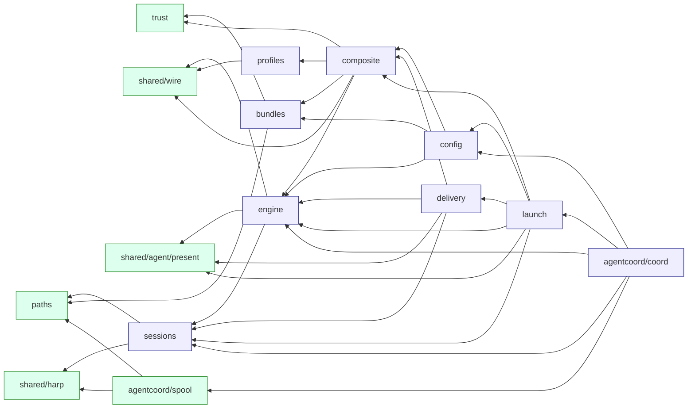
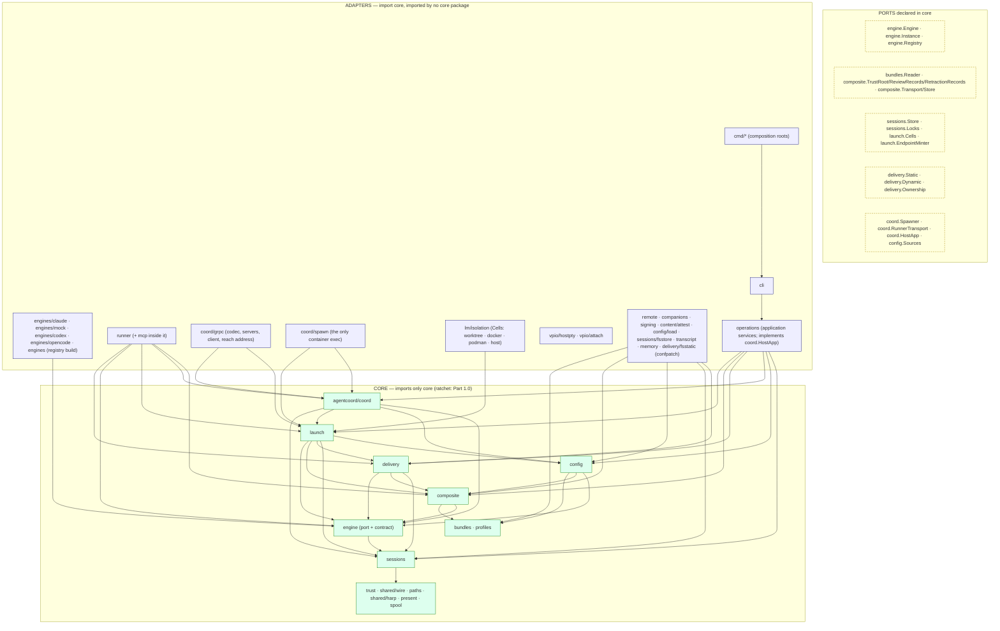
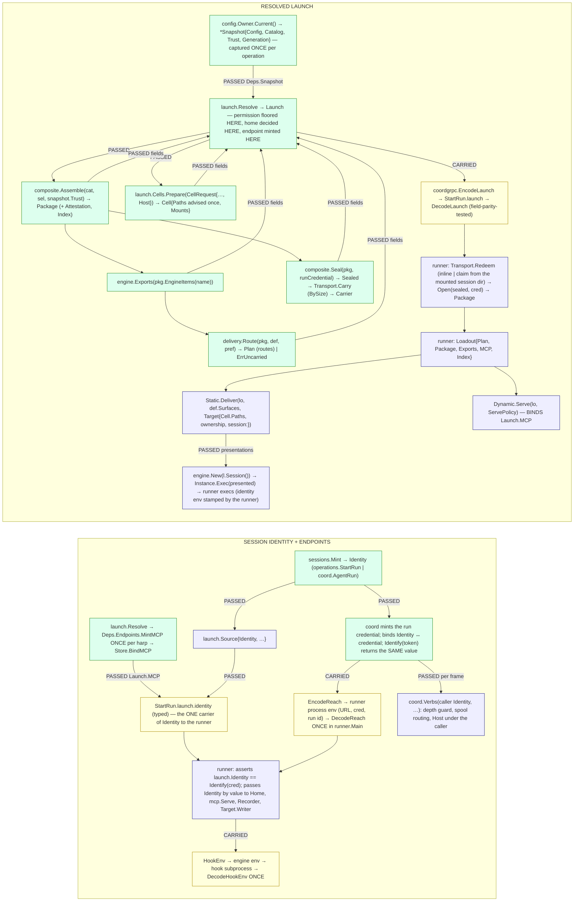

# 25 — Target architecture C (reconciled from A, B and both reviews)

Status: COMPLETE — Parts 0–4 present. Part 1's signatures and Part 4.2's three test bodies are inlined verbatim from a scratch Go module (`/tmp/ctxloom-design-c`, module `ctxloom.example/c`, same package paths as the target) that type-checks with `go vet ./...` including the tests: no import cycle, and the port packages import only the packages Part 1.0 says they import. The repository was read-only throughout.

Inputs, in the brief's order: `00-coordinator-notes.md` (the five post-B rulings), `23-comparison-a-vs-b.md`, `22-target-architecture-b.md` (the base) and `24-adversarial-review-b.md` (R1–R20, its §5 reorder), `20-target-architecture.md` and `21-adversarial-review.md` (A's 33 held claims as a resource; its R1–R25 where B repeats them), `briefs/brief-target-architecture-b.md` (the rulings verbatim), the evidence documents, and the code at `release/0.7` (`go list`, `go doc`, `git grep`, the arch tests, the proto files, the journey features, the task rows `deceased-yoga`, `lunar-boat`, `tacky-padding`, `womanless-quarterly`, `earthly-city`, `varied-tinfoil`). Two mid-course directions from the coordinator are applied: the six refutations to close explicitly (24-* R4, R5, R7, R8, R9, R14) and the human's direction on the wire-size question (Claim Check behind a polymorphic transport port).

Vocabulary is `GLOSSARY.md`'s, verbatim, as B used it: **originator**, **runtime coordinator**, **orchestrating agent**, **executor**, **subagent**, **runner**, **engine**, **loadout**, **surface**, **channel**, **presentation**, **advice**, **root**, **project root**, **session home**, **ctxloom home**. B's §3.3 list of retired terms stands, with one correction: "executor and subagent (both depth 1)" is retired as a sentence — depth is an integer with a configured cap, and the glossary line that says otherwise is a correction to file (24-* R11).

How to read this document against B: where a section says "as B", B's text is adopted unchanged and only the delta is written. Every element that differs from B names the ruling or the refutation that decided it. Part 0 is the one-page provenance; Part 3.2 carries every refutation of both reviews as a row.

---

## Part 0 — What C takes from A, from B, and from neither

| Element | Taken from | Decided by |
|---|---|---|
| The skeleton: hexagon; ONE composite package with the trust gate inside it; ONE launch constructor and ONE launch value; delivery as a PLAN with static and dynamic ports and no fallback arm; materialize = static delivery with the project root as target; the runner as the unit and the container's foreground process; one verbs layer, one coordinator, one inbox; the harp-member table; identity minted once and carried typed; ~16 slices with pure deletions first | A and B agree (23-* §1) | the human's prior: where they agree is probably right; both reviews held the shape |
| Package layout: today's names kept; `composite`, `launch`, `delivery`, `runner`, `companions` added; ten packages retired | B | post-B ruling 5 + 24-* R19's measured cost (≈19 importing packages vs ≈127) |
| Engine as DECLARATION + CONSTRUCTOR: `Definition` is a value; `New(Session) Instance` binds the session; three methods, not six or twelve | neither (B's `Declared[T]` slots and `Facts`, A's `Description` fields, both reshaped) | post-B ruling 2 ("declarative parts; constructor feeds in session specifics") + 24-* R10 |
| The engine-facing projection `engine.Session` (no package, no axes, no credential) and `engine.Items` (what `Exports` decides over) declared IN `engine` | A's `Run` projection, held by 21-*; placed per 24-* R1's smallest change | 24-* R1 (three cycles), R10 |
| Declared `Traits{Root, Channel, LaunchOnly, Persists}` per approach, read by the planner instead of probing | A (held by 21-* A1) | B named the same `Presentations.Or(…, Traits)` in its ledger without a signature |
| The isolation axes as core value types in `launch`; `DirtyTreeHandler` in `launch`; `SignerDecision` core-owned | B's design, re-homed | 24-* R3 |
| Identity ENTERS `Resolve` (`Source.Identity`, required); `Resolve` never mints; `sessions.Mint` is the one mint | B's placement of the mint (operations.StartRun / coord.AgentRun) + 21-* R20 (one mint port) | 24-* R4, 21-* R20 |
| The MCP endpoint minted PER HARP in `Resolve`, bound on the session record, carried as `Launch.MCP`, BOUND by the runner | 21-* R2's smallest change, applied to B | post-B ruling 4, 24-* R2 |
| Runner lifetime = session; one-shot turns are `Turn` frames to the SAME runner; container lifetime = session; idle reaper | neither | the consequence 24-* R2 names as required; the coordinator note's container-reuse row |
| The Package SERIALIZES; ONE codec; both consumers redeem the same form | ruling 3 (overrides 21-* R1) | post-B ruling 3 |
| Seal/Open (HMAC keyed by the run credential) + the Claim Check transport port with Inline and ClaimCheck adapters chosen by size | neither (the human's direction) | 24-* R5 + the coordinator's mid-course message |
| Config lifecycle: `config.Owner` → immutable `Snapshot` generations; `Update`/`Reload` the whole contract; `Snapshot.Trust` per generation; absent layer = shipped default | B, plus 24-* R18 and R15 | 21-* R3 held for B |
| Resume arm on `Source`; `Spawner.Resume(id, rec, rebind)` re-resolves from the journaled `RunRecord.Agent` and the session entry | B's arm + 24-* R8's entry point | 24-* R8, 21-* R7 |
| Depth is an `int` with a configured cap; `IsLeaf(cap)`; the "exactly two" sentence deleted | B, corrected | 24-* R11, 21-* R6 |
| Container mail rides the MOUNTED session dir; the spool stays under `persist/` and its member row is `Mounted` | B, with 24-* R12(iv) | 24-* held A2; 21-* R5's push verb REJECTED (Part 3.2) |
| The go-plugin arm deleted end to end; `StartRun` carries the launch; the runner is spawned directly | B | post-B ruling 1 |
| `operations` as the application-service ring (ADR 0019/0026), one package | B | 24-* held A3; 21-* R22's split is a cohesion preference, not a ruling |
| Reach-back gate: named scenarios per slice, with the delegation journeys reworked FIRST to stand up a real runner, and R3 re-pointed to the row that exists | B + 24-* R6 | 24-* R6, 21-* R11, `tacky-padding`'s ruling |
| ONE ownership record per target with WRITER-TAGGED entries | 24-* R7 / 21-* R4's smallest change | 24-* R7 |
| MCP items always STATIC; the dynamic set is a CLOSED, typed value | A's typed `Dynamic` + 24-* R17 | 24-* R17, 21-* R9 |
| The runner has no config owner: `composite.Index` rides the Launch for the cell-local tools; `Verbs.Host` is the arm for every host-relayed tool; `coord.HostApp` is the port operations implements | 24-* R9's (b) and (a) | 24-* R9, 21-* R12 |
| `HostFacts{Home, CtxloomHome, Binary}` decoded once at the composition root; `ContainerSpec.Binary` is the in-image name | 21-* R8 | not repeated by 24-*; B did not answer it |
| Env carries ONLY the reach-back trio; identity arrives once on `StartRun.launch`; `ReachBack` off the Launch; `OneShot`/`Attestation` not duplicated | 24-* R16, R20 | 24-* R16, R20 |
| `ServePolicy{AllowedOrigins}` as part of the `Dynamic` port (bearer + Origin, 403); the cleartext bridge listener stated as an open ruling | 24-* R14 | `deceased-yoga` |
| Core purity as a RATCHET: the day-one allowlist is the measured import list per core package with the slice each entry leaves in | neither (both designs claimed purity on day one) | 24-* R3, 21-* R10 |
| The native session key lives on `sessions.Entry` only; `RunRecord` references the harp | 21-* R21 | not repeated by 24-*; B's `RunRecord.HarnessSessionID` would have kept two records |
| `earthly-city` implemented as decided (real sessions, hooks ON), not re-asked | B's implementation; the task row's own text | the row says "NOTHING IS OPEN HERE"; 23-* listed it as needing re-rule, which the row contradicts |

What C takes from NEITHER and why, in one paragraph: both designs asserted a pure core on day one and both were refuted by the same measurement, so C states purity as a ratchet with the measured allowlist (Part 1.0). Both designs minted the MCP endpoint in the runner; the ruling puts it in `Resolve`, and that forces a runner that outlives a one-shot turn, which neither design had (Part 1.5). Both designs shipped the package as a Go value across a codec with no proof surviving it; the human's direction supplies the mechanism (Part 1.3). Everything else is B with the reviews applied.

---

## Part 1 — The target, as boundaries and signatures

### 1.0 The acyclicity proof

The review of B found three cycles in the port signatures: `engine ↔ launch` (Exec took a `launch.Launch`), `engine ↔ delivery` (`Facts.Uncarried` keyed by `delivery.Kind`; `Route` took `engine.Facts`), and a rule that forbade engine packages from importing the `composite.Package` their own `Exports` had to accept. C resolves all three by ONE principle: **the shared vocabulary lives in the lowest package that needs it, and every projection the engine consumes is declared in `engine`.** Concretely:

1. `engine.Session` is the engine-facing projection of a launch (A's `Run`, held by 21-*); `launch.Launch.Session()` is its only constructor. `engine` never imports `launch`.
2. `engine.Items` is the engine-facing projection of a package; `composite.Package.EngineItems(name)` produces it. `engine` never imports `composite`, and an engine package's `Exports(items engine.Items)` imports only `engine`.
3. `engine.Kind` is the static surface vocabulary (the kinds an engine can DECLARE); `delivery.DynamicKind` is the closed set only the session endpoint carries. `engine` never imports `delivery`.
4. The isolation axes (`WorkspaceAxis`, `RuntimeAxis`, `Axes`) and `DirtyTreeHandler` are value types in `launch`; `coord` and the `isolation` adapter import `launch`, never the reverse. `ImageConfig` is a `launch` value.
5. `sessions` sits BELOW `engine`: it records the engine as a string (exactly as `Store.AssignHarp(projectDir, backend string)` does today), so `engine.Session` can carry a `sessions.Identity` with no cycle.
6. `composite.SignerDecision` is core-owned; the `allowedsigners` adapter returns it, so `composite` imports no signing package.

The dependency order, leaves first, as `go list -deps` prints it for the scratch module (an acyclic graph or the command fails):

```
spool → trust → bundles → paths → harp → sessions → present → wire → engine → profiles → composite → config → delivery → launch → coord → runner → engines/mock
```

The graph among the core packages (an edge is an import; every edge points toward the left of the order above):



Two facts the graph makes checkable: `engine` imports exactly `sessions`, `present`, `wire` (measured: `go list -f '{{.Imports}}' ./internal/engine`), and the mock engine imports exactly `engine` and `present`. That is the `engines-import-nothing-above-the-port` rule with a ZERO allowlist, satisfiable by construction because nothing an engine implements names a type above `engine`.

**Core purity on day one — the ratchet.** The rule `core-imports-only-core` cannot be green on day one: today's packages under the same names import adapters. C states the allowlist as the MEASURED import list (from `go list` at `release/0.7`) with the slice in which each entry leaves. The mechanism exists: `tests/arch/layering_test.go` already has `layeringRule{name, from, forbid, allowed map[string]string}` and `TestArch_LayeringAllowlist_IsLive`, which deletes an exhausted entry (24-* R13 said the liveness test was missing; it is not — what is missing is the row, added in slice 0). Toolbox packages (`shared/{iox, lockwait, collections, keymatch, textutil, yamlx, realpath, harp}`, `errs`, `refuri`, `schema`, `liveness`, `pidalive`) are permitted everywhere and are not on the list; `clidiag` and `strictness` are on it because they are process globals that become typed values (slice 15).

| Core package | Forbidden imports it holds TODAY (measured) | Leaves in slice |
|---|---|---|
| `trust` | `remote` | 2 (URL normalisation already lives in `refuri`) |
| `sessions` | `shared/upgrade`, `clidiag` | 1 (index migrations deleted), 15 (typed reports) |
| `profiles` | `shared/agent`, `remote` | 2 (`MergeHooksConfig` → `wire`), 5 (the pull-walk reader → `remote`) |
| `bundles` | `content`, `content/attest`, `content/remotetree`, `remote`, `signing`, `shared/admission`, `shared/upgrade`, `clidiag` | 5 (readers become adapters behind `bundles.Reader`; `attest.VerifyBundle` called by them), 1 (`upgrade`), 15 (`clidiag`) |
| `config` | `agents`, `remote`, `signing`, `signing/allowedsigners`, `shared/companionloadout`, `projectroot`, `cliversion`, `content`, `content/remotetree`, `config/layerscope`, `shared/admission`, `clidiag` | 4 (`config/load` split; companions probing → `companions`), 5 (trust ports behind `Sources.TrustPorts`), 15 |
| `agentcoord/coord` | `internal/adapters/coordgrpc/pb` (the proto), `discover`, `mcpschema`, `agents`, `lm/isolation`, `operations`, `transcript`, `shared/agent`, `envswitch`, `clidiag`, `strictness` | 8 (`harnessspec`/`SpawnPlan` → `launch` types; `operations.DirtyTreeHandler` → `launch`), 10 (`grpcserver`, `runchannel`, `runnerlink`, `httpserver`, `consumer`, `controlwire` → `coord/grpc`; `discover`, `mcpschema` with them; `home.go`, `spooldoorbell.go`, `artifacts.go` and the other ~190 `agentcoordpb.` references re-typed on Go values — the whole of `coord` is the allowlist until then), 14a (`transcript`, `enginehost*.go` → `runner`), 6b (`shared/agent` → `engine`) |
| `shared/agent` → the contract half becomes `engine` | `ledger`, `lockwait`, `iox`, `clidiag`, `strictness` | 6b (the split), 12 (`ledger` deleted), 15 |
| `lm/engine` → folded into `engine` | `bundles`, `engineversion`, `transcript/vendorreader` | 6b (`Descriptor` becomes `Definition`; the readers become `engine.TranscriptReader` values the adapter supplies) |
| `paths`, `shared/wire`, `shared/agent/present`, `shared/harp`, `agentcoord/spool` | none | pure today |
| `composite`, `delivery`, `launch` | do not exist | born pure in slices 6, 12, 7; zero allowlist from their first commit |

The rule as a row: `{name: "core-imports-only-core", from: <each core package>, forbid: <every non-core, non-toolbox in-repo path>, allowed: <the table above, one entry per package with the slice number as the reason>}`. The proto package (`internal/adapters/coordgrpc/pb`) is imported by `coord/grpc`, `mcp`, `cli/tui` and (until slice 13) `cli` and `operations`; a sibling rule `proto-only-in-adapters` pins it. `afero.Fs` is permitted in `engine` and `delivery` as the filesystem port; `afero.NewOsFs`/`afero.OsFs` are referenced only under `delivery/fsstatic`, `sessions/fsstore`, `config/load` and `cmd/*` (21-* R10's symbol rule, adopted).

### 1.1 Package map

The three rings are B's; the table is B's with the edits the acyclicity proof forces and the reviews require. Every edge in B's package-map diagram that the review found missing (`ENG → launch`, `ENG → delivery`, `ENG → composite`) is absent here because the types moved, not because the edge was omitted.



Package table: as B's §1.1 table, with these rows changed. (Rows not listed are adopted from B unchanged, including the retired-package list: `lm/backends`, `lm/grpc`, `vpio/goplugin`, `vpio/dockerexec`, `shared/ledger`, `lm/engine`, `mockengine`, `claude`, `agentcoord/discover`, `shared/companionloadout`.)

| Package (ring) | Delta from B |
|---|---|
| `engine` (core, port) | Owns the port as `Engine{Definition; Exports; New}` + `Instance{Exec; Drive}`, the `Definition` value, `Session` and `Items` (the two projections), `Kind`, `Mode`, `PermissionMode`, `Surfaces`/`Presentations`/`Traits`/`Construct`/`Inputs`/`Approach`, `Registry`. Imports `sessions`, `present`, `wire` only. Absorbs what B listed plus `agent.PermissionMode`, `agent.RuntimeAxis` (as `launch.RuntimeAxis`; see `launch`). Must never know: `launch`, `delivery`, `composite`, `config`, isolation, the wire |
| `sessions` (core) | Below `engine`. Owns `Identity`, `Endpoint`, `ResumeRef`, `Seed`, `Mint`, `Entry` (with `NativeSession` — the ONE record of the native key — and `MCP` — the bound endpoint), `Store`, `Locks`, `Layout` (spool under `persist/`), the two env codecs (`EncodeReach`/`DecodeReach` for the runner; `HookEnv`/`DecodeHookEnv` for the engine's hooks), `ReapPolicy`/`Reap`. Records the engine as a string. Must never know: engines, transcript formats, the wire |
| `composite` (core) | As B, plus: `SignerDecision` (core-owned), `Package.EngineItems(name)`, `Index`/`IndexOf` (what the runner's `search_library` and resources enumerate), and the wire form: `Sealed`/`Seal`/`Open` (proof), `Carrier`/`Claim`, the `Transport` port with `Inline`, `ClaimCheck{Store}` and `BySize` (size). `Selection.Preference` carries the binding's delivery preference as written |
| `delivery` (core) | `Plan` carries ROUTES, not bytes; `Loadout{Plan, Package, Exports, MCP, Index}` is what a delivery consumes; `InputsFor` is the one projector; `Target{Root, Ownership, Writer}` with `Validate`; `Ownership` entries are writer-tagged; `Dynamic.Serve(ctx, lo, ServePolicy)` BINDS the endpoint the loadout names; `DynamicKind` closed. Imports `engine`, `composite`, `present`, `sessions` |
| `launch` (core) | Owns the axes and `DirtyTreeHandler` and `ImageConfig` as values; `Source.Identity` required; `Source.Resume`; `Deps{Snapshot, Engines, Cells, Endpoints, Sessions, Transport, Host, Layout, Now}` (no `Trust`, no `Catalog`: both come from the Snapshot; no `Sessions` mint); `HostFacts`; `EndpointMinter` port; `Launch{…, Package composite.Carrier, Exports, Plan, Index, MCP, …}` with no `OneShot`, `Attestation` or `ReachBack` fields; `Launch.Session()` |
| `config` (core) | As B, plus `Snapshot.Trust` per generation and `Sources.TrustPorts`; `Open` treats an absent layer as the shipped default. `Config.Validate(engine.Registry)` is how an engine name in config data is checked |
| `agentcoord/coord` (core) | As B, plus `Verbs.Host`, `HostApp` (the port operations implements), `Options{Snapshots, Host, Spawner, Runners, Sessions, Mapper, DepthCap}`, `RunRecord` without `HarnessSessionID`, `Spawner.Resume(ctx, id, rec, rebind)`, `RunnerTransport.Turn`. The day-one allowlist is the whole package (Part 1.0) |
| `runner` (adapter) | As B, plus: holds a `composite.Transport` (the same `BySize` value the originator carried with) and REDEEMS then OPENS the package; asserts the Launch identity equals the credential's; BINDS `Launch.MCP`; OUTLIVES a one-shot turn (drives `Turn` frames on one `Instance`); absorbs `coord.Home` and `coord/enginehost*.go` (the runner half is an adapter; 24-* R20) |
| `coord/grpc` (adapter) | As B, plus: `MaxRecvMsgSize = composite.DefaultInlineMax + 1 MiB` set explicitly; the `Carrier` codec (a `oneof inline | claim`); `HostRequest` frames; `WireFieldNames()` for the parity test; the bridge listener's transport policy (Part 1.7) |
| `operations` (adapter) | As B, plus: implements `coord.HostApp` (today's `serveCustom` bodies, typed); `DirtyTreeHandler` moves out to `launch`; `DefaultMaterializeBackend` deleted (the registry's default-distribution engine) |
| `mcp` (adapter, inside the runner) | As B, plus the `ServePolicy` middleware (bearer on every request; Origin allowlist, 403 on a miss) as the `delivery.Dynamic` contract; serves `search_library`/resources from `Loadout.Index`; relays `RouteHostRelay` tools as `Verbs.Host` frames |
| `memory`, `transcript`, `cli/tui`, `termui` (adapters) | Named in slice 13 as go-plugin importers (24-* R12 iii; `transcript` was missing from B's list too): `memory` off `pb.ClientFactory`/`RunStart` (a distill is `launch.Resolve` against the `distiller` agent), `transcript` off `pb.SessionSource`/`SessionReader` (its own reader types), `cli/tui` off `pb.WatchEvent`/`SessionEntry` (the coordination proto's `WatchEvent` and the transcript file), `termui` off `pb.WindowSize` (a local `termui.WindowSize` from the pty ioctl) |

Layering rules added to `tests/arch/layering_test.go` (each a row; B's five kept, three added):

- `core-imports-only-core` — with the Part 1.0 allowlist; `TestArch_LayeringAllowlist_IsLive` deletes exhausted entries.
- `engines-import-nothing-above-the-port` — `internal/engines/**` forbids `config`, `bundles`, `composite`, `launch`, `delivery`, `operations`, `coord`, `isolation`, `cli`, `mcp`, `sessions/fsstore`; zero allowlist from day one (now satisfiable: `Exports` takes `engine.Items`).
- `cli-through-operations`, `runner-owns-the-engine`, `one-launch-constructor` — as B, with the evasions 24-* A6 listed closed: the constructor rule also matches `new(launch.Launch)` and `var l launch.Launch` outside `launch`/`coordgrpc` (an `ast` walk, not a `git grep`); the exec rule also matches method values (`e.Exec` as a value) and interface assertions to a narrower type.
- `proto-only-in-adapters` — `internal/adapters/coordgrpc/pb` (the generated package) imported only by `coord/grpc`, `mcp`, `cli/tui`, and (allowlisted until slice 13) `cli`, `operations`; `internal/lm/grpc` by nobody after slice 13.
- `one-mint-one-owner` — `sessions.Mint` called only from `operations.StartRun` and `coord.Coordinator.AgentRun`; `coord.New` and `config.Open` constructed only under `cmd/` (21-* R24's ownership leak: a runner-hosted MCP server cannot reach a mint).
- `no-engine-name-in-core` — `engine.Name` literals appear only under `engines/**`, in config DATA and in the init prompts that write config data (`cli/init*.go` choose a default from `engine.Registry.Names(default-distribution)`, not a literal).

### 1.2 Engines: declarative parts, a constructor fed session specifics

Kept from today (B's finding stands): `engine.Descriptor` is already a per-engine declaration record with `Declared[T]` slots; `agent.Declaration` already keys constructible approaches by kind with a default; `agent.EngineCLI` already declares an argv grammar with a shared parser. What changes is the SHAPE the ruling asks for: the declaration is a VALUE (`Definition`), the engine binds session specifics in a CONSTRUCTOR (`New(Session) Instance`), and the core hands the engine a projection that contains nothing the engine's own row says it must never know — no package, no axes, no coordinator credential, no MCP credential (the MCP file's bytes reach the engine as a delivered surface, not as a field). The interface has three methods, not B's twelve: everything B pulled by method is now a field of `Definition`, which is what "declarative" means in Go.

The port, verbatim from the compiled module:

```go
// Package engine is the plugin port. An engine package exports ONE value that
// satisfies Engine: a DEFINITION (pure data, validated once at registry
// build) plus a CONSTRUCTOR that binds the session specifics into an
// Instance. Core code holds Definitions and Instances and asks them; it never
// names an engine.
//
// Import discipline (the acyclicity property): engine imports present, wire,
// sessions and paths — all leaves — and NOTHING that imports engine. The
// engine-facing projection of a launch (Session) and the engine-facing
// projection of a package (Items) are declared HERE, so launch, delivery and
// composite import engine and engine imports none of them.
package engine

import (
	"context"
	"encoding/json"

	"ctxloom.example/c/internal/core/present"
)

// Name is the registry key and the ONLY spelling of an engine.
type Name string

// Kind is the cross-engine surface category an engine can DECLARE a static
// approach for. Dynamic-only kinds (premise catalog, link mates, findings,
// resources) are delivery's vocabulary, not the engine's.
type Kind int

const (
	Context Kind = iota + 1
	MCP
	Settings
	Commands
	Skills
)

// Mode is how a run is driven: Interactive = a pty; Structured = the engine's
// native structured protocol (Instance.Drive).
type Mode int

const (
	Interactive Mode = iota + 1
	Structured
)

// PermissionMode is the launch-time permission posture (today's
// agent.PermissionMode, moved to the port because every engine maps it).
type PermissionMode int

const (
	PermissionDefault PermissionMode = iota + 1
	PermissionPlan
	PermissionAcceptEdits
	PermissionBypass
)

// Distribution is the engine's shipping policy.
type Distribution int

const (
	DistributionDefault Distribution = iota + 1
	DistributionOnRequest
	DistributionTestOnly
)

// Declared is an optional capability whose ABSENCE is a stated value (kept
// from today's agent.Declared; the zero value is refused by Validate).
type Declared[T any] struct {
	set    bool
	value  T
	reason string
}

func Provide[T any](v T) Declared[T]          { return Declared[T]{set: true, value: v} }
func Absent[T any](reason string) Declared[T] { return Declared[T]{reason: reason} }
func (d Declared[T]) Value() (T, bool)        { return d.value, d.set }
func (d Declared[T]) Reason() string          { return d.reason }
func (d Declared[T]) Decided() bool           { return d.set || d.reason != "" }

// Engine is what every engine package implements. Three methods.
type Engine interface {
	// Definition is the static declaration: pure, session-free, validated
	// once by NewRegistry.
	Definition() Definition
	// Exports maps a package's items to this engine's native export shapes.
	// Pure over its inputs; the per-engine `exports` block an item carries is
	// decoded HERE against Definition.ExportSchema.
	Exports(items Items) (Exports, error)
	// New binds the session specifics. The Instance is what the runner drives;
	// it holds the Session by value and nothing else from ctxloom.
	New(s Session) (Instance, error)
}

// Instance is one engine bound to one session.
type Instance interface {
	// Exec composes the process the runner execs from the presentations
	// delivery produced. It is the only place engine-specific argv is
	// composed; the result parses against Definition.CLI (the anti-drift
	// test). The Env it returns holds ONLY engine-native variables; the runner
	// stamps identity env on top.
	Exec(presented []present.Presentation) (Exec, error)
	// Drive is the engine's NATIVE structured driver, or Absent when the
	// engine can only be driven through a pty (the launch resolver then
	// refuses a Structured Source: fail loud where no native surface exists).
	Drive() Declared[StructuredDriver]
}

// Exec is the exec projection.
type Exec struct {
	Binary      string
	Args        []string
	Env         map[string]string
	WorkDir     string
	Interactive bool
	StdinPrompt []byte
}

// StructuredDriver runs the engine's native structured protocol for one or
// more turns. In one-shot sessions the runner calls Turn once per mailbox
// delivery on the SAME Instance, passing the native key it learned; the
// engine process is recycled inside a runner that outlives the turn.
type StructuredDriver interface {
	Turn(ctx context.Context, ex Exec, in Turn, out chan<- Event) (TurnResult, error)
}

type Turn struct {
	Prompt string
	Resume string // native key; "" on the first turn
}
type Event struct {
	Kind    string
	Payload json.RawMessage
}
type TurnResult struct {
	NativeKey string // the key the NEXT turn resumes by
	Answer    string
}
```

```go
package engine

// Definition is what an engine DECLARES, as one value. Every engine-specific
// fact the core consults is a field here and nowhere else; the core reads
// fields, never branches on Name.
type Definition struct {
	Name         Name
	Distribution Distribution
	Modes        []Mode
	Permissions  PermissionFacts
	// Resume declares the native resume-by-key primitive the coordinator's
	// one-shot turn loop relies on. Absent = conversational only.
	Resume Declared[ResumeSpec]
	// Home declares how the engine's config/credential home relocates into a
	// session home. The core computes the PATH from sessions.Layout; the
	// engine names the variables and the leaf.
	Home Declared[HomeSpec]
	// Container declares how a containerized run is built and authenticated.
	// Absent = a container runtime binding is refused, fail-closed.
	Container Declared[ContainerSpec]
	// Transcripts are the version-scoped readers of the engine's own store.
	Transcripts Declared[[]TranscriptReader]
	// Version is how to ask the binary for its version.
	Version Declared[VersionCommand]
	// Surfaces are the declared static approaches per Kind (today's
	// agent.Declaration with Traits added).
	Surfaces Surfaces
	// CLI declares each mode's argv grammar (today's agent.EngineCLI).
	CLI []CLIGrammar
	// Uncarried names, per Kind the engine has NO structural place for, the
	// reason. It is the ONLY source of "this engine cannot carry X"; Route
	// refuses on it unless the binding accepts the loss.
	Uncarried map[Kind]string
	// ModelAliases translates configured model strings; a declared table, not
	// a function inside a declaration.
	ModelAliases map[string]string
	// ExportSchema is the JSON schema of the per-engine `exports` block a
	// bundle item may carry under Name (published by schemagen; decoded by
	// Exports).
	ExportSchema []byte
	// Hooks decodes the engine's native hook payloads for the hook verbs.
	Hooks Declared[HookCodec]
}

// Validate is the registration gate: Name set, Modes non-empty, every
// Declared slot decided, Uncarried never names a Kind Surfaces declares,
// a CLI grammar per Mode, Structured ∈ Modes only if the engine can Drive
// (checked by the conformance suite against an Instance).
func (d Definition) Validate() error { return nil }

// PermissionFacts is the engine's permission vocabulary as facts. It replaces
// the `backendType == "claude-code"` branch in cli.resolvePermissionMode,
// backends.EnforcesReadOnlyPlan and agent.ResolveDefault's claudeCodeDefault.
type PermissionFacts struct {
	Native            []PermissionMode
	ReadOnlyPlan      bool
	HostDefault       PermissionMode // the DEFAULT posture for an interactive host run when nothing named one
	HostDefaultReason string         // shown to the user; the stopgap's retirement condition lives beside it
}

// ResumeSpec declares native resume by key. KeySource says where the key is
// learned: the structured stream, or the first hook payload.
type ResumeSpec struct{ KeySource KeySource }

type KeySource int

const (
	KeyFromStream KeySource = iota + 1
	KeyFromHook
)

// HomeSpec: the vars that relocate the home, each pointing at Subdir under
// the session home; the credential material to seed, if any.
type HomeSpec struct {
	Vars        []HomeVar
	Credentials Declared[CredentialSeed]
}
type HomeVar struct{ Name, Subdir string }

// CredentialSeed names the files (relative to the REAL home the originator
// decoded once, launch.HostFacts.Home) copied one-way into the session home
// at creation. The engine never calls os.UserHomeDir.
type CredentialSeed struct{ Files []string }

// ContainerSpec (today's agent.EngineContainer): the Containerfile fragment,
// the in-image validate command, the auth story, the transcript store root
// relative to the container home, and the in-image binary name (the engine
// side of launch.Binary; a host path is never handed to a container).
type ContainerSpec struct {
	Install            []byte
	ValidateCommand    string
	Auth               Declared[ContainerAuth]
	TranscriptStoreRel string
	Binary             string
}
type ContainerAuth struct {
	Mounts []string
	Env    []string
}

type TranscriptReader interface {
	Versions() (min, max string)
}

type VersionCommand struct{ Args []string }

// HookCodec decodes a native hook payload into the unified event.
type HookCodec interface {
	Decode(event string, payload []byte) (HookEvent, error)
}
type HookEvent struct {
	Event         string
	NativeSession string
	Transcript    string
}

// CLIGrammar declares one mode's argv grammar; ParseArgv is the SHARED parser
// the anti-drift test runs Exec's output through.
type CLIGrammar struct {
	Mode       Mode
	Binary     string
	Flags      []Flag
	Positional int
}
type Flag struct {
	Name     string
	HasValue bool
}
type Parsed struct{ Flags map[string]string }

func (g CLIGrammar) ParseArgv(args []string) (Parsed, error) { return Parsed{}, nil }

// CLIFor selects the grammar for a mode.
func CLIFor(grammars []CLIGrammar, mode Mode) (CLIGrammar, bool) {
	for _, g := range grammars {
		if g.Mode == mode {
			return g, true
		}
	}
	return CLIGrammar{}, false
}
```

```go
package engine

import (
	"github.com/spf13/afero"

	"ctxloom.example/c/internal/core/present"
	"ctxloom.example/c/internal/core/wire"
)

// Surfaces is the engine's static approach table per Kind. A Kind absent
// from the map is one the engine has no native form for: the planner
// REFUSES it (or records an accepted loss) — it is never a permitted no-op.
type Surfaces map[Kind]Presentations

func (s Surfaces) Default(kind Kind) (string, bool) {
	p, ok := s[kind]
	if !ok {
		return "", false
	}
	return p.def, true
}
func (s Surfaces) Traits(kind Kind, name string) (Traits, bool) {
	p, ok := s[kind]
	if !ok {
		return Traits{}, false
	}
	e, ok := p.entries[name]
	return e.traits, ok
}
func (s Surfaces) Construct(kind Kind, name string, in Inputs) (Approach, bool) {
	p, ok := s[kind]
	if !ok {
		return nil, false
	}
	e, ok := p.entries[name]
	if !ok {
		return nil, false
	}
	return e.construct(in), true
}

// Presentations is one Kind's declared approaches. A name is known IFF a
// Construct is registered under it; Traits are DECLARED beside it so the
// planner reads facts instead of probing a built approach.
type Presentations struct {
	def     string
	entries map[string]entry
}
type entry struct {
	construct Construct
	traits    Traits
}

func Presents(defaultName string, c Construct, t Traits) Presentations {
	return Presentations{def: defaultName, entries: map[string]entry{defaultName: {c, t}}}
}
func (p Presentations) Or(name string, c Construct, t Traits) Presentations {
	m := make(map[string]entry, len(p.entries)+1)
	for k, v := range p.entries {
		m[k] = v
	}
	m[name] = entry{c, t}
	return Presentations{def: p.def, entries: m}
}
func (p Presentations) Names() []string {
	out := make([]string, 0, len(p.entries))
	for k := range p.entries {
		out = append(out, k)
	}
	return out
}

// Traits are declared facts about an approach (from design A, held by its
// review): where it roots, which channel tells the engine, whether it is
// argv-only (no at-rest form) and whether it persists after exit.
type Traits struct {
	Root       RootKind
	Channel    Channel
	LaunchOnly bool
	Persists   bool
}

type RootKind int

const (
	RootSessionHome RootKind = iota + 1
	RootProjectRoot          // reachable ONLY by an approach the binding names (the unsafe-file family)
	RootWorkDir
)

type Channel int

const (
	ChannelFile Channel = iota + 1
	ChannelArgv
	ChannelEnv
)

// Construct builds one Approach for ONE run from that Kind's inputs.
type Construct func(in Inputs) Approach

// Inputs is per-Kind and sealed: a Construct receives exactly its Kind's
// value. The five kinds are a closed set, so the wire codec has five arms.
type Inputs interface{ kind() Kind }

type ContextInputs struct {
	Text []byte
	Hash string
}
type MCPInputs struct{ Servers []wire.MCPServer } // includes the session's own endpoint as a URL entry
type SettingsInputs struct {
	Hooks      []wire.Hook
	DenyTools  []string
	Statusline bool
	Exports    Exports
}
type CommandsInputs struct{ Commands []CommandExport }
type SkillsInputs struct{ Skills []SkillExport }

func (ContextInputs) kind() Kind  { return Context }
func (MCPInputs) kind() Kind      { return MCP }
func (SettingsInputs) kind() Kind { return Settings }
func (CommandsInputs) kind() Kind { return Commands }
func (SkillsInputs) kind() Kind   { return Skills }

// Approach is ONE way one surface's bytes reach an engine. Deliver is called
// ONLY by the static delivery adapter; afero.Fs is the filesystem port.
type Approach interface {
	Present(start present.Start) present.Presentation
	Deliver(start present.Start, fs afero.Fs) (Delivered, error)
}
type Delivered struct {
	Presented present.Presentation
	Wrote     []string
	Undo      func(fs afero.Fs) error
}
```

```go
package engine

import (
	"encoding/json"

	"ctxloom.example/c/internal/core/sessions"
	"ctxloom.example/c/internal/core/present"
	"ctxloom.example/c/internal/core/wire"
)

// Session is the ENGINE-FACING projection of a resolved launch: what the
// constructor is fed. It carries identity, mode, permission, model, the
// advised roots, the prompt and the resume ref. It carries NO package, NO
// isolation axes, NO coordinator credential and NO MCP credential: those
// were consumed by delivery or belong to the runner. launch.Launch.Session()
// is its only constructor.
type Session struct {
	Identity   sessions.Identity
	Mode       Mode
	Permission PermissionMode
	Model      string
	Prompt     string
	Resume     sessions.ResumeRef
	Roots      present.Paths // engine side of ProjectRoot, SessionHome, CtxloomHome
	Home       []HomeBinding // each declared HomeVar resolved to its path under Roots.SessionHome
	WorkDir    string
	Env        map[string]string // engine PASSTHROUGH only (TERM, ANTHROPIC_*); never ctxloom's own vars
}

// HomeBinding is one HomeVar resolved: the engine sets Var to Path.
type HomeBinding struct{ Var, Path string }

// Items is the engine-facing projection of a composite package: the admitted
// items an engine's Exports decides over. composite produces it; engine does
// not import composite.
type Items struct {
	Commands []CommandItem
	Skills   []SkillItem
	Hooks    []wire.Hook
	MCP      []wire.MCPServer
}
type CommandItem struct {
	Ref     string
	Name    string
	Body    []byte
	Exports json.RawMessage // this engine's block, decoded against ExportSchema
}
type SkillItem struct {
	Ref     string
	Name    string
	Files   []SkillFile
	Exports json.RawMessage
}
type SkillFile struct {
	Path   string
	Digest string
	Size   int64
	Bytes  []byte // present after composite.Open; empty inside a Sealed package
}

// Exports is what an engine says about a package: which commands become
// slash commands and how, which skills are enabled, how unified hook events
// route to native ones, and the native tool identifiers a deny list names.
type Exports struct {
	Commands  []CommandExport
	Skills    []SkillExport
	HookEvent map[string]string // unified event → native event; a unified event absent here is uncarried
	DenyTools []string
}
type CommandExport struct {
	Name    string
	Body    []byte
	Enabled bool
	Meta    map[string]string
}
type SkillExport struct {
	Name    string
	Files   []SkillFile
	Enabled bool
}
```

```go
package engine

import "fmt"

// Registry is the set of engines a process was composed with: a VALUE built
// at the composition root (engines.Build()), never a package global.
type Registry struct{ m map[Name]Engine }

func NewRegistry(engines ...Engine) (Registry, error) {
	r := Registry{m: map[Name]Engine{}}
	for _, e := range engines {
		d := e.Definition()
		if err := d.Validate(); err != nil {
			return Registry{}, fmt.Errorf("engine %q: %w", d.Name, err)
		}
		if _, dup := r.m[d.Name]; dup {
			return Registry{}, fmt.Errorf("engine %q registered twice", d.Name)
		}
		r.m[d.Name] = e
	}
	return r, nil
}
func (r Registry) Lookup(name Name) (Engine, bool) { e, ok := r.m[name]; return e, ok }
func (r Registry) Names(keep func(Definition) bool) []Name {
	var out []Name
	for n, e := range r.m {
		if keep == nil || keep(e.Definition()) {
			out = append(out, n)
		}
	}
	return out
}
```


What the core PULLS: `Definition` fields (modes, permissions, resume, home, container, transcripts, version, surfaces, CLI, uncarried, model aliases, export schema, hook codec) and `Exports(items)`. What the core HANDS: one `Session` to `New`, then `[]present.Presentation` to `Exec`. The runner stamps `sessions.HookEnv(identity)` on top of `Exec.Env`; the engine never sees the identity constants.

**Every site that branches on an engine NAME today, and the declaration it reads instead.** The review of B held that no core code branches on a name in B's signatures; the brief asks for the list of today's sites. Measured with `git grep '"claude-code"'` outside `internal/engines/claude` and the tests:

| Today (site) | Reads instead |
|---|---|
| `cli.resolvePermissionMode`'s `backendType == "claude-code" → bypass`; `agent.ResolveDefault(sources, claudeCodeDefault)`; `backends.EnforcesReadOnlyPlan` | `Definition.Permissions{HostDefault, HostDefaultReason, ReadOnlyPlan}`; the floor happens once in `launch.Resolve` |
| `memory/distill.go` `defaultLLMPlugin = "claude-code"`; `memory/compactor.go` `config.Backend = "claude-code"` | gone: a distill is `launch.Resolve` against the `distiller` agent (`earthly-city`); the engine is whatever the binding says |
| `operations/profile_materialize.go` `DefaultMaterializeBackend = "claude-code"` | `engine.Registry.Names(func(d) bool { return d.Distribution == DistributionDefault })` — the project's configured default (`Config.DefaultLLM()`, validated against the registry) or the one default-distribution engine |
| `config/config_types.go` `BackendClaudeCode` | deleted; `Config.Validate(reg)` checks engine names in config data against the registry |
| `cli/init.go`, `init_engine_select.go`, `init_prompts.go`, `config.go`, `manage.go` (`"claude-code"` as the scaffold default) | the init flow lists `Registry.Names(default-distribution)` and writes the chosen name into config DATA; the literal leaves the code |
| `bundles/bundles.go`, `loader_content.go`, `skill.go`, `tree_read.go` (`ClaudeCode` typed export fields; `e.For("claude-code")`) | `Command.Exports map[string][]byte` / `Skill.Exports`, opaque per engine name, decoded by that engine's `Exports` against `Definition.ExportSchema` (ruling item 4 in §3.3: ADR 0020 amendment) |
| `coord/spawner.go` `resumeCapableBackends`, `oneShotSupportedBackends` | `Definition.Resume` (present ⇒ one-shot capable) |
| `lm/isolation`'s four registries (`RegisterCredentialSeed`, `RegisterEngineContainer`, `RegisterInstanceConfigWriter`, `RegisterProvisioningPolicy`) | `Definition.Home`, `Definition.Container` read directly by the `Cells` adapter from `CellRequest.Definition` |
| `backends.InTreeAgentHomeFor(name, workDir, harp)`; `claude.GlobalCommandsDir`/`recordStore` computing paths | `sessions.Layout.SessionHome(harp)` + `HomeSpec.Vars[].Subdir` → `Session.Home []HomeBinding`; an engine computes no path outside a root it was given |
| `cli/hook_*.go` decoding `claude.*` payloads | `Definition.Hooks` codec selected by the `--engine` argv flag the engine's own hook export wrote |
| `operations.VendorReaderAdaptersFor(engine)`, `vendorReaderRegistry` | `Definition.Transcripts` |
| `backends.forceExport*` mutating the shared bundle object | `Engine.Exports(items)` returns a value; the package is immutable |
| `claude.mcpEntries` vs `agent.MCPServerJSONEntry` (two projectors) | `delivery.InputsFor(lo, engine.MCP)` is the one projector; the engine's MCP approach only names the file |
| `ChatRequest.ModelQuirk`, `Facts.ResolveModel func` | `Definition.ModelAliases` (a table) |

Conformance (`engine/conformance`, today's `lm/conformance` extended) is Part 4.2 test A. `engines/mock` conforms first (with its lossy and no-skills variants exercising `Uncarried` and the absent arms), `engines/claude` second; `engines/codex` and `engines/opencode` are the polymorphism proof and are absent at HEAD (B's stated assumption stands: re-adding them is what the proof costs). The registry is built at the composition root by `engines.Build()` (today's `lm/engines`, returning the value instead of populating a global), and `Config.Validate(reg)` is the one place an engine name in config data is checked.

### 1.3 The composite package, and the package on the wire

As B: `bundles.Reader`/`Catalog`/`BundleRead`/`Pipeline`/`Decide` kept; `composite.Trust` is the gate holder; `Ungated()` cannot assemble; `Assemble` is the one constructor from sources; the three verification points are the existing ones. Two changes from the reviews, one from the ruling and the human's direction:

- **`Trust` is per config generation** (24-* R18): `config.Sources.TrustPorts` builds the three ports for a generation and `Snapshot.Trust` holds the `Trust`; `launch.Deps` has no separate `Trust` field. A pull that rewrites the lockfile produces generation N+1 with N+1's retraction records; a spawn after it decides with them.
- **`SignerDecision` is core-owned** (24-* R3): `TrustRoot.TrustedForNamespace` returns `composite.SignerDecision`, so `composite` imports no signing package.
- **The package serializes** (post-B ruling 3) and the wire form answers 24-* R5's two halves — proof and size — with two layers: `Seal`/`Open` and the `Transport` port.

```go
// Package composite: sources → verification → composition → ONE immutable
// Package; the trust gate holder; the SEALED wire form. It must never know
// which engine (it produces engine.Items, the engine-facing projection),
// where files land, or the session. Imports: bundles, profiles, trust, wire,
// engine — none of which import composite.
package composite

import (
	"errors"
	"time"

	"golang.org/x/crypto/ssh"

	"ctxloom.example/c/internal/core/bundles"
	"ctxloom.example/c/internal/core/trust"
)

// Trust is the gate holder. It is built PER CONFIG GENERATION by
// config.Sources (Snapshot.Trust), so retraction records and the lockfile it
// read cannot outlive the generation they came from. It is never a field of
// config.Config and has NO permissive zero value.
type Trust struct {
	root       TrustRoot
	records    ReviewRecords
	retraction RetractionRecords
	now        func() time.Time
	ungated    bool
	withheld   []string
}

// SignerDecision is core-owned (the allowedsigners adapter returns it), so
// composite imports no signing package.
type SignerDecision struct {
	Trusted   bool
	Principal string
	Reason    string
}

// The three PORTS the gate decides with (signing/allowedsigners,
// signing/countersign, remote's lockfile implement them).
type TrustRoot interface {
	TrustedForNamespace(key ssh.PublicKey, ns string, now time.Time) SignerDecision
}
type ReviewRecords interface {
	Rejected(ref trust.Ref, payload []byte) bool
	Approved(ref trust.Ref, payload []byte, form bundles.ContentForm) bool
}
type RetractionRecords interface {
	Retracted(ref trust.Ref) (retracted bool, reason string)
}

func NewTrust(root TrustRoot, records ReviewRecords, retraction RetractionRecords, now func() time.Time) (Trust, error) {
	if root == nil || records == nil || retraction == nil {
		return Trust{}, errors.New("composite: every trust port is required")
	}
	return Trust{root: root, records: records, retraction: retraction, now: now}, nil
}

// Ungated is the ONLY way to obtain a gate that admits everything: for
// listing and review surfaces, which must show pending content to a human.
// Assemble refuses it (ErrUngatedAssembly), so it can never reach delivery.
func Ungated() Trust { return Trust{ungated: true} }

func (t Trust) Authorizer() bundles.Authorizer { return authorizer{t} }
func (t Trust) Withheld() []string             { return append([]string(nil), t.withheld...) }

type authorizer struct{ t Trust }

func (a authorizer) Decide(ref trust.Ref, payload []byte, form bundles.ContentForm) trust.Decision {
	return trust.Decision{}
}
```

```go
package composite

import (
	"context"
	"errors"

	"ctxloom.example/c/internal/core/bundles"
	"ctxloom.example/c/internal/engine"
	"ctxloom.example/c/internal/core/profiles"
	"ctxloom.example/c/internal/core/wire"
	"ctxloom.example/c/internal/core/trust"
)

var (
	ErrUngatedAssembly = errors.New("composite: a package cannot be assembled over an ungated trust")
	ErrItemWithheld    = errors.New("composite: an item the profile set requires was withheld")
)

// Selection is what a profile set asks for, resolved and canonicalised. Pure.
type Selection struct {
	Fragments  []trust.Ref
	Commands   []trust.BundleRef
	Skills     []trust.BundleRef
	Hooks      []trust.BundleRef
	MCP        []trust.BundleRef
	Exclusions map[string]struct{}
	Links      []LinkGrant
	// Preference is the binding's delivery preference as WRITTEN (approach
	// name per kind, accepted losses); delivery validates it against the
	// engine's Definition. composite carries it, never interprets it.
	Preference map[string]string
}
type LinkGrant struct{ Server string }

func Select(profiles []profiles.ResolvedProfile, cat bundles.Catalog) (Selection, error) {
	return Selection{}, nil
}

// Package is the composed loadout SOURCE: every admitted item, the assembled
// context, the premised fragments held back for the catalog, the link groups,
// and the attestation. Immutable; only Assemble and Open construct one.
type Package struct {
	Context     Context
	Fragments   []Item[Fragment]
	Premised    []Item[Fragment]
	Commands    []Item[Command]
	Skills      []Item[Skill]
	Hooks       []Item[wire.Hook]
	MCP         []Item[wire.MCPServer]
	Links       []LinkGroup
	DenyTools   []string
	Statusline  bool
	attestation Attestation
}

type Context struct {
	Text []byte
	Hash string
}
type Fragment struct {
	Name    string
	Body    []byte
	Premise string // non-empty ⇒ conditional; offered through the premise catalog
}
type Command struct {
	Name    string
	Body    []byte
	Exports map[string][]byte // per engine Name, opaque; decoded by that engine's Exports
}
type Skill struct {
	Name    string
	Files   []engine.SkillFile
	Exports map[string][]byte
}
type LinkGroup struct {
	Server  string
	Members []trust.Ref
}

// Item pairs an admitted value with the read facts it was admitted on.
type Item[T any] struct {
	Value    T
	Ref      trust.Ref
	Form     bundles.ContentForm
	Decision trust.Decision
	Signer   string
}

// Attestation is the proof a Package was verified: one row per delivered
// item plus the withheld tally, and the digest of the canonical package
// bytes it attests. It survives the codec because Open re-verifies it.
type Attestation struct {
	Items    []ItemAttestation
	Withheld []string
	GateID   string
	Digest   [32]byte
}
type ItemAttestation struct {
	Ref      trust.Ref
	Decision trust.Decision
	Hash     string
}

func (p Package) Attestation() Attestation { return p.attestation }

// EngineItems is the engine-facing projection an Engine.Exports decides
// over. It is how composite hands content to an engine without an engine
// package ever importing composite.
func (p Package) EngineItems(name engine.Name) engine.Items { return engine.Items{} }

// Index is what the runner's search_library and the ctxloom:// resources
// enumerate: refs, kinds and descriptions of everything in the CATALOG the
// package was assembled from — not bytes, and not only the selection. It
// rides the Launch so the runner needs no config owner.
type Index struct{ Entries []IndexEntry }
type IndexEntry struct {
	Ref         trust.Ref
	Kind        string
	Description string
	Premise     string
}

func IndexOf(cat bundles.Catalog) Index { return Index{} }

type Options struct {
	PreferDistilled bool
	DropWithheld    bool
	Builtin         []Fragment  // unconditional injections, already read
	OwnHooks        []wire.Hook // ctxloom's own hooks for this run, engine-neutral (Event set)
}

// Assemble is the ONE constructor from sources. It reads nothing: cat is
// resolved, profiles loaded, trust built. Refuses an ungated trust and a
// withheld required item (unless Options.DropWithheld, recorded in the
// attestation).
func Assemble(ctx context.Context, cat bundles.Catalog, sel Selection, tr Trust, opts Options) (Package, error) {
	if tr.ungated {
		return Package{}, ErrUngatedAssembly
	}
	return Package{}, nil
}
```

```go
package composite

import (
	"context"
	"errors"
)

// ---- The wire form: seal, then carry ----
//
// ONE codec, consumed identically by the runner (over StartRun) and by the
// local launcher (in-process): both hold a Transport and call Redeem, then
// Open. Two layers, each with one job:
//
//   Seal/Open   — PROOF. Sealed holds the canonical bytes, their digest, the
//                 attestation, and a MAC (HMAC-SHA256 over Digest ‖ canonical
//                 Attestation) keyed by the RUN CREDENTIAL. The coordinator
//                 minted that credential and the runner received it once in
//                 its process env; nothing else can produce a Sealed that
//                 Open accepts for this run. A decoded Package therefore
//                 proves the originator's gate decided it, not that a codec
//                 ran (24-* R5).
//
//   Transport   — SIZE. The CLAIM CHECK pattern: a Carrier rides the wire and
//                 is exactly one of INLINE (the sealed bytes themselves) or a
//                 CLAIM (digest + location; the bytes were stowed where both
//                 sides can reach them). The choice is made by SIZE at
//                 Resolve, inside the transport, and is invisible to the
//                 consumer: Redeem dispatches on the carrier's shape and no
//                 arm branches on the runtime axis. The MAC covers the digest
//                 the claim names, so a claim is verified exactly like the
//                 bytes: redeemed bytes must hash to the sealed digest.
//
// The frame is bounded explicitly either way: InlineMax is the inline
// ceiling and the gRPC server sets MaxRecvMsgSize to InlineMax plus frame
// headroom (today nothing sets it; the 4 MiB default applies and
// relayCapBytes already knows that ceiling).

type Sealed struct {
	Bytes       []byte // canonical encoding of the Package, skill file bytes included
	Digest      [32]byte
	Attestation Attestation
	MAC         []byte
}
type SealKey []byte

var (
	ErrSealForged  = errors.New("composite: sealed package MAC or digest does not verify")
	ErrClaimStale  = errors.New("composite: the claimed bytes are not at the stated location")
	ErrClaimDigest = errors.New("composite: redeemed bytes do not hash to the sealed digest")
)

func Seal(pkg Package, key SealKey) (Sealed, error) { return Sealed{Attestation: pkg.attestation}, nil }

// Open is the ONLY other constructor of a Package. It verifies the MAC and
// the digest and returns a Package whose attestation is the sealed one.
func Open(s Sealed, key SealKey) (Package, error) { return Package{attestation: s.Attestation}, nil }

// Carrier is what rides StartRun.launch. Exactly one of Inline or Claim is
// set; Digest, Attestation and MAC always are.
type Carrier struct {
	Inline      []byte
	Claim       *Claim
	Digest      [32]byte
	Attestation Attestation
	MAC         []byte
}

// Claim is the check: where the sealed bytes were stowed. Location is a
// store-relative name (the digest, by construction), never a host path.
type Claim struct {
	Digest   [32]byte
	Location string
	Size     int64
}

// Transport is the package-transport PORT. Carry prepares the wire form of a
// sealed package; Redeem recovers it. Consumers hold one Transport and never
// see which adapter answered.
type Transport interface {
	Carry(ctx context.Context, s Sealed) (Carrier, error)
	Redeem(ctx context.Context, c Carrier) (Sealed, error)
}

// Inline is adapter 1: the bytes ride the frame. Carry refuses above Max.
type Inline struct{ Max int }

var ErrTooLargeForInline = errors.New("composite: sealed package exceeds the inline ceiling")

func (t Inline) Carry(ctx context.Context, s Sealed) (Carrier, error) {
	if t.Max > 0 && len(s.Bytes) > t.Max {
		return Carrier{}, ErrTooLargeForInline
	}
	return Carrier{Inline: s.Bytes, Digest: s.Digest, Attestation: s.Attestation, MAC: s.MAC}, nil
}
func (t Inline) Redeem(ctx context.Context, c Carrier) (Sealed, error) {
	if c.Inline == nil {
		return Sealed{}, ErrClaimStale
	}
	return Sealed{Bytes: c.Inline, Digest: c.Digest, Attestation: c.Attestation, MAC: c.MAC}, nil
}

// ClaimCheck is adapter 2: the bytes are stowed in a Store both sides can
// reach and a Claim rides the frame. The Store is content-addressed (the
// location IS the digest), so Redeem verifies what it fetched against the
// sealed digest before returning it.
type ClaimCheck struct{ Store Store }

// Store is the stow/fetch port under ClaimCheck. Two implementations exist
// today in shape: the SESSION DIR (<harp>/persist/package/<digest>: on the
// host's filesystem for a host runner, MOUNTED into a container by the
// session-state mounts) and the coordinator's content-addressed ARTIFACT
// store (~/.ctxloom/coord/<project>/artifacts/<sha256>, fetched by a
// container runner over the artifact download channel). The session dir is
// the default: both consumers read it directly, no channel round trip, and
// it is reaped with the session.
type Store interface {
	Put(ctx context.Context, digest [32]byte, bytes []byte) (location string, err error)
	Get(ctx context.Context, location string) ([]byte, error)
}

func (t ClaimCheck) Carry(ctx context.Context, s Sealed) (Carrier, error) {
	loc, err := t.Store.Put(ctx, s.Digest, s.Bytes)
	if err != nil {
		return Carrier{}, err
	}
	return Carrier{Claim: &Claim{Digest: s.Digest, Location: loc, Size: int64(len(s.Bytes))}, Digest: s.Digest, Attestation: s.Attestation, MAC: s.MAC}, nil
}
func (t ClaimCheck) Redeem(ctx context.Context, c Carrier) (Sealed, error) {
	if c.Claim == nil {
		return Sealed{}, ErrClaimStale
	}
	b, err := t.Store.Get(ctx, c.Claim.Location)
	if err != nil {
		return Sealed{}, err
	}
	return Sealed{Bytes: b, Digest: c.Digest, Attestation: c.Attestation, MAC: c.MAC}, nil
}

// BySize is the composite transport every composition root builds: Carry
// picks Inline under InlineMax and ClaimCheck above it; Redeem dispatches on
// the carrier's shape. This is the value Deps.Transport and runner.Deps.
// Transport hold, so the choice is made once and seen nowhere.
type BySize struct {
	InlineMax int
	Inline    Inline
	Claim     ClaimCheck
}

// DefaultInlineMax leaves headroom under the gRPC frame ceiling the server
// is configured with (MaxRecvMsgSize = DefaultInlineMax + 1 MiB).
const DefaultInlineMax = 2 << 20

func (t BySize) Carry(ctx context.Context, s Sealed) (Carrier, error) {
	if len(s.Bytes) <= t.InlineMax {
		return t.Inline.Carry(ctx, s)
	}
	return t.Claim.Carry(ctx, s)
}
func (t BySize) Redeem(ctx context.Context, c Carrier) (Sealed, error) {
	if c.Claim != nil {
		return t.Claim.Redeem(ctx, c)
	}
	return t.Inline.Redeem(ctx, c)
}
```


**How a package proves it was verified, now that it crosses a codec.** In-process, as B: it exists, and only `Assemble` makes one. Across the wire, the proof is the `Sealed.MAC`: an HMAC-SHA256 over the canonical digest and the canonical attestation, keyed by the RUN CREDENTIAL that the runtime coordinator minted for this run and handed to the runner once in its process env. `Open` recomputes it; a `Sealed` that any other process produced fails `ErrSealForged`. The local launcher (the originator's own run) holds the same credential — `coord.OwnerRunnerEnv` already mints an owner credential — and runs the same `Redeem` → `Open`. So there is one codec, one proof, two consumers, and no `composite` constructor an adapter can call to make an unverified `Package` (the codec produces a `Carrier`, never a `Package`).

**Size: the Claim Check pattern behind a polymorphic port.** `Transport` is the port; `Inline` and `ClaimCheck` are its two adapters; `BySize` is the value every composition root builds and both `launch.Deps.Transport` and `runner.Deps.Transport` hold. `Carry` runs in `Resolve` (originator) and picks by size; `Redeem` runs in the consumer and dispatches on the carrier's shape. No arm anywhere branches on the runtime axis: a container runner and a host runner hold the same `BySize` and cannot tell which adapter answered. The `Store` behind `ClaimCheck` is content-addressed (location = digest), and C names the SESSION DIR (`<harp>/persist/package/<digest>`) as its default implementation: for a host runner it is the same filesystem; for a container runner it is inside the session-state mount `isolation.Container.sessionStateMounts` already binds (`<harp>/persist`), which 24-* held as the carrier of container mail. The coordinator's artifact store (`coord/artifactstore.go`, `~/.ctxloom/coord/<project>/artifacts/<sha256>`, already sha256-verified on write) is the second `Store` in shape; it would cost a download-channel round trip for container runners, which is why it is not the default. Why not simply raise the gRPC limit: the frame would still be unbounded in principle, blobs would not deduplicate across turns and resumes, and the ceiling would be a number someone has to keep true. The frame IS bounded explicitly either way: `Inline.Max = DefaultInlineMax` and `coord/grpc` sets `MaxRecvMsgSize` to it plus headroom (today nothing sets it; `relayCapBytes` in `runchannel.go` already lives under the 4 MiB default).

The attestation survives because `Carrier.Attestation` and `Carrier.Digest` ride with either arm and the MAC covers both; a claim's `Digest` must equal the sealed digest, and the redeemed bytes must hash to it (`ErrClaimDigest`). Part 4.2 test C (`TestLaunch_Carrier_InlineAndClaimRedeemToTheSamePackage`) is the executable statement.

Two other B uncertainties close here: `composite.Index` (refs, kinds, descriptions of the whole catalog the package was assembled from) rides the Launch so the runner serves `search_library` and the `ctxloom://` resources with no config owner (24-* R9 option b); and `Selection.Preference` carries the binding's delivery preference as written, so `delivery.Route` validates it against the engine's `Definition` at resolve — and `agent set` validates it when the binding is written (21-* A8's hidden option), so a run never sees an unknown name.

`varied-tinfoil` constraint carried: `composite` does not change any preimage. `bundles.*.ContentPayload` stays the one preimage per kind and the `preimage_wire_parity` test is slice 6's gate, so no second re-review window opens after pre001.

### 1.4 Polymorphic delivery

As B: `Route` has no fallback arm; `Static` and `Dynamic` are the two ports; materialize is the same static delivery against the project root; uninstall is the empty plan. Four changes from the reviews:

- **The plan carries ROUTES, not bytes** (the brief's "every value crosses once"): a `StaticItem` is `{Kind, Approach, Traits}`; the bytes ride once, in the sealed package; `InputsFor(lo, kind)` builds the per-kind inputs at delivery time from the OPENED package, in the runner and in the local launcher alike. B's `StaticItem.Inputs` and `DynamicItem.Payload any` (24-* R17) are gone with it, so the wire codec for `Plan` is trivial and the dynamic set is a closed, typed value (`DynamicKind`; the items are read from the package).
- **MCP is always static** (24-* R17, 21-* R9): an MCP item lands through a declared approach over a file or argv channel; the dynamic kinds are not routed at all — every engine that speaks MCP receives them on the session endpoint because they have no native file (a declaration, not a fallback).
- **One ownership record per target, writer-tagged** (24-* R7, 21-* R4): `Target.Writer` is `session:<harp>` or `project`; `Ownership.Apply(…, writer, build)` records entries under the writer; reconcile-to-empty removes only that writer's. `confpatch.Store` implements it with its record keyed by target and its entries tagged (today a `Store` is "ONE writer's memory", which is exactly the collision the review found).
- **`Target.Validate`** refuses the zero value (21-* R17): `Deliver` never writes under `""`.

```go
// Package delivery plans which package items go STATIC and which DYNAMIC for
// an engine, and declares the two delivery ports and the ONE ownership
// record. It must never know engine argv, transport, or config. Imports:
// engine, composite, present, wire, sessions — none imports delivery.
package delivery

import (
	"context"
	"errors"

	"github.com/spf13/afero"

	"ctxloom.example/c/internal/composite"
	"ctxloom.example/c/internal/engine"
	"ctxloom.example/c/internal/core/sessions"
	"ctxloom.example/c/internal/core/present"
)

// DynamicKind is a kind only the session's MCP endpoint can carry. Closed.
type DynamicKind int

const (
	PremiseCatalog DynamicKind = iota + 1
	LinkMates
	StartupFindings
	Resources
)

// Preference is the binding's delivery preference, validated when the
// binding is written (agent set) so a run never sees an unknown name.
type Preference struct {
	Approach   map[engine.Kind]string
	AcceptLoss map[engine.Kind]bool
}

// Plan is the loadout as ROUTES: per static Kind the ONE approach that will
// be used; the dynamic set; the accepted losses. It carries no bytes — the
// bytes ride once, in the sealed Package; Inputs are built at delivery time
// from the opened Package. Computed once per launch in Resolve, pure,
// carried on the Launch.
type Plan struct {
	Static []StaticItem
	Losses []Loss
}
type StaticItem struct {
	Kind     engine.Kind
	Approach string
	Traits   engine.Traits
}
type Loss struct {
	Kind   engine.Kind
	Reason string
}

var (
	ErrUnknownApproach  = errors.New("delivery: the binding names an approach the engine does not declare")
	ErrUncarried        = errors.New("delivery: the engine has no surface for this kind and the binding did not accept the loss")
	ErrUnrootable       = errors.New("delivery: the approach cannot root under this target")
	ErrNoRoot           = errors.New("delivery: a target needs a session home or an explicit project root")
	ErrLaunchOnlyAtRest = errors.New("delivery: an argv-only approach has no at-rest form")
)

// Route decides the plan. THE RULE, per Kind the package has items for:
//  1. the binding named an approach → STATIC by that name (unknown: error);
//  2. else the engine declares the Kind → STATIC by its default;
//  3. else UNCARRIED: ErrUncarried{Kind, Reason} unless AcceptLoss names the
//     Kind, in which case a Loss is recorded.
//
// There is no arm 4. MCP items are ALWAYS static (a file or argv channel the
// engine declares); the dynamic kinds are not routed — every engine that
// speaks MCP receives them on the session endpoint (they have no native
// file), which is a declaration, not a fallback.
func Route(pkg composite.Package, def engine.Definition, pref Preference) (Plan, error) {
	return Plan{}, nil
}

// Loadout is what a delivery consumes: the Plan, the OPENED Package, the
// engine's Exports and the session's MCP endpoint. The runner builds it from
// the Launch after composite.Open; the local launcher builds the same value.
type Loadout struct {
	Plan    Plan
	Package composite.Package
	Exports engine.Exports
	MCP     sessions.Endpoint
	Index   composite.Index
}

// InputsFor builds the per-Kind inputs from the loadout. The ONE projector
// of package items into engine inputs (claude.mcpEntries and
// agent.MCPServerJSONEntry collapse here).
func InputsFor(lo Loadout, kind engine.Kind) (engine.Inputs, error) { return nil, nil }

// Writer tags every ownership entry: a session's harp or the project's
// at-rest materialize. One record per TARGET regardless of writer;
// reconcile-to-empty removes only THIS writer's entries.
type Writer string

func SessionWriter(harp string) Writer { return Writer("session:" + harp) }

const ProjectWriter Writer = "project"

// Target is where a plan lands and who owns what it writes.
type Target struct {
	Root      present.Start
	Ownership Ownership
	Writer    Writer
}

// Validate refuses the zero value: a target needs a root with a session home
// or a project root, an ownership record, and a writer.
func (t Target) Validate() error {
	p := t.Root.Paths()
	if (p.SessionHome.Host == "" && p.ProjectRoot.Host == "") || t.Ownership == nil || t.Writer == "" {
		return ErrNoRoot
	}
	return nil
}

// Static delivers the static items under ONE root with ONE ownership record.
// The same implementation serves a session (root = session home, writer =
// the harp) and a human materialize (root = project root, writer = project);
// they differ only in the Target. A Plan with no Static items is UNINSTALL
// for that writer. Deliver validates the Target (ErrNoRoot) — the zero value
// is refused, not written under "".
type Static interface {
	Deliver(ctx context.Context, lo Loadout, surfaces engine.Surfaces, target Target) (Delivered, error)
}
type Delivered struct {
	Presented []present.Presentation
	Wrote     []engine.Kind
	Undo      func(ctx context.Context) error
}

// Ownership is the ONE ownership mechanism: a record per target file naming
// the entries each writer owns in it. confpatch implements it; the CLAUDE.md
// markers and the ledger sidecar are deleted.
type Ownership interface {
	Apply(ctx context.Context, fs afero.Fs, target string, writer Writer, build Build) (Result, error)
	Owned(target string, writer Writer) ([]string, error)
}
type Build func(current []byte) (desired []byte, entries []string, err error)
type Result struct{ Changed bool }

// Dynamic serves the dynamic kinds on the session's ONE MCP endpoint. The
// implementation lives in internal/adapters/mcp inside the runner. It BINDS the
// endpoint the Launch carries; it never mints one. ServePolicy is the
// deceased-yoga contract: bearer on every request, Origin allowlist with 403
// on a miss — part of the port, not an option.
type Dynamic interface {
	Serve(ctx context.Context, lo Loadout, policy ServePolicy) (Served, error)
}
type ServePolicy struct {
	AllowedOrigins []string // loopback origins only; empty is refused
}
type Served struct {
	Kinds []DynamicKind
	Close func() error
}

var ErrEndpointUnavailable = errors.New("delivery: the session endpoint cannot be bound at its recorded address")
```


The `Dynamic` port's `ServePolicy` is the `deceased-yoga` AUTH ruling made part of the contract (24-* R14): bearer on every request; the Origin header validated against a loopback allowlist and refused with 403 — "not optional and not defence-in-depth". An empty allowlist is refused, so no caller can serve without one. The runner passes the loopback origin of the endpoint it binds.

Which items go which way, per engine declaration: as B, with `Definition.Uncarried` the ONLY source of "this engine cannot carry X" and `Preference.AcceptLoss` the only source of "and this binding accepts that". The session home as the root: as B — `RootProjectRoot` is reachable only through an approach the binding names (the `unsafe-file` family), the shared engine home is not a root the planner can name, and `--degraded` degrades the runtime axis to host and nothing else. `LaunchFormPresent` becomes a read-only `Ownership` (24-* held); `LaunchFormMinimal` does not survive: internal one-shots are real sessions (`earthly-city`, decided).

### 1.5 The resolved launch, the runner, and the one arm

As B: ONE type, ONE constructor, TWO launch modes that are one launch (RAW on the host; IN-CONTAINER = the same raw launch executed by the same `ctxloom runner` as the container's foreground process); the six `pb.RunStart{` literals and the seven carrier structs collapse into `launch.Source` in and `launch.Launch` out; the go-plugin arm is deleted. Changes from the reviews and rulings:

- **Identity enters** (24-* R4): `Source.Identity` is required; `Resolve` refuses a zero value with `ErrNoIdentity` and never mints. `sessions.Mint` is called by `operations.StartRun` (depth 0) and by `coord.Coordinator.AgentRun` (children, before `run.enqueued` is journaled), exactly where B's prose put it; `Deps.Sessions` is the store for BINDING the endpoint and reading the entry on resume, not for minting.
- **The MCP endpoint is minted here, per harp** (post-B ruling 4; 24-* R2; 21-* R2): `Deps.Endpoints.MintMCP(ctx, id, axes)` runs ONCE per harp; the result is bound on the session entry (`Store.BindMCP`) and carried as `Launch.MCP`; a `Source.Resume` of the same harp REUSES the bound endpoint unless `RebindEndpoint` is set. The runner BINDS the address it is given and refuses with `delivery.ErrEndpointUnavailable` if it cannot; the coordinator's recovery arm answers that one refusal by re-resolving with `RebindEndpoint: true` (a rebind re-delivers the static plan, which a resume does anyway). Inside a container the loopback address is private, so a rebind is never needed there; on the host it is needed only when another process took the port between two incarnations of the same session.
- **The package is sealed and carried** (Part 1.3): `Launch.Package` is a `composite.Carrier`; `Exports`, `Plan` and `Index` ride beside it, typed.
- **Host facts cross once** (21-* R8): `Deps.Host` is decoded at the composition root (`os.UserHomeDir` and the binary path appear only in `cmd/*` and the arch gate lists them); `CellRequest.Host` hands it to the cells adapter for credential seeding and mounts; `ContainerSpec.Binary` is the in-image name. Nothing in a container is told a host path.
- **No duplicated fields** (24-* R20): `OneShot` is `Identity.OneShot`; the attestation is inside the carrier; `ReachBack` is not on the Launch (24-* R16: the runner already holds it from its env, and the credential never rides a journaled message).
- **The resume arm is an entry point** (24-* R8, 21-* R7): `Source.Resume{Ref, RebindEndpoint}`; `coord/spawn.Spawner.Resume(ctx, id, rec, rebind)` re-resolves from `RunRecord.Agent` (journaled today, kept) and the session entry, so a coordinator that restarted holds no Launch and needs none.

```go
// Package launch: Source → Launch, the one constructor of the resolved launch
// and its guarantees. It owns the isolation-axis vocabulary (value types the
// cells adapter implements against) and the engine-facing projection's
// constructor. Must never know cobra, gRPC, docker, or files. Imports:
// engine, composite, delivery, sessions, config, present.
package launch

import (
	"context"
	"errors"
	"time"

	"ctxloom.example/c/internal/composite"
	"ctxloom.example/c/internal/core/config"
	"ctxloom.example/c/internal/delivery"
	"ctxloom.example/c/internal/engine"
	"ctxloom.example/c/internal/core/sessions"
	"ctxloom.example/c/internal/core/present"
)

// The two isolation axes, as core value types (today's isolation.Axes /
// WorkspaceAxis and agent.RuntimeAxis). Independent; an ownership mismatch is
// fatal, never a substitution; --degraded falls back to the HOST only.
type WorkspaceAxis string
type RuntimeAxis string

const (
	WorkspaceNone     WorkspaceAxis = "none"
	WorkspaceWorktree WorkspaceAxis = "worktree"
	RuntimeHost       RuntimeAxis   = "host"
	RuntimeRootless   RuntimeAxis   = "container-rootless"
	RuntimeRootful    RuntimeAxis   = "container-rootful"
)

type Axes struct {
	Workspace WorkspaceAxis
	Runtime   RuntimeAxis
}

// DirtyTreeHandler is what a worktree spawn does when the parent tree is
// dirty (moved here from operations so coord and launch share the value).
type DirtyTreeHandler int

// Source is what a caller KNOWS when it asks for a launch — never more. The
// five sources of the audit are five Source values through one Resolve.
type Source struct {
	Identity   sessions.Identity // REQUIRED: minted by the caller (operations.StartRun, coord.AgentRun); Resolve refuses a zero value
	Agent      string
	Profiles   []string
	Label      string
	Mode       engine.Mode
	Prompt     string
	WorkDir    string
	Workspace  WorkspaceAxis
	DirtyTree  DirtyTreeHandler
	Permission engine.PermissionMode // the flag; zero = not requested
	Resume     Resume
	Degraded   bool
}

// Resume is the resume arm. A non-zero Ref makes Resolve REUSE the session:
// the same harp, the recorded MCP endpoint (unless RebindEndpoint), the
// native key. It is how the coordinator's recovery re-resolves a journaled
// run after a restart (Source{Agent: rec.Agent, Identity: id, Resume: …}).
type Resume struct {
	Ref            sessions.ResumeRef
	RebindEndpoint bool
}

// HostFacts are the originator's host-side facts, decoded ONCE at the
// composition root and passed down: the real home (credential seeding), the
// ctxloom home, and the ctxloom binary. A container never receives a host
// path as if universal: ContainerSpec.Binary is the in-image name.
type HostFacts struct {
	Home        string
	CtxloomHome string
	Binary      string
}

// Deps are the ports Resolve needs; every one built once at the composition
// root. Trust and the catalog come from the ONE Snapshot the operation
// captured. Resolve reads no file and no env.
type Deps struct {
	Snapshot  *config.Snapshot
	Engines   engine.Registry
	Cells     Cells
	Endpoints EndpointMinter
	Sessions  sessions.Store
	Transport composite.Transport // BySize: inline or claim-check, chosen by size in Resolve
	Host      HostFacts
	Layout    sessions.Layout
	Now       func() time.Time
}

// EndpointMinter mints the session's MCP endpoint: loopback URL and bearer.
// Called by Resolve ONCE per harp; the result is bound on the session
// record, so every one-shot turn and every resume reuses it.
type EndpointMinter interface {
	MintMCP(ctx context.Context, id sessions.Identity, axes Axes) (sessions.Endpoint, error)
}

// Cells is the port isolation implements: prepare the cell a launch runs in
// and advise its roots. Called by Resolve exactly once per launch.
type Cells interface {
	Prepare(ctx context.Context, req CellRequest) (Cell, error)
}
type CellRequest struct {
	Axes        Axes
	Definition  engine.Definition // for Container and Home facts
	Identity    sessions.Identity
	ProjectRoot string
	SessionDir  string
	DirtyTree   DirtyTreeHandler
	Image       ImageConfig
	Host        HostFacts
	Degraded    bool
}
type ImageConfig struct {
	Image               string
	BaseContainerfile   string
	AppRoot             string
	NoDevcontainerBase  bool
	DevcontainerService string
}

// Cell is a prepared place to run. A Cell exists only inside a Launch.
type Cell struct {
	Paths     present.Mapped
	Workspace string
	Env       map[string]string
	Container *ContainerCell
	Cleanup   func() error
}
type ContainerCell struct {
	Runtime RuntimeAxis
	Image   string
	Mounts  []present.Mount
	Home    string
}

// Launch is the resolved launch. Immutable once returned. Everything a runner
// needs is here, typed; nothing is re-derived after this value exists.
// Not here, on purpose: OneShot (Identity.OneShot), Attestation (inside
// Package), ReachBack (the runner already holds it from its env).
type Launch struct {
	Identity   sessions.Identity
	Engine     engine.Name
	Label      string
	Model      string
	Mode       engine.Mode
	Permission engine.PermissionMode // floored ONCE, here
	Axes       Axes
	Cell       Cell
	Home       []engine.HomeBinding
	Package    composite.Carrier // sealed then carried (inline or claim); both consumers Redeem then Open
	Exports    engine.Exports
	Plan       delivery.Plan
	Index      composite.Index
	MCP        sessions.Endpoint // minted per harp in Resolve; the runner BINDS it
	Prompt     string
	Resume     sessions.ResumeRef
	Env        map[string]string // engine passthrough only
}

var (
	ErrNoIdentity         = errors.New("launch: a launch needs a minted identity")
	ErrModeUnsupported    = errors.New("launch: the engine does not declare the requested mode")
	ErrOwnershipMismatch  = errors.New("launch: the binding's container ownership is not available")
	ErrRuntimeUnavailable = errors.New("launch: the requested runtime is not available")
	ErrNoAgent            = errors.New("launch: the named agent does not exist")
)

// Resolve is the ONE constructor. Refuses (typed) a zero identity, an agent
// that does not resolve, a mode the Definition lacks, an ownership mismatch,
// an ungated trust (from Assemble), and a binding preference the engine
// cannot honour (from Route). Prepares the cell through deps.Cells; mints or
// reuses the MCP endpoint; seals and carries the package. Discard tears the
// cell down.
func Resolve(ctx context.Context, deps Deps, src Source) (Launch, error) {
	if src.Identity.Harp == "" {
		return Launch{}, ErrNoIdentity
	}
	return Launch{}, nil
}
func Discard(ctx context.Context, l Launch) error { return nil }

// Session is the ONLY constructor of the engine-facing projection.
func (l Launch) Session() engine.Session {
	return engine.Session{
		Identity: l.Identity, Mode: l.Mode, Permission: l.Permission, Model: l.Model,
		Prompt: l.Prompt, Resume: l.Resume, Roots: l.Cell.Paths.Paths(), Home: l.Home,
		WorkDir: l.Cell.Workspace, Env: l.Env,
	}
}

// StructuredMode is a readability helper for callers (children and
// one-shots are always Structured).
func StructuredMode() engine.Mode { return engine.Structured }
```


Who constructs it (once): `operations.StartRun` for the originator's own run and for `init`'s discovery session; `coord/spawn.Spawner.Resolve` for delegated children and owner runs; `operations.Distill`/`EvaluateTriggers` with `Source{Agent: "distiller"|"triage", Mode: Structured}` — the `earthly-city` decision (real sessions, hooks ON; the row's own text says nothing is open). Who consumes it: exactly one tail.

```go
// Package runner (adapter) is the process that receives ONE Launch, opens the
// package, delivers, binds the session's MCP endpoint, drives the engine and
// records the transcript. It runs on whatever host it is on — the human's
// machine or the inside of a container — and has NO config owner. The
// runner OUTLIVES a one-shot turn: it parks on its inbox and drives one Turn
// per delivery on the same Instance, so runner lifetime = session and the
// endpoint is stable across turns by construction.
package runner

import (
	"context"

	"ctxloom.example/c/internal/core/coord"
	"ctxloom.example/c/internal/composite"
	"ctxloom.example/c/internal/delivery"
	"ctxloom.example/c/internal/engine"
	"ctxloom.example/c/internal/launch"
	"ctxloom.example/c/internal/core/sessions"
)

type Deps struct {
	Engines   engine.Registry
	Static    delivery.Static
	Dynamic   delivery.Dynamic
	Transport composite.Transport // the SAME BySize value the originator carried with
	Reach     sessions.Endpoint   // decoded ONCE in Main from the process env
	RunID     string
	Recorder  Recorder
	Inbox     Inbox
}
type Recorder interface {
	Record(ctx context.Context, ev engine.Event) error
}
type Inbox interface {
	Take(ctx context.Context) (coord.Message, error)
}
type TurnIO struct{}
type Outcome struct{ NativeKey string }

// Execute is the RAW launch — the only tail. Redeem → Open → assert identity ==
// credential identity → Deliver (static) → Serve (dynamic, binding l.MCP) →
// New(l.Session()) → Exec/Drive → record. There is no Execute that skips
// delivery and no way to hold a Launch that Resolve did not make.
func Execute(ctx context.Context, deps Deps, l launch.Launch, io TurnIO) (Outcome, error) {
	sealed, err := deps.Transport.Redeem(ctx, l.Package) // inline or claim: the runner cannot tell
	if err != nil {
		return Outcome{}, err
	}
	pkg, err := composite.Open(sealed, composite.SealKey(deps.Reach.Credential))
	if err != nil {
		return Outcome{}, err
	}
	eng, ok := deps.Engines.Lookup(l.Engine)
	if !ok {
		return Outcome{}, launch.ErrNoAgent
	}
	lo := delivery.Loadout{Plan: l.Plan, Package: pkg, Exports: l.Exports, MCP: l.MCP, Index: l.Index}
	target := delivery.Target{Root: presentStart(l), Writer: delivery.SessionWriter(l.Identity.Harp)}
	d, err := deps.Static.Deliver(ctx, lo, eng.Definition().Surfaces, target)
	if err != nil {
		return Outcome{}, err
	}
	served, err := deps.Dynamic.Serve(ctx, lo, delivery.ServePolicy{AllowedOrigins: []string{"http://127.0.0.1"}})
	if err != nil {
		return Outcome{}, err
	}
	defer served.Close()
	inst, err := eng.New(l.Session())
	if err != nil {
		return Outcome{}, err
	}
	ex, err := inst.Exec(d.Presented)
	if err != nil {
		return Outcome{}, err
	}
	for k, v := range sessions.HookEnv(l.Identity) {
		ex.Env[k] = v
	}
	_ = ex
	return Outcome{}, nil
}
```


And the container mode is ONE wrapper on the originator, not a second tail:

```go
// Package spawn (adapter) implements coord.Spawner over launch.Resolve and
// StartRunner. It is the ONLY package that execs a container runtime, and it
// lives in the originator. Host and container are ONE function: the SAME
// `ctxloom runner` is spawned with a pty or pipes on the host, or as the
// container's FOREGROUND process; the reach-back trio crosses as name-only
// env forwards; the roots cross as mounts; the Launch crosses over StartRun.
package spawn

import (
	"context"

	"ctxloom.example/c/internal/core/coord"
	"ctxloom.example/c/internal/launch"
	"ctxloom.example/c/internal/core/sessions"
)

type Spawner struct {
	Deps     launch.Deps
	Runtimes Runtimes
}

// Runtimes is the container-runtime port (docker | podman | host).
type Runtimes interface {
	Start(ctx context.Context, l launch.Launch, env map[string]string) (coord.RunnerHandle, error)
}

func (s Spawner) Resolve(ctx context.Context, id sessions.Identity, req coord.SpawnRequest) (launch.Launch, error) {
	return launch.Resolve(ctx, s.Deps, launch.Source{Identity: id, Agent: req.Agent, Prompt: req.Prompt, Mode: launch.StructuredMode(), Workspace: req.Workspace, DirtyTree: req.DirtyTree})
}
func (s Spawner) Resume(ctx context.Context, id sessions.Identity, rec coord.RunRecord, rebind bool) (launch.Launch, error) {
	return launch.Resolve(ctx, s.Deps, launch.Source{Identity: id, Agent: rec.Agent, Mode: launch.StructuredMode(),
		Resume: launch.Resume{Ref: sessions.ResumeRef{Harp: rec.Harp}, RebindEndpoint: rebind}})
}
func (s Spawner) Start(ctx context.Context, l launch.Launch, reach sessions.Endpoint) (coord.RunnerHandle, error) {
	return s.Runtimes.Start(ctx, l, sessions.EncodeReach(reach, l.Identity.RunID))
}
func (s Spawner) End(ctx context.Context, l launch.Launch) error { return launch.Discard(ctx, l) }

var _ coord.Spawner = Spawner{}
```


The raw launch's inputs cross the container boundary as: (1) the Launch itself on the wire in `StartRun.launch`, sent by the coordinator to the runner that dialed home with the credential minted for THIS run; (2) the reach-back trio as env on the runner PROCESS (`sessions.EncodeReach`; name-only `-e` forwards into a container, values from the originator's process env — the existing discipline), decoded once in `runner.Main`; (3) the roots as mounts (`present.Mapped.Mounts()`, the `Containerize` advice applied once in `Cells.Prepare`), with `Launch.Cell.Paths` carrying both sides so the runner inside opens `Root.Engine` paths without translating anything; (4) the package bytes either inline in (1) or by claim through the mounted session dir. The runner asserts `Launch.Identity == the identity the coordinator stamped on the credential` (`Identify(token)`), so identity arrives ONCE and a mismatch is a refusal, not a choice (24-* R16).

**The wire projection.** ONE launch message in `coordination.proto`, replacing `HarnessSpec.config` (an opaque `Struct`) and `llm.proto`'s `RunStart`:

```proto
message StartRun {
  string run_id = 2;
  Launch launch = 8;
  reserved 1, 3, 4, 5, 6, 7;         // task_id, harness, input, budget, parent_run_id, role
}
message Launch {
  Identity identity = 1;             // harp, run_id, depth, one_shot, project
  string engine = 2;  string label = 3;  string model = 4;
  Mode mode = 5;
  PermissionMode permission = 6;     // an ENUM on the wire, never a string
  Axes axes = 7;  Cell cell = 8;  repeated HomeBinding home = 9;
  Carrier package = 10;              // oneof { bytes inline; Claim claim } + digest + attestation + mac
  Exports exports = 11;
  Plan plan = 12;                    // routes only: repeated StaticItem{kind, approach, traits} + losses
  Index index = 13;
  Endpoint mcp = 14;                 // URL + credential: the runner binds it; the engine's .mcp.json names it
  string prompt = 15;  ResumeRef resume = 16;
  map<string,string> env = 17;
}
message Turn { string prompt = 1; string resume = 2; }   // a one-shot turn to a LIVE runner (RunnerRequest arm)
```

`coordgrpc.EncodeLaunch`/`DecodeLaunch` are the one codec; the reflection parity test (Part 4.2 test C) asserts the Go and proto field sets match, and `Endpoint.Credential` now HAS a proto field because the MCP credential legitimately rides `StartRun` (it is bound inside the runner, and the frame is authenticated by the run credential the runner already holds; it is never journaled — `RunRecord` does not carry it). `MaxRecvMsgSize` is set on the coordinator's server to `composite.DefaultInlineMax + 1 MiB`.

**The endpoint per session requires a runner that outlives a one-shot turn.** Today `coord.resumeChild` enqueues a fresh run — a new runner process, and for a container child a container start — per one-shot turn (`00-coordinator-notes.md`; `ResumeModeOneShot`). An in-container loopback listener cannot be hosted by the originator, so the only way an endpoint is stable across turns is that the RUNNER is: C makes **runner lifetime = session**. The runner parks on its inbox after a turn ends; the coordinator delivers the next turn as a `RunnerTransport.Turn` frame to the same runner; the runner drives `Instance.Drive().Turn(ctx, ex, Turn{Prompt, Resume: nativeKey})` — the ENGINE process is per turn (`claude -p --resume <key>`), recycled inside a runner that stays. Consequences, costed: one runner process and one bound listener per LIVE session instead of per turn; a container is started once per session, which closes the coordinator note's "container start per turn" row as a by-product; `RunID` is per runner incarnation (a restart or an idle-reap ends the run and the next mail starts a new incarnation of the same harp through the resume arm, reusing the bound endpoint); an **idle reaper** in `coord` ends a run whose runner has had no turn for `delegation.idle_timeout` (a config value with a default; not a ruling — the parameter is the tunable, the mechanism is not optional). What this rejects: a per-session listener owned by the originator (impossible for a container's loopback; and it would put the dynamic delivery outside the runner, contradicting the shared skeleton). `Identity.OneShot` keeps its meaning (the engine is resumed by key at every turn boundary); `RunnerHello.active_run_ids` already exists for reconnect reconciliation and is what a restarted coordinator reads to re-adopt a live runner.

**The go-plugin arm, deleted end to end.** Every consumer of `llm.proto` (measured: eleven importing packages), what it uses, and what replaces it:

| Importer | Uses today | Replacement |
|---|---|---|
| `cli` | `RunStart` (the six literals), `ExecutionMode`, `AgentEvent`, `WatchEvent`, `WindowSize` | `launch.Source` → `operations.StartRun`; `engine.Mode`; `coord/grpc`'s `WatchEvent` (the coordination proto) for run events; the canonical transcript file for content; the pty for size |
| `cli/tui` | `WatchEvent`, `SessionEntry` | the coordination proto's `WatchRuns` stream + `transcript.ParseTranscriptFile` over `persist/`; approvals already ride `agentcoordpb.ApprovalDecision` (24-* held) |
| `termui` | `WindowSize` | a local `termui.WindowSize` from the pty ioctl; the originator owns the pty master (`vpio/hostpty`) or the docker CLI's `-it` attachment owns it (`vpio/attach`) |
| `memory` | `RunStart`, `ClientFactory`, `MockClientFactory`, `SessionSource` | a distill is `launch.Resolve` against the `distiller` agent, started through `coord.Spawner`; `NewCompactor(entry, source, llm)`; `SessionSource` becomes `transcript`'s own type |
| `transcript` | `SessionSource`, `SessionReader` | its own `Source`/`Reader` types (the `transcript-must-not-import-lm/grpc` row exists today with this package allowlisted; the row goes to zero) |
| `operations` | `Client`, `RunStart`, `ClientFactory`, `WatchEvent`, `AgentEvent`, `WindowSize` | `launch.Resolve` + `coord.Spawner`; run events from `coord.Verbs.Roster`/the `WatchRuns` stream; no client factory |
| `lm/isolation` | `Client`, `HandshakeConfig`, `ClientFactory`, `LLMRunner`, `NewContainerClient` | implements `launch.Cells` only; starts RUNNERS (`coord/spawn` calls it), never engines; no handshake — the runner dials home over `RunnerChannel` |
| `mcp` | the coordination proto (its `pb` is `agentcoordpb`); `lm/grpc` for the stdio server's client | deleted with the stdio server |
| `vpio/dockerexec`, `vpio/goplugin` | the whole package | deleted; `vpio/hostpty` (spawn `ctxloom runner` with a pty) and `vpio/attach` (`docker run -it … ctxloom runner`, the runner as foreground process; no keepalive, no exec-into, no file handoff) |
| `lm/grpc` itself | the `LLM` service, `RunTurn`, the bidi `Run` stream, `RunInput`/`RunResponse`, the go-plugin handshake | `RunnerChannel` (`StartRun` with the Launch; `Turn`; `StopRun`; `Drain`; heartbeats; `RunExited`) — one channel, already the child path |

The interactive turn: the originator allocates the pty and its `termui` wraps the master; the runner owns the slave and execs the engine on it; resize and signals propagate through the pty, not a proxied stream. The container foreground process: `ctxloom runner`, attached by the docker CLI's `-it`. B's uncertainty 1 (does docker `-it` compose with `termui`) is C's uncertainty 1 too; a pty spike settles it in an hour and slice 13 is last among the wire slices for that reason. What the other option would have bought: keeping go-plugin for the interactive host turn only would avoid touching the pty path at the price of two arms forever and E3's three standups and file handoff — the ruling is made, so C designs the replacement.

### 1.6 Identity

As B: `Identity{Harp, RunID, Depth, OneShot, Project}` is the ONE trustworthy identity, minted from the store and bound to the bearer credential in `coord`; `Identify(token)` returns the same value; there is no `GenerateName()` fallback; project identity is computed once by the originator and inherited by children from the coordinator's `Identity`. Changes: the depth comment (24-* R11) — `IsLeaf(cap)` is the one rule and the cap is `delegation.depth`; one mint (21-* R20) — `sessions.Mint` over `Store.Mint`, no second port; the native key in one record (21-* R21) — `Entry.NativeSession`, bound by the hook verb, read by the resume arm through `Store.Find`; and the env carriers split so no value has two carriers (24-* R16).

```go
// Package sessions is the session domain: identity as a VALUE, the endpoint
// type, the entry record, the Store and Locks ports, the on-disk layout and
// the reap policy. It must never know engines (an engine is a string on the
// record, exactly as AssignHarp takes it today), transcript formats, or the
// wire. It imports paths and harp only, which is what lets `engine` import
// it: the engine-facing projection of a launch carries an Identity, and the
// dependency runs engine → sessions, never back.
package sessions

import (
	"context"
	"time"

	"ctxloom.example/c/internal/core/paths"
	"ctxloom.example/c/internal/shared/harp"
)

// Identity is the session identity. Minted once (Mint), stamped with a run
// id once by the runtime coordinator (WithRun), carried typed on the Launch
// and on every coordination verb. Never re-read from env or cwd inside a
// process that already holds one.
type Identity struct {
	Harp    string // this run's session; names the session dir and the spool
	RunID   string // the runtime coordinator's run; stamped by WithRun
	Depth   int    // 0 = the originator's own run; children are deeper. The CAP is config (delegation.depth); nothing here says how many depths exist.
	OneShot bool   // the engine is resumed by native key at each turn boundary
	Project string // the taskloom project id (worktree-redirected)
}

func (id Identity) IsChild() bool                 { return id.Depth > 0 }
func (id Identity) IsLeaf(cap int) bool           { return id.OneShot || id.Depth >= cap }
func (id Identity) WithRun(runID string) Identity { id.RunID = runID; return id }
func (id Identity) Validate() error               { return harp.Validate(id.Harp) }

// Endpoint is one addressable ctxloom service: the runtime coordinator a
// runner reaches back to, or the session's MCP endpoint an engine addresses.
// Minted by whoever OWNS the address (the coordinator for reach-back; the
// launch resolver, once per harp, for MCP) and handed typed to whoever must
// dial or bind it. Never discovered.
type Endpoint struct {
	URL        string
	Credential string
}

// ResumeRef names a session to continue and the engine's native key for it.
// A zero NativeKey with a non-zero Harp means "same harp, fresh engine".
type ResumeRef struct {
	Harp      string
	NativeKey string
}

// Seed is what a mint needs to know. Engine is a string here on purpose:
// sessions never imports engine.
type Seed struct {
	ProjectDir string
	ProjectID  string
	Engine     string
	Depth      int
	OneShot    bool
}

// Mint is THE mint: assigns the harp in the store, writes the identity
// sidecar, returns the identity. A failure refuses the run; there is no
// harpless run and no GenerateName fallback.
func Mint(ctx context.Context, store Store, seed Seed) (Identity, error) {
	e, err := store.Mint(ctx, seed)
	if err != nil {
		return Identity{}, err
	}
	return Identity{Harp: e.Harp, Depth: seed.Depth, OneShot: seed.OneShot, Project: seed.ProjectID}, nil
}

// Entry is the session record (the identity sidecar), the domain type. No
// json tags: the fsstore adapter owns the encoding.
type Entry struct {
	Harp          string
	ProjectDir    string
	ProjectID     string
	Engine        string
	NativeSession string   // the engine's native session key, bound on first hook; the ONE record of it (the coordinator's journal references the harp only)
	MCP           Endpoint // the session's MCP endpoint, bound by Resolve; a resume reuses it
	Lifetime      paths.Lifetime
	Created       time.Time
	Ended         time.Time
}

// Store is the storage port (fsstore implements it; memstore for tests).
type Store interface {
	Mint(ctx context.Context, seed Seed) (Entry, error)
	Find(harp string) (Entry, error)
	BindNative(harp, nativeKey, transcriptPath string) error
	BindMCP(harp string, ep Endpoint) error
	SetLifetime(harp string, lt paths.Lifetime) error
	MarkEnded(harp string, at time.Time) error
	ListForProject(projectID string) ([]Entry, error)
	ListAll() ([]Entry, error)
	Forget(harp string) error
}

// Locks is the cooperative session lock port.
type Locks interface {
	Hold(ctx context.Context, harp string) (release func(), err error)
}
```

```go
package sessions

import "errors"

// The process-boundary carriers. These constants are the ONLY spellings; an
// arch gate forbids the literals outside this file.
//
// Two carriers, two codecs, no overlap:
//   - the RUNNER process receives the reach-back trio only (EncodeReach);
//     its Identity arrives once, on StartRun.launch, and the runner asserts
//     it equals the identity the coordinator stamped on the credential.
//   - the ENGINE process (and its hook subprocesses) receives the two
//     identity values hooks and taskloom key on (HookEnv).
const (
	EnvCoordURL  = "CTXLOOM_COORD_URL"
	EnvCoordCred = "CTXLOOM_COORD_CRED"
	EnvRunID     = "CTXLOOM_RUN_ID"
	EnvHarp      = "CTXLOOM_SESSION_HARP"
	EnvProjectID = "CTXLOOM_PROJECT_ID"
)

var ErrNoReachBack = errors.New("sessions: no reach-back endpoint in the process environment")

// EncodeReach renders the reach-back trio for a runner PROCESS.
func EncodeReach(reach Endpoint, runID string) map[string]string {
	return map[string]string{EnvCoordURL: reach.URL, EnvCoordCred: reach.Credential, EnvRunID: runID}
}

// DecodeReach is called exactly once per runner process, in runner.Main.
func DecodeReach(getenv func(string) string) (Endpoint, string, error) {
	ep := Endpoint{URL: getenv(EnvCoordURL), Credential: getenv(EnvCoordCred)}
	if ep.URL == "" || ep.Credential == "" {
		return Endpoint{}, "", ErrNoReachBack
	}
	return ep, getenv(EnvRunID), nil
}

// HookEnv renders the identity carriers the ENGINE process forwards to its
// hook subprocesses. The runner stamps these on the engine's env.
func HookEnv(id Identity) map[string]string {
	return map[string]string{EnvHarp: id.Harp, EnvProjectID: id.Project}
}

// DecodeHookEnv is called exactly once, in the hook verbs' shared entry.
func DecodeHookEnv(getenv func(string) string) (Identity, error) {
	id := Identity{Harp: getenv(EnvHarp), Project: getenv(EnvProjectID)}
	return id, id.Validate()
}
```


Which env vars survive as PROCESS-boundary carriers, and where each is decoded exactly once:

| Variable | Producer → consumer process | Decoded once at |
|---|---|---|
| `CTXLOOM_COORD_URL`, `CTXLOOM_COORD_CRED`, `CTXLOOM_RUN_ID` | originator (`coord/spawn.StartRunner`) → the runner (host child or container foreground) | `runner.Main` → `sessions.DecodeReach`; the runner then dials, receives its `Launch` (which carries the `Identity`), and asserts the two identities agree |
| `CTXLOOM_SESSION_HARP`, `CTXLOOM_PROJECT_ID` | the runner → the ENGINE process → its hook subprocesses and taskloom | the hook verbs' one entry → `sessions.DecodeHookEnv`; taskloom's `taskContext` |
| `CTXLOOM_ROOT` | a human's shell → any ctxloom process | `projectroot.WorkDir` (unchanged) |

Deleted carriers and re-derivations: as B's list (`CTXLOOM_MCP_SOCKET`, `CTXLOOM_CELL_WORKDIR`, the discovery marker, `persist/runstart.json`, `Options.Env[CLAUDE_CONFIG_DIR]` as an in-process channel; `SessionStateFromEnv`, `setupViaCells`'s env reads, `selfIdentityFromEnv`, the compactor's env fallback, `seedTaskIntoSession`'s parent-env read, the six `os.Getwd()`, `consumeCoordinatorReachBack`'s double read, `runnerIsLeaf`), plus `CTXLOOM_RUN_DEPTH`/`CTXLOOM_RUN_ONESHOT` (identity no longer rides the runner's env at all). The literal gate covers the five constants above and, per 21-* R24, `os.UserHomeDir`, `os.UserConfigDir`, `os.Getwd`, `os.TempDir`, `os.MkdirTemp`, `user.Current` outside `cmd/*`, `projectroot`, the fs adapters and the leaf env libraries (`shellenv`, `envswitch`) that exist to call them.

### 1.7 The bus

As B: `coord.Coordinator` (folds, journals, slots, credentials, drain), `coord.Home` moves into the runner, `spool.*` kept, the two-plane `RunChannel`/`RunnerChannel` wire, `ConsumerService` for out-of-process viewers, `coord.ReachURL(axis)`; one verb layer with typed requests; PATH A deleted; one `spoolInbox`; one `bidiSession`. Changes: `Verbs.Host` and the `HostApp` port (24-* R9, 21-* R12); `Spawner.Resume` re-resolves from the record (24-* R8); `RunnerTransport.Turn` (runner lifetime = session); `RunRecord` without the native key; the `Options` value naming every port the coordinator is composed with.

```go
// Package coord is the runtime coordinator library: Verbs, run folds,
// credential minting, slots, depth, one spoolInbox, drain. Must never know
// MCP, docker, cobra, transcripts, or the proto. Imports: sessions, spool,
// launch, config, engine. Day-one allowlist (the ratchet): the proto package,
// operations, isolation, transcript, mcpschema, agents, discover — see Part
// 1.1's table for the slice each leaves in.
package coord

import (
	"context"
	"encoding/json"
	"time"

	"ctxloom.example/c/internal/core/spool"
	"ctxloom.example/c/internal/core/config"
	"ctxloom.example/c/internal/engine"
	"ctxloom.example/c/internal/launch"
	"ctxloom.example/c/internal/core/sessions"
)

// Verbs is the coordination verb set — the ONE place a verb is validated and
// journaled. The wire proto and the MCP tool schema are PROJECTIONS of these
// request types (parity-tested). Host is the arm for every host-relayed tool.
type Verbs interface {
	Spawn(ctx context.Context, caller sessions.Identity, req SpawnRequest) (SpawnResult, error)
	Send(ctx context.Context, caller sessions.Identity, req SendRequest) (SendResult, error)
	Recv(ctx context.Context, caller sessions.Identity, wait time.Duration) ([]Message, error)
	Stop(ctx context.Context, caller sessions.Identity, req StopRequest) (StopResult, error)
	StopChildren(ctx context.Context, caller sessions.Identity, reason string) ([]StoppedChild, error)
	Roster(caller sessions.Identity) []RosterEntry
	Report(ctx context.Context, caller sessions.Identity, req ReportRequest) error
	FetchArtifact(ctx context.Context, caller sessions.Identity, req FetchRequest) (Artifact, error)
	Control(ctx context.Context, by ControlInitiator, req ControlRequest) (ControlResult, error)
	// Host dispatches a host-relayed tool (compact, load, recover, previous,
	// list, triggers, status — every tool that reads the sessions root or
	// cross-session history) to the application service the coordinator was
	// composed with, under the CALLER's identity.
	Host(ctx context.Context, caller sessions.Identity, req HostRequest) (HostResult, error)
}

type SpawnRequest struct {
	Agent     string
	Prompt    string
	Workspace launch.WorkspaceAxis
	DirtyTree launch.DirtyTreeHandler
}

func (r SpawnRequest) Validate() error { return nil } // the ONLY validation site

type SpawnResult struct{ Harp, RunID string }
type SendRequest struct {
	To, Kind, Body string
	Structured     json.RawMessage
	InReplyTo      string
}

func (r SendRequest) Validate() error { return nil } // the ONLY validation site (incl. the body cap)

type SendResult struct{ MessageID string }
type StopRequest struct{ Harp, Reason string }
type StopResult struct{}
type StoppedChild struct{ Harp string }
type RosterEntry struct {
	Harp  string
	State string
}
type ReportRequest struct{ Scope, Body string }
type FetchRequest struct{ ArtifactID string }
type Artifact struct {
	ID     string
	Digest string
	Bytes  []byte
}
type ControlInitiator struct {
	Human bool
	Agent sessions.Identity
}
type ControlRequest struct {
	Verb string
	Harp string
	Body string
}
type ControlResult struct{}
type HostRequest struct {
	Tool string
	Args json.RawMessage
}
type HostResult struct{ Body json.RawMessage }
type Message struct {
	ID   string
	Kind MailKind
	Body string
}
type MailKind int

// HostApp is the port operations implements for the Host verb: the
// coordinator is COMPOSED with it, so the relay handlers have one home and
// coord never imports operations.
type HostApp interface {
	Serve(ctx context.Context, caller sessions.Identity, req HostRequest) (HostResult, error)
}

// Options composes a Coordinator. Snapshots is the spawn-time reload hook.
type Options struct {
	Snapshots func(ctx context.Context) (*config.Snapshot, error)
	Host      HostApp
	Spawner   Spawner
	Runners   RunnerTransport
	Sessions  sessions.Store
	Mapper    spool.PathMapper
	DepthCap  int
}

// RunRecord is the journaled projection of a run. Agent is journaled so a
// resume after a coordinator restart can re-resolve (R8). The native
// session key is NOT here: it lives on sessions.Entry (one record).
type RunRecord struct {
	RunID        string
	Harp         string
	Agent        string
	ParentHarp   string
	ParentRunID  string
	Engine       engine.Name
	Label        string
	Runtime      launch.RuntimeAxis
	Depth        int
	OneShot      bool
	Permission   engine.PermissionMode
	State        string
	Ended        bool
	Cause        string
	EnqueuedAt   time.Time
	LastActivity time.Time
}

// Spawner is the launch port the coordinator calls (coord/spawn implements it
// over launch.Resolve and StartRunner). Resume re-resolves from the journaled
// record and the session entry — it needs no Launch to exist.
type Spawner interface {
	Resolve(ctx context.Context, id sessions.Identity, req SpawnRequest) (launch.Launch, error)
	Resume(ctx context.Context, id sessions.Identity, rec RunRecord, rebind bool) (launch.Launch, error)
	Start(ctx context.Context, l launch.Launch, reach sessions.Endpoint) (RunnerHandle, error)
	End(ctx context.Context, l launch.Launch) error
}
type RunnerHandle struct {
	Name       string
	Kill       func()
	Wait       func() error
	StderrTail func() string
}

// RunnerTransport is the port the gRPC adapter implements for the
// coordinator side of RunnerChannel. Turn is the one-shot turn injection:
// the runner OUTLIVES a one-shot turn (runner lifetime = session), so a
// turn is a frame to the same runner, not a new run.
type RunnerTransport interface {
	StartRun(ctx context.Context, runID string, l launch.Launch) (StartRunResult, error)
	Turn(ctx context.Context, runID string, t engine.Turn) (engine.TurnResult, error)
	StopRun(ctx context.Context, runID, reason string) error
	Drain(ctx context.Context, runID string) error
}
type StartRunResult struct{ NativeKey string }
```


What each frontend becomes: as B, with two additions. **Host-relayed tools** (`compact_session`, `load_session`, `recover_session`, `get_previous_session`, `list_sessions`, `evaluate_triggers`, `context_status` — the `RouteHostRelay` set in `mcpschema/binding.go`, derived as "every tool that reads the sessions root or cross-session history", not a list) are `Verbs.Host` frames: the runner's MCP handler decodes the tool call into `HostRequest{Tool, Args}`, `coord.Home.Request` puts it on `RunChannel`, the coordinator's `Verbs.Host` dispatches to the `HostApp` it was composed with (`operations.App`, today's `serveCustom` bodies typed), under the CALLER's identity. `coord/grpc` decodes the frame and calls `Verbs`; it never knows what a tool means. **Cell-local tools** (`assemble_context`, `search_content`, `search_library`) stay cell-local and serve from `Loadout.Package` and `Loadout.Index`; the runner holds no config owner. A distill launched from an MCP tool while the owner is mid-turn (hard case A4 b) is `Verbs.Host{compact_session}` → `operations.Compact` → `launch.Resolve` against the `distiller` agent → `Spawner.Start` — a real session with its own harp, lock, home and endpoint, resolved against the coordinator's current snapshot.

Reach-back, carried explicitly: as B — `coord.RunnerLink` dialed by the runner with the trio decoded once; the address chosen by the originator per runtime axis through `ReachURL(axis)` (loopback for a host runner; the bridge/host-interface listener for a container runner, opened on demand, never `0.0.0.0`); the credential minted per run and bound to the `Identity`. **Mail to a containerized child** rides the mounted session dir: the spool stays under `<harp>/persist/spool` and its `HarpMember` row is `Mounted`, so `Container.sessionStateMounts` (derived from the table) carries it; the doorbell is fire-and-forget and the sweep is the floor (24-* held A2). 21-* R5's push verb on `RunnerLink` is REJECTED: the mount is already the durable carrier the review of B verified, a push verb would make the runner's inbox a second substrate with a second ordering, and the spool's own doc names the "two-carrier desync" as the thing it exists to kill.

**Origin and the cleartext plane** (24-* R14; `deceased-yoga`): the runner's MCP endpoint is Streamable HTTP over loopback with a bearer on every request AND an Origin allowlist (403 on a miss), as `delivery.ServePolicy` — the port's contract, not an option. The coordinator's bridge listener for container reach-back is a separate plane: gRPC over h2c, today authenticated by the bearer but unencrypted on an interface `ensureWide` binds LAN-routable. C does not decide that; §3.3 carries it as the one transport ruling the row says must exist before anything ships (cert/mTLS on the bridge listener, or a written "not warranted"). Until ruled, slice 9's gate asserts the Origin/bearer contract on the MCP endpoint and slice 13's names the bridge listener's posture in its acceptance journey.

`womanless-quarterly`'s `spool_delivery` gate: pause/resume "refuse unless `delegation.spool_delivery` is on" survives unchanged, because the spool remains the runner's inbound substrate (the push verb was rejected). `moneyless-referee`: the body cap lives in `SendRequest.Validate`, the ONLY validation site.

### 1.8b Config lifecycle

As B (one owner per process, immutable generations, `Update` write-through, `Reload` at exactly three sites, no memo, no `LoadFresh`, no `bundles.Loader`), with two edits: `Snapshot.Trust` per generation (24-* R18) and `Open` treating an ABSENT layer as the shipped default and refusing only a PRESENT unparsable one (24-* R15 — `ctxloom init` on a machine with no project config starts; its discovery launch resolves against the generation `Update` produced when the scaffold was written). `Deps.Trust` for init's discovery launch is the generation's real `Trust`; the probe package carries no exec items, so nothing is withheld and nothing is `Ungated()`.

```go
// Package config: the immutable Config value, the Owner lifecycle, the
// Snapshot generation. Must never know engines by name (validation takes an
// engine.Registry), bundle bytes, or companions' binaries. Imports: profiles,
// trust, bundles, composite (Snapshot.Trust), engine (Registry). Day-one
// allowlist: agents, remote, signing, allowedsigners, companionloadout,
// projectroot, cliversion, schema, layerscope, content — the reading and
// probing halves that move to config/load and companions.
package config

import (
	"context"
	"sync"
	"sync/atomic"
	"time"

	"ctxloom.example/c/internal/core/bundles"
	"ctxloom.example/c/internal/composite"
	"ctxloom.example/c/internal/engine"
)

// Config is the loaded configuration VALUE. Immutable; accessors copy.
type Config struct{ raw map[string]any }

func (c *Config) DelegationDepth() int               { return 1 }
func (c *Config) DefaultLLM() string                 { return "" }
func (c *Config) Validate(reg engine.Registry) error { return nil }

// Snapshot is one GENERATION of everything that derives from the config
// files and the lockfile. Nothing in it re-reads the world.
type Snapshot struct {
	Config     *Config
	Catalog    bundles.Catalog
	Trust      composite.Trust // built per generation (R18): retractions follow the lockfile
	Generation uint64
	LoadedAt   time.Time
	Warnings   []Warning
}
type Warning struct{ Text string }

// Sources is the port config/load implements. Built ONCE at the composition
// root from the process's flags and env; no process-global override funnel.
type Sources interface {
	// Read treats an ABSENT layer as the shipped default and refuses only a
	// PRESENT unparsable one (R15: init on a machine with no config starts).
	Read(ctx context.Context) (*Config, []Warning, error)
	Readers(ctx context.Context, cfg *Config) ([]bundles.Reader, error)
	TrustPorts(ctx context.Context, cfg *Config) (composite.TrustRoot, composite.ReviewRecords, composite.RetractionRecords, error)
}

// Owner is the one owner of the loaded configuration in a process (the
// originator; the runner has none). Exactly one exists, constructed at the
// composition root, reaching every consumer as a *Snapshot parameter.
type Owner struct {
	src     Sources
	current atomic.Pointer[Snapshot]
	writeMu sync.Mutex
}

func Open(ctx context.Context, src Sources) (*Owner, error)    { return &Owner{src: src}, nil }
func (o *Owner) Current() *Snapshot                            { return o.current.Load() }
func (o *Owner) Reload(ctx context.Context) (*Snapshot, error) { return nil, nil }
func (o *Owner) Update(ctx context.Context, fn func(*Draft) error) (*Snapshot, error) {
	return nil, nil
}

type Draft struct{ raw map[string]any }
```


The invalidation contract and the "why no consumer can observe two states" argument are B's §1.8b verbatim, with the trust memo now inside the generation. The spawn-time reload (rule 3) stays at one site (`coord.Options.Snapshots`), pending §3.3 item 5.

### 1.8 Sessions on disk

As B: one harp-keyed tree under the ctxloom home; the project tree holds no session state; one member table; one reaper; the lifetime axis the only distinction. Two edits: the spool stays under `persist/` and its row is `Mounted` (24-* R12 iv: moving it would silently unmount container mail); the session entry records the bound MCP endpoint and the native key.

```
~/.ctxloom/sessions/<harp>/
  session.yaml        identity sidecar (sessions.Entry: engine, project, native key, MCP endpoint, lifetime)
  home/               the SESSION HOME: settings, .mcp.json, commands, skills, context file, credential copy
  persist/            canonical transcript, plan files, reports, essence, next-step, spool/, package/<digest> (the claim-check store)
  ephemeral/          scratch, agent worktrees, machine data (reaped by age)
  segments/           per-native-session distilled segments
  keep                the reaper's keep marker
```

```go
// Package paths is the on-disk vocabulary, pure. It gains the harp-member
// table: the ONE classification every walker, reaper and mount list derives
// from. Leaf on the core axis: imports harp only.
package paths

import "io/fs"

type MemberTier int

const (
	TierIdentity MemberTier = iota + 1
	TierDerived
	TierMachine
	TierAuthored
	TierDisposable
)

type MemberLocation int

const (
	AtTop MemberLocation = iota + 1
	InPersist
	InSegments
	InEphemeral
	InHome
)

// Lifetime is the ONLY axis the reaper honours.
type Lifetime int

const (
	Persist Lifetime = iota + 1
	Ephemeral
)

// HarpMember is one row of the session-directory table.
type HarpMember struct {
	Name     string
	Tier     MemberTier
	Location MemberLocation
	Lifetime Lifetime
	// Mounted says a containerized run of this harp may write the member;
	// the container's session-state mounts are DERIVED from this column, so
	// moving a member (the spool) without setting it is a compile-visible edit
	// here, not a silent unmount.
	Mounted bool
}

// HarpMembers is the table. A test asserts every *FileName/*DirName constant
// that lives under a session dir appears in it exactly once, and that the
// spool row is Mounted (container mail rides the mount).
var HarpMembers = []HarpMember{}

// ClassifyMember is the ONE predicate every walker uses.
func ClassifyMember(rel string) (HarpMember, bool) { return HarpMember{}, false }

// IsSessionDir is the ONE session-dir predicate.
func IsSessionDir(root string, e fs.DirEntry) bool { return false }
```

```go
package sessions

// Layout is the harp-keyed tree under the ctxloom home. The project tree
// holds NO session state.
type Layout struct{ Root string }

func (l Layout) Dir(harp string) string         { return l.Root + "/sessions/" + harp }
func (l Layout) SessionHome(harp string) string { return l.Dir(harp) + "/home" }
func (l Layout) Persist(harp string) string     { return l.Dir(harp) + "/persist" }
func (l Layout) Ephemeral(harp string) string   { return l.Dir(harp) + "/ephemeral" }

// Spool stays under persist/: that directory is what the container's
// session-state mount carries, and container mail rides it.
func (l Layout) Spool(harp string) string { return l.Persist(harp) + "/spool" }
```

```go
package sessions

import (
	"context"
	"io"
	"time"

	"ctxloom.example/c/internal/core/paths"
)

// ReapPolicy is THE reaper's policy value. Lifetime is the only axis it
// knows; tiers exist for purge classification and doctor reporting.
type ReapPolicy struct {
	Cutoff       time.Time      // required; zero refuses (ErrNoAgeBound)
	Scope        paths.Lifetime // Ephemeral by default; Persist only when a human passes --include-persist
	Apply        bool           // report-first
	KeepMarker   bool
	ActivityTime func(dir string) (time.Time, error) // injected; the clock rule is a standing ruling (boned-monoxide)
}

type ReapResult struct{ Removed, Kept []string }

// Reap classifies through paths.ClassifyMember, honours the keep marker and
// the session lock, and removes only members whose Lifetime is within Scope.
func Reap(ctx context.Context, store Store, locks Locks, layout Layout, p ReapPolicy, report io.Writer) (ReapResult, error) {
	return ReapResult{}, nil
}
```


Consumers that derive from the table and lose their own lists: B's list (`HarpTopLevelArtifacts`, `classifyPurgeFile`, `ReclaimScope.members`, the six session-dir predicates, `isolation.findEphemeralWorktrees`, `paths.Layout()`), plus `isolation.sessionStateMounts` reading the `Mounted` column. `sessions.Entry` loses its json tags; `operations.SessionView` is the DTO (F15). `MigrateIndex` and `index_upgrade.go` are deleted: re-init is the upgrade path.

---

## Part 2 — Data flow in the target

### 2.1 The guessing map, redrawn

Every hop is PASSED (a typed parameter or field) except three process-boundary crossings, each CARRIED by a codec with both ends typed and decoded once. Node fill: green = the decision point (one per value); blue = a consumer; yellow = a carrier with a codec.



Survivors, each justified in one sentence: **ENV** survives because a process boundary has no typed channel before the first connection exists, and it carries only the three values needed to make that connection. **WIRE** survives because the runner may be in a container; it is one typed proto projection with a field-set parity test, and the package inside it is sealed (proof) and carried by size (claim check) so the frame is bounded. **HOOKENV** survives because the engine, not ctxloom, spawns the hook and the vendor's contract offers env and stdin only. No RE-DERIVED node remains: the runner reads no config (it has `Index`), no label, no env key for a root, no cwd for a project; the compactor opens no store; the relay handlers run under the caller's identity through `Verbs.Host`; the permission is floored once; the endpoint is minted once. No ASSUMED node remains: no `GenerateName()`, no `defaultLLMPlugin`, no `AdmitAll` reachable by delivery, no `DefaultMaterializeBackend`.

### 2.2 Three launches, one trunk

All three share the trunk `Snapshot → Mint → Resolve → StartRunner → (runner) dial home → StartRun(Launch) → Redeem/Open → Deliver → Serve → New/Exec`. Divergences are one legitimate difference in WHO asks, WHERE the runner runs, or HOW the turn is driven — never in what is delivered.

```mermaid
sequenceDiagram
  autonumber
  participant CLI as cli
  participant OPS as operations.StartRun
  participant CFG as config.Owner
  participant CO as runtime coordinator (originator)
  participant LR as launch.Resolve
  participant CELLS as isolation (Cells)
  participant SP as coord/spawn.StartRunner
  participant RN as runner (host process | container foreground)
  participant DL as delivery (Static + Dynamic)
  participant EN as engine.Instance

  Note over CLI,EN: A — `ctxloom run` on the host (Interactive, depth 0)
  CLI->>OPS: Source fields (agent, prompt, mode, workspace, permission flag)
  OPS->>CFG: Current() → *Snapshot (captured once)
  OPS->>CO: RegisterOwner → sessions.Mint → Identity; run credential minted
  OPS->>LR: Resolve(Deps{Snapshot, Engines, Cells, Endpoints, Transport, Host}, Source{Identity, …})
  LR->>LR: Select → Assemble → Exports → Route → permission floored · home decided · MintMCP once (BindMCP) · Seal → Carry
  LR->>CELLS: Prepare(CellRequest{Axes{none,host}, Definition, Identity, Host}) → Cell (OnHost advice)
  LR-->>OPS: Launch
  OPS->>SP: StartRunner(Launch, ReachURL(host)) — spawns `ctxloom runner` with a pty; env = EncodeReach(trio)
  RN->>RN: DecodeReach once → Endpoint, run id
  RN->>CO: RunnerChannel Hello (credential) → Identify → Identity
  CO->>RN: StartRun{launch: EncodeLaunch(Launch)}
  RN->>RN: Redeem (inline) → Open(sealed, credential) → assert launch.Identity == Identify's
  RN->>DL: Static.Deliver(Loadout, Surfaces, Target{session home, record, session:<harp>})
  RN->>DL: Dynamic.Serve(Loadout, ServePolicy{loopback origin}) — BINDS Launch.MCP
  RN->>EN: New(l.Session()) → Exec(Presented) → argv names the session home; env = home vars + HookEnv
  RN->>RN: exec the engine on the pty; record the transcript under persist/

  Note over CLI,EN: B — `agent_run` child in a container (Structured, depth 1) — diverges at WHO asks (1) and WHERE the runner runs (8)
  CO->>CO: Verbs.Spawn(caller, SpawnRequest) → Validate; sessions.Mint{Depth: caller.Depth+1}; credential; enqueue
  CO->>CFG: Snapshots() → Reload() ONCE for this spawn → *Snapshot
  CO->>LR: Spawner.Resolve → Resolve(Deps, Source{Identity: child, Agent, Mode: Structured, Workspace})
  LR->>CELLS: Prepare(CellRequest{Axes{worktree, container-rootless}, Definition.Container, Host}) → Cell{Container{Mounts incl. <harp>/persist}}
  LR-->>CO: Launch (same type; MintMCP gave a loopback address the container's netns will own; package Carried by size)
  CO->>SP: StartRunner(Launch, ReachURL(container-rootless)) — `docker run … ctxloom runner` as FOREGROUND; -e name-only forwards of the trio
  RN->>CO: Hello over the bridge address (REACH-BACK) → Identity{Depth: 1}
  CO->>RN: StartRun{launch} — the identical projection A received
  RN->>RN: Redeem (claim → <harp>/persist/package/<digest> on the mount, or inline) → Open
  RN->>DL: Deliver under the MOUNTED session home; Serve binds the in-container loopback endpoint
  RN->>EN: New(Session) → Drive().Turn(ex, Turn{Prompt}) → TurnResult{NativeKey}; result returns over RunChannel
  CO->>RN: RunnerTransport.Turn(runID, Turn{Prompt: next mail, Resume: key}) — the SAME runner; the engine process is per turn; the endpoint never moves
  Note over CO,RN: idle reaper: no turn for delegation.idle_timeout → StopRun → RunExited; the next mail resumes the harp through Spawner.Resume (endpoint reused; rebind only on ErrEndpointUnavailable)

  Note over CLI,EN: C — a distill one-shot (Structured, depth 0) — diverges only at the Source (1)
  OPS->>CO: sessions.Mint{OneShot: true, Lifetime: Ephemeral}
  OPS->>LR: Resolve(Deps, Source{Identity, Agent: "distiller", Mode: Structured, Prompt: payload})
  LR-->>OPS: Launch (a real harp; a real session home; the distiller binding's own Plan; hooks ON)
  OPS->>SP: StartRunner(Launch, ReachURL(host)) — host runner with pipes
  RN->>CO: Hello → StartRun{launch} → Redeem/Open → Deliver → Serve
  RN->>EN: Drive().Turn once → answer → RunExited; the session dir is Ephemeral-lifetime
```

Where each diverges and why it is legitimate: as B's four paragraphs (who asks; where the runner runs; how the turn is driven; the Source), with one addition — **B's one-shot turns** are frames to a live runner, not new runs, which is what keeps the endpoint one per session; the divergence from A is that the runner parks between turns instead of exiting.

### 2.3 A bundle item, from remote bytes to engine

As B's §2.3 diagram, with these steps changed: the `Trust` at verification point 2 is `Snapshot.Trust` for the generation the pull produced; after `Route`, `Seal(pkg, runCredential)` and `Transport.Carry` (BySize) produce the `Carrier` on the Launch; on the runner, `Transport.Redeem` (a claim is fetched from the mounted session dir and hashed) and `Open` (MAC verified) precede `Static.Deliver`, so **verification point 3 (at rest)** is now two checks: the redeemed bytes hash to the sealed digest, and a skill package's files are written from that verified set (`RequireDelivered` asserts the bytes landed, as today). `backends.hookExecPayload`'s reverse copy is gone (as B) and `composite` computes no preimage of its own (`varied-tinfoil`).

---

## Part 3 — What it deletes and what it settles

### 3.1 Deletion ledger

B's §3.1 ledger (every B2 row, every U row, the per-package LOC direction) is adopted as C's ledger. The rows below are the DELTA — added, changed or re-homed by C. LOC directions remain estimates; the direction (delete ≫ add) is unchanged.

| Row | Today | C's replacement (delta from B) |
|---|---|---|
| B2 1–4, 7, 8 (launch orchestrators, carriers) | as B | `launch.Resolve` refuses a zero identity; `Launch.Session()` is the engine projection's one constructor; `coord/spawn.Spawner.Resume` replaces `resumeChild`'s re-resolve |
| B2 27–29 (MCP server shapes, projectors, discovery) | as B | `delivery.InputsFor` is the one projector; the endpoint entry is a `wire.MCPServer{URL, Headers}` built from `Loadout.MCP` |
| B2 45 (engine-home derivation ×2) | as B | `Session.Home []HomeBinding` computed in `Resolve` from `Definition.Home` + `sessions.Layout` |
| B2 18 (two resume arms) | as B | `Spawner.Resume` + `Source.Resume`; ONE arm, entered from the coordinator's recovery and from `run --resume` |
| U4 (`present` channels) | as B: KEPT | `Start.Served` builds the MCP file's endpoint entry; `Rooted.AnnounceEnv` the home var |
| U8–U10 (`ChatRequest.Runtime/ModelQuirk/ForwardPermissions`) | as B: deleted with `ChatRequest` | `ForwardPermissions` leaves in slice 13 with the go-plugin codec (21-* R13), not in slice 1 |
| `CapPeerMessaging` | B: slice 1 | slice 10 (a wire change; 24-* R12 v) |
| `agent.MCPFileConfig` | B: slice 1 | absent at HEAD; row dropped |
| `coord.Home`, `coord/enginehost*.go` | B: `Home` kept in core `coord` | both move to `runner` (24-* R20): the runner half is an adapter |
| `coord.RunRecord.HarnessSessionID` | B: kept | deleted; `sessions.Entry.NativeSession` is the one record (21-* R21) |
| `coord.Identity.OneShot` doc, GLOSSARY line "both depth 1" | B: inherited | comment deleted; glossary correction filed with slice 2 (24-* R11) |
| `Launch.OneShot`, `Launch.Attestation`, `Launch.ReachBack`, `HomeSpec` path duplication | B: present | deleted (24-* R16, R20) |
| `Facts.ResolveModel func` | B: present | `Definition.ModelAliases` (24-* R10) |
| `Facts.Uncarried map[delivery.Kind]` | B: present | `Definition.Uncarried map[engine.Kind]` (24-* R1) |
| `Route`'s arm 3 (MCP dynamic by argv), `DynamicItem.Payload any`, `StaticItem.Inputs` | B: present | deleted: MCP static; `DynamicKind` closed; Plan carries routes (24-* R17) |
| `Deps.Sessions // mints the harp`, `Deps.Trust`, `Deps.Catalog` | B: present | `Source.Identity`; `Deps.Snapshot` carries trust and catalog (24-* R4, R18) |
| `Static.Deliver(ctx, plan, decl, target)` with per-writer records | B: present | `Deliver(ctx, Loadout, Surfaces, Target{…, Writer})` with writer-tagged entries (24-* R7) |
| `mcp.ServeRunnerMCP` mounting the handler bare; `mcp_discovery.go` | as B: deleted | `delivery.ServePolicy` (bearer + Origin) is the port's contract (24-* R14) |
| `Coordinator.serveCustom` (untyped relay) | B: moved into the gRPC adapter | `Verbs.Host` + `coord.HostApp` implemented by `operations`; the adapter decodes frames only (24-* R9) |
| `resumeChild`'s per-turn `runChildViaStartRun` (a runner and a container per one-shot turn) | B: kept one runner per run | `RunnerTransport.Turn` to a live runner; runner lifetime = session; idle reaper (24-* R2's consequence) |
| `relayCapBytes` as the only knowledge of the 4 MiB frame | — | `coord/grpc` sets `MaxRecvMsgSize = composite.DefaultInlineMax + 1 MiB`; `Inline.Max` refuses above it (24-* R5) |
| `lm/grpc` importers B did not name: `transcript`, `termui`, `cli/tui`, `memory`, `mcp` | B: slice 13 named `cli`, `isolation`, `operations`, `vpio/*` | all eleven named with replacements (Part 1.5; 24-* R12 iii) |
| Nine path-pinned arch-test files (`approach_vocabulary`, `corpus_floors`, `engine_identity`, `engine_layout`, `lean_binaries`, `lock_discipline`, `real_home_immutability`, `session_home`, `write_discipline`) + `layering_test.go`'s `shared/agent-must-not-import-engine-plugins` row | B: unnamed | re-pointed in slice 11b's gate list; the layering row re-aims at `internal/engines/claude` (24-* R13) |
| `operations.DirtyTreeHandler`, `isolation.Axes`/`WorkspaceAxis`, `agent.RuntimeAxis`, `agent.PermissionMode`, `isolation.ImageConfig` | B: imported into core | moved: `launch.DirtyTreeHandler`, `launch.Axes/WorkspaceAxis/RuntimeAxis`, `engine.PermissionMode`, `launch.ImageConfig` (24-* R3) |
| `allowedsigners.Decision` in a core signature | B: present | `composite.SignerDecision` (24-* R3) |
| `config.BackendClaudeCode`, `operations.DefaultMaterializeBackend`, `memory.defaultLLMPlugin`, the init scaffold literals | B: partly | all replaced by registry data (Part 1.2 table) |

### 3.2 Findings settled

Every ranked finding of `11-dataflow-review.md` §6, the synthesis's top ten, and EVERY refutation of both reviews. "CLOSED-BY" names the element; "REJECTED" gives the reason.

**Data-flow findings and synthesis slices** (B's §3.2 rows stand where 24-* §4 left them unchanged; the corrected rows are restated):

| Finding | Settled by | Status |
|---|---|---|
| F1 loadout dropped at two hops | `Launch.Plan` + `Launch.Package` (Carrier) + `Exports` + `Index` on `StartRun.launch`; the MCP static item names `Launch.MCP`, minted before the Plan | settled (24-* correction closed) |
| F2 relayed host tools ignore caller identity | `Verbs.Host(ctx, caller, req)` → `HostApp.Serve(ctx, caller, req)`; the six `os.Getwd` deleted | settled (24-* correction closed) |
| F3, F6, F7, F8, F11–F16, F18 | as B | settled |
| F4 two configs feed one spawn | one `*Snapshot` per spawn; `Snapshot.Trust` per generation | settled (24-* correction closed) |
| F5 runner re-resolves from a label | no config owner in the runner; `Launch.Engine`/`Model`/`Exports`; `Index` for the cell-local tools | settled (24-* correction closed) |
| F9 two typed roots ride an env map | `Launch.Cell.Paths`, `Launch.Home`; identity rides the wire ONCE; `Endpoint.Credential` has a proto field | settled (24-* correction closed) |
| F10 oneshot trust posture a boolean | `Snapshot.Trust` a parameter of `Assemble`; `Ungated()` cannot assemble; `Seal`/`Open` carry the proof across the wire | settled (24-* correction closed) |
| F17 config as a God parameter | `operations.App` holds the `Owner`; use cases take `*Snapshot` or narrow values | settled |
| F19 handoff persists a wire message | `runstart.json` deleted; the Launch rides `StartRun`; `RunRecord.Agent` + `Spawner.Resume` for restart-resume; no file-handoff fallback anywhere | settled (24-* and 21-* corrections closed) |
| F20 workspace axis typed at the edge | `SpawnRequest.Workspace launch.WorkspaceAxis` — a core value type | settled (24-* correction closed) |
| B6 1–6, 9, 10 | as B | settled (10 pending §3.3 item 2) |
| B6 7 (`blissful-blah`: runner MCP over TCP) | per SESSION (`Launch.MCP`, runner binds); `ServePolicy` bearer + Origin | settled (24-* correction closed) |
| B6 8 (`coord.Verbs`, PATH A) | `Verbs` incl. `Host`; PATH A deleted | settled (24-* correction closed) |
| Container reuse (coordinator note) | runner lifetime = session; container = runner; idle reaper | settled by design (was "out of scope" in B) |
| NOT settled: the reaper clock; `--include-persist` and transcripts | carried to §3.3 | — |

**Refutations of design A (21-*), each closed or rejected:**

| 21-* | CLOSED-BY / REJECTED |
|---|---|
| R1 Package cannot cross the wire | overridden by post-B ruling 3; CLOSED-BY `composite.Seal`/`Open` (proof survives the codec) + `Transport` (size); `Package` has no exported constructor an adapter can call |
| R2 endpoint per runner process | CLOSED-BY `launch.Deps.Endpoints.MintMCP` once per harp, `Store.BindMCP`, `Launch.MCP`, runner binds; runner lifetime = session |
| R3 no config owner / invalidation | CLOSED-BY `config.Owner`/`Snapshot` (B) + `Snapshot.Trust` |
| R4 two owners on one target | CLOSED-BY writer-tagged entries; `Target.Writer` |
| R5 runner inbox sweeps an unmounted spool; push verb | REJECTED: the spool is under `persist/`, which the container mounts (verified by 24-*); its `HarpMember` row is `Mounted`; a push verb would add a second carrier (the spool doc's "two-carrier desync") |
| R6 exactly two depths | CLOSED-BY `Identity.IsLeaf(cap)`; the sentence deleted; glossary correction |
| R7 `Resolve` mints unconditionally; no resume arm | CLOSED-BY `Source.Identity` (never mints) + `Source.Resume` + `Spawner.Resume` |
| R8 host facts handed to a container | CLOSED-BY `launch.HostFacts` (decoded once at the root), `ContainerSpec.Binary`, the literal gate on `os.UserHomeDir` etc. |
| R9 routing rule is a substitution arm | CLOSED-BY `Route`'s three arms; MCP always static; the dynamic kinds are declared, not routed |
| R10 protobuf/afero in core on day one | CLOSED-BY the Part 1.0 ratchet; `proto-only-in-adapters`; afero permitted in `engine`/`delivery` with the `NewOsFs` symbol rule |
| R11 reach-back has no home and no test | CLOSED-BY `ReachURL(axis)` (kept, in `coord/grpc`), `Spawner.Start(l, reach)`, slice 0's journey rework, R3–R6 named per slice |
| R12 config-free runner cannot serve search tools | CLOSED-BY `composite.Index` on the Launch (cell-local) + `Verbs.Host` (relay set derived, not listed) |
| R13 S1 not pure | CLOSED-BY slice 1a/1b: `CapPeerMessaging` → slice 10; `ForwardPermissions` → slice 13; the reader-chain deletion gated by failure-report parity |
| R14 init with no config | CLOSED-BY `config.Open` absent = shipped default; init's launch resolves against the post-`Update` generation |
| R15 mode check missing | CLOSED-BY `launch.ErrModeUnsupported` (B held) |
| R16 test bodies do not compile | CLOSED-BY Part 4.2 (type-checked in the scratch module) |
| R17 zero `Plan`/`Target` | CLOSED-BY `Target.Validate` → `ErrNoRoot` |
| R18 a second `Launcher` in the container adapter | CLOSED-BY `coord/spawn` starts RUNNERS only; one tail (`runner.Execute`); the engine is started inside by the same runner |
| R19 distill cost unstated | CLOSED-BY Part 1.7: a distill pays a session home, a bound endpoint and a session lock; resolved against the coordinator's current snapshot |
| R20 two mint ports | CLOSED-BY `sessions.Mint` over `Store.Mint`; no `Minter` |
| R21 native key in two records | CLOSED-BY `sessions.Entry.NativeSession`; `RunRecord` references the harp |
| R22 `operations` as one package is a smear | REJECTED as a design requirement: the ring rule is the ADR (24-* held A3); a per-use-case split is a cohesion follow-on §4.3 lists, not a boundary C draws |
| R23 migration defects | CLOSED-BY Part 4.1 (24-* §5's reorder applied; the still-applicable 21-* §5 items — R3's owner in slice 4, R2's endpoint in slice 7, R4's record in slice 12, R11's journey in slice 0) |
| R24 enforcement gaps | CLOSED-BY the rows in Part 1.1: `one-mint-one-owner`, the extended literal list, the ast-based constructor rule, `proto-only-in-adapters`; ltk's hook install becomes a bundle item ctxloom delivers (its `engine/claudecode.go` import leaves with slice 11b) |
| R25 blockers | CLOSED-BY: `varied-tinfoil` (no new preimage; parity test in slice 6), `womanless-quarterly` (`spool_delivery` unchanged), container reuse (settled), `operations` LOC (no split claimed), F19 (no handoff fallback) |

**Refutations of design B (24-*), each closed or rejected:**

| 24-* | CLOSED-BY / REJECTED |
|---|---|
| R1 three import cycles | CLOSED-BY Part 1.0: `engine.Session`, `engine.Items`, `engine.Kind` in `engine`; axes in `launch`; measured order; `go vet` green |
| R2 endpoint per runner process, after the Plan | CLOSED-BY `MintMCP` in `Resolve` before `Route`; `Launch.MCP`; the runner binds; runner lifetime = session (the consequence stated and costed) |
| R3 core imports adapters on day one | CLOSED-BY the ratchet table (the whole of `coord` allowlisted until slice 10); `launch.Axes`, `launch.DirtyTreeHandler`, `composite.SignerDecision` |
| R4 Identity never enters `Resolve` | CLOSED-BY `Source.Identity` (required; `ErrNoIdentity`); `Deps.Sessions` no longer mints |
| R5 proof-by-existence gone; 4 MiB cliff | CLOSED-BY `Seal`/`Open` (MAC keyed by the run credential) + `Transport{Inline, ClaimCheck}` chosen by size + `MaxRecvMsgSize` set; the coordinator's Claim Check direction |
| R6 reach-back gate vacuous; row does not exist | CLOSED-BY slice 0's journey rework (`tacky-padding` option a) and R3 re-pointed to the `@probe-p6-steer-echo` `@claude-code @container-rootless @ws-none` row (verified present at HEAD) |
| R7 two ownership records on one target | CLOSED-BY writer-tagged entries; Part 4.2 test B's two-writer case |
| R8 resume after restart has no entry point | CLOSED-BY `Spawner.Resume(ctx, id, rec, rebind)`; `RunRecord.Agent` journaled (it is today) |
| R9 runner has no owner but serves the catalog; relay tools homeless | CLOSED-BY `Index` on the Launch (cell-local) and `Verbs.Host` + `HostApp` (relay) |
| R10 declarative + constructor half-met; engine receives the Launch | CLOSED-BY `Engine{Definition; Exports; New}` / `Instance{Exec; Drive}`; `Session` carries no package, axes or credential (test A pins the field set); `ModelAliases` |
| R11 "exactly two" depths | CLOSED-BY `IsLeaf(cap)`; comment deleted; glossary correction |
| R12 migration order (six defects) | CLOSED-BY Part 4.1: (i) `Launch`/`Plan`/`Route` in slice 7; (ii) `cli.resolveViaPhases`; (iii) all `lm/grpc` importers named; (iv) spool under `persist/`, `Mounted`; (v) `CapPeerMessaging` → 10, `MCPFileConfig` dropped; (vi) 1b and 6 labelled human |
| R13 arch gates red or blind | CLOSED-BY slice 0's gate list and slice 11b's nine files; CORRECTION: `TestArch_LayeringAllowlist_IsLive` already exists in `layering_test.go`, so the missing piece is the row, not the test |
| R14 Origin validation; cleartext plane | CLOSED-BY `delivery.ServePolicy` (bearer + Origin, 403) as the port's contract; the bridge-listener transport is §3.3 item 7 |
| R15 `config.Open` refuses absent config | CLOSED-BY absent layer = shipped default; present-unparsable refused |
| R16 identity on three carriers | CLOSED-BY env = reach trio only; identity once on `StartRun.launch`; runner asserts equality; `ReachBack` off the Launch; `Endpoint.Credential` has a proto field |
| R17 MCP routed dynamic; `Payload any` | CLOSED-BY MCP always static; `DynamicKind` closed; the Plan carries routes, items come from the package |
| R18 `Trust` outlives the generation | CLOSED-BY `Snapshot.Trust` built by `Sources.TrustPorts` per generation |
| R19 the comparison overstated B | CLOSED-BY Part 0 (three of seven acknowledged; layout ruled on the measured cost) |
| R20 one value, two fields | CLOSED-BY `OneShot`/`Attestation`/`ReachBack` off the Launch; `Session.Home` is the one path binding; `coord.Home` → `runner` |

### 3.3 Standing rulings

Honoured as-is: B's §3.3 list verbatim (native surfaces; never degrades / never shared by default; two axes, fatal mismatch; every run mints a harp — now "every run HAS a harp, minted by its caller"; verified before delivery, one preimage per kind; `content_hash` an index; links a tag per item; session state leaves the project; `scant-undoing`, `tacky-padding`, `blissful-blah`, `deceased-yoga` AUTH, `boned-monoxide` 1 and 2, `tranquil-mutiny`, `unmoral-mocha`, `docile-tribunal`, `feeble-sway`, `valid-vanish`, ADR 0019/0026, the flat topology and shape 2a, the originator as the only container exec'er, the vocabulary), plus the five post-B rulings (go-plugin deleted; engines declarative + constructor; the package serializes; the endpoint per session; today's names kept) and `earthly-city` as DECIDED (real sessions, hooks ON — implemented by slice 7; its row says nothing is open, so C does not re-ask it).

Still OPEN — only these, each stated so the human can rule cold:

1. **`reroot` — refuse or substitute.** When a binding names an approach that cannot root in this cell, does ctxloom REFUSE with the remedy (`ErrUnrootable`; C's design) or substitute the engine's default with a warning? C also validates rootability when the binding is written (`agent set`), so a run rarely reaches the question; the question remains for the cases it does.
2. **The exec-gate default**, split in three: (a) does the gate flip from admit-everything to withhold, with listing and review surfaces opting into `Ungated()` by name? (b) does a project-LOCAL signed bundle whose signature is INVALID get withheld (today: admitted with `ReasonStaleLocalSignature`, per DECISIONS.md P12)? Hidden third option: withhold unless countersigned over these exact bytes (today's remote rule applied locally). (c) do the pull-walk and installed readers keep different refusal policies, or one (verify at ingest, gate at exposure, admit-for-review at both)? Recommendation: (a) flip; (b) withhold; (c) one.
3. **One or two signatures per bundle.** Does the sibling `bundle.yaml.sig` survive beside the `.sigs/` manifest signature for tree bundles? Hidden third option (21-*): keep both files, ONE verifier reads the manifest and treats the sibling as an index. Recommendation: one.
4. **Per-engine export blocks (ADR 0020 amendment).** Do bundle items carry per-engine exports as opaque blocks decoded by `Engine.Exports` against `Definition.ExportSchema`, instead of typed fields naming engines in `bundles.LLMExports`? Recommendation: amend (an engine name in a core schema is a branch waiting to happen).
5. **Spawn-time reload policy.** Keep "edited agent definitions take effect on the next spawn" as one explicit `Reload` per spawn (C's design), or pin a session to the generation it started with? Either keeps "one snapshot per spawn".
6. **`boned-monoxide`'s two unruled questions:** the reaper clock (whole-session newest mtime excluding the harp dir's own mtime and symlinks — C injects it as `ReapPolicy.ActivityTime`), and whether `--include-persist` takes transcripts.
7. **`deceased-yoga` Transport B — the bridge listener.** Container reach-back is gRPC over h2c on a LAN-routable interface, authenticated by bearer, unencrypted. The row says one of two must exist before anything ships: cert/mTLS for `RunnerTransport` on the bridge listener, or a written "not warranted". C's slice 13 carries whichever is ruled.
8. **`lunar-boat` item 1.** Should a cancelled launch context reach `Cells.Prepare`/`StartRunner` (C's `StartRunner(ctx, …)` says yes by signature), or is `TestStartDirectRunner_ContextIsNotTheTeardownHandle` the contract? A ruling, not code.
9. **The one-shot idle timeout's DEFAULT** (`delegation.idle_timeout`): the mechanism (runner lifetime = session; an idle reaper) is a consequence of ruling 4 and is not itself in question; the number is. Recommendation: 15 minutes, matching `RelayBudget`'s order of magnitude, tunable.

---

## Part 4 — Migration

### 4.1 Ordered slices

Stop conditions and the unattended/human rule are B's; the reorder is 24-* §5's (two splits, one move, three relabels), applied, plus what C adds (the claim-check transport in 8; the runner-lifetime change in 9; the `Host` verb in 8; the `Mounted` spool row in 14a). Principle: a slice names only types that exist at its start; deletions land after their last importer moves; a slice that trips a stop condition is "human".

**The test-determinism rule, applied per slice.** Every gate below asserts something a machine computes — a file set, a field set, a process table, an exit code, an endpoint address, a journal fact — and NEVER the text an engine produced. Where a scenario drives a real engine (R3–R4), the assertion is a MARKER the harness planted (a harp echoed, a file written under a known path), read back deterministically; the model's prose is not compared.

**The reach-back gate**, kept green by every slice, is the named set below. R1/R2 mean what they say only after slice 0 reworks them to stand up a real runner (`tacky-padding`: today they pass without one, which proves the shim answered).

- **R1** `j002300_cross_engine_delegation.feature` — "A message the coordinator sends via agent_send reaches its child, verified in the child's own next reported turn" (host; real runner after slice 0).
- **R2** `j002300` — "A delegated child's own turn result reaches the coordinator's mailbox over the bus" (host; real runner after slice 0).
- **R3** `j002300` `@live @probe-p6-steer-echo` outline, Examples tagged `@claude-code @container-rootless @ws-none` (verified present) — a containerized child echoes a harp steered into its live session: reach-back crosses the container boundary both ways.
- **R4** `j002300` `@live @probe-p6-steer-echo` outline, Examples tagged `@claude-code @container-rootless @ws-worktree` — the same with a worktree cell.
- **R5** `j002200_isolation.feature` `@container` — a containerized engine's write reaches the host through the session-dir bind mount (the mount that also carries mail and the claim-check store).
- **R6** `cli/container.feature` — "The capability check is diagnostic-only".

| # | Slice | Introduces · deletes | Settles | Trips | Prereq | Gate (deterministic) | Reach-back | Who |
|---|---|---|---|---|---|---|---|---|
| 0 | **Aim the gates + journey rework** | the `core-imports-only-core` row with the Part 1.0 allowlist; `proto-only-in-adapters`; `one-mint-one-owner`; `no-engine-name-in-core`; the literal gates; the parity harness (empty); the nine path-pinned arch files listed for slice 11b's re-aim; REWORK the delegation journeys to stand up a real runner (`tacky-padding` a); R3 re-pointed · the stale allowlist reasons; `docs/architecture/agentcoord/*` file:line tables | B5, N1, 24-* R6/R13, 21-* R11 | safe | — | `just test-arch` green with every allowlist entry live; R1/R2 fail when no runner is standing (a negative probe) | R1, R2 | unattended (ruled) |
| 1a | **Pure deletion** | — · the dead half of `operations/delegate.go`, `claude.SessionConfigDir`, `coord/publish.go`, `ResolveAndHeal`'s `Liveness`, `remote.Puller.updateLockfile`'s `tree`, the three permanent migrations, `sessions.MigrateIndex` + `index_upgrade.go`, wire fields U5/U6/U14/U15/U20 `reserved` | F13, B2 2/56/72/73, S3.F14 | safe | 0 | package tests; failure-report parity for the reader chain (21-* R13) | R1, R2 | unattended |
| 1b | **Legacy index ignored** | — · `paths.LegacyCanonicalTranscriptFileName` and its I/O; a pre-rename `index.yaml` is no longer read | S7.F7 | on-disk | 1a | a fixture with a legacy index is IGNORED and `doctor` names it | — | human |
| 2 | **Type introductions, no behaviour** | `sessions.Identity`/`Endpoint`/`ResumeRef`/`Seed`/`EncodeReach`/`DecodeReach`/`HookEnv`/`DecodeHookEnv` (moved from `coord`; alias for one slice); `engine.Name`/`Kind`/`Mode`/`PermissionMode`; `launch.WorkspaceAxis`/`RuntimeAxis`/`Axes`/`DirtyTreeHandler`/`ImageConfig` (aliases from `isolation`/`agent`/`operations` for one slice); `launch.Source`; `composite.Trust` wrapping today's gate value; `cli.resolveViaPhases` (the runState adapter, in `cli`); `trust` loses `remote`; `profiles` loses `shared/agent`; the glossary depth correction · — | 24-* R3 (types), R11 | safe | 1a | the aliases compile; the five-source table asserts parity against today's outputs; `go list` shows `trust`/`profiles` allowlist rows exhausted (IsLive deletes them) | R1, R2 | unattended |
| 3 | **Three correctness fixes** | as B (F2, F3, F8; `Mint` failure refuses) | F2, F3, F8, N8, N10 | safe | 2 | N8, N10; a failing store ⇒ exit ≠ 0 and no spawn | R1, R2 | unattended |
| 4 | **Config lifecycle** | `config.Owner`/`Snapshot`/`Sources`, `Snapshot.Trust` via `Sources.TrustPorts`, absent layer = default; `operations.App`; one `Reload` per spawn; `companions` adapter · as B's deletions | F4, F17, N12, 24-* R15/R18, this morning's defect | safe | 2 | N12; pull-then-spawn holds the pulled bundle AND its retraction records; init on an empty machine starts | R1, R2 | unattended |
| 5 | **Trust holder, fail-closed** | as B; `composite.SignerDecision`; readers as adapters (`bundles`/`config` allowlist rows exhausted) · as B | F10, F16, S5 rows, N5 | trust | 4; rulings 2, 3 | N5; preimage parity; full acceptance | R1, R2 | human |
| 6 | **Composite package** | `Select`/`Assemble`/`Package`/`Attestation`/`Index`/`EngineItems`; `Selection.Preference`; `AssembleContext`/`ApplyHooks` call `Assemble` · as B | S3.F2/F3/F9/F11/F19, B2 27/28/35–40, N13 | prompt (convergence) | 4, 5 | golden: `Assemble` over the corpus equals today's bytes; `preimage_wire_parity` (`varied-tinfoil`) | R1, R2 | human (prompt trips; 24-* R12 vi) |
| 6b | **Engine DEFINITION extraction** | `engine.Definition`/`Surfaces`/`Presentations`/`Traits`/`CLIGrammar`/`Registry`/`Declared`; `engines.Build()`; mock conformance for the declarative half; `Config.Validate(reg)`; `lm/backends` stays alive for Exec · `lm/engine`, the four isolation registries, `config.BackendClaudeCode`, the init literals | S1.F6 (facts half), B2 45, Part 1.2 table (declarations) | safe; prompt-neutral (argv identical) | 2 | conformance tests for `Definition`; the `no-engine-name-in-core` gate green outside `engines/**` and config data | R1, R2 | unattended |
| 7 | **Launch unification on the host** | `launch.Launch`/`Cell`/`Cells`/`Deps`/`HostFacts`/`EndpointMinter`/`Resolve`/`Discard`/`Session()`; `delivery.Plan`/`Route`/`Preference`; `Source.Identity` (callers mint); `MintMCP` in `Resolve` + `Store.BindMCP` (carried, bound by nothing until 9); `Source.Resume`; the permission floored once; `earthly-city`'s one-shots as real sessions · `operations/oneshot.go`, the live half of `delegate.go`, `cli/init_launch.go`, the five floors, the six `pb.RunStart{` literals (they become `EncodeLaunch` of today's `RunStart` for this slice), `agent.LaunchFormForCell`, `memory.defaultLLMPlugin`, `DefaultMaterializeBackend` | F5 (host half), F6, S1 rows, B2 1/3–10, N2, N4, 24-* R2 (mint half), R4 | prompt (one-shots gain surfaces — decided) | 2, 4, 6, 6b | N2, N4 (Part 4.2 test C's table + refusals + endpoint stability); `ctxloom init` acceptance; `session.yaml` records the endpoint | R1, R2 | human |
| 8 | **`StartRun` carries the launch; TAIL B delivers** | the `Launch` proto message + `Carrier` (oneof) + `Turn`; `coordgrpc.Encode/DecodeLaunch` + `WireFieldNames`; `MaxRecvMsgSize`; `composite.Seal`/`Open`/`Transport`/`Inline`/`ClaimCheck`/`BySize` with the session-dir `Store`; identity ONLY on the wire (`EncodeReach` carries the trio); `Verbs.Host` + `coord.HostApp` (operations implements); `runner.Execute` = redeem → open → deliver → drive for children and owner runs; `.mcp.json` under the session home · `HarnessSpec.config` (`reserved`), `buildHarnessSpec`/`decodeHarnessSpec`, `SpawnPlan`, `OwnerRunSpec`, `HarnessSpecInput`, `cli/run_owned.go`'s re-pack, `injectMCPSocketEnv`, `writeChatMCPConfig`'s `MkdirTemp`, `serveCustom` (→ typed), `CTXLOOM_RUN_DEPTH`/`ONESHOT` env | F1, F9, F19, S1.F1, S3.F1, S4.F4, S2.F14, N3, N11, 24-* R5/R9/R16, the child-without-surfaces symptom | wire (additive; same build both sides), prompt (children gain hooks, commands, skills, a private home) | 7 | N3 (host `run --agent X` and `agent_run X` deliver an IDENTICAL file set); N11; test C's carrier round-trip (inline AND claim, forged MAC refused); field-set parity; a package above `InlineMax` lands as a claim and redeems | R1–R6 all | human |
| 9 | **One endpoint per SESSION inside the runner; runner lifetime = session** | the runner BINDS `Launch.MCP` (Streamable HTTP, `ServePolicy` bearer + Origin 403); `delivery.Dynamic` in `mcp`; `RunnerTransport.Turn`; the runner parks between one-shot turns and drives `Instance.Drive().Turn` per delivery; the idle reaper (`delegation.idle_timeout`); `ErrEndpointUnavailable` → `Spawner.Resume(…, rebind: true)` · `mcp_server.go` (stdio), `mcp_forward.go`, `mcp_discovery.go`, `coord_host.go`, `runnerSocketPath`'s tiers, `CTXLOOM_MCP_SOCKET`, `exportRunnerMCPSocket`, `resumeChild`'s per-turn run, `mcp_docgen.go`'s `cfg=nil` server | S2 rows, S4.F12, `deceased-yoga` AUTH, `blissful-blah`, B2 29, B3 11–18, 24-* R2 (bind half), R14, container reuse | wire (`.mcp.json` entries become URL + bearer), on-disk (`.mcp.json` location), process shape (one runner per session) | 8 | process table: no `ctxloom mcp serve` after `run`; a one-shot child's `.mcp.json` names the SAME URL and bearer on turn 1 and turn 2 and the runner pid is unchanged; a container child pays ONE container start for three turns (docker events count); an unauthenticated request and a bad-Origin request get 401/403; `ctxloom://fragments/{name}` readable | R1–R6 all | human |
| 10 | **`coord.Verbs`, PATH A deleted, one inbox, one scaffold; the `coord/grpc` split** | `Verbs` typed requests + `Validate` (incl. the body cap); `mcpschema` generated from them; `spoolInbox`; `bidiSession`; `Identity.Depth` on the runner; `grpcserver`/`runchannel`/`runnerlink`/`httpserver`/`consumer`/`controlwire` + `discover` + `mcpschema` → `coord/grpc`; the ~190 remaining `agentcoordpb.` references in `coord` re-typed · `mcp_tools_agents.go`, `agentDelegation`, the re-validations, `ownerrecv.go`/`spoolowner.go`, `settleBurst`, the nine `NewHomeMapper()`, `c.streams`/`waitBounded`, `runnerIsLeaf`, `CapPeerMessaging` (wire) | F7, F18, F20, S2/S4 rows, B2 12–26/30, N6, N7, `tacky-padding`, 24-* R3 (`coord` row exhausted) | wire (minor) | 9 | N6, N7 (`-race -count=50`); the `coord` allowlist row is deleted by IsLive; `proto-only-in-adapters` green | R1, R2, R3 | unattended |
| 14a | **Sessions tree; memory off the plugin; the spool row** | `paths.HarpMembers` with the spool row `Mounted`; `sessions.Layout`; `paths.SessionHome(harp)` under the ctxloom home; `memory.NewCompactor(entry, source, llm)`; `sessions.Entry.NativeSession` as the one record; `coord.Home` + `enginehost*.go` → `runner` · `<project>/.ctxloom/state/**`, `paths.SessionStatePath`, `memory.CompactionConfig`, `RunRecord.HarnessSessionID`, `transcript`'s `lm/grpc` import | F11, F15, S7 rows, `boned-monoxide` 1, 21-* R21, 24-* R12 iv/R20 | on-disk (session homes move; mounts follow the table) | 1a, 8 | N14–N16; `sessionStateMounts` equals the `Mounted` rows (a table-vs-mounts test); a container child still receives mail after the move (R3) | R3, R5 | human |
| 11b | **Engine INSTANCE extraction** | `Engine.New(Session) Instance`, `Instance.Exec/Drive`, `Engine.Exports(Items)`, `Definition.Hooks` codec used by `cli/hook*`; `engines/mock` full conformance, then `engines/claude`; `cmd/mockengine` re-pointed · `lm/backends` (whole), `claude`/`mockengine` (moved), `agent.Backend`/`SetupRequest`/`ExecuteRequest`/`ChatRequest`, the nine path-pinned arch files re-aimed, the `shared/agent-must-not-import-engine-plugins` row re-aimed at `engines/claude` | S3.F12, S6.F4, S5.LB-1 (engine half), 24-* R10/R13, ruling item 4 (exports) | safe; prompt-neutral by construction (the anti-drift test asserts identical argv) | 8, 6b; ruling 4 | `engine/conformance` green for mock and claude (Part 4.2 test A incl. the field-set assertion on `Session`); the anti-drift argv test | R1, R2 | unattended (extended gate) |
| 12 | **Delivery layer; ONE record per target** | `delivery.Static`/`Dynamic`/`Target{…, Writer}`/`Ownership` writer-tagged (confpatch); `Loadout`/`InputsFor`; `Target.Validate`; static-only MCP; `materialize` = `Static.Deliver(Target{ProjectOnHost, record, project})`; uninstall = the empty plan; `agent set` validates `Preference` · `shared/ledger`, the CLAUDE.md marker parser, `SurfaceSelection.reroot`/`preferOutOfCwd`/`ensureRootable`, `agent.SettingsWriter`, `backends/uninstall.go`, `SurfaceInputs`, `claude.mcpEntries` | S3.F4–F7/F10/F16–F18, B2 41–44, `tranquil-mutiny`, 24-* R7/R17, 21-* R4/R9/R17; ruling 1 | on-disk (ledger sidecars → records), prompt (sibling surfaces one lifetime) | 8, 11b; ruling 1 | Part 4.2 test B (incl. the two-writer case and the zero target); `manage uninstall` then `run` leaves the project clean; N3 re-run | R1, R2, R5 | human |
| 13 | **One arm: the runner is the unit** | `runner.Main`; `vpio/hostpty`, `vpio/attach`; `coord/spawn.StartRunner` for host and container alike (foreground runner, `-it` for Interactive); `termui` over the pty master; `cli/tui` on the coordination proto + the transcript file; the bridge listener's posture per ruling 7 · `lm/grpc` (whole), `vpio/goplugin`, `vpio/dockerexec`, `cli/llm_*.go`, `startContainerInteractive`'s keepalive, `writeRunStartHandoff`/`readRunStartHandoff`, `isolation.SpawnClient`/`containerRunner`/`FactoryForWorkspace`, `consumeCoordinatorReachBack`, `ChatRequest.ForwardPermissions`, and the `lm/grpc` imports of `cli`, `cli/tui`, `termui`, `memory`, `transcript`, `mcp`, `operations`, `isolation` | F5 (runner half), F19 (file half), S1.F7/F8, S7.F15, B3 rows, post-B ruling 1, 24-* R12 iii | wire (a transport deleted; the container interactive arm changes process shape) | 9, 10, 14a; rulings 7, 8 | E3 acceptance: a container interactive turn with no keepalive, no exec-into, no handoff file (process table + no file under `persist/`); resize propagation (uncertainty 1) asserted on the pty's reported size; `go list` shows `lm/grpc` imported by nothing | R1–R6 all | human |
| 14b | **Reaper + classification** | `sessions.Reap`/`ReapPolicy`; `ClassifyMember` consumers; `operations.SessionView` · `ReapOrphanedSessionHomes`, `MigrateHarpArtifacts`, the startup sweep ×2, `removeSessionInstance`, the hand-listed classifications | S7 rows, F12, B2 57–65, ruling 6 | on-disk | 14a; ruling 6 | the table-vs-constants test; a reap over a fixture tree removes exactly the Ephemeral members | R5 | human |
| 15 | **Toolbox out; orchestrators in; family binaries** | as B (`iox`, `wire.MergeHooksConfig`, `operations.ResolveLocalSigner`/`Doctor`/`CheckDependencies`/`ReviewWalk`, `clifamily`, `strictness` as a value, `clidiag` → typed reports) · as B | S3.F20, S6 rows, S5 rows, B2 46/47/51/54/55/67/68, N17; the `sessions`/`bundles`/`config` `clidiag` allowlist rows | safe | 4 | `go list -deps`: `confpatch`/`profiles` no longer import `shared/agent`; the cli allowlist shrinks; N17 | R1, R2 | unattended |

Ordering rationale: 0–3 are deletions, type introductions and one-line fixes (the brief's requirement; 24-* R12 i/ii honoured: nothing in 2 names a type from 6 or 7); 4 lands the owner before anything threads a snapshot; 5 the trust holder before the package can require it; 6 the package and 6b the engine DEFINITION before 7 can route; 7 the launch on the host (with the endpoint minted but unbound) before 8 carries it; 8 carries it — with the claim-check transport and the `Host` verb — before 9 can make the runner bind the endpoint and outlive a turn; 10 deletes PATH A and splits `coord/grpc` once no shim exists; 14a moves the session tree and the runner half of `coord` before 13 deletes the transport that `memory`/`transcript` still name; 11b extracts the engine INSTANCE after the launch is the only thing an engine is handed; 12 rebuilds delivery once the instance port (11b) and the launch (8) exist; 13 removes the second arm last among the wire slices; 14b and 15 are independent tails.

### 4.2 Design-by-test

Three tests that PROPOSE the three load-bearing interfaces, verbatim from the scratch module where they type-check against Part 1 (`go vet ./...` green). Each fails today and is the first thing its slice adds. The fixture packages they name (`engine/conformance`, `composite/compositetest`, `delivery/fsstatic`, `delivery/deliverytest`, `launch/launchtest`, `coord/grpc/coordgrpc`) exist in the module as stubs; their bodies are the slice's to write, their signatures are fixed here.

**A — the engine interface (slices 6b and 11b).**

```go
package conformance_test

import (
	"reflect"
	"testing"

	"github.com/stretchr/testify/require"

	"ctxloom.example/c/internal/engine"
	"ctxloom.example/c/internal/engine/conformance"
	"ctxloom.example/c/internal/engines/mock"
	"ctxloom.example/c/internal/core/present"
)

// TestEngine_Mock_Conforms is the shape every engine package copies verbatim
// with its own constructor.
func TestEngine_Mock_Conforms(t *testing.T) { conformance.Run(t, mock.New()) }

// TestConformance_DefinitionIsData_ConstructorBindsTheSession is post-B
// ruling 2 as a test: the Definition is obtainable with no session, is
// equal on every call (a VALUE), and only New needs a Session.
func TestConformance_DefinitionIsData_ConstructorBindsTheSession(t *testing.T) {
	eng := mock.New()
	d1, d2 := eng.Definition(), eng.Definition()
	require.NoError(t, d1.Validate())
	require.Equal(t, d1.Name, d2.Name)
	require.Equal(t, d1.Modes, d2.Modes)
	inst, err := eng.New(conformance.SessionFor(t, eng, engine.Interactive))
	require.NoError(t, err)
	require.NotNil(t, inst)
}

// TestConformance_SessionCarriesNoCredentialNoPackageNoAxes pins the
// engine-facing projection: the fields R10 forbade must not exist on the
// type at all, so no engine can ever be handed them.
func TestConformance_SessionCarriesNoCredentialNoPackageNoAxes(t *testing.T) {
	typ := reflect.TypeOf(engine.Session{})
	for _, forbidden := range []string{"Credential", "Package", "Axes", "ReachBack", "MCP", "Plan"} {
		_, has := typ.FieldByName(forbidden)
		require.False(t, has, "engine.Session must not carry %s", forbidden)
	}
}

// TestConformance_ExecParsesAgainstOwnGrammar_ForEveryMode is the anti-drift
// property, written once here and never restated per engine.
func TestConformance_ExecParsesAgainstOwnGrammar_ForEveryMode(t *testing.T) {
	eng := mock.New()
	def := eng.Definition()
	for _, mode := range def.Modes {
		s := conformance.SessionFor(t, eng, mode)
		inst, err := eng.New(s)
		require.NoError(t, err)
		ex, err := inst.Exec(conformance.PresentAll(t, eng, s))
		require.NoError(t, err)
		cli, ok := engine.CLIFor(def.CLI, mode)
		require.True(t, ok, "engine declares Mode %v but no CLI grammar for it", mode)
		_, err = cli.ParseArgv(ex.Args)
		require.NoError(t, err, "Exec emitted an argv the engine's own grammar refuses")
	}
}

// TestConformance_HomePresent_ExecRootsItUnderTheSessionHome: a declared
// home var must point at the session home the engine was HANDED.
func TestConformance_HomePresent_ExecRootsItUnderTheSessionHome(t *testing.T) {
	eng := mock.New()
	home, ok := eng.Definition().Home.Value()
	if !ok {
		t.Skip("engine declares no relocatable home: " + eng.Definition().Home.Reason())
	}
	s := conformance.SessionFor(t, eng, engine.Interactive)
	inst, err := eng.New(s)
	require.NoError(t, err)
	ex, err := inst.Exec(conformance.PresentAll(t, eng, s))
	require.NoError(t, err)
	for _, v := range home.Vars {
		require.Contains(t, ex.Env, v.Name)
		require.True(t, present.Under(ex.Env[v.Name], s.Roots.SessionHome.Engine),
			"home var %s = %q is not under the session home the engine was handed", v.Name, ex.Env[v.Name])
	}
}

// TestConformance_UncarriedNeverContradictsSurfaces: a kind the engine
// says it cannot carry must not also be a kind it declares an approach for.
func TestConformance_UncarriedNeverContradictsSurfaces(t *testing.T) {
	def := mock.New().Definition()
	for kind := range def.Uncarried {
		_, declared := def.Surfaces.Default(kind)
		require.False(t, declared, "kind %v is both uncarried and declared", kind)
	}
}

// TestConformance_NoCorePackageNamesAnEngine is the polymorphism proof:
// mock registered under TWO names routes the same package to identical plans.
func TestConformance_NoCorePackageNamesAnEngine(t *testing.T) {
	reg, err := engine.NewRegistry(mock.New(), mock.NewNamed("mock-b"))
	require.NoError(t, err)
	pkg := conformance.PackageFixture(t)
	var plans []string
	for _, name := range reg.Names(nil) {
		e, _ := reg.Lookup(name)
		plan, err := conformance.RouteFor(t, pkg, e)
		require.NoError(t, err)
		plans = append(plans, conformance.Canonical(plan))
	}
	require.Len(t, plans, 2)
	require.Equal(t, plans[0], plans[1], "two engines with identical definitions must receive identical plans")
}
```


**B — the delivery interface (slice 12; the two-writer case is 24-* R7's gate).**

```go
package delivery_test

import (
	"context"
	"testing"

	"github.com/spf13/afero"
	"github.com/stretchr/testify/require"

	"ctxloom.example/c/internal/composite/compositetest"
	"ctxloom.example/c/internal/delivery"
	"ctxloom.example/c/internal/delivery/deliverytest"
	"ctxloom.example/c/internal/delivery/fsstatic"
	"ctxloom.example/c/internal/engine"
	"ctxloom.example/c/internal/engines/mock"
	"ctxloom.example/c/internal/core/present"
)

// TestRoute_UncarriedKind_RefusesUnlessAccepted proposes the no-fallback
// rule: a kind the engine cannot carry is an error, and the ONLY way past it
// is a decision recorded on the binding.
func TestRoute_UncarriedKind_RefusesUnlessAccepted(t *testing.T) {
	eng := mock.New() // Uncarried[Skills] = "mock has no skills surface"
	pkg := compositetest.Fixture(t, compositetest.WithSkill("greet"))

	_, err := delivery.Route(pkg, eng.Definition(), delivery.Preference{})
	require.ErrorIs(t, err, delivery.ErrUncarried)

	plan, err := delivery.Route(pkg, eng.Definition(), delivery.Preference{AcceptLoss: map[engine.Kind]bool{engine.Skills: true}})
	require.NoError(t, err)
	require.Len(t, plan.Losses, 1)
	require.Equal(t, engine.Skills, plan.Losses[0].Kind)
	require.Equal(t, "mock has no skills surface", plan.Losses[0].Reason)
}

// TestRoute_NamedApproachUnknown_IsAnError_NeverTheDefault proposes arm 1.
func TestRoute_NamedApproachUnknown_IsAnError_NeverTheDefault(t *testing.T) {
	eng := mock.New()
	pkg := compositetest.Fixture(t, compositetest.WithFragment("hello"))
	_, err := delivery.Route(pkg, eng.Definition(), delivery.Preference{Approach: map[engine.Kind]string{engine.Context: "no-such-approach"}})
	require.ErrorIs(t, err, delivery.ErrUnknownApproach)
}

// TestRoute_MCPIsAlwaysStatic pins 24-* R17: an MCP item is routed to a
// declared static approach (file or argv channel), never to the dynamic set.
func TestRoute_MCPIsAlwaysStatic(t *testing.T) {
	eng := mock.New()
	pkg := compositetest.Fixture(t, compositetest.WithMCP("tasks"))
	plan, err := delivery.Route(pkg, eng.Definition(), delivery.Preference{})
	require.NoError(t, err)
	var mcp []delivery.StaticItem
	for _, it := range plan.Static {
		if it.Kind == engine.MCP {
			mcp = append(mcp, it)
		}
	}
	require.Len(t, mcp, 1)
	require.Equal(t, "mcp-config", mcp[0].Approach)
}

func loadoutFor(t *testing.T, eng engine.Engine, pkg interface{}) delivery.Loadout {
	t.Helper()
	p := compositetest.Fixture(t, compositetest.WithFragment("hello"), compositetest.WithCommand("go"), compositetest.WithMCP("tasks"))
	plan, err := delivery.Route(p, eng.Definition(), delivery.Preference{})
	require.NoError(t, err)
	return delivery.Loadout{Plan: plan, Package: p}
}

// TestStatic_SessionAndMaterialize_ShareWritersAndDifferOnlyInTarget
// proposes the materialize ruling: the same loadout delivered under the
// session home and under the project root writes the same relative file
// set, and each writer's entries name exactly those files.
func TestStatic_SessionAndMaterialize_ShareWritersAndDifferOnlyInTarget(t *testing.T) {
	eng := mock.New()
	lo := loadoutFor(t, eng, nil)
	fs := afero.NewMemMapFs()
	static := fsstatic.New(fs)
	rec := deliverytest.NewOwnership(fs)
	sessionW, projectW := delivery.SessionWriter("harp-1"), delivery.ProjectWriter

	session := delivery.Target{Root: present.New(present.OnHost(present.Paths{SessionHome: present.Root{Host: "/s/home", Engine: "/s/home"}})), Ownership: rec, Writer: sessionW}
	project := delivery.Target{Root: present.ProjectOnHost("/p"), Ownership: rec, Writer: projectW}

	d1, err := static.Deliver(context.Background(), lo, eng.Definition().Surfaces, session)
	require.NoError(t, err)
	d2, err := static.Deliver(context.Background(), lo, eng.Definition().Surfaces, project)
	require.NoError(t, err)

	require.Equal(t, d1.Wrote, d2.Wrote)
	require.Equal(t, deliverytest.RelativeFiles(fs, "/s/home"), deliverytest.RelativeFiles(fs, "/p"))
	require.ElementsMatch(t, rec.AllOwned(sessionW), deliverytest.RelativeFiles(fs, "/s/home"))
	require.ElementsMatch(t, rec.AllOwned(projectW), deliverytest.RelativeFiles(fs, "/p"))

	// Uninstall is delivering the EMPTY plan against the same target.
	empty := delivery.Loadout{Package: lo.Package}
	_, err = static.Deliver(context.Background(), empty, eng.Definition().Surfaces, project)
	require.NoError(t, err)
	require.Empty(t, deliverytest.RelativeFiles(fs, "/p"))
	require.Empty(t, rec.AllOwned(projectW))
}

// TestStatic_TwoWritersOneTarget_ReconcileRemovesOnlyOwnEntries closes 24-*
// R7 (A's R4): a session's unsafe-file delivery and a materialize meet on one
// project-root file; each writer's reconcile-to-empty leaves the other's
// entries in place.
func TestStatic_TwoWritersOneTarget_ReconcileRemovesOnlyOwnEntries(t *testing.T) {
	eng := mock.New()
	fs := afero.NewMemMapFs()
	static := fsstatic.New(fs)
	rec := deliverytest.NewOwnership(fs)
	pkg := compositetest.Fixture(t, compositetest.WithMCP("tasks"))
	plan, err := delivery.Route(pkg, eng.Definition(), delivery.Preference{Approach: map[engine.Kind]string{engine.MCP: "unsafe-file"}})
	require.NoError(t, err)
	lo := delivery.Loadout{Plan: plan, Package: pkg}

	sessionT := delivery.Target{Root: present.ProjectOnHost("/p"), Ownership: rec, Writer: delivery.SessionWriter("harp-1")}
	projectT := delivery.Target{Root: present.ProjectOnHost("/p"), Ownership: rec, Writer: delivery.ProjectWriter}
	_, err = static.Deliver(context.Background(), lo, eng.Definition().Surfaces, sessionT)
	require.NoError(t, err)
	_, err = static.Deliver(context.Background(), lo, eng.Definition().Surfaces, projectT)
	require.NoError(t, err)

	// The project writer uninstalls; the session's entries survive.
	_, err = static.Deliver(context.Background(), delivery.Loadout{Package: pkg}, eng.Definition().Surfaces, projectT)
	require.NoError(t, err)
	require.Empty(t, rec.AllOwned(delivery.ProjectWriter))
	require.NotEmpty(t, rec.AllOwned(delivery.SessionWriter("harp-1")))
}

// TestStatic_ZeroTarget_Refused closes A's R17: the zero Target is refused
// by Deliver, never written under "".
func TestStatic_ZeroTarget_Refused(t *testing.T) {
	eng := mock.New()
	lo := loadoutFor(t, eng, nil)
	_, err := fsstatic.New(afero.NewMemMapFs()).Deliver(context.Background(), lo, eng.Definition().Surfaces, delivery.Target{})
	require.ErrorIs(t, err, delivery.ErrNoRoot)
}

// TestStatic_UnrootableApproach_RefusesNeverSubstitutes proposes the reroot
// ruling as code: an approach that cannot root under the target refuses.
func TestStatic_UnrootableApproach_RefusesNeverSubstitutes(t *testing.T) {
	eng := mock.New()
	pkg := compositetest.Fixture(t, compositetest.WithFragment("hello"))
	plan, err := delivery.Route(pkg, eng.Definition(), delivery.Preference{Approach: map[engine.Kind]string{engine.Context: "unsafe-file"}})
	require.NoError(t, err)
	noProject := delivery.Target{Root: present.New(present.OnHost(present.Paths{SessionHome: present.Root{Host: "/s/home", Engine: "/s/home"}})), Ownership: deliverytest.NewOwnership(afero.NewMemMapFs()), Writer: delivery.SessionWriter("h")}
	_, err = fsstatic.New(afero.NewMemMapFs()).Deliver(context.Background(), delivery.Loadout{Plan: plan, Package: pkg}, eng.Definition().Surfaces, noProject)
	require.ErrorIs(t, err, delivery.ErrUnrootable)
}
```


**C — the resolved launch and its wire form (slices 7 and 8).**

```go
package launch_test

import (
	"context"
	"reflect"
	"testing"

	"github.com/stretchr/testify/require"

	"ctxloom.example/c/internal/core/coord/grpc/coordgrpc"
	"ctxloom.example/c/internal/composite"
	"ctxloom.example/c/internal/engine"
	"ctxloom.example/c/internal/launch"
	"ctxloom.example/c/internal/launch/launchtest"
	"ctxloom.example/c/internal/core/sessions"
)

// TestResolve_FiveSources_OneResolver: every way a launch is asked for goes
// through ONE resolver; the caller supplies the identity it minted and gets
// it back unchanged (24-* R4: Resolve never mints).
func TestResolve_FiveSources_OneResolver(t *testing.T) {
	env := launchtest.Deps(t, launchtest.WithAgent("dev", launchtest.Runtime(launch.RuntimeHost), launchtest.Permissions("plan")))
	cases := []struct {
		name string
		src  launch.Source
		want launchtest.Expect
	}{
		{"agent binding", launch.Source{Identity: env.Identity, Agent: "dev", Mode: engine.Interactive, Prompt: "x", WorkDir: env.Project},
			launchtest.Expect{Engine: "mock", Label: "primary", Permission: engine.PermissionPlan, Axes: launch.Axes{Workspace: launch.WorkspaceNone, Runtime: launch.RuntimeHost}}},
		{"profile set", launch.Source{Identity: env.Identity, Profiles: []string{"base"}, Mode: engine.Interactive, Prompt: "x", WorkDir: env.Project},
			launchtest.Expect{Engine: "mock", Label: "primary", Permission: engine.PermissionDefault}},
		{"label override", launch.Source{Identity: env.Identity, Agent: "dev", Label: "fast", Mode: engine.Interactive, Prompt: "x", WorkDir: env.Project},
			launchtest.Expect{Engine: "mock", Label: "fast", Permission: engine.PermissionPlan}},
		{"init probe", launch.Source{Identity: env.Identity, Agent: "setup", Mode: engine.Structured, Prompt: "ping", WorkDir: env.Project},
			launchtest.Expect{Engine: "mock", Label: "primary", Permission: engine.PermissionBypass}}, // headless floor applied ONCE, here
		{"internal one-shot", launch.Source{Identity: env.Identity, Agent: "distiller", Mode: engine.Structured, Prompt: "payload", WorkDir: env.Project},
			launchtest.Expect{Engine: "mock", Label: "fast", Permission: engine.PermissionBypass}},
	}
	for _, tc := range cases {
		t.Run(tc.name, func(t *testing.T) {
			l, err := launch.Resolve(context.Background(), env.Deps, tc.src)
			require.NoError(t, err)
			t.Cleanup(func() { _ = launch.Discard(context.Background(), l) })
			tc.want.Assert(t, l)
			require.Equal(t, tc.src.Identity, l.Identity, "the identity the caller minted is the one the launch carries")
			require.NotZero(t, l.Permission, "the permission is decided here, not downstream")
			require.NotEmpty(t, l.MCP.URL, "the session endpoint is minted here, not by the runner")
			require.NotNil(t, l.Plan.Static, "a plan exists even when empty")
		})
	}
}

// TestResolve_Refuses_TheIncompleteShapes: the constructor is the gate.
func TestResolve_Refuses_TheIncompleteShapes(t *testing.T) {
	env := launchtest.Deps(t)
	_, err := launch.Resolve(context.Background(), env.Deps, launch.Source{Agent: "dev", Mode: engine.Interactive, Prompt: "x", WorkDir: env.Project})
	require.ErrorIs(t, err, launch.ErrNoIdentity) // the caller mints; a zero identity is refused

	env = launchtest.Deps(t, launchtest.WithAgent("pty-only", launchtest.NoStructuredDrive()))
	_, err = launch.Resolve(context.Background(), env.Deps, launch.Source{Identity: env.Identity, Agent: "pty-only", Mode: engine.Structured, Prompt: "x", WorkDir: env.Project})
	require.ErrorIs(t, err, launch.ErrModeUnsupported) // fail loud where no native surface exists

	env = launchtest.Deps(t, launchtest.WithAgent("boxed", launchtest.Runtime(launch.RuntimeRootful)), launchtest.RuntimesAvailable(launch.RuntimeRootless))
	_, err = launch.Resolve(context.Background(), env.Deps, launch.Source{Identity: env.Identity, Agent: "boxed", Mode: engine.Structured, Prompt: "x", WorkDir: env.Project})
	require.ErrorIs(t, err, launch.ErrOwnershipMismatch) // fatal, never a substitution

	env = launchtest.Deps(t, launchtest.UngatedTrust())
	_, err = launch.Resolve(context.Background(), env.Deps, launch.Source{Identity: env.Identity, Agent: "dev", Mode: engine.Interactive, Prompt: "x", WorkDir: env.Project})
	require.ErrorIs(t, err, composite.ErrUngatedAssembly)
}

// TestResolve_MCPEndpoint_PerSession_StableAcrossResume closes 24-* R2 and
// 21-* R2: the endpoint is minted once per harp in Resolve; a resume of the
// same harp reuses it; only an explicit rebind mints a fresh one.
func TestResolve_MCPEndpoint_PerSession_StableAcrossResume(t *testing.T) {
	env := launchtest.Deps(t, launchtest.WithAgent("dev"))
	env.Deps.Endpoints = &launchtest.StableMinter{}
	first, err := launch.Resolve(context.Background(), env.Deps, launch.Source{Identity: env.Identity, Agent: "dev", Mode: engine.Structured, Prompt: "x", WorkDir: env.Project})
	require.NoError(t, err)
	resumed, err := launch.Resolve(context.Background(), env.Deps, launch.Source{Identity: env.Identity, Agent: "dev", Mode: engine.Structured, WorkDir: env.Project,
		Resume: launch.Resume{Ref: sessions.ResumeRef{Harp: env.Identity.Harp, NativeKey: "k1"}}})
	require.NoError(t, err)
	require.Equal(t, first.MCP, resumed.MCP, "a resumed session keeps its endpoint and credential")
	require.Equal(t, "k1", resumed.Resume.NativeKey)

	rebound, err := launch.Resolve(context.Background(), env.Deps, launch.Source{Identity: env.Identity, Agent: "dev", Mode: engine.Structured, WorkDir: env.Project,
		Resume: launch.Resume{Ref: sessions.ResumeRef{Harp: env.Identity.Harp}, RebindEndpoint: true}})
	require.NoError(t, err)
	require.NotEqual(t, first.MCP.URL, rebound.MCP.URL, "an explicit rebind mints a fresh address")
}

// TestLaunch_Carrier_InlineAndClaimRedeemToTheSamePackage closes 24-* R5:
// the same sealed package carried inline and by claim check redeems to the
// same attestation, and a forged claim is refused.
func TestLaunch_Carrier_InlineAndClaimRedeemToTheSamePackage(t *testing.T) {
	key := composite.SealKey("run-credential")
	sealed, err := composite.Seal(composite.Package{}, key)
	require.NoError(t, err)
	store := memStore{}
	small := composite.BySize{InlineMax: 1 << 20, Claim: composite.ClaimCheck{Store: store}}
	tiny := composite.BySize{InlineMax: 0, Claim: composite.ClaimCheck{Store: store}} // forces the claim arm

	viaInline, err := small.Carry(context.Background(), sealed)
	require.NoError(t, err)
	require.Nil(t, viaInline.Claim)
	viaClaim, err := tiny.Carry(context.Background(), sealed)
	require.NoError(t, err)
	require.NotNil(t, viaClaim.Claim)

	for _, c := range []composite.Carrier{viaInline, viaClaim} {
		back, err := small.Redeem(context.Background(), c) // the consumer holds ONE transport and cannot tell
		require.NoError(t, err)
		pkg, err := composite.Open(back, key)
		require.NoError(t, err)
		require.Equal(t, sealed.Attestation, pkg.Attestation())
	}
	_, err = composite.Open(sealed, composite.SealKey("not-this-run"))
	require.ErrorIs(t, err, composite.ErrSealForged)
}

type memStore map[string][]byte

func (m memStore) Put(ctx context.Context, digest [32]byte, b []byte) (string, error) {
	m[string(digest[:])] = b
	return string(digest[:]), nil
}
func (m memStore) Get(ctx context.Context, loc string) ([]byte, error) { return m[loc], nil }

// TestLaunch_WireCodec_FieldSetsMatch: the Go and proto field sets are the
// same names, so a field added to one without the other fails here.
func TestLaunch_WireCodec_FieldSetsMatch(t *testing.T) {
	var goFields []string
	typ := reflect.TypeOf(launch.Launch{})
	for i := 0; i < typ.NumField(); i++ {
		goFields = append(goFields, typ.Field(i).Name)
	}
	require.ElementsMatch(t, goFields, coordgrpc.WireFieldNames(), "launch.Launch and the proto Launch must carry the same field set")
}
```


### 4.3 Non-goals and uncertainties

What the target does NOT do, and why:

- **It does not remove the session-dir mount dependency.** Container mail, the claim-check store and transcript observation ride the `<harp>/persist` bind mount 24-* verified. A remote runner over the wire alone is out of scope; the loadout DOES cross entirely on the wire (inline or by claim), so the mount is the carrier of state, not of the launch.
- **It does not split `operations` into use-case subpackages** (21-* R22). The ring rule is the ADR; cohesion inside the ring is a follow-on the layering mechanism can enforce later with one row per flow (`layering_test.go`'s own comment anticipates it).
- **It does not add a storage port per domain** beyond `sessions.Store`, `bundles.Reader`, `config.Sources`, `delivery.Ownership`, `composite.Store` (ADR 0026's "earned by a second adapter": the claim-check store has two adapters in shape).
- **It does not restructure the trust vocabulary**; it moves the holder into the generation and closes the fail-open arm.
- **It does not change the flat topology, approval brokering (`abnormal-ability`), the dry-run effector substitution, the emitter role axis, or path confinement.**
- **It does not keep `codex`/`opencode` running code**; they are absent at HEAD, and Part 1.2 says what re-adding them requires.
- **It does not decide the bridge listener's transport** (§3.3 item 7) or the idle-timeout default (item 9); it designs the mechanism each parameterises.

Uncertainties, in decreasing order of how much they would change a verdict:

1. **Whether docker `-it` composes with `termui`** (B's uncertainty 1, unchanged). A pty spike settles it in an hour; slice 13 is last among the wire slices for this reason. If it does not compose, `vpio/attach` uses `docker attach`-style stream plumbing — more code, the same shape, no file handoff (F19 stays settled).
2. **The real size distribution of packages.** This machine's cache is 4.8 MiB and its largest skill directory 48 KiB (24-*), so today's corpus rides inline; `DefaultInlineMax` = 2 MiB is a number chosen for headroom under the 4 MiB frame, not measured against a third-party skill corpus. The claim-check arm makes the number a tuning, not a cliff.
3. **The exact re-typing cost of `coord`'s ~190 proto references** after the `coord/grpc` split (24-* item 3). `gopls` references after slice 10's first commit give the true number; the ratchet row makes the remainder visible either way.
4. **Whether a host port reserved by `MintMCP` can be taken between two incarnations of a session.** Rare; handled by the one rebind arm; a test that occupies the port and asserts `ErrEndpointUnavailable` → rebind → a new `.mcp.json` is slice 9's negative probe.
5. **Whether the idle reaper interacts with `moneyless-referee`'s mail semantics** (mail arriving during the reap window): the coordinator's existing `relaunchForLeftoverMail` path is the resume arm's trigger; slice 9 keeps its test.
6. **LOC estimates** are B's, adjusted by direction only.
7. **No live run was performed** (read-only brief). The scratch module is the first executable claim; the test bodies fail by design until their slices land.

Nothing deferred: every section of the brief is present; every refutation of both reviews is a row; every re-rule is a question; every slice names its gate, its determinism rule and its reach-back scenarios; the engine, delivery, launch and config signatures compile.

