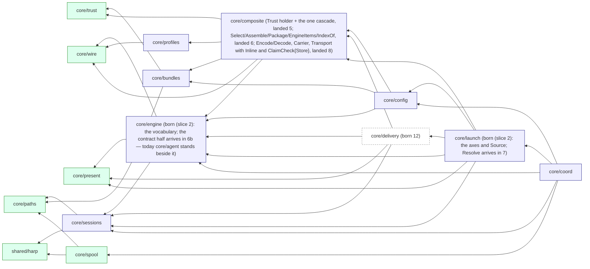
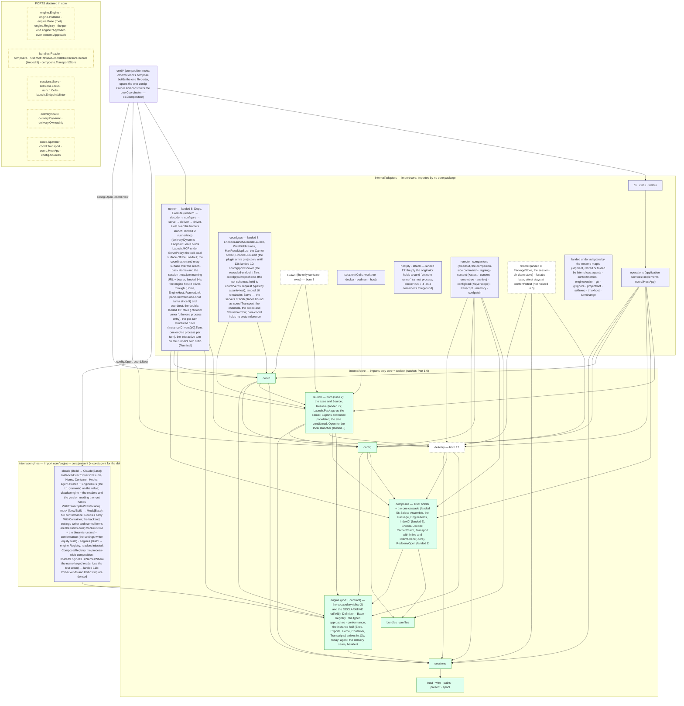

# 30 — The decided architecture

This is the target architecture of ctxloom, complete and standalone: a reader who has seen nothing else can build from it. Part 1 gives the boundaries and the signatures; Part 2 the data flow; Part 3 what the target deletes and the decisions it rests on, each with its reason; Part 4 the ordered migration with a deterministic gate, a wrap-up step and its stop conditions per slice. Every Part 1 signature and every Part 4.2 test body is inlined verbatim from a Go module (`/tmp/ctxloom-design-c`, module `ctxloom.example/c`, package paths identical to the target's) that type-checks with `go vet ./...` including the test packages; the module is the executable claim that the graph is acyclic and the ports fit together. Where this document says "today", it names a symbol at `release/0.7` that the migration replaces; those names are the migration's baseline, not a description the reader must keep true.

Vocabulary is `GLOSSARY.md`'s: **originator** (the process the human started), **runtime coordinator** (the coordination library the originator hosts), **orchestrating agent**, **executor**, **subagent**, **runner** (the process that receives one launch and drives one engine), **engine** (the vendor CLI and the package that knows it), **loadout** (everything a run is given), **surface** (one native place an engine reads), **channel** (file, argv or env), **presentation** (where bytes landed on both sides and how the engine was told), **advice** (a rewrite of every root at once), **root**, **project root**, **session home** (the run's private home under the ctxloom home), **ctxloom home**. Depth is an integer with a configured cap; no sentence in this document assumes two depths.

---

## Part 0 — The shape on one page

Three rings, four directories:

- **`internal/core/`** — the hexagon's centre. Fourteen packages that import only each other and the toolbox. Every port is an interface declared inside the core package that consumes it, so a port is always found beside its only consumer. No core package names an engine, reads a file, opens a socket, or reads the process environment.
- **`internal/adapters/`** — everything that implements a port or drives the core from outside: the runner, the wire codec, the spawner, the filesystem stores, the trust sources, the vendor transcript readers, the application services (`operations`) and the CLI. Adapters import core; the two sanctioned adapter-to-adapter edges are `cli → operations` (the CLI is a pure frontend over the application services) and the runner's own `mcp` subpackage.
- **`internal/engines/`** — one package per engine kind, each importing `core/engine`, the leaves its vocabulary names (`core/present`, `core/sessions`, `core/wire`) and the toolbox, and nothing else. The mock engine is the first implementer and the conformance double.
- **`internal/shared/`** — the toolbox: domain-free leaf libraries (`resources` (the embedded profiles, prompts, commands and default config) and `shared/confload` sit here too, placed by the rename slice; `adapters/runner/coordtest` is a test double that lives beside its subject, the runner it stands up (landed 14a); `iox`, `lockwait`, `collections`, `keymatch`, `textutil`, `yamlx`, `realpath`, `harp`, the leaves slice 15 adds (`report` — the typed finding a core component returns; `filelock` — the advisory lock with the lock path a parameter; `exectoken` — the executable-token predicate), and the leaf packages that move under it in the rename slice: `errs`, `refuri`, `schema`, `liveness`, `pidalive`). Permitted everywhere; never a home for a domain type.

The family binaries (`ltk`, `taskloom`, their packages under `internal/ltk/**`, `internal/taskloom/**`, `internal/shared/tasks/**`) are separate products that share the toolbox; the `lean-binaries` gate keeps them off the engine and coordination packages, and this document does not restructure them. `internal/testsupport/**` is test-only and outside the rings. `cmd/*` are the composition roots: the only packages that import adapters and engines together.

The invariants the whole design holds, each enforced by a gate named in Part 1.1 or a test in Part 4.2:

1. **One constructor per load-bearing value.** `launch.Resolve` is the one way a `launch.Launch` exists; `composite.Assemble` and `composite.Decode` the only ways a `composite.Package` exists; `sessions.Mint` the one mint; `config.Open` the one owner per process.
2. **Every value crosses a boundary once, typed, and is decoded once.** Three process-boundary carriers survive (Part 2.1), each with a codec whose both ends are typed and a field-set parity test.
3. **Native surfaces or a loud refusal.** Delivery has no fallback arm; an engine that lacks a capability the operation depends on refuses through its own method; nothing substitutes another approach, another root, another runtime or another engine.
4. **The engine is a value.** A declarative struct with one typed approach field per surface kind, embedding the engine root that carries the common decisioning written once in core; built once per process, instantiated once per session; the core reads its declarations and never branches on its name; no capability flag exists in core; requiredness is refused at instantiation, loudly.
5. **Session state leaves the project.** One harp-keyed tree under the ctxloom home; the project tree holds no session state; one member table every walker, reaper and mount list derives from.
6. **Identity is minted once and carried typed.** Never re-read from env or cwd by a process that already holds it.
7. **Runner lifetime = session lifetime.** One runner, one bound MCP endpoint and, in a container, one container per live session; a one-shot turn is a frame to the live runner; the engine process is a discrete per-turn process.
8. **Trust decides before delivery, per config generation, and withholds by default.** An ungated view exists only for listing and review, by name, and cannot assemble a deliverable package.
9. **Core purity is a ratchet, not a claim.** The day-one allowlist is the measured import list per core package with the slice in which each entry leaves; the arch test deletes an exhausted entry.

---

## Part 1 — The target, as boundaries and signatures

### 1.0 The acyclicity proof

The principle that keeps the graph acyclic: **the shared vocabulary lives in the lowest package that needs it, and every projection the engine consumes is declared in `core/engine` or below.** Concretely:

1. The surface vocabulary — `Kind`, `Traits`, `RootKind`, `Channel`, the marker `Approach`, `Paths`, `Mount`, `Presentation` — lives in `core/present`, a leaf. `core/engine` declares the per-kind approach interfaces and the typed `Definition` fields over it; `core/delivery` and `core/launch` read both; none redefines either.
2. `engine.Session` is the engine-facing projection of a launch; `launch.Launch.Session()` is its only constructor. `core/engine` never imports `core/launch`.
3. `engine.Items` is the engine-facing projection of a package; `composite.Package.EngineItems(name)` produces it. `core/engine` never imports `core/composite`, and an engine package's `Exports(items engine.Items)` imports only `core/engine`.
4. `delivery.DynamicKind` is the closed set only the session endpoint carries; it is delivery's vocabulary, not the engine's.
5. The isolation axes (`WorkspaceAxis`, `RuntimeAxis`, `Axes`), `DirtyTreeHandler` and `ImageConfig` are value types in `core/launch`; `core/coord` and the isolation adapter import `core/launch`, never the reverse.
6. `core/sessions` sits BELOW `core/engine`: it records the engine as a string, so `engine.Session` can carry a `sessions.Identity` with no cycle.
7. `composite.SignerDecision` is core-owned; the `allowedsigners` adapter returns it, so `core/composite` imports no signing package.

The dependency order, leaves first, as `go list -deps` prints it for the module (an acyclic graph or the command fails):

```
core/trust · core/paths · shared/harp · core/present · core/wire · core/spool
→ core/sessions → core/engine → core/bundles · core/profiles → core/composite
→ core/config → core/delivery → core/launch → core/coord
→ adapters/coordgrpc · adapters/fsstatic · adapters/spawn · adapters/runner · engines/mock
```

The graph among the core packages (an edge is an import; every edge points toward the left of the order above):



Solid nodes are directories in the tree; dashed nodes are born in the slice their label names. The edges are the TARGET's: a node born early (slice 2's vocabulary packages) holds a subset of its edges until the slice that fills it. Today's engine base (`core/agent`, the former `shared/agent`) stands beside `core/engine` until slice 6b splits its contract half out.

Two facts the graph makes checkable, measured with `go list -f '{{.Imports}}'` on the module: `core/engine` imports exactly `core/present`, `core/sessions`, `core/wire`; `engines/mock` and `engines/claude` import exactly `core/engine` and those same three leaves. That is the `engines-import-nothing-above-the-port` rule with a ZERO allowlist, satisfiable by construction because nothing an engine implements names a type above `core/engine`.

**Core purity from day one — the ratchet.** The rule `core-imports-only-core` cannot be green on day one: today's packages, under their new paths, still import adapters. The allowlist is the MEASURED import list with the slice in which each entry leaves; the table below is the rule's `allowed` map as it stands after the rename, one edge per entry, regenerated from `archrules.LayeringRules` rather than written by hand. The mechanism exists: `internal/shared/archrules` declares `archrules.LayeringRule{Name, From, Forbid, Except, Allowed}` — `From` a list of prefixes, `Except` the subtrees a `Forbid` prefix nonetheless permits (core and the toolbox), `Allowed` keyed by import EDGE (`archrules.EdgeKey`, `"<from dir> -> <dep dir>"`) so each forbidden import ratchets out on its own — read by both `tests/arch` (`TestArch_LayeringRules`, and `TestArch_LayeringAllowlist_IsLive`, which deletes an exhausted entry) and archlint's `LayeringAnalyzer`, the pre-commit hook. One declaration, two runners: `TestArch_RuleTables_DeclaredOnce` fails on a second copy. The `clidiag` and `strictness` entries are process globals that become typed values in slice 15.

| Core package (landed path) | Forbidden imports it holds TODAY (the rule's `allowed` map, one edge each) | Leaves in slice |
|---|---|---|
| `core/sessions` | none | exhausted: slice 15 made clidiag typed reports |
| `core/profiles` | `adapters/remote`, `shared/upgrade`, `resources` | `adapters/remote`: slice 5: the pull-walk reader moves to adapters/remote; (the `shared/clidiag` and `shared/strictness` edges are exhausted: slice 15); `shared/upgrade`: slice 5: the live schema-upgrade pipeline moves with its reader (measured: slice 1a deleted the three permanent migrations, which were not this import) (measured; not in Part 1.0's profiles row); `resources`: slice 5: the embedded builtin profiles are data a reader adapter supplies (measured; Part 1.0 does not classify resources) |
| `core/bundles` | `adapters/content`, `adapters/content/attest`, `adapters/content/remotetree`, `adapters/remote`, `adapters/signing`, `shared/admission`, `shared/upgrade` | (the `shared/clidiag` and `shared/strictness` edges are exhausted: slice 15) `adapters/content`: slice 5: readers become adapters behind bundles.Reader; `adapters/content/attest`: slice 5: attest.VerifyBundle is called by the reader adapters; `adapters/content/remotetree`: slice 5: readers become adapters behind bundles.Reader; `adapters/remote`: slice 5: readers become adapters behind bundles.Reader; `adapters/signing`: slice 5: one verifier, behind the trust ports; `shared/admission`: slice 5: admission is decided by composite.Trust, not by the bundle package; `shared/upgrade`: slice 5: the live schema-upgrade pipeline moves with its reader (measured: slice 1a deleted the three permanent migrations, which were not this import); `shared/clidiag`: slice 15: clidiag becomes typed reports; `shared/strictness`: slice 15: strictness becomes a value (measured; not in Part 1.0's bundles row); (the `resources` edge is exhausted: worried-chief I0 deleted the embedded builtin bundles — ctxloom's own content is its companion loadout) |
| `core/config` | `adapters/agents`, `adapters/content`, `adapters/content/remotetree`, `adapters/projectroot`, `adapters/remote`, `shared/admission`, `shared/cliversion`, `adapters/configload/layerscope`, `adapters/companions`, `shared/confload`, `adapters/signing`, `adapters/signing/allowedsigners`, `shared/upgrade`, `resources` | (the `shared/clidiag` and `shared/strictness` edges are exhausted: slice 15) `adapters/agents`: slice 4: the adapters/configload split; `adapters/content`: slice 4: the adapters/configload split; `adapters/content/remotetree`: slice 4: the adapters/configload split; `adapters/projectroot`: slice 4: the adapters/configload split; config no longer finds its own root; `adapters/remote`: slice 5: trust ports behind Sources.TrustPorts; `shared/admission`: slice 5: admission is decided by composite.Trust; `shared/cliversion`: slice 4: the adapters/configload split; `adapters/configload/layerscope`: slice 4: the adapters/configload split; layerscope is configload's; `adapters/companions`: slice 4: companion probing moves to adapters/companions; `shared/confload`: slice 4: the file/env/flag chain is adapters/configload's (measured; not in Part 1.0's config row); `adapters/signing`: slice 5: trust ports behind Sources.TrustPorts; `adapters/signing/allowedsigners`: slice 5: trust ports behind Sources.TrustPorts; `shared/upgrade`: slice 4: the live schema-upgrade pipeline moves with its reader (measured: slice 1a deleted the three permanent migrations, which were not this import) (measured; not in Part 1.0's config row); `shared/clidiag`: slice 15: clidiag becomes typed reports; `shared/strictness`: slice 15: strictness becomes a value (measured; not in Part 1.0's config row); `resources`: slice 4: the embedded default config is data adapters/configload supplies (measured; Part 1.0 does not classify resources) |
| `core/coord` | none | exhausted: landed 10 — the gRPC/HTTP servers, the runner and run channels, the consumer, artifact and control wire and the codec are `adapters/coordgrpc` (`coordgrpc.Serve` binds the coordinator through the `coord.Transport` port; `coordgrpc/discover` and the endpoint file's writer went with them; `mcpschema` reads `coord.RecvWaitMax` from the adapter side); landed 14a — the engine host (`runner.Home`, `runner.EngineHost`) and the transcript recorder it drives are `adapters/runner`. The closure is pinned link-side by `TestArch_CoordLinksNoAdapter` (`go list -deps`: neither `adapters/coordgrpc`, `adapters/runner` nor `adapters/transcript`) |
| `core/coord/coordtest` | (moved) | exhausted: landed 14a — the double is `adapters/runner/coordtest`, beside the runner it stands up; its `lm/backends` and `adapters/isolation` edges are an adapter's own, sanctioned rows in `archrules.LayeringRules` |
| `core/agent` (today's engine base; its contract half becomes `core/engine`) | `shared/ledger` | `shared/ledger`: slice 12: shared/ledger is deleted (the `shared/clidiag` and `shared/strictness` edges are exhausted: slice 15 — the engine base reports through the `report.Reporter` each call is handed: `SetupRequest.Reporter`, `SurfaceInputs.Reporter`, the managed writers' `WithReporter`/`WithWriteReporter`; `agent.Warn` is deleted) |
| `lm/hosting`, `lm/backends` | (deleted) | exhausted: landed 11b — both die; the version command is `engine.Definition.Version`, handed to claude by the root (`claude.WithVersion`); the readers are `engine.TranscriptReader` values the root hands each kind (`Engine.Transcripts`); what `agent.Backend` still needs is `agent.Hosted` on the engine value |
| `core/trust`, `core/paths`, `core/wire`, `core/present`, `core/spool`, `shared/harp` | none | pure today |
| `core/engine`, `core/composite`, `core/launch` | none | born pure in slice 2; zero allowlist from their first commit |
| `core/delivery` | born in 7 (Route, the Plan) and 9 (Loadout, Dynamic); the Static port, Target, Ownership and InputsFor landed 12 | pure: imports engine, present, composite, sessions, wire; zero allowlist |

The rule as a row: `{name: "core-imports-only-core", from: "internal/core/", forbid: ["internal/adapters/", "internal/engines/", "internal/adapters/cli", "internal/adapters/operations", …every non-core, non-toolbox in-repo prefix], allowed: <the table above, one entry per edge with the slice number as the reason>}`. Because the rings are directories, `from` and `forbid` are path PREFIXES, which is what the rename buys: a new core package is covered the moment it exists, with no row to add; until the rename, `from` and `except` name today's core and toolbox packages one by one, and `forbid` is every in-repo root, so a package that is neither is forbidden by default. The generated proto is imported by `adapters/coordgrpc`, the runner's `mcp` and `cli/tui`, and (until slice 13) `cli` and `operations`; a sibling rule `proto-only-in-adapters` pins it. `afero.Fs` is permitted in `core/present`, `core/engine`, `core/delivery` and `core/sessions` as the filesystem port; `afero.NewOsFs`/`afero.OsFs` are referenced only under `adapters/fsstatic`, `adapters/fsstore`, `adapters/configload` and `cmd/*` (a symbol rule in the same test file).

### 1.1 Package map



**The rename, stated once.** Every surviving package moves into its ring's directory and keeps its leaf name; a subpackage keeps its relative path under its parent. The moves that change more than a prefix: `shared/wire` → `core/wire`; `shared/agent/present` → `core/present`; `agentcoord/spool` → `core/spool`; `agentcoord/coord` → `core/coord`; the generated proto (`internal/adapters/coordgrpc/pb`) → `adapters/coordgrpc/pb`; `lm/isolation` → `adapters/isolation`; `config/layerscope` → `adapters/configload/layerscope`; `shared/companionloadout` → `adapters/companions`; `claude` → `engines/claude`; `mockengine` → `engines/mock`; `lm/engines` → `engines` (the registry build); `vpio/*` → `adapters/hostpty`, `adapters/attach` (LANDED 13: the split; `adapters/vpio`, `vpio/goplugin` and `vpio/dockerexec` deleted); `content/attest` LANDED at `adapters/content/attest` (a subpackage keeps its relative path; slice 5 may hoist it to `adapters/attest`); `agentcoord/mcpschema` LANDED at `adapters/coordgrpc/mcpschema` (slice 10 folds it in); the five top-level toolbox packages → `internal/shared/`. Packages the migration retires (`lm/backends`, `lm/grpc`, `vpio/goplugin`, `vpio/dockerexec`, `shared/ledger`, `lm/engine`, `agentcoord/discover`, `mcp`'s stdio server, the reading halves of `config` and `bundles`) are not moved: they die where they stand, in the slice that deletes them. The packages this design introduces (`core/composite`, `core/delivery`, `core/launch`, `core/engine`, `adapters/runner`, `adapters/spawn`, `adapters/coordgrpc`, `adapters/fsstatic`, `adapters/fsstore`, `adapters/configload`, `adapters/companions`) are born at their final path.

Package table — what each ring member owns and what it must never know:

| Package | Owns | Must never know |
|---|---|---|
| `core/present` | the surface vocabulary (`Kind`, `Traits`, `RootKind`, `Channel`, the marker `Approach`, `Delivered`), roots (`Paths`, `Root`, `Mapped`, `Mount`, `PathsAdvice`, `Containerize`), `Start`, `Rooted`, `Presentation` | engines, delivery, the session |
| `core/wire` | the engine-neutral `Hook` and `MCPServer` value types with typed `Provenance` | everything of ours |
| `core/paths` | the on-disk vocabulary; the harp-member table (`HarpMember`, `HarpMembers`, `ClassifyMember`, `IsSessionDir`, `Lifetime`) | sessions, engines |
| `core/trust` | the reference grammar (`Ref`, `BundleRef`), `Source`, `Decision`; the three trust ports (`TrustRoot`, `ReviewRecords`, `RetractionRecords`), `SignerDecision`, `Faulted`, `ContentForm` (landed: `composite` aliases them; ruled 2026-09-19 — the port the readers pass to the one verifier must sit below `core/bundles`) | remote, signing |
| `core/spool` | the file mailbox substrate; `PathMapper` | the coordinator, the wire |
| `core/sessions` | `Identity`, `Endpoint`, `ResumeRef`, `Seed`, `Mint`, `Entry` (with `NativeSession` and `MCP`), `Store`, `Locks`, `Layout` (spool under `persist/`), the two env codecs (`EncodeReach`/`DecodeReach`; `HookEnv`/`DecodeHookEnv`), `ReapPolicy`, `Reap`, `ActivityTime`. Records the engine as a string | engines, transcript formats, the wire |
| `core/engine` | the port (`Engine`, `Instance`), `Definition` (one typed approach field per kind, the optional dynamic approach), `Base` (the engine root: the derived views `Surfaces`/`Carries`/`Static`, `Validate`, and the common `Delegate`), the per-kind approach interfaces and their typed inputs, `DynamicApproach`, `Session`, `LabelConfig`, `Items`, `Exports`, `Name`, `Mode`, `PermissionMode`, `Distribution`, `ErrUnsupported`, `Registry`, `CLIGrammar`, `HomeSpec`, `ContainerSpec`, `TranscriptReader`, `HookCodec` | launch, delivery, composite, config, isolation, the wire |
| `core/bundles` | `Reader`, `BundleRead`, `Catalog`, `Authorizer`, `Pipeline`, `ContentForm` | which reader, remote, signing |
| `core/profiles` | profile documents and parent-graph resolution; `ResolvedProfile` with the binding's surface preference as written | remote, engines |
| `core/composite` | `Trust` (the gate holder), `SignerDecision`, the three trust ports, `Selection`/`Select`, `Package`/`Assemble`, `Attestation`, `Index`/`IndexOf`, `EngineItems`, `Encoded`/`Encode`/`Decode`, `Carrier`/`Claim`, `Transport` with `Inline` and `ClaimCheck{Store}` | which engine, where files land, the session |
| `core/config` | the immutable `Config`, `Owner`/`Snapshot`/`Sources`, `Draft`, `IdleTimeout`, `Validate(engine.Registry)` | engines by name, bundle bytes, companions' binaries |
| `core/delivery` | `Plan`/`StaticItem`/`Loss`, `Preference` (root per kind, accepted losses), `Route`, `Loadout`, `Inputs`/`InputsFor`, `Target`/`Writer`, `Static`, `Dynamic`/`ServePolicy`, `Ownership`, `DynamicKind`, `ErrUncarried`, `Unrootable` | engine argv, transport, config |
| `core/launch` | the axes, `DirtyTreeHandler`, `ImageConfig`, `Source`/`Resume`, `HostFacts`, `Deps`, `EndpointMinter`, `Cells`/`CellRequest`/`Cell`, `Launch`, `Resolve`/`Discard`, `Launch.Session()` | cobra, gRPC, docker, files |
| `core/coord` | `Verbs` (incl. `Host`), the typed requests with `Validate`, `HostApp`, `Options` (incl. `IdleTimeout`), `RunRecord`, `Spawner`, `Transport` (bound by `BindTransport`; `coordgrpc.Serve` implements it), the coordination vocabulary typed without the proto (`Event` + its payloads, `RunnerHello`/`RunnerRequest`/`RunnerResponse`, `RunHello`/`AgentRequest`/`AgentReply`/`OutFrame`, `Refusal` over `ErrForbidden`/`ErrNotFound`), the wire-free session halves (`RunnerSession`, `RunChannel` over `BidiSession`), the coordinator (folds, journal, slots, credentials, drain, idle reaper) and the spool substrate the runner side shares (`SpoolCourier`, `SpoolReactor`, `TrackedGroup`) | MCP, docker, cobra, transcripts, the proto — pinned by `TestArch_CoordLinksNoAdapter` (landed 10 + 14a) |
| `adapters/runner` | `Main` (landed 13), `Deps`, `Execute`; `runner/mcp` (the `delivery.Dynamic` implementation with `ServePolicy`; `search_library` and the `ctxloom://` resources from `Loadout.Index`; host-relayed tools as `Verbs.Host` frames); the engine host (`Home`, `EngineHost`, `RunnerLink`, `Turn`, the transcript recorder it drives — landed 14a; the per-turn drive landed 13 as ruled, decision 21); `runner/coordtest` (the double, landed 14a) | a config owner |
| `adapters/coordgrpc` | `EncodeLaunch`/`DecodeLaunch`, `WireFieldNames`, the `Carrier` codec (`oneof inline | claim`), `HostRequest` frames, `Serve` (the gRPC/HTTP servers of both planes bound to the coordinator as its `coord.Transport`: `LoopbackURL`/`ReachURL`, the endpoint file), the codec both ways (`EventFromWire`/`EventToWire`, the runner and run frames, `StatusFromErr` — the ONE status-code table), `MaxRecvMsgSize`, the bridge listener's transport policy (landed 10) | what a verb means |
| `adapters/spawn` | `Spawner` over `launch.Resolve`; `StartRunner`; `Runtimes` | the engine |
| `adapters/isolation` | `launch.Cells` for worktree, docker, podman and host; credential seeding from `CellRequest.Host`; session-state mounts derived from the member table | engines by name |
| `adapters/hostpty`, `adapters/attach` | spawn `ctxloom runner` with a pty; `docker run -it … ctxloom runner` as the container's foreground process (landed 13; the terminal layer pumps onto one master wherever the runner runs) | keepalive, exec-into, file handoff |
| `adapters/operations` | the application services (one per use case: `StartRun`, `Materialize`, `Compact`, `EvaluateTriggers`, `Doctor`, …); implements `coord.HostApp`; holds the `config.Owner` | cobra |
| `adapters/configload`, `adapters/fsstore`, `adapters/fsstatic`, `adapters/confpatch`, `adapters/remote`, `adapters/signing/*`, `adapters/attest`, `adapters/companions`, `adapters/transcript/*`, `adapters/memory` | `config.Sources`; `sessions.Store`/`Locks`; `delivery.Static` (`fsstatic.Static`) and `delivery.Ownership` (`fsstatic.Records`, landed 12 beside the writer rather than in confpatch: the lean companions link confpatch's hew patching and must not link the package model `delivery` carries — the record diffs its reversals through confpatch's exported helpers); the pull-walk and lockfile (`RetractionRecords`); `TrustRoot`/`ReviewRecords`; `attest.VerifyBundle` (the one verifier); companion probing; the vendor readers and the canonical transcript; the compactor | each other |
| `adapters/cli`, `cli/tui`, `termui` | cobra commands over `operations`; the watch UI on the coordination proto and the transcript file; the pty master | the engine, the launch internals |
| `engines/<name>` | one `engine.Engine` value per kind; `engines.Build()` returns the `Registry` | anything above `core/engine` |

Layering rules in `archrules.LayeringRules` (each an `archrules.LayeringRule` row, enforced by `tests/arch` and by archlint alike; prefixes, not package lists, once the rename has made the rings directories) and symbol rules in `tests/arch/ring_symbols_test.go` (each an AST walk over the module outside the family products and the test trees, allowlisted by file or by `file#function` with a `_AllowlistIsLive` twin):

- `core-imports-only-core` — `from: internal/core/`, with the Part 1.0 allowlist keyed by edge; `TestArch_LayeringAllowlist_IsLive` deletes exhausted entries.
- `engines-import-nothing-above-the-port` — `from: internal/engines/` forbids `internal/core/` except `core/engine`, `core/agent` (the delivery seam, until 12), `core/present`, `core/sessions`, `core/wire`, and all of `internal/adapters/`; the allowlist is the measured edges of `engines/claude` (leaving in slice 12) and the sanctioned reader/version injections at the root (`engines → vendorreader/mock`, `engines/claude/engine → vendorreader/claude`, `→ engineversion`); `lm/backends` and `lm/hosting` are deleted (landed 11b).
- `adapters-import-core-not-each-other` — `from: internal/adapters/` forbids `internal/adapters/` and `internal/engines/`, allowed: `cli → operations`, `cli → cli/tui`, `runner → runner/mcp`, `cmd/* → *`.
- `cli-through-operations`, `runner-owns-the-engine`, `one-launch-constructor` — the constructor rule matches `launch.Launch{`, `new(launch.Launch)` and `var l launch.Launch` outside `core/launch` and `adapters/coordgrpc` by an `ast` walk, not a `git grep`; the exec rule matches `exec.Command`, method values and interface assertions to a narrower type outside `adapters/runner`, `adapters/spawn`, `adapters/hostpty`, `adapters/attach`.
- `proto-only-in-adapters` — `adapters/coordgrpc/pb` imported only by `adapters/coordgrpc`, `adapters/runner/mcp`, `adapters/cli/tui`, and (allowlisted until slice 13) `cli`, `operations`. Today the proto is `internal/adapters/coordgrpc/pb` itself and `internal/adapters/mcp` stands for `runner/mcp`; `coord` and `mcpschema` are allowlisted until slice 10.
- `one-mint-one-owner` — `sessions.Mint` called only from `operations.StartRun` and `coord.Coordinator.AgentRun`; `coord.New` and `config.Open` constructed only under `cmd/`. Until slice 2 the rule pins today's mint — `sessions.Store.AssignHarp` and the `harp` allocator — and today's `config.Load`; the MCP server's raw mint on the agent_run path is the allowlisted site. `config.Open` and `coord.New` are called only inside the composition root's closures (`cmd/ctxloom`'s `compose` → `cli.Composition{Reporter, OpenConfig, NewCoordinator}`, each once-guarded); `operations.App` opens through the handed `ConfigOpener`, and `mcp.HostCoordinator` assembles the hosted coordinator's options and asks the handed `CoordinatorConstructor` for it (slice 15).
- `no-engine-name-in-core` — `engine.Name` literals appear only under `internal/engines/`, in config DATA and in the init prompts that write config data (`cli/init*.go` choose a default from `engine.Registry.Names(default-distribution)`, not a literal). The names are read from the live registry, never listed in the test.
- `env-literals-once` — the `CTXLOOM_*` constants `core/sessions` declares (read from its package-level consts, never listed; today they are `coord`'s) and `os.UserHomeDir`, `os.UserConfigDir`, `os.Getwd`, `os.TempDir`, `os.MkdirTemp`, `user.Current` appear only in `core/sessions`, `cmd/*`, `projectroot`, the fs adapters and the leaf env libraries (`shellenv`, `envswitch`). Of the three reads the migration measured with no owning slice, slice 15 removed `signing/agentkey`'s (`agentkey.Env` carries the home and the ssh-agent socket from `operations.SignerDiscoverer`) and retired `shared/mountns`'s (its `os.MkdirTemp` names the caller's scratch root; the rule counts only the empty-string dir as a temp-root read); `remote/git_publisher`'s `os.MkdirTemp("", …)` IS a temp-root read and stays allowlisted until the composition carries a temp root (`launch.HostFacts` has none yet). `shared/procsec` spells no key: `Diagnostic` takes the credential key from `cmd/*` (`sessions.EnvCoordCred`).
- the field-set parity harness — `parity.FieldSetDiff`/`FieldSetPair`/`CheckFieldSets` in `internal/testsupport/parity`, proven by a negative self-probe; `TestArch_FieldSetParity` walks `fieldSetPairs` in `tests/arch`, empty until a codec registers the first pair (slice 8).

### 1.2 Engines: a declarative struct, instantiated per session

An engine is a VALUE. Each engine package defines its own struct type embedding `engine.Base` — the ENGINE ROOT: the declarative `Definition` plus the views over it and the common decisioning, written once in core — and carrying the engine-specific logic as methods: exec composition, the structured driver, exports decoding, the home and container specs, the hook codec. Per-engine structs supply approaches and engine-specific logic only; they never re-implement what the root decides. The value is built ONCE at the composition root (`engines.Build()` returns the `Registry`) and is immutable: it IS the engine kind. It is instantiated MANY times: `Instance(Session)` binds one session, and an `llm.configs` label (`claude-code`, `claude-fast`, `claude-sonnet`) is a `LabelConfig` on the `Session`, not an engine identity — several labels instantiate the same kind with different models, binaries or arguments. The core consumes the value through the `Engine` interface, reads its declarations, and never branches on its name.

**One typed field per surface kind.** `Definition` has EXACTLY ONE typed approach field per kind — `Context ContextApproach`, `MCP MCPApproach`, `Settings SettingsApproach`, `Hooks HooksApproach`, `Commands CommandsApproach`, `Skills SkillsApproach` — so a kind that does not exist cannot be declared and a kind cannot be declared twice, at compile time. `present.Approach` is a MARKER interface carrying the few shared parameters (`Name()`, `Traits()`) and nothing else; each per-kind interface extends it with that kind's typed `Deliver`, so an approach for one kind cannot be assigned to another kind's field. `nil` means not carried. For a kind the engine REQUIRES (a context surface on an engine that must carry a system prompt) one is present, and nil is the refusal at `Instance()` — loud, naming the kind, never a compile-time check and never silent. For an OPTIONAL kind (MCP among them) nil is legal and means the engine has no native form for it. `Definition.Surfaces()`, `Carries(kind)` and `Static()` are derived by walking the typed fields; nothing is stored twice, there is no runtime validation of kinds, and "this engine cannot carry X" is a nil field, not a declaration. An approach's `Traits().Roots` lists the roots it can write under, the first being its default; the binding may select another (Part 1.4).

**The root decides the compounding of static and dynamic delivery, once.** `Definition.Dynamic` is the engine's PROVIDED dynamic approach — how it consumes items served on the session's MCP endpoint (the entry its MCP file carries) — and it is optional: nil means the engine has no dynamic half. The decision of which item goes to which half is `Base.Delegate`'s: fragments with a PREFACE (a premise — the conditional fragments) are WITHHELD from static delivery when the engine provides a dynamic approach, because dynamic delivery of fragments exists; every non-preface item is delegated to the engine's static approach type for its kind; with no dynamic approach, everything goes static. `delivery.Route` calls `Delegate` and applies its result — Route decides the plan per `Base`, and `Base` is how the definition expresses the compounding, so the two are one place, not a copy of each other. The constructor refuses a dynamic approach on an engine with no MCP approach, because the endpoint is named through the MCP file. The Claude engine sketch below provides both halves; the mock provides the static half only.

**No capability flag exists in core.** Capabilities that may be absent are SLICES — `Instance.Drivers()`, `Engine.Transcripts()` — and empty means none; the caller that requires one refuses loudly at its point of use (`ErrUnsupported{Engine, Capability}`). Single-valued capabilities are a real implementation or a refusal through the engine's own method: `Container()` refuses when the engine has no image, so a container binding fails at `Resolve`; `Instance.Resume(key)` refuses when the engine cannot resume by key, and `Resolve` invokes it only for a resume or a one-shot session. `Home()` is a null object: the zero `HomeSpec` relocates nothing and seeds nothing. `Hooks()` returns a codec that refuses on an engine that fires none, which is unreachable because no payload arrives.

**Landed 11b, the remainder (2026-09-21): `lm/backends` and `lm/hosting` are deleted; two facts joined the port, and the seam's remainder sits on the engine value.** Two declarative facts this section did not name landed on `Definition` because nothing else could carry them and both are the engine's own: `Version engine.VersionCommand{Args, Parse}` (how the binary answers its version; the zero value is "no binary to ask", a double) and `HookLosses map[event]reason` (the unified hook events the engine's mechanism has no native form for). `HookLosses` cannot be derived from `Exports().HookEvent`: claude carries `pre_shell`/`post_file_edit` as matcher-narrowed native events it does not list there, so a derived loss report would name them lost. What `agent.Backend` still needs that the port does not carry — the backend constructor, the typed config, the named-form table a binding's `surfaces:` is validated against, the settings writer `manage status` reads, the project/global settings collision guard — is `agent.Hosted`, implemented by the engine VALUE (`claude.Claude`, `mock.Mock`) and asserted by the adapters on the registry's value (`engines.Hosted`); the L1 process-surface grammar the standalone mock impersonates is `agent.EngineCLIProvider` on the same value (`engines.EngineCLIs`). Both leave with `agent.Backend`. The composition root is the process-wide registry (`engines.Compose`/`Registry`; `Use` the test seam); the cells adapter's facts accessor is `isolation.RegistryFacts` installed beside it by the root that composed.

**Instance lifetime = session lifetime.** A one-shot session's turns are frames driven on the SAME instance; a resume re-attaches. The engine PROCESS is a discrete per-turn process (`claude -p --resume <key>` for the Claude engine): the runner persists per session and owns the bound endpoint; the engine process need not survive between turns.

**The constructor.** Each engine package has one: the place its `Definition` and its typed approaches are assembled into a `Base` and, through `Instance`, session specifics are fed in. It is the ONE place an incoherent declaration is refused — a mode with no argv grammar, a nameless or rootless approach, a dynamic approach with no MCP approach, a `Structured` mode with no driver — by `Base.Validate` and the conformance suite; kinds need no check because the typed fields make a missing or duplicate kind a compile error, requiredness is `Instance()`'s, and `NewRegistry` does not re-validate. The SHAPE is the plain constructor: options applied, `Validate` once. A typestate builder is REJECTED as non-obvious machinery; it is named only as the fallback if requiredness must ever become compile-time (prior art: the spike-typestate worktree).

The port, verbatim from the compiled module — `core/present` first, because the engine's vocabulary lives there:

```go
// Package present is the surface-presentation vocabulary: the roots a run may
// build from, the mounts that make an advised root true, the surface KINDS,
// the declared TRAITS of an approach, and the common Approach behaviour every
// per-kind approach embeds. It is a core leaf: it imports nothing of ours
// (afero is the filesystem port). Every package above it — engine, delivery,
// launch — reads this vocabulary; none redefines it.
package present

import "github.com/spf13/afero"

// Kind is a surface category. The set is closed and each Kind is ONE typed
// field of engine.Definition, so a kind that does not exist cannot be
// declared and a kind cannot be declared twice. Dynamic-only kinds (premise
// catalog, link mates, findings, resources) are delivery's vocabulary, not a
// Kind: they have no native file.
type Kind int

const (
	Context Kind = iota + 1
	MCP
	Settings
	Hooks
	Commands
	Skills
)

// Traits are the declared facts about ONE approach: the roots it can write
// under (the first is its default; the binding may select another), which
// channel tells the engine, whether it is argv-only (no at-rest form) and
// whether it persists after exit. The planner reads these instead of probing
// a built approach.
type Traits struct {
	Roots      []RootKind
	Channel    Channel
	LaunchOnly bool
	Persists   bool
}

// RootKind names a root an approach can write under. RootProjectRoot is the
// SHARED root: an approach offers it in its Traits and the binding SELECTS
// it per kind. When the binding selects it, the project root IS the target —
// a selected root, never a fallback the planner reaches for.
type RootKind int

const (
	RootSessionHome RootKind = iota + 1
	RootProjectRoot
	RootWorkDir
)

type Channel int

const (
	ChannelFile Channel = iota + 1
	ChannelArgv
	ChannelEnv
)

// Approach is the MARKER interface every per-kind approach embeds: the few
// shared parameters (a name, the declared Traits) and nothing else. The
// per-kind interfaces in engine (ContextApproach, MCPApproach, …) extend it
// with that kind's typed Deliver, so an approach for one kind cannot be
// assigned to another kind's field. The Traits the planner reads sit on the
// same value as the Deliver that honours them.
type Approach interface {
	Name() string
	Traits() Traits
}

// Delivered is what a Deliver reports: where the bytes landed on both sides,
// what was written, and how to undo it.

type Delivered struct {
	Presented Presentation
	Wrote     []string
	Undo      func(fs afero.Fs) error
}

// Offers reports whether the traits list the root.
func (t Traits) Offers(r RootKind) bool {
	for _, x := range t.Roots {
		if x == r {
			return true
		}
	}
	return false
}

type Root struct{ Host, Engine string }

// Paths is every root a presentation may build from, resolved once per run.
type Paths struct {
	ProjectRoot Root
	SessionHome Root
	CtxloomHome Root
}

type Mount struct {
	Host, Engine string
	ReadOnly     bool
}

// Mapped is a Paths that has been advised: every Engine side settled, every
// mount recorded. The ONLY thing New accepts.
type Mapped struct {
	paths  Paths
	mounts []Mount
}

func OnHost(p Paths) Mapped      { return Mapped{paths: p} }
func (m Mapped) Paths() Paths    { return m.paths }
func (m Mapped) Mounts() []Mount { return m.mounts }

// PathsAdvice rewrites every root and reports the mounts that make it true.
// Applied EXACTLY ONCE, to the whole Paths, in Cells.Prepare.
type PathsAdvice interface {
	ApplyPaths(Paths) (Paths, []Mount)
}

type Containerize struct{ ProjectRoot, SessionHome, CtxloomHome string }

func (c Containerize) ApplyPaths(p Paths) (Paths, []Mount) { return p, nil }

// Start holds an already-advised Paths.
type Start struct{ m Mapped }

func New(m Mapped) Start             { return Start{m: m} }
func ProjectOnHost(dir string) Start { return Start{m: OnHost(Paths{ProjectRoot: Root{dir, dir}})} }
func (s Start) Paths() Paths         { return s.m.Paths() }
func (s Start) UnderSessionHome(rel string) Rooted {
	return Rooted{root: s.m.paths.SessionHome, rel: rel}
}
func (s Start) UnderProjectRoot(rel string) Rooted {
	return Rooted{root: s.m.paths.ProjectRoot, rel: rel}
}
func (s Start) UnderCtxloomHome(rel string) Rooted {
	return Rooted{root: s.m.paths.CtxloomHome, rel: rel}
}
func (s Start) Served(endpoint Root, envVar string) Presentation { return Presentation{} }

type Rooted struct {
	root Root
	rel  string
}

func (r Rooted) AnnounceEnv(name string) Presentation     { return Presentation{} }
func (r Rooted) AnnounceArgs(args ...string) Presentation { return Presentation{} }
func (r Rooted) Host() string                             { return r.root.Host + "/" + r.rel }
func (r Rooted) Engine() string                           { return r.root.Engine + "/" + r.rel }

// Presentation is the RESULT: where bytes landed on both sides and how the
// engine is told (argv/env channels).
type Presentation struct {
	HostPath   string
	EnginePath string
	Args       []string
	Env        map[string]string
}

// Under reports whether path lies under root.
func Under(path, root string) bool { return len(path) >= len(root) && path[:len(root)] == root }
```

```go
// Package engine is the engine port. An engine KIND is a value: a struct the
// engine package defines, embedding Definition (the declarative part) and
// carrying the engine-specific logic as methods. It is built ONCE at the
// composition root and is immutable; it is instantiated MANY times, once per
// session, through Instance(Session). Core code holds Engine values and asks
// them; it never names an engine and no capability flag exists anywhere in
// core.
//
// DRY by construction: the engine declares ONE typed approach per surface
// kind; every view of them (Surfaces, Carries, Static) and the common
// decisioning (Delegate: preface items to the dynamic approach when one is
// provided, everything else to the static approach types) live on Base,
// the engine root every engine struct embeds, written once in core. Capabilities that may be absent are SLICES — Drivers(),
// Transcripts() — and empty means none; the caller that requires one refuses
// loudly at its point of use. Capabilities that are single-valued are a real
// implementation or ErrUnsupported — Container(), Instance.Resume(key).
// Home() is a null object: the zero HomeSpec relocates nothing and seeds
// nothing. Requiredness of a surface (a nil Context on an engine that must
// carry a system prompt) is refused at Instance(), loudly.
//
// Import discipline (the acyclicity property): engine imports present, wire
// and sessions — all leaves — and NOTHING that imports engine. The
// engine-facing projection of a launch (Session) and of a package (Items)
// are declared HERE, so launch, delivery and composite import engine and
// engine imports none of them.
package engine

import (
	"context"
	"encoding/json"
	"fmt"

	"ctxloom.example/c/internal/core/present"
)

// Name is the registry key and the ONLY spelling of an engine.
type Name string

// Mode is how a run is driven: Interactive = a pty; Structured = the engine's
// native structured protocol (one of Instance.Drivers()).
type Mode int

const (
	Interactive Mode = iota + 1
	Structured
)

// PermissionMode is the launch-time permission posture; every engine maps it.
// The zero is NotRequested — nobody asked — so an unset launch.Source.Permission
// is distinguishable from an explicit default; agent.ResolveDefault is the one
// place the absence becomes a posture, and the wire never carries it.
type PermissionMode int

const (
	PermissionNotRequested PermissionMode = iota
	PermissionDefault
	PermissionPlan
	PermissionAcceptEdits
	PermissionBypass
)

// Distribution is the engine's shipping policy.
type Distribution int

const (
	DistributionDefault Distribution = iota + 1
	DistributionOnRequest
	DistributionTestOnly
)

// ErrUnsupported is the loud refusal returned when the operation being
// performed depends on a capability this engine lacks: by the engine's own
// method (Container, Resume) or by the caller that required a slice to be
// non-empty (a Structured turn with no driver).
type ErrUnsupported struct {
	Engine     Name
	Capability string
}

func (e ErrUnsupported) Error() string {
	return fmt.Sprintf("engine %q does not support %s", e.Engine, e.Capability)
}

// Engine is the port. The engine package's own struct type satisfies it by
// embedding Base — the engine root: the Definition plus the views and the
// common decisioning written once in core — and adding the methods that
// carry engine-specific logic.
//
// THE CONSTRUCTOR. Each engine package has one: the place its Definition
// and its typed approaches are assembled into a Base and, through Instance,
// session specifics are fed in. It is the ONE place an incoherent
// declaration is refused — a mode with no argv grammar, a nameless or
// rootless approach, a dynamic approach with no MCP approach, a Structured
// mode with no driver — by Base.Validate; kinds need no check because the
// typed fields make a missing or duplicate kind a compile error, and
// requiredness is Instance()'s. NewRegistry does not re-validate;
// conformance asserts Validate holds. The SHAPE is the plain constructor:
// options applied, Validate once. A typestate builder is REJECTED as
// non-obvious machinery; it is named only as the fallback if requiredness
// must ever become compile-time (prior art: the spike-typestate worktree).
type Engine interface {
	// Root is the engine root (Base): the declarative Definition and, on it,
	// the derived views and the common delivery decisioning (Delegate). A
	// value, equal on every call; the embedded Base supplies it.
	Root() Base
	// Instance binds one session. Instance lifetime = session lifetime: a
	// one-shot session's turns are frames driven on the SAME Instance; the
	// engine PROCESS is per turn and need not survive between turns. It
	// refuses LOUDLY (ErrUnsupported naming the kind) when a surface this
	// engine requires to run the session is nil on its Definition.
	Instance(s Session) (Instance, error)
	// Exports maps a package's items to this engine's native export shapes,
	// decoding each item's per-engine block against Definition.ExportSchema.
	// Pure over its inputs.
	Exports(items Items) (Exports, error)
	// Home says how the engine's config/credential home relocates into the
	// session home. The zero HomeSpec is the null object: nothing to relocate
	// and nothing to seed.
	Home() HomeSpec
	// Container says how a containerized run is built and authenticated.
	// Refuses with ErrUnsupported when the engine has no image: a container
	// binding then fails at Resolve, never later.
	Container() (ContainerSpec, error)
	// Transcripts are the version-scoped readers of the engine's own store.
	// Empty means none, and every consumer of transcripts keeps operating.
	Transcripts() []TranscriptReader
	// Hooks decodes the engine's native hook payloads. An engine that fires
	// no hooks returns a codec whose Decode refuses with ErrUnsupported —
	// unreachable, since no payload arrives.
	Hooks() HookCodec
}

// Instance is one engine kind bound to one session.
type Instance interface {
	// Exec composes the process the runner execs from the presentations
	// delivery produced. It is the only place engine-specific argv is
	// composed; the result parses against Definition.CLI (the anti-drift
	// test). The Env it returns holds ONLY engine-native variables; the runner
	// stamps identity env on top.
	Exec(presented []present.Presentation) (Exec, error)
	// Drivers are the engine's native structured drivers. Empty means the
	// engine is driven only through a pty; the runner then refuses a
	// Structured turn with ErrUnsupported{Capability: "drive"}. Resolve
	// refuses a Structured Source earlier through Definition.Modes, and
	// conformance pins Structured ∈ Modes ⇔ len(Drivers()) > 0.
	Drivers() []StructuredDriver
	// Resume re-attaches this instance to the native session key, so the
	// next Exec or Turn continues that session. A real implementation or
	// ErrUnsupported; Resolve invokes it only for a resume or a one-shot
	// session, so an engine without it is refused exactly then.
	Resume(key string) error
}

// Exec is the exec projection.
type Exec struct {
	Binary      string
	Args        []string
	Env         map[string]string
	WorkDir     string
	Interactive bool
	StdinPrompt []byte
}

// StructuredDriver runs the engine's native structured protocol for one
// turn. In one-shot sessions the runner calls Turn once per mailbox delivery
// on the SAME Instance, passing the native key it learned; the engine
// process is a discrete per-turn process inside a runner that stays.
type StructuredDriver interface {
	Turn(ctx context.Context, ex Exec, in Turn, out chan<- Event) (TurnResult, error)
}

type Turn struct {
	Prompt string
	Resume string // native key; "" on the first turn
}
type Event struct {
	Kind    string
	Payload json.RawMessage
}
type TurnResult struct {
	NativeKey string // the key the NEXT turn resumes by
	Answer    string
}
```

```go
package engine

import (
	"errors"
	"fmt"

	"ctxloom.example/c/internal/core/present"
)

// Definition is the DECLARATIVE part of an engine kind: pure data, the
// fields an engine package fills once in its constructor. ONE TYPED FIELD
// PER SURFACE KIND: a kind that does not exist cannot be declared and a kind
// cannot be declared twice, at compile time; nil = not carried. There is no
// runtime validation of kinds. Requiredness — a nil Context on an engine
// that must carry a system prompt — is checked LOUDLY at Instance(), never
// at compile time. Home, Container, Transcripts and Resume are methods on
// the Engine, not fields. The views over a Definition and the common
// decisioning live on Base, the engine root every engine struct embeds.
type Definition struct {
	Name         Name
	Distribution Distribution
	Modes        []Mode
	Permissions  PermissionFacts
	// The six surface kinds, EXACTLY ONE typed approach each. nil = not
	// carried. For a kind the engine requires, one is present and nil is
	// Instance()'s refusal; for an optional kind (MCP among them) nil is
	// legal and means the engine has no native form for it.
	Context  ContextApproach
	MCP      MCPApproach
	Settings SettingsApproach
	Hooks    HooksApproach
	Commands CommandsApproach
	Skills   SkillsApproach
	// Dynamic is the engine's PROVIDED dynamic approach: how it consumes
	// items served on the session's MCP endpoint. OPTIONAL: nil means the
	// engine has no dynamic half and receives everything statically. The
	// compounding of the two halves is Base.Delegate's, written once in
	// core; the engine supplies the approach, never the decision.
	Dynamic DynamicApproach
	// CLI declares each mode's argv grammar; ParseArgv is the shared parser
	// the anti-drift test runs Exec's output through.
	CLI []CLIGrammar
	// ModelAliases translates configured model strings: a declared table.
	ModelAliases map[string]string
	// ExportSchema is the JSON schema of the per-engine `exports` block a
	// bundle item may carry under Name (published by schemagen; decoded by
	// Exports).
	ExportSchema []byte
}

// Base is the ENGINE ROOT: every engine struct embeds it, so the views over
// a Definition and the COMMON DECISIONING are written once, in core, and no
// engine re-implements them. Per-engine structs supply approaches and
// engine-specific logic only.
type Base struct{ Definition }

// Root makes the embedding engine struct satisfy Engine.Root.
func (b Base) Root() Base { return b }

// Surfaces is the derived approach table: the typed fields, walked, nils
// omitted. Nothing declares it separately.
func (d Base) Surfaces() Surfaces {
	s := Surfaces{}
	if d.Context != nil {
		s[present.Context] = d.Context
	}
	if d.MCP != nil {
		s[present.MCP] = d.MCP
	}
	if d.Settings != nil {
		s[present.Settings] = d.Settings
	}
	if d.Hooks != nil {
		s[present.Hooks] = d.Hooks
	}
	if d.Commands != nil {
		s[present.Commands] = d.Commands
	}
	if d.Skills != nil {
		s[present.Skills] = d.Skills
	}
	return s
}

// Carries reports whether the engine declared an approach for the Kind.
func (d Base) Carries(k present.Kind) bool { _, ok := d.Surfaces()[k]; return ok }

// Static lists the Kinds the engine carries, in Kind order.
func (d Base) Static() []present.Kind {
	var out []present.Kind
	for _, k := range []present.Kind{present.Context, present.MCP, present.Settings, present.Hooks, present.Commands, present.Skills} {
		if d.Carries(k) {
			out = append(out, k)
		}
	}
	return out
}

var errDefinition = errors.New("engine: invalid definition")

// Delegation is the root's decision for one package: which kinds go to the
// engine's static approach types, and which items to its dynamic approach.
type Delegation struct {
	Static  []present.Kind // kinds with items, delivered through the typed static approaches
	Dynamic []string       // refs of PREFACE items served on the endpoint; empty when the engine provides no dynamic approach
}

// Delegate is the COMMON DECISIONING, written once here. Fragments with a
// PREFACE (a premise: the conditional fragments) are WITHHELD from static
// delivery when the engine provides a dynamic approach, because dynamic
// delivery of fragments exists; every non-preface item goes to the engine's
// static approach type for its kind; with no dynamic approach, everything
// goes static. delivery.Route applies this decision and never re-makes it.
func (d Base) Delegate(items Items) Delegation {
	var out Delegation
	static := map[present.Kind]bool{}
	for _, f := range items.Fragments {
		if f.Premise != "" && d.Dynamic != nil {
			out.Dynamic = append(out.Dynamic, f.Ref)
			continue
		}
		static[present.Context] = true
	}
	if len(items.Commands) > 0 {
		static[present.Commands] = true
	}
	if len(items.Skills) > 0 {
		static[present.Skills] = true
	}
	if len(items.Hooks) > 0 {
		static[present.Hooks] = true
	}
	if len(items.MCP) > 0 || d.Dynamic != nil { // the session endpoint itself is an MCP entry
		static[present.MCP] = true
	}
	if items.Settings {
		static[present.Settings] = true
	}
	for _, k := range []present.Kind{present.Context, present.MCP, present.Settings, present.Hooks, present.Commands, present.Skills} {
		if static[k] {
			out.Static = append(out.Static, k)
		}
	}
	return out
}

// Validate is the non-kind coherence check the constructor runs once: Name
// set, Modes non-empty, a CLI grammar per Mode, every declared approach
// named with at least one root, and a dynamic approach only on an engine
// that declares MCP (the endpoint is named through the MCP file). Kinds
// need no check: the type did it.
func (d Base) Validate() error {
	if d.Name == "" || len(d.Modes) == 0 {
		return fmt.Errorf("%w: name and modes are required", errDefinition)
	}
	if d.Dynamic != nil && d.MCP == nil {
		return fmt.Errorf("%w: a dynamic approach needs an MCP approach to name the endpoint", errDefinition)
	}
	for _, m := range d.Modes {
		if _, ok := CLIFor(d.CLI, m); !ok {
			return fmt.Errorf("%w: mode %v has no CLI grammar", errDefinition, m)
		}
	}
	for k, a := range d.Surfaces() {
		if a.Name() == "" || len(a.Traits().Roots) == 0 {
			return fmt.Errorf("%w: the approach for kind %v lacks a name or a root", errDefinition, k)
		}
	}
	return nil
}

// PermissionFacts is the engine's permission vocabulary as facts.
type PermissionFacts struct {
	Native            []PermissionMode
	ReadOnlyPlan      bool
	HostDefault       PermissionMode // the DEFAULT posture for an interactive host run when nothing named one
	HostDefaultReason string         // shown to the user; the stopgap's retirement condition lives beside it
}

// HomeSpec: the vars that relocate the home, each pointing at Subdir under
// the session home; the credential files to seed. The zero value relocates
// nothing and seeds nothing.
type HomeSpec struct {
	Vars        []HomeVar
	Credentials []string // relative to the REAL home the originator decoded once (launch.HostFacts.Home); copied one-way into the session home at creation
}
type HomeVar struct{ Name, Subdir string }

// ContainerSpec: the Containerfile fragment, the in-image validate command,
// the auth story, the transcript store root relative to the container home,
// and the in-image binary name (a host path is never handed to a container).
type ContainerSpec struct {
	Install            []byte
	ValidateCommand    string
	Auth               ContainerAuth
	TranscriptStoreRel string
	Binary             string
}
type ContainerAuth struct {
	Mounts []string
	Env    []string
}

type TranscriptReader interface {
	Versions() (min, max string)
}

// HookCodec decodes a native hook payload into the unified event.
type HookCodec interface {
	Decode(event string, payload []byte) (HookEvent, error)
}
type HookEvent struct {
	Event         string
	NativeSession string
	Transcript    string
}

// CLIGrammar declares one mode's argv grammar.
type CLIGrammar struct {
	Mode       Mode
	Binary     string
	Flags      []Flag
	Positional int
}
type Flag struct {
	Name     string
	HasValue bool
}
type Parsed struct{ Flags map[string]string }

func (g CLIGrammar) ParseArgv(args []string) (Parsed, error) { return Parsed{}, nil }

// CLIFor selects the grammar for a mode.
func CLIFor(grammars []CLIGrammar, mode Mode) (CLIGrammar, bool) {
	for _, g := range grammars {
		if g.Mode == mode {
			return g, true
		}
	}
	return CLIGrammar{}, false
}
```

```go
package engine

import (
	"github.com/spf13/afero"

	"ctxloom.example/c/internal/core/present"
	"ctxloom.example/c/internal/core/sessions"
	"ctxloom.example/c/internal/core/wire"
)

// DynamicApproach is the engine's provided way of consuming items served on
// the session's MCP endpoint: how the endpoint is named to the engine (the
// entry its MCP file carries). Optional on the Definition; Base.Delegate
// routes preface items to it when present.
type DynamicApproach interface {
	present.Approach
	Endpoint(ep sessions.Endpoint) wire.MCPServer
}

// The per-kind approach interfaces. Each embeds present.Approach (name and
// traits) and adds the typed Deliver for its kind, so the Definition's typed
// fields cannot receive another kind's approach. Deliver writes the kind's
// inputs under the advised start, at the root the plan selected, and
// reports where they landed on both sides; it is called ONLY by the static
// delivery adapter.
type ContextApproach interface {
	present.Approach
	DeliverContext(start present.Start, root present.RootKind, in ContextInputs, fs afero.Fs) (present.Delivered, error)
}
type MCPApproach interface {
	present.Approach
	DeliverMCP(start present.Start, root present.RootKind, in MCPInputs, fs afero.Fs) (present.Delivered, error)
}
type SettingsApproach interface {
	present.Approach
	DeliverSettings(start present.Start, root present.RootKind, in SettingsInputs, fs afero.Fs) (present.Delivered, error)
}
type HooksApproach interface {
	present.Approach
	DeliverHooks(start present.Start, root present.RootKind, in HooksInputs, fs afero.Fs) (present.Delivered, error)
}
type CommandsApproach interface {
	present.Approach
	DeliverCommands(start present.Start, root present.RootKind, in CommandsInputs, fs afero.Fs) (present.Delivered, error)
}
type SkillsApproach interface {
	present.Approach
	DeliverSkills(start present.Start, root present.RootKind, in SkillsInputs, fs afero.Fs) (present.Delivered, error)
}

// Surfaces is the DERIVED approach table (Definition.Surfaces()): per Kind,
// the one approach the engine declared. A Kind absent from the map is one
// the engine has no native form for: the planner REFUSES it (or records an
// accepted loss) — it is never a permitted no-op.
type Surfaces map[present.Kind]present.Approach

// The per-kind inputs, built by delivery.Inputs from the decoded package.
type ContextInputs struct {
	Text []byte
	Hash string
}
type MCPInputs struct{ Servers []wire.MCPServer } // includes the session's own endpoint as a URL entry
type SettingsInputs struct {
	DenyTools  []string
	Statusline bool
	Exports    Exports
}
type HooksInputs struct {
	Hooks     []wire.Hook
	HookEvent map[string]string // unified → native, from Exports
}
type CommandsInputs struct{ Commands []CommandExport }
type SkillsInputs struct{ Skills []SkillExport }
```

```go
package engine

import (
	"encoding/json"

	"ctxloom.example/c/internal/core/present"
	"ctxloom.example/c/internal/core/sessions"
	"ctxloom.example/c/internal/core/wire"
)

// Session is the ENGINE-FACING projection of a resolved launch: what
// Instance is fed. It carries the identity, the label's configuration, the
// permission (already floored), the advised roots, the MCP endpoint and its
// bearer (the engine's .mcp.json names it), the prompt, the resume ref and
// the env additions. It carries NO package (already presentations), NO trust
// gate, NO isolation axes and NO coordinator credential: those were consumed
// by delivery or belong to the runner. Container-aware behaviour comes from
// Engine.Container(), never from an axis here. launch.Launch.Session() is
// its only constructor.
type Session struct {
	Identity   sessions.Identity
	Label      LabelConfig
	Mode       Mode
	Permission PermissionMode
	Roots      present.Paths // engine side of ProjectRoot, SessionHome, CtxloomHome
	WorkDir    string        // the cell's working directory
	Home       []HomeBinding // each HomeVar of Engine.Home() resolved to its path under Roots.SessionHome
	MCP        sessions.Endpoint
	Prompt     string
	Resume     sessions.ResumeRef
	Env        map[string]string // engine PASSTHROUGH additions only; never ctxloom's own vars
}

// LabelConfig is one llm.configs label resolved: a configuration of the
// engine kind, not an engine identity. Several labels instantiate the same
// kind with different models, binaries or arguments.
type LabelConfig struct {
	Label  string
	Model  string
	Binary string
	Args   []string
}

// HomeBinding is one HomeVar resolved: the engine sets Var to Path.
type HomeBinding struct{ Var, Path string }

// Items is the engine-facing projection of a composite package: the admitted
// items an engine's Exports decides over. composite produces it; engine does
// not import composite.
type Items struct {
	Fragments []FragmentItem
	Commands  []CommandItem
	Skills    []SkillItem
	Hooks     []wire.Hook
	MCP       []wire.MCPServer
	Settings  bool // deny tools or statusline present
}

// FragmentItem is one fragment; a non-empty Premise makes it a PREFACE item
// (conditional), which Base.Delegate serves dynamically when the engine
// provides a dynamic approach.
type FragmentItem struct {
	Ref     string
	Name    string
	Body    []byte
	Premise string
}
type CommandItem struct {
	Ref     string
	Name    string
	Body    []byte
	Exports json.RawMessage // this engine's opaque block, decoded by Exports against ExportSchema
}
type SkillItem struct {
	Ref     string
	Name    string
	Files   []SkillFile
	Exports json.RawMessage
}
type SkillFile struct {
	Path   string
	Digest string
	Size   int64
	Bytes  []byte
}

// Exports is what an engine says about a package: which commands become
// slash commands and how, which skills are enabled, how unified hook events
// route to native ones, and the native tool identifiers a deny list names.
type Exports struct {
	Commands  []CommandExport
	Skills    []SkillExport
	HookEvent map[string]string // unified event → native event; a unified event absent here is uncarried
	DenyTools []string
}
type CommandExport struct {
	Name    string
	Body    []byte
	Enabled bool
	Meta    map[string]string
}
type SkillExport struct {
	Name    string
	Files   []SkillFile
	Enabled bool
}
```

```go
package engine

import "fmt"

// Registry is the set of engines a process was composed with: a VALUE built
// at the composition root (engines.Build()), never a package global. It
// refuses a duplicate Name; coherence of each Definition is the engine
// constructor's job (the ONE place), asserted by conformance.
type Registry struct{ m map[Name]Engine }

func NewRegistry(engines ...Engine) (Registry, error) {
	r := Registry{m: map[Name]Engine{}}
	for _, e := range engines {
		d := e.Root()
		if _, dup := r.m[d.Name]; dup {
			return Registry{}, fmt.Errorf("engine %q registered twice", d.Name)
		}
		r.m[d.Name] = e
	}
	return r, nil
}
func (r Registry) Lookup(name Name) (Engine, bool) { e, ok := r.m[name]; return e, ok }
func (r Registry) Names(keep func(Definition) bool) []Name {
	var out []Name
	for n, e := range r.m {
		if keep == nil || keep(e.Root().Definition) {
			out = append(out, n)
		}
	}
	return out
}
```


The Claude engine, sketched to the port with both halves of delivery provided (its `Deliver` bodies are the engine slice's to write; the declaration is fixed here):

```go
// Package claude is the Claude Code engine kind, sketched to the port: the
// example of an engine with BOTH halves of delivery — every non-preface
// item statically through its typed approaches, and the preface items (the
// premised fragments) dynamically on the session's MCP endpoint through the
// dynamic approach it PROVIDES. The decision of which item goes where is
// Base.Delegate's, not this package's. Its Deliver bodies are the engine
// slice's to write; the declaration is fixed here.
package claude

import (
	"github.com/spf13/afero"

	"ctxloom.example/c/internal/core/engine"
	"ctxloom.example/c/internal/core/present"
	"ctxloom.example/c/internal/core/sessions"
	"ctxloom.example/c/internal/core/wire"
)

type Claude struct{ engine.Base }

func Build() (engine.Engine, error) {
	home := []present.RootKind{present.RootSessionHome}
	shared := []present.RootKind{present.RootSessionHome, present.RootProjectRoot}
	d := engine.Definition{
		Name:         "claude-code",
		Distribution: engine.DistributionDefault,
		Modes:        []engine.Mode{engine.Interactive, engine.Structured},
		Permissions:  engine.PermissionFacts{Native: []engine.PermissionMode{engine.PermissionDefault, engine.PermissionPlan, engine.PermissionAcceptEdits, engine.PermissionBypass}, ReadOnlyPlan: true, HostDefault: engine.PermissionBypass, HostDefaultReason: "an interactive host run prompts for nothing until the approval broker delivers prompts"},
		Context:      systemPrompt{traits{present.Traits{Roots: home, Channel: present.ChannelArgv, LaunchOnly: true}}},
		MCP:          mcpConfig{traits{present.Traits{Roots: shared, Channel: present.ChannelFile, Persists: true}}},
		Settings:     settings{traits{present.Traits{Roots: home, Channel: present.ChannelFile}}},
		Hooks:        hooks{traits{present.Traits{Roots: home, Channel: present.ChannelFile}}},
		Commands:     commandsDir{traits{present.Traits{Roots: home, Channel: present.ChannelFile}}},
		Skills:       skillsDir{traits{present.Traits{Roots: home, Channel: present.ChannelFile}}},
		// The dynamic half, PROVIDED: the session endpoint as an entry in .mcp.json.
		Dynamic:      sessionEndpoint{traits{present.Traits{Roots: home, Channel: present.ChannelFile}}},
		CLI:          []engine.CLIGrammar{{Mode: engine.Interactive, Binary: "claude"}, {Mode: engine.Structured, Binary: "claude", Flags: []engine.Flag{{Name: "-p", HasValue: true}, {Name: "--resume", HasValue: true}}}},
		ModelAliases: map[string]string{},
		ExportSchema: []byte(`{"type":"object"}`),
	}
	b := engine.Base{Definition: d}
	if err := b.Validate(); err != nil {
		return nil, err
	}
	return Claude{Base: b}, nil
}

func (c Claude) Instance(s engine.Session) (engine.Instance, error) {
	if c.Context == nil {
		return nil, engine.ErrUnsupported{Engine: c.Name, Capability: "context"}
	}
	return nil, nil
}
func (c Claude) Exports(items engine.Items) (engine.Exports, error) { return engine.Exports{}, nil }
func (c Claude) Home() engine.HomeSpec {
	return engine.HomeSpec{Vars: []engine.HomeVar{{Name: "CLAUDE_CONFIG_DIR", Subdir: "claude"}}, Credentials: []string{".claude/.credentials.json"}}
}
func (c Claude) Container() (engine.ContainerSpec, error) {
	return engine.ContainerSpec{Binary: "claude", TranscriptStoreRel: ".claude/projects"}, nil
}
func (c Claude) Transcripts() []engine.TranscriptReader { return nil }
func (c Claude) Hooks() engine.HookCodec                { return nil }

type traits struct{ t present.Traits }

func (a traits) Traits() present.Traits { return a.t }

type sessionEndpoint struct{ traits }
type systemPrompt struct{ traits }
type mcpConfig struct{ traits }
type settings struct{ traits }
type hooks struct{ traits }
type commandsDir struct{ traits }
type skillsDir struct{ traits }

func (sessionEndpoint) Name() string { return "session-endpoint" }
func (sessionEndpoint) Endpoint(ep sessions.Endpoint) wire.MCPServer {
	return wire.MCPServer{URL: ep.URL, Headers: map[string]string{"Authorization": "Bearer " + ep.Credential}}
}
func (systemPrompt) Name() string { return "system-prompt" }
func (mcpConfig) Name() string    { return "mcp-config" }
func (settings) Name() string     { return "settings" }
func (hooks) Name() string        { return "settings-hooks" }
func (commandsDir) Name() string  { return "commands-dir" }
func (skillsDir) Name() string    { return "skills-dir" }

func (systemPrompt) DeliverContext(present.Start, present.RootKind, engine.ContextInputs, afero.Fs) (present.Delivered, error) {
	return present.Delivered{}, nil
}
func (mcpConfig) DeliverMCP(present.Start, present.RootKind, engine.MCPInputs, afero.Fs) (present.Delivered, error) {
	return present.Delivered{}, nil
}
func (settings) DeliverSettings(present.Start, present.RootKind, engine.SettingsInputs, afero.Fs) (present.Delivered, error) {
	return present.Delivered{}, nil
}
func (hooks) DeliverHooks(present.Start, present.RootKind, engine.HooksInputs, afero.Fs) (present.Delivered, error) {
	return present.Delivered{}, nil
}
func (commandsDir) DeliverCommands(present.Start, present.RootKind, engine.CommandsInputs, afero.Fs) (present.Delivered, error) {
	return present.Delivered{}, nil
}
func (skillsDir) DeliverSkills(present.Start, present.RootKind, engine.SkillsInputs, afero.Fs) (present.Delivered, error) {
	return present.Delivered{}, nil
}
```


And the first implementer, the mock — the static half only — whose approaches are observable no-ops (each writes a marker file under the selected root), with the lossy variant the uncarried and requiredness tests use:

```go
// Package mock is the conformance double: the first Engine implementer. It
// imports engine, present and the two leaves engine's vocabulary names —
// the engines-import-nothing-above-the-port rule with a zero allowlist.
// Its approaches are OBSERVABLE no-ops: each writes a marker file under the
// selected root, so a test can assert what was delivered without an engine
// binary. It provides no dynamic approach: the static half only, everything
// through its typed approaches, exactly as Base.Delegate decides.
package mock

import (
	"context"

	"github.com/spf13/afero"

	"ctxloom.example/c/internal/core/engine"
	"ctxloom.example/c/internal/core/present"
	"ctxloom.example/c/internal/core/sessions"
	"ctxloom.example/c/internal/core/wire"
)

// Mock is the engine KIND: the engine root embedded (its Definition, the
// views and the common decisioning), the engine-specific logic as methods.
// Built once by New; immutable.
type Mock struct{ engine.Base }

type Option func(*engine.Definition)

// Without nils the typed field for each kind: the lossy variant the
// uncarried and requiredness tests use.
func Without(kinds ...present.Kind) Option {
	return func(d *engine.Definition) {
		for _, k := range kinds {
			switch k {
			case present.Context:
				d.Context = nil
			case present.MCP:
				d.MCP = nil
			case present.Settings:
				d.Settings = nil
			case present.Hooks:
				d.Hooks = nil
			case present.Commands:
				d.Commands = nil
			case present.Skills:
				d.Skills = nil
			}
		}
	}
}

// WithDynamic provides a dynamic approach (the delegation tests use it).
func WithDynamic() Option {
	return func(d *engine.Definition) { d.Dynamic = endpointEntry{"session-endpoint"} }
}

// endpointEntry is the mock's dynamic approach: it names the session
// endpoint as a plain URL entry with the bearer as a header.
type endpointEntry struct{ name string }

func (e endpointEntry) Name() string { return e.name }
func (e endpointEntry) Traits() present.Traits {
	return present.Traits{Roots: []present.RootKind{present.RootSessionHome}, Channel: present.ChannelFile}
}
func (e endpointEntry) Endpoint(ep sessions.Endpoint) wire.MCPServer {
	return wire.MCPServer{URL: ep.URL, Headers: map[string]string{"Authorization": "Bearer " + ep.Credential}}
}

// WithoutGrammar drops a mode's argv grammar (the incoherence test uses it).
func WithoutGrammar(mode engine.Mode) Option {
	return func(d *engine.Definition) {
		var keep []engine.CLIGrammar
		for _, g := range d.CLI {
			if g.Mode != mode {
				keep = append(keep, g)
			}
		}
		d.CLI = keep
	}
}

// New and NewNamed build the constant, coherent mock kind; a failure is a
// programming error in this file, so they panic rather than return it.
func New(opts ...Option) engine.Engine { return NewNamed("mock", opts...) }

// NewNamed builds the same kind under another name (the polymorphism proof:
// two names, identical plans).
func NewNamed(name engine.Name, opts ...Option) engine.Engine {
	e, err := Build(name, opts...)
	if err != nil {
		panic(err)
	}
	return e
}

// Build is THE CONSTRUCTOR: the one place this engine's declaration is
// assembled and the one place an incoherent one is refused (a mode with no
// grammar, a nameless or rootless approach). Kinds need no check: the typed
// fields of Definition make a missing or duplicate kind a compile error.
// The shape is the plain constructor — options applied, Validate once. A
// typestate builder is rejected as non-obvious machinery and named only as
// the fallback if requiredness must ever become compile-time.
func Build(name engine.Name, opts ...Option) (engine.Engine, error) {
	homeFile := []present.RootKind{present.RootSessionHome}
	shared := []present.RootKind{present.RootSessionHome, present.RootProjectRoot}
	d := engine.Definition{
		Name:         name,
		Distribution: engine.DistributionTestOnly,
		Modes:        []engine.Mode{engine.Interactive, engine.Structured},
		Permissions:  engine.PermissionFacts{Native: []engine.PermissionMode{engine.PermissionDefault, engine.PermissionBypass}, HostDefault: engine.PermissionDefault},
		Context:      marker{"system-prompt", present.Traits{Roots: homeFile, Channel: present.ChannelArgv, LaunchOnly: true}, "context.md"},
		MCP:          marker{"mcp-config", present.Traits{Roots: shared, Channel: present.ChannelFile, Persists: true}, ".mcp.json"},
		Settings:     marker{"settings", present.Traits{Roots: homeFile, Channel: present.ChannelFile}, "settings.json"},
		Hooks:        marker{"hooks", present.Traits{Roots: homeFile, Channel: present.ChannelFile}, "hooks.json"},
		Commands:     marker{"commands-dir", present.Traits{Roots: homeFile, Channel: present.ChannelFile}, "commands/.marker"},
		Skills:       marker{"skills-dir", present.Traits{Roots: homeFile, Channel: present.ChannelFile}, "skills/.marker"},
		CLI:          []engine.CLIGrammar{{Mode: engine.Interactive, Binary: "mock"}, {Mode: engine.Structured, Binary: "mock"}},
		ModelAliases: map[string]string{},
		ExportSchema: []byte(`{"type":"object"}`),
	}
	for _, o := range opts {
		o(&d)
	}
	b := engine.Base{Definition: d}
	if err := b.Validate(); err != nil {
		return nil, err
	}
	return Mock{Base: b}, nil
}

// Instance is where REQUIREDNESS is checked, loudly: the mock cannot run a
// session without a context surface to carry the system prompt.
func (m Mock) Instance(s engine.Session) (engine.Instance, error) {
	if m.Context == nil {
		return nil, engine.ErrUnsupported{Engine: m.Name, Capability: "context"}
	}
	return &instance{s: s}, nil
}
func (m Mock) Exports(items engine.Items) (engine.Exports, error) { return engine.Exports{}, nil }
func (m Mock) Home() engine.HomeSpec {
	return engine.HomeSpec{Vars: []engine.HomeVar{{Name: "MOCK_HOME", Subdir: "mock"}}}
}
func (m Mock) Container() (engine.ContainerSpec, error) {
	return engine.ContainerSpec{}, engine.ErrUnsupported{Engine: m.Name, Capability: "container"}
}
func (m Mock) Transcripts() []engine.TranscriptReader { return nil }
func (m Mock) Hooks() engine.HookCodec                { return noHooks{m.Name} }

type noHooks struct{ name engine.Name }

func (n noHooks) Decode(event string, payload []byte) (engine.HookEvent, error) {
	return engine.HookEvent{}, engine.ErrUnsupported{Engine: n.name, Capability: "hooks"}
}

type instance struct {
	s   engine.Session
	key string
}

func (i *instance) Exec(presented []present.Presentation) (engine.Exec, error) {
	env := map[string]string{}
	for _, h := range i.s.Home {
		env[h.Var] = h.Path
	}
	args := []string{}
	if i.key != "" {
		args = append(args, "--resume", i.key)
	}
	return engine.Exec{Binary: "mock", Args: args, Env: env, WorkDir: i.s.WorkDir, Interactive: i.s.Mode == engine.Interactive}, nil
}
func (i *instance) Drivers() []engine.StructuredDriver { return []engine.StructuredDriver{driver{}} }
func (i *instance) Resume(key string) error            { i.key = key; return nil }

type driver struct{}

func (driver) Turn(ctx context.Context, ex engine.Exec, in engine.Turn, out chan<- engine.Event) (engine.TurnResult, error) {
	return engine.TurnResult{NativeKey: "mock-session", Answer: in.Prompt}, nil
}

// marker is an observable no-op approach for every kind: it writes an
// empty file at rel under the root the plan selected. One type satisfies
// all six per-kind interfaces so the mock can fill every field.
type marker struct {
	name   string
	traits present.Traits
	rel    string
}

func (a marker) Name() string           { return a.name }
func (a marker) Traits() present.Traits { return a.traits }
func (a marker) write(start present.Start, root present.RootKind, fs afero.Fs) (present.Delivered, error) {
	var r present.Rooted
	if root == present.RootProjectRoot {
		r = start.UnderProjectRoot(a.rel)
	} else {
		r = start.UnderSessionHome(a.rel)
	}
	p := present.Presentation{HostPath: r.Host(), EnginePath: r.Engine()}
	if err := afero.WriteFile(fs, p.HostPath, nil, 0o600); err != nil {
		return present.Delivered{}, err
	}
	return present.Delivered{Presented: p, Wrote: []string{p.HostPath}, Undo: func(fs afero.Fs) error { return fs.Remove(p.HostPath) }}, nil
}
func (a marker) DeliverContext(s present.Start, r present.RootKind, in engine.ContextInputs, fs afero.Fs) (present.Delivered, error) {
	return a.write(s, r, fs)
}
func (a marker) DeliverMCP(s present.Start, r present.RootKind, in engine.MCPInputs, fs afero.Fs) (present.Delivered, error) {
	return a.write(s, r, fs)
}
func (a marker) DeliverSettings(s present.Start, r present.RootKind, in engine.SettingsInputs, fs afero.Fs) (present.Delivered, error) {
	return a.write(s, r, fs)
}
func (a marker) DeliverHooks(s present.Start, r present.RootKind, in engine.HooksInputs, fs afero.Fs) (present.Delivered, error) {
	return a.write(s, r, fs)
}
func (a marker) DeliverCommands(s present.Start, r present.RootKind, in engine.CommandsInputs, fs afero.Fs) (present.Delivered, error) {
	return a.write(s, r, fs)
}
func (a marker) DeliverSkills(s present.Start, r present.RootKind, in engine.SkillsInputs, fs afero.Fs) (present.Delivered, error) {
	return a.write(s, r, fs)
}
```


What the core PULLS: `Root()` (the definition: modes, permissions, the typed approaches, the provided dynamic approach, CLI grammars, model aliases, export schema; the views; `Delegate`); `Home()`, `Container()`, `Transcripts()`, `Hooks()`; `Exports(items)`. What the core HANDS: one `Session` to `Instance`, then `[]present.Presentation` to `Exec`, then a `Turn` per delivery to one of `Drivers()`. The runner stamps `sessions.HookEnv(identity)` on top of `Exec.Env`; the engine never sees the identity constants.

**Every site that branches on an engine NAME today, and the declaration it reads instead** (measured with `git grep '"claude-code"'` outside `internal/engines/claude` and the tests):

| Today (site) | Reads instead |
|---|---|
| `cli.resolvePermissionMode`'s `backendType == "claude-code" → bypass`; `agent.ResolveDefault(sources, claudeCodeDefault)`; `backends.EnforcesReadOnlyPlan` | `Definition.Permissions{HostDefault, HostDefaultReason, ReadOnlyPlan}`; the floor happens once in `launch.Resolve` |
| `memory/distill.go` `defaultLLMPlugin = "claude-code"`; `memory/compactor.go` `config.Backend = "claude-code"` | gone: a distill is `launch.Resolve` against the `distiller` agent; the engine is whatever the binding says |
| `operations/profile_materialize.go` `DefaultMaterializeBackend = "claude-code"` | `engine.Registry.Names(func(d) bool { return d.Distribution == DistributionDefault })` — the project's configured default (`Config.DefaultLLM()`, validated against the registry) or the one default-distribution engine |
| `config/config_types.go` `BackendClaudeCode` | deleted; `Config.Validate(reg)` checks engine names in config data against the registry |
| `cli/init.go`, `init_engine_select.go`, `init_prompts.go`, `config.go`, `manage.go` (`"claude-code"` as the scaffold default) | the init flow lists `Registry.Names(default-distribution)` and writes the chosen name into config DATA; the literal leaves the code |
| `bundles/bundles.go`, `loader_content.go`, `skill.go`, `tree_read.go` (`LLMExports.ClaudeCode`, `SkillEngineExport.ClaudeCode`, `claudeCodeExportPayload`; `e.For("claude-code")`) | `Command.Exports map[string][]byte` / `Skill.Exports`, opaque per engine name, decoded by that engine's `Exports` against `Definition.ExportSchema` (Part 1.3, exports) |
| `coord/spawner.go` `resumeCapableBackends`, `oneShotSupportedBackends` | `Instance.Resume(key)` succeeds or refuses; `Resolve` invokes it for a one-shot or a resume |
| `lm/isolation`'s four registries (`RegisterCredentialSeed`, `RegisterEngineContainer`, `RegisterInstanceConfigWriter`, `RegisterProvisioningPolicy`) | `Engine.Home()`, `Engine.Container()` read directly by the `Cells` adapter from `CellRequest.Engine` |
| `backends.InTreeAgentHomeFor(name, workDir, harp)`; `claude.GlobalCommandsDir`/`recordStore` computing paths | `sessions.Layout.SessionHome(harp)` + `HomeSpec.Vars[].Subdir` → `Session.Home []HomeBinding`; an engine computes no path outside a root it was given |
| `cli/hook_*.go` decoding `claude.*` payloads | `Engine.Hooks()` codec selected by the `--engine` argv flag the engine's own hook export wrote |
| `operations.VendorReaderAdaptersFor(engine)`, `vendorReaderRegistry` | `Engine.Transcripts()` |
| `backends.forceExport*` mutating the shared bundle object | `Engine.Exports(items)` returns a value; the package is immutable |
| `claude.mcpEntries` vs `agent.MCPServerJSONEntry` (two projectors) | `delivery.InputsFor(lo, present.MCP)` is the one projector; the engine's MCP approach only names the file |
| `ChatRequest.ModelQuirk`, a `ResolveModel` function on a facts value | `Definition.ModelAliases` (a table) |
| `claude/surfaces.go` carrying a declaration table AND the approach implementations | the typed fields of `Definition`; `Surfaces()` derived by walking them |

Conformance (`core/engine/conformance`) is Part 4.2 test A; `engines/mock` conforms first (its `Without(kinds…)` and `WithDynamic()` variants exercise the uncarried, requiredness and delegation arms), `engines/claude` second. `engines/codex` and `engines/opencode` are the polymorphism proof and are absent at `release/0.7`; re-adding them is what the proof costs, and Part 4.3 states it. The registry is built at the composition root by `engines.Build()`, returning the value instead of populating a global, and `Config.Validate(reg)` is the one place an engine name in config data is checked.

### 1.3 The composite package, trust, and the package on the wire

`core/bundles` keeps its seams: `Reader` (the source port: report everything held, with facts, no policy), `BundleRead`, `Catalog` (the resolved set as a value inside a config generation), `Pipeline` (the only producer of admitted content) and `Authorizer` (one decision per item; `Trust.Authorizer()` the only producer). `core/composite` is the gate holder and the one composer: `Select` resolves what a profile set asks for; `Assemble` is the ONE constructor of a `Package` from sources, over a `Catalog`, a `Selection` and a `Trust`; `Decode` is the only other constructor, and only from bytes `Encode` produced. There is no ungated constructor.

**Trust is per config generation.** `config.Sources.TrustPorts` builds the three ports (`TrustRoot`, `ReviewRecords`, `RetractionRecords`) for a generation and `Snapshot.Trust` holds the `Trust`, so retraction records and the lockfile they came from cannot outlive the generation they belong to: a pull that rewrites the lockfile produces generation N+1 with N+1's records, and a spawn after it decides with them. `SignerDecision` is core-owned, so `core/composite` imports no signing package.

**The executable trust gate withholds by default.** A `Trust` built by `NewTrust` withholds an executable item — a command, a skill, a hook, an MCP server — until a review record approves it. Listing and review surfaces, which must show pending content to a human, opt into `Ungated()` BY NAME; an ungated `Trust` cannot assemble (`ErrUngatedAssembly`), so it can never reach delivery. One verification policy covers ingest and exposure: verify at ingest (the pull walk), decide at exposure (`Assemble`), record facts for review at both; the pull walk and the installed reader refuse the same things. The behaviour change this carries: an unapproved executable that today runs is withheld until reviewed.

**A project-local bundle whose signature is invalid stays admitted as unsigned.** The signature is treated as absent, not as a refusal, and the admit reason stays `ReasonStaleLocalSignature` so the surface can warn. The reason: a project-local bundle lives in the project under source control, where the human already controls it, and it is the local prototyping path — an author editing a bundle in place breaks its signature on every keystroke, and refusing it would make local iteration impossible. Locality is the trust boundary there; the signature is for what travels. "Local" means the authored bundle tree under the one app directory the process resolved (`paths.LocalBundlesPath(appDir)`, `Config.GetBundleDirs`); that is the project's `.ctxloom` under source control whenever a project exists, and the same rule — not a second tier — applies to the home ctxloom directory in the one case where it acts as the app directory because no project was found. This rationale is written into `docs/trust-model.md` and into the ADR that records the exec-gate default, in slice 5.

**One signature per bundle.** The `.sigs/` manifest entry — `SHA256SUMS` covering the tree and `.sigs/SHA256SUMS.<principal>.sig` over it — is the bundle's signature. The sibling `bundle.yaml.sig` is deleted: a single-file bundle that is signed takes the tree form (`ctxloom sign` writes the manifest and its `.sigs/` entry, never a sibling), and every reader verifies through ONE verifier, `attest.VerifyBundle`. Re-signing replaces the manifest entry; re-init or re-sign is the upgrade path, and no reader parses two signature shapes.

**Per-engine exports are opaque blocks.** A bundle item carries `exports: {<engine name>: <block>}`; `bundles.LLMExports`'s typed engine fields (`ClaudeCode`, and their skill counterparts) migrate once to `map[string]json.RawMessage`; `Engine.Exports(items)` decodes its own block against `Definition.ExportSchema`, which `schemagen` publishes per engine; core never reads inside a block. ADR 0020 is amended to say so in slice 6.

```go
// Package composite: sources → verification → composition → ONE immutable
// Package; the trust gate holder; the encoded wire form and its transport
// port. It must never know which engine (it produces engine.Items, the
// engine-facing projection), where files land, or the session. Imports:
// bundles, profiles, trust, wire, engine — none of which import composite.
package composite

import (
	"errors"
	"time"

	"golang.org/x/crypto/ssh"

	"ctxloom.example/c/internal/core/bundles"
	"ctxloom.example/c/internal/core/trust"
)

// Trust is the gate holder. It is built PER CONFIG GENERATION by
// config.Sources (Snapshot.Trust), so retraction records and the lockfile it
// read cannot outlive the generation they came from. It is never a field of
// config.Config and has NO permissive zero value.
type Trust struct {
	root       TrustRoot
	records    ReviewRecords
	retraction RetractionRecords
	now        func() time.Time
	ungated    bool
	withheld   []string
}

// SignerDecision is core-owned (the allowedsigners adapter returns it), so
// composite imports no signing package.
type SignerDecision struct {
	Trusted   bool
	Principal string
	Reason    string
}

// The three PORTS the gate decides with (signing/allowedsigners,
// signing/countersign, remote's lockfile implement them).
type TrustRoot interface {
	TrustedForNamespace(key ssh.PublicKey, ns string, now time.Time) SignerDecision
}
type ReviewRecords interface {
	Rejected(ref trust.Ref, payload []byte) bool
	Approved(ref trust.Ref, payload []byte, form bundles.ContentForm) bool
}
type RetractionRecords interface {
	Retracted(ref trust.Ref) (retracted bool, reason string)
}

func NewTrust(root TrustRoot, records ReviewRecords, retraction RetractionRecords, now func() time.Time) (Trust, error) {
	if root == nil || records == nil || retraction == nil {
		return Trust{}, errors.New("composite: every trust port is required")
	}
	return Trust{root: root, records: records, retraction: retraction, now: now}, nil
}

// Ungated is the ONLY way to obtain a gate that admits everything, and it
// is opted into BY NAME at the listing and review surfaces that must show
// pending content to a human. The default everywhere else is WITHHOLD: a
// Trust built by NewTrust withholds an executable item until a review record
// approves it. Assemble refuses an ungated Trust (ErrUngatedAssembly), so
// an ungated surface can never reach delivery.
func Ungated() Trust { return Trust{ungated: true} }

func (t Trust) Authorizer() bundles.Authorizer { return authorizer{t} }
func (t Trust) Withheld() []string             { return append([]string(nil), t.withheld...) }

type authorizer struct{ t Trust }

func (a authorizer) Decide(ref trust.Ref, payload []byte, form bundles.ContentForm) trust.Decision {
	return trust.Decision{}
}
```

```go
package composite

import (
	"context"
	"errors"

	"ctxloom.example/c/internal/core/bundles"
	"ctxloom.example/c/internal/core/engine"
	"ctxloom.example/c/internal/core/profiles"
	"ctxloom.example/c/internal/core/trust"
	"ctxloom.example/c/internal/core/wire"
)

var (
	ErrUngatedAssembly = errors.New("composite: a package cannot be assembled over an ungated trust")
	ErrItemWithheld    = errors.New("composite: an item the profile set requires was withheld")
)

// Selection is what a profile set asks for, resolved and canonicalised. Pure.
type Selection struct {
	Fragments  []trust.Ref
	Commands   []trust.BundleRef
	Skills     []trust.BundleRef
	Hooks      []trust.BundleRef
	MCP        []trust.BundleRef
	Exclusions map[string]struct{}
	Links      []LinkGrant
	// Preference is the binding's delivery preference as WRITTEN (approach
	// name per kind, accepted losses); delivery validates it against the
	// engine's Definition. composite carries it, never interprets it.
	Preference map[string]string
}
type LinkGrant struct{ Server string }

func Select(profiles []profiles.ResolvedProfile, cat bundles.Catalog) (Selection, error) {
	return Selection{}, nil
}

// Package is the composed loadout SOURCE: every admitted item, the assembled
// context, the premised fragments held back for the catalog, the link groups,
// and the attestation. Immutable; only Assemble and Decode construct one.
type Package struct {
	Context     Context
	Fragments   []Item[Fragment]
	Premised    []Item[Fragment]
	Commands    []Item[Command]
	Skills      []Item[Skill]
	Hooks       []Item[wire.Hook]
	MCP         []Item[wire.MCPServer]
	Links       []LinkGroup
	DenyTools   []string
	Statusline  bool
	attestation Attestation
}

type Context struct {
	Text []byte
	Hash string
}
type Fragment struct {
	Name    string
	Body    []byte
	Premise string // non-empty ⇒ conditional; offered through the premise catalog
}
type Command struct {
	Name    string
	Body    []byte
	Exports map[string][]byte // per engine Name, opaque; decoded by that engine's Exports
}
type Skill struct {
	Name    string
	Files   []engine.SkillFile
	Exports map[string][]byte
}
type LinkGroup struct {
	Server  string
	Members []trust.Ref
}

// Item pairs an admitted value with the read facts it was admitted on.
type Item[T any] struct {
	Value    T
	Ref      trust.Ref
	Form     bundles.ContentForm
	Decision trust.Decision
	Signer   string
}

// Attestation is the record of how a Package was decided: one row per
// delivered item plus the withheld tally and the gate generation. It is part
// of the encoded bytes, so a decoded Package carries the record that decided
// it; the digest Decode verifies covers it.
type Attestation struct {
	Items    []ItemAttestation
	Withheld []string
	GateID   string
}
type ItemAttestation struct {
	Ref      trust.Ref
	Decision trust.Decision
	Hash     string
}

func (p Package) Attestation() Attestation { return p.attestation }

// EngineItems is the engine-facing projection an Engine.Exports decides
// over. It is how composite hands content to an engine without an engine
// package ever importing composite.
func (p Package) EngineItems(name engine.Name) engine.Items { return engine.Items{} }

// Index is what the runner's search_library and the ctxloom:// resources
// enumerate: refs, kinds and descriptions of everything in the CATALOG the
// package was assembled from — not bytes, and not only the selection. It
// rides the Launch so the runner needs no config owner.
type Index struct{ Entries []IndexEntry }
type IndexEntry struct {
	Ref         trust.Ref
	Kind        string
	Description string
	Premise     string
}

func IndexOf(cat bundles.Catalog) Index { return Index{} }

type Options struct {
	PreferDistilled bool
	DropWithheld    bool
}

// Assemble is the ONE constructor from sources. It reads nothing: cat is
// resolved, profiles loaded, trust built. Refuses an ungated trust and a
// withheld required item (unless Options.DropWithheld, recorded in the
// attestation).
//
// AMENDED (worried-chief I0): there are no unconditional INJECTIONS and no
// side-channel for ctxloom's own hooks. ctxloom is its own companion — its
// MCP entry, its always-on guidance and (I1) the hooks it declares for a run
// ride ONE signed companion loadout (cmd/ctxloom/loadout.yaml), read by the
// companion reader into the catalog like every companion's under
// ctxloom:companion@ctxloom. Assemble delivers every companion loadout's
// fragments unconditionally FROM THE CATALOG, through the same gated
// pipeline as a selected fragment, so a profile's exclusion and a human's
// rejection govern them; the builtin route (resources/builtin_bundles and
// its readers/resolvers) is deleted. The former `Builtin` and `OwnHooks`
// inputs therefore do not exist.
func Assemble(ctx context.Context, cat bundles.Catalog, sel Selection, tr Trust, opts Options) (Package, error) {
	if tr.ungated {
		return Package{}, ErrUngatedAssembly
	}
	return Package{}, nil
}
```

```go
package composite

import (
	"context"
	"crypto/sha256"
	"errors"
)

// ---- The wire form: encode, then carry ----
//
// ONE codec, consumed identically by the runner (over StartRun) and by the
// local launcher (in-process): both redeem a Carrier to an Encoded and
// Decode it. Decode verifies the digest, so a Package that came through a
// store is the same bytes Resolve encoded. There is no seal and no MAC: the
// frame that carries a Carrier is authenticated by the run credential on the
// runner channel, and if a stronger proof is ever needed it layers on as
// authentication above this codec, not inside it.
//
// SIZE is the CLAIM CHECK pattern behind a polymorphic port: Transport has
// two adapters. Inline puts the bytes in the frame; ClaimCheck stows them in
// a Store both sides can reach and puts a Claim in the frame. Resolve encodes
// the package, MEASURES it, and carries with Inline under InlineMax or with
// ClaimCheck above it — a conditional in Resolve, not a third adapter. The
// consumer redeems with the adapter the carrier's SHAPE names (a claim
// present or not); no arm anywhere branches on the runtime axis, and a
// container runner and a host runner hold the same two adapters.
//
// The frame is bounded explicitly: the gRPC server sets MaxRecvMsgSize to
// InlineMax plus frame headroom, and Inline.Carry refuses above Max.

// Encoded is the canonical encoding of a Package (skill file bytes included)
// and its digest.
type Encoded struct {
	Bytes  []byte
	Digest [32]byte
}

var (
	ErrDigestMismatch = errors.New("composite: encoded bytes do not hash to their digest")
	ErrWrongCarrier   = errors.New("composite: this transport cannot redeem a carrier of that shape")
	ErrClaimMissing   = errors.New("composite: the claimed bytes are not at the stated location")
)

// Encode is the one encoder; only Assemble-made Packages reach it.
func Encode(pkg Package) (Encoded, error) {
	b := []byte{}
	return Encoded{Bytes: b, Digest: sha256.Sum256(b)}, nil
}

// Decode is the ONLY constructor of a Package besides Assemble. It verifies
// the digest and returns the Package with the attestation the encoder wrote.
func Decode(e Encoded) (Package, error) {
	if sha256.Sum256(e.Bytes) != e.Digest {
		return Package{}, ErrDigestMismatch
	}
	return Package{}, nil
}

// Carrier is what rides StartRun.launch. Exactly one of Inline or Claim is
// set; Digest always is.
type Carrier struct {
	Inline []byte
	Claim  *Claim
	Digest [32]byte
}

// Claim is the check: where the bytes were stowed. Location is a
// store-relative name (the digest, by construction), never a host path.
type Claim struct {
	Location string
	Size     int64
}

// Transport is the package-transport PORT. Carry prepares the wire form of
// an encoded package; Redeem recovers it from a carrier of its own shape.
type Transport interface {
	Carry(ctx context.Context, e Encoded) (Carrier, error)
	Redeem(ctx context.Context, c Carrier) (Encoded, error)
}

// Inline is adapter 1: the bytes ride the frame. Carry refuses above Max.
type Inline struct{ Max int }

var ErrTooLargeForInline = errors.New("composite: encoded package exceeds the inline ceiling")

func (t Inline) Carry(ctx context.Context, e Encoded) (Carrier, error) {
	if t.Max > 0 && len(e.Bytes) > t.Max {
		return Carrier{}, ErrTooLargeForInline
	}
	return Carrier{Inline: e.Bytes, Digest: e.Digest}, nil
}
func (t Inline) Redeem(ctx context.Context, c Carrier) (Encoded, error) {
	if c.Claim != nil || c.Inline == nil {
		return Encoded{}, ErrWrongCarrier
	}
	return Encoded{Bytes: c.Inline, Digest: c.Digest}, nil
}

// ClaimCheck is adapter 2: the bytes are stowed in a Store both sides can
// reach and a Claim rides the frame. The Store is content-addressed (the
// location IS the digest), and Decode verifies what was fetched.
type ClaimCheck struct{ Store Store }

// Store is the stow/fetch port under ClaimCheck. Its default implementation
// is the SESSION DIR (<harp>/persist/package/<digest>): on the host's
// filesystem for a host runner, and inside the session-state mount for a
// container runner. The coordinator's content-addressed artifact store is
// the second implementation in shape; it costs a container runner a
// download-channel round trip, which is why it is not the default.
type Store interface {
	Put(ctx context.Context, digest [32]byte, bytes []byte) (location string, err error)
	Get(ctx context.Context, location string) ([]byte, error)
}

func (t ClaimCheck) Carry(ctx context.Context, e Encoded) (Carrier, error) {
	loc, err := t.Store.Put(ctx, e.Digest, e.Bytes)
	if err != nil {
		return Carrier{}, err
	}
	return Carrier{Claim: &Claim{Location: loc, Size: int64(len(e.Bytes))}, Digest: e.Digest}, nil
}
func (t ClaimCheck) Redeem(ctx context.Context, c Carrier) (Encoded, error) {
	if c.Claim == nil {
		return Encoded{}, ErrWrongCarrier
	}
	b, err := t.Store.Get(ctx, c.Claim.Location)
	if err != nil {
		return Encoded{}, err
	}
	if b == nil {
		return Encoded{}, ErrClaimMissing
	}
	return Encoded{Bytes: b, Digest: c.Digest}, nil
}

// DefaultInlineMax leaves headroom under the gRPC frame ceiling the server
// is configured with (MaxRecvMsgSize = DefaultInlineMax + 1 MiB).
const DefaultInlineMax = 2 << 20
```


**What a decoded package proves.** In-process, that it exists: only `Assemble` makes one. Across the wire, `Decode` verifies that the bytes hash to the digest the carrier names, so the package the runner delivers is the bytes `Resolve` encoded, whether they rode the frame or a store. It does not prove who encoded them; that is the frame's job — every `StartRun` is authenticated by the run credential the runtime coordinator minted for this run and the runner received once in its process env — and if a stronger proof is ever needed it layers on as authentication above this codec, not inside it. There is no `Package` constructor an adapter can call to make an unverified one: the codec produces a `Carrier`, never a `Package`.

**Size: the Claim Check pattern behind a polymorphic port.** `Transport` is the port; `Inline` and `ClaimCheck{Store}` are its two adapters; both `launch.Deps` and `runner.Deps` hold both. `Resolve` encodes the package, MEASURES it, and carries with `Inline` at or under `InlineMax`, with `ClaimCheck` above — a conditional inside `Resolve`, not a third adapter. The consumer redeems with the adapter the carrier's SHAPE names (a claim present or not), the mirror of that conditional, and then decodes; no arm anywhere branches on the runtime axis, and a container runner and a host runner hold the same two adapters. The `Store` behind `ClaimCheck` is content-addressed (location = digest), and its default implementation is the SESSION DIR (`<harp>/persist/package/<digest>`): for a host runner the same filesystem; for a container runner inside the session-state mount the isolation adapter already binds, the mount that also carries container mail. The coordinator's artifact store (`~/.ctxloom/coord/<project>/artifacts/<sha256>`, sha256-verified on write) is the second `Store` in shape; it would cost a container runner a download-channel round trip, which is why it is not the default. Why not simply raise the gRPC limit: the frame would still be unbounded in principle, blobs would not deduplicate across turns and resumes, and the ceiling would be a number someone has to keep true. The frame IS bounded explicitly either way: `Inline.Max = DefaultInlineMax`, and `adapters/coordgrpc` sets `MaxRecvMsgSize` to it plus 1 MiB of headroom on the coordinator's server and the runner's client. Part 4.2 test C (`TestResolve_Carrier_ChosenBySize_RedeemsToTheSamePackage`) is the executable statement.

`composite.Index` — refs, kinds, descriptions and premises of the whole catalog the package was assembled from, not bytes — rides the Launch so the runner serves `search_library` and the `ctxloom://` resources with no config owner. `Selection.Preference` carries the binding's delivery preference as written, so `delivery.Route` validates it against the engine's registered approaches at resolve, and `agent set` validates it when the binding is written, so a run never sees an unknown name.

The verification preimages are unchanged: `bundles.*.ContentPayload` stays the one preimage per kind and the `preimage_wire_parity` test is slice 6's gate, so no re-review window opens for approvals already recorded.

### 1.4 Polymorphic delivery

`delivery.Route` decides the plan, and ONE place decides the compounding: Route calls the engine root's `Delegate` over the package's engine-facing items and APPLIES its delegation — preface items to the engine's provided dynamic approach when it has one, listed in `Plan.Dynamic` by ref; everything else to the static approach types — and never re-decides which item goes to which half. Then, per static kind the delegation lists, reading the typed approach for the kind and the engine's name and nothing else: Arm 1: the engine carries the kind (its typed field is non-nil) → one static item at ONE root: the root the binding selected, if the approach offers it and the cell has it, else the first root the approach offers that the cell has; otherwise `Unrootable` with the remedy. Arm 2: the kind is uncarried (nil) → `ErrUncarried{Engine, Kind}` when the run needs it, or, when the binding recorded `AcceptLoss` for the kind, routed to nothing and listed in `Plan.Losses`. There is no arm 3. The plan carries ROUTES, not bytes: a `StaticItem` is `{Kind, Approach, Root, Traits}`; the bytes ride once, in the encoded package; `InputsFor(lo)` builds every kind's typed inputs once at delivery time from the DECODED package, in the runner and in the local launcher alike, so the wire codec for `Plan` is trivial.

**MCP items are always static; what rides the endpoint is the root's delegation.** An MCP item lands through the engine's MCP approach over a file or argv channel — the file that points the engine at its servers, the session endpoint among them, named by the engine's provided dynamic approach. The endpoint-only kinds (`PremiseCatalog`, `LinkMates`, `StartupFindings`, `Resources`) are a closed set that is not routed: every engine with a dynamic approach receives them on the endpoint because they have no native file. Beyond those, the preface items ride the endpoint when the engine provides a dynamic approach (the Claude engine) and go static when it does not (the mock): `Base.Delegate`'s decision, applied by Route. None of this is a per-engine re-implementation and none of it is a fallback.

**Reroot is a refusal.** A root the plan needs that the cell lacks, or a root the binding selected that the approach does not offer, is refused with `Unrootable{Kind, Approach, Needs, Remedy}` — at `Route`, and again at `Deliver` against the target it was handed — and nothing substitutes another root. The root MAY legitimately be the shared location: `RootProjectRoot` is the project root; an approach OFFERS it in its `Traits().Roots` and the binding SELECTS it per kind (`Preference.Root`), and when the binding selects it the project root IS the destination — a selected root, never a fallback the planner reaches for. `agent set` validates the selection against the approach's offered roots when the binding is written, so a run rarely reaches the refusal; when it does, the remedy names the binding.

**The session home is every surface's first root (ruled 2026-09-21).** Every static approach of every engine declares `RootSessionHome` FIRST in its `Traits().Roots` — the root `Route` takes when the binding selects none — and offers `RootProjectRoot` second. No default anywhere names the project or the user's real home: not the config's defaults, not an engine's declared root order, not `init`'s interview launch. A session therefore delivers only into its session home; the project root is reached only by the binding's `roots:` selection, and that selection IS the unsafe option, named as such wherever it is rendered — the config reference for `agents.*.roots`, the dry-run plan (`run --dry-run`'s delivery section) and the launch banner (`StartSessionInfo.Unsafe`). The user's real home is never written: an approach that lands beneath the engine home refuses a run that advised none (`agent.ErrUnrootedEngineHome`) rather than serve the real one. The explicit project-side door is `manage hooks install`, which names itself unsafe. On the host arm the plugin run-start still selects legacy forms by name; `operations.PreferPlanRoots` projects the plan's project routes onto that selection so `roots:` governs it too, and the mock's legacy default is its session form. SETTLED (ruled 2026-09-21): `engine_home: session` is the default for every binding and for a launch with no binding (`agents.ParseHomeMode`, `launch.parseHomeMode`); `engine_home: host` is the binding's unsafe selection, named beside the project routes in the plan and the banner (`cli.unsafeLabels`), and the only way `SurfaceSelection.keepOrReroot` reaches the project file on that arm. A host with nothing seedable is refused (`strictness.ClassIsolation`, FailAlways) naming the engine's env tokens and the unsafe selection. **Who refreshes (ruled 2026-09-21, sharpened the same day):** the ORCHESTRATOR — the root session, `sessions.Identity.Depth == 0`, the coordinator's own engine — holds the WHOLE credential in its session home, two-way with the host file (`isolation.replicationProvisioner`), and is the only ctxloom-side refresher; every AGENT names its orchestrator (`launch.Source.Orchestrator` from `coord.ownerHarp`) and holds a read-only PROJECTION of the orchestrator's copy — the engine declares what is withheld (`engine.SeedFile.Project`; claude withholds the single-use refresh token, its own session-seeding precedent) — re-projected whenever the orchestrator's copy changes, never sourced from the host file, never written anywhere. A container agent mounts the projected file read-only from its session home (`isolation.MountEngineHome`); the real host file is a mount source only under the unsafe `engine_home: host` container selection (`isolation.credentialFileMounts`). On macOS the orchestrator's Keychain item is two-way with the default item and an agent's item projects the orchestrator's (`isolation.keychainService`); items are deleted at the creating run's teardown and by the reaper (`operations.sessionTriage`), and listed by doctor when orphaned (`operations.doctorCheckKeychainOrphans`).

**Two ports, one static writer.** `Static.Deliver(ctx, lo, surfaces, target)` delivers the static items under ONE root with ONE ownership record; the same implementation serves a session (root = session home, writer = `session:<harp>`) and a human materialize (root = project root, writer = `project`) — they differ only in the `Target`. Materialize is therefore the same static delivery with the project root as target, the one sanctioned human-invoked project-root writer; uninstall is delivering the EMPTY plan against the same target. `Target.Validate` refuses the zero value: nothing is ever written under `""`. `Dynamic.Serve(ctx, lo, policy)` BINDS the endpoint the loadout names — it never mints one — and `ServePolicy` is part of the port's contract: a bearer on every request and an Origin allowlist refused with 403; an empty allowlist is refused, so no caller can serve without one.

**One ownership record per target, writer-tagged.** `Ownership` keeps one record per target file naming the entries each writer owns in it; `Apply(…, writer, build)` records under the writer, `Owned(target, writer)` reads one writer's entries, and reconcile-to-empty removes only that writer's. A session's project-root delivery (the binding selected the shared root) and a materialize can meet on one project-root file: each keeps its own entries and each uninstall leaves the other's in place (Part 4.2 test B's two-writer case). The `confpatch` adapter implements it with its record keyed by target and its entries tagged; the CLAUDE.md marker parser and the ledger sidecar are deleted.

```go
// Package delivery plans which package items go STATIC and which DYNAMIC for
// an engine, and declares the two delivery ports and the ONE ownership
// record. It must never know engine argv, transport, or config. Imports:
// engine, composite, present, sessions — none imports delivery.
package delivery

import (
	"context"
	"errors"
	"fmt"

	"github.com/spf13/afero"

	"ctxloom.example/c/internal/core/composite"
	"ctxloom.example/c/internal/core/engine"
	"ctxloom.example/c/internal/core/present"
	"ctxloom.example/c/internal/core/sessions"
)

// DynamicKind is a kind only the session's MCP endpoint can carry. Closed.
type DynamicKind int

const (
	PremiseCatalog DynamicKind = iota + 1
	LinkMates
	StartupFindings
	Resources
)

// Preference is the binding's delivery preference: per kind, the ROOT it
// selects among those the engine's approach offers (the shared project root
// is selected here, never fallen back to), and the kinds whose absence it
// accepts. Validated when the binding is written (agent set) so a run never
// sees a root the approach does not offer.
type Preference struct {
	Root       map[present.Kind]present.RootKind
	AcceptLoss map[present.Kind]bool
}

// Plan is the loadout as ROUTES: per static Kind the engine's approach and
// the ONE root it will write under; the kinds the engine delineated as
// dynamic, served on the session endpoint; the accepted losses. It carries
// no bytes — the bytes ride once, in the encoded Package; Inputs are built
// at delivery time from the decoded Package. Computed once per launch in
// Resolve, pure, carried on the Launch.
type Plan struct {
	Static  []StaticItem
	Dynamic []string // refs of the preface items served on the endpoint (Base.Delegate's decision)
	Losses  []Loss
}
type StaticItem struct {
	Kind     present.Kind
	Approach string
	Root     present.RootKind
	Traits   present.Traits
}
type Loss struct{ Kind present.Kind }

var (
	ErrUnrootable       = errors.New("delivery: the approach cannot root under this target")
	ErrNoRoot           = errors.New("delivery: a target needs a session home or an explicit project root")
	ErrLaunchOnlyAtRest = errors.New("delivery: an argv-only approach has no at-rest form")
)

// ErrUncarried: the package needs a Kind whose typed field on the engine's
// Definition is nil and the binding did not accept the loss. The engine is
// named so the remedy is unambiguous; there is no reason string because the
// absence of an approach IS the reason.
type ErrUncarried struct {
	Engine engine.Name
	Kind   present.Kind
}

func (e ErrUncarried) Error() string {
	return fmt.Sprintf("delivery: engine %q has no approach for kind %v and the binding did not accept the loss", e.Engine, e.Kind)
}

// Unrootable is ErrUnrootable with the remedy: which approach, which root
// was needed (selected by the binding, or the approach's default) and is
// either not offered by the approach or absent from the cell, and what the
// human changes. Delivery REFUSES; it never substitutes another root. The
// shared root (the project root) is a legitimate selection when the binding
// selects it and the approach offers it — a selected root, not a fallback —
// so the remedy names the binding, never a silent reroute.
type Unrootable struct {
	Kind     present.Kind
	Approach string
	Needs    present.RootKind
	Remedy   string
}

func (u Unrootable) Error() string {
	return fmt.Sprintf("%v: %s for kind %v needs root %v; %s", ErrUnrootable, u.Approach, u.Kind, u.Needs, u.Remedy)
}
func (u Unrootable) Unwrap() error { return ErrUnrootable }

// Route decides the plan. ONE place decides the compounding of static and
// dynamic delivery: Route calls root.Delegate(pkg.EngineItems(root.Name))
// and APPLIES its Delegation — it never re-decides which item goes to
// which half. Then, per static Kind the delegation lists, reading
// root.Surfaces()[kind] and root.Name and nothing else about the engine:
//  1. the engine carries the Kind (its typed field is non-nil):
//     a. the binding selected a root → that root, if the approach offers it
//     AND the cell has it (else Unrootable, with the remedy);
//     b. else the first root the approach offers that the cell has (none:
//     Unrootable);
//  2. else the Kind is uncarried (nil) → ErrUncarried{Engine, Kind}, unless
//     AcceptLoss names the Kind: then it is routed to NOTHING and listed in
//     Plan.Losses.
//
// There is no arm 3. The delegation's Dynamic refs become Plan.Dynamic,
// served by the runner's Dynamic port on the session endpoint the engine's
// provided dynamic approach names. MCP ITEMS are always static: the
// engine's MCP approach names the file that points the engine at its
// servers, the session endpoint among them. The endpoint-only DynamicKinds
// are not routed — every engine with a dynamic approach receives them on
// the endpoint (they have no native file) — and an engine with no dynamic
// approach receives everything statically, by Base.Delegate, not by a
// policy here.
func Route(pkg composite.Package, root engine.Base, pref Preference, roots present.Paths) (Plan, error) {
	d := root.Delegate(pkg.EngineItems(root.Name))
	return Plan{Dynamic: d.Dynamic}, nil
}

// Loadout is what a delivery consumes: the Plan, the DECODED Package, the
// engine's Exports and the session's MCP endpoint, under the session's
// identity in the cell's working directory (landed 9: Identity and WorkDir
// are the two additions — the endpoint serves the coordination tools AS the
// session and confines agent_report's paths to the cell). The runner builds
// it from the Launch after composite.Decode; the local launcher builds the
// same value.
type Loadout struct {
	Plan     Plan
	Package  composite.Package
	Exports  engine.Exports
	MCP      sessions.Endpoint
	Index    composite.Index
	Identity sessions.Identity
	WorkDir  string
}

// Inputs is every kind's typed inputs, built ONCE from the loadout by
// InputsFor: the one projector of package items into engine inputs. The
// static adapter hands each kind's field to that kind's Deliver.
type Inputs struct {
	Context  engine.ContextInputs
	MCP      engine.MCPInputs
	Settings engine.SettingsInputs
	Hooks    engine.HooksInputs
	Commands engine.CommandsInputs
	Skills   engine.SkillsInputs
}

func InputsFor(lo Loadout) (Inputs, error) { return Inputs{}, nil }

// Writer tags every ownership entry: a session's harp or the project's
// at-rest materialize. One record per TARGET regardless of writer;
// reconcile-to-empty removes only THIS writer's entries.
type Writer string

func SessionWriter(harp string) Writer { return Writer("session:" + harp) }

const ProjectWriter Writer = "project"

// Target is where a plan lands and who owns what it writes.
type Target struct {
	Root      present.Start
	Ownership Ownership
	Writer    Writer
}

// Validate refuses the zero value: a target needs a root with a session home
// or a project root, an ownership record, and a writer.
func (t Target) Validate() error {
	p := t.Root.Paths()
	if (p.SessionHome.Host == "" && p.ProjectRoot.Host == "") || t.Ownership == nil || t.Writer == "" {
		return ErrNoRoot
	}
	return nil
}

// Static delivers the static items under ONE root with ONE ownership record.
// The same implementation serves a session (root = session home, writer =
// the harp) and a human materialize (root = project root, writer = project);
// they differ only in the Target. A Plan with no Static items is UNINSTALL
// for that writer. Deliver validates the Target (ErrNoRoot) — the zero value
// is refused, not written under "" — and re-checks each item's root against
// the target it was handed (Unrootable), never substituting.
type Static interface {
	Deliver(ctx context.Context, lo Loadout, surfaces engine.Surfaces, target Target) (Delivered, error)
}
type Delivered struct {
	Presented []present.Presentation
	Wrote     []present.Kind
	Undo      func(ctx context.Context) error
}

// Ownership is the ONE ownership mechanism: a record per target file naming
// the entries each writer owns in it. fsstatic implements it (Records),
// over confpatch's hew patching.
type Ownership interface {
	Apply(ctx context.Context, fs afero.Fs, target string, writer Writer, build Build) (Result, error)
	Owned(target string, writer Writer) ([]string, error)
}
type Build func(current []byte) (desired []byte, entries []string, err error)
type Result struct{ Changed bool }

// Dynamic serves the dynamic kinds on the session's ONE MCP endpoint. The
// implementation lives in the runner's mcp package. It BINDS the endpoint
// the Launch carries; it never mints one. ServePolicy is the contract:
// bearer on every request, Origin allowlist with 403 on a miss — part of the
// port, not an option.
type Dynamic interface {
	Serve(ctx context.Context, lo Loadout, policy ServePolicy) (Served, error)
}
type ServePolicy struct {
	AllowedOrigins []string // loopback origins only; empty is refused
}
type Served struct {
	Kinds []DynamicKind
	Close func() error
}

var ErrEndpointUnavailable = errors.New("delivery: the session endpoint cannot be bound at its recorded address")
```


Which items go which way, per engine declaration: what the engine registered is carried; what it did not is `ErrUncarried` unless the binding accepted the loss; the shared engine home on the host is not a root the planner can name; and `--degraded` degrades the runtime axis to host and nothing else. A read-only presentation of an existing form (today's launch-form "present") is a read-only `Ownership`; a minimal internal launch form does not survive, because internal one-shots are real sessions with the full plan.

### 1.5 The resolved launch, the runner, and the one arm

ONE type, ONE constructor, and two launch modes that are one launch: RAW on the host, and IN-CONTAINER as the same raw launch executed by the same `ctxloom runner` as the container's foreground process. Every way a launch is asked for — an agent binding, a profile set, a label override, `init`'s discovery probe, an internal one-shot — is a `launch.Source` through `launch.Resolve`, and exactly one tail consumes the `Launch`: `runner.Execute`.

- **Identity enters.** `Source.Identity` is required; `Resolve` refuses a zero value with `ErrNoIdentity` and never mints. `sessions.Mint` is called by `operations.StartRun` (depth 0) and by `coord.Coordinator.AgentRun` (children, before `run.enqueued` is journaled); `Deps.Sessions` is the store for BINDING the endpoint and reading the entry on resume, not for minting.
- **The MCP endpoint is minted here, once per harp.** `Deps.Endpoints.MintMCP(ctx, id, axes)` runs once per harp; the result is bound on the session entry (`Store.BindMCP`) and carried as `Launch.MCP`; a `Source.Resume` of the same harp REUSES the bound endpoint unless `RebindEndpoint` is set. The runner BINDS the address it is given and refuses with `delivery.ErrEndpointUnavailable` if it cannot; the coordinator's recovery arm answers that one refusal by re-resolving with `RebindEndpoint: true` (a rebind re-delivers the static plan, which a resume does anyway). Inside a container the loopback address is private, so a rebind is never needed there; on the host it is needed only when another process took the port between two incarnations of the same session.
- **The package is encoded and carried** (Part 1.3): `Launch.Package` is a `composite.Carrier`; `Exports`, `Plan` and `Index` ride beside it, typed. `Resolve`'s order is Select → Assemble → Exports → `Cells.Prepare` (the roots) → `Route` over those roots → `MintMCP` once → `Encode` → carry by size.
- **Host facts cross once.** `Deps.Host` is decoded at the composition root (`os.UserHomeDir` and the binary path appear only in `cmd/*`, and the literal gate lists them); `CellRequest.Host` hands it to the cells adapter for credential seeding and mounts; `ContainerSpec.Binary` is the in-image name. Nothing in a container is told a host path.
- **No duplicated fields.** `OneShot` is `Identity.OneShot`; the attestation is inside the package; `ReachBack` is not on the Launch (the runner already holds it from its env, and the credential never rides a journaled message).
- **The resume arm is an entry point.** `Source.Resume{Ref, RebindEndpoint}`; `spawn.Spawner.Resume(ctx, id, rec, rebind)` re-resolves from `RunRecord.Agent` (journaled) and the session entry, so a coordinator that restarted holds no Launch and needs none.
- **The permission is floored once**, here, from the engine's `Permissions` facts and the flag; nothing downstream re-decides it.

```go
// Package launch: Source → Launch, the one constructor of the resolved launch
// and its guarantees. It owns the isolation-axis vocabulary (value types the
// cells adapter implements against) and the engine-facing projection's
// constructor. Must never know cobra, gRPC, docker, or files. Imports:
// engine, composite, delivery, sessions, config, present.
package launch

import (
	"context"
	"errors"
	"time"

	"ctxloom.example/c/internal/core/composite"
	"ctxloom.example/c/internal/core/config"
	"ctxloom.example/c/internal/core/delivery"
	"ctxloom.example/c/internal/core/engine"
	"ctxloom.example/c/internal/core/present"
	"ctxloom.example/c/internal/core/sessions"
)

// The two isolation axes, as core value types. Independent; an ownership
// mismatch is fatal, never a substitution; --degraded falls back to the HOST
// only.
type WorkspaceAxis string
type RuntimeAxis string

const (
	WorkspaceNone     WorkspaceAxis = "none"
	WorkspaceWorktree WorkspaceAxis = "worktree"
	RuntimeHost       RuntimeAxis   = "host"
	RuntimeRootless   RuntimeAxis   = "container-rootless"
	RuntimeRootful    RuntimeAxis   = "container-rootful"
)

type Axes struct {
	Workspace WorkspaceAxis
	Runtime   RuntimeAxis
}

// DirtyTreeHandler is what a worktree spawn does when the parent tree is
// dirty; coord and launch share the value.
type DirtyTreeHandler int

// Source is what a caller KNOWS when it asks for a launch — never more. Every
// way a launch is asked for is a Source value through one Resolve.
type Source struct {
	Identity   sessions.Identity // REQUIRED: minted by the caller (operations.StartRun, coord.AgentRun); Resolve refuses a zero value
	Agent      string
	Profiles   []string
	Label      string
	Mode       engine.Mode
	Prompt     string
	WorkDir    string
	Workspace  WorkspaceAxis
	DirtyTree  DirtyTreeHandler
	Permission engine.PermissionMode // the flag; zero = not requested
	Resume     Resume
	Degraded   bool
}

// Resume is the resume arm. A non-zero Ref makes Resolve REUSE the session:
// the same harp, the recorded MCP endpoint (unless RebindEndpoint), the
// native key. It is how the coordinator's recovery re-resolves a journaled
// run after a restart (Source{Agent: rec.Agent, Identity: id, Resume: …}).
type Resume struct {
	Ref            sessions.ResumeRef
	RebindEndpoint bool
}

// HostFacts are the originator's host-side facts, decoded ONCE at the
// composition root and passed down: the real home (credential seeding), the
// ctxloom home, and the ctxloom binary. A container never receives a host
// path as if universal: ContainerSpec.Binary is the in-image name.
type HostFacts struct {
	Home        string
	CtxloomHome string
	Binary      string
}

// Deps are the ports Resolve needs; every one built once at the composition
// root. Trust and the catalog come from the ONE Snapshot the operation
// captured. Resolve reads no file and no env. Inline and ClaimCheck are the
// two package transports; InlineMax is the size at which Resolve switches
// from one to the other.
type Deps struct {
	Snapshot   *config.Snapshot
	Engines    engine.Registry
	Cells      Cells
	Endpoints  EndpointMinter
	Sessions   sessions.Store
	Inline     composite.Transport
	ClaimCheck composite.Transport
	InlineMax  int
	Host       HostFacts
	Layout     sessions.Layout
	Now        func() time.Time
}

// EndpointMinter mints the session's MCP endpoint: loopback URL and bearer.
// Called by Resolve ONCE per harp; the result is bound on the session
// record, so every one-shot turn and every resume reuses it.
type EndpointMinter interface {
	MintMCP(ctx context.Context, id sessions.Identity, axes Axes) (sessions.Endpoint, error)
}

// Cells is the port isolation implements: prepare the cell a launch runs in
// and advise its roots. Called by Resolve exactly once per launch.
type Cells interface {
	Prepare(ctx context.Context, req CellRequest) (Cell, error)
}
type CellRequest struct {
	Axes        Axes
	Engine      engine.Engine // Container() and Home() are read here, by the adapter
	Identity    sessions.Identity
	ProjectRoot string
	SessionDir  string
	DirtyTree   DirtyTreeHandler
	Image       ImageConfig
	Host        HostFacts
	Degraded    bool
}
type ImageConfig struct {
	Image               string
	BaseContainerfile   string
	AppRoot             string
	NoDevcontainerBase  bool
	DevcontainerService string
}

// Cell is a prepared place to run. A Cell exists only inside a Launch.
type Cell struct {
	Paths     present.Mapped
	Workspace string
	Env       map[string]string
	Container *ContainerCell
	Cleanup   func() error
}
type ContainerCell struct {
	Runtime RuntimeAxis
	Image   string
	Mounts  []present.Mount
	Home    string
}

// Launch is the resolved launch. Immutable once returned. Everything a runner
// needs is here, typed; nothing is re-derived after this value exists.
// Not here, on purpose: OneShot (Identity.OneShot), Attestation (inside
// Package), ReachBack (the runner already holds it from its env).
type Launch struct {
	Identity   sessions.Identity
	Engine     engine.Name
	Label      engine.LabelConfig
	Mode       engine.Mode
	Permission engine.PermissionMode // floored ONCE, here
	Axes       Axes
	Cell       Cell
	Home       []engine.HomeBinding
	Package    composite.Carrier // encoded then carried (inline or claim); both consumers redeem then Decode
	Exports    engine.Exports
	Plan       delivery.Plan
	Index      composite.Index
	MCP        sessions.Endpoint // minted per harp in Resolve; the runner BINDS it
	Prompt     string
	Resume     sessions.ResumeRef
	Env        map[string]string // engine passthrough only
}

var (
	ErrNoIdentity         = errors.New("launch: a launch needs a minted identity")
	ErrModeUnsupported    = errors.New("launch: the engine does not declare the requested mode")
	ErrOwnershipMismatch  = errors.New("launch: the binding's container ownership is not available")
	ErrRuntimeUnavailable = errors.New("launch: the requested runtime is not available")
	ErrNoAgent            = errors.New("launch: the named agent does not exist")
)

// Resolve is the ONE constructor. Refuses (typed) a zero identity, an agent
// that does not resolve, a mode the Definition lacks, an ownership mismatch,
// an ungated trust (from Assemble), a binding preference the engine cannot
// honour or root (from Route: ErrUnknownApproach, ErrUncarried, Unrootable),
// and — for a container binding — an engine whose Container() refuses.
// Order: Select → Assemble → Exports → Cells.Prepare (the roots) → Route
// (over those roots) → MintMCP once → Encode → carry. Discard tears the cell
// down.
func Resolve(ctx context.Context, deps Deps, src Source) (Launch, error) {
	if src.Identity.Harp == "" {
		return Launch{}, ErrNoIdentity
	}
	var pkg composite.Package // Assemble's result
	enc, err := composite.Encode(pkg)
	if err != nil {
		return Launch{}, err
	}
	carrier, err := carry(ctx, deps, enc)
	if err != nil {
		return Launch{}, err
	}
	return Launch{Package: carrier}, nil
}

// carry is the size conditional: measure, then Inline under InlineMax,
// ClaimCheck above it. The consumer never learns which answered.
func carry(ctx context.Context, deps Deps, enc composite.Encoded) (composite.Carrier, error) {
	if len(enc.Bytes) <= deps.InlineMax {
		return deps.Inline.Carry(ctx, enc)
	}
	return deps.ClaimCheck.Carry(ctx, enc)
}

func Discard(ctx context.Context, l Launch) error { return nil }

// Session is the ONLY constructor of the engine-facing projection.
func (l Launch) Session() engine.Session {
	return engine.Session{
		Identity: l.Identity, Label: l.Label, Mode: l.Mode, Permission: l.Permission,
		Roots: l.Cell.Paths.Paths(), WorkDir: l.Cell.Workspace, Home: l.Home, MCP: l.MCP,
		Prompt: l.Prompt, Resume: l.Resume, Env: l.Env,
	}
}

// StructuredMode is a readability helper for callers (children and
// one-shots are always Structured).
func StructuredMode() engine.Mode { return engine.Structured }
```


Who constructs it: `operations.StartRun` for the originator's own run and for `init`'s discovery session; `spawn.Spawner.Resolve` for delegated children and owner runs; `operations.Distill` and `EvaluateTriggers` with `Source{Agent: "distiller"|"triage", Mode: Structured}` — internal one-shots are real sessions with hooks ON. Who consumes it: exactly one tail.

```go
// Package runner (adapter) is the process that receives ONE Launch, redeems
// and decodes the package, delivers, binds the session's MCP endpoint,
// drives the engine and records the transcript. It runs on whatever host it
// is on — the human's machine or the inside of a container — and has NO
// config owner. The runner OUTLIVES a one-shot turn: it parks on its inbox
// and drives one Turn per delivery on the same Instance, so runner lifetime
// = session and the endpoint is stable across turns by construction.
package runner

import (
	"context"

	"ctxloom.example/c/internal/core/composite"
	"ctxloom.example/c/internal/core/coord"
	"ctxloom.example/c/internal/core/delivery"
	"ctxloom.example/c/internal/core/engine"
	"ctxloom.example/c/internal/core/launch"
	"ctxloom.example/c/internal/core/sessions"
)

type Deps struct {
	Engines    engine.Registry
	Static     delivery.Static
	Dynamic    delivery.Dynamic
	Inline     composite.Transport // the same two adapters the originator carried with
	ClaimCheck composite.Transport
	Reach      sessions.Endpoint // decoded ONCE in Main from the process env
	RunID      string
	Recorder   Recorder
	Inbox      Inbox
}
type Recorder interface {
	Record(ctx context.Context, ev engine.Event) error
}
type Inbox interface {
	Take(ctx context.Context) (coord.Message, error)
}
type TurnIO struct{}
type Outcome struct{ NativeKey string }

// Execute is the RAW launch — the only tail. Redeem → Decode → assert
// identity == credential identity → Deliver (static) → Serve (dynamic,
// binding l.MCP) → Instance(l.Session()) → Exec/Drive → record. There is no
// Execute that skips delivery and no way to hold a Launch that Resolve did
// not make.
func Execute(ctx context.Context, deps Deps, l launch.Launch, io TurnIO) (Outcome, error) {
	enc, err := redeem(ctx, deps, l.Package)
	if err != nil {
		return Outcome{}, err
	}
	pkg, err := composite.Decode(enc)
	if err != nil {
		return Outcome{}, err
	}
	eng, ok := deps.Engines.Lookup(l.Engine)
	if !ok {
		return Outcome{}, launch.ErrNoAgent
	}
	lo := delivery.Loadout{Plan: l.Plan, Package: pkg, Exports: l.Exports, MCP: l.MCP, Index: l.Index}
	target := delivery.Target{Root: presentStart(l), Writer: delivery.SessionWriter(l.Identity.Harp)}
	d, err := deps.Static.Deliver(ctx, lo, eng.Root().Surfaces(), target)
	if err != nil {
		return Outcome{}, err
	}
	served, err := deps.Dynamic.Serve(ctx, lo, delivery.ServePolicy{AllowedOrigins: []string{"http://127.0.0.1"}})
	if err != nil {
		return Outcome{}, err
	}
	defer served.Close()
	inst, err := eng.Instance(l.Session())
	if err != nil {
		return Outcome{}, err
	}
	ex, err := inst.Exec(d.Presented)
	if err != nil {
		return Outcome{}, err
	}
	for k, v := range sessions.HookEnv(l.Identity) {
		ex.Env[k] = v
	}
	if l.Resume.NativeKey != "" {
		if err := inst.Resume(l.Resume.NativeKey); err != nil {
			return Outcome{}, err // the engine's own refusal, untouched
		}
	}
	if l.Mode == engine.Structured {
		drivers := inst.Drivers()
		if len(drivers) == 0 {
			// The point of use: a structured turn was demanded of an engine
			// with no driver. Resolve refuses this earlier through
			// Definition.Modes; this is the contract if it is ever reached.
			return Outcome{}, engine.ErrUnsupported{Engine: l.Engine, Capability: "drive"}
		}
		_ = drivers[0]
	}
	_ = ex
	return Outcome{}, nil
}

// redeem is the consumer's shape conditional, the mirror of Resolve's size
// conditional: a claim present names ClaimCheck, otherwise Inline.
func redeem(ctx context.Context, deps Deps, c composite.Carrier) (composite.Encoded, error) {
	if c.Claim != nil {
		return deps.ClaimCheck.Redeem(ctx, c)
	}
	return deps.Inline.Redeem(ctx, c)
}
```


And the container mode is ONE wrapper on the originator, not a second tail:

```go
// Package spawn (adapter) implements coord.Spawner over launch.Resolve and
// StartRunner. It is the ONLY package that execs a container runtime, and it
// lives in the originator. Host and container are ONE function: the SAME
// `ctxloom runner` is spawned with a pty or pipes on the host, or as the
// container's FOREGROUND process; the reach-back trio crosses as name-only
// env forwards; the roots cross as mounts; the Launch crosses over StartRun.
package spawn

import (
	"context"

	"ctxloom.example/c/internal/core/coord"
	"ctxloom.example/c/internal/core/launch"
	"ctxloom.example/c/internal/core/sessions"
)

type Spawner struct {
	Deps     launch.Deps
	Runtimes Runtimes
}

// Runtimes is the container-runtime port (docker | podman | host). Start
// PREPARES (image, container, pty or pipes) and ATTACHES (the runner process
// is running and its handle is live), then returns. The ctx it receives has
// exactly the meaning StartRunner documents.
type Runtimes interface {
	Start(ctx context.Context, l launch.Launch, env map[string]string) (coord.RunnerHandle, error)
}

// StartRunner starts the runner for a resolved launch. The ctx scopes
// PREPARATION AND ATTACH ONLY: a cancellation before attach aborts the
// preparation and removes what it created (no orphaned container, worktree
// or pty), and StartRunner returns ctx.Err(). At attach, ownership of the
// running runner transfers to the run record: a cancellation after attach is
// IGNORED, and the ctx is never the teardown handle. Teardown has one door —
// agent_stop, terminateRun, the idle reaper, or the runner's own exit — and
// a single cancelled call never tears down a running container.
func StartRunner(ctx context.Context, rt Runtimes, l launch.Launch, reach sessions.Endpoint) (coord.RunnerHandle, error) {
	return rt.Start(ctx, l, sessions.EncodeReach(reach, l.Identity.RunID))
}

func (s Spawner) Resolve(ctx context.Context, id sessions.Identity, req coord.SpawnRequest) (launch.Launch, error) {
	return launch.Resolve(ctx, s.Deps, launch.Source{Identity: id, Agent: req.Agent, Prompt: req.Prompt, Mode: launch.StructuredMode(), Workspace: req.Workspace, DirtyTree: req.DirtyTree})
}
func (s Spawner) Resume(ctx context.Context, id sessions.Identity, rec coord.RunRecord, rebind bool) (launch.Launch, error) {
	return launch.Resolve(ctx, s.Deps, launch.Source{Identity: id, Agent: rec.Agent, Mode: launch.StructuredMode(),
		Resume: launch.Resume{Ref: sessions.ResumeRef{Harp: rec.Harp}, RebindEndpoint: rebind}})
}
func (s Spawner) Start(ctx context.Context, l launch.Launch, reach sessions.Endpoint) (coord.RunnerHandle, error) {
	return StartRunner(ctx, s.Runtimes, l, reach)
}
func (s Spawner) End(ctx context.Context, l launch.Launch) error { return launch.Discard(ctx, l) }

var _ coord.Spawner = Spawner{}
```


**The launch context scopes preparation and attach only.** `StartRunner(ctx, …)` keeps its context with exactly this meaning: a cancellation before attach aborts the preparation and removes what it created — no orphaned container, worktree or pty — and the call returns the context's error; at attach, ownership of the running runner transfers to the run record, a cancellation after attach is IGNORED, and the context is never the teardown handle. Teardown has ONE door: `agent_stop`, `terminateRun`, the idle reaper, or the runner's own exit. A single cancelled call never tears down a running container. Part 4.2 test C's second file pins both halves.

The raw launch's inputs cross the container boundary as: (1) the Launch itself on the wire in `StartRun.launch`, sent by the coordinator to the runner that dialed home with the credential minted for THIS run; (2) the reach-back trio as env on the runner PROCESS (`sessions.EncodeReach`; name-only `-e` forwards into a container, values from the originator's process env), decoded once in `runner.Main`; (3) the roots as mounts (`present.Mapped.Mounts()`, the `Containerize` advice applied once in `Cells.Prepare`), with `Launch.Cell.Paths` carrying both sides so the runner inside opens `Root.Engine` paths without translating anything; (4) the package bytes either inline in (1) or by claim through the mounted session dir. The runner asserts `Launch.Identity == Identify(credential)`, so identity arrives ONCE and a mismatch is a refusal, not a choice.

**The wire projection.** ONE launch message in `coordination.proto`, replacing the opaque harness-spec `Struct` and the go-plugin protocol's run-start message:

```proto
message StartRun {
  string run_id = 2;
  Launch launch = 8;
  reserved 1, 3, 4, 5, 6, 7;         // task_id, harness, input, budget, parent_run_id, role
}
message Launch {
  Identity identity = 1;             // harp, run_id, depth, one_shot, project
  string engine = 2;  LabelConfig label = 3;
  Mode mode = 5;
  PermissionMode permission = 6;     // an ENUM on the wire, never a string
  Axes axes = 7;  Cell cell = 8;  repeated HomeBinding home = 9;
  Carrier package = 10;              // oneof { bytes inline; Claim claim } + digest
  Exports exports = 11;
  Plan plan = 12;                    // routes only: repeated StaticItem{kind, approach, traits} + losses
  Index index = 13;
  Endpoint mcp = 14;                 // URL + bearer: the runner binds it; the engine's .mcp.json names it
  string prompt = 15;  ResumeRef resume = 16;
  map<string,string> env = 17;
}
message Turn { string prompt = 1; string resume = 2; }   // a one-shot turn to a LIVE runner (RunnerRequest arm)
```

`coordgrpc.EncodeLaunch`/`DecodeLaunch` are the one codec; the reflection parity test (Part 4.2 test C) asserts the Go and proto field sets match. `Endpoint.Credential` HAS a proto field because the MCP bearer legitimately rides `StartRun`: it is bound inside the runner, the frame is authenticated by the run credential the runner already holds, and it is never journaled — `RunRecord` does not carry it. `MaxRecvMsgSize` is set explicitly to `composite.DefaultInlineMax + 1 MiB`.

**Runner lifetime = session; the engine process is per turn.** An in-container loopback listener cannot be hosted by the originator, so the only way an endpoint is stable across turns is that the RUNNER is. The runner parks on its inbox after a turn ends; the coordinator delivers the next turn as a `RunnerTransport.Turn` frame to the same runner; the runner drives `Turn{Prompt, Resume: nativeKey}` on one of the instance's `Drivers()` — for the Claude engine a discrete `claude -p --resume <key>` process per turn, recycled inside a runner that stays and owns the bound endpoint. Consequences: one runner process and one bound listener per LIVE session instead of per turn; a container is started once per session; `RunID` is per runner incarnation (a restart or an idle reap ends the run, and the next mail starts a new incarnation of the same harp through the resume arm, reusing the bound endpoint); the **idle reaper** in `core/coord` ends a run whose runner has had no turn for `delegation.idle_timeout` (`config.IdleTimeout()`, default fifteen minutes, tunable). `Identity.OneShot` keeps its meaning (the engine is resumed by key at every turn boundary); `RunnerHello.active_run_ids` is what a restarted coordinator reads to re-adopt a live runner.

**The go-plugin arm, deleted end to end (LANDED 13, with three divergences from the table).** Every importer of the go-plugin protocol (`lm/grpc`), what it used, and what replaced it. Divergences: `termui` and `cli` sit on `agent.WindowSize` (already the core type) rather than a new `termui.WindowSize`; the transcript watch (`cli`, `cli/tui`, `operations`) sits on `transcript.WatchEvent` over `agent.SessionEntry` — the store tail's own vocabulary — with the coordination proto's `WatchRuns` stream for the live tap as before; an internal one-shot (`memory`'s distill, triage, init's probe) is `StartOwnedRun` + `Coordinator.Turn` on a coordinator the caller supplies (`operations.RunHosts`), not a `coord.Spawner` child. The `mcp` row is item 5's, STOPPED on the signed loadout.

| Importer | Uses today | Replacement |
|---|---|---|
| `cli` | `RunStart` (six literal constructions), `ExecutionMode`, `AgentEvent`, `WatchEvent`, `WindowSize` | `launch.Source` → `operations.StartRun`; `engine.Mode`; the coordination proto's `WatchEvent` for run events; the canonical transcript file for content; the pty for size |
| `cli/tui` | `WatchEvent`, `SessionEntry` | the coordination proto's `WatchRuns` stream + `transcript.ParseTranscriptFile` over `persist/`; approvals already ride the coordination proto |
| `termui` | `WindowSize` | a local `termui.WindowSize` from the pty ioctl; the originator owns the pty master (`adapters/hostpty`) or the docker CLI's `-it` attachment owns it (`adapters/attach`) |
| `memory` | `RunStart`, `ClientFactory`, `MockClientFactory`, `SessionSource` | a distill is `launch.Resolve` against the `distiller` agent, started through `coord.Spawner`; `NewCompactor(entry, source, llm)`; `SessionSource` becomes `transcript`'s own type |
| `transcript` | `SessionSource`, `SessionReader` | its own `Source`/`Reader` types (the `transcript-must-not-import-lm/grpc` row goes to zero) |
| `operations` | `Client`, `RunStart`, `ClientFactory`, `WatchEvent`, `AgentEvent`, `WindowSize` | `launch.Resolve` + `coord.Spawner`; run events from `coord.Verbs.Roster`/the `WatchRuns` stream; no client factory |
| `lm/isolation` | `Client`, `HandshakeConfig`, `ClientFactory`, `LLMRunner`, `NewContainerClient` | implements `launch.Cells` only; starts RUNNERS (`adapters/spawn` calls it), never engines; no handshake — the runner dials home over `RunnerChannel` |
| `mcp` | `coordgrpc.Serve` (the hosting helper stands the coordinator's wire up) | the coordinator's host relay (`HostApp`) and the session host's hosting helper (`HostCoordinatorForSession`); the stdio server is deleted (landed 13, item 5) |
| `vpio/dockerexec`, `vpio/goplugin` | the whole package | deleted; `adapters/hostpty` (spawn `ctxloom runner` with a pty) and `adapters/attach` (`docker run -it … ctxloom runner`, the runner as foreground process; no keepalive, no exec-into, no file handoff) |
| `lm/grpc` itself | the `LLM` service, `RunTurn`, the bidi `Run` stream, `RunInput`/`RunResponse`, the go-plugin handshake | `RunnerChannel` (`StartRun` with the Launch; `Turn`; `StopRun`; `Drain`; heartbeats; `RunExited`) — one channel, already the child path |

The interactive turn: the originator allocates the pty and its `termui` wraps the master; the runner owns the slave and execs the engine on it; resize and signals propagate through the pty, not a proxied stream. The container foreground process is `ctxloom runner`, attached by the docker CLI's `-it`. Whether docker `-it` composes with `termui` is Part 4.3's first uncertainty; the in-tree `_measure/ptyprobe` harness settles it, and slice 13 is last among the wire slices for that reason.

### 1.6 Identity

`Identity{Harp, RunID, Depth, OneShot, Project}` is the ONE trustworthy identity: minted from the store by `sessions.Mint` (the one mint; `Store.Mint` beneath it, no second port), stamped with a run id once by the runtime coordinator, bound to the bearer credential the coordinator mints per run, and returned by `Identify(token)` as the same value. There is no generated-name fallback: a mint that fails refuses the run. Project identity is computed once by the originator and inherited by children from the coordinator's identity. Depth is an integer; `IsLeaf(cap)` is the one rule and the cap is `delegation.depth`. The engine's native session key lives in ONE record, `sessions.Entry.NativeSession`, bound by the hook verb and read by the resume arm through `Store.Find`; the coordinator's journal references the harp only.

```go
// Package sessions is the session domain: identity as a VALUE, the endpoint
// type, the entry record, the Store and Locks ports, the on-disk layout and
// the reap policy. It must never know engines (an engine is a string on the
// record, exactly as AssignHarp takes it today), transcript formats, or the
// wire. It imports paths and harp only, which is what lets `engine` import
// it: the engine-facing projection of a launch carries an Identity, and the
// dependency runs engine → sessions, never back.
package sessions

import (
	"context"
	"time"

	"ctxloom.example/c/internal/core/paths"
	"ctxloom.example/c/internal/shared/harp"
)

// Identity is the session identity. Minted once (Mint), stamped with a run
// id once by the runtime coordinator (WithRun), carried typed on the Launch
// and on every coordination verb. Never re-read from env or cwd inside a
// process that already holds one.
type Identity struct {
	Harp    string // this run's session; names the session dir and the spool
	RunID   string // the runtime coordinator's run; stamped by WithRun
	Depth   int    // 0 = the originator's own run; children are deeper. The CAP is config (delegation.depth); nothing here says how many depths exist.
	OneShot bool   // the engine is resumed by native key at each turn boundary
	Project string // the taskloom project id (worktree-redirected)
}

func (id Identity) IsChild() bool                 { return id.Depth > 0 }
func (id Identity) IsLeaf(cap int) bool           { return id.OneShot || id.Depth >= cap }
func (id Identity) WithRun(runID string) Identity { id.RunID = runID; return id }
func (id Identity) Validate() error               { return harp.Validate(id.Harp) }

// Endpoint is one addressable ctxloom service: the runtime coordinator a
// runner reaches back to, or the session's MCP endpoint an engine addresses.
// Minted by whoever OWNS the address (the coordinator for reach-back; the
// launch resolver, once per harp, for MCP) and handed typed to whoever must
// dial or bind it. Never discovered.
type Endpoint struct {
	URL        string
	Credential string
}

// ResumeRef names a session to continue and the engine's native key for it.
// A zero NativeKey with a non-zero Harp means "same harp, fresh engine".
type ResumeRef struct {
	Harp      string
	NativeKey string
}

// Seed is what a mint needs to know. Engine is a string here on purpose:
// sessions never imports engine.
type Seed struct {
	ProjectDir string
	ProjectID  string
	Engine     string
	Depth      int
	OneShot    bool
}

// Mint is THE mint: assigns the harp in the store, writes the identity
// sidecar, returns the identity. A failure refuses the run; there is no
// harpless run and no GenerateName fallback.
func Mint(ctx context.Context, store Store, seed Seed) (Identity, error) {
	e, err := store.Mint(ctx, seed)
	if err != nil {
		return Identity{}, err
	}
	return Identity{Harp: e.Harp, Depth: seed.Depth, OneShot: seed.OneShot, Project: seed.ProjectID}, nil
}

// Entry is the session record (the identity sidecar), the domain type. No
// json tags: the fsstore adapter owns the encoding.
type Entry struct {
	Harp          string
	ProjectDir    string
	ProjectID     string
	Engine        string
	NativeSession string   // the engine's native session key, bound on first hook; the ONE record of it (the coordinator's journal references the harp only)
	MCP           Endpoint // the session's MCP endpoint, bound by Resolve; a resume reuses it
	Lifetime      paths.Lifetime
	Created       time.Time
	Ended         time.Time
}

// Store is the storage port (fsstore implements it; memstore for tests).
type Store interface {
	Mint(ctx context.Context, seed Seed) (Entry, error)
	Find(harp string) (Entry, error)
	BindNative(harp, nativeKey, transcriptPath string) error
	BindMCP(harp string, ep Endpoint) error
	SetLifetime(harp string, lt paths.Lifetime) error
	MarkEnded(harp string, at time.Time) error
	ListForProject(projectID string) ([]Entry, error)
	ListAll() ([]Entry, error)
	Forget(harp string) error
}

// Locks is the session-liveness port the reaper decides by (landed in 14b):
// Acquire probes harp's lock and, ONLY when its owner is provably dead, keeps
// it until release — the adapter over the on-disk liveness lock implements
// it; core never reads the lock itself. It never creates a lock file.
type Locks interface {
	Acquire(harp string) (probe LockProbe, release func())
}

// LockProbe is what Acquire learned: Dead is the only permitting verdict.
type LockProbe struct {
	Dead   bool
	PID    int
	Reason string
}
```

```go
package sessions

import "errors"

// The process-boundary carriers. These constants are the ONLY spellings; an
// arch gate forbids the literals outside this file.
//
// Two carriers, two codecs, no overlap:
//   - the RUNNER process receives the reach-back trio only (EncodeReach);
//     its Identity arrives once, on StartRun.launch, and the runner asserts
//     it equals the identity the coordinator stamped on the credential.
//   - the ENGINE process (and its hook subprocesses) receives the two
//     identity values hooks and taskloom key on (HookEnv).
const (
	EnvCoordURL  = "CTXLOOM_COORD_URL"
	EnvCoordCred = "CTXLOOM_COORD_CRED"
	EnvRunID     = "CTXLOOM_RUN_ID"
	EnvHarp      = "CTXLOOM_SESSION_HARP"
	EnvProjectID = "CTXLOOM_PROJECT_ID"
)

var ErrNoReachBack = errors.New("sessions: no reach-back endpoint in the process environment")

// EncodeReach renders the reach-back trio for a runner PROCESS.
func EncodeReach(reach Endpoint, runID string) map[string]string {
	return map[string]string{EnvCoordURL: reach.URL, EnvCoordCred: reach.Credential, EnvRunID: runID}
}

// DecodeReach is called exactly once per runner process, in runner.Main.
func DecodeReach(getenv func(string) string) (Endpoint, string, error) {
	ep := Endpoint{URL: getenv(EnvCoordURL), Credential: getenv(EnvCoordCred)}
	if ep.URL == "" || ep.Credential == "" {
		return Endpoint{}, "", ErrNoReachBack
	}
	return ep, getenv(EnvRunID), nil
}

// HookEnv renders the identity carriers the ENGINE process forwards to its
// hook subprocesses. The runner stamps these on the engine's env.
func HookEnv(id Identity) map[string]string {
	return map[string]string{EnvHarp: id.Harp, EnvProjectID: id.Project}
}

// DecodeHookEnv is called exactly once, in the hook verbs' shared entry.
func DecodeHookEnv(getenv func(string) string) (Identity, error) {
	id := Identity{Harp: getenv(EnvHarp), Project: getenv(EnvProjectID)}
	return id, id.Validate()
}
```


Which env vars survive as PROCESS-boundary carriers, and where each is decoded exactly once — no value has two carriers:

| Variable | Producer → consumer process | Decoded once at |
|---|---|---|
| `CTXLOOM_COORD_URL`, `CTXLOOM_COORD_CRED`, `CTXLOOM_RUN_ID` | originator (`spawn.StartRunner`) → the runner (host child or container foreground) | `runner.Main` → `sessions.DecodeReach`; the runner then dials, receives its `Launch` (which carries the `Identity`), and asserts the two identities agree |
| `CTXLOOM_SESSION_HARP`, `CTXLOOM_PROJECT_ID` | the runner → the ENGINE process → its hook subprocesses and taskloom | the hook verbs' one entry → `sessions.DecodeHookEnv`; taskloom's `taskContext` |
| `CTXLOOM_ROOT` | a human's shell → any ctxloom process | `projectroot.WorkDir` |

Carriers that do not survive, and what replaces each: `CTXLOOM_MCP_SOCKET` (the endpoint rides `Launch.MCP`); `CTXLOOM_CELL_WORKDIR` (`Launch.Cell.Workspace`); `CTXLOOM_RUN_DEPTH` and `CTXLOOM_RUN_ONESHOT` (identity does not ride the runner's env at all); the discovery marker file and `persist/runstart.json` (the Launch rides `StartRun`, and a restart resumes through the journaled record); `Options.Env[CLAUDE_CONFIG_DIR]` as an in-process channel (`Session.Home` bindings); every in-process read of the session state from env, of the identity from env, of the parent's env by a seeded task, and every `os.Getwd()` inside a process that already holds a project (`Verbs.Host` runs under the caller's identity); the runner's double read of its reach-back; the runner-side leaf check (`Identity.IsLeaf`). The `env-literals-once` gate (Part 1.1) is what keeps the table above the whole list.

### 1.7 The bus

`core/coord` is the runtime coordinator library: the verb set, the run folds and journal, slots, credential minting, depth, ONE `spoolInbox`, drain, and the idle reaper. It has one verb layer with typed requests validated in exactly one place (`Validate` on each request type; the body cap lives in `SendRequest.Validate`); the wire proto and the MCP tool schema are PROJECTIONS of those request types, parity-tested. There is ONE runtime coordinator per originator, ONE `spoolInbox` per side, ONE `bidiSession` per runner link; the shim, forward and marker tiers of MCP hosting are gone. The two-plane wire — `RunChannel` (the runner's requests) and `RunnerChannel` (the coordinator's `StartRun`, `Turn`, `StopRun`, `Drain`, heartbeats, `RunExited`) — and the `ConsumerService` for out-of-process viewers live in `adapters/coordgrpc`, which decodes frames and calls `Verbs` and never knows what a verb means.

**Landed 10.** `coord.Verbs` (Spawn, Send, Recv, Stop, StopChildren, Roster, Report, FetchArtifact, Control, Host) over typed requests, each with the ONE `Validate` — `SendRequest.Validate` holds the body cap (`MaxSendBodyBytes`, refused by name; the overflow-as-artifact design is `moneyless-referee`'s and lands on that site); the wire handlers and the stdio surface only decode and call the verb. `spoolInbox` is the one inbox (the burst settling is gone: what lands after a claim is the next receive's, and no mail-pending reminder is injected while a receive is parked); `BidiSession` is the one scaffold (`RunnerSession`, `RunChannel`, `runner.Home`'s correlation). The `Roster` verb takes its caller. DIVERGED from the shape above: the tool schemas are still generated from the proto and held to the request types by a parity test (`mcpschema`'s `verbs_parity_test.go`) — generating them from `Verbs` renames wire and tool fields, a change past this slice's approved list. REMAINDER landed (with 14a): the servers of both planes, the channel handlers, the consumer, artifact and control wire and the codec are `adapters/coordgrpc` — `coordgrpc.Serve` binds the coordinator through `coord.Transport`; `core/coord` speaks its own vocabulary (`Event`, the runner and run frames, `Refusal`) and references no `pb.*` type, pinned by `TestArch_CoordLinksNoAdapter`; the Recv verb moved as-is (dying, never extended). PATH A survives as a decode-only transport over the verbs because the delegation journeys reach delegation only through it.

**Landed 13.** The runner is the ONE unit: `runner.Main` (`ctxloom runner <engine>`) decodes the reach-back trio once and dials home; every launch is a coordinator-owned run (`StartOwnedRun`) whose runner the cell's transport starts — on a pty the originator holds for an interactive launch (`adapters/hostpty`; `adapters/attach` over `docker run -i -t … ctxloom runner` for a container's foreground) — and `Coordinator.Turn` is the frame a one-shot turn rides to the SAME parked runner; a failed turn answers the frame with the engine's own error and the run's terminal names the runner's exit. The go-plugin wire (`lm/grpc`, `vpio/goplugin`, `vpio/dockerexec`, `EncodeRunStart`, hashicorp/go-plugin) is deleted; the transcript readers are `adapters/transcript`'s own (`Source`, `EngineReader`, `WatchEvent`). **Landed 13, item 5 (ruled 2026-09-21).** ctxloom injects its MCP only while it is running, via its own companion: the loadout's `mcp.ctxloom` entry is the companion's DYNAMIC declaration — `served_by: session-endpoint` (`wire.ServedBySessionEndpoint`, a third exclusive target beside command and url; on `BundleMCP` it is `surface:"selection"`, outside the exec preimage, because the entry's executable surface is the empty target set) — and `delivery.InputsFor(lo, root.Dynamic)` is the ONE mechanism that renders it: the engine's provided dynamic approach (`Definition.Dynamic.Endpoint`) turns the loadout's bound endpoint into the entry the session's registry names (URL + bearer); at rest there is no session and the entry renders nothing; an engine with no dynamic approach receives nothing for it. The name-keyed swaps are gone. PATH A's stdio server (`ctxloom mcp serve`, `ServeStdio`, its startup apply into the project), the coord-host tier's stdio arm, the socket tier (`ServeRunnerMCP`, `runnerSocketPath`, `CTXLOOM_MCP_SOCKET`) and the forward tier (`mcp_forward.go`) are DELETED; `OwnerRunnerEnv` with them (the owner's runner is stamped by `StartOwnedRun` on a child's terms; the host keeps only the owner credential). `StartRun` 3/4/6/7 and `AgentRequest`/`CoordinatorResponse` 90 are `reserved`. The acceptance harness dials a standing owner's endpoint (stood implicitly on the first tool call). ACCEPTED LOSS, reported: the resources only the stdio server served (`ctxloom://profiles`, `remotes`, `sessions`, `sessions/recent`, `mcp-servers`, `skills/{name}`) and profile/tag asks to `assemble_context` are gone — the endpoint holds the session's package and catalog, not the project's configuration.

```go
// Package coord is the runtime coordinator library: Verbs, run folds,
// credential minting, slots, depth, one spoolInbox, drain, the idle reaper.
// Must never know MCP, docker, cobra, transcripts, or the proto. Imports:
// sessions, spool, launch, config, engine. Day-one allowlist (the ratchet):
// the proto package, operations, isolation, transcript, mcpschema, agents,
// discover — see Part 1.0's table for the slice each leaves in.
package coord

import (
	"context"
	"encoding/json"
	"time"

	"ctxloom.example/c/internal/core/config"
	"ctxloom.example/c/internal/core/engine"
	"ctxloom.example/c/internal/core/launch"
	"ctxloom.example/c/internal/core/sessions"
	"ctxloom.example/c/internal/core/spool"
)

// Verbs is the coordination verb set — the ONE place a verb is validated and
// journaled. The wire proto and the MCP tool schema are PROJECTIONS of these
// request types (parity-tested). Host is the arm for every host-relayed tool.
type Verbs interface {
	Spawn(ctx context.Context, caller sessions.Identity, req SpawnRequest) (SpawnResult, error)
	Send(ctx context.Context, caller sessions.Identity, req SendRequest) (SendResult, error)
	Recv(ctx context.Context, caller sessions.Identity, wait time.Duration) ([]Message, error)
	Stop(ctx context.Context, caller sessions.Identity, req StopRequest) (StopResult, error)
	StopChildren(ctx context.Context, caller sessions.Identity, reason string) ([]StoppedChild, error)
	Roster(caller sessions.Identity) []RosterEntry
	Report(ctx context.Context, caller sessions.Identity, req ReportRequest) error
	FetchArtifact(ctx context.Context, caller sessions.Identity, req FetchRequest) (Artifact, error)
	Control(ctx context.Context, by ControlInitiator, req ControlRequest) (ControlResult, error)
	// Host dispatches a host-relayed tool (compact, load, recover, previous,
	// list, triggers, status — every tool that reads the sessions root or
	// cross-session history) to the application service the coordinator was
	// composed with, under the CALLER's identity. Landed 8 as
	// Coordinator.Host over HostApp (Options.Host).
	Host(ctx context.Context, caller sessions.Identity, req HostRequest) (HostResult, error)
}

type SpawnRequest struct {
	Agent     string
	Prompt    string
	Workspace launch.WorkspaceAxis
	DirtyTree launch.DirtyTreeHandler
}

func (r SpawnRequest) Validate() error { return nil } // the ONLY validation site

type SpawnResult struct{ Harp, RunID string }
type SendRequest struct {
	To, Kind, Body string
	Structured     json.RawMessage
	InReplyTo      string
}

func (r SendRequest) Validate() error { return nil } // the ONLY validation site (incl. the body cap)

type SendResult struct{ MessageID string }
type StopRequest struct{ Harp, Reason string }
type StopResult struct{}
type StoppedChild struct{ Harp string }
type RosterEntry struct {
	Harp  string
	State string
}
type ReportRequest struct{ Scope, Body string }
type FetchRequest struct{ ArtifactID string }
type Artifact struct {
	ID     string
	Digest string
	Bytes  []byte
}
type ControlInitiator struct {
	Human bool
	Agent sessions.Identity
}
type ControlRequest struct {
	Verb string
	Harp string
	Body string
}
type ControlResult struct{}
type HostRequest struct {
	Tool string
	Args json.RawMessage
}
type HostResult struct{ Body json.RawMessage }
type Message struct {
	ID   string
	Kind MailKind
	Body string
}
type MailKind int

// HostApp is the port operations implements for the Host verb: the
// coordinator is COMPOSED with it, so the relay handlers have one home and
// coord never imports operations.
type HostApp interface {
	Serve(ctx context.Context, caller sessions.Identity, req HostRequest) (HostResult, error)
}

// Options composes a Coordinator. Snapshots is the spawn-time reload hook:
// ONE explicit Reload per spawn, so an edited agent definition takes effect
// on the NEXT spawn. IdleTimeout is delegation.idle_timeout: the idle reaper
// ends a run whose runner has had no turn for this long.
type Options struct {
	Snapshots   func(ctx context.Context) (*config.Snapshot, error)
	Host        HostApp
	Spawner     Spawner
	Runners     RunnerTransport
	Sessions    sessions.Store
	Mapper      spool.PathMapper
	DepthCap    int
	IdleTimeout time.Duration
}

// RunRecord is the journaled projection of a run. Agent is journaled so a
// resume after a coordinator restart can re-resolve. The native
// session key is NOT here: it lives on sessions.Entry (one record).
type RunRecord struct {
	RunID        string
	Harp         string
	Agent        string
	ParentHarp   string
	ParentRunID  string
	Engine       engine.Name
	Label        string
	Runtime      launch.RuntimeAxis
	Depth        int
	OneShot      bool
	Permission   engine.PermissionMode
	State        string
	Ended        bool
	Cause        string
	EnqueuedAt   time.Time
	LastActivity time.Time
}

// Spawner is the launch port the coordinator calls (adapters/spawn implements
// it over launch.Resolve and StartRunner). Resume re-resolves from the
// journaled record and the session entry — it needs no Launch to exist.
// Landed 9 as Resolve/ResolveLaunch(plan, SpawnStart{Rebind})/Start(l,
// reach)/Adopt(rec) — Adopt gives a re-adopted run its cell ownership (the
// session home's credential replicator) back; the selection step (Resolve →
// SpawnPlan) folds into Resolve's Source when the plan's fields become
// launch types.
type Spawner interface {
	Resolve(ctx context.Context, id sessions.Identity, req SpawnRequest) (launch.Launch, error)
	Resume(ctx context.Context, id sessions.Identity, rec RunRecord, rebind bool) (launch.Launch, error)
	Start(ctx context.Context, l launch.Launch, reach sessions.Endpoint) (RunnerHandle, error)
	End(ctx context.Context, l launch.Launch) error
}
type RunnerHandle struct {
	Name       string
	Kill       func()
	Wait       func() error
	StderrTail func() string
}

// RunnerTransport is the port the gRPC adapter implements for the
// coordinator side of RunnerChannel. Turn is the one-shot turn injection:
// the runner OUTLIVES a one-shot turn (runner lifetime = session), so a
// turn is a frame to the same runner, not a new run. Landed 9 as
// Coordinator.Turn over requestRunner (RunnerRequest.turn /
// RunnerResponse.turn); StartRun still carries the wire Launch until 10.
type RunnerTransport interface {
	StartRun(ctx context.Context, runID string, l launch.Launch) (StartRunResult, error)
	Turn(ctx context.Context, runID string, t engine.Turn) (engine.TurnResult, error)
	StopRun(ctx context.Context, runID, reason string) error
	Drain(ctx context.Context, runID string) error
}
type StartRunResult struct{ NativeKey string }
```


**Host-relayed tools have one home.** The set (`compact_session`, `load_session`, `recover_session`, `get_previous_session`, `list_sessions`, `evaluate_triggers`, `context_status`) is derived as "every tool that reads the sessions root or cross-session history", not maintained as a list. Each is a `Verbs.Host` frame: the runner's MCP handler decodes the tool call into `HostRequest{Tool, Args}`, puts it on `RunChannel` (the typed `AgentRequest.host` arm, landed 8), and the coordinator's `Verbs.Host` (`Coordinator.Host`, landed 8) dispatches to the `HostApp` it was composed with (`Options.Host`) — `operations.App`, holding the originator's `config.Owner` — under the CALLER's identity and against the caller's project. Landed 8 with the port implemented in place by `mcp.HostApp` over today's handler bodies; moving those bodies under `operations` is the remaining step. **Cell-local tools** (`assemble_context`, `search_content`, `search_library`) serve from `Loadout.Package` and `Loadout.Index` inside the runner, which holds no config owner. A distill launched from an MCP tool while the owner is mid-turn is `Verbs.Host{compact_session}` → `operations.Compact` → `launch.Resolve` against the `distiller` agent → `Spawner.Start`: a real session with its own harp, lock, home and endpoint, resolved against the coordinator's current snapshot, paying a session home, a bound endpoint and a session lock.

**Reach-back is explicit.** The runner dials `coord.RunnerLink` with the trio decoded once; the address is chosen by the originator per runtime axis through `ReachURL(axis)` — loopback for a host runner; the bridge/host-interface listener for a container runner, opened on demand, never `0.0.0.0`; the credential is minted per run and bound to the `Identity`. The delegation journeys stand up a real runner, so the reach-back scenarios in Part 4.1 prove reach-back THROUGH the runner, not through a shim that answered for it.

**Mail to a containerized child rides the mounted session dir.** The spool stays under `<harp>/persist/spool`; its `HarpMember` row is `Mounted`, so the isolation adapter's session-state mounts (derived from the table) carry it; the doorbell is fire-and-forget and the sweep is the floor. A push verb on the runner link is rejected: the mount is already the durable carrier, a push verb would make the runner's inbox a second substrate with a second ordering, and the spool's own contract exists to kill exactly that two-carrier desync. The `delegation.spool_delivery` gate for pause and resume is unchanged, because the spool remains the runner's inbound substrate.

**Transport security, stated as the contract.** The runner's MCP endpoint is Streamable HTTP over loopback with a bearer on every request AND an Origin allowlist (403 on a miss), as `delivery.ServePolicy` — the port's contract, not an option (landed 9: `runner/mcp.Endpoint.Serve`; the bearer is compared in constant time and checked before the Origin, so an unauthenticated caller learns nothing about the allowlist). The coordinator's bridge listener for container reach-back is gRPC over h2c: **bearer-authenticated and unencrypted for 0.7.0**. The threat model that makes this acceptable: the traffic is same-host, same-user, on loopback or a docker bridge; the credential is per run, minted by the coordinator and bound to one identity; an attacker who can read that link already runs as the same user on the same host and can read the coordinator credential from any same-uid process environment, so encryption on the link would defend against nothing that user-level isolation does not already concede. mTLS for `RunnerTransport` on the bridge listener is a later slice (Part 4.1, slice 16), taken when a runner is ever reached across a host or user boundary.

### 1.8 Config lifecycle

ONE owner per process, constructed at the composition root (`config.Open`, once; the originator has one, the runner has none) and reaching every consumer as a `*Snapshot` parameter. A `Snapshot` is one immutable GENERATION of everything that derives from the config files and the lockfile: the `Config` value, the `Catalog`, the `Trust` (built per generation by `Sources.TrustPorts`), the generation number. `Update` writes through (the CLI's edits produce generation N+1 and return it); `Reload` is the only re-read, at exactly three sites — after a pull, after a scaffold, and ONCE per spawn — so an edited agent definition takes effect on the NEXT spawn and never mid-session, and no consumer can observe two states because every operation captures one `*Snapshot` and threads it. The memoized loader, `LoadFresh`, and the shared bundle loader with its invalidation are deleted. `Open` treats an ABSENT layer as the shipped default and refuses only a PRESENT unparsable one, so `ctxloom init` on a machine with no project config starts, and its discovery launch resolves against the generation `Update` produced when the scaffold was written; that launch's `Trust` is the generation's real one — the probe package carries no executable items, so nothing is withheld and nothing is ungated.

```go
// Package config: the immutable Config value, the Owner lifecycle, the
// Snapshot generation. Must never know engines by name (validation takes an
// engine.Registry), bundle bytes, or companions' binaries. Imports: profiles,
// trust, bundles, composite (Snapshot.Trust), engine (Registry). Day-one
// allowlist: agents, remote, signing, allowedsigners, companionloadout,
// projectroot, cliversion, schema, layerscope, content — the reading and
// probing halves that move to config/load and companions.
package config

import (
	"context"
	"sync"
	"sync/atomic"
	"time"

	"ctxloom.example/c/internal/core/bundles"
	"ctxloom.example/c/internal/core/composite"
	"ctxloom.example/c/internal/core/engine"
)

// Config is the loaded configuration VALUE. Immutable; accessors copy.
type Config struct{ raw map[string]any }

func (c *Config) DelegationDepth() int               { return 1 }
func (c *Config) DefaultLLM() string                 { return "" }
func (c *Config) Validate(reg engine.Registry) error { return nil }

// DefaultIdleTimeout is delegation.idle_timeout when the config does not set
// it: the idle reaper's window for a parked one-shot runner.
const DefaultIdleTimeout = 15 * time.Minute

func (c *Config) IdleTimeout() time.Duration { return DefaultIdleTimeout }

// Snapshot is one GENERATION of everything that derives from the config
// files and the lockfile. Nothing in it re-reads the world.
type Snapshot struct {
	Config     *Config
	Catalog    bundles.Catalog
	Trust      composite.Trust // built per generation: retractions follow the lockfile
	Generation uint64
	LoadedAt   time.Time
	Warnings   []Warning
}
type Warning struct{ Text string }

// Sources is the port config/load implements. Built ONCE at the composition
// root from the process's flags and env; no process-global override funnel.
type Sources interface {
	// Read treats an ABSENT layer as the shipped default and refuses only a
	// PRESENT unparsable one (init on a machine with no config starts).
	Read(ctx context.Context) (*Config, []Warning, error)
	Readers(ctx context.Context, cfg *Config) ([]bundles.Reader, error)
	TrustPorts(ctx context.Context, cfg *Config) (composite.TrustRoot, composite.ReviewRecords, composite.RetractionRecords, error)
}

// Owner is the one owner of the loaded configuration in a process (the
// originator; the runner has none). Exactly one exists, constructed at the
// composition root, reaching every consumer as a *Snapshot parameter.
type Owner struct {
	src     Sources
	current atomic.Pointer[Snapshot]
	writeMu sync.Mutex
}

func Open(ctx context.Context, src Sources) (*Owner, error)    { return &Owner{src: src}, nil }
func (o *Owner) Current() *Snapshot                            { return o.current.Load() }
func (o *Owner) Reload(ctx context.Context) (*Snapshot, error) { return nil, nil }
func (o *Owner) Update(ctx context.Context, fn func(*Draft) error) (*Snapshot, error) {
	return nil, nil
}

type Draft struct{ raw map[string]any }
```


`delegation.idle_timeout` (`Config.IdleTimeout()`, default fifteen minutes) is the idle reaper's window; `delegation.depth` is the depth cap; `delegation.spool_delivery` gates pause and resume. `Config.Validate(engine.Registry)` is where an engine name in config data is checked against the engines the process was composed with.

### 1.9 Sessions on disk

One harp-keyed tree under the ctxloom home; the project tree holds NO session state; one member table every walker, reaper and mount list derives from; one reaper; the lifetime axis (`Persist` | `Ephemeral`) the only distinction it honours. The spool stays under `persist/` and its row is `Mounted`, so container mail keeps riding the session-state mount. The session entry records the bound MCP endpoint and the native key.

```
~/.ctxloom/sessions/<harp>/
  session.yaml        identity sidecar (sessions.Entry: engine, project, native key, MCP endpoint, lifetime)
  home/               the SESSION HOME: settings, .mcp.json, commands, skills, context file, credential copy
  persist/            canonical transcript, plan files, reports, essence, next-step, spool/, package/<digest> (the claim-check store)
  ephemeral/          scratch, agent worktrees, machine data (reaped by age)
  segments/           per-native-session distilled segments
  keep                the reaper's keep marker
```

```go
// Package paths is the on-disk vocabulary, pure. It gains the harp-member
// table: the ONE classification every walker, reaper and mount list derives
// from. Leaf on the core axis: imports harp only.
package paths

import "io/fs"

type MemberTier int

const (
	TierIdentity MemberTier = iota + 1
	TierDerived
	TierMachine
	TierAuthored
	TierDisposable
)

type MemberLocation int

const (
	AtTop MemberLocation = iota + 1
	InPersist
	InSegments
	InEphemeral
	InHome
)

// Lifetime is the ONLY axis the reaper honours.
type Lifetime int

const (
	Persist Lifetime = iota + 1
	Ephemeral
)

// HarpMember is one row of the session-directory table.
type HarpMember struct {
	Name     string
	Tier     MemberTier
	Location MemberLocation
	Lifetime Lifetime
	// Mounted says a containerized run of this harp may write the member;
	// the container's session-state mounts are DERIVED from this column, so
	// moving a member (the spool) without setting it is a compile-visible edit
	// here, not a silent unmount.
	Mounted bool
}

// HarpMembers is the table. A test asserts every *FileName/*DirName constant
// that lives under a session dir appears in it exactly once, and that the
// spool row is Mounted (container mail rides the mount).
var HarpMembers = []HarpMember{}

// ClassifyMember is the ONE predicate every walker uses.
func ClassifyMember(rel string) (HarpMember, bool) { return HarpMember{}, false }

// IsSessionDir is the ONE session-dir predicate.
func IsSessionDir(root string, e fs.DirEntry) bool { return false }
```

```go
package sessions

// Layout is the harp-keyed tree under the ctxloom home. The project tree
// holds NO session state.
type Layout struct{ Root string }

func (l Layout) Dir(harp string) string         { return l.Root + "/sessions/" + harp }
func (l Layout) SessionHome(harp string) string { return l.Dir(harp) + "/home" }
func (l Layout) Persist(harp string) string     { return l.Dir(harp) + "/persist" }
func (l Layout) Ephemeral(harp string) string   { return l.Dir(harp) + "/ephemeral" }

// Spool stays under persist/: that directory is what the container's
// session-state mount carries, and container mail rides it.
func (l Layout) Spool(harp string) string { return l.Persist(harp) + "/spool" }
```

```go
package sessions

import (
	"context"
	"time"

	"ctxloom.example/c/internal/core/paths"
)

// ReapPolicy is THE reaper's policy value (landed in 14b). Lifetime is the
// only axis it knows; tiers exist for purge classification and doctor
// reporting. Scope Persist (a human's --include-persist) TAKES the
// transcripts with the rest of persist/: there is no transcript-sparing arm.
type ReapPolicy struct {
	Cutoff time.Time      // required; zero refuses (ErrNoAgeBound)
	Scope  paths.Lifetime // Ephemeral by default; Persist only when a human passes --include-persist
	Apply  bool           // report-first
}

// Members is what the policy takes from each aged session, derived from the
// table: every top-level Ephemeral row, plus the persist store (the
// directory the InPersist rows live in) under Scope Persist. The keep marker
// row is honoured by Reap itself, under every scope.
func (p ReapPolicy) Members() []paths.HarpMember { return nil }

// ActivityTime is the reaper's ONE clock: the newest mtime anywhere under
// the session dir, EXCLUDING the harp directory's own mtime (creating a
// sibling entry bumps it) and every symlink's mtime (a link's mtime is the
// link's, not the target's). Every list-by-activity and every reap reads
// this and nothing else.
func ActivityTime(l Layout, harp string) (time.Time, error) { return time.Time{}, nil }

// Triage is the one question the reaper asks the outside before removing an
// aged, provably-dead session's members: is there anything under them that
// must be preserved? Core cannot answer it (a scratch worktree holding
// uncommitted work is a git question); operations hands in the answerer.
type Triage func(ctx context.Context, harp string, probe LockProbe, apply bool) (spared string, err error)

// Report is one reap: every candidate with its verdict (reclaimable,
// reclaimed, spared, kept, skipped), the members the policy takes, and the
// bytes. Nothing is warned; every outcome is in the report.
type Report struct{}

// Reap classifies through paths.ClassifyMember, honours the keep marker and
// the session lock (Locks), and removes only the members the policy takes.
// Divergence from the pre-landing sketch: no Store (the reap walks the
// layout) and no io.Writer (the Report carries every outcome).
func Reap(ctx context.Context, l Layout, locks Locks, p ReapPolicy, triage Triage) (Report, error) {
	return Report{}, nil
}
```


**The reaper's clock is one function.** `sessions.ActivityTime` is the newest mtime anywhere under the session dir, EXCLUDING the harp directory's own mtime (creating a sibling entry bumps it without any work happening) and every symlink's mtime (a link's mtime is the link's, not the target's); every list-by-activity and every reap reads it and nothing else. **`--include-persist` takes the transcripts** with the rest of `persist/`: a human who asks to reclaim persisted data of aged sessions gets exactly that, with no transcript-sparing arm to reason about.

Consumers that derive from the member table and lose their own lists: the top-level artifact list, the purge classifier, the reclaim scope, the session-dir predicates, the ephemeral-worktree finder, the layout printer, and the isolation adapter's session-state mounts (the `Mounted` column). `sessions.Entry` carries no json tags; the fsstore adapter owns the encoding and `operations.SessionView` is the DTO. Index migrations and the index-upgrade path are deleted: re-init is the upgrade path.

---

## Part 2 — Data flow in the target

### 2.1 Every value crosses once

Every hop is PASSED (a typed parameter or field) except three process-boundary crossings, each CARRIED by a codec with both ends typed and decoded once. Node fill: green = the decision point (one per value); blue = a consumer; yellow = a carrier with a codec.

```mermaid
flowchart LR
  classDef decide fill:#dfe,stroke:#282
  classDef consume fill:#eef,stroke:#228
  classDef carrier fill:#ffd,stroke:#a80
  subgraph ID["SESSION IDENTITY + ENDPOINTS"]
    MINT["sessions.Mint → Identity (operations.StartRun | coord.AgentRun)"]:::decide
    CRED["coord mints the run credential; binds Identity ↔ credential; Identify(token) returns the SAME value"]:::decide
    EPM["launch.Resolve → Deps.Endpoints.MintMCP ONCE per harp → Store.BindMCP"]:::decide
    SRC["launch.Source{Identity, …}"]:::consume
    WIRE_ID["StartRun.launch.identity (typed) — the ONE carrier of Identity to the runner (landed 8: Home.BindIdentity from the Launch; the runner env is the trio alone)"]:::carrier
    ENV["EncodeReach → runner process env (URL, cred, run id) → DecodeReach ONCE in runner.Main"]:::carrier
    HOOKENV["HookEnv → engine env → hook subprocess → DecodeHookEnv ONCE"]:::carrier
    RID["runner: asserts launch.Identity == Identify(cred); passes Identity by value to runner.Home (EngineHost.Drive binds it once through Home.BindIdentity — landed 14a, the host is adapters/runner's), mcp.Serve, Recorder, Target.Writer"]:::consume
    VERBS["coord.Verbs(caller Identity, …): depth guard, spool routing, Host under the caller (landed 8: Coordinator.Host → HostApp, the typed host frame)"]:::consume
    MINT -->|PASSED| SRC
    MINT -->|PASSED| CRED
    EPM -->|PASSED Launch.MCP| WIRE_ID
    SRC -->|PASSED| WIRE_ID --> RID
    CRED -->|CARRIED| ENV --> RID
    RID -->|CARRIED| HOOKENV
    CRED -->|PASSED per frame| VERBS
  end
  subgraph RL["RESOLVED LAUNCH (landed 7: Resolve, the Cells port, Route, the endpoint; landed 8: the carrier, the wire, the runner tail; 9, 11b, 12 remain)"]
    SNAP["config.Owner.Current() → *Snapshot{Config, Catalog(), Trust, Generation} — captured ONCE per operation; Reload after a pull, after a scaffold, once per spawn (landed 4)"]:::decide
    PKG["Deps.Assembler.Assemble(snap, Selection) → composite.Package (the port landed 7; ONE composite.Assemble per launch behind it, landed 6; the managed-surface projection left the port in 8 — the runner builds it from the decoded Package)"]:::decide
    EXP["engine.Exports(pkg.EngineItems(name)) (landed 6 on the port: claude decodes its block against ExportSchema, mock exports everything; Resolve populates Launch.Exports and the runner builds the managed payload from it, landed 8)"]:::decide
    CELL["launch.Cells.Prepare(CellRequest{Axes, Engine, Identity, ProjectRoot, SessionDir, DirtyTree, Image, Host, HomeMode, Env}) → Cell{Paths advised once, Env, Home, Container, Cleanup, Handle} (landed 7: operations.Cells over isolation.Prepare + the dirty tree + BindAgentHome)"]:::decide
    PLAN["delivery.Route(items, def, pref, cell roots) → Plan (routes) | ErrUncarried | Unrootable (landed 7 over engine.Items; AcceptLoss total until 12)"]:::decide
    ENC["composite.Encode(pkg) → Encoded; Resolve measures → Inline.Carry | ClaimCheck.Carry (fsstore.PackageStore, &lt;harp&gt;/persist/package/&lt;digest&gt;) → Carrier (landed 8)"]:::decide
    RES["launch.Resolve → Launch — permission floored HERE (depth 0 widens to bypass, a child is refused), home decided HERE, endpoint minted HERE (Store.BindMCP, Store.BindEngine) (landed 7)"]:::decide
    WIRE["coordgrpc.EncodeLaunch → the Launch message on StartRun; DecodeLaunch on the runner; WireFieldNames parity in tests/arch; MaxRecvMsgSize = DefaultInlineMax + 1 MiB (landed 8). The host's interactive arm still rides the plugin run-start through EncodeRunStart until 13"]:::carrier
    RED["runner.Execute: composite.Open — Redeem by the carrier's shape (a claim reads the mounted session dir) → Decode, the digest proved (landed 8)"]:::consume
    LO["runner: delivery.Loadout = launch.Launch.Loadout(pkg) — the ONE builder the runner and the local launcher (operations.Opened.Loadout) share; delivery.InputsFor projects it into every kind's typed inputs once (landed 12)"]:::consume
    DELIV["delivery.Static.Deliver(lo, kind.Root().Surfaces(), l.Target(records)) — fsstatic over the engine's typed approaches, reconcile-from-clean, ONE ownership record per target file writer-tagged (fsstatic.Records, home-rooted); materialize and the explicit `manage hooks install` are the same call under the project writer, uninstall the empty plan; `manage install` and `init` write no engine file (ruled 2026-09-21: sessions carry their surfaces) (landed 12: the identical-file-set gate re-run through the layer; the host's interactive arm still rides the plugin run-start's Setup until 13)"]:::consume
    DYN["the runner MCP endpoint stands up at payload arrival under the Launch's identity, and .mcp.json lands under the session home (landed 8); Dynamic.Serve BINDING Launch.MCP is 9's"]:::consume
    INST["engine.Instance ← Kind.Instance(l.Session()) in runner.Execute (landed 11b: requiredness refused by the engine before delivery; a Structured launch needs a driver) · Instance.Exec is the ONE argv composer (claude's buildArgs and Chat project onto it; the 64-launch golden holds) · the structured drive is per turn, Instance.Drivers()[0].Turn (landed 13, decision 21) · the interactive pane is the hosted engine's agent.Backend.Execute over runner.RunLaunchSpec (a tmux pane on the runner's terminal), the Backend built by agent.Hosted on the kind the runner hosts (landed 11b: lm/backends is gone; agent.Backend and agent.Hosted are the seam's remainder, leaving with the delivery seam)"]:::consume
    SNAP -->|PASSED Deps.Snapshot| RES
    RES -->|PASSED| PKG --> EXP
    RES -->|PASSED| CELL --> PLAN
    EXP --> PLAN
    PKG --> ENC
    PKG & EXP & PLAN & CELL & ENC -->|PASSED fields| RES
    RES -->|CARRIED| WIRE --> RED --> LO --> DYN --> DELIV
    DELIV -->|PASSED presentations| INST
  end
```



Survivors, each justified in one sentence: **ENV** survives because a process boundary has no typed channel before the first connection exists, and it carries only the three values needed to make that connection. **WIRE** survives because the runner may be in a container; it is one typed proto projection with a field-set parity test, and the package inside it is carried by size (claim check) so the frame is bounded. **HOOKENV** survives because the engine, not ctxloom, spawns the hook and the vendor's contract offers env and stdin only. No RE-DERIVED node remains: the runner reads no config (it has `Index`), no label, no env key for a root, no cwd for a project; the compactor opens no store; the relay handlers run under the caller's identity through `Verbs.Host`; the permission is floored once; the endpoint is minted once. No ASSUMED node remains: no generated name, no default engine literal, no admit-everything gate reachable by delivery, no default materialize engine.

### 2.2 Three launches, one trunk

All three share the trunk `Snapshot → Mint → Resolve → StartRunner → (runner) dial home → StartRun(Launch) → Redeem/Decode → Deliver → Serve → Instance/Exec`. Divergences are one legitimate difference in WHO asks, WHERE the runner runs, or HOW the turn is driven — never in what is delivered.

```mermaid
sequenceDiagram
  autonumber
  participant CLI as cli
  participant OPS as operations.StartRun
  participant CFG as config.Owner
  participant CO as runtime coordinator (originator)
  participant LR as launch.Resolve
  participant CELLS as isolation (Cells)
  participant SP as spawn.StartRunner
  participant RN as runner (host process | container foreground)
  participant DL as delivery (Static + Dynamic)
  participant EN as engine.Instance

  Note over CLI,EN: A — `ctxloom run` on the host (Interactive, depth 0) — landed 7 through the Launch; the runner legs are 9/13
  CLI->>OPS: launch.Source (agent | profiles+fragments+tags, label, model, prompt, mode, workspace, permission flag, --env, --session resume) (landed 7: cli run.go's source())
  OPS->>CFG: Current() → *Snapshot (captured once) (landed 4)
  OPS->>OPS: StartRun: MintIdentity (AssignHarp + the liveness lock) → Identity (landed 7; sessions.Mint and the run credential at mint are 2's/9's)
  OPS->>LR: Resolve(Deps{Snapshot, Engines, Assembler, Cells, Endpoints, Sessions, Host}, Source{Identity, …}) (landed 7)
  LR->>CELLS: Prepare(CellRequest{Axes{none,host}, Engine, Identity, ProjectRoot, SessionDir, HomeMode, Host}) → Cell (OnHost advice; the transport handle) (landed 7: operations.Cells)
  LR->>LR: Select → Assemble (composite.Assemble once, behind the port; landed 6) → engine+mode → axes → permission floored ONCE → surfaces (Engine.Exports over the same Package) → Route over the cell's roots → MintMCP once (BindMCP, BindEngine) (landed 7; Encode/carry 8)
  LR-->>OPS: Launch
  OPS-->>CLI: Launch (WithLead: the startup findings + the resumed transcript ride the package) → OpenLaunch (the MCP names the journal records) → hostCoordinator(harp, Axes.Runtime) (landed 7/8/13)
  CLI->>SP: Coordinator.StartOwnedRun with the cell's starter: an INTERACTIVE launch on the pty the originator holds (Policy.InteractiveRunner → hostpty.Start | attach.Start over `docker run -i -t … ctxloom runner`), else Policy.StartRunner (landed 13; the launch ctx scopes prepare+attach only)
  RN->>RN: DecodeReach once → Endpoint, run id
  RN->>CO: RunnerChannel Hello (credential) → Identify → Identity
  CO->>RN: StartRun{launch: EncodeLaunch(Launch)} (landed 13 for the host's interactive arm too)
  RN->>RN: Redeem (inline) → Decode → assert launch.Identity == Identify's
  RN->>DL: Static.Deliver(Loadout, def.Surfaces(), Target{session home, record, session:<harp>})
  RN->>DL: Dynamic.Serve(Loadout, ServePolicy{loopback origin}) — BINDS Launch.MCP
  RN->>EN: Instance(l.Session()) → Exec(Presented) → argv names the session home; env = home vars + HookEnv
  RN->>RN: exec the engine on the pty (Backend.Execute over Presented, the runner's own stdio — landed 13); a structured turn is Drivers()[0].Turn per process; record the transcript under persist/

  Note over CLI,EN: B — `agent_run` child in a container (Structured, depth 1) — diverges at WHO asks (1) and WHERE the runner runs — landed 8 through runner.Execute; the Turn frames and the bound endpoint are 9's
  CO->>CO: Verbs.Spawn(caller, SpawnRequest) → Validate; sessions.Mint{Depth: caller.Depth+1}; credential; enqueue
  CO->>CFG: Snapshots() → Reload() ONCE for this spawn → *Snapshot
  CO->>LR: Spawner.Resolve → Resolve(Deps, Source{Identity: child, Agent, Mode: Structured, Workspace})
  LR->>CELLS: Prepare(CellRequest{Axes{worktree, container-rootless}, Engine (Container() read here), Host}) → Cell{Container{Mounts incl. <harp>/persist}}
  LR-->>CO: Launch (same type; MintMCP gave a loopback address the container's netns will own; package carried by size)
  CO->>SP: StartEngine → operations.StartEngine: Policy.StartRunner (`ctxloom runner <engine>` under docker-direct or on the host) with the reach-back TRIO on the runner env and nothing else; EngineSpawn.Wire = EncodeLaunch(Launch) (landed 8/13)
  RN->>CO: Hello over the bridge address (REACH-BACK) — no identity in the env; the Home binds it from the Launch (landed 8)
  CO->>RN: StartRun{run_id, launch} — the one typed message (landed 8)
  RN->>RN: runner.Host → DecodeLaunch → runner.Execute: Redeem (claim → <harp>/persist/package/<digest> on the mount, or inline) → Decode (landed 8)
  RN->>DL: Dynamic.Serve(Loadout{Package, Index, MCP, Identity, WorkDir}, ServePolicy{loopback origin}) — runner/mcp BINDS Launch.MCP (landed 9; ErrEndpointUnavailable → one rebind on the same runner); the engine's Setup delivers context, hooks, commands, skills, settings (delivery.Static is 12's); .mcp.json under the session home names the endpoint as URL + bearer (landed 9)
  RN->>EN: EngineHost.Drive(Turn{Launch, ChatRequest, the context leading the prompt}) → StructuredChat.Chat (landed 8); Instance(Session) → Drivers()[0].Turn is 11b/decision 21
  Note over RN,EN: a ONE-SHOT boundary ends the ENGINE process and PARKS the runner (EngineHost.parkAtBoundary; landed 9) — the run is idle, the endpoint stays bound, one transcript recorder spans every engine process
  CO->>RN: mail through the spool, or Coordinator.Turn(runID, Turn{Prompt, Resume: key}) as a RunnerRequest.Turn frame — the SAME runner; a fresh engine process resumed by key (EngineHost.unpark); the endpoint never moves (landed 9)
  Note over CO,RN: idle reaper (landed 9): no turn for delegation.idle_timeout → reapIdleRuns → terminateRun(CauseIdleReaped); the next mail resumes the harp as a new incarnation through the resume arm (endpoint reused; rebind only on ErrEndpointUnavailable). A restarted coordinator RE-ADOPTS a runner that dials back within the runner-loss grace (readopt → Spawner.Adopt re-binds the session home)

  Note over CLI,EN: C — a distill one-shot (Structured, depth 0) — diverges only at the Source (1) — landed 7 as operations.OneShot
  OPS->>OPS: StartOneShot: MintIdentity{OneShot: true} (landed 7; Lifetime: Ephemeral on the entry is later)
  OPS->>LR: Resolve(Deps, Source{Identity, Internal: true, Label: the fast label, Mode: Structured}) (landed 7; Agent: "distiller" once a shipped binding names it)
  LR-->>OPS: Launch (a real harp; a real session home; the label's managed surfaces; the headless floor → bypass at depth 0)
  OPS->>OPS: StartOwnedRun on the coordinator the caller hosts (operations.RunHosts: the session's own on the relay, a command's own hosted on first use) with no lead → the runner parks; Turn(prompt) = Coordinator.Turn(runID, Turn{Prompt}) → the answer; the runner records the transcript; End kills the runner, releases the cell and ends the session (landed 13)
  RN->>CO: Hello → StartRun{launch} → Redeem/Decode → Deliver → Serve (9)
  RN->>EN: Drivers()[0].Turn once → answer → RunExited; the session dir is Ephemeral-lifetime (9)
```

Where each diverges and why it is legitimate: **who asks** — a human through the CLI, or an orchestrating agent through a verb the coordinator validated; both mint through the same store. **Where the runner runs** — the host or a container's foreground; the Launch is identical and only the spawner's wrapper and the roots' advice differ. **How the turn is driven** — a pty for an interactive human, or a driver frame for a structured child; the engine's own mode declaration decides which is legal. **The Source** — an internal one-shot names an internal agent and a prompt and nothing else. One-shot turns are frames to a live runner, not new runs, which is what keeps the endpoint one per session: the runner parks between turns instead of exiting.

### 2.3 A bundle item, from remote bytes to engine

```mermaid
flowchart TB
  classDef v fill:#fdd,stroke:#a22
  classDef s fill:#eef,stroke:#228
  R["remote tree (git ref) → adapters/remote pull walk"]:::s
  V1["VERIFY 1 (ingest, landed 5): attest.VerifyBundle over SHA256SUMS + .sigs/ — the one verifier; the sibling bundle.yaml.sig refused; unsigned remote refused; facts recorded"]:::v
  C["cache: <app>/cache/bundles/<name>@<pin> (SHA256SUMS + .sigs/ travel with it)"]:::s
  L["local tree: <project>/.ctxloom/local/bundles/<name> — manifest verified if present (landed 5); invalid ⇒ admitted-as-unsigned, ReasonStaleLocalSignature (locality is the boundary)"]:::s
  RD["bundles.Reader adapters → []BundleRead with facts (form, signer, retraction) → Catalog (a value in Snapshot)"]:::s
  V2["VERIFY 2 (exposure): Snapshot.Trust — composite.NewTrust over TrustRoot · ReviewRecords · RetractionRecords (landed 5: the gate, its cascade, withhold-by-default; the readers still resolve inside core/bundles) — composite.Assemble decides at exposure (landed 6): the one constructor, over a Catalog, a Selection (composite.Select) and the Trust; Ungated() cannot assemble (ErrUngatedAssembly); a withheld required item refuses unless the caller accepts the loss"]:::v
  P["composite.Package (landed 6): Items with Decision and Signer, Commands/Skills with Exports opaque per engine name (bundles.EngineBlocks), the Attestation (one row per delivered item + the withheld tally), Findings for the surface to voice"]:::s
  E["Engine.Exports(pkg.EngineItems(name)) — decodes its own block against Definition.ExportSchema (landed 6: claude refuses a block its schema rejects, naming the engine; gen-schemas publishes engine-exports-<name>; core never reads inside a block — the one frozen exception is the exec preimage contract in core/bundles)"]:::s
  PL["delivery.Route → Plan (routes; losses)"]:::s
  ENC["Encode → Carrier (inline | claim in <harp>/persist/package/<digest>)"]:::s
  V3["VERIFY 3 (at rest, in the runner): Redeem → Decode checks the digest; skill files written from the decoded set; RequireDelivered asserts the bytes landed"]:::v
  D["Static.Deliver under the session home (or the project root on materialize) — one ownership record, writer-tagged (landed 12: fsstatic.Static over the typed approaches; fsstatic.Records keeps a hew reversal for a structured file and the pre-image for an opaque one; a created file leaves with its last writer)"]:::s
  X["engine.Instance.Exec(presented) (landed 11b: claude's one argv composer — each presentation's argv channel in delivery order, the minimal posture as an argv-only presentation; Env holds only engine-native vars; the 64-launch golden pins argv/env/cwd; the version the engine answers is Definition.Version, the hook events it cannot carry Definition.HookLosses) — hooks decoded by Engine.Hooks() on the way back"]:::s
  R --> V1 --> C --> RD
  L --> RD
  RD --> V2 --> P --> E --> PL --> ENC --> V3 --> D --> X
```



The preimage per kind is `bundles.*.ContentPayload` and nothing in `core/composite` computes a second one; the hook payload's reverse copy into the bundle object is gone because `Exports` returns a value and the package is immutable.

---

## Part 3 — What the target deletes, what it holds, and why

### 3.1 Deletion ledger

What leaves and what replaces it, by area. The direction is delete ≫ add; each slice in Part 4.1 names the exact symbols it removes.

| Area | Leaves | Replaced by |
|---|---|---|
| Launch orchestration | the per-source launch orchestrators (`operations/oneshot.go`, the live half of `operations/delegate.go`, `cli/init_launch.go`), the six literal constructions of the go-plugin run-start message, the six carrier structs (`HarnessSpec.config`, `OwnerRunSpec`, `HarnessSpecInput`, the run-owned re-pack, the launch-form-for-cell), the five permission floors | `launch.Source` → `launch.Resolve` → `launch.Launch`; the permission floored once. `coord.SpawnPlan` is KEPT, not replaced: it is the coordinator's journaled selection (agent, engine, label, MCP names, resume mode) that enqueue, the roster and the resume arm read before a Launch exists — ruled at slice 8 (snowy-jujitsu, REMAINS 2) |
| The second arm | the go-plugin protocol and its host (`lm/grpc`, `vpio/goplugin`, `vpio/dockerexec`, the stdio MCP server, the container keepalive and exec-into, the run-start handoff file and its reader, the runner's double reach-back read) | `RunnerChannel` carrying the Launch; the runner as host process or container foreground; `adapters/hostpty`, `adapters/attach` |
| Engine hosting | `lm/backends` (whole), `lm/engine`, the four isolation registries, `agent.Backend`/`SetupRequest`/`ExecuteRequest`/`ChatRequest`, the engine-home derivations, the two MCP projectors, the export-forcing mutations of the shared bundle object, every `"claude-code"` literal outside `engines/` and config data | `engine.Engine` values built by `engines.Build()`; `Engine.Home()`/`Container()`; `delivery.InputsFor`; `Engine.Exports` |
| Trust | the admit-everything gate as a reachable default, the pull-walk/installed-reader policy split, the sibling `bundle.yaml.sig` and its reader, the typed per-engine export fields | `composite.Trust` withholding by default with `Ungated()` by name; one verification policy; the `.sigs/` manifest signature and one verifier; opaque per-engine export blocks |
| Config | the memoized loader, `LoadFresh`, the shared bundle loader with invalidation, the process-global override funnel, the companion probing inside config | `config.Owner` → immutable `Snapshot` generations; `Sources`; `adapters/companions` |
| Delivery | the ledger sidecar, the CLAUDE.md marker parser, the reroot/prefer-out-of-cwd/ensure-rootable substitutions, the settings writer, the uninstall path, the surface-inputs bag | `delivery.Plan` (routes), `Static`/`Dynamic`, writer-tagged `Ownership`; uninstall = the empty plan; `Unrootable` refusals |
| Sessions | `<project>/.ctxloom/state/**`, the session-state path helpers, the orphan-home reaper, the artifact migration, the two startup sweeps, the hand-listed classifications, the index migrations and the legacy index reader, `RunRecord.HarnessSessionID` | one harp-keyed tree under the ctxloom home; `paths.HarpMembers`; `sessions.Reap` with one clock; `sessions.Entry.NativeSession` |
| Identity carriers | `CTXLOOM_MCP_SOCKET`, `CTXLOOM_CELL_WORKDIR`, `CTXLOOM_RUN_DEPTH`, `CTXLOOM_RUN_ONESHOT`, the discovery marker, every in-process env read of state a process already holds, the six `os.Getwd()` in relay handlers | `Launch.MCP`, `Launch.Cell`, identity once on `StartRun.launch`; `Verbs.Host` under the caller |
| The bus | PATH A (the second delegation path), the re-validations, the owner-receive and spool-owner duplicates, the burst settling, the nine home-mapper constructions, the untyped custom relay, the per-turn child run, the peer-messaging capability flag | `coord.Verbs` with `Validate` once; one `spoolInbox`; `Verbs.Host` + `HostApp`; `RunnerTransport.Turn` to a live runner |
| MCP hosting | the shim, forward and marker tiers; the socket-path tiers; the discovery file; the config-less docgen server | the runner's `mcp` package binding `Launch.MCP` with `ServePolicy` |
| Toolbox and reports | `shared/ledger`, the `iox` and `lockwait` imports in the contract, the CLI-diagnostic and strictness process globals | `core/wire.MergeHooksConfig`; typed reports; strictness as a value |

### 3.2 Invariants held, and the gate that holds each

| Invariant | Held by | Checked by |
|---|---|---|
| The core graph is acyclic and every engine-facing projection lives in or below `core/engine` | Part 1.0 | the scratch module's `go vet`; `core-imports-only-core` |
| An engine package imports nothing above the port | `engines/*` import `core/engine`, `core/present` only | `engines-import-nothing-above-the-port`, zero allowlist |
| Identity enters `Resolve`; `Resolve` never mints | `Source.Identity` required, `ErrNoIdentity` | test C; `one-mint-one-owner` |
| The MCP endpoint is minted once per harp and stable across turns and resumes | `MintMCP` in `Resolve`, `Store.BindMCP`, `Launch.MCP`, runner binds | test C's endpoint test; slice 9's process-table gate |
| A decoded package is the bytes `Resolve` encoded, whether inline or by claim | `Encode`/`Decode` digest; `Inline`, `ClaimCheck` | test C's carrier test |
| The frame is bounded explicitly | `Inline.Max`; `MaxRecvMsgSize` set | slice 8's above-ceiling probe |
| Two writers on one target keep their own entries | writer-tagged `Ownership` | test B's two-writer case |
| A resume after a coordinator restart has an entry point | `Spawner.Resume` over the journaled `RunRecord.Agent` and the session entry | slice 9's restart probe |
| Host-relayed tools run under the caller's identity against the caller's project | `Verbs.Host` → `HostApp` | slice 8's N11 |
| The runner has no config owner | `Launch.Index` for cell-local tools | `one-mint-one-owner` (`config.Open` only under `cmd/`) |
| The engine receives no package, axes or credential | `engine.Session`'s field set | test A's reflection assertion |
| Depth is an integer with a configured cap | `Identity.IsLeaf(cap)` | slice 10's depth tests |
| Mail reaches a containerized child | the spool under `persist/`, `Mounted` | reach-back scenario R3; slice 14a's table-vs-mounts test |
| The reach-back gate proves reach-back through the runner | the delegation journeys stand up a real runner | R1–R6 |
| `config.Open` starts on a machine with no config | absent layer = shipped default | slice 4's init probe |
| Trust follows the config generation | `Snapshot.Trust` per generation | slice 4's pull-then-spawn probe |
| No value has two carriers | env = the reach trio; identity once on the wire; `Endpoint.Credential` in the proto | the field-set parity test; `env-literals-once` |
| MCP items are static; the endpoint carries the preface items only when the engine provides a dynamic approach, plus the endpoint-only kinds | `Base.Delegate` applied by `Route`; `DynamicKind` closed | test B's MCP test; test A's delegation test |
| Requiredness of a surface is refused at instantiation, not silently | `Instance()` returns `ErrUnsupported{kind}` | test A's requiredness test |
| Ungated trust cannot reach delivery | `Assemble` refuses `Ungated()` | test C's refusal test |
| The launch context scopes preparation and attach only | `StartRunner` | test C's second file |
| The zero target is never written | `Target.Validate` | test B |
| No core code names an engine | registry data; `Registry.Names(default-distribution)` | `no-engine-name-in-core`; test A's two-name proof |
| The exec argv an engine emits parses against its own declared grammar | `CLIGrammar.ParseArgv` | test A's anti-drift test |
| Every session-dir member is classified once | `paths.HarpMembers` | slice 14b's table-vs-constants test |

### 3.3 Decisions and their reasons

Each decision below is final; the reason is what a reader needs to not re-open it.

- **Rings are directories.** Packages live under `core/`, `adapters/`, `engines/` and the toolbox under `shared/`. The rename costs one mechanical slice and touches every importer of the moved packages; it buys layering rules that are path prefixes (a new core package is covered the moment it exists) and a tree whose shape states the architecture. The retired packages are not moved; they die in place.
- **The engine definition is one typed field per kind; the constructor is plain.** Distinct per-kind interfaces make a missing or duplicate kind a compile error, so kinds need no runtime validation; requiredness cannot be compile-time without typestate machinery, so it is refused at `Instance()`. A typestate builder is rejected as non-obvious; it is the fallback only if requiredness must ever become compile-time.
- **No capability flag in core.** Slices for the optional (drivers, transcript readers), a real implementation or `ErrUnsupported` for the single-valued (container, resume), a null object where absence is harmless (home). A flag read anywhere in core is a branch on capability, which is a branch on engine by another name.
- **The engine root decides the compounding, once.** Whether an engine has a dynamic half is the engine's (it provides the approach or not); which items go to which half is `Base.Delegate`'s, written once in core: preface items to the dynamic approach when provided, everything else static. A per-engine copy of that rule would drift; a core policy that ignored the engine's provision would route to an endpoint the engine cannot consume.
- **The package is encoded, not sealed.** Integrity (the digest) is what crossing a store needs; authenticity is the frame's, provided by the run credential on the runner channel; a MAC inside the codec would duplicate that and bind the codec to a credential. If a stronger proof is ever needed it layers on as authentication.
- **Claim check, chosen by a conditional in `Resolve`.** Two adapters and a size conditional are the whole mechanism; a third adapter that dispatched by size would hide the conditional without removing it. The consumer's shape conditional is its mirror.
- **Reroot is a refusal, and the shared root is a selection.** Substituting a root silently is the one behaviour that can put a session's file where the human did not expect it. The project root is legitimate when the binding selects it and the approach offers it; the remedy names the binding.
- **The exec gate withholds by default; listing opts into `Ungated()` by name; one verification policy.** An admit-everything default that five sites had to remember to flip is a fail-open arm. Withholding until reviewed is the only default a trust gate can have, and one policy for ingest and exposure means a reader cannot admit what the pull walk refused.
- **A project-local bundle with an invalid signature stays admitted as unsigned.** Locality is the trust boundary for a bundle the human already controls under source control; the signature is for what travels. Refusing would break the local prototyping path on every edit.
- **One signature per bundle, the `.sigs/` manifest entry.** Two signature shapes mean two verifiers and two upgrade paths; the manifest signature already covers the whole tree and travels with it.
- **Per-engine exports are opaque blocks.** An engine name as a typed field in a core schema is a branch waiting to happen; a block keyed by name and decoded by that engine against its own published schema keeps the core engine-blind.
- **One `Reload` per spawn.** An edited agent definition takes effect on the next spawn, never mid-session; pinning a session to its starting generation would make a human's edit invisible until every session ended.
- **The reaper's clock excludes the harp directory's own mtime and symlink mtimes.** Both move without any work happening; a session must not look alive because a sibling was created or a link was touched.
- **`--include-persist` takes the transcripts.** A human reclaiming persisted data of aged sessions asked for exactly that; a transcript-sparing arm is a second policy to explain.
- **`delegation.idle_timeout` defaults to fifteen minutes.** The same order of magnitude as the relay budget; long enough that a human's pause between mails does not tear down a container, short enough that a forgotten child does not hold a slot for an hour. Tunable.
- **The bridge listener is bearer-authenticated and unencrypted for 0.7.0.** Same host, same user, loopback or docker bridge: an attacker who can read the link already has the user's process environment and the coordinator credential in it. mTLS is a later slice, taken when a runner is reached across a host or user boundary.
- **The launch context scopes preparation and attach only.** A cancelled call must not tear down a running container, and a cancelled prepare must not leave one behind; giving the context one meaning and teardown one door satisfies both.
- **Runner lifetime = session; the engine process is per turn.** An in-container loopback endpoint can only be stable across turns if the process that binds it is; the engine's own turn model (`claude -p --resume <key>`) is per turn already.
- **Internal one-shots are real sessions with hooks on.** A distill that ran without a harp, a home and hooks was the one launch that bypassed every invariant above.
- **`operations` stays one package.** The ring rule is the ADR; cohesion inside the ring is a follow-on the layering mechanism can enforce later with one row per flow.
- **Container mail rides the mounted session dir; there is no push verb.** The mount is already the durable carrier; a push verb would make the runner's inbox a second substrate with a second ordering.

---

## Part 4 — Migration

### 4.1 Ordered slices

Principles: a slice names only types that exist at its start; deletions land after their last importer moves; pure deletions and type introductions come first; a slice that trips a stop condition is "human" unless the human pre-approved that bypass at pre-flight.

**The rename is its own early slice (0b), not a per-package move.** It is mechanical (`gopls rename`/`gomvpkg` plus an import rewrite), has no behaviour, and is verified by build, vet, the arch gates and a zero count of old paths. Paying it once means every later slice's new package is born at its final path, every path-pinned arch file and every `docs/architecture` path is rewritten once, and the layering rules become prefixes from that point on. Riding it on each package's slice would re-aim the arch gates and the docs once per slice and leave the tree half-renamed for the whole migration.

**The test-determinism rule, applied per slice.** Every gate asserts something a machine computes — a file set, a field set, a process table, an exit code, an endpoint address, a journal fact — and NEVER the text an engine produced. Where a scenario drives a real engine (R3–R4), the assertion is a MARKER the harness planted (a harp echoed, a file written under a known path), read back deterministically; the model's prose is not compared.

**The reach-back gate**, kept green by every slice, is the named set below. R1/R2 already stand the child up under a real runner subprocess; slice 0's `@negative-probe` scenario in the same feature is what proves they depend on it (with the runner withheld, no result reaches the mailbox). The six are selectable by the `@reach-back` tag, each also by `@R1`..`@R6`.

- **R1** `j002300_cross_engine_delegation.feature` — "A message the coordinator sends via agent_send reaches its child, verified in the child's own next reported turn" (host; real runner, dependency proven by the negative probe).
- **R2** `j002300` — "A delegated child's own turn result reaches the coordinator's mailbox over the bus" (host; real runner, dependency proven by the negative probe).
- **R3** `j002300` `@live @probe-p6-steer-echo` outline, Examples tagged `@claude-code @container-rootless @ws-none` — a containerized child echoes a harp steered into its live session: reach-back crosses the container boundary both ways.
- **R4** `j002300` `@live @probe-p6-steer-echo` outline, Examples tagged `@claude-code @container-rootless @ws-worktree` — the same with a worktree cell.
- **R5** `j002200_isolation.feature` `@container` — a containerized engine's write reaches the host through the session-dir bind mount (the mount that also carries mail and the claim-check store).
- **R6** `cli/container.feature` — "The capability check is diagnostic-only".

**Stop conditions** are the five bypasses a slice may need: **wire** (a proto or channel change), **on-disk** (a format or location change under the ctxloom home or the project), **trust** (a change to what is admitted or refused), **prompt** (a change to the text an engine receives), **dependency** (a module added or removed). A slice lists the ones it trips or says "none"; the human pre-approves the listed bypasses at the next session's pre-flight.

**The wrap-up step**, the last step of EVERY slice: update the mermaid diagrams to the landed state — the package map and layer graph (§1.0, §1.1) whenever a package moved, appeared or died, and whichever of the launch (§2.2), delivery (§2.3), bus (§1.7) or data-flow (§2.1) graphs the slice moved — in this document and in `docs/architecture` for that area. The per-slice table names the graphs, so the step cannot be skipped by omission.

| # | Slice | Introduces · deletes | Prereq | Gate (deterministic) | Reach-back | Stop conditions | Wrap-up: graphs to update | Who |
|---|---|---|---|---|---|---|---|---|
| 0 | **Aim the gates + journey rework** | the `core-imports-only-core` row with the Part 1.0 allowlist; `proto-only-in-adapters`; `one-mint-one-owner`; `no-engine-name-in-core`; `env-literals-once`; `adapters-import-core-not-each-other` (allowlisted to today's edges); the parity harness (empty); REWORK the delegation journeys to stand up a real runner; R3 pointed at its row · the stale allowlist reasons; the file:line tables under `docs/architecture/agentcoord` | — | `just test-arch` green with every allowlist entry live; R1/R2 fail when no runner is standing (a negative probe) | R1, R2 | none | §1.1 (rules listed); `docs/architecture/agentcoord` bus graph (real runner) | unattended |
| 0b | **The rename** | `internal/core/`, `internal/adapters/`, `internal/engines/`, the toolbox under `internal/shared/`; every surviving package moved per §1.1; imports rewritten; the nine path-pinned arch files and every `docs/architecture/**` path re-pointed; the layering rows become prefixes · the old paths | 0 | `go build ./... && go vet ./...`; `just test-arch` green; `git grep` of every old import path returns nothing; `go list ./...` shows no package outside the four prefixes, the products, `testsupport` and `cmd` | R1, R2 | none | §1.0 core graph, §1.1 package map; `docs/architecture/core`, `agentcoord`, `cli` package maps | unattended |
| 1a | **Pure deletion** | — · the dead half of `operations/delegate.go`, `claude.SessionConfigDir`, `coord/publish.go`, `ResolveAndHeal`'s liveness, the puller's lockfile `tree`, the three permanent migrations, `sessions.MigrateIndex` + `index_upgrade.go`, the two `StartRun` fields nothing reads (`task_id`, `budget`) reserved — `input`, `role` and `parent_run_id` are live until slice 8 moves them into `Launch` and reserves them there | 0b | package tests; failure-report parity for the reader chain | R1, R2 | wire (fields reserved, same build both sides) | §1.1 (retired packages) | unattended |
| 1b | **Legacy index ignored** | — · the legacy canonical-transcript file name and its I/O; a pre-rename `index.yaml` is not read | 1a | a fixture with a legacy index is IGNORED and `doctor` names it | — | on-disk | none | human |
| 2 | **Type introductions, no behaviour** | `sessions.Identity`/`Endpoint`/`ResumeRef`/`Seed`/the two env codecs (moved from `core/coord`; alias for one slice); `engine.Name`/`Mode`/`PermissionMode`; `present.Kind`/`Traits`/`RootKind`; `launch.WorkspaceAxis`/`RuntimeAxis`/`Axes`/`DirtyTreeHandler`/`ImageConfig` (aliases for one slice); `launch.Source`; `composite.Trust` wrapping today's gate value; `cli.resolveViaPhases`; `core/trust` loses `remote`; `core/profiles` loses `shared/agent`; the glossary depth correction · — | 1a | the aliases compile; the five-source table asserts parity against today's outputs; `go list` shows the `trust`/`profiles` allowlist rows exhausted (IsLive deletes them) | R1, R2 | none | §1.0 core graph (two rows exhausted) | unattended |
| 3 | **Three correctness fixes** | the relay handlers take the caller's identity; the spawn reads one config; a failing `Mint` refuses the run · the three defects | 2 | a failing store ⇒ exit ≠ 0 and no spawn; the relay tests under a second project | R1, R2 | none | none | unattended |
| 4 | **Config lifecycle** | `config.Owner`/`Snapshot`/`Sources`/`Draft`, `Snapshot.Trust` via `Sources.TrustPorts`, absent layer = default; `operations.App`; one `Reload` per spawn; `adapters/companions`; `adapters/configload` · the memoized loader, `LoadFresh`, the shared bundle loader, the override funnel | 2 | pull-then-spawn holds the pulled bundle AND its retraction records; init on an empty machine starts; one snapshot per spawn | R1, R2 | none | §1.1 package map (`configload`, `companions`); §2.1 SNAP node | unattended |
| 5 | **Trust holder, fail-closed; one signature; the local rule** | `composite.NewTrust` withholding by default; `Ungated()` at the listing/review surfaces by name; one verification policy; `composite.SignerDecision`; readers as adapters (`bundles`/`config` allowlist rows exhausted); the `.sigs/` manifest as the one signature and `attest.VerifyBundle` the one verifier; `docs/trust-model.md` and the exec-gate ADR written with the locality rationale · the admit-everything default, the sibling `bundle.yaml.sig` and its reader, the pull-walk/installed split | 4 | every executable item withheld until a review record approves; a project-local bundle with an invalid signature admitted with the stale-signature reason; a tree with only a sibling signature refused until re-signed; preimage parity; full acceptance | R1, R2 | trust; on-disk (the sibling signature is not read) | §2.3 bundle-item flow (VERIFY 1–2); `docs/architecture/cli` trust graph | human |
| 6 | **Composite package; opaque exports** | `Select`/`Assemble`/`Package`/`Attestation`/`Index`/`EngineItems`; `Selection.Preference`; `bundles.LLMExports` and the skill export fields → `map[string]json.RawMessage`; ADR 0020 amended; `schemagen` publishes each engine's `ExportSchema` · the typed per-engine export fields; the export-forcing mutations | 4, 5 | golden: `Assemble` over the corpus equals today's bytes; `preimage_wire_parity`; every existing bundle's exports decode unchanged through the engine | R1, R2 | prompt (convergence); on-disk (the exports key shape in bundle files, read both ways for one slice) | §2.3 bundle-item flow (Package, Exports nodes) | human |
| 6b | **Engine DEFINITION extraction** | `engine.Definition` with the typed per-kind fields and the optional `Dynamic` approach; `engine.Base` (the root: `Surfaces()`/`Carries()`/`Static()`, `Validate`, `Delegate`); the per-kind approach interfaces; `CLIGrammar`; `Registry`; `engines.Build()`; the plain constructor per engine with `Validate` once; mock conformance for the declarative half; `Config.Validate(reg)`; `lm/backends` stays alive for Exec · `lm/engine`, the four isolation registries, `config.BackendClaudeCode`, the init literals, `claude/surfaces.go`'s declaration table | 2 | conformance tests for the root (test A's derived-surfaces, delegation and constructor tests); `no-engine-name-in-core` green outside `engines/` and config data | R1, R2 | none (argv identical) | §1.1 package map (`engines/`); §2.3 (Engine.Exports node) | unattended |
| 7 | **Launch unification on the host** | `launch.Launch`/`Cell`/`Cells`/`Deps`/`HostFacts`/`EndpointMinter`/`Resolve`/`Discard`/`Session()`; `delivery.Plan`/`Route`/`Preference` over the cell's roots; `Source.Identity` (callers mint); `MintMCP` in `Resolve` + `Store.BindMCP` (carried, bound by nothing until 9); `Source.Resume`; the permission floored once; internal one-shots as real sessions · `operations/oneshot.go`, the live half of `delegate.go`, `cli/init_launch.go`, the five floors, the six run-start literals (they become `EncodeLaunch` of today's message for this slice), the launch-form-for-cell, the default engine literals | 2, 4, 6, 6b | test C's table + refusals + endpoint stability; `ctxloom init` acceptance; `session.yaml` records the endpoint | R1, R2 | prompt (one-shots gain surfaces) | §2.1 RESOLVED LAUNCH subgraph; §2.2 sequence (A and C) | human |
| 8 | **`StartRun` carries the launch; the runner delivers** | the `Launch` proto message + `Carrier` (oneof) + `Turn`; `coordgrpc.Encode/DecodeLaunch` + `WireFieldNames`; `MaxRecvMsgSize`; `composite.Encode`/`Decode`/`Transport`/`Inline`/`ClaimCheck` with the session-dir `Store`; the size conditional in `Resolve`; identity ONLY on the wire; `Verbs.Host` + `coord.HostApp` (operations implements); `runner.Execute` = redeem → decode → deliver → drive for children and owner runs; `.mcp.json` under the session home · the harness-spec `Struct`, its builder and decoder, `OwnerRunSpec`, `HarnessSpecInput`, the run-owned re-pack, the MCP-socket env injection, the chat MCP config temp dir, the untyped custom relay, the depth/one-shot env vars | 7 | host `run --agent X` and `agent_run X` deliver an IDENTICAL file set; a relayed tool answers under the caller's project; test C's carrier round-trip (inline AND claim; a tampered claim refused); field-set parity; a package above `InlineMax` lands as a claim and redeems | R1–R6 | wire (additive; same build both sides); prompt (children gain hooks, commands, skills, a private home) | §2.1 whole map; §2.2 sequence (B); §1.7 bus (Host verb); `docs/architecture/agentcoord` wire graph | human |
| 9 | **One endpoint per SESSION inside the runner; runner lifetime = session** | the runner BINDS `Launch.MCP` (Streamable HTTP, `ServePolicy` bearer + Origin 403); `delivery.Dynamic` in `runner/mcp`; `RunnerTransport.Turn`; the runner parks between one-shot turns and drives one of `Drivers()` per delivery; the idle reaper (`delegation.idle_timeout`, default fifteen minutes); `ErrEndpointUnavailable` → `Spawner.Resume(…, rebind: true)`; `StartRunner`'s context contract · the stdio MCP server, the forward tier, the discovery file, the coord-host tier, the socket-path tiers, `CTXLOOM_MCP_SOCKET`, the per-turn child run, the config-less docgen server | 8 | process table: no `ctxloom mcp serve` after `run`; a one-shot child's `.mcp.json` names the SAME URL and bearer on turn 1 and turn 2 and the runner pid is unchanged; a container child pays ONE container start for three turns (docker events count); an unauthenticated request and a bad-Origin request get 401/403; `ctxloom://fragments/{name}` readable; a port occupied between incarnations ⇒ rebind ⇒ a new `.mcp.json`; a restarted coordinator re-adopts a live runner; test C's second file (cancel before/after attach) | R1–R6 | wire (`.mcp.json` entries become URL + bearer); on-disk (`.mcp.json` location); process shape (one runner per session) | §2.2 sequence (B, the Turn frames and the reaper); §1.7 bus; `docs/architecture/agentcoord` runner-lifetime graph | human |
| 10 | **`coord.Verbs`, PATH A deleted, one inbox, one scaffold; the `coordgrpc` split** | `Verbs` typed requests + `Validate` (incl. the body cap); `mcpschema` generated from them; `spoolInbox`; `bidiSession`; `Identity.Depth` on the runner; the gRPC servers, channels, links, HTTP server, consumer, control wire + `discover` + `mcpschema` → `adapters/coordgrpc`; every remaining generated-type reference in `core/coord` re-typed · the second delegation path, the re-validations, the owner-receive/spool-owner duplicates, the burst settling, the nine home-mapper constructions, the stream waits, the runner-side leaf check, the peer-messaging capability (wire) | 9 | the coordinator tests under `-race -count=50`; the `core/coord` allowlist row is deleted by IsLive; `proto-only-in-adapters` green | R1, R2, R3 | wire (minor: a capability flag removed) | §1.0 core graph (`coord` row exhausted); §1.1 package map (`coordgrpc`); §1.7 bus | unattended |
| 14a | **Sessions tree; memory off the plugin; the spool row** | `paths.HarpMembers` with the spool row `Mounted`; `sessions.Layout`; the session home under the ctxloom home; `memory.NewCompactor(entry, source, llm)`; `sessions.Entry.NativeSession` as the one record; `coord.Home` + the engine-host files → `adapters/runner` · `<project>/.ctxloom/state/**`, the session-state path helpers, the compaction config, `RunRecord.HarnessSessionID`, `transcript`'s plugin import | 1a, 8 | the session-dir predicates derive from the table; `sessionStateMounts` equals the `Mounted` rows (a table-vs-mounts test); a container child still receives mail after the move (R3) | R3, R5 | on-disk (session homes move; mounts follow the table) | §1.9 tree; §2.1 (RID node); `docs/architecture/core` sessions graph | human |
| 11b | **Engine INSTANCE extraction** | `Engine.Instance(Session)` with requiredness refused there, `Instance.Exec/Drivers/Resume`, `Engine.Home/Container/Transcripts/Hooks`, `Engine.Exports(Items)`; `engines/mock` full conformance, then `engines/claude` providing both delivery halves; `cmd/mockengine` re-pointed · `lm/backends` (whole), `claude`/`mockengine` (moved), the backend request types, the nine path-pinned arch files re-aimed, the engine-plugins layering row re-aimed at `engines/claude` | 8, 6b | `core/engine/conformance` green for mock and claude (test A in full, incl. the requiredness, delegation and two-name proofs); the anti-drift argv test; the preface items reach claude through the endpoint and every other item through files (a file-set + endpoint-resource probe) | R1, R2 | prompt (the preface items' channel changes for claude); none otherwise (argv identical by the anti-drift test) | §1.1 package map (`engines/claude`); §2.1 INST node; §2.3 (Exec node) | human (prompt trips) |
| 12 | **Delivery layer; ONE record per target** | `delivery.Static`/`Dynamic`/`Target{…, Writer}`/`Ownership` writer-tagged (`adapters/confpatch`); `Loadout`/`Inputs`/`InputsFor`; `Target.Validate`; `Unrootable` with the remedy; static-only MCP items; `materialize` = `Static.Deliver(Target{ProjectOnHost, record, project})`; uninstall = the empty plan; `agent set` validates `Preference.Root` against the offered roots · `shared/ledger`, the CLAUDE.md marker parser, the reroot/prefer-out-of-cwd/ensure-rootable substitutions, the settings writer, the uninstall path, the surface-inputs bag, the two MCP projectors | 8, 11b | test B (incl. the two-writer case, the zero target, the refusal with remedy, the shared root as a selection); `manage uninstall` then `run` leaves the project clean; the identical-file-set probe re-run; an installed HOOK fires in a launched session and its effect is read back as a marker (ruled 2026-09-19: hooks are a delivered surface the engine implements and uses, not a vocabulary entry — ltk's hook is the live example) | R1, R2, R5 | on-disk (ledger sidecars → records); prompt (sibling surfaces one lifetime) | §2.1 DELIV node; §2.3 (Deliver node); `docs/architecture/core` delivery graph | human |
| 13 | **One arm: the runner is the unit** | `runner.Main`; `adapters/hostpty`, `adapters/attach`; `spawn.StartRunner` for host and container alike (foreground runner, `-it` for Interactive); `termui` over the pty master; `cli/tui` on the coordination proto + the transcript file; the bridge listener's posture written (bearer, unencrypted, the threat model) · the go-plugin protocol (whole), `vpio/goplugin`, `vpio/dockerexec`, the CLI's plugin files, the container keepalive, the run-start handoff, the isolation client factories, the double reach-back read, `ForwardPermissions`, and the plugin imports of `cli`, `cli/tui`, `termui`, `memory`, `transcript`, `mcp`, `operations`, `isolation` | 9, 10, 14a | a container interactive turn with no keepalive, no exec-into, no handoff file (process table + no file under `persist/`); `_measure/ptyprobe` resize propagation asserted on the pty's reported size; `go list` shows the plugin protocol imported by nothing; the bridge listener refuses an unauthenticated frame | R1–R6 | wire (a transport deleted); dependency (go-plugin removed) | §1.1 package map (retired packages gone); §2.2 sequence (A's pty path); §1.7 bus (planes) | human |
| 14b | **Reaper + classification** | `sessions.Reap`/`ReapPolicy`; `sessions.ActivityTime` as the one clock; `--include-persist` takes transcripts; `ClassifyMember` consumers; `operations.SessionView` · the orphan-home reaper, the artifact migration, the two startup sweeps, the instance remover, the hand-listed classifications | 14a | the table-vs-constants test; a reap over a fixture tree removes exactly the Ephemeral members; a bumped harp-dir mtime and a touched symlink do not count as activity; `--include-persist` removes the transcript | R5 | on-disk | §1.9 tree | human |
| 15 | **Toolbox out; orchestrators in; family binaries** | `iox`, `wire.MergeHooksConfig`, `operations.ResolveLocalSigner`/`Doctor`/`CheckDependencies`/`ReviewWalk`, strictness as a value, `clidiag` → typed reports, `cli.Composition` (the root's Reporter / config opener / coordinator constructor) · the process globals; the `sessions`/`bundles`/`config`/`coord`/`agent` `clidiag` allowlist rows (`clifamily` is NOT introduced: measured, the family binaries share only toolbox leaves — a package for their composition would wrap nothing; §1.1 leaves them unrestructured) | 4 | `go list -deps`: `confpatch`/`profiles` do not import `shared/agent`; the cli allowlist shrinks; the lean-binaries gate | R1, R2 | none | §1.0 core graph (rows exhausted) | unattended |
| 16 | **mTLS on the bridge listener** | cert issuance and verification for `RunnerTransport` on the bridge plane · the cleartext posture | 13 | a runner with no client cert is refused; the reach-back scenarios pass over TLS | R3, R4 | wire | §1.7 bus (planes) | human (after 0.7.0) |

Ordering rationale: 0 aims the gates and 0b renames before anything else moves, so every later slice lands at its final path under prefix rules; 1a–3 are deletions, type introductions and one-line fixes; 4 lands the owner before anything threads a snapshot; 5 the trust holder, the single signature and the local rule before the package can require them; 6 the package and the opaque exports, then 6b the engine definition, before 7 can route; 7 the launch on the host (with the endpoint minted but unbound) before 8 carries it; 8 carries it — with the claim-check transport and the `Host` verb — before 9 can make the runner bind the endpoint and outlive a turn; 10 deletes the second delegation path and splits `coordgrpc` once no shim exists; 14a moves the session tree and the runner half of `coord` before 13 deletes the transport that `memory`/`transcript` still name; 11b extracts the engine instance after the launch is the only thing an engine is handed; 12 rebuilds delivery once the instance port (11b) and the launch (8) exist; 13 removes the second arm last among the 0.7.0 wire slices; 14b and 15 are independent tails; 16 is the first post-0.7.0 slice.

**Slices an unattended run may take:** 0, 0b, 1a, 2, 3, 4, 6b, 10, 15 — each trips no stop condition that is not already pre-approved by its row, has a deterministic gate that settles it, and reverts cleanly. Every other slice is human: it trips wire, on-disk, trust or prompt, or its gate needs a container or a live engine to run.

### 4.2 Design-by-test

Three tests that PROPOSE the three load-bearing interfaces, verbatim from the module where they type-check against Part 1 (`go vet ./...` green, test packages included). Each fails today and is the first thing its slice adds. The fixture packages they name (`core/engine/conformance`, `core/composite/compositetest`, `core/delivery/deliverytest`, `adapters/fsstatic`, `core/launch/launchtest`, `adapters/coordgrpc`) do not exist yet: the slice that first names one creates it, and its body is that slice's to write; only their signatures are fixed here. The import paths below use the placeholder module `ctxloom.example/c`; substitute the real module path from `go.mod` — the placeholder is what keeps this prose from claiming a package that has not landed.

**A — the engine interface (slices 6b and 11b).** The constructor-coherence, derived-surfaces, delegation and requiredness tests are the root's; the anti-drift, null-object and two-name tests are the instance half's.

```go
package conformance_test

import (
	"errors"
	"reflect"
	"testing"

	"github.com/stretchr/testify/require"

	"ctxloom.example/c/internal/core/composite/compositetest"
	"ctxloom.example/c/internal/core/delivery"
	"ctxloom.example/c/internal/core/engine"
	"ctxloom.example/c/internal/core/engine/conformance"
	"ctxloom.example/c/internal/core/present"
	"ctxloom.example/c/internal/engines/claude"
	"ctxloom.example/c/internal/engines/mock"
)

// TestEngine_Mock_Conforms is the shape every engine package copies verbatim
// with its own constructor.
func TestEngine_Mock_Conforms(t *testing.T) { conformance.Run(t, mock.New()) }

// TestConformance_DefinitionIsAValue_InstanceBindsTheSession: the engine kind
// is a value — its Definition is obtainable with no session and equal on
// every call — and only Instance needs a Session.
func TestConformance_DefinitionIsAValue_InstanceBindsTheSession(t *testing.T) {
	eng := mock.New()
	d1, d2 := eng.Root(), eng.Root()
	require.NoError(t, d1.Validate())
	require.Equal(t, d1.Name, d2.Name)
	require.Equal(t, d1.Modes, d2.Modes)
	inst, err := eng.Instance(conformance.SessionFor(t, eng, engine.Interactive))
	require.NoError(t, err)
	require.NotNil(t, inst)
}

// TestConformance_SurfacesAreDerivedFromTheTypedFields: the table the
// planner reads is a walk over the typed fields — one approach per kind, the
// Traits the planner reads are the approach's own, Carries/Static agree
// with it, and a nil field is simply absent.
func TestConformance_SurfacesAreDerivedFromTheTypedFields(t *testing.T) {
	def := mock.New().Root()
	s := def.Surfaces()
	require.Same(t, def.Context, s[present.Context])
	require.Same(t, def.MCP, s[present.MCP])
	require.Same(t, def.Settings, s[present.Settings])
	require.Same(t, def.Hooks, s[present.Hooks])
	require.Same(t, def.Commands, s[present.Commands])
	require.Same(t, def.Skills, s[present.Skills])
	for k, a := range s {
		require.True(t, def.Carries(k))
		require.NotEmpty(t, a.Traits().Roots, "an approach offers at least one root; the first is its default")
	}
	require.Equal(t, len(def.Static()), len(s), "Static() and Surfaces() walk the same fields")
	lossy := mock.New(mock.Without(present.Skills)).Root()
	require.False(t, lossy.Carries(present.Skills), "uncarried is a nil field; nothing declares it")
	_, has := lossy.Surfaces()[present.Skills]
	require.False(t, has)
}

// TestConformance_Requiredness_IsRefusedAtInstance_NotAtCompileTime: a nil
// field for a kind the engine needs to run a session is refused LOUDLY when
// the session is bound, naming the kind; the Definition itself is legal.
func TestConformance_Requiredness_IsRefusedAtInstance_NotAtCompileTime(t *testing.T) {
	eng := mock.New(mock.Without(present.Context))
	require.NoError(t, eng.Root().Validate(), "a missing surface is not a definition error")
	_, err := eng.Instance(conformance.SessionFor(t, eng, engine.Interactive))
	var unsupported engine.ErrUnsupported
	require.True(t, errors.As(err, &unsupported))
	require.Equal(t, "context", unsupported.Capability)
}

// TestConformance_Constructor_RefusesAnIncoherentDeclaration: the engine
// package's constructor is the ONE place an incoherent declaration is
// refused — here a declared mode with no argv grammar. Kinds need no such
// check: a missing or duplicate kind is a compile error on the typed
// fields. NewRegistry does not re-check; Run asserts Validate holds for
// every engine it is handed. The shape is the plain constructor (options,
// then Validate once); a typestate builder is rejected as non-obvious
// machinery and is the fallback only if requiredness must ever become
// compile-time.
func TestConformance_Constructor_RefusesAnIncoherentDeclaration(t *testing.T) {
	_, err := mock.Build("mock", mock.WithoutGrammar(engine.Structured))
	require.Error(t, err, "a mode with no grammar is refused at construction, not at registry build or at exec time")
	ok, err := mock.Build("mock")
	require.NoError(t, err)
	require.NoError(t, ok.Root().Validate())
}

// TestConformance_Base_DelegatesPrefaceToDynamic_OnlyWhenProvided: the
// engine root's common decisioning, written once in core. Preface items
// (premised fragments) are withheld from static delivery and delegated to
// the engine's PROVIDED dynamic approach (claude); non-preface items go to
// the static approach types; with no dynamic approach (mock) everything
// goes static; a dynamic approach with no MCP approach to name the endpoint
// is refused at construction. Route applies the delegation; neither engine
// re-implements it.
func TestConformance_Base_DelegatesPrefaceToDynamic_OnlyWhenProvided(t *testing.T) {
	items := engine.Items{
		Fragments: []engine.FragmentItem{{Ref: "b#fragment/always", Name: "always"}, {Ref: "b#fragment/when-go", Name: "when-go", Premise: "the task touches Go"}},
		Commands:  []engine.CommandItem{{Ref: "b#command/go", Name: "go"}},
	}
	both, err := claude.Build()
	require.NoError(t, err)
	require.NotNil(t, both.Root().Dynamic)
	d := both.Root().Delegate(items)
	require.Equal(t, []string{"b#fragment/when-go"}, d.Dynamic, "the preface item rides the endpoint")
	require.Contains(t, d.Static, present.Context, "the unpremised fragment is static")
	require.Contains(t, d.Static, present.Commands)
	require.Contains(t, d.Static, present.MCP, "the endpoint itself is an MCP entry")

	staticOnly := mock.New() // provides no dynamic approach
	require.Nil(t, staticOnly.Root().Dynamic)
	d = staticOnly.Root().Delegate(items)
	require.Empty(t, d.Dynamic, "no dynamic approach: everything goes static")
	require.Contains(t, d.Static, present.Context)

	_, err = mock.Build("mock", mock.Without(present.MCP), mock.WithDynamic())
	require.Error(t, err, "a dynamic approach without an MCP approach is refused at construction")
}

// TestConformance_SessionCarriesNoCredentialNoPackageNoAxes pins the
// engine-facing projection: the fields an engine must never be handed do not
// exist on the type at all.
func TestConformance_SessionCarriesNoCredentialNoPackageNoAxes(t *testing.T) {
	typ := reflect.TypeOf(engine.Session{})
	for _, forbidden := range []string{"Credential", "Package", "Axes", "Runtime", "Workspace", "ReachBack", "Plan", "Trust", "Gate"} {
		_, has := typ.FieldByName(forbidden)
		require.False(t, has, "engine.Session must not carry %s", forbidden)
	}
}

// TestConformance_ExecParsesAgainstOwnGrammar_ForEveryMode is the anti-drift
// property, written once here and never restated per engine.
func TestConformance_ExecParsesAgainstOwnGrammar_ForEveryMode(t *testing.T) {
	eng := mock.New()
	def := eng.Root()
	for _, mode := range def.Modes {
		s := conformance.SessionFor(t, eng, mode)
		inst, err := eng.Instance(s)
		require.NoError(t, err)
		ex, err := inst.Exec(conformance.PresentAll(t, eng, s))
		require.NoError(t, err)
		cli, ok := engine.CLIFor(def.CLI, mode)
		require.True(t, ok, "engine declares Mode %v but no CLI grammar for it", mode)
		_, err = cli.ParseArgv(ex.Args)
		require.NoError(t, err, "Exec emitted an argv the engine's own grammar refuses")
	}
}

// TestConformance_StructuredMode_IffADriverExists: Structured ∈ Modes exactly
// when the Instance has at least one driver. Resolve refuses a Structured
// Source by Modes; this keeps the declaration honest.
func TestConformance_StructuredMode_IffADriverExists(t *testing.T) {
	eng := mock.New()
	inst, err := eng.Instance(conformance.SessionFor(t, eng, engine.Structured))
	require.NoError(t, err)
	structured := false
	for _, m := range eng.Root().Modes {
		structured = structured || m == engine.Structured
	}
	require.Equal(t, structured, len(inst.Drivers()) > 0)
}

// TestConformance_AbsentCapabilities_AreEmptyOrRefuseLoudly: every method
// exists on every engine; a slice capability that is absent is empty; a
// single-valued one the operation depends on refuses with ErrUnsupported
// naming the engine and the capability; Resume is real or refuses.
func TestConformance_AbsentCapabilities_AreEmptyOrRefuseLoudly(t *testing.T) {
	eng := mock.New()
	_, err := eng.Container()
	var unsupported engine.ErrUnsupported
	require.True(t, errors.As(err, &unsupported), "mock has no image: Container must refuse, not return a zero spec")
	require.Equal(t, eng.Root().Name, unsupported.Engine)
	require.Equal(t, "container", unsupported.Capability)
	require.Empty(t, eng.Transcripts(), "no readers is an empty slice, not an error and not a flag")
	require.NotNil(t, eng.Hooks())
	inst, err := eng.Instance(conformance.SessionFor(t, eng, engine.Structured))
	require.NoError(t, err)
	require.NoError(t, inst.Resume("k1"), "mock resumes by key")
	ex, err := inst.Exec(nil)
	require.NoError(t, err)
	require.Contains(t, ex.Args, "k1", "the next Exec continues the resumed session")
}

// TestConformance_HomeVars_RootUnderTheSessionHome: a home var the engine
// declares must point at the session home the engine was HANDED.
func TestConformance_HomeVars_RootUnderTheSessionHome(t *testing.T) {
	eng := mock.New()
	home := eng.Home()
	if len(home.Vars) == 0 {
		t.Skip("engine relocates no home")
	}
	s := conformance.SessionFor(t, eng, engine.Interactive)
	inst, err := eng.Instance(s)
	require.NoError(t, err)
	ex, err := inst.Exec(conformance.PresentAll(t, eng, s))
	require.NoError(t, err)
	for _, v := range home.Vars {
		require.Contains(t, ex.Env, v.Name)
		require.True(t, present.Under(ex.Env[v.Name], s.Roots.SessionHome.Engine),
			"home var %s = %q is not under the session home the engine was handed", v.Name, ex.Env[v.Name])
	}
}

// TestConformance_UncarriedKind_IsRefusedByRoute_NotDeclared: for a kind
// whose typed field is nil, Route over a package needing that kind refuses
// with ErrUncarried naming the engine and the kind. No declaration says
// "cannot carry"; the nil field does.
func TestConformance_UncarriedKind_IsRefusedByRoute_NotDeclared(t *testing.T) {
	eng := mock.New(mock.Without(present.Skills))
	pkg := compositetest.Fixture(t, compositetest.WithSkill("greet"))
	_, err := conformance.RouteFor(t, pkg, eng)
	var uncarried delivery.ErrUncarried
	require.True(t, errors.As(err, &uncarried))
	require.Equal(t, eng.Root().Name, uncarried.Engine)
	require.Equal(t, present.Skills, uncarried.Kind)
}

// TestConformance_NoCorePackageNamesAnEngine is the polymorphism proof:
// the same kind registered under TWO names routes the same package to
// identical plans.
func TestConformance_NoCorePackageNamesAnEngine(t *testing.T) {
	reg, err := engine.NewRegistry(mock.New(), mock.NewNamed("mock-b"))
	require.NoError(t, err)
	pkg := conformance.PackageFixture(t)
	var plans []string
	for _, name := range reg.Names(nil) {
		e, _ := reg.Lookup(name)
		plan, err := conformance.RouteFor(t, pkg, e)
		require.NoError(t, err)
		plans = append(plans, conformance.Canonical(plan))
	}
	require.Len(t, plans, 2)
	require.Equal(t, plans[0], plans[1], "two engines with identical definitions must receive identical plans")
}
```


**B — the delivery interface (slice 12; the two-writer case, the refusal with remedy and the shared root as a selection are its gates).**

```go
package delivery_test

import (
	"context"
	"errors"
	"testing"

	"github.com/spf13/afero"
	"github.com/stretchr/testify/require"

	"ctxloom.example/c/internal/adapters/fsstatic"
	"ctxloom.example/c/internal/core/composite/compositetest"
	"ctxloom.example/c/internal/core/delivery"
	"ctxloom.example/c/internal/core/delivery/deliverytest"
	"ctxloom.example/c/internal/core/engine"
	"ctxloom.example/c/internal/core/present"
	"ctxloom.example/c/internal/engines/mock"
)

var sessionRoots = present.Paths{SessionHome: present.Root{Host: "/s/home", Engine: "/s/home"}}

// TestRoute_UncarriedKind_RefusesUnlessAccepted proposes the no-fallback
// rule: a kind the engine registered no approach for is an error naming the
// engine and the kind, and the ONLY way past it is a decision recorded on
// the binding — then the item is routed to nothing and listed as a loss.
func TestRoute_UncarriedKind_RefusesUnlessAccepted(t *testing.T) {
	eng := mock.New(mock.Without(present.Skills))
	pkg := compositetest.Fixture(t, compositetest.WithSkill("greet"))

	_, err := delivery.Route(pkg, eng.Root(), delivery.Preference{}, sessionRoots)
	var uncarried delivery.ErrUncarried
	require.True(t, errors.As(err, &uncarried))
	require.Equal(t, delivery.ErrUncarried{Engine: "mock", Kind: present.Skills}, uncarried)

	plan, err := delivery.Route(pkg, eng.Root(), delivery.Preference{AcceptLoss: map[present.Kind]bool{present.Skills: true}}, sessionRoots)
	require.NoError(t, err)
	require.Equal(t, []delivery.Loss{{Kind: present.Skills}}, plan.Losses)
	for _, it := range plan.Static {
		require.NotEqual(t, present.Skills, it.Kind, "an accepted loss is routed to nothing")
	}
}

// TestRoute_SelectedRootNotOffered_IsRefused_NeverTheDefault proposes arm
// 1a: a root the binding selects that the approach does not offer is
// refused with the remedy, never replaced by the approach's default.
func TestRoute_SelectedRootNotOffered_IsRefused_NeverTheDefault(t *testing.T) {
	eng := mock.New() // the context approach offers the session home only
	pkg := compositetest.Fixture(t, compositetest.WithFragment("hello"))
	_, err := delivery.Route(pkg, eng.Root(), delivery.Preference{Root: map[present.Kind]present.RootKind{present.Context: present.RootProjectRoot}}, present.Paths{ProjectRoot: present.Root{Host: "/p", Engine: "/p"}, SessionHome: present.Root{Host: "/s", Engine: "/s"}})
	require.ErrorIs(t, err, delivery.ErrUnrootable)
	var u delivery.Unrootable
	require.True(t, errors.As(err, &u))
	require.Equal(t, present.RootProjectRoot, u.Needs)
}

// TestRoute_MCPIsAlwaysStatic: an MCP item is routed to the engine's
// declared static approach (file or argv channel) at its default root, never
// to the dynamic set.
func TestRoute_MCPIsAlwaysStatic(t *testing.T) {
	eng := mock.New()
	pkg := compositetest.Fixture(t, compositetest.WithMCP("tasks"))
	plan, err := delivery.Route(pkg, eng.Root(), delivery.Preference{}, sessionRoots)
	require.NoError(t, err)
	var mcp []delivery.StaticItem
	for _, it := range plan.Static {
		if it.Kind == present.MCP {
			mcp = append(mcp, it)
		}
	}
	require.Len(t, mcp, 1)
	require.Equal(t, "mcp-config", mcp[0].Approach)
	require.Equal(t, present.RootSessionHome, mcp[0].Root, "the default root is the first the approach offers")
}

func loadoutFor(t *testing.T, eng engine.Engine, pkg interface{}) delivery.Loadout {
	t.Helper()
	p := compositetest.Fixture(t, compositetest.WithFragment("hello"), compositetest.WithCommand("go"), compositetest.WithMCP("tasks"))
	plan, err := delivery.Route(p, eng.Root(), delivery.Preference{}, sessionRoots)
	require.NoError(t, err)
	return delivery.Loadout{Plan: plan, Package: p}
}

// TestStatic_SessionAndMaterialize_ShareWritersAndDifferOnlyInTarget
// proposes materialize as static delivery: the same loadout delivered under the
// session home and under the project root writes the same relative file
// set, and each writer's entries name exactly those files.
func TestStatic_SessionAndMaterialize_ShareWritersAndDifferOnlyInTarget(t *testing.T) {
	eng := mock.New()
	lo := loadoutFor(t, eng, nil)
	fs := afero.NewMemMapFs()
	static := fsstatic.New(fs)
	rec := deliverytest.NewOwnership(fs)
	sessionW, projectW := delivery.SessionWriter("harp-1"), delivery.ProjectWriter

	session := delivery.Target{Root: present.New(present.OnHost(present.Paths{SessionHome: present.Root{Host: "/s/home", Engine: "/s/home"}})), Ownership: rec, Writer: sessionW}
	project := delivery.Target{Root: present.ProjectOnHost("/p"), Ownership: rec, Writer: projectW}

	d1, err := static.Deliver(context.Background(), lo, eng.Root().Surfaces(), session)
	require.NoError(t, err)
	d2, err := static.Deliver(context.Background(), lo, eng.Root().Surfaces(), project)
	require.NoError(t, err)

	require.Equal(t, d1.Wrote, d2.Wrote)
	require.Equal(t, deliverytest.RelativeFiles(fs, "/s/home"), deliverytest.RelativeFiles(fs, "/p"))
	require.ElementsMatch(t, rec.AllOwned(sessionW), deliverytest.RelativeFiles(fs, "/s/home"))
	require.ElementsMatch(t, rec.AllOwned(projectW), deliverytest.RelativeFiles(fs, "/p"))

	// Uninstall is delivering the EMPTY plan against the same target.
	empty := delivery.Loadout{Package: lo.Package}
	_, err = static.Deliver(context.Background(), empty, eng.Root().Surfaces(), project)
	require.NoError(t, err)
	require.Empty(t, deliverytest.RelativeFiles(fs, "/p"))
	require.Empty(t, rec.AllOwned(projectW))
}

// TestStatic_TwoWritersOneTarget_ReconcileRemovesOnlyOwnEntries: a
// session's project-root delivery (the binding selected the shared root) and
// a materialize meet on one project-root file; each writer's
// reconcile-to-empty leaves the other's entries in place.
func TestStatic_TwoWritersOneTarget_ReconcileRemovesOnlyOwnEntries(t *testing.T) {
	eng := mock.New()
	fs := afero.NewMemMapFs()
	static := fsstatic.New(fs)
	rec := deliverytest.NewOwnership(fs)
	pkg := compositetest.Fixture(t, compositetest.WithMCP("tasks"))
	plan, err := delivery.Route(pkg, eng.Root(), delivery.Preference{Root: map[present.Kind]present.RootKind{present.MCP: present.RootProjectRoot}}, present.Paths{ProjectRoot: present.Root{Host: "/p", Engine: "/p"}})
	require.NoError(t, err)
	lo := delivery.Loadout{Plan: plan, Package: pkg}

	sessionT := delivery.Target{Root: present.ProjectOnHost("/p"), Ownership: rec, Writer: delivery.SessionWriter("harp-1")}
	projectT := delivery.Target{Root: present.ProjectOnHost("/p"), Ownership: rec, Writer: delivery.ProjectWriter}
	_, err = static.Deliver(context.Background(), lo, eng.Root().Surfaces(), sessionT)
	require.NoError(t, err)
	_, err = static.Deliver(context.Background(), lo, eng.Root().Surfaces(), projectT)
	require.NoError(t, err)

	// The project writer uninstalls; the session's entries survive.
	_, err = static.Deliver(context.Background(), delivery.Loadout{Package: pkg}, eng.Root().Surfaces(), projectT)
	require.NoError(t, err)
	require.Empty(t, rec.AllOwned(delivery.ProjectWriter))
	require.NotEmpty(t, rec.AllOwned(delivery.SessionWriter("harp-1")))
}

// TestStatic_ZeroTarget_Refused: the zero Target is refused
// by Deliver, never written under "".
func TestStatic_ZeroTarget_Refused(t *testing.T) {
	eng := mock.New()
	lo := loadoutFor(t, eng, nil)
	_, err := fsstatic.New(afero.NewMemMapFs()).Deliver(context.Background(), lo, eng.Root().Surfaces(), delivery.Target{})
	require.ErrorIs(t, err, delivery.ErrNoRoot)
}

// TestStatic_UnrootableApproach_RefusesWithRemedy_NeverSubstitutes: an
// approach whose declared root the target lacks is refused with the remedy;
// nothing is rerouted to another approach or another root.
func TestStatic_UnrootableApproach_RefusesWithRemedy_NeverSubstitutes(t *testing.T) {
	eng := mock.New()
	pkg := compositetest.Fixture(t, compositetest.WithMCP("tasks"))
	plan, err := delivery.Route(pkg, eng.Root(), delivery.Preference{Root: map[present.Kind]present.RootKind{present.MCP: present.RootProjectRoot}}, sessionRoots)
	require.NoError(t, err)
	fs := afero.NewMemMapFs()
	noProject := delivery.Target{Root: present.New(present.OnHost(present.Paths{SessionHome: present.Root{Host: "/s/home", Engine: "/s/home"}})), Ownership: deliverytest.NewOwnership(fs), Writer: delivery.SessionWriter("h")}
	_, err = fsstatic.New(fs).Deliver(context.Background(), delivery.Loadout{Plan: plan, Package: pkg}, eng.Root().Surfaces(), noProject)
	require.ErrorIs(t, err, delivery.ErrUnrootable)
	var u delivery.Unrootable
	require.True(t, errors.As(err, &u))
	require.Equal(t, "mcp-config", u.Approach)
	require.Equal(t, present.RootProjectRoot, u.Needs)
	require.NotEmpty(t, u.Remedy, "the refusal names what the human changes")
	require.Empty(t, deliverytest.RelativeFiles(fs, "/s/home"), "nothing was written anywhere else instead")
}

// TestStatic_SharedRootIsASelection_NotAFallback: when the binding selects
// the project root for a kind whose approach offers it and the target has
// one, the project root IS the destination — delivered, owned by the writer,
// refused nowhere.
func TestStatic_SharedRootIsASelection_NotAFallback(t *testing.T) {
	eng := mock.New()
	pkg := compositetest.Fixture(t, compositetest.WithMCP("tasks"))
	plan, err := delivery.Route(pkg, eng.Root(), delivery.Preference{Root: map[present.Kind]present.RootKind{present.MCP: present.RootProjectRoot}}, present.Paths{ProjectRoot: present.Root{Host: "/p", Engine: "/p"}})
	require.NoError(t, err)
	require.Equal(t, present.RootProjectRoot, plan.Static[0].Root)
	fs := afero.NewMemMapFs()
	rec := deliverytest.NewOwnership(fs)
	withProject := delivery.Target{Root: present.ProjectOnHost("/p"), Ownership: rec, Writer: delivery.SessionWriter("h")}
	d, err := fsstatic.New(fs).Deliver(context.Background(), delivery.Loadout{Plan: plan, Package: pkg}, eng.Root().Surfaces(), withProject)
	require.NoError(t, err)
	require.Equal(t, []present.Kind{present.MCP}, d.Wrote)
	require.ElementsMatch(t, rec.AllOwned(delivery.SessionWriter("h")), deliverytest.RelativeFiles(fs, "/p"))
}
```


**C — the resolved launch, its wire form, and the launch context (slices 7, 8 and 9).**

```go
package launch_test

import (
	"context"
	"reflect"
	"testing"

	"github.com/stretchr/testify/require"

	"ctxloom.example/c/internal/adapters/coordgrpc"
	"ctxloom.example/c/internal/core/composite"
	"ctxloom.example/c/internal/core/engine"
	"ctxloom.example/c/internal/core/launch"
	"ctxloom.example/c/internal/core/launch/launchtest"
	"ctxloom.example/c/internal/core/sessions"
)

// TestResolve_EverySource_OneResolver: every way a launch is asked for goes
// through ONE resolver; the caller supplies the identity it minted and gets
// it back unchanged (Resolve never mints).
func TestResolve_EverySource_OneResolver(t *testing.T) {
	env := launchtest.Deps(t, launchtest.WithAgent("dev", launchtest.Runtime(launch.RuntimeHost), launchtest.Permissions("plan")))
	cases := []struct {
		name string
		src  launch.Source
		want launchtest.Expect
	}{
		{"agent binding", launch.Source{Identity: env.Identity, Agent: "dev", Mode: engine.Interactive, Prompt: "x", WorkDir: env.Project},
			launchtest.Expect{Engine: "mock", Label: "primary", Permission: engine.PermissionPlan, Axes: launch.Axes{Workspace: launch.WorkspaceNone, Runtime: launch.RuntimeHost}}},
		{"profile set", launch.Source{Identity: env.Identity, Profiles: []string{"base"}, Mode: engine.Interactive, Prompt: "x", WorkDir: env.Project},
			launchtest.Expect{Engine: "mock", Label: "primary", Permission: engine.PermissionDefault}},
		{"label override", launch.Source{Identity: env.Identity, Agent: "dev", Label: "fast", Mode: engine.Interactive, Prompt: "x", WorkDir: env.Project},
			launchtest.Expect{Engine: "mock", Label: "fast", Permission: engine.PermissionPlan}},
		{"init probe", launch.Source{Identity: env.Identity, Agent: "setup", Mode: engine.Structured, Prompt: "ping", WorkDir: env.Project},
			launchtest.Expect{Engine: "mock", Label: "primary", Permission: engine.PermissionBypass}}, // headless floor applied ONCE, here
		{"internal one-shot", launch.Source{Identity: env.Identity, Agent: "distiller", Mode: engine.Structured, Prompt: "payload", WorkDir: env.Project},
			launchtest.Expect{Engine: "mock", Label: "fast", Permission: engine.PermissionBypass}},
	}
	for _, tc := range cases {
		t.Run(tc.name, func(t *testing.T) {
			l, err := launch.Resolve(context.Background(), env.Deps, tc.src)
			require.NoError(t, err)
			t.Cleanup(func() { _ = launch.Discard(context.Background(), l) })
			tc.want.Assert(t, l)
			require.Equal(t, tc.src.Identity, l.Identity, "the identity the caller minted is the one the launch carries")
			require.NotZero(t, l.Permission, "the permission is decided here, not downstream")
			require.NotEmpty(t, l.MCP.URL, "the session endpoint is minted here, not by the runner")
			require.NotNil(t, l.Plan.Static, "a plan exists even when empty")
		})
	}
}

// TestResolve_Refuses_TheIncompleteShapes: the constructor is the gate.
func TestResolve_Refuses_TheIncompleteShapes(t *testing.T) {
	env := launchtest.Deps(t)
	_, err := launch.Resolve(context.Background(), env.Deps, launch.Source{Agent: "dev", Mode: engine.Interactive, Prompt: "x", WorkDir: env.Project})
	require.ErrorIs(t, err, launch.ErrNoIdentity) // the caller mints; a zero identity is refused

	env = launchtest.Deps(t, launchtest.WithAgent("pty-only", launchtest.NoStructuredDrive()))
	_, err = launch.Resolve(context.Background(), env.Deps, launch.Source{Identity: env.Identity, Agent: "pty-only", Mode: engine.Structured, Prompt: "x", WorkDir: env.Project})
	require.ErrorIs(t, err, launch.ErrModeUnsupported) // fail loud where no native surface exists: Modes, read here, not a driver probe

	env = launchtest.Deps(t, launchtest.WithAgent("boxed", launchtest.Runtime(launch.RuntimeRootful)), launchtest.RuntimesAvailable(launch.RuntimeRootless))
	_, err = launch.Resolve(context.Background(), env.Deps, launch.Source{Identity: env.Identity, Agent: "boxed", Mode: engine.Structured, Prompt: "x", WorkDir: env.Project})
	require.ErrorIs(t, err, launch.ErrOwnershipMismatch) // fatal, never a substitution

	env = launchtest.Deps(t, launchtest.WithAgent("imageless", launchtest.Runtime(launch.RuntimeRootless)), launchtest.RuntimesAvailable(launch.RuntimeRootless), launchtest.EngineWithoutContainer())
	_, err = launch.Resolve(context.Background(), env.Deps, launch.Source{Identity: env.Identity, Agent: "imageless", Mode: engine.Structured, Prompt: "x", WorkDir: env.Project})
	var unsupported engine.ErrUnsupported
	require.ErrorAs(t, err, &unsupported) // the engine's own Container() refused; Resolve passes it through untouched
	require.Equal(t, "container", unsupported.Capability)

	env = launchtest.Deps(t, launchtest.UngatedTrust())
	_, err = launch.Resolve(context.Background(), env.Deps, launch.Source{Identity: env.Identity, Agent: "dev", Mode: engine.Interactive, Prompt: "x", WorkDir: env.Project})
	require.ErrorIs(t, err, composite.ErrUngatedAssembly)
}

// TestResolve_MCPEndpoint_PerSession_StableAcrossResume: the endpoint is
// minted once per harp in Resolve; a resume of the same harp reuses it; only
// an explicit rebind mints a fresh one.
func TestResolve_MCPEndpoint_PerSession_StableAcrossResume(t *testing.T) {
	env := launchtest.Deps(t, launchtest.WithAgent("dev"))
	env.Deps.Endpoints = &launchtest.StableMinter{}
	first, err := launch.Resolve(context.Background(), env.Deps, launch.Source{Identity: env.Identity, Agent: "dev", Mode: engine.Structured, Prompt: "x", WorkDir: env.Project})
	require.NoError(t, err)
	resumed, err := launch.Resolve(context.Background(), env.Deps, launch.Source{Identity: env.Identity, Agent: "dev", Mode: engine.Structured, WorkDir: env.Project,
		Resume: launch.Resume{Ref: sessions.ResumeRef{Harp: env.Identity.Harp, NativeKey: "k1"}}})
	require.NoError(t, err)
	require.Equal(t, first.MCP, resumed.MCP, "a resumed session keeps its endpoint and credential")
	require.Equal(t, "k1", resumed.Resume.NativeKey)

	rebound, err := launch.Resolve(context.Background(), env.Deps, launch.Source{Identity: env.Identity, Agent: "dev", Mode: engine.Structured, WorkDir: env.Project,
		Resume: launch.Resume{Ref: sessions.ResumeRef{Harp: env.Identity.Harp}, RebindEndpoint: true}})
	require.NoError(t, err)
	require.NotEqual(t, first.MCP.URL, rebound.MCP.URL, "an explicit rebind mints a fresh address")
}

// TestResolve_Carrier_ChosenBySize_RedeemsToTheSamePackage: Resolve measures
// the encoded package and carries it inline under the ceiling, by claim check
// above it; the consumer redeems with the adapter the carrier's shape names
// and decodes the same package either way; a claim whose bytes do not hash
// to the digest is refused.
func TestResolve_Carrier_ChosenBySize_RedeemsToTheSamePackage(t *testing.T) {
	enc, err := composite.Encode(composite.Package{})
	require.NoError(t, err)
	store := memStore{}
	inline, claim := composite.Inline{Max: 1 << 20}, composite.ClaimCheck{Store: store}

	env := launchtest.Deps(t, launchtest.WithAgent("dev"))
	env.Deps.Inline, env.Deps.ClaimCheck = inline, claim
	env.Deps.InlineMax = 1 << 20
	small, err := launch.Resolve(context.Background(), env.Deps, launch.Source{Identity: env.Identity, Agent: "dev", Mode: engine.Structured, Prompt: "x", WorkDir: env.Project})
	require.NoError(t, err)
	require.Nil(t, small.Package.Claim, "under the ceiling the bytes ride the frame")

	env.Deps.InlineMax = -1 // every package is above the ceiling
	large, err := launch.Resolve(context.Background(), env.Deps, launch.Source{Identity: env.Identity, Agent: "dev", Mode: engine.Structured, Prompt: "x", WorkDir: env.Project})
	require.NoError(t, err)
	require.NotNil(t, large.Package.Claim, "above the ceiling a claim rides the frame")

	for _, c := range []composite.Carrier{small.Package, large.Package} {
		back, err := launchtest.Redeem(context.Background(), inline, claim, c) // the consumer's shape conditional, mirrored from Resolve's size conditional
		require.NoError(t, err)
		require.Equal(t, enc.Digest, back.Digest)
		_, err = composite.Decode(back)
		require.NoError(t, err)
	}
	store[large.Package.Claim.Location] = []byte("tampered")
	back, err := claim.Redeem(context.Background(), large.Package)
	require.NoError(t, err)
	_, err = composite.Decode(back)
	require.ErrorIs(t, err, composite.ErrDigestMismatch)
}

type memStore map[string][]byte

func (m memStore) Put(ctx context.Context, digest [32]byte, b []byte) (string, error) {
	m[string(digest[:])] = b
	return string(digest[:]), nil
}
func (m memStore) Get(ctx context.Context, loc string) ([]byte, error) { return m[loc], nil }

// TestLaunch_WireCodec_FieldSetsMatch: the Go and proto field sets are the
// same names, so a field added to one without the other fails here.
func TestLaunch_WireCodec_FieldSetsMatch(t *testing.T) {
	var goFields []string
	typ := reflect.TypeOf(launch.Launch{})
	for i := 0; i < typ.NumField(); i++ {
		goFields = append(goFields, typ.Field(i).Name)
	}
	require.ElementsMatch(t, goFields, coordgrpc.WireFieldNames(), "launch.Launch and the proto Launch must carry the same field set")
}
```


The context contract, pinned in the spawn adapter's own test:

```go
package spawn_test

import (
	"context"
	"testing"

	"github.com/stretchr/testify/require"

	"ctxloom.example/c/internal/adapters/spawn"
	"ctxloom.example/c/internal/core/coord"
	"ctxloom.example/c/internal/core/launch"
	"ctxloom.example/c/internal/core/sessions"
)

// fakeRuntime prepares, then waits for attach or cancellation. It records
// whether what it created was removed and whether the runner is alive.
type fakeRuntime struct {
	attach   chan struct{}
	created  bool
	removed  bool
	alive    bool
	killDoor bool
}

func (f *fakeRuntime) Start(ctx context.Context, l launch.Launch, env map[string]string) (coord.RunnerHandle, error) {
	f.created = true // the container / worktree / pty exists from here
	select {
	case <-ctx.Done():
		f.removed = true // abort the prepare: nothing is left behind
		return coord.RunnerHandle{}, ctx.Err()
	case <-f.attach:
	}
	f.alive = true // attached: ownership is the run record's now
	return coord.RunnerHandle{Name: "runner", Kill: func() { f.killDoor = true; f.alive = false }, Wait: func() error { return nil }}, nil
}

// TestStartRunner_CancelBeforeAttach_AbortsAndRemovesWhatItCreated pins the
// first half of the context contract.
func TestStartRunner_CancelBeforeAttach_AbortsAndRemovesWhatItCreated(t *testing.T) {
	rt := &fakeRuntime{attach: make(chan struct{})}
	ctx, cancel := context.WithCancel(context.Background())
	done := make(chan error, 1)
	go func() {
		_, err := spawn.StartRunner(ctx, rt, launch.Launch{Identity: sessions.Identity{Harp: "h", RunID: "r"}}, sessions.Endpoint{URL: "u", Credential: "c"})
		done <- err
	}()
	cancel()
	require.ErrorIs(t, <-done, context.Canceled)
	require.True(t, rt.created)
	require.True(t, rt.removed, "a cancelled prepare leaves no orphan")
	require.False(t, rt.alive)
}

// TestStartRunner_CancelAfterAttach_IsIgnored_TeardownHasOneDoor pins the
// second half: after attach the ctx is not the teardown handle; only the
// handle's door ends the runner.
func TestStartRunner_CancelAfterAttach_IsIgnored_TeardownHasOneDoor(t *testing.T) {
	rt := &fakeRuntime{attach: make(chan struct{})}
	ctx, cancel := context.WithCancel(context.Background())
	close(rt.attach) // attach completes immediately
	h, err := spawn.StartRunner(ctx, rt, launch.Launch{Identity: sessions.Identity{Harp: "h", RunID: "r"}}, sessions.Endpoint{URL: "u", Credential: "c"})
	require.NoError(t, err)
	cancel()
	require.True(t, rt.alive, "cancelling the launch context after attach must not tear the runner down")
	require.False(t, rt.killDoor)
	h.Kill() // the one door
	require.False(t, rt.alive)
	require.True(t, rt.killDoor)
}
```


### 4.3 Non-goals and uncertainties

What the target does NOT do, and why:

- **It does not remove the session-dir mount dependency.** Container mail, the claim-check store and transcript observation ride the `<harp>/persist` bind mount. A remote runner over the wire alone is out of scope; the loadout DOES cross entirely on the wire (inline or by claim), so the mount is the carrier of state, not of the launch.
- **It does not split `operations` into use-case subpackages.** The ring rule is the ADR; cohesion inside the ring is a follow-on the layering mechanism can enforce later with one row per flow.
- **It does not add a storage port per domain** beyond `sessions.Store`, `bundles.Reader`, `config.Sources`, `delivery.Ownership`, `composite.Store`: a port is earned by a second adapter, and the claim-check store has two in shape.
- **It does not restructure the trust vocabulary**; it moves the holder into the generation, flips the default, and unifies the signature and the policy.
- **It does not change the flat topology, approval brokering, the dry-run effector substitution, the emitter role axis, or path confinement.**
- **It does not keep `codex`/`opencode` running code**; they are absent at `release/0.7`, and Part 1.2 says what re-adding them requires: one package each under `engines/`, importing `core/engine` and `core/present` only, passing test A.
- **It does not encrypt the bridge listener in 0.7.0**; slice 16 does, after.

Uncertainties, in decreasing order of how much they would change a verdict:

1. **Whether docker `-it` composes with `termui`.** The in-tree `_measure/ptyprobe` harness settles it in an hour; slice 13 is last among the 0.7.0 wire slices for this reason. If it does not compose, `adapters/attach` uses `docker attach`-style stream plumbing — more code, the same shape, no file handoff.
2. **The real size distribution of packages.** The largest skill directory measured on this machine is tens of kilobytes and the cache a few megabytes, so today's corpus rides inline; `DefaultInlineMax` is chosen for headroom under the 4 MiB frame, not measured against a third-party skill corpus. The claim-check arm makes the number a tuning, not a cliff.
3. **The preface items over the endpoint for the Claude engine.** The root's delegation sends the premised fragments to Claude through the session's MCP endpoint rather than into the static context; whether Claude consults them when their premise applies, with the effect the premise catalog intends, is slice 11b's probe. If it does not, the engine's constructor provides no dynamic approach and everything goes static, without touching core.
4. **The exact re-typing cost of `core/coord`'s generated-type references** after the `coordgrpc` split. `gopls` references after slice 10's first commit give the true number; the ratchet row makes the remainder visible either way.
5. **Whether a host port reserved by `MintMCP` can be taken between two incarnations of a session.** Rare; handled by the one rebind arm; slice 9's negative probe occupies the port and asserts the rebind.
6. **Whether the idle reaper interacts with mail arriving during the reap window.** The coordinator's existing leftover-mail relaunch path is the resume arm's trigger; slice 9 keeps its test.
7. **The rename's merge cost against parallel work.** Slice 0b touches every importer of the moved packages in one commit; a branch open across it rebases once with an import rewrite. Doing it early, before any behaviour slice, keeps that window short.
8. **No live run was performed** in producing this document. The module is the first executable claim; the test bodies fail by design until their slices land, and they were type-checked, not executed.

