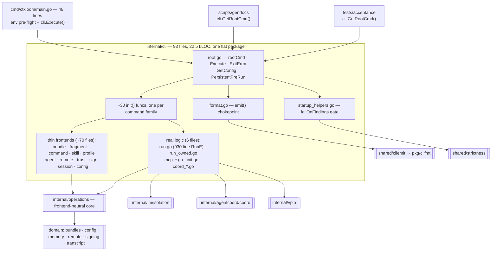

# `internal/cli` — architecture

`internal/cli` is ctxloom's entire command surface: one flat Go package holding
every cobra command, its flags, its rendering, and a handful of runtime helpers
that happen to live here because that is where the cobra tree is. It is the
outermost layer — the intended direction is `cmd/ctxloom` → `internal/cli` →
`internal/operations` → domain, and no file in the package reaches past
`operations`, `config`, `isolation`, or `resources` into domain internals. Its
contract to callers is: parse flags, load config, call exactly one `operations`
function, and render the result through `emit()` in the format the global
`--format` flag selected.

All file:line references are pinned to `0f59fbae` (branch
`docs/architecture-review`), the commit the source review was performed against.

## Layering and the shape of the package

## Structural reality (read this before trusting any layering claim)

| Fact | Value |
|---|---|
| Production files in `internal/cli` | 93 |
| Production LOC | 22,479 |
| Test files | 85 |
| `cmd/ctxloom/main.go` | 48 lines — env pre-flight + zap logger + `cli.Execute()` |
| Largest single unit of logic | `runCmd.RunE`, an anonymous closure spanning `run.go:367-1300` (~930 lines) |
| Package sub-structure | none — no subpackages, no internal layering; files are grouped only by name prefix |
| Command registration | ~30 separate `init()` funcs, each calling `rootCmd.AddCommand(...)` from its own file |
| Shared mutable state | package-level flag globals (20 in `run.go` alone, `run.go:43-81`; more across `skill_cmd.go`/`util_config_write.go` and others) |

The idealised picture — thin cobra frontends over `operations` — is accurate for
roughly 70 of the 93 files. It is **not** accurate for the six exceptions below,
which is where a future reader should look first when behaviour does not match a
command's help text:

| File | Why it is not a thin frontend |
|---|---|
| `run.go` | The `RunE` closure serially performs ~20 unrelated phases (see [run.md](run.md)). Being a func literal, it is invisible to the repo's cyclomatic-complexity tooling. |
| `run_owned.go` | 283 lines of coordinator-driven transport with its own event renderer. |
| `mcp_runner.go` / `mcp_server.go` / `mcp_forward.go` | Five distinct MCP server flavours plus the artifact/report handlers (see [mcp.md](mcp.md)). |
| `init.go` | 1,160 lines: bootstrap, an interactive interview, terminal predicates, dependency probes, and a pty engine launch. |
| `coord_host.go` / `coord_acp.go` | Coordinator lifecycle and per-caller MCP relay handlers — runtime plumbing, not CLI. |
| `startup_helpers.go` | The strict-startup gate and config-warning reporting that `run`/`mcp`/`profile materialize` depend on. |

## Page index

| Page | Covers |
|---|---|
| [entrypoints.md](entrypoints.md) | `cmd/*` binaries, `root.go`, `Execute`, `ExitError`, `PersistentPreRun`, `GetConfig`, startup gates |
| [output-and-format.md](output-and-format.md) | `emit()`, `--format`, which commands honour it, writer conventions, paging |
| [run.md](run.md) | `ctxloom run` — the full launch path and the four transport arms |
| [terminal-and-prompts.md](terminal-and-prompts.md) | Raw-mode ownership, resize, the terminal UI, `stdinReader`/`promptLine`, signals |
| [mcp.md](mcp.md) | `ctxloom mcp *` and the five MCP server surfaces, runner discovery markers |
| [acp-and-coordinator.md](acp-and-coordinator.md) | `ctxloom acp *`, `acpCoordinator`, coordinator hosting and host relays |
| [llm-runners.md](llm-runners.md) | `ctxloom llm list/default/serve/host/turn` and the shared runner standup |
| [bundles-items-skills.md](bundles-items-skills.md) | `bundle`, `fragment`, `command`, `skill`, distillation, `search` |
| [profiles-and-agents.md](profiles-and-agents.md) | `profile *`, `agent *` |
| [sessions-and-memory.md](sessions-and-memory.md) | `session *`, deprecated `memory *`, memory MCP tools, `plan watch` |
| [remotes.md](remotes.md) | `remote add/remove/list/default/pull/browse/discover/update/upgrade` |
| [trust-signing-review.md](trust-signing-review.md) | `trust`, `blacklist`, `sign`, `signer`, `review`, interactive trust prompts |
| [setup-and-diagnostics.md](setup-and-diagnostics.md) | `init`, `config`, `manage`, `container`, `doctor`, `completion`, `version`, `util config-write` |
| [hooks.md](hooks.md) | The hidden `hook` namespace: `hud`, `inject-context`, `stamp-plan`, `session-bind` |

## Package-wide invariants

These are the rules a future change must not break. Each names the single place
the rule lives.

| # | Invariant | Owned by |
|---|---|---|
| I1 | **`internal/cli` owns config loading for commands.** Every command reads config through `GetConfig()` (`root.go:50`) or `GetConfigForUpdate()` (`root.go:66`); both echo `cfg.GetWarnings()` through `printConfigWarnings` (`startup_helpers.go:55`). `operations` never loads config itself. | `root.go:50,66` |
| I2 | **Read/write config split.** `GetConfig` returns the *memoized, shared* config (~35 call sites share one parse); `GetConfigForUpdate` returns a *fresh* instance via `config.LoadFresh`. Any command that mutates and saves config must use the latter, so an abandoned edit cannot leak into later readers in the same process (an MCP/ACP server, the coordinator). | `root.go:62-73` |
| I3 | **One buffered reader over stdin.** `stdinReader` (`run.go:1692-1696`) is the single `bufio.Reader` over `os.Stdin`; every interactive y/N prompt goes through `promptLine`/`promptYesNo` (`run.go:1703,1716`). A fresh `bufio.Reader` per prompt would discard bytes a previous reader buffered past its line. *Real behaviour:* `remote_discover.go:110` opens its own `bufio.NewReader(os.Stdin)` — the only violation in the package. | `run.go:1692-1696` |
| I4 | **`--format` is a presentation choice, never a branch in business logic.** Commands build one result value and hand both it and a text closure to `emit()` (`format.go:43`). See [output-and-format.md](output-and-format.md) for the (large) set of commands that accept `--format` and ignore it. | `format.go:43,62` |
| I5 | **Process-wide flags are applied once, in `PersistentPreRun`** (`root.go:87`): `--degraded`, `--no-companions`, the `CTXLOOM_CONFIG_*` override funnel, and `clidiag`'s structured-diagnostics mode. This depends on no subcommand defining its own `PersistentPreRun` (cobra runs only the closest one; `EnableTraverseRunHooks` is not set anywhere in the repo). | `root.go:86-115` |
| I6 | **Process-owning entry points gate on strictness.** Any command that spawns an engine must take a `strictness.Mark` and call `failOnFindings` (`startup_helpers.go:96`, returns `ExitError{3}`). Honoured by `run` (`run.go:606,1020,1071`), `mcp serve` (`mcp_server.go:144`) and `profile materialize` (`profile_materialize.go:59`). *Real behaviour:* `llm serve`, `llm host`, `llm turn` and `acp server` spawn engines without it. | `startup_helpers.go:96` |
| I7 | **The runner is the one credential holder.** `standUpRunner` scrubs the coordinator credential env from its own process before the engine spawns (`llm_runner_common.go:53-55`), then exports only the socket path. | `llm_runner_common.go:35-121` |
| I8 | **Relayed MCP handlers must derive identity from the caller, not from process env.** `coordCustomHandlers` (`coord_host.go:58`) binds each handler to the caller's credential-derived `coord.Identity`. *Real behaviour:* `handleEvaluateTriggers` (`mcp_tools_triggers.go:59-63`) and `handleResourceSessionsRecent` (`mcp_resources.go:169`) still read process env / `os.Getwd()`. | `coord_host.go:19-21,56-57` |
| I9 | **Exit codes travel as `ExitError`,** not `os.Exit`, so deferred cleanup runs. `Execute` (`root.go:159`) unwraps it with `errors.As`; exit 3 is reserved for a strictness abort. | `root.go:38,159` |
| I10 | **`emit()` renders; the text closure runs only for `--format text`.** A not-found check placed *inside* the text closure therefore does not fire for structured formats. | `internal/shared/cliemit/cliemit.go:30-33` |

## Which commands mutate state

Grouped so a reader can tell at a glance whether invoking something is safe.

**Read-only:** `version`, `doctor`, `container check`/`provenance`/`tooling`,
`config show`/`get`, `bundle list`/`show`/`view`, `fragment|command|skill list`/`show`,
`profile list`/`show`/`export`, `agent list`/`show`, `llm list`, `mcp list`/`server list`/`server show`,
`session list`/`show`/`query`/`watch`, `search`, `remote list`/`browse`/`discover`,
`signer list`/`show`, `plan watch`, `acp entries`, `run --dry-run`.

**Mutates local state:** `init`, `config create`/`edit`, `manage install`/`uninstall`/`hooks *`/`statusline *`/`gitignore install`,
`mcp register`/`unregister`/`server add`/`server remove`, `bundle create`/`edit`/`delete`/`move`/`hold`/`unhold`/`mcp edit`/`import`/`distill`,
`fragment|command create`/`delete`/`edit`/`distill`, `skill create`/`sync`/`import`,
`profile create`/`delete`/`modify`/`edit`/`import`/`materialize`, `agent set`/`default`/`remove`,
`llm default`, `remote add`/`remove`/`default`/`pull`/`update`/`upgrade`,
`bundle trust`/`reject`/`signer add`/`signer remove`, `sign`, `review`,
`session rename`/`forget`/`distill`/`backfill`/`bind`, `util config-write`,
`hook stamp-plan`.

**Publishes to a remote:** `bundle push`, `fragment push`, `command push`, `bundle move --to <remote>`, `skill export`.

**Spawns an engine process:** `run`, `acp server`, `acp client`,
`llm serve`/`host`/`turn`, `init` (launches the vendor TUI for the setup interview),
`bundle distill` / `fragment distill` / `command distill` (spawn an LLM for compression),
`session distill` and the memory MCP tools (spawn a compactor).

## Conventions this package follows unevenly

Documented here because a reader will otherwise assume uniformity that does not exist.

- **Writers.** The convention is `iox.NewErrWriter(cmd.OutOrStdout())` with the
  sticky error returned at the end. Roughly half the package instead uses bare
  `fmt.Printf` to process stdout, which bypasses `cmd.SetOut` (so cobra output
  capture in tests sees nothing) and bypasses the pager seam. Rough counts of
  bare `fmt.Print*` per file, highest first: `init.go` (38), `manage.go` (25),
  `memory.go` (20), `run.go` (18), `item_helpers.go` (18), `search.go` (14).
- **`name == "help"` guard.** Eleven commands short-circuit when their argument is
  the literal `"help"` and print help instead (`agent.go:110,263,348,376`;
  `profile.go:131,216,242,328`; `bundle_edit.go:28,95`; `bundle_list.go:132`).
  It is not applied uniformly — `bundle delete help` and `bundle move help` really
  act on a resource named `help`, and `profile edit` omits the guard its four
  siblings in the same file have.
- **`context.Background()` vs `cmd.Context()`.** Six of seven `skill` subcommands
  (`skill_cmd.go:54,120,170,216,278,326`), `config create` (`config.go:161`) and
  `editProfileFile` (`edit_helpers.go:20,34`) use `context.Background()`, so
  Ctrl-C does not reach the operations layer.
- **Deprecated alias trees** are carried in five places (`signer *` → `trust signer *`,
  `sign` → `bundle sign`, `manage mcp *` → `mcp *`, `manage config *` → `config *`,
  `mcp list|add|remove|show` → `mcp server *`, `fragment search|push`, `memory *` → `session *`,
  `tooling` → `container tooling`, `acp agents` → `acp entries`), against the project's
  stated "no backward-compat shims" rule. Two of them (`trustCmd`, `acpCmd`)
  deliberately hand-roll the deprecation notice rather than using cobra's
  `Deprecated` field, because that field hides the whole subtree from `--help`
  (rationale at `trust.go:44-48`, `acp_cmd.go:30-39`).
- **Cyclomatic complexity.** CI runs `lizard -C 10`; on this tree that command
  exits 1 with 251 warnings, so exceeding CCN 10 is the norm in this package and
  carries no signal. The highest here: `renderOwnedRunEvents` 21 (`run_owned.go:226`),
  `runConfigWrite` 18 (`util_config_write.go:111`),
  `standUpRunner` 17 (`llm_runner_common.go:35`), `newRunnerMCPServer` 16
  (`mcp_runner.go:219`), `runPlanWatch` 16 (`plan_watch.go:48`),
  `adaptChildWatch` 16 (`acp_children.go:55`). `runCmd.RunE` is larger than all of
  them and is not measured at all, because lizard does not descend into func literals.
