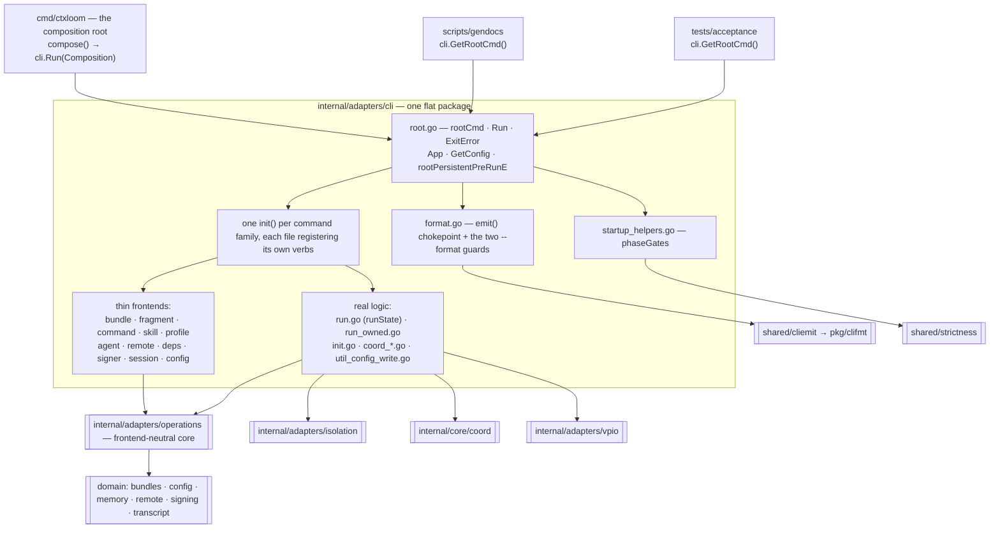

# `internal/adapters/cli` — architecture

`internal/adapters/cli` is ctxloom's entire command surface: one flat Go package holding
every cobra command, its flags, its rendering, and a handful of runtime helpers
that happen to live here because that is where the cobra tree is. It is the
outermost layer — the intended direction is `cmd/ctxloom` → `internal/adapters/cli` →
`internal/adapters/operations` → domain. What the package may import is not
stated here: it is the `archrules.LayeringRules` table
(`internal/shared/archrules/layering.go`), which `archlint` and `tests/arch`
enforce. Its contract to callers is: parse flags, reach configuration through
the one `operations.App` the composition root installed, call the
`operations` function for the verb, and render the result through `emit()` in
the format the global `--format` flag selected.

## Layering and the shape of the package

```mermaid
flowchart TD
    MAIN["cmd/ctxloom — the composition root<br/>compose() → cli.Run(Composition)"]
    GD["scripts/gendocs<br/>cli.GetRootCmd()"]
    ACC["tests/acceptance<br/>cli.GetRootCmd()"]

    MAIN --> ROOT
    GD --> ROOT
    ACC --> ROOT

    subgraph cli["internal/adapters/cli — one flat package"]
        ROOT["root.go — rootCmd · Run · ExitError<br/>App · GetConfig · rootPersistentPreRunE"]
        ROOT --> FMT["format.go — emit() chokepoint + the two --format guards"]
        ROOT --> SH["startup_helpers.go — phaseGates"]
        ROOT --> CMDS["one init() per command family, each file registering its own verbs"]
        CMDS --> THIN["thin frontends:<br/>bundle · fragment · command · skill · profile<br/>agent · remote · deps · signer · session · config"]
        CMDS --> THICK["real logic:<br/>run.go (runState) · run_owned.go<br/>init.go · coord_*.go · util_config_write.go"]
    end

    THIN --> OPS[["internal/adapters/operations — frontend-neutral core"]]
    THICK --> OPS
    THICK --> ISO[["internal/adapters/isolation"]]
    THICK --> COORD[["internal/core/coord"]]
    THICK --> VPIO[["internal/adapters/vpio"]]
    OPS --> DOM[["domain: bundles · config · memory · remote · signing · transcript"]]
    FMT --> CE[["shared/cliemit → pkg/clifmt"]]
    SH --> STR[["shared/strictness"]]
```

The idealised picture — thin cobra frontends over `operations` — is accurate
for most of the package. It is **not** accurate for the exceptions below, which
is where a future reader should look first when behaviour does not match a
command's help text:

| File | Why it is not a thin frontend |
|---|---|
| `run.go` | `runRun` is a sequence of `runState` methods, one per launch phase (see [run.md](run.md)). |
| `run_owned.go` | Coordinator-driven transport with its own event renderer. |
| `init.go` | Bootstrap, an interactive interview, dependency probes, and a pty engine launch. |
| `util_config_write.go` | The guarded merge-writer for foreign config files, with its own verify step and `hew` application record. |
| `startup_helpers.go` | The phase gates that `run` and `profile materialize` close before spawning. |

## Page index

| Page | Covers |
|---|---|
| [entrypoints.md](entrypoints.md) | `cmd/*` binaries, the composition root, `root.go`, `Run`, `ExitError`, `App`, the phase gates |
| [output-and-format.md](output-and-format.md) | `emit()`, `--format`, the two guards that enforce it, writer conventions, paging |
| [run.md](run.md) | `ctxloom run` — the full launch path and the transport arms |
| [terminal-and-prompts.md](terminal-and-prompts.md) | Raw-mode ownership, resize, the terminal UI, `stdinReader`/`promptLine`, signals |
| [mcp.md](mcp.md) | `ctxloom mcp *`, the companion's session-endpoint declaration, and the one MCP surface |
| [llm-runners.md](llm-runners.md) | `ctxloom llm` (engine labels) and `ctxloom runner`, the one runner process |
| [bundles-items-skills.md](bundles-items-skills.md) | `bundle`, `fragment`, `command`, `skill`, distillation, `search` |
| [profiles-and-agents.md](profiles-and-agents.md) | `profile *`, `agent *` |
| [sessions-and-memory.md](sessions-and-memory.md) | `session *`, the memory MCP tools (by pointer), `plan watch` |
| [remotes.md](remotes.md) | `remote *` and `deps *` — the dependency lifecycle |
| [trust-signing-review.md](trust-signing-review.md) | `bundle sign`, `signer`, `bundle trust/reject/forget`, `review`, interactive trust prompts |
| [setup-and-diagnostics.md](setup-and-diagnostics.md) | `init`, `config`, `manage`, `container`, `doctor`, `completion`, `version`, `util config-write` |
| [hooks.md](hooks.md) | The hidden `hook` namespace |

## Package-wide invariants

These are the rules a future change must not break. Each names the single place
the rule lives.

| # | Invariant | Owned by |
|---|---|---|
| I1 | **The composition root mints; the CLI composes.** `config.Open` and `coord.New` are reached only through `cli.Composition`'s closures, and every command reaches configuration through `App()` — one owner, one generation per operation. `GetConfig()` echoes the warnings the reader downgraded from hard errors. `operations` never loads config itself. | `root.go` (`Composition`, `App`, `GetConfig`) |
| I2 | **One buffered reader over stdin.** `stdinReader` is the single `bufio.Reader` over `os.Stdin`; every interactive y/N prompt goes through `promptLine`/`promptYesNo`. A fresh `bufio.Reader` per prompt would discard bytes a previous reader buffered past its line. | `prompt.go` |
| I3 | **`--format` is a presentation choice, never a branch in business logic.** Commands build one result value and hand both it and a text closure to `emit()`. `refuseUnsupportedFormat` (pre-run) and `checkFormatWasHonored` (post-run) make an ignored `--format` a loud error. See [output-and-format.md](output-and-format.md). | `format.go` |
| I4 | **Process-wide flags are applied once, in the root's persistent pre-run** (`rootPersistentPreRunE`): `--degraded`, `--no-companions`, the config-override funnel, and `clidiag`'s structured-diagnostics mode. This depends on no subcommand defining its own persistent hook (cobra runs only the closest one); `TestNoSubcommandDefinesPersistentHooks` fails if one does. | `root.go`, `root_test.go` |
| I5 | **Process-owning entry points close a phase gate before spawning.** Any command that spawns an engine opens `phaseGates` and closes the startup phase, which aborts with `strictness.ExitCodeFatalFindings` on an actionable finding. Honoured by `run` (`runState.gateStartup`) and `profile materialize`; the root's `refuseUnstampedBuild` closes one of its own. | `startup_helpers.go` |
| I6 | **The runner is the one credential holder.** `runner.Main` decodes the reach-back once and unsets it before the engine spawns; the session host keeps only the owner's credential (`mcp.HostCoordinatorForSession`) and stamps nothing on its own environment. | `internal/adapters/runner` |
| I7 | **Relayed MCP handlers derive identity from the caller, not from process env.** `mcp.HostApp.Serve` binds each relayed call to the caller's credential-derived `coord.Identity`; `ctxServer.projectDir` is that identity's project with no cwd fallback (`TestArch_EnvLiteralsOnce` holds the env-key discipline). | `internal/adapters/mcp` |
| I8 | **Exit codes travel as `ExitError`,** not `os.Exit`, so deferred cleanup runs. `run` unwraps it with `errors.As` (`exitCodeFor`); `strictness.ExitCodeFatalFindings` is reserved for a phase-gate abort. | `root.go` |
| I9 | **`emit()` renders; the text closure runs only for `--format text`.** A not-found check placed *inside* the text closure therefore does not fire for structured formats. | `internal/shared/cliemit` |
