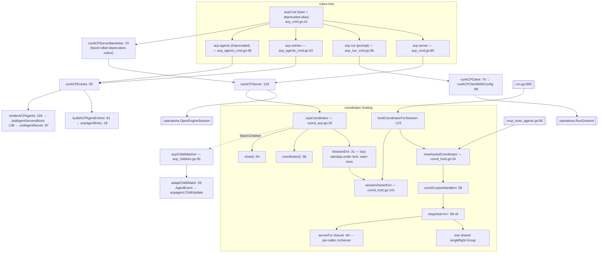

# `ctxloom acp` and coordinator hosting

`ctxloom acp` exposes ctxloom as an Agent Client Protocol server that an editor
(Zed and friends) launches over stdio, plus a client for driving a third-party
ACP agent and an `entries` command that prints paste-ready editor config. Beside
it live two files that are not CLI at all: `coord_acp.go` and `coord_host.go`
stand up and own the per-process `coord.Coordinator` that `acp`, `run` and the
MCP tools all reach delegation through. They live in `internal/cli` because that
is where `ctxServer` is.

## Structure

## Commands

| Command | file:line | Notes |
|---|---|---|
| `ctxloom acp` | `acp_cmd.go:41` | Bare invocation is a deprecated alias for `acp server`. The deprecation notice is hand-rolled (`runACPServerBareAlias:70`) rather than using cobra's `Deprecated` field, because that field would hide the entire subtree from `--help` (documented at `:30-39`). |
| `ctxloom acp server` | `acp_cmd.go:80` | Serves an ACP session over stdio. `registerACPServerFlags:145` binds the shared flag set for both spellings. |
| `ctxloom acp run [prompt]` | `acp_run_cmd.go:56` | Drives a third-party ACP-speaking agent through the plugin door: bare opens a session (`runACPSessionWithConfig`, one typed line per turn, EOF ends it), `--one-shot` drives a single turn (`runACPOneshotWithConfig`). `--llm` is **required** (sentinel `errACPRunLLMRequired`); the backend must be of type `acp`, and the error names the label, the wrong backend, and the fixing command. |
| `ctxloom acp entries` | `acp_agents_cmd.go:33` | Prints one advertisable agent-server entry per configured agent plus a plain `ctxloom` entry, and a Zed `agent_servers` paste block. |
| `ctxloom acp agents` | `acp_agents_cmd.go:48` | Deprecated alias for `entries`; same `runACPEntries` body. |

### `acp server` flags (`registerACPServerFlags`, `acp_cmd.go:145`)

| Flag | Behaviour |
|---|---|
| `--agent <name>` | Serve as a named local agent binding (its composed profiles, engine, runtime). |
| `--workspace <none\|worktree>` | Session workspace axis. Help text says "Honored only together with `--agent` (ISO2)". |

### Types

| Type | file:line | Role |
|---|---|---|
| `acpAgentEntry` | `acp_agents_cmd.go:18` | `{Name, Command, Args, Agent, Engine, Profiles}` — one advertisable ACP agent-server entry. Built once, rendered twice. |
| `zedAgentServer` | `acp_agents_cmd.go:97` | `{Command, Args}` — the value shape of one Zed `agent_servers` map entry. Isolates a foreign schema in one 4-line struct. |
| `acpCoordinator` | `coord_acp.go:18` | `{mu, c *coord.Coordinator, tried bool}` — lazily hosts ONE coordinator per `ctxloom acp` process, with a once-only "already failed" memo. |

## Coordinator hosting

Two consumers, one mechanism.

| Function | file:line | Contract |
|---|---|---|
| `newHostedCoordinator` | `coord_host.go:24` | Resolves project identity, `coord.New`, installs the custom handlers, serves. A `Serve` failure closes before returning. |
| `coordCustomHandlers` | `coord_host.go:58` | Builds the six relay handlers over **one shared** `singleflight.Group`, so concurrent identical distills across per-call `ctxServer`s dedupe. |
| `relayHost&lt;In&gt;` | `coord_host.go:98` | Generic decode → run under the **caller's** identity → encode. Six instantiations. |
| `serverFor` (closure) | `coord_host.go:64-66` | Mints a per-caller `ctxServer` bound to the caller's `coord.Identity`. This is the "per-identity constructor" that two comments elsewhere misname `newCtxServerForIdentity`. |
| `hostCoordinatorForSession` | `coord_host.go:123` | Standup + credential mint for `run`; closes the coordinator if minting fails, so a failure cannot leak a live coordinator. |
| `sessionOwnerEnv` | `coord_host.go:141` | Registers the owner, resolves the reach URL, returns `{coord.EnvCoordURL, coord.EnvCoordCred}` — a **two**-entry map. |
| `(*acpCoordinator).SessionEnv` | `coord_acp.go:31` | Lazy standup under lock; both failure modes warn via `clidiag` once and return nil (documented degradation). |
| `(*acpCoordinator).close` | `coord_acp.go:64` | Locked, idempotent close; deferred at `acp_cmd.go:128`. |
| `acpChildWatcher` / `adaptChildWatch` | `acp_children.go:30`, `:55` | Translate the coordinator's `AgentEvent` stream into `acpagent.ChildUpdate` so an editor can watch delegated children. |

## Invariants

- **One coordinator per process, stood up lazily, torn down on the way out.**
  `acpCoordinator` guards standup with a mutex and a `tried` memo so a failed
  standup is not retried on every session; `close()` is deferred at
  `acp_cmd.go:128`.
- **Relay handlers run under the caller's identity, never the host process's
  env** (`coord_host.go:19-21,56-57`). This is what makes a delegated child's
  memory tool calls resolve to *its* session rather than the host's.
- **The reach-back pair is the whole credential surface.** `sessionOwnerEnv`
  returns exactly `EnvCoordURL` + `EnvCoordCred`; the runner scrubs both from its
  own environment before spawning the engine (`llm_runner_common.go:53-55`).
- **`acp run` refuses a non-`acp` backend** rather than trying and failing
  later (`acpRunBackend`), on both of its forms.
- **`acpCoordinator` satisfies `operations.EngineSessionCoordinator`
  structurally**, deliberately — `operations/engine_session.go:38-40` documents
  the choice as import-cycle avoidance. There is no
  `var _ operations.EngineSessionCoordinator = (*acpCoordinator)(nil)` assertion
  on either side, so a signature drift surfaces at the call site
  (`acp_cmd.go:135`) rather than at the type.

## Documented vs real

- `--workspace worktree` without `--agent` is silently discarded:
  `acpWorkspaceAxis` (`internal/operations/engine_session.go:671-674`) returns the
  empty axis whenever `flagAgent == ""` or the current agent differs, with no
  warning and no error, and `acp_cmd.go` has no `PreRunE` validating the pair.
  (The ISO4 summary does report "NOT isolated", so the drop is not entirely
  invisible.)
- `acp server` does not call `printConfigWarnings` or `failOnFindings`, so it is
  one of the process-owning entry points that launches an engine on a config the
  strict gate would have rejected — the same gap as `llm serve|host|turn`.
- `adaptChildWatch` (`acp_children.go:55-110`) handles 3 of the 16 `AgentEvent`
  payload variants (`RunStarted`, `MessageDelta`, `RunCompleted`) with no
  `default` case, so an editor watching a child never sees tool activity, status
  transitions, interactions, artifacts or summaries.
- `acpAgentEntry` hard-codes the argv `{"acp","server","--agent",name}` in
  `acp_agents_cmd.go`, three files away from where those command names are
  defined — renaming `acp server` would silently emit a broken editor config.
- `zedAgentServersBlock` discards both `json.Marshal` errors (`:140-141`).
- The doc comments at `coord_acp.go:26`, `coord_host.go:120` and
  `operations/engine_session.go:42` all say "the coordinator reach-back **trio**";
  `sessionOwnerEnv` returns two entries (the third was retired by D2, as
  `sessionOwnerEnv`'s own comment at `:136-140` explains).
