# Bundles, items, skills, distillation, and search

A **bundle** is the unit of distribution: a named directory of fragments,
commands (formerly "prompts"), skills, MCP server declarations, hooks and
profiles. `ctxloom bundle *` is its CRUD; `ctxloom fragment *` and
`ctxloom command *` are two instantiations of one generic item surface in
`item_helpers.go`; `ctxloom skill *` is a separate, package-shaped item kind with
its own archive/signature story. Distillation (LLM or structural compression of
an item's content) and `ctxloom search` (unified local + remote content search)
sit alongside because both are cross-item operations.

The reference grammar used throughout is `bundle-name#fragments/name`,
`bundle#commands/name`, `bundle#skills/name` — parsed by `parseItemRef`
(`item_helpers.go:44`) and built from `ItemType.prefix()` (`:39`).

## Structure

```mermaid
flowchart TD
    subgraph bundle["bundle_*.go"]
        BL["bundle list — bundle_list.go:17"] --> RBL["runBundleList :26 → renderBundleList :60"]
        BS["bundle show — :121"] --> RBS["runBundleShow :130 → renderBundleShow :197"]
        RBS -.->|"TTY + non-json only"| OBT["offerBundleTrust (trust_interactive.go:105)"]
        BC["bundle create — bundle_edit.go:17"] --> RBC["runBundleCreate :26"]
        BE["bundle edit — :79"] --> RBE["runBundleEdit :93 → placeholders&lt;T&gt; :154"]
        BD["bundle delete — :186"] --> RBD["runBundleDelete :199 → stdinConfirmer :238"]
        BM["bundle move --to — bundle_move.go:19"] --> RBM["runBundleMove :55"]
        BH["deps hold / unhold — bundle_hold_cli.go:19,55"] --> HI["holdItem :41"]
        BV["bundle view name#path — bundle_view.go:30"] --> RBV["runBundleView :56 → renderBundleViewItem :116"]
        BX["bundle export / import / push — bundle_transfer.go"] --> OPS
        BMC["bundle mcp edit — bundle_items.go:33"] --> RBME["runBundleMCPEdit :47 → editInEditor :105"]
    end

    subgraph items["item_helpers.go — fragment + command share one body"]
        IT["ItemType (fragment | command) :31"] --> PIR["parseItemRef :44"]
        LI["listItems :235"] --> LIR["listItemRows :143"] --> CS["classifySource :124"] --> RUM["remoteURLMap :105"]
        LI --> FB["filterByBundle :185"] --> PII["printItemInfos :199"]
        LI --> SIT["stampItemTrust :224"]
        SI["showItem :314"] --> LBFI["loadBundleForItem :269"] --> IDC["itemDisplayContent :289"]
        EI["editItem :416"] --> DFE["distillerForEdit :472"]
        PB["pushBundle :553"] --> PBC["pushBundleCfg :569"] --> PPR["printPushResult :608"]
        DI["distillItem :501"]
    end

    subgraph skill["skill_cmd.go"]
        SK["skill list/show/create/sync/export/import :44-297"] --> OPSK[["operations.*Skill"]]
    end

    subgraph distill["distillation"]
        BDC["bundle distill &lt;glob&gt; — bundle_distill.go:31"] --> RBDI["runBundleDistill :77"]
        RBDI --> EDF["expandDistillFiles :200"]
        RBDI --> DBF[["operations.DistillBundleFile"]]
        DIS["mcpLLMDistillerSDK — distiller.go:50"] --> DWM["distillWithModel :345"]
        DWM --> ISC["isStructuredContent :364 — AST/JSON compression first"]
        DWM --> DWL["distillWithLLM :410 → cleanDistilledOutput :509"]
        DIS --> BSC["buildSiblingContext :264"]
        NLD["newLLMDistiller(ForLabel) — distiller.go:15,26"] --> DIS
        DFE --> NLD
        DI --> NLD
    end

    subgraph search["search.go"]
        SC2["ctxloom search &lt;query&gt; :33"] --> RUS["runUnifiedSearch :93"]
        RUS --> RSE["runSearches :190 — concurrent local + remote"]
        RSE --> SLC["searchLocalContent :221"] & SRC["searchRemoteContent :240"]
        RUS --> PUR["printUnifiedResults :256"]
    end

    OPS[["internal/operations"]]
    items --> OPS
    bundle --> OPS
```

## Command inventory

### `ctxloom bundle` (`bundle.go:8`; flags registered centrally at `bundle.go:28`)

| Command | file:line | Flags |
|---|---|---|
| `list` | `bundle_list.go:17` | — |
| `show <name>` | `bundle_list.go:121` | `-i` (interactive trust review; TTY + non-json only) |
| `create <name>` | `bundle_edit.go:17` | description/fragments/commands/mcp placeholders |
| `edit <name>` | `bundle_edit.go:79` | add/remove fragments, commands, MCP |
| `delete <name>` | `bundle_edit.go:186` | `--force` (else y/N via `stdinConfirmer`) |
| `move <name> --to <remote\|path>` | `bundle_move.go:19` | `--to` (required) |
| `distill <file-pattern>...` | `bundle_distill.go:31` | `--dry-run`, `--llm` |
| `hold <name>` / `unhold <name>` | `bundle_hold_cli.go:19,55` | — |
| `view <name[#path]>` | `bundle_view.go:30` | `--distilled` |
| `push <name> [remote]` | `bundle_transfer.go:20` | `--pr`, `--message`, `--sign`, `--no-sign` |
| `export <name> [dest-dir]` | `bundle_transfer.go:49` | — |
| `import <path>` | `bundle_transfer.go:97` | — |
| `mcp edit <bundle> <mcp>` | `bundle_items.go:33` | — |
| `sign [ref]` | `sign.go:85` | see [trust-signing-review.md](trust-signing-review.md) |

### `ctxloom fragment` / `ctxloom command`

Identical trees over `ItemType` (`fragment.go:8`, `command_cmd.go:8`):
`list` (`--bundle`), `show <ref>`, `create <bundle> <name>`, `delete <ref>`,
`edit <ref>` (`--no-distill`), `distill <ref>`, `push <bundle> [remote]`.
`fragment search` (`fragment.go:138`) and `fragment push` (`:173`) are deprecated
shims delegating to `search --type fragment` and `pushBundle`.

`command push` (`command_cmd.go:143`) is a full second copy of `bundle push` —
four parallel flag vars, four duplicate registrations, and a line-for-line
identical body.

### `ctxloom skill` (`skill_cmd.go:22`)

| Command | file:line | Notes |
|---|---|---|
| `list` | `:44` | `--bundle` filter |
| `show <bundle>#skills/<name>` | `:105` | frontmatter + body + manifest |
| `create <bundle> <name>` | `:151` | scaffolds a skill package |
| `sync <bundle>[#skills/<name>]` | `:189` | recomputes the manifest |
| `export <bundle>#skills/<name>` | `:242` | packs a signed zip; the only skill subcommand that rejects a malformed ref (`:263`) |
| `import <archive>` | `:297` | `--bundle` required; reports signature state |

### `ctxloom search <query>` (`search.go:33`)

`--type` (fragment\|command\|skill\|mcp_server\|profile), `--tag`, `--local`,
`--remote`. `searchScopes` (`:154`) turns the two booleans into a scope pair —
both set means both. Local results are capped at 100, with `HiddenLocal` in the
JSON output and a stderr hint (`noteHiddenLocalMatches` `:144`) so a truncated
result never reads as complete.

## Distillation

Two mechanisms behind one verb:

1. **Structural compression** — `isStructuredContent` (`bundle_distill.go:364`)
   allowlists 7 content types; those go through AST/JSON compression first.
2. **LLM compression** — `distillWithLLM` (`:410`) spawns the plugin client and
   runs one oneshot turn, then `cleanDistilledOutput` (`:509`) strips the noise
   banner, a conversational preamble, a stray `---` rule and a wrapping code
   fence. A non-zero exit *or* a reply that `looksConversational` (`:541`) both
   become errors, so the item stays raw rather than being overwritten with chat.

`buildSiblingContext` (`:264`) gives the distiller the bundle header plus a
listing of the item's siblings, so a fragment is compressed knowing what else is
in its bundle. `buildDistillMessage` (`:382`) assembles prompt + sibling context
+ tagged content.

`loadDistillPrompt` (`:247`) prefers the bundle's own `distill` command body over
the built-in prompt.

## Invariants

- **The ref grammar has one parser and one builder.** `parseItemRef`
  (`item_helpers.go:44`) splits, `ItemType.prefix()` (`:39`) builds. Three
  distinct, actionable error messages quoting the input.
- **`bundle view` renders identically in text and JSON.** `bundleViewResult`
  (`bundle_view.go:22`) carries the exact bytes `--format text` prints in its
  `Content` field, so structured consumers see the same thing a human does.
  `writeViewContent` (`:174`) always emits a trailing newline, so "wrote nothing"
  is visually distinguishable.
- **Bundle listings are deterministic.** Renderers iterate the sorted accessors
  `bundle.FragmentNames()` / `PromptNames()` (`internal/bundles/bundles.go:683-690`)
  rather than ranging over maps — used at `bundle_list.go:211,219`.
- **Signing is resolved before any network call.** `pushBundleCfg`
  (`item_helpers.go:569`) checks `--sign`/`--no-sign` mutual exclusion and
  resolves the signer up front.
- **The distiller fails closed.** `distillWithLLM` refuses empty distilled output
  (`:488`) and conversational replies, so a failed compression leaves the item's
  raw content intact.
- **Trust stamps are `--format json` only.** `stampItemTrust`
  (`item_helpers.go:224`) and `stampMCPTrust` (`mcp.go:139`) populate the
  `Trusted`/`TrustSource`/`State` fields on their rows only under structured
  output; the invariant is enforced by a comment (`item_helpers.go:90-95`), not
  by the type.

## Documented vs real

- `bundle mcp edit` with an emptied editor buffer destroys the entry and reports
  success: `yaml.Unmarshal("")` returns a nil error and a zero struct,
  `operations.applyMCPEdits` (`internal/operations/bundles.go:477-483`) overwrites
  `Command`/`Args`/`Env`/`Notes`/`Installation` unconditionally, and
  `bundle_items.go:98` prints "Updated MCP server …". `editItem`
  (`item_helpers.go:437-455`) has the same shape for fragments and commands —
  the only guard is "did the content change".
- `bundle distill` collects per-file errors into `result.Errors` and exits 0 even
  when every input file failed and nothing was written (`bundle_distill.go:111-140`).
- `deps hold`/`unhold` on an item not in the lockfile print to **stdout** and
  exit 0; the "nothing happened" bool is discarded at the call site
  (`bundle_hold_cli.go:34`).
- `fragment list --bundle nosuchbundle` prints `Fragments (0):` and exits 0 — the
  empty-result branch tests the **unfiltered** slice (`item_helpers.go:246-264`).
  `skill list --bundle X` has the same shape (`skill_cmd.go:59-79`).
- `runSearches` (`search.go:190-216`) warns on both the local and remote error
  and returns only the (nil) result slices, so a search whose halves both failed
  prints "No results found." and exits 0.
- `newLLMDistillerForLabel` (`distiller.go:26-45`) has three silent `return nil`
  paths — empty label, prompt-load error, unresolved backend — so
  `ctxloom command distill --llm <typo>` stores raw content and exits 0.
- `appendSiblingFragments` / `appendSiblingPrompts` (`bundle_distill.go:311,327`)
  range over the bundle's maps directly rather than the sorted accessors every
  other renderer uses, so the sibling context sent to the distiller varies
  run-to-run. `renderBundleMCPEntry` (`bundle_list.go:240-242`) iterates `Env`
  unsorted for the same reason.
- `cli.ItemType` (`item_helpers.go:31`) is a verbatim duplicate of
  `operations.ItemKind` (`internal/operations/items.go:22-27`), cross-converted at
  four sites. Both switches over it (`listItemRows:180`, `itemDisplayContent:306`)
  fall through to a success-with-empty-payload return rather than erroring.
- `loadBundleForItem` + `itemDisplayContent` re-implement
  `operations.GetItemContent`, minus its `Kind.valid()` guard.
- `skill sync 'bundle#skills/'` (trailing separator) widens to a whole-bundle
  sync instead of rejecting the empty name (`skill_cmd.go:212-215`).
- Six of the seven `skill` subcommands use `context.Background()`
  (`skill_cmd.go:54,120,170,216,278,326`); `skill export` uses `cmd.Context()` at
  `:272` and `context.Background()` six lines later at `:278`.
- `bundle.go`'s `init()` (`:58-87`) registers flags for commands defined in eight
  other files, while `bundle_distill.go` and `bundle_move.go` declare their flag
  *vars* locally — only the registration is remote.
- `bundle distill`'s entire text path uses unchecked `fmt.Fprintf` and writes its
  error lines to `os.Stderr` rather than `cmd.ErrOrStderr()`, so acceptance tests
  cannot capture them.
