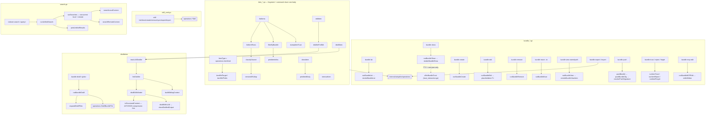

# Bundles, items, skills, distillation, and search

A **bundle** is the unit of distribution: a named directory of fragments,
commands (formerly "prompts"), skills, MCP server declarations, hooks and
profiles. `ctxloom bundle *` is its CRUD; `ctxloom fragment *` and
`ctxloom command *` are two instantiations of one generic item surface
(`item_crud.go`, `item_list.go`, `item_kind.go`); `ctxloom skill *` is a
separate, package-shaped item kind with its own archive/signature story.
Distillation (LLM or structural compression of an item's content) and
`ctxloom search` (unified local + remote content search) sit alongside because
both are cross-item operations.

The reference grammar used throughout is `bundle-name#fragments/name`,
`bundle#commands/name`, `bundle#skills/name` — split by `itemRefTarget` and
built from `itemRefPrefix`. `cli.ItemType` is an alias of
`operations.ItemKind`, so the kind vocabulary has one definition.

## Structure

```mermaid
flowchart TD
    subgraph bundle["bundle_*.go"]
        BL["bundle list"] --> RBL["runBundleList → renderBundleList"]
        BS["bundle show"] --> RBS["runBundleShow → renderBundleShow"]
        RBS -.->|"TTY + non-json only"| OBT["offerBundleTrust (trust_interactive.go)"]
        BC["bundle create"] --> RBC["runBundleCreate"]
        BE["bundle edit"] --> RBE["runBundleEdit → placeholders&lt;T&gt;"]
        BD["bundle remove"] --> RBD["runBundleRemove"]
        BM["bundle move --to"] --> RBM["runBundleMove"]
        BV["bundle view name#path"] --> RBV["runBundleView → renderBundleViewItem"]
        BX["bundle export / import"] --> OPS
        BP["bundle push"] --> PB["pushBundle → pushBundleCfg → resolvePushSignature"]
        BT["bundle trust / reject / forget"] --> RIT["runItemTrust / runItemReject / runItemForget"]
        BMC["bundle mcp edit"] --> RBME["runBundleMCPEdit → editInEditor"]
    end

    subgraph items["item_*.go — fragment + command share one body"]
        IT["ItemType = operations.ItemKind"] --> PIR["itemRefTarget / itemRefPrefix"]
        LI["listItems"] --> LIR["listItemRows"] --> CS["classifySource"] --> RUM["remoteURLMap"]
        LI --> FB["filterByBundle"] --> PII["printItemInfos"]
        LI --> SIT["stampItemTrust"]
        SI["showItem"] --> PIB["printItemBody"]
        EI["editItem"] --> DFE["distillerForEdit"]
        RI["removeItem"]
        DI["distillItem"]
    end

    subgraph skill["skill_cmd.go"]
        SK["skill list/show/create/remove/sync/export/import"] --> OPSK[["operations.*Skill"]]
    end

    subgraph distill["distillation"]
        BDC["bundle distill &lt;glob&gt;"] --> RBDI["runBundleDistill"]
        RBDI --> EDF["expandDistillFiles"]
        RBDI --> DBF[["operations.DistillBundleFile"]]
        DIS["llmDistiller"] --> DWM["distillWithModel"]
        DWM --> ISC["isStructuredContent — AST/JSON compression first"]
        DWM --> DWL["distillWithLLM → cleanDistilledOutput"]
        DIS --> BSC["buildSiblingContext"]
        NLD["newLLMDistiller"] --> DIS
        DFE --> NLD
        DI --> NLD
    end

    subgraph search["search.go"]
        SC2["ctxloom search &lt;query&gt;"] --> RUS["runUnifiedSearch"]
        RUS --> RSE["runSearches — concurrent local + remote"]
        RSE --> SLC["searchLocalContent"] & SRC["searchRemoteContent"]
        RUS --> PUR["printUnifiedResults"]
    end

    OPS[["internal/adapters/operations"]]
    items --> OPS
    bundle --> OPS
```

## The command families

- **`ctxloom bundle`** — its verbs are registered in `bundle.go`'s `init`, with
  the flags of each verb registered from that verb's own file. `bundle show -i`
  offers the interactive trust review only on a TTY and only for a text render,
  so a structured consumer never sees a prompt.
- **`ctxloom fragment` / `ctxloom command`** — identical trees over `ItemType`
  (`fragment.go`, `command_cmd.go`); every verb is one of the shared bodies in
  `item_crud.go`/`item_list.go`. `fragment premises` is the one verb with no
  `command` twin.
- **`ctxloom skill`** — each verb hands straight to its `operations.*Skill`
  function. `skill export` packs a zip, signed under `--sign`; `skill import`
  reports the archive's signature state.
- **`ctxloom search <query>`** — `--type`, `--tag`, `--local`, `--remote`.
  `searchScopes` turns the two booleans into a scope pair — both set means both.
  Local results are capped, with `HiddenLocal` in the JSON output and a stderr
  hint (`noteHiddenLocalMatches`) so a truncated result never reads as complete.
  `searchFullyFailed` is why a search whose every attempted half errored is an
  error rather than "No results found."

## Distillation

Two mechanisms behind one verb:

1. **Structural compression** — `isStructuredContent` allowlists the content
   types that go through AST/JSON compression first.
2. **LLM compression** — `distillWithLLM` spawns the plugin client and runs one
   oneshot turn, then `cleanDistilledOutput` strips the noise banner, a
   conversational preamble, a stray `---` rule and a wrapping code fence. A
   non-zero exit *or* a reply that `looksConversational` both become errors, so
   the item stays raw rather than being overwritten with chat.

`buildSiblingContext` gives the distiller the bundle header plus a listing of
the item's siblings, so a fragment is compressed knowing what else is in its
bundle. `buildDistillMessage` assembles prompt + sibling context + tagged
content. `loadDistillPrompt` prefers the bundle's own `distill` command body
over the built-in prompt; `refuseWithheldDistillPrompt` is the one error
`newLLMDistiller` returns — a configured `distill` prompt the trust gate
withheld is a refusal, not a warn-and-continue, because a run that silently
proceeded on the built-in prompt would be indistinguishable from working.

## Invariants

- **The ref grammar has one splitter and one builder.** `itemRefTarget`
  splits, `itemRefPrefix` builds.
- **`bundle view` renders identically in text and JSON.** `bundleViewResult`
  carries the exact bytes `--format text` prints in its `Content` field, so
  structured consumers see the same thing a human does. `writeViewContent`
  always emits a trailing newline, so "wrote nothing" is visually
  distinguishable.
- **Bundle listings are deterministic.** Renderers iterate the sorted accessors
  `Bundle.FragmentNames()` / `Bundle.PromptNames()` rather than ranging over
  maps.
- **Signing is resolved before any network call.** `pushBundleCfg` checks
  `--sign`/`--no-sign` mutual exclusion and `resolvePushSignature` resolves the
  signer up front.
- **The distiller fails closed.** `distillWithLLM` refuses empty distilled
  output and conversational replies, so a failed compression leaves the item's
  raw content intact. `newLLMDistiller` returning no distiller (no label
  resolves) stores content RAW and says so on stderr; `distillerOrNone` is the
  seam that turns that into the operations layer's no-op distiller.
- **Trust stamps are structured-output only.** `listItems` calls
  `stampItemTrust` only when `wantsStructuredOutput`, because the stamp
  materializes and hashes every item and the cheaper ref-only human listing
  should not pay for it.
