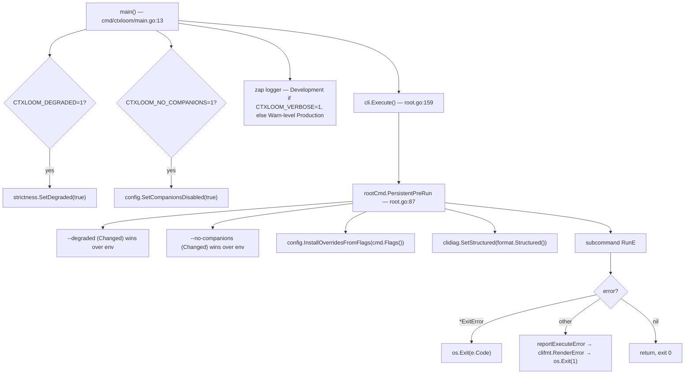
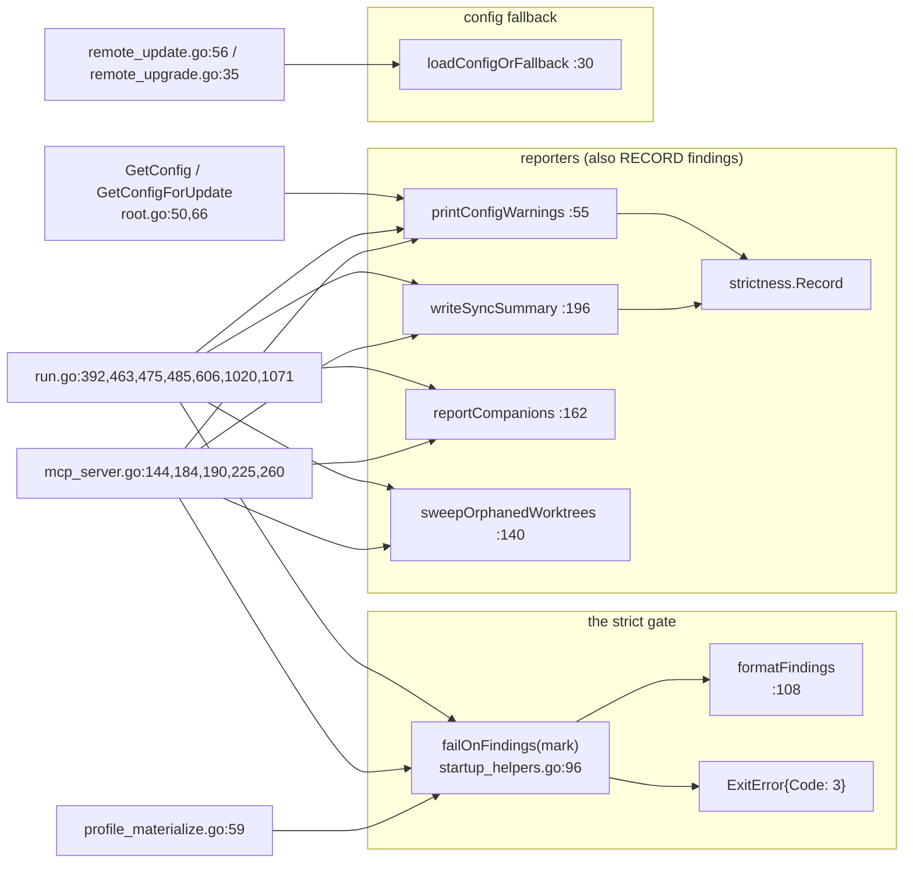

# Entrypoints — `cmd/*` and `internal/cli/root.go`

Every ctxloom binary is a `main` that does almost nothing: `cmd/ctxloom/main.go`
is 48 lines of environment pre-flight plus `cli.Execute()`, and the entire
command tree lives in `internal/cli`. `root.go` owns the root cobra command, the
three persistent flags, the process-wide `PersistentPreRun` side effects, config
loading for the whole package, and top-level error rendering + exit-code
mapping. `startup_helpers.go` owns the shared startup reporting and the strict
gate that process-owning commands must pass before they spawn anything.

## Binaries under `cmd/`

| Binary | Lines (prod) | Role |
|---|---|---|
| `cmd/ctxloom` | 48 | The product. Env pre-flight → `cli.Execute()`. |
| `cmd/harp` | 116 + 31 + 33 | Standalone harp-name generator; defines its own `resolveFormat` (`cmd/harp/root.go:113`), a name collision with `internal/cli/format.go:51`. |
| `cmd/taskloom` | ~2,900 | The task-tracking companion — separate cobra root, its own MCP server. Not part of `internal/cli`. |
| `cmd/ltk` | ~1,100 | The tool-rule hook companion. Separate root. |
| `cmd/gen-schemas` | 43 | Reflects over `cli.SchemaTargets()` (`schematargets.go:16`) to emit JSON schemas. Build-tagged. |
| `cmd/mockengine` | 122 | Test double engine used by the conformance suites. |
| `cmd/acpl1harness` | 325 | ACP level-1 conformance harness. |
| `cmd/validate` | 48 | Schema validation utility. |

Only two things import `internal/cli`: `cmd/ctxloom` (via `cli.Execute`) and
`scripts/gendocs` (via `cli.GetRootCmd()`, `root.go:155`). `tests/acceptance`
also walks `GetRootCmd()`.

## `cmd/ctxloom/main.go` — what happens before cobra

The env vars are read **before** dispatch on purpose: the pre-cobra window
(config discovery, `projectroot`) already runs, and companion probing *executes*
binaries found on PATH. There is deliberately no config key for `--degraded` — a
broken config cannot excuse itself (`cmd/ctxloom/main.go:19-20`).

## `root.go` inventory

| Symbol | file:line | Notes |
|---|---|---|
| `rootCmd` | `root.go:76` | `SilenceUsage`/`SilenceErrors` both true — `Execute` owns error printing, otherwise cobra prints every error twice and dumps usage even for a wrapped LLM's ordinary nonzero exit. |
| `PersistentPreRun` closure | `root.go:87` | Four process-wide effects; see diagram. |
| `ExitError` | `root.go:38` | `{Code int}`. 44 references package-wide. The mechanism by which a wrapped engine's exit code survives deferred cleanup. |
| `GetConfig()` | `root.go:50` | Shared memoized config + warning echo. ~93 references. |
| `GetConfigForUpdate()` | `root.go:66` | `config.LoadFresh` + warning echo. 5 production call sites (`mcp.go`, `agent.go`, `llm_default.go`). Body is otherwise identical to `GetConfig`. |
| `GetRootCmd()` | `root.go:155` | The only export seam; `rootCmd` itself is unexported. |
| `Execute()` | `root.go:159` | Runs the tree; `errors.As` for `ExitError`, else render + exit 1. |
| `reportExecuteError` | `root.go:184` | Renders a top-level error in the selected format. Explicit test seam. |
| `init()` | `root.go:190` | Version string, three persistent flags, `isolation.SetBinaryVersion`. |

### Persistent flags (available on every command)

| Flag | Registered | Effect |
|---|---|---|
| `--format` | `format.go:63` | `json`, `yaml`, `toml`, `text` (default), `markdown`. See [output-and-format.md](output-and-format.md). |
| `--degraded` | `root.go:190` block | Downgrades strictness findings from fatal to advisory. Env fallback `CTXLOOM_DEGRADED=1`. |
| `--no-companions` | `root.go:190` block | Disables companion (taskloom/ltk) discovery. Env fallback `CTXLOOM_NO_COMPANIONS=1`. *Real behaviour:* the loadout path honours it (`config.go:1780`), the **version probe** does not — `reportCompanions` (`startup_helpers.go:166`) still execs companions from `run.go:475` and `mcp_server.go:184`. |
| `--config-set` / `CTXLOOM_CONFIG_*` | via `config.InstallOverridesFromFlags`, `root.go:110` | Captured exactly once per process in `PersistentPreRun`; every later `config.Load` resolves through the funnel. |

## `startup_helpers.go` — the shared startup layer

| Function | file:line | Contract |
|---|---|---|
| `loadConfigOrFallback` | `:30` | On load failure, warns and returns a minimal `.ctxloom`-rooted fixture rather than aborting. Used only by `deps check`/`upgrade`. |
| `printConfigWarnings` | `:55` | Echoes each `config.Warning` to the writer **and** records it as a strictness finding. Called unconditionally from both `GetConfig` variants. *Real behaviour:* it uses the non-deduping `Record`/`Fwarn`, and `config.Load` memoizes, so a long-lived `ctxloom mcp` re-fires the same finding on every tool call. |
| `configWarningClass` / `configWarningFixIt` | `:66`, `:75` | Map `config.WarningKind` → strictness class / human fix-it text. |
| `failOnFindings` | `:96` | The strict gate. Prints every recorded finding since `mark` and returns `ExitError{3}`. No-op when degraded. |
| `formatFindings` | `:108` | Builds the abort block; testable seam. Empty when degraded or when there are none. |
| `sweepOrphanedWorktrees` | `:140` | Reaps crashed runs' worktrees at startup. Silent unless something was reaped. Only `result.Reaped` is consulted — the reaper's own failure surface is discarded. |
| `reportCompanions` | `:162` | Probes `taskloom`/`ltk` on PATH; logs version or warns. Never gates. |
| `writeSyncSummary` | `:196` | Prints dependency-sync status **and** records fatal sync findings. |

Naming note worth knowing: two functions named `print*`/`write*`
(`printConfigWarnings`, `writeSyncSummary`) also mutate process-wide strictness
state — a side effect their names disclaim.

## Invariants owned here

- **I1/I2 (config loading).** `internal/cli` is the only layer that loads config
  for a command. `operations` takes a `*config.Config` it is handed.
- **I5 (`PersistentPreRun` runs for everything).** Cobra runs only the closest
  `PersistentPreRun` unless `cobra.EnableTraverseRunHooks` is set. It is not set
  anywhere in the repo (`rg EnableTraverseRunHooks` → 0 hits). The invariant
  holds today because no `internal/cli` subcommand defines one — asserted only in
  a comment at `root.go:86`. The day one does, `--degraded`, `--no-companions`,
  `--config-set` and structured `clidiag` silently stop working for that whole
  subtree, with no build or test failure.
- **I6 (strict gate before spawning).** The contract is stated verbatim at
  `startup_helpers.go:44-54`: *every startup path that consumes a loaded config
  must surface its warnings, otherwise a corrupted `config.yaml` silently
  launches an empty-context session.* Honoured by `run`, `mcp serve`,
  `profile materialize`. Not honoured by
  `llm serve`/`host`/`turn` (`llm_runner_common.go:62`), or `acp server`.
- **I9 (exit codes).** Exit 3 = strictness abort. Exit 1 = any other error, via
  `reportExecuteError`. A wrapped engine's own exit code arrives as
  `ExitError{Code: status.Code}` (`run.go:1296`).

## Documented vs real

- `root.go:86` asserts "No subcommand defines its own `PersistentPreRun`, so this
  runs for all" — true today, unenforced by anything.
- `resolveFormat` exists twice under the same name: `internal/cli/format.go:51`
  and `cmd/harp/root.go:113`.
- `childExitCode` (`exitcode_unix.go:15`, `exitcode_windows.go:10`) has zero
  production call sites on either platform; its sole caller was deleted in
  `ec87713c`. The shell-conventional `128+signal` propagation it names is
  therefore not delivered anywhere — the three live exit-code paths use
  `&ExitError{Code: 1}` (`run_owned.go:275`), `status.Code` (`run.go:1296`) and
  `result.ExitCode` (`llm_turn.go:91`).
