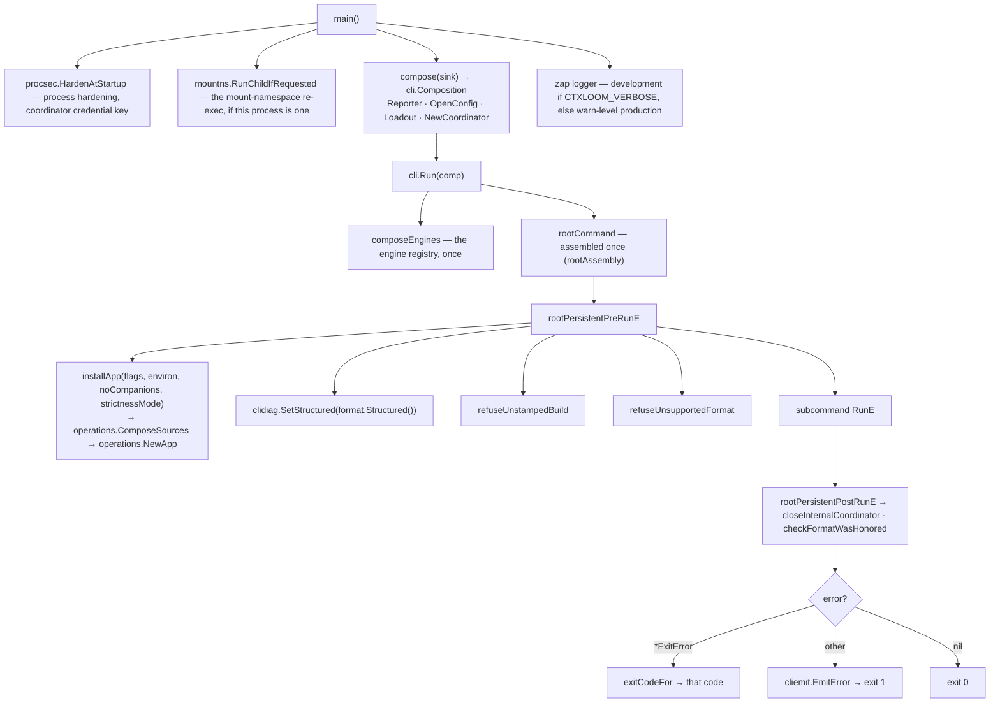

# Entrypoints — `cmd/*` and `internal/adapters/cli/root.go`

Every ctxloom binary is a `main` that does almost nothing. `cmd/ctxloom` is
the **composition root**: it hardens the process, builds a `cli.Composition`
(`compose.go`) and hands it to `cli.Run`; the entire command tree lives in
`internal/adapters/cli`. `root.go` owns the root cobra command, the
persistent flags, the process-wide `PersistentPreRun` side effects, the one
`operations.App` every command reaches configuration through, and top-level
error rendering + exit-code mapping. `startup_helpers.go` owns the phase
gates that process-owning commands must close before they spawn anything.

## Binaries under `cmd/`

`cmd/ctxloom` is the product. Its siblings under `cmd/` are separate roots —
the companions (`taskloom`, `ltk`, `harp`), build-time tools (`gen-schemas`
reflects over `cli.SchemaTargets()`; `archlint` is the architectural gate;
`validate`), and test doubles (`mockengine`, `probe-mcp-server`). None of the
siblings share `internal/adapters/cli`'s cobra tree; the ones that import the
package at all do so for a seam it exports (`cli.SchemaTargets`,
`cli.GetRootCmd` for `scripts/gendocs` and the acceptance coverage gate).

## `cmd/ctxloom` — what happens before cobra

```mermaid
flowchart TD
    M["main()"]
    M --> PS["procsec.HardenAtStartup — process hardening, coordinator credential key"]
    M --> MN["mountns.RunChildIfRequested — the mount-namespace re-exec, if this process is one"]
    M --> CO["compose(sink) → cli.Composition<br/>Reporter · OpenConfig · Loadout · NewCoordinator"]
    M --> LOG["zap logger — development if CTXLOOM_VERBOSE, else warn-level production"]
    CO --> RUN["cli.Run(comp)"]
    RUN --> CE["composeEngines — the engine registry, once"]
    RUN --> RC["rootCommand — assembled once (rootAssembly)"]
    RC --> PPR["rootPersistentPreRunE"]
    PPR --> IA["installApp(flags, environ, noCompanions, strictnessMode)<br/>→ operations.ComposeSources → operations.NewApp"]
    PPR --> FG["clidiag.SetStructured(format.Structured())"]
    PPR --> RUB["refuseUnstampedBuild"]
    PPR --> RUF["refuseUnsupportedFormat"]
    PPR --> RUNE["subcommand RunE"]
    RUNE --> POST["rootPersistentPostRunE → closeInternalCoordinator · checkFormatWasHonored"]
    POST --> ERR{"error?"}
    ERR -->|"*ExitError"| CODE["exitCodeFor → that code"]
    ERR -->|other| REP["cliemit.EmitError → exit 1"]
    ERR -->|nil| OK["exit 0"]
```

`Composition` is what the composition root decides once per process: the
`report.Sink` every component reports through, the one way to open the config
owner (`operations.ConfigOpener`) and the one way to construct the runtime
coordinator. `config.Open` and `coord.New` are called only inside the root's
closures — the one-mint-one-owner rule — so the CLI parses flags and renders,
and the application services compose from what they were handed.

`--degraded` comes from `CTXLOOM_DEGRADED` with an explicitly set flag winning
in either direction (`strictnessMode`). There is deliberately **no config key**
for it: a broken config cannot excuse itself.

## `root.go`

- `rootCmd` sets `SilenceUsage`/`SilenceErrors` — `run` owns error printing,
  otherwise cobra prints every error twice and dumps usage even for a wrapped
  LLM's ordinary nonzero exit.
- `App()` returns the process's `operations.App`. A command reached without
  the root's `PersistentPreRun` (a test driving `RunE` directly) composes from
  the process environment on first use; `SetAppForTesting` installs a fixture.
- `GetConfig()` returns the published generation's configuration and echoes
  the warnings the reader downgraded from hard errors, so every
  `GetConfig`-based command surfaces them instead of silently operating on a
  partial config.
- `ExitError{Code}` is the mechanism by which a wrapped engine's exit code
  survives deferred cleanup: `run` unwraps it with `errors.As` (`exitCodeFor`)
  rather than calling `os.Exit` mid-stack.
- `GetRootCmd()` is the only export of the tree; `rootCmd` itself is
  unexported. `RunWithArgs` is the in-process driver tests use.

### Persistent flags (available on every command)

- `--format` — see [output-and-format.md](output-and-format.md).
  `refuseUnsupportedFormat` rejects an unknown value before `RunE`;
  `checkFormatWasHonored` after it is how the format contract is enforced
  rather than merely documented.
- `--degraded` — downgrades strictness findings from fatal to advisory (env
  fallback `CTXLOOM_DEGRADED`).
- `--no-companions` — disables companion discovery (env fallback
  `CTXLOOM_NO_COMPANIONS`).
- Config overrides (`CTXLOOM_CONFIG_*`, the flag funnel) are captured exactly
  once per process by `installApp`; every later generation resolves through
  `operations.ComposeSources`.

## `startup_helpers.go` — the phase gates

`phaseGates` tiles a process's fatality windows: `newPhaseGates` opens the
first, and `close(Phase)` reports the phase's findings, returns the abort
(`ExitError` carrying `exitCodeFatalFindings`) if any survived the mode, and
**opens the next window in the same call** — so a finding recorded anywhere
between two gates is caught, and no caller can forget to re-open. That last
property is the whole reason the type exists: `run` previously achieved the
tiling by convention, with comments explaining that the windows must abut and
nothing enforcing it. Single-window entry points (`profile materialize`) use
the same type and call `close` once, so there is one gate mechanism rather
than a tiling one and a single-shot one that must be kept agreeing.

`formatFindings` renders the abort block and names the *phase* in its header,
so a reader is told which window refused rather than being sent to startup
for a fault that happened long after it. When every listed finding is
non-degradable the header does not offer `--degraded` as an escape hatch,
because it would not work.

`loadConfigOrFallback` is the fault-tolerant loader for the startup paths
that must proceed regardless (`deps check`, `search`): it warns and returns a
minimal `.ctxloom`-rooted fixture instead of aborting.

## Invariants owned here

- **The composition root mints; the CLI composes.** `config.Open` and
  `coord.New` are reached only through `Composition`'s closures, and every
  command reaches configuration through `App()` — one owner, one generation
  per operation.
- **`PersistentPreRun` runs for everything.** Cobra runs only the closest
  persistent hook walking up from the invoked command, never all of them; a
  subcommand declaring its own would silently switch off `--degraded`,
  `--no-companions`, the override funnel and structured `clidiag` for its whole
  subtree. `TestNoSubcommandDefinesPersistentHooks` (`root_test.go`) fails if
  one ever starts to.
- **Process-owning entry points close a phase gate before spawning.** Every
  startup path that consumes a loaded config must surface its findings,
  otherwise a corrupted `config.yaml` silently launches an empty-context
  session.
- **Exit codes travel as `ExitError`.** `strictness.ExitCodeFatalFindings` is
  reserved for a phase-gate abort; any other error renders through
  `cliemit.EmitError` and exits 1.
