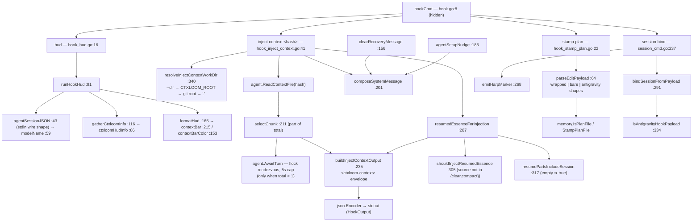

# The hidden `hook` namespace

`ctxloom hook *` is the machine-callback surface: the commands a *generated*
engine config file invokes, never a human. Four subcommands live under it —
`hud` (statusline), `inject-context` (SessionStart context delivery),
`stamp-plan` (PostFileEdit plan-frontmatter stamping) and `session-bind`
(SessionStart harp↔session-id binding). Their shared contract is **a hook must
never fail the host tool call**: every failure warns and returns nil, so the
engine's own operation proceeds. `hook inject-context` is the single most
load-bearing command in the package — it is the **only** path by which a
claude/codex session launched outside `ctxloom run` receives assembled project
context.

## Structure

Registration is spread across four files' `init()` funcs — `hook_hud.go:34`,
`hook_inject_context.go:355`, `hook_stamp_plan.go:54` and `session_cmd.go:359` —
so the `hook` namespace's membership is not discoverable from `hook.go`.

## `hook inject-context <hash>` — the context delivery seam

The generated `settings.json` for each engine bakes in a **content hash**; the
hook reads `.ctxloom/cache/context/<hash>.md` and emits a `HookOutput` JSON
envelope on stdout that the engine injects as `additionalContext`.

| Function | file:line | Role |
|---|---|---|
| `HookInput` / `HookOutput` / `HookSpecificOutput` | `:27`, `:31`, `:34` | Type *aliases* onto `claude.SessionStartPayload` / `SessionStartOutput` / `SessionStartSpecificOutput` |
| `resolveInjectContextWorkDir` | `:340` | `--dir` flag → `CTXLOOM_ROOT` → git root → `"."` |
| `selectChunk` | `:211` | Picks chunk `part` of `total` when a context is split across several hook registrations |
| `buildInjectContextOutput` | `:235` | Wraps the chunk in the `<ctxloom-context>` envelope; returns `HookOutput{}` for empty content with no essence |
| `resumedEssenceForInjection` | `:287` | Four-gate lookup of the resumed harp's essence, driven by `CTXLOOM_RESUMED_FROM` / `CTXLOOM_RESUMED_PARTS` |
| `shouldInjectResumedEssence` | `:305` | Policy: skip when the SessionStart source is `clear` or `compact` |
| `resumePartsIncludeSession` | `:317` | CSV membership; **empty means true** |
| `clearRecoveryMessage` | `:156` | The post-`/clear` `/recover` nudge, gated by `currentSessionRecoverable:169` |
| `agentSetupNudge` | `:185` | "profiles but no agents" nudge. The one function here that correctly threads `appDir` into `config.Load` |
| `composeSystemMessage` | `:201` | `operations.JoinLeadBlocks(msgs...)` |

Flags: `--dir`, `--part`, `--total` (`:355`).

## `hook hud` — the statusline

Reads the engine's statusline JSON from stdin (`agentSessionJSON:43` — Claude
Code's shape, declared agent-neutral), joins up to six ` │ `-separated coloured
segments (`formatHud:165`) and prints one line: model, context-usage bar
(`contextBar:215`, 8 cells, coloured by `contextBarColor:153`), cost, ctxloom
profile, bundle count, harp, worktree.

`modelName:59` decodes the `model` field polymorphically (object *or* string) via
`json.RawMessage`. `gatherCtxloomInfo:116` loads config for the profile and
bundle count and swallows both errors to zero values — deliberate, for a
fault-tolerant HUD.

## `hook stamp-plan` — plan frontmatter

A PostToolUse callback. `parseEditPayload:64` extracts the edited file path from
three payload shapes (wrapped, bare, antigravity), then
`memory.IsPlanFile`/`StampPlanFile` stamp the harp into a `*.plan.md`'s
frontmatter. Gated on a non-empty `CTXLOOM_SESSION_HARP`.

## `hook session-bind` — harp ↔ session id

Runs at SessionStart. Two jobs: `emitHarpMarker:268` writes the
index-independent harp self-id marker into the transcript via
`additionalContext`, and `bindSessionFromPayload:291` decodes the engine's
SessionStart payload (Claude / Antigravity / kiro shapes, discriminated by
`isAntigravityHookPayload:334`) and calls `BindSession` so the harp and the
engine's own session id are linked. Without that binding, `compactEntry` later
fails with "harp %q has no session_id bound".

## Invariants

- **A hook never fails the host tool call.** Every failure path warns via
  `clidiag` and returns nil. `hook_inject_context.go:67` additionally installs a
  deferred `recover()` that prints `{}` on panic.
- **`hook inject-context` is the sole context-delivery path for sessions not
  launched by `ctxloom run`.** `ctxloom run` writes the context file
  (`agent.WriteContextFile`) and the hook reads it back — the same cache file, the
  same hash, both directions.
- **Chunked delivery rendezvouses.** When `--total > 1`, `agent.AwaitTurn` (a
  flock-based rendezvous with a 5 s `ContextRendezvousTimeout`) serialises the
  parts so they arrive in order.
- **Resume essence is suppressed for `/clear` and `/compact`**
  (`shouldInjectResumedEssence:305`), because those sources already carry their
  own continuation.
- **`hook hud` is fault-tolerant by construction.** Both error paths print the
  literal `"ctxloom"` rather than nothing.

## Documented vs real

- **A missing context file delivers zero context, emits no warning, and exits 0.**
  `agent.ReadContextFile` returns `("", nil)` on ENOENT
  (`internal/shared/agent/contextfile.go:176-178`), so the hook's `if err != nil`
  warn branch (`hook_inject_context.go:88-93`) never fires for the most likely
  failure. The file lives under `.ctxloom/cache/context/`, which `.gitignore:133`
  ignores, while the hash is baked into the **committed** `settings.json` — so on
  a fresh clone or a cleared cache the engine is configured to look for a file the
  repo cannot contain. Every such session starts with no ctxloom context, silently.
- With a missing context file under a **chunked** hook set, `ChunkContext("")`
  returns nil, every part is out of range, and each `part > 1` invocation still
  calls `agent.AwaitTurn` — up to 5 s of added SessionStart latency per chunk,
  silently (`:100-103`, `:211-220`).
- **`hook hud` prints zero bytes on the SUCCESS path** when the session JSON is
  sparse and no ctxloom config resolves (`formatHud` joins an empty `parts`
  slice), while both *failure* paths print `"ctxloom"`. `hook_hud_test.go:53`
  pins exactly that shape.
- The panic recovery at `hook_inject_context.go:67-73` leaves `RunE`'s unnamed
  error result at nil, so a panicking hook exits 0.
- `stamp-plan` discards `parseEditPayload`'s error without a warning
  (`hook_stamp_plan.go:40-43`), breaking the file's own stated "warn and continue"
  convention that its two sibling branches follow.
- `emitHarpMarker` writes zero bytes and reports nothing when the harp is empty
  (`session_cmd.go:271-272`), and drops the `json.Marshal` error at `:278`. For a
  ctxloom-launched session `CTXLOOM_SESSION_HARP` is always set, so an empty harp
  here is itself a fault.
- `bindSessionFromPayload` returns `nil` on malformed JSON with no warning
  (`session_cmd.go:300-302`), so the most likely failure mode is the one path that
  produces no diagnostic at all — surfacing much later as `compactEntry`'s "harp
  %q has no session_id bound".
- `contextBar:215` clamps `filled` above but not below zero; a negative percentage
  would panic in `strings.Repeat`. Guarded only by the caller's `if pct > 0`.
- `HookInput` (`:27`) has exactly one use (`:76`); its two siblings are genuinely
  shared (`session_cmd.go:273`, `schematargets.go:20`).
- `resumedFrom` comes straight from the `CTXLOOM_RESUMED_FROM` environment
  variable with **no harp validation** before it is used to build a path under
  `paths.HarpDir` (`hook_inject_context.go:111,294`).
