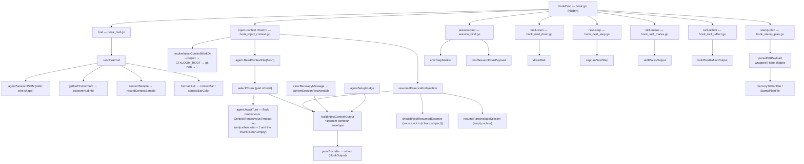

# The hidden `hook` namespace

`ctxloom hook *` is the machine-callback surface: the commands a *generated*
engine config file invokes, never a human. Each subcommand registers itself on
`hookCmd` from its own file's `init()`, so the namespace's membership is
discoverable from `hookCmd.AddCommand` call sites, not from `hook.go`. Their
shared contract is **a hook must never fail the host tool call**: every
failure warns and returns nil, so the engine's own operation proceeds. `hook
inject-context` is the single most load-bearing command in the package — it is
the **only** path by which a claude session launched outside `ctxloom run`
receives assembled project context.

## Structure

```mermaid
flowchart TD
    HC["hookCmd — hook.go (hidden)"]
    HC --> HUD["hud — hook_hud.go"]
    HC --> IC["inject-context &lt;hash&gt; — hook_inject_context.go"]
    HC --> SP["stamp-plan — hook_stamp_plan.go"]
    HC --> SB["session-bind — session_bind.go"]
    HC --> MD["mail-drain — hook_mail_drain.go"]
    HC --> NS["next-step — hook_next_step.go"]
    HC --> SM["skill-mates — hook_skill_mates.go"]
    HC --> TR["tool-reflect — hook_tool_reflect.go"]

    HUD --> RHH["runHookHud"]
    RHH --> ASJ["agentSessionJSON (stdin wire shape)"]
    RHH --> GCI["gatherCtxloomInfo → ctxloomHudInfo"]
    RHH --> CSM2["contextSample → recordContextSample"]
    RHH --> FH["formatHud → contextBar / contextBarColor"]

    IC --> RWD["resolveInjectContextWorkDir<br/>--project → CTXLOOM_ROOT → git root → '.'"]
    IC --> RCF["agent.ReadContextFile(hash)"]
    RCF --> SEL["selectChunk (part of total)"]
    SEL --> AT["agent.AwaitTurn — flock rendezvous, ContextRendezvousTimeout cap<br/>(only when total > 1 and the chunk is non-empty)"]
    SEL --> BICO["buildInjectContextOutput<br/>&lt;ctxloom-context&gt; envelope"]
    IC --> REI["resumedEssenceForInjection"]
    REI --> SIRE["shouldInjectResumedEssence (source not in {clear,compact})"]
    REI --> RPIS["resumePartsIncludeSession (empty ⇒ true)"]
    REI --> BICO
    CRM["clearRecoveryMessage → currentSessionRecoverable"] --> BICO
    ASN["agentSetupNudge"] --> BICO
    BICO --> OUT["json.Encoder → stdout (HookOutput)"]

    SP --> PEP["parseEditPayload<br/>wrapped | bare shapes"]
    PEP --> MEM["memory.IsPlanFile / StampPlanFile"]

    SB --> EHM["emitHarpMarker"]
    SB --> BSFP["bindSessionFromPayload"]

    MD --> DM["drainMail"]
    NS --> CNS["captureNextStep"]
    SM --> SMO["skillMatesOutput"]
    TR --> BTRO["buildToolReflectOutput"]
```

## `hook inject-context <hash>` — the context delivery seam

The generated `settings.json` for each engine bakes in a **content hash**; the
hook reads the cached context file for that hash and emits a `HookOutput` JSON
envelope on stdout that the engine injects as additional context. `HookOutput`
and `HookSpecificOutput` are type aliases onto the claude engine's hook output
types, so the wire shape has one owner.

- `resolveInjectContextWorkDir` — `--project` flag → `CTXLOOM_ROOT` → git root
  → `"."`.
- `selectChunk` — picks chunk `part` of `total` when a context is split across
  several hook registrations (`--part`, `--of`).
- `buildInjectContextOutput` — wraps the chunk in the `<ctxloom-context>`
  envelope; returns an empty `HookOutput` for empty content with no essence.
- `resumedEssenceForInjection` — looks up the resumed harp's essence, driven by
  `CTXLOOM_RESUMED_FROM` / `CTXLOOM_RESUMED_PARTS`. `shouldInjectResumedEssence`
  is the policy: skip when the SessionStart source is `clear` or `compact`.
  `resumePartsIncludeSession` is CSV membership where **empty means true**.
- `clearRecoveryMessage` — the post-`/clear` `/recover` nudge, gated by
  `currentSessionRecoverable`. `agentSetupNudge` — the "profiles but no agents"
  nudge.

## `hook hud` — the statusline

Reads the engine's statusline JSON from stdin (`agentSessionJSON` — Claude
Code's shape, declared agent-neutral), joins ` │ `-separated coloured segments
(`formatHud`) and prints one line: model, context-usage bar (`contextBar`,
coloured by `contextBarColor`), cost, ctxloom profile, bundle count, harp,
worktree. `contextSample`/`recordContextSample` also persist the context-usage
reading for the session.

`agentSessionJSON` decodes the `model` field polymorphically (object *or*
string) via `json.RawMessage`. `gatherCtxloomInfo` loads config for the profile
and bundle count and swallows both errors to zero values — deliberate, for a
fault-tolerant HUD.

## `hook stamp-plan` — plan frontmatter

A PostToolUse callback. `parseEditPayload` extracts the edited file path from
the tool-input payload (wrapped or bare `file_path`), then
`memory.IsPlanFile`/`StampPlanFile` stamp the harp into a `*.plan.md`'s
frontmatter. Gated on a non-empty `CTXLOOM_SESSION_HARP`.

## `hook session-bind` — harp ↔ session id

Runs at SessionStart. Two jobs: `emitHarpMarker` writes the index-independent
harp self-id marker into the transcript via additional context, and
`bindSessionFromPayload` decodes the engine's SessionStart payload and calls
`operations.BindSession` so the harp and the engine's own session id are
linked. Without that binding a later distill cannot find the transcript.

## The turn-lifecycle hooks

`mail-drain` hands the session owner its pending mail as the starting turn's
context (`drainMail`); `next-step` captures what the agent was about to do
next at TurnEnd (`captureNextStep`); `skill-mates` names a completed skill's
link-group mates the session has not invoked (`skillMatesOutput`);
`tool-reflect` prompts for a finding after a large tool result
(`buildToolReflectOutput`). Each follows the same never-fail contract.

## Invariants

- **A hook never fails the host tool call.** Every failure path warns via
  `clidiag` and returns nil. `runHookInjectContext` additionally installs a
  deferred `recover()` that prints `{}` on panic.
- **`hook inject-context` is the sole context-delivery path for sessions not
  launched by `ctxloom run`.** `ctxloom run` writes the context file
  (`agent.WriteContextFile`) and the hook reads it back (`agent.ReadContextFile`)
  — the same cache file, the same hash, both directions. A missing file is an
  error the hook warns about, not empty context delivered silently.
- **Chunked delivery rendezvouses.** When `total > 1` and the chunk is
  non-empty, `agent.AwaitTurn` (a flock-based rendezvous bounded by
  `agent.ContextRendezvousTimeout`) serialises the parts so they arrive in
  order.
- **Resume essence is suppressed for `/clear` and `/compact`**
  (`shouldInjectResumedEssence`), because those sources already carry their
  own continuation.
- **`hook hud` is fault-tolerant by construction.** Both error paths print the
  literal `"ctxloom"` rather than nothing.
