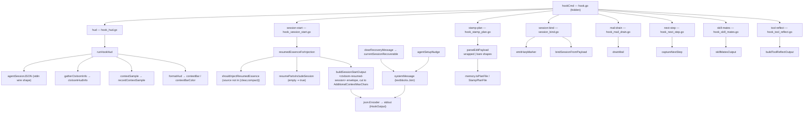

# The hidden `hook` namespace

`ctxloom hook *` is the machine-callback surface: the commands a *generated*
engine config file invokes, never a human. Each subcommand registers itself on
`hookCmd` from its own file's `init()`, so the namespace's membership is
discoverable from `hookCmd.AddCommand` call sites, not from `hook.go`. Their
shared contract is **a hook must never fail the host tool call**: every
failure warns and returns nil, so the engine's own operation proceeds. No hook
delivers the project's assembled context: that reaches claude once, as the
system prompt of a session `ctxloom run` launches, and a claude started by hand
gets none.

## Structure

```mermaid
flowchart TD
    HC["hookCmd — hook.go (hidden)"]
    HC --> HUD["hud — hook_hud.go"]
    HC --> IC["session-start — hook_session_start.go"]
    HC --> SP["stamp-plan — hook_stamp_plan.go"]
    HC --> SB["session-bind — session_bind.go"]
    HC --> MD["mail-drain — hook_mail_drain.go"]
    HC --> NS["next-step — hook_next_step.go"]
    HC --> SM["skill-mates — hook_skill_mates.go"]
    HC --> TR["tool-reflect — hook_tool_reflect.go"]

    HUD --> RHH["runHookHud"]
    RHH --> ASJ["agentSessionJSON (stdin wire shape)"]
    RHH --> GCI["gatherCtxloomInfo → ctxloomHudInfo"]
    RHH --> CSM2["contextSample → recordContextSample"]
    RHH --> FH["formatHud → contextBar / contextBarColor"]

    IC --> REI["resumedEssenceForInjection"]
    REI --> SIRE["shouldInjectResumedEssence (source not in {clear,compact})"]
    REI --> RPIS["resumePartsIncludeSession (empty ⇒ true)"]
    REI --> BSSO["buildSessionStartOutput<br/>&lt;ctxloom-resumed-session&gt; envelope, cut to AdditionalContextMaxChars"]
    CRM["clearRecoveryMessage → currentSessionRecoverable"] --> SMSG["systemMessage (textblocks.Join)"]
    ASN["agentSetupNudge"] --> SMSG
    BSSO --> OUT["json.Encoder → stdout (HookOutput)"]
    SMSG --> OUT

    SP --> PEP["parseEditPayload<br/>wrapped | bare shapes"]
    PEP --> MEM["memory.IsPlanFile / StampPlanFile"]

    SB --> EHM["emitHarpMarker"]
    SB --> BSFP["bindSessionFromPayload"]

    MD --> DM["drainMail"]
    NS --> CNS["captureNextStep"]
    SM --> SMO["skillMatesOutput"]
    TR --> BTRO["buildToolReflectOutput"]
```

## `hook session-start` — the resumed essence and the session-start notices

ctxloom's one SessionStart callback, registered unconditionally among
ctxloom's own hooks (`managedhooks.appendManagedDynamicHooks`) with no
arguments. It writes a `HookOutput` JSON envelope on stdout. `HookOutput` and
`HookSpecificOutput` are type aliases onto the claude engine's hook output
types, so the wire shape has one owner. It **never** carries the project's
context.

- `resumedEssenceForInjection` — reads the resumed harp's essence, driven by
  `CTXLOOM_RESUMED_FROM` / `CTXLOOM_RESUMED_PARTS` (set by `ctxloom run
  --session <harp> --compact`). `shouldInjectResumedEssence` is the policy:
  skip when the SessionStart source is `clear` or `compact`.
  `resumePartsIncludeSession` is CSV membership where **empty means true**.
- `buildSessionStartOutput` — frames the essence as `additionalContext` in a
  `<ctxloom-resumed-session>` block. Claude Code shows the model only a short
  preview of a hook's `additionalContext` past ~10,000 characters, so the body
  is held to `claude.AdditionalContextMaxChars` (7,500). A longer essence is
  cut, not dropped: the model gets what fits, then a pointer to the essence
  file (`essencePathOf`) and to `/recover`.
- `clearRecoveryMessage` — the post-`/clear` `/recover` notice, gated by
  `currentSessionRecoverable`. `agentSetupNudge` — the "profiles but no agents"
  nudge. Both are user-facing, so they ride `systemMessage`, joined when both
  fire.

## `hook hud` — the statusline

Reads the engine's statusline JSON from stdin (`agentSessionJSON` — Claude
Code's shape, declared agent-neutral), joins ` │ `-separated coloured segments
(`formatHud`) and prints one line: model, context-usage bar (`contextBar`,
coloured by `contextBarColor`), cost, ctxloom profile, bundle count, harp,
worktree. `contextSample`/`recordContextSample` also persist the context-usage
reading for the session.

`agentSessionJSON` decodes the `model` field polymorphically (object *or*
string) via `json.RawMessage`. `gatherCtxloomInfo` loads config for the profile
and bundle count and swallows both errors to zero values — deliberate, for a
fault-tolerant HUD.

## `hook stamp-plan` — plan frontmatter

A PostToolUse callback. `parseEditPayload` extracts the edited file path from
the tool-input payload (wrapped or bare `file_path`), then
`memory.IsPlanFile`/`StampPlanFile` stamp the harp into a `*.plan.md`'s
frontmatter. Gated on a non-empty `CTXLOOM_SESSION_HARP`.

## `hook session-bind` — harp ↔ session id

Runs at SessionStart. Two jobs: `emitHarpMarker` writes the index-independent
harp self-id marker into the transcript via additional context, and
`bindSessionFromPayload` decodes the engine's SessionStart payload and calls
`operations.BindSession` so the harp and the engine's own session id are
linked. Without that binding a later compaction cannot find the transcript.

## The turn-lifecycle hooks

`mail-drain` hands the session owner its pending mail as the starting turn's
context (`drainMail`); `next-step` captures what the agent was about to do
next at TurnEnd (`captureNextStep`); `skill-mates` names a completed skill's
link-group mates the session has not invoked (`skillMatesOutput`);
`tool-reflect` prompts for a finding after a large tool result
(`buildToolReflectOutput`). Each follows the same never-fail contract.

`mail-drain` claims a spool only for the session OWNER's engine: the launch
marks that engine alone with `CTXLOOM_SESSION_OWNER` (`sessions.EnvSessionOwner`,
set by `launch.markOwner` for a human's interactive session and removed for
every other run), and every ctxloom process consumes the marker at start
(`sessionOwnerEnv`), so nothing that engine starts inherits it. Any other
engine that fires the hook — a delegated child loading a trusted repository's
own settings file — carries its own harp but no marker, and claims nothing:
its mail is its runner's to deliver.

## Invariants

- **A hook never fails the host tool call.** Every failure path warns via
  `clidiag` and returns nil. `runHookSessionStart` additionally installs a
  deferred `recover()` that prints `{}` on panic and still exits non-zero, so
  a crash is not mistaken for "nothing to deliver".
- **No hook delivers the project's context.** The assembled context reaches a
  claude session once, as its system prompt. `hook session-start` delivering
  it too would double it, so it reads no context cache and takes no hash.
- **Resume essence is suppressed for `/clear` and `/compact`**
  (`shouldInjectResumedEssence`), because those sources already carry their
  own continuation.
- **`hook hud` is fault-tolerant by construction.** Both error paths print the
  literal `"ctxloom"` rather than nothing.
