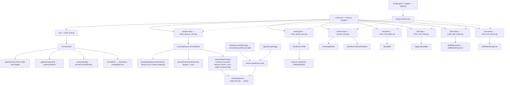

# The hidden `hook` namespace

`ctxloom hook *` is the machine-callback surface: the commands a *generated*
engine config file invokes, never a human. Each subcommand registers itself on
`hookCmd` from its own file's `init()`, so the namespace's membership is
discoverable from `hookCmd.AddCommand` call sites, not from `hook.go`. No hook
verb knows any engine's payload: each reads and answers through the codec of
the engine that fired it ([the hook codec](#the-hook-codec)). Where a failing
hook would cost the engine's own operation (a tool call, the human's prompt),
the verb warns and exits 0; where the failure IS the truth (a session_start
whose payload cannot be read, a bind that did not happen), it exits non-zero
so the engine shows a failed hook. No hook
delivers the project's assembled context: that reaches claude once, as the
system prompt of a session `ctxloom run` launches, and a claude started by hand
gets none.

## Structure

```mermaid
flowchart TD
    HC["hookCmd — hook.go (hidden)"]
    HC --> HUD["hud — hook_hud.go"]
    HC --> IC["session-start — hook_session_start.go"]
    HC --> SP["stamp-plan — hook_stamp_plan.go"]
    HC --> SB["session-bind — session_bind.go"]
    HC --> MD["mail-drain — hook_mail_drain.go"]
    HC --> NS["next-step — hook_next_step.go"]
    HC --> SM["skill-mates — hook_skill_mates.go"]
    HC --> TR["tool-reflect — hook_tool_reflect.go"]

    HUD --> RHH["runHookHud"]
    RHH --> ASJ["agentSessionJSON (stdin wire shape)"]
    RHH --> GCI["gatherCtxloomInfo → ctxloomHudInfo"]
    RHH --> CSM2["contextSample → recordContextSample"]
    RHH --> FH["formatHud → contextBar / contextBarColor"]

    IC --> REI["resumedEssenceForInjection"]
    REI --> SIRE["shouldInjectResumedEssence (source not in {clear,compact})"]
    REI --> RPIS["resumePartsIncludeSession (empty ⇒ true)"]
    REI --> BSSO["sessionStartContext<br/>&lt;ctxloom-resumed-session&gt; block, cut to codec.ContextLimit()"]
    CRM["clearRecoveryMessage → currentSessionRecoverable"] --> SMSG["Notice (textblocks.Join)"]
    ASN["agentSetupNudge"] --> SMSG
    BSSO --> OUT["HookResponse → codec.Encode → stdout"]
    SMSG --> OUT

    SP --> PEP["HookEvent.Path"]
    PEP --> MEM["memory.IsPlanFile / StampPlanFile"]

    SB --> EHM["emitHarpMarker"]
    SB --> BSFP["bindSessionFromPayload"]

    MD --> DM["drainMail"]
    NS --> CNS["captureNextStep"]
    SM --> SMO["skillMatesOutput → skillMatesResponse"]
    TR --> BTRO["toolReflectResponse"]

    FE["firingEngine (--engine → registry)"] --> CODEC["engine.HookCodec"]
    CODEC -.-> IC & SP & SB & MD & NS & SM & TR
```

## The hook codec

`engine.HookCodec` (`internal/core/engine/facts.go`, reached as
`Engine.Hooks()`) is an engine's whole hook wire in the port's neutral terms:

- `Decode(event, payload)` → `HookEvent{Event, NativeSession, Transcript,
  Source, Prompt, Tool, ToolInput, ToolResponse, Skill, Path}`. A payload
  that does not decode is an error, never an empty event.
- `Encode(event, HookResponse{Context, Notice, Block, Reason})` → the native
  stdout and exit status. A response the engine has no native form for on
  that event (context where it carries none, a block it cannot make) is an
  error.
- `ContextLimit()` — the most context one answer carries whole (claude: 7,500
  bytes, under its ~10,000-character preview cap; 0 = none).
- `InvokedSkill(tool, input)` — which skill a native tool call ran, for a
  hook payload and a transcript's tool_use record alike.

claude's codec is `internal/engines/claude/hookcodec.go`; the mock's is its
own (`internal/engines/mock/hooks.go`) and writes no other engine's shape.

**How a verb knows its engine.** The engine a hook was delivered to is known
at setup, so it is written there: every hooks approach binds the unified set
to its engine with `agent.BindHooks`, which appends `--engine <name>` to every
ctxloom callback (`ctxloom hook <verb> ...`). The verb resolves that name
through the registry (`firingEngine`, `hook_codec.go`) and refuses without
one. A hook installed before this existed carries no `--engine` and is
refused; re-delivering the hooks (relaunching, or `ctxloom manage hooks
install`) writes it.

**Tool classes.** A hook narrowed to a kind of tool names a neutral class,
`wire.Hook.Tool` (`shell`, `file_edit`, `skill`), never an engine's tool
name. `agent.BindHooks` maps the class to the engine's native matcher
(claude: `Bash`, `Edit|Write`, `Skill`; the mock's tools ARE the classes),
and the same map gives claude's `pre_shell` / `post_file_edit` routes their
default matchers. The skill-mates hook is narrowed this way.

## `hook session-start` — the resumed essence and the session-start notices

ctxloom's one session_start callback, registered unconditionally among
ctxloom's own hooks (`managedhooks.appendManagedDynamicHooks`). It answers
with a `HookResponse`, encoded by the firing engine's codec. It **never**
carries the project's context. A payload it cannot read fails the hook
(non-zero exit).

- `resumedEssenceForInjection` — reads the resumed harp's essence, driven by
  `CTXLOOM_RESUMED_FROM` / `CTXLOOM_RESUMED_PARTS` (set by `ctxloom run
  --session <harp> --compact`). `shouldInjectResumedEssence` is the policy:
  skip when the session_start source (`engine.SessionSource*`) is `clear` or
  `compact`.
  `resumePartsIncludeSession` is CSV membership where **empty means true**.
- `sessionStartContext` — frames the essence as the response's `Context` in a
  `<ctxloom-resumed-session>` block, held under the firing engine's
  `ContextLimit()`. A longer essence is cut, not dropped: the model gets what
  fits, then a pointer to the essence file (`essencePathOf`) and to
  `/recover`.
- `clearRecoveryMessage` — the post-`/clear` `/recover` notice, gated by
  `currentSessionRecoverable`. `agentSetupNudge` — the "profiles but no agents"
  nudge. Both are user-facing, so they ride the response's `Notice` (claude's
  `systemMessage`), joined when both fire.

## `hook hud` — the statusline

Reads the engine's statusline JSON from stdin (`agentSessionJSON` — Claude
Code's shape, declared agent-neutral), joins ` │ `-separated coloured segments
(`formatHud`) and prints one line: model, context-usage bar (`contextBar`,
coloured by `contextBarColor`), cost, ctxloom profile, bundle count, harp,
worktree. `contextSample`/`recordContextSample` also persist the context-usage
reading for the session.

`agentSessionJSON` decodes the `model` field polymorphically (object *or*
string) via `json.RawMessage`. `gatherCtxloomInfo` loads config for the profile
and bundle count and swallows both errors to zero values — deliberate, for a
fault-tolerant HUD.

## `hook stamp-plan` — plan frontmatter

A post_file_edit callback. The firing engine's codec names the edited file
(`HookEvent.Path`; claude: `tool_input.file_path`, or `notebook_path` for
NotebookEdit), then `memory.IsPlanFile`/`StampPlanFile` stamp the harp into a
`*.plan.md`'s frontmatter. Gated on a non-empty `CTXLOOM_SESSION_HARP`;
warn-and-continue, since a failing hook would interrupt the edit.

## `hook session-bind` — harp ↔ session id

Runs at session_start. Two jobs: `emitHarpMarker` writes the
index-independent harp self-id marker into the transcript as context, and
`bindSessionFromPayload` decodes the session_start payload through the codec
and calls `operations.BindSession` so the harp and the engine's own session id
are linked. Without that binding a later compaction cannot find the
transcript, so a payload that does not decode, or a bind the index refuses,
is an error the hook exits non-zero on (the marker is already written).

## The turn-lifecycle hooks

`mail-drain` hands the session owner its pending mail as the starting turn's
context (`drainMail`); `next-step` captures what the agent was about to do
next at turn_end (`captureNextStep`); `skill-mates` names a completed skill's
link-group mates the session has not invoked (`skillMatesOutput`: the skill
comes from `HookEvent.Skill`, "already invoked" from the transcript through
`InvokedSkill`, and the delivered skill set from the FIRING engine's exports);
`tool-reflect` prompts for a finding after a large tool result
(`toolReflectResponse`). Each exits 0 — a failing turn_start, turn_end or
post_tool hook would cost the human's prompt or the tool call — and names
every reason it did nothing on the diagnostic channel, an undecodable payload
included.

`mail-drain` claims a spool only for the session OWNER's engine: the launch
marks that engine alone with `CTXLOOM_SESSION_OWNER` (`sessions.EnvSessionOwner`,
set by `launch.markOwner` for a human's interactive session and removed for
every other run), and every ctxloom process consumes the marker at start
(`sessionOwnerEnv`), so nothing that engine starts inherits it. Any other
engine that fires the hook — a delegated child loading a trusted repository's
own settings file — carries its own harp but no marker, and claims nothing:
its mail is its runner's to deliver.

## Invariants

- **No hook verb names an engine.** Each resolves the firing engine from
  `--engine` through the registry and speaks only through its codec;
  `tests/arch`'s engine-identity gate holds that `internal/adapters/cli`
  imports no engine package.
- **A failing hook fails where the failure is the truth, and only there.**
  The turn_start, turn_end and post_tool verbs warn via `clidiag` and exit 0;
  session-start and session-bind exit non-zero on a payload they cannot read.
  `runHookSessionStart`'s deferred `recover()` exits non-zero on a panic and
  writes no answer, so a crash is not mistaken for "nothing to deliver".
- **No hook delivers the project's context.** The assembled context reaches a
  claude session once, as its system prompt. `hook session-start` delivering
  it too would double it, so it reads no context cache and takes no hash.
- **Resume essence is suppressed for `/clear` and `/compact`**
  (`shouldInjectResumedEssence`), because those sources already carry their
  own continuation.
- **`hook hud` is fault-tolerant by construction.** Both error paths print the
  literal `"ctxloom"` rather than nothing.
