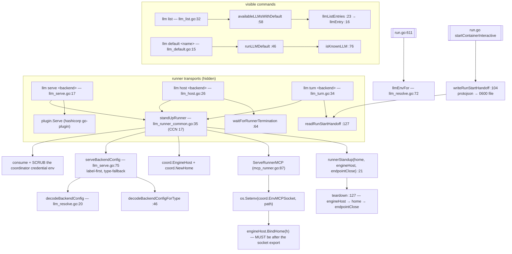

# `ctxloom llm` — engine labels and the runner transports

`ctxloom llm` has two halves that share only a prefix. The visible half is
`llm list` and `llm default`: read and set which configured engine label is the
project's default. The hidden half is the three runner transports — `llm serve`
(go-plugin over stdio), `llm host` (a keepalive the coordinator drives), and
`llm turn` (one interactive engine turn on this TTY, used inside a container) —
which all pass through one shared standup, `standUpRunner`. That standup is the
single point where a runner process consumes its coordinator credential, scrubs
it, configures its backend, dials home, and stands up its own MCP endpoint.

## Structure

## Commands

| Command | file:line | Notes |
|---|---|---|
| `llm` | `llm.go:8` | Parent only. |
| `llm list` | `llm_list.go:32` | Emits `[]llmEntry{Label, Default}`. Config-load failure silently degrades to the built-in backend set. |
| `llm default [name]` | `llm_default.go:15` | No arg = show (`llmDefaultShowResult{Default}`); with an arg = set. An unknown name errors and lists the available set. Uses `GetConfigForUpdate` (I2). |
| `llm serve <backend>` | `llm_serve.go:17` | Hidden. Stands the runner up, then `plugin.Serve`. `--label`. |
| `llm host <backend>` | `llm_host.go:26` | Hidden. Stands the runner up and blocks on ctx-done or SIGINT/SIGTERM, then tears down. `--label`. |
| `llm turn <backend>` | `llm_turn.go:34` | Hidden. One interactive engine turn on this TTY, reading its `RunStart` from a file handoff. Missing `--start` is a loud error; a non-zero engine exit becomes an `ExitError`. `--label`, `--start`. |

## `standUpRunner` — the shared standup

`llm_runner_common.go:35-121`. Four interleaved concerns, in this order:

1. **`:36-60` — credential consumption + scrub.** Reads the coordinator env trio
   and then `os.Unsetenv`s it: *the harness and its subprocesses must never
   inherit it* (`:38-39`). This is invariant I7: the runner is the ONE credential
   holder.
2. **`:62-72` — config load + backend `Configure`.** `config.Load()` directly,
   with the label resolved through `serveBackendConfig`.
3. **`:74-91` — `coord.EngineHost` + `coord.NewHome`** (the dial-home).
4. **`:94-119` — MCP endpoint standup + `BindHome`.** `ServeRunnerMCP` gives a
   socket path, which is exported as `coord.EnvMCPSocket` into *this process's*
   env (every engine spawn path builds the harness env over `os.Environ`), and
   only then is `BindHome` called.

`runnerStandup` (`:21`) carries `{home, engineHost, endpointClose}`; `teardown`
(`:127`) must run them in exactly that order, and each transport must block
first and tear down after — `llm host` explicitly (`llm_host.go:55`), `llm turn`
via `defer` (`llm_turn.go:79`), `llm serve` after `plugin.Serve` returns
(`llm_serve.go:63`).

## Backend config resolution (`llm_resolve.go`)

| Function | file:line | Contract |
|---|---|---|
| `decodeBackendConfig` | `:20` | Label → typed backend config. Warns and returns nil on failure (fault-tolerant). |
| `decodeBackendConfigForType` | `:46` | Type → typed config, deterministic pick when several labels share a type. |
| `llmEnvFor` | `:72` | The label's `env` map. Returns nil for kiro/opencode/acp entries. |
| `serveBackendConfig` | `llm_serve.go:75` | Label first, then type fallback; warns on a label/type mismatch before falling back. |

## The RunStart handoff (`llm_turn.go`)

`run.go`'s docker-exec interactive arm cannot pass a proto message through
`docker exec` argv, so it writes one:

| Function | file:line | Contract |
|---|---|---|
| `writeRunStartHandoff` | `:104` | protojson → a 0600 file in the persist dir. Every step wrapped with context. |
| `readRunStartHandoff` | `:127` | Decode + delete. Loud on a missing or corrupt file. |
| `turnResize` | `:145` | `watchResize` → `agent.WindowSize`, latest-wins; the goroutine ends when the source closes. |

## Invariants

- **I7 — the runner is the one credential holder.** The coordinator credential is
  consumed and unset before anything is spawned (`llm_runner_common.go:53-55`).
- **Socket export strictly precedes `BindHome`.** Comment-enforced at
  `llm_runner_common.go:113-119`. Reversing them means the engine never learns the
  socket and stands up a rogue local coordinator.
- **Teardown order is `engineHost` → `home` → `endpointClose`** (`:123-126`), and
  each caller must block before calling it.
- **A run-hosting runner refuses to launch without MCP reach-back.** When
  `ServeRunnerMCP` fails *and* `engineHost != nil`, `:97-103` returns a fatal
  error whose reasoning is spelled out: it would otherwise stand up a rogue local
  coordinator nobody reads.
- **`--label` is a single input, carried by one global.** `llm host` and
  `llm turn` copy their own `--label` into `llmServeLabel` (`llm_host.go:41-43`,
  `llm_turn.go:57-59`) because `standUpRunner` reads that global rather than
  taking a parameter.

## Documented vs real

- **The three runner transports skip the config-warning and strictness gates.**
  `standUpRunner` calls `config.Load()` at `:62` and reacts only with a
  `clidiag.Warn` on a hard error; `cfg.GetWarnings()` is never read and
  `failOnFindings` is never called. The contract they violate is stated verbatim
  at `startup_helpers.go:44-54`. Same gap as `acp server` (see
  [acp-and-coordinator.md](acp-and-coordinator.md)).
- When `config.Load()` fails, `standUpRunner` skips the entire runner-MCP block
  (`if cfg != nil`, `:94-112`) yet still calls `engineHost.BindHome(h)` at `:118` —
  reaching the exact "hosted run with no reach-back" end state the code fail-louds
  about eleven lines earlier.
- Two security-relevant syscalls are `_ =`-swallowed: `os.Unsetenv` at `:53-55`
  (failure means the credential is inherited by the engine) and `os.Setenv` at
  `:110` (failure means the child never learns the socket).
- `readRunStartHandoff` registers `defer os.Remove(path)` **before** the decode
  (`:132`), so a corrupt handoff file is deleted on the way out. Neither side
  validates that the `RunStart` carries anything, despite the doc comment at
  `:123-126` claiming "never a silent empty RunStart".
- `decodeBackendConfig` writes its gemini-successor hint with a raw
  `fmt.Fprintf(os.Stderr, ...)` immediately after a `clidiag.Warn` on the line
  above — two diagnostic channels in one function.
