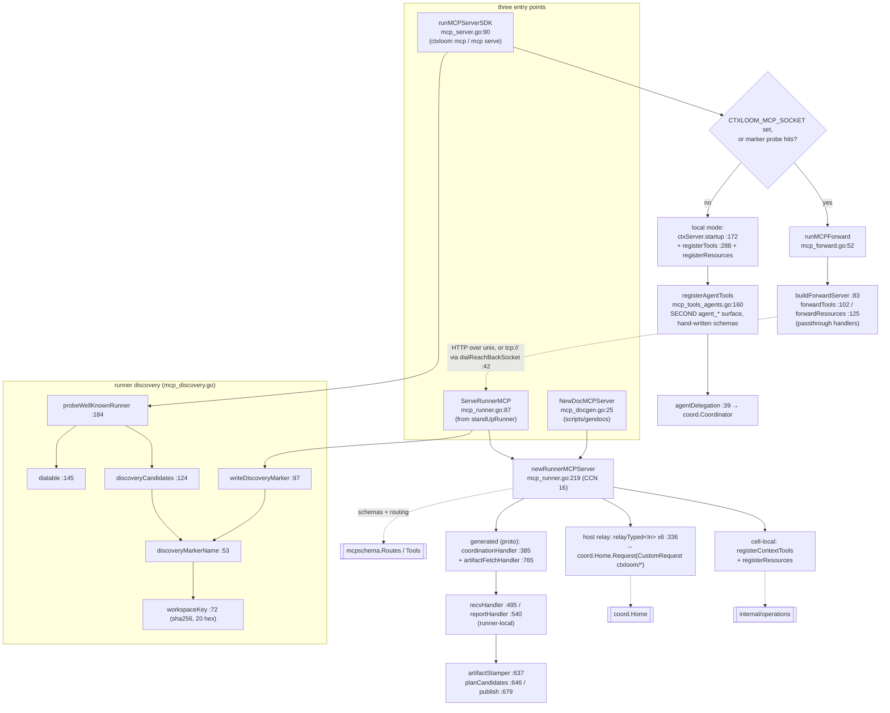

# `ctxloom mcp` and the MCP server surfaces

`internal/mcp` builds and serves **five different MCP surfaces**: the
runner-terminated HTTP-on-unix server that a real session's harness actually
talks to, the stdio shim that forwards onto it, the legacy standalone stdio
server that stands a coordinator up itself, the read-only `ctxloom://` resource
surface, and a handler-free clone of the whole thing for docs generation. This
is the boundary where an external MCP client meets `internal/operations`
(content), `internal/agentcoord/coord` (delegation), and
`internal/agentcoord/mcpschema` (the proto-canonical tool routing table). The
`ctxloom mcp *` command tree — server CRUD and registration — is a much smaller
concern that happens to share the prefix, and is the only part still in
`internal/cli` (`mcp.go`, plus `mcp_server.go`'s cobra `RunE`, which hands
`mcp.ServeStdio` the fail-loud gate that builds cli's exit-3 `ExitError`).
Unqualified filenames below are relative to `internal/mcp`.

## Entry points and topology

## The `ctxloom mcp` command tree

| Command | file:line | Notes |
|---|---|---|
| `mcp` (bare) | `mcp.go:16` | Runs the stdio MCP server. `Args: cobra.NoArgs` with a comment: otherwise a stale invocation would silently start a server sitting on stdin. |
| `mcp serve` | `mcp.go:49` | Alias for the above. **No `Args` constraint** — `ctxloom mcp serve list` does exactly what the `NoArgs` guard exists to prevent. |
| `mcp list` / `mcp server list` | `mcp.go:60` / `:73` | `runMCPList` `:102`. Emits `mcpListJSON{Servers, AutoRegister}`. The two commands are byte-for-byte twins differing only in `Deprecated`. |
| `mcp add` / `mcp server add` | `:196` / `:206` | `runMCPAdd` `:217`. Ignores `--format`. |
| `mcp remove` / `mcp server remove` | `:254` / `:264` | `runMCPRemove` `:271`. Ignores `--format`. |
| `mcp show` / `mcp server show` | `:302` / `:311` | `runMCPShow` `:317`. |
| `mcp register` / `mcp unregister` | `:401` / `:408` | `setMcpAutoRegister(true/false)` (`manage.go:331`). |

Flags for the add/show family are registered **twice over the same package
globals** (`mcp.go:426-433` and `:442-449`), once for each of the twin trees.

Also in this family: `manage mcp install|uninstall|servers *` (`manage.go:309-352`)
is a third, deprecated spelling of the same commands.

## The five server flavours

| Flavour | Built by | Transport | Tool surface |
|---|---|---|---|
| **Runner** | `ServeRunnerMCP` `mcp_runner.go:87` → `newRunnerMCPServer` `:219` | HTTP over a unix socket (three-tier placement, `runnerSocketPath` `:173`) | Context tools + resources (cell-local), 6 host-relay tools, plus proto-generated coordination + artifact-fetch tools |
| **Forward shim** | `runMCPForward` `mcp_forward.go:52` | stdio in, HTTP-on-unix (or `tcp://`) out | Mirrors whatever the runner advertises, as passthrough handlers |
| **Standalone stdio** | `runMCPServerSDK` `mcp_server.go:90` local branch | stdio | Context + memory + trigger + resources, plus a **second, hand-written** `agent_*` delegation surface |
| **Resources only** | `registerResources` `mcp_resources.go:36` | (registered onto both runner and stdio) | 9 concrete + 5 templated `ctxloom://` URIs |
| **Docgen** | `NewDocMCPServer` `mcp_docgen.go:25` | none — built against a dead endpoint | The runner surface, for `scripts/gendocs` |

### Runner tool categories (`newRunnerMCPServer`, `mcp_runner.go:219`)

1. **Cell-local**: `assemble_context`, `search_content`, `search_library`
   (`registerContextTools`, `mcp_tools_context.go:34`) and the `ctxloom://`
   resources.
2. **Host relay** (`relayTyped[In]`, `:336`): six tools marshalled into a
   `CustomRequest{ctxloom/*}` and executed by the session-owning host under the
   *caller's* identity — the memory and trigger tools.
3. **Generated / proto-canonical** (`coordinationHandler`, `:385`): `agent_run`,
   `agent_send`, `agent_stop`, `roster` decoded via `unmarshalArgs` `:447` from
   `mcpschema.Tools()`, plus runner-local `agent_recv` (`recvHandler` `:495`) and
   `agent_report` (`reportHandler` `:540`), and `agent_fetch_artifact`
   (`fetchArtifactHandler` `:779`).

The registration is **exhaustiveness-checked at startup**: any route mismatch or
unclassified tool is a hard error before the server serves — a deliberate
fail-loud, and one of the better patterns in the package.

### Types

| Type | file:line | Role |
|---|---|---|
| `ctxServer` | `mcp_server.go:32` | Shared handler state: `cfg`, `self coord.Identity`, `agents *agentDelegation` + `agentsMu`, `distill *singleflight.Group`. Four disjoint field partitions; on the runner path `agents`/`agentsMu`/`distill` stay nil and `self` is unread by resource handlers. |
| `agentDelegation` | `mcp_tools_agents.go:39` | `{self, c *coord.Coordinator}` behind the standalone stdio `agent_*` tools. |
| `RunnerMCP` | `mcp_runner.go:56` | `{SocketPath, httpSrv, cleanup}` — one runner's live endpoint handle. |
| `socketKind` | `mcp_runner.go:140` | Three-tier enum: container / host-runtime / private-temp. `socketKindPrivateTemp` means "no marker is publishable", encoded only in prose at `:152-156`. |
| `artifactStamper` / `artifactCandidate` | `mcp_runner.go:637`, `:623` | Per-run upload dedupe (artifact_id → last sha256) and the candidate shape. `seen` is committed only after a successful upload. |
| `runnerDiscoveryMarker` | `mcp_discovery.go:42` | `{Socket, Pid, Harp}` on-disk record. `Harp` is written and read nowhere. |
| Wire DTOs | `mcp_tools_agents.go:73-158`, `mcp_tools_context.go:14-32` | 12 hand-written JSON-schema-bearing tool input/result shapes. |

### Runner discovery (`mcp_discovery.go`)

The host-controlled fallback that stops a child engine with no
`CTXLOOM_MCP_SOCKET` from silently starting a rogue second coordinator.

| Function | file:line | Contract |
|---|---|---|
| `discoveryMarkerName` | `:53` | Tier → well-known marker filename. The anti-drift seam both writer and reader share. |
| `workspaceKey` | `:72` | cwd → 20-hex sha256; `filepath.Abs` failure falls back to the raw cwd. |
| `hostRuntimeSocketDir` | `:84` | `$XDG_RUNTIME_DIR/ctxloom` or `""`. |
| `writeDiscoveryMarker` | `:97` | Atomic temp-then-rename publish; temp cleaned on rename failure. |
| `discoveryCandidates` | `:124` | Ordered probe paths for a cwd — container tier first, then the workspace-keyed host tier. |
| `dialable` | `:145` | Does the unix socket accept? Owns the timeout. |
| `probeWellKnownRunner` | `:184` | The shim's second discovery tier. Three-outcome discrimination (no marker / stale marker / live-but-unreachable); its error message names the marker, pid, socket, and the env-var escape hatch. |

## Resources (`mcp_resources.go`)

`registerResources` `:36` registers 9 concrete + 5 templated URIs. The templated
handlers share `extractURIName` `:235`, `marshalResourceYAML` `:308` and
`resourceText` `:320`; six of the concrete listings do not exist as functions at
all because `listResource[Req,Res]` `:208` generates them.

| URI | Handler |
|---|---|
| `ctxloom://help` | `handleResourceHelp` `:141` |
| `ctxloom://sessions/recent` | `handleResourceSessionsRecent` `:168` — cwd-filtered, capped at 25 |
| `ctxloom://sessions` (all) | `handleResourceSessionsAll` `:221` |
| `ctxloom://fragments/{name}` | `handleResourceFragment` `:242` |
| `ctxloom://profiles/{name}` | `handleResourceProfile` `:254` |
| `ctxloom://commands/{name}` | `handleResourceCommand` `:266` |
| `ctxloom://skills/{name}` | `handleResourceSkill` `:278` |
| `ctxloom://remotes/{name}/contents` | `handleResourceRemoteContents` `:290` |

## Startup sequence (`ctxServer.startup`, `mcp_server.go:172`)

Six steps, warn-and-continue by design, with two `ctx.Err()` checkpoints:
`loadStartupConfig` `:215` → `purgeLegacyBundles` `:234` → `runStartupSync` `:245`
(bounded 60 s) → `applyStartupHooks` `:266` (`ApplyHooks{Backend:"all", RegenerateContext:true}`)
→ `printConfigWarnings` `:225` → the strictness gate at `:144`.

## Invariants

- **Identity comes from `s.self`, never from process env.** `ctxServer`'s own doc
  (`mcp_server.go:27-31`) states that identity-consuming surfaces must read
  `s.self`; `self.Project` is populated on all three construction paths
  (`mcp_server.go:127`, `mcp_runner.go:234`, `coord_host.go:65`).
- **A run-hosting runner never launches its engine with no reach-back.** An MCP
  bind failure while `engineHost != nil` is fatal (`llm_runner_common.go:97-103`)
  — the alternative would stand up a rogue local coordinator nobody reads.
- **Tool registration is exhaustiveness-checked against `mcpschema` at startup**
  (`newRunnerMCPServer`), so a renamed tool fails loudly at boot rather than at
  first call.
- **The marker is written after the socket binds, and cleaned up by
  `RunnerMCP.Close`** (`:130`, 2 s graceful shutdown then cleanup).
- **`startup()` must run before `registerTools`** — otherwise `cfg` is nil and
  every handler nil-derefs. Enforced only by the call ordering inside
  `runMCPServerSDK:127-153`, and deliberately violated by `NewDocMCPServer`,
  which passes a nil cfg and relies on registration never invoking a handler.

## Documented vs real

- **Two independent `agent_*` surfaces with different schemas.** The runner serves
  them from generated proto schemas; `registerAgentTools` (`mcp_tools_agents.go:160`)
  serves them from hand-written Go structs. `scripts/gendocs/main.go:60-67` ships
  a user-facing caution box saying so, and `mcp_runner_test.go:205-210` exists
  solely because "the two surfaces are generated independently … so nothing else
  makes them agree".
- `runMCPForward:50-51` documents "an unreachable runner socket is a hard startup
  error: a silently-empty toolset would be a wrong-context session" — but
  `forwardTools` never checks that it registered anything, and `forwardResources`
  `:125` `return nil`s on every error despite a comment claiming the error is
  "surfaced".
- `newRunnerMCPServer:230` takes its own `os.Getwd()` for the cell-path boundary.
  The runner is spawned with no `cmd.Dir` so it inherits the *coordinator's* cwd,
  while the harness it hosts runs in the per-agent worktree
  (`coord/identity.go:53-58` states this outright). `ServeRunnerMCP` receives
  `cellWorkDir` but uses it only for the discovery marker.
- `recvHandler` (`:521-528`) `continue`s past any message that fails a
  protojson/JSON round-trip and returns SUCCESS, while `coord.Home` cursor-acks
  the whole batch.
- `mcp server show <missing>` errors on the text path but exits 0 with
  `--format json`: the not-found check lives inside the `emit` text closure,
  which `cliemit.Emit` skips for non-text formats (`mcp.go:330-339`).
- `discoveryMarkerName` ignores `cwd` for the container tier and returns the
  fixed `"current.json"` (`:56-58`); the tier is selected by whether
  `os.MkdirAll("/run/ctxloom/local", 0700)` succeeds, which is also true for root
  on a bare host.
- `NewDocMCPServer` panics twice on recoverable errors and leaks the `coord.Home`
  it creates (two goroutines retrying `127.0.0.1:1` for the life of the process).
- Five of the six host-relay tool descriptions (`mcp_runner.go:323-330`) are
  verbatim string copies of literals in `mcp_tools_memory.go`, kept honest by a
  test; the sixth (`relayEvaluateTriggersDesc`) simply aliases the real constant.
- `reachBackTCPPrefix` (`mcp_forward.go:35`) is a hand-synced duplicate of
  `internal/acp/container_transport.go:227`, with a comment instructing humans to
  keep them in sync.
- Two doc comments (`mcp_server.go:29-30`, `mcp_tools_agents.go:192`) direct the
  reader to `newCtxServerForIdentity`, a function that does not exist; the real
  per-identity constructor is the anonymous `serverFor` closure at
  `coord_host.go:64-66`.
