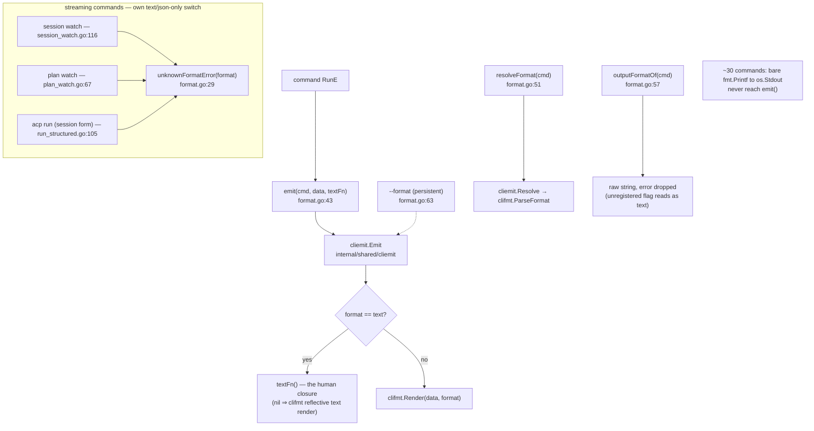

# Output, `--format`, and writer conventions

`--format` is a persistent root flag accepting `json`, `yaml`, `toml`, `text`
(default) and `markdown` (`format.go:63`). The contract is that a command builds
its result value **once** and hands both that value and a human text closure to
`emit()`, so the output format is a presentation choice and never a branch in
business logic — every frontend (CLI, the VSCode companion, scripts) then reads
the same backend results. That contract holds for roughly two thirds of the
command tree; the rest accept `--format`, parse it, and ignore it. This page is
the map of which is which.

## The emit path

| Symbol | file:line | Role |
|---|---|---|
| `formatText` / `formatJSON` | `format.go:20-22` | The *second*, narrower format vocabulary — text/json only — used by the three streaming commands that cannot hand `clifmt` a single result value. |
| `unknownFormatError` | `format.go:29` | The streaming commands' rejection message. Three call sites. |
| `emit` | `format.go:43` | The package's `--format` chokepoint. ~140 call sites. |
| `resolveFormat` | `format.go:51` | Parsed `clifmt.Format`. 3 production call sites (`root.go:117,167`, `session_full.go:102`). |
| `outputFormatOf` | `format.go:57` | Raw flag string, error deliberately dropped. 7 call sites, mostly for TTY/interactivity gating. |
| `init` | `format.go:62` | The flag's single definition point. |

## Which commands honour `--format`

The package maintains its own registry of this in
`format_coverage_test.go` (138 entries), which a test walks against the live
cobra tree. The registry is the authoritative starting point — with the caveat in
"Documented vs real" below.

**Honour `--format` through `emit()`** — the majority, including `bundle list`,
`bundle show`, `bundle view`, `bundle export`/`import`, `bundle distill`,
`agent list`/`show`/`set`, `profile list`/`show`/`materialize`, `skill *`,
`llm list`/`default`, `mcp list`, `mcp server show`, `acp entries`,
`acp run --one-shot` (the bare session form does not — see the streaming
group below),
`session list`/`show`/`query`/`backfill`, `search`, `doctor`, `container check`/`tooling`,
`review`, `sign`, `signer list`/`show`, `version`, `util config-write`,
`run --dry-run`.

**Accept `--format` and ignore it entirely** (parsed flag, no consumer — output is
always human text or always YAML):

| Command(s) | Where the text is written |
|---|---|
| `config show`, `config get`, `config edit`, `config create` (and their `manage config *` aliases) | `renderConfigYAML` (`config.go:77`) — always YAML, so `--format json` exits 0 emitting YAML a JSON parser rejects |
| `deps hold`, `deps unhold` | `bundle_hold_cli.go:41,59` |
| `bundle mcp edit` | `bundle_items.go:75,98` (package-level `fmt`, not even `cmd.OutOrStdout()`) |
| `bundle delete` | `bundle_edit.go:199` |
| `agent default`, `agent remove`, `agent setup` | `agent.go:330,374,195` |
| `fragment`/`command` `show`, `create`, `delete`, `edit`, `distill`; `fragment search` | `item_helpers.go:314,349,375,416,501` |
| `profile create`, `delete`, `edit`, `modify`, `export`, `import` | `profile.go:129,214,410,326,429,463` |
| `mcp server add`, `mcp server remove` (+ `manage mcp servers *` aliases) | `mcp.go:217,271` |
| `manage install`, `uninstall`, `hooks install`/`uninstall`/`status`, `gitignore install` | `manage.go:81,144,251,277,465` |
| `remote add`, `remove`, `list`, `default`, `pull`, `browse`, `discover`, `update`, `upgrade` | `rg 'emit\(' internal/cli/remote_*.go` → **zero hits**; all write `fmt.Printf` to raw `os.Stdout` |
| `session rename`, `session forget`, `session distill` | `session_cmd.go:204,218,374` |
| `init`, `init prompt` | `init.go` |
| `memory list`/`show`/`compact` (deprecated) | `memory.go` |

**Use their own text/json-only switch** (five-format values are an error):
`session watch`, `plan watch`, `acp run`'s bare session form (`runChatSession`,
`run_structured.go` — the driver `ctxloom run --structured` used before it was
removed as an orphan CLI surface; `acp run` was always the OTHER caller).
*Real behaviour:* `renderChatEvents` (`run_structured.go:105`, `acp run`'s
session form) rejects an unknown format; `renderOwnedRunEvents`
(`run_owned.go:251-262`, the container **oneshot** arm) silently renders it as
raw text.

## Writer conventions

| Pattern | Where it is the house style | Where it is not |
|---|---|---|
| `iox.NewErrWriter(cmd.OutOrStdout())` + return `w.Err()` | ~20 render functions, e.g. `renderBundleList` (`bundle_list.go:60`), `renderTooling` (`container_cmd.go:231`), `renderDoctorReport` (`doctor_cmd.go:737`), `renderSessionRows` (`session_row.go:89`), `renderConfigWriteResult` (`util_config_write.go:384`) | `writeWatchText` (`session_watch.go:155`) builds an `ErrWriter` and never calls `Err()` |
| `cmd.OutOrStdout()` | Most `emit` text closures | `search.go:132,257,292,308`, `manage.go`, `item_helpers.go:199`, `memory.go:237`, `profile.go:206,231,443,479`, `remote*.go`, `config.go:167`, `container_cmd.go:132`, `edit_helpers.go:31,38,45` all write to process stdout |
| `cmd.ErrOrStderr()` for prompts/diagnostics | `promptLine` (`run.go:1703`) | `confirmSignerAdd` (`signer.go:150`), the whole interactive-trust surface (`trust_interactive.go:88,107,139,188`), and `bundle distill`'s error lines (`bundle_distill.go:130`) write `os.Stderr` directly |

Consequence for a future reader: **a command that writes with bare `fmt.Printf`
cannot be output-captured by a cobra test and cannot be redirected by an
embedding frontend.** That is why the commands in the "ignore `--format`" table
above also tend to have no output assertions in their tests.

## Paging

`pager.go` is the text-only paging seam, used by the session listings.

| Function | file:line | Contract |
|---|---|---|
| `resolvePagerCommand` | `pager.go:17` | `$PAGER`, else `less -R`. A blank `$PAGER` is equivalent to unset. |
| `startPager` | `pager.go:34` | Returns `(dst, cleanup, err)` with a **non-nil cleanup on every path**, so a caller cannot lose output. Cleanup prefers the `Close` error over the `Wait` error. |
| `shouldPage` | `pager.go:65` | `out == os.Stdout && isatty`. The pointer identity comparison is the safety property — a redirected writer is never paged. |
| `pagerWriter` | `pager.go:75` | The seam callers use (`session_full.go`). *Real behaviour:* `startPager`'s error is dropped at `:80-82`, so a broken `$PAGER` degrades to unpaged output with no diagnostic. |

## Structured diagnostics

`clidiag`'s structured channel is flipped on in `PersistentPreRun` when the
resolved format is structured (`root.go:113-114`), so warnings ride the JSON/YAML
envelope instead of `<prog>: warning: <msg>` on stderr. An invalid `--format` is
reported by the command's own `emit`/`resolveFormat` call, not here — this just
falls back to the plain default rather than erroring twice.

## Documented vs real

- `--format`'s help text advertises all five formats on every command, including
  the ~30 that ignore it.
- `format_coverage_test.go`'s skip registry does not fully agree with the code:
  `"profile materialize"` is skipped as "not wired to emit() yet" although
  `profile_materialize.go:62` calls `emit`; `"remote default"` and
  `"remote remove"` are skipped as fixture gaps although neither calls `emit` at
  all; and `deps hold`/`unhold`/`mcp edit` carry fixture-shaped reasons
  ("needs an existing pin/lockfile fixture") that read as if they were wired.
- `pkg/clifmt` renders **zero bytes** for four shapes: an all-`omitempty` struct
  in text and markdown, `[]string{}` in text, and `nil` in toml. Live in
  production at `cmd/harp/root.go:105`. This is not the cause of the
  ignored-`--format` family above — only 12 `Render`/`RenderError` call sites
  exist repo-wide, and the ignoring commands never reach them.
- `emit()` runs the text closure **only** for `--format text`
  (`cliemit.go:30-33`). Two commands put a not-found check inside that closure,
  so `--format json` exits 0 on a missing item: `mcp server show`
  (`mcp.go:330-339`).
