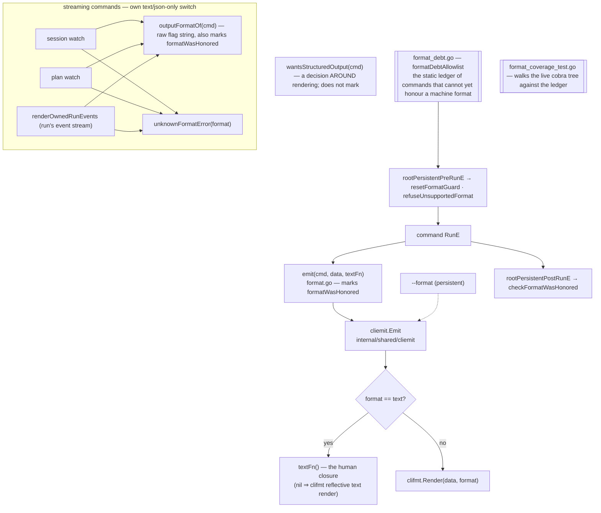

# Output, `--format`, and writer conventions

`--format` is a persistent root flag (`format.go`'s `init`) accepting the
formats `clifmt.ParseFormat` knows. The contract is that a command builds its
result value **once** and hands both that value and a human text closure to
`emit()`, so the output format is a presentation choice and never a branch in
business logic — every frontend (CLI, the VSCode companion, scripts) then reads
the same backend results. Because the flag is persistent it is *accepted* by
every command whether or not that command's `RunE` ever reads it; the two
guards below are what turn "accepted and silently discarded" into a loud
error.

## The emit path

```mermaid
flowchart TD
    FLAG["--format (persistent)"]
    PRE["rootPersistentPreRunE → resetFormatGuard · refuseUnsupportedFormat"]
    PRE --> RUNE["command RunE"] --> EMIT["emit(cmd, data, textFn)<br/>format.go — marks formatWasHonored"]
    EMIT --> CE["cliemit.Emit<br/>internal/shared/cliemit"]
    CE --> Q{"format == text?"}
    Q -->|yes| TXT["textFn() — the human closure<br/>(nil ⇒ clifmt reflective text render)"]
    Q -->|no| REN["clifmt.Render(data, format)"]
    FLAG -.-> CE
    RUNE --> POST["rootPersistentPostRunE → checkFormatWasHonored"]

    OF["outputFormatOf(cmd) — raw flag string, also marks formatWasHonored"]
    WSO["wantsStructuredOutput(cmd) — a decision AROUND rendering; does not mark"]

    subgraph streaming["streaming commands — own text/json-only switch"]
        SW["session watch"]
        PW["plan watch"]
        RO["renderOwnedRunEvents (run's event stream)"]
        UFE["unknownFormatError(format)"]
        SW & PW & RO --> UFE
        SW & PW & RO --> OF
    end

    LEDGER[["format_debt.go — formatDebtAllowlist<br/>the static ledger of commands that cannot yet honour a machine format"]]
    LEDGER --> PRE
    COV[["format_coverage_test.go — walks the live cobra tree against the ledger"]]
```

- `formatText` / `formatJSON` are the *second*, narrower format vocabulary,
  used by the streaming commands that render one event at a time and
  structurally cannot hand `clifmt` a single result value. `unknownFormatError`
  is their rejection; `emit()` has its own, wider one via `cliemit.Resolve`.
- `emit` is the package's `--format` chokepoint. It delegates to the
  cross-binary `cliemit` filter (shared with `cmd/taskloom` and `cmd/ltk`) so
  the emit/resolve pair is defined once. Calling it at all is the invocation's
  proof that the command read the resolved format, whichever branch it took.
- `outputFormatOf` reads the raw inherited flag value, unparsed, and is the
  streaming commands' half of the same proof.
- `wantsStructuredOutput` is the predicate for a decision made *around*
  rendering — stamping a field only a machine reads, or withholding a prompt
  from a caller that cannot answer one. It must never narrow to "exactly
  json": the structured formats share one contract, and a value stamped for
  one of them and zero-valued for the others is a wrong answer, not a missing
  one. It deliberately does not mark the guard — the proof is `emit` rendering.
- `reviewWantsListing` folds `--format` into `review`'s *decision* (listing vs
  interactive walk), not just its rendering: an invocation that asked for a
  machine format must not be prompted through an approval session and only
  afterwards fail the guard, having already written countersignatures.

## The two guards

`formatWasHonored` is the runtime guard against `--format` being registered
globally but honoured opt-in, with nothing binding the two. It is
package-level and reset once per invocation (`resetFormatGuard`, from the root's
`PersistentPreRun`) rather than threaded through `cmd.Context()`, because a
single `ctxloom` process handles exactly one command invocation end to end.

- `refuseUnsupportedFormat` is the **pre-run** half, and the one that makes
  the failure safe: it consults the static ledger `formatDebtAllowlist`
  (`format_debt.go`), which knows in advance, and refuses before `RunE` can do
  any work — a mutating command must not mutate and *then* be told its output
  contract was unmet.
- `checkFormatWasHonored` is the **post-run** half. Cobra runs
  `PersistentPostRunE` only after a nil-error `RunE`, and never for
  `--help`/`--version`/completion, so it fires exactly in the "exited 0 having
  silently ignored `--format`" window. The ledger covers *known* debt; this
  half catches a command carrying new, untracked debt.
- A namespace node (`groupNode`) refuses a machine-readable `--format` in its
  own `RunE` (`groupNodeFormatRefusal`) so the caller gets the error alone
  instead of a screenful of help followed by one.

Both refusals share `errFormatUnsupportedFragment`, so tests assert the
constant rather than a copied literal. `format_coverage_test.go` walks the live
cobra tree against the ledger, so an entry that no longer describes its command
fails there.

## Writer conventions

The house style for a render function is `errwriter.New(cmd.OutOrStdout())`
with the sticky error returned at the end; prompts and diagnostics go to
`cmd.ErrOrStderr()` or through `clidiag`. A command that writes with bare
`fmt.Printf` to process stdout cannot be output-captured by a cobra test and
cannot be redirected by an embedding frontend — which is why such commands tend
to have no output assertions in their tests.

## Paging

`pager.go` is the text-only paging seam, used by the session listings.

- `resolvePagerCommand` — `$PAGER`, else `less -R`. A blank `$PAGER` is
  equivalent to unset.
- `startPager` — returns `(dst, cleanup, err)` with a **non-nil cleanup on
  every path**, so a caller cannot lose output.
- `shouldPage` — `out == os.Stdout && stdoutIsTerminal()`. The pointer
  identity comparison is the safety property: a redirected writer is never
  paged.
- `pagerWriter` — the seam callers use (`session_full.go`). Structured
  formats never reach it.

## Structured diagnostics

`clidiag`'s structured channel is flipped on in the root's `PersistentPreRun`
when the resolved format is structured, so warnings ride the JSON/YAML
envelope instead of `<prog>: warning: <msg>` on stderr. An invalid `--format`
is reported by the command's own `emit`/`cliemit.Resolve` call, not here — this
just falls back to the plain default rather than erroring twice.
