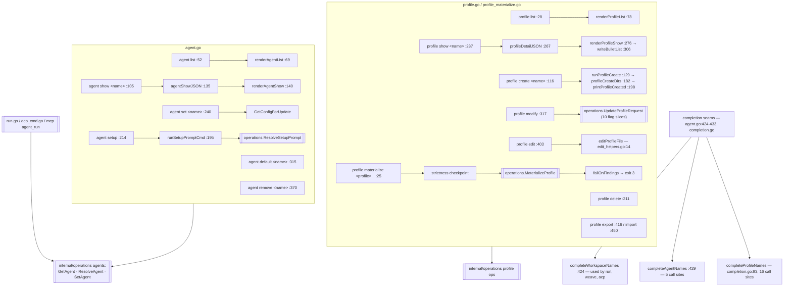

# `ctxloom profile` and `ctxloom agent`

A **profile** is a named, inheritable composition of fragments, commands, skills,
MCP servers and hooks — the unit `ctxloom run -p` and every agent binding
compose. An **agent** is a named local binding of `{profiles, engine, runtime,
workspace, permissions, driving, coordinator}` that `ctxloom run --agent`,
`ctxloom acp server --agent` and `agent_run` (MCP delegation) all resolve
through. Both trees are thin cobra frontends over `internal/operations`; the
resolution logic itself lives there, not here.

## Structure

## `ctxloom profile` (`profile.go:19`)

| Command | file:line | Flags |
|---|---|---|
| `list` | `:28` | Distinguishes "no profiles dir" from "dir exists, zero profiles" — the reason it is not a plain operations call |
| `create <name>` | `:116` | `--parents`, `--bundles`, plus description/fragment/command seeds |
| `delete <name>` | `:211` | — |
| `show <name>` | `:237` | Emits `profileDetailJSON` = the operations result + a `Default` bool |
| `modify <name>` | `:317` | 10 add/remove flag slices → one `UpdateProfileRequest` |
| `edit <name>` | `:403` | `$EDITOR` round-trip via `editProfileFile` |
| `export <name> <dest-dir>` | `:416` | — |
| `import <path>` | `:450` | — |
| `materialize <profile>...` | `profile_materialize.go:25` | `--target` (required) |

`profile materialize` is the model command in this package: it takes a
`strictness.Mark`, calls `operations.MaterializeProfile`, gates on
`failOnFindings` (exit 3 on a fatal surface-write finding), and renders through
an `iox.ErrWriter`. `operations.MaterializeProfile` rejects empty `Profiles` or
`Target`, and cobra enforces `MinimumNArgs(1)` plus the required flag — so there
is no path to a silent zero-payload materialize.

`renderProfileList`, `renderProfileShow` and `writeBulletList` (`:78`, `:276`,
`:306`) are pure, testable writers. `printProfileCreated` (`:198`) is the
exception — it takes `name, path` as parameters but reads
`profileCreateParents`/`profileCreateBundles` from package globals, so it cannot
be unit-tested without mutating package state.

## `ctxloom agent` (`agent.go:39`)

| Command | file:line | Notes |
|---|---|---|
| `list` | `:52` | `renderAgentList` prints a loud "No agents defined." on empty |
| `show <name>` | `:105` | Fault-tolerant: a resolution failure still prints the declared definition, with `Resolved engine: unavailable (…)` |
| `set <name>` | `:240` | `--engine`, `--profiles`, `--runtime`, `--workspace`, `--permissions`, `--driving`, `--coordinator`. Uses `GetConfigForUpdate` (I2) |
| `default [name]` | `:315` | Show or set `default_agent`; an undefined name gets an advisory `clidiag.Warn`, not an error |
| `remove <name>` | `:370` | — |
| `setup` | `:214` | Deprecated alias for `init prompt`; prints the five-phase setup body, augmented when config loads |

Completions registered at `agent.go:392`: runtime names via
`isolation.RuntimeNames()` (`:413`), driving modes via `agents.DrivingModeNames()`
(`:417`), workspace names via `completeWorkspaceNames` (`:424`, shared with `run`,
`weave` and `acp`), agent names via `completeAgentNames` (`:429`, 5 call sites).

### The completion seams (`completion.go`)

| Completer | file:line | Call sites | Degradation |
|---|---|---|---|
| `completeFragmentNames` | `:74` | 1 | returns nil on config error |
| `completeProfileNames` | `:93` | 16 | returns nil |
| `completeLLMNames` | `:115` | 7 | **falls back to `backends.List()`** — the odd one out |
| `completeTagNames` | `:127` | 1 | returns nil |
| `completePromptNames` | `:154` | 2 | returns nil |
| `filterPrefix` | `:173` | 7 | — |

`ctxloom completion [bash|zsh|fish|powershell]` (`completion.go:16`) writes the
shell script to `os.Stdout`, bypassing `emit()` by design.

## Invariants

- **An agent binding is authoritative for its axes.** When `--agent` is given,
  `run` takes the binding's profiles, engine and runtime rather than the
  flag/default path — and cobra enforces `--agent` exclusive with `-p`/`-f`/`-t`
  (`run.go:1608` block). `ResolveAgent` also applies the `--llm`-beats-declared-
  engine rule before `run` sees the result (`run.go:520,552`).
- **`agent set` mutates a fresh config.** Both `agent set` and `agent remove` go
  through `GetConfigForUpdate` so an abandoned edit cannot leak into the shared
  memoized config (I2).
- **Profile materialize is gated.** See above — the pattern the rest of the
  package should copy.
- **`agent show` never fails because resolution failed.** `rerr` from
  `operations.ResolveAgent` is deliberately not returned; the definition is still
  printed.

## Documented vs real

- `agent show --format json` drops the resolution failure the text renderer
  prints: `agentShowJSON` (`agent.go:135`) carries only `Definition` and
  `Resolved` (`omitempty`), so a JSON consumer sees a well-formed object with
  `resolved` absent and exit 0.
- `agent set` is documented as "update" and implemented as a **whole-record
  replace** (`internal/operations/agents.go:191`): unflagged fields are zeroed,
  and `SetAgentRequest` has no `Escalation` field at all, so re-running
  `agent set` to change one thing destroys the agent's declared approval-request
  ladder along with its engine and profiles.
- `agent default <undefined-name>` warns and still writes the value.
- `profile show` replaces the real error with `"profile %q not found"`
  (`profile.go:253`), so a YAML parse error or a permission error is reported as
  "not found".
- The `name == "help"` guard appears four times in `profile.go`
  (`:131,216,242,328`) and four times in `agent.go` (`:110,263,348,376`), making a
  profile or agent literally named `help` unaddressable — and `profile edit`
  (`:410`) omits it, so the idiom is not uniform even within one file.
- `profile create`, `delete`, `edit`, `modify`, `export`, `import`,
  `agent default`, `agent remove` and `agent setup` accept `--format` and ignore
  it; most write with bare `fmt.Printf` (`profile.go:206,231,443,479`).
- `format_coverage_test.go:294` skips `profile materialize` as "not wired to
  emit() yet" although `profile_materialize.go:62` calls `emit`.
- `discoverySessionPrompt` (`init.go:511`) and `runSetupPromptCmd`
  (`agent.go:195`) are two near-identical resolvers over the same
  `operations.ResolveSetupPrompt`.
