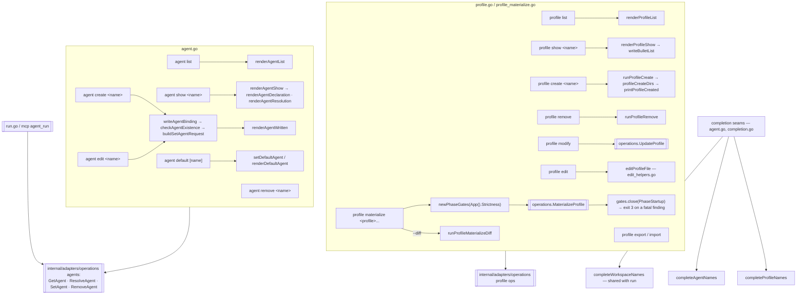

# `ctxloom profile` and `ctxloom agent`

A **profile** is a named, inheritable composition of fragments, commands, skills,
MCP servers and hooks — the unit `ctxloom run -p` and every agent binding
compose. An **agent** is a named local binding of profiles, engine, runtime,
permissions and the other axes `registerAgentWriteFlags` exposes, that
`ctxloom run --agent` and `agent_run` (MCP delegation) both resolve through.
Both trees are thin cobra frontends over `internal/adapters/operations`; the
resolution logic itself lives there, not here.

## Structure

```mermaid
flowchart TD
    subgraph prof["profile.go / profile_materialize.go"]
        PL["profile list"] --> RPL["renderProfileList"]
        PS["profile show &lt;name&gt;"] --> RPS["renderProfileShow → writeBulletList"]
        PC["profile create &lt;name&gt;"] --> RPC["runProfileCreate → profileCreateDirs → printProfileCreated"]
        PD["profile remove"] --> RPR["runProfileRemove"]
        PM["profile modify"] --> UPR[["operations.UpdateProfile"]]
        PE["profile edit"] --> EPF["editProfileFile — edit_helpers.go"]
        PX["profile export / import"]
        PMAT["profile materialize &lt;profile&gt;..."] --> GATES["newPhaseGates(App().Strictness)"] --> MP[["operations.MaterializeProfile"]] --> CLOSE["gates.close(PhaseStartup) → exit 3 on a fatal finding"]
        PMAT -->|"--diff"| PMD["runProfileMaterializeDiff"]
    end

    subgraph agent["agent.go"]
        AL["agent list"] --> RAL["renderAgentList"]
        AS["agent show &lt;name&gt;"] --> RAS["renderAgentShow → renderAgentDeclaration · renderAgentResolution"]
        AC["agent create &lt;name&gt;"] --> WAB["writeAgentBinding → checkAgentExistence → buildSetAgentRequest"]
        AE["agent edit &lt;name&gt;"] --> WAB
        WAB --> RAW["renderAgentWritten"]
        ADEF["agent default [name]"] --> SDA["setDefaultAgent / renderDefaultAgent"]
        AREM["agent remove &lt;name&gt;"]
    end

    OPSP[["internal/adapters/operations profile ops"]]
    OPSA[["internal/adapters/operations agents:<br/>GetAgent · ResolveAgent · SetAgent · RemoveAgent"]]
    prof --> OPSP
    agent --> OPSA

    COMP["completion seams — agent.go, completion.go"]
    COMP --> CWN["completeWorkspaceNames — shared with run"]
    COMP --> CAN["completeAgentNames"]
    COMP --> CPN["completeProfileNames"]

    RUN[["run.go / mcp agent_run"]] --> OPSA
```

## `ctxloom profile`

`profile list` distinguishes "no profiles dir" from "dir exists, zero
profiles" — the reason it is not a plain operations call. `profile modify`
folds its add/remove flag slices into one `operations.UpdateProfile` request.
`profile edit` is an `$EDITOR` round-trip via `editProfileFile`.

`profile materialize` is the model command in this package: it opens the
strictness gates (`newPhaseGates` over `App().Strictness`), calls
`operations.MaterializeProfile`, closes the startup phase (exit 3 on a fatal
surface-write finding unless `--degraded` downgrades it — mirroring how `run`
gates its own startup findings), and renders through an `iox.ErrWriter`.
`operations.MaterializeProfile` rejects empty `Profiles` or `Target`, and cobra
enforces `MinimumNArgs(1)` — so there is no path to a silent zero-payload
materialize. `--diff` compares instead of writing.

`renderProfileList`, `renderProfileShow` and `writeBulletList` are pure,
testable writers.

## `ctxloom agent`

- `list` — `renderAgentList` prints a loud "No agents defined." on empty.
- `show <name>` — fault-tolerant: a resolution failure still prints the
  declared definition, with `Resolved engine: unavailable (…)` in text and a
  `ResolutionError` field in structured output.
- `create <name>` / `edit <name>` — one write path (`writeAgentBinding`), split
  into two verbs by `checkAgentExistence` so that "make a new binding" and
  "change an existing one" cannot be confused: `create` refuses a name that
  exists, `edit` refuses one that does not.
- `default [name]` — show or set `default_agent`; an undefined name gets an
  advisory `clidiag.Warn` (a bare `ctxloom run` will degrade to empty context
  until it is defined), not an error.
- `remove <name>`.

Completions: runtime names via `isolation.RuntimeNames()`, workspace names via
`completeWorkspaceNames` (shared with `run`), agent names via
`completeAgentNames`.

### The completion seams (`completion.go`)

`completeFragmentNames`, `completeProfileNames`, `completeTagNames`,
`completePromptNames` all return nil on a config error; `completeLLMNames` is
the odd one out — it falls back to `operations.EngineNames()`. `filterPrefix`
is the shared prefix filter. `ctxloom completion <shell>` writes the shell
script to `os.Stdout`, bypassing `emit()` by design.

## Invariants

- **An agent binding is authoritative for its axes.** When `--agent` is given,
  `run` takes the binding's profiles, engine and runtime rather than the
  flag/default path — and cobra enforces `--agent` mutually exclusive with
  `--profile`/`--fragment`/`--tag` (`MarkFlagsMutuallyExclusive` in `run.go`).
- **Profile materialize is gated.** See above — the pattern the rest of the
  package should copy.
- **`agent show` never fails because resolution failed.** The error from
  `operations.ResolveAgent` is deliberately not returned; the definition is still
  printed.
