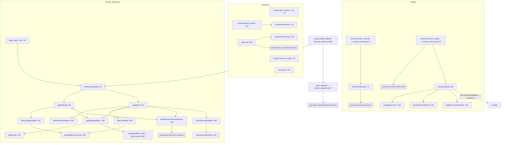

# `ctxloom remote` — the dependency lifecycle

`ctxloom remote` manages the git repositories bundles are pulled from and the
lockfile that pins what was pulled. Nine subcommands cover the whole lifecycle:
register a remote, browse or discover its catalog, pull dependencies at their
pinned commits, detect and apply updates within a version constraint, advance
unheld pins, and clean up content that vanished upstream. The tree is a thin
frontend over `internal/operations` and `internal/remote` — with one exception,
`remote_update.go`, which carries real logic: reference resolution, network
refresh, lockfile mutation, destructive local cleanup, and six report printers in
one 651-line file.

## Structure

## Commands

| Command | file:line | Flags |
|---|---|---|
| `remote add <name> <url>` | `remote.go:44` | forge/auth options; surfaces the add warning |
| `remote remove <name>` | `:92` | — |
| `remote list` | `:115` | — |
| `remote default <name>` | `:157` | Set or clear the default remote |
| `deps pull` | `:209` | `--lock` (default true) |
| `remote browse <remote>` | `remote_browse.go:17` | `-r/--recursive` (default **true**) |
| `remote discover [query]` | `remote_discover.go:25` | `--source`, plus 2 more |
| `deps check [reference]` | `remote_update.go:25` | `--force`, `--cleanup`, plus 1 more |
| `deps upgrade` | `remote_upgrade.go:17` | — |

## Update mechanics

`deps check` has two modes sharing an apply phase:

- **Single ref** (`updateSingle:68`): parse the ref, refresh that one clone
  (`refreshRemoteClone:172`), resolve its status against the lockfile
  (`detectSingleUpdate:131`), report, optionally apply and clean up. A resolution
  failure here is a **returned error**.
- **Whole lockfile** (`updateAll:210`): refresh each unique repo once
  (`refreshRemoteRepos:319`), resolve every entry (`detectUpdates:350`), print the
  pending list, optionally apply, then report removals and missing default
  profiles.

`latestWithinConstraint` (`:402`) is where a version selector meets the fetched
tag/commit list. `applyUpdateBatch` (`:434`) pulls each update at its pinned SHA
through the `pullRunner` interface (`:312`, a genuine consumer-side test seam
with a fake at 5 call sites) and classifies each failure into `pullOutcome`
(`:587`): failed / skipped / removed-from-remote, via `errors.Is` on
`errs.ErrCancelled` and `errs.ErrRemoteContentNotFound`.

`updateInfo` (`:276`) carries a detected update from detect to apply. Its seven
fields split into a transport partition (`Type`, `Ref`, `CurrentSHA`,
`LatestSHA`, `RequestedVersion`) and a display-only partition (`Kind`, `Version`,
read only by `selectorLabel:292`) — and `detectSingleUpdate` populates only the
first, `detectUpdates` both.

## Invariants

- **Each repo is git-fetched at most once per `deps check`.**
  `refreshRemoteRepos` (`:319`) dedups by URL across lockfile entries.
- **Updates are applied at a pinned SHA**, never at a floating ref —
  `applyUpdateBatch` passes `LatestSHA` into `PullOptions`.
- **Refresh failures are best-effort and never fatal**: a `git fetch` that fails
  warns and the run continues against the existing clone.
- **`deps check` and `deps upgrade` tolerate an unloadable config** by
  design: both use `loadConfigOrFallback` (`startup_helpers.go:30`), which warns
  and substitutes a minimal `.ctxloom`-rooted fixture. They are the only two
  commands that do.
- **Destructive cleanup is opt-in.** `reportRemovedFromRemote` (`:481`) only
  deletes local files and prunes the lockfile under `--cleanup`;
  `RemoveLocalItems` always appends to `res.Pruned`, so the report can never say
  "Cleaning up local files…" and then print nothing.

## Documented vs real

- **None of the nine `remote` commands calls `emit()`** (`rg 'emit\(' internal/cli/remote_*.go`
  → zero hits). All write with `fmt.Printf` to raw `os.Stdout`, so `--format json`
  is accepted and answered with an ASCII table, and the commands have no
  output-capture seam.
- `deps pull` returns `nil` unconditionally after `renderPullSummary`
  (`:237-238`), so a pull with `result.Errors > 0` or a non-empty `Retracted`
  list exits 0 — the failures are printed to stdout only.
- `deps check` prints **"All items are up to date!"** when every entry's
  resolution *failed*: `latestWithinConstraint` collapses `ParseRepoURL` and
  `ResolveConstraint` errors into a bare `ok=false` (`:405,:408`), and
  `detectUpdates` silently `continue`s on that plus `ParseReference` (`:377`) and
  fetcher-construction (`:385`) errors. `updateSingle` treats the identical
  condition as a hard error (`:146`), so the two paths disagree.
- `deps upgrade` prints "Everything is up to date." when part of the dependency
  closure could not be expanded: `operations.UpgradeDependencies` returns only
  `(int, error)`, an unreachable parent profile lands in `unexpanded` with no
  error, and the side-channel warning is itself gated on `preserved > 0`
  (`internal/operations/upgrade.go:85-87`).
- `remote discover` prints "No ctxloom repositories found." and exits 0 when the
  forge search failed entirely — `operations.DiscoverRemotes` puts the error in
  `result.Errors` and returns a nil error with `Count: 0`.
- `remote browse` warns on a `BrowseRemote` error, `continue`s, and then prints
  "No bundles found in `<remote>`" and exits 0 (`remote_browse.go:42-50,77-80`).
  The loop it `continue`s in iterates a hard-coded one-element slice
  (`types := []string{"bundle"}`, `:37`) with a `len(types) > 1` branch that can
  never be true — leftover scaffolding from when profiles were browsable
  separately.
- `interactiveAdd` (`remote_discover.go:110`) opens its own
  `bufio.NewReader(os.Stdin)`, the only violation of invariant I3
  ([terminal-and-prompts.md](terminal-and-prompts.md)). It is also entered with no
  TTY check, so piping `ctxloom remote discover` writes the prompt into the
  captured output. `promptRemoteName:151` discards the read error, turning EOF
  into "user accepted the default name", while its neighbour `readRepoChoice:131`
  treats the identical error as an explicit quit.
- `reportRemovedFromRemote:509` discards the error return of
  `operations.RemoveLocalItems` — latent today because that function returns nil
  on every path.
- `applyUpdateBatch` and `reportRemovedFromRemote` accept `out`/`fs`/`appDir` as
  injected seams but read the package globals `updateForce` (`:449`) and
  `updateCleanup` (`:491`) for their decisive branch, so tests must mutate and
  restore process state.
- `checkDefaultProfiles:613` returns `nil` when `config.Load()` fails, so "config
  broken" is reported as "no missing profiles". It also loads config afresh even
  though `updateAll` already holds one.
- `reportBundleIssues` (`:529`, 29 lines) has zero production call sites — only
  two calls in `remote_update_apply_test.go`.
- `refreshRemoteClone` (`:172`) is `refreshRemoteRepos` (`:319`) specialised to
  one URL; the bodies are the same. `shortSHA` (`:573`) is a third copy of the
  same 4-line truncation (also in `internal/operations/helpers.go:17` and
  `internal/shared/tasks/triggers/prompt.go:219`).
- `-r/--recursive` on `remote browse` defaults to `true`, so passing `-r` does
  nothing and the only way to get non-recursive behaviour is `--recursive=false`.
- `remote.go:301` assigns `remotePullLock = true` immediately before
  `BoolVar(&remotePullLock, "lock", true, …)` sets the same value.
- The `pullOutcome` doc comment (`:580-586`) describes substring matching and
  argues the sentinels are unreliable; the implementation at `:599-603` is pure
  `errors.Is`.
