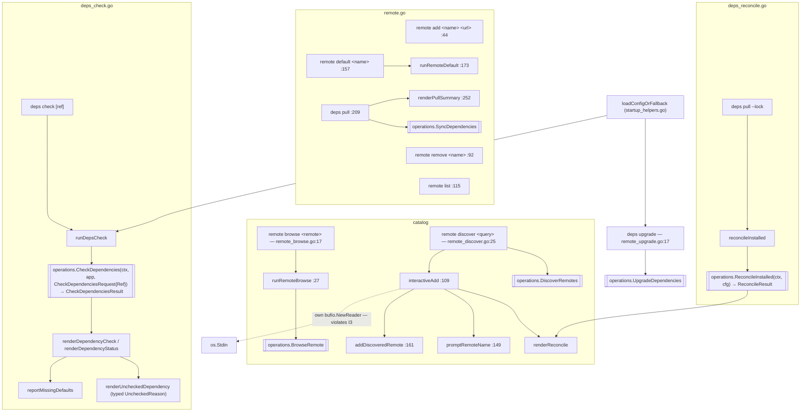

# `ctxloom remote` — the dependency lifecycle

`ctxloom remote` manages the git repositories bundles are pulled from and the
lockfile that pins what was pulled. Nine subcommands cover the whole lifecycle:
register a remote, browse or discover its catalog, pull dependencies at their
pinned commits, detect and apply updates within a version constraint, advance
unheld pins, and clean up content that vanished upstream. The tree is a
frontend over `internal/adapters/operations`: `deps check` renders
`operations.CheckDependencies`, `deps pull`'s tidy-up renders
`operations.ReconcileInstalled`, and `deps upgrade` is
`operations.UpgradeDependencies`.

## Structure

```mermaid
flowchart TD
    subgraph basic["remote.go"]
        RA["remote add &lt;name&gt; &lt;url&gt; :44"]
        RR["remote remove &lt;name&gt; :92"]
        RL["remote list :115"]
        RD["remote default &lt;name&gt; :157"] --> RRD["runRemoteDefault :173"]
        RP["deps pull :209"] --> RPS["renderPullSummary :252"]
        RP --> SD[["operations.SyncDependencies"]]
    end

    subgraph browse["catalog"]
        RB["remote browse &lt;remote&gt; — remote_browse.go:17"] --> RRB["runRemoteBrowse :27"] --> BR[["operations.BrowseRemote"]]
        RDISC["remote discover &lt;query&gt; — remote_discover.go:25"] --> DR[["operations.DiscoverRemotes"]]
        RDISC --> IA["interactiveAdd :109"] --> RRC["readRepoChoice :129"]
        IA --> PRN["promptRemoteName :149"]
        IA --> ADR["addDiscoveredRemote :161"]
    end

    subgraph check["deps_check.go"]
        RU["deps check [ref]"] --> RDC["runDepsCheck"] --> OCD[["operations.CheckDependencies(ctx, app, CheckDependenciesRequest{Ref}) → CheckDependenciesResult"]]
        OCD --> RDCK["renderDependencyCheck / renderDependencyStatus"]
        RDCK --> RUD["renderUncheckedDependency (typed UncheckedReason)"]
        RDCK --> RMD["reportMissingDefaults"]
    end

    subgraph reconcile["deps_reconcile.go"]
        DP["deps pull --lock"] --> RCI["reconcileInstalled"] --> ORI[["operations.ReconcileInstalled(ctx, cfg) → ReconcileResult"]]
        ORI --> RRC["renderReconcile"]
    end

    RUP["deps upgrade — remote_upgrade.go:17"] --> UD[["operations.UpgradeDependencies"]]

    LCF["loadConfigOrFallback (startup_helpers.go)"] --> RDC
    LCF --> RUP
    STDIN["os.Stdin"]
    IA -.->|"own bufio.NewReader — violates I3"| STDIN
```

## Commands

| Command | file:line | Flags |
|---|---|---|
| `remote add <name> <url>` | `remote.go:44` | forge/auth options; surfaces the add warning |
| `remote remove <name>` | `:92` | — |
| `remote list` | `:115` | — |
| `remote default <name>` | `:157` | Set or clear the default remote |
| `deps pull` | `:209` | `--lock` (default true) |
| `remote browse <remote>` | `remote_browse.go:17` | `-r/--recursive` (default **true**) |
| `remote discover [query]` | `remote_discover.go:25` | `--source`, plus 2 more |
| `deps check [reference]` | `deps_check.go` | — |
| `deps upgrade` | `remote_upgrade.go:17` | — |

## Update mechanics

`deps check` is `operations.CheckDependencies`, rendered by
`renderDependencyCheck` (the whole lockfile) or `renderDependencyStatus` (one
reference); the CLI prints and decides nothing.

- **Single ref** (`CheckDependenciesRequest.Ref`): the service parses the
  reference (`parseCheckRef` is the ONE rejection point — a reference with no
  repository URL is refused there, with that reason), refreshes that one
  clone, resolves its status against the lockfile constraint-aware
  (`detectSingleUpdate`) and returns a `DependencyStatus`. A resolution
  failure is a **returned error**.
- **Whole lockfile**: the service refreshes each unique repo once
  (`refreshRemoteRepos`), resolves every entry (`detectUpdates`) and returns
  the updates, the empty-SHA count and — instead of a silent `continue` —
  every entry it could NOT check as an `UncheckedDependency` with a typed
  `UncheckedReason` (unparseable, no repository URL, unreachable,
  unresolvable), in lockfile order. The renderer says "up to date" only when
  nothing was unchecked.

`latestWithinConstraint` is where a version selector meets the fetched
tag/commit list; an exact tag/SHA pin resolves to itself and is never fetched
for. `DependencyUpdate` carries a detected update with its selector
(`SelectorLabel`) for the listing. Advancing pins is `deps upgrade`'s
(`operations.UpgradeDependencies`), never `deps check`'s.

`deps pull --lock` finishes with `operations.ReconcileInstalled`, which removes
dependencies upstream demonstrably no longer serves under THE EVIDENCE RULE
(reachability proved per repository before any item is asked about; a
not-found from an unproven repository is never authority) and returns the
plan for `renderReconcile`.

## Invariants

- **Each repo is git-fetched at most once per `deps check`.**
  `refreshRemoteRepos` dedups by URL across lockfile entries.
- **Refresh failures are best-effort and never fatal**: a `git fetch` that
  fails is a `RefreshFailure` row the CLI warns about, and the check continues
  against the existing clone.
- **`deps check` and `deps upgrade` tolerate an unloadable config** by
  design: both use `loadConfigOrFallback`, which warns and substitutes a
  minimal `.ctxloom`-rooted fixture (`CheckDependencies` proceeds over the
  same fixture and reports the load error as the reason the default profiles
  could not be checked).

## Documented vs real

- **None of the nine `remote` commands calls `emit()`** (`rg 'emit\(' internal/adapters/cli/remote_*.go`
  → zero hits). All write with `fmt.Printf` to raw `os.Stdout`, so `--format json`
  is accepted and answered with an ASCII table, and the commands have no
  output-capture seam.
- `deps pull` returns `nil` unconditionally after `renderPullSummary`
  (`:237-238`), so a pull with `result.Errors > 0` or a non-empty `Retracted`
  list exits 0 — the failures are printed to stdout only.
- `deps upgrade` prints "Everything is up to date." when part of the dependency
  closure could not be expanded: `operations.UpgradeDependencies` returns only
  `(int, error)`, an unreachable parent profile lands in `unexpanded` with no
  error, and the side-channel warning is itself gated on `preserved > 0`
  (`internal/adapters/operations/upgrade.go:85-87`).
- `remote discover` prints "No ctxloom repositories found." and exits 0 when the
  forge search failed entirely — `operations.DiscoverRemotes` puts the error in
  `result.Errors` and returns a nil error with `Count: 0`.
- `remote browse` warns on a `BrowseRemote` error, `continue`s, and then prints
  "No bundles found in `<remote>`" and exits 0 (`remote_browse.go:42-50,77-80`).
  The loop it `continue`s in iterates a hard-coded one-element slice
  (`types := []string{"bundle"}`, `:37`) with a `len(types) > 1` branch that can
  never be true — leftover scaffolding from when profiles were browsable
  separately.
- `interactiveAdd` (`remote_discover.go:110`) opens its own
  `bufio.NewReader(os.Stdin)`, the only violation of invariant I3
  ([terminal-and-prompts.md](terminal-and-prompts.md)). It is also entered with no
  TTY check, so piping `ctxloom remote discover` writes the prompt into the
  captured output. `promptRemoteName:151` discards the read error, turning EOF
  into "user accepted the default name", while its neighbour `readRepoChoice:131`
  treats the identical error as an explicit quit.
- `-r/--recursive` on `remote browse` defaults to `true`, so passing `-r` does
  nothing and the only way to get non-recursive behaviour is `--recursive=false`.
- `remote.go:301` assigns `remotePullLock = true` immediately before
  `BoolVar(&remotePullLock, "lock", true, …)` sets the same value.
- The `pullOutcome` doc comment (`:580-586`) describes substring matching and
  argues the sentinels are unreliable; the implementation at `:599-603` is pure
  `errors.Is`.
