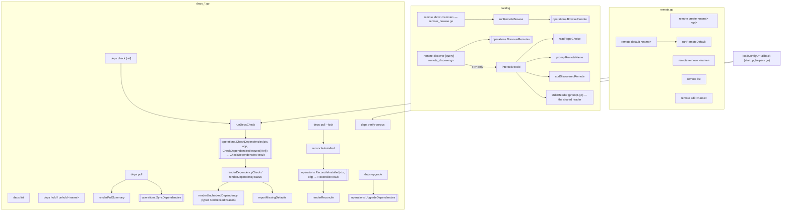

# `ctxloom remote` — the dependency lifecycle

`ctxloom remote` manages the git repositories bundles are pulled from, and
`ctxloom deps` the lockfile that pins what was pulled. Between them they cover
the whole lifecycle: register a remote, show or discover its catalog, pull
dependencies at their pinned commits, detect and apply updates within a
version constraint, hold and advance pins, and clean up content that vanished
upstream. The tree is a
frontend over `internal/adapters/operations`: `deps check` renders
`operations.CheckDependencies`, `deps pull`'s tidy-up renders
`operations.ReconcileInstalled`, and `deps upgrade` is
`operations.UpgradeDependencies`.

## Structure

```mermaid
flowchart TD
    subgraph basic["remote.go"]
        RA["remote create &lt;name&gt; &lt;url&gt;"]
        RR["remote remove &lt;name&gt;"]
        RL["remote list"]
        RE["remote edit &lt;name&gt;"]
        RD["remote default &lt;name&gt;"] --> RRD["runRemoteDefault"]
    end

    subgraph browse["catalog"]
        RB["remote show &lt;remote&gt; — remote_browse.go"] --> RRB["runRemoteBrowse"] --> BR[["operations.BrowseRemote"]]
        RDISC["remote discover [query] — remote_discover.go"] --> DR[["operations.DiscoverRemotes"]]
        RDISC -->|"TTY only"| IA["interactiveAdd"] --> RRC["readRepoChoice"]
        IA --> PRN["promptRemoteName"]
        IA --> ADR["addDiscoveredRemote"]
        IA --> SR["stdinReader (prompt.go) — the shared reader"]
    end

    subgraph deps["deps_*.go"]
        DL["deps list"]
        DH["deps hold / unhold &lt;name&gt;"]
        RP["deps pull"] --> RPS["renderPullSummary"]
        RP --> SD[["operations.SyncDependencies"]]
        RU["deps check [ref]"] --> RDC["runDepsCheck"] --> OCD[["operations.CheckDependencies(ctx, app, CheckDependenciesRequest{Ref}) → CheckDependenciesResult"]]
        OCD --> RDCK["renderDependencyCheck / renderDependencyStatus"]
        RDCK --> RUD["renderUncheckedDependency (typed UncheckedReason)"]
        RDCK --> RMD["reportMissingDefaults"]
        DP["deps pull --lock"] --> RCI["reconcileInstalled"] --> ORI[["operations.ReconcileInstalled(ctx, cfg) → ReconcileResult"]]
        ORI --> RRC2["renderReconcile"]
        RUP["deps upgrade"] --> UD[["operations.UpgradeDependencies"]]
        DVC["deps verify-corpus"]
    end

    LCF["loadConfigOrFallback (startup_helpers.go)"] --> RDC
    LCF --> DVC
```

## Update mechanics

`deps check` is `operations.CheckDependencies`, rendered by
`renderDependencyCheck` (the whole lockfile) or `renderDependencyStatus` (one
reference); the CLI prints and decides nothing.

- **Single ref** (`CheckDependenciesRequest.Ref`): the service parses the
  reference (`parseCheckRef` is the ONE rejection point — a reference with no
  repository URL is refused there, with that reason), refreshes that one
  clone, resolves its status against the lockfile constraint-aware
  (`detectSingleUpdate`) and returns a `DependencyStatus`. A resolution
  failure is a **returned error**.
- **Whole lockfile**: the service refreshes each unique repo once
  (`refreshRemoteRepos`), resolves every entry (`detectUpdates`) and returns
  the updates, the empty-SHA count and — instead of a silent `continue` —
  every entry it could NOT check as an `UncheckedDependency` with a typed
  `UncheckedReason` (unparseable, no repository URL, unreachable,
  unresolvable), in lockfile order. The renderer says "up to date" only when
  nothing was unchecked.

`latestWithinConstraint` is where a version selector meets the fetched
tag/commit list; an exact tag/SHA pin resolves to itself and is never fetched
for. `DependencyUpdate` carries a detected update with its selector
(`SelectorLabel`) for the listing. Advancing pins is `deps upgrade`'s
(`operations.UpgradeDependencies`), never `deps check`'s.

`deps pull --lock` finishes with `operations.ReconcileInstalled`, which removes
dependencies upstream demonstrably no longer serves under THE EVIDENCE RULE
(reachability proved per repository before any item is asked about; a
not-found from an unproven repository is never authority) and returns the
plan for `renderReconcile`.

## Invariants

- **Each repo is git-fetched at most once per `deps check`.**
  `refreshRemoteRepos` dedups by URL across lockfile entries.
- **Refresh failures are best-effort and never fatal**: a `git fetch` that
  fails is a `RefreshFailure` row the CLI warns about, and the check continues
  against the existing clone.
- **`deps check` tolerates an unloadable config** by design: it uses
  `loadConfigOrFallback`, which warns and substitutes a minimal
  `.ctxloom`-rooted fixture (`CheckDependencies` proceeds over the same fixture
  and reports the load error as the reason the default profiles could not be
  checked). `deps upgrade` deliberately does **not**: a command that advances
  pins must not run over a substitute config.
- **`remote discover`'s interactive add is TTY-gated and reads through the
  shared `stdinReader`**, so a piped invocation never sees a prompt and no
  second buffered reader competes for stdin
  ([terminal-and-prompts.md](terminal-and-prompts.md)).
